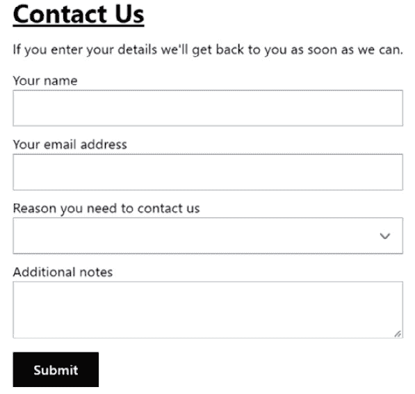
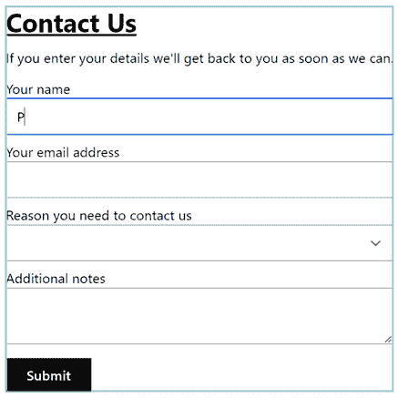
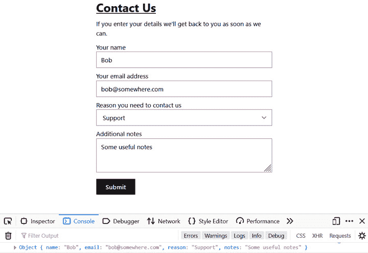
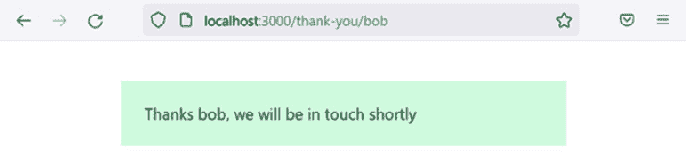
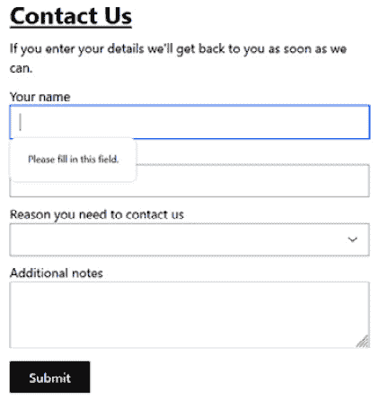
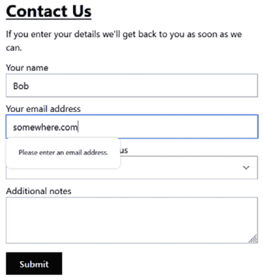
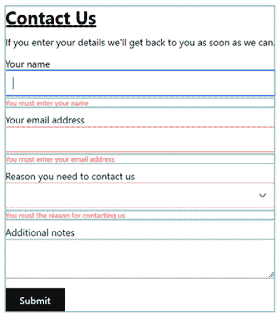

# 7

# 使用表单

表单在应用程序中非常常见，因此能够高效地实现它们至关重要。在某些应用程序中，表单可能很大且复杂，使它们表现良好是一项挑战。

在本章中，我们将学习如何使用不同的方法在 React 中构建表单。我们将制作的示例表单是您在公司网站上经常看到的联系表单。它将包含一些字段和一些验证逻辑。

构建表单的第一种方法是将字段值存储在状态中。我们将看到这种方法如何使代码膨胀并影响性能。接下来，我们将采用浏览器原生表单功能的方法，减少所需代码量并提高性能。然后我们将使用 React Router 的`Form`组件，这在*第六章*中简要介绍过，*使用 React Router 进行路由*。最后一种方法将是使用一个名为**React Hook Form**的流行库。我们将体验 React Hook Form 如何帮助我们实现表单验证和提交逻辑，同时保持出色的性能。

我们将涵盖以下主题：

+   使用受控字段

+   使用非受控字段

+   使用 React Router Form

+   使用原生验证

+   使用 React Hook Form

# 技术要求

在本章中，我们将使用以下技术：

+   **浏览器**：一个现代浏览器，如 Google Chrome

+   **Node.js**和**npm**：您可以从 [`nodejs.org/en/download/`](https://nodejs.org/en/download/) 安装它们。

+   **Visual Studio Code**: 您可以从 [`code.visualstudio.com/`](https://code.visualstudio.com/) 安装它。

本章中的所有代码片段都可以在[`github.com/PacktPublishing/Learn-React-with-TypeScript-2nd-Edition/tree/main/Chapter7`](https://github.com/PacktPublishing/Learn-React-with-TypeScript-2nd-Edition/tree/main/Chapter7)上找到。

# 使用受控字段

在本节中，我们将构建我们联系表单的第一个版本。它将包含用户姓名、电子邮件地址、联系原因以及用户可能希望添加的任何附加注释字段。

此方法将涉及使用**受控字段**，即字段值存储在状态中。我们将使用这种方法来实现表单 - 然而，在这样做的时候，我们将注意所需代码量及其对性能的负面影响；这将帮助您了解为什么其他方法更好。

要开始，首先，我们需要创建一个 React 和 TypeScript 项目，就像之前的章节一样。

## 创建项目

我们将使用 Visual Studio Code 和一个新的 Create React App 项目设置来开发表单。我们之前已经多次介绍过这一点，所以本章中不会介绍步骤 - 相反，请参阅*第三章*，*设置 React 和 TypeScript*。创建一个名为您选择的联系表单的项目。

我们将使用 Tailwind CSS 来设置表单样式。我们之前在*第五章*，“前端样式化方法”中介绍了如何在 Create React App 中安装和配置 Tailwind，所以在你创建了 React 和 TypeScript 项目之后，安装并配置 Tailwind。

我们将使用 Tailwind 插件来帮助我们设置表单样式——它为字段元素提供了开箱即用的样式。按照以下步骤安装和配置此插件：

1.  在终端中运行以下命令来安装此插件：

    ```js
    npm i -D @tailwindcss/forms
    ```

1.  打开 `tailwind.config.js` 来配置插件。将高亮代码添加到该文件中，以告诉 Tailwind 使用我们刚刚安装的表单插件：

    ```js
    module.exports = {
    ```

    ```js
      content: ['./src/**/*.{js,jsx,ts,tsx}'],
    ```

    ```js
      theme: {
    ```

    ```js
        extend: {},
    ```

    ```js
      },
    ```

    ```js
      plugins: [require('@tailwindcss/forms')],
    ```

    ```js
    };
    ```

这完成了项目设置。接下来，我们将创建表单的第一个版本。

## 创建联系表单

现在，按照以下步骤创建联系表单的第一个版本：

1.  在 `src` 文件夹中创建一个名为 `ContactPage.tsx` 的文件，并包含以下 `import` 语句：

    ```js
    import { useState, FormEvent } from 'react';
    ```

我们已经从 React 中导入了 `useState` 钩子和 `FormEvent` 类型，我们最终将在实现中使用它们。

1.  在导入语句下添加以下 `type` 别名。此类型将代表所有字段值：

    ```js
    type Contact = {
    ```

    ```js
      name: string;
    ```

    ```js
      email: string;
    ```

    ```js
      reason: string;
    ```

    ```js
      notes: string;
    ```

    ```js
    };
    ```

1.  添加以下 `function` 组件：

    ```js
    export function ContactPage() {
    ```

    ```js
      return (
    ```

    ```js
        <div className="flex flex-col py-10 max-w-md       mx-auto">
    ```

    ```js
          <h2 className="text-3xl font-bold underline         mb-3">Contact Us</h2>
    ```

    ```js
          <p className="mb-3">
    ```

    ```js
            If you enter your details we'll get back to you           as soon as we
    ```

    ```js
            can.
    ```

    ```js
          </p>
    ```

    ```js
          <form></form>
    ```

    ```js
        </div>
    ```

    ```js
      );
    ```

    ```js
    }
    ```

这将在页面上水平居中显示一个标题和一些说明。

1.  在 `form` 元素内部添加以下字段：

    ```js
    <form ...>
    ```

    ```js
      <div>
    ```

    ```js
        <label htmlFor="name">Your name</label>
    ```

    ```js
        <input type="text" id="name" />
    ```

    ```js
      </div>
    ```

    ```js
      <div>
    ```

    ```js
        <label htmlFor="email">Your email address</label>
    ```

    ```js
        <input type="email" id="email" />
    ```

    ```js
      </div>
    ```

    ```js
      <div>
    ```

    ```js
        <label htmlFor="reason">Reason you need to contact       us</label>
    ```

    ```js
        <select id="reason">
    ```

    ```js
          <option value=""></option>
    ```

    ```js
          <option value="Support">Support</option>
    ```

    ```js
          <option value="Feedback">Feedback</option>
    ```

    ```js
          <option value="Other">Other</option>
    ```

    ```js
        </select>
    ```

    ```js
      </div>
    ```

    ```js
      <div>
    ```

    ```js
        <label htmlFor="notes">Additional notes</label>
    ```

    ```js
        <textarea id="notes" />
    ```

    ```js
      </div>
    ```

    ```js
    </form>
    ```

我们添加了用户姓名、电子邮件地址、联系原因和附加注释的字段。每个字段标签都与它的编辑器相关联，通过将 `htmlFor` 属性设置为编辑器的 `id` 值来实现。这有助于辅助技术，如屏幕阅读器，在字段获得焦点时读出标签。

1.  按以下方式在 `form` 元素的底部添加一个 `submit` 按钮：

    ```js
    <form ...>
    ```

    ```js
      ...
    ```

    ```js
      <div>
    ```

    ```js
        <button
    ```

    ```js
          type="submit"
    ```

    ```js
          className="mt-2 h-10 px-6 font-semibold bg-black         text-white"
    ```

    ```js
        >
    ```

    ```js
          Submit
    ```

    ```js
        </button>
    ```

    ```js
      </div>
    ```

    ```js
    </form>
    ```

1.  字段容器都将具有相同的样式，因此创建一个变量来存储样式，并将其分配给所有字段容器，如下所示：

    ```js
    const fieldStyle = "flex flex-col mb-2";
    ```

    ```js
    return (
    ```

    ```js
      <div ...>
    ```

    ```js
        ...
    ```

    ```js
        <form ...>
    ```

    ```js
          <div className={fieldStyle}>...</div>
    ```

    ```js
          <div className={fieldStyle}>...</div>
    ```

    ```js
          <div className={fieldStyle}>...</div>
    ```

    ```js
          <div className={fieldStyle}>...</div>
    ```

    ```js
          <div>
    ```

    ```js
            <button
    ```

    ```js
              type="submit"
    ```

    ```js
              className="mt-2 h-10 px-6 font-semibold             bg-black text-white"
    ```

    ```js
            >
    ```

    ```js
              Submit
    ```

    ```js
            </button>
    ```

    ```js
          </div>
    ```

    ```js
        </form>
    ```

    ```js
      </div>
    ```

    ```js
    );
    ```

现在字段已经使用垂直流动的 flexbox 和每个字段下方的小边距进行了很好的样式化。

1.  按以下方式添加用于存储字段值的 `state`：

    ```js
    export function ContactPage() {
    ```

    ```js
      const [contact, setContact] = useState<Contact>({
    ```

    ```js
        name: "",
    ```

    ```js
        email: "",
    ```

    ```js
        reason: "",
    ```

    ```js
        notes: "",
    ```

    ```js
      });
    ```

    ```js
      const fieldStyle = ...;
    ```

    ```js
      ...
    ```

    ```js
    }
    ```

我们已经给状态赋予了之前创建的 `Contact` 类型，并将字段值初始化为空字符串。

1.  按以下方式将状态绑定到 `name` 字段编辑器：

    ```js
    <div className={fieldStyle}>
    ```

    ```js
      <label htmlFor="name">Your name</label>
    ```

    ```js
      <input
    ```

    ```js
        type="text"
    ```

    ```js
        id="name"
    ```

    ```js
        value={contact.name}
    ```

    ```js
        onChange={(e) =>
    ```

    ```js
          setContact({ ...contact, name: e.target.value })
    ```

    ```js
        }
    ```

    ```js
      />
    ```

    ```js
    </div>
    ```

`value` 设置为状态的当前值。当用户填写输入元素时，会触发 `onChange`，我们使用它来更新状态值。为了构建新的状态对象，我们克隆当前状态，并用 `onChange` 参数中的新值覆盖其 `name` 属性。

1.  按照相同的方法将状态绑定到其他字段编辑器，如下所示：

    ```js
    <div className={fieldStyle}>
    ```

    ```js
      ...
    ```

    ```js
      <input
    ```

    ```js
        type="email"
    ```

    ```js
        id="email"
    ```

    ```js
        value={contact.email}
    ```

    ```js
        onChange={(e) =>
    ```

    ```js
          setContact({ ...contact, email: e.target.value })
    ```

    ```js
        }
    ```

    ```js
      />
    ```

    ```js
    </div>
    ```

    ```js
    <div className={fieldStyle}>
    ```

    ```js
      ...
    ```

    ```js
      <select
    ```

    ```js
        id="reason"
    ```

    ```js
        value={contact.reason}
    ```

    ```js
        onChange={(e) =>
    ```

    ```js
          setContact({ ...contact, reason: e.target.value })
    ```

    ```js
        }
    ```

    ```js
      >
    ```

    ```js
        ...
    ```

    ```js
      </select>
    ```

    ```js
    </div>
    ```

    ```js
    <div className={fieldStyle}>
    ```

    ```js
      ...
    ```

    ```js
      <textarea
    ```

    ```js
        id="notes"
    ```

    ```js
        value={contact.notes}
    ```

    ```js
        onChange={(e) =>
    ```

    ```js
          setContact({ ...contact, notes: e.target.value })
    ```

    ```js
        }
    ```

    ```js
      />
    ```

    ```js
    </div>
    ```

1.  按以下方式向 `form` 元素添加提交处理程序：

    ```js
    function handleSubmit(e: FormEvent<HTMLFormElement>) {
    ```

    ```js
      e.preventDefault();
    ```

    ```js
      console.log('Submitted details:', contact);
    ```

    ```js
    }
    ```

    ```js
    const fieldStyle = ...;
    ```

    ```js
    return (
    ```

    ```js
      <div>
    ```

    ```js
        ...
    ```

    ```js
        <form onSubmit={handleSubmit}>
    ```

    ```js
          ...
    ```

    ```js
        </form>
    ```

    ```js
      </div>
    ```

    ```js
    );
    ```

提交处理程序参数使用 React 的 `FormEvent` 类型。提交处理程序函数通过在处理程序参数上使用 `preventDefault` 方法来阻止表单被发送到服务器。而不是将表单发送到服务器，我们将 `contact` 状态输出到控制台。

1.  最后一步是在 `App` 组件中渲染 `ContactPage`。打开 `App.tsx` 并将其内容替换为以下内容：

    ```js
    import { ContactPage } from './ContactPage';
    ```

    ```js
    function App() {
    ```

    ```js
      return <ContactPage />;
    ```

    ```js
    }
    ```

    ```js
    export default App;
    ```

`App` 组件简单地渲染我们刚刚创建的 `ContactPage` 页面组件。`App` 组件也保持为默认导出，这样 `index.tsx` 就不会被破坏。

这样就完成了表单的第一轮迭代。我们现在将使用表单并发现一个潜在的性能问题。执行以下步骤：

1.  通过在终端中执行 `npm start` 来以开发模式运行应用。表单显示如下：



图 7.1 – 联系表单

1.  我们将使用 React DevTools 突出显示组件重新渲染，这将突出显示一个潜在的性能问题。

打开浏览器 DevTools 并选择**组件**面板。如果没有**组件**面板，请确保浏览器中已安装 React DevTools（参见*第三章*了解如何安装 React DevTools）。

点击设置齿轮图标以查看 React DevTools 设置，并勾选**在组件渲染时突出显示更新**选项。此选项将在页面中重新渲染的组件周围显示蓝色绿色轮廓。

1.  填写表单并注意每次在字段中输入字符时，表单周围都会出现蓝色绿色轮廓：



图 7.2 – 每次按键时的突出显示重新渲染

因此，每次在字段中输入字符时，整个表单都会重新渲染。这很有道理，因为字段变化时会发生状态变化，状态变化会导致重新渲染。在这个小型表单中这不是一个大问题，但在大型表单中可能会成为一个重大的性能问题。

1.  完成表单中的所有字段并点击**提交**按钮。字段值将输出到控制台。

这样就完成了表单的第一轮迭代。保持应用运行，我们反思实现并进入下一节。

本节的关键要点是，使用状态来控制字段值可能会导致性能问题。必须将状态绑定到每个字段也感觉有点重复。

接下来，我们将实现一个更高效、更简洁的表单版本。

# 使用非受控字段

**非受控字段**与受控字段相反 – 它是字段值**不由状态控制**的地方。相反，使用原生浏览器功能来获取字段值。在本节中，我们将重构联系表单以使用非受控字段，并查看其优势。

执行以下步骤：

1.  打开 `ContactPage.tsx` 并首先从 React 导入中移除 `useState`，因为现在不再需要它。

1.  然后，在 `component` 函数的顶部，移除对 `useState` 的调用（这次表单迭代将不使用任何状态）。

1.  从字段编辑器中移除 `value` 和 `onChange` 属性，因为我们不再使用状态来控制字段值。

1.  现在，在所有字段编辑器上添加`name`属性，如下所示：

    ```js
    <form onSubmit={handleSubmit}>
    ```

    ```js
      <div className={fieldStyle}>
    ```

    ```js
        <label htmlFor="name">Your name</label>
    ```

    ```js
        <input type="text" id="name" name="name" />
    ```

    ```js
      </div>
    ```

    ```js
      <div className={fieldStyle}>
    ```

    ```js
        <label htmlFor="email">Your email address</label>
    ```

    ```js
        <input type="email" id="email" name="email" />
    ```

    ```js
      </div>
    ```

    ```js
      <div className={fieldStyle}>
    ```

    ```js
        <label htmlFor="reason">
    ```

    ```js
          Reason you need to contact us
    ```

    ```js
        </label>
    ```

    ```js
        <select id="reason" name="reason">
    ```

    ```js
          ...
    ```

    ```js
        </select>
    ```

    ```js
      </div>
    ```

    ```js
      <div className={fieldStyle}>
    ```

    ```js
        <label htmlFor="notes">Additional notes</label>
    ```

    ```js
        <textarea id="notes" name="notes" />
    ```

    ```js
      </div>
    ```

    ```js
      ...
    ```

    ```js
    </form>;
    ```

`name`属性很重要，因为它将允许我们在表单提交处理程序中轻松提取字段值，这是我们接下来要做的。

1.  在提交处理程序中添加以下代码以在它们输出到控制台之前提取字段值：

    ```js
    function handleSubmit(e: FormEvent<HTMLFormElement>) {
    ```

    ```js
      e.preventDefault();
    ```

    ```js
      const formData = new FormData(e.currentTarget);
    ```

    ```js
      const contact = {
    ```

    ```js
        name: formData.get('name'),
    ```

    ```js
        email: formData.get('email'),
    ```

    ```js
        reason: formData.get('reason'),
    ```

    ```js
        notes: formData.get('notes'),
    ```

    ```js
      } as Contact;
    ```

    ```js
      console.log('Submitted details:', contact);
    ```

    ```js
    }
    ```

`FormData`是一个接口，允许访问表单中的值，并在其构造函数参数中接受一个表单元素。它包含一个`get`方法，该方法返回作为参数传递的名称的字段值。有关`FormData`的更多信息，请参阅[`developer.mozilla.org/en-US/docs/Web/API/FormData`](https://developer.mozilla.org/en-US/docs/Web/API/FormData)。

这样就完成了表单的重构。总结一下，非受控字段没有存储在状态中的值。相反，字段值是通过使用`FormData`获得的，这依赖于字段编辑器具有`name`属性。

注意与受控字段实现相比，实现中的代码更少。现在我们将尝试表单并检查表单是否在每次按键时重新渲染。执行以下步骤：

1.  在运行的应用程序中，确保 DevTools 仍然打开，并且**在组件渲染时突出显示更新**选项仍然勾选。

1.  填写表格后，你会发现重新渲染的轮廓从未出现。这很有道理，因为没有状态了，所以不会因为状态变化而重新渲染。

1.  完成表单中的所有字段并点击**提交**按钮。字段值将像之前一样输出到控制台。



图 7.3 – 完成的表单，提交数据在控制台中

1.  通过按*Ctrl* + *C*停止应用程序的运行。

因此，这种实现更短、性能更好，是简单表单的优秀方法。实现中的关键点是包括字段编辑器的`name`属性，并使用`FormData`接口提取表单值。

当前的实现虽然很简单 - 例如，没有提交成功消息。在下一节中，我们将使用 React Router 并添加提交消息。

# 使用 React Router Form

在*第六章*中，我们开始学习 React Router 的`Form`组件。我们了解到`Form`是 HTML `form`元素的包装器，用于处理表单提交。现在我们将更详细地介绍`Form`，并使用它在我们联系表单上提供漂亮的提交成功消息。

执行以下步骤：

1.  首先，在终端中执行以下命令来安装 React Router：

    ```js
    npm i react-router-dom
    ```

1.  现在，让我们创建一个`ThankYouPage`组件，它将通知用户他们的提交已成功。为此，在`src`文件夹中创建一个名为`ThankYouPage.tsx`的文件，内容如下：

    ```js
    import { useParams } from 'react-router-dom';
    ```

    ```js
    export function ThankYouPage() {
    ```

    ```js
      const { name } = useParams<{ name: string }>();
    ```

    ```js
      return (
    ```

    ```js
        <div className="flex flex-col py-10 max-w-md       mx-auto">
    ```

    ```js
          <div
    ```

    ```js
            role="alert"
    ```

    ```js
            className="bg-green-100 py-5 px-6 text-base text-          green-700 "
    ```

    ```js
          >
    ```

    ```js
            Thanks {name}, we will be in touch shortly
    ```

    ```js
          </div>
    ```

    ```js
        </div>
    ```

    ```js
      );
    ```

    ```js
    }
    ```

该组件使用一个路由参数来表示包含在感谢信息中的人名。

1.  接下来，打开 `App.tsx` 并从 React Router 中添加以下导入：

    ```js
    import {
    ```

    ```js
      createBrowserRouter,
    ```

    ```js
      RouterProvider,
    ```

    ```js
      Navigate
    ```

    ```js
    } from 'react-router-dom';
    ```

我们之前没有遇到过 React Router 的 `Navigate` 组件——它是一个执行导航的组件。我们将在 *步骤 5* 中使用它，在路由定义中，从根路径重定向到联系页面。

1.  将 `contactPageAction` 添加到 `ContactPage` 的 `import` 语句中，并导入 `ThankYouPage` 组件：

    ```js
    import {
    ```

    ```js
      ContactPage,
    ```

    ```js
      contactPageAction
    ```

    ```js
    } from './ContactPage';
    ```

    ```js
    import { ThankYouPage } from './ThankYouPage';
    ```

注意，`contactPageAction` 还不存在，因此将发生编译错误。我们将在 *步骤 9* 中解决这个问题。

1.  仍然在 `App.tsx` 中，设置渲染联系和感谢页面的路由：

    ```js
    const router = createBrowserRouter([
    ```

    ```js
      {
    ```

    ```js
        path: '/',
    ```

    ```js
        element: <Navigate to="contact" />,
    ```

    ```js
      },
    ```

    ```js
      {
    ```

    ```js
        path: '/contact',
    ```

    ```js
        element: <ContactPage />,
    ```

    ```js
        action: contactPageAction,
    ```

    ```js
      },
    ```

    ```js
      {
    ```

    ```js
        path: '/thank-you/:name',
    ```

    ```js
        element: <ThankYouPage />,
    ```

    ```js
      },
    ```

    ```js
    ]);
    ```

在 `contact` 路由上有一个我们尚未涉及的 `action` 属性——它处理表单提交。我们将其设置为 `contactPageAction`，我们将在 *步骤 9* 中创建它。

1.  `App.tsx` 中的最后一个任务是更改 `App` 组件以返回带有路由定义的 `RouterProvider`：

    ```js
    function App() {
    ```

    ```js
      return <RouterProvider router={router} />;
    ```

    ```js
    }
    ```

1.  现在，打开 `ContactPage.tsx` 并从 React Router 中添加以下导入：

    ```js
    import {
    ```

    ```js
      Form,
    ```

    ```js
      ActionFunctionArgs,
    ```

    ```js
      redirect,
    ```

    ```js
    } from 'react-router-dom';
    ```

1.  在 JSX 中，将 `form` 元素改为 React Router 的 `Form` 组件，并移除 `onSubmit` 属性：

    ```js
    <Form method="post">
    ```

    ```js
      ...
    ```

    ```js
    </Form>
    ```

我们已将表单的方法设置为 `"post"`，因为表单将修改数据。默认表单方法是 `"get"`。

1.  现在，将 `handleSubmit` 函数移出组件，到文件的底部。将函数重命名为 `contactPageAction`，允许其导出，并使其异步：

    ```js
    export async function contactPageAction(
    ```

    ```js
      e: FormEvent<HTMLFormElement>
    ```

    ```js
    ) {
    ```

    ```js
      e.preventDefault();
    ```

    ```js
      const formData = new FormData(e.currentTarget);
    ```

    ```js
      const contact = {
    ```

    ```js
        name: formData.get('name'),
    ```

    ```js
        email: formData.get('email'),
    ```

    ```js
        reason: formData.get('reason'),
    ```

    ```js
        notes: formData.get('notes'),
    ```

    ```js
      } as Contact;
    ```

    ```js
      console.log('Submitted details:', contact);
    ```

    ```js
    }
    ```

这现在将是一个处理部分表单提交的 React Router 动作。

1.  将 `contactPageAction` 上的参数更改为以下内容：

    ```js
    export async function contactPageAction({
    ```

    ```js
      request,
    ```

    ```js
    }: ActionFunctionArgs)
    ```

当 React Router 调用此函数时，会传入一个 `request` 对象。

1.  在 `contactPageAction` 中移除 `e.preventDefault()` 语句，因为 React Router 会为我们处理这个。

1.  将 `formData` 赋值改为从 React Router 的 `request` 对象中获取数据：

    ```js
    const formData = await request.formData();
    ```

1.  对 `contactPageAction` 函数的最后更改是在提交结束时重定向到感谢页面：

    ```js
    export async function contactPageAction({
    ```

    ```js
      request,
    ```

    ```js
    }: ActionFunctionArgs) {
    ```

    ```js
      ...
    ```

    ```js
      return redirect(
    ```

    ```js
        `/thank-you/${formData.get('name')}`
    ```

    ```js
      );
    ```

    ```js
    }
    ```

1.  移除 `FormEvent` 导入，因为现在这是多余的。

1.  通过在终端中执行 `npm start` 来以开发模式运行应用。

1.  应用将自动重定向到 `Contact` 页面。完成表单并提交。

应用将重定向到感谢页面：



图 7.4 – 感谢页面

这就完成了关于 React Router 表单功能的本节内容。在我们回顾并进入下一节之前，保持应用运行。

React Router 的 `Form` 组件的关键点如下：

+   React Router 的 `Form` 组件是 HTML `form` 元素的包装器

+   表单默认提交到当前路由，但可以使用 `path` 属性提交到不同的路径

+   我们可以在提交过程中使用在提交的路由上定义的动作函数来编写逻辑

有关 React Router 的表单组件更多信息，请参阅以下链接：[`reactrouter.com/en/components/form`](https://reactrouter.com/en/components/form)。

接下来，我们将实现表单验证。

# 使用原生验证

在本节中，我们将添加姓名、电子邮件和原因字段的必填验证，并确保电子邮件匹配特定模式。我们将使用标准 HTML 表单验证来实现这些规则。

执行以下步骤：

1.  在 `ContactPage.tsx` 中，将 `required` 属性添加到姓名、电子邮件和原因字段编辑器，为这些字段添加 HTML 表单必填验证：

    ```js
    <Form method="post">
    ```

    ```js
      <div className={fieldStyle}>
    ```

    ```js
        ...
    ```

    ```js
        <input type="text" id="name" name="name" required />
    ```

    ```js
      </div>
    ```

    ```js
      <div className={fieldStyle}>
    ```

    ```js
        ...
    ```

    ```js
        <input type="email" id="email" name="email" required />
    ```

    ```js
      </div>
    ```

    ```js
      <div className={fieldStyle}>
    ```

    ```js
        ...
    ```

    ```js
        <select id="reason" name="reason" required >...</      select>
    ```

    ```js
      </div>
    ```

    ```js
      ...
    ```

    ```js
    </Form>
    ```

1.  在 `email` 字段编辑器上添加以下模式匹配验证：

    ```js
    <input
    ```

    ```js
      type="email"
    ```

    ```js
      id="email"
    ```

    ```js
      name="email"
    ```

    ```js
      required
    ```

    ```js
      pattern="\S+@\S+\.\S+"
    ```

    ```js
    />
    ```

此模式将确保输入为电子邮件格式。

1.  在运行的应用程序中，不填写任何字段，提交表单。验证启动，表单提交未完成。相反，姓名字段被聚焦，并在其下方出现错误信息：



图 7.5 – 姓名字段的 HTML 表单验证信息

注意，错误信息在不同浏览器中的样式略有不同 – 上述截图来自 Firefox。

1.  正确填写姓名字段以确保其有效。然后，继续尝试电子邮件字段验证。例如，尝试输入没有 @ 符号的电子邮件地址；你会发现电子邮件字段需要填写一个格式正确的电子邮件地址。



图 7.6 – 电子邮件字段的 HTML 表单验证信息

1.  正确填写电子邮件字段以确保其有效。然后，继续尝试原因字段验证。尝试选择空白原因，你会发现验证错误发生。

1.  正确填写所有字段并提交表单。你会发现感谢信息如之前一样出现。

1.  通过按 *CTRL* + *C* 停止应用程序运行。

标准 HTML 表单验证实现的简单性是令人愉快的。然而，如果我们想自定义验证用户体验，我们需要编写 JavaScript 来使用约束验证 API。有关此 API 和更多关于 HTML 表单验证的信息，请参阅以下链接：[`developer.mozilla.org/en-US/docs/Learn/Forms/Form_validation`](https://developer.mozilla.org/en-US/docs/Learn/Forms/Form_validation)。

在下一节中，我们将使用流行的表单库来改进验证用户体验。在 React 中使用它比使用约束验证 API 更容易一些。

# 使用 React Hook Form

在本节中，我们将了解 React Hook Form 并使用它来改进我们的联系表单的验证用户体验。

## 理解 React Hook Form

如其名所示，React Hook Form 是一个用于构建表单的 React 库。它非常灵活，可以用于简单的表单，如我们的联系表单，也可以用于具有复杂验证和提交逻辑的大型表单。它也非常高效，经过优化，不会引起不必要的重新渲染。它还非常受欢迎，拥有数万个 GitHub 星标，并且自 2019 年首次发布以来一直在稳步成熟。

React Hooks Form 的关键部分是`useForm`钩子，它返回有用的函数和状态。以下代码片段显示了如何调用`useForm`钩子：

```js
const {
  register,
  handleSubmit,
  formState: { errors, isSubmitting, isSubmitSuccessful }
} = useForm<FormData>();
```

`useForm`有一个泛型类型参数，用于字段值的类型。在先前的示例中，字段值的类型是`FormData`。

### 理解`register`函数

`useForm`返回的键函数是一个`register`函数，它接受一个唯一的字段名称，并以对象结构返回以下内容：

+   当字段编辑器的值发生变化时触发的`onChange`处理程序

+   当字段编辑器失去焦点时触发的`onBlur`处理程序

+   字段编辑器元素的引用

+   字段名称

从`register`函数返回的这些项目被分散到字段编辑器元素上，以便 React Hook Form 能够高效地跟踪其值。以下代码片段允许 React Hook Form 跟踪名称字段编辑器：

```js
<input {...register('name')} />
```

在`register`的结果被分散到`input`元素上之后，它将包含`ref`、`name`、`onChange`和`onBlur`属性：

```js
<input
  ref={someVariableInRHF}
  name="name"
  onChange={someHandlerInRHF}
  onBlur={anotherHandlerInRHF}
/>
```

`ref`、`onChange`和`onBlur`属性将引用 React Hook Form 中跟踪`input`元素值的代码。

### 指定验证

字段验证在`register`字段的选项参数中定义为以下内容：

```js
<input {...register('name', {required: true})} />
```

在前面的示例中，指定了所需的验证。相关的错误信息可以定义为替代`true`标志的选项，如下所示：

```js
<input
  {...register('name', { required: 'You must enter a name' })}
/>
```

可以应用一系列不同的验证规则。请参阅 React Hook Form 文档中的此页面，以获取所有可用规则列表：[`react-hook-form.com/get-started#applyvalidation`](https://react-hook-form.com/get-started#applyvalidation)。

### 获取验证错误

`useForm`返回一个名为`errors`的状态，其中包含表单验证错误。`errors`状态是一个包含无效字段错误信息的对象。例如，如果`name`字段无效，因为违反了`required`规则，则`errors`对象可能如下所示：

```js
{
  name: {
    message: 'You must enter your email address',
    type: 'required'
  }
}
```

在有效状态下的字段不存在于`errors`对象中，因此字段验证错误信息可以按如下方式条件性地渲染：

```js
{errors.name && <div>{errors.name.message}</div>}
```

在前面的代码片段中，如果名称字段有效，`errors.name`将是`undefined`，因此错误信息不会渲染。如果名称字段无效，`errors.name`将包含错误，因此错误信息会渲染。

### 处理提交

`useForm` 钩子还返回一个名为 `handleSubmit` 的处理程序，可以用于表单提交。`handleSubmit` 接收一个函数，当 React Hook Form 成功验证表单时，它会调用此函数。以下是一个使用 `handleSubmit` 的示例：

```js
function onSubmit(data: FormData) {
  console.log('Submitted data:', data);
}
return (
  <form onSubmit={handleSubmit(onSubmit)}>
  </form>
);
```

在前面的示例中，`onSubmit` 只在表单成功验证时在提交时被调用，而不是在表单无效时。

`isSubmitting` 状态可以在表单提交时禁用元素。以下示例在表单提交时禁用了 `submit` 按钮：

```js
<button type="submit" disabled={isSubmitting}>Submit</button>
```

`isSubmitSuccessful` 可以用来有条件地渲染成功的提交消息：

```js
if (isSubmitSuccessful) {
  return <div>The form was successfully submitted</div>;
}
```

React Hook Form 中还有许多其他功能，但这些都是常用的基本函数和状态。有关更多信息，请参阅 [`react-hook-form.com/`](https://react-hook-form.com/) 的 React Hook Form 文档。

现在我们已经了解了 React Hook Form 的基础知识，我们将重构我们的联系表单以使用它。

## 使用 React Hook Form

我们将重构我们一直在工作的联系表单，以使用 React Hook Form。表单将包含相同的功能，但实现将使用 React Hook Form。在代码更改后，我们将使用 React 的 DevTools 检查表单重新渲染的频率。

我们将移除对 React Router 的 `Form` 组件的使用 - 它目前处理表单提交。React Hook Form 也能够处理提交，我们需要它来完全控制提交过程，以确保表单在这个过程中有效。

执行以下步骤：

1.  让我们从安装 React Hook Form 开始。在终端中运行以下命令：

    ```js
    npm i react-hook-form
    ```

此包中包含 TypeScript 类型，因此无需单独安装。

1.  打开 `ContactPage.tsx` 并添加从 React Hook Form 导入 `useForm` 的 `import` 语句：

    ```js
    import { useForm } from 'react-hook-form';
    ```

1.  从 React Router 的 `import` 语句中移除 `Form`、`redirect` 和 `ActionFunctionArgs`，并用 `useNavigate` 替换它们：

    ```js
    import { useNavigate } from 'react-router-dom';
    ```

我们将使用 `useNavigate` 在表单提交结束时导航到感谢页面。

1.  在 `ContactPage` 组件的顶部添加以下 `useForm` 调用，并解构 `register` 和 `handleSubmit` 函数：

    ```js
    export function ContactPage() {
    ```

    ```js
      const { register, handleSubmit } = useForm<Contact>();
    ```

    ```js
      ...
    ```

    ```js
    }
    ```

1.  在调用 `useForm` 之后添加以下 `useNavigate` 调用，以获取我们可以用来执行导航的函数：

    ```js
    export function ContactPage() {
    ```

    ```js
      const { register, handleSubmit } = useForm<Contact>();
    ```

    ```js
      const navigate = useNavigate();
    ```

    ```js
    }
    ```

1.  在 JSX 中，用原生的 `form` 元素替换 React Router 的 `Form` 元素的使用。从 `form` 元素上移除 `method` 属性，并用以下 `onSubmit` 属性替换它：

    ```js
    <form onSubmit={handleSubmit(onSubmit)}>
    ```

    ```js
      ...
    ```

    ```js
    </form>
    ```

我们将在下一步实现 `onSubmit` 函数。

1.  在调用 `useNavigate` 之后添加以下 `onSubmit` 函数。React Hook Form 在确保表单有效后，会使用表单数据调用此函数：

    ```js
    const navigate = useNavigate();
    ```

    ```js
    function onSubmit(contact: Contact) {
    ```

    ```js
      console.log('Submitted details:', contact);
    ```

    ```js
      navigate(`/thank-you/${contact.name}`);
    ```

    ```js
    }
    ```

该函数将表单数据输出到控制台，然后导航到感谢页面。

1.  从文件底部移除 `contactPageAction` 函数，因为现在不再需要它。

1.  将字段编辑器的 `name` 属性替换为对 `register` 的调用。将字段名称传递给 `register` 并如下展开 `register` 的结果：

    ```js
    <form onSubmit={handleSubmit(onSubmit)}>
    ```

    ```js
      <div className={fieldStyle}>
    ```

    ```js
        <label htmlFor="name">Your name</label>
    ```

    ```js
        <input ... {...register('name')} />
    ```

    ```js
      </div>
    ```

    ```js
      <div className={fieldStyle}>
    ```

    ```js
        <label htmlFor="email">Your email address</label>
    ```

    ```js
        <input ... {...register('email')} />
    ```

    ```js
      </div>
    ```

    ```js
      <div className={fieldStyle}>
    ```

    ```js
        <label htmlFor="reason">Reason you need to contact       us</label>
    ```

    ```js
        <select ... {...register('reason')}>
    ```

    ```js
          ...
    ```

    ```js
        </select>
    ```

    ```js
      </div>
    ```

    ```js
      <div className={fieldStyle}>
    ```

    ```js
        <label htmlFor="notes">Additional notes</label>
    ```

    ```js
        <textarea ... {...register('notes')} />
    ```

    ```js
      </div>
    ```

    ```js
      ...
    ```

    ```js
    </Form>
    ```

React Hook Form 现在将能够跟踪这些字段。

1.  打开 `App.tsx` 并从 `ContactPage` 的 `import` 语句中移除 `contactPageAction`，并从 `/contact` 路由中移除它：

    ```js
    import { ContactPage } from './ContactPage';
    ```

    ```js
    ...
    ```

    ```js
    const router = createBrowserRouter([
    ```

    ```js
      {
    ```

    ```js
        path: '/',
    ```

    ```js
        element: <Navigate to="contact" />,
    ```

    ```js
      },
    ```

    ```js
      {
    ```

    ```js
        path: '/contact',
    ```

    ```js
        element: <ContactPage />
    ```

    ```js
      },
    ```

    ```js
      {
    ```

    ```js
        path: '/thank-you/:name',
    ```

    ```js
        element: <ThankYouPage />,
    ```

    ```js
      }
    ```

    ```js
    ]);
    ```

1.  通过在终端中执行 `npm start` 来以开发模式运行应用程序。

1.  打开 React DevTools 并确保**当组件渲染时高亮显示更新**选项仍然勾选，这样我们就可以观察表单何时重新渲染。

1.  使用有效值填写表单。当输入字段值时，不会出现重新渲染轮廓，因为它们还没有使用状态来引起重新渲染。这是 React Hook Form 高效跟踪字段值的确认。

1.  现在，点击**提交**按钮。在表单成功提交后，字段值将输出到控制台，并显示感谢页面，就像之前一样。

我们不得不做更多的工作来设置 React Hook Form 中的表单，以便它可以跟踪字段。这使 React Hook Form 能够验证字段，我们将在下一节中实现这一点。

## 添加验证

我们现在将移除标准 HTML 表单验证的使用，并使用 React Hook Form 的验证。使用 React Hook Form 的验证使我们能够更容易地提供出色的验证用户体验。

执行以下步骤：

1.  打开 `ContactPage.tsx` 并将 `FieldError` 类型添加到 React Hook Form 的 `import` 语句中：

    ```js
    import { useForm, FieldError } from 'react-hook-form';
    ```

1.  如下从 `useForm` 中解构 `errors` 状态：

    ```js
    const {
    ```

    ```js
      register,
    ```

    ```js
      handleSubmit,
    ```

    ```js
      formState: { errors }
    ```

    ```js
    } = useForm<Contact>();
    ```

如果有验证错误，`errors` 将包含验证错误。

1.  将 `noValidate` 属性添加到表单元素中，以防止任何原生 HTML 验证：

    ```js
    <form noValidate onSubmit={handleSubmit(onSubmit)}>
    ```

1.  通过移除所有字段编辑器的验证 `required` 和 `pattern` 属性来移除所有字段的原生 HTML 验证规则。

1.  为名称、电子邮件和原因字段添加所需的验证规则到 `register` 函数中，如下所示：

    ```js
    <div className={fieldStyle}>
    ```

    ```js
      <label htmlFor="name">Your name</label>
    ```

    ```js
      <input
    ```

    ```js
        type="text"
    ```

    ```js
        id="name"
    ```

    ```js
        {...register('name', {
    ```

    ```js
          required: 'You must enter your name'
    ```

    ```js
        })}
    ```

    ```js
      />
    ```

    ```js
    </div>
    ```

    ```js
    <div className={fieldStyle}>
    ```

    ```js
      <label htmlFor="email">Your email address</label>
    ```

    ```js
      <input
    ```

    ```js
        type="email"
    ```

    ```js
        id="email"
    ```

    ```js
        {...register('email', {
    ```

    ```js
          required: 'You must enter your email address'
    ```

    ```js
        })}
    ```

    ```js
      />
    ```

    ```js
    </div>
    ```

    ```js
    <div className={fieldStyle}>
    ```

    ```js
      <label htmlFor="reason">Reason you need to contact us</label>
    ```

    ```js
      <select
    ```

    ```js
        id="reason"
    ```

    ```js
        {...register('reason', {
    ```

    ```js
          required: 'You must enter the reason for contacting         us'
    ```

    ```js
        })}
    ```

    ```js
      >
    ```

    ```js
        ...
    ```

    ```js
      </select>
    ```

    ```js
    </div>
    ```

我们已经使用验证规则指定了验证错误消息。

1.  为电子邮件字段添加一个额外的规则，以确保它匹配特定的模式：

    ```js
    <input
    ```

    ```js
      type="email"
    ```

    ```js
      id="email"
    ```

    ```js
      {...register('email', {
    ```

    ```js
        required: 'You must enter your email address',
    ```

    ```js
        pattern: {
    ```

    ```js
          value: /\S+@\S+\.\S+/,
    ```

    ```js
          message: 'Entered value does not match email         format',
    ```

    ```js
        }
    ```

    ```js
      })}
    ```

    ```js
    />
    ```

1.  如果字段无效，我们现在将为其设置样式。每个字段都将使用相同的样式逻辑，因此如下定义样式函数：

    ```js
    function getEditorStyle(fieldError: FieldError | undefined) {
    ```

    ```js
      return fieldError ? 'border-red-500' : '';
    ```

    ```js
    }
    ```

    ```js
    return (
    ```

    ```js
      <div>
    ```

    ```js
        ...
    ```

    ```js
      </div>
    ```

    ```js
    );
    ```

字段错误被传递到 `getEditorStyle` 函数中。如果存在错误，该函数返回一个 Tailwind CSS 类，用于使用红色边框样式化元素。

1.  使用 `getEditorStyle` 函数在无效时样式化名称、电子邮件和原因字段：

    ```js
    <div className={fieldStyle}>
    ```

    ```js
      <label htmlFor="name">Your name</label>
    ```

    ```js
      <input ... className={getEditorStyle(errors.name)} />
    ```

    ```js
    </div>
    ```

    ```js
    <div className={fieldStyle}>
    ```

    ```js
      <label htmlFor="email">Your email address</label>
    ```

    ```js
      <input ... className={getEditorStyle(errors.email)} />
    ```

    ```js
    </div>
    ```

    ```js
    <div className={fieldStyle}>
    ```

    ```js
      <label htmlFor="reason">Reason you need to contact us</label>
    ```

    ```js
      <select ... className={getEditorStyle(errors.reason)} >
    ```

    ```js
        ...
    ```

    ```js
      </select>
    ```

    ```js
    </div>
    ```

React Hook Form 的 `errors` 状态包含一个属性，用于包含具有验证错误的字段。例如，如果名称字段值无效，`errors` 将包含一个名为 `name` 的属性。

1.  现在，让我们在字段无效时在每个字段下显示验证错误。每个字段的错误结构和样式相同，但消息不同，因此我们将创建一个可重用的验证错误组件。在`src`文件夹中创建一个名为`ValidationError.tsx`的文件，内容如下：

    ```js
    import { FieldError } from 'react-hook-form';
    ```

    ```js
    type Props = {
    ```

    ```js
      fieldError: FieldError | undefined;
    ```

    ```js
    };
    ```

    ```js
    export function ValidationError({ fieldError }: Props) {
    ```

    ```js
      if (!fieldError) {
    ```

    ```js
        return null;
    ```

    ```js
      }
    ```

    ```js
      return (
    ```

    ```js
        <div role="alert" className="text-red-500 text-xs       mt-1">
    ```

    ```js
          {fieldError.message}
    ```

    ```js
        </div>
    ```

    ```js
      );
    ```

    ```js
    }
    ```

组件有一个`fieldError`属性，用于从 React Hook Form 接收字段错误。如果没有字段错误，则不会渲染任何内容。如果有错误，它将以红色文本在`div`元素内渲染。`role="alert"`属性允许屏幕阅读器读取验证错误。

1.  返回到`ContactPage.tsx`并导入`ValidationError`组件：

    ```js
    import { ValidationError } from './ValidationError';
    ```

1.  按照以下方式在每个字段编辑器下添加`ValidationError`实例：

    ```js
    <div className={fieldStyle}>
    ```

    ```js
      <label htmlFor="name">Your name</label>
    ```

    ```js
      <input ... />
    ```

    ```js
      <ValidationError fieldError={errors.name} />
    ```

    ```js
    </div>
    ```

    ```js
    <div className={fieldStyle}>
    ```

    ```js
      <label htmlFor="email">Your email address</label>
    ```

    ```js
      <input ... />
    ```

    ```js
      <ValidationError fieldError={errors.email} />
    ```

    ```js
    </div>
    ```

    ```js
    <div className={fieldStyle}>
    ```

    ```js
      <label htmlFor="reason">Reason you need to contact us</label>
    ```

    ```js
      <select ... >...</select>
    ```

    ```js
      <ValidationError fieldError={errors.reason} />
    ```

    ```js
    </div>
    ```

这完成了表单验证的实现。我们现在将按照以下步骤测试我们的增强表单：

1.  在运行的应用程序中，确保 DevTools 中的**组件渲染时高亮更新**选项仍然勾选，这样我们就可以观察表单何时重新渲染。

1.  在没有填写表格的情况下点击**提交**按钮。



图 7.7 – 表单提交时高亮显示的重新渲染和验证错误

1.  填写表格并点击`errors`状态。这是必要的重新渲染，因为我们需要页面更新以显示验证错误信息。

另一个你可能注意到的问题是，没有输出到控制台，因为我们的`onSubmit`函数只有在表单有效时才会被调用。

1.  正确填写表格并提交。现在字段值将输出到控制台，并显示感谢页面。

表单现在工作得很好。

你可能注意到的一个问题是验证实际发生的时间——它发生在表单提交时。我们将验证改为每次字段编辑器失去焦点时发生。执行以下步骤：

1.  在`ContactPage.tsx`中，向`useForm`调用添加以下参数：

    ```js
    const {
    ```

    ```js
      register,
    ```

    ```js
      handleSubmit,
    ```

    ```js
      formState: { errors },
    ```

    ```js
    } = useForm<Contact>({
    ```

    ```js
      mode: "onBlur",
    ```

    ```js
      reValidateMode: "onBlur"
    ```

    ```js
    });
    ```

`mode`选项现在告诉 React Hook Form 在字段编辑器失去焦点时最初进行验证。`reValidationMode`选项现在告诉 React Hook Form 在字段编辑器失去焦点时随后进行验证。

1.  在运行的应用程序中，访问表单中的字段而不填写它们，以查看验证过程。

这完成了表单的构建，以及 React Hook Form 这一章节。以下是 React Hook Form 关键部分的总结：

+   当表单填写时，React Hook Form 不会引起不必要的重新渲染。

+   React Hook Form 的`register`函数需要在字段编辑器上展开。此函数允许高效地跟踪字段值，并允许指定验证规则。

+   React Hook Form 的提交处理程序自动防止服务器提交，并确保在调用我们的提交逻辑之前表单是有效的。

接下来，我们将总结本章内容。

# 摘要

在本章的开始，我们了解到表单中的字段值可以通过状态来控制。然而，这会导致表单进行大量的不必要的重新渲染。然后我们意识到，不使用状态来控制字段值，而是使用`FormData`接口来检索字段值，这样更高效，并且需要更少的代码。

我们使用了 React Router 的`Form`组件，它是对原生`form`元素的包装。它将数据提交到客户端路由而不是服务器。然而，它不涵盖验证——我们尝试使用原生的 HTML 验证来实现这一点，这很简单，但使用原生 HTML 验证来提供良好的用户体验是棘手的。

我们介绍了一个流行的表单库 React Hook Form，以提供更好的验证用户体验。它包含一个`useForm`钩子，该钩子返回有用的函数和状态。该库不会导致不必要的渲染，因此它非常高效。

我们了解到 React Hook Form 的`register`函数需要在每个字段编辑器上展开。这样它就可以高效地跟踪字段值，而不会引起不必要的渲染。我们还了解到 React Hook Form 包含几个常见的验证规则，包括必填字段和与特定模式匹配的字段值。字段验证规则在`register`函数中指定，并且可以使用适当的验证消息指定。`useForm`返回一个`errors`状态变量，可以用来有条件地渲染验证错误消息。

我们探讨了 React Hook Form 提供的提交处理程序。我们了解到它阻止了服务器端提交并确保表单是有效的。这个提交处理程序有一个用于调用有效表单数据的函数的参数。

在下一章中，我们将详细讨论状态管理。

# 问题

回答以下问题以检查你对 React 中表单的了解：

1.  当在姓名字段中输入`Bob`时，以下表单在初始渲染后将会渲染多少次？

    ```js
    function ControlledForm () {
    ```

    ```js
      const [name, setName] = useState('');
    ```

    ```js
      return (
    ```

    ```js
        <form
    ```

    ```js
          onSubmit={(e) => {
    ```

    ```js
            e.preventDefault();
    ```

    ```js
            console.log(name);
    ```

    ```js
          }}
    ```

    ```js
        >
    ```

    ```js
          <input
    ```

    ```js
            placeholder="Enter your name"
    ```

    ```js
            value={name}
    ```

    ```js
            onChange={(e) => setName(e.target.value)}
    ```

    ```js
          />
    ```

    ```js
        </form>
    ```

    ```js
      );
    ```

    ```js
    }
    ```

1.  当在姓名字段中输入`Bob`时，以下表单在初始渲染后将会渲染多少次？

    ```js
    function UnControlledForm() {
    ```

    ```js
      return (
    ```

    ```js
        <form
    ```

    ```js
          onSubmit={(e) => {
    ```

    ```js
            e.preventDefault();
    ```

    ```js
            console.log(
    ```

    ```js
              new FormData(e.currentTarget).get('name')
    ```

    ```js
            );
    ```

    ```js
          }}
    ```

    ```js
        >
    ```

    ```js
          <input placeholder="Enter your name" name="name" />
    ```

    ```js
        </form>
    ```

    ```js
      );
    ```

    ```js
    }
    ```

1.  以下表单包含一个未受控的搜索字段。当将搜索条件输入其中并提交时，控制台中出现的是`null`而不是搜索条件。为什么会这样？

    ```js
    function SearchForm() {
    ```

    ```js
      return (
    ```

    ```js
        <form
    ```

    ```js
          onSubmit={(e) => {
    ```

    ```js
            e.preventDefault();
    ```

    ```js
            console.log(
    ```

    ```js
              new FormData(e.currentTarget).get('search')
    ```

    ```js
            );
    ```

    ```js
          }}
    ```

    ```js
        >
    ```

    ```js
          <input type="search" placeholder="Search ..." />
    ```

    ```js
        </form>
    ```

    ```js
      );
    ```

    ```js
    }
    ```

1.  以下组件是一个使用 React Hook Form 实现的搜索表单。当将搜索条件输入其中并提交时，控制台中出现的是一个空对象，而不是包含搜索条件的对象。为什么会这样？

    ```js
    function SearchReactHookForm() {
    ```

    ```js
      const { handleSubmit } = useForm();
    ```

    ```js
      return (
    ```

    ```js
        <form
    ```

    ```js
          onSubmit={handleSubmit((search) => console.        log(search))}
    ```

    ```js
        >
    ```

    ```js
          <input type="search" placeholder="Search ..." />
    ```

    ```js
        </form>
    ```

    ```js
      );
    ```

    ```js
    }
    ```

1.  以下组件是另一个使用 React Hook Form 实现的搜索表单。表单确实可以正常工作，但在`onSubmit`参数上抛出了一个类型错误。如何解决这个类型错误？

    ```js
    function SearchReactHookForm() {
    ```

    ```js
      const { handleSubmit, register } = useForm();
    ```

    ```js
      async function onSubmit(search) {
    ```

    ```js
        console.log(search.criteria);
    ```

    ```js
        // send to web server to perform the search
    ```

    ```js
      }
    ```

    ```js
      return (
    ```

    ```js
        <form onSubmit={handleSubmit(onSubmit)}>
    ```

    ```js
          <input
    ```

    ```js
            type="search"
    ```

    ```js
            placeholder="Search ..."
    ```

    ```js
            {...register('criteria')}
    ```

    ```js
          />
    ```

    ```js
        </form>
    ```

    ```js
      );
    ```

    ```js
    }
    ```

1.  继续从上一个问题中的搜索表单，当在 Web 服务器上执行搜索时，我们如何禁用`input`元素？

1.  在上一问题中继续使用搜索表单，如果条件为空，我们如何防止搜索执行？

# 答案

1.  当`Bob`被输入到名称字段时，表单将渲染三次。这是因为每次值的改变都会导致重新渲染，因为值绑定到了状态上。

1.  当`Bob`被输入到名称字段时，表单将不会重新渲染，因为它的值没有绑定到状态上。

1.  `FormData`接口需要`input`元素上的`name`属性，否则它将无法找到它，并返回`null`：

    ```js
    <input type="search" placeholder="Search ..." name="search" />
    ```

1.  为了让 React Hook Form 跟踪字段，`register`函数需要像以下这样在`input`元素上展开：

    ```js
    function SearchReactHookForm() {
    ```

    ```js
      const { handleSubmit, register } = useForm();
    ```

    ```js
      return (
    ```

    ```js
        <form
    ```

    ```js
          onSubmit={handleSubmit((search) => console.        log(search))}
    ```

    ```js
        >
    ```

    ```js
          <input
    ```

    ```js
            type="search"
    ```

    ```js
            placeholder="Search ..."
    ```

    ```js
            {...register('criteria')}
    ```

    ```js
          />
    ```

    ```js
        </form>
    ```

    ```js
      );
    ```

    ```js
    }
    ```

1.  可以在调用`useForm`和`onSubmit`搜索参数时定义并指定字段值的类型：

    ```js
    type Search = {
    ```

    ```js
      criteria: string;
    ```

    ```js
    };
    ```

    ```js
    function SearchReactHookForm() {
    ```

    ```js
      const { handleSubmit, register } = useForm<Search>();
    ```

    ```js
      async function onSubmit(search: Search) {
    ```

    ```js
        ...
    ```

    ```js
      }
    ```

    ```js
      return ...
    ```

    ```js
    }
    ```

1.  可以使用 React Hook Form 的`isSubmitting`状态在 Web 服务器上执行搜索时禁用`input`元素：

    ```js
    function SearchReactHookForm() {
    ```

    ```js
      const {
    ```

    ```js
        handleSubmit,
    ```

    ```js
        register,
    ```

    ```js
        formState: { isSubmitting },
    ```

    ```js
      } = useForm<Search>();
    ```

    ```js
      ...
    ```

    ```js
      return (
    ```

    ```js
        <form onSubmit={handleSubmit(onSubmit)}>
    ```

    ```js
          <input
    ```

    ```js
            type="search"
    ```

    ```js
            placeholder="Search ..."
    ```

    ```js
            {...register('criteria')}
    ```

    ```js
            disabled={isSubmitting}
    ```

    ```js
          />
    ```

    ```js
        </form>
    ```

    ```js
      );
    ```

    ```js
    }
    ```

1.  可以将所需的验证添加到搜索表单中，以防止在条件为空时执行搜索：

    ```js
    <input
    ```

    ```js
      type="search"
    ```

    ```js
      placeholder="Search ..."
    ```

    ```js
      {...register('criteria', { required: true })}
    ```

    ```js
      disabled={isSubmitting}
    ```

    ```js
    />
    ```

# 第三部分：数据

本部分涵盖了与 REST 和 GraphQL API 交互的不同方法以及每种方法的优点。我们将学习如何高效地管理来自这些 API 的数据，包括使用几个流行的第三方库。

本部分包括以下章节：

+   *第八章*，*状态管理*

+   *第九章*，*与 RESTful API 交互*

+   *第十章*，*与 GraphQL API 交互*
