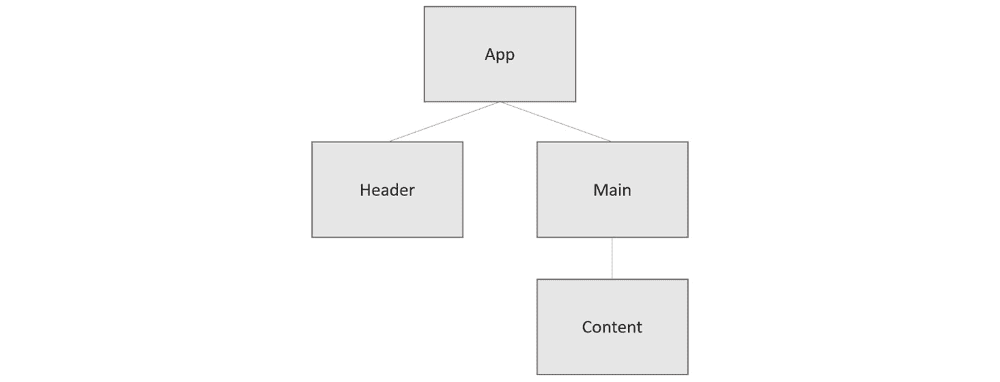

# 8

# 状态管理

在本章中，我们将了解 **共享状态**，这是由多个不同组件使用的状态。我们将探讨管理共享状态的三个方法，并讨论每种方法的优缺点。

为了实现这一点，我们将构建一个简单的应用程序，其中包含一个显示用户名的头部，主内容也会引用用户名。用户名将存储在需要由多个组件访问的状态中。

我们将从最简单的状态解决方案开始。这是使用 React 的一个状态钩子来存储状态，并通过属性将其传递给其他组件。这种方法通常被称为 **属性钻取**。

我们将要了解的第二种方法是 React 中的一个特性，称为 **上下文**。我们将学习如何创建一个包含状态的上下文，并允许其他组件访问它。

我们将要介绍的最后一个方法是流行的库 **Redux**。在重构应用程序以使用 Redux 之前，我们将花时间了解 Redux 是什么以及其概念。

因此，我们将涵盖以下主题：

+   创建项目

+   使用属性钻取

+   使用 React 上下文

+   使用 Redux

# 技术要求

在本章中，我们将使用以下技术：

+   **Node.js** 和 **npm**：您可以从 [`nodejs.org/en/download/`](https://nodejs.org/en/download/) 安装它们。

+   **Visual Studio Code**：您可以从 [`code.visualstudio.com/`](https://code.visualstudio.com/) 安装它。

本章中所有的代码片段都可以在以下网址找到：[`github.com/PacktPublishing/Learn-React-with-TypeScript-2nd-Edition/tree/main/Chapter8`](https://github.com/PacktPublishing/Learn-React-with-TypeScript-2nd-Edition/tree/main/Chapter8)。

# 创建项目

我们将使用 Visual Studio Code 和一个新的基于 Create React App 的项目设置来开发我们的表单。我们之前已经多次介绍过这一点，所以本章中不会介绍步骤——相反，请参阅 *第三章*，*设置 React 和 TypeScript*。

我们将使用 Tailwind CSS 来设计表单样式。我们之前也介绍了如何在 Create React App 中安装和配置 Tailwind，请参阅 *第五章*，*前端设计方法*。因此，在创建 React 和 TypeScript 项目之后，安装并配置 Tailwind。

我们还将使用 `@tailwindcss/forms` 插件来设计表单样式。因此，也要安装这个插件——有关如何操作的更多信息，请参阅 *第七章*，*与表单一起工作*。

我们将要构建的应用程序将包含一个头部和其下的某些内容。以下是我们将创建的组件结构：



图 8.1 – 应用组件结构

该头部将包含一个**登录**按钮，用于验证和授权用户以获取其姓名和权限。一旦验证通过，用户的姓名将在应用头部显示，并在内容中欢迎用户。如果用户具有管理员权限，将显示重要内容。

因此，执行以下步骤以创建应用中所需的初始文件版本，而不进行任何语句管理（一些代码片段可能较长 - 不要忘记您可以从[`github.com/PacktPublishing/Learn-React-with-TypeScript-2nd-Edition/tree/main/Chapter8/prop-drilling`](https://github.com/PacktPublishing/Learn-React-with-TypeScript-2nd-Edition/tree/main/Chapter8/prop-drilling)复制它们）：

1.  我们将首先创建一个包含验证用户功能的文件。在`src`文件夹中创建一个名为`api`的文件夹。然后，在`api`文件夹中创建一个名为`authenticate.ts`的文件，并添加以下内容：

    ```js
    export type User = {
    ```

    ```js
      id: string;
    ```

    ```js
      name: string;
    ```

    ```js
    };
    ```

    ```js
    export function authenticate(): Promise<User | undefined> {
    ```

    ```js
      return new Promise((resolve) =>
    ```

    ```js
        setTimeout(() => resolve({ id: "1", name: "Bob" }),       1000)
    ```

    ```js
      );
    ```

    ```js
    }
    ```

该函数模拟了名为 Bob 的用户成功验证。

1.  接下来，我们将创建一个包含授权用户功能的文件。因此，在`api`文件夹中创建一个名为`authorize.ts`的文件，并添加以下内容：

    ```js
    export function authorize(id: string): Promise<string[]> {
    ```

    ```js
      return new Promise((resolve) =>
    ```

    ```js
        setTimeout(() => resolve(["admin"]), 1000)
    ```

    ```js
      );
    ```

    ```js
    }
    ```

该函数模拟了用户被授权具有管理员权限。

1.  接下来，我们将创建一个用于应用头部的组件。在`src`文件夹中创建一个名为`Header.tsx`的文件，并添加以下内容：

    ```js
    import { User } from './api/authenticate';
    ```

    ```js
    type Props = {
    ```

    ```js
      user: undefined | User;
    ```

    ```js
      onSignInClick: () => void;
    ```

    ```js
      loading: boolean;
    ```

    ```js
    };
    ```

组件有一个用于用户的属性，如果用户尚未验证，则该属性为`undefined`。组件还有一个名为`onSignInClick`的属性，用于`loading`，它确定当用户验证或授权时应用是否处于加载状态。

1.  将以下组件实现添加到`Header.tsx`中：

    ```js
    export function Header({
    ```

    ```js
      user,
    ```

    ```js
      onSignInClick,
    ```

    ```js
      loading,
    ```

    ```js
    }: Props) {
    ```

    ```js
      return (
    ```

    ```js
        <header className="flex justify-between items-center       border-b-2 border-gray-100 py-6">
    ```

    ```js
          {user ? (
    ```

    ```js
            <span className="ml-auto font-bold">
    ```

    ```js
              {user.name} has signed in
    ```

    ```js
            </span>
    ```

    ```js
          ) : (
    ```

    ```js
            <button
    ```

    ```js
              onClick={onSignInClick}
    ```

    ```js
              className="whitespace-nowrap inline-flex items-            center justify-center ml-auto px-4 py-2 w-36             border border-transparent rounded-md             shadow-sm text-base font-medium text-white             bg-indigo-600 hover:bg-indigo-700"
    ```

    ```js
              disabled={loading}
    ```

    ```js
            >
    ```

    ```js
              {loading ? '...' : 'Sign in'}
    ```

    ```js
            </button>
    ```

    ```js
          )}
    ```

    ```js
        </header>
    ```

    ```js
      );
    ```

    ```js
    }
    ```

如果用户已验证，组件会通知用户他们已登录。如果用户未经验证，组件会显示一个**登录**按钮。

1.  接下来，我们将实现一个用于主应用内容的组件。在`src`文件夹中创建一个名为`Main.tsx`的文件，并添加以下内容：

    ```js
    import { User } from './api/authenticate';
    ```

    ```js
    import { Content } from './Content';
    ```

    ```js
    type Props = {
    ```

    ```js
      user: undefined | User;
    ```

    ```js
      permissions: undefined | string[];
    ```

    ```js
    };
    ```

组件有一个用于用户及其权限的属性。我们已导入一个名为`Content`的组件，我们将在*第 7 步*中创建它。

1.  现在，将以下组件实现添加到`Main.tsx`中：

    ```js
    export function Main({ user, permissions }: Props) {
    ```

    ```js
      return (
    ```

    ```js
        <main className="py-8">
    ```

    ```js
          <h1 className="text-3xl text-center font-bold         underline">Welcome</h1>
    ```

    ```js
          <p className="mt-8 text-xl text-center">
    ```

    ```js
            {user ? `Hello ${user.name}!` : "Please sign in"}
    ```

    ```js
          </p>
    ```

    ```js
          <Content permissions={permissions} />
    ```

    ```js
        </main>
    ```

    ```js
      );
    ```

    ```js
    }
    ```

组件指示用户登录，如果他们未经验证或显示传递用户权限的`Content`组件。

1.  在`src`文件夹中创建的最后一个文件被命名为`Content.tsx`。将以下内容添加到该文件中：

    ```js
    type Props = {
    ```

    ```js
      permissions: undefined | string[];
    ```

    ```js
    };
    ```

    ```js
    export function Content({ permissions }: Props) {
    ```

    ```js
      if (permissions === undefined) {
    ```

    ```js
        return null;
    ```

    ```js
      }
    ```

    ```js
      return permissions.includes('admin') ? (
    ```

    ```js
        <p className="mt-4 text-l text-center">
    ```

    ```js
          Some important stuff that only an admin can do
    ```

    ```js
        </p>
    ```

    ```js
      ) : (
    ```

    ```js
        <p className="mt-4 text-l text-center">
    ```

    ```js
          Insufficient permissions
    ```

    ```js
        </p>
    ```

    ```js
      );
    ```

    ```js
    }
    ```

如果用户未授权，组件不显示任何内容。如果用户具有管理员权限，则显示一些重要内容。否则，它会通知用户他们缺少权限。

这样就完成了项目设置。应用将编译并运行，但不会显示我们创建的任何组件，因为我们还没有在`App`组件中引用它们。我们将在分享用户和权限信息到多个组件时进行此操作。

# 使用钻探法

在这种第一种状态管理方法中，我们将`user`、`permissions`和`loading`状态存储在`App`组件中。然后，`App`组件将使用 props 将此状态传递给`Header`和`Main`组件。

因此，这种方法使用了我们已知的 React 特性。这种方法被称为**属性钻取**，因为状态是通过 props 向下传递给组件树的。

执行以下步骤来重构`App`组件，以存储`user`、`permissions`和`loading`状态，并将此状态传递给`Header`和`Main`组件：

1.  打开`App.tsx`，首先删除所有现有代码，并添加以下导入语句：

    ```js
    import { useReducer } from 'react';
    ```

    ```js
    import { Header } from './Header';
    ```

    ```js
    import { Main } from './Main';
    ```

    ```js
    import { authenticate, User } from './api/authenticate';
    ```

    ```js
    import { authorize } from './api/authorize';
    ```

我们从 React 中导入了`useReducer`来存储状态。我们还导入了`Header`和`Main`组件，以便我们可以使用状态值来渲染它们。最后，我们导入了`authenticate`和`authorize`函数，因为我们将在该组件中创建**登录**处理程序。

1.  在导入语句之后，添加一个状态类型并创建一个初始状态值的变量：

    ```js
    type State = {
    ```

    ```js
      user: undefined | User,
    ```

    ```js
      permissions: undefined | string[],
    ```

    ```js
      loading: boolean,
    ```

    ```js
    };
    ```

    ```js
    const initialState: State = {
    ```

    ```js
      user: undefined,
    ```

    ```js
      permissions: undefined,
    ```

    ```js
      loading: false,
    ```

    ```js
    };
    ```

1.  接下来，为可以更新状态的不同的动作创建一个类型：

    ```js
    type Action =
    ```

    ```js
      | {
    ```

    ```js
          type: "authenticate",
    ```

    ```js
        }
    ```

    ```js
      | {
    ```

    ```js
          type: "authenticated",
    ```

    ```js
          user: User | undefined,
    ```

    ```js
        }
    ```

    ```js
      | {
    ```

    ```js
          type: "authorize",
    ```

    ```js
        }
    ```

    ```js
      | {
    ```

    ```js
          type: "authorized",
    ```

    ```js
          permissions: string[],
    ```

    ```js
        };
    ```

`"authenticate"`动作将启动认证过程，当完成时发生`"authenticated"`。同样，`"authorize"`动作将启动授权过程，当完成时发生`"authorized"`。

1.  接下来，添加一个更新状态的`reducer`函数：

    ```js
    function reducer(state: State, action: Action): State {
    ```

    ```js
      switch (action.type) {
    ```

    ```js
        case "authenticate":
    ```

    ```js
          return { ...state, loading: true };
    ```

    ```js
        case "authenticated":
    ```

    ```js
          return { ...state, loading: false, user: action.        user };
    ```

    ```js
        case "authorize":
    ```

    ```js
          return { ...state, loading: true };
    ```

    ```js
        case "authorized":
    ```

    ```js
          return {
    ```

    ```js
            ...state,
    ```

    ```js
            loading: false,
    ```

    ```js
            permissions: action.permissions,
    ```

    ```js
          };
    ```

    ```js
        default:
    ```

    ```js
          return state;
    ```

    ```js
      }
    ```

    ```js
    }
    ```

该函数接受现有状态和动作作为参数。该函数使用动作类型的 switch 语句在每个分支中创建状态的新版本。

1.  现在，让我们按照以下方式定义`App`组件：

    ```js
    function App() {
    ```

    ```js
      const [{ user, permissions, loading }, dispatch] =
    ```

    ```js
        useReducer(reducer, initialState);
    ```

    ```js
      return (
    ```

    ```js
        <div className="max-w-7xl mx-auto px-4">
    ```

    ```js
          <Header
    ```

    ```js
            user={user}
    ```

    ```js
            onSignInClick={handleSignInClick}
    ```

    ```js
            loading={loading}
    ```

    ```js
          />
    ```

    ```js
          <Main user={user} permissions={permissions} />
    ```

    ```js
        </div>
    ```

    ```js
      );
    ```

    ```js
    }
    ```

    ```js
    export default App;
    ```

该组件使用我们之前定义的`reducer`函数和`initialState`变量来`useReducer`。我们从`useReducer`中解构了`user`、`permissions`和`loading`状态值。在 JSX 中，我们渲染了`Header`和`Main`组件，并将适当的状态值作为 props 传递。

1.  JSX 中的`Header`元素引用了一个名为`handleSignInClick`的处理程序，需要实现。在返回语句上方创建此处理程序，如下所示：

    ```js
    async function handleSignInClick() {
    ```

    ```js
      dispatch({ type: "authenticate" });
    ```

    ```js
      const authenticatedUser = await authenticate();
    ```

    ```js
      dispatch({
    ```

    ```js
        type: "authenticated",
    ```

    ```js
        user: authenticatedUser,
    ```

    ```js
      });
    ```

    ```js
      if (authenticatedUser !== undefined) {
    ```

    ```js
        dispatch({ type: "authorize" });
    ```

    ```js
        const authorizedPermissions = await authorize(
    ```

    ```js
          authenticatedUser.id
    ```

    ```js
        );
    ```

    ```js
        dispatch({
    ```

    ```js
          type: "authorized",
    ```

    ```js
          permissions: authorizedPermissions,
    ```

    ```js
        });
    ```

    ```js
      }
    ```

    ```js
    }
    ```

登录处理程序在过程中验证和授权用户，并分派必要的动作。

1.  通过在终端中运行`npm start`来以开发模式运行应用程序。应用程序如图所示：


图 8.2 – 登录前的应用

1.  点击**登录**按钮。然后发生认证和授权过程，几秒钟后，出现以下屏幕：


图 8.3 – 登录后的应用

这就完成了属性钻取方法。

这种方法的优点是简单，并且使用了我们已熟悉的 React 特性。这种方法的缺点是它强制所有在提供状态和访问状态的组件之间的组件都必须有一个该状态的 prop。因此，一些不需要访问状态的组件被迫访问它。例如，`Main` 组件 – `permissions` 状态被迫通过它传递到 `Content` 组件。

本节的关键点是，使用 props 在几个相邻组件之间共享状态是可以的，但不是在组件树中相隔甚远的许多组件之间共享的最佳选择。

接下来，保持应用运行，我们将探讨一个更适合在许多组件之间共享状态的解决方案。

# 使用 React 上下文

在本节中，我们将学习 React 中称为 **上下文** 的一个特性。然后，我们将从上一节重构应用以使用 React 上下文。

## 理解 React 上下文

React 上下文是一个对象，组件可以访问它。该对象可以包含状态值，因此它提供了一种在组件之间共享状态的机制。

使用 `createContext` 函数创建上下文，如下所示：

```js
const SomeContext = createContext<ContextType>(defaultValue);
```

必须将上下文的默认值传递给 `createContext`。它还有一个泛型类型参数，用于表示由 `createContext` 创建的对象的类型。

上下文还包含一个 `Provider` 组件，需要将其放置在组件树中需要访问上下文对象的组件之上。可以创建一个包装器组件来存储共享状态，并将其传递给上下文 `Provider` 组件，如下所示：

```js
export function SomeProvider({ children }: Props) {
  const [someState, setSomeState] = useState(initialState);
  return (
    <SomeContext.Provider value={{ someState }}>
      {children}
    </SomeContext.Provider>
  );
}
```

在前面的例子中使用了 `useState` 来处理状态，但也可以使用 `useReducer`。

提供者包装器组件可以适当地放置在组件树中，位于需要共享状态的组件之上：

```js
function App() {
  return (
    <SomeProvider>
      <Header />
      <Main />
    </SomeProvider>
  );
}
```

React 还包含一个 `useContext` 钩子，可以用来使上下文值可以作为钩子被消费，如下所示：

```js
const { someState } = useContext(SomeContext);
```

必须将上下文传递给 `useContext`，并可以从上下文对象的结果中解构属性。

因此，想要访问共享状态的组件可以使用 `useContext` 如下访问：

```js
export function SomeComponent() {
  const { someState } = useContext(SomeContext);
  return <div>I have access to {someState}</div>;
}
```

关于 React 上下文的更多信息，请参阅以下链接：[`reactjs.org/docs/context.html`](https://reactjs.org/docs/context.html)。

现在我们已经了解了 React 上下文，我们将在上一节创建的应用中使用它。

## 使用 React 上下文

我们将从上一节开始重构应用，以使用 React 上下文。我们首先创建一个包含上下文和提供者包装器的文件。然后，在提供者包装器中使用 `useReducer` 来存储状态。我们还将创建一个 `useContext` 的包装器，以便更容易地消费它。

因此，要完成此操作，请执行以下步骤：

1.  首先在 `src` 文件夹中创建一个名为 `AppContext.tsx` 的文件。这将包含上下文、提供者包装器和 `useContext` 包装器。

1.  将以下导入语句添加到 `AppContext.tsx` 中：

    ```js
    import {
    ```

    ```js
      createContext,
    ```

    ```js
      useContext,
    ```

    ```js
      useReducer,
    ```

    ```js
      ReactNode,
    ```

    ```js
    } from 'react';
    ```

    ```js
    import { User } from './api/authenticate';
    ```

我们已经从 React 导入了我们需要的所有函数，包括我们将需要的用于提供者包装器 `children` 属性的 `ReactNode` 类型。我们还导入了 `User` 类型，这是我们需要的用户状态类型。

1.  我们需要添加一个状态类型和一个初始状态值的变量。我们已经在 `App.tsx` 中有了这些，所以以下行可以从 `App.tsx` 移动到 `AppContext.tsx`：

    ```js
    type State = {
    ```

    ```js
      user: undefined | User,
    ```

    ```js
      permissions: undefined | string[],
    ```

    ```js
      loading: boolean,
    ```

    ```js
    };
    ```

    ```js
    const initialState = {
    ```

    ```js
      user: undefined,
    ```

    ```js
      permissions: undefined,
    ```

    ```js
      loading: false,
    ```

    ```js
    };
    ```

1.  类似地，`Action` 类型以及 `reducer` 函数可以从 `App.tsx` 移动到 `AppContext.tsx`。以下是移动的代码行：

    ```js
    type Action =
    ```

    ```js
      | {
    ```

    ```js
          type: "authenticate",
    ```

    ```js
        }
    ```

    ```js
      | {
    ```

    ```js
          type: "authenticated",
    ```

    ```js
          user: User | undefined,
    ```

    ```js
        }
    ```

    ```js
      | {
    ```

    ```js
          type: "authorize",
    ```

    ```js
        }
    ```

    ```js
      | {
    ```

    ```js
          type: "authorized",
    ```

    ```js
          permissions: string[],
    ```

    ```js
        };
    ```

    ```js
    function reducer(state: State, action: Action): State {
    ```

    ```js
      switch (action.type) {
    ```

    ```js
        case "authenticate":
    ```

    ```js
          return { ...state, loading: true };
    ```

    ```js
        case "authenticated":
    ```

    ```js
          return { ...state, loading: false, user: action.        user };
    ```

    ```js
        case "authorize":
    ```

    ```js
          return { ...state, loading: true };
    ```

    ```js
        case "authorized":
    ```

    ```js
          return { ...state, loading: false, permissions:         action.permissions };
    ```

    ```js
        default:
    ```

    ```js
          return state;
    ```

    ```js
      }
    ```

    ```js
    }
    ```

注意，在移动此函数后，`App.tsx` 文件将引发编译错误。我们将在下一组指令中解决这个问题。

1.  接下来，我们将在 `AppContext.tsx` 中创建一个上下文类型：

    ```js
    type AppContextType = State & {
    ```

    ```js
      dispatch: React.Dispatch<Action>,
    ```

    ```js
    };
    ```

上下文将包含状态值和一个用于分发操作的 `dispatch` 函数。

1.  现在，我们可以创建上下文，如下所示：

    ```js
    const AppContext = createContext<AppContextType>({
    ```

    ```js
      ...initialState,
    ```

    ```js
      dispatch: () => {},
    ```

    ```js
    });
    ```

我们将上下文命名为 `AppContext`。我们使用 `initialState` 变量和虚拟的 `dispatch` 函数作为默认上下文值。

1.  接下来，我们可以实现提供者包装器，如下所示：

    ```js
    type Props = {
    ```

    ```js
      children: ReactNode;
    ```

    ```js
    };
    ```

    ```js
    export function AppProvider({ children }: Props) {
    ```

    ```js
      const [{ user, permissions, loading }, dispatch] =
    ```

    ```js
        useReducer(reducer, initialState);
    ```

    ```js
      return (
    ```

    ```js
        <AppContext.Provider
    ```

    ```js
          value={{
    ```

    ```js
            user,
    ```

    ```js
            permissions,
    ```

    ```js
            loading,
    ```

    ```js
            dispatch,
    ```

    ```js
          }}
    ```

    ```js
        >
    ```

    ```js
          {children}
    ```

    ```js
        </AppContext.Provider>
    ```

    ```js
      );
    ```

    ```js
    }
    ```

我们将组件命名为 `AppProvider`，它返回上下文的 `Provider` 组件，包含状态值和 `dispatch` 函数。

1.  在 `AppContext.tsx` 中最后要做的就是创建一个 `useContext` 的包装器，如下所示：

    ```js
    export const useAppContext = () => useContext(AppContext);
    ```

这就完成了我们在 `AppContext.tsx` 中需要做的所有工作。

因此，`AppContext.tsx` 导出 `AppProvider` 组件，可以放置在组件树中的 `Header` 和 `Main` 之上，以便它们可以访问用户和权限信息。`AppContext.tsx` 还导出 `useAppContext`，以便 `Header`、`Main` 和 `Content` 组件可以使用它来获取访问用户和权限信息。

现在，执行以下步骤以对 `App`、`Header`、`Main` 和 `Content` 组件进行必要的更改，以便从 `AppContext` 访问用户和权限信息：

1.  我们将从 `Header.tsx` 开始。首先导入 `authenticate`、`authorize` 和 `useAppContext` 函数。同时，移除 `User` 类型以及 `Header` 组件的属性：

    ```js
    import { authenticate } from './api/authenticate';
    ```

    ```js
    import { authorize } from './api/authorize';
    ```

    ```js
    import { useAppContext } from './AppContext';
    ```

    ```js
    export function Header() {
    ```

    ```js
      return ...
    ```

    ```js
    }
    ```

1.  `Header` 将现在处理登录过程，而不是 `App`。因此，将 `App.tsx` 中的 `handleSignInClick` 处理器移动到 `Header.tsx`，并将其放置在返回语句之上，如下所示：

    ```js
    export function Header() {
    ```

    ```js
      async function handleSignInClick() {
    ```

    ```js
        dispatch({ type: 'authenticate' });
    ```

    ```js
        const authenticatedUser = await authenticate();
    ```

    ```js
        dispatch({
    ```

    ```js
          type: 'authenticated',
    ```

    ```js
          user: authenticatedUser,
    ```

    ```js
        });
    ```

    ```js
        if (authenticatedUser !== undefined) {
    ```

    ```js
          dispatch({ type: 'authorize' });
    ```

    ```js
          const authorizedPermissions = await authorize(
    ```

    ```js
            authenticatedUser.id
    ```

    ```js
          );
    ```

    ```js
          dispatch({
    ```

    ```js
            type: 'authorized',
    ```

    ```js
            permissions: authorizedPermissions,
    ```

    ```js
          });
    ```

    ```js
        }
    ```

    ```js
      }
    ```

    ```js
      return ...
    ```

    ```js
    }
    ```

1.  更新登录点击处理器以引用我们刚刚添加的函数：

    ```js
    <button
    ```

    ```js
      onClick={handleSignInClick}
    ```

    ```js
      className=...
    ```

    ```js
      disabled={loading}
    ```

    ```js
    >
    ```

    ```js
      {loading ? '...' : 'Sign in'}
    ```

    ```js
    </button>
    ```

1.  在 `Header.tsx` 中最后要做的就是从上下文中获取 `user`、`loading` 和 `dispatch`。在组件顶部添加以下对 `useAppContext` 的调用：

    ```js
    export function Header() {
    ```

    ```js
      const { user, loading, dispatch } = useAppContext();
    ```

    ```js
      ...
    ```

    ```js
    }
    ```

1.  让我们转到 `Main.tsx`。移除对 `User` 类型的导入语句，并添加对 `useAppContext` 的导入语句：

    ```js
    import { Content } from './Content';
    ```

    ```js
    import { useAppContext } from './AppContext';
    ```

1.  移除 `Main` 组件的属性，并从 `useAppContext` 获取 `user`：

    ```js
    export function Main() {
    ```

    ```js
      const { user } = useAppContext();
    ```

    ```js
      return ...
    ```

    ```js
    }
    ```

1.  在 `Main` 中的 JSX 中，移除 `Content` 元素的 `permissions` 属性：

    ```js
    <Content />
    ```

1.  现在，打开 `Content.tsx` 并添加一个 `useAppContext` 的导入语句：

    ```js
    import { useAppContext } from './AppContext';
    ```

1.  移除 `Content` 组件的属性，并从 `useAppContext` 获取 `permissions`：

    ```js
    export function Content() {
    ```

    ```js
      const { permissions } = useAppContext();
    ```

    ```js
      if (permissions === undefined) {
    ```

    ```js
        return null;
    ```

    ```js
      }
    ```

    ```js
      return ...
    ```

    ```js
    }
    ```

1.  最后，我们将修改 `App.tsx`。移除除了 `Header` 和 `Main` 之外的所有导入语句，并添加一个 `AppProvider` 的导入语句：

    ```js
    import { Header } from './Header';
    ```

    ```js
    import { Main } from './Main';
    ```

    ```js
    import { AppProvider } from './AppContext';
    ```

1.  仍然在 `App.tsx` 中，移除对 `useReducer` 的调用，并移除传递给 `Header` 和 `Main` 的所有属性：

    ```js
    function App() {
    ```

    ```js
      return (
    ```

    ```js
        <div className="max-w-7xl mx-auto px-4">
    ```

    ```js
          <Header />
    ```

    ```js
          <Main />
    ```

    ```js
        </div>
    ```

    ```js
      );
    ```

    ```js
    }
    ```

1.  将 `AppProvider` 包裹在 `Header` 和 `Main` 旁边，以便它们可以访问上下文：

    ```js
    function App() {
    ```

    ```js
      return (
    ```

    ```js
        <div className="max-w-7xl mx-auto px-4">
    ```

    ```js
          <AppProvider>
    ```

    ```js
            <Header />
    ```

    ```js
            <Main />
    ```

    ```js
          </AppProvider>
    ```

    ```js
        </div>
    ```

    ```js
      );
    ```

    ```js
    }
    ```

现在编译错误将被解决，运行中的应用将看起来和表现如前。

1.  通过按 *Ctrl* + *C* 停止应用运行。

这完成了将应用重构为使用 React 上下文而不是属性钻取的过程。

与属性钻取相比，React 上下文需要编写更多的代码。然而，它允许组件使用钩子而不是通过属性在组件之间传递来访问共享状态。这是一个优雅的共享状态解决方案，尤其是在许多组件共享状态时。

接下来，我们将了解一个流行的第三方库，它可以用来共享状态。

# 使用 Redux

在本节中，我们将在使用 Redux 之前了解 Redux，并将其用于重构我们一直在工作的应用。

## 理解 Redux

**Redux** 是一个成熟的州管理库，它最初于 2015 年发布。它在 React 上下文之前发布，并成为共享状态管理的一种流行方法。

### 创建存储

在 Redux 中，状态存在于一个称为 `useReducer` 的集中式不可变对象中，存储中的状态通过分发 `reducer` 函数来更新，该函数创建状态的新版本。

在过去，需要大量的代码来设置 Redux 存储，并在 React 组件中消耗它。今天，一个名为 Redux Toolkit 的伴侣库减少了使用 Redux 所需的代码。可以使用 Redux Toolkit 的 `configureStore` 函数创建 Redux 存储，如下所示：

```js
export const store = configureStore({
  reducer: {
    someFeature: someFeatureReducer,
    anotherFeature: anotherFeatureReducer
  },
});
```

`configureStore` 函数接收存储的还原器。应用中的每个功能都可以有自己的状态区域和还原器来改变状态。不同的状态区域通常被称为 `someFeature` 和 `anotherFeature`。

Redux Toolkit 有一个用于创建切片的函数，称为 `createSlice`：

```js
export const someSlice = createSlice({
  name: "someFeature",
  initialState,
  reducers: {
    someAction: (state) => {
      state.someValue = "something";
    },
    anotherAction: (state) => {
      state.someOtherValue = "something else";
    },
  },
});
```

`createSlice` 函数接收一个包含切片名称、初始状态以及处理不同动作和更新状态的函数的对象参数。

从 `createSlice` 创建的切片包含一个包装动作处理器的 `reducer` 函数。当创建存储时，可以在 `configureStore` 的 `reducer` 属性中引用此 `reducer` 函数：

```js
export const store = configureStore({
  reducer: {
    someFeature: someSlice.reducer,
    ...
  },
});
```

在前面的代码片段中，`someSlice` 的还原器已被添加到存储中。

### 向 React 组件提供存储

Redux 存储通过其 `Provider` 组件在组件树中定义。`Provider` 组件上的 `value` 需要指定 Redux 存储（来自 `configureStore`）。`Provider` 组件必须放置在需要访问存储的组件之上：

```js
<Provider store={store}>
  <SomeComponent />
  <AnotherComponent />
</Provider>
```

在前面的例子中，`SomeComponent` 和 `AnotherComponent` 可以访问存储。

### 从组件中访问存储

组件可以使用 React Redux 的 `useSelector` 钩子从 Redux 存储访问状态。一个选择存储中相关状态的功能被传递到 `useSelector`：

```js
const someValue = useSelector(
  (state: RootState) => state.someFeature.someValue
);
```

在前面的例子中，`someValue`是从存储中的`someFeature`切片中选择的。

### 从组件向存储分发动作

React Redux 还有一个名为 `useDispatch` 的钩子，它返回一个 `dispatch` 函数，可以用来分发动作。动作是从使用 `createSlice` 创建的切片中创建的函数：

```js
const dispatch = useDispatch();
return (
  <button onClick={() => dispatch(someSlice.actions.someAction())}>
    Some button
  </button>
);
```

在前面的例子中，当按钮被点击时，`someSlice` 中的 `someAction` 被分发。

更多关于 Redux 的信息，请参阅以下链接：[`redux.js.org/`](https://redux.js.org/)。有关 Redux Toolkit 的更多信息，请参阅以下链接：[`redux-toolkit.js.org/`](https://redux-toolkit.js.org/)。

现在我们已经了解了 Redux，我们将在上一节创建的应用中使用它。

## 安装 Redux

首先，我们必须将 Redux 和 Redux Toolkit 安装到我们的项目中。在终端中运行以下命令：

```js
npm i @reduxjs/toolkit react-redux
```

这将安装我们需要的所有 Redux 组件，包括其 TypeScript 类型。

## 使用 Redux

现在，我们可以重构应用程序以使用 Redux 而不是 React 上下文。首先，我们将创建一个用于用户信息的 Redux slice，然后再创建一个包含此切片的 Redux 存储。然后，我们将继续将存储添加到 React 组件树中，并在 `Header`、`Main` 和 `Content` 组件中消费它。

### 创建 Redux Slice

我们将首先创建一个用于用户状态的 Redux slice。执行以下步骤：

1.  在`src`文件夹中创建一个名为`store`的文件夹，然后在其中创建一个名为`userSlice.ts`的文件。

1.  将以下导入语句添加到 `userSlice.ts`：

    ```js
    import { createSlice } from '@reduxjs/toolkit';
    ```

    ```js
    import type { PayloadAction } from '@reduxjs/toolkit';
    ```

    ```js
    import { User } from '../api/authenticate';
    ```

我们最终将使用 `createSlice` 创建 Redux slice。`PayloadAction` 是一个我们可以用于动作对象的类型。在定义状态类型时，我们需要 `User` 类型。

1.  将以下 `State` 类型及其初始状态值从 `AppContext.tsx` 复制到 `userSlice.ts`：

    ```js
    type State = {
    ```

    ```js
      user: undefined | User;
    ```

    ```js
      permissions: undefined | string[];
    ```

    ```js
      loading: boolean;
    ```

    ```js
    };
    ```

    ```js
    const initialState: State = {
    ```

    ```js
      user: undefined,
    ```

    ```js
      permissions: undefined,
    ```

    ```js
      loading: false,
    ```

    ```js
    };
    ```

1.  接下来，按照以下方式在 `userSlice.ts` 中开始创建切片：

    ```js
    export const userSlice = createSlice({
    ```

    ```js
      name: 'user',
    ```

    ```js
      initialState,
    ```

    ```js
      reducers: {
    ```

    ```js
      }
    ```

    ```js
    });
    ```

我们已将切片命名为 `user` 并传递了初始状态值。我们导出切片，以便以后可以用来创建 Redux 存储。

1.  现在，在 `reducers` 对象内部定义以下动作处理程序：

    ```js
    reducers: {
    ```

    ```js
      authenticateAction: (state) => {
    ```

    ```js
        state.loading = true;
    ```

    ```js
      },
    ```

    ```js
      authenticatedAction: (
    ```

    ```js
        state,
    ```

    ```js
        action: PayloadAction<User | undefined>
    ```

    ```js
      ) => {
    ```

    ```js
        state.user = action.payload;
    ```

    ```js
        state.loading = false;
    ```

    ```js
      },
    ```

    ```js
      authorizeAction: (state) => {
    ```

    ```js
        state.loading = true;
    ```

    ```js
      },
    ```

    ```js
      authorizedAction: (
    ```

    ```js
        state,
    ```

    ```js
        action: PayloadAction<string[]>
    ```

    ```js
      ) => {
    ```

    ```js
        state.permissions = action.payload;
    ```

    ```js
        state.loading = false;
    ```

    ```js
      }
    ```

    ```js
    }
    ```

每个动作处理程序都会更新所需的状态。`PayloadAction` 用于动作参数的类型。`PayloadAction` 是一个带有动作有效负载类型的泛型类型。

1.  最后，从切片中导出动作处理程序和`reducer`函数：

    ```js
    export const {
    ```

    ```js
      authenticateAction,
    ```

    ```js
      authenticatedAction,
    ```

    ```js
      authorizeAction,
    ```

    ```js
      authorizedAction,
    ```

    ```js
    } = userSlice.actions;
    ```

    ```js
    export default userSlice.reducer;
    ```

`reducer`函数使用了默认导出，因此消费者可以按需命名它。

这样就完成了 Redux 切片的实现。

### 创建 Redux 存储

接下来，让我们创建 Redux 存储。执行以下步骤：

1.  在`store`文件夹中创建一个名为`store.ts`的文件，包含以下导入语句：

    ```js
    import { configureStore } from '@reduxjs/toolkit';
    ```

    ```js
    import userReducer from './userSlice';
    ```

1.  接下来，使用`configureStore`函数创建存储，引用我们之前创建的 reducer：

    ```js
    export const store = configureStore({
    ```

    ```js
      reducer: { user: userReducer }
    ```

    ```js
    });
    ```

我们导出`store`变量，以便我们可以在以后在 React Redux 的`Provider`组件中使用它。

1.  在`store.ts`中最后要做的就是在 Redux 的全状态对象中导出类型，我们最终会在消费 Redux 存储的组件中的`useSelector`钩子中需要这个类型：

    ```js
    export type RootState = ReturnType<typeof store.getState>;
    ```

`ReturnType`是 TypeScript 的一个标准实用工具类型，它返回传递给它的函数类型的返回类型。Redux 存储中的`getState`函数返回完整的状态对象。因此，我们使用`ReturnType`来推断完整状态对象的类型，而不是显式地定义它。

这样就完成了 Redux 存储的实现。

### 将 Redux 存储添加到组件树中

接下来，我们将使用 React Redux 的`Provider`组件在组件树中的适当位置添加存储。遵循以下步骤：

1.  打开`App.tsx`并移除`AppContext`导入语句。同时移除`AppContext.tsx`文件，因为现在不再需要它。

1.  从 React Redux 导入`Provider`组件和我们创建的 Redux 存储的导入语句：

    ```js
    import { Provider } from 'react-redux';
    ```

    ```js
    import { store } from './store/store';
    ```

1.  在 JSX 中将`AppProvider`替换为`Provider`，如下所示：

    ```js
    <div className="max-w-7xl mx-auto px-4">
    ```

    ```js
      <Provider store={store}>
    ```

    ```js
        <Header />
    ```

    ```js
        <Main />
    ```

    ```js
      </Provider>
    ```

    ```js
    </div>
    ```

我们将导入的 Redux 存储传递给`Provider`。

现在 Redux 存储对`Header`、`Main`和`Content`组件都是可访问的。

### 在组件中消费 Redux 存储

我们现在将 Redux 存储集成到`Header`、`Main`和`Content`组件中。这将替换之前的 React 上下文消费代码。遵循以下步骤：

1.  首先打开`Header.tsx`并移除`AppContext`导入语句。

1.  在`Header.tsx`中添加以下导入语句：

    ```js
    import { useSelector, useDispatch } from 'react-redux';
    ```

    ```js
    import type { RootState } from './store/store';
    ```

    ```js
    import {
    ```

    ```js
      authenticateAction,
    ```

    ```js
      authenticatedAction,
    ```

    ```js
      authorizeAction,
    ```

    ```js
      authorizedAction,
    ```

    ```js
    } from './store/userSlice';
    ```

我们将引用 Redux 中的状态以及分发动作，因此我们导入了`useSelector`和`useDispatch`。`RootState`类型是我们最终将传递给`useSelector`的函数中所需的。我们还导入了我们创建的切片中的所有动作，因为我们将在修订后的登录处理程序中需要它们。

1.  在`Header`组件内部，将`useAppContext`调用替换为`useSelector`调用以获取所需的状态：

    ```js
    export function Header() {
    ```

    ```js
      const user = useSelector(
    ```

    ```js
        (state: RootState) => state.user.user
    ```

    ```js
      );
    ```

    ```js
      const loading = useSelector(
    ```

    ```js
        (state: RootState) => state.user.loading
    ```

    ```js
      );
    ```

    ```js
      async function handleSignInClick() {
    ```

    ```js
        ...
    ```

    ```js
      }
    ```

    ```js
      return ...
    ```

    ```js
    }
    ```

1.  同时，调用`useDispatch`来获取`dispatch`函数：

    ```js
    export function Header() {
    ```

    ```js
      const user = useSelector(
    ```

    ```js
        (state: RootState) => state.user.user
    ```

    ```js
      );
    ```

    ```js
      const loading = useSelector(
    ```

    ```js
        (state: RootState) => state.user.loading
    ```

    ```js
      );
    ```

    ```js
      const dispatch = useDispatch();
    ```

    ```js
      async function handleSignInClick() {
    ```

    ```js
        ...
    ```

    ```js
      }
    ```

    ```js
      return ...
    ```

    ```js
    }
    ```

1.  在`Header.tsx`中最后要做的就是在`handleSignInClick`中修改以引用 Redux 切片中的动作函数：

    ```js
    async function handleSignInClick() {
    ```

    ```js
      dispatch(authenticateAction());
    ```

    ```js
      const authenticatedUser = await authenticate();
    ```

    ```js
      dispatch(authenticatedAction(authenticatedUser));
    ```

    ```js
      if (authenticatedUser !== undefined) {
    ```

    ```js
        dispatch(authorizeAction());
    ```

    ```js
        const authorizedPermissions = await authorize(
    ```

    ```js
          authenticatedUser.id
    ```

    ```js
        );
    ```

    ```js
        dispatch(authorizedAction(authorizedPermissions));
    ```

    ```js
      }
    ```

    ```js
    }
    ```

1.  现在，打开`Main.tsx`并将`AppContext`导入语句替换为`useSelector`和`RootState`类型的导入语句：

    ```js
    import { useSelector } from 'react-redux';
    ```

    ```js
    import { RootState } from './store/store';
    ```

1.  将对`useAppContext`的调用替换为对`useSelector`的调用以获取`user`状态值：

    ```js
    export function Main() {
    ```

    ```js
      const user = useSelector(
    ```

    ```js
        (state: RootState) => state.user.user
    ```

    ```js
      );
    ```

    ```js
      return ...
    ```

    ```js
    }
    ```

1.  接下来，打开`Content.tsx`，并将`AppContext`导入语句替换为对`useSelector`和`RootState`类型的导入语句：

    ```js
    import { useSelector } from 'react-redux';
    ```

    ```js
    import { RootState } from './store/store';
    ```

1.  将对`useAppContext`的调用替换为对`useSelector`的调用，以获取`permissions`状态值：

    ```js
    export function Content() {
    ```

    ```js
      const permissions = useSelector(
    ```

    ```js
        (state: RootState) => state.user.permissions
    ```

    ```js
      );
    ```

    ```js
      if (permissions === undefined) {
    ```

    ```js
        return null;
    ```

    ```js
      }
    ```

    ```js
      return ...
    ```

    ```js
    }
    ```

1.  通过在终端中运行`npm start`来运行应用程序。应用程序的外观和行为将与之前一样。

这就完成了将应用程序重构为使用 Redux 而不是 React 上下文的过程。

这里是使用 Redux 的关键点的回顾：

+   状态存储在中央存储中

+   状态通过分发由 reducer 处理的动作来更新

+   需要适当地在组件树中放置`Provider`组件，以便组件可以访问 Redux 存储

+   组件可以使用`useSelector`钩子选择状态，并使用`useDispatch`钩子分发动作

正如您所经历的，即使使用 Redux Toolkit，在使用 Redux 管理状态时也需要许多步骤。对于简单的状态管理需求来说，这有点过度，但在有大量共享应用程序级状态时却非常出色。

# 摘要

在本章中，我们构建了一个包含需要共享状态的组件的小型单页应用程序。我们首先使用现有的知识，并使用属性在组件之间传递状态。我们了解到这种方法的一个问题是，不需要访问状态的组件被迫访问它，如果其子组件需要访问它的话。

我们继续学习 React 上下文，并将应用程序重构为使用它。我们了解到 React 上下文可以使用`useState`或`useReducer`存储状态。然后，可以通过上下文的`Provider`组件将状态提供给树中的组件。然后，组件通过`useContext`钩子访问上下文状态。我们发现这比通过属性传递状态要好得多，尤其是当许多组件需要访问状态时。

接下来，我们学习了 Redux，它与 React 上下文类似。一个区别是，只能有一个包含状态的 Redux 存储，但可以有多个 React 上下文。我们了解到需要将`Provider`组件添加到组件树中，以便组件可以访问 Redux 存储。组件使用`useSelector`钩子选择状态，并使用`useDispatch`钩子分发动作。然后，reducer 处理动作并相应地更新状态。

在下一章中，我们将学习如何在 React 中与 REST API 一起工作。

# 问题

回答以下问题以检查您在本章中学到的内容：

1.  我们定义了一个上下文，如下所示，以保存应用程序的主题状态：

    ```js
    type Theme = {
    ```

    ```js
      name: string;
    ```

    ```js
      color: 'dark' | 'light';
    ```

    ```js
    };
    ```

    ```js
    type ThemeContextType = Theme & {
    ```

    ```js
      changeTheme: (
    ```

    ```js
        name: string,
    ```

    ```js
        color: 'dark' | 'light'
    ```

    ```js
      ) => void;
    ```

    ```js
    };
    ```

    ```js
    const ThemeContext = createContext<ThemeContextType>();
    ```

尽管代码可以编译，但问题是什么？

1.  问题 1 的上下文中有一个名为`ThemeProvider`的提供者包装器，它被添加到组件树中，如下所示：

    ```js
    <ThemeProvider>
    ```

    ```js
      <Header />
    ```

    ```js
      <Main />
    ```

    ```js
    </ThemeProvider>
    ```

    ```js
    <Footer />
    ```

当在`Footer`组件中使用`useContext`解构时，主题状态是`undefined`。问题是什么？

1.  在应用程序中是否可以有两个 React 上下文？

1.  在应用程序中是否可以有两个 Redux 存储？

1.  以下代码分发了一个动作来更改主题：

    ```js
    function handleChangeTheme({ name, color }: Theme) {
    ```

    ```js
      useDispatch(changeThemeAction(name, color));
    ```

    ```js
    }
    ```

这段代码存在问题。问题是什么？

1.  在一个 React 组件中，是否可以使用 `useState` 以及来自 Redux 存储的状态来仅使用本组件所需的状态？

1.  在本章中，当我们实现 Redux 切片时，动作处理程序似乎直接更新了状态，如下例所示：

    ```js
    authorizedAction: (
    ```

    ```js
      state,
    ```

    ```js
      action: PayloadAction<string[]>
    ```

    ```js
    ) => {
    ```

    ```js
      state.permissions = action.payload;
    ```

    ```js
      state.loading = false;
    ```

    ```js
    }
    ```

为什么我们可以修改状态？我以为 React 中的状态必须是不可变的？

# 答案

1.  在使用 TypeScript 时，`createContext` 必须传递一个默认值。以下是修正后的代码：

    ```js
    const ThemeContext = createContext<ThemeContextType>({
    ```

    ```js
      name: 'standard',
    ```

    ```js
      color: 'light',
    ```

    ```js
      changeTheme: (name: string, color: 'dark' | 'light') => {},
    ```

    ```js
    });
    ```

1.  `Footer` 必须按照以下方式放置在 `ThemeProvider` 内：

    ```js
    <ThemeProvider>
    ```

    ```js
      <Header />
    ```

    ```js
      <Main />
    ```

    ```js
      <Footer />
    ```

    ```js
    </ThemeProvider>
    ```

1.  是的，在应用中 React 上下文的数量没有限制。

1.  不，一个应用中只能添加一个 Redux 存储。

1.  `useDispatch` 不能直接用来分发动作——它返回一个函数，可以用来分发动作：

    ```js
    const dispatch = useDispatch();
    ```

    ```js
    function handleChangeTheme({ name, color }: Theme) {
    ```

    ```js
      dispatch(changeThemeAction(name, color));
    ```

    ```js
    }
    ```

1.  是的，使用 `useState` 或 `useReducer` 定义的本地状态可以与来自 Redux 存储的共享状态一起使用。

1.  Redux Toolkit 使用一个名为 `state` 对象的库，而不对其进行修改。有关 *immer* 的更多信息，请参阅以下链接：[`github.com/immerjs/immer`](https://github.com/immerjs/immer)。
