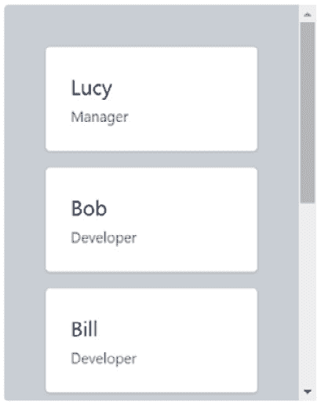
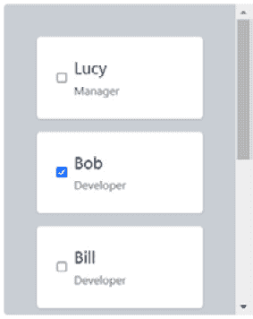

# 11

# 可重用组件

在本章中，我们将构建一个清单组件，并使用各种模式使其高度可重用，同时仍然具有强类型。

我们将首先使用 TypeScript **泛型**来为传递给组件的数据提供强类型。然后，我们将使用**属性展开**模式使组件 API 灵活，并允许组件消费者使用**渲染属性**模式自定义渲染组件的部分。之后，我们将学习如何创建自定义钩子，并使用它来提取勾选项的逻辑，以及如何使组件内的状态可控制以改变组件的行为。

我们将涵盖以下主题：

+   创建项目

+   使用泛型属性

+   使用属性展开

+   使用渲染属性

+   添加勾选功能

+   创建自定义钩子

+   允许内部状态受控

# 技术要求

在本章中，我们将使用以下技术：

+   **Node.js**和**npm**：您可以从这里安装它们：[`nodejs.org/en/download/`](https://nodejs.org/en/download/)。

+   **Visual Studio Code**：您可以从这里安装它：[`code.visualstudio.com/`](https://code.visualstudio.com/)。

本章中的所有代码片段都可以在以下网址找到：[`github.com/PacktPublishing/Learn-React-with-TypeScript-2nd-Edition/tree/main/Chapter11`](https://github.com/PacktPublishing/Learn-React-with-TypeScript-2nd-Edition/tree/main/Chapter11)。

# 创建项目

在本节中，我们将为我们将要构建的应用程序及其文件夹结构创建项目。文件夹结构将非常简单，因为它包含一个带有我们将构建的清单组件的单页。

我们将使用与之前章节相同的方式，使用 Visual Studio Code 开发应用程序，因此请打开 Visual Studio Code 并执行以下步骤：

1.  使用 Create React App 创建项目。如果您记不起这些步骤，请参阅*第三章*，*设置 React 和 TypeScript*。

1.  我们将使用 Tailwind CSS 来设计应用程序，因此请将此安装到项目中并配置它。如果您记不起这些步骤，请参阅*第五章*，*前端设计方法*。

这就完成了项目设置。

# 使用泛型属性

在本节中，我们将花一些时间了解如何创建我们自己的泛型类型，并了解 TypeScript 中的`keyof`功能，这对于泛型类型非常有用。我们将使用这些知识来构建具有泛型属性的第一版清单组件。

## 理解泛型

我们在这本书中使用了泛型。例如，`useState`钩子有一个可选的泛型参数，用于状态变量的类型：

```js
const [visible, setVisible] = useState<boolean>()
```

函数中的泛型参数允许该函数使用不同的类型进行重用，并且具有强类型。以下函数返回数组中的第一个元素，如果数组为空，则返回`null`。然而，该函数仅适用于`string`数组：

```js
function first(array: Array<string>): string | null {
  return array.length === 0 ? null : array[0];
}
```

泛型使我们能够使这个函数适用于任何类型的数组。

### 泛型函数

尽管我们在这本书中使用了泛型函数，但我们还没有创建自己的泛型函数。泛型类型参数在函数括号之前的尖括号中定义：

```js
function someFunc<T1, T2, ...>(...) {
 ...
}
```

泛型类型的名称可以是任何你喜欢的，但应该是有意义的，以便于理解。

这里是之前看到的函数的泛型版本。现在，它可以与包含任何类型元素的数组一起工作：

```js
function first<Item>(array: Array<Item>): Item | null {
  return array.length === 0 ? null : array[0];
}
```

函数有一个名为`Item`的单个泛型参数，它在`array`函数参数的类型以及函数的返回类型中使用。

### 泛型类型

自定义类型也可以是泛型的。对于`type`别名，其泛型参数在类型名称之后的尖括号中定义：

```js
type TypeName<T1, T2, …> = {
 ...
}
```

例如，React 组件的属性可以是泛型的。以下是一个泛型属性类型的示例：

```js
type Props<Item> = {
  items: Item[];
  ...
};
```

`Props`类型有一个名为`Item`的单个泛型参数，它在`items`属性的类型中使用。

### 泛型 React 组件

泛型属性可以被集成到一个泛型函数中，以生成一个泛型 React 组件。以下是一个泛型`List`组件的示例：

```js
type Props<Item> = {
  items: Item[];
};
export function List<Item>({ items }: Props<Item>) {
  ...
}
```

`List`组件中的`items`属性现在可以是任何类型，这使得组件更加灵活和可重用。

现在我们已经了解了如何创建具有泛型属性的组件，我们将创建检查列表组件的第一迭代。

## 创建一个基本的列表组件

我们现在开始创建我们的可重用组件。在这个迭代中，它将是一个包含从数据数组中获取的一些主要和次要文本的基本列表。

执行以下步骤：

1.  首先，在`src`文件夹中创建一个名为`Checklist`的组件文件夹。然后，在这个文件夹中创建一个名为`Checklist.tsx`的文件。

1.  打开`Checklist.tsx`并添加以下`Props`类型：

    ```js
    type Props<Data> = {
    ```

    ```js
      data: Data[];
    ```

    ```js
      id: keyof Data;
    ```

    ```js
      primary: keyof Data;
    ```

    ```js
      secondary: keyof Data;
    ```

    ```js
    };
    ```

下面是对每个属性的说明：

+   `data`属性是驱动列表中项的数据

+   `id`属性是每个数据项中唯一标识该项的属性名

+   `primary`属性是每个数据项中包含要渲染在各个项中的主要文本的属性名

+   `secondary`属性是每个数据项中包含要渲染在各个项中的补充文本的属性名

这是我们第一次在类型注解中遇到`keyof`运算符。它查询其后的指定类型以获取属性名，并从它们构造一个联合类型，因此`id`、`primary`和`secondary`的类型将是从每个数据项的所有属性名组成的联合类型。

1.  接下来，开始按照以下方式实现组件函数：

    ```js
    export function Checklist<Data>({
    ```

    ```js
      data,
    ```

    ```js
      id,
    ```

    ```js
      primary,
    ```

    ```js
      secondary,
    ```

    ```js
    }: Props<Data>) {
    ```

    ```js
      return (
    ```

    ```js
        <ul className="bg-gray-300 rounded p-10">
    ```

    ```js
          {data.map((item) => {
    ```

    ```js
          })}
    ```

    ```js
        </ul>
    ```

    ```js
      );
    ```

    ```js
    }
    ```

组件渲染一个灰色、无序列表元素，具有圆角。我们还遍历数据项，我们最终将在其中渲染每个项。

1.  我们将首先在 `data.map` 函数内部实现该功能。该函数检查唯一标识符（`idValue`）是否为字符串或数字，如果不是，则不会渲染任何内容。该函数还检查主文本属性（`primaryText`）是否为字符串，如果不是，同样不会渲染任何内容：

    ```js
    {data.map((item) => {
    ```

    ```js
      const idValue = item[id] as unknown;
    ```

    ```js
      if (
    ```

    ```js
        typeof idValue !== 'string' &&
    ```

    ```js
        typeof idValue !== 'number'
    ```

    ```js
      ) {
    ```

    ```js
        return null;
    ```

    ```js
      }
    ```

    ```js
      const primaryText = item[primary] as unknown;
    ```

    ```js
      if (typeof primaryText !== 'string') {
    ```

    ```js
        return null;
    ```

    ```js
      }
    ```

    ```js
      const secondaryText = item[secondary] as unknown;
    ```

    ```js
    }
    ```

1.  通过以下方式完成实现，将列表项渲染如下：

    ```js
    {data.map((item) => {
    ```

    ```js
      ...
    ```

    ```js
      return (
    ```

    ```js
        <li
    ```

    ```js
          key={idValue}
    ```

    ```js
          className="bg-white p-6 shadow rounded mb-4         last:mb-0"
    ```

    ```js
        >
    ```

    ```js
          <div className="text-xl text-gray-800 pb-1">
    ```

    ```js
            {primaryText}
    ```

    ```js
          </div>
    ```

    ```js
          {typeof secondaryText === 'string' && (
    ```

    ```js
            <div className="text-sm text-gray-500">
    ```

    ```js
              {secondaryText}
    ```

    ```js
            </div>
    ```

    ```js
          )}
    ```

    ```js
        </li>
    ```

    ```js
      );
    ```

    ```js
    })}
    ```

列表项以白色背景和圆角渲染。主文本以大号灰色文本渲染，次要文本则渲染得小得多。

1.  在 `Checklist` 文件夹中创建一个名为 `index.ts` 的新文件，并将 `Checklist` 组件导出到其中：

    ```js
    export * from './Checklist';
    ```

此文件将简化 `Checklist` 组件的 `import` 语句。

1.  在看到组件的实际效果之前，最后的步骤是将它添加到应用程序的组件树中。打开 `App.tsx` 并将其内容替换为以下内容：

    ```js
    import { Checklist } from './Checklist';
    ```

    ```js
    function App() {
    ```

    ```js
      return (
    ```

    ```js
        <div className="p-10">
    ```

    ```js
          <Checklist
    ```

    ```js
            data={[
    ```

    ```js
              { id: 1, name: 'Lucy', role: 'Manager' },
    ```

    ```js
              { id: 2, name: 'Bob', role: 'Developer' },
    ```

    ```js
            ]}
    ```

    ```js
            id="id"
    ```

    ```js
            primary="name"
    ```

    ```js
            secondary="role"
    ```

    ```js
          />
    ```

    ```js
        </div>
    ```

    ```js
      );
    ```

    ```js
    }
    ```

    ```js
    export default App;
    ```

我们引用 `Checklist` 组件并将其传递一些数据。注意 `id`、`primary` 和 `secondary` 属性的类型安全性 – 我们被迫使用有效的属性名与数据项一起输入。

1.  通过在终端中输入 `npm start` 来运行应用程序。清单组件将如图所示出现：


图 11.1 – 我们的基本清单组件

目前，该组件渲染一个基本列表 – 我们将在本章后面添加已检查的功能。

这完成了关于泛型属性的部分。

回顾一下，以下是一些关键点：

+   TypeScript 泛型允许可重用代码具有强类型。

+   函数可以有泛型参数，这些参数在实现中被引用。

+   类型也可以有泛型参数，这些参数在实现中被引用。

+   通过向泛型函数组件中传递泛型属性类型，可以使 React 组件成为泛型。组件实现将基于泛型属性。

接下来，我们将了解一个允许属性类型从 HTML 元素继承属性的模式的用法。

# 使用属性展开

在本节中，我们将了解一个名为 `ul` 元素的模式。这将允许组件的消费者指定属性，例如清单的高度和宽度。

因此，执行以下步骤：

1.  打开 `Checklist.tsx` 并从 React 中导入以下类型：

    ```js
    import { ComponentPropsWithoutRef } from 'react';
    ```

此类型允许我们引用 HTML 元素（如 `ul`）的属性。它是一个泛型类型，它将 HTML 元素名称作为泛型参数。

1.  将 `ul` 元素的属性添加到组件属性类型中，如下所示：

    ```js
    type Props<Data> = {
    ```

    ```js
      data: Data[];
    ```

    ```js
      id: keyof Data;
    ```

    ```js
      primary: keyof Data;
    ```

    ```js
      secondary: keyof Data;
    ```

    ```js
    } & ComponentPropsWithoutRef<'ul'>;
    ```

1.  添加一个 `ulProps` 来收集 `ul` 元素的所有属性到一个单一的 `ulProps` 变量中：

    ```js
    export function Checklist<Data>({
    ```

    ```js
      data,
    ```

    ```js
      id,
    ```

    ```js
      primary,
    ```

    ```js
      secondary,
    ```

    ```js
      ...ulProps
    ```

    ```js
    }: Props<Data>) {
    ```

    ```js
      ...
    ```

    ```js
    }
    ```

这是我们在这本书中第一次使用剩余参数。它们将传递到函数中的多个参数收集到一个数组中，所以任何未称为 `data`、`id`、`primary` 或 `secondary` 的属性都将收集到 `ulProps` 数组中。有关剩余参数的更多信息，请参阅 [`developer.mozilla.org/en-US/docs/Web/JavaScript/Reference/Functions/rest_parameters`](https://developer.mozilla.org/en-US/docs/Web/JavaScript/Reference/Functions/rest_parameters)。

1.  现在，我们可以使用扩展运算符将 `ulProps` 传播到 `ul` 元素上：

    ```js
    export function Checklist<Data>({
    ```

    ```js
      data,
    ```

    ```js
      id,
    ```

    ```js
      primary,
    ```

    ```js
      secondary,
    ```

    ```js
      ...ulProps
    ```

    ```js
    }: Props<Data>) {
    ```

    ```js
      return (
    ```

    ```js
        <ul
    ```

    ```js
          className="bg-gray-300 rounded p-10"
    ```

    ```js
          {...ulProps}
    ```

    ```js
        >...</ul>
    ```

    ```js
      );
    ```

    ```js
    }
    ```

1.  我们可以使用 `Checklist` 的新功能来指定列表的高度和宽度。打开 `App.tsx` 并添加以下 `style` 属性，以及更多数据项：

    ```js
    <Checklist
    ```

    ```js
      data={[
    ```

    ```js
        { id: 1, name: 'Lucy', role: 'Manager' },
    ```

    ```js
        { id: 2, name: 'Bob', role: 'Developer' },
    ```

    ```js
        { id: 3, name: 'Bill', role: 'Developer' },
    ```

    ```js
        { id: 4, name: 'Tara', role: 'Developer' },
    ```

    ```js
        { id: 5, name: 'Sara', role: 'UX' },
    ```

    ```js
        { id: 6, name: 'Derik', role: 'QA' }
    ```

    ```js
      ]}
    ```

    ```js
      id="id"
    ```

    ```js
      primary="name"
    ```

    ```js
      secondary="role"
    ```

    ```js
      style={{
    ```

    ```js
        width: '300px',
    ```

    ```js
        maxHeight: '380px',
    ```

    ```js
        overflowY: 'auto'
    ```

    ```js
      }}
    ```

    ```js
    />
    ```

1.  如果应用程序没有运行，请在终端中输入 `npm start` 来运行它。清单组件以我们预期的尺寸出现：



图 11.2 – 尺寸化的清单组件

由于我们传递到组件中的样式，组件现在具有固定的高度，并带有垂直滚动条。

这就完成了我们对属性传播模式的运用。以下是对关键点的回顾：

+   我们将属性类型与 `ComponentPropsWithoutRef` 交集，以添加我们想要传播到 HTML 元素上的属性

+   我们在组件属性中使用剩余参数来收集所有 HTML 元素属性到一个数组中

+   然后，我们可以在 JSX 中的 HTML 元素上扩展剩余参数

接下来，我们将学习一种允许消费者渲染组件部分的模式。

# 使用渲染属性

在本节中，我们将学习关于 **渲染属性** 模式的知识，并使用它来允许组件的消费者在清单组件内渲染项目。

## 理解渲染属性模式

使组件高度可重用的方法之一是允许消费者在其内部渲染内部元素。`button` 元素上的 `children` 属性就是这样一个例子，因为它允许我们指定我们喜欢的任何按钮内容：

```js
<button>We can specify any content here</button>
```

渲染属性模式允许我们使用除 `children` 之外的属性来提供这种能力。当 `children` 属性已经被用于其他目的时，这非常有用，如下面的例子所示：

```js
<Modal heading={<h3>Enter Details</h3>}>
  Some content
</Modal>
```

在这里，`heading` 是 `Modal` 组件中的一个渲染属性。

当允许消费者渲染与传递到组件中的数据相关的元素时，渲染属性非常有用，因为渲染属性可以是一个函数：

```js
<List
  data={[...]}
  renderItem={(item) => <div>{item.text}</div>}
/>
```

之前的例子有一个名为 `renderItem` 的渲染属性，它在 `List` 组件中渲染每个列表项。数据项传递给它，以便它可以在列表项中包含其属性。这与我们接下来将为我们的清单组件实现的内容类似。

## 添加 `renderItem` 属性

我们将在清单中添加一个名为 `renderItem` 的属性，允许消费者控制列表项的渲染。执行以下步骤：

1.  打开 `Checklist.tsx` 并将 `ReactNode` 类型添加到 React `import` 语句中：

    ```js
    import { ComponentPropsWithoutRef, ReactNode } from 'react';
    ```

`ReactNode`代表 React 可以渲染的元素。因此，我们将使用`ReactNode`作为我们渲染属性的返回类型。

1.  向`Props`类型添加一个名为`renderItem`的渲染属性：

    ```js
    type Props<Data> = {
    ```

    ```js
      data: Data[];
    ```

    ```js
      id: keyof Data;
    ```

    ```js
      primary: keyof Data;
    ```

    ```js
      secondary: keyof Data;
    ```

    ```js
      renderItem?: (item: Data) => ReactNode;
    ```

    ```js
    } & React.ComponentPropsWithoutRef<'ul'>;
    ```

该属性是一个函数，它接受数据项并返回需要渲染的内容。我们将其设置为可选，因为我们将为列表项提供默认实现，同时也允许消费者覆盖它。

1.  将`renderItem`添加到组件函数参数中：

    ```js
    export function Checklist<Data>({
    ```

    ```js
      data,
    ```

    ```js
      id,
    ```

    ```js
      primary,
    ```

    ```js
      secondary,
    ```

    ```js
      renderItem,
    ```

    ```js
      ...ulProps
    ```

    ```js
    }: Props<Data>) {
    ```

    ```js
      ...
    ```

    ```js
    }
    ```

1.  在 JSX 中，在映射函数顶部添加一个`if`语句来检查是否指定了`renderItem`属性。如果指定了`renderItem`，则使用数据项调用它，并从映射函数中返回其结果：

    ```js
    <ul ...>
    ```

    ```js
      {data.map((item) => {
    ```

    ```js
        if (renderItem) {
    ```

    ```js
          return renderItem(item);
    ```

    ```js
        }
    ```

    ```js
        const idValue = item[id] as unknown;
    ```

    ```js
        ...
    ```

    ```js
      })}
    ```

    ```js
    </ul>
    ```

因此，如果指定了`renderItem`，它将被调用以获取作为列表项渲染的元素。如果没有指定`renderItem`，它将像之前一样渲染列表项。

1.  为了尝试新属性，打开`App.tsx`并添加以下`renderItem`属性：

    ```js
    <Checklist
    ```

    ```js
      ...
    ```

    ```js
      renderItem={(item) => (
    ```

    ```js
        <li key={item.id} className="bg-white p-4       border-b-2">
    ```

    ```js
          <div className="text-xl text-slate-800 pb-1">
    ```

    ```js
            {item.name}
    ```

    ```js
          </div>
    ```

    ```js
          <div className="text-slate-500">{item.role}</div>
    ```

    ```js
        </li>
    ```

    ```js
      )}
    ```

    ```js
    />
    ```

列表项现在以扁平、白色的形式渲染，它们之间有边框。

1.  如果应用没有运行，请在终端中输入`npm start`来运行它。带有覆盖列表项的清单组件将出现：


图 11.3 – 覆盖的列表项

1.  在继续下一节之前，请从`App.tsx`中的`Checklist`元素中移除`renderItem`的使用。然后应该出现列表项的默认渲染。

这就完成了关于渲染属性模式的这一节。为了回顾，以下是一些关键点：

+   渲染属性模式允许组件消费者覆盖组件的部分渲染。

+   渲染属性可以是元素或返回元素的函数。

+   渲染属性的一个常见用例是数据驱动的列表，其中可以覆盖列表项的渲染。

接下来，我们将向清单组件添加检查功能。

# 添加检查功能

目前，我们的清单组件不包含检查项的能力，因此我们现在将复选框添加到项目列表中，使用户能够检查它们。我们将使用 React 状态跟踪已检查的项。

因此，执行以下步骤将此功能添加到我们的组件中：

1.  打开`Checklist.tsx`并在 React `import`语句中添加`useState`：

    ```js
    import {
    ```

    ```js
      ComponentPropsWithoutRef,
    ```

    ```js
      ReactNode,
    ```

    ```js
      useState
    ```

    ```js
    } from 'react';
    ```

我们将使用状态来存储已检查项的 ID。

1.  在组件实现顶部，添加已选中项的 ID 状态：

    ```js
    const [checkedIds, setCheckedIds] = useState<IdValue[]>([]);
    ```

我们引用了一个尚未定义的`IdValue`类型 – 我们将在完成组件实现步骤 6 后定义它。

1.  按如下方式将复选框添加到项目列表中：

    ```js
    <li
    ```

    ```js
      key={idValue}
    ```

    ```js
      className="bg-white p-6 shadow rounded mb-4 last:mb-0"
    ```

    ```js
    >
    ```

    ```js
      <label className="flex items-center">
    ```

    ```js
        <input
    ```

    ```js
          type="checkbox"
    ```

    ```js
          checked={checkedIds.includes(idValue)}
    ```

    ```js
          onChange={handleCheckChange(idValue)}
    ```

    ```js
        />
    ```

    ```js
        <div className="ml-2">
    ```

    ```js
          <div className="text-xl text-gray-800 pb-1">
    ```

    ```js
            {primaryText}
    ```

    ```js
          </div>
    ```

    ```js
          {typeof secondaryText === 'string' && (
    ```

    ```js
            <div className="text-sm text-gray-500">
    ```

    ```js
              {secondaryText}
    ```

    ```js
            </div>
    ```

    ```js
          )}
    ```

    ```js
        </div>
    ```

    ```js
      </label>
    ```

    ```js
    </li>
    ```

`checkedIds`状态通过检查列表项的 ID 是否包含在其中，为复选框的`checked`属性提供动力。

我们将在下一步实现引用的`handleCheckChange`函数。注意，引用调用函数时传递了已检查的列表项的 ID。

1.  按照以下方式在组件中开始实现 `handleCheckChange` 函数：

    ```js
    const [checkedIds, setCheckedIds] = useState<IdValue[]>([]);
    ```

    ```js
    const handleCheckChange = (checkedId: IdValue) => () => {};
    ```

    ```js
    return ...
    ```

这是一个返回处理函数的函数。这种复杂性是因为基本的已选处理函数没有传入列表项的 ID。这种方法被称为**柯里化**，更多关于它的信息可以在以下链接中找到：[`javascript.info/currying-partials`](https://javascript.info/currying-partials)。

1.  按照以下方式完成处理函数的实现：

    ```js
    const handleCheckChange = (checkedId: IdValue) => () => {
    ```

    ```js
      const isChecked = checkedIds.includes(checkedId);
    ```

    ```js
      let newCheckedIds = isChecked
    ```

    ```js
        ? checkedIds.filter(
    ```

    ```js
            (itemCheckedid) => itemCheckedid !== checkedId
    ```

    ```js
          )
    ```

    ```js
        : checkedIds.concat(checkedId);
    ```

    ```js
      setCheckedIds(newCheckedIds);
    ```

    ```js
    };
    ```

实现更新列表项的 ID 到 `checkedIds` 状态，如果列表项已被选中，如果未选中则移除它。

1.  接下来，让我们定义 `IdValue` 类型。在 `Checklist` 文件夹中创建一个名为 `types.ts` 的新文件，其中包含 `IdValue` 的定义：

    ```js
    export type IdValue = string | number;
    ```

在这里，列表项的 ID 可以是 `string` 或 `number` 类型的值。

1.  返回到 `Checklist.tsx` 并导入 `IdValue`：

    ```js
    import { IdValue } from './types';
    ```

现在应该已经解决了编译错误。

1.  如果应用没有运行，请在终端中输入 `npm start` 来运行它。检查清单组件将带有每个列表项的复选框显示出来：



图 11.4 – 列表项的复选框

检查清单组件现在包括复选框。然而，有一个机会可以使已选逻辑可重用——我们将在下一节中介绍这一点。

# 创建自定义钩子

在本节中，我们将了解自定义 React 钩子。然后，我们将使用这些知识从检查清单组件中提取已选逻辑到一个可重用的自定义钩子。

## 理解自定义钩子

除了 `useState` 等标准钩子之外，React 允许我们创建自己的自定义钩子。自定义钩子允许逻辑在多个组件之间隔离和重用。

自定义钩子是通过一个以单词 *use* 开头的函数定义的。这种命名约定有助于 ESLint 检查自定义钩子使用中存在的问题。以下是一个提供切换逻辑的自定义钩子：

```js
export function useToggle() {
  const [toggleValue, setToggleValue] = useState(false);
  function toggle() {
    setToggleValue(!toggleValue);
  }
  return {toggleValue, toggle};
};
```

自定义钩子包含当前切换值的状态，该值可以是 `true` 或 `false`。它还包括一个名为 `toggle` 的函数，该函数切换当前值。当前切换值和 `toggle` 函数以对象结构从自定义钩子返回。

注意，不需要返回对象结构。如果自定义钩子只返回一个项目，则可以直接返回该项目。如果自定义钩子返回两个项目（如前例所示），则可以返回一个元组（如 `useState` 所做的那样）。对于两个以上的项目，对象结构更好，因为对象键可以清楚地说明每个项目是什么。

自定义钩子的另一个特性是它使用了其他标准 React 钩子。例如，`useToggle` 自定义钩子使用了 `useState`。如果自定义钩子没有调用 React 钩子或另一个自定义钩子，它就只是一个普通函数，而不是自定义钩子。

这个自定义钩子可以在组件的实现中如下使用：

```js
const { toggleValue, toggle } = useToggle();
return (
  <div className="App">
    <button onClick={toggle}>{toggleValue ? 'ON' : 'OFF'}</button>
  </div>
);
```

从自定义钩子的返回值中解构出切换值（`toggleValue`）和`toggle`函数。切换值用于渲染文本`true`或`false`。`toggle`函数也被分配给按钮的点击处理函数。

自定义钩子也可以接受参数。在这个例子中，我们在`useToggle`钩子中添加了一个默认值：

```js
type Params = {
  defaultToggleValue?: boolean;
};
export function useToggle({ defaultToggleValue }: Params) {
  const [toggleValue, setToggleValue] = useState(
    defaultToggleValue
  );
  ...
}
```

在前面的示例中，参数以对象结构形式存在。当有多个参数时，对象结构很方便，并且添加新参数时不会出问题。

参数以对象的形式传递到自定义钩子中。以下是一个使用`useToggle`的示例，其初始值为`true`：

```js
const { toggleValue, toggle } = useToggle({
  defaultToggleValue: true
});
```

现在我们已经了解了如何创建和使用自定义钩子，我们将在我们的清单组件中将其付诸实践。

## 将勾选逻辑提取到自定义钩子中

我们将把勾选项的逻辑提取到一个自定义钩子中。这将允许未来的组件使用这个逻辑，并使代码更加整洁。

自定义钩子将被命名为`useChecked`，并将包含勾选列表项 ID 的状态。钩子还将包括一个可以附加到复选框的处理函数，以更新勾选列表项 ID 的状态。

要做到这一点，请执行以下步骤：

1.  在`Checklist`文件夹中，创建一个名为`useChecked.ts`的自定义钩子文件。

1.  打开`useChecked.ts`并添加以下`import`语句：

    ```js
    import { useState } from 'react';
    ```

    ```js
    import { IdValue } from './types';
    ```

该钩子将使用通过`IdValue`类型化的 React 状态。

1.  开始实现自定义钩子的函数，通过初始化状态：

    ```js
    export function useChecked() {
    ```

    ```js
      const [checkedIds, setCheckedIds] =     useState<IdValue[]>([]);
    ```

    ```js
    }
    ```

该钩子没有任何参数。`useState`的调用与当前`Checklist`组件中的调用完全相同——这可以复制粘贴到自定义钩子中。

1.  向自定义钩子添加一个勾选处理函数。这可以从`Checklist`组件的实现中复制：

    ```js
    export function useChecked() {
    ```

    ```js
      const [checkedIds, setCheckedIds] =     useState<IdValue[]>([]);
    ```

    ```js
      const handleCheckChange = (checkedId: IdValue) => () => {
    ```

    ```js
        const isChecked = checkedIds.includes(checkedId);
    ```

    ```js
        let newCheckedIds = isChecked
    ```

    ```js
          ? checkedIds.filter(
    ```

    ```js
              (itemCheckedid) => itemCheckedid !== checkedId
    ```

    ```js
            )
    ```

    ```js
          : checkedIds.concat(checkedId);
    ```

    ```js
        setCheckedIds(newCheckedIds);
    ```

    ```js
      };
    ```

    ```js
    }
    ```

1.  自定义钩子实现中的最后一个任务是返回勾选 ID 和处理函数：

    ```js
    export function useChecked() {
    ```

    ```js
      ...
    ```

    ```js
      return { handleCheckChange, checkedIds };
    ```

    ```js
    }
    ```

1.  接下来，打开`Checklist.tsx`并移除状态定义和`handleCheckChange`处理函数。同时，从`import`语句中移除`useState`和`IdValue`，因为它们是多余的。

1.  仍然在`Checklist.tsx`中，导入我们刚刚创建的`useChecked`钩子：

    ```js
    import { useChecked } from './useChecked';
    ```

1.  调用`useChecked`并解构勾选 ID 和处理函数：

    ```js
    export function Checklist<Data>({ ... }: Props<Data>) {
    ```

    ```js
      const { checkedIds, handleCheckChange } = useChecked();
    ```

    ```js
      return ...
    ```

    ```js
    }
    ```

1.  如果应用没有运行，请在终端中输入`npm start`来运行它。清单组件将出现并像我们做出这些更改之前一样表现。

这样就完成了自定义钩子的实现和使用。总结一下，以下是一些关键点：

+   自定义钩子使代码更加整洁，并且由于它们隔离了逻辑，因此是可重用的。

+   自定义钩子必须以`use`开头。

+   自定义钩子必须使用标准的 React 钩子或另一个自定义钩子。

+   自定义钩子只是一个返回组件可以使用的有用东西的函数。当返回许多项目时，使用对象结构是理想的，因为对象键清楚地说明了每个项目是什么。

+   自定义钩子可以有参数。使用对象结构作为参数对于许多项目来说很理想，并且当添加新参数时不会破坏任何东西。

接下来，我们将介绍一个模式，允许组件的消费者使用状态来控制其部分行为。

# 允许控制内部状态

在本节中，我们将学习如何允许组件的消费者控制其内部状态。我们将在清单组件中使用此模式，以便用户可以只检查单个项目。

## 理解如何控制内部状态

允许组件的消费者控制状态可以使组件的行为根据状态进行调整。让我们通过一个例子来了解，这个例子使用了我们在上一节学习自定义钩子时提到的`useToggle`自定义钩子。

需要额外的两个属性来允许控制内部状态——一个用于当前状态值，另一个用于变化处理器。这些额外的属性在`useToggle`中是`toggleValue`和`onToggleValueChange`：

```js
type Params = {
  defaultToggleValue?: boolean;
  toggleValue?: boolean;
  onToggleValueChange?: (toggleValue: boolean) => void;
};
export function useToggle({
  defaultToggleValue,
  toggleValue,
  onToggleValueChange,
}: Params) {
  ...
}
```

这些属性被标记为可选，因为此模式并不强制组件的消费者控制状态——这是一个他们可以选择加入的功能。

注意

组件的消费者永远不会同时指定`defaultToggleValue`和`toggleValue`。`defaultToggleValue`仅在消费者不想使用状态来控制`toggleValue`时使用。当消费者想要使用状态来控制`toggleValue`时，他们可以设置他们状态的初始值。

现在`toggleValue`属性与`toggleValue`状态冲突，因为它们有相同的名称，因此需要将状态重命名：

```js
const [resolvedToggleValue, setResolvedToggleValue] =
  useState(defaultToggleValue);
function toggle() {
  setResolvedToggleValue(!resolvedToggleValue);
}
return { resolvedToggleValue, toggle };
```

内部状态的默认值现在需要考虑可能存在控制状态的属性：

```js
const [resolvedToggleValue, setResolvedToggleValue] =
  useState(defaultToggleValue || toggleValue);
```

当状态改变时，如果已定义变化处理器，则会被调用：

```js
function toggle() {
  if (onToggleValueChange) {
    onToggleValueChange(!resolvedToggleValue);
  } else {
    setResolvedToggleValue(!resolvedToggleValue);
  }
}
```

再次强调，即使消费者没有控制状态，我们也需要更新内部状态。

实现此模式时的最后一步是在受控状态更新时更新内部状态。我们可以使用`useEffect`来完成此操作：

```js
useEffect(() => {
  const isControlled = toggleValue !== undefined;
  if (isControlled) {
    setResolvedToggleValue(toggleValue);
  }
}, [toggleValue]);
```

当状态属性改变时，会触发效果。我们检查状态属性是否正在被控制；如果是，则使用其值更新内部状态。

下面是一个在`useToggle`中控制`toggleValue`的例子：

```js
const [toggleValue, setToggleValue] = useState(false);
const onCount = useRef(0);
const { resolvedToggleValue, toggle } = useToggle({
  toggleValue,
  onToggleValueChange: (value) => {
    if (onCount.current >= 3) {
      setToggleValue(false);
    } else {
      setToggleValue(value);
      if (value) {
        onCount.current++;
      }
    }
  },
});
```

此示例将切换值存储在其自己的状态中，并将其传递给`useToggle`。`onToggleValueChange`通过更新状态值来处理。仅允许状态值设置为`true`最多三次的逻辑。

因此，这个用例已经覆盖了切换的默认行为，使其只能设置为`true`最多三次。

现在我们已经了解了如何允许内部状态受控，我们将在清单组件中使用它。

## 允许`checkedIds`受控

目前，我们的清单组件允许选择多个项目。如果我们允许`checkedIds`状态由消费者控制，他们可以更改清单组件，以便他们只能选择单个项目。

因此，执行以下步骤：

1.  我们将从`useChecked.ts`开始。向 React `import`语句添加`useEffect`：

    ```js
    import { useState, useEffect } from 'react';
    ```

1.  为受控的选中 ID 和更改处理程序添加新参数：

    ```js
    type Params = {
    ```

    ```js
      checkedIds?: IdValue[];
    ```

    ```js
      onCheckedIdsChange?: (checkedIds: IdValue[]) => void;
    ```

    ```js
    };
    ```

    ```js
    export function useChecked({
    ```

    ```js
      checkedIds,
    ```

    ```js
      onCheckedIdsChange,
    ```

    ```js
    }: Params) {
    ```

    ```js
      ...
    ```

    ```js
    }
    ```

1.  更新内部状态名称为`resolvedCheckedIds`，并在定义的情况下将其默认为传入的`checkedIds`参数：

    ```js
    export function useChecked({
    ```

    ```js
      checkedIds,
    ```

    ```js
      onCheckedIdsChange,
    ```

    ```js
    }: Params) {
    ```

    ```js
      const [resolvedCheckedIds, setResolvedCheckedIds] =
    ```

    ```js
        useState<IdValue[]>(checkedIds || []);
    ```

    ```js
      const handleCheckChange = (checkedId: IdValue) => () => {
    ```

    ```js
        const isChecked = resolvedCheckedIds.      includes(checkedId);
    ```

    ```js
        let newCheckedIds = isChecked
    ```

    ```js
          ? resolvedCheckedIds.filter(
    ```

    ```js
              (itemCheckedid) => itemCheckedid !== checkedId
    ```

    ```js
            )
    ```

    ```js
          : resolvedCheckedIds.concat(checkedId);
    ```

    ```js
        setResolvedCheckedIds(newCheckedIds);
    ```

    ```js
      };
    ```

    ```js
      return { handleCheckChange, resolvedCheckedIds };
    ```

    ```js
    }
    ```

1.  更新`handleCheckChange`处理程序以在定义的情况下调用传入的更改处理程序：

    ```js
    const handleCheckChange = (checkedId: IdValue) => () => {
    ```

    ```js
      const isChecked = resolvedCheckedIds.    includes(checkedId);
    ```

    ```js
      let newCheckedIds = isChecked
    ```

    ```js
        ? resolvedCheckedIds.filter(
    ```

    ```js
            (itemCheckedid) => itemCheckedid !== checkedId
    ```

    ```js
          )
    ```

    ```js
        : resolvedCheckedIds.concat(checkedId);
    ```

    ```js
      if (onCheckedIdsChange) {
    ```

    ```js
        onCheckedIdsChange(newCheckedIds);
    ```

    ```js
      } else {
    ```

    ```js
        setResolvedCheckedIds(newCheckedIds);
    ```

    ```js
      }
    ```

    ```js
    };
    ```

1.  在`useCheck.ts`中的最后一个任务是同步受控的选中 ID 与内部状态。添加以下`useEffect`钩子以实现此目的：

    ```js
    useEffect(() => {
    ```

    ```js
      const isControlled = checkedIds !== undefined;
    ```

    ```js
      if (isControlled) {
    ```

    ```js
        setResolvedCheckedIds(checkedIds);
    ```

    ```js
      }
    ```

    ```js
    }, [checkedIds]);
    ```

1.  现在，打开`Checklist.tsx`并导入`IdValue`类型：

    ```js
    import { IdValue } from './types';
    ```

1.  为受控的选中 ID 和更改处理程序添加新 props：

    ```js
    type Props<Data> = {
    ```

    ```js
      data: Data[];
    ```

    ```js
      id: keyof Data;
    ```

    ```js
      primary: keyof Data;
    ```

    ```js
      secondary: keyof Data;
    ```

    ```js
      renderItem?: (item: Data) => ReactNode;
    ```

    ```js
      checkedIds?: IdValue[];
    ```

    ```js
      onCheckedIdsChange?: (checkedIds: IdValue[]) => void;
    ```

    ```js
    } & ComponentPropsWithoutRef<'ul'>;
    ```

    ```js
    export function Checklist<Data>({
    ```

    ```js
      data,
    ```

    ```js
      id,
    ```

    ```js
      primary,
    ```

    ```js
      secondary,
    ```

    ```js
      renderItem,
    ```

    ```js
      checkedIds,
    ```

    ```js
      onCheckedIdsChange,
    ```

    ```js
      ...ulProps
    ```

    ```js
    }: Props<Data>) {}
    ```

1.  将这些 props 传递给`useChecked`并将解构的`checkedIds`变量重命名为`resolvedCheckedIds`：

    ```js
    const { resolvedCheckedIds, handleCheckChange } = useChecked({
    ```

    ```js
      checkedIds,
    ```

    ```js
      onCheckedIdsChange,
    ```

    ```js
    });
    ```

    ```js
    return (
    ```

    ```js
      <ul className="bg-gray-300 rounded p-10" {...ulProps}>
    ```

    ```js
        {data.map((item) => {
    ```

    ```js
          ...
    ```

    ```js
          return (
    ```

    ```js
            <li ... >
    ```

    ```js
              <label className="flex items-center">
    ```

    ```js
                <input
    ```

    ```js
                  type="checkbox"
    ```

    ```js
                  checked={resolvedCheckedIds.                includes(idValue)}
    ```

    ```js
                  onChange={handleCheckChange(idValue)}
    ```

    ```js
                />
    ```

    ```js
                ...
    ```

    ```js
              </label>
    ```

    ```js
            </li>
    ```

    ```js
          );
    ```

    ```js
        })}
    ```

    ```js
      </ul>
    ```

    ```js
    );
    ```

1.  在“清单”文件夹中打开`index.ts`文件。导出`IdValue`类型，因为组件的消费者现在可以传入`checkedIds`，这是一个该类型的数组：

    ```js
    export type { IdValue } from './types';
    ```

在`export`语句之后的`type`关键字是 TypeScript 在导出已从引用文件中导出的命名类型时必需的。

1.  现在，打开`App.tsx`并从 React 导入`useState`，以及`IdValue`类型：

    ```js
    import { useState } from 'react';
    ```

    ```js
    import {
    ```

    ```js
      Checklist,
    ```

    ```js
      IdValue
    ```

    ```js
    } from './Checklist';
    ```

1.  在`App`组件中定义状态以用于单个选中 ID：

    ```js
    function App() {
    ```

    ```js
      const [checkedId, setCheckedId] = useState<IdValue |     null>(
    ```

    ```js
        null
    ```

    ```js
      );
    ```

    ```js
      ...
    ```

    ```js
    }
    ```

当没有选中项时，状态是`null`。这不能设置为`undefined`，因为`Checklist`会认为`checkedIds`是未受控的。

1.  创建一个当项目被选中时的处理程序：

    ```js
    function handleCheckedIdsChange(newCheckedIds: IdValue[]) {
    ```

    ```js
      const newCheckedIdArr = newCheckedIds.filter(
    ```

    ```js
        (id) => id !== checkedId
    ```

    ```js
      );
    ```

    ```js
      if (newCheckedIdArr.length === 1) {
    ```

    ```js
        setCheckedId(newCheckedIdArr[0]);
    ```

    ```js
      } else {
    ```

    ```js
        setCheckedId(null);
    ```

    ```js
      }
    ```

    ```js
    }
    ```

处理程序将选中 ID 存储在状态中，或者在选中项被取消选中时将状态设置为`null`。

1.  按如下方式将选中 ID 和更改处理程序传递给`Checklist`元素：

    ```js
    <Checklist
    ```

    ```js
      ...
    ```

    ```js
      checkedIds={checkedId === null ? [] : [checkedId]}
    ```

    ```js
      onCheckedIdsChange={handleCheckedIdsChange}
    ```

    ```js
    />;
    ```

1.  让我们试一试。如果应用没有运行，请在终端中输入`npm start`来运行它。你会发现只能选中单个列表项。

这样就完成了关于允许内部状态受控的部分。以下是一个总结：

+   这种模式很有用，因为它改变了组件的行为

+   组件必须公开一个 prop 来控制状态值，另一个用于其更改处理程序

+   内部，组件仍然管理状态，并使用`useEffect`与消费者同步

+   如果状态是受控的，则调用消费者的更改处理程序在内部更改处理程序中

# 概述

在本章中，我们创建了一个可重用的清单组件，并在过程中使用了许多有用的模式。

我们首先学习了如何实现泛型属性，这允许组件使用不同的数据类型，但仍然保持强类型。我们使用它来允许将不同的数据传递到清单组件中，而不牺牲类型安全。

我们学习了如何允许组件的消费者将属性传播到内部元素。一个常见的用例是将属性传播到内部容器元素，以允许消费者调整其大小，这正是我们在清单组件中所做的。

渲染属性模式是开发可重用组件时最有用的模式之一。我们了解到它允许消费者负责渲染组件的部分。我们使用这个模式来覆盖我们的清单组件中列表项的渲染。

自定义钩子隔离逻辑，对于在组件之间共享逻辑并保持组件内的代码整洁非常有用。自定义钩子必须直接或间接地调用标准 React 钩子。我们将我们的清单组件中的选中逻辑提取到一个自定义钩子中。

我们最后学习的是允许组件的内部状态被控制。这个强大的模式允许组件的消费者调整其行为。我们使用这个模式来只允许在我们的清单组件中检查单个列表项。

在下一章中，我们将学习如何为 React 组件编写自动化测试。

# 问题

回答以下问题以检查你在本章中学到的内容：

1.  以下组件的片段渲染了选项，可以选择其中一个：

    ```js
    type Props<TOption> = {
    ```

    ```js
      options: TOption[];
    ```

    ```js
      value: string;
    ```

    ```js
      label: string;
    ```

    ```js
    };
    ```

    ```js
    export function Select({
    ```

    ```js
      options,
    ```

    ```js
      value,
    ```

    ```js
      label,
    ```

    ```js
    }: Props<TOption>) {
    ```

    ```js
      return ...
    ```

    ```js
    }
    ```

尽管在组件的属性参数上抛出了以下 TypeScript 错误：**找不到名称‘TOption’**。问题是什么？

1.  在问题 1 中的组件的 `value` 和 `label` 属性应该只设置为 `options` 值中的属性名。我们可以给 `value` 和 `label` 什么类型，以便 TypeScript 在类型检查中包含它们？

1.  在前一个问题中的 `Select` 组件中添加了一个名为 `option` 的属性，如下所示：

    ```js
    type Props<TOption> = {
    ```

    ```js
      ...,
    ```

    ```js
      option: ReactNode;
    ```

    ```js
    };
    ```

    ```js
    export function Select<TOption>({
    ```

    ```js
      ...,
    ```

    ```js
      option
    ```

    ```js
    }: Props<TOption>) {
    ```

    ```js
      return (
    ```

    ```js
        <div>
    ```

    ```js
          <input />
    ```

    ```js
          {options.map((option) => {
    ```

    ```js
            if (option) {
    ```

    ```js
              return option;
    ```

    ```js
            }
    ```

    ```js
            return ...
    ```

    ```js
          })}
    ```

    ```js
        </div>
    ```

    ```js
      );
    ```

    ```js
    }
    ```

`option` 应该允许组件的消费者覆盖选项的渲染。你能发现实现中的缺陷吗？

1.  以下是一个渲染 `label` 元素和 `input` 元素的 `Field` 组件：

    ```js
    type Props = {
    ```

    ```js
      label: string;
    ```

    ```js
    } & ComponentPropsWithoutRef<'input'>;
    ```

    ```js
    export function Field({ ...inputProps, label }: Props) {
    ```

    ```js
      return (
    ```

    ```js
        <>
    ```

    ```js
          <label>{label}</label>
    ```

    ```js
          <input {...inputProps} />
    ```

    ```js
        </>
    ```

    ```js
      );
    ```

    ```js
    }
    ```

虽然存在一个问题——你能发现它吗？

1.  消费者如何指定要传播到前一个问题中的 `Field` 组件中的 `label` 元素的属性？注意我们仍然希望消费者将属性传播到 `input` 元素。

1.  在前一个问题中的 `Field` 组件中添加了一个自定义钩子。这个自定义钩子被命名为 `useValid`，它验证字段是否已填充：

    ```js
    export function useValid() {
    ```

    ```js
      function validate(value: string) {
    ```

    ```js
        return (
    ```

    ```js
          value !== undefined && value !== null && value !==         ''
    ```

    ```js
        );
    ```

    ```js
      }
    ```

    ```js
      return validate;
    ```

    ```js
    }
    ```

    ```js
    export function Field({ ... }: Props) {
    ```

    ```js
      const [valid, setValid] = useState(true);
    ```

    ```js
      const validate = useValid();
    ```

    ```js
      return (
    ```

    ```js
        <>
    ```

    ```js
          <label {...labelProps}>{label}</label>
    ```

    ```js
          <input
    ```

    ```js
            {...inputProps}
    ```

    ```js
            onBlur={(e) => {
    ```

    ```js
              setValid(validate(e.target.value));
    ```

    ```js
            }}
    ```

    ```js
          />
    ```

    ```js
          {!valid && <span>Please enter something</span>}
    ```

    ```js
        </>
    ```

    ```js
      );
    ```

    ```js
    }
    ```

实现有什么问题？

1.  函数组件可以有多少个渲染属性？

# 答案

1.  泛型类型必须在组件函数以及属性中定义：

    ```js
    export function Select<TOption>({
    ```

    ```js
      options,
    ```

    ```js
      value,
    ```

    ```js
      label,
    ```

    ```js
    }: Props<TOption>) {
    ```

    ```js
      return ...
    ```

    ```js
    }
    ```

1.  `keyof`运算符可以用来确保`value`和`label`是`options`中的键：

    ```js
    type Props<TOption> = {
    ```

    ```js
      options: TOption[];
    ```

    ```js
      value: keyof TOption;
    ```

    ```js
      label: keyof TOption;
    ```

    ```js
    };
    ```

1.  消费者可能需要选项的数据，因此属性应该是一个包含数据作为参数的函数：

    ```js
    type Props<TOption> = {
    ```

    ```js
      ...,
    ```

    ```js
      renderOption: (option: TOption) => ReactNode;
    ```

    ```js
    };
    ```

    ```js
    export function Select<TOption>({
    ```

    ```js
      options,
    ```

    ```js
      value,
    ```

    ```js
      label,
    ```

    ```js
      renderOption,
    ```

    ```js
    }: Props<TOption>) {
    ```

    ```js
      return (
    ```

    ```js
        <div>
    ```

    ```js
          <input />
    ```

    ```js
          {options.map((option) => {
    ```

    ```js
            if (renderOption) {
    ```

    ```js
              return renderOption(option);
    ```

    ```js
            }
    ```

    ```js
            return ...
    ```

    ```js
        </div>
    ```

    ```js
      );
    ```

    ```js
    }
    ```

1.  存在语法错误，因为剩余参数是第一个参数。剩余参数必须是最后一个：

    ```js
    export function Field({ label, ...inputProps }: Props) {
    ```

    ```js
      ...
    ```

    ```js
    }
    ```

1.  可以使用`ComponentPropsWithoutRef`类型添加`labelProps`属性。然后可以将这些属性展开到`label`元素上：

    ```js
    type Props = {
    ```

    ```js
      label: string;
    ```

    ```js
      labelProps: ComponentPropsWithoutRef<'label'>;
    ```

    ```js
    } & ComponentPropsWithoutRef<'input'>;
    ```

    ```js
    export function Field({
    ```

    ```js
      label,
    ```

    ```js
      labelProps,
    ```

    ```js
      ...inputProps
    ```

    ```js
    }: Props) {
    ```

    ```js
      return (
    ```

    ```js
        <>
    ```

    ```js
          <label {...labelProps}>{label}</label>
    ```

    ```js
          <input {...inputProps} />
    ```

    ```js
        </>
    ```

    ```js
      );
    ```

    ```js
    }
    ```

1.  `useValid`没有调用标准的 React 钩子。更好的实现是将状态也提取到自定义钩子中：

    ```js
    export function useValid() {
    ```

    ```js
      const [valid, setValid] = useState(true);
    ```

    ```js
      function validate(value: string) {
    ```

    ```js
        setValid(
    ```

    ```js
          value !== undefined && value !== null && value !== ''
    ```

    ```js
        );
    ```

    ```js
      }
    ```

    ```js
      return { valid, validate };
    ```

    ```js
    }
    ```

    ```js
    export function Field({ ... }: Props) {
    ```

    ```js
      const { valid, validate } = useValid();
    ```

    ```js
      return (
    ```

    ```js
        <>
    ```

    ```js
          <label {...labelProps}>{label}</label>
    ```

    ```js
          <input
    ```

    ```js
            {...inputProps}
    ```

    ```js
            onBlur={(e) => {
    ```

    ```js
              validate(e.target.value);
    ```

    ```js
            }}
    ```

    ```js
          />
    ```

    ```js
          {!valid && <span>Please enter something</span>}
    ```

    ```js
        </>
    ```

    ```js
      );
    ```

    ```js
    }
    ```

1.  组件可以拥有的渲染属性数量没有限制。
