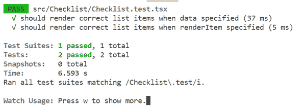

# 12

# 使用 Jest 和 React Testing Library 进行单元测试

在本章中，我们将学习如何使用 Jest 和 React Testing Library，这两个流行的自动化测试工具可以在 React 应用程序中一起使用。我们将对我们在*第十一章*“可复用组件”中创建的清单组件创建测试。

我们将首先关注 Jest，并使用它来测试简单的函数，了解 Jest 的常见 **匹配器**函数用于编写期望，以及如何执行测试以检查它们是否通过。

然后，我们将继续学习使用 React Testing Library 进行组件测试。我们将了解不同的查询类型和变体以及它们如何帮助我们创建健壮的测试。

之后，我们将学习使用 React Testing Library 伴侣包模拟用户交互的最准确方法。我们将使用它来为清单组件中正在检查的项目创建测试。

在本章结束时，我们将学习如何确定哪些代码被测试覆盖，更重要的是，哪些代码未被覆盖。我们使用 Jest 的代码覆盖率工具来完成此操作，并理解它给出的所有不同覆盖率统计信息。

因此，在本章中，我们将涵盖以下主题：

+   测试纯函数

+   测试组件

+   模拟用户交互

+   获取代码覆盖率

# 技术要求

在本章中，我们将使用以下技术：

+   **Node.js** 和 **npm**：您可以从[`nodejs.org/en/download/`](https://nodejs.org/en/download/)安装它们。

+   **Visual Studio Code**：您可以从[`code.visualstudio.com/`](https://code.visualstudio.com/)安装它。

我们将从上一章结束的代码的修改版本开始。修改后的代码包含提取到纯函数中的逻辑，这将非常适合用于我们编写的第一个测试。此代码可在网上找到，地址为[`github.com/PacktPublishing/Learn-React-with-TypeScript-2nd-Edition/tree/main/Chapter12/start`](https://github.com/PacktPublishing/Learn-React-with-TypeScript-2nd-Edition/tree/main/Chapter12/start)。

执行以下步骤将此下载到您的本地计算机：

1.  在浏览器中访问[`download-directory.github.io/`](https://download-directory.github.io/)。

1.  在网页上的文本框中，输入以下 URL：[`github.com/PacktPublishing/Learn-React-with-TypeScript-2nd-Edition/tree/main/Chapter12/start`](https://github.com/PacktPublishing/Learn-React-with-TypeScript-2nd-Edition/tree/main/Chapter12/start)。

1.  按下 *Enter* 键。现在将下载包含 `start` 文件的 ZIP 文件。

1.  将 ZIP 文件解压到您选择的文件夹中，并在 Visual Studio Code 中打开该文件夹。

1.  在 Visual Studio Code 的终端中，执行以下命令来安装所有依赖项：

    ```js
    npm i
    ```

您现在可以开始为清单组件编写测试了。

# 测试纯函数

在本节中，我们将首先了解 Jest 测试的基本组成部分。然后，我们将通过在清单组件中的纯函数上实现测试来将理论知识付诸实践。

纯函数对于给定的一组参数值具有一致的输出值。这些函数只依赖于函数参数，不依赖于函数外部的内容，并且也不改变传递给它们的任何参数值。因此，纯函数非常适合学习如何编写测试，因为它们没有需要处理的复杂副作用。

在本节中，我们还将介绍如何测试异常，这对于测试类型断言函数很有用。最后，在本节的最后，我们将学习如何在测试套件中运行测试。

## 理解 Jest 测试

Jest 在 Create React App 项目中预先安装并配置为在具有特定扩展名的文件中查找测试。这些文件扩展名是 `.test.ts` 用于纯函数的测试和 `.test.tsx` 用于组件的测试。或者，可以使用 `.spec.*` 文件扩展名。

测试是通过 Jest 的 `test` 函数定义的：

```js
test('your test name', () => {
  // your test implementation
});
```

`test` 函数有两个参数，用于测试名称和实现。通常，测试实现是一个匿名函数。测试实现可以通过在匿名函数前放置 `async` 关键字来异步执行：

```js
test('your test name', async () => {
  // your test implementation
});
```

测试实现将包括调用带有待测试参数的函数并检查结果是否符合我们的期望：

```js
test('your test name', async () => {
  const someResult = yourFunction('someArgument');
  expect(someResult).toBe('something');
});
```

Jest 的 `expect` 函数用于定义我们的期望。函数调用的结果传递给 `expect`，并返回一个包含我们可以用来定义特定期望的方法的对象。这些方法被称为 **匹配器**。如果期望失败，Jest 将使测试失败。

前面的测试使用了 `toBe` 匹配器。`toBe` 匹配器检查原始值是否相等，前面的测试使用它来检查 `someResults` 变量是否等于 `"something"`。其他常见的匹配器如下：

+   `toStrictEqual` 用于检查对象或数组中的值。它递归地检查对象或数组中的每个属性。以下是一个示例：

    ```js
    expect(someResult).toStrictEqual({
    ```

    ```js
      field1: 'something',
    ```

    ```js
      field2: 'something else'
    ```

    ```js
    });
    ```

+   `not` 用于检查匹配器的相反面。以下是一个示例：

    ```js
    expect(someResult).not.toBe('something');
    ```

+   `toMatch` 用于检查字符串与 **正则表达式**（**regexes**）的匹配。以下是一个示例：

    ```js
    expect(someResult).toMatch(/error/);
    ```

+   `toContain` 用于检查元素是否在数组中。以下是一个示例：

    ```js
    expect(someResult).toContain(99);
    ```

所有标准匹配器的完整列表可以在 Jest 文档的 [`jestjs.io/docs/expect`](https://jestjs.io/docs/expect) 找到。

现在我们已经了解了 Jest 测试的基础知识，我们将创建我们的第一个 Jest 测试。

## 测试 `isChecked`

我们将要测试的第一个函数是 `isChecked`。这个函数有两个参数：

+   `checkedIds`：这是一个当前被选中的 ID 数组

+   `idValue`：这是用于确定是否被选中的 ID

我们将为列表项被选中时编写一个测试，以及当它没有被选中时编写另一个测试：

1.  在`src/Checklist`文件夹中创建一个名为`isChecked.test.ts`的文件，该文件将包含测试。

注意

将测试文件放置在要测试的源文件旁边是最佳实践。这允许开发者快速导航到函数的测试。

1.  打开`isChecked.test.ts`并导入`isChecked`函数：

    ```js
    import { isChecked } from './isChecked';
    ```

1.  开始创建第一个测试如下：

    ```js
    test('', () => {
    ```

    ```js
    });
    ```

Jest 将`test`函数放在全局作用域中，因此不需要导入它。

1.  添加以下测试名称：

    ```js
    test('should return true when in checkedIds', () => {
    ```

    ```js
    );
    ```

为测试名称制定命名约定是良好的实践，以便它们保持一致且易于理解。在这里，我们使用了以下命名结构：

**当{输入/** **状态条件}时，应该{预期的输出/行为}**

1.  现在，让我们开始实现测试内部的逻辑。测试的第一步是用我们想要测试的参数调用被测试的函数：

    ```js
    test('should return true when in checkedIds', () => {
    ```

    ```js
      const result = isChecked([1, 2, 3], 2);
    ```

    ```js
    });
    ```

1.  测试的第二步（也是最后一步）是检查结果是否是我们预期的，对于这个测试来说是`true`：

    ```js
    test('should return true when in checkedIds', () => {
    ```

    ```js
      const result = isChecked([1, 2, 3], 2);
    ```

    ```js
      expect(result).toBe(true);
    ```

    ```js
    });
    ```

由于结果是原始值（一个布尔值），我们使用`toBe`匹配器来验证结果。

1.  添加第二个测试以覆盖 ID 不在已检查 ID 中的情况：

    ```js
    test('should return false when not in checkedIds', () => {
    ```

    ```js
      const result = isChecked([1, 2, 3], 4);
    ```

    ```js
      expect(result).toBe(false);
    ```

    ```js
    });
    ```

这完成了对`isChecked`函数的测试。接下来，我们将学习如何测试抛出的异常。测试之后，我们将检查我们的测试是否正常工作。

## 测试异常

我们将要测试的是`assertValueCanBeRendered`类型断言函数。这与我们上次测试的函数略有不同，因为我们想测试是否抛出了异常，而不是返回值。

Jest 有一个`toThrow`匹配器，可以用来检查是否抛出了异常。为了捕获异常，被测试的函数必须在期望内部执行，如下所示：

```js
test('some test', () => {
  expect(() => {
    someAssertionFunction(someValue);
  }).toThrow('some error message');
});
```

我们将使用这种方法为`assertValueCanBeRendered`类型断言函数添加三个测试。执行以下步骤：

1.  在`src/Checklist`文件夹中创建一个名为`assertValueCanBeRendered.test.ts`的文件用于测试，并导入`assertValueCanBeRendered`类型断言函数：

    ```js
    import { assertValueCanBeRendered } from './assertValueCanBeRendered';
    ```

1.  我们将添加的第一个测试是检查当值不是字符串或数字时是否会抛出异常：

    ```js
    test('should raise exception when not a string or number', () => {
    ```

    ```js
      expect(() => {
    ```

    ```js
        assertValueCanBeRendered(
    ```

    ```js
          true
    ```

    ```js
        );
    ```

    ```js
      }).toThrow(
    ```

    ```js
        'value is not a string or a number'
    ```

    ```js
      );
    ```

    ```js
    });
    ```

我们传递一个`true`布尔值，这应该会导致错误。

1.  接下来，我们将测试当值是一个字符串时是否不会抛出异常：

    ```js
    test('should not raise exception when string', () => {
    ```

    ```js
      expect(() => {
    ```

    ```js
        assertValueCanBeRendered(
    ```

    ```js
          'something'
    ```

    ```js
        );
    ```

    ```js
      }).not.toThrow();
    ```

    ```js
    });
    ```

我们使用`not`匹配器与`toThrow`一起检查没有抛出异常。

1.  最后的测试将检查当值是一个数字时不会抛出异常：

    ```js
    test('should not raise exception when number', () => {
    ```

    ```js
      expect(() => {
    ```

    ```js
        assertValueCanBeRendered(
    ```

    ```js
          99
    ```

    ```js
        );
    ```

    ```js
      }).not.toThrow();
    ```

    ```js
    });
    ```

这完成了对`assertValueCanBeRendered`类型断言函数的测试。

现在我们已经实现了一些测试，接下来我们将学习如何运行它们。

## 运行测试

Create React App 有一个名为`test`的 npm 脚本，用于运行测试。测试运行后，当源代码或测试代码更改时，监视器将重新运行测试。

执行以下步骤以运行所有测试并实验测试监视器选项：

1.  打开终端并执行以下命令：

    ```js
    npm run test
    ```

`test`是一个非常常见的 npm 脚本，因此可以省略`run`关键字。此外，`test`可以缩短为`t`。因此，上一个命令的简短版本如下：

```js
npm t
```

测试将会运行，以下摘要将在终端中显示：


图 12.1 – 第一次测试运行

注意，终端中没有像命令执行完毕后通常出现的命令提示符。这是因为命令还没有完全完成，因为测试监视器正在运行——这被称为**监视模式**。命令将不会完成，直到使用*c*键退出监视模式。在监视模式下留下终端，继续下一步。

1.  目前所有测试都通过了。现在，我们将故意使一个测试失败，以便我们可以看到 Jest 提供的信息。因此，打开`assertValueCanBeRendered.ts`并按如下方式更改第一个测试的预期错误信息：

    ```js
    test('should raise exception when not a string or number', () => {
    ```

    ```js
      expect(() => {
    ```

    ```js
        assertValueCanBeRendered(true);
    ```

    ```js
      }).toThrow('value is not a string or a numberX');
    ```

    ```js
    });
    ```

一旦测试文件被保存，测试将重新运行，失败的测试将如下报告：


图 12.2 – 失败的测试

Jest 提供了关于失败的有价值的信息，帮助我们快速解决测试失败。它告诉我们以下内容：

+   哪个测试失败了

+   预期结果与实际结果的比较

+   失败发生的代码行

通过将测试回滚以检查正确的错误信息来解决测试失败。现在测试应该如下所示：

```js
test('should raise exception when not a string or number', () => {
  expect(() => {
    assertValueCanBeRendered(true);
  }).toThrow('value is not a string or a number');
});
```

1.  我们现在将开始探索测试监视器上的一些选项。在终端中按*w*键，其中测试监视器仍在运行。测试监视器选项将如下列出：


图 12.3 – 测试监视器选项

1.  我们可以通过使用*p*监视选项来过滤 Jest 执行的测试文件。按*p*键，当提示输入模式时输入`isChecked`。模式可以是任何正则表达式。Jest 将搜索与正则表达式模式匹配的测试文件并执行它们。因此，Jest 在我们的测试套件中运行了`isChecked.test.ts`的测试：


图 12.4 – Jest 运行检查匹配模式的测试文件

1.  要清除文件名过滤器，请按*c*键。

1.  我们还可以使用*t*监视选项通过测试名称过滤 Jest 执行的测试。按*t*键，当提示输入测试名称时输入`should return false when not in checkedIds`。Jest 将搜索与正则表达式模式匹配的测试名称并执行它们。因此，Jest 在我们的测试套件中运行了`should return false when not in checkedIds`测试：


图 12.5 – Jest 运行匹配模式的测试名称

1.  按*c*键清除测试名称过滤器，然后按*q*键退出测试监视器。

这就完成了我们对运行 Jest 测试的探索，以及本节对测试纯函数的讨论。以下是对关键点的快速回顾：

+   测试使用 Jest 的 `test` 函数定义。

+   测试中的期望值使用 Jest 的 `expect` 函数结合一个或多个匹配器来定义。

+   `expect` 函数的参数可以是一个执行被测试函数的函数。这对于使用 `toThrow` 匹配器测试异常非常有用。

+   Jest 的测试运行器有一套全面的选项用于运行测试。测试监视器在大型代码库中特别有用，因为它默认只运行受更改影响的测试。

接下来，我们将学习如何测试 React 组件。

# 测试组件

测试组件非常重要，因为这正是用户与之交互的部分。在组件上拥有自动化测试可以让我们对应用程序的正确运行充满信心，并在我们更改代码时帮助我们防止回归。

在本节中，我们将学习如何使用 Jest 和 React 测试库来测试组件。然后，我们将对上一章中开发的清单组件创建一些测试。

## 理解 React 测试库

React 测试库是测试 React 组件的流行伴侣库。它提供了渲染组件并选择内部元素的功能。然后，可以使用另一个名为 `jest-dom` 的伴侣库提供的特殊匹配器来检查这些内部元素。

### 基本组件测试

下面是一个组件测试的例子：

```js
test('should render heading when content specified', () => {
  render(<Heading>Some heading</Heading>);
  const heading = screen.getByText('Some heading');
  expect(heading).toBeInTheDocument();
});
```

让我们解释一下这个测试：

+   React 测试库的 `render` 函数渲染我们想要测试的组件。我们传入所有适当的属性和内容，以便组件处于检查所需的所需状态。在这个测试中，我们在内容中指定了一些文本。

+   下一行选择组件的内部元素。React 测试库的 `screen` 对象上有许多方法可以用来选择元素。这些方法被称为 `getByText`，通过匹配指定的文本内容来选择元素。在这个测试中，一个具有 `Some heading` 文本内容的元素将被选择并分配给 `heading` 变量。

+   测试中的最后一行是期望。`toBeInTheDocument` 匹配器是来自 `jest-dom` 的一个特殊匹配器，用于检查期望中的元素是否在 DOM 中。

### 理解查询

React 测试库的查询是一个选择渲染组件内部 DOM 元素的方法。有许多不同的查询以不同的方式找到元素：

+   `ByRole`: 通过元素的角色进行查询。

注意

DOM 元素有一个`role`属性，允许辅助技术（如屏幕阅读器）理解它们是什么。许多 DOM 元素都有这个属性预设——例如，`button`元素自动具有`'button'`的角色。有关角色的更多信息，请参阅[`developer.mozilla.org/en-US/docs/Web/Accessibility/ARIA/Roles`](https://developer.mozilla.org/en-US/docs/Web/Accessibility/ARIA/Roles)。

+   `ByLabelText`: 通过关联的标签查询元素。有关元素如何与标签关联的不同方式的更多信息，请参阅 React Testing Library 文档中的此页面：[`testing-library.com/docs/queries/bylabeltext`](https://testing-library.com/docs/queries/bylabeltext)。

+   `ByPlaceholderText`: 通过占位符文本查询元素。

+   `ByText`: 通过元素的文本内容查询元素。

+   `ByDisplayValue`: 通过`input`、`textarea`和`select`元素的值查询元素。

+   `ByAltText`: 通过`alt`属性查询`img`元素。

+   `ByTitle`: 通过`title`属性查询元素。

+   `ByTestId`: 通过测试 ID（`data-testid`属性）查询元素。

还有不同类型的查询，它们在找到的元素上的行为略有不同。每个查询类型在查询方法名称上都有一个特定的前缀：

+   `getBy`: 如果找不到单个元素，则抛出错误。这对于同步获取单个元素是理想的。

+   `getAllBy`: 如果至少找不到一个元素，则抛出错误。这对于同步获取多个元素是理想的。

+   `findBy`: 如果找不到单个元素，则抛出错误。对于元素的检查会重复一定的时间（默认为 1 秒）。因此，这对于异步获取可能不在 DOM 中立即存在的单个元素是理想的。

+   `findAllBy`: 如果在指定时间内（默认为 1 秒）至少找不到一个元素，则抛出错误。这对于异步获取可能不在 DOM 中立即存在的多个元素是理想的。

+   `queryBy`: 如果找不到元素，则返回`null`。这对于检查元素是否存在是理想的。

+   `queryAllBy`: 这与`queryBy`相同，但返回一个元素数组。这对于检查多个元素是否不存在是理想的。

因此，在先前的测试中使用的`getByText`查询通过指定的文本内容查找元素，如果找不到元素则引发错误。

有关查询的更多信息，请参阅 React Testing Library 文档中的以下页面：[`testing-library.com/docs/queries/about/`](https://testing-library.com/docs/queries/about/)。

注意，这些查询中没有任何一个引用实现细节，例如元素名称、ID 或 CSS 类。如果由于代码重构导致这些实现细节发生变化，测试不应该中断，这正是我们想要的。

现在我们已经了解了 React Testing Library，我们将使用它来编写我们的第一个组件测试。

## 实现清单组件测试

我们将要编写的第一个组件测试是检查列表项是否正确渲染。第二个组件测试将检查在自定义渲染时列表项是否正确渲染。

在 Create React App 项目中预安装了 React Testing Library 和`jest-dom`，这意味着我们可以直接编写测试。执行以下步骤：

1.  在`src/Checklist`文件夹中创建一个名为`Checklist.test.tsx`的新文件，并添加以下导入语句：

    ```js
    import { render, screen } from '@testing-library/react';
    ```

    ```js
    import { Checklist } from './Checklist';
    ```

1.  按照以下步骤开始创建测试：

    ```js
    test('should render correct list items when data specified', () => {
    ```

    ```js
    });
    ```

1.  在测试中，使用一些数据渲染`Checklist`：

    ```js
    test('should render correct list items when data specified', () => {
    ```

    ```js
      render(
    ```

    ```js
        <Checklist
    ```

    ```js
          data={[{ id: 1, name: 'Lucy', role: 'Manager' }]}
    ```

    ```js
          id="id"
    ```

    ```js
          primary="name"
    ```

    ```js
          secondary="role"
    ```

    ```js
        />
    ```

    ```js
      );
    ```

    ```js
    });
    ```

我们渲染了一个单独的列表项，它应该有主要文本`Lucy`和次要文本`Manager`。

1.  让我们检查`Lucy`是否已经渲染：

    ```js
    test('should render correct list items when data specified', () => {
    ```

    ```js
      render(
    ```

    ```js
        <Checklist
    ```

    ```js
          data={[{ id: 1, name: 'Lucy', role: 'Manager' }]}
    ```

    ```js
          id="id"
    ```

    ```js
          primary="name"
    ```

    ```js
          secondary="role"
    ```

    ```js
        />
    ```

    ```js
      );
    ```

    ```js
      expect(screen.getByText('Lucy')).toBeInTheDocument();
    ```

    ```js
    });
    ```

我们使用`getByText`查询选择了元素，并将其直接输入到预期中。我们使用`toBeInTheDocument`匹配器来检查找到的元素是否在 DOM 中。

1.  通过添加一个类似的预期来检查`Manager`来完成测试：

    ```js
    test('should render correct list items when data specified', () => {
    ```

    ```js
      render(
    ```

    ```js
        <Checklist
    ```

    ```js
          data={[{ id: 1, name: 'Lucy', role: 'Manager' }]}
    ```

    ```js
          id="id"
    ```

    ```js
          primary="name"
    ```

    ```js
          secondary="role"
    ```

    ```js
        />
    ```

    ```js
      );
    ```

    ```js
      expect(screen.getByText('Lucy')).toBeInTheDocument();
    ```

    ```js
      expect(screen.getByText('Manager')).    toBeInTheDocument();
    ```

    ```js
    });
    ```

这样就完成了我们的第一个组件测试。

1.  我们将一次性添加第二个测试，如下所示：

    ```js
    test('should render correct list items when renderItem specified', () => {
    ```

    ```js
      render(
    ```

    ```js
        <Checklist
    ```

    ```js
          data={[{ id: 1, name: 'Lucy', role: 'Manager' }]}
    ```

    ```js
          id="id"
    ```

    ```js
          primary="name"
    ```

    ```js
          secondary="role"
    ```

    ```js
          renderItem={(item) => (
    ```

    ```js
            <li key={item.id}>
    ```

    ```js
              {item.name}-{item.role}
    ```

    ```js
            </li>
    ```

    ```js
          )}
    ```

    ```js
        />
    ```

    ```js
      );
    ```

    ```js
      expect(
    ```

    ```js
        screen.getByText('Lucy-Manager')
    ```

    ```js
      ).toBeInTheDocument();
    ```

    ```js
    });
    ```

我们使用与之前测试相同的数据渲染了一个单独的列表项。然而，这个测试自定义渲染了列表项，在名称和角色之间有一个连字符。我们使用相同的`getByText`查询来检查是否在 DOM 中找到了具有正确文本的列表项。

1.  如果测试没有自动运行，请在终端中运行`npm test`来运行它们。使用*p*选项运行这两个新测试——它们都应该通过：



图 12.6 – 组件测试通过

这样就完成了我们的前两个组件测试。看看 React Testing Library 如何使这变得如此简单！

## 使用测试 ID

我们将要实现的下一个测试是检查当指定时列表项是否被选中。这个测试会稍微复杂一些，需要复选框上的测试 ID。执行以下步骤：

1.  首先，打开`Checklist.tsx`并注意`input`元素上的以下测试 ID：

    ```js
    <input
    ```

    ```js
      ...
    ```

    ```js
      data-testid={`Checklist__input__${idValue.toString()}`}
    ```

    ```js
    />
    ```

使用`data-testid`属性将测试 ID 添加到元素中。我们可以连接列表项 ID，以便测试 ID 对每个列表项都是唯一的。

1.  现在，回到`Checklist.test.tsx`文件并开始编写测试：

    ```js
    test('should render correct checked items when specified', () => {
    ```

    ```js
      render(
    ```

    ```js
        <Checklist
    ```

    ```js
          data={[{ id: 1, name: 'Lucy', role: 'Manager' }]}
    ```

    ```js
          id="id"
    ```

    ```js
          primary="name"
    ```

    ```js
          secondary="role"
    ```

    ```js
          checkedIds={[1]}
    ```

    ```js
        />
    ```

    ```js
      );
    ```

    ```js
    });
    ```

我们已经使用与之前测试相同的数据渲染了清单。然而，我们已指定使用`checkedIds`属性来检查列表项。

1.  现在，让我们看看测试的预期：

    ```js
    test('should render correct checked items when specified', () => {
    ```

    ```js
      render(
    ```

    ```js
        <Checklist
    ```

    ```js
          data={[{ id: 1, name: 'Lucy', role: 'Manager' }]}
    ```

    ```js
          id="id"
    ```

    ```js
          primary="name"
    ```

    ```js
          secondary="role"
    ```

    ```js
          checkedIds={[1]}
    ```

    ```js
        />
    ```

    ```js
      );
    ```

    ```js
      expect(
    ```

    ```js
        screen.getByTestId('Checklist__input__1')
    ```

    ```js
      ).toBeChecked();
    ```

    ```js
    });
    ```

我们使用`getByTestId`查询通过测试 ID 选择复选框。然后我们使用`toBeChecked`匹配器来验证复选框是否被选中。`toBeChecked`是来自`jest-dom`包的另一个特殊匹配器。

这个新的测试应该通过，这样我们在`Checklist`上就有三个通过测试：


图 12.7 – 所有三个组件测试通过

1.  按下*q*键停止测试运行器。

这样就完成了本节关于组件测试的内容。这里是一个快速回顾：

+   React Testing Library 包含许多用于选择 DOM 元素的有用查询。不同的查询类型会找到单个或多个元素，如果找不到元素，则不会报错。甚至还有一个用于重复搜索异步渲染的元素的查询类型。

+   `jest-dom`包含许多用于检查 DOM 元素的有用匹配器。一个常见的匹配器是`toBeInTheDocument`，它验证一个元素是否在 DOM 中。然而，`jest-dom`还包含许多其他有用的匹配器，例如`toBeChecked`用于检查元素是否被勾选。

接下来，我们将学习如何在测试中模拟用户交互。

# 模拟用户交互

到目前为止，我们的测试只是简单地使用各种属性设置了清单组件。用户可以通过勾选和取消勾选项目与清单组件进行交互。在本节中，我们将首先学习如何在测试中模拟用户交互。然后，我们将利用这些知识来测试点击列表项时是否勾选，以及是否触发了`onCheckedIdsChange`。

## 理解`fireEvent`和`user-event`

React Testing Library 有一个`fireEvent`函数可以在 DOM 元素上触发事件。以下示例在**保存**按钮上触发了一个`click`事件：

```js
render(<button>Save</button>);
fireEvent.click(screen.getByText('Save'));
```

这是可以的，但如果逻辑是使用`mousedown`事件而不是`click`事件实现的呢？那么测试将需要如下所示：

```js
render(<button>Save</button>);
fireEvent.mouseDown(screen.getByText('Save'));
```

幸运的是，在测试中执行用户交互有一个替代方法。这个替代方法是使用`user-event`包，这是一个 React Testing Library 的配套包，它模拟用户交互而不是特定的事件。使用`user-event`的相同测试看起来如下：

```js
const user = userEvent.setup();
render(<button>Save</button>);
await user.click(screen.getByText('Save'));
```

测试将涵盖使用`click`事件或`mousedown`事件实现的逻辑。因此，它与实现细节的耦合度较低，这是好的。因此，我们将使用`user-event`包来编写我们清单组件的交互式测试。

`user-event`包可以模拟除了点击之外的其他交互。有关更多信息，请参阅以下链接的文档：[`testing-library.com/docs/user-event/intro`](https://testing-library.com/docs/user-event/intro)。

## 实现检查项目的清单测试

现在，我们将为清单组件编写两个交互式测试。第一个测试将检查点击时项目是否被勾选。第二个测试将检查点击项目时是否调用了`onCheckedIdsChange`。执行以下步骤：

1.  Create React App 预先安装了`user-event`包，但它可能是在版本 14 之前的版本，这有一个不同的 API。打开`package.json`，然后找到`@testing-library/user-event`依赖项并检查版本。如果版本不是 14 或更高，那么在终端中运行以下命令来更新它：

    ```js
    npm i @testing-library/user-event@latest
    ```

1.  我们将在与其它组件测试相同的测试文件中添加交互式测试。因此，打开`Checklist.test.tsx`并添加对`user-event`的导入语句：

    ```js
    import userEvent from '@testing-library/user-event';
    ```

1.  第一个测试将测试点击时项是否被选中。开始实现如下：

    ```js
    test('should check items when clicked', async () => {
    ```

    ```js
    });
    ```

我们将测试标记为异步，因为`user-event`中的模拟用户交互是异步的。

1.  接下来，初始化用户模拟如下：

    ```js
    test('should check items when clicked', async () => {
    ```

    ```js
      const user = userEvent.setup();
    ```

    ```js
    });
    ```

1.  我们现在可以渲染一个列表项，就像我们在之前的测试中所做的那样。我们还将获取渲染的列表项中的复选框引用，并检查它是否未被选中：

    ```js
    test('should check items when clicked', async () => {
    ```

    ```js
      const user = userEvent.setup();
    ```

    ```js
      render(
    ```

    ```js
        <Checklist
    ```

    ```js
          data={[{ id: 1, name: 'Lucy', role: 'Manager' }]}
    ```

    ```js
          id="id"
    ```

    ```js
          primary="name"
    ```

    ```js
          secondary="role"
    ```

    ```js
        />
    ```

    ```js
      );
    ```

    ```js
      const lucyCheckbox = screen.getByTestId(
    ```

    ```js
        'Checklist__input__1'
    ```

    ```js
      );
    ```

    ```js
      expect(lucyCheckbox).not.toBeChecked();
    ```

    ```js
    });
    ```

1.  现在，让我们转向用户交互。通过在`user`对象上调用`click`方法来模拟用户点击列表项；需要将要点击的复选框传递给`click`参数：

    ```js
    test('should check items when clicked', async () => {
    ```

    ```js
      const user = userEvent.setup();
    ```

    ```js
      render(
    ```

    ```js
        <Checklist
    ```

    ```js
          data={[{ id: 1, name: 'Lucy', role: 'Manager' }]}
    ```

    ```js
          id="id"
    ```

    ```js
          primary="name"
    ```

    ```js
          secondary="role"
    ```

    ```js
        />
    ```

    ```js
      );
    ```

    ```js
      const lucyCheckbox = screen.getByTestId(
    ```

    ```js
        'Checklist__input__1'
    ```

    ```js
      );
    ```

    ```js
      expect(lucyCheckbox).not.toBeChecked();
    ```

    ```js
      await user.click(lucyCheckbox);
    ```

    ```js
    });
    ```

1.  测试的最后一步是检查复选框现在是否被选中：

    ```js
    test('should check items when clicked', async () => {
    ```

    ```js
      const user = userEvent.setup();
    ```

    ```js
      render(
    ```

    ```js
        <Checklist
    ```

    ```js
          data={[{ id: 1, name: 'Lucy', role: 'Manager' }]}
    ```

    ```js
          id="id"
    ```

    ```js
          primary="name"
    ```

    ```js
          secondary="role"
    ```

    ```js
        />
    ```

    ```js
      );
    ```

    ```js
      const lucyCheckbox = screen.getByTestId(
    ```

    ```js
        'Checklist__input__1'
    ```

    ```js
      );
    ```

    ```js
      expect(lucyCheckbox).not.toBeChecked();
    ```

    ```js
      await user.click(lucyCheckbox);
    ```

    ```js
      expect(lucyCheckbox).toBeChecked();
    ```

    ```js
    });
    ```

1.  下一个测试将测试当列表项被点击时，分配给`onCheckedIdsChange`属性的函数是否被调用。以下是测试：

    ```js
    test('should call onCheckedIdsChange when clicked', async () => {
    ```

    ```js
      const user = userEvent.setup();
    ```

    ```js
      let calledWith: IdValue[] | undefined = undefined;
    ```

    ```js
      render(
    ```

    ```js
        <Checklist
    ```

    ```js
          data={[{ id: 1, name: 'Lucy', role: 'Manager' }]}
    ```

    ```js
          id="id"
    ```

    ```js
          primary="name"
    ```

    ```js
          secondary="role"
    ```

    ```js
          onCheckedIdsChange={(checkedIds) =>
    ```

    ```js
            (calledWith = checkedIds)
    ```

    ```js
          }
    ```

    ```js
        />
    ```

    ```js
      );
    ```

    ```js
      await user.click(screen.getByTestId('Checklist__input__1'));
    ```

    ```js
      expect(calledWith).toStrictEqual([1]);
    ```

    ```js
    });
    ```

我们将`calledWith`变量设置为`onCheckedIdsChange`参数的值。在列表项被点击后，我们使用`toStrictEqual`匹配器检查`calledWith`变量的值。`toStrictEqual`匹配器是一个标准的 Jest 匹配器，非常适合检查数组和对象。

1.  第二个测试引用了`IdValue`类型，因此添加一个导入语句：

    ```js
    import { IdValue } from './types';
    ```

1.  通过在终端中运行`npm test`来运行测试。按*p*键以运行`Checklist.test.tsx`文件中的所有测试。我们现在应该有五个通过组件测试：


图 12.8 – 五个通过组件测试

1.  通过按*q*键停止测试运行器。

这样就完成了点击项的测试以及模拟用户交互本节的测试。我们了解到 React Testing Library 的`fireAction`函数引发了一个特定的事件，将测试与实现细节耦合。更好的方法是使用`user-event`包来模拟用户交互，在这个过程中可能会引发多个事件。

接下来，我们将学习如何快速确定任何未由测试覆盖的代码。

# 获取代码覆盖率

代码覆盖率是我们用来指代我们的应用程序代码中有多少被单元测试覆盖。当我们编写单元测试时，我们将对哪些代码被覆盖以及哪些代码未被覆盖有一个相当的了解，但随着应用程序的增长和时间的推移，我们将失去这种跟踪。

在本节中，我们将学习如何使用 Jest 的代码覆盖率选项，这样我们就不必在脑海中记住哪些代码被覆盖了。我们将使用代码覆盖率选项来确定清单组件的代码覆盖率，并理解报告中的所有不同统计数据。我们将使用代码覆盖率报告来找到清单组件中的某些未覆盖代码。然后我们将扩展清单组件的测试以实现完整的代码覆盖率。

## 运行代码覆盖率

为了获取代码覆盖率，我们使用带有`--coverage`选项的`test`命令。我们还包含一个`--watchAll=false`选项，告诉 Jest 不要在监视模式下运行。因此，在终端中运行以下命令以确定我们的应用程序的代码覆盖率：

```js
npm run test -- --coverage --watchAll=false
```

由于代码覆盖率计算，测试运行会花费更长的时间。当测试完成后，终端会输出一个包含测试结果的代码覆盖率报告：


图 12.9 – 终端代码覆盖率报告

接下来，我们将花一些时间来理解这份代码覆盖率报告。

## 理解代码覆盖率报告

覆盖率报告列出了每个文件的覆盖率，并汇总了项目中所有文件的覆盖率。因此，整个应用程序的代码覆盖率在 57.44%到 62.5%之间，具体取决于我们采用哪个统计数据。

这里是对所有统计列的解释：

+   **% 语句**：这是**语句覆盖率**，指的是在测试执行过程中执行了多少源代码语句

+   **% 分支**：这是**分支覆盖率**，指的是在测试执行过程中有多少条件逻辑的分支被执行

+   **% 函数**：这是**函数覆盖率**，指的是在测试执行过程中调用了多少函数

+   **% 行**：这是**行覆盖率**，指的是在测试执行过程中执行了多少行源代码

报告最右侧的列非常有用。它给出了测试未覆盖的源代码行。例如，清单组件中的`getNewCheckedIds.ts`文件的第 9 行和第 10 行未被覆盖。

还有一种以 HTML 格式生成的报告版本。每次运行带有`--coverage`选项的测试时，此文件都会自动生成。因此，由于我们刚刚运行了带有`--coverage`选项的测试，此报告已经生成。执行以下步骤以探索 HTML 报告：

1.  报告位于`coverage\lcov-report`文件夹中的`index.html`文件中。双击文件，使其在浏览器中打开：


图 12.10 – HTML 覆盖率报告

报告包含与终端报告相同的数据，但这个报告是交互式的。

1.  在报告的第二行点击**src/Checklist**链接。现在页面显示了清单组件中文件的覆盖率：


图 12.11 – 清单组件文件覆盖率报告

1.  点击`getNewCheckedIds.ts`链接以深入查看该文件的覆盖率：


图 12.12 – getNewCheckedIds.ts 覆盖率报告

我们可以看到，未覆盖的行 9 和 10 在`getNewCheckedIds.ts`文件中非常清晰地突出显示。

因此，HTML 覆盖率报告在大型代码库中非常有用，因为它从高级覆盖率开始，并允许你深入查看特定文件夹和文件的覆盖率。在报告中查看文件时，我们可以快速确定未覆盖的代码位置，因为它被清晰地突出显示。

接下来，我们将更新我们的测试，以便`getNewCheckedIds.ts`中的第 9 行和第 10 行被覆盖。

## 实现检查清单组件的全面覆盖率

目前未被测试检查的逻辑是当列表项被点击但已检查时的逻辑。我们将扩展`'should check items when clicked'`测试以覆盖此逻辑。执行以下步骤：

1.  打开`Checklist.test.tsx`并将`'should check items when clicked'`测试重命名为以下内容：

    ```js
    test('should check and uncheck items when clicked', async () => {
    ```

    ```js
      ...
    ```

    ```js
    });
    ```

1.  在测试末尾添加以下突出显示的行以再次点击复选框并检查它是否未选中：

    ```js
    test('should check and uncheck items when clicked', async () => {
    ```

    ```js
      const user = userEvent.setup();
    ```

    ```js
      render(
    ```

    ```js
        <Checklist
    ```

    ```js
          data={[{ id: 1, name: 'Lucy', role: 'Manager' }]}
    ```

    ```js
          id="id"
    ```

    ```js
          primary="name"
    ```

    ```js
          secondary="role"
    ```

    ```js
        />
    ```

    ```js
      );
    ```

    ```js
      const lucyCheckbox = screen.getByTestId(
    ```

    ```js
        'Checklist__input__1'
    ```

    ```js
      );
    ```

    ```js
      expect(lucyCheckbox).not.toBeChecked();
    ```

    ```js
      await user.click(lucyCheckbox);
    ```

    ```js
      expect(lucyCheckbox).toBeChecked();
    ```

    ```js
      await user.click(lucyCheckbox);
    ```

    ```js
      expect(lucyCheckbox).not.toBeChecked();
    ```

    ```js
    });
    ```

1.  在终端中，使用覆盖率重新运行测试：

    ```js
    npm run test -- --coverage --watchAll=false
    ```

所有测试仍然通过，检查清单组件的覆盖率现在在所有统计指标上报告为 100%：


图 12.13 – 检查清单组件的 100%覆盖率

检查清单组件现在得到了很好的覆盖。然而，`index.ts`和`types.ts`出现在报告中且覆盖率为零，这有点令人烦恼。我们将在下一部分解决这个问题。

## 忽略覆盖率报告中的文件

我们将从覆盖率报告中移除`index.ts`和`types.ts`，因为它们不包含任何逻辑，并产生不必要的噪音。执行以下步骤：

1.  打开`package.json`文件。我们可以在`package.json`文件中的`jest`字段中配置 Jest，并且有一个`coveragePathIgnorePatterns`配置选项用于从覆盖率报告中移除文件。将以下 Jest 配置添加到`package.json`以忽略`types.ts`和`index.ts`文件：

    ```js
    {
    ```

    ```js
      ...,
    ```

    ```js
      "jest": {
    ```

    ```js
        "coveragePathIgnorePatterns": [
    ```

    ```js
          "types.ts",
    ```

    ```js
          "index.ts"
    ```

    ```js
        ]
    ```

    ```js
      }
    ```

    ```js
    }
    ```

1.  在终端中，使用覆盖率重新运行测试：

    ```js
    npm run test -- --coverage --watchAll=false
    ```

`types.ts`和`index.ts`文件已从覆盖率报告中移除：


图 12.14 – 从覆盖率报告中移除了 types.ts 和 index.ts 文件

这部分关于代码覆盖率的讨论到此结束。以下是一个简要的回顾：

+   `--coverage`选项在测试运行后输出代码覆盖率报告。

+   除了终端中的覆盖率报告外，还生成一个交互式的 HTML 代码覆盖率报告。在大型测试套件中，这有助于深入分析未覆盖的代码。

+   两种报告格式都突出了未覆盖的代码，为我们提供了改进测试套件的有价值信息。

# 摘要

在本章中，我们使用 Jest 和 React Testing Library 在检查清单组件上创建了测试。此外，我们还学习了 Jest 核心包中的常见匹配器和在名为`jest-dom`的配套包中用于组件测试的有用匹配器。

我们使用了 Jest 的测试运行器，并使用选项来运行某些测试。这对于大型代码库来说特别有用。

我们了解了 React Testing Library 中可用的广泛查询，用于以不同方式选择元素。我们在检查清单测试中广泛使用了`getByText`查询。我们还为列表项复选框创建了一个测试 ID，以便可以使用`getByTestId`查询来唯一选择它们。

我们了解到 `user-event` 包是模拟与实现解耦的用户交互的绝佳方式。我们使用它来模拟用户点击列表项复选框。

我们学习了如何生成代码覆盖率报告，并理解了报告中的所有统计数据。报告包括了关于未覆盖代码的信息，我们使用这些信息在清单组件上实现了 100% 的覆盖率。

因此，我们已经到达了这本书的结尾。你现在对 React 和 TypeScript 都很熟悉，并在 React 核心之外的区域，如样式、客户端路由、表单和 Web API，拥有丰富的知识。你将能够开发跨不同页面甚至不同应用程序的可重用组件。除此之外，你现在将能够编写一个健壮的测试套件，这样你就可以自信地发布新功能。

总结来说，这本书的知识将使你能够高效地使用 React 和 TypeScript 构建大型和复杂的应用程序的前端。我希望你阅读这本书的乐趣和我写作这本书的乐趣一样多！

# 问题

回答以下问题以检查你在本章中学到的内容：

1.  我们为 `HomePage` 组件编写了一些测试，并将它们放在名为 `HomePage.tests.tsx` 的文件中。然而，当执行 `npm test` 命令时，测试并没有运行——甚至当按下 *a* 键来运行所有测试时也是如此。你认为可能的问题是什么？

1.  为什么以下预期没有通过？如何解决这个问题？

    ```js
    expect({ name: 'Bob' }).toBe({ name: 'Bob' });
    ```

1.  哪个匹配器可以用来检查一个变量不是 `null`？

1.  这里有一个检查**保存**按钮是否被禁用的预期：

    ```js
    expect(
    ```

    ```js
      screen.getByText('Save').hasAttribute('disabled')
    ```

    ```js
    ).toBe(true);
    ```

预期结果如预期通过，但是否有不同的匹配器可以用来简化这个操作？

1.  为我们在这章中使用的 `getNewCheckedIds` 函数编写一个测试。测试应该检查如果 ID 已经在已检查的 ID 数组中，则从数组中移除该 ID。

1.  我们有一个包含 `findBy` 查询类型的 `form` 元素，以便查询在数据被获取之前重试：

    ```js
    expect(screen.findByText('Save')).toBeInTheDocument();
    ```

然而，预期并没有工作——你能找到问题所在吗？

1.  以下预期尝试检查一个**保存**按钮不在 DOM 中：

    ```js
    expect(screen.getByText('Save')).toBe(null);
    ```

然而，这并没有按预期工作。相反，由于找不到**保存**按钮，引发了一个错误。如何解决这个问题？

# 答案

1.  问题在于文件扩展名是 `tests.tsx` 而不是 `test.tsx`。

1.  `toBe` 匹配器应该仅用于检查原始值，如数字和字符串——这是一个对象。应该使用 `toStrictEqual` 匹配器来检查对象，因为它检查所有属性的值而不是对象引用：

    ```js
    expect({ name: 'Bob' }).toStrictEqual({ name: 'Bob' });
    ```

1.  `not` 和 `toBeNull` 匹配器可以组合起来检查一个变量不是 `null`：

    ```js
    expect(something).not.toBeNull();
    ```

1.  `toBeDisabled` 匹配器可以从 `jest-dom` 中使用：

    ```js
    expect(screen.getByText('Save')).toBeDisabled();
    ```

1.  这里是一个测试示例：

    ```js
    test('should remove id when already in checked ids', () => {
    ```

    ```js
      const result = getNewCheckedIds([1, 2, 3], 2);
    ```

    ```js
      expect(result).toStrictEqual([1, 3]);
    ```

    ```js
    });
    ```

1.  `findBy` 查询类型需要等待，因为它异步执行：

    ```js
    expect(await screen.findByText('Save')).toBeInTheDocument();
    ```

1.  `queryBy` 查询类型可以被使用，因为它在找不到元素时不会抛出异常。此外，可以使用 `not` 和 `toBeInTheDocument` 匹配器来检查元素不在 DOM 中：

    ```js
    expect(screen.queryByText('Save')).not.toBeInTheDocument();
    ```
