# 第六章 使用 ReactJS 构建 Web 组件

在本章中，我们将了解 Facebook 团队提供的用于 Web 组件开发的“React 方式”。我们还将学习使用 ReactJS 库开发 Web 组件。我们将探索 Web 应用的 Flux 架构，并了解其中的数据流。最后，我们将使用 ReactJS 库开发一个自定义组件。

# 反应式方法

在详细了解 ReactJS 框架之前，我们应该了解一些已经开发的应用程序。Facebook 的评论区、LiveFyre 和 Disqus 都是用 ReactJS 开发的。这些应用程序是按照 Flux 架构开发的。

# Flux 架构

一个 Flux 应用有三个重要的部分——**调度器**、**存储**和**视图**。这些部分通过**动作**连接。以下图表显示了 Flux 架构中的三个构建块和动作数据流：

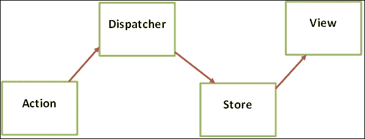

Flux 架构这三个部分的详细信息如下：

+   **视图**：这代表在浏览器中渲染的 UI 组件，供最终用户使用。

+   **存储**：它包含应用程序数据和业务逻辑。它与 MVC 框架中的模型类似。**存储**代表数据对象的集合，而模型代表单个对象。

+   **调度器**：这是所有动作必须通过的中央枢纽。它包含存储注册的所有回调。

在 Flux 架构中开发的应用程序工作如下：

1.  通常，动作是由用户生成的，与视图进行交互。这些动作本质上是异步的。

1.  这些动作随后被传递到调度器进行处理。调度器然后调用存储中注册的回调方法。

1.  回调方法的执行可能会改变数据的状态。然后存储发出带有更新数据的更改事件。视图监听更改事件，并使用事件处理程序从存储中访问修改后的数据。然后视图调用它们自己的 `setState` 方法，这会导致自身及其子元素的重渲染。

1.  数据流是单向的。Flux 架构不允许双向数据绑定，这可能导致更多的级联更新。

    ### 提示

    基于 Flux 的应用程序中的数据流是单向的。

## Flux 关键特性

Flux 架构为基于 Flux 的 Web 应用程序提供了一些关键特性，这些特性如下：

+   **同步性**：为每个动作注册的所有回调方法在执行上是同步的，但动作是从源异步触发的。

+   **控制反转**：控制流被转移到适当的存储对象和目标回调函数。

+   **语义动作**：从源触发的动作包含一些语义信息，这有助于存储对象决定执行适当的方法。

+   **无级联动作**：Flux 不允许生成多个更新的级联动作。

    ### 注意

    要了解更多关于 flux 架构的信息，请使用以下链接：

    [`fluxxor.com/what-is-flux.html`](http://fluxxor.com/what-is-flux.html)

# 安装 ReactJS

可以使用 Bower 安装 ReactJS 库。假设 Bower 已经存在于您的机器上，请使用以下命令安装 ReactJS 库：

```js
bower install react

```

以下截图显示了使用 Bower 进行 ReactJS 安装过程中的终端：

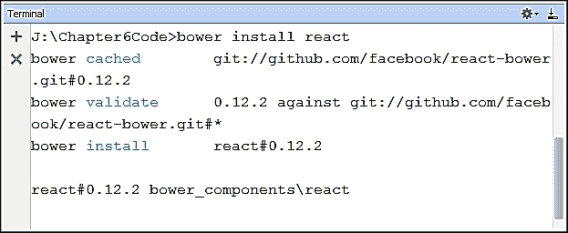

执行 Bower 命令成功后，系统将加载位于 `bower_components` 目录中 `react` 子目录内的 ReactJS 库文件。以下截图显示了 ReactJS 库中的文件：

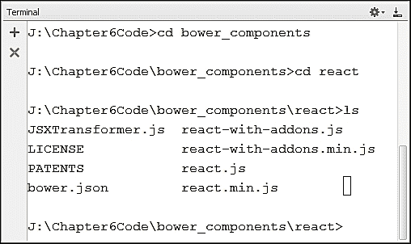

ReactJS 库有三个不同的部分：

+   **ReactJS 核心库**：这是 ReactJS 的核心库。该文件的名称为 `ReactJS`，该库的压缩版本为 `react.min.js`。

+   **ReactJS 插件**：这表示可以与 ReactJS 一起使用的附加实用程序包。该文件的名称为 `react-with-addons.js`，该库的压缩版本为 `react-with-addons.min.js`。

+   **JSX 转换器库**：这个库可以在浏览器中使用，将 JSX 代码转换为 JavaScript。该文件的名称为 `JSXTransformer.js`。

# 配置 ReactJS

ReactJS 库可以作为独立库或与 JSX 转换器文件一起使用。我们将在下一节中了解更多关于 JSX 的信息。现在，我们可以包含以下 `<script>` 标签以开始使用 ReactJS 库：

```js
<script src="img/strong>"></script>
<script src="img/strong>"></script>
```

ReactJS 库也可以直接从 Facebook CDN 使用，以提高页面加载性能。从 CDN 加载 ReactJS 库的 `<script>` 代码如下：

```js
<script src="img/strong>"></script>
<script src="img/strong>"></script>
```

### 注意

在本书编写过程中，ReactJS 库的版本为 0.12.2。

# 使用 ReactJS

我们可以通过包含 `ReactJS` 或 `rect.min.js` 文件来使用 ReactJS 库，使用 `<script>` 元素创建 DOM 元素。`createElement` 方法的语法如下：

```js
var reactElement = React.createElement(type, properties, children);

```

上述语法的详细信息如下：

+   `type`：这表示字符串格式的 HTML 元素名称

+   `properties`：这表示一个具有属性名称和值的键值对的对象

+   `children`：这表示一个元素可以拥有的子节点

使用 `React.render` 方法可以在浏览器中渲染 `React` 元素。`render` 方法的语法如下：

```js
React.render(reactElement, targetDOMNode)

```

上述语法的详细信息如下：

+   `reactElement`：它表示需要在浏览器中渲染的 ReactJS 元素。

+   `targetDOMNode`：它表示需要将 ReactJS 元素附加到其中以在浏览器中显示的 DOM 节点。

现在，让我们看看如何使用 `createElement` 和 `render` 方法显示 `React` 元素的示例。以下代码展示了这些方法的使用：

```js
<!DOCTYPE html>
<html>
<head lang="en">
    <meta charset="UTF-8">
    <title>ReactJS Without JSX Demo</title>
    <script src="img/strong>"></script>
    <style>
 .headerStyle{
 color: red;
 }
    </style>
</head>
<body>
    <script>
 var helloMessage = React.createElement('h1',
 { className: 'headerStyle' }, 'Hello ReactJS');
 React.render(helloMessage, document.body);
    </script>
</body>
</html>
```

前面代码的详细信息如下：

+   使用 `React.createElement` 方法创建了一个 `h1` 头部元素。此头部元素具有 `headerStyle` 类和一个类型为 `TEXT` 的子节点，其值为 `Hello ReactJS`。此头部元素的引用被保存在 `helloMessage` 变量中。

+   `React.render` 方法用于在 `document.body` 位置显示头部元素 `helloMessage`。

前面代码的输出在以下屏幕截图中被渲染，其中包含红色的 **Hello ReactJS** 字符串信息：

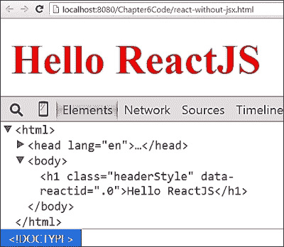

# 什么是 JSX

ReactJS 还有一个名为 JSX 的变种。**JSX** 代表 **JavaScript XML**。它遵循 XML 类型的元素声明用于网络组件开发。使用 JSX 有许多好处：

+   **熟悉度**：开发者熟悉 XML，JSX 提供了类似类型的元素声明。

+   **语义**：JSX 更易于理解，因为它遵循声明式编程类型。

+   **关注点分离**：JSX 提供了一种干净的方式来封装所有逻辑和标记在一个定义中。

## 自定义组件与 JSX

ReactJS 提供了 `JSXTransformer.js` 脚本文件，用于在浏览器中转换 JSX 代码。JSX 代码块使用以下语法定义：

```js
<script type="text/jsx">
   //JSX code goes here
</script>
```

可以使用 `React.createClass` 方法创建自定义元素。`createClass` 方法的语法如下：

```js
React.createClass(objectSpecification)

```

在前面的语法中，`objectSpecification` 类接受一个 `render` 方法和其他可选的生命周期方法和属性。我们将在接下来的章节中了解更多关于生命周期方法和属性的内容。现在，让我们看看使用 JSX 开发自定义元素的示例。以下代码展示了如何使用 `createClass` 方法开发自定义元素：

```js
<!DOCTYPE html>
<html>
<head lang="en">
    <meta charset="UTF-8">
    <title>ReactJS With JSX Demo</title>
    <script src="img/strong>"></script>
    <script src="img/strong>"></script>
    <style>
 .headerStyle{
 color: red;
 }
    </style>
</head>
<body>
<script type="text/jsx">
 var HelloMessage = React.createClass({
 render: function() {
 return (
 <h1 className="headerStyle">
 Hello ReactJS
 </h1>
 );
 }
 });
 React.render(<HelloMessage/>, document.body);
</script>
</body>
</html>
```

前面代码的详细信息如下：

+   使用 `React.createClass` 方法在 `<script>` 块内（`type` 设置为 `text/jsx`）创建了一个名为 `HelloMessage` 的自定义元素。

+   规范对象包含一个 `render` 方法，该方法包含一个 JSX 元素。`h1` 元素有一个 `className` 属性。`className` 属性是一个 JSX 属性，但它看起来与 HTML 元素属性很相似。

+   `HelloMessage` 的规范对象包含一个 `render` 方法，该方法返回一个 JSX 元素。

+   然后，使用 `<body>` 标签内的 `React.render` 方法渲染 `<HelloMessage>` 元素。

前面代码的输出如下屏幕截图所示。我们可以找到一个类似的结果，即 **Hello ReactJS** 信息以红色渲染：

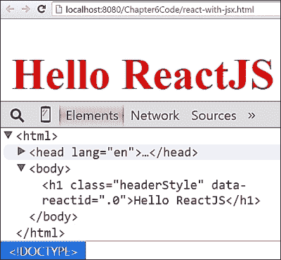

## ReactJS 内联样式

在 ReactJS 中，我们可以使用`style`属性和 ReactJS 表达式添加内联样式。ReactJS 将内联样式视为一个 JavaScript **匿名对象**，其中包含一个键/值对，表示属性及其值，用冒号（`:`）分隔。以下语法显示了内联样式的 JavaScript 对象：

```js
var styleObject={
 styleAttribute: "styleValue",
 };

```

上述语法的详细信息如下：

+   `styleAttribute`：这代表 CSS 属性名作为键。名称应遵循**驼峰命名法**。例如，`box-shadow`样式属性变为`boxShadow`。除了`ms`（Microsoft Internet Explorer）之外，供应商前缀属性以大写字母开头。

+   `styleValue`：这代表 CSS 属性的值，并且是字符串格式。例如，`1px solid grey`应该用双引号括起来，如`"1px solid grey"`。

让我们来看一个在 ReactJS 元素中使用内联样式的例子。ReactJS 元素的代码如下：

```js
<!DOCTYPE html>
<html>
<head lang="en">
    <meta charset="UTF-8">
    <title>ReactJS inline style demo</title>
    <script src="img/react.js"></script>
    <script src="img/JSXTransformer.js"></script>
</head>
<body>
<script type="text/jsx">
 var messageStyle={
 color: "red",
 border:"1px solid grey",
 boxShadow:"2px 2px 2px lightGrey",
 padding: "20px",
 width: "200px"
 },
        GoodMorning = React.createClass({
            render: function() {
                return (
                  <div style={messageStyle}>
                    Good Morning Developers
                  </div>
                );
            }
    });
    React.render(<GoodMorning/>, document.body);
</script>
</body>
</html>
```

上述代码的详细信息如下：

+   `messageStyle`对象包含一个匿名对象，其中 CSS 属性的名称作为`key`，样式作为字符串`value`。

+   这个`messageStyle`对象随后使用花括号与`div`元素的`style`属性绑定

上述代码的输出如下截图所示，其中`style`属性应用于`div`元素：

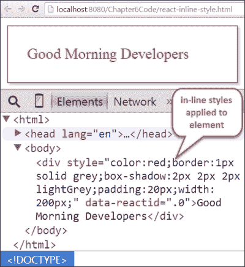

## ReactJS 事件处理

ReactJS 中的事件处理与 DOM 事件类似，但在处理器的命名上有所不同。例如，`onclick`处理器在 ReactJS 中重命名为`onClick`。这遵循了驼峰命名法来命名处理器。让我们来看一个事件处理的例子。以下代码展示了 ReactJS 中事件处理的一个简单示例：

```js
<!DOCTYPE html>
<html>
<head lang="en">
    <meta charset="UTF-8">
    <title>ReactJS Event Demo</title>
    <script src="img/react.js"></script>
    <script src="img/JSXTransformer.js"></script>
</head>
<body>
<script type="text/jsx">
    var SayHello = React.createClass({
 helloHandler: function(event){
 alert("Hello Developers");
 },
        render: function() {
            return (
              <button onClick = {this.helloHandler}>
Click Me
  </button>
            );
        }
    });
    React.render(<SayHello/>, document.body);
</script>
</body>
</html>
```

代码的详细信息如下：

+   `<SayHello>`元素使用`React.createClass`方法创建。`render`方法包含带有`onClick`事件处理器的`<button>`元素，该事件处理器通过`this`关键字绑定到`helloHandler`方法。`this`关键字指的是`<SayHello>`自定义元素。

+   `helloHandler`方法定义位于规范对象内部。该方法包含一个带有字符串消息的`alert`方法。

上述代码的输出包含一个带有**点击我**文本的按钮，并按以下截图所示渲染：

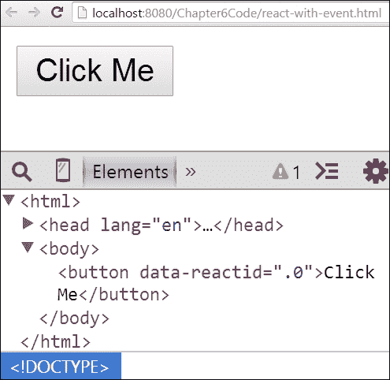

当用户点击此按钮时，`helloHandler`方法被调用，并弹出一个包含**Hello Developers**消息的警告窗口。上述代码的输出按以下截图所示：

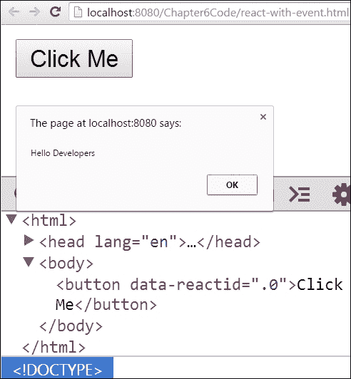

### 注意

要了解更多关于 ReactJS 库中事件处理系统的信息，请使用以下链接：[`facebook.github.io/react/docs/events.html`](http://facebook.github.io/react/docs/events.html)

## 有用的非 DOM 属性

在本节中，我们将学习一些可以与 JSX 元素一起使用的非 DOM 属性。以下列表包含了一些非 DOM 属性：

+   `key`：这是一个可选属性，可以用于在页面上唯一标识每个组件

+   `ref`：这是一个可选属性，可以用于从`render`方法外部访问子元素

+   `dangerouslySetInnerHTML`：此属性可以在 JSX 元素内部使用，以在组件内设置 HTML 内容

让我们通过一个简单的例子来检查这三个属性的使用。此例子的代码如下：

```js
<!DOCTYPE html>
<html>
<head lang="en">
    <meta charset="UTF-8">
    <title> ReactJS NonDOM Attribute Demo </title>
    <script src="img/react.js"></script>
    <script src="img/JSXTransformer.js"></script>
</head>
<body>
<script type="text/jsx">
    var StudentsReport = React.createClass({
        render: function() {
            var studentDetails = {
                headerHTML:{
 __html: "<i>Student List</i>"
 },
                subject:"Mathematics",
                list: [
                    {roll:123, name:"Sandeep"},
                    {roll:124, name:"Surabhi"}
                ]
            };
            return (
              <div>
                <h1 dangerouslySetInnerHTML={studentDetails.headerHTML}>
 </h1>
 <h3 ref="subjectName">{studentDetails.subject}</h3>
                <ol>
                {studentDetails.list.map(function(student) {
                    return <li key={student.roll}>{student.name}</li>;
                })}
                </ol>
                  <button onClick={this.logSubject}>Log Subject</button>
              </div>
            );
        },
      logSubject: function(event){
 console.log("Subject React Element: ",this.refs.subjectName);
console.log("Subject DOM Element: ",this.refs.subjectName.getDOMNode());
        }
    });
    React.render(<StudentsReport />, document.body);
</script>
</body>
</html>
```

上述代码的详细信息如下：

+   `<StudentsReport>`元素包含一个`render`方法，该方法包含一个包含`headerHTML`、`subject`和`list`属性的`studentDetails`对象。

+   `headerHTML`属性包含另一个具有`__html`属性的对象，该属性包含被`<i>`元素包裹的 HTML 内容。`headerHTML`属性与`render`块内存在的`React`元素的`dangerouslySetInnerHTML`属性一起使用。`dangerouslySetInnerHTML`属性用于在运行时绑定 HTML 内容。绑定 HTML 的代码如下：

    ```js
    <h1 dangerouslySetInnerHTML={studentDetails.headerHTML}>
    </h1>

    ```

+   `list`属性包含一个具有`roll`和`name`属性的学生的对象数组。使用`map`函数遍历列表数组。在迭代`<li>`元素时，`key`属性从`roll`属性获取其值，而内部文本从`name`属性获取其值。`key`属性用于唯一标识`<li>`学生元素。绑定学生详情的代码如下：

    ```js
    <ol>
      {studentDetails.list.map(function(student) {
     return <li key={student.roll}>{student.name}</li>;
     })}
    </ol>
    ```

+   `subject`属性包含所有学生所选修课程的名称。在`render`块中，`subject`与`h1`元素以及一个名为`subjectName`的`ref`属性绑定。`render`块还包含一个`<button>`元素，该元素连接到一个指向`logSubject`方法的`onClick`处理程序。`logSubject`方法执行以下两个操作：

    +   它使用`this.refs`属性检索整个引用元素，找到`studentName`并在控制台打印出来。它返回一个 ReactJS 元素。访问`studentName`的代码如下：

        ```js
        this.refs.subjectName

        ```

    +   它使用`getDOMNode`方法检索`React`元素的 DOM 版本。访问`studentName`的 DOM 版本的代码如下：

        ```js
        this.refs.subjectName.getDOMNode()

        ```

上述代码的输出渲染如下截图，其中`dangerouslySetInnerHTML`属性渲染了 HTML 内容：

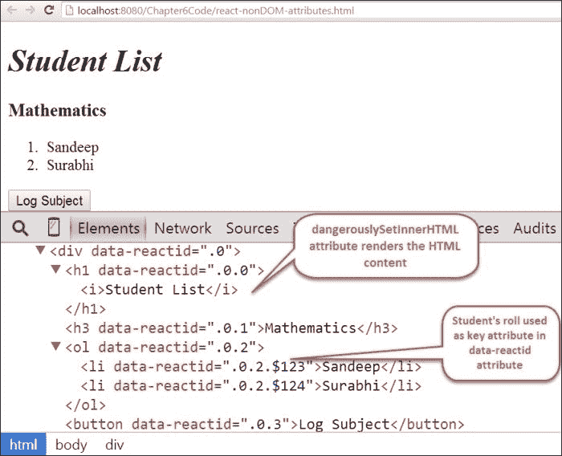

当用户点击**日志主题**按钮时，它会在控制台打印出`this.refs.subjectName`值的 ReactJS 和 DOM 元素。以下截图显示了包含两个打印信息的 Chrome 开发者控制台：

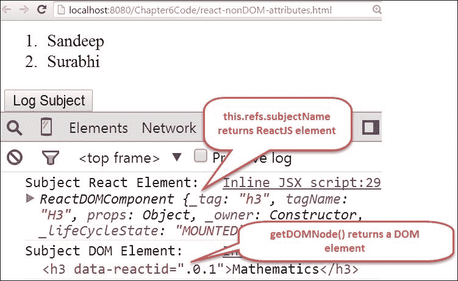

# ReactJS 组件生命周期

世界上每个对象在其生命周期中都有生命周期，并会经历不同的状态。我们可以将这些状态分为三个不同的阶段。以下图表显示了元素在其生命周期中经历的这三个常见阶段：

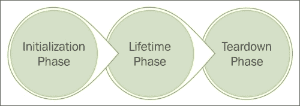

这些阶段的详细信息如下：

+   **初始化**: 这是为元素创建实例的第一个阶段。在生命周期中的后续实例有轻微的变化。

+   **生命周期**: 这是元素存在并改变其状态和属性的阶段。

+   **拆解**: 这是元素完成执行并进行清理的阶段。

同样，每个 ReactJS 元素都有一个生命周期，并且有不同的回调方法来处理每个状态。我们现在将学习 ReactJS 元素如何经历这些阶段。

## ReactJS 初始化阶段

在这个阶段，ReactJS 元素实例在浏览器中首次创建并渲染。ReactJS 提供了一组方法用于这个阶段的设置和预处理。在元素的初始化过程中，方法以特定的顺序被调用。以下图表显示了初始化阶段中回调方法的调用顺序：

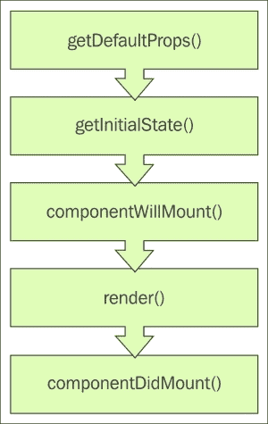

这些方法的详细信息如下：

+   `getDefaultProps`: 这个方法用于为 ReactJS 元素创建默认属性。此方法必须返回一个对象或 NULL。

+   `getInitialState`: 这个方法用于为组件创建状态。此方法必须返回一个对象或 NULL。

+   `componentWillMount`: 这个方法在组件挂载到页面之前执行。

+   `render`: 这个方法返回用于在浏览器中渲染的 ReactJS 组件树。

+   `componentDidMount`: 这个方法在组件在浏览器中完成初始渲染后执行。

## ReactJS 生命周期阶段

一旦 ReactJS 组件成功实例化，生命周期阶段就开始了。在这个阶段，组件可以经历许多变化。这些变化包括当前状态的变化或任何属性值的变化。ReactJS 提供了一组回调方法来覆盖和实现我们自己的逻辑来处理这些状态。以下图表显示了生命周期阶段中回调方法的调用顺序：

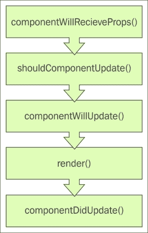

这些方法的详细信息如下：

+   `componentWillRecieveProps`: 这个方法会在组件创建新的属性时执行。

+   `shouldComponentUpdate`: 这个方法返回一个布尔值`true`或`false`。`true`标志表示在接收到新属性时将调用`render`方法。

+   `componentWillUpdate`: 这个方法在组件接收到新属性之前执行。它提供了在调用`render`方法之前进行预处理的机遇。

+   `render`：此方法返回用于在浏览器中渲染的更新后的组件树。

+   `componentDidUpdate`：此方法在修改后的更改在浏览器中渲染后立即执行。

## ReactJS 拆解阶段

这个阶段是 ReactJS 组件的最后一个状态。组件的实例被移除，并进行内存清理。以下图表显示了在此期间执行的回调方法：

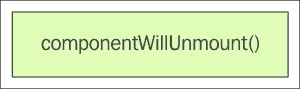

`componentWillUnmount` 方法在组件从 DOM 中卸载之前立即执行。

## ReactJS 生命周期示例

在本节中，我们将开发一个简单的 ReactJS 组件来演示生命周期方法的执行顺序。以下代码包含了 `<Welcome>` 元素的定义及其所有的生命周期回调方法：

```js
<script type="text/jsx">
    var Welcome = React.createClass({
        getDefaultProps: function(){
            console.log("inside getDefaultProps method");
            return{
                myName:"Sandeep"
            };
        }, getInitialState:function(){
            console.log("inside getInitialState method");
            return null;
        },componentWillMount:function(){
            console.log("inside componentWillMount method");
        },componentDidMount:function(){
            console.log("inside componentDidMount method");
        },render: function() {
            console.log("inside render method");
            return (
 <div>
 <h1>Welcome {this.props.myName}</h1>
 <button onClick={this.changeName}>
 Change myName to John
 </button>
 <button onClick={this.removeHandler}>
 Remove Welcome Element
 </button>
 </div>
            );
        },componentWillReceiveProps:function(){
           console.log("inside componentWillReceiveProps method");
        },shouldComponentUpdate:function(){
            console.log("inside shouldComponentUpdate method");
            return true;
        },componentWillUpdate:function(){
            console.log("inside componentWillUpdate method");
        },componentDidUpdate:function(){
            console.log("inside componentDidUpdate method");
        },componentWillUnmount:function(){
            console.log("inside componentWillUnmount method");
        },changeName:function(){
            this.setProps({myName :"John"})
        },removeHandler: function(){
            var thisElement = this.getDOMNode();
            this.unmountComponent(thisElement);
        }
    });React.render(<Welcome/>, document.body);
</script>
```

以下截图显示了 `<Welcome>` 元素在初始化和首次渲染时的输出：

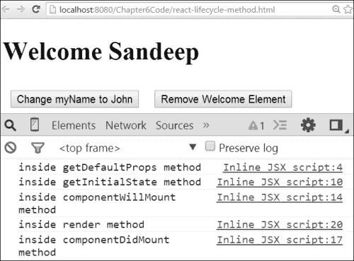

当用户按下第一个按钮将 `myName` 属性更改为 `John` 时，生命周期回调方法会被执行。以下截图显示了 `<Welcome>` 元素在 `myName` 属性更改时的输出：

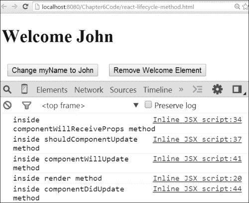

当用户按下第二个按钮以移除 `<Welcome>` 元素时，会调用拆解阶段的相应方法。以下截图显示了移除 `<Welcome>` 元素时，前述代码的输出：

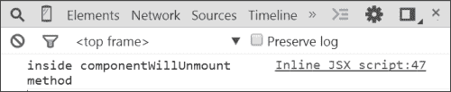

### 注意

要了解更多关于 ReactJS 组件生命周期方法的信息，请使用以下链接：

[`facebook.github.io/react/docs/component-specs.html`](http://facebook.github.io/react/docs/component-specs.html)

# 有状态的定制组件

ReactJS 提供了在创建 ReactJS 元素时创建和程序化更新状态的功能。这增加了应用程序的交互性。状态是私有的，并且对组件是可变的，使用 `this.states` 来引用。React 组件提供了 `this.setState` 方法来更新状态的值。

让我们看看在 ReactJS 元素中使用状态的示例。以下代码包含了 `<StudentResult>` 元素的定义：

```js
<script type="text/jsx">
    var StudentResult = React.createClass({
        getInitialState: function(){
            return{
                result:" "
            };
        },
        calculateResult: function(){
            var refScore = this.refs.studentScore.getDOMNode().value,
                score = parseInt(refScore,10);
            if(score > 30){
                this.setState({result: "PASS"})
            }else if(score < 30){
                this.setState({result: "FAIL"})
            }else{
                this.setState({result:""})
            }
        },
        render: function() {
            return (
             <div className="score-container">
                <input type="number" ref="studentScore"
                       onChange={this.calculateResult}
                       placeholder="Enter student score"/>
                 <h2>Result :{this.state.result}</h2>
             </div>
            );
        }
    });
    React.render(<StudentResult/>, document.body);
</script>
```

以下是代码的详细信息：

+   `<StudentResult>` 元素有一个初始状态 `result`，其值为空字符串。

+   `render` 方法包含一个 `<input>` 类型为 `number` 的输入框，用于输入学生分数。此元素具有 `ref` 属性，其值为 `studentScore`，以便在组件内部访问它。一个回调方法 `calculateResult` 被绑定到 `onChange` 事件。

+   `calculateResult` 方法获取用户输入的分数并决定是 **通过** 还是 **失败**。如果分数超过 `30`，则结果显示为 **通过**。如果分数低于 `30`，则结果被分类为 `失败` 或者为空字符串。

+   `render`方法使用`{this.state.result}`表达式显示结果。

以下截图显示了`<StudentResult>`组件的输出：

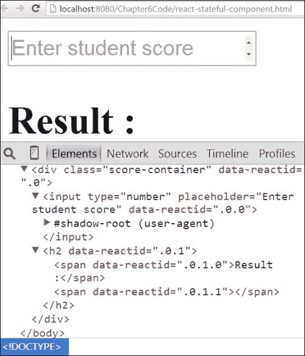

当用户输入分数时，更改处理程序会被执行，并在浏览器中打印出**PASS**或**FAIL**。以下截图显示了当用户在`<input>`元素中输入`45`时`<StudentResult>`组件的输出：


# 生产环境预编译的 JSX

在 ReactJS 中，`JSXTranformer.js`文件提供了浏览器内的 JSX 编译为纯 JavaScript 格式。由于以下原因，不建议在生产环境中使用浏览器内编译：

+   **额外计算**：由于 JSX 在客户端运行时的编译开销，这会减慢渲染速度。

+   **文件大小**：`JSXTransformer.js`文件的大小很大。这增加了对客户端的额外负载。

ReactJS 自带预编译 JSX 过程，用于解决浏览器中的编译问题。使用这种方法，开发者可以在离线模式下将 JSX 编译为纯 JavaScript。我们可以通过安装带有 npm 包的`react-tool`来实现离线 JSX 编译。假设系统中存在 npm，请使用以下命令在系统中安装`react-tool`：

```js
npm install -g react-tools

```

以下截图显示了正在安装`react-tool`包的终端：

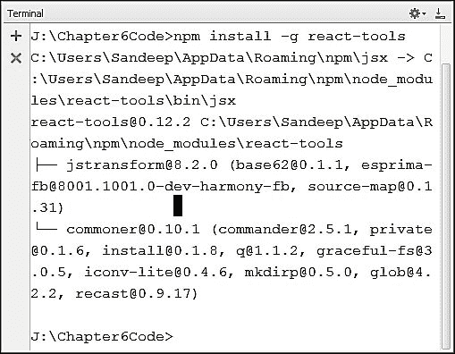

为了演示 JSX 预编译，我们在`precompile`目录下创建了两个子目录`dev`和`production`。在`dev`目录下的`react-date.js`文件中定义了一个新的 ReactJS 组件`<ShowDate>`。以下截图显示了具有新目录结构的终端：

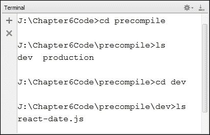

`react-date.js`文件中`<ShowDate>`元素的 JSX 代码如下：

```js
var ShowDate = React.createClass({
    getDefaultProps: function(){
        return{
            today: new Date().toDateString()
        };
    },
    render: function() {
        return (
            <h1>
            Today: {this.props.today}
            </h1>
        );
    }
});
React.render(<ShowDate/>, document.body);
```

上述代码的详细信息如下：

+   `<ShowDate>`元素定义包含返回具有`key`名称为`today`和值为`new Date().toDateString()`的对象的`getDefaultProps`方法

+   `<ShowDate>`元素定义包含返回带有`this.props.today`表达式的`h1`元素的`render`方法以进行显示

现在，我们可以将`dev/react-date.js`文件中存在的 JSX 代码预编译为纯 JavaScript。JSX 编译为纯 JavaScript 的命令如下：

```js
jsx dev production --no-cache-dir

```

以下截图显示了进行 JSX 预编译的终端，它将`react-date.js`文件转换为纯 JavaScript 并将其移动到`production`目录：

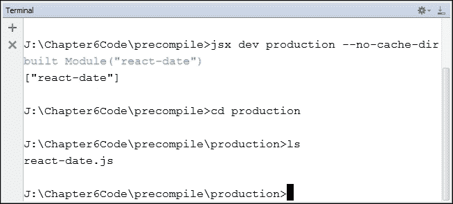

JSX 预编译器产生的编译后的纯 JavaScript 代码如下：

```js
var ShowDate = React.createClass({
 displayName: "ShowDate",
    getDefaultProps: function(){
        return{
            today: new Date().toDateString()
        };
    },
    render: function() {
        return (
            React.createElement("h1", null, 
            "Today: ", this.props.today
            )
        );
    }
});
React.render(React.createElement(ShowDate, null), document.body);
```

上述代码的详细信息如下：

+   它包含一个`displayName`属性，其字符串值为`ShowDate`，作为 ReactJS 元素的名称

+   `render` 方法使用 `React.createElement` 方法创建一个 `h1` 元素，文本内容为 `Today` 和 `this.props.today` 的值。

在 `production\react-date.js` 文件中存在的原生 JavaScript 代码已经预编译，可以直接在 HTML 页面中使用，无需 `JSXTranformer.js` 文件提供的浏览器内编译。使用 `<ShowDate>` 元素的代码如下：

```js
<!DOCTYPE html>
<html>
<head lang="en">
    <meta charset="UTF-8">
    <title>ReactJS precompilation demo</title>
    <script src="img/react.js"></script>
</head>
<body>
<script src="img/react-date.js"></script>
</body>
</html>
```

以下截图显示了前面代码的输出，其中 `<ShowDate>` 元素正在显示当前日期：

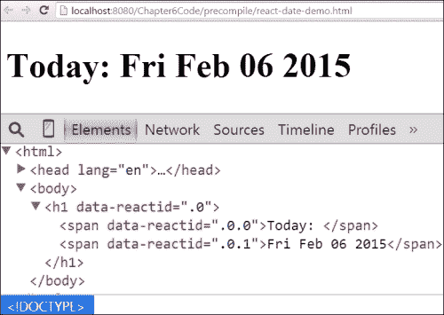

## JSX 文件监视器

`react-tools` 包附带一个文件监视器，可以用来监视 JSX 文件中的代码更改，并自动生成原生 JavaScript 代码。以下命令用于启动文件监视器：

```js
jsx --watch dev production

```

以下截图显示了带有 JSX 文件监视器的终端，该监视器监视 `dev` 目录中 `react-date.js` 文件中的任何 JSX 代码更改。任何 JSX 代码的更改都可以通过终端中的文件监视器进行记录：

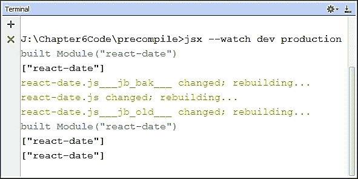

# 使用 ReactJS 开发数字时钟

在本节中，我们将使用 ReactJS 库开发一个数字时钟元素 `<TsClock>`。开发数字时钟的步骤如下：

## 步骤 1 – 定义数字时钟的生命周期脚本

以下代码包含在 ReactJS 库中开发的 `<TsClock>` 数字时钟元素的生命周期回调方法定义：

```js
<script type="text/jsx">
    var TsClock = React.createClass({
        getDefaultProps: function(){
            return{
                hour: "HH",
                minute: "MM",
                second: "SS"
            };
        },
        render: function() {
            return (
              <div className="clock">
                  <div className="hour">
{this.props.hour}
  </div>
                  <div className="minute">
{this.props.minute}
  </div>
                  <div className="second">
{this.props.second}
  </div>
              </div>
            );
        },
        updateClock: function(){
            var clock = new Date();
            this.setProps({
                hour : clock.getHours(),
                minute: clock.getMinutes(),
                second: clock.getSeconds()
            });
        },
        componentDidMount: function(){
            window.setInterval(this.updateClock, 1000);
        }
    });
    React.render(<TsClock/>, document.body);
</script>
```

上述代码的详细信息如下：

+   此块使用 `React.createElement` 方法定义 `<TsClock>` 元素。

+   它有三个默认属性，名为 `hour`、`minute` 和 `second`，在 `getDefaultProps` 方法中具有 `HH`、`MM` 和 `SS` 的值。

+   `render` 方法返回包含数字时钟模板的 ReactJS 组件树。模板使用 `this.props` 对象在 ReactJS 表达式 `{}` 中显示 `hour`、`minute` 和 `second` 的值。

+   当 `<TsClock>` 元素首次在 DOM 上挂载时，会触发 `componentDidMount` 生命周期回调方法。该方法将 `setInterval` 方法与 `updateClock` 方法绑定，持续时间为 1 秒。

+   `updateClock` 方法创建一个新的日期对象，并通过调用 ReactJS 提供的 `setProps` 方法修改 `hour`、`minute` 和 `second` 属性的值。在更新 `hour`、`minute` 和 `second` 的值之后，`setProps` 方法在后台调用 `render` 方法。这会更新浏览器中的 DOM，显示最新时间。

## 步骤 2 – 定义数字时钟的 CSS 样式

以下 CSS 代码用于应用数字时钟的样式：

```js
  <style>
        .clock {
            display: inline-flex;
            justify-content: space-around;
            background: floralwhite;
            font-size: 2rem;
            font-family: serif;
        }
        .clock .hour,
        .clock .minute,
        .clock .second {
            color: tomato;
            padding: 1.5rem;
            text-shadow: 0px 1px grey;
        }
  </style>
```

以下截图显示了前面代码的输出，其中包含具有 `hour`、`minute` 和 `second` 属性的数字时钟：

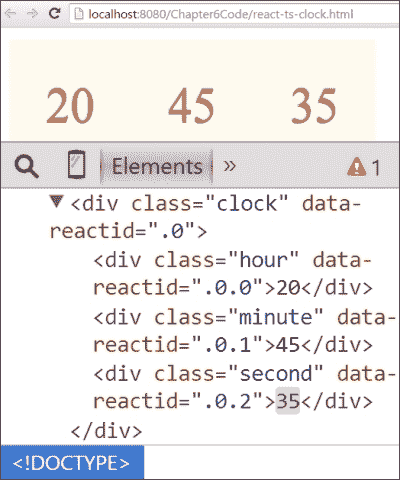

# 调试 ReactJS

ReactJS 为 Chrome 浏览器提供了一个调试工具。您可以使用以下链接将其安装到 Chrome 浏览器中：

[`chrome.google.com/webstore/detail/react-developer-tools/fmkadmapgofadopljbjfkapdkoienihi`](https://chrome.google.com/webstore/detail/react-developer-tools/fmkadmapgofadopljbjfkapdkoienihi)

以下截图显示了带有 ReactJS 调试工具的 Chrome 商店：


在成功安装**React 开发者工具**后，我们可以在 Chrome 开发者控制台中看到一个名为**React**的新标签页。**React 开发者工具**标签页包含以下五个不同的调试窗口：

+   **元素**：此窗口显示了渲染页面的 ReactJS 元素标记。

+   **属性**：此窗口列出了`React`元素使用的所有属性。

+   **状态**：此窗口列出了`React`元素使用的所有状态。

+   **组件**：此窗口列出了`React`元素使用的所有属性和方法。

+   **事件监听器**：此窗口列出了`React`元素使用的所有事件监听器。

以下截图显示了数字时钟`<TsClock>`元素的 React 开发者工具：

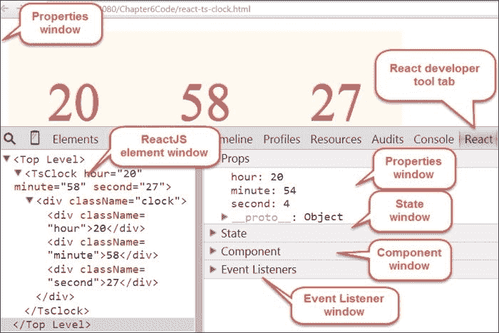

### 注意

要了解更多关于 React 开发者工具的调试信息，请使用以下链接：

[`facebook.github.io/react/blog/2014/01/02/react-chrome-developer-tools.html`](http://facebook.github.io/react/blog/2014/01/02/react-chrome-developer-tools.html)

# 摘要

在本章中，我们学习了 ReactJS 库及其不同的功能，例如 JSX、虚拟 DOM 和自定义组件开发。我们了解了 Flux 架构以及数据在基于 ReactJS 的应用程序中的流动方式。随着本章的结束，我们这本书也告一段落。希望你现在已经理解了 Web 组件规范的概念。祝您编码愉快！
