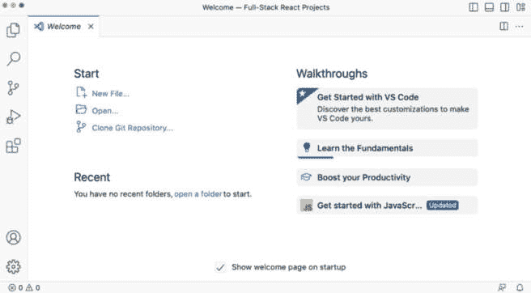
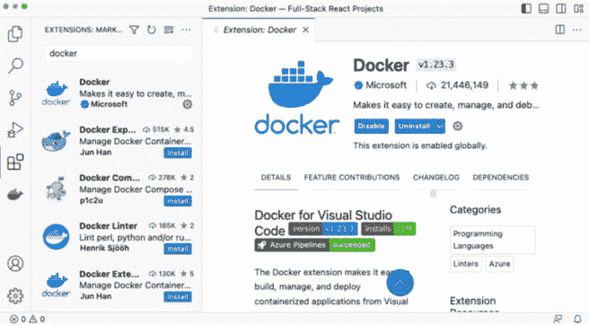

# 1

# 准备进行全栈开发

在本章中，我首先将简要概述本书的内容，并解释为什么本书中教授的技能在现代开发环境中很重要。然后，我们将开始行动，设置一个将作为我们全栈项目开发基础的项目。在本章结束时，你将拥有一个**集成开发环境**（**IDE**）和项目，它们已设置好并准备好进行全栈开发，并且将了解哪些工具可以用于设置此类项目。

在本章中，我们将涵盖以下主要内容：

+   成为全栈开发者的动机

+   第三版的新内容是什么？

+   充分利用本书

+   设置开发环境

# 技术要求

本章将指导你设置本书中开发全栈网络应用程序所需的所有必要技术。在我们开始之前，如果你还没有安装以下内容，请安装它们：

+   Node.js v20.10.0

+   Git v2.43.0

+   Visual Studio Code v1.84.2

这些版本是书中使用的版本。虽然安装较新版本通常不会有问题，但请注意，某些步骤在较新版本上可能有所不同。如果你在使用本书中提供的代码和步骤时遇到问题，请尝试使用提到的版本。

你可以在 GitHub 上找到本章的代码：[`github.com/PacktPublishing/Modern-Full-Stack-React-Projects/tree/main/ch1`](https://github.com/PacktPublishing/Modern-Full-Stack-React-Projects/tree/main/ch1)。

本章的 CiA 视频可以在以下网址找到：[`youtu.be/dyf3nECvKAE`](https://youtu.be/dyf3nECvKAE)。

重要

如果你克隆了本书的完整仓库，当运行 **npm install** 时，Husky 可能找不到 **.git** 目录。在这种情况下，只需在相应章节文件夹的根目录下运行 **git init**。

# 成为全栈开发者的动机

随着公司寻求增加前端和后端之间的合作并缩小差距，理解全栈开发变得越来越重要。前端正越来越深入地与后端集成，使用如服务器端渲染等技术。在本书中，我们将学习全栈项目的开发、集成、测试和部署。

# Full-Stack React Projects 本次发布的新内容是什么？

与 Full-Stack React Projects 的先前版本相比，这个新版本更注重前端与后端的集成，而不是前两个版本，因此故意不太多关注创建**用户界面**（**UI**）或在前端使用 UI 库，如**Material UI**（**MUI**）。本版提供了集成和部署全栈 Web 应用程序的基本知识。应用程序的部署在先前版本中完全缺失，测试也仅简要介绍。本版更注重全栈开发的这些基本部分，这样，在阅读本书后，您将能够开发、集成、测试和部署全栈 Web 应用程序。

# 充分利用本书

为了使本书简短而直接，我们将使用特定的技术和工具。然而，这些概念也适用于其他技术。我们将尝试简要介绍替代方案，以便如果某些方案不适合您的项目，您可以挑选和选择不同的工具。我建议首先尝试本书中介绍的技术，以便能够遵循说明，但请不要犹豫，以后可以自己尝试替代方案。

强烈建议您亲自编写代码。不要简单地运行提供的代码示例。为了正确学习和理解，亲自编写代码非常重要。然而，如果您遇到任何问题，您始终可以参考代码示例。

话虽如此，让我们在下一节中开始设置我们的开发环境。

# 设置开发环境

在这本书中，我们将使用**Visual Studio Code**（**VS Code**）作为我们的代码编辑器。请随意使用您偏好的任何编辑器，但请记住，您选择的编辑器中使用的扩展和配置的设置可能略有不同。

现在我们将安装 VS Code 和有用的扩展，然后继续设置我们开发环境所需的所有工具。

## 安装 VS Code 和扩展

在我们开始开发并设置其他工具之前，我们需要按照以下步骤设置我们的代码编辑器：

1.  从官方网站（撰写本文时，网址为[`code.visualstudio.com/`](https://code.visualstudio.com/))下载适用于您操作系统的 VS Code。本书中将使用版本*1.84.2*。

1.  下载并安装应用程序后，打开它，您应该会看到以下窗口：



图 1.1 – VS Code 的新安装（在 macOS 上）

1.  为了让事情变得简单，我们将安装一些扩展，因此点击截图左侧顶部第五个图标上的 **扩展** 图标。应该会打开一个侧边栏，您将在顶部看到 **在市场搜索扩展**。在此处输入扩展名称并点击 **安装** 以安装它。让我们先安装 **Docker** 扩展：



图 1.2 – 在 VS Code 中安装 Docker 扩展

1.  安装以下扩展：

    +   Docker（由 Microsoft 提供）

    +   ESLint（由 Microsoft 提供）

    +   Prettier – 代码格式化工具（由 Prettier 提供）

    +   MongoDB for VS Code（由 MongoDB 提供）

    VS Code 已经内置了对 JavaScript 和 Node.js 的支持。

1.  为本书中制作的项目创建一个文件夹（例如，您可以将其命名为 **Full-Stack-React-Projects**）。在这个文件夹内部，创建一个名为 **ch1** 的新文件夹。

1.  前往 **文件** 选项卡（从顶部开始的第一个图标）并点击 **打开文件夹** 按钮以打开空的 **ch1** 文件夹。

1.  如果您收到一个对话框询问 **您信任此文件夹中文件的作者吗？**，请选择 **信任父文件夹‘Full-Stack-React-Projects’中的所有文件作者**，然后点击 **是的，我信任** **作者** 按钮。


图 1.3 – 允许 VS Code 在我们的项目文件夹中执行文件

小贴士

在您自己的项目中，您可以安全地忽略此警告，因为您可以确信这些项目中不包含恶意代码。当从不受信任的来源打开文件夹时，您可以按 **不，我不信任作者**，并且仍然浏览代码。然而，这样做时，VS Code 的一些功能将被禁用。

我们现在已经成功设置了 VS Code，并准备好开始设置我们的项目！如果您已从 GitHub 代码示例中克隆了文件夹，也会弹出一个通知，告诉您找到了 Git 仓库。您可以简单地关闭它，因为我们只想打开 `ch1` 文件夹。

现在 VS Code 已经准备好了，让我们继续通过使用 Vite 设置一个新的项目。

## 使用 Vite 设置项目

对于这本书，我们将使用 **Vite** 来设置我们的项目，因为根据 *The State of JS 2022* 调查（[`2022.stateofjs.com/`](https://2022.stateofjs.com/)），它是最受欢迎和最受欢迎的。Vite 还使得设置现代前端项目变得容易，同时如果需要，还可以稍后扩展配置。按照以下步骤使用 Vite 设置您的项目：

1.  在 VS Code 菜单栏中，转到 **终端** | **新建终端** 以打开一个新的终端。

1.  在终端内部，运行以下命令：

    ```js
    $ npm create vite@5.0.0 .
    ```

    确保命令末尾有一个句号，以便在当前文件夹中创建项目，而不是创建一个新的文件夹。

注意

为了确保即使新版本发布，本书中的说明仍然有效，我们将所有包固定到特定版本。请按照给定的版本进行操作。完成本书后，当您自己开始新项目时，应始终尝试使用最新版本，但请注意，可能需要进行一些更改才能使其正常工作。请查阅相应包的文档，并遵循从本书版本到最新版本的迁移路径。

1.  当被问及是否安装 **create-vite** 时，只需键入 **y** 并按 *Return/Enter* 键继续。

1.  当被问及框架时，使用箭头键选择 **React** 并按 *Return* 键。如果您被要求输入项目名称，按 *Ctrl* + *C* 取消，然后再次运行命令，确保在末尾有一个句点以选择当前文件夹。

1.  当被问及变体时，选择 **JavaScript**。

1.  现在，我们的项目已经搭建完成，我们可以运行 **npm install** 来安装依赖。

1.  之后，运行 **npm run dev** 来启动开发服务器，如下截图所示：


图 1.4 – 使用 Vite 搭建项目后和启动开发服务器前的终端

注意

为了简化设置过程，我们直接使用了 **npm**。如果您更喜欢 **yarn** 或 **pnpm**，可以分别运行 **yarn create vite** 或 **pnpm create vite**。

1.  在终端中，您将看到一个 URL，告诉您应用正在运行的位置。您可以选择按住 *Ctrl* (*Cmd* 在 macOS 上) 并点击链接在浏览器中打开，或者手动在浏览器中输入 URL。

1.  要测试您的应用是否交互式，点击带有文本 **count is 0** 的按钮，每次按下它都应该增加计数。


图 1.5 – 使用 Vite 运行的第一个 React 应用

### Vite 的替代方案

Vite 的替代方案包括打包器，如 webpack、Rollup 和 Parcel。这些打包器配置高度灵活，但通常在开发服务器方面并不提供很好的体验。它们必须首先将所有我们的代码打包在一起，然后再将其提供给浏览器。相反，Vite 本地支持 **ECMAScript 模块**（**ESM**）标准。此外，Vite 起步时配置需求非常少。Vite 的一个缺点是，它可能难以配置某些更复杂的场景。一个有希望的即将到来的打包器是 Turbopack；然而，在撰写本文时，它仍然非常新。对于全栈开发，我们将稍后了解 Next.js，这是一个提供开箱即用开发服务器的 React 框架。

现在我们已经搭建好了样板项目，让我们花些时间设置一些工具，这些工具将强制执行最佳实践并保持一致的代码风格。

## 设置 ESLint 和 Prettier 以强制执行最佳实践和代码风格

现在我们已经设置了 React 应用，我们将设置**ESLint**来强制执行 JavaScript 和 React 的编码最佳实践。我们还将设置**Prettier**来强制执行代码风格并自动格式化我们的代码。

### 安装必要的依赖项

首先，我们将安装所有必要的依赖项：

1.  在终端中，单击**终端**窗格右上角的**分割终端**图标以创建一个新的**终端**窗格。这将保持我们的应用运行，同时我们可以运行其他命令。

1.  单击这个新打开的窗格以将其聚焦。然后，输入以下命令来安装 ESLint、Prettier 和相关插件：

    ```js
    $ npm install --save-dev prettier@3.1.0 \
      eslint@8.54.0 \
      eslint-plugin-react@7.33.2 \
      eslint-config-prettier@9.0.0 \
      eslint-plugin-jsx-a11y@6.8.0
    ```

    安装的包如下：

    +   **prettier**：根据定义的代码风格自动格式化我们的代码

    +   **eslint**：分析我们的代码并强制执行最佳实践

    +   **eslint-config-react**：启用与 React 项目相关的 ESLint 规则

    +   **eslint-config-prettier**：禁用与代码风格相关的 ESLint 规则，以便 Prettier 可以处理它们

    +   **eslint-plugin-jsx-a11y**：允许 ESLint 检查我们的 JSX 代码中的可访问性（**a11y**）问题

注意

**npm**中的**--save-dev**标志将那些依赖项保存为**dev**依赖项，这意味着它们只会在开发时安装。它们不会被安装并包含在部署的应用中。这对于保持我们容器的大小尽可能小非常重要。

在安装了依赖项之后，我们需要配置 Prettier 和 ESLint。我们将从配置 Prettier 开始。

### 配置 Prettier

Prettier 将为我们格式化代码，并替换 VS Code 中 JavaScript 的默认代码格式化器。它将允许我们花更多的时间编写代码，在保存文件时自动为我们正确地格式化。按照以下步骤配置 Prettier：

1.  在 VS Code 左侧侧边栏的文件列表下方右键单击（如果未打开，请单击**文件**图标）并按**新建文件...**来创建一个新文件。命名为**.prettierrc.json**（不要忘记文件名开头的点！）。

1.  新创建的文件应自动打开，因此我们可以开始将以下配置写入其中。我们首先创建一个新的对象，并将**trailingComma**选项设置为**all**，以确保跨越多行的对象和数组始终在末尾有逗号，即使是最后一个元素。这减少了通过 Git 提交更改时需要修改的行数：

    ```js
    {
      "trailingComma": "all",
    ```

1.  然后，我们将**tabWidth**选项设置为**2**个空格：

    ```js
      "tabWidth": 2,
    ```

1.  将**printWidth**设置为每行**80**个字符，以避免代码中出现长行：

    ```js
      "printWidth": 80,
    ```

1.  将**semi**选项设置为**false**以避免在不必要的地方使用分号：

    ```js
      "semi": false,
    ```

1.  最后，我们强制使用单引号而不是双引号：

    ```js
      "jsxSingleQuote": true,
      "singleQuote": true
    }
    ```

注意

这些 Prettier 设置只是编码风格约定的一个示例。当然，你可以根据自己的喜好进行调整。还有更多选项，所有这些都可以在 Prettier 文档中找到（[`prettier.io/docs/en/options.html`](https://prettier.io/docs/en/options.html)）。

### 配置 Prettier 扩展

现在我们已经有了 Prettier 的配置文件，我们需要确保 VS Code 扩展正确配置，以便为我们格式化代码：

1.  在 Windows/Linux 上，通过**文件** | **首选项...** | **设置**打开 VS Code 设置，或在 macOS 上通过**代码** | **设置...** | **设置**。

1.  在新打开的设置编辑器中，点击**工作区**选项卡。这确保我们将所有设置保存在项目文件夹中的**.vscode/settings.json**文件中。当其他开发者打开我们的项目时，他们也会自动使用这些设置。

1.  在搜索栏中搜索**保存时格式化编辑器**，并勾选复选框以启用保存时格式化代码。

1.  在搜索栏中搜索**编辑器默认格式化程序**，并从列表中选择**Prettier - 代码格式化程序**。

1.  为了验证 Prettier 是否正常工作，打开**.prettierrc.json**文件，在行首添加一些额外的空格，并保存文件。你应该会注意到 Prettier 已经重新格式化了代码以符合定义的代码风格。它将缩进空格的数量减少到两个。

现在 Prettier 已经正确设置，我们不再需要手动格式化代码了。请随意输入代码，并在保存文件时自动获得格式化！

### 创建 Prettier 忽略文件

为了提高性能并避免在应该自动格式化的文件上运行 Prettier，我们可以通过创建 Prettier 忽略文件来忽略某些文件和文件夹。按照以下步骤操作：

1.  在我们项目的根目录下创建一个名为**.prettierignore**的新文件，类似于我们创建**.prettierrc.json**文件的方式。

1.  向其中添加以下内容以忽略转译的源代码：

    ```js
    dist/
    ```

    `node_modules/`文件夹会自动被 Prettier 忽略。

现在我们已经成功设置了 Prettier，我们将配置 ESLint 以强制执行编码最佳实践。

### 配置 ESLint

虽然 Prettier 专注于我们代码的样式和格式，但 ESLint 专注于实际代码，避免常见的错误或不必要的代码。现在让我们来配置它：

1.  删除自动创建的**.eslintrc.cjs**文件。

1.  创建一个新的**.eslintrc.json**文件，并开始将其配置写入其中。首先，我们将**root**设置为**true**，以确保 ESLint 不会查看父文件夹以获取更多配置：

    ```js
    {
      "root": true,
    ```

1.  定义一个**env**对象，在其中我们将浏览器环境设置为**true**，以便 ESLint 能够理解浏览器特定的全局变量，如**document**和**window**：

    ```js
      "env": {
        "browser": true
      },
    ```

1.  定义一个**parserOptions**对象，其中我们指定我们正在使用最新的 ECMAScript 版本和 ESM：

    ```js
      "parserOptions": {
        "ecmaVersion": "latest",
        "sourceType": "module"
      },
    ```

1.  定义一个 **extends** 数组以扩展到推荐配置。具体来说，我们扩展到 ESLint 的推荐规则和我们安装的插件的推荐规则：

    ```js
      "extends": [
        "eslint:recommended",
        "plugin:react/recommended",
        "plugin:react/jsx-runtime",
        "plugin:jsx-a11y/recommended",
    ```

1.  作为数组的最后一个元素，我们使用 **prettier** 来禁用 ESLint 中所有与代码风格相关的规则，并让 Prettier 来处理：

    ```js
        "prettier"
      ],
    ```

1.  现在，我们为插件定义设置。首先，我们告诉 **react** 插件自动检测我们安装的 React 版本：

    ```js
      "settings": {
        "react": {
          "version": "detect"
        }
      },
    ```

1.  最后，在 **settings** 部分之外，我们定义一个 **overrides** 数组，在其中指定 ESLint 应该只检查 **.js** 和 **.****jsx** 文件：

    ```js
      "overrides": [
        {
          "files": ["*.js", "*.jsx"]
        }
      ]
    }
    ```

1.  创建一个新的 **.eslintignore** 文件，内容如下：

    ```js
    dist/
    vite.config.js
    ```

    The `node_modules/` folder is automatically ignored by ESLint.

1.  保存文件并在终端中运行 **npx eslint src** 来运行代码检查器。你会看到由于我们配置的规则与 Vite 默认项目中提供的源不匹配，已经存在一些错误：


图 1.6 – 当第一次运行 ESLint 时，我们会得到一些关于规则违反的错误

1.  幸运的是，所有这些问题都可以通过 ESLint 自动修复。运行 **npx eslint src --fix** 来自动修复问题。现在，当你再次运行 **npx eslint src** 时，你将不会得到任何输出。这意味着没有代码检查器错误！

小贴士

**npx** 命令允许我们在类似于在 **package.json** 脚本中运行它们的环境中执行由 **npm** 包提供的命令。它还可以运行远程包而无需永久安装。如果包尚未安装，它将询问你是否应该这样做。

### 添加一个新的脚本来运行我们的代码检查器

在上一节中，我们通过手动运行 `npx eslint src` 来调用代码检查器。我们现在要将一个 `lint` 脚本添加到 `package.json` 中：

1.  在终端中运行以下命令来在 **package.json** 文件中定义一个 **lint** 脚本：

    ```js
    $ npm pkg set scripts.lint="eslint src"
    ```

1.  现在，在终端中运行 **npm run lint**。这应该像 **npx eslint src** 一样成功执行 **eslint src**：


图 1.7 – 代码检查器成功运行，没有错误

在设置好 ESLint 和 Prettier 之后，我们仍需要确保在提交代码之前它们已经运行。让我们设置 Husky 来确保我们现在提交的代码是正确的。

## 设置 Husky 以确保我们提交的代码正确

在设置好 Prettier 和 ESLint 之后，我们现在将自动通过 Prettier 在保存时格式化代码，并在 VS Code 中看到 ESLint 的错误，当我们犯错或忽略最佳实践时。然而，我们可能会错过一些这些错误，并意外提交无效的代码。为了避免这种情况，我们可以设置 **Husky** 和 **lint-staged**，它们在我们将代码提交到 Git 之前运行，并确保在提交之前 Prettier 和 ESLint 已成功在源代码上执行。

重要

如果你克隆了本书的完整仓库，Husky 在运行**npm install**时可能找不到**.git**目录。在这种情况下，只需在相应章节文件夹的根目录下运行**git init**。

让我们按照以下步骤设置 Husky 和 lint-staged：

1.  运行以下命令将 Husky 和 lint-staged 作为**dev**依赖项安装：

    ```js
    $ npm install --save-dev husky@8.0.3 \
      lint-staged@15.1.0
    ```

1.  打开**package.json**文件，并在**devDependencies**之后添加以下**lint-staged**配置，然后保存文件。这将运行 Prettier 和 ESLint 对所有提交的**.js**和**.jsx**文件，并尝试自动修复代码风格和 lint 错误，如果可能的话：

    ```js
      "lint-staged": {
        "**/*.{js,jsx}": [
          "npx prettier --write",
          "npx eslint --fix"
        ]
      }
    ```

1.  在**ch1**文件夹中初始化一个 Git 仓库，并仅使用**package.json**文件进行初始提交，因为 lint-staged 在初始提交中不会执行：

    ```js
    $ git init
    $ git add package.json
    $ git commit -m "chore: initial commit"
    ```

1.  将**husky install**脚本添加到**package.json**中的**prepare**脚本中，以便在项目克隆和执行**npm install**时自动安装 Husky：

    ```js
    $ npm pkg set scripts.prepare="husky install"
    ```

1.  由于我们现在不需要再次运行**npm install**，我们需要这次手动运行**prepare**脚本：

    ```js
    $ npm run prepare
    ```

1.  为 lint-staged 添加一个**pre-commit**钩子，以便每次我们执行**git commit**时，ESLint 和 Prettier 都会运行：

    ```js
    $ npx husky add .husky/pre-commit "npx lint-staged"
    ```

1.  现在，将所有文件添加到 Git 中，并尝试进行提交：

    ```js
    $ git add .
    $ git commit -m "chore: basic project setup"
    ```

如果一切顺利，你应该在运行`git commit`后看到`husky`运行`lint-staged`，它反过来运行`prettier`和`eslint`。如果你遇到配置错误，请确保所有文件都已正确保存，然后再次运行`git commit`。


### 设置 commitlint 以强制我们的提交信息遵循标准

除了检查我们的代码，我们还可以检查我们的提交信息。你可能已经注意到，我们已经在提交信息前加了类型（例如`chore`类型）。类型使得跟踪提交中发生了什么变得更加容易。为了强制使用类型，我们可以设置**commitlint**。按照以下步骤进行设置：

1.  安装 commitlint 和 commitlint 的常规配置：

    ```js
    $ npm install --save-dev @commitlint/cli@18.4.3 \
      @commitlint/config-conventional@18.4.3
    ```

1.  在我们项目的根目录下创建一个新的**.commitlintrc.json**文件，并添加以下内容：

    ```js
    {
      "extends": ["@commitlint/config-conventional"]
    }
    ```

1.  向 Husky 添加一个**commit-msg**钩子：

    ```js
    $ npx husky add .husky/commit-msg \
      'npx commitlint --edit ${1}'
    ```

1.  现在，如果我们尝试添加更改的文件并提交而没有类型或错误的类型，我们将从 commitlint 收到错误，并且无法进行此类提交。如果我们添加正确的类型，它将成功：

    ```js
    $ git add .
    $ git commit -m "no type"
    $ git commit -m "wrong: type"
    $ git commit -m "chore: configure commitlint"
    ```

下图显示了 Husky 的作用。如果我们写了一个错误的提交信息，它将拒绝它，并阻止我们提交代码。只有当我们输入一个格式正确的提交信息时，提交才会通过：


图 1.9 – commitlint 成功运行并防止没有类型和类型错误的提交

在 commitlint 约定配置（[`www.conventionalcommits.org/`](https://www.conventionalcommits.org/））中的提交信息结构是，必须首先列出类型，然后可选的范围，接着是描述，例如`type(scope): description`。可能类型如下：

+   **fix**: 用于错误修复

+   **feat**: 用于新功能

+   **refactor**: 用于重构代码而不添加功能或修复错误

+   **build**: 用于构建系统或依赖项的更改

+   **ci**: 用于 CI/CD 配置的更改

+   **docs**: 仅用于文档的更改

+   **perf**: 用于性能优化

+   **style**: 用于修复代码格式

+   **test**: 用于添加或调整测试

范围是可选的，最好在 monorepo 中使用，以指定对其中某个应用程序或库进行了更改。

# 摘要

现在我们已经成功设置了我们的项目并开始实施标准，我们可以在不担心代码风格一致、提交信息一致或犯小错误的情况下继续我们的项目工作。ESLint、Prettier、Husky 和 commitlint 已经为我们解决了这些问题。

在下一章，*第二章*，*了解 Node.js 和 MongoDB*，我们将学习如何编写和运行小的 Node.js 脚本以及数据库系统 MongoDB 是如何工作的。
