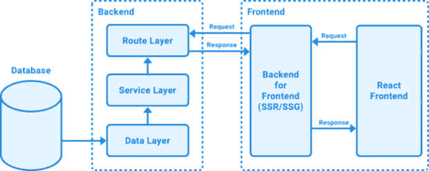
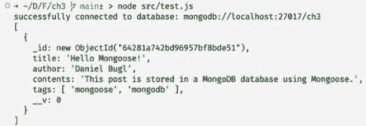
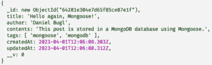
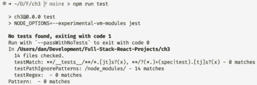
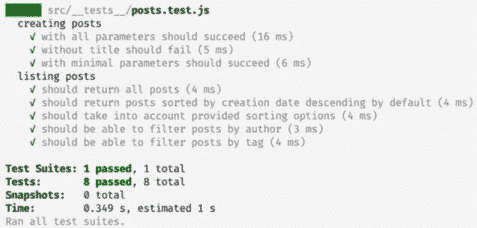
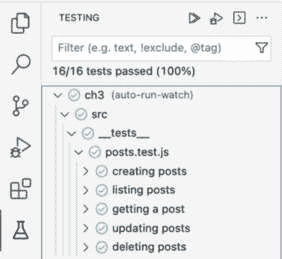
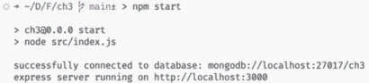
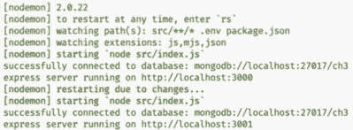
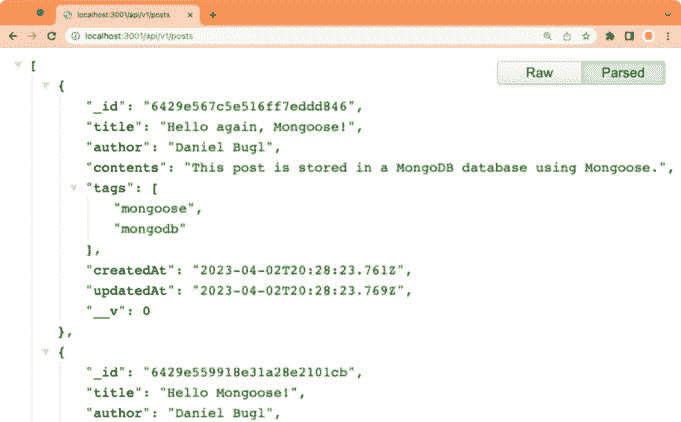

# 3

# 使用 Express、Mongoose ODM 和 Jest 实现后端

在学习了 Node.js 和 MongoDB 的基础知识之后，我们将通过使用 Express 提供 REST API、Mongoose **对象数据建模**（**ODM**）与 MongoDB 接口以及 Jest 测试我们的代码来将它们付诸实践。我们首先将学习如何使用架构模式来构建后端项目。然后，我们将使用 Mongoose 创建数据库模式。接下来，我们将创建服务函数以与数据库模式接口，并使用 Jest 为它们编写测试。然后，我们将学习 REST 是什么以及何时有用。最后，我们将提供一个 REST API 并使用 Express 来提供服务。在本章结束时，我们将拥有一个可供下一章开发的前端使用的工作后端服务。

在本章中，我们将介绍以下主要内容：

+   设计后端服务

+   使用 Mongoose 创建数据库模式

+   开发和测试服务函数

+   使用 Express 提供 REST API

# 技术要求

在我们开始之前，请从*第一章*，*为全栈开发做准备*，以及*第二章*，*了解 Node.js*和*MongoDB*中安装所有要求。

那些章节中列出的版本是本书中使用的版本。虽然安装较新版本可能不会出现问题，但请注意，某些步骤在较新版本上可能有所不同。如果您在使用本书中提供的代码和步骤时遇到问题，请尝试使用*第一章*和*第二章*中提到的版本。

您可以在 GitHub 上找到本章的代码：[`github.com/PacktPublishing/Modern-Full-Stack-React-Projects/tree/main/ch3`](https://github.com/PacktPublishing/Modern-Full-Stack-React-Projects/tree/main/ch3)。

如果您克隆了本书的完整仓库，当运行`npm install`时，Husky 可能找不到`.git`目录。在这种情况下，只需在相应章节文件夹的根目录中运行`git init`即可。

本章的 CiA 视频可以在以下网址找到：[`youtu.be/fFHVVVn03rc`](https://youtu.be/fFHVVVn03rc)。

# 设计后端服务

为了设计我们的后端服务，我们将使用一种名为**模型-视图-控制器**（**MVC**）的现有架构模式的变体。MVC 模式包括以下部分：

+   **模型**：处理数据和基本数据逻辑

+   **控制器**：控制数据的处理和显示方式

+   **视图**：显示当前状态

在传统的全栈应用中，后端会完全渲染和显示前端，通常一个交互需要整个页面的刷新。MVC 架构主要是为这类应用设计的。然而，在现代应用中，前端通常是交互式的，并且仅通过服务器端渲染在后台进行渲染。因此，在现代应用中，我们通常区分实际的底层服务（服务）和用于前端的后台（处理静态站点生成和服务器端渲染）：



图 3.1 – 一个现代全栈架构，包含单个后端服务和具有服务器端渲染（SSR）和静态站点生成（SSG）的前端

对于现代应用，后端服务只处理处理和提供请求及数据，不再渲染用户界面。相反，我们有一个专门处理前端和用户界面服务器端渲染的独立应用。为了适应这种变化，我们将 MVC 架构模式调整为适用于后端服务的以下数据-服务-路由模式：

+   **路由层**：定义消费者可以访问的路由，并通过处理请求参数和主体来处理用户输入，然后调用服务函数

+   **服务层**：提供服务函数，例如 **创建-读取-更新-删除**（**CRUD**）函数，这些函数通过数据层访问数据库

+   **数据层**：仅处理访问数据库和进行基本验证以确保数据库的一致性

这种关注点分离对于只暴露路由而不处理用户界面渲染的服务来说效果最佳。在这个模式中的每一层只处理请求处理中的一个步骤。

在了解了后端服务的设计之后，让我们开始创建一个反映我们所学的文件夹结构。

## 创建后端服务的文件夹结构

现在，我们将根据这个模式创建后端服务的文件夹结构。按照以下步骤操作：

1.  首先，将 **ch2** 文件夹复制到新的 **ch3** 文件夹中，以创建一个新的用于后端服务的文件夹，如下所示：

    ```js
    $ cp -R ch2 ch3
    ```

1.  在 VS Code 中打开新的 **ch3** 文件夹。

1.  编辑 **.eslintrc.json** 文件，将 **browser** 环境替换为 **node** 和 **es6** 环境，如下所示：

    ```js
      "env": {
        "node": true,
        "es6": true
      },
    ```

1.  此外，从 **.eslintrc.json** 文件中 *移除* **react** 和 **jsx-a11y** 插件。现在我们也可以通过移除高亮行来移除与 React 相关的 **设置** 和 **覆盖**：

    ```js
      "extends": [
        "eslint:recommended",
        "plugin:react/recommended",
        "plugin:react/jsx-runtime",
        "plugin:jsx-a11y/recommended",
        "prettier"
      ],
      "settings": {
        "react": {
          "version": "detect"
        }
      },
      "overrides": [
        {
          "files": ["*.js", "*.jsx"]
        }
      ]
    ```

1.  *删除* **index.html** 和 **vite.config.js** 文件。

1.  我们现在也可以从 **.eslintignore** 文件中 *移除* **vite.config.js** 文件：

    ```js
    dist/
    vite.config.js
    ```

1.  *删除* **public**、**backend** 和 **src** 文件夹。

1.  在 VS Code 中打开 **ch3** 文件夹，打开一个终端并运行以下命令以移除 **vite** 和 **react**：

    ```js
    $ npm uninstall --save react react-dom
    $ npm uninstall --save-dev vite @types/react \
      @types/react-dom @vitejs/plugin-react \
      eslint-plugin-jsx-a11y eslint-plugin-react
    ```

1.  编辑 **package.json** 文件，并从中 *删除* **dev**、**build** 和 **preview** 脚本：

    ```js
      "scripts": {
        "dev": "vite",
        "build": "vite build",
        "lint": "eslint src",
        "preview": "vite preview",
        "prepare": "husky install"
      },
    ```

1.  现在，创建一个新的 **src/** 文件夹，并在其中创建 **src/db/**（用于数据层）、**src/services/**（用于服务层）和 **src/routes/**（用于路由层）文件夹。

我们的第一个应用程序将是一个博客应用程序。对于这样的应用程序，我们需要 API 能够执行以下操作：

+   获取帖子列表

+   获取单个帖子

+   创建一个新的帖子

+   更新现有的帖子

+   删除现有的帖子

为了提供这些功能，我们首先需要创建一个数据库模式来定义我们的数据库中博客文章对象的外观。然后，我们需要服务函数来处理博客文章的 CRUD 功能。最后，我们将定义我们的 REST API 以查询、创建、更新和删除博客文章。

# 使用 Mongoose 创建数据库模式

在我们开始定义数据库模式之前，我们首先需要设置 Mongoose 本身。Mongoose 是一个库，通过减少与 MongoDB 交互所需的样板代码来简化 MongoDB 对象建模。它还包括常见的业务逻辑，例如自动设置 `createdAt` 和 `updatedAt` 时间戳以及验证和类型转换，以保持数据库状态的一致性。

按照以下步骤设置 `mongoose` 库：

1.  首先，安装 **mongoose** 库：

    ```js
    $ npm install mongoose@8.0.2
    ```

1.  在 **src/db/init.js** 文件中创建一个新的 **src/db/init.js** 文件，并在其中导入 **mongoose**：

    ```js
    import mongoose from 'mongoose'
    ```

1.  定义并导出一个初始化数据库连接的函数：

    ```js
    export function initDatabase() {
    ```

1.  首先，我们定义 **DATABASE_URL** 以指向通过 Docker 运行的本地 MongoDB 实例，并指定 **blog** 作为数据库名称：

    ```js
      const DATABASE_URL = 'mongodb://localhost:27017/blog'
    ```

    连接字符串与我们之前在通过 Node.js 直接访问数据库时使用的类似。

1.  然后，向 Mongoose 连接的 **open** 事件添加一个监听器，以便我们在连接到数据库后显示一条日志消息：

    ```js
      mongoose.connection.on('open', () => {
        console.info('successfully connected to database:', DATABASE_URL)
      })
    ```

1.  现在，使用 **mongoose.connect()** 函数连接到我们的 MongoDB 数据库并返回 **connection** 对象：

    ```js
      const connection = mongoose.connect(DATABASE_URL)
      return connection
    }
    ```

1.  在 **src/example.js** 文件中创建一个新的 **src/example.js** 文件，并在其中导入并运行 **initDatabase** 函数：

    ```js
    import { initDatabase } from './db/init.js'
    initDatabase()
    ```

1.  使用 Node.js 运行 **src/example.js** 文件以查看 Mongoose 成功连接到我们的数据库：

    ```js
    $ node src/example.js
    ```

    和往常一样，您可以通过在终端中按 *Ctrl* + *C* 来停止服务器。

我们可以看到日志消息被打印到终端，因此我们知道 Mongoose 成功连接到了我们的数据库！如果有错误，例如，因为 Docker（或容器）没有运行，它将挂起一段时间，然后抛出一个关于连接被拒绝的错误 (`ECONNREFUSED`)。在这种情况下，请确保 Docker MongoDB 容器正在正常运行并且可以被连接到。

## 定义博客文章的模型

在初始化数据库后，我们应该做的第一件事是定义博客文章的数据结构。在我们的系统中，博客文章应该有一个标题、一个作者、内容以及与文章关联的一些标签。按照以下步骤定义博客文章的数据结构：

1.  创建一个新的 **src/db/models/** 文件夹。

1.  在那个文件夹内，创建一个新的 **src/db/models/post.js** 文件，导入 **mongoose** 和 **Schema** 类：

    ```js
    import mongoose, { Schema } from 'mongoose'
    ```

1.  为文章定义一个新的模式：

    ```js
    const postSchema = new Schema({
    ```

1.  现在指定博客文章的所有属性及其对应类型。我们有一个必需的 **title**、一个 **author** 和 **contents**，它们都是字符串：

    ```js
      title: { type: String, required: true },
      author: String,
      contents: String,
    ```

1.  最后，我们有 **tags**，它是一个字符串数组：

    ```js
      tags: [String],
    })
    ```

1.  现在我们已经定义了模式，我们可以通过使用 **mongoose.model()** 函数从它创建一个 Mongoose 模型：

    ```js
    export const Post = mongoose.model('post', postSchema)
    ```

注意

**mongoose.model()** 的第一个参数指定了集合的名称。在我们的例子中，集合将被命名为 **posts**，因为我们指定了 **post** 作为名称。在 Mongoose 模型中，我们需要指定文档的单数形式名称。

现在我们已经定义了博客文章的数据结构和模型，我们可以开始使用它来创建和查询文章。

## 使用博客文章模型

创建我们的模型后，让我们尝试使用它！目前，我们只是在 `src/example.js` 文件中访问它，因为我们还没有定义任何服务函数或路由：

1.  在 **src/example.js** 文件中导入 **Post** 模型：

    ```js
    import { initDatabase } from './db/init.js'
    import { Post } from './db/models/post.js'
    ```

1.  我们之前定义的 **initDatabase()** 函数是一个 **async** 函数，所以我们需要 **await** 它；否则，我们将在连接到数据库之前尝试访问数据库：

    ```js
    await initDatabase()
    ```

1.  通过调用 **new Post()** 并定义一些示例数据来创建一个新的博客文章：

    ```js
    const post = new Post({
      title: 'Hello Mongoose!',
      author: 'Daniel Bugl',
      contents: 'This post is stored in a MongoDB database using Mongoose.',
      tags: ['mongoose', 'mongodb'],
    })
    ```

1.  在博客文章上调用 **.save()** 以将其保存到数据库：

    ```js
    await post.save()
    ```

1.  现在，我们可以使用 **.find()** 函数列出所有文章，并记录结果：

    ```js
    const posts = await Post.find()
    console.log(posts)
    ```

1.  运行示例脚本以查看我们的文章被插入和列出：

    ```js
    $ node src/example.js
    ```

    运行前面的脚本后，您将得到以下结果：



图 3.2 – 我们通过 Mongoose 插入的第一个文档！

如您所见，使用 Mongoose 与直接使用 MongoDB 非常相似。然而，它为我们提供了模型的一些包装器，以便于使用，使得处理文档更加容易。

## 在博客文章中定义创建和最后更新日期

您可能已经注意到我们没有为博客文章添加任何日期。因此，我们不知道博客文章是在何时创建的，或者最后一次更新是在何时。Mongoose 使得实现此类功能变得简单，现在让我们试试看：

1.  编辑 **src/db/models/post.js** 文件，并将第二个参数添加到 **new Schema()** 构造函数中。第二个参数指定了模式的选项。在这里，我们设置了 **timestamps:** **true** 设置：

    ```js
    const postSchema = new Schema(
      {
        title: String,
        author: String,
        contents: String,
        tags: [String],
      },
      { timestamps: true },
    )
    ```

1.  现在我们需要做的就是通过运行示例脚本创建一个新的博客文章，我们会看到最后插入的文章现在有 **createdAt** 和 **updatedAt** 时间戳：

    ```js
    $ node src/example.js
    ```

1.  为了查看 **updatedAt** 时间戳是否工作，让我们尝试通过使用 **findByIdAndUpdate** 方法更新创建的博客文章。将 **await post.save()** 的结果保存在 **createdPost** 常量中，然后在 **src/example.js** 文件的末尾添加以下代码，在 **Post.find()** 调用之前：

    ```js
    const createdPost = await post.save()
    await Post.findByIdAndUpdate(createdPost._id, {
      $set: { title: 'Hello again, Mongoose!' },
    })
    ```

1.  再次运行服务器以查看博客文章的更新：

    ```js
    $ node src/example.js
    ```

    你将得到三篇文章，其中最后一篇现在看起来如下：



图 3.3 – 我们自动更新时间戳的更新文档

如我们所见，使用 Mongoose 使得处理 MongoDB 文档变得更加方便！现在我们已经定义了数据库模型，让我们开始开发（并为它们编写测试）服务函数！

# 开发和测试服务函数

到目前为止，我们一直通过将代码放入 `src/example.js` 文件中来测试代码。现在，我们将编写一些服务函数，并通过使用 Jest 学习如何为它们编写实际的测试。

## 设置测试环境

首先，我们将按照以下步骤设置我们的测试环境：

1.  将 **jest** 和 **mongodb-memory-server** 作为开发依赖项安装：

    ```js
    $ npm install --save-dev jest@29.7.0 \
    mongodb-memory-server library allows us to spin up a fresh instance of a MongoDB database, storing data only in memory, so that we can run our tests on a fresh database instance.
    ```

1.  创建一个 **src/test/** 文件夹，用于放置我们的测试设置。

1.  在此文件夹中，创建一个 **src/test/globalSetup.js** 文件，其中我们将从之前安装的库中导入 **MongoMemoryServer**：

    ```js
    import { MongoMemoryServer } from 'mongodb-memory-server'
    ```

1.  现在定义一个 **globalSetup** 函数，为 MongoDB 创建一个内存服务器：

    ```js
    export default async function globalSetup() {
      const instance = await MongoMemoryServer.create({
    ```

1.  在创建 **MongoMemoryServer** 时，将二进制版本设置为 **6.0.4**，这是我们为我们的 Docker 容器安装的相同版本：

    ```js
        binary: {
          version: '6.0.4',
        },
      })
    ```

1.  我们将 MongoDB 实例存储为全局变量，以便在之后的 **globalTeardown** 函数中访问它：

    ```js
      global.__MONGOINSTANCE = instance
    ```

1.  我们还将把连接到我们的测试实例的 URL 存储在 **DATABASE_URL** 环境变量中：

    ```js
      process.env.DATABASE_URL = instance.getUri()
    }
    ```

1.  编辑 **src/db/init.js** 并调整 **DATABASE_URL** 以从环境变量中获取，以便我们的测试将使用正确的数据库：

    ```js
    export function initDatabase() {
      const DATABASE_URL = process.env.DATABASE_URL
    ```

1.  此外，创建一个 **src/test/globalTeardown.js** 文件，在测试完成后停止 MongoDB 实例，并在其中添加以下代码：

    ```js
    export default async function globalTeardown() {
      await global.__MONGOINSTANCE.stop()
    }
    ```

1.  现在，创建一个 **src/test/setupFileAfterEnv.js** 文件。在这里，我们将定义一个 **beforeAll** 函数，在所有测试运行之前初始化我们的数据库连接，以及一个 **afterAll** 函数，在所有测试运行完成后从数据库断开连接：

    ```js
    import mongoose from 'mongoose'
    import { beforeAll, afterAll } from '@jest/globals'
    import { initDatabase } from '../db/init.js'
    beforeAll(async () => {
      await initDatabase()
    })
    afterAll(async () => {
      await mongoose.disconnect()
    })
    ```

1.  然后，在项目的根目录中创建一个新的 **jest.config.json** 文件，我们将在这里定义测试的配置。在 **jest.config.json** 文件中，我们首先将测试环境设置为 **node**：

    ```js
    {
      "testEnvironment": "node",
    ```

1.  接下来，告诉 Jest 使用我们之前创建的 **globalSetup**、**globalTeardown** 和 **setupFileAfterEnv** 文件：

    ```js
      "globalSetup": "<rootDir>/src/test/globalSetup.js",
      "globalTeardown": "<rootDir>/src/test/globalTeardown.js",
      "setupFilesAfterEnv": ["<rootDir>/src/test/setupFileAfterEnv.js"]
    }
    ```

注意

在这种情况下，**<rootDir>** 是一个特殊的字符串，Jest 会自动将其解析为根目录。你在这里不需要手动填写根目录。

1.  最后，编辑**package.json**文件并添加一个**test**脚本，该脚本将运行 Jest：

    ```js
      "scripts": {
        "test": "NODE_OPTIONS=--experimental-vm-modules jest",
        "lint": "eslint src",
        "prepare": "husky install"
      },
    ```

注意

在编写本书时，JavaScript 生态系统仍在向**ECMAScript 模块**（**ESM**）标准过渡。在这本书中，我们已经使用了这个新标准。然而，Jest 默认不支持它，因此我们需要在运行 Jest 时传递**--experimental-vm-modules**选项。

1.  如果我们现在尝试运行此脚本，我们会看到没有找到测试，但我们仍然可以看到 Jest 已设置并正常工作：

    ```js
    $ npm test
    ```



图 3.4 – Jest 已成功设置，但我们还没有定义任何测试

现在我们已经设置了测试环境，我们可以开始编写我们的服务函数和单元测试。在编写服务函数后立即编写单元测试总是一个好主意，这意味着我们可以在仍然记得它们预期行为的情况下立即调试它们。

## 编写我们的第一个服务函数：createPost

对于我们的第一个服务函数，我们将创建一个用于创建新帖子的函数。然后我们可以通过验证创建函数是否创建了一个具有指定属性的新帖子来编写针对它的测试。按照以下步骤进行：

1.  创建一个新的**src/services/posts.js**文件。

1.  在**src/services/posts.js**文件中，首先导入**Post**模型：

    ```js
    import { Post } from '../db/models/post.js'
    ```

1.  定义一个新的**createPost**函数，它接受一个包含**标题**、**作者**、**内容**和**标签**的对象作为参数，并创建并返回一个新的帖子：

    ```js
    export async function createPost({ title, author, contents, tags }) {
      const post = new Post({ title, author, contents, tags })
      return await post.save()
    }
    ```

    我们在这里特别列出了我们希望用户能够提供的所有属性，而不是简单地传递整个对象给`new Post()`构造函数。虽然这种方式需要我们编写更多的代码，但它允许我们控制用户应该能够设置哪些属性。例如，如果我们后来向数据库模型添加权限，我们可能会不小心允许用户在这里设置那些权限，如果我们忘记排除那些属性。出于这些安全原因，始终有一个允许属性的列表而不是简单地传递整个对象是一个好的做法。

在编写我们的第一个服务函数之后，让我们继续编写针对它的测试用例。

## 定义 createPost 服务函数的测试用例

要测试`createPost`函数是否按预期工作，我们将使用 Jest 定义针对它的单元测试用例：

1.  创建一个新的**src/__tests__/**文件夹，它将包含所有测试定义。

注意

或者，测试文件也可以与它们所测试的相关文件位于同一位置。然而，在这本书中，我们使用**__tests__**目录来更容易地区分测试和其他文件。

1.  为与帖子相关的测试创建一个新的**src/__tests__/posts.test.js**文件。在这个文件中，首先从**@jest/globals**导入**mongoose**和**describe**、**expect**、**test**函数：

    ```js
    import mongoose from 'mongoose'
    import { describe, expect, test } from '@jest/globals'
    ```

1.  还从我们的服务中导入**createPost**函数和**Post**模型：

    ```js
    import { createPost } from '../services/posts.js'
    import { Post } from '../db/models/post.js'
    ```

1.  然后，使用**describe()**函数定义一个新的测试。这个函数描述了一组测试。我们可以将我们的组命名为**创建帖子**：

    ```js
    describe('creating posts', () => {
    ```

1.  在这个组内，我们将使用**test()**函数定义一个测试。我们可以传递一个**async**函数来使用 async/await 语法。我们称第一个测试为**创建包含所有参数的帖子****应成功**：

    ```js
      test('with all parameters should succeed', async () => {
    ```

1.  在这个测试中，我们将使用**createPost**函数使用一些参数创建一个新的帖子：

    ```js
        const post = {
          title: 'Hello Mongoose!',
          author: 'Daniel Bugl',
          contents: 'This post is stored in a MongoDB database using Mongoose.',
          tags: ['mongoose', 'mongodb'],
        }
        const createdPost = await createPost(post)
    ```

1.  然后，使用 Jest 的**expect()**函数和**toBeInstanceOf**匹配器来验证它返回的是一个**ObjectId**，以验证它返回了一个帖子：

    ```js
        expect(createdPost._id).toBeInstanceOf(mongoose.Types.ObjectId)
    ```

1.  现在直接使用 Mongoose 来查找具有给定 ID 的帖子：

    ```js
        const foundPost = await Post.findById(createdPost._id)
    ```

1.  我们**expect()****foundPost**等于一个包含至少我们定义的原帖子对象的属性的对象。此外，我们期望创建的帖子有**createdAt**和**updatedAt**时间戳：

    ```js
        expect(foundPost).toEqual(expect.objectContaining(post))
        expect(foundPost.createdAt).toBeInstanceOf(Date)
        expect(foundPost.updatedAt).toBeInstanceOf(Date)
      })
    ```

1.  此外，定义第二个测试，称为**创建没有标题的帖子应失败**。因为我们定义了**标题**为必需的，所以不可能创建没有标题的帖子：

    ```js
      test('without title should fail', async () => {
        const post = {
          author: 'Daniel Bugl',
          contents: 'Post with no title',
          tags: ['empty'],
        }
    ```

1.  使用**try**/**catch**结构来捕获错误，并**expect()**错误是一个 Mongoose **ValidationError**，这告诉我们标题是必需的：

    ```js
        try {
          await createPost(post)
         } catch (err) {
          expect(err).toBeInstanceOf(mongoose.Error.ValidationError)
          expect(err.message).toContain('`title` is required')
        }
      })
    ```

1.  最后，创建一个名为**创建具有最小参数的帖子应成功**的测试，并且只输入**标题**：

    ```js
      test('with minimal parameters should succeed', async () => {
        const post = {
          title: 'Only a title',
        }
        const createdPost = await createPost(post)
        expect(createdPost._id).toBeInstanceOf(mongoose.Types.ObjectId)
      })
    })
    ```

1.  现在我们已经定义了我们的测试，运行我们之前定义的脚本：

    ```js
    $ npm test
    ```

如我们所见，使用单元测试，我们可以在不定义和手动访问路由或编写一些手动测试设置的情况下对服务函数进行隔离测试。这些测试还有额外的优势，即当我们稍后更改代码时，我们可以通过重新运行测试来确保之前定义的行为没有改变。

## 定义一个函数来列出帖子

在定义了创建帖子的函数之后，我们现在将定义一个内部的`listPosts`函数，它允许我们查询帖子并定义排序顺序。然后，我们将使用这个函数来定义`listAllPosts`、`listPostsByAuthor`和`listPostsByTag`函数：

1.  编辑`query`和`options`参数（包含`sortBy`和`sortOrder`属性）。通过`sortBy`，我们可以定义我们想要排序的字段，而`sortOrder`参数允许我们指定帖子应该按升序还是降序排序。默认情况下，我们列出所有帖子（空对象作为查询），并首先显示最新的帖子（按`createdAt`降序排序）：

    ```js
    async function listPosts(
      query = {},
      { sortBy = 'createdAt', sortOrder = 'descending' } = {},
    ) {
    ```

1.  我们可以使用 Mongoose 模型的**.find()**方法来列出所有帖子，并通过传递参数来排序：

    ```js
      return await Post.find(query).sort({ [sortBy]: sortOrder })
    }
    ```

1.  现在我们可以定义一个函数来列出所有帖子，它只需简单地将一个空对象作为查询传递：

    ```js
    export async function listAllPosts(options) {
      return await listPosts({}, options)
    }
    ```

1.  类似地，我们可以创建一个函数来通过将**author**传递到查询对象中来列出特定作者的帖子：

    ```js
    export async function listPostsByAuthor(author, options) {
      return await listPosts({ author }, options)
    }
    ```

1.  最后，定义一个函数来按标签列出帖子：

    ```js
    export async function listPostsByTag(tags, options) {
      return await listPosts({ tags }, options)
    }
    ```

    在 MongoDB 中，我们可以简单地通过将字符串作为单个值匹配来匹配数组中的字符串，所以我们只需要添加一个 `tags: 'nodejs'` 的查询。MongoDB 将返回所有在 `tags` 数组中包含 `'nodejs'` 字符串的文档。

注意

**{ [变量]: … }** 操作符将存储在 **变量** 中的字符串解析为创建的对象的关键名称。因此，如果我们的变量包含 **'createdAt'**，则生成的对象将是 **{ createdAt: … }**。

在定义列表帖子函数之后，我们也为它编写测试用例。

## 定义列表帖子的测试用例

定义列表帖子的测试用例与创建帖子类似。然而，我们现在需要创建一个初始状态，其中数据库中已经有一些帖子，以便能够测试列表函数。我们可以通过使用 `beforeEach()` 函数来实现，该函数在每个测试用例执行之前执行一些代码。我们可以为整个测试文件使用 `beforeEach()` 函数，或者只为 `describe()` 组内的每个测试运行它。在我们的情况下，我们将为整个文件定义它，因为样本帖子在稍后测试删除帖子函数时将很有用：

1.  编辑 **src/__tests__/posts.js** 文件，调整 **import** 语句以从 **@jest/globals** 导入 **beforeEach** 函数，并从我们的服务中导入列出帖子的各种函数：

    ```js
    import { describe, expect, test, beforeEach } from '@jest/globals'
    import { createPost,
             listAllPosts,
             listPostsByAuthor,
             listPostsByTag,
    } from '../services/posts.js'
    ```

1.  在文件末尾，定义一个样本帖子数组：

    ```js
    const samplePosts = [
      { title: 'Learning Redux', author: 'Daniel Bugl', tags: ['redux'] },
      { title: 'Learn React Hooks', author: 'Daniel Bugl', tags: ['react'] },
      {
        title: 'Full-Stack React Projects',
        author: 'Daniel Bugl',
        tags: ['react', 'nodejs'],
      },
      { title: 'Guide to TypeScript' },
    ]
    ```

1.  现在，定义一个空数组，它将被创建的帖子填充。然后，定义一个 **beforeEach** 函数，它首先从数据库中清除所有帖子，并清除创建的样本帖子数组，然后再次在数据库中创建之前定义在数组中的每个帖子。这确保了在每次测试用例运行之前数据库处于一致状态，并且在测试列表帖子函数时有一个数组进行比较：

    ```js
    let createdSamplePosts = []
    beforeEach(async () => {
      await Post.deleteMany({})
      createdSamplePosts = []
      for (const post of samplePosts) {
        const createdPost = new Post(post)
        createdSamplePosts.push(await createdPost.save())
      }
    })
    ```

    为了确保我们的单元测试是模块化和相互独立的，我们直接使用 Mongoose 函数将帖子插入数据库（而不是使用 `createPost` 函数）。

1.  现在我们有一些样本帖子准备好了，让我们编写我们的第一个测试用例，它应该简单地列出所有帖子。我们将定义一个新的测试组用于 **列出帖子**，并定义一个测试用例来验证所有样本帖子是否通过 **listAllPosts()** 函数列出：

    ```js
    describe('listing posts', () => {
      test('should return all posts', async () => {
        const posts = await listAllPosts()
        expect(posts.length).toEqual(createdSamplePosts.length)
      })
    ```

1.  接下来，创建一个测试用例来验证默认排序顺序是否显示最新的帖子。我们手动按 **createdAt**（降序）对 **createdSamplePosts** 数组进行排序，然后比较排序后的日期与 **listAllPosts()** 函数返回的日期：

    ```js
      test('should return posts sorted by creation date descending by default', async () => {
        const posts = await listAllPosts()
        const sortedSamplePosts = createdSamplePosts.sort(
          (a, b) => b.createdAt - a.createdAt,
        )
        expect(posts.map((post) => post.createdAt)).toEqual(
          sortedSamplePosts.map((post) => post.createdAt),
        )
      })
    ```

注意

**.map()** 函数将一个函数应用于数组的每个元素，并返回结果。在我们的情况下，我们从数组的所有元素中选择 **createdAt** 属性。我们不能直接比较数组，因为 Mongoose 返回的文档包含大量隐藏的元数据，Jest 将尝试比较这些元数据。

1.  此外，定义一个测试用例，其中将 **sortBy** 值更改为 **updatedAt**，并将 **sortOrder** 值更改为 **ascending**（首先显示最早更新的帖子）：

    ```js
      test('should take into account provided sorting options', async () => {
        const posts = await listAllPosts({
          sortBy: 'updatedAt',
          sortOrder: 'ascending',
        })
        const sortedSamplePosts = createdSamplePosts.sort(
          (a, b) => a.updatedAt - b.updatedAt,
        )
        expect(posts.map((post) => post.updatedAt)).toEqual(
          sortedSamplePosts.map((post) => post.updatedAt),
        )
      })
    ```

1.  然后，添加一个测试用例来确保按作者列出帖子是否正常工作：

    ```js
      test('should be able to filter posts by author', async () => {
        const posts = await listPostsByAuthor('Daniel Bugl')
        expect(posts.length).toBe(3)
      })
    ```

注意

我们通过在每个测试用例运行之前创建一组特定的样本帖子来控制测试环境。我们可以利用这个受控环境来简化我们的测试。因为我们已经知道只有三位作者的帖子，所以我们可以简单地检查函数是否返回了恰好三个帖子。这样做使我们的测试保持简单，并且由于我们完全控制了环境，它们仍然是安全的。

1.  最后，添加一个测试用例来验证按标签列出帖子是否正常工作：

    ```js
      test('should be able to filter posts by tag', async () => {
        const posts = await listPostsByTag('nodejs')
        expect(posts.length).toBe(1)
      })
    })
    ```

1.  再次运行测试，并观察它们全部通过：

    ```js
    $ npm test
    ```



图 3.5 – 所有测试都成功通过！

如我们所见，对于某些测试，我们需要准备一个初始状态。在我们的例子中，我们只需创建一些帖子，但这个初始状态可能变得更加复杂。例如，在一个更高级的博客平台上，可能首先需要创建一个用户账户，然后在平台上创建一个博客，然后为该博客创建博客帖子。在这种情况下，我们可以创建测试实用函数，如 `createTestUser`、`createTestBlog`、`createTestPost` 并在测试中导入它们。然后，我们可以在多个测试文件中的 `beforeEach()` 中使用这些函数，而不是每次都手动执行。根据你的应用程序结构，可能需要不同的测试实用函数，所以请随意定义它们，以适合你的需求。

在定义了列表帖子功能的测试用例之后，让我们继续定义获取单个帖子、更新帖子以及删除帖子功能。

## 定义获取单个帖子、更新和删除帖子功能

获取单个帖子、更新和删除帖子功能可以非常类似于列表帖子功能来定义。让我们现在快速完成它：

1.  编辑 **src/services/posts.js** 文件并定义一个 **getPostById** 函数，如下所示：

    ```js
    export async function getPostById(postId) {
      return await Post.findById(postId)
    }
    ```

    定义一个仅调用 `Post.findById` 的服务函数可能看起来有点微不足道，但无论如何定义它都是一种良好的实践。稍后，我们可能想要添加一些额外的限制，例如访问控制。拥有服务函数允许我们只在一个地方更改它，我们不必担心忘记在某处添加它。另一个好处是，如果我们，例如，稍后想要更改数据库提供者，开发者只需担心让服务函数再次工作，并且可以使用测试用例进行验证。

1.  在同一文件中，定义**updatePost**函数。它将接受现有帖子的 ID 以及要更新的参数对象。我们将使用 Mongoose 的**findOneAndUpdate**函数以及**$set**运算符来更改指定的参数。作为第三个参数，我们提供一个包含**new: true**的选项对象，以便函数返回修改后的对象而不是原始对象：

    ```js
    export async function updatePost(postId, { title, author, contents, tags }) {
      return await Post.findOneAndUpdate(
        { _id: postId },
        { $set: { title, author, contents, tags } },
        { new: true },
      )
    }
    ```

1.  在同一文件中，还定义一个**deletePost**函数，该函数简单地接受现有帖子的 ID 并将其从数据库中删除：

    ```js
    export async function deletePost(postId) {
      return await Post.deleteOne({ _id: postId })
    }
    ```

小贴士

根据您的应用程序，您可能希望设置一个**deletedOn**时间戳而不是立即删除。然后，设置一个函数来获取所有已删除超过 30 天的文档并将它们删除。当然，这意味着我们需要在**listPosts**函数中始终过滤掉已删除的帖子，并且我们需要为此行为编写测试用例！

1.  编辑**src/__tests__/posts.js**文件并导入**getPostById**函数：

    ```js
      getPostById,
    } from '../services/posts.js'
    ```

1.  添加通过 ID 获取帖子以及因为数据库中不存在该 ID 而无法获取帖子的测试：

    ```js
    describe('getting a post', () => {
      test('should return the full post', async () => {
        const post = await getPostById(createdSamplePosts[0]._id)
        expect(post.toObject()).toEqual(createdSamplePosts[0].toObject())
      })
      test('should fail if the id does not exist', async () => {
        const post = await getPostById('000000000000000000000000')
        expect(post).toEqual(null)
      })
    })
    ```

    在第一个测试中，我们使用`.toObject()`将具有所有内部属性和元数据的 Mongoose 对象转换为**纯旧 JavaScript 对象**（**POJO**），以便我们可以通过比较所有属性来将其与样本帖子对象进行比较。

1.  接下来，导入**updatePost**函数：

    ```js
      updatePost,
    } from '../services/posts.js'
    ```

1.  然后，添加测试以成功更新帖子。我们添加一个测试来验证指定的属性是否已更改，并添加另一个测试来验证它不会干扰其他属性：

    ```js
    describe('updating posts', () => {
      test('should update the specified property', async () => {
        await updatePost(createdSamplePosts[0]._id, {
          author: 'Test Author',
        })
        const updatedPost = await Post.findById(createdSamplePosts[0]._id)
        expect(updatedPost.author).toEqual('Test Author')
      })
      test('should not update other properties', async () => {
        await updatePost(createdSamplePosts[0]._id, {
          author: 'Test Author',
        })
        const updatedPost = await Post.findById(createdSamplePosts[0]._id)
        expect(updatedPost.title).toEqual('Learning Redux')
      })
    ```

1.  此外，添加一个测试以确保**updatedAt**时间戳已更新。为此，首先使用**.getTime()**将**Date**对象转换为数字，然后我们可以使用**expect(…).toBeGreaterThan(…)**匹配器进行比较：

    ```js
      test('should update the updatedAt timestamp', async () => {
        await updatePost(createdSamplePosts[0]._id, {
          author: 'Test Author',
        })
        const updatedPost = await Post.findById(createdSamplePosts[0]._id)
        expect(updatedPost.updatedAt.getTime()).toBeGreaterThan(
            createdSamplePosts[0].updatedAt.getTime(),
          )
      })
    ```

1.  还添加一个失败的测试来查看当找不到匹配 ID 的帖子时，**updatePost**函数是否返回**null**：

    ```js
      test('should fail if the id does not exist', async () => {
        const post = await updatePost('000000000000000000000000', {
          author: 'Test Author',
        })
        expect(post).toEqual(null)
      })
    })
    ```

1.  最后，导入**deletePost**函数：

    ```js
      deletePost,
    } from '../services/posts.js'
    ```

1.  然后，通过检查帖子是否被删除并验证返回的**deletedCount**来添加成功和失败的删除测试：

    ```js
    describe('deleting posts', () => {
      test('should remove the post from the database', async () => {
        const result = await deletePost(createdSamplePosts[0]._id)
        expect(result.deletedCount).toEqual(1)
        const deletedPost = await Post.findById(createdSamplePosts[0]._id)
        expect(deletedPost).toEqual(null)
      })
      test('should fail if the id does not exist', async () => {
        const result = await deletePost('000000000000000000000000')
        expect(result.deletedCount).toEqual(0)
      })
    })
    ```

1.  最后，再次运行所有测试；它们都应该通过：

    ```js
    $ npm test
    ```

为服务函数编写测试可能很繁琐，但长远来看可以节省我们大量时间。添加额外的功能，如访问控制，可能会改变服务函数的基本行为。通过单元测试，我们可以确保在添加新功能时不会破坏现有行为。

## 使用 Jest VS Code 扩展

到目前为止，我们通过在终端中使用 Jest 来运行我们的测试。还有一个 VS Code 的 Jest 扩展，我们可以使用它来使运行测试更加直观。该扩展对于具有多个文件中许多测试的大型项目尤其有帮助。此外，扩展可以自动监视并重新运行测试，如果我们更改定义。我们可以按照以下方式安装扩展：

1.  在 VS Code 的侧边栏中转到 **扩展** 选项卡。

1.  在搜索框中输入 **Orta.vscode-jest** 来查找 Jest 扩展。

1.  通过点击 **安装** 按钮来安装扩展。

1.  现在转到侧边栏上新添加的测试图标（它应该是一个化学试剂瓶图标）：



图 3.6 – 由 Jest 扩展提供的 VS Code 中的测试选项卡

Jest 扩展为我们提供了所有已定义测试的概览。我们可以悬停在它们上方并点击 **播放** 图标来重新运行特定的测试。默认情况下，Jest 扩展启用了 **auto-run-watch**（如图 *3.6* 所示）。如果 **auto-run-watch** 被启用，当测试定义文件被保存时，扩展会自动重新运行测试。这非常方便！

现在我们已经定义并测试了我们的服务函数，我们可以在定义路由时开始使用它们，这是我们接下来将要做的！

# 使用 Express 提供 REST API

在设置好我们的数据和服务层之后，我们就有了一个良好的框架来编写后端代码。然而，我们仍然需要一个让用户访问我们后端的接口。这个接口将是一个 **表征状态转移** （**REST**） API。REST API 提供了一种通过 HTTP 请求访问我们服务器的方式，这在我们开发前端时可以加以利用。


图 3.7 – 使用 HTTP 请求的客户端和服务器之间的交互

如我们所见，客户端可以向我们的后端服务器发送请求，服务器将对此做出响应。在基于 REST 的架构中，有五种常用的方法：

+   **GET**：这个方法用于读取资源。通常，它不应该影响数据库状态，并且给定相同的输入，它应该返回相同的输出（除非数据库状态通过其他请求被更改）。这种行为被称为 **幂等性**。对于成功的 GET 请求，服务器通常会返回资源（资源）并带有 200 OK 状态码。

+   **POST**：这个方法用于根据请求体中提供的信息创建新的资源。对于成功的 POST 请求，服务器通常会返回一个包含 201 Created 状态码的新创建的对象，或者返回一个空的响应（带有 201 Created 状态码），并在 **Location** 头部包含一个指向新创建资源的 URL。

+   **PUT**：这个方法用于使用请求体中提供的新数据完全替换具有给定 ID 的现有资源。在某些情况下，它也可以用于使用客户端指定的 ID 创建新的资源。对于成功的 PUT 请求，服务器要么返回带有 200 OK 状态码的更新资源，要么返回 204 No Content（如果没有返回更新资源），或者返回 201 Created（如果创建了新的资源）。

+   **PATCH**: 这用于修改具有给定 ID 的现有资源，仅更新请求体中指定的字段，而不是替换整个资源。对于成功的 PATCH 请求，服务器要么返回更新后的资源并返回 200 OK，要么如果未返回更新后的资源，则返回 204 No Content。

+   **DELETE**: 这用于删除具有给定 ID 的资源。对于成功的 DELETE 请求，服务器要么返回已删除的资源并返回 200 OK，要么如果未返回已删除的资源，则返回 204 No Content。

HTTP REST API 路由通常在类似文件夹的结构中定义。始终以`/api/v1/`（`v1`是 API 定义的版本，从`1`开始）作为所有路由的前缀是一个好主意。如果我们想稍后更改 API 定义，我们就可以轻松地同时运行`/api/v1/`和`/api/v2/`一段时间，直到一切迁移完成。

## 定义我们的 API 路由

现在我们已经了解了 HTTP REST API 的工作原理，让我们首先定义后端的路由，涵盖我们在服务函数中已经实现的所有功能：

+   **GET /api/v1/posts**: 获取所有帖子的列表

+   **GET /api/v1/posts?sortBy=updatedAt&sortOrder=ascending**: 获取按**updatedAt**（升序）排序的所有帖子列表

注意

**?**符号之后的内容称为查询字符串，其格式为**key1=value1&key2=value2&…**。查询字符串可以用于向路由提供额外的可选参数。

+   **GET /api/v1/posts?author=daniel**: 获取作者为“daniel”的帖子列表

+   **GET /api/v1/posts?tag=react**: 获取带有标签**react**的帖子列表

+   **GET /api/v1/posts/:id**: 通过 ID 获取单个帖子

+   **POST /api/v1/posts**: 创建新的帖子

+   **PATCH /api/v1/posts/:id**: 通过 ID 更新现有帖子

+   **DELETE /api/v1/posts/:id**: 通过 ID 删除现有帖子

如我们所见，通过将我们已开发的服务函数和我们关于 REST API 的知识结合起来，我们可以轻松地定义后端的路由。现在我们已经定义了路由，让我们设置 Express 和我们的后端服务器，以便能够公开这些路由。

注意

这只是 REST API 设计的一个示例。它旨在作为一个示例，帮助你开始全栈开发。稍后，在您自己的时间里，您可以自由地查看其他资源，例如[`standards.rest`](https://standards.rest)，以加深您对 REST API 设计的了解。

## 设置 Express

Express 是 Node.js 的 Web 应用程序框架。它提供了实用函数，可以轻松定义 REST API 的路由并服务 HTTP 服务器。Express 也非常可扩展，在 JavaScript 生态系统中有许多针对它的插件。

注意

虽然 Express 在写作时是最知名的框架，但也有更新的框架，例如 Koa ([`koajs.com`](https://koajs.com)) 或 Fastify ([`fastify.dev`](https://fastify.dev))。Koa 是由 Express 背后的团队设计的，但旨在更小、更易于表达和更健壮。Fastify 专注于效率和低开销。请自行检查这些，看看它们是否更适合您的需求。

在我们可以设置路由之前，让我们花些时间按照以下步骤设置我们的 Express 应用程序和后端服务器：

1.  首先，安装 **express** 依赖项：

    ```js
    $ npm install express@4.18.2
    ```

1.  创建一个新的 **src/app.js** 文件。此文件将包含设置我们的 Express 应用程序所需的所有内容。在此文件中，首先导入 **express**：

    ```js
    import express from 'express'
    ```

1.  然后创建一个新的 Express 应用程序，如下所示：

    ```js
    const app = express()
    ```

1.  现在，我们可以在 Express 应用程序上定义路由。例如，要定义一个 GET 路由，我们可以编写以下代码：

    ```js
    app.get('/', (req, res) => {
      res.send('Hello from Express!')
    })
    ```

1.  我们导出应用以便在其他文件中使用它：

    ```js
    export { app }
    ```

1.  接下来，我们需要创建一个服务器并指定一个端口，这与我们之前创建 HTTP 服务器时所做的类似。为此，我们创建一个新的 **src/index.js** 文件。在此文件中，我们导入 Express 应用程序：

    ```js
    import { app } from './app.js'
    ```

1.  然后，我们定义一个端口，让 Express 应用程序监听它，并记录一条消息告诉我们服务器正在哪里运行：

    ```js
    const PORT = 3000
    app.listen(PORT)
    console.info(`express server running on http://localhost:${PORT}`)
    ```

1.  编辑 **package.json** 并添加一个 **start** 脚本来运行我们的服务器：

    ```js
      "scripts": {
        "start": "node src/index.js",
    ```

1.  通过执行以下命令运行后端服务器：

    ```js
    $ npm start
    ```

1.  现在，在您的浏览器中导航到 **http://localhost:3000/**，您将看到 **Hello from Express!** 正在被打印出来，就像之前使用普通的 http 服务器一样：


图 3.8 – 从浏览器访问我们的第一个 Express 应用程序！

那就是设置简单 Express 应用程序的全部内容！我们现在可以通过使用 `app.get()` 为 GET 路由，`app.post()` 为 POST 路由等来继续定义路由。然而，在我们开始开发路由之前，让我们花些时间来改善我们的开发环境。首先，我们应该使 `PORT` 和 `DATABASE_URL` 可配置，这样我们就可以在不更改代码的情况下更改它们。为此，我们将使用环境变量。

## 使用 dotenv 设置环境变量

使用 `dotenv` 是加载环境变量的好方法，它将环境变量从 `.env` 文件加载到我们的 `process.env` 中。这使得定义用于本地开发的环境变量变得容易，同时仍然可以在测试环境等地方设置不同的值。按照以下步骤设置 `dotenv`：

1.  安装 **dotenv** 依赖项：

    ```js
    $ npm install dotenv@16.3.1
    ```

1.  编辑 **src/index.js**，在那里导入 **dotenv** 并调用 **dotenv.config()** 来初始化环境变量。我们应该在我们应用程序中的任何其他代码之前这样做：

    ```js
    import dotenv from 'dotenv'
    dotenv.config()
    ```

1.  现在，我们可以开始用环境变量替换我们的静态变量。编辑 **src/index.js** 并将静态端口 **3000** 替换为 **process.env.PORT**：

    ```js
    const PORT = process.env.PORT
    ```

1.  我们已经在设置 Jest 时将**initDatabase**函数迁移到使用**process.env.DATABASE_URL**。现在，我们可以编辑**src/index.js**并从中导入**initDatabase**：

    ```js
    import { initDatabase } from './db/init.js'
    ```

1.  调整现有代码，首先调用**initDatabase**，只有当数据库初始化后，才开始 Express 应用。现在我们还可以通过添加 try/catch 块来处理连接数据库时的错误：

    ```js
    try {
    await initDatabase()
    const PORT = process.env.PORT
      app.listen(PORT)
      console.info(`express server running on http://localhost:${PORT}`)
    } catch (err) {
      console.error('error connecting to database:', err)
    }
    ```

1.  最后，在项目的根目录下创建一个**.env**文件，并在其中定义两个环境变量：

    ```js
    PORT=3000
    DATABASE_URL=mongodb://localhost:27017/blog
    ```

1.  我们应该将**.env**文件排除在 Git 仓库之外，因为它仅用于本地开发。编辑**.gitignore**并在新行中添加**.env**：

    ```js
    .env
    ```

    目前，我们的环境变量中没有合理的信息，但这样做仍然是一个好习惯。稍后，我们可能有一些凭证存储在环境变量中，我们不希望不小心将其推送到 Git 仓库。

1.  为了使某人更容易开始我们的项目，我们可以创建**.env**文件的副本，并将其复制到**.env.template**，确保它不包含任何敏感凭证！敏感凭证可以存储在，例如，一个共享密码管理器中。

1.  如果它之前仍在运行，请停止服务器（在终端中按*Ctrl* + *C*），然后按照以下步骤重新启动：

    ```js
    $ npm start
    ```

你将得到以下结果：



图 3.9 – 使用环境变量初始化数据库连接和 Express 服务器

如我们所见，`dotenv`使得在开发过程中维护环境变量变得容易，同时仍然允许我们在持续集成、测试或生产环境中更改它们。

你可能已经注意到，在做出一些更改后，我们需要手动重启服务器。这与我们从 Vite 中获得的即时热重载形成了鲜明对比，在那里我们做出的任何更改都会立即应用于浏览器中的前端。现在，让我们花些时间通过使服务器在更改时自动重启来改善开发体验。

## 使用 nodemon 简化开发

要使我们的服务器在更改时自动重启，我们可以使用`nodemon`工具。`nodemon`工具允许我们运行服务器，类似于 node CLI 命令。然而，它提供了在源文件更改时自动重启服务器的可能性。

1.  将**nodemon**工具安装为开发依赖项：

    ```js
    $ npm install –save-dev nodemon@3.0.2
    ```

1.  在项目的根目录下创建一个新的**nodemon.json**文件，并将以下内容添加到其中：

    ```js
    {
      "watch": ["./src", ".env", "package-lock.json"]
    }
    ```

    这确保了`src/`文件夹中的所有代码都会被监视以检测更改，如果其中任何文件被更改，它将刷新。此外，我们还指定了`.env`文件，以防环境变量被更改，以及`package-lock.json`文件，以防添加或升级了包。

1.  现在编辑**package.json**，并定义一个新的**"dev"**脚本来运行**nodemon**：

    ```js
      "scripts": {
        "dev": "nodemon src/index.js",
    ```

1.  停止服务器（如果它目前正在运行），然后通过运行以下命令重新启动它：

    ```js
    $ npm run dev
    ```

1.  如我们所见，我们的服务器现在正在通过**nodemon**运行！我们可以通过更改**.env**文件中的端口号来尝试它：

    ```js
    PORT=3001
    DATABASE_URL=mongodb://localhost:27017/blog
    ```

1.  也要编辑**.env.template**，将端口号更改为**3001**：

    ```js
    PORT=3001
    ```

1.  保持服务器运行。



图 3.10 – 在我们更改端口号后，Nodemon 自动重新启动服务器

在做出更改后，`nodemon`会自动为我们使用新端口号重新启动服务器。现在我们有了类似热重载的功能，但适用于后端开发——太棒了！现在我们已经改善了后端开发者的体验，让我们开始使用 Express 编写我们的 API 路由。保持服务器运行（通过`nodemon`），以便在编码时看到它重新启动和更新：

## 使用 Express 创建我们的 API 路由

我们现在可以开始使用 Express 创建之前定义的 API 路由。我们首先定义 GET 路由：

1.  创建一个新的**src/routes/posts.js**文件，并在其中导入服务函数：

    ```js
    import {
      listAllPosts,
      listPostsByAuthor,
      listPostsByTag,
      getPostById,
    } from '../services/posts.js'
    ```

1.  现在创建并导出一个名为**postsRoutes**的新函数，该函数接受 Express 应用作为参数：

    ```js
    export function postsRoutes(app) {
    ```

1.  在这个函数中，定义路由。从**GET /****api/v1/posts**路由开始：

    ```js
      app.get('/api/v1/posts', async (req, res) => {
    ```

1.  在此路由中，我们需要利用查询参数（Express 中的**req.query**）将它们映射到我们函数的参数上。我们希望能够为**sortBy**、**sortOrder**、**author**和**tag**添加查询参数：

    ```js
        const { sortBy, sortOrder, author, tag } = req.query
        const options = { sortBy, sortOrder }
    ```

1.  在我们调用服务函数之前，这些函数可能会在将无效数据传递给数据库函数时抛出错误，我们应该添加一个 try-catch 块来正确处理潜在的错误：

    ```js
        try {
    ```

1.  我们现在需要检查是否提供了**author**或**tag**。如果两者都提供了，我们通过调用**res.json()**返回一个**400 Bad Request**状态码和包含错误信息的 JSON 对象：

    ```js
          if (author && tag) {
            return res
              .status(400)
              .json({ error: 'query by either author or tag, not both' })
    ```

1.  否则，我们调用相应的服务函数，并通过调用**res.json()**在 Express 中返回 JSON 响应。如果发生错误，我们捕获它，记录它，并返回一个 500 状态码：

    ```js
          } else if (author) {
            return res.json(await listPostsByAuthor(author, options))
          } else if (tag) {
            return res.json(await listPostsByTag(tag, options))
          } else {
            return res.json(await listAllPosts(options))
          }
        } catch (err) {
          console.error('error listing posts', err)
          return res.status(500).end()
        }
      })
    ```

1.  接下来，我们定义一个 API 路由来获取单个帖子。我们使用**:id**参数占位符来能够在函数中将其作为动态参数访问：

    ```js
      app.get('/api/v1/posts/:id', async (req, res) => {
    ```

1.  现在，我们可以通过访问**req.params.id**来获取路由中的**:id**部分，并将其传递给我们的服务函数：

    ```js
        const { id } = req.params
        try {
          const post = await getPostById(id)
    ```

1.  如果函数的结果是**null**，我们返回一个 404 响应，因为帖子未找到。否则，我们返回作为 JSON 响应的帖子：

    ```js
          if (post === null) return res.status(404).end()
          return res.json(post)
        } catch (err) {
          console.error('error getting post', err)
          return res.status(500).end()
        }
      })
    }
    ```

    默认情况下，Express 将返回带有状态 200 OK 的 JSON 响应。

1.  在定义我们的 GET 路由之后，我们仍然需要在我们的应用中挂载它们。编辑**src/app.js**，并在其中导入**postsRoutes**函数：

    ```js
    import { postsRoutes } from './routes/posts.js'
    ```

1.  然后，在初始化我们的 Express 应用后，调用**postsRoutes(app)**函数：

    ```js
    const app = express()
    postsRoutes(app)
    ```

1.  前往 http://localhost:3001/api/v1/posts 查看该路由的实际效果！



图 3.11 – 我们第一个真正的 API 路由正在运行！

小贴士

您可以在浏览器中安装一个 **JSON 格式化器** 扩展来格式化 JSON 响应，就像在 *图 3.11* 中那样。

在定义了 GET 路由之后，我们需要定义 POST 路由。然而，这些路由接受一个体，其格式为 JSON 对象。因此，我们需要一种方法在 Express 中解析这个 JSON 体。

### 定义带有 JSON 请求体的路由

在 Express 中，要定义带有 JSON 请求体的路由，我们需要使用 `body-parser` 模块。此模块会检测客户端是否发送了 JSON 请求（通过查看 `Content-Type` 头部），然后自动为我们解析它，以便我们可以访问 `req.body` 中的对象。

1.  安装 **body-parser** 依赖项：

    ```js
    $ npm install body-parser@1.20.2
    ```

1.  编辑 **src/app.js** 并在其中的 **body-parser** 模块中导入：

    ```js
    import bodyParser from 'body-parser'
    ```

1.  现在，在我们的应用初始化后添加以下代码，将 **body-parser** 插件作为中间件加载到我们的 Express 应用中：

    ```js
    const app = express()
    app.use(bodyParser.json())
    ```

注意

Express 的中间件允许我们在每个请求之前和之后执行某些操作。在这种情况下，**body-parser** 为我们读取 JSON 体，将其解析为 JSON，并给我们一个 JavaScript 对象，我们可以轻松地从我们的路由定义中访问它。需要注意的是，只有定义在中间件之后的路由才能访问它，因此定义中间件和路由的顺序很重要！

1.  在加载 **body-parser** 之后，我们编辑 **src/routes/posts.js** 并导入制作其余路由所需的服务函数：

    ```js
      createPost,
      updatePost,
      deletePost,
    } from '../services/posts.js'
    ```

1.  现在，我们通过使用 **app.post** 和 **req.body** 在 **postsRoutes** 函数内部定义 **POST /api/v1/posts** 路由：

    ```js
      app.post('/api/v1/posts', async (req, res) => {
        try {
          const post = await createPost(req.body)
          return res.json(post)
        } catch (err) {
          console.error('error creating post', err)
          return res.status(500).end()
        }
      })
    ```

1.  同样，我们可以定义更新路由，其中我们需要使用 **id** 参数和请求体：

    ```js
      app.patch('/api/v1/posts/:id', async (req, res) => {
        try {
          const post = await updatePost(req.params.id, req.body)
          return res.json(post)
        } catch (err) {
          console.error('error updating post', err)
          return res.status(500).end()
        }
      })
    ```

1.  最后，我们定义一个删除路由，它不需要 **body-parser**；我们只需要在这里获取 **id** 参数。如果帖子未找到，则返回 404，如果帖子成功删除，则返回 204 No Content：

    ```js
      app.delete('/api/v1/posts/:id', async (req, res) => {
        try {
          const { deletedCount } = await deletePost(req.params.id)
          if (deletedCount === 0) return res.sendStatus(404)
          return res.status(204).end()
        } catch (err) {
          console.error('error deleting post', err)
          return res.status(500).end()
        }
      })
    ```

如我们所见，Express 使定义和处理路由、请求和响应变得容易得多。它已经为我们检测并设置了头部，因此可以正确地读取和发送 JSON 响应。它还允许我们轻松地更改 HTTP 状态码。

现在我们已经完成了带有 JSON 请求体的路由定义，让我们允许从其他 URL 访问我们的路由，使用 **跨源资源共享**（**CORS**）。

### 使用 CORS 允许从其他 URL 访问

浏览器有一个安全特性，只允许我们访问与我们当前页面相同的 URL 的 API。为了允许从除后端 URL 本身之外的其他 URL（例如，当我们将在下一章中在另一个端口上运行前端时）访问我们的后端，我们需要允许 CORS 请求。现在让我们通过使用 Express 的 `cors` 库来设置它：

1.  安装 **cors** 依赖项：

    ```js
    $ npm install cors@2.8.5
    ```

1.  编辑 **src/app.js** 并在其中导入 **cors**：

    ```js
    import cors from 'cors'
    ```

1.  现在我们需要在应用初始化后添加以下代码，将**cors**插件作为中间件加载到我们的 Express 应用中：

    ```js
    const app = express()
    app.use(cors())
    app.use(bodyParser.json())
    ```

现在 CORS 请求被允许后，我们可以在浏览器中开始尝试这些路由！

### 尝试路由

在定义我们的路由后，我们可以通过在浏览器中使用`fetch()`函数来尝试它们：

1.  在你的浏览器中，访问**http://localhost:3001/**，通过右键点击页面并点击**Inspect**来打开控制台，然后转到**Console**标签页。

1.  在控制台中输入以下代码来发送一个 GET 请求以获取所有帖子：

    ```js
    fetch('http://localhost:3001/api/v1/posts')
      .then(res => res.json())
      .then(console.log)
    ```

1.  现在我们可以修改这段代码，通过指定**Content-Type**头来告诉服务器我们将发送 JSON，然后使用**JSON.stringify**发送一个体（因为体必须是一个字符串）来发送一个 POST 请求：

    ```js
    fetch('http://localhost:3001/api/v1/posts', {
        headers: { 'Content-Type': 'application/json' },
        method: 'POST',
        body: JSON.stringify({ title: 'Test Post' })
    })
      .then(res => res.json())
      .then(console.log)
    ```

1.  同样，我们也可以发送一个**PATCH**请求，如下所示：

    ```js
    fetch('http://localhost:3001/api/v1/posts/642a8b15950196ee8b3437b2', {
        headers: { 'Content-Type': 'application/json' },
        method: 'PATCH',
        body: JSON.stringify({ title: 'Test Post Changed' })
    })
      .then(res => res.json())
      .then(console.log)
    ```

    确保将 URL 中的 MongoDB IDs 替换为之前通过`POST`请求返回的一个！

1.  最后，我们可以发送一个**DELETE**请求：

    ```js
    fetch('http://localhost:3001/api/v1/posts/642a8b15950196ee8b3437b2', {
        method: 'DELETE',
    })
      .then(res => res.status)
      .then(console.log)
    ```

1.  当进行 GET 请求时，我们可以看到我们的帖子现在已经被再次删除：

    ```js
    fetch('http://localhost:3001/api/v1/posts/642a8b15950196ee8b3437b2')
      .then(res => res.status)
      .then(console.log)
    ```

    这个请求现在应该返回一个`404`。

小贴士

除了浏览器控制台，您还可以使用**curl**或 Postman 等应用程序来发送请求。如果您已经熟悉这些工具，请随意使用不同的工具来尝试请求。

我们现在已经成功定义了处理简单博客文章 API 所需的所有路由！

# 摘要

我们的后端服务的第一版现在已完成，允许我们通过 REST API（使用 Express）创建、读取、更新和删除博客文章，这些文章随后被存储在 MongoDB 数据库中（使用 Mongoose）。此外，我们还创建了带有单元测试的服务函数，这些测试是用 Jest 测试套件定义的。总的来说，我们在本章中为我们的后端建立了一个坚实的基础。

在下一章，*第四章*，*使用 React 和 TanStack Query 集成前端*，我们将使用 TanStack Query 库（一个处理异步状态和从我们的服务器获取的数据的库）将我们的后端集成到 React 前端中。这意味着在下一章之后，我们将开发出我们的第一个全栈应用程序！
