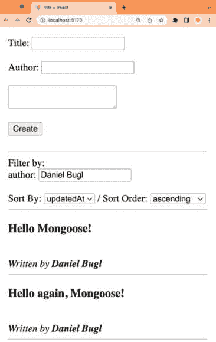

# 4

# 使用 React 和 TanStack Query 集成前端

在设计、实现和测试我们的后端服务之后，现在是时候创建一个前端来与后端接口了。首先，我们将基于 Vite 模板和前几章创建的后端服务设置一个全栈 React 项目。然后，我们将为我们的博客应用程序创建一个基本用户界面。最后，我们将使用 TanStack Query，一个数据获取库来处理后端状态，将后端 API 集成到前端。到本章结束时，我们将成功开发我们的第一个全栈应用程序！

在本章中，我们将涵盖以下主要主题：

+   React 原则

+   设置全栈 React 项目

+   为我们的应用程序创建用户界面

+   使用 TanStack Query 集成后端服务

# 技术要求

在我们开始之前，请安装 *第一章* 中提到的 *全栈开发准备* 和 *第二章* 中提到的 *了解 Node.js* 和 *MongoDB* 的所有要求。

那些章节中列出的版本是本书中使用的版本。虽然安装较新版本不应有问题，但请注意，某些步骤在较新版本上可能有所不同。如果您在这本书提供的代码和步骤中遇到问题，请尝试使用 *第一章* 和 *2* 中提到的版本。

您可以在 GitHub 上找到本章的代码：[`github.com/PacktPublishing/Modern-Full-Stack-React-Projects/tree/main/ch4`](https://github.com/PacktPublishing/Modern-Full-Stack-React-Projects/tree/main/ch4)

如果您克隆了本书的完整仓库，在运行 `npm install` 时，Husky 可能找不到 `.git` 目录。在这种情况下，只需在相应章节文件夹的根目录下运行 `git init`。

本章的 CiA 视频可在：[`youtu.be/WXqJu2Ut7Hs`](https://youtu.be/WXqJu2Ut7Hs) 找到

# React 原则

在我们开始学习如何设置全栈 React 项目之前，让我们回顾 React 的三个基本原则。这些原则使我们能够轻松编写可扩展的 Web 应用程序：

+   **声明式**：不是告诉 React 如何做事，而是告诉它我们想要它做什么。因此，我们可以轻松地设计我们的应用程序，当数据发生变化时，React 将高效地更新和渲染正确的组件。例如，以下代码，它将数组中的字符串重复，是命令式的，与声明式相反：

    ```js
    const input = ['a', 'b', 'c']
    let result = []
    for (let i = 0; i < input.length; i++) {
      result.push(input[i] + input[i])
    }
    console.log(result) // prints: [ 'aa', 'bb', 'cc' ]
    ```

    如我们所见，在命令式代码中，我们需要逐步告诉 JavaScript 应该做什么。然而，在声明式代码中，我们只需简单地告诉计算机我们想要什么，如下所示：

    ```js
    const input = ['a', 'b', 'c']
    const result = input.map(str => str + str)
    console.log(result) // prints: ['aa', 'bb', 'cc']
    ```

    在这个声明式代码中，我们告诉计算机我们想要将 `input` 数组中的每个 `str` 元素映射到 `str + str`。如您所见，声明式代码要简洁得多。

+   **基于组件的**：React 封装了管理自身状态和视图的组件，然后允许我们组合它们以创建复杂用户界面。

+   **一次学习，到处编写**：React 不对你的技术栈做出假设，并试图确保你可以尽可能不重写现有代码来开发应用程序。

React 的三个基本原理使其易于编写代码、封装组件以及在多个平台上共享代码。React 试图尽可能多地利用现有的 JavaScript 特性，而不是重新发明轮子。因此，我们将学习适用于许多更多情况的软件设计模式，而不仅仅是设计用户界面。

现在我们已经学习了 React 的基本原理，让我们开始设置一个全栈 React 项目！

# 设置一个全栈 React 项目

在我们开始开发前端应用程序之前，我们首先需要将基于 Vite 创建的先前创建的前端模板与在*第三章*中创建的后端服务合并，即使用 Express、Mongoose ODM 和 Jest 实现后端。让我们按照以下步骤合并它们：

1.  将**ch1**文件夹复制到新的**ch4**文件夹中，如下所示：

    ```js
    $ cp -R ch1 ch4
    ```

1.  将**ch3**文件夹复制到新的**ch4/backend**文件夹中，如下所示：

    ```js
    $ cp -R ch3 ch4/backend
    ```

1.  *删除* 复制的**ch4/backend**文件夹中的**.git**文件夹，如下所示：

    ```js
    $ rm -rf ch4/backend/.git
    ```

1.  在 VS Code 中打开新的**ch4**文件夹。

1.  *删除* **backend/package.json**文件中的 Husky **prepare**脚本（代码片段中已突出显示），因为我们已经在根目录中设置了 Husky。

    ```js
      "scripts": {
        "dev": "nodemon src/index.js",
        "start": "node src/index.js",
        "test": "NODE_OPTIONS=--experimental-vm-modules jest",
        "lint": "eslint src",
        "prepare": "husky install"
      },
    ```

1.  同时*删除*以下**lint-staged**配置从**backend/package.json**文件中：

    ```js
      "lint-staged": {
        "**/*.{js,jsx}": [
          "npx prettier --write",
          "npx eslint --fix"
        ]
      }
    ```

1.  然后，*删除* **backend/.husky**、**backend/.vscode**和**backend/.git**文件夹。

1.  为了确保所有依赖项都已正确安装，请在**ch4**文件夹的根目录下运行以下命令：

    ```js
    $ npm install
    ```

1.  同时也前往**backend/**目录并在那里安装所有依赖项：

    ```js
    $ cd backend/
    $ npm install
    ```

1.  我们现在也可以从后端项目中删除**husky**、**lint-staged**和**@commitlint**包，因为我们已经在主项目文件夹中设置了。

    ```js
    $ npm uninstall husky lint-staged \
      @commitlint/cli @commitlint/config-conventional
    ```

小贴士

定期检查哪些包你仍然需要，哪些可以丢弃，以保持项目整洁总是一个好主意。在这种情况下，我们从另一个项目中复制了代码，但不需要 Husky / lint-staged / commitlint 设置，因为我们已经在项目的根目录中设置了。

1.  现在回到**ch4**文件夹的根目录，并运行以下命令以启动前端服务器：

    ```js
    $ cd ../
    $ npm run dev
    ```

1.  通过访问 Vite 显示的 URL 在浏览器中打开前端：**http://localhost:5173/**

1.  打开**src/App.jsx**，按照以下方式更改标题，并保存文件：

    ```js
          <h1>Vite + React + Node.js</h1>
    ```

1.  你会看到变化立即在浏览器中反映出来！

通过结合我们之前章节的项目成功设置我们的全栈项目后，现在让我们开始设计和创建博客应用的用户界面。

# 创建我们应用的用户界面

当设计前端的结构时，我们也应该考虑文件夹结构，以便我们的应用在未来可以轻松扩展。类似于我们为后端所做的那样，我们也会把所有源代码放入一个 `src/` 文件夹中。然后我们可以根据不同的功能将文件分组到不同的文件夹中。另一种流行的前端项目结构方式是按路由分组代码。当然，混合它们也是可能的，例如，在 Next.js 项目中，我们可以按功能分组我们的组件，然后为使用组件的路由创建另一个文件夹和文件结构。对于全栈项目，首先通过创建用于 API 集成和 UI 组件的单独文件夹来分离代码也是有意义的。

现在，让我们定义我们项目的文件夹结构：

1.  创建一个新的 **src/api/** 文件夹。

1.  创建一个新的 **src/components/** 文件夹。

小贴士

首先从一个简单的结构开始是个好主意，只有在实际需要时才进行更深的嵌套。在开始一个项目时，不要花太多时间思考文件结构，因为通常你事先不知道文件应该如何分组，而且它可能以后还会改变。

在定义我们项目的高级文件夹结构之后，现在让我们花些时间考虑组件结构。

## 组件结构

根据我们在后端定义的内容，我们的博客应用将具有以下功能：

+   查看单个帖子

+   创建新帖子

+   列出帖子

+   过滤帖子

+   对帖子进行排序

React 中组件的理念是让每个组件处理单个任务或 UI 元素。我们应该尽量使组件尽可能细粒度，以便能够重用代码。如果我们发现自己正在从一个组件复制粘贴代码到另一个组件，那么创建一个新的组件并在多个其他组件中重用它可能是个好主意。

通常，在开发前端时，我们从一个 UI 原型开始。对于我们的博客应用，原型可能看起来如下：


图 4.1 – 我们博客应用的初始原型

注意

在这本书中，我们不会涵盖 UI 或 CSS 框架。因此，组件的设计和开发没有添加样式。相反，本书专注于后端与前端集成的全栈方面。您可以根据自己的需要使用 UI 框架（如 MUI），或 CSS 框架（如 Tailwind）来为博客应用添加样式。

当将 UI 拆分为组件时，我们使用 **单一职责原则**，该原则指出每个模块应该对功能的一个封装部分负责。

在我们的原型中，我们可以围绕每个组件和子组件绘制方框，并给它们命名。请记住，每个组件应该只有一个职责。我们首先从构成应用的基本组件开始：


图 4.2 – 在我们的原型中定义基本组件

我们定义了一个`CreatePost`组件，用于创建新帖子，一个`PostFilter`组件用于过滤帖子列表，一个`PostSorting`组件用于排序帖子，以及一个`Post`组件用于显示单个帖子。

现在我们已经定义了基本组件，我们将查看哪些组件在逻辑上属于一组，从而形成一个组：我们可以在`PostList`中将`Post`组件分组，然后创建一个`App`组件来将所有内容分组并定义应用的结构。

现在我们已经完成了 React 组件的结构化，我们可以继续实现静态 React 组件。

## 实现静态 React 组件

在与后端集成之前，我们将应用的基本功能建模为静态 React 组件。首先处理应用静态视图结构是有意义的，因为我们可以在添加组件集成之前，如果需要的话，可以随意调整应用 UI 的结构，这将使得移动它们变得更加困难和繁琐。首先处理 UI 也更容易，这有助于我们快速开始项目和功能。然后，我们可以继续实现集成和处理状态。

让我们现在开始实现静态组件。

### Post 组件

在创建原型和后端设计时，我们已经考虑了帖子应该包含哪些元素。帖子应该有一个`title`、`contents`和`author`。

让我们现在实现`Post`组件：

1.  首先，创建一个新的**src/components/Post.jsx**文件。

1.  在那个文件中，导入**PropTypes**：

    ```js
    import PropTypes from 'prop-types'
    ```

1.  定义一个函数组件，接受**title**、**contents**和**author**属性：

    ```js
    export function Post({ title, contents, author }) {
    ```

1.  接下来，以类似于原型的方式渲染所有属性：

    ```js
      return (
        <article>
          <h3>{title}</h3>
          <div>{contents}</div>
          {author && (
            <em>
              <br />
              Written by <strong>{author}</strong>
            </em>
          )}
        </article>
      )
    }
    ```

Tip

请注意，你应该始终优先使用 CSS 进行间距设置，而不是使用**<br />**HTML 标签。然而，在这本书中，我们专注于 UI 结构和与后端的集成，所以我们尽可能使用 HTML。

1.  现在，定义**propTypes**，确保只有**title**是必需的：

    ```js
    Post.propTypes = {
      title: PropTypes.string.isRequired,
      contents: PropTypes.string,
      author: PropTypes.string,
    }
    ```

Info

**PropTypes**用于验证传递给 React 组件的属性，并确保我们在使用 JavaScript 时传递了正确的属性。当使用类型安全的语言，如 TypeScript 时，我们可以通过直接为传递给组件的属性类型化来做到这一点。

1.  让我们通过**替换****src/App.jsx**文件的内容来测试我们的组件：

    ```js
    import { Post } from './components/Post.jsx'
    export function App() {
      return (
        <Post
          title='Full-Stack React Projects'
          contents="Let's become full-stack developers!"
          author='Daniel Bugl'
        />
      )
    }
    ```

1.  编辑**src/main.jsx**并更新**App**组件的导入，因为我们现在不再使用**export** **default**：

    ```js
    import { App } from './App.jsx'
    ```

Info

我个人倾向于不使用默认导出，因为它们使得从其他文件重新组合和重新导出组件和函数变得更加困难。此外，它们允许我们更改组件的名称，这可能会造成混淆。例如，如果我们更改组件的名称，导入时的名称不会自动更改。

1.  同时，从 **src/main.jsx** 中*删除*以下行：

    ```js
    import './index.css'
    ```

1.  最后，我们可以*删除* **index.css** 和 **App.css** 文件，因为它们不再需要了。

现在我们已经实现了静态的 `Post` 组件，我们可以继续到 `CreatePost` 组件。

### CreatePost 组件

我们现在将实现一个表单，允许创建新的帖子。在这里，我们提供了 `author` 和 `title` 字段，以及一个 `<textarea>` 元素用于输入博客帖子的内容。

现在让我们实现 `CreatePost` 组件：

1.  创建一个新的 **src/components/CreatePost.jsx** 文件。

1.  定义以下组件，它包含一个表单，用于输入博客帖子的标题、作者和内容：

    ```js
    export function CreatePost() {
      return (
        <form onSubmit={(e) => e.preventDefault()}>
          <div>
            <label htmlFor='create-title'>Title: </label>
            <input type='text' name='create-title' id='create-title' />
          </div>
          <br />
          <div>
            <label htmlFor='create-author'>Author: </label>
            <input type='text' name='create-author' id='create-author' />
          </div>
          <br />
          <textarea />
          <br />
          <br />
          <input type='submit' value='Create' />
        </form>
      )
    }
    ```

    在前面的代码块中，我们定义了一个 `onSubmit` 处理程序，并在事件对象上调用 `e.preventDefault()` 以避免在表单提交时刷新页面。

1.  让我们通过*替换* **src/App.jsx** 文件的内容来测试这个组件：

    ```js
    import { CreatePost } from './components/CreatePost.jsx'
    export function App() {
      return <CreatePost />
    }
    ```

如你所见，`CreatePost` 组件渲染良好。我们现在可以继续到 `PostFilter` 和 `PostSorting` 组件。

小贴士

如果你想要一次性测试多个组件并保留测试结果以供以后使用，或者为你的组件库创建一个样式指南，你应该了解一下 Storybook ([`storybook.js.org`](https://storybook.js.org))，这是一个用于独立构建、测试和记录 UI 组件的有用工具。

### PostFilter 和 PostSorting 组件

与 `CreatePost` 组件类似，我们将创建两个组件，它们提供输入字段以过滤和排序帖子。让我们从 `PostFilter` 开始：

1.  创建一个新的 **src/components/PostFilter.jsx** 文件。

1.  在这个文件中，我们导入 **PropTypes**：

    ```js
    import PropTypes from 'prop-types'
    ```

1.  现在，我们定义 **PostFilter** 组件并使用 **field** 属性：

    ```js
    export function PostFilter({ field }) {
      return (
        <div>
          <label htmlFor={`filter-${field}`}>{field}: </label>
          <input
            type='text'
            name={`filter-${field}`}
            id={`filter-${field}`}
          />
        </div>
      )
    }
    PostFilter.propTypes = {
      field: PropTypes.string.isRequired,
    }
    ```

    接下来，我们将定义 `PostSorting` 组件。

1.  创建一个新的 **src/components/PostSorting.jsx** 文件。

1.  在这个文件中，我们创建了一个 **select** 输入以选择要排序的字段。我们还创建了一个另一个 **select** 输入以选择排序顺序：

    ```js
    import PropTypes from 'prop-types'
    export function PostSorting({ fields = [] }) {
      return (
        <div>
          <label htmlFor='sortBy'>Sort By: </label>
          <select name='sortBy' id='sortBy'>
            {fields.map((field) => (
              <option key={field} value={field}>
                {field}
              </option>
            ))}
          </select>
          {' / '}
          <label htmlFor='sortOrder'>Sort Order: </label>
          <select name='sortOrder' id='sortOrder'>
            <option value={'ascending'}>ascending</option>
            <option value={'descending'}>descending</option>
          </select>
        </div>
      )
    }
    PostSorting.propTypes = {
      fields: PropTypes.arrayOf(PropTypes.string).isRequired,
    }
    ```

现在我们已经成功定义了用于过滤和排序帖子的 UI 组件。在下一步中，我们将创建一个 `PostList` 组件，将过滤和排序与帖子列表结合起来。

### PostList 组件

在实现了其他与帖子相关的组件之后，我们现在可以开始实现我们博客应用最重要的部分，即博客帖子的源。目前，源将简单地显示一个博客帖子列表。

让我们现在开始实现 `PostList` 组件：

1.  创建一个新的 **src/components/PostList.jsx** 文件。

1.  首先，我们导入 **Fragment**、**PropTypes** 和 **Post** 组件：

    ```js
    import { Fragment } from 'react'
    import PropTypes from 'prop-types'
    import { Post } from './Post.jsx'
    ```

1.  然后，我们定义了**PostList**函数组件，它接受一个作为属性的**posts**数组。如果**posts**未定义，我们默认将其设置为空数组：

    ```js
    export function PostList({ posts = [] }) {
    ```

1.  接下来，我们使用**.map**函数和扩展语法来渲染所有帖子：

    ```js
      return (
        <div>
          {posts.map((post) => (
            <Post {...post} key={post._id} />
          ))}
        </div>
      )
    }
    ```

    我们为每个帖子返回`<Post>`组件，并将`post`对象中的所有键作为属性传递给组件。我们通过使用扩展语法来完成此操作，这具有与手动将对象的所有键作为属性列出相同的效果，如下所示：

    ```js
    <Post
      title={post.title}
      author={post.author}
      contents={post.contents}
    />
    ```

注意

如果我们在渲染元素列表，我们必须给每个元素一个唯一的**key**属性。React 使用这个**key**属性在数据发生变化时高效地计算两个列表之间的差异。

我们使用了`map`函数，它将一个函数应用于数组的所有元素。这与使用`for`循环并存储所有结果类似，但更简洁、声明性更强、更容易阅读！作为使用`map`函数的替代方案，我们可以这样做：

```js
let renderedPosts = []
let index = 0
for (let post of posts) {
  renderedPosts.push(<Post {...post} key={post._id} />)
  index++
}
return (
  <div>
    {renderedPosts}
  </div>
)
```

然而，使用这种风格在 React 中**不**被推荐。

1.  我们还需要定义属性类型。在这里，我们可以利用**Post**组件的属性类型，通过将其包裹在**PropTypes.shape()**函数中来使用，该函数定义了一个对象属性类型：

    ```js
    PostList.propTypes = {
      posts: PropTypes.arrayOf(PropTypes.shape(Post.propTypes)).isRequired,
    }
    ```

1.  在原型中，我们每篇博客文章后面都有一个水平线。我们可以通过使用**Fragment**来实现这一点，而不需要额外的**<div>**容器元素，如下所示：

    ```js
          {posts.map((post) => (
            <Fragment key={post._id}>
              <Post {...post} />
              <hr />
            </Fragment>
          ))}
    ```

注意

**key**属性始终必须添加到在**map**函数中渲染的最高父元素。在这种情况下，我们必须将**key**属性从**Post**组件移动到**Fragment**。

1.  再次，我们通过编辑**src/App.jsx**文件来测试我们的组件：

    ```js
    import { PostList } from './components/PostList.jsx'
    const posts = [
      {
        title: 'Full-Stack React Projects',
        contents: "Let's become full-stack developers!",
        author: 'Daniel Bugl',
      },
      { title: 'Hello React!' },
    ]
    export function App() {
      return <PostList posts={posts} />
    }
    ```

    现在，我们可以看到我们的应用列出了我们在`posts`数组中定义的所有帖子。

如您所见，通过`PostList`组件列出多个帖子工作得很好。现在我们可以继续组装应用。

### 组装应用

实现所有组件后，我们现在必须在`App`组件中将所有内容组合在一起。然后，我们将成功复制原型！

让我们开始修改`App`组件并将我们的博客应用组装起来：

1.  打开**src/App.jsx**并为**CreatePost**、**PostFilter**和**PostSorting**组件添加导入：

    ```js
    import { PostList } from './components/PostList.jsx'
    import { CreatePost } from './components/CreatePost.jsx'
    import { PostFilter } from './components/PostFilter.jsx'
    import { PostSorting } from './components/PostSorting.jsx'
    ```

1.  调整**App**组件以包含所有组件：

    ```js
    export function App() {
      return (
        <div style={{ padding: 8 }}>
          <CreatePost />
          <br />
          <hr />
          Filter by:
          <PostFilter field='author' />
          <br />
          <PostSorting fields={['createdAt', 'updatedAt']} />
          <hr />
          <PostList posts={posts} />
        </div>
      )
    }
    ```

1.  保存文件后，浏览器应自动刷新，现在我们可以看到完整的 UI：


图 4.3 – 根据原型实现的我们的静态博客应用完整实现

如我们所见，我们之前定义的所有静态组件都在一个`App`组件中一起渲染。现在，我们的应用看起来就像原型一样。接下来，我们可以继续将我们的组件与后端服务集成。

# 使用 TanStack Query 集成后端服务

在完成所有 UI 组件的创建后，我们现在可以继续将它们与上一章中创建的后端集成。对于集成，我们将使用 TanStack Query（之前称为 React Query），这是一个数据获取库，它还可以帮助我们进行缓存、同步和从后端更新数据。

TanStack Query 专注于管理获取的数据的状态（服务器状态）。虽然其他状态管理库也可以处理服务器状态，但它们专注于管理客户端状态。服务器状态与客户端状态有一些明显的区别，例如以下内容：

+   在客户端无法直接控制的位置远程持久化

+   需要异步 API 来获取和更新状态

+   必须处理共享所有权，这意味着其他人可以在你不知情的情况下更改状态

+   当服务器或其他人在某个时候更改状态时，状态变得过时（“过时”）

这些与服务器状态相关的挑战导致了一系列问题，例如必须缓存、去重多个请求、在后台更新“过时”状态等。

TanStack Query 提供了现成的解决方案来解决这些问题，因此处理服务器状态变得简单。你总是可以将其与其他关注客户端状态的州管理库结合使用。对于客户端状态本质上只是反映服务器状态的使用案例，TanStack Query 本身就足以作为一个状态管理解决方案！

注意

React Query 被重命名为 TanStack Query 的原因是这个库现在也支持其他框架，例如 Solid、Vue 和 Svelte！

现在你已经知道了为什么以及如何使用 TanStack Query 来帮助我们集成前端和后端，让我们开始使用它吧！

## 为 React 设置 TanStack Query

要设置 TanStack Query，我们首先必须安装依赖项并设置一个查询客户端。查询客户端通过上下文提供给 React，并将存储有关活动请求、缓存结果、何时定期重新获取数据以及 TanStack Query 运作所需的一切信息。

让我们现在开始设置它：

1.  打开一个新的终端（不要退出 Vite！）并在我们项目的根目录下运行以下命令来安装 **@tanstack/react-query** 依赖项：

    ```js
    App component to a new Blog component, as we are going to use the App component for setting up libraries and contexts instead.
    ```

1.  将 **src/App.jsx** 文件重命名为 **src/Blog.jsx**。

    不要更新导入。如果 VS Code 要求你更新导入，请点击 **No**。

1.  现在，在 **src/Blog.jsx** 中，将函数名从 **App** 改为 **Blog**：

    ```js
    export function Blog() {
    ```

1.  创建一个新的 **src/App.jsx** 文件。在这个文件中，从 TanStack React Query 导入 **QueryClient** 和 **QueryClientProvider**：

    ```js
    import { QueryClient, QueryClientProvider } from '@tanstack/react-query'
    ```

1.  还要导入 **Blog** 组件：

    ```js
    import { Blog } from './Blog.jsx'
    ```

1.  现在，创建一个新的查询客户端：

    ```js
    const queryClient = new QueryClient()
    ```

1.  定义 **App** 组件并渲染包裹在 **QueryClientProvider** 中的 **Blog** 组件：

    ```js
    export function App() {
      return (
        <QueryClientProvider client={queryClient}>
          <Blog />
        </QueryClientProvider>
      )
    }
    ```

那就是设置 TanStack Query 所需要做的全部！现在我们可以在我们的 `Blog` 组件（及其子组件）中使用它了。

## 获取博客文章

我们首先应该做的是从我们的后端获取博客文章列表。现在让我们来实现它：

1.  首先，在打开的第二个终端窗口中（不是 Vite 运行的地方），运行后端服务器（不要退出 Vite！），如下所示：

    ```js
    $ cd backend/
    $ npm start
    ```

    如果出现错误，请确保 Docker 和 MongoDB 正在正常运行！

小贴士

如果你想同时开发后端和前端，你可以使用**npm run dev**启动后端，以确保在更改代码时它能够热重载。

1.  在项目的根目录中创建一个**.env**文件，并将以下内容输入到其中：

    ```js
    VITE_BACKEND_URL="http://localhost:3001/api/v1"
    ```

    Vite 默认支持`dotenv`。所有应该在前端中可访问的环境变量都需要以`VITE_`为前缀。在这里，我们设置一个环境变量以指向我们的后端服务器。

1.  创建一个新的**src/api/posts.js**文件。在这个文件中，我们将定义一个函数来获取文章，该函数接受作为参数的**/posts**端点的查询参数。这些查询参数用于按作者和标签筛选，并使用**sortBy**和**sortOrder**定义排序：

    ```js
    export const getPosts = async (queryParams) => {
    ```

1.  记住，我们可以使用**fetch**函数向服务器发送请求。我们需要将环境变量传递给它，并添加**/posts**端点。在路径之后，我们添加查询参数，这些参数以**?**符号为前缀：

    ```js
      const res = await fetch(
        `${import.meta.env.VITE_BACKEND_URL}/posts?` +
    ```

1.  现在我们需要使用**URLSearchParams**类将一个对象转换为查询参数。这个类会自动为我们转义输入并将其转换为有效的查询参数：

    ```js
          new URLSearchParams(queryParams),
    ```

1.  就像我们在浏览器中之前做的那样，我们需要将响应解析为 JSON：

    ```js
      )
      return await res.json()
    }
    ```

1.  编辑**src/Blog.jsx**并*删除*示例**posts**数组：

    ```js
    const posts = [
      {
        title: 'Full-Stack React Projects',
        contents: "Let's become full-stack developers!",
        author: 'Daniel Bugl',
      },
      { title: 'Hello React!' },
    ]
    ```

1.  此外，从**@tanstack/react-query**导入**useQuery**函数，并从**src/Blog.jsx**文件中的**api**文件夹导入**getPosts**函数：

    ```js
    import { useQuery } from '@tanstack/react-query'
    import { PostList } from './components/PostList.jsx'
    import { CreatePost } from './components/CreatePost.jsx'
    import { PostFilter } from './components/PostFilter.jsx'
    import { PostSorting } from './components/PostSorting.jsx'
    import { getPosts } from './api/posts.js'
    ```

1.  在**Blog**组件内部，定义一个**useQuery**钩子：

    ```js
    export function Blog() {
      const postsQuery = useQuery({
        queryKey: ['posts'],
        queryFn: () => getPosts(),
    queryKey is very important in TanStack Query, as it is used to uniquely identify a request, among other things, for caching purposes. Always make sure to use unique query keys. Otherwise, you might see requests not triggering properly.For the `queryFn` option, we just call the `getPosts` function, without query params for now.
    ```

1.  在**useQuery**钩子之后，我们从查询中获取文章，如果文章尚未加载，则回退到空数组：

    ```js
    const posts = postsQuery.data ?? []
    ```

1.  检查你的浏览器，你会看到文章现在是从我们的后端加载的！

现在我们已经成功获取了博客文章，让我们让筛选和排序工作起来！

## 实现筛选和排序

要实现筛选和排序，我们需要处理一些本地状态，并将其作为查询参数传递给`postsQuery`。现在让我们来做这件事：

1.  我们首先编辑**src/Blog.jsx**文件并从 React 导入**useState**钩子：

    ```js
    import { useState } from 'react'
    ```

1.  在**Blog**组件中，在**useQuery**钩子之前添加**author**筛选器和排序选项的状态钩子：

    ```js
      const [author, setAuthor] = useState('')
      const [sortBy, setSortBy] = useState('createdAt')
      const [sortOrder, setSortOrder] = useState('descending')
    ```

1.  然后，我们将**queryKey**调整为包含查询参数（这样每当查询参数发生变化时，TanStack Query 都会重新获取，除非请求已经被缓存）。我们还将**queryFn**调整为调用带有相关查询参数的**getPosts**：

    ```js
      const postsQuery = useQuery({
        queryKey: ['posts', { author, sortBy, sortOrder }],
        queryFn: () => getPosts({ author, sortBy, sortOrder }),
      })
    ```

1.  现在将值和相关的**onChange**处理程序传递给筛选和排序组件：

    ```js
          <PostFilter
            field='author'
            value={author}
            onChange={(value) => setAuthor(value)}
          />
          <br />
          <PostSorting
            fields={['createdAt', 'updatedAt']}
            value={sortBy}
            onChange={(value) => setSortBy(value)}
            orderValue={sortOrder}
            onOrderChange={(orderValue) => setSortOrder(orderValue)}
          />
    ```

注意

为了简单起见，我们现在只使用状态钩子。状态管理解决方案或上下文可以使处理过滤和排序变得容易得多，尤其是在大型应用程序中。对于我们的小型博客应用程序，使用状态钩子是可以的，因为我们主要关注后端和前端之间的集成。

1.  现在，编辑**src/components/PostFilter.jsx**并添加**value**和**onChange**属性：

    ```js
    export function PostFilter({ field, value, onChange }) {
      return (
        <div>
          <label htmlFor={`filter-${field}`}>{field}: </label>
          <input
            type='text'
            name={`filter-${field}`}
            id={`filter-${field}`}
            value={value}
            onChange={(e) => onChange(e.target.value)}
          />
        </div>
      )
    }
    PostFilter.propTypes = {
      field: PropTypes.string.isRequired,
      value: PropTypes.string.isRequired,
      onChange: PropTypes.func.isRequired,
    }
    ```

1.  我们也为**src/components/PostSorting.jsx**做同样的处理：

    ```js
    export function PostSorting({
      fields = [],
      value,
      onChange,
      orderValue,
      onOrderChange,
    }) {
      return (
        <div>
          <label htmlFor='sortBy'>Sort By: </label>
          <select
            name='sortBy'
            id='sortBy'
            value={value}
            onChange={(e) => onChange(e.target.value)}
          >
            {fields.map((field) => (
              <option key={field} value={field}>
                {field}
              </option>
            ))}
          </select>
          {' / '}
          <label htmlFor='sortOrder'>Sort Order: </label>
          <select
            name='sortOrder'
            id='sortOrder'
            value={orderValue}
            onChange={(e) => onOrderChange(e.target.value)}
          >
            <option value={'ascending'}>ascending</option>
            <option value={'descending'}>descending</option>
          </select>
        </div>
      )
    }
    PostSorting.propTypes = {
      fields: PropTypes.arrayOf(PropTypes.string).isRequired,
      value: PropTypes.string.isRequired,
      onChange: PropTypes.func.isRequired,
      orderValue: PropTypes.string.isRequired,
      onOrderChange: PropTypes.func.isRequired,
    }
    ```

1.  在您的浏览器中，输入**Daniel Bugl**作为作者。您应该看到 TanStack Query 在您输入时从后端重新获取帖子，一旦找到匹配项，后端将返回该作者的所有帖子！

1.  在测试完毕后，请确保再次清除过滤器，这样后来创建的帖子就不会再根据作者进行过滤。

小贴士

如果您不想向后端发送那么多请求，请确保使用防抖状态钩子，如**useDebounce**，然后将仅防抖的值传递给查询参数。如果您对了解**useDebounce**钩子和其他有用的钩子感兴趣，我建议您查看我写的名为*Learn React Hooks*的书籍。

应用程序现在应该如下所示，帖子根据在字段中输入的作者进行过滤，并按所选字段排序，按所选顺序排序：



图 4.4 – 我们的第一个全栈应用程序 – 前端从后端获取帖子！

现在排序和过滤都正常工作后，让我们了解突变，它允许我们向服务器发送更改后端状态（例如，在数据库中插入或更新条目）的请求。

## 创建新帖子

我们现在将实现创建帖子的功能。为此，我们需要使用 TanStack Query 的`useMutation`钩子。虽然查询意味着是幂等的（这意味着多次调用它们不应影响结果），但突变用于创建/更新/删除数据或在服务器上执行操作。现在让我们开始使用突变来创建新的帖子：

1.  编辑**src/api/posts.js**并定义一个新的**createPost**函数，该函数接受一个**post**对象作为参数：

    ```js
    export const createPost = async (post) => {
    ```

1.  我们还像对**getPosts**一样向**/posts**端点发送请求：

    ```js
      const res = await fetch(`${import.meta.env.VITE_BACKEND_URL}/posts`, {
    ```

1.  然而，现在我们也将**method**设置为**POST**请求，传递一个头部信息告诉后端我们将发送一个 JSON 体，然后将我们的**post**对象作为 JSON 字符串发送：

    ```js
        method: 'POST',
        headers: { 'Content-Type': 'application/json' },
        body: JSON.stringify(post),
    ```

1.  就像**getPosts**一样，我们还需要将响应解析为 JSON：

    ```js
      })
      return await res.json()
    }
    ```

    在定义了`createPost` API 函数之后，让我们在`CreatePost`组件中使用它，通过在那里创建一个新的突变钩子：

1.  编辑**src/components/CreatePost.jsx**并从**@tanstack/react-query**导入**useMutation**钩子，从 React 导入**useState**钩子以及我们的**createPost** API 函数：

    ```js
    import { useMutation } from '@tanstack/react-query'
    import { useState } from 'react'
    import { createPost } from '../api/posts.js'
    ```

1.  在**CreatePost**组件内部，为**title**、**author**和**contents**定义状态钩子：

    ```js
      const [title, setTitle] = useState('')
      const [author, setAuthor] = useState('')
      const [contents, setContents] = useState('')
    ```

1.  现在，定义一个突变钩子。在这里，我们将调用我们的**createPost**函数：

    ```js
      const createPostMutation = useMutation({
        mutationFn: () => createPost({ title, author, contents }),
      })
    ```

1.  接下来，我们将定义一个**handleSubmit**函数，该函数将阻止默认的提交操作（这将刷新页面），而是调用**.mutate()**来执行突变：

    ```js
      const handleSubmit = (e) => {
        e.preventDefault()
        createPostMutation.mutate()
      }
    ```

1.  我们将**onSubmit**处理程序添加到我们的表单中：

    ```js
        <form onSubmit={handleSubmit}>
    ```

1.  我们还像之前为排序和过滤器所做的那样，为我们的字段添加了**value**和**onChange**属性：

    ```js
          <div>
            <label htmlFor='create-title'>Title: </label>
            <input
              type='text'
              name='create-title'
              id='create-title'
              value={title}
              onChange={(e) => setTitle(e.target.value)}
            />
          </div>
          <br />
          <div>
            <label htmlFor='create-author'>Author: </label>
            <input
              type='text'
              name='create-author'
              id='create-author'
              value={author}
              onChange={(e) => setAuthor(e.target.value)}
            />
          </div>
          <br />
          <textarea
            value={contents}
            onChange={(e) => setContents(e.target.value)}
          />
    ```

1.  对于提交按钮，我们确保在等待突变完成时显示**Creating…**而不是**Create**，并且如果没有设置标题（这是必需的），或者突变当前正在挂起时，我们也会禁用按钮：

    ```js
          <br />
          <br />
          <input
            type='submit'
            value={createPostMutation.isPending ? 'Creating...' : 'Create'}
            disabled={!title || createPostMutation.isPending}
          />
    ```

1.  最后，我们在提交按钮下方添加了一条消息，如果突变成功，将会显示：

    ```js
          {createPostMutation.isSuccess ? (
            <>
              <br />
              Post created successfully!
            </>
          ) : null}
        </form>
    ```

注意

除了**isPending**和**isSuccess**，突变还会返回**isIdle**（当突变处于空闲或新鲜/重置状态时）和**isError**状态。相同的也可以从查询中访问，例如，在帖子正在获取时显示加载动画。

1.  现在，我们可以尝试添加一个新的帖子，看起来工作得很好，但是帖子列表并没有自动更新，只有刷新后才会更新！

问题在于查询键没有改变，所以 TanStack Query 没有刷新帖子列表。然而，我们还想在创建新帖子时刷新列表。现在让我们修复这个问题。

### 无效化查询

为了确保创建新帖子后帖子列表被刷新，我们需要无效化查询。我们可以利用查询客户端来完成这个操作。现在让我们来做这件事：

1.  编辑**src/components/CreatePost.jsx**并导入**useQueryClient**钩子：

    ```js
    import { useMutation, useQueryClient } from '@tanstack/react-query'
    ```

1.  使用查询客户端无效化以**'posts'**查询键开头的所有查询。这将与**getPosts**请求的任何查询参数一起工作，因为它匹配数组中所有以**'posts'**开头的查询：

    ```js
      const queryClient = useQueryClient()
      const createPostMutation = useMutation({
        mutationFn: () => createPost({ title, author, contents }),
        onSuccess: () => queryClient.invalidateQueries(['posts']),
      })
    ```

尝试创建一个新的帖子，你会看到现在它确实可以工作，即使有活跃的过滤器和排序！正如我们所看到的，TanStack Query 在轻松处理服务器状态方面非常出色。

# 摘要

在本章中，我们学习了如何创建一个 React 前端，并使用 TanStack Query 将其与我们的后端集成。我们已经涵盖了后端的主要功能：按排序列出帖子、创建帖子以及按作者过滤。处理标签以及删除和编辑帖子与已解释的功能类似，留作你的练习。

在下一章，*第五章*，*使用 Docker 和 CI/CD 部署应用程序*，我们将使用 Docker 部署我们的应用程序，并设置 CI/CD 管道来自动化应用程序的部署。
