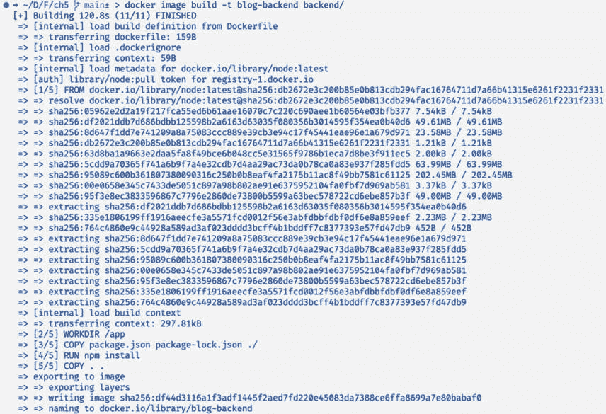
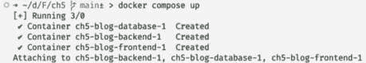
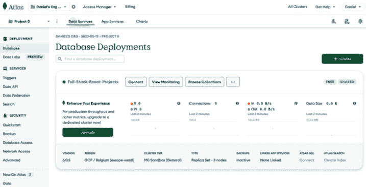
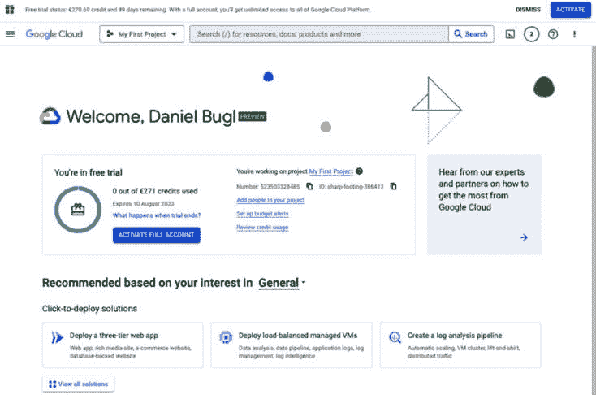
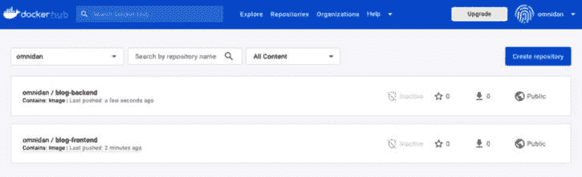
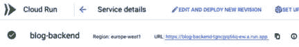
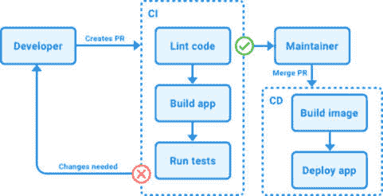
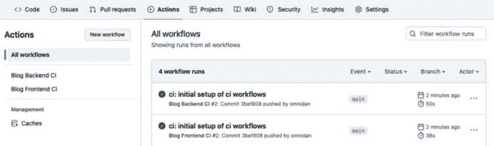
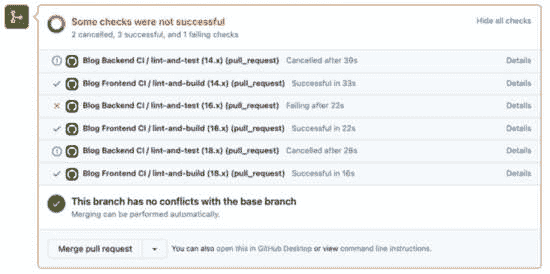
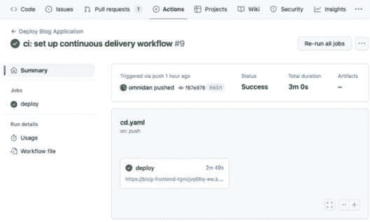

# 第五章：使用 Docker 和 CI/CD 部署应用程序

现在我们已经成功开发了一个包含后端服务和前端的全栈应用程序，我们将把我们的应用程序打包成 Docker 镜像，并学习如何使用**持续集成**（**CI**）和**持续交付**（**CD**）原则来部署它们。我们已经学习了如何在*第二章*“了解 Node.js 和 MongoDB”中启动 Docker 容器。在本章中，我们将学习如何创建自己的 Docker 镜像以实例化容器。然后，我们将手动将我们的应用程序部署到云服务提供商。最后，我们将配置 CI/CD 以自动化应用程序的部署。在本章结束时，我们将成功部署我们的第一个全栈**MongoDB Express React Node.js**（**MERN**）应用程序，并为其设置未来的自动化部署！

在本章中，我们将涵盖以下主要主题：

+   创建 Docker 镜像

+   将我们的全栈应用程序部署到云端

+   配置 CI 以自动化测试

+   配置 CD 以自动化部署

# 技术要求

在我们开始之前，请从*第一章*“为全栈开发做准备”和*第二章*“了解 Node.js 和 MongoDB”中安装所有要求。

那些章节中列出的版本是书中使用的版本。虽然安装较新版本不应有问题，但请注意，某些步骤在较新版本上可能工作方式不同。如果您在使用本书中提供的代码和步骤时遇到问题，请尝试使用*第一章*和*第二章*中提到的版本。

您可以在 GitHub 上找到本章节的代码：[`github.com/PacktPublishing/Modern-Full-Stack-React-Projects/tree/main/ch5`](https://github.com/PacktPublishing/Modern-Full-Stack-React-Projects/tree/main/ch5)。

本章节的 CiA 视频可以在以下网址找到：[`youtu.be/aQplfCQGWew`](https://youtu.be/aQplfCQGWew)

# 创建 Docker 镜像

在*第二章*“了解 Node.js 和 MongoDB”中，我们了解到在 Docker 平台上，我们使用 Docker 镜像来创建容器，然后可以运行服务。我们已经学习了如何使用现有的 `mongo` 镜像来创建数据库服务的容器。在本节中，我们将学习如何创建自己的镜像以实例化容器。为此，我们首先需要创建一个**Dockerfile**，它包含构建 Docker 镜像所需的所有指令。首先，我们将为我们的后端服务创建一个 Docker 镜像并从中运行一个容器。然后，我们将对前端执行相同的操作。最后，我们将创建一个**Docker Compose 文件**，以启动我们的数据库和后端服务以及前端服务。

## 创建后端 Dockerfile

Dockerfile 告诉 Docker 如何逐步构建镜像。文件中的每一行都是一个指令，告诉 Docker 要做什么。Dockerfile 的格式如下：

```js
# comment
INSTRUCTION arguments
```

每个 Dockerfile 都必须以一个`FROM`指令开始，该指令指定了新创建的镜像应该基于哪个镜像。你可以从现有的镜像扩展你的镜像，例如`ubuntu`或`node`。

让我们开始创建我们后端服务的 Dockerfile：

1.  将**ch4**文件夹复制到一个新的**ch5**文件夹，如下所示：

    ```js
    $ cp -R ch4 ch5
    ```

1.  在**ch5**文件夹内创建一个新的**backend/Dockerfile**文件。

1.  在这个文件中，我们首先定义了我们镜像的基础镜像，它将是**node**镜像的版本 20：

    ```js
    FROM node:20
    ```

    该镜像由 Docker Hub 提供，类似于我们之前创建容器时使用的`ubuntu`和`mongo`镜像。

备注

请注意，只使用官方镜像和由可信作者创建的镜像。例如，**node**镜像由 Node.js 团队官方维护。

1.  然后，我们设置工作目录，这是我们服务中所有文件在镜像内部放置的位置：

    ```js
    WORKDIR /app
    ```

    `WORKDIR`指令类似于在终端中使用`cd`。它更改工作目录，这样我们就不需要将所有后续命令的前缀设置为完整路径。如果文件夹不存在，Docker 会为我们创建它。

1.  接下来，我们将**package.json**和**package-lock.json**文件从我们的项目复制到工作目录：

    ```js
    COPY package.json package-lock.json ./
    ```

    `COPY`指令将文件从你的本地文件系统复制到 Docker 镜像中（相对于本地工作目录）。可以指定多个文件，指令的最后一个参数是目标位置（在这种情况下，是镜像的当前工作目录）。

    `package-lock.json`文件是必需的，以确保 Docker 镜像包含与我们的本地构建相同的`npm`包版本。

1.  现在，我们运行**npm install**来在镜像中安装所有依赖项：

    ```js
    RUN npm install
    ```

    `RUN`指令在镜像的工作目录中执行一个命令。

1.  然后，我们将应用程序的其余部分从本地文件系统复制到 Docker 镜像中：

    ```js
    COPY . .
    ```

备注

你想知道为什么我们最初只复制了**package.json**和**package-lock.json**吗？Docker 镜像是一层层构建的。每个指令形成一个镜像层。如果有什么变化，只有变化之后的层需要重新构建。所以，在我们的例子中，如果代码有任何变化，只有这个最后的**COPY**指令在重新构建 Docker 镜像时会被重新执行。只有当依赖项发生变化时，其他的**COPY**指令和**npm install**才会被重新执行。使用这种指令顺序可以极大地减少重新构建镜像所需的时间。

1.  最后，我们运行我们的应用程序：

    ```js
    CMD ["npm", "start"]
    ```

    `CMD`指令在构建镜像时不会执行。相反，它将信息存储在镜像的元数据中，告诉 Docker 当从镜像实例化容器时要运行哪个命令。在我们的例子中，当使用我们的镜像时，容器将运行`npm start`。

备注

你可能已经注意到，我们向 **CMD** 指令传递了一个 JSON 数组，而不是简单地写入 **CMD npm start**。这种包含 JSON 数组的版本被称为 **exec 形式**，如果第一个参数是一个可执行文件，它将直接运行命令而不调用 shell。没有 JSON 数组的版本被称为 **shell 形式**，它将使用 shell 执行命令，并在前面加上 **/bin/sh -c**。在没有 shell 的情况下运行命令的优点是允许应用程序正确接收信号，例如当应用程序被终止时发出的 **SIGTERM** 或 **SIGKILL** 信号。或者，可以使用 **ENTRYPOINT** 指令来指定运行特定命令时应使用的可执行文件（默认为 **/bin/sh -c**）。在某些情况下，你可能甚至想直接使用 **CMD ["node", "src/index.js"]** 来运行脚本，这样脚本就可以正确接收 *所有* 信号。然而，这需要我们在后端服务器中实现 **SIGINT** 信号，以便通过 *Ctrl* + *C* 来关闭容器，因此为了保持简单，我们只是使用 **npm start**。

在创建我们的 Dockerfile 之后，我们还应该创建一个 `.dockerignore` 文件，以确保不必要的文件不会被复制到我们的镜像中。

## 创建 .dockerignore 文件

`COPY` 命令，其中我们复制所有文件，也会复制 `node_modules` 文件夹和其他文件，例如我们不希望进入镜像的 `.env` 文件。为了防止某些文件被复制到我们的 Docker 镜像中，我们需要创建一个 `.dockerignore` 文件。现在让我们来做这件事：

1.  创建一个新的 **backend/.dockerignore** 文件。

1.  打开它并输入以下内容以忽略 **node_modules** 文件夹和所有 **.****env** 文件：

    ```js
    node_modules
    .env*
    ```

现在我们已经定义了 `.dockerignore` 文件，`COPY` 指令将忽略这些文件夹和文件。现在让我们构建 Docker 镜像。

## 构建 Docker 镜像

在成功创建后端 Dockerfile 和一个 `.dockerignore` 文件以防止某些文件和文件夹被添加到我们的 Docker 镜像之后，我们现在可以开始构建我们的 Docker 镜像：

1.  打开一个终端。

1.  运行以下命令来构建 Docker 镜像：

    ```js
    blog-backend as the name of our image and backend/ as the working directory.
    ```

运行命令后，Docker 将首先读取 Dockerfile 和 `.dockerignore` 文件。然后，它将下载 `node` 镜像并逐条执行我们的指令。最后，它将所有层和元数据导出到我们的 Docker 镜像中。

以下截图显示了创建 Docker 镜像的输出：



图 5.1 – 创建 Docker 镜像时的输出

现在我们已经成功创建了我们的镜像，接下来让我们基于它创建并运行一个容器！

## 从我们的镜像创建和运行容器

我们已经在*第二章*，“了解 Node.js 和 MongoDB”中创建了基于`ubuntu`和`mongo`镜像的 Docker 容器。现在，我们将从我们自己的镜像创建并运行一个容器。让我们现在开始做这件事：

1.  运行以下命令来列出所有可用的镜像：

    ```js
    blog-backend image that we just created, and the mongo and ubuntu images that we previously used.
    ```

1.  确保我们的数据库的**dbserver**容器已经运行。

1.  然后，按照以下步骤启动一个新的容器：

    ```js
    docker run command:*   **-it** runs the container in interactive mode (**-t** to allocate a pseudo Terminal and **-i** to keep the input stream open).*   **-e PORT=3001** sets the **PORT** environment variable inside the container to **3001**.*   **-e DATABASE_URL=mongodb://host.docker.internal:27017/blog** sets the **DATABASE_URL** environment variable. Here, we replaced **localhost** with **host.docker.internal**, as the MongoDB service runs in a different container on the Docker host (our machine).*   **-p 3001:3001** forwards port **3001** from inside the container to port **3001** on the host (our machine).*   **blog-backend** is the name of our image.
    ```

1.  **blog-backend**容器现在正在运行，这看起来与在终端上直接运行后端非常相似。转到**http://localhost:3001/api/v1/posts**以验证它是否像以前一样正常运行并返回所有帖子。

1.  目前请保持容器运行。

我们已经成功地将后端打包为 Docker 镜像，并从中启动了一个容器！现在，让我们为前端做同样的事情。

## 创建前端 Dockerfile

在为后端服务创建 Docker 镜像后，我们现在将重复相同的步骤来创建前端镜像。我们将首先创建 Dockerfile，然后创建`.dockerignore`文件，构建镜像，然后运行容器。现在，我们将从创建前端 Dockerfile 开始。

在我们前端的 Dockerfile 中，我们将使用两个镜像：

+   一个用于使用**Vite**（构建完成后将被丢弃，只保留构建输出）的**构建**镜像

+   一个**最终**的镜像，该镜像将用于我们的静态网站，通过 nginx 服务

让我们现在创建 Dockerfile：

1.  在我们项目的根目录下创建一个新的 Dockerfile。

1.  在这个新创建的文件中，首先，再次使用**node**镜像，但这次我们将其标记为**AS build**。这样做使得 Docker 中的多阶段构建成为可能，这意味着我们可以稍后使用另一个基础镜像来创建我们的**最终**镜像：

    ```js
    FROM node:20 AS build
    ```

1.  在构建时，我们还设置了**VITE_BACKEND_URL**环境变量。在 Docker 中，我们可以使用**ARG**指令来定义仅在构建镜像时相关的环境变量：

    ```js
    ARG VITE_BACKEND_URL=http://localhost:3001/api/v1
    ```

注意

虽然**ARG**指令定义了一个可以在构建时通过**--build-arg**标志更改的环境变量，但**ENV**指令将环境变量设置为固定值，当从生成的镜像运行容器时，该值将保持不变。因此，如果我们想在构建时自定义环境变量，我们应该使用**ARG**指令。然而，如果我们想在运行时自定义环境变量，**ENV**则更为合适。

1.  我们将工作目录设置为**/build**，然后重复为后端定义的相同指令来安装所有必要的依赖项并复制必要的文件：

    ```js
    WORKDIR /build
    COPY package.json .
    COPY package-lock.json .
    RUN npm install
    COPY . .
    ```

1.  此外，我们执行**npm run build**来创建我们的 Vite 应用的静态构建：

    ```js
    RUN npm run build
    ```

1.  现在，我们的**构建**阶段已完成。我们再次使用**FROM**指令来创建**最终**阶段。这次，我们基于**nginx**镜像，该镜像运行 nginx 网络服务器：

    ```js
    FROM nginx AS final
    ```

1.  我们将此阶段的当前工作目录设置为 **/var/www/html**，这是 nginx 从中提供静态文件的文件夹：

    ```js
    WORKDIR /usr/share/nginx/html
    ```

1.  最后，我们将从 **/build/dist** 文件夹（这是 Vite 放置构建的静态文件的地方）从 **build** 阶段复制所有内容到 **final** 阶段：

    ```js
    COPY --from=build /build/dist .
    ```

    在这种情况下不需要 `CMD` 指令，因为 `nginx` 镜像已经包含了一个用于正确运行 web 服务器的指令。

我们成功地为前端创建了一个多阶段 Dockerfile！现在，让我们继续创建 `.dockerignore` 文件。

## 为前端创建 .dockerignore 文件

我们还需要为前端创建一个 `.dockerignore` 文件。在这里，除了排除 `node_modules/` 文件夹和 `.env` 文件外，我们还要排除包含我们的后端服务的 `backend/` 文件夹以及 `.vscode`、`.git` 和 `.husky` 文件夹。现在让我们创建 `.dockerignore` 文件：

1.  在我们项目的根目录下创建一个新的 **.dockerignore** 文件。

1.  在这个新创建的文件中，输入以下内容：

    ```js
    node_modules
    .env*
    backend
    .vscode
    .git
    .husky
    .commitlintrc.json
    ```

现在我们已经忽略了构建 Docker 镜像不需要的文件，让我们构建它！

## 构建 Docker 前端镜像

就像之前一样，我们执行 `docker build` 命令来构建镜像，给它命名为 `blog-frontend`，并指定根目录作为路径：

```js
node image to build our frontend in the build stage. Then, it will switch to the final stage, use the nginx image, and copy over the built static files from the build stage.
Now, let’s create and run the frontend container.
Creating and running the frontend container
Similarly to what we did for the backend container, we can also create and run a container from the `blog-frontend` image by executing the following command:

```

nginx 镜像在端口 80 上运行 web 服务器，因此，如果我们想在主机上使用端口 3000，我们需要通过传递 -p 3000:80 将端口 80 转发到 3000。

运行此命令并在浏览器中导航到 `http://localhost:3000` 后，你应该能看到前端被正确提供并显示来自后端的博客文章。

现在我们已经创建了后端和前端的镜像和容器，我们将学习一种更轻松地管理多个镜像的方法。

使用 Docker Compose 管理多个镜像

Docker Compose 是一个工具，允许我们使用 Docker 定义和运行多容器应用程序。我们不需要手动构建和运行后端、前端和数据库容器，我们可以使用 Compose 一起构建和运行它们。要开始使用 Compose，我们需要在我们的项目根目录中创建一个 `compose.yaml` 文件，如下所示：

1.  在我们项目的根目录下创建一个新的 **compose.yaml** 文件。

1.  打开新创建的文件，首先定义 Docker Compose 文件规范的版本：

    ```js
    version: '3.9'
    ```

    3.  现在，定义一个 **services** 对象，我们将在这里定义我们想要使用的所有服务：

    ```js
    services:
    ```

    4.  首先，我们有 **blog-database**，它使用 **mongo** 镜像并转发端口 **27017**：

    ```js
      blog-database:
        image: mongo
        ports:
          - '27017:27017'
    ```

注意

在 YAML 文件中，行的缩进非常重要，用于区分属性嵌套的位置，因此请务必在每行之前正确放置空格。

1.  接下来，我们有 **blog-backend**，它使用 **backend/** 文件夹中定义的 Dockerfile，定义了 **PORT** 和 **DATABASE_URL** 环境变量，转发端口到主机，并依赖于 **blog-database**：

    ```js
      blog-backend:
        build: backend/
        environment:
          - PORT=3001
          - DATABASE_URL=mongodb://host.docker.internal:27017/blog
        ports:
          - '3001:3001'
        depends_on:
          - blog-database
    ```

    2.  最后，我们有 **blog-frontend**，它使用根目录中定义的 Dockerfile，定义了 **VITE_BACKEND_URL** 构建参数，将端口转发到主机，并依赖于 **blog-backend**：

    ```js
      blog-frontend:
        build:
          context: .
          args:
            VITE_BACKEND_URL: http://localhost:3001/api/v1
        ports:
          - '3000:80'
        depends_on:
          - blog-backend
    ```

    3.  在定义服务后，保存文件。

1.  然后，通过在终端中使用 *Ctrl* + *C* 键组合来停止运行的后端和前端容器。

1.  还要停止已经运行的 **dbserver** 容器，如下所示：

    ```js
    $ docker stop dbserver
    ```

    6.  最后，在终端中运行以下命令以使用 Docker Compose 启动所有服务：

    ```js
    $ docker compose up
    ```

Docker Compose 将现在为数据库、后端和前端创建容器，并启动所有容器。您将开始看到来自不同服务的日志输出。如果您访问 `http://localhost:3000`，您可以看到前端正在运行。创建一个新的帖子来验证后端和数据库的连接是否正常工作。

下面的截图显示了 `docker compose up` 命令创建和启动所有容器的输出：



图 5.2 – 使用 Docker Compose 创建和运行多个容器

截图输出之后，是来自各种服务的日志消息，包括 MongoDB 数据库服务和我们的后端和前端服务。

就像往常一样，您可以按 *Ctrl* + *C* 来停止所有 Docker Compose 容器。

现在我们已经设置了 Docker Compose，一次性启动所有服务并统一管理它们变得非常容易。如果您查看您的 Docker 容器，您可能会注意到还有很多过时的容器仍然留在之前构建 `blog-backend` 和 `blog-frontend` 容器时。现在让我们学习如何清理这些容器。

清理未使用的容器

在使用 Docker 进行了一段时间的实验后，将会有很多不再使用的镜像和容器。Docker 通常不会删除对象，除非您明确要求它这样做，这会导致它占用大量磁盘空间。如果您想删除对象，您可以选择逐个删除，或者使用 Docker 提供的 `prune` 命令之一：

+   **docker container prune**：这将删除所有已停止的容器

+   **docker image prune**：这将删除所有悬空镜像（未标记且未被任何容器引用的镜像）

+   **docker image prune -a**：这将删除所有未被任何容器使用的镜像

+   **docker volume prune**：这将删除所有未被任何容器使用的卷

+   **docker network prune**：这将清理所有未被任何容器使用的网络

+   **docker system prune**：这将删除除卷之外的所有内容

+   **docker system prune --volumes**：这将删除所有内容

因此，如果您想删除所有未使用的容器，您应该首先确保所有您还想使用的容器都在运行。然后，在终端中执行 `docker container prune`。

现在我们已经学会了如何在本地使用 Docker 将我们的服务打包成镜像并在容器中运行，接下来让我们继续将我们的全栈应用程序部署到云端。

将我们的全栈应用程序部署到云端

在本地创建 Docker 镜像和容器之后，现在是时候学习如何将它们部署到云端，以便每个人都能访问我们的服务。在这本书中，我们将以 **Google Cloud** 为例，但一般的流程也适用于其他提供商，例如 **Amazon Web Services** （**AWS**）和 **Microsoft Azure**。对于 MongoDB 数据库，我们将使用 **MongoDB Atlas**，但请随意使用任何可以为您托管 MongoDB 数据库的提供商。

创建 MongoDB Atlas 数据库

为了托管我们的数据库，我们将使用 MongoDB 团队提供的官方云解决方案，名为 MongoDB Atlas。现在让我们开始注册和设置数据库：

1.  前往 [`www.mongodb.com/atlas`](https://www.mongodb.com/atlas) 并按 **免费试用** 创建新账户，或使用现有账户登录。

注意

以下说明可能因 MongoDB Atlas UI 的更新而略有不同。如果选项与列表中列出的不完全一致，请尝试按照网站上的说明进行操作，以创建数据库和用户来访问它。这适用于我们将在本章中设置的所有云服务。

1.  从侧边栏选择 **数据库**，然后按 **创建** 以创建一个新的数据库部署。如果您创建了新账户，您应该会自动被要求创建新的数据库部署。

1.  在 Google Cloud 上选择 **共享 / M0 沙盒**（免费实例）和您首选的区域。

1.  给您的集群起一个您喜欢的名字。

1.  按 **创建** 以创建您的 M0 沙盒集群。数据库变得可访问需要一些时间（通常大约一分钟）。然而，您可以在等待集群设置的同时继续设置用户。

1.  在侧边栏的 **数据库** 部分点击你新创建的集群旁边的 **连接** 按钮。

1.  在弹出的窗口中，选择 **允许从任何地方访问**，然后按 **添加** **IP 地址**。

1.  为您的数据库用户设置用户名和密码，然后按 **创建** **数据库用户**。

1.  按 **选择连接方法** 并选择 **驱动程序**。

1.  将显示一个连接字符串；将其复制并保存以备后用，用您之前设置的密码替换 **<password>** 字符串。连接字符串应具有以下格式：

    ```js
    mongodb+srv://<username>:<password>@<cluster-name>.<cluster-id>.mongodb.net/?retryWrites=true&w=majority
    ```

    10. 通过在终端中打开并使用 **mongo** 壳连接到它来验证连接字符串是否有效：

    ```js
    $ mongosh "<connection-string>"
    ```

以下截图显示了 MongoDB Atlas 中的 **数据库部署** 选项卡的外观：



图 5.3 – 在 MongoDB Atlas 上部署的新 M0 沙盒数据库集群

现在我们已经在云中成功创建了我们的 MongoDB 数据库，我们可以继续设置 Google Cloud 以部署我们的后端和前端。

在 Google Cloud 上创建一个账户

让我们从现在开始创建 Google Cloud 账户。在创建账户时，你需要输入账单信息，但你将获得 300 美元的免费信用额度，可以免费试用 Google Cloud：

1.  在你的浏览器中访问[`cloud.google.com`](https://cloud.google.com)。

1.  如果你还没有账户，请点击**免费开始**，如果你已经有了账户，请点击**登录**。

1.  使用你的 Google 账户登录并按照指示操作，直到你能够访问 Google Cloud 控制台。

你现在应该会看到一个类似于以下图所示的屏幕：



图 5.4 – 注册后的 Google Cloud 控制台

现在你已经设置好账户并准备就绪，让我们开始部署我们的服务。

将我们的 Docker 镜像部署到 Docker 仓库

在我们可以在云服务提供商上部署服务之前，我们首先需要将我们的 Docker 镜像部署到一个**Docker 仓库**，以便云服务提供商可以从那里访问它并从中创建一个容器。按照以下步骤将我们的 Docker 镜像部署到 Docker Hub，官方 Docker 仓库：

1.  访问[`hub.docker.com`](https://hub.docker.com)并登录或注册账户。

1.  点击**创建仓库**按钮以创建一个新的仓库。该仓库将包含我们的镜像。

1.  将仓库名称输入为**blog-frontend**，留空描述，并将可见性设置为**公开**。然后点击**创建**按钮。

1.  重复*步骤 2*和*步骤 3*，但这次，将**blog-backend**作为仓库名称输入。

1.  打开一个新的终端并输入以下命令以登录到你的 Docker Hub 账户：

    ```js
    $ docker login
    ```

    输入你的 Docker Hub 用户名和密码，然后按*Return*键或*Enter*键。

    6.  重新构建你的 Linux 镜像（以便稍后能够部署到 Google Cloud），使用你的仓库名称标记你的镜像（将**[USERNAME]**替换为你的 Docker Hub 用户名），并将其推送到仓库：

    ```js
    $ docker build --platform linux/amd64 -t blog-frontend .
    $ docker tag blog-frontend [USERNAME]/blog-frontend
    $ docker push [USERNAME]/blog-frontend
    ```

    7.  在终端中导航到**backend/**，并为**blog-backend**镜像重复*步骤 6*：

    ```js
    $ cd backend/
    $ docker build --platform linux/amd64 -t blog-backend .
    $ docker tag blog-backend [USERNAME]/blog-backend
    $ docker push [USERNAME]/blog-backend
    ```

现在两个仓库都已设置好，镜像也已推送到它们，它们应该会在 Docker Hub 上显示以下信息：**包含：镜像 | 最后推送：几秒钟前**：



图 5.5 – Docker Hub 展示我们的仓库概览

现在我们已经将 Docker 镜像发布到公共 Docker 仓库（Docker Hub），我们可以继续设置 Google Cloud 以部署我们的服务。

注意

本书在 Docker Hub 上创建的仓库是**公开的**。您也可以选择在 Docker Hub 上免费创建最多一个私有仓库。否则，您可能需要拥有 Docker Hub 订阅，使用不同的注册表，或者托管自己的注册表。例如，可以使用**Google Artifact Registry**在**Cloud Run**上部署私有 Docker 镜像。

将后端 Docker 镜像部署到 Cloud Run

在 Docker Hub 注册表成功发布我们的 Docker 镜像后，是时候使用 Google Cloud Run 来部署它们了。Cloud Run 是一个托管计算平台。它允许我们在 Google Cloud 基础设施上直接运行容器，使应用程序部署变得简单快捷。Cloud Run 的替代方案将是基于 Kubernetes 的基础设施，例如 AWS ECS Fargate 或 DigitalOcean。

按照以下步骤将后端部署到 Google Cloud Run：

1.  前往[`console.cloud.google.com/`](https://console.cloud.google.com/)。

1.  在顶部搜索栏中输入**Cloud Run**，并选择**Cloud Run – 适用于容器化****应用程序**产品。

1.  点击**创建服务**按钮以创建新服务。

注意

在您能够创建服务之前，您可能需要首先创建一个项目。在这种情况下，只需按照网站上的说明创建一个您选择的名称的新项目。之后，点击**创建服务**按钮以创建新服务。

1.  在**容器镜像**URL 框中输入**[USERNAME]****/blog-backend**。

1.  在**服务名称**框中输入**blog-backend**，选择您选择的区域，保留**CPU 仅在请求处理期间分配**选中，并选择**所有 – 允许从互联网直接访问您的服务**和**身份验证 – 允许****未经验证的调用**。

1.  展开**容器、网络、安全**部分，滚动到**环境变量**，然后点击**添加变量**。

1.  将新环境变量命名为**DATABASE_URL**，作为值，输入您之前保存的 MongoDB Atlas 的连接字符串。

注意

为了简单起见，我们在这里使用常规环境变量。为了使包含凭证的变量更安全，应将其作为秘密添加，这需要启用**Secrets API**，将秘密添加到秘密管理器中，然后引用秘密并将其选择为要公开的环境变量。

1.  将其余选项保留为默认选项，然后点击**创建**。

1.  您将被重定向到新创建的服务，其中容器正在部署。等待部署完成，这可能需要几分钟。

1.  当服务完成部署后，您应该看到一个勾选标记和一个 URL。点击 URL 以打开后端，您将看到我们的**Hello World from Express!**消息，这意味着我们的后端已成功在云端部署！

在 Google Cloud Run 中部署的服务如下所示：



图 5.6 – 在 Google Cloud Run 上成功部署的服务

将前端 Docker 镜像部署到 Cloud Run

对于前端，我们首先需要重新构建容器以更改 `VITE_BACKEND_URL` 环境变量，该变量被静态构建到我们的项目中。让我们先做这个：

1.  打开终端并运行以下命令以使用环境变量重新构建前端：

    ```js
    [URL] with the URL to the backend service deployed on Google Cloud Run.
    ```

    2.  使用您的 Docker Hub 用户名标记它，并将新版本的镜像部署到 Docker Hub：

    ```js
    $ docker tag blog-frontend [USERNAME]/blog-frontend
    $ docker push [USERNAME]/blog-frontend
    ```

现在，我们可以重复我们用于部署后端的类似步骤来部署我们的前端：

1.  创建一个新的 Cloud Run 服务，在 **容器镜像 URL** 框中输入 **[USERNAME]****/blog-frontend**，在 **服务名称** 框中输入 **blog-frontend**。

1.  选择您喜欢的区域并启用 **允许** **未认证调用**。

1.  展开 **容器、网络、安全** 并将容器端口从 **8080** 更改为 **80**。

1.  点击 **创建** 以创建服务，并等待其部署。

1.  在您的浏览器中打开此 URL，您应该能看到已部署的前端。通过向部署的后端发送请求，现在也可以添加和列出博客文章，然后这些文章会存储在我们的 MongoDB Atlas 集群中。

我们已成功手动部署了我们的第一个全栈 React 和 Node.js 应用程序，其中包含云中的 MongoDB 数据库！在下一节中，我们将专注于使用 CI/CD 自动化测试和部署。

配置 CI 以自动化测试

**持续集成** (**CI**) 涵盖了将代码更改自动集成以更快地发现错误并保持代码库易于维护的过程。通常，这是通过在代码合并到主分支之前，当开发者提交拉取/合并请求时自动运行脚本来实现的。这种做法使我们能够在代码合并之前通过例如运行代码检查器和测试来早期发现代码中的问题。因此，CI 使我们对代码更有信心，并允许我们更快、更频繁地做出和部署更改。

下图展示了可能的 CI/CD 管道的简单概述：



图 5.7 – CI/CD 管道简单概述

注意

在这本书中，我们将使用 **GitHub Actions** 进行 CI/CD。虽然语法和配置文件可能在其他系统上看起来和工作方式不同，例如 GitLab CI/CD 或 CircleCI，但基本原理是相似的。

在 GitHub Actions 中，**workflows**可以在仓库中发生**事件**时触发，例如向分支推送、打开新的拉取请求或创建新的问题。工作流程可以包含一个或多个**jobs**，这些作业可以并行或顺序执行。每个作业在其自己的**runner**内运行，该 runner 从 CI 定义中获取指令并在指定的容器内执行它们。在作业内，可以执行**actions**，这些 actions 可以是 GitHub 上提供的现有 actions，或者我们可以编写自己的 actions。

为前端添加持续集成

让我们开始创建一个工作流程，当创建拉取请求或向`main`分支推送时，它将构建前端：

1.  在我们项目的根目录下创建一个新的**.github/**文件夹。在其内部，创建一个**workflows/**文件夹。

1.  在**.github/workflows/**文件夹内，创建一个名为**frontend-ci.yaml**的新文件。

1.  打开**.github/workflows/frontend-ci.yaml**文件，并首先给工作流程起一个名字：

    ```js
    name: Blog Frontend CI
    ```

    4.  然后，使用**on**关键字监听事件。我们将在新拉取请求或向**main**分支推送时执行作业：

    ```js
    on:
      push:
        branches:
          - main
      pull_request:
        branches:
          - main
    ```

    5.  现在，我们定义一个将运行代码检查器和构建前端的作业：

    ```js
    jobs:
      lint-and-build:
    ```

    6.  我们在**ubuntu-latest**容器上运行作业：

    ```js
        runs-on: ubuntu-latest
    ```

    7.  我们可以使用矩阵策略来使用不同的变量多次运行我们的测试。在我们的情况下，我们希望在多个 Node.js 版本上运行它：

    ```js
        strategy:
          matrix:
            node-version: [16.x, 18.x, 20.x]
    ```

    8.  现在，我们在作业内定义步骤。确保**steps**与**strategy**处于相同的缩进级别：

    ```js
        steps:
    ```

    9.  首先，我们使用**actions/checkout**操作，它将检出我们的仓库：

    ```js
          - uses: actions/checkout@v3
    ```

    10.  然后，我们使用**actions/setup-node**操作，它在我们的容器内设置 Node.js。在这里，我们使用之前定义的**node-version**变量：

    ```js
          - name: Use Node.js ${{ matrix.node-version }}
            uses: actions/setup-node@v3
            with:
              node-version: ${{ matrix.node-version }}
              cache: 'npm'
    ```

    `cache`选项指定用于缓存依赖项的包管理器。

    11.  最后，我们安装依赖项，运行代码检查器并构建我们的前端：

    ```js
          - name: Install dependencies
            run: npm install
          - name: Run linter on frontend
            run: npm run lint
          - name: Build frontend
            run: npm run build
    ```

为后端添加持续集成

现在我们已经为前端添加了持续集成，让我们也通过在创建拉取请求或向`main`分支推送时构建和测试后端来添加后端持续集成：

1.  在**.github/workflows/**文件夹内，创建一个名为**backend-ci.yaml**的新文件。

1.  打开**.github/workflows/backend-ci.yaml**文件，首先给它起一个名字，并监听与前端 CI 相同的事件：

    ```js
    name: Blog Backend CI
    on:
      push:
        branches:
          - main
      pull_request:
        branches:
          - main
    ```

    3.  现在，我们定义一个将构建和测试后端的作业。我们将默认工作目录设置为**backend/**文件夹，以便在该文件夹内运行所有操作：

    ```js
    jobs:
      lint-and-test:
        runs-on: ubuntu-latest
        strategy:
          matrix:
            node-version: [16.x, 18.x, 20.x]
        defaults:
          run:
            working-directory: ./backend
    ```

    4.  然后，我们使用与前端相同的操作来检出仓库并设置 Node.js：

    ```js
        steps:
          - uses: actions/checkout@v3
          - name: Use Node.js ${{ matrix.node-version }}
            uses: actions/setup-node@v3
            with:
              node-version: ${{ matrix.node-version }}
              cache: 'npm'
          - name: Install dependencies
            run: npm install
    ```

    5.  最后，我们在后端运行代码检查器并运行测试：

    ```js
          - name: Run linter on backend
            run: npm run lint
          - name: Run backend tests
            run: npm test
    ```

    6.  保存工作流程文件，并通过在 GitHub 上创建一个新的仓库并将现有仓库推送到 GitHub 来提交和推送它们。

1.  前往 GitHub 上的仓库并选择 **操作** 选项卡。您应该在这里看到您的工作流程正在运行。

以下截图显示了我们的 CI 工作流程在 GitHub 上成功运行：



图 5.8 – 后端和前端 CI 工作流程在 GitHub Actions 中成功运行

如果我们对 `main` 分支创建一个新的拉取请求，我们还可以看到我们的 CI 工作流程在新代码上运行正常。例如，如果我们为前端添加了标记帖子的方式，并且不小心在后台要求标记（而没有考虑我们之前只要求标题的规则），我们将看到相应的测试失败：



图 5.9 – 后端 CI 工作流程在拉取请求中失败

我们还可以看到 GitHub Actions 在其中一个版本失败后自动取消其他 Node.js 版本运行的作业，以避免浪费时间。

现在我们已经成功设置了 CI 工作流程，让我们继续设置 CD 以自动化我们的全栈应用程序的部署。

配置 CD 以自动化部署

在拉取/合并请求合并后，**持续交付**（**CD**）开始发挥作用。CD 通过自动部署服务和应用程序为我们自动化发布过程。通常，这涉及一个多阶段过程，其中代码首先自动部署到预发布环境，然后可以手动部署到其他环境，直到生产环境。如果生产环境的部署也是一个自动化过程，则称为 **持续部署** 而不是持续交付。

首先，我们需要获取凭据以验证 Docker Hub 和 Google Cloud。然后，我们可以设置部署我们博客的工作流程。

获取 Docker Hub 凭据

让我们从获取访问 Docker Hub 的凭据开始：

1.  前往 [`hub.docker.com/`](https://hub.docker.com/)。

1.  点击您的个人资料并转到您的账户设置。

1.  点击 **安全** 选项卡并按下 **新建访问** **令牌** 按钮。

1.  在描述中写 **GitHub Actions** 并按下 **生成** 按钮。给予 **读取、写入、删除** 权限。

1.  复制访问令牌并将其存储在安全的地方。

1.  前往您的 GitHub 仓库，然后转到 **设置** | **密钥和变量** | **操作**。

1.  按下 **新建仓库密钥** 按钮以添加新的密钥。作为名称，写 **DOCKERHUB_USERNAME**，并将 Docker Hub 上的用户名用作密钥值。

1.  添加另一个名为 **DOCKERHUB_TOKEN** 的密钥，并将之前创建的访问令牌粘贴为密钥值。

获取 Google Cloud 凭据

现在，我们将创建一个服务账户以访问 Google Cloud Run：

1.  前往 [`console.cloud.google.com/`](https://console.cloud.google.com/)。

1.  在顶部的搜索框中输入**服务帐户**，然后转到**IAM 和 admin – 服务** **帐户**页面。

1.  点击**创建服务帐户**按钮。

1.  在**服务帐户名称**框中输入**GitHub Actions**。ID 应该自动生成为**github-actions**。点击**创建** **并继续**。

1.  授予服务对**Cloud Run 管理员**角色的访问权限并点击**继续**。

1.  点击**完成**以完成创建服务帐户。

1.  在概览列表中，复制你新创建的服务帐户的电子邮件并保存以备后用。

1.  点击默认计算服务帐户的电子邮件地址。转到**权限**选项卡并点击**授予访问权限**。

1.  将你新创建的服务帐户的电子邮件粘贴到**新主体**字段中，并分配**Cloud Run 服务代理**角色。点击**保存**以确认。

1.  在概览列表中，点击三个点图标以打开你的**github-actions**服务帐户上的操作，并选择**管理密钥**。

1.  在新页面上，点击**添加密钥** | **创建新密钥**，然后在弹出窗口中点击**创建**。应该会下载一个 JSON 文件。

1.  前往你的 GitHub 仓库，然后转到**设置** | **秘密和变量** | **操作**。点击**新建仓库秘密**按钮以添加新的秘密。

1.  在你的 GitHub 仓库中添加一个新的秘密，命名为**GOOGLECLOUD_SERVICE_ACCOUNT**，并将之前复制的你新创建的服务帐户的电子邮件作为秘密值粘贴。

1.  在你的 GitHub 仓库中添加一个新的秘密，命名为**GOOGLECLOUD_CREDENTIALS**，并将下载的 JSON 文件内容粘贴为秘密。

1.  在你的 GitHub 仓库中添加一个新的秘密，命名为**GOOGLECLOUD_REGION**，并将秘密值设置为创建 Cloud Run 服务时选择的区域。

注意

为了更好的安全性，Google 建议使用**工作负载身份联合**而不是导出服务帐户密钥 JSON 凭据。然而，设置工作负载身份联合要复杂一些。有关如何设置的更多信息，请参阅此处：[`github.com/google-github-actions/auth#setup`](https://github.com/google-github-actions/auth#setup)。

定义部署工作流程

现在凭据作为秘密值可用，我们可以开始定义部署工作流程：

1.  在**.github/workflows/**文件夹内，创建一个名为**cd.yaml**的新文件。

1.  打开**.github/workflows/cd.yaml**文件，首先给它起一个名字：

    ```js
    name: Deploy Blog Application
    ```

    3. 对于 CD，我们只在推送**main**分支时执行工作流程：

    ```js
    on:
      push:
        branches:
          - main
    ```

    4. 我们开始定义一个**部署**作业，其中我们将**环境**设置为**生产**，并将 URL 指向已部署的前端 URL：

    ```js
    jobs:
      deploy:
        runs-on: ubuntu-latest
        environment:
          name: production
          url: ${{ steps.deploy-frontend.outputs.url }}
    ```

    我们将在稍后定义一个具有`deploy-frontend` ID 的步骤，该步骤在`steps.deploy-frontend.outputs.url`中存储一个变量。

    5. 对于步骤，就像我们之前做的那样，我们首先需要检出我们的仓库：

    ```js
        steps:
          - uses: actions/checkout@v3
    ```

    6. 然后，我们使用之前在 secrets 中设置的凭据登录 Docker Hub：

    ```js
          - name: Login to Docker Hub
            uses: docker/login-action@v2
            with:
              username: ${{ secrets.DOCKERHUB_USERNAME }}
              password: ${{ secrets.DOCKERHUB_TOKEN }}
    ```

    7. 接下来，我们使用之前设置的凭据登录到 Google Cloud：

    ```js
          - uses: google-github-actions/auth@v1
            with:
              service_account: ${{ secrets.GOOGLECLOUD_SERVICE_ACCOUNT }}
              credentials_json: ${{ secrets.GOOGLECLOUD_CREDENTIALS }}
    ```

    8. 现在，我们使用**docker/build-push-action**构建并推送后端 Docker 镜像到 Docker 仓库：

    ```js
          - name: Build and push backend image
            uses: docker/build-push-action@v4
            with:
              context: ./backend
              file: ./backend/Dockerfile
              push: true
              tags: ${{ secrets.DOCKERHUB_USERNAME }}/blog-backend:latest
    ```

    9. 在推送后端 Docker 镜像之后，我们现在可以使用**google-github-actions/deploy-cloudrun**操作在 Cloud Run 上部署它：

    ```js
          - id: deploy-backend
            name: Deploy backend
            uses: google-github-actions/deploy-cloudrun@v1
            with:
              service: blog-backend
              image: ${{ secrets.DOCKERHUB_USERNAME }}/blog-backend:latest
              region: ${{ secrets.GOOGLECLOUD_REGION }}
    ```

    我们给这个步骤分配了`deploy-backend` ID，因为我们需要使用它来引用后端 URL，以便在下一步构建前端镜像。

    10. 在构建和部署后端之后，我们以类似的方式构建前端，确保将**VITE_BACKEND_URL**作为**build-args**传递：

    ```js
          - name: Build and push frontend image
            uses: docker/build-push-action@v4
            with:
              context: .
              file: ./Dockerfile
              push: true
              tags: ${{ secrets.DOCKERHUB_USERNAME }}/blog-frontend:latest
              build-args: VITE_BACKEND_URL=${{ steps.deploy-backend.outputs.url }}/api/v1
    ```

    11. 最后，我们可以部署前端，给这个步骤分配**deploy-frontend** ID，以便正确设置我们的环境 URL：

    ```js
          - id: deploy-frontend
            name: Deploy frontend
            uses: google-github-actions/deploy-cloudrun@v1
            with:
              service: blog-frontend
              image: ${{ secrets.DOCKERHUB_USERNAME }}/blog-frontend:latest
              region: ${{ secrets.GOOGLECLOUD_REGION }}
    ```

    12. 保存文件并提交您的更改到**main**分支。您将在 GitHub Actions 上看到**部署博客应用程序**被触发。

以下截图显示了我们的博客应用程序通过 GitHub Actions 成功部署的结果：



图 5.10 – 使用 GitHub Actions 成功部署我们的全栈应用程序

您可以点击 URL 打开已部署的前端，您会看到它以与手动部署版本相同的方式工作。

恭喜！您已成功自动化了您的第一个全栈应用程序的集成和部署！

注意

在这本书中，我们只创建了一个阶段的部署，自动直接部署到生产环境。在实际应用中，您可能希望定义多个阶段。例如，CD 可以自动部署到测试环境。然后，将生产部署配置为需要手动确认。

摘要

在本章中，我们首先学习了如何创建 Docker 镜像以及如何从它们实例化本地容器。然后，我们通过使用 Docker Compose 自动化了这个过程。接下来，我们在 Docker Hub 注册表中发布了我们的镜像，以便能够在 Google Cloud Run 上部署它们。然后，我们手动在 Cloud Run 上部署了我们的全栈应用程序。最后，我们学习了如何使用 GitHub Actions 设置 CI/CD 工作流程来自动运行 lint、测试和部署博客应用程序。

到目前为止，我们应用程序中的所有内容都是公开可访问的。由于没有用户管理，任何人都可以像任何作者一样创建帖子。在下一章，*第六章*，*使用 JWT 添加身份验证*中，我们将学习如何在我们的全栈博客应用程序中实现用户账户和身份验证。我们将学习**JSON Web Tokens**（**JWTs**）是什么，并实现多个登录和注册的路由。

```js

```
