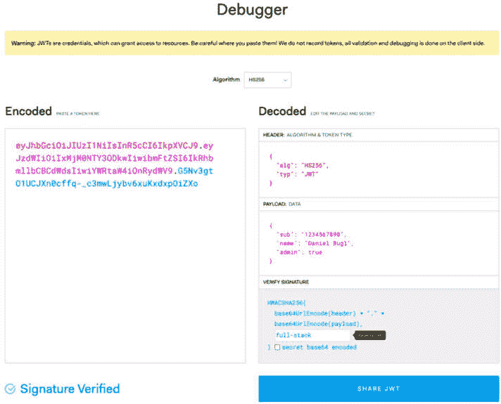
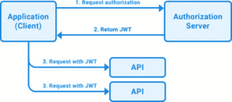
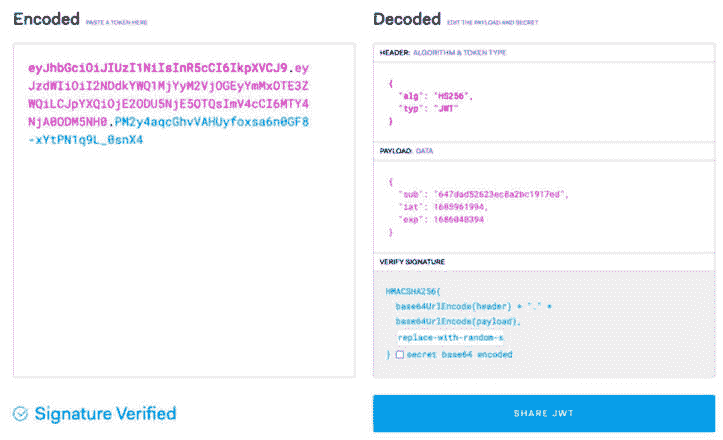
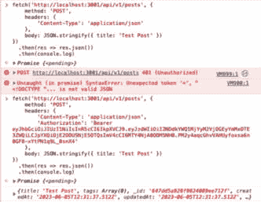
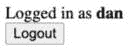

# 6

# 使用 JWT 添加认证

在开发和部署我们的第一个全栈应用程序后，我们现在有一种方式让任何人都可以在我们的博客上创建帖子。然而，由于作者是一个输入字段，任何人都可以输入任何作者，冒充他人！这不好。在本章中，我们将添加使用**JSON Web Token**（JWT）的认证以及通过添加额外的路由使用 React Router 来注册和登录我们的应用程序的功能。

在本章中，我们将涵盖以下主要主题：

+   JWT 是什么？

+   在后端使用 JWT 实现登录、注册和认证路由

+   使用 React Router 和 JWT 在前端集成登录和注册

+   高级令牌处理

# 技术要求

在我们开始之前，请安装*第一章*“为全栈开发做准备”和*第二章*“了解 Node.js 和 MongoDB”中提到的所有要求。

那些章节中列出的版本是本书中使用的版本。虽然安装较新版本不应有问题，但请注意，某些步骤可能会有所不同。如果您在这本书提供的代码和步骤中遇到问题，请尝试使用*第一章*和*第二章*中提到的版本。

您可以在 GitHub 上找到本章的代码：[`github.com/PacktPublishing/Modern-Full-Stack-React-Projects/tree/main/ch6`](https://github.com/PacktPublishing/Modern-Full-Stack-React-Projects/tree/main/ch6)。

本章的 CiA 视频可以在[`youtu.be/LloHmkgRLWk`](https://youtu.be/LloHmkgRLWk)找到。

# JWT 是什么？

JWT，发音为“jot”，是一个开放行业标准（RFC 7519），用于在多个当事人之间安全地传递声明。声明可以是关于某个当事人或对象的信息，例如用户的电子邮件地址、用户 ID 和角色。在我们的案例中，我们将在后端和前端之间传递 JWT。

JWT 被许多产品和服务使用，并得到第三方认证提供商的支持，如 Auth0、Okta 和 Firebase Auth。解析 JWT 很容易，我们只需要对它们进行 base64 解码并解析 JSON 字符串。在验证签名后，我们可以确信 JWT 是真实的，并信任其中的声明。

JWT 由以下组件组成：

+   **头部**：包含算法和令牌类型

+   **有效载荷**：包含令牌的数据/声明

+   **签名**：用于验证令牌是否由合法来源创建

这三个组件通过点（`.`）连接成一个字符串，形成一个 JWT，如下所示：

```js
header.payload.signature
```

让我们分别查看每个组件。

## JWT 头

JWT 头部通常由一个令牌类型（在我们的情况下，JWT），由`typ`属性指定，以及用于创建签名的算法（在我们的情况下，我们将使用基于 SHA256 哈希的消息认证码 HMAC SHA256），由`alg`属性指定。头部被定义为 JSON 对象，如下所示：

```js
{
  "alg": "HS256",
  "typ": "JWT"
}
```

此 JSON 对象随后被 base64 编码，形成 JWT 的第一部分。

## JWT 有效载荷

JWT 的主要部分是有效载荷，它包含所有声明。声明是关于实体的信息（例如用户）和附加数据。JWT 标准区分三种类型的声明：

+   **已注册声明**：这些是预定义的声明，建议设置它们。它们包括以下信息：

    +   发行者（**iss**），即创建令牌的实体。

    +   过期时间（**exp**），它告诉我们令牌何时过期。

    +   主题（**sub**），它告诉我们由令牌标识的实体信息（例如，在登录过程中生成令牌的用户）。

    +   受众（**aud**），它告诉我们令牌的预期接收者。

    +   发布时间（**iat**），它告诉我们令牌何时创建。

    +   不早于时间（**nbf**），它指定一个时间点，在此时间点之前令牌尚未有效。

    +   JWT ID（**jti**），它为 JWT 提供唯一标识符。它用于防止 JWT 被重放。

注意

JWT 标准中定义的 JSON 对象属性都是三字母名称，以使 JWT 尽可能紧凑。

+   **公共声明**：这些是常用且在许多服务中共享的额外声明。这些声明的列表可以在**互联网数字分配机构**（**IANA**）网站上找到：[`www.iana.org/assignments/jwt/jwt.xhtml`](https://www.iana.org/assignments/jwt/jwt.xhtml)。如果我们想存储额外的信息，我们应该首先咨询这个列表，看看是否可以使用标准化的声明名称。

+   **私有声明**：这些是自定义定义的声明，既不是已注册的也不是公共的。如果我们需要一个尚未定义的特殊声明，我们可以创建一个只有我们的服务才能理解的私有声明。

所有声明都是可选的，但至少包括一个声明来识别主题是有意义的，例如`sub`已注册声明。

将我们所学的知识整合起来，我们可以创建以下示例有效载荷：

```js
{
  "sub": "1234567890",
  "name": "Daniel Bugl",
  "admin": true
}
```

在我们的示例中，`sub`声明是一个已注册的声明，`name`声明是一个公共声明，而`admin`声明是一个私有声明。

有效载荷也被 base64 编码，形成 JWT 的第二部分。因此，这些信息对任何有权访问令牌的人都是公开可读的。不要将机密信息放入 JWT 的有效载荷或头部！然而，信息不能被*更改*而不使现有签名无效，使所有声明防篡改。只有具有访问私钥的后端服务才能生成新的签名以创建有效的 JWT。

## JWT 签名

JWT 的最后部分是其签名。签名证明了我们之前定义的所有信息都没有被篡改。签名是通过将 base64 编码的头部和负载合并，用句号连接这些字符串，并使用指定的算法用密钥签名来创建的：

```js
HMACSHA256(
  base64UrlEncode(header) + "." + base64UrlEncode(payload),
  secret
)
```

现在我们已经了解了 JWT 的不同组件，让我们将这些内容全部放在一起来创建一个有效的 JWT。

## 创建 JWT

按照以下步骤创建一个 JWT：

1.  前往[`jwt.io/`](https://jwt.io/)网站，并滚动到**调试器**部分。

1.  输入我们之前定义的头部和负载。

1.  将**全栈**作为密钥。

1.  编码的 JWT 应该在你更改值时实时更新。

如您所见，我们已经成功创建了第一个 JWT：



图 6.1 – 使用 jwt.io 调试器创建的第一个 JWT

生成的 JWT 由三个组件组成，每个组件都是 base64 编码的，并用句号分隔。在调试器中，它们用三种不同的颜色突出显示。尝试通过从“编码”部分的 base64 字符串中删除一些字符来更改它；你会看到 JWT 现在因“无效签名”问题而无效。现在我们已经创建了第一个 JWT，让我们学习如何使用它。

## 使用 JWT

在登录过程中，我们将在后端为登录用户生成一个 JWT。这个 JWT 将被返回给用户的浏览器。当用户想要访问受保护的路由时，我们可以通过使用带有`Bearer`模式的`Authorization`头部将 JWT 发送到后端服务器，如下所示：

```js
Authorization: Bearer <token>
```

后端可以检查这个头部，验证令牌的签名，并授予用户访问某些路由的权限。通过在头部而不是 cookie 中发送令牌，我们不必处理处理 cookie 时可能遇到的 CORS 问题。

注意

注意不要在头部发送太多数据，因为一些服务器不接受超过 8 KB 的头部。这意味着，例如，复杂的角色信息不应存储在 JWT 声明中，因为它可能会占用太多空间。相反，这类信息可以存储在与 JWT 中的用户 ID 关联的数据库中。

使用 JWT 的一个有趣的优势是，认证服务器和我们的应用的实际后端不必是同一个。我们可以有一个独立的认证服务，获取一个 JWT，然后在后端验证 JWT 的签名，以确保它们是由认证服务生成的。这允许我们使用外部服务进行认证，例如 Auth0、Okta 或 Firebase Auth。

以下图表显示了 JWT 的授权流程：



图 6.2 – JWT 的授权流程

如我们所见，应用程序请求授权服务器进行授权，这也可以是第三方提供者、独立服务或后端服务的一部分。然后，当授权被授予（如果登录详情正确），授权服务器返回一个 JWT。然后可以使用这个 JWT 来访问 API 上的受保护路线。在授予访问权限之前，JWT 签名被验证以确保它没有被篡改。

## 存储 JWT

我们应该非常小心地考虑我们存储 JWT 的位置。本地存储并不是存储如 JWT 之类的认证信息的好方法。跨站脚本可以用来窃取本地存储中的所有数据。对于短期令牌，我们可以将它们存储在 JavaScript 运行时变量（如 React 上下文）中。对于长期存储，我们可以使用具有额外安全保证的`httpOnly`cookie。

现在我们已经了解了 JWT 的工作原理，让我们将理论付诸实践，在后端使用 JWT 实现登录、注册和认证路线。

# 使用 JWT 在后端实现登录、注册和认证路线

现在我们已经了解了 JWT，我们将在后端实现它们。首先，我们需要在数据库中创建一个用户模型，然后我们可以创建注册和登录应用的路线。最后，我们将实现需要 JWT 才能访问的认证路线。

## 创建用户模型

我们将开始后端实现，创建一个用户模型，如下所示：

1.  将**ch5**文件夹复制到一个新的**ch6**文件夹，如下所示：

    ```js
    $ cp -R ch5 ch6
    ```

1.  在 VS Code 中打开**ch6**文件夹。

1.  创建一个新的**backend/src/db/models/user.js**文件，并在其中定义一个新的**userSchema**：

    ```js
    import mongoose, { Schema } from 'mongoose'
    const userSchema = new Schema({
    ```

1.  用户应该有一个必需的唯一**用户名**和一个必需的**密码**：

    ```js
      username: { type: String, required: true, unique: true },
      password: { type: String, required: true },
    })
    ```

1.  创建并导出模型：

    ```js
    export const User = mongoose.model('user', userSchema)
    ```

1.  在这一点上，让我们也调整一下帖子模型，以便我们可以存储一个用户 ID 的引用而不是作者的用户名。编辑**backend/src/db/models/post.js**，如下所示：

    ```js
        author: ObjectId, with a reference to the user model, and made author required (as you will need to be logged in to create a post after we add an authenticated route later in this chapter).Making `author` required means that the unit tests will need to be adjusted, but doing so is left as an exercise for you.
    ```

现在我们已经成功创建了用户模型，让我们继续创建注册服务，以便我们有一种创建新用户的方法。

## 创建注册服务

当用户注册时，我们需要在将其存储在数据库之前对用户提供的密码进行散列。我们绝不应该以明文形式存储密码，因为这意味着如果我们的数据库泄露，攻击者将能够访问所有用户的密码。散列是一个单向函数，以确定的方式将字符串转换为不同的字符串。这意味着，例如，如果我们执行`hash("password1")`，每次执行都会得到一个特定的字符串。然而，如果我们执行`hash("password2")`，我们会得到一个完全不同的字符串。通过选择一个好的散列函数，我们可以确保逆向散列的计算成本如此之高，以至于在合理的时间内无法完成。当用户注册时，我们可以存储他们密码的散列。当用户输入密码登录时，我们可以再次散列他们输入的密码，并将其与数据库中的散列进行比较。

让我们开始实现带有散列密码的注册服务：

1.  安装**bcrypt**npm 包。我们将使用它来在存储之前散列密码：

    ```js
    $ cd backend
    $ npm install bcrypt@5.1.1
    ```

1.  创建一个新的**backend/src/services/users.js**文件并导入**bcrypt**和**User**模型：

    ```js
    import bcrypt from 'bcrypt'
    import { User } from '../db/models/user.js'
    ```

1.  定义一个**createUser**函数，它接受**username**和**password**值：

    ```js
    export async function createUser({ username, password }) {
    ```

1.  在这个函数内部，我们使用**bcrypt.hash**函数通过 10 轮盐值（重复 10 次散列以使其更难逆向）从明文密码创建散列：

    ```js
      const hashedPassword = await bcrypt.hash(password, 10)
    ```

1.  现在，我们可以创建一个新的用户并将其存储在我们的数据库中：

    ```js
      const user = new User({ username, password: hashedPassword })
      return await user.save()
    }
    ```

为了简洁，我们不会涵盖为用户服务创建测试。有关如何为您的服务函数创建测试的信息，请参阅*第三章*，*使用 Express、Mongoose ODM 和 Jest 实现后端服务*。您可以编写与我们为帖子服务函数所做的类似的测试。

在创建注册服务之后，我们可以创建注册路由。

## 创建注册路由

现在，让我们通过添加一个 API 路由来暴露注册服务功能：

1.  创建一个新的**backend/src/routes/users.js**文件并导入**createUser**服务：

    ```js
    import { createUser } from '../services/users.js'
    ```

1.  定义一个新的**userRoutes**函数并暴露一个**POST /api/v1/user/signup**路由。此路由从请求体中创建一个新的用户并返回用户名：

    ```js
    export function userRoutes(app) {
      app.post('/api/v1/user/signup', async (req, res) => {
        try {
          const user = await createUser(req.body)
          return res.status(201).json({ username: user.username })
        } catch (err) {
          return res.status(400).json({
            error: 'failed to create the user, does the username already exist?'
          })
        }
      })
    }
    ```

    在这种情况下，我们定义了一个单独的`user`路由而不是`users`，因为我们一次只处理一个用户。为了保持简单，错误处理非常基础。区分可能发生的不同错误并显示不同的错误消息将是一个好主意。

1.  编辑**backend/src/app.js**并导入**userRoutes**函数：

    ```js
    import { postRoutes } from './routes/posts.js'
    import { userRoutes } from './routes/users.js'
    ```

1.  在同一文件中，在**postRoutes**函数之后调用**userRoutes**函数以挂载它们：

    ```js
    postRoutes(app)
    userRoutes(app)
    ```

1.  确保 Docker 中的**dbserver**容器正在运行。

1.  在**backend/**文件夹内的终端中运行以下命令以启动后端：

    ```js
    $ cd backend 
    $ npm run dev
    ```

1.  现在，向新的**POST /api/v1/user/signup**路由发送请求。您将看到，如果提供了正确的**username**和**password**值，创建用户是有效的。在后台运行时，在空白标签页或**http://localhost:3001/**中输入以下代码：

    ```js
    const res = await fetch('http://localhost:3001/api/v1/user/signup', {
        method: 'POST',
        headers: { 'Content-Type': 'application/json' },
        body: JSON.stringify({ username: 'dan', password: 'hunter2' })
    })
    console.log(await res.json())
    ```

1.  如果我们尝试使用相同的用户名（通过再次执行相同的 fetch）创建另一个用户，它将失败，因为**username**字段在 Mongoose 中被定义为唯一的。

现在我们已经成功创建了第一个用户，让我们继续创建登录服务，以便我们的用户能够登录。

## 创建登录服务

到目前为止，我们只在数据库中创建了一个用户。因为我们还没有对用户进行授权，所以我们还没有处理 JWTs。现在让我们开始处理：

1.  打开一个新的终端并安装**jsonwebtoken**库，它包含处理 JWT 创建和验证的函数：

    ```js
    $ cd backend
    $ npm install jsonwebtoken@9.0.2
    ```

1.  编辑**backend/src/services/users.js**文件并从**jsonwebtoken**库中导入**jwt**：

    ```js
    import jwt from 'jsonwebtoken'
    ```

1.  定义一个新的**loginUser**函数，它接受用户名和密码：

    ```js
    export async function loginUser({ username, password }) {
    ```

1.  现在，从我们的数据库中获取具有给定**username**的用户：

    ```js
      const user = await User.findOne({ username })
      if (!user) {
        throw new Error('invalid username!')
      }
    ```

1.  然后，使用**bcrypt.compare**比较输入的密码与数据库中的散列密码：

    ```js
      const isPasswordCorrect = await bcrypt.compare(password, user.password)
      if (!isPasswordCorrect) {
        throw new Error('invalid password!')
      }
    ```

1.  如果用户正确输入用户名和密码，我们使用**jwt.sign()**创建一个新的 JWT 并用一个密钥签名。对于密钥，我们使用一个环境变量：

    ```js
      const token = jwt.sign({ sub: user._id }, process.env.JWT_SECRET, {
        expiresIn: '24h',
      })
    ```

    在最后一个参数中，我们还指定我们的令牌应该有效期为 24 小时。

注意

我们使用用户 ID 而不是用户名来识别用户。这样做是为了使系统具有未来性，因为用户 ID 是一个永远不会改变的值。将来，我们可能想添加一个更改用户名的方法。如果我们总是使用用户名来识别用户，处理这样的更改将很困难。

1.  最后，我们返回令牌：

    ```js
      return token
    }
    ```

1.  现在，通过编辑**.****env**文件来定义**JWT_SECRET**环境变量：

    ```js
    JWT_SECRET=replace-with-random-secret
    ```

    确保您为生产环境生成一个安全的 JWT 密钥，您永远不会在开发环境中或用于调试时暴露或使用它！如果您想再次将您的应用程序部署到 Google Cloud Run，您还需要将此密钥作为环境变量添加到那里。

1.  我们还会在**.env.template**中添加一个示例：

    ```js
    JWT_SECRET=replace-with-random-secret
    ```

在成功创建用于创建和签名 JWTs 的登录服务之后，我们可以创建登录路由。

## 创建登录路由

我们仍然需要将登录服务作为 API 路由公开，以便用户能够登录。现在让我们来做这件事：

1.  编辑**backend/src/routes/users.js**文件并导入**loginUser**函数：

    ```js
    import { createUser, loginUser } from '../services/users.js'
    ```

1.  在**userRoutes**函数内部添加一个新的**POST /api/v1/user/login**路由，其中我们调用**loginUser**函数并返回令牌：

    ```js
      app.post('/api/v1/user/login', async (req, res) => {
        try {
          const token = await loginUser(req.body)
          return res.status(200).send({ token })
        } catch (err) {
          return res.status(400).send({
            error: 'login failed, did you enter the correct username/password?'
          })
        }
      })
    ```

1.  如果后端不再运行，请重新启动它。然后，通过在您的浏览器控制台中输入以下代码来请求**/api/v1/user/login**以测试它：

    ```js
    const res = await fetch('http://localhost:3001/api/v1/user/login', {
        method: 'POST',
        headers: { 'Content-Type': 'application/json' },
        body: JSON.stringify({ username: 'dan', password: 'hunter2' })
    })
    console.log(await res.json())
    ```

1.  我们已经成功创建了一个有效的 JWT！为了验证 JWT 是否有效，我们可以将其粘贴到[`jwt.io/`](https://jwt.io/)的调试器中。确保您还更改了页面上的**Verify Signature**部分中的密钥，如下面的截图所示：



图 6.3 – 验证从登录服务创建的 JWT

注意

当从浏览器中的 JSON 响应中复制令牌时，确保您复制的是完整的字符串值，而不是截断的值（字符串中间有**…**）。否则，JWT 可能在调试器中无法正确解码。

在成功登录用户并为他们创建令牌之后，我们现在可以保护某些路由并确保只有登录用户可以访问它们。

## 定义认证路由

现在我们已经成功创建了一个有效的 JWT，我们可以开始保护路由。为此，我们将使用`express-jwt`库，如下所示：

1.  安装**express-jwt**npm 包：

    ```js
    $ cd backend
    $ npm install express-jwt@8.4.1
    ```

1.  在**backend/src/middleware**文件夹中创建一个新的文件夹。在其内部，创建一个新的**backend/src/middleware/jwt.js**文件，并在其中导入**expressjwt**：

    ```js
    import { expressjwt } from 'express-jwt'
    ```

1.  使用**expressjwt**函数和您的密钥和算法设置创建并导出**requireAuth**中间件：

    ```js
    export const requireAuth = expressjwt({
      secret: () => process.env.JWT_SECRET,
      algorithms: ['HS256'],
    })
    ```

    我们需要使用一个函数来处理密钥，因为`dotenv`在导入时还没有初始化，所以环境变量将只能在之后才可用。指定算法是必需的，以防止潜在的降级攻击。

1.  编辑**backend/src/routes/posts.js**并导入**requireAuth**中间件：

    ```js
    import { requireAuth } from '../middleware/jwt.js'
    ```

1.  将中间件添加到创建路由中。在 Express 中，可以通过将中间件作为函数的第二个参数传递来将其添加到特定路由，如下所示：

    ```js
      app.post('/api/v1/posts', requireAuth, async (req, res) => {
    ```

1.  对于编辑路由重复相同的操作：

    ```js
      app.patch('/api/v1/posts/:id', requireAuth, async (req, res) => {
    ```

1.  现在，对删除路由也这样做：

    ```js
      app.delete('/api/v1/posts/:id', requireAuth, async (req, res) => {
    ```

1.  尝试在不登录的情况下访问路由。您将看到它们以**401 Unauthorized**状态失败。将以下代码执行到您的浏览器控制台：

    ```js
    const res = await fetch('http://localhost:3001/api/v1/posts', {
        method: 'POST',
        headers: {
            'Content-Type': 'application/json'
        },
        body: JSON.stringify({ title: 'Test Post' })
    })
    console.log(await res.json())
    ```

    您可以在以下屏幕截图中看到执行代码的结果：



图 6.4 – 尝试在没有 JWT 的情况下访问受保护的路由，然后使用 JWT

注意

除了使用**express-jwt**库之外，我们还可以手动从**Authorization**头中提取令牌，并使用**jsonwebtoken**库中的**jwt.verify**函数来验证它。

路由现在已被保护，但我们还没有考虑哪个用户访问了它们。现在让我们通过从令牌中访问当前登录用户来实现这一点。

## 访问当前登录用户

在添加了认证路由之后，我们成功保护了一些路由，使得只有登录用户才能访问。然而，仍然可以编辑其他用户的帖子或以不同的用户名创建帖子。让我们来改变这一点：

1.  编辑**backend/src/services/posts.js**文件，并在**createPost**函数中添加**userId**参数，从对象中*删除***author**：

    ```js
    export async function createPost(userId, { title, author, contents, tags }) {
    ```

1.  我们将不再通过请求体设置作者，而是将作者设置为登录用户的 ID：

    ```js
      const post = new Post({ title, author: userId, contents, tags })
    ```

1.  我们以类似的方式调整**updatePost**和**deletePost**函数（添加**userId**参数，删除**author**参数，并从**$set**对象中删除作者变量），确保当前登录用户是帖子的作者：

    ```js
    export async function updatePost(userId, postId, { title, author, contents, tags }) {
      return await Post.findOneAndUpdate(
        { _id: postId, author: userId },
        { $set: { title, author, contents, tags } },
        { new: true },
      )
    }
    export async function deletePost(userId, postId) {
      return await Post.deleteOne({ _id: postId, author: userId })
    }
    ```

    在我们的案例中，我们简单地通过给定的 ID 和当前用户作为作者来获取帖子。我们仍然可以扩展此代码，首先获取具有给定 ID 的帖子，检查它是否存在（如果不存在，则返回**404 Not Found**错误），如果存在，则验证作者是否是当前登录用户（如果不是，则返回**403 Forbidden**错误）。

注意

这是一个破坏性的 API 更改，需要更改测试。为了简洁，我们不会一步一步地调整测试，所以这留作您的练习。

1.  编辑**backend/src/routes/posts.js**文件，并使用**req.auth.sub**变量将用户 ID 传递给**createPost**函数：

    ```js
        const post = await createPost(req.auth.sub, req.body)
    ```

1.  对**updatePost**函数也进行同样的操作：

    ```js
        const post = await updatePost(req.auth.sub, req.params.id, req.body)
    ```

1.  此外，还需要对**deletePost**函数进行同样的操作：

    ```js
        const { deletedCount } = await deletePost(req.auth.sub, req.params.id)
    ```

1.  尝试创建一个新的帖子；您将看到它是通过 JWT 中标识的用户创建的。您可以通过在浏览器控制台中执行以下代码来完成此操作（不要忘记将**<TOKEN>**替换为您之前生成的 JWT）：

    ```js
    const res = await fetch('http://localhost:3001/api/v1/posts', {
        method: 'POST',
        headers: {
            'Content-Type': 'application/json',
            'Authorization': 'Bearer <TOKEN>'
        },
        body: JSON.stringify({ title: 'Test Post' })
    })
    console.log(await res.json())
    ```

    编辑和删除您的帖子也是可能的，但不再适用于其他用户的帖子！

信息

**express-jwt**中间件将 JWT 中解码的所有声明存储在**req.auth**对象中。因此，我们可以在这里访问创建 JWT 时做出的任何声明。当然，中间件首先验证 JWT 签名与定义的密钥是否匹配，以确保它收到了一个真实的 JWT。

现在我们已经设置了登录、注册和认证路由，让我们继续在前端集成登录和注册。

# 使用 React Router 和 JWT 在前端集成登录和注册

现在我们已经在后端成功实现了授权，让我们开始扩展前端，添加注册和登录页面，并将它们连接到后端。首先，我们将学习如何在 React 应用程序中使用 React Router 实现多个页面。然后，我们将实现注册 UI 并将其连接到后端。之后，我们将实现登录 UI，在前端存储令牌，并在成功登录时设置自动重定向。最后，我们将更新创建帖子的代码，在授权头中传递令牌，并正确访问我们的认证路由。

让我们从设置 React Router 开始，进行前端集成。

## 使用 React Router 实现多个路由

React Router 是一个库，它允许我们通过在多个不同路由上定义多个页面来管理我们的应用路由，就像我们在 Express 中为 API 路由所做的那样，但这是针对前端！让我们设置 React Router：

1.  在前端项目中安装 **react-router-dom** 库（在 **ch6** 文件夹的根目录，而不是在 **backend** 文件夹内）：

    ```js
    $ npm install react-router-dom@6.21.0
    ```

1.  编辑 **src/App.jsx** 并导入 **createBrowserRouter** 函数和 **RouterProvider** 组件：

    ```js
    import { createBrowserRouter, RouterProvider } from 'react-router-dom'
    ```

1.  创建一个新的 **router** 并定义路由。首先，我们将定义一个索引路由来渲染我们的 **Blog** 组件：

    ```js
    const router = createBrowserRouter([
      {
        path: '/',
        element: <Blog />,
      },
    ])
    ```

1.  然后，在 **App** 组件中，将 **<Blog>** 组件替换为 **<RouterProvider>**，如下所示：

    ```js
    export function App() {
      return (
        <QueryClientProvider client={queryClient}>
          <RouterProvider router={router} />
        </QueryClientProvider>
      )
    }
    ```

1.  在 **ch6** 文件夹的根目录下运行以下命令以启动前端：

    ```js
    $ npm run dev
    ```

1.  博客应该以与之前相同的方式渲染，但现在，我们可以开始定义新的路由！您可以通过访问我们未定义的页面来验证 React Router 是否工作 – 例如，**http://localhost:5173/test**。React Router 将显示默认的 404 页面，如下面的截图所示：


图 6.5 – React Router 提供的默认 404 页面

现在我们已经成功设置了 React Router，我们可以继续创建注册页面。

## 创建注册页面

我们将首先更新我们的文件夹结构，以便它支持多个页面。然后，我们将实现一个 `Signup` 组件并定义一个指向它的 `/signup` 路由。按照以下步骤操作：

1.  创建一个新的 **src/pages/** 文件夹。

1.  将 **src/Blog.jsx** 文件移动到 **src/pages/** 文件夹中。当 VS Code 询问您更新所有导入时，选择 **是**。或者，按照以下方式在 **src/App.jsx** 中更新导入：

    ```js
    import { Blog } from './pages/Blog.jsx'
    ```

1.  创建一个新的 **src/api/users.js** 文件并定义一个针对 **注册** 路由的 API 函数，如下所示：

    ```js
    export const signup = async ({ username, password }) => {
      const res = await fetch(`${import.meta.env.VITE_BACKEND_URL}/user/signup`, {
        method: 'POST',
        headers: { 'Content-Type': 'application/json' },
        body: JSON.stringify({ username, password }),
      })
      if (!res.ok) throw new Error('failed to sign up')
      return await res.json()
    }
    ```

    我们在这里检查 `res.ok`，当响应状态码是错误码时，例如 `400`，它将是 `false`。

1.  创建一个新的 **src/pages/Signup.jsx** 文件，从 **react-router-dom** 中导入 **useState**、**useMutation** 和 **useNavigate** 钩子，以及 **signup** 函数，并在其中定义一个 **Signup** 组件：

    ```js
    import { useState } from 'react'
    import { useMutation } from '@tanstack/react-query'
    import { useNavigate } from 'react-router-dom'
    import { signup } from '../api/users.js'
    export function Signup() {
    ```

1.  在这个组件中，我们首先为 **用户名** 和 **密码** 字段创建状态钩子：

    ```js
      const [username, setUsername] = useState('')
      const [password, setPassword] = useState('')
    ```

1.  然后，我们使用 **useNavigate** 钩子获取一个函数来导航到不同的路由：

    ```js
      const navigate = useNavigate()
    ```

1.  我们还定义了一个 **useMutation** 钩子来发送 **注册** 请求。在成功后，我们将导航到 **/login** 路由，我们将在稍后定义它：

    ```js
      const signupMutation = useMutation({
        mutationFn: () => signup({ username, password }),
        onSuccess: () => navigate('/login'),
        onError: () => alert('failed to sign up!'),
      })
    ```

    如果发生错误，我们也可以使用 `signupMutation.isError` 状态和后端响应来显示一个格式更漂亮的错误消息。

1.  然后，我们定义一个处理表单提交的函数，就像我们为 **CreatePost** 组件所做的那样：

    ```js
      const handleSubmit = (e) => {
        e.preventDefault()
        signupMutation.mutate()
      }
    ```

1.  现在，我们创建一个简单的表单来输入用户名、密码和一个提交请求的按钮，类似于 **CreatePost** 组件：

    ```js
      return (
        <form onSubmit={handleSubmit}>
          <div>
            <label htmlFor='create-username'>Username: </label>
            <input
              type='text'
              name='create-username'
              id='create-username'
              value={username}
              onChange={(e) => setUsername(e.target.value)}
            />
          </div>
          <br />
          <div>
            <label htmlFor='create-password'>Password: </label>
            <input
              type='password'
              name='create-password'
              id='create-password'
              value={password}
              onChange={(e) => setPassword(e.target.value)}
            />
          </div>
          <br />
          <input
            type='submit'
            value={signupMutation.isPending ? 'Signing up...' : 'Sign Up'}
            disabled={!username || !password || signupMutation.isPending}
          />
        </form>
      )
    }
    ```

1.  编辑 **src/App.jsx** 并导入 **Signup** 页面组件：

    ```js
    import { Signup } from './pages/Signup.jsx'
    ```

1.  添加一个新的**/signup**路由，指向**Signup**页面组件：

    ```js
    const router = createBrowserRouter([
      {
        path: '/',
        element: <Blog />,
      },
      {
        path: '/signup',
        element: <Signup />,
      },
    ])
    ```

在定义注册页面之后，我们仍然需要一种链接到它的方法。现在让我们添加这个链接。

## 使用 Link 组件链接到其他路由

现在我们博客应用中有多个页面，我们需要在它们之间建立链接。为此，我们可以使用 React Router 提供的`Link`组件。我们也可以使用普通的`<a href="">`链接，但那样会导致整个页面刷新。`Link`组件使用客户端路由，因此避免了页面的完全刷新。相反，它立即在客户端渲染新的组件。

按照以下步骤从首页创建到注册页面的链接：

1.  创建一个新的**src/components/Header.jsx**文件，并从**react-router-dom**导入**Link**组件：

    ```js
    import { Link } from 'react-router-dom'
    ```

1.  定义一个组件并返回**Link**组件以定义到注册路由的链接，如下所示：

    ```js
    export function Header() {
      return (
        <div>
          <Link to='/signup'>Sign Up</Link>
        </div>
      )
    }
    ```

1.  编辑**src/pages/Blog.jsx**并导入**Header**组件：

    ```js
    import { Header } from '../components/Header.jsx'
    ```

1.  然后，在**Blog**组件中渲染**Header**组件：

    ```js
      return (
        <div style={{ padding: 8 }}>
          <Header />
          <br />
          <hr />
          <br />
          <CreatePost />
    ```

1.  编辑**src/pages/Signup.jsx**并导入**Link**组件：

    ```js
    import { useNavigate, Link } from 'react-router-dom'
    ```

1.  添加**Link**组件以链接回首页：

    ```js
      return (
        <form onSubmit={handleSubmit}>
          <Link to='/'>Back to main page</Link>
          <hr />
          <br />
    ```

现在我们已经成功链接了注册页面，接下来让我们继续创建登录页面。

## 创建登录页面并存储 JWT

现在我们已经成功定义了注册页面，我们可以创建登录页面。然而，首先我们需要想出一个存储 JWT 的方法。我们不应该将其存储在本地存储中，因为潜在的攻击者可以从那里窃取令牌（例如，通过脚本注入）。在一个**单页应用**（**SPA**）中，由于没有页面刷新，将令牌存储在运行时使用 React 上下文是一种安全且简单的方法。现在让我们这样做：

1.  创建一个新的**src/contexts/**文件夹。在其内部，创建一个**src/contexts/AuthContext.jsx**文件，并从**react**导入**createContext**、**useState**和**useContext**函数：

    ```js
    import { createContext, useState, useContext } from 'react'
    import PropTypes from 'prop-types'
    ```

1.  然后，定义以下上下文：

    ```js
    export const AuthContext = createContext({
      token: null,
      setToken: () => {},
    })
    ```

1.  接下来，定义一个**AuthContextProvider**组件，该组件使用状态钩子提供上下文：

    ```js
    export const AuthContextProvider = ({ children }) => {
      const [token, setToken] = useState(null)
      return (
        <AuthContext.Provider value={{ token, setToken }}>
          {children}
        </AuthContext.Provider>
      )
    }
    AuthContextProvider.propTypes = {
      children: PropTypes.element.isRequired,
    }
    ```

1.  此外，定义一个钩子来使用上下文，类似于**useState**的 API：

    ```js
    export function useAuth() {
      const { token, setToken } = useContext(AuthContext)
      return [token, setToken]
    }
    ```

1.  编辑**src/App.jsx**并导入**AuthContextProvider**：

    ```js
    import { AuthContextProvider } from './contexts/AuthContext.jsx'
    ```

1.  将**RouterProvider**包裹在**AuthContextProvider**中，使其对所有页面可用：

    ```js
          <AuthContextProvider>
            <RouterProvider router={router} />
          </AuthContextProvider>
    ```

1.  编辑**src/api/users.js**并定义一个新的登录函数：

    ```js
    export const login = async ({ username, password }) => {
      const res = await fetch(`${import.meta.env.VITE_BACKEND_URL}/user/login`, {
        method: 'POST',
        headers: { 'Content-Type': 'application/json' },
        body: JSON.stringify({ username, password }),
      })
      if (!res.ok) throw new Error('failed to login')
      return await res.json()
    }
    ```

1.  将**src/pages/Signup.jsx**文件复制到新的**src/pages/Login.jsx**文件中，调整导入和组件名称。此外，添加对**useAuth**钩子的新导入：

    ```js
    import { login } from '../api/users.js'
    import { useAuth } from '../contexts/AuthContext.jsx'
    export function Login() {
    ```

1.  接下来，编辑**src/pages/Login.jsx**，添加**useAuth**钩子，调整**signupMutation**以调用登录、设置令牌并在成功登录后导航到首页：

    ```js
      const [, setToken] = useAuth()
      const loginMutation = useMutation({
        mutationFn: () => login({ username, password }),
        onSuccess: (data) => {
          setToken(data.token)
          navigate('/')
        },
        onError: () => alert('failed to login!'),
      })
      const handleSubmit = (e) => {
        e.preventDefault()
        loginMutation.mutate()
      }
    ```

1.  调整提交按钮，如下所示：

    ```js
          <input
            type='submit'
            value={loginMutation.isPending ? 'Logging in...' : 'Log In'}
            disabled={!username || !password || loginMutation.isPending}
          />
    ```

1.  编辑**src/App.jsx**并导入**Login**页面：

    ```js
    import { Login } from './pages/Login.jsx'
    ```

1.  最后，定义**/login**路由，如下所示：

    ```js
      {
        path: '/login',
        element: <Login />,
      },
    ```

这样，我们的注册和登录页面就正常工作了，但我们仍然需要在首页上链接到登录页面并显示当前登录的用户。我们现在就来做这件事。

## 使用存储的 JWT 和实现简单的注销

在本节中，我们将通过检查上下文中是否存储了有效的 JWT 来验证用户是否已经登录。然后，我们将使用 auth 上下文钩子通过简单地从其中移除令牌来再次注销我们的用户。这不是一个完整的注销，因为 JWT 在技术上仍然是有效的。为了进行完整的注销，我们必须在后端使令牌无效（例如，通过在认证服务数据库中将该令牌列入黑名单）。这个过程被称为**令牌撤销**。

让我们开始使用存储的 JWT 并实现简单的注销：

1.  在我们项目的根目录（前端）安装**jwt-decode**库：

    ```js
    $ npm install jwt-decode@4.0.0
    ```

1.  编辑**src/components/Header.jsx**并导入**jwtDecode**函数和**useAuth**钩子：

    ```js
    import { jwtDecode } from 'jwt-decode'
    import { useAuth } from '../contexts/AuthContext.jsx'
    ```

1.  从**Header**组件的**useAuth**钩子中获取令牌：

    ```js
    export function Header() {
      const [token, setToken] = useAuth()
    ```

1.  添加对令牌是否正确设置的检查。如果是，解析令牌并渲染从其中获取的用户 ID：

    ```js
      if (token) {
        const { sub } = jwtDecode(token)
        return (
          <div>
            Logged in as <b>{sub}</b>
    ```

备注

在这种情况下，我们只在一个地方解码令牌。如果这个功能在多个地方使用，将解码抽象成一个单独的钩子是有意义的。

1.  此外，我们还将在这里显示一个注销按钮，它只是重置令牌：

    ```js
            <br />
            <button onClick={() => setToken(null)}>Logout</button>
          </div>
        )
      }
    ```

1.  在此过程中，我们还将添加一个链接到登录页面到页眉，如果用户尚未登录：

    ```js
      return (
        <div>
          <Link to='/login'>Log In</Link> | <Link to='/signup'>Sign Up</Link>
        </div>
      )
    ```

恭喜！我们已经成功实现了简单的 JWT 用户认证流程。然而，你可能已经注意到，我们博客中的所有用户都显示为他们的用户 ID，而不是他们的用户名。让我们来改变这一点。

## 获取用户名

为了显示用户名而不是用户 ID，我们将创建一个`User`组件，该组件将从我们后端的一个端点获取用户信息，我们现在将创建它。目前，我们只显示用户名，但将来这个功能可以用来获取其他信息，例如用户的头像或全名。

### 实现后端端点

让我们开始实现用于获取用户信息的后端端点：

1.  编辑**backend/src/services/users.js**并添加一个新函数，通过**id**获取用户信息。如果找不到匹配的用户，我们将返回用户 ID 作为后备：

    ```js
    export async function getUserInfoById(userId) {
      try {
        const user = await User.findById(userId)
        if (!user) return { username: userId }
        return { username: user.username }
      } catch (err) {
        return { username: userId }
      }
    }
    ```

    我们特别确保我们只在这里返回用户名，以避免泄露密码或其他敏感用户信息！

1.  编辑**backend/src/routes/users.js**并在此处导入新定义的函数：

    ```js
    import { createUser, loginUser, getUserInfoById } from '../services/users.js'
    ```

1.  然后，在**userRoutes**函数内部定义一个新的路由，该路由将获取具有特定 ID 的用户。对于此路由，我们使用复数**users**，因为我们在这里处理多个用户：

    ```js
      app.get('/api/v1/users/:id', async (req, res) => {
        const userInfo = await getUserInfoById(req.params.id)
        return res.status(200).send(userInfo)
      })
    ```

1.  由于我们已经在后端工作，让我们也更改现有的**author**过滤器，使其与用户名一起工作。编辑**backend/src/services/posts.js**并导入**User**模型：

    ```js
    import { User } from '../db/models/user.js'
    ```

1.  通过查找具有给定用户名的用户，然后按用户 ID 列出所有帖子（如果找到了）来重构**listPostsByAuthor**函数：

    ```js
    export async function listPostsByAuthor(authorUsername, options) {
      const user = await User.findOne({ username: authorUsername })
      if (!user) return []
      return await listPosts({ author: user._id }, options)
    }
    ```

现在我们有一个返回给定用户 ID 的用户信息的端点，让我们在前端使用它！

### 实现一个用于获取和渲染用户名的 User 组件

在前端，我们将创建一个组件来获取和渲染用户名。React Query 在这里帮了我们很大忙，因为我们不需要担心多次获取相同的用户 ID – 它会为我们缓存结果并立即返回，而不是再次发起请求。

按照以下步骤实现`User`组件：

1.  首先，我们需要定义 API 函数。编辑**src/api/users.js**并添加一个通过**id**获取用户信息的函数：

    ```js
    export const getUserInfo = async (id) => {
      const res = await fetch(`${import.meta.env.VITE_BACKEND_URL}/users/${id}`, {
        method: 'GET',
        headers: { 'Content-Type': 'application/json' },
      })
      return await res.json()
    }
    ```

1.  创建一个新的**src/components/User.jsx**文件并导入**useQuery**、**PropTypes**和 API 函数：

    ```js
    import { useQuery } from '@tanstack/react-query'
    import PropTypes from 'prop-types'
    import { getUserInfo } from '../api/users.js'
    ```

1.  现在，定义组件并通过查询钩子获取用户信息：

    ```js
    export function User({ id }) {
      const userInfoQuery = useQuery({
        queryKey: ['users', id],
        queryFn: () => getUserInfo(id),
      })
      const userInfo = userInfoQuery.data ?? {}
    ```

1.  如果有用户名，我们渲染它，否则回退到 ID：

    ```js
      return <strong>{userInfo?.username ?? id}</strong>
    }
    ```

1.  最后，我们为组件定义 prop 类型：

    ```js
    User.propTypes = {
      id: PropTypes.string.isRequired,
    }
    ```

1.  现在，我们可以使用新创建的组件并将其导入到**src/components/Header.jsx**中：

    ```js
    import { User } from './User.jsx'
    ```

1.  然后，我们可以编辑现有代码以渲染**User**组件而不是直接渲染用户 ID：

    ```js
            Logged in as <User id={sub} />
    ```

1.  接下来，我们对**src/components/Post.jsx**执行相同的操作并导入**User**组件：

    ```js
    import { User } from './User.jsx'
    ```

1.  然后，我们调整代码以渲染**User**组件：

    ```js
              Written by <User id={author} />
    ```

现在，我们的用户名将再次正确渲染，如下面的截图所示：



图 6.6 – 正确获取并显示用户名

现在用户名已经正确显示，我们需要做一件事：在创建帖子时发送 JWT 头。

## 在创建帖子时发送 JWT 头

在创建帖子时，我们不再需要发送作者信息。相反，我们需要发送带有`Authentication`头的 JWT。

让我们重构代码以便我们可以这样做：

1.  编辑**src/api/posts.jsx**并调整**createPost**函数，使其接受 JWT 作为第一个参数，然后将其作为**Authentication**头传递：

    ```js
    export const createPost = async (token, post) => {
      const res = await fetch(`${import.meta.env.VITE_BACKEND_URL}/posts`, {
        method: 'POST',
        headers: {
          'Content-Type': 'application/json',
         Authorization: `Bearer ${token}`,
        },
        body: JSON.stringify(post),
      })
      return await res.json()
    }
    ```

1.  编辑**src/components/CreatePost.jsx**并导入**useAuth**钩子：

    ```js
    import { useAuth } from '../contexts/AuthContext.jsx'
    ```

1.  从组件内部的**useAuth**钩子中获取 JWT：

    ```js
    export function CreatePost() {
      const [token] = useAuth()
    ```

1.  *删除* **author**状态：

    ```js
      const [author, setAuthor] = useState('')
    ```

1.  还要从**createPost**函数中*删除* **author**状态，并改为将**token**状态作为第一个参数传递：

    ```js
         mutationFn: () => createPost(token, { title, author, contents }),
    ```

1.  在渲染组件之前，通过检查是否存在令牌来检查用户是否已登录。如果用户未登录，我们告诉他们先登录：

    ```js
      if (!token) return <div>Please log in to create new posts.</div>
      return (
        <form onSubmit={handleSubmit}>
    ```

1.  *删除*以下代码以删除**author**字段：

    ```js
          <br />
          <div>
            <label htmlFor='create-author'>Author: </label>
            <input
              type='text'
              name='create-author'
              id='create-author'
              value={author}
              onChange={(e) => setAuthor(e.target.value)}
            />
          </div>
    ```

现在，创建帖子又成功工作了！它将当前登录用户的用户 ID 存储在数据库中作为作者，并在显示帖子时将其解析为用户名。

接下来，我们将学习高级令牌处理。

# 高级令牌处理

你可能已经注意到，我们的简单认证解决方案仍然缺少一些完整解决方案应该具备的功能，例如以下内容：

+   使用非对称密钥对令牌进行加密，这样我们就可以在不暴露我们的秘密（私钥）给所有服务的情况下验证其真实性（使用公钥）。到目前为止，我们一直在使用对称密钥，这意味着我们需要相同的秘密来生成和验证 JWT。

+   将令牌存储在安全的**httpOnly** cookie 中，以便在页面刷新或关闭后再次访问。

+   在后端注销后使令牌无效。

实现这些功能需要大量手动工作，因此最佳实践是使用认证解决方案，如 Auth0 或 Firebase Auth。这些解决方案的工作方式与我们的简单 JWT 实现类似，但它们为我们提供了一个外部的认证服务来创建和处理令牌。本章旨在介绍这些提供商幕后是如何工作的，以便您可以轻松理解并集成您项目中的任何提供商。

到目前为止，所有用户都被视为平等，每个人都可以创建帖子，但只能更新和删除自己的帖子。对于一个公开的博客，为管理员提供一个删除他人帖子以管理平台内容的方法会很好。添加角色的一个好方法是存储和从数据库中检索它们。虽然在 JWT 中添加角色在技术上可行，但它有一些缺点，例如在角色更改时需要使现有令牌无效并创建新的令牌。

# 摘要

在本章中，我们深入学习了 JWT 的工作原理。首先，我们学习了认证理论和 JWT，以及如何手动创建它们。然后，我们在后端实现了登录、注册和认证路由。接下来，我们通过创建新页面并在它们之间使用 React Router 进行路由来将这些路由集成到前端。最后，我们通过学习高级令牌处理以及关于认证和角色管理的更多学习要点来结束本章。

在下一章，*第七章*，*使用服务器端渲染提高加载时间*，我们将学习如何实现服务器端渲染以改善我们博客的初始加载时间。在第一次加载时，我们已经做了很多请求（获取所有博客帖子，然后是每位作者的昵称）。我们可以通过在后台这样做来将它们捆绑在一起。
