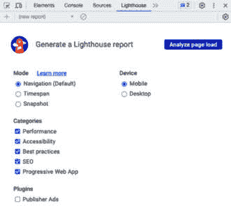
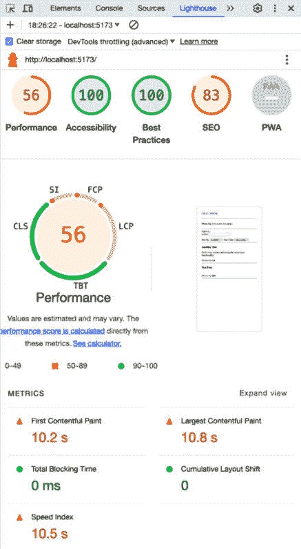
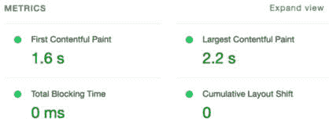
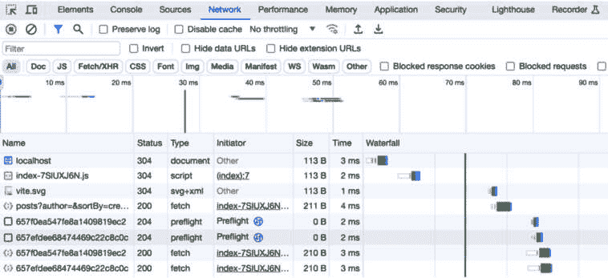
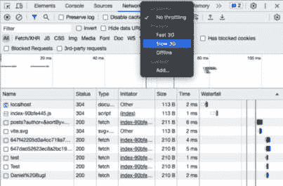
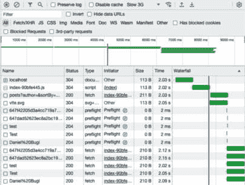
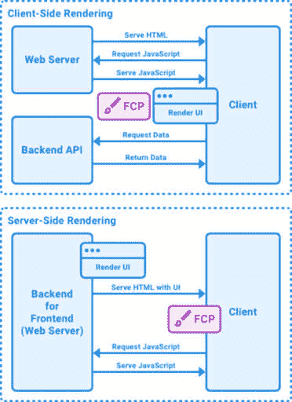
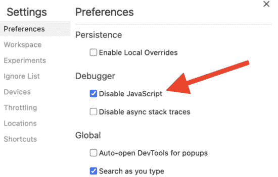
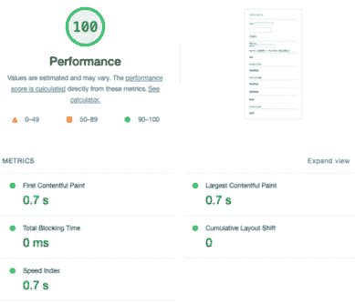

# 7

# 使用服务器端渲染提高加载时间

在使用 JWT 实现身份验证后，让我们专注于优化我们的博客应用程序的性能。我们将从基准测试我们应用程序当前的加载时间开始，并了解需要考虑的各种指标。然后，我们将学习如何在服务器上渲染 React 组件和获取数据。在本章的结尾，我们将简要介绍高级服务器端渲染的概念。

在本章中，我们将涵盖以下主要主题：

+   基准测试我们的应用程序加载时间

+   在服务器上渲染 React 组件

+   服务器端数据获取

+   高级服务器端渲染

# 技术要求

在我们开始之前，请安装*第一章*（B19385_01.xhtml#_idTextAnchor016，“为全栈开发做准备”）和*第二章*（B19385_02.xhtml#_idTextAnchor028，“了解 Node.js 和 MongoDB”）中提到的所有要求。

那些章节中列出的版本是书中使用的版本。虽然安装较新版本不应有问题，但请注意，某些步骤在较新版本上可能有所不同。如果您在使用本书提供的代码和步骤时遇到问题，请尝试使用*第一章*和*第二章*中提到的版本。

您可以在此 GitHub 上找到本章的代码：[`github.com/PacktPublishing/Modern-Full-Stack-React-Projects/tree/main/ch7`](https://github.com/PacktPublishing/Modern-Full-Stack-React-Projects/tree/main/ch7)。

本章的 CiA 视频可以在以下网址找到：[`youtu.be/0OlmicibYWQ`](https://youtu.be/0OlmicibYWQ)

# 基准测试我们的应用程序加载时间

在我们开始提高加载时间之前，我们首先必须了解用于衡量我们应用程序性能的指标。衡量 Web 应用程序性能的主要指标被称为**核心 Web 指标**，具体如下：

+   **首次内容渲染时间（FCP）**：通过报告直到页面上第一个图像或文本块被渲染的时间来衡量应用程序的加载性能。一个好的目标是将此指标低于 1.8 秒。

+   **最大内容渲染时间（LCP）**：通过报告直到最大的图像或文本块在视口中可见的时间来衡量应用程序的加载性能。一个好的目标是将此指标低于 2.5 秒。

+   **总阻塞时间（TBT）**：通过报告 FCP 和用户能够与页面交互之间的时间来衡量应用程序的交互性。一个好的目标是将此指标低于 200 毫秒。

+   **累积布局偏移（CLS）**：此指标通过报告在加载过程中页面上意外的移动来衡量应用的视觉稳定性，例如，一个链接最初在页面顶部加载，但在其他元素加载时被推得更低。虽然这个指标并没有直接衡量应用的性能，但它仍然是一个重要的指标，因为它可能导致用户在尝试点击某个东西时感到烦恼，但布局发生了偏移。

所有这些指标都可以通过使用开源的**Lighthouse**工具来衡量，该工具也可在 Google Chrome 开发者工具的**Lighthouse**面板下找到。现在让我们开始基准测试我们的应用：

1.  将**ch6**文件夹复制到一个新的**ch7**文件夹中，如下所示：

    ```js
    $ cp -R ch6 ch7
    ```

1.  在 VS Code 中打开**ch7**文件夹，打开终端，并使用以下命令运行前端：

    ```js
    $ npm run dev
    ```

1.  确保 Docker 中的**dbserver**容器正在运行。

1.  打开一个新的终端，并使用以下命令运行后端：

    ```js
    $ cd backend
    $ npm run dev
    ```

1.  在 Google Chrome 中转到**http://localhost:5173**并打开检查器（右键单击然后按**检查**）。

注意

最好在隐身标签页中这样做，这样扩展程序就不会干扰测量。

1.  打开**Lighthouse**标签页（它可能被**>>**菜单隐藏）。它应该看起来如下所示：



图 7.1 – Google Chrome 开发者工具中的 Lighthouse 标签页

1.  在**灯塔**标签页中，保留所有选项的默认设置，然后点击**分析页面**的**加载**按钮。

    Lighthouse 将开始分析网站，并给出包含**首次内容渲染**、**最大内容渲染**、**总阻塞时间**和**累积布局偏移**等指标的报告。正如我们所见，我们的应用在 TBT 和 CLS 方面表现相当不错，但在 FCP 和 LCP 方面表现特别糟糕。请参考以下截图：



图 7.2 – 在开发模式下分析我们的应用时的 Lighthouse 结果（当鼠标悬停在性能分数上时）

画图花费如此长时间有两个原因。首先，我们正在以开发模式运行服务器，这通常会使一切变慢。此外，我们正在客户端渲染一切，这意味着浏览器必须首先下载并执行我们的 JavaScript 代码，然后才能开始渲染界面。现在让我们静态构建前端并再次基准测试：

1.  使用以下命令全局安装**serve**工具，这是一个运行简单 Web 服务器的工具：

    ```js
    $ npm install -g serve
    ```

1.  使用以下命令构建前端（在项目根目录下执行）：

    ```js
    $ npm run build
    ```

1.  通过运行以下命令静态地提供我们的应用：

    ```js
    $ serve dist/
    ```

1.  在 Google Chrome 中打开**http://localhost:3000**并再次运行 Lighthouse（你可能需要清除旧报告或点击左上角的列表并选择**（新报告**）以再次分析）。

    你应该在静态提供的前端上看到新的基准测试结果，这更接近于在生产中提供的方式。你可以在下面的屏幕截图中看到结果示例：



图 7.3 – Lighthouse 报告结果在我们的静态构建应用上

现在，结果相当不错！然而，它还可以进一步改进。此外，**核心 Web Vitals**并没有考虑到获取作者用户名的级联请求。虽然在我们应用中，第一次和最大的内容渲染很快，但作者名称在那个点还没有加载。除了 Lighthouse 报告外，我们还可以查看**网络**标签页来进一步调试我们应用的性能，如下所示：

1.  在 DevTools 中，转到**网络**标签页。

1.  在标签页打开时刷新页面。你会看到一个瀑布图和请求的测量时间，如下面的屏幕截图所示：



图 7.4 – 网络标签页上的瀑布图

但时间极低（所有都在 10 毫秒以下）。这是因为我们的后端在本地上运行，所以没有网络延迟。这不是一个现实场景。在生产中，我们发出的每个请求都会有延迟，因此我们首先必须等待拉取博客文章，然后分别获取每个作者的名称。我们可以使用 DevTools 来模拟更慢的网络连接；现在就让我们来做这件事：

1.  在**网络**标签页的顶部，点击**无** **限速**下拉菜单。

1.  选择**慢速 3G**预设。以下截图供参考：



图 7.5 – 在 Google Chrome DevTools 中模拟慢速网络

注意

Lighthouse 内置了一种限速形式，类似于我们在这里使用的网络限速，但并不相同。虽然 DevTools 中的网络限速是添加到所有请求的固定延迟，但 Lighthouse 的限速尝试通过根据初始未限速加载中观察到的数据调整限速来模拟更真实的场景。

1.  刷新页面。你现在会看到应用正在缓慢加载主布局，然后是所有帖子的列表，最后解析作者 ID 到用户名。

这是我们页面在慢速网络上的加载方式。现在，加载我们应用的总体时间几乎接近九秒！你可以查看瀑布图来了解为什么会这样：



图 7.6 – 在开启 Slow 3G 限速的情况下检查瀑布图

在我们的应用中，问题在于请求是级联的。首先，HTML 文档加载，然后加载我们应用的 JavaScript 文件。这个 JavaScript 文件随后被执行并开始渲染布局和获取帖子列表。帖子加载后，会并行发出多个请求以解析作者名称。由于每个请求在我们的模拟慢速网络中需要超过两秒钟，我们最终的总加载时间超过八秒钟。

现在我们已经学会了如何基准测试 Web 应用，并发现了我们应用中的性能瓶颈（级联请求），让我们学习如何提高性能！

# 在服务器上渲染 React 组件

在上一节中，我们将级联请求识别为在慢速连接上表现不佳的问题。以下是一些可能的解决方案：

+   **捆绑请求**：在服务器上获取所有内容，然后通过单个请求一次性将所有内容提供给客户端。这将解决获取作者名称时的级联请求问题，但不会解决 HTML 页面加载和 JavaScript 执行以开始获取数据之间的初始等待时间。每个请求的延迟为两秒钟，这意味着在 HTML 获取后仍然增加了四秒钟（两秒钟用于加载 JavaScript 和两秒钟用于发出请求）。

+   **服务器端渲染**：在服务器上渲染包含所有数据的初始用户界面，并代替仅包含指向 JavaScript 文件的 URL 的初始 HTML 提供它。这意味着不需要额外的请求来获取数据或 JavaScript，我们可以立即显示博客文章。这种方法的优势之一是允许缓存结果，因此，只有当添加博客文章时，我们才需要在服务器上重新生成页面。这种方法的一个缺点是它会给服务器带来更大的压力，尤其是在页面复杂且难以渲染时。

在数据变化不频繁或所有用户访问相同数据的情况下，服务器端渲染是有益的。在数据频繁变化或针对每个用户进行个性化处理的情况下，通过创建新的路由或使用能够聚合请求的系统（例如 GraphQL），将请求捆绑在一起可能更有意义。我们将在本书稍后的*第十一章*“使用 GraphQL API 构建后端”中了解更多关于 GraphQL 的内容。然而，在本章中，我们将专注于服务器端渲染方法。

让我们来看看服务器端渲染与客户端渲染之间的区别：

+   在**客户端渲染**中，浏览器下载一个最小的 HTML 页面，通常只包含有关下载包含所有将渲染应用代码的 JavaScript 包的信息。

+   在 **服务器端渲染** 中，React 组件在服务器上渲染，并以 HTML 的形式提供给浏览器。这确保了应用可以立即渲染。JavaScript 包可以在稍后加载。



图 7.7 – 客户端渲染和服务器端渲染之间的区别

还可以将这两个结合到 **同构渲染** 中。这涉及到在服务器端渲染初始页面，然后继续在客户端渲染更改。同构渲染结合了两个世界的最佳之处。

除了性能改进之外，服务器端渲染对 **搜索引擎优化**（**SEO**）也有好处，因为搜索引擎爬虫不需要运行 JavaScript 就能看到页面。我们将在下一章中了解更多关于 SEO 的内容，*第八章*，*确保客户通过搜索引擎优化找到你*。

现在我们已经了解了服务器端渲染，让我们开始在前端实现它，如下所示：

+   设置服务器

+   定义服务器端入口点

+   定义客户端入口点

+   更新 **index.html** 和 **package.json**

+   让 React Router 与服务器端渲染一起工作

首先，让我们设置服务器。

## 设置服务器

在我们可以开始进行服务器端渲染之前，我们需要设置一些样板代码来同时运行 Express 服务器和 Vite，这样我们就不丢失 Vite 的好处，例如热重载。让我们按照以下步骤设置服务器：

1.  在我们项目的根目录（前端）中安装 **express** 和 **dotenv** 依赖项；我们将使用它们创建一个小型网络服务器来服务我们的服务器端渲染页面：

    ```js
    $ npm install express@4.18.2 dotenv@16.3.1
    ```

1.  编辑 **.eslintrc.json** 并添加 **node** 环境，因为我们现在要向我们的前端添加服务器端代码：

    ```js
      "env": {
        "browser": true,
        "node": true
      },
    ```

1.  在 **ch7** 文件夹中创建一个新的 **server.js** 文件，并导入 **fs**、**path**、**url**、**express** 和 **dotenv** 依赖项：

    ```js
    import fs from 'fs'
    import path from 'path'
    import { fileURLToPath } from 'url'
    import express from 'express'
    import dotenv from 'dotenv'
    dotenv.config()
    ```

1.  将当前路径保存在一个变量中，稍后用于引用我们项目中的其他文件，使用与 ESM 兼容的 **import.meta.url** 变量，它包含一个 **file://** URL 到我们的项目：

    ```js
    const __dirname = path.dirname(fileURLToPath(import.meta.url))
    ```

    我们在这里将此 URL 转换为常规路径。

1.  定义一个新的 **createDevServer** 函数，我们将创建一个带有热重载和服务器端渲染的 Vite 开发服务器：

    ```js
    async function createDevServer() {
    ```

1.  在这个函数内部，我们首先定义 Express 应用程序：

    ```js
      const app = express()
    ```

1.  然后，导入并创建一个 Vite 开发服务器。我们在这里使用动态 **import** 语法，这样我们就不需要在定义生产服务器时导入 Vite：

    ```js
      const vite = await (
        await import('vite')
      ).createServer({
        server: { middlewareMode: true },
        appType: 'custom',
      })
      app.use(vite.middlewares)
    ```

    中间件模式将 Vite 作为中间件运行在现有的 Express 服务器中。将 `appType` 设置为 `custom` 将禁用 Vite 的自有服务逻辑，这样我们就可以控制要服务的 HTML。

1.  现在，定义一个匹配所有路径的路由，并开始加载 **index.html** 文件：

    ```js
      app.use('*', async (req, res, next) => {
        try {
          const templateHtml = fs.readFileSync(
            path.resolve(__dirname, 'index.html'),
            'utf-8',
          )
    ```

    确保在`index.html`中以 UTF-8 模式加载，以支持各种语言和表情符号。

1.  接下来，注入 Vite 热模块替换客户端以允许热重载：

    ```js
          const template = await vite.transformIndexHtml(
            req.originalUrl,
            templateHtml
          )
    ```

1.  加载我们将在下一步定义的服务器端渲染应用程序的入口点文件：

    ```js
          const { render } = await vite.ssrLoadModule('/src/entry-server.jsx')
    ```

    Vite 中的`ssrLoadModule`函数自动转换 ESM 源代码，使其在 Node.js 中可用。这意味着我们可以不运行手动构建就热重载入口点文件。

1.  使用 React 渲染应用程序。我们将在服务器端入口点中稍后定义`render`函数。现在，我们只需调用该函数：

    ```js
          const appHtml = await render()
    ```

1.  通过匹配占位符字符串将我们的应用程序渲染的 HTML 插入到 HTML 模板中，该占位符字符串我们将在**index.html**文件中稍后定义：

    ```js
          const html = template.replace(`<!--ssr-outlet-->`, appHtml)
    ```

1.  返回包含最终 HTML 内容的**200 OK**响应：

    ```js
          res.status(200).set({ 'Content-Type': 'text/html' }).end(html)
    ```

1.  为了完成服务器创建，捕获所有错误并让 Vite 修复堆栈跟踪，将堆栈跟踪中的源文件映射回实际源代码。然后，返回创建的 Express 应用程序：

    ```js
        } catch (e) {
          vite.ssrFixStacktrace(e)
          next(e)
        }
      })
      return app
    }
    ```

1.  最后，执行**createDevServer**函数并使应用程序监听定义的端口：

    ```js
    const app = await createDevServer()
    app.listen(process.env.PORT, () =>
      console.log(
        `ssr dev server running on http://localhost:${process.env.PORT}`,
      ),
    )
    ```

1.  不要忘记在**.env**文件中定义**PORT**环境变量。编辑**.env**文件并添加**PORT**环境变量，如下所示：

    ```js
    VITE_BACKEND_URL="http://localhost:3001/api/v1"
    PORT=5173
    ```

现在我们已经成功创建了与 Vite 集成的 Express 服务器，我们继续实现服务器端入口点。

## 定义服务器端入口点

服务器端入口点将使用`ReactDOMServer`在服务器上渲染我们的 React 组件。我们需要区分这个入口点和客户端入口点，因为并非 React 能做的所有事情都在服务器端受支持。具体来说，一些钩子，如 effect 钩子，在服务器端不会运行。此外，我们将在服务器端以不同的方式处理路由，但关于这一点稍后讨论。

现在，让我们开始定义服务器端入口点：

1.  首先，创建一个新的**src/entry-server.jsx**文件，并导入**ReactDOMServer**和**App**组件：

    ```js
    import ReactDOMServer from 'react-dom/server
    import { App } from './App.jsx'
    ```

1.  定义并导出`render`函数，该函数使用**ReactDOMServer.renderToString**函数返回**App**组件：

    ```js
    export async function render() {
      return ReactDOMServer.renderToString(
        <App />,
      )
    }
    ```

在定义服务器端入口点后，我们将继续定义客户端入口点。

## 定义客户端入口点

客户端入口点使用常规`ReactDOM`来渲染我们的 React 组件。然而，我们需要让 React 知道要利用已经服务器端渲染的 DOM。而不是渲染，我们**激活**现有的 DOM。就像给植物加水一样，激活通过向服务器端渲染的静态 DOM 添加所有 React 功能，使 DOM“活跃”起来。

按照以下步骤定义客户端入口点：

1.  将现有的**src/main.jsx**文件重命名为**src/entry-client.jsx**。

1.  将`createRoot`函数替换为`hydrateRoot`函数，如下所示：

    ```js
    ReactDOM.hydrateRoot(
      document.getElementById('root'),
      <React.StrictMode>
        <App />
      </React.StrictMode>,
    )
    ```

    `hydrateRoot` 函数接受组件作为第二个参数，并且不需要我们调用 `.render()`。

现在我们已经定义了两个入口点，让我们更新 `index.html` 和 `package.json`。

## 更新 index.html 和 package.json

我们仍然需要在 `index.html` 文件中添加占位符字符串，并调整 `package.json` 以执行我们的自定义服务器而不是直接执行 `vite` 命令。现在让我们来做这件事：

1.  编辑 **index.html** 并添加一个占位符，其中将注入服务器渲染的 HTML：

    ```js
        <div id="root"><!--ssr-outlet--></div>
    ```

1.  调整模块导入以指向客户端入口点：

    ```js
        <script type="module" src="/src/entry-client.jsx"></script>
    ```

1.  现在，编辑 **package.json** 并将开发脚本替换为以下内容：

    ```js
        "dev": "node server",
    ```

1.  此外，将 **build** 命令替换为构建服务器和客户端的命令：

    ```js
        "build": "npm run build:client && npm run build:server",
        "build:client": "vite build --outDir dist/client",
        "build:server": "vite build --outDir dist/server --ssr src/entry-server.jsx",
    ```

我们现在的设置已经准备好进行服务器端渲染。然而，当你启动服务器时，你会立即注意到 React Router 并没有与我们的当前设置一起工作。现在让我们修复这个问题。

## 使 React Router 与服务器端渲染一起工作

要使 React Router 与服务器端渲染一起工作，我们需要在服务器端使用 `StaticRouter`，在客户端使用 `BrowserRouter`。我们可以为两边复用相同的路由定义。让我们开始重构代码，使 React Router 在服务器端工作：

1.  编辑 **src/App.jsx** 并从其中 *移除* 与路由器相关的导入（高亮行）：

    ```js
    import { QueryClient, QueryClientProvider } from '@tanstack/react-query'
    import { createBrowserRouter, RouterProvider } from 'react-router-dom'
    import { AuthContextProvider } from './contexts/AuthContext.jsx'
    import { Blog } from './pages/Blog.jsx'
    import { Signup } from './pages/Signup.jsx'
    import { Login } from './pages/Login.jsx'
    ```

1.  导入 **PropTypes**，因为我们稍后会用到它：

    ```js
    import PropTypes from 'prop-types'
    ```

1.  接下来，从其中 *移除* 以下路由定义；我们很快会将它们放入一个新文件中：

    ```js
    const router = createBrowserRouter([
      {
        path: '/',
        element: <Blog />,
      },
      {
        path: '/signup',
        element: <Signup />,
      },
      {
        path: '/login',
        element: <Login />,
      },
    ])
    ```

1.  调整函数以接受 **children** 并将 **RouterProvider** 替换为 **{children}**：

    ```js
    export function App({ children }) {
      return (
        <QueryClientProvider client={queryClient}>
          <AuthContextProvider>
            {children}
    </AuthContextProvider>
        </QueryClientProvider>
      )
    }
    ```

1.  现在，我们还需要为 **App** 组件添加 **propTypes** 定义：

    ```js
    App.propTypes = {
      children: PropTypes.element.isRequired,
    }
    ```

1.  创建一个新的 **src/routes.jsx** 文件并将之前移除的导入放在那里：

    ```js
    import { Blog } from './pages/Blog.jsx'
    import { Signup } from './pages/Signup.jsx'
    import { Login } from './pages/Login.jsx'
    ```

1.  然后，添加路由定义并导出它们：

    ```js
    export const routes = [
      {
        path: '/',
        element: <Blog />,
      },
      {
        path: '/signup',
        element: <Signup />,
      },
      {
        path: '/login',
        element: <Login />,
      },
    ]
    ```

现在我们已经以可以复用客户端和服务器端入口点路由的方式重构了我们的应用结构，让我们在客户端入口点重新定义路由器。

### 定义客户端路由器

按照以下步骤在客户端入口点重新定义路由器：

1.  编辑 **src/entry-client.jsx** 并导入 **RouterProvider**、**createBrowserRouter** 函数和 **routes**：

    ```js
    import React from 'react'
    import ReactDOM from 'react-dom/client'
    import { createBrowserRouter, RouterProvider } from 'react-router-dom'
    import { App } from './App.jsx'
    import { routes } from './routes.jsx'
    ```

1.  然后，基于 **routes** 定义创建一个新的浏览器路由器：

    ```js
    const router = createBrowserRouter(routes)
    ```

1.  调整 **render** 函数以使用 **RouterProvider** 渲染 **App**：

    ```js
    ReactDOM.hydrateRoot(
      document.getElementById('root'),
      <React.StrictMode>
        <App>
          <RouterProvider router={router} />
        </App>
      </React.StrictMode>,
    )
    ```

接下来，让我们定义 **服务器端路由器**。

### 将 Express 请求映射到 Fetch 请求

在服务器端，我们将得到一个 Express 请求，我们首先需要将其转换为 Fetch 请求，以便 React Router 能够理解它。现在让我们来做这件事：

1.  在 **src/request.js** 文件中创建一个新的文件并定义一个 **createFetchRequest** 函数，该函数接受一个 Express 请求作为参数：

    ```js
    export function createFetchRequest(req) {
    ```

1.  首先，定义请求的 **origin** 并构建 URL：

    ```js
      const origin = `${req.protocol}://${req.get('host')}`
      const url = new URL(req.originalUrl || req.url, origin)
    ```

    我们需要首先使用 `req.originalUrl`（如果可用），以考虑到 Vite 中间件可能会更改 URL。

1.  然后，我们定义一个新的 **AbortController** 来处理请求关闭的情况：

    ```js
      const controller = new AbortController()
      req.on('close', () => controller.abort())
    ```

1.  接下来，我们将 Express 请求 **头部**映射到 Fetch 头部：

    ```js
      const headers = new Headers()
      for (const [key, values] of Object.entries(req.headers)) {
        if (!values) continue
        if (Array.isArray(values)) {
          for (const value of values) {
            headers.append(key, value)
          }
        } else {
          headers.set(key, values)
        }
      }
    ```

1.  现在，我们可以为 Fetch 请求构建 **init** 对象，它由 **method**、**headers** 和 **AbortController** 组成：

    ```js
      const init = {
        method: req.method,
        headers,
        signal: controller.signal,
      }
    ```

1.  如果我们的请求不是 **GET** 或 **HEAD** 请求，我们也会得到 **body**，所以，让我们也将它添加到 Fetch 请求中：

    ```js
      if (req.method !== 'GET' && req.method !== 'HEAD') {
        init.body = req.body
      }
    ```

1.  最后，让我们从我们的提取信息中创建 Fetch **请求**对象：

    ```js
      return new Request(url.href, init)
    }
    ```

现在我们有一个将 Express 请求转换为 Fetch 请求的实用函数，我们可以利用它来定义服务器端路由器。

### 定义服务器端路由器

服务器端路由器的工作方式与客户端路由器非常相似，只是我们是从 Express 而不是从页面获取请求信息，并使用 `StaticRouter`，因为服务器端的路由不能改变。按照以下步骤定义服务器端路由器：

1.  编辑 **src/entry-server.jsx** 并导入 **StaticRouterProvider** 和 **createStaticHandler** 以及 **createStaticRouter** 函数。还要导入 **routes** 定义和刚刚定义的 **createFetchRequest** 函数：

    ```js
    import ReactDOMServer from 'react-dom/server'
    import {
      createStaticHandler,
      createStaticRouter,
      StaticRouterProvider,
    } from 'react-router-dom/server'
    import { App } from './App.jsx'
    import { routes } from './routes.jsx'
    import { createFetchRequest } from './request.js'
    ```

1.  定义路由的静态处理器：

    ```js
    const handler = createStaticHandler(routes)
    ```

1.  调整 **render** 函数以接受 Express 请求对象，然后使用我们之前定义的函数从它创建一个 Fetch 请求：

    ```js
    export async function render(req) {
      const fetchRequest = createFetchRequest(req)
    ```

1.  现在我们可以使用这个转换后的请求传递给我们的静态处理器，它为路由创建**上下文**，允许 React Router 看到我们正在尝试访问哪个路由以及使用哪些参数：

    ```js
      const context = await handler.query(fetchRequest)
    ```

1.  从处理器定义的路由和上下文中，我们可以创建一个静态路由器：

    ```js
      const router = createStaticRouter(handler.dataRoutes, context)
    ```

1.  最后，我们可以调整渲染以渲染静态路由器和我们的重构 **App** 结构：

    ```js
      return ReactDOMServer.renderToString(
        <App>
          <StaticRouterProvider router={router} context={context} />
        </App>,
      )
    }
    ```

1.  还有另一件事要做。我们需要将 Express 请求传递到服务器端入口点的 **render()** 函数。编辑 **server.js** 文件中的以下行：

    ```js
          const appHtml = await render(req)
    ```

1.  如果前端和后端已经运行，请确保退出它们。

1.  按照以下步骤启动前端：

    ```js
    $ npm run dev
    ```

1.  此外，在单独的终端中启动后端：

    ```js
    $ cd backend
    $ npm run dev
    ```

前端现在将输出 `ssr dev server running on http://localhost:5173` 并成功在服务器端渲染所有页面！你可以通过打开 DevTools，点击右上角的齿轮图标，在 **设置** | **首选项** 面板中向下滚动到 **调试器** 部分，并勾选 **禁用 JavaScript** 来验证它是服务器端渲染的，如下所示：



图 7.8 – 在 DevTools 中禁用 JavaScript

现在，刷新页面，你会看到应用的一部分仍然被渲染。目前只有应用的上半部分是通过服务器端完全渲染的。文章列表尚未在服务器端渲染。这是因为`useQuery`钩子内部使用了一个 effect 钩子，在组件挂载后获取数据。因此，它们不适用于服务器端渲染。然而，我们仍然可以使数据获取与服务器端渲染一起工作。我们将在下一节中学习这一点。

# 服务器端数据获取

如我们所见，数据获取在服务器端不是即时的。对于 React Query 的服务器端数据获取有两种方法：

+   **初始数据方法**：在`useQuery`钩子中使用**initialData**选项来传递预取数据。这种方法足够用于获取文章列表，但对于获取深层嵌套数据，例如每个作者的昵称，可能会很棘手。

+   **数据同步方法**：这允许我们预取任何请求并按查询键存储结果，甚至在服务器端预取任何请求，即使它深深嵌套在应用中，也不需要通过属性或上下文传递预取数据。

我们首先将使用`initialData`选项来获取博客文章列表，然后扩展我们的解决方案以采用数据同步方法，以便我们可以了解这两种方法的工作原理以及它们的优缺点。

## 使用初始数据

React Router 允许我们通过`initialData`选项定义`Blog`组件和`useQuery`钩子。现在让我们来做这件事：

1.  编辑**src/routes.jsx**并从**react-router-dom**导入**useLoaderData**钩子和**getPosts**函数：

    ```js
    import { useLoaderData } from 'react-router-dom'
    import { Blog } from './pages/Blog.jsx'
    import { Signup } from './pages/Signup.jsx'
    import { Login } from './pages/Login.jsx'
    import { getPosts } from './api/posts.js'
    ```

1.  调整路由以定义一个**loader**函数，其中我们简单地调用**getPosts**函数。然后我们可以在**Component()**方法中使用**useLoaderData**钩子从 loader 获取数据，并将其传递给**Blog**组件，如下所示：

    ```js
    export const routes = [
      {
        path: '/',
        loader: getPosts,
        Component() {
          const posts = useLoaderData()
          return <Blog initialData={posts} />
        },
      },
    ```

1.  编辑**src/pages/Blog.jsx**并在其中导入**PropTypes**，这样我们就可以在稍后为组件定义一个新的属性：

    ```js
    import PropTypes from 'prop-types'
    ```

1.  然后，将**initialData**属性添加到**Blog**组件中：

    ```js
    export function Blog({ initialData }) {
    ```

1.  将**initialData**属性传递给**useQuery**钩子，如下所示：

    ```js
      const postsQuery = useQuery({
        queryKey: ['posts', { author, sortBy, sortOrder }],
        queryFn: () => getPosts({ author, sortBy, sortOrder }),
        initialData,
      })
    ```

1.  最后，为**Blog**组件定义**propTypes**：

    ```js
    Blog.propTypes = {
      initialData: PropTypes.shape(PostList.propTypes.posts),
    }
    ```

刷新前端页面（禁用 JavaScript）后，现在将显示文章列表，但不会解析作者昵称。正如我们所见，初始数据方法相当简单。然而，如果我们想获取所有作者的昵称，我们可能需要将它们存储在某个地方，然后通过属性或上下文将它们传递到用户组件中，这两种方法都相当繁琐，而且如果我们需要稍后进行更多请求，扩展性不会很好。幸运的是，还有一种更高级的方法，我们现在将要学习。

## 使用数据同步

使用水合方法，我们创建一个查询客户端来预取我们想要进行的任何请求，然后将其脱水，通过加载器将其传递给组件，并在那里再次水合。使用这种方法，我们可以简单地执行任何查询并使用查询键存储它。如果一个组件使用相同的查询键，它将能够在服务器端渲染结果。现在让我们实现水合方法：

1.  编辑**src/routes.jsx**并从 React Query 导入**QueryClient**、**dehydrate**函数和**Hydrate**组件：

    ```js
    import { QueryClient, dehydrate, HydrationBoundary } from '@tanstack/react-query'
    ```

1.  此外，还需要导入**getUserInfo**函数，因为我们现在也将获取用户名：

    ```js
    import { getUserInfo } from './api/users.js'
    ```

1.  调整加载器；我们现在将在那里创建一个查询客户端：

    ```js
      {
        path: '/',
        loader: async () => {
          const queryClient = new QueryClient()
    ```

1.  然后，我们通过传递与组件相同的默认参数来模拟**Blog**组件的**getPosts**请求：

    ```js
          const author = ''
          const sortBy = 'createdAt'
          const sortOrder = 'descending'
          const posts = await getPosts({ author, sortBy, sortOrder })
    ```

注意

这种默认参数的重复有点问题。然而，根据我们当前的服务器端渲染解决方案，数据获取和组件渲染过于分离，无法在它们之间正确共享代码。一个更复杂的服务器端渲染解决方案，如 Next.js 或 Remix，可以更好地处理这种模式。

1.  现在，我们可以调用**queryClient.prefetchQuery**，使用与组件中**useQuery**钩子将使用的相同查询键来预取查询的结果：

    ```js
          await queryClient.prefetchQuery({
            queryKey: ['posts', { author, sortBy, sortOrder }],
            queryFn: () => posts,
          })
    ```

1.  接下来，我们使用获取到的帖子数组来从它们中获取唯一的作者 ID 列表：

    ```js
          const uniqueAuthors = posts
            .map((post) => post.author)
            .filter((value, index, array) => array.indexOf(value) === index)
    ```

1.  我们现在遍历所有作者 ID 并预取它们的信息：

    ```js
          for (const userId of uniqueAuthors) {
            await queryClient.prefetchQuery({
              queryKey: ['users', userId],
              queryFn: () => getUserInfo(userId),
            })
          }
    ```

1.  现在我们已经预取了所有必要的数据，我们需要在**queryClient**上调用**dehydrate**以返回可序列化的格式：

    ```js
          return dehydrate(queryClient)
        },
    ```

1.  在**Component()**方法中，我们获取这个脱水状态并使用**Hydrate**组件再次水合。这个过程使得数据对服务器端渲染的查询客户端可访问：

    ```js
        Component() {
          const dehydratedState = useLoaderData()
          return (
            <HydrationBoundary state={dehydratedState}>
              <Blog />
            </HydrationBoundary>
          )
        },
      },
    ```

1.  最后，我们可以将**src/pages/Blog.jsx**组件恢复到之前的状态。我们首先**移除**了**PropTypes**导入：

    ```js
    import PropTypes from 'prop-types'
    ```

1.  然后，我们**移除**了**initialData**属性：

    ```js
    export function Blog({ initialData }) {
    ```

1.  我们还在**useQuery**钩子中**移除**了它：

    ```js
      const postsQuery = useQuery({
        queryKey: ['posts', { author, sortBy, sortOrder }],
        queryFn: () => getPosts({ author, sortBy, sortOrder }),
        initialData,
      })
    ```

1.  最后，我们**移除**了**propTypes**定义：

    ```js
    Blog.propTypes = {
      initialData: PropTypes.shape(PostList.propTypes),
    }
    ```

1.  通过*Ctrl* + *C*退出前端，然后按照以下方式重新启动它：

    ```js
    $ npm run dev
    ```

1.  刷新页面，你现在会看到完整的博客文章列表，包括所有作者名称，现在已经在服务器端正确渲染，即使禁用了 JavaScript！

让我们再进行一次基准测试，看看性能是如何提高的：

1.  打开 Chrome 开发者工具。

1.  通过转到齿轮图标，**设置** | **首选项**，取消选中**禁用 JavaScript**来再次启用 JavaScript。

1.  前往**Lighthouse**标签页。点击**分析页面加载**以生成新的报告。



图 7.9 – 服务器端渲染应用与开发服务器的 Lighthouse 性能分数

首屏加载时间（FCP）和最大内容渲染时间（LCP）几乎比之前在生产模式下客户端渲染报告的时间减少了一半。查看 **网络** 选项卡中的瀑布图，我们现在可以看到只有一个请求用于获取初始页面。

让我们通过学习高级服务器端渲染来结束本章内容。

# 高级服务器端渲染

在前面的章节中，我们已经成功创建了一个可以进行服务器端渲染并具有热重载功能的服务器，这对于开发非常有用，但会在生产中降低性能。现在，让我们为生产服务器创建另一个服务器函数，该函数将构建文件，使用压缩，并且不加载 Vite 中间件进行热重载。按照以下步骤创建生产服务器：

1.  在我们项目的根目录下，使用以下命令安装 **compression** 依赖项：

    ```js
    $ npm install compression@1.7.4
    ```

1.  编辑 **server.js** 并在 **createDevServer** 函数之上定义一个新的用于生产服务器的函数：

    ```js
    async function createProdServer() {
    ```

1.  在这个函数中，我们定义了一个新的 Express 应用，并使用 **compression** 包和 **serve-static** 包来服务我们的客户端：

    ```js
      const app = express()
      app.use((await import('compression')).default())
      app.use(
        (await import('serve-static')).default(
          path.resolve(__dirname, 'dist/client'),
          {
            index: false,
          },
        ),
      )
    ```

1.  然后，我们定义了一个捕获所有路径的路由，这次是从 **dist/** 文件夹中加载的模板：

    ```js
      app.use('*', async (req, res, next) => {
        try {
          let template = fs.readFileSync(
            path.resolve(__dirname, 'dist/client/index.html'),
            'utf-8',
          )
    ```

1.  现在，我们直接导入并渲染服务器端入口点：

    ```js
          const render = (await import('./dist/server/entry-server.js')).render
    ```

1.  如前所述，我们渲染 React 应用，将 **index.html** 中的占位符替换为渲染的应用，并返回生成的 HTML：

    ```js
          const appHtml = await render(req)
          const html = template.replace(`<!--ssr-outlet-->`, appHtml)
          res.status(200).set({ 'Content-Type': 'text/html' }).end(html)
    ```

1.  对于错误处理，我们现在简单地将其传递给下一个中间件并返回应用：

    ```js
        } catch (e) {
          next(e)
        }
      })
      return app
    }
    ```

1.  在 **server.js** 文件底部，我们创建开发服务器的地方，现在我们检查 **NODE_ENV** 环境变量，并使用它来决定是启动生产服务器还是开发服务器：

    ```js
    if (process.env.NODE_ENV === 'production') {
      const app = await createProdServer()
      app.listen(process.env.PORT, () =>
        console.log(
          `ssr production server running on http://localhost:${process.env.PORT}`,
        ),
      )
    } else {
      const app = await createDevServer()
      app.listen(process.env.PORT, () =>
        console.log(
          `ssr dev server running on http://localhost:${process.env.PORT}`,
        ),
      )
    }
    ```

1.  按照以下步骤安装 **cross-env** 包：

    ```js
    $ npm install cross-env@7.0.3
    ```

1.  编辑 **package.json** 并添加一个 **start** 脚本，该脚本以生产模式启动服务器：

    ```js
        "start": "cross-env NODE_ENV=production node server",
    ```

1.  关闭前端开发服务器，构建并启动生产服务器：

    ```js
    $ npm run build
    $ npm start
    ```

如我们所见，我们的服务器仍然可以很好地提供服务应用，但现在我们不再处于开发模式，因此没有热重载可用。这标志着我们服务器端渲染实现的完成！正如你所想象的那样，本章中服务器端渲染的实现相对基础，我们还需要处理多个问题：

+   重定向和适当的 HTTP 状态码

+   静态站点生成（缓存生成的 HTML 页面，这样我们就不必每次都进行服务器端渲染）

+   更好的数据获取功能

+   在服务器和客户端之间更好地进行代码拆分

+   在服务器和客户端之间更好地处理环境变量

为了解决这些问题，最好在 Web 框架中使用一个完整的后端渲染实现，例如 Next.js 或 Remix。这些框架已经提供了进行后端渲染、数据获取和路由的现成方法，并且不需要我们手动使所有这些协同工作。我们将在*第十六章*，*Next.js 入门*中了解更多关于 Next.js 的内容。

# 摘要

在本章中，我们首先学习了如何使用 Lighthouse 和 Chrome DevTools 对 Web 应用进行基准测试。我们还了解了此类基准测试的有用指标，称为核心 Web 指标。然后，我们学习了在服务器上渲染 React 组件以及客户端渲染和服务器端渲染之间的区别。接下来，我们使用 Vite 和 React Router 为我们应用实现了服务器端渲染。然后，我们使用 React Query 实现了服务器端数据获取。然后，我们再次对应用进行了基准测试，并看到了超过 40%的性能提升。最后，我们学习了如何让我们的服务器端渲染服务器为生产做好准备，以及一个更复杂的后端渲染框架需要处理的概念。

在下一章*第八章*，*确保客户通过搜索引擎优化找到您*，我们将学习如何使我们的 Web 应用更容易被搜索引擎爬虫访问，从而提高我们在 Lighthouse 报告中看到的 SEO 评分。我们将添加元标签以获取更多关于我们的 Web 应用的信息，并为各种社交媒体网站添加集成。
