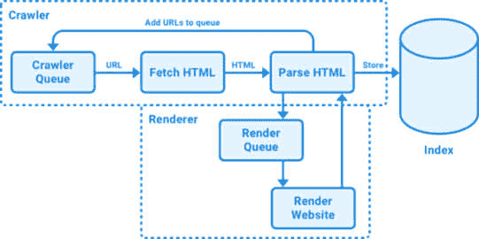
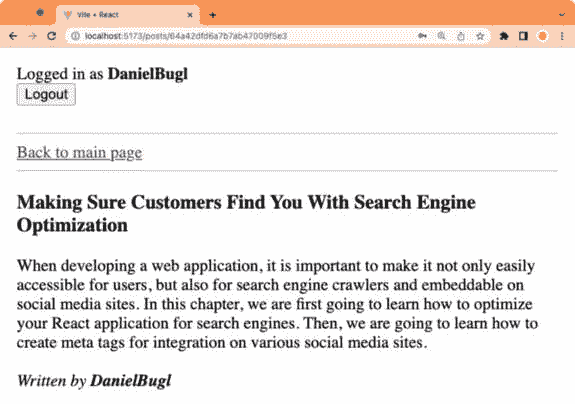
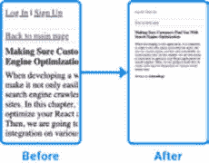

# 8

# 通过搜索引擎优化确保客户能找到你

在上一章中优化我们博客的性能时，您可能已经注意到 Lighthouse 报告还包括一个**搜索引擎优化**（**SEO**）得分，我们的应用程序在这个得分上相对较低。这个得分告诉我们我们的应用程序在正确索引和被搜索引擎如 Google 或 Bing 找到方面优化得有多好。当然，在成功开发了一个工作的博客应用程序之后，我们希望我们的博客能被用户找到。在本章中，我们将学习 SEO 的基础知识以及如何优化我们的 React 应用程序的 SEO 得分。然后，我们将学习如何创建元标签，以便更容易地在各种社交媒体网站上集成。

在本章中，我们将涵盖以下主要主题：

+   优化应用程序以适应搜索引擎

+   改进社交媒体嵌入

# 技术要求

在我们开始之前，请从*第一章**，准备全栈开发*和*第二章**，了解 Node.js*和*MongoDB*中安装所有要求。

那些章节中列出的版本是书中使用的版本。虽然安装较新版本不应成问题，但请注意，某些步骤在较新版本上可能工作方式不同。如果您在这本书提供的代码和步骤上遇到问题，请尝试使用*第一章*和*第二章*中提到的版本。

您可以在 GitHub 上找到本章的代码：[`github.com/PacktPublishing/Modern-Full-Stack-React-Projects/tree/main/ch8`](https://github.com/PacktPublishing/Modern-Full-Stack-React-Projects/tree/main/ch8)。

本章的 CiA 视频可以在以下网址找到：[`youtu.be/1xN3l0MMTbY`](https://youtu.be/1xN3l0MMTbY)

如果您克隆了本书的完整仓库，Husky 在运行`npm install`时可能找不到`.git`目录。在这种情况下，只需在相应章节文件夹的根目录下运行`git init`。

# 优化应用程序以适应搜索引擎

在我们开始优化我们的应用程序以适应搜索引擎之前，让我们简要了解搜索引擎是如何工作的。搜索引擎通过在索引中存储有关网站的信息来工作。**索引**包含网站的地址、内容和元信息。在索引中添加或更新页面称为索引，由爬虫完成。**爬虫**是一种自动软件，它抓取网站并将它们索引。它被称为爬虫，因为它会跟随网站上的进一步链接以找到更多网站。更高级的爬虫，如**Googlebot**，还可以检测是否需要 JavaScript 来渲染网站的页面内容，甚至可以渲染它。

以下图形展示了搜索引擎爬虫的工作原理：



图 8.1 – 搜索引擎爬虫工作原理的可视化

如我们所见，一个搜索爬虫有一个包含它需要爬取和索引的 URL 的队列。然后，它逐个访问这些 URL，获取 HTML，如果它是一个高级爬虫，它会检测是否需要执行 JavaScript 来渲染内容。在这种情况下，URL 会被添加到渲染队列中，渲染后的 HTML 稍后会被传递回爬虫。然后，爬虫提取所有指向其他页面的链接并将它们添加到队列中。最后，解析后的内容被添加到索引中。

要查看一个网站是否已经被搜索引擎索引，大多数搜索引擎都提供了一个 `site:` 操作符，它可以用来检查一个 URL 是否已经被它索引。例如，`site:wikipedia.org` 会显示维基百科上已经索引的各种 URL。如果你的网站还没有被索引，你可以将其提交给像**Google Search Console**这样的工具。Google Search Console 还有一个关于索引状态和索引问题的详细概述。然而，为了使网站被发现，并不需要提交我们的网站，因为大多数搜索引擎会自动爬取网络，最终会发现我们的网站。

如果你的网站仍然没有被索引，这可能是因为它配置不当。首先，你需要创建一个`robots.txt`文件来指定搜索引擎是否允许爬取你的网站的部分，以及允许爬取哪些部分。

注意

**robots.txt**不应用于从 Google 搜索结果中隐藏网页。相反，它用于减少对不重要或类似页面的爬虫流量。如果你想要完全从 Google 搜索结果中隐藏网页，要么对它们进行密码保护，要么使用**noindex**元标签。

接下来，你需要确保你的网站内容对爬虫可见。服务器端渲染可以通过允许爬虫在不运行 JavaScript 的情况下查看你的网站内容来帮助这里。此外，使用特殊 HTML 标签添加元信息可以帮助爬虫获取有关你的网站的更多信息。对于小型网站，页面需要正确链接或添加手动网站地图。对于大型网站，例如拥有许多文章的博客，应该始终定义网站地图。最后，良好的性能、快速的加载时间和良好的用户体验可以使你的网站在搜索引擎中排名更高。

我们已经添加了服务器端渲染来通过立即提供服务内容而不依赖于 JavaScript 来渲染它来加速爬取。现在，让我们进一步优化我们的应用程序以适应搜索引擎。我们首先创建一个`robots.txt`文件。

## 创建 robots.txt 文件

首先，让我们确保爬虫明确允许访问我们的应用程序并索引其上的所有页面。为此，我们需要创建一个`robots.txt`文件，爬虫会读取该文件以找出它们允许访问的页面（如果有）。按照以下步骤创建一个允许所有爬虫访问所有页面的`robots.txt`文件：

1.  将**ch7**文件夹复制到一个新的**ch8**文件夹，如下所示：

    ```js
    $ cp -R ch7 ch8
    ```

1.  打开 VS Code 中的**ch8**文件夹。

1.  在项目的根目录中创建一个新的**public/robots.txt**文件。

1.  打开新创建的文件，并输入以下内容以允许所有爬虫索引所有页面：

    ```js
    User-agent: *
    Allow: /
    ```

    `robots.txt`通过定义块来工作，每个块由匹配用户代理来定义。用户代理可以匹配各种爬虫，例如 Google 的`Googlebot`，或者您可以使用`*`来匹配所有爬虫。在用户代理之后，可以做出一个或多个`Allow`和/或`Disallow`语句，这些语句决定爬虫是否允许访问某些路径。在我们的情况下，我们允许访问所有路径。此外，可以指定一个`Sitemap`，但我们将稍后在*创建一个* *sitemap* 子部分中了解更多。

1.  打开一个新的终端窗口，通过运行以下命令启动前端：

    ```js
    $ npm run dev
    ```

1.  打开另一个终端窗口，通过运行以下命令启动后端：

    ```js
    $ cd backend
    $ npm run dev
    ```

1.  在您的浏览器中转到**http://localhost:5173/robots.txt**以查看正确提供的服务**robots.txt**文件。

现在我们已经成功允许爬虫访问我们的应用，我们应该改进我们的 URL 结构。让我们通过为每篇帖子创建单独的页面来实现这一点。

## 为帖子创建单独的页面

目前，在我们的博客应用中无法仅查看单个帖子，我们只能查看所有帖子的列表。这对 SEO 来说不好，因为它意味着搜索引擎总是会链接到索引页面，而这个页面可能已经包含与用户搜索内容不同的文章。让我们对我们的应用进行一点重构，只显示主页上的帖子标题和作者，然后为每篇博客帖子链接到单独的页面：

1.  编辑**src/components/Post.jsx**以允许在列表中显示帖子的小版本的同时显示单个完整帖子，并提供到完整版本的链接。首先，我们从**react-router-dom**导入**Link**组件：

    ```js
    import { Link } from 'react-router-dom'
    ```

1.  然后，我们在**Post**组件中添加一个**_id**属性和一个**fullPost**属性。**fullPost**属性默认设置为**false**（当在帖子列表中显示时）并在使用它时在单篇帖子页面中设置为**true**：

    ```js
    export function Post({
      title,
      contents,
      author,
      _id,
      fullPost = false,
    }) {
    ```

1.  我们对组件进行一些调整，以便在尚未在单篇帖子页面时显示到单篇帖子页面的链接：

    ```js
          {fullPost ? (
            <h3>{title}</h3>
          ) : (
            <Link to={`/posts/${_id}`}>
              <h3>{title}</h3>
            </Link>
          )}
    ```

1.  此外，我们只在单篇帖子页面上显示博客帖子的内容，并相应地调整作者信息的间距：

    ```js
          {fullPost && <div>{contents}</div>}
          {author && (
            <em>
              {fullPost && <br />}
              Written by <User id={author} />
            </em>
          )}
    ```

1.  调整属性类型以添加新定义的属性：

    ```js
    Post.propTypes = {
      title: PropTypes.string.isRequired,
      contents: PropTypes.string,
      author: PropTypes.string,
      _id: PropTypes.string.isRequired,
      fullPost: PropTypes.bool,
    }
    ```

1.  编辑**src/api/posts.js**并添加一个新函数，通过**id**获取单个帖子：

    ```js
    export const getPostById = async (postId) => {
      const res = await fetch(`${import.meta.env.VITE_BACKEND_URL}/posts/${postId}`)
      return await res.json()
    }
    ```

1.  创建一个新的**src/pages/ViewPost.jsx**文件，并首先导入我们将需要的所有组件和函数：

    ```js
    import { Link } from 'react-router-dom'
    import PropTypes from 'prop-types'
    import { useQuery } from '@tanstack/react-query'
    import { Header } from '../components/Header.jsx'
    import { Post } from '../components/Post.jsx'
    import { getPostById } from '../api/posts.js'
    ```

1.  然后，定义一个组件，该组件接受**postId**作为属性：

    ```js
    export function ViewPost({ postId }) {
    ```

1.  在组件中，我们使用查询钩子通过**id**获取单个帖子：

    ```js
      const postQuery = useQuery({
        queryKey: ['post', postId],
        queryFn: () => getPostById(postId),
      })
      const post = postQuery.data
    ```

1.  接下来，渲染页眉和返回主页的链接：

    ```js
      return (
        <div style={{ padding: 8 }}>
          <Header />
          <br />
          <hr />
          <Link to='/'>Back to main page</Link>
          <br />
          <hr />
    ```

1.  然后，如果我们成功获取了具有给定 ID 的帖子，就使用设置**fullPost**属性的帖子进行渲染。否则，我们显示**未找到**的信息：

    ```js
          {post ? <Post {...post} fullPost /> : `Post with id ${postId} not found.`}
        </div>
      )
    }
    ```

1.  最后，定义**ViewPost**组件的 prop 类型：

    ```js
    ViewPost.propTypes = {
      postId: PropTypes.string.isRequired,
    }
    ```

1.  编辑**src/routes.jsx**并导入**ViewPost**组件和**getPostById**函数（用于服务器端渲染）：

    ```js
    import { ViewPost } from './pages/ViewPost.jsx'
    import { getPosts, getPostById } from './api/posts.js'
    ```

1.  定义一个新的**/posts/:postId**路由以查看单个文章。在加载器中，我们获取单个博客文章和作者（如果有）。然后返回脱水的状态和文章 ID：

    ```js
      {
        path: '/posts/:postId',
        loader: async ({ params }) => {
          const postId = params.postId
          const queryClient = new QueryClient()
          const post = await getPostById(postId)
          await queryClient.prefetchQuery({
            queryKey: ['post', postId],
            queryFn: () => post,
          })
          if (post?.author) {
            await queryClient.prefetchQuery({
              queryKey: ['users', post.author],
              queryFn: () =>
                getUserInfo(post.author),
            })
          }
          return { dehydratedState: dehydrate(queryClient), postId }
        },
    ```

1.  为路由定义一个**组件**方法，其中我们获取**dehydratedState**和**postId**，并将它们传递给**ViewPost**组件，如下所示：

    ```js
        Component() {
          const { dehydratedState, postId } = useLoaderData()
          return (
            <HydrationBoundary state={dehydratedState}>
              <ViewPost postId={postId} />
            </HydrationBoundary>
          )
        },
      },
    ```

1.  在您的浏览器中访问**http://localhost:5173/**，您会看到列表中的所有博客文章标题现在都有一个链接。点击链接查看完整的博客文章，如下面的截图所示：



图 8.2 – 在单独的页面上查看单个博客文章

现在我们的博客应用已经组织得更好了，因为我们不再在主页上看到所有博客文章的完整内容。我们现在只看到标题和作者，然后可以决定这篇文章是否对我们感兴趣。此外，搜索引擎可以为每个博客文章提供单独的条目，这使得在我们的应用中查找文章更容易。不过，在 URL 结构方面仍有改进的空间，因为它目前只包含文章 ID。让我们在下一步中引入更有意义的 URL。

## 创建有意义的 URL（slugs）

网站通常在 URL 中放置关键词，以便用户只需查看 URL 就能更容易地看到他们将要打开的内容。URL 中的关键词也是搜索引擎的排名因素，尽管不是那么强烈。最强的因素始终是优质内容。尽管如此，良好的 URL 结构可以提高用户体验。例如，如果链接是`/posts/64a42dfd6a7b7ab47009f5e3/making-sure-customers-find-you-with-search-engine-optimization`而不是仅仅`/posts/64a42dfd6a7b7ab47009f5e3`，那么仅从 URL 本身就可以清楚地知道他们将在页面上找到什么内容。这样的关键词在 URL 中被称为 URL slug，这个名字来源于新闻业中的“slugs”，指的是使用文章的简短描述作为内部名称。让我们开始在我们的文章页面上引入 slugs：

1.  编辑**src/routes.jsx**并调整路径以允许可选地包含一个 slug：

    ```js
        path: '/posts/:postId/:slug?',
    ```

注意

我们没有对 slug 是否正确进行检查。实际上，这并不是真的必要，许多页面都不这样做。只要我们有正确的 ID，我们就可以渲染博客文章。我们只需要确保指向页面的所有链接都包含正确的 slug。然而，我们还可以添加一个带有**rel="canonical"**属性的**<link>**元素到页面中，指定带有正确 slug 的规范页面。这将告诉爬虫在使用不正确的 slug 时不要索引重复页面。

1.  在我们项目的根目录中安装**slug** npm 包，它包含一个用于正确 slugify 标题的函数：

    ```js
    title string ourselves.
    ```

1.  编辑 **src/components/Post.jsx** 并导入 **slug** 函数：

    ```js
    import slug from 'slug'
    ```

1.  然后，通过添加 slug 调整博客帖子的链接，如下所示：

    ```js
            <Link to={`/posts/${_id}/${slug(title)}`}>
    ```

1.  现在，当我们从列表中打开一个链接时，URL 将如下所示：

    ```js
    http://localhost:5173/posts/64a42dfd6a7b7ab47009f5e3/making-sure-customers-find-you-with-search-engine-optimization
    ```

现在我们为我们的博客帖子有了可读的 URL！然而，你可能已经注意到，在我们的应用的所有页面上标题仍然是 **Vite + React**。现在让我们通过引入动态标题并在页面标题中包含博客帖子标题来改变这一点。

## 添加动态标题

页面的标题对于 SEO 的重要性甚至超过了 URL 中的关键词，因为这是在大多数情况下将在搜索结果中显示的标题。因此，我们应该明智地选择标题，如果我们有动态内容（如我们的博客），我们也应该动态调整标题以适应内容。我们可以使用 React Helmet 库来简化 HTML 文档 `<head>` 部分的更改。这个库允许我们渲染一个特殊的 `Helmet` 组件。此组件的子元素将替换 `<head>` 部分中现有的标签。按照以下步骤使用 React Helmet 动态设置标题：

1.  首先，让我们改变我们应用的一般标题，因为它仍然是 **Vite + React**。编辑我们项目的根目录下的 **index.html** 并更改标题。我们将把我们的博客应用命名为 **Full-Stack** **React Blog**：

    ```js
        <title>Full-Stack React Blog</title>
    ```

1.  在我们项目的根目录中，安装 **react-helmet-async** 依赖项以便能够动态更改标题：

    ```js
    $ npm install react-helmet-async@1.3.0
    ```

注意

React Helmet Async 是原始 React Helmet 的分支，它增加了对较新 React 版本的支持。

1.  编辑 **src/pages/ViewPost.jsx** 并从 **react-helmet-async** 中导入 **Helmet** 组件：

    ```js
    import { Helmet } from 'react-helmet-async'
    ```

1.  渲染 **Helmet** 组件并在其中定义 **<title>** 标签，如下所示：

    ```js
      return (
        <div style={{ padding: 8 }}>
          {post && (
            <Helmet>
              <title>{post.title} | Full-Stack React Blog</title>
            </Helmet>
          )}
    ```

1.  编辑 **src/pages/Blog.jsx** 并导入 **Helmet**：

    ```js
    import { Helmet } from 'react-helmet-async'
    ```

1.  然后，在 **Blog** 组件中将标题重置为 **Full-Stack React Blog**：

    ```js
      return (
        <div style={{ padding: 8 }}>
          <Helmet>
            <title>Full-Stack React Blog</title>
          </Helmet>
    ```

1.  编辑 **src/App.jsx** 并导入 **HelmetProvider**：

    ```js
    import { HelmetProvider } from 'react-helmet-async'
    ```

1.  然后，调整 **App** 组件以渲染 **HelmetProvider**：

    ```js
    export function App({ children }) {
      return (
        <HelmetProvider>
          <QueryClientProvider client={queryClient}>
            <AuthContextProvider>
              {children}
            </AuthContextProvider>
          </QueryClientProvider>
        </HelmetProvider>
      )
    }
    ```

1.  在应用中点击单个帖子，你会看到标题现在更新为包括帖子标题！

现在我们已经成功设置了动态标题，让我们关注 `<head>` 部分中的其他重要信息，即 **meta 标签**。

## 添加其他元标签

元标签，正如其名所示，包含有关页面元信息。除了标题外，我们还可以设置诸如简短描述或浏览器应该如何渲染网站等信息。在本节中，我们将介绍最重要的与 SEO 相关的元标签，从描述元标签开始。

### 描述元标签

描述元标签包含页面内容的简短描述。类似于标题标签，我们也可以动态设置此标签，如下所示：

1.  编辑 **src/pages/Blog.jsx** 并添加以下通用的 **<meta>** 标签：

    ```js
          <Helmet>
            <title>Full-Stack React Blog</title>
            <meta
              name='description'
              content='A blog full of articles about full-stack React development.'
            />
          </Helmet>
    ```

    现在，让我们为每篇博客文章添加一个动态的 meta 描述标签。meta 描述应该有 50 到 160 个字符，由于我们没有博客文章的简短摘要，我们只需使用完整内容并在 160 个字符后截断。当然，如果作者在创建帖子时添加简短摘要会更好，但为了简单起见，我们在这里只截断描述。

1.  编辑**src/pages/ViewPost.jsx**文件，并定义一个简单的函数来截断字符串：

    ```js
    function truncate(str, max = 160) {
      if (!str) return str
      if (str.length > max) {
        return str.slice(0, max - 3) + '...'
      } else {
        return str
      }
    }
    ```

    我们将字符串限制在 160 个字符以内，如果超过 160 个字符，我们将截断到 157 个字符，并在末尾添加三个点。

1.  将截断的内容作为 meta 描述标签添加到**Helmet**组件中，如下所示：

    ```js
          {post && (
            <Helmet>
              <title>{post.title} | Full-Stack React Blog</title>
            <meta name='description' content={truncate(post.contents)} />
    ```

在添加了 description 元标签之后，让我们学习其他可能用到的元标签。

### Robots 元标签

`robots`元标签告诉爬虫它们是否以及如何爬取网页。它可以与`robots.txt`一起使用，但我们应该只在想要动态限制特定页面爬取方式时使用它。它看起来如下所示：

```js
<meta name="robots" content="index, follow">
```

`index`关键字告诉爬虫索引页面，`follow`关键字告诉爬虫爬取页面上的进一步链接。可以通过使用`noindex`和`nofollow`来关闭`index`和`follow`关键字。

### Viewport 元标签

另一个需要添加的重要元标签是 viewport 标签，它告诉浏览器（和爬虫）您的网站是移动友好的。以下是一个示例，说明元标签如何影响移动设备上页面的渲染方式：



图 8.3 – 添加 viewport 元标签前后博客文章的渲染效果

Vite 已经在它提供的`index.html`模板中为我们自动添加了这个元标签。您可以通过查看`index.html`文件来看到它：

```js
<meta name="viewport" content="width=device-width, initial-scale=1.0" />
```

在了解 viewport 标签之后，我们继续学习 charset 元标签。

### Charset 元标签

charset 元标签告诉浏览器和爬虫关于网页的字符编码。通常，您希望将其设置为 UTF-8，以确保所有 Unicode 字符都能正确渲染。同样，Vite 已经为我们自动添加了这个元标签：

```js
<meta charset="UTF-8" />
```

现在我们已经了解了相关的元标签，让我们继续创建一个网站地图，这有助于爬虫更容易地找到我们应用上的所有页面。

### 其他相关元信息

对于网站，可能还有其他相关的元信息，例如在`<html>`标签中设置语言，如下所示：

```js
<html lang="en">
```

设置 favicon 也可以提高搜索片段，这是用户在决定是否点击链接时看到的。

## 创建网站地图

站点地图包含一个应用程序中所有 URL 的列表，这样爬虫可以轻松地检测新内容并更有效地爬取应用程序。它还确保所有内容都被找到，这对于拥有大量页面/帖子的基于内容的应用程序尤为重要。通常，站点地图以 XML 格式提供。它们对于 SEO 不是强制性的，但会使爬虫更容易、更快地抓取应用程序上的内容。由于我们的博客应用程序有动态内容，我们还应该创建一个动态的站点地图。按照以下步骤为我们的博客应用程序创建一个动态站点地图：

1.  首先，我们需要为我们的（已部署的）前端提供一个基础 URL，以便将所有路径添加到我们的站点地图中。目前，我们只是将其设置为本地主机 URL，但在生产环境中，这个环境变量应该更改为应用程序的正确基础 URL。编辑项目根目录下的**.env**文件，并添加一个**FRONTEND_URL**环境变量：

    ```js
    FRONTEND_URL="http://localhost:5173"
    ```

1.  在我们项目的根目录下创建一个新的**generateSitemap.js**文件，首先导入**slug**函数和**dotenv**：

    ```js
    import slug from 'slug'
    import dotenv from 'dotenv'
    dotenv.config()
    ```

1.  然后，将之前创建的环境变量保存在一个**baseUrl**变量中：

    ```js
    const baseUrl = process.env.FRONTEND_URL
    ```

1.  现在，定义一个**async**函数来生成站点地图。在这个函数中，我们首先获取一个博客帖子列表，因为我们希望每个博客帖子都成为站点地图的一部分：

    ```js
    export async function generateSitemap() {
      const postsRequest = await fetch(`${process.env.VITE_BACKEND_URL}/posts`)
      const posts = await postsRequest.json()
    ```

1.  接下来，我们返回一个包含站点地图 XML 的字符串。我们首先定义 XML 头和一个**<urlset>**标签：

    ```js
      return `<?xml version="1.0" encoding="UTF-8"?>
    <urlset >
    ```

1.  在**<urlset>**标签内部，我们可以使用带有**<loc>**标签的**<url>**标签来链接到各个页面。我们首先列出所有静态页面：

    ```js
        <url>
            <loc>${baseUrl}</loc>
        </url>
        <url>
            <loc>${baseUrl}/signup</loc>
        </url>
        <url>
            <loc>${baseUrl}/login</loc>
        </url>
    ```

1.  然后，我们遍历从后端获取的所有帖子，并为每个帖子生成一个**<url>**标签，从帖子 ID 和缩略名构建 URL：

    ```js
        ${posts
          .map(
            (post) => `
        <url>
            <loc>${baseUrl}/posts/${post._id}/${slug(post.title)}</loc>
    ```

1.  我们还可以可选地指定一个**<lastmod>**标签，告诉爬虫内容最后修改的时间：

    ```js
            <lastmod>${post.updatedAt ?? post.createdAt}</lastmod>
    ```

1.  最后，我们将所有生成的**<url>**标签合并成一个单独的字符串，并关闭**<urlset>**标签：

    ```js
        </url>`,
          )
          .join('')}
    </urlset>`
    }
    ```

    现在我们有一个动态生成站点地图的函数，我们仍然需要在我们的服务器中包含一个到它的路由。

1.  编辑**server.js**文件，并在其中导入**generateSitemap**函数：

    ```js
    import { generateSitemap } from './generateSitemap.js'
    ```

1.  然后，转到**createProdServer**函数内部的第一个**app.use('*')**声明，检查 URL 是否为**/sitemap.xml**。如果是，则生成站点地图并将其作为 XML 返回：

    ```js
      app.use('*', async (req, res, next) => {
        if (req.originalUrl === '/sitemap.xml') {
          const sitemap = await generateSitemap()
          return res
            .status(200)
            .set({ 'Content-Type': 'application/xml' })
            .end(sitemap)
        }
    ```

注意

在更复杂的设置中，我们可以在我们的 Express 服务器、我们自己的 Web 服务器或一个单独的缓存服务上缓存生成的站点地图。

1.  对于**createDevServer**函数内部的第二个**app.use('*')**声明，我们进行与上一步相同的更改。

1.  重新启动服务器，并访问**http://localhost:5173/sitemap.xml**以查看动态生成的站点地图，其中包含所有创建的帖子及其最后修改的时间戳。

1.  我们现在可以在**robots.txt**文件中链接到网站地图。例如，我们将设置 URL 为 localhost。在生产应用程序中，您将调整此 URL 以指向部署应用程序的 URL。编辑**public/robots.txt**并添加以下行：

    ```js
    Sitemap: http://localhost:5173/sitemap.xml
    ```

现在我们已经成功实施了提高我们应用程序搜索引擎优化的措施，让我们来看看 Lighthouse 报告中的我们的 SEO 评分：


图 8.4 – 我们灯塔 SEO 评分现在为 100！

如我们所见，我们的 SEO 评分现在为 100（之前为 91）。这可能看起来只是轻微的改进，但 Lighthouse 报告只考虑基本检查，例如有标题、描述、viewport 标签和 `robots.txt` 文件。我们已经做了更多工作来优化访客和搜索引擎的用户体验，例如改进 URL 结构和添加动态标题和描述。

我们可以通过通过**内容分发网络**（**CDN**）提供静态资源和使用响应式图片（为较慢的连接提供不同大小的图片以优化性能并避免加载全尺寸图片）来进一步优化我们的应用程序。然而，这超出了本书的范围。

为了总结本章，我们将探讨如何提高社交媒体网站上的嵌入。

# 提高社交媒体嵌入

我们已经添加了搜索引擎的重要元标签。然而，社交媒体网站，如 Facebook 和 X（前身为 Twitter），读取额外的元标签以改善您在他们的网站和应用程序上的应用程序嵌入。大多数社交网络使用一个称为 Open Graph Meta Tags 的标准，最初由 Facebook 创建。这些标签可以包含有关页面类型、特殊标题、描述和嵌入社交媒体网站时使用的图像的附加信息。

## Open Graph 元标签

**Open Graph**（**OG**）元标签有四个通用的属性，每个页面都可以有：

+   **og:type**: 描述页面的类型；特定类型可能有额外的属性

+   **og:title**: 描述页面在嵌入时应显示的标题

+   **og:image**: 一个用于嵌入的图像的 URL

+   **og:url**: 一个用于嵌入的链接的 URL

`og:type` 元标签描述了页面上的内容类型。它告诉社交媒体网站如何格式化嵌入。以下是一些可能的值：

+   **website**: 默认值，一个基本的嵌入

+   **article**: 这是针对新闻和博客文章的，有额外的参数，如**发布时间**、**修改时间**、**作者**、**部分**和**标签**

+   **profile**: 对于用户资料，有额外的参数，如**名字**、**姓氏**、**用户名**和**性别**

+   **book**: 对于书籍，有额外的参数，如**作者**、**isbn**、**发布日期**和**标签**

+   **音乐**类型：这包括**music.song**、**music.album**、**music.playlist**和**music.radio_station**，每个都有不同的附加参数

+   **视频**类型：这包括**video.movie**、**video.episode**、**video.tv_show**和**video.other**，每个都有不同的附加参数

OG 元标签的完整描述和所有可能的值可以在它们的官方网站上找到：[`ogp.me/`](https://ogp.me/)。

信息

大多数社交媒体网站都支持 OG 元标签用于嵌入。然而，一些网站，包括 X（前身为 Twitter），有自己的元标签，如果提供，则优先于 OG 元标签。尽管如此，X 仍然可以读取 OG 元标签，所以只提供那些就足够了。

现在，我们将关注`article`类型，因为我们正在开发一个博客应用程序，所以我们可以使用这个类型为博客文章提供更好的嵌入：

## 使用 OG 文章元标签

正如我们所学的，`article`类型允许我们在页面上包含关于文章发布时间、修改时间和作者的信息。现在让我们为我们的单篇文章页面做这件事：

1.  编辑**src/pages/ViewPost.jsx**并导入**getUserInfo** API 函数，因为我们需要解析对应元标签的作者名称：

    ```js
    import { getUserInfo } from '../api/users.js'
    ```

1.  在**ViewPost**组件中，在获取文章后，获取作者名称。我们确保只有当**post?.author**属性存在时才进行此调用，通过使用**useQuery**钩子的**enabled**选项：

    ```js
      const userInfoQuery = useQuery({
        queryKey: ['users', post?.author],
        queryFn: () => getUserInfo(post?.author),
        enabled: Boolean(post?.author),
      })
      const userInfo = userInfoQuery.data ?? {}
    ```

1.  在**Helmet**组件内部，我们将**og:type**标签定义为**article**，并定义标题、发布时间和修改时间：

    ```js
          {post && (
            <Helmet>
              <title>{post.title} | Full-Stack React Blog</title>
              <meta name='description' content={truncate(post.contents)} />
              <meta property='og:type' content='article' />
              <meta property='og:title' content={post.title} />
              <meta property='og:article:published_time' content={post.createdAt} />
              <meta property='og:article:modified_time' content={post.updatedAt} />
    ```

1.  然后，我们将**og:article:author**设置为解析后的用户名：

    ```js
              <meta property='og:article:author' content={userInfo.username} />
    ```

1.  最后，我们遍历标签（如果没有标签，我们默认为空数组）并为每个标签定义一个元标签：

    ```js
              {(post.tags ?? []).map((tag) => (
                <meta key={tag} property='og:article:tag' content={tag} />
              ))}
            </Helmet>
          )}
    ```

    OG 元标签中的数组通过多次重新定义相同的属性来工作。

现在我们已经成功添加了元标签，我们的博客应用程序已经针对搜索引擎和社交媒体网站进行了优化！

# 摘要

在本章中，我们首先简要了解了搜索引擎的工作原理。然后，我们创建了一个`robots.txt`文件，并为每个博客文章创建了单独的页面，以更好地优化我们的博客以适应搜索引擎。接下来，我们创建了有意义的 URL（别名）并设置了动态标题和元标签。然后，我们在所有优化完成后创建了一个网站地图并评估了博客的 SEO 得分。最后，我们学习了社交媒体嵌入的工作原理以及哪些元标签可以用来改进文章的嵌入，例如博客文章。

在下一章第九章《使用 Playwright 实现端到端测试》中，我们将学习如何通过设置 Playwright 来编写用户界面的端到端测试。然后，我们将为我们的博客应用程序编写一些前端测试。
