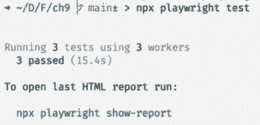
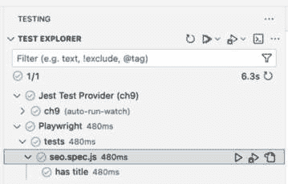
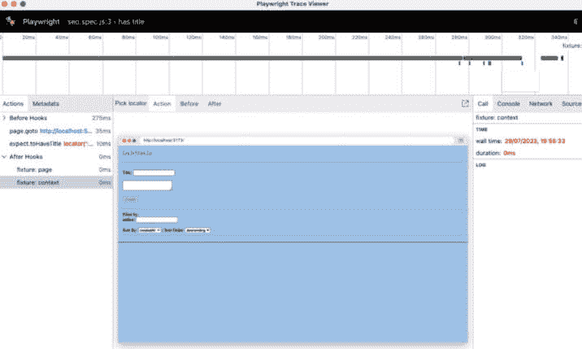
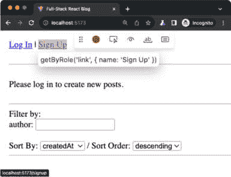
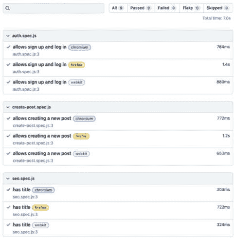
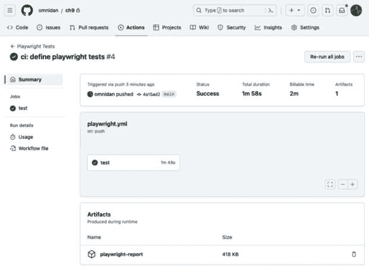

# 9

# 使用 Playwright 实现端到端测试

在前面的章节中，我们已经使用 Jest 为我们的后端编写了单元测试。现在，我们将学习如何使用 Playwright 在我们的用户界面编写和运行端到端测试。首先，我们在项目中设置 Playwright 和 VS Code，以便运行前端测试。然后，我们将为我们的应用程序编写一些前端测试。接下来，我们将了解如何使用 fixtures 重复使用测试设置。最后，我们将学习如何查看测试报告，并使用 GitHub Actions 在 CI 中运行 Playwright。

在本章中，我们将介绍以下主要主题：

+   设置 Playwright 以进行端到端测试

+   编写和运行端到端测试

+   使用 fixtures 重复使用测试设置

+   查看测试报告和在 CI 中运行

# 技术要求

在我们开始之前，请从*第一章**，准备全栈开发*和*第二章**，了解 Node.js*和 MongoDB*中安装所有要求。

那些章节中列出的版本是本书中使用的版本。虽然安装较新版本不应有问题，但请注意，某些步骤在较新版本上可能有所不同。如果您在使用本书中提供的代码和步骤时遇到问题，请尝试使用*第一章*和*第二章*中*技术要求*部分中提到的版本。

您可以在 GitHub 上找到本章的代码：[`github.com/PacktPublishing/Modern-Full-Stack-React-Projects/tree/main/ch9`](https://github.com/PacktPublishing/Modern-Full-Stack-React-Projects/tree/main/ch9).

如果您克隆了本书的完整仓库，当运行 `npm install` 时，Husky 可能找不到 `.git` 目录。在这种情况下，只需在相应章节文件夹的根目录下运行 `git init`。

本章的 CiA 链接可在：[`youtu.be/WjwEwUR8g2c`](https://youtu.be/WjwEwUR8g2c)

# 设置 Playwright 以进行端到端测试

Playwright 是一个测试运行器，用于在各种网页渲染引擎上方便地进行端到端测试，例如 Chromium（Chrome、Edge、Opera 等）、WebKit（Safari）和 Firefox。它可以在 Windows、Linux 和 macOS 上本地或 CI 中运行测试。运行 Playwright 有两种方式：

+   **Headed**：打开一个浏览器窗口，可以看到 Playwright 正在做什么

+   **Headless**：在后台运行渲染引擎，仅在终端或生成的测试报告中显示测试结果

在本章中，我们将探讨运行 Playwright 的两种方式。现在，让我们在我们的项目中安装 Playwright。

## 安装 Playwright

要安装 Playwright，我们可以使用 `npm init playwright`，这将运行一个命令来安装 Playwright，为我们创建一个用于端到端测试的文件夹，添加一个 GitHub Actions 工作流程以在 CI 中运行测试，并安装 Playwright 浏览器以便在多种引擎中运行测试。按照以下步骤安装 Playwright：

1.  将现有的 **ch8** 文件夹复制到新的 **ch9** 文件夹，如下所示：

    ```js
    $ cp -R ch8 ch9
    ```

1.  在 VS Code 中打开 **ch9** 文件夹并打开一个新的终端。

1.  运行以下命令：

    ```js
    $ npm init playwright@1.17.131
    ```

注意

通常，在这里安装最新版本是一个好主意，方法是运行 **npm init playwright@latest**。然而，为了确保即使发布带有破坏性更改的新版本，本书中的说明也是可重复的，我们在这里锁定版本。

1.  当询问是否要继续安装 **create-playwright** 包时，按 *Return/Enter* 确认。然后选择 **JavaScript**。至于目录名，保持 **tests** 的默认名称并按 *Return/Enter* 确认。输入 **y** 以添加 GitHub Actions 工作流程。再次输入 **y** 以安装 Playwright 浏览器。现在将花费一些时间下载和安装不同的浏览器引擎。

1.  我们需要调整一些文件以使 Playwright 能够与 ES 模块一起工作。编辑 **playwright.config.js** 并将文件开头的 **require()** 导入行更改为以下内容：

    ```js
    import { defineConfig, devices } from '@playwright/test'
    ```

1.  同时，将 **module.exports** 的导出更改为以下内容：

    ```js
    export default defineConfig({
    ```

1.  *删除* **tests-examples/** 文件夹和 **tests/example.spec.js** 文件。

安装 Playwright 后，我们需要为端到端测试准备我们的后端，所以现在就来做这件事。

## 准备后端进行端到端测试

为了准备后端进行端到端测试，我们需要启动一个带有内存中 MongoDB 服务器的后端实例，类似于我们为 Jest 测试所做的那样。现在就来做这件事：

1.  创建一个新的 **backend/src/e2e.js** 文件。在文件内部，导入 **dotenv**、**globalSetup** 以及 **app** 和 **initDatabase** 函数：

    ```js
    import dotenv from 'dotenv'
    dotenv.config()
    import globalSetup from './test/globalSetup.js'
    import { app } from './app.js'
    import { initDatabase } from './db/init.js'
    ```

1.  然后，定义一个新的 **async** 函数来运行测试服务器：

    ```js
    async function runTestingServer() {
    ```

1.  在这个函数内部，我们首先运行 **globalSetup** 函数，该函数运行一个内存中的 MongoDB 服务器。然后，初始化数据库并运行 Express 应用程序：

    ```js
      await globalSetup()
      await initDatabase()
      const PORT = process.env.PORT
      app.listen(PORT)
      console.info(`TESTING express server running on http://localhost:${PORT}`)
    }
    ```

1.  最后，我们运行定义好的函数：

    ```js
    runTestingServer()
    ```

1.  编辑 **backend/package.json** 并添加一个新的脚本来运行 **e2e.js** 文件：

    ```js
        "e2e": „node src/e2e.js",
    ```

1.  在项目的根目录中，安装 **concurrently**，这是一个用于并行运行两个命令的工具：

    ```js
    $ npm install --save-dev concurrently@8.2.2
    ```

    我们将使用这个工具并行运行后端和前端。

1.  在项目的根目录中编辑 **package.json** 并定义一个 **e2e** 脚本，该脚本将并行运行 **e2e:client** 和 **e2e:server** 脚本：

    ```js
        "e2e": "concurrently \"npm run e2e:client\" \"npm run e2e:server\"",
    ```

1.  现在，定义 **e2e:client** 脚本，其中我们只是运行预构建的前端：

    ```js
        "e2e:client": "npm run build && npm run start",
    ```

    由于性能原因，我们不运行开发服务器。否则，我们会减慢我们的端到端测试速度。我们在这里可以省略构建脚本，但这样我们必须在运行测试之前记住构建我们的前端，并且我们必须在 CI 中这样做。或者，当本地运行测试时，尤其是当我们只运行某些测试而不是所有测试时，我们可以运行开发服务器而不是构建。

1.  然后，我们定义 **e2e:server** 脚本，该脚本在 **backend** 文件夹中运行 **e2e** 脚本：

    ```js
        "e2e:server": "cd backend/ && npm run e2e",
    ```

1.  编辑**playwright.config.js**并设置**baseURL**，通过更改以下行：

    ```js
      use: {
        /* Base URL to use in actions like `await page.goto('/')`. */
        baseURL: 'http://localhost:5173',
    ```

1.  最后，编辑**playwright.config.js**并将文件底部的**webServer**配置*替换*为以下内容：

    ```js
      webServer: {
        command: 'npm run e2e',
        url: 'http://localhost:5173',
      },
    ```

现在我们已经成功设置了 Playwright 并准备好了后端进行端到端测试，让我们开始编写和运行端到端测试！

# 编写和运行端到端测试

现在我们将使用 Playwright 编写和运行我们的第一个端到端测试。让我们从一个简单的测试开始，这个测试只是验证我们是否已经正确优化了标题以供搜索引擎使用。按照以下步骤编写和运行你的第一个端到端测试：

1.  创建一个新的**tests/seo.spec.js**文件。在这个文件中，我们将检查我们的页面标题是否设置正确。

1.  在这个新创建的文件中，首先从**@playwright/test**导入**test**和**expect**函数：

    ```js
    import { test, expect } from '@playwright/test'
    ```

1.  然后，我们定义一个测试，检查博客的标题是否设置正确：

    ```js
    test('has title', async ({ page }) => {
    ```

    如你所见，`test`函数与我们在 Jest 中定义测试的方式相似。Playwright 还允许我们访问测试中的特殊上下文，称为`page`。`page`是 Playwright 中最基本的固定装置，允许我们访问浏览器功能和与页面交互。

1.  在测试中，我们首先使用**page.goto**函数导航到我们的前端 URL：

    ```js
      await page.goto('/')
    ```

1.  然后，我们使用**expect**函数来检查页面是否显示了正确的标题：

    ```js
      await expect(page).toHaveTitle('Full-Stack React Blog')
    })
    ```

    如我们所见，Playwright 的语法与 Jest 非常相似。我们还有一个`expect`函数来进行断言，例如检查页面是否有特定的标题。

1.  在运行测试之前，请确保**dbserver**Docker 容器正在运行。

1.  我们现在可以通过打开一个新的终端并执行以下命令来运行这个测试：

    ```js
    ch9 folder), and not inside the backend folder, when running this command!
    ```

你会看到 Playwright 在我们的测试中运行了三次（在 Chromium、Firefox 和 Webkit 上），并且所有测试都成功通过。以下截图显示了在命令行中运行 Playwright 的结果：



图 9.1 – 在 Playwright 中运行我们的第一个测试！

现在我们已经成功执行了测试，让我们继续使用 VS Code 扩展运行测试。

## 使用 VS Code 扩展

我们可以通过 VS Code 扩展运行特定的测试（或所有测试），而不是手动通过命令行运行所有测试，这与我们对 Jest 所做的方式类似。此外，该扩展还允许我们获得测试成功（或失败）的视觉概述，允许我们在浏览器中运行时检查测试，甚至可以记录我们在浏览器中的交互并从中生成测试！

让我们先设置 VS Code 扩展并从中运行我们的测试：

1.  在 VS Code 中打开**扩展**选项卡并搜索**Playwright**。

1.  点击**安装**按钮通过 Microsoft 安装**Playwright Test for VS Code**。

1.  在 VS Code 中点击**测试**选项卡（flask 图标），我们之前也用它来使用 Jest 扩展。在这里，您现在将看到列表中的**Jest**和**Playwright**。

1.  展开到**Playwright** | **tests**路径，点击**seo.spec.js**来加载文件，然后点击**seo.spec.js**旁边的**运行**图标来运行测试。

如以下截图所示，测试已成功执行，所有测试都通过：



图 9.2 – 我们从 VS Code 扩展中成功运行的剧作家测试！

现在我们已经在无头模式下成功运行了 VS Code 扩展中的测试，让我们继续在带头模式下运行它们，这样我们可以在运行测试时显示浏览器中 Playwright 正在做什么。

### 在运行测试时显示浏览器

Playwright VS Code 扩展还有一个有用的**显示浏览器**选项，在运行测试时打开浏览器。这允许我们在测试运行时调试测试或前端。现在让我们试试：

1.  在**测试**侧边栏的底部，勾选侧边栏底部的**显示浏览器**复选框，然后再次运行测试。

    将打开一个浏览器窗口并运行测试。然而，我们的测试非常快且简单，所以它会在很短的时间内运行，没有太多可看。

1.  为了更好地检查测试，我们可以使用跟踪查看器。在**测试**侧边栏的底部勾选**显示跟踪查看器**，然后再次运行测试。您将看到以下窗口打开：



图 9.3 – Playwright 跟踪查看器

如我们所见，Playwright 跟踪查看器显示测试运行了`page.goto`然后`expect.toHaveTitle`。它还显示了测试的每个步骤中的应用程序状态。在我们的例子中，我们只有一个步骤。这个功能在开发更大、更复杂的测试时特别有用。

注意

还可以在 UI 模式下运行 Playwright，这将在单独的窗口中打开 Playwright 应用程序，允许我们单独运行测试并观察它们的执行，类似于在 VS Code 扩展中使用**显示跟踪查看器**功能。您可以通过执行以下命令在 UI 模式下运行 Playwright：**npx playwright test --ui**

现在我们已经了解了如何使用扩展来运行测试，我们可以继续到扩展的一个非常有用的功能：记录操作以创建一个新的测试。现在让我们来做这件事。

### 记录测试

Playwright 扩展还可以记录新的测试。现在让我们使用 VS Code 扩展的测试录制功能为注册页面创建一个新的测试：

1.  与运行 Playwright 测试不同，测试录制器不会自动启动我们的前端和后端，因此我们首先需要手动启动它们。打开一个新的终端并执行以下命令：

    ```js
    $ npm run e2e
    ```

1.  在**测试**侧边栏的底部部分，点击**记录新**。应该会打开一个浏览器窗口。

1.  在浏览器窗口中，将**http://localhost:5173/**粘贴到 URL 栏中，导航到前端。



图 9.4 – 当悬停在“注册”链接上时的 Playwright 测试记录器

1.  然后，点击**注册**链接。注册页面应该会打开。

1.  在这个新页面上，输入用户名和密码；例如，**test**和**test**。然后按**注册**按钮。

1.  您将被重定向到登录页面。现在，使用之前相同的用户名和密码登录。

1.  您将被重定向到主页，并以**test**身份登录。现在您可以关闭浏览器窗口。您会看到在 VS Code 中现在有一个新的**test-1.spec.ts**文件，其中包含我们在浏览器中刚刚执行的所有操作！

1.  保存文件并退出正在运行后端和前端的**e2e**脚本。现在您将在**测试**侧边栏中看到**test-1.spec.ts**文件。如果您尝试运行测试，您会注意到它在登录部分卡住了，因为我们的测试目前还没有等待重定向到登录页面。

虽然记录测试是一个有用的功能，可以加快编写端到端测试的速度，但它并不能总是为我们编写功能测试。我们现在需要清理我们的记录测试并向其中添加断言。

仅供参考，以下是 Playwright 测试记录器生成的完整代码：

```js
import { test, expect } from '@playwright/test'
test('test', async ({ page }) => {
  await page.goto('http://localhost:5173/')
  await page.getByRole('link', { name: 'Sign Up' }).click()
  await page.getByLabel('Username:').click()
  await page.getByLabel('Username:').fill('test')
  await page.getByLabel('Password:').click()
  await page.getByLabel('Password:').fill('test')
  await page.getByRole('button', { name: 'Sign Up' }).click()
  await page.getByLabel('Username:').click()
  await page.getByLabel('Username:').fill('test')
  await page.getByLabel('Password:').click()
  await page.getByLabel('Password:').fill('test')
  await page.getByRole('button', { name: 'Log In' }).click()
})
```

现在我们已经记录了一个测试，让我们清理它以使其正常运行。

### 清理并最终确定记录的测试

如果您查看测试，您会看到它包含了我们在浏览器中执行的所有操作，但它并没有验证我们是否成功登录。它也没有等待页面加载完成，并且一些匹配器没有匹配正确的文本。让我们现在修复这些问题：

1.  将**tests/test-1.spec.ts**重命名为**tests/auth.spec.js**。

1.  编辑**tests/auth.spec.js**并将测试重命名为**allows sign up and** **log in**：

    ```js
    test('allows sign up and log in', async ({ page }) => {
    ```

1.  我们需要定义一个唯一的用户名，以便能够在不重启后端以清除 MongoDB 内存服务器的情况下多次运行我们的测试：

    ```js
      const testUser = 'test' + Date.now()
    ```

注意

重要的是不要使用相同的用户名注册两次，因为内存中的 MongoDB 数据库被所有测试重用。确保测试可以独立运行，不要依赖于其他测试文件中的数据，因为测试文件可能会以任何顺序运行。单个测试文件内的顺序是保证的。使用**Date.now()**返回当前时间的毫秒数，只要我们不过度并行运行太多测试，它就基本上是防碰撞的。为了获得更安全的防碰撞解决方案，您可以使用 UUID 生成器。

1.  将**page.goto()**的 URL 更改为**/**，以确保它使用我们之前设置的**baseURL**：

    ```js
      await page.goto('/')
    ```

1.  在注册时填写生成的用户名：

    ```js
      await page.getByLabel('Username:').fill(testUser)
    ```

1.  在点击 **注册** 按钮后，使用以下函数等待 URL 更新：

    ```js
      await page.getByRole('button', { name: 'Sign Up' }).click()
      await page.waitForURL('**/login')
    ```

    等待下一页加载是必要的，因为当前录制不支持页面加载检测，否则它会在旧页面上或重定向期间触发命令，这会导致测试失败。

1.  对于登录，我们也会填写生成的用户名：

    ```js
      await page.getByLabel('Username:').fill(testUser)
    ```

1.  之后，让测试点击 **登录** 按钮并等待 URL 再次更新：

    ```js
      await page.getByRole('button', { name: 'Log In' }).click()
      await page.waitForURL('**/')
    ```

1.  为了更方便地匹配 **Header** React 组件，编辑 **src/components/Header.jsx** 并将 **<div>** 元素转换为 **<nav>** 元素：

    ```js
    export function Header() {
      const [token, setToken] = useAuth()
      if (token) {
        const { sub } = jwtDecode(token)
        return (
          <nav>
            Logged in as <User id={sub} />
            <br />
            <button onClick={() => setToken(null)}>Logout</button>
          </nav>
        )
      }
      return (
        <nav>
          <Link to='/login'>Log In</Link> | <Link to='/signup'>Sign Up</Link>
        </nav>
      )
    }
    ```

1.  在测试结束时，我们现在添加一个断言来检查 Header（**<nav>** 元素）是否包含文本 **Logged in as** 和生成的用户名：

    ```js
      await expect(page.locator('nav')).toContainText('Logged in as ' + testUser)
    })
    ```

    使用 `toContainText` 而不是 `toHaveText` 确保文本不必与提供的字符串完全匹配。在我们的例子中，是 `<nav>` 元素，所以完整的文本将是 **Logged in** **as testXXXXLogout**。

1.  使用 VS Code 扩展或通过在终端中运行 **npx playwright test** 命令（根据你的喜好）运行测试，你现在会看到它已经成功通过！

注意

如果测试没有成功执行，你可能不小心记录了一些额外的操作并且没有正确清理。将你的测试与本书提供的代码示例进行比较，以确保测试被正确定义并清理。

现在我们已经知道了在 Playwright 中定义基本测试的工作方式，让我们学习如何使用固定装置进行可重复的测试设置。

# 使用固定装置的可重复测试设置

在创建认证测试后，你可能正在想：如果我想定义一个创建新帖子的测试怎么办？我们首先必须注册，然后登录，然后创建帖子。这相当繁琐，并且随着测试变得越来越复杂，定义测试也会变得越来越繁琐。幸运的是，Playwright 为这类问题提供了解决方案。Playwright 引入了一个称为固定装置的概念，它是测试的上下文，可以包含可重复使用的函数。例如，我们可以定义一个 `auth` 固定装置，为所有测试提供注册和登录函数。

当我们使用 Jest 时，我们使用 before/after 钩子来为多个测试准备公共环境。固定装置相对于 before/after 钩子有一些优势。主要的是，它们将设置和清理封装在同一个地方，并且可以在测试文件之间重复使用，可组合，并且更灵活。此外，固定装置是按需提供的，这意味着 Playwright 将只为运行某个特定测试设置必要的固定装置。

Playwright 还包含一些开箱即用的固定装置，我们现在将要学习这些内容。

## 内置固定装置概述

Playwright 随带一些内置固定装置，其中之一我们已经学习过：`page` 固定装置。我们现在将简要介绍 Playwright 提供的一些最重要的内置固定装置：

+   **浏览器**：允许控制浏览器功能，例如打开新页面

+   **browserName**：包含当前运行测试的浏览器的名称

+   **page**：迄今为止最重要的内置固定装置，用于控制与页面的交互、访问 URL、匹配元素、执行操作等

+   **上下文**：当前测试运行的独立上下文

+   **请求**：用于从 Playwright 发送 API 请求

现在我们已经了解了 Playwright 提供的内置固定装置，让我们继续定义我们自己的固定装置。

## 编写我们自己的固定装置

注册和登录是我们将在端到端测试中经常需要执行的操作，因此它们是创建固定装置的完美案例。按照以下步骤创建一个新的 `auth` 固定装置：

1.  创建一个新的 **tests/fixtures/** 文件夹。

1.  在其中，创建一个新的 **tests/fixtures/AuthFixture.js** 文件，在那里我们定义一个 **AuthFixture** 类：

    ```js
    export class AuthFixture {
    ```

1.  这个类将在构造函数中接收 **page** 固定装置：

    ```js
      constructor(page) {
        this.page = page
      }
    ```

1.  定义一个 **signUpAndLogIn** 方法，该方法遵循 auth 测试中的操作以生成一个唯一的用户名，然后注册并登录用户：

    ```js
      async signUpAndLogIn() {
        const testUser = 'test' + Date.now()
        await this.page.goto('/signup')
        await this.page.getByLabel('Username:').fill(testUser)
        await this.page.getByLabel('Password:').fill('password')
        await this.page.getByRole('button', { name: 'Sign Up' }).click()
        await this.page.waitForURL('**/login')
        await this.page.getByLabel('Username:').fill(testUser)
        await this.page.getByLabel('Password:').fill('password')
        await this.page.getByRole('button', { name: 'Log In' }).click()
        await this.page.waitForURL('**/')
        return testUser
      }
    }
    ```

1.  创建一个新的 **tests/fixtures/index.js** 文件。在其中，从 Playwright 导入 **test** 函数（将其重命名为 **baseTest**）和刚刚定义的 **AuthFixture**：

    ```js
    import { test as baseTest } from '@playwright/test'
    import { AuthFixture } from './AuthFixture.js'
    ```

1.  然后，定义并导出一个新的 **test** 函数，通过在其中定义一个新的 **auth** 固定装置来扩展 Playwright 的 **baseTest** 函数：

    ```js
    export const test = baseTest.extend({
      auth: async ({ page }, use) => {
        const authFixture = new AuthFixture(page)
        await use(authFixture)
      },
    })
    ```

小贴士

在调用 **use()** 函数之前，也可以对固定装置上下文进行额外的设置，在调用之后进行额外的清理。这可以用于，例如，在执行测试之前创建一组示例帖子，然后在测试之后再次删除它们。如果后端有删除用户的方法，在使用固定装置后创建一个临时用户，并在使用固定装置后再次删除创建的用户名，将是一个更好的选项来处理用户名冲突的问题。

1.  此外，重新导出 Playwright 的 **expect** 函数，以便更容易从我们的固定装置中导入：

    ```js
    export { expect } from '@playwright/test'
    ```

现在我们已经定义了我们的自定义固定装置，让我们在创建新测试时使用它！

## 使用自定义固定装置

我们现在将定义一个创建新帖子的端到端测试。要创建帖子，我们需要登录，以便我们可以使用我们的 `auth` 固定装置来准备环境。按照以下步骤定义新测试并使用我们的自定义固定装置：

1.  创建一个新的 **tests/create-post.spec.js** 文件。为了使用自定义固定装置，我们现在需要从 **fixtures/index.js** 文件中导入 **test** 和 **expect** 函数：

    ```js
    import { test, expect } from './fixtures/index.js'
    ```

1.  定义一个新的测试来验证帖子创建功能，使用 **page** 和 **auth** 固定装置：

    ```js
    test('allows creating a new post', async ({ page, auth }) => {
    ```

1.  我们现在可以使用自定义 **auth** 固定装置中的 **signUpAndLogIn** 方法来创建和登录新用户：

    ```js
      const testUser = await auth.signUpAndLogIn()
    })
    ```

1.  我们可以再次使用 Playwright 代码生成来记录我们的测试。首先，保存文件并启用 **Show** **browser** 执行 **create-post.spec.js** 测试。

1.  然后，在调用**auth.signUpAndLogIn**函数后创建一个新行，并按**光标处**的**Record**。

1.  现在我们可以从已经打开的浏览器窗口（也已经登录，因为已经调用了固定装置方法！）中记录操作。点击标题字段，将**Test Post**作为帖子标题输入，然后按*Tab*键跳到下一个字段，输入**Hello World**作为帖子内容，然后再次按*Tab*键并按*Return/Enter*键创建一个新的帖子。

注意

实际上并没有创建帖子，因为 Playwright 在运行完毕后立即关闭了后端，所以在录制时后端已经关闭。如果你想在后端运行时录制，请探索**playwright.config.js**中的**webServer.reuseExistingServer**设置。

1.  返回到文件，你会看到所有操作都已正确记录！以下代码应该已被记录：

    ```js
      await page.getByLabel('Title:').click()
      await page.getByLabel('Title:').fill('Test Post')
      await page.getByLabel('Title:').press('Tab')
      await page.locator('textarea').fill('Hello World!')
      await page.locator('textarea').press('Tab')
      await page.getByRole('button', { name: 'Create' }).press('Enter')
    ```

1.  现在，我们只需要添加一个检查以确保帖子已成功创建：

    ```js
      await expect(page.getByText(`Test PostWritten by ${testUser}`)).toBeVisible()
    })
    ```

    由于我们控制测试环境，检查文本**Test PostWritten by testXXX**（在“Post”和“Written”之间没有空格）在页面上可见就足够了。这将告诉我们帖子已在列表中创建。

1.  运行测试，你会看到它成功通过！

我们可以为处理帖子（创建、编辑、删除）创建额外的固定装置，并使用这些装置，例如，验证单个帖子的链接是否正常工作并相应地调整标题。然而，像这样扩展端到端测试与我们已经做过的类似，因此留作你的练习。

# 查看测试报告和在 CI 中运行

在成功创建我们博客应用的端到端测试之后，让我们通过学习如何查看 HTML 测试报告以及如何在 CI 中运行 Playwright 来结束本章。

## 查看 HTML 报告

Playwright 会自动生成测试运行的 HTML 报告。我们可以通过执行以下命令来运行所有测试：

```js
$ npx playwright test
```

然后，运行以下命令来提供和查看最后一次运行的 HTML 报告：

```js
$ npx playwright show-report
```

报告应在新的浏览器窗口中打开，如下所示：



图 9.5 – 由 Playwright 生成的 HTML 测试报告

如我们所见，我们的三个测试在所有三个浏览器上成功运行。点击其中一个测试运行，以查看所有执行测试步骤的详细信息。

## 在 CI 中运行 Playwright 测试

当我们初始化 Playwright 时，我们被问及是否想要生成一个 GitHub Actions CI 文件。我们同意了，因此 Playwright 自动在`.github/workflows/playwright.yml`文件中为我们生成了一个 CI 配置。此工作流程会检出仓库，安装所有依赖项，安装 Playwright 浏览器，运行所有 Playwright 测试，然后将报告作为工件上传，以便可以从 CI 运行中查看。我们仍然需要调整 CI 工作流程，以便也安装后端依赖项，所以现在让我们来做这件事：

1.  编辑**.github/workflows/playwright.yml**，并向其中添加以下步骤：

    ```js
          - name: Install dependencies
            run: npm ci
          - name: Install backend dependencies
    npm ci command ensures that the project already has a package-lock.json file and does not write a lock file, ensuring a clean state for CI to run on.
    ```

1.  将所有内容添加、提交并推送到 GitHub 仓库，以查看 Playwright 在 CI 中的运行情况。

注意

确保仅从**ch9**文件夹的内容（而不是整个**Full-Stack-React-Projects**文件夹）创建一个新的仓库，否则 GitHub Actions 将无法检测到**.****github**文件夹。

1.  前往 GitHub，点击**操作**标签，在侧边栏中选择**Playwright Tests**工作流程，然后点击最新的工作流程运行。

1.  在运行的底部，有一个**工件**部分，其中包含一个**playwright-report**对象，可以下载以查看 HTML 报告。

以下截图显示了在 GitHub Actions 中运行的 Playwright 测试，报告作为工件提供：



图 9.6 – 在 GitHub Actions 中运行的 Playwright

如我们所见，通过提供的模板在 CI 中运行 Playwright 既简单又直接。

# 摘要

在本章中，我们学习了如何使用 Playwright 进行端到端测试。我们首先在我们的项目中设置 Playwright，并为端到端测试准备了我们的后端。然后，我们编写并运行了我们的第一个测试。接下来，我们学习了关于固定装置的内容，以便创建可重用的测试上下文。最后，我们查看了生成的 HTML 报告，并设置了 CI 以运行 Playwright，生成报告，并将其作为工件保存在管道中。

在下一章*第十章**，使用 MongoDB 和 Victory 聚合和可视化统计信息*，我们将学习如何使用 MongoDB 聚合数据，并通过后端公开这些聚合数据。然后，我们将在前端消费这些聚合数据，并使用 Victory 和各种可视化类型来可视化它。
