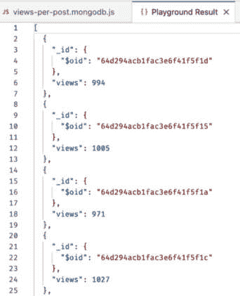
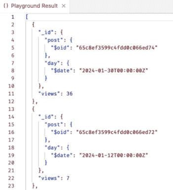
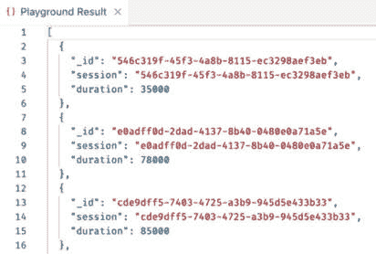
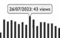
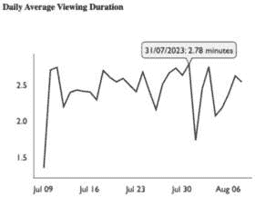

# 第十章：使用 MongoDB 和 Victory 聚合和可视化统计数据

在本章中，我们将学习如何使用 MongoDB 和 Victory 收集、聚合和可视化博客应用的统计数据。我们首先学习如何从查看博客帖子的用户那里收集事件。然后，我们随机生成一些事件以获得可工作的数据集。我们使用这个数据集来学习如何使用 MongoDB 聚合数据并生成汇总统计数据，例如每篇帖子的观看次数或平均会话持续时间。这类信息将帮助作者了解他们的帖子表现如何。最后，我们使用 Victory 库创建一些图表来可视化这些聚合统计数据。

在本章中，我们将涵盖以下主要主题：

+   收集和模拟事件

+   使用 MongoDB 聚合数据

+   在后端实现数据聚合

+   使用 Victory 在前端集成和可视化数据

# 技术要求

在开始之前，请从 *第 1* 章准备全栈开发 和 *第 2* 章了解 Node.js 及 MongoDB 安装所有要求。

那些章节中列出的版本是书中使用的版本。虽然安装较新版本可能不会有问题，但请注意，某些步骤在较新版本上可能有所不同。如果您在使用本书提供的代码和步骤时遇到问题，请尝试使用第 *1* 章和 *2* 章中提到的版本。*第 1* 章和 *第 2* 章分别介绍了*为全栈开发做准备*和*了解 Node.js 及 MongoDB*。

您可以在 GitHub 上找到本章的代码：[`github.com/PacktPublishing/Modern-Full-Stack-React-Projects/tree/main/ch10`](https://github.com/PacktPublishing/Modern-Full-Stack-React-Projects/tree/main/ch10)。

如果您克隆了本书的完整仓库，当运行 `npm install` 时，Husky 可能找不到 `.git` 目录。在这种情况下，只需在相应章节文件夹的根目录下运行 `git init`。

本章的 CiA 视频可以在以下网址找到：[`youtu.be/DmSq2P_IQQs`](https://youtu.be/DmSq2P_IQQs)。

# 收集和模拟事件

在我们开始聚合和可视化统计数据之前，我们首先需要收集（稍后模拟）事件，我们将使用这些事件来创建统计数据。我们将首先考虑我们想要收集哪些数据，以及哪些数据对我们有用。现在我们将专注于帖子观看，因此我们希望按以下方式显示每篇帖子的统计数据：

+   帖子的总观看次数

+   帖子的每日观看次数

+   帖子的每日平均观看时长

让我们先创建一个事件数据库模型，这将使我们能够展示这些统计数据。

## 创建事件模型

为了创建这些统计数据，我们需要从用户那里收集事件。事件将包含对帖子的引用、用于跟踪同一观看事件的会话 ID、一个动作（开始观看、结束观看）以及事件发生的时间。

让我们开始定义事件的数据库模型：

1.  将现有的 **ch9** 文件夹复制到一个新的 **ch10** 文件夹中，如下所示：

    ```js
    $ cp -R ch9 ch10
    ```

1.  在 VS Code 中打开 **ch10** 文件夹。

1.  创建一个新的 **backend/src/db/models/event.js** 文件。在此文件中，定义一个包含对帖子引用的模式：

    ```js
    import mongoose, { Schema } from 'mongoose'
    const eventsSchema = new Schema(
      {
        post: { type: Schema.Types.ObjectId, ref: 'post', required: true },
    ```

1.  然后定义 **session**、**action** 和 **date**：

    ```js
        session: { type: String, required: true },
        action: { type: String, required: true },
        date: { type: Date, required: true },
      },
      { timestamps: true },
    )
    ```

1.  最后，导出模型：

    ```js
    export const Event = mongoose.model('events', eventsSchema)
    ```

现在我们已经定义了数据库模型，让我们继续定义一个服务函数和路由来跟踪事件。

## 定义一个服务函数和路由来跟踪事件

现在我们已经成功定义了事件的数据库模型，让我们创建一个服务函数和路由来跟踪新事件，如下所示：

1.  为了生成会话 ID，我们将使用 **uuid** 库，它为我们生成 **全球唯一标识符（UUIDs）**。通过运行以下命令来安装它：

    ```js
    $ cd backend/
    $ npm install uuid@9.0.1
    ```

1.  创建一个新的 **backend/src/services/events.js** 文件。在此文件中，从 **uuid** 中导入 **v4** 函数和 **Event** 模型，并定义一个创建新事件文档的函数，如下所示：

    ```js
    import { v4 as uuidv4 } from 'uuid'
    import { Event } from '../db/models/event.js'
    export async function trackEvent({
      postId,
      action,
      session = uuidv4(),
      date = Date.now(),
    }) {
      const event = new Event({ post: postId, action, session, date })
      return await event.save()
    }
    ```

    在函数的参数中，我们将默认的会话 ID 设置为随机生成的 UUID，并将日期设置为当前日期。

1.  创建一个新的 **backend/src/routes/events.js** 文件。在此文件中，导入 **trackEvent** 函数和 **getPostById** 函数：

    ```js
    import { trackEvent } from '../services/events.js'
    import { getPostById } from '../services/posts.js'
    ```

1.  定义一个新的 **POST /api/v1/events** 路由，其中我们从请求体中获取 **postId**、**session** 和 **action**：

    ```js
    export function eventRoutes(app) {
      app.post('/api/v1/events', async (req, res) => {
        try {
          const { postId, session, action } = req.body
    ```

1.  然后，我们检查给定 ID 的帖子是否存在于数据库中。如果不存在，我们返回一个 **400 Bad Request** 状态码：

    ```js
          const post = await getPostById(postId)
          if (post === null) return res.status(400).end()
    ```

1.  如果帖子存在，我们获取会话 ID 并使用 **trackEvent** 函数创建一个新的事件：

    ```js
          const event = await trackEvent({ postId, session, action })
          return res.json({ session: event.session })
        } catch (err) {
          console.error('error tracking action', err)
          return res.status(500).end()
        }
      })
    }
    ```

1.  编辑 **backend/src/app.js** 并导入 **eventRoutes**：

    ```js
    import { eventRoutes } from './routes/events.js'
    ```

1.  然后将路由挂载到应用上：

    ```js
    postRoutes(app)
    userRoutes(app)
    eventRoutes(app)
    ```

1.  按照以下方式启动后端（并保持运行以供未来开发使用）：

    ```js
    $ cd backend/
    $ npm run dev
    ```

现在我们已经成功定义了一个后端路由来跟踪事件，让我们在前端实现事件收集。

## 在前端收集事件

在定义好路由之后，让我们为前端创建一个 API 函数，并定义一种跟踪用户何时开始和结束查看帖子的方法。按照以下步骤在前端收集事件：

1.  创建一个新的 **src/api/events.js** 文件，并定义一个 **postTrackEvent** 函数，它接受一个事件对象并将其发送到之前定义的路由：

    ```js
    export const postTrackEvent = (event) =>
      fetch(`${import.meta.env.VITE_BACKEND_URL}/events`, {
        method: 'POST',
        headers: {
          'Content-Type': 'application/json',
        },
        body: JSON.stringify(event),
      }).then((res) => res.json())
    ```

1.  编辑 **src/pages/ViewPost.jsx** 并导入 **useEffect**、**useState** 和 **useMutation** 钩子：

    ```js
    import { useEffect, useState } from 'react'
    import { useQuery, useMutation } from '@tanstack/react-query'
    ```

1.  此外，导入 **postTrackEvent** API 函数：

    ```js
    import { postTrackEvent } from '../api/events.js'
    ```

1.  现在，在 **ViewPost** 函数内部，定义一个新的状态钩子来存储会话 ID，以及一个突变来跟踪事件。当事件成功跟踪后，我们从后端获取会话 ID，并将其存储在状态钩子中：

    ```js
      const [session, setSession] = useState()
      const trackEventMutation = useMutation({
        mutationFn: (action) => postTrackEvent({ postId, action, session }),
        onSuccess: (data) => setSession(data?.session),
      })
    ```

1.  然后，定义一个新的效果钩子，在用户打开帖子后一秒跟踪一个**startView**事件（以防止跟踪意外事件，例如快速刷新），当效果钩子卸载时跟踪**endView**事件。我们不给它任何依赖项，以确保效果钩子仅在页面挂载和卸载时触发：

    ```js
      useEffect(() => {
        let timeout = setTimeout(() => {
          trackEventMutation.mutate('startView')
          timeout = null
        }, 1000)
        return () => {
          if (timeout) clearTimeout(timeout)
          else trackEventMutation.mutate('endView')
        }
      }, [])
    ```

1.  按照以下步骤启动前端（并保持运行以供未来开发使用）：

    ```js
    ch10 folder, not inside the backend folder.
    ```

如果你现在在浏览器中打开一个帖子并查看是否跟踪了`startView`事件。当我们离开页面时，会跟踪`endView`事件。

让我们现在继续模拟事件，以便我们以后有更多数据可以聚合和可视化。

## 模拟事件

模拟事件是生成用于测试聚合和可视化的样本数据的好方法。在我们的模拟中，我们首先从数据库中清除所有当前用户，然后创建一组样本用户。我们对帖子重复相同的步骤，然后对事件进行模拟，模拟一个随机用户创建帖子，以及有人随机查看随机帖子一段时间。

按照以下步骤实现模拟：

1.  首先，我们应该更改数据库以避免丢失我们在其他章节中创建的任何数据。编辑**backend/.env**并将以下行从**blog**更改为**blog-simulated**：

    ```js
    DATABASE_URL=mongodb://localhost:27017/blog-simulated
    ```

1.  现在，创建一个新的**backend/simulateEvents.js**文件，在其中我们导入**dotenv**、**initDatabase**函数以及所有相关的模型和服务函数：

    ```js
    import dotenv from 'dotenv'
    dotenv.config()
    import { initDatabase } from './src/db/init.js'
    import { Post } from './src/db/models/post.js'
    import { User } from './src/db/models/user.js'
    import { Event } from './src/db/models/event.js'
    import { createUser } from './src/services/users.js'
    import { createPost } from './src/services/posts.js'
    import { trackEvent } from './src/services/events.js'
    ```

1.  定义模拟的开始时间，这里设置为 30 天前（30 天 * 24 小时 * 60 分钟 * 60 秒 * 1000 毫秒），以及结束时间，即现在：

    ```js
    const simulationStart = Date.now() - 1000 * 60 * 60 * 24 * 30
    const simulationEnd = Date.now()
    ```

1.  我们还定义了要模拟的用户、帖子数和查看次数：

    ```js
    const simulatedUsers = 5
    const simulatedPosts = 10
    const simulatedViews = 10000
    ```

1.  然后，定义**simulateEvents**函数，在其中我们首先初始化数据库：

    ```js
    async function simulateEvents() {
      const connection = await initDatabase()
    ```

1.  接下来，*删除*所有现有用户，并通过初始化一个包含要模拟的用户数的空数组并映射它来创建新用户：

    ```js
      await User.deleteMany({})
      const createdUsers = await Promise.all(
        Array(simulatedUsers)
          .fill(null)
          .map(
            async (_, u) =>
              await createUser({
                username: `user-${u}`,
                password: `password-${u}`,
              }),
          ),
      )
      console.log(`created ${createdUsers.length} users`)
    ```

信息

**Array(X)**函数可以用来创建一个包含**X**个条目的数组，然后需要用初始值填充它，才能对其进行迭代。

1.  现在，为帖子重复相同的步骤：

    ```js
      await Post.deleteMany({})
      const createdPosts = await Promise.all(
        Array(simulatedPosts)
          .fill(null)
          .map(async (_, p) => {
            const randomUser =
              createdUsers[Math.floor(Math.random() * simulatedUsers)]
            return await createPost(randomUser._id, {
              title: `Test Post ${p}`,
              contents: `This is a test post ${p}`,
            })
          }),
      )
      console.log(`created ${createdPosts.length} posts`)
    ```

信息

我们使用**Math.floor(Math.random() * maxNumber)**来创建一个介于**0**和**maxNumber**（不包括**maxNumber**）之间的随机整数，这对于索引数组是完美的。

1.  最后，我们对事件重复相同的步骤：

    ```js
      await Event.deleteMany({})
      const createdViews = await Promise.all(
        Array(simulatedViews)
          .fill(null)
          .map(async () => {
            const randomPost =
              createdPosts[Math.floor(Math.random() * simulatedPosts)]
    ```

1.  在这里，我们在定义的模拟日期内随机开始会话：

    ```js
            const sessionStart =
              simulationStart + Math.random() * (simulationEnd - simulationStart)
    ```

1.  然后我们随机在 0 到 5 分钟之后结束：

    ```js
            const sessionEnd =
              sessionStart + 1000 * Math.floor(Math.random() * 60 * 5)
    ```

1.  现在，我们通过创建一个**startView**事件来模拟事件收集：

    ```js
            const event = await trackEvent({
              postId: randomPost._id,
              action: 'startView',
              date: new Date(sessionStart),
            })
    ```

1.  然后我们模拟一个**endView**事件，其中我们使用从第一个事件返回的会话 ID：

    ```js
            await trackEvent({
              postId: randomPost._id,
              session: event.session,
              action: 'endView',
              date: new Date(sessionEnd),
            })
          }),
      )
      console.log(`successfully simulated ${createdViews.length} views`)
    ```

1.  最后，我们从数据库断开连接并调用函数：

    ```js
      await connection.disconnect()
    }
    simulateEvents()
    ```

1.  我们的模拟现在已准备好使用！执行以下命令以启动它：

    ```js
    $ cd backend/
    $ node simulateEvents.js
    ```

你会看到模拟首先创建 5 个用户，然后是 10 个帖子，最后模拟了 10,000 次查看。

在下一节中，我们将使用这个数据集来尝试使用 MongoDB 进行一些聚合操作！

# 使用 MongoDB 聚合数据

有时候，我们不仅仅想要简单地从数据库中检索数据，而是想要通过组合和汇总数据来创建一些统计数据。这个过程称为 **数据聚合**，它可以帮助我们更好地了解数据。例如，我们可以计算每篇帖子的总浏览量，获取每篇帖子的每日浏览量，或者计算查看帖子时的平均会话时长。

MongoDB 支持使用集合上的 `.aggregate()` 函数进行特殊聚合语法。使用 MongoDB 的聚合功能允许我们高效地查询和处理文档。它提供的操作类似于可以使用 **结构化查询语言**（**SQL**）查询完成的操作。我们主要将使用以下聚合操作：

+   **$match**：用于过滤文档

+   **$group**：用于按某个属性对文档进行分组

+   **$project**：用于将属性映射到不同的属性，或对其进行处理

+   **$sort**：用于对文档进行排序

信息

MongoDB 提供了许多更高级的聚合操作，所有这些都可以在他们的文档中找到（[`www.mongodb.com/docs/manual/aggregation/`](https://www.mongodb.com/docs/manual/aggregation/))。他们也在不断添加更多操作，使聚合功能更加强大。

`aggregate` 函数通过提供一个对象数组来工作，每个对象定义了 **聚合管道** 的一个 **阶段**。我们将通过实际使用它们来学习本章中的聚合，以了解更多关于聚合的信息。

## 获取每篇帖子的总浏览量

我们将要定义的第一个聚合是获取每篇帖子的总浏览量的方法。对于这样的聚合，我们需要 `$match` 来过滤所有 `startView` 动作（否则我们会重复计算浏览量，因为每个博客帖子的查看都有一个 `endView` 动作），以及 `$group` 来按帖子 ID 分组结果，然后使用 `$count` 返回文档数量。

按照以下步骤创建您的第一个聚合管道：

1.  为我们的游乐场脚本创建一个新的 **backend/playground/** 文件夹。

1.  在 VS Code 的侧边栏中点击 MongoDB 扩展（叶子图标）。

1.  连接到数据库，然后展开 **Playgrounds** 部分（如果尚未展开），然后点击 **创建新** **Playground** 按钮。

    将打开一个新文件，其中已经预定义了一些代码。*删除*所有预定义的代码，因为我们将要*替换*它们为我们自己的代码。

1.  首先，定义 **use** 和 **db** 全局变量，MongoDB 游乐场为我们提供了这些变量：

    ```js
    /* global use, db */
    ```

1.  然后，使用 **blog-simulated** 数据库：

    ```js
    use('blog-simulated')
    ```

1.  现在，执行以下聚合函数：

    ```js
    db.getCollection('events').aggregate([
    ```

1.  管道的第一阶段将是匹配所有 **startView** 动作：

    ```js
      {
        $match: { action: 'startView' },
      },
    ```

1.  然后，我们按 post 进行分组。**$group** 阶段要求我们定义一个 **_id**，它包含要分组的属性。我们需要使用 **$** 操作符来解析要使用的变量，因此 **$post** 将访问 **event.post** 属性（它包含一个帖子 ID）：

    ```js
      {
        $group: {
          _id: '$post',
          views: { $count: {} },
        },
      },
    ])
    ```

1.  将脚本保存为 **backend/playground/views-per-post.mongodb.js** 文件。

1.  点击右上角的 **Play** 图标来运行脚本。将打开一个新标签页，显示聚合的结果：



图 10.1 – 我们第一个 MongoDB 聚合结果！

在创建和执行了我们的第一个简单聚合之后，让我们通过编写更高级的聚合来继续练习。

## 获取每帖每日的查看次数

既然我们已经熟悉了编写 MongoDB 聚合的一般过程，让我们尝试编写一个更复杂的聚合：获取每帖每日的查看次数。按照以下步骤创建它：

1.  如前所述，创建一个新的 playground 文件，使用以下聚合函数：

    ```js
    /* global use, db */
    use('blog-simulated')
    db.getCollection('events').aggregate([
    ```

1.  再次，我们首先匹配只有 **startView** 动作：

    ```js
      {
        $match: { action: 'startView' },
      },
    ```

1.  然后，我们使用 **$project** 保留 **post** 属性，并定义一个新的 **day** 属性，它使用 **$dateTrunc** 函数将 **date** 属性简化为仅覆盖日期（而不是包含完整的时间戳）：

    ```js
      {
        $project: {
          post: '$post',
          day: { $dateTrunc: { date: '$date', unit: 'day' } },
        },
      },
    ```

    在使用 `$project` 时需要注意的一个重要事项是，只有这里列出的属性才会传递到管道中的后续阶段，因此我们需要在这里列出我们稍后仍然需要的所有属性！

1.  最后，我们使用 **$group** 来通过传递一个对象到 **_id** 属性，按 **post** 和 **day** 对文档进行分组。我们再次使用 **$count** 来计算每个组中的文档数量：

    ```js
      {
        $group: {
          _id: { post: '$post', day: '$day' },
          views: { $count: {} },
        },
      },
    ])
    ```

1.  将脚本保存为 **backend/playground/views-per-post-per-day.mongodb.js** 文件。

1.  通过点击 **Play** 按钮运行此脚本，你会看到我们现在正在按 post 和 day 分组获取文档列表，以及某个特定日期某个特定帖子的相应查看次数：



图 10.2 – 每日每帖的查看次数

在获取每帖每日的查看次数之后，让我们继续练习，计算平均会话持续时间。

## 计算平均会话持续时间

如你所记，我们首先发送一个 `startView` 动作，然后稍后发送一个 `endView` 动作，这两个动作都有一个单独的 `date`。让我们使用聚合将这些两个动作组合成一个单独的文档，并计算会话的持续时间：

1.  创建一个新的 playground 文件，并开始编写一个聚合，首先使用 **$project** 创建一些新的属性，并保留 **session** 属性，因为我们稍后会用到它：

    ```js
    /* global use, db */
    use('blog-simulated')
    db.getCollection('events').aggregate([
      {
        $project: {
          session: '$session',
          startDate: {
            $cond: [{ $eq: ['$action', 'startView'] }, '$date', undefined],
          },
          endDate: { $cond: [{ $eq: ['$action', 'endView'] }, '$date', undefined] },
        },
      },
    ```

    在这里，我们使用 `$cond` 操作符来创建一个条件（类似于三元/if 语句）。它接受一个包含三个元素的数组：第一个是条件，接下来是条件匹配的结果，最后是条件不匹配的结果。在我们的例子中，我们检查 `action` 属性是否为 `startView`（使用 `$eq` 操作符）。如果是真的，那么我们将日期设置为 `startDate` 属性。否则，我们不定义 `startDate` 属性。同样，如果操作是 `endView`，我们创建一个 `endDate` 属性。

1.  现在，我们可以按会话 ID 对文档进行分组，并选择会话的最低起始日期和最高结束日期：

    ```js
      {
        $group: {
          _id: '$session',
          startDate: { $min: '$startDate' },
          endDate: { $max: '$endDate' },
        },
      },
    ```

    每个会话应该只有一个 `startView` 和 `endView` 操作，但我们不能保证这一点，因此我们需要将它们聚合为一个单一值！

1.  最后，我们再次使用 **$project** 来将 **_id** 属性重命名为 **session**，并通过从 **endDate** 减去 **startDate** 来计算 **duration**：

    ```js
      {
        $project: {
          session: '$_id',
          duration: { $subtract: ['$endDate', '$startDate'] },
        },
      },
    ])
    ```

1.  将脚本保存为 **backend/playground/session-duration.mongodb.js** 文件。

1.  运行脚本，您将看到包含会话 ID 和相应毫秒数的持续时间的一个文档列表：



图 10.3 – 会话持续时间的聚合结果

现在我们对 MongoDB 中的数据聚合工作更加熟悉了，让我们在我们的后端实现类似的聚合！

# 在后端实现数据聚合

对于我们的后端，我们将使用非常相似的聚合管道。然而，我们需要稍作调整，因为我们总是只想获取单个帖子的数据。因此，我们首先将使用 `$match` 来过滤我们的文档。这也确保了即使我们的数据库中有数百万个事件，聚合操作也能保持快速，因为我们首先将所有事件过滤为单个帖子的所有事件！

## 定义聚合服务函数

按照以下步骤在后台实现聚合函数：

1.  编辑 **backend/src/services/events.js** 并定义一个新函数来获取帖子的总浏览次数。在这种情况下，我们可以通过使用 **countDocuments** 函数而不是聚合函数来简化我们的代码：

    ```js
    export async function getTotalViews(postId) {
      return {
        views: await Event.countDocuments({ post: postId, action: 'startView' }),
      }
    }
    ```

1.  接下来，定义一个新函数来获取具有给定 ID 的帖子的每日浏览次数。我们现在使用 **$match** 操作来仅获取特定帖子的 **startView** 操作：

    ```js
    export async function getDailyViews(postId) {
      return await Event.aggregate([
        {
          $match: {
            post: postId,
            action: 'startView',
          },
        },
    ```

1.  然后，我们使用 **$group** 操作与 **$dateTrunc** 结合来获取每日的浏览次数，就像我们在 MongoDB Playground 脚本中之前所做的那样：

    ```js
        {
          $group: {
            _id: {
              $dateTrunc: { date: '$date', unit: 'day' },
            },
            views: { $count: {} },
          },
        },
    ```

1.  最后，我们使用 **$sort** 操作来按 **_id**（包含天数）对结果文档进行排序：

    ```js
        {
          $sort: { _id: 1 },
        },
      ])
    }
    ```

1.  对于最后一个函数，我们使用会话持续时间聚合，但稍作扩展以给出每天的平均持续时间。我们首先需要匹配一个帖子 ID：

    ```js
    export async function getDailyDurations(postId) {
      return await Event.aggregate([
        {
          $match: {
            post: postId,
          },
        },
    ```

1.  然后，我们使用相同的**$project**和**$group**操作来获取**session**、**startDate**和**endDate**，就像我们之前做的那样：

    ```js
        {
          $project: {
            session: '$session',
            startDate: {
              $cond: [{ $eq: ['$action', 'startView'] }, '$date', undefined],
            },
            endDate: {
              $cond: [{ $eq: ['$action', 'endView'] }, '$date', undefined],
            },
          },
        },
        {
          $group: {
            _id: '$session',
            startDate: { $min: '$startDate' },
            endDate: { $max: '$endDate' },
          },
        },
    ```

1.  现在，我们使用**$project**操作从我们的**startDate**获取**day**，就像我们在之前的聚合中获取帖子每日观看次数时做的那样：

    ```js
        {
          $project: {
            day: { $dateTrunc: { date: '$startDate', unit: 'day' } },
            duration: { $subtract: ['$endDate', '$startDate'] },
          },
        },
    ```

1.  我们按日分组结果，并计算每日的平均时长：

    ```js
        {
          $group: {
            _id: '$day',
            averageDuration: { $avg: '$duration' },
          },
        },
    ```

1.  最后，我们按日排序结果：

    ```js
        {
          $sort: { _id: 1 },
        },
      ])
    }
    ```

如我们所见，聚合管道非常强大，允许我们在数据库中直接进行大量数据处理！在下一节中，我们将为这些聚合函数创建路由。

## 定义路由

定义路由相当直接；我们只需检查给定 ID 的帖子是否存在，如果存在，就返回相应聚合服务函数的结果。让我们开始定义路由：

1.  编辑**backend/src/routes/events.js**并导入**getTotalViews**、**getDailyViews**和**getDailyDurations**函数：

    ```js
    import {
      trackEvent,
      getTotalViews,
      getDailyViews,
      getDailyDurations,
    } from '../services/events.js'
    ```

1.  接下来，在**eventRoutes**函数内部，定义一个新的路由以获取帖子的总观看次数，如下所示：

    ```js
      app.get('/api/v1/events/totalViews/:postId', async (req, res) => {
        try {
          const { postId } = req.params
          const post = await getPostById(postId)
          if (post === null) return res.status(400).end()
          const stats = await getTotalViews(post._id)
          return res.json(stats)
        } catch (err) {
          console.error('error getting stats', err)
          return res.status(500).end()
        }
      })
    ```

1.  然后定义一个类似的路由以获取帖子的每日观看次数：

    ```js
      app.get('/api/v1/events/dailyViews/:postId', async (req, res) => {
        try {
          const { postId } = req.params
          const post = await getPostById(postId)
          if (post === null) return res.status(400).end()
          const stats = await getDailyViews(post._id)
          return res.json(stats)
        } catch (err) {
          console.error('error getting stats', err)
          return res.status(500).end()
        }
      })
    ```

1.  最后，定义一个用于获取帖子每日平均观看时长的路由：

    ```js
      app.get('/api/v1/events/dailyDurations/:postId', async (req, res) => {
        try {
          const { postId } = req.params
          const post = await getPostById(postId)
          if (post === null) return res.status(400).end()
          const stats = await getDailyDurations(post._id)
          return res.json(stats)
        } catch (err) {
          console.error('error getting stats', err)
          return res.status(500).end()
        }
      })
    ```

现在我们已经成功定义了聚合函数的路由，是时候将它们集成到前端并开始可视化我们所模拟和收集的数据了！

# 使用 Victory 在前端集成和可视化数据

在本节的最后，我们将集成我们之前定义的聚合端点。然后，我们将在前端引入 Victory 库来创建图表以可视化我们的聚合数据！

## 集成聚合 API

首先，我们需要在前端集成 API 路由，如下所示：

1.  编辑**src/api/events.js**文件并添加三个新的 API 函数以获取帖子的总观看次数、每日观看次数和每日时长：

    ```js
    export const getTotalViews = (postId) =>
      fetch(`${import.meta.env.VITE_BACKEND_URL}/events/totalViews/${postId}`).then(
        (res) => res.json(),
      )
    export const getDailyViews = (postId) =>
      fetch(`${import.meta.env.VITE_BACKEND_URL}/events/dailyViews/${postId}`).then(
        (res) => res.json(),
      )
    export const getDailyDurations = (postId) =>
      fetch(
        `${import.meta.env.VITE_BACKEND_URL}/events/dailyDurations/${postId}`,
      ).then((res) => res.json())
    ```

1.  创建一个新的**src/components/PostStats.jsx**文件，在其中我们将查询这些新的 API 路由。首先导入**useQuery**、**PropTypes**和三个 API 函数：

    ```js
    import { useQuery } from '@tanstack/react-query'
    import PropTypes from 'prop-types'
    import {
      getTotalViews,
      getDailyViews,
      getDailyDurations,
    } from '../api/events.js'
    ```

1.  定义一个新的组件，它接受**postId**并使用查询钩子获取我们在后端聚合的所有统计数据：

    ```js
    export function PostStats({ postId }) {
      const totalViews = useQuery({
        queryKey: ['totalViews', postId],
        queryFn: () => getTotalViews(postId),
      })
      const dailyViews = useQuery({
        queryKey: ['dailyViews', postId],
        queryFn: () => getDailyViews(postId),
      })
      const dailyDurations = useQuery({
        queryKey: ['dailyDurations', postId],
        queryFn: () => getDailyDurations(postId),
      })
    ```

1.  当统计数据正在加载时，我们显示一个简单的加载消息：

    ```js
      if (
        totalViews.isLoading ||
        dailyViews.isLoading ||
        dailyDurations.isLoading
      ) {
        return <div>loading stats...</div>
      }
    ```

1.  一旦统计数据加载完成，我们就可以显示它们。目前，我们只显示总观看次数和其他两个 API 请求的 JSON 响应：

    ```js
      return (
        <div>
          <b>{totalViews.data?.views} total views</b>
          <pre>{JSON.stringify(dailyViews.data)}</pre>
          <pre>{JSON.stringify(dailyDurations.data)}</pre>
        </div>
      )
    }
    ```

1.  我们仍然需要为此组件定义属性类型，如下所示：

    ```js
    PostStats.propTypes = {
      postId: PropTypes.string.isRequired,
    }
    ```

1.  现在，我们可以在我们的**ViewPost**页面组件中渲染**PostStats**组件。编辑**src/pages/ViewPost.jsx**并导入**PostStats**组件：

    ```js
    import { PostStats } from '../components/PostStats.jsx'
    ```

1.  然后，在组件底部，按照以下方式渲染统计数据：

    ```js
          {post ? (
            <div>
              <Post {...post} fullPost />
              <hr />
              <PostStats postId={postId} />
            </div>
          ) : (
            `Post with id ${postId} not found.`
          )}
        </div>
      )
    }
    ```

如果您现在在前端打开一个帖子（如果您看到错误，可能需要刷新前端），您将看到所有统计数据都已正确获取！现在，剩下的就是使用 Victory 可视化每日统计数据了！

## 使用 Victory 可视化数据

Victory 是一个 React 库，它提供模块化组件，可用于创建图表和各种数据可视化。它甚至支持交互式可视化工具，例如刷选和分组（例如，您可以选择图表的某个部分，以便在其他图表上更仔细地检查它）。在本章中，我们只将触及 Victory 能做什么的皮毛，因为 React 中的数据可视化本身就是一个很大的主题。

您可以在他们的官方网站上找到有关 Victory 的更多信息：[`commerce.nearform.com/open-source/victory/`](https://commerce.nearform.com/open-source/victory/)

### 创建柱状图

现在让我们开始使用 Victory 可视化我们的数据：

1.  在项目的根目录中执行以下命令来安装库：

    ```js
    $ npm install victory@36.9.1
    ```

1.  编辑 **src/components/PostStats.jsx** 并从 Victory 导入以下组件：

    ```js
    import {
      VictoryChart,
      VictoryTooltip,
      VictoryBar,
      VictoryLine,
      VictoryVoronoiContainer,
    } from 'victory'
    ```

1.  *替换* 组件末尾的 **<pre>** 标签，开始使用以下图表，首先是每日观看时长图表：

    ```js
      return (
        <div>
          <b>{totalViews.data?.views} total views</b>
          <div style={{ width: 512 }}>
            <h3>Daily Views</h3>
    VictoryChart component is a wrapper, used to combine all elements of a Victory chart. We set domainPadding to 16 pixels, which is a padding inside of the graph. It makes sure that the lines and bar charts do not stick to the edges of the graph, making it look slightly better.
    ```

1.  然后，使用 **VictoryBar** 定义一个柱状图，并使用 **VictoryTooltip** 显示标签：

    ```js
              <VictoryBar
                labelComponent={<VictoryTooltip />}
    ```

    提示信息看起来如下：



图 10.4 – Victory 中柱状图上的提示信息

1.  现在我们来到了最重要的部分，数据。在这里，我们遍历查询钩子返回的 **dailyViews** 数据，将其转换为 Victory 能够理解的格式：

    ```js
                data={dailyViews.data?.map((d) => ({
    ```

1.  我们将 **_id** 属性映射到 **x**-轴值（将其解析为日期），并将 **views** 属性映射到 **y**-轴值：

    ```js
                  x: new Date(d._id),
                  y: d.views,
    ```

1.  然后我们创建一个标签，其中我们将日期转换为本地日期字符串，然后显示给定日期的观看次数：

    ```js
                  label: `${new Date(d._id).toLocaleDateString()}: ${d.views} views`,
                }))}
              />
            </VictoryChart>
          </div>
        </div>
      )
    }
    ```

我们已经成功使用 Victory 创建了第一个可视化！图表现在将如下所示：


图 10.5 – Victory 中的第一个图表 – 一个柱状图！

如您所见，Victory 自动为我们格式化了日期，并调整了坐标轴以适应图表所占的空间！

接下来，让我们可视化每日平均观看时长。

### 创建折线图

在 Victory 中创建折线图与创建柱状图非常相似，唯一的区别是工具提示。在折线图中，我们无法直接使用工具提示，因为线条在理论上可能是连续的（而不是离散的数据块），所以不清楚工具提示应该放在哪里。相反，我们在 Victory 中为折线图使用**Voronoi 容器**来显示工具提示。Voronoi 这个名字来源于数学，其中 Voronoi 图将区域划分为多个部分。简单来说，Voronoi 容器在鼠标位置和折线图之间创建一个交点，从该交点获取数据，然后在那里显示工具提示。

考虑到这一点，我们现在开始创建每日平均观看时长的折线图：

1.  编辑**src/components/PostStats.jsx**，并继续处理其他图表，在柱状图的容器之后添加一个新的**VictoryChart**：

    ```js
            </VictoryChart>
          </div>
          <div style={{ width: 512 }}>
            <h4>Daily Average Viewing Duration</h4>
            <VictoryChart
              domainPadding={16}
    ```

1.  在**VictoryChart**组件中，我们现在定义**containerComponent**，它将包含我们的**VictoryVoronoiContainer**：

    ```js
              containerComponent={
                <VictoryVoronoiContainer
                  voronoiDimension='x'
    ```

    我们将其定义为仅与`x`轴上的值相交，这意味着鼠标指针将仅与图表上的日期相交。

1.  我们现在可以使用**datum**属性定义容器的标签，以获取与鼠标指针相交的数据条目来创建标签。我们的标签应显示当前日期和分钟数，固定到小数点后两位：

    ```js
                  labels={({ datum }) =>
                    `${datum.x.toLocaleDateString()}: ${datum.y.toFixed(2)} minutes`
                  }
    ```

1.  再次，我们使用**VictoryTooltip**来显示这些标签：

    ```js
                  labelComponent={<VictoryTooltip />}
                />
              }
            >
    ```

1.  现在我们可以最终定义**VictoryLine**图表，在其中再次映射数据，解析日期并将平均持续时间从毫秒转换为分钟：

    ```js
              <VictoryLine
                data={dailyDurations.data?.map((d) => ({
                  x: new Date(d._id),
                  y: d.averageDuration / (60 * 1000),
                }))}
              />
            </VictoryChart>
          </div>
        </div>
      )
    }
    ```

如您所见，其余部分相当简单，类似于创建柱状图！它看起来如下：



图 10.6 – 使用 Victory 创建的折线图，显示帖子的每日平均观看时长

如您所见，Victory 是一个相当强大的库，用于使用 React 创建图表，而我们只是触及了它所能做到的一小部分！您仍然可以自定义图表的主题并创建各种复杂的可视化。然而，在本章中，我们专注于最基本且最广泛使用的图表：柱状图和折线图。

# 摘要

在本章中，我们学习了使用后端和前端跟踪事件。然后，我们模拟事件作为样本数据集用于我们的聚合和可视化。接下来，我们学习了如何使用 MongoDB Playground 使用 MongoDB 进行数据聚合。然后，我们在后端实现了数据聚合函数。最后，我们使用 Victory 在前端集成并可视化数据。

在下一章，*第十一章*，*使用 GraphQL API 构建后端*，我们将学习如何使用 REST 的替代方案，即 GraphQL，以便更轻松地查询深层嵌套的对象。
