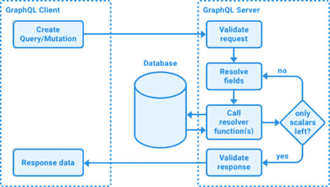
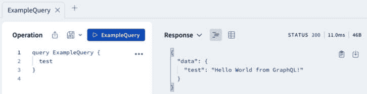
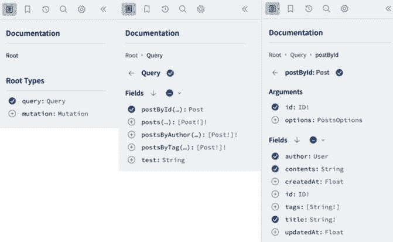
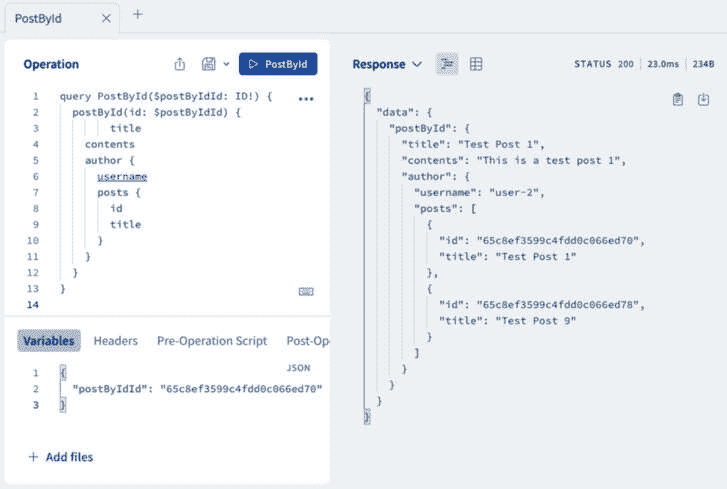
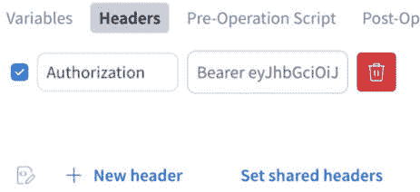

# 11

# 使用 GraphQL API 构建后端

到目前为止，我们只与 REST API 进行交互。对于具有深层嵌套对象的更复杂 API，我们可以使用 GraphQL 来允许对大型对象的部分进行选择性访问。在本章中，我们首先将学习什么是 GraphQL 以及它在何时有用。然后，我们将尝试制作 GraphQL 查询和突变。之后，我们将实现后端的 GraphQL。最后，我们将简要介绍高级 GraphQL 概念。

在本章中，我们将涵盖以下主要主题：

+   什么是 GraphQL？

+   在后端实现 GraphQL API

+   实现 GraphQL 身份验证和突变

+   高级 GraphQL 概念概述

# 技术要求

在我们开始之前，请从*第一章**，准备全栈开发*和*第二章**，了解 Node.js*和*MongoDB*中安装所有要求。

那些章节中列出的版本是书中使用的版本。虽然安装较新版本不应有问题，但请注意，某些步骤在较新版本上可能有所不同。如果您在这本书提供的代码和步骤中遇到问题，请尝试使用*第一章*和*第二章*中提到的版本。

您可以在 GitHub 上找到本章的代码：[`github.com/PacktPublishing/Modern-Full-Stack-React-Projects/tree/main/ch11`](https://github.com/PacktPublishing/Modern-Full-Stack-React-Projects/tree/main/ch11)。

如果您克隆了本书的完整仓库，Husky 在运行`npm install`时可能找不到`.git`目录。在这种情况下，只需在相应章节文件夹的根目录中运行`git init`。

本章的 CiA 视频可以在：[`youtu.be/6gP0uM-XaVo`](https://youtu.be/6gP0uM-XaVo)找到。

# 什么是 GraphQL？

在我们学习如何使用 GraphQL 之前，让我们首先关注什么是 GraphQL。像 REST 一样，它是一种查询 API 的方式。然而，它远不止于此。GraphQL 包括一个服务器端运行时来执行查询，以及一个类型系统来定义你的数据。它与许多数据库引擎兼容，并且可以集成到现有的后端中。

GraphQL 服务是通过定义类型（如`User`类型）、类型上的字段（如`username`字段）以及解析字段值的函数来创建的。假设我们已定义以下带有获取用户名的函数的`User`类型：

```js
type User {
  username: String
}
function User_username(user) {
  return user.getUsername()
}
```

我们可以定义一个`Query`类型和一个获取当前用户的函数：

```js
type Query {
  currentUser: User
}
function Query_currentUser(req) {
  return req.auth.user
}
```

信息

**查询**类型是一个特殊类型，它定义了 GraphQL 模式的“入口点”。它允许我们定义哪些字段可以使用 GraphQL API 进行查询。

现在我们已经定义了带有字段和解析这些字段的功能的类型，我们可以进行一个 GraphQL 查询来获取当前用户的用户名。GraphQL 查询看起来像 JavaScript 对象，但它们只列出你想要查询的字段名。然后，GraphQL API 将返回一个具有与查询相同结构的 JavaScript 对象，但填充了值。让我们看看获取当前用户用户名的查询将是什么样子：

```js
{
  currentUser {
    username
  }
}
```

那个查询将返回一个类似以下的 JSON 结果：

```js
{
  "data": {
    "currentUser": {
      "username": "dan"
    }
  }
}
```

如您所见，结果与查询具有相同的形状。这是 GraphQL 的一个基本概念：客户端可以具体请求它需要的字段，服务器将返回确切的这些字段。如果我们需要更多关于用户的数据，我们只需向类型中添加新的字段并查询即可。

GraphQL 会验证查询和结果是否符合定义的类型。这确保了我们不会破坏客户端和服务器之间的契约。GraphQL 类型充当客户端和服务器之间的契约。在验证查询后，它由 GraphQL 服务器执行，然后返回一个与查询请求的形状完全相同的结果。每个请求的字段在服务器上执行一个函数。这些函数被称为**解析器**。



图 11.1 – GraphQL 客户端与服务器之间的交互

类型和方法也可以深层嵌套。例如，一个用户可能有一个字段，返回该用户是作者的帖子。然后我们可以对那些帖子对象中的字段进行子选择。这对于对象中的对象以及对象中的对象数组的嵌套级别也是适用的。GraphQL 将继续解析字段，直到只剩下简单的值（标量），如字符串和数字。例如，以下查询可以获取当前用户创建的所有帖子的 ID 和标题：

```js
{
  currentUser {
    username
    posts {
      id
      title
    }
  }
}
```

此外，GraphQL 允许我们为字段定义参数，这些参数将被传递到解析我们字段的函数中。我们可以使用参数，例如，获取所有带有特定标签的帖子。在 GraphQL 中，我们可以向任何字段传递参数，即使它们是深层嵌套的。参数甚至可以传递给单个值字段，例如，用于转换值。例如，以下查询将根据 ID 获取帖子并返回帖子标题：

```js
{
  postById(id: "1234") {
    title
  }
}
```

如果你自己构建后端或者有这个想法，GraphQL 特别有用，因为它可以允许查询深层嵌套和相互关联的数据。然而，如果你无法控制现有的 REST 后端，通常不值得添加 GraphQL 作为单独的、独立的层，因为它的基于模式的限制。

在了解了查询之后，让我们继续学习突变。

## 突变

在 REST 中，任何请求都可能导致副作用（例如将数据写入数据库）。但是，正如我们所学的，GET 请求应该只返回数据，而不应引起此类副作用。只有 POST/PUT/PATCH/DELETE 请求应该导致数据库中的数据发生变化。在 GraphQL 中，有一个类似的概念：理论上，任何字段函数都可能改变数据库状态。然而，在 GraphQL 中，我们定义一个突变而不是查询来明确表示我们想要改变数据库状态。除了用 `mutation` 关键字定义外，突变与查询具有相同的结构。尽管如此，有一个区别：查询并行获取字段，而突变按顺序运行，首先执行第一个字段函数，然后是下一个，依此类推。这种行为确保我们在突变中不会出现竞争条件。

信息

除了内置的 **Query** 类型外，还有一个 **Mutation** 类型来定义允许的突变字段。

现在我们已经了解了 GraphQL 是什么以及它是如何工作的基础知识，让我们开始在实际的博客应用程序后端中实现 GraphQL！

# 在后端实现 GraphQL API

现在我们将设置 GraphQL 在我们现有的博客应用程序后端，除了 REST API 之外。这样做将允许我们看到 GraphQL 与 REST API 的比较和差异。按照以下步骤开始设置后端上的 GraphQL：

1.  将现有的 **ch10** 文件夹复制到一个新的 **ch11** 文件夹中，如下所示：

    ```js
    $ cp -R ch10 ch11
    ```

1.  在 VS Code 中打开 **ch11** 文件夹。

1.  首先，让我们安装一个 VS Code 扩展来添加 GraphQL 语言支持。转到 **Extensions** 选项卡，搜索由 GraphQL 基金会开发的 **GraphQL.vscode-graphql** 扩展。安装扩展。

1.  接下来，使用以下命令在后端安装 **graphql** 和 **@apollo/server** 库：

    ```js
    $ cd backend/
    $ npm install graphql@16.8.1 @apollo/server@4.10.0
    ```

    Apollo Server 是一个生产就绪的 GraphQL 服务器实现，支持多个后端 Web 框架，包括 Express。

1.  创建一个新的 **backend/src/graphql/** 文件夹。在其内部，创建一个 **backend/src/graphql/query.js** 文件，在其中我们定义一个 **Query** 模式，这是我们的 GraphQL API 的入口点（列出后端支持的所有查询），如下所示：

    ```js
    export const querySchema = `#graphql
      type Query {
        test: String
      }
    `
    ```

    在模板字符串的开头添加一个 `#graphql` 指令是很重要的，这样字符串就会被识别为 GraphQL 语法，并在代码编辑器中正确高亮显示。在我们的模式中，我们定义了一个 `test` 字段，现在我们为它定义一个解析器。

1.  定义一个包含将 **test** 字段解析为静态字符串的函数的 **queryResolver** 对象：

    ```js
    export const queryResolver = {
      Query: {
        test: () => {
          return 'Hello World from GraphQL!'
        },
      },
    }
    ```

1.  创建一个新的 **backend/src/graphql/index.js** 文件，并在其中导入 **querySchema** 和 **queryResolver**：

    ```js
    import { querySchema, queryResolver } from './query.js'
    ```

1.  然后，导出一个名为 **typeDefs** 的数组，它包含所有模式（目前只包含查询模式），以及一个名为 **resolvers** 的数组，它包含所有解析器（目前只包含查询解析器）：

    ```js
    export const typeDefs = [querySchema]
    export const resolvers = [queryResolver]
    ```

1.  编辑 **backend/src/app.js** 并从 **@apollo/server** 库导入 **ApolloServer** 和 **expressMiddleware**：

    ```js
    import { ApolloServer } from '@apollo/server'
    import { expressMiddleware } from '@apollo/server/express4'
    ```

1.  然后，导入 **typeDefs** 和 **resolvers**：

    ```js
    import { typeDefs, resolvers } from './graphql/index.js'
    ```

1.  在所有其他中间件和路由定义之前，使用模式类型定义和定义的解析器创建一个新的 Apollo 服务器：

    ```js
    const apolloServer = new ApolloServer({
      typeDefs,
      resolvers,
    })
    ```

1.  然后，在服务器准备就绪后，将 **expressMiddleware** 挂载到 **/graphql** 路由上，如下所示：

    ```js
    apolloServer
      .start()
      .then(() => app.use('/graphql', expressMiddleware(apolloServer)))
    ```

1.  通过运行以下命令以开发模式启动后端：

    ```js
    $ npm run dev
    ```

1.  在您的浏览器中转到 **http://localhost:3001/graphql**；您应该看到左侧的 Apollo 接口，可以输入查询，以及右侧的结果。

1.  从左侧编辑器的所有注释中删除并输入以下 GraphQL 查询：

    ```js
    query ExampleQuery {
      test
    }
    ```

1.  按下 **Play** 按钮，运行查询，您将看到以下结果：



图 11.2 – 我们第一次 GraphQL 查询的成功执行！

如您所见，我们对 `test` 字段的查询返回了我们之前定义的静态字符串！

在实现基本字段之后，让我们实现一些访问我们的服务函数并从 MongoDB 获取数据的字段。

## 实现查询帖子的字段

按照以下步骤实现查询帖子的字段：

1.  编辑 **backend/src/graphql/query.js** 并导入相关的服务函数：

    ```js
    import {
      getPostById,
      listAllPosts,
      listPostsByAuthor,
      listPostsByTag,
    } from '../services/posts.js'
    ```

1.  调整模式以包含一个 **posts** 字段，它返回一个帖子数组：

    ```js
    export const querySchema = `#graphql
      type Query {
        test: String
    [Type] syntax means that something is an array of Type. We will define the Post type later. Type! is the non-null modifier and means that a type is not null (required), so [Type!] means that each element is a Type, and not null (the array can still be empty, though). [Type!]! means that the array will always exist and never be null (but the array can still be empty).
    ```

1.  此外，定义用于通过 **author** 和 **tag** 查询帖子的字段，这两个字段都接受一个必需的参数：

    ```js
        postsByAuthor(username: String!): [Post!]!
        postsByTag(tag: String!): [Post!]!
    ```

1.  最后，定义一个通过 **id** 查询帖子的字段：

    ```js
        postById(id: ID!): Post
      }
    `
    ```

1.  现在我们已经定义了模式，我们仍然需要为所有这些字段提供解析器。多亏了我们的服务函数，这相当简单：我们可以在 **async** 函数中简单地调用我们的服务函数，并使用相关参数，如下所示：

    ```js
    export const queryResolver = {
      Query: {
        test: () => {
          return 'Hello World from GraphQL!'
        },
        posts: async () => {
          return await listAllPosts()
        },
        postsByAuthor: async (parent, { username }) => {
          return await listPostsByAuthor(username)
        },
        postsByTag: async (parent, { tag }) => {
          return await listPostsByTag(tag)
        },
        postById: async (parent, { id }) => {
          return await getPostById(id)
        },
      },
    }
    ```

    解析器函数始终将 `parent` 对象作为第一个参数，将所有参数作为第二个参数的对象接收。

现在我们已经成功定义了查询帖子的字段。然而，`Post` 类型尚未定义，因此我们的 GraphQL 查询目前还不能工作。让我们接下来做这件事。

## 定义 Post 类型

在定义 `Query` 类型之后，我们继续定义 `Post` 类型，如下所示：

1.  创建一个新的 **backend/src/graphql/post.js** 文件，其中我们导入 **getUserInfoById** 函数以稍后解析帖子的作者：

    ```js
    import { getUserInfoById } from '../services/users.js'
    ```

1.  然后，定义 **postSchema**。注意，**Post** 由 **id**、**title**、**author**、**contents**、**tags** 以及 **createdAt** 和 **updatedAt** 时间戳组成：

    ```js
    export const postSchema = `#graphql
      type Post {
        id: ID!
        title: String!
        author: User
        contents: String
        tags: [String!]
        createdAt: Float
        updatedAt: Float
      }
    `
    ```

    在这种情况下，我们使用 `[String!]` 作为标签，而不是 `[String!]!`，因为 `tags` 字段也可以不存在/`null`。

    `createdAt` 和 `updatedAt` 时间戳太大，无法放入 32 位有符号整数中，因此它们的类型需要是 `Float` 而不是 `Int`。

1.  接下来，定义一个用于获取用户的服务函数的 **author** 字段的解析器：

    ```js
    export const postResolver = {
      Post: {
        author: async (post) => {
          return await getUserInfoById(post.author)
        },
      },
    }
    ```

    获取帖子的解析器已经是 `Query` 模式的组成部分，所以我们不需要在这里定义如何获取帖子。GraphQL 知道查询字段返回 `Post` 数组，然后允许我们进一步解析帖子上的字段。

1.  编辑 **backend/src/graphql/index.js** 并添加 **postSchema** 和 **postResolver**：

    ```js
    import { querySchema, queryResolver } from './query.js'
    import { postSchema, postResolver } from './post.js'
    export const typeDefs = [querySchema, postSchema]
    export const resolvers = [queryResolver, postResolver]
    ```

在定义了 `Post` 类型之后，让我们继续定义 `User` 类型。

## 定义用户类型

当定义 `Post` 类型时，我们使用了 `User` 类型来定义帖子的作者。然而，我们尚未定义 `User` 类型。现在让我们来做这件事：

1.  创建一个新的 **backend/src/graphql/user.js** 文件，并将 **listPostsByAuthor** 函数导入到这里，因为我们将要添加一种解析用户对象时获取用户帖子的方式，以展示 GraphQL 如何处理深度嵌套的关系：

    ```js
    import { listPostsByAuthor } from '../services/posts.js'
    ```

1.  定义 **userSchema**。在我们的 GraphQL 模式中，每个 **User** 都有 **username** 和一个 **posts** 字段，我们将解析用户所写的所有帖子：

    ```js
    export const userSchema = `#graphql
      type User {
        username: String!
        posts: [Post!]!
      }
    `
    ```

信息

我们在这里没有指定任何其他属性，因为我们只在我们 **getUserInfoById** 服务函数中返回用户名。如果我们还想在这里获取用户 ID，我们就必须从该函数中返回它。我们不是返回完整的用户对象，因为这可能是一个潜在的安全漏洞，暴露内部数据，如密码（或某些应用程序中的账单信息）。

1.  接下来，定义 **userResolver**，它获取当前用户的所有帖子：

    ```js
    export const userResolver = {
      User: {
        posts: async (user) => {
          return await listPostsByAuthor(user.username)
        },
      },
    }
    ```

1.  编辑 **backend/src/graphql/index.js** 并添加 **userSchema** 和 **userResolver**：

    ```js
    import { querySchema, queryResolver } from './query.js'
    import { postSchema, postResolver } from './post.js'
    import { userSchema, userResolver } from './user.js'
    export const typeDefs = [querySchema, postSchema, userSchema]
    export const resolvers = [queryResolver, postResolver, userResolver]
    ```

在定义了 `User` 类型之后，让我们尝试一些深度嵌套的查询！

## 尝试深度嵌套的查询

现在我们已经成功定义了我们的 GraphQL 模式和解析器，我们可以开始使用 GraphQL 查询我们的数据库了！

例如，我们现在可以获取所有帖子的完整列表，包括它们的 ID、标题和作者的用户名，如下所示：

```js
query GetPostsOverview {
  posts {
    id
    title
    author {
      username
    }
  }
}
```

在 Apollo 接口中执行前面的查询。正如我们所看到的，查询获取所有帖子，为每个帖子选择 `id`、`title` 和 `author`，然后为每个 `author` 实例解析 `username`。这个查询允许我们在单个请求中获取我们需要的所有数据，我们不再需要单独的请求来解析作者的用户名了！

信息

我们没有在 `User` 类型中指定 **密码** 字段，所以 GraphQL 不会允许我们访问它，即使解析器函数返回一个包含密码的用户对象。

现在，让我们尝试一个通过 ID 获取帖子并然后找到相同作者的其他帖子的查询。这可以用来，例如，在某人阅读完帖子后推荐同一作者的其他文章查看：

1.  我们可以通过清空**操作**文本框的内容，然后在左侧的**文档**侧边栏中选择**根类型**下的**查询**，在 Apollo 接口中自动生成一个查询。现在点击左侧**postById**字段旁边的**+**按钮，它会自动为我们定义一个查询变量，看起来如下所示：

    ```js
    query PostById($postByIdId: ID!) {
      postById(id: $postByIdId) {
    ```



图 11.3 – 使用 Apollo 接口自动生成查询

1.  在帖子内部，我们现在可以获取帖子的**标题**、**内容**和**作者**值：

    ```js
        title
        contents
        author {
    ```

1.  在**作者**字段内部，我们获取**用户名**以及他们的帖子 ID 和标题：

    ```js
          username
          posts {
            id
            title
          }
        }
      }
    }
    ```

1.  在 Apollo 接口的底部，有一个**变量**部分，我们需要在其中填写数据库中存在的 ID：

    ```js
    {
      "postByIdId": "<ENTER ID FROM DATABASE>"
    }
    ```

1.  运行查询，你会看到帖子及其作者被解析，并且该作者所写的所有帖子也被正确列出，如下面的截图所示：



图 11.4 – 在 GraphQL 中运行深度嵌套查询

接下来，让我们学习如何通过定义输入类型为字段提供参数。

## 实现输入类型

我们已经学习了如何在 GraphQL 中定义常规类型，但如果我们有一个通用的方式为字段提供参数呢？例如，查询帖子的选项总是相同的（`sortBy` 和 `sortOrder`）。我们不能使用常规类型，相反，我们需要定义一个输入类型。按照以下步骤在 GraphQL 中实现查询选项：

1.  编辑 **backend/src/graphql/query.js** 并在模式中定义一个输入类型：

    ```js
    export const querySchema = `#graphql
      input PostsOptions {
        sortBy: String
        sortOrder: String
      }
    ```

1.  然后，使用输入类型作为字段的参数，如下所示：

    ```js
      type Query {
        test: String
        posts(options: PostsOptions): [Post!]!
        postsByAuthor(username: String!, options: PostsOptions): [Post!]!
        postsByTag(tag: String!, options: PostsOptions): [Post!]!
        postById(id: ID!, options: PostsOptions): Post
      }
    `
    ```

1.  现在，编辑解析器以传递**选项**到服务函数：

    ```js
        posts: async (parent, { options }) => {
          return await listAllPosts(options)
        },
        postsByAuthor: async (parent, { username, options }) => {
          return await listPostsByAuthor(username, options)
        },
        postsByTag: async (parent, { tag, options }) => {
          return await listPostsByTag(tag, options)
        },
    ```

1.  尝试以下查询以查看帖子是否按正确顺序排序：

    ```js
    query SortedPosts($options: PostsOptions) {
      posts(options: $options) {
        id
        title
        createdAt
        updatedAt
      }
    }
    ```

1.  设置以下变量：

    ```js
    {
      "options": {
        "sortBy": "updatedAt",
        "sortOrder": "ascending"
      }
    }
    ```

1.  通过按下**播放**按钮运行查询，你应该会看到响应按**updatedAt**时间戳升序排序！

现在我们已经成功实现了使用 GraphQL 查询数据库的功能，接下来让我们继续实现使用 GraphQL 创建新帖子的方法。

# 实现 GraphQL 认证和突变

我们现在将实现使用 GraphQL 创建新帖子的方法。为了定义改变数据库状态的字段，我们需要在 `mutation` 类型下创建它们。然而，在我们这样做之前，我们首先需要在 GraphQL 中实现认证，这样我们就可以在创建帖子时访问当前登录的用户。

## 将认证添加到 GraphQL

因为我们在使用 Express 与 GraphQL，所以我们可以使用任何 Express 中间件与 GraphQL，并将其传递给我们的解析器作为 `context`。因此，我们可以使用现有的 `express-jwt` 中间件来解析 JWT。现在让我们开始为 GraphQL 添加认证：

1.  我们当前的**requireAuth**中间件配置确保用户已登录，如果他们未登录则抛出错误。然而，当将**auth**上下文传递给 GraphQL 时，这是一个问题，因为并非所有查询都需要身份验证。我们现在将创建一个新的**optionalAuth**中间件，它不需要凭证来处理请求。编辑**backend/src/middleware/jwt.js**并定义以下新中间件：

    ```js
    export const optionalAuth = expressjwt({
      secret: () => process.env.JWT_SECRET,
      algorithms: ['HS256'],
      credentialsRequired: false,
    })
    ```

1.  现在，编辑**backend/src/app.js**，并在其中导入**optionalAuth**中间件：

    ```js
    import { optionalAuth } from './middleware/jwt.js'
    ```

1.  编辑我们定义**/graphql**路由的**app.use()**调用，并向其中添加**optionalAuth**中间件，类似于我们对路由所做的那样：

    ```js
    apolloServer.start().then(() =>
      app.use(
        '/graphql',
        optionalAuth,
    ```

1.  然后，向 Apollo **expressMiddleware**添加第二个参数，定义一个**context**函数，该函数将**req.auth**作为上下文提供给 GraphQL 解析器：

    ```js
        expressMiddleware(apolloServer, {
          context: async ({ req }) => {
            return { auth: req.auth }
          },
        }),
      ),
    )
    ```

接下来，让我们继续在 GraphQL 中实现突变。

## 实现突变

现在我们已经为 GraphQL 添加了身份验证，我们可以定义我们的突变。按照以下步骤创建注册、登录和创建帖子的突变：

1.  创建一个新的**backend/src/graphql/mutation.js**文件，并导入**GraphQLError**（在用户未登录时抛出**UNAUTHORIZED**错误），以及**createUser**、**loginUser**和**createPost**函数：

    ```js
    import { GraphQLError } from 'graphql'
    import { createUser, loginUser } from '../services/users.js'
    import { createPost } from '../services/posts.js'
    ```

1.  定义**mutationSchema**，在其中我们首先定义注册和登录用户的字段。**signupUser**字段返回一个用户对象，而**loginUser**字段返回一个 JWT：

    ```js
    export const mutationSchema = `#graphql
    type Mutation {
          signupUser(username: String!, password: String!): User
          loginUser(username: String!, password: String!): String
    ```

1.  然后，定义一个字段，用于从给定的**标题**、**内容**（可选）和**标签**（可选）创建一个新的帖子。它返回一个新创建的帖子：

    ```js
          createPost(title: String!, contents: String, tags: [String]): Post
        }
    `
    ```

1.  定义解析器，在其中我们首先定义**signupUser**和**loginUser**字段，它们相当直接：

    ```js
    export const mutationResolver = {
      Mutation: {
        signupUser: async (parent, { username, password }) => {
          return await createUser({ username, password })
        },
        loginUser: async (parent, { username, password }) => {
          return await loginUser({ username, password })
        },
    ```

1.  接下来，我们定义**createPost**字段。在这里，我们首先访问传递给字段的参数，并且作为解析函数的第三个参数，我们得到之前创建的上下文：

    ```js
        createPost: async (parent, { title, contents, tags }, { auth }) => {
    ```

1.  如果用户未登录，**auth**上下文将为**null**。在这种情况下，我们会抛出一个错误，并且不会创建新的帖子：

    ```js
          if (!auth) {
            throw new GraphQLError(
              'You need to be authenticated to perform this action.',
              {
                extensions: {
                  code: 'UNAUTHORIZED',
                },
              },
            )
          }
    ```

1.  否则，我们使用**auth.sub**（其中包含用户 ID）和提供的参数来创建一个新的帖子：

    ```js
          return await createPost(auth.sub, { title, contents, tags })
        },
      },
    }
    ```

1.  编辑**backend/src/graphql/index.js**，并添加**mutationSchema**和**mutationResolver**：

    ```js
    import { querySchema, queryResolver } from './query.js'
    import { postSchema, postResolver } from './post.js'
    import { userSchema, userResolver } from './user.js'
    import { mutationSchema, mutationResolver } from './mutation.js'
    export const typeDefs = [querySchema, postSchema, userSchema, mutationSchema]
    export const resolvers = [
      queryResolver,
      postResolver,
      userResolver,
      mutationResolver,
    ]
    ```

在实现突变之后，让我们学习如何使用它们。

## 使用突变

在定义可能的突变之后，我们可以在 Apollo 界面中运行它们。按照以下步骤首先注册一个用户，然后登录，最后创建一个帖子——所有这些操作都使用 GraphQL：

1.  前往**http://localhost:3001/graphql**查看 Apollo 界面。定义一个新的突变，用于使用给定的用户名和密码注册用户，并在注册成功时返回用户名：

    ```js
    mutation SignupUser($username: String!, $password: String!) {
      signupUser(username: $username, password: $password) {
        username
      }
    }
    ```

小贴士

你可以通过回到 **Root Types**，点击 **Mutation**，然后点击 **signupUser** 旁边的 **+** 图标来使用左侧的 **Documentation** 部分。然后，点击 **username** 字段旁边的 **+** 图标。这将自动创建前面的代码。

1.  编辑底部的变量并输入用户名和密码：

    ```js
    {
      "username": "graphql",
      "password": "gql"
    }
    ```

1.  通过按播放按钮执行 **SignupUser** 突变。

1.  接下来，创建一个新的突变来登录用户：

    ```js
    mutation LoginUser($username: String!, $password: String!) {
      loginUser(username: $username, password: $password)
    }
    ```

1.  输入与之前相同的变量并按播放按钮，响应包含 JWT。复制并存储 JWT 以供以后使用。

1.  定义一个新的突变来创建帖子。这个突变返回 **Post**，因此我们可以获取 **id**、**title** 和 **author** 的 **username** 值：

    ```js
    mutation CreatePost($title: String!, $contents: String, $tags: [String]) {
      createPost(title: $title, contents: $contents, tags: $tags) {
        id
        title
        author {
          username
        }
      }
    }
    ```

    这就是 GraphQL 真正发光的地方。在创建帖子后，我们可以解析作者的用户名，以查看它是否真的是由正确的用户创建的，因为我们可以访问为 `Post` 定义的解析器，即使在突变中也可以！正如你所看到的，GraphQL 非常灵活。

1.  输入以下变量：

    ```js
    {
      "title": "GraphQL Post",
      "contents": "This is posted from GraphQL!"
    }
    ```

1.  选择 **Headers** 选项卡，点击 **New header** 按钮，输入 **Authorization** 作为 **header key**，并将 **Bearer <粘贴之前复制的 JWT**> 作为 **value**。然后点击 **Play** 按钮提交突变。



图 11.5 – 在 Apollo 接口中添加授权头

1.  在响应中，你可以看到帖子已成功创建，作者已正确设置和解析！

在为我们的博客应用程序实现了 GraphQL 查询和突变之后，让我们通过概述高级 GraphQL 概念来结束本章。

# 高级 GraphQL 概念概述

默认情况下，GraphQL 附带一组标量类型：

+   **Int**：有符号的 32 位整数

+   **Float**：有符号的双精度浮点值

+   **String**：UTF-8 编码的字符序列

+   **Boolean**：可以是 true 或 false

+   **ID**：一个唯一的标识符，序列化为 **String**，但表示它不是人类可读的

GraphQL 还允许定义枚举，枚举是一种特殊的标量类型。它们被限制在特定的值范围内。例如，我们可以定义以下枚举来区分不同类型的帖子：

```js
enum PostType {
  UNPUBLISHED,
  UNLISTED,
  PUBLIC
}
```

在 Apollo 中，枚举将被处理为只能具有特定值的字符串，但在其他 GraphQL 实现中可能会有所不同。

许多 GraphQL 实现也允许定义自定义标量类型。例如，Apollo 支持自定义标量类型的定义。

## 片段

当同类型的字段经常被访问时，我们可以创建一个片段来简化并标准化对这些字段的访问。例如，如果我们经常解析用户，并且用户有 `username`、`profilePicture`、`fullName` 和 `biography` 等字段，我们可以创建以下片段：

```js
fragment UserInfo on User {
  username
  profilePicture
  fullName
  biography
}
```

这个片段可以在查询中使用。例如，看看这个片段：

```js
{
  posts {
    author {
      ...UserInfo
    }
  }
}
```

当相同的字段结构在同一个查询中多次使用时，片段特别有用。例如，如果一个作者有 `followedBy` 和 `follows` 字段，我们可以这样解析所有用户：

```js
{
  posts {
    author {
      ...UserInfo
      followedBy {
        ...UserInfo
      }
      follows {
        ...UserInfo
      }
    }
  }
}
```

## 查询反射

查询反射使我们能够查询定义的架构本身，以了解服务器为我们提供的数据。本质上，这是查询由 GraphQL 服务器定义的架构。我们可以使用 `__schema` 字段来获取所有架构。架构由 `types` 组成，这些 `types` 有 `name` 值。

例如，我们可以使用以下查询来获取我们服务器上定义的所有类型：

```js
{
  __schema {
    types {
      name
    }
  }
}
```

如果你在我们服务器上执行此查询，你将获得（包括其他类型）我们定义的 `Query`、`Post`、`User` 和 `Mutation` 类型。

查询反射非常强大，你可以从中获取有关可能查询和突变的大量信息。实际上，Apollo 接口使用反射来渲染 **文档** 侧边栏，并为我们自动完成字段！

# 摘要

在本章中，我们学习了 GraphQL 是什么以及它如何比 REST 更灵活，同时需要更少的样板代码，尤其是在查询深度嵌套对象时。然后，我们在后端实现了 GraphQL 并创建了各种类型、查询和突变。我们还学习了如何在 GraphQL 中集成 JWT 身份验证。最后，我们通过学习高级概念，如类型系统、片段和查询反射来结束本章。

在下一章，*第十二章*“使用 Apollo 客户端在前端与 GraphQL 交互”，我们将学习如何使用 React 和 Apollo 客户端库访问和集成 GraphQL。
