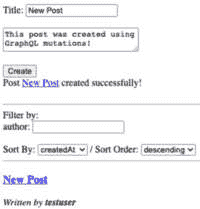

# 12

# 使用 Apollo 客户端在前端与 GraphQL 交互

在上一章成功实现使用 Apollo Server 的 GraphQL 后端之后，我们现在将使用 Apollo 客户端在前端与新的 GraphQL API 进行交互。Apollo 客户端是一个库，使得与 GraphQL API 交互变得更加容易和方便。我们将首先用 GraphQL 查询替换获取帖子列表的操作，然后无需额外的查询即可解析作者用户名，展示 GraphQL 的强大功能。接下来，我们将向查询中添加变量以允许设置过滤和排序选项。最后，我们将学习如何在前端使用突变。

在本章中，我们将涵盖以下主要主题：

+   设置 Apollo 客户端并执行我们的第一个查询

+   在 GraphQL 查询中使用变量

+   在前端使用突变

# 技术要求

在我们开始之前，请从 *第一章* *为全栈开发做准备* 和 *第二章* *了解 Node.js 和 MongoDB* 中安装所有要求。

那些章节中列出的版本是书中使用的版本。虽然安装较新版本通常不会有问题，但请注意，某些步骤在较新版本上可能有所不同。如果本书中提供的代码和步骤存在问题，请尝试使用第 *1* 章和 *2* 章中提到的版本。

你可以在 GitHub 上找到本章的代码：[`github.com/PacktPublishing/Modern-Full-Stack-React-Projects/tree/main/ch12`](https://github.com/PacktPublishing/Modern-Full-Stack-React-Projects/tree/main/ch12)。

本章的 CiA 视频可以在以下网址找到：[`youtu.be/Gl_5i9DR_xA`](https://youtu.be/Gl_5i9DR_xA)。

如果你克隆了本书的完整仓库，Husky 在运行 `npm install` 时可能找不到 `.git` 目录。在这种情况下，只需在相应章节文件夹的根目录中运行 `git init`。

# 设置 Apollo 客户端并执行我们的第一个查询

在我们开始在前端进行 GraphQL 查询之前，我们首先需要设置 Apollo 客户端。`POST` 请求到 `/graphql` 端点），Apollo 客户端使得与 GraphQL 交互变得更加容易和方便。它还包括一些额外的功能，如开箱即用的缓存。

按照以下步骤设置 Apollo 客户端：

1.  将现有的 **ch11** 文件夹复制到新的 **ch12** 文件夹，如下所示：

    ```js
    $ cp -R ch11 ch12
    ```

1.  在 VS Code 中打开 **ch12** 文件夹。

1.  安装 **@apollo/client** 和 **graphql** 依赖项：

    ```js
    $ npm install @apollo/client@3.9.5 graphql@16.8.1
    ```

1.  编辑 **.env** 并添加一个新的环境变量，指向我们的 GraphQL 服务器端点：

    ```js
    VITE_GRAPHQL_URL="http://localhost:3001/graphql"
    ```

1.  编辑 **src/App.jsx** 并从 **@apollo/client** 包中导入 **ApolloClient**、**InMemoryCache** 和 **ApolloProvider**：

    ```js
    import { ApolloProvider } from '@apollo/client/react/index.js'
    import { ApolloClient, InMemoryCache } from '@apollo/client/core/index.js'
    ```

    在撰写本文时，Apollo 客户端中存在 ESM 导入问题，因此我们需要直接从 `index.js` 文件中导入。

1.  创建一个指向 GraphQL 端点并使用 **InMemoryCache** 的新实例的 Apollo Client：

    ```js
    const apolloClient = new ApolloClient({
      uri: import.meta.env.VITE_GRAPHQL_URL,
      cache: new InMemoryCache(),
    })
    ```

1.  调整 **App** 组件以添加 **ApolloProvider**，为我们的整个应用提供 Apollo Client 上下文：

    ```js
    export function App({ children }) {
      return (
        <HelmetProvider>
          <ApolloProvider client={apolloClient}>
            <QueryClientProvider client={queryClient}>
              <AuthContextProvider>{children}</AuthContextProvider>
            </QueryClientProvider>
          </ApolloProvider>
        </HelmetProvider>
      )
    }
    ```

1.  我们现在还将创建一个 GraphQL 配置文件，以便 VS Code GraphQL 扩展可以为我们自动完成和验证查询。在项目的根目录中创建一个新的 **graphql.config.json** 文件，内容如下：

    ```js
    {
      "schema": "http://localhost:3001/graphql",
      "documents": "src/api/graphql/**/*.{js,jsx}"
    }
    ```

    `schema` 定义了 GraphQL 端点的 URL，而 `documents` 定义了包含 GraphQL 查询的文件的位置。我们稍后将在 `src/api/graphql/` 文件夹中放置 GraphQL 查询。

1.  确保 Docker 和数据库容器正在运行，然后按照以下方式启动后端：

    ```js
    $ cd backend/
    $ npm run dev
    ```

    在本章中保持后端运行，以便 GraphQL 扩展可以访问 GraphQL 端点。

1.  重新启动 VS Code GraphQL 扩展。您可以通过访问 VS Code 命令面板（在 Windows/Linux 上为 *Ctrl* + *Shift* + *P*，在 macOS 上为 *Cmd* + *Shift* + *P*）并输入 **GraphQL:** **Manual Restart** 来这样做。

## 使用 GraphQL 从前端查询帖子

现在 Apollo Client 已设置并准备好使用，让我们定义我们的第一个 GraphQL 查询：一个简单的查询来获取所有帖子。

按照以下步骤定义查询并在我们的应用中使用它：

1.  在 **src/api/graphql/** 文件夹中创建一个新的文件夹，我们将在这里放置我们的 GraphQL 查询。

1.  在此文件夹内，创建一个新的 **src/api/graphql/posts.js** 文件。

1.  在 **src/api/graphql/posts.js** 文件中，从 **@apollo/client** 导入 **gql** 函数：

    ```js
    import { gql } from '@apollo/client/core/index.js'
    ```

1.  定义一个新的 **GET_POSTS** 查询，它检索帖子的所有相关属性（除了作者，稍后添加）：

    ```js
    export const GET_POSTS = gql`
      query getPosts {
        posts {
          id
          title
          contents
          tags
          updatedAt
          createdAt
        }
      }
    `
    ```

    你应该会看到 GraphQL 扩展为我们提供了我们定义在后端的类型的自动完成选项！如果我们输入错误的字段名，它也会警告我们该字段在类型上不存在。

1.  编辑 **src/pages/Blog.jsx** 并从 **@apollo/client** 导入 **useQuery** 钩子：

    ```js
    import { useQuery as useGraphQLQuery } from '@apollo/client/react/index.js'
    ```

    我们将 Apollo Client 的 `useQuery` 钩子重命名为 `useGraphQLQuery` 以避免与 TanStack React Query 的 `useQuery` 钩子混淆。

1.  导入之前定义的 **GET_POSTS** 查询：

    ```js
    import { GET_POSTS } from '../api/graphql/posts.js'
    ```

1.  *移除* 用于 **useQuery** 和 **getPosts** 的导入：

    ```js
    import { useQuery } from '@tanstack/react-query'
    import { getPosts } from '../api/posts.js'
    ```

1.  *移除* 现有的 **useQuery** 钩子：

    ```js
      const postsQuery = useQuery({
        queryKey: ['posts', { author, sortBy, sortOrder }],
        queryFn: () => getPosts({ author, sortBy, sortOrder }),
      })
      const posts = postsQuery.data ?? []
    ```

1.  *替换* 为以下钩子：

    ```js
      const postsQuery = useGraphQLQuery(GET_POSTS)
      const posts = postsQuery.data?.posts ?? []
    ```

1.  确保您位于项目的根目录中，然后按照以下方式运行前端：

    ```js
    $ npm run dev
    ```

现在，在 `http://localhost:5173/` 上打开前端，你会看到帖子标题被正确显示。然而，帖子链接不起作用，控制台中有错误。GraphQL 和 REST API 的结果略有不同：REST API 将帖子的 ID 作为 `_id` 属性返回，而 GraphQL 将它们作为 `id` 属性返回。

让我们调整我们的代码以适应这个变化：

1.  编辑 **src/components/Post.jsx** 并将 **_id** 属性更改为 **id**：

    ```js
    export function Post({
      title,
      contents,
      author,
      id,
    ```

1.  同时，更新使用的地方的变量名：

    ```js
            <Link to={`/posts/${id}/${slug(title)}`}>
    ```

1.  确保更新 **propTypes**：

    ```js
    Post.propTypes = {
      title: PropTypes.string.isRequired,
      contents: PropTypes.string,
      author: PropTypes.string,
      id: PropTypes.string.isRequired,
    ```

1.  现在属性已更改，编辑 **src/pages/ViewPost.jsx** 并按照以下方式传递新属性：

    ```js
          {post ? (
            <Post {...post} id={postId} fullPost />
          ) : (
            `Post with id ${postId} not found.`
          )}
    ```

保存所有文件后，前端应该刷新并正确渲染所有帖子列表，并带有正常工作的链接。现在要恢复原始功能，只剩下显示作者用户名。

## 在单个查询中解析作者用户名

由于 GraphQL 的强大功能，我们现在可以一次性在单个查询中获取所有作者的用户名，而不是分别解析每个作者的用户名！让我们利用这个功能来重构我们的代码，使其更简单并提高性能：

1.  首先，编辑 **src/api/graphql/posts.js** 中的 GraphQL 查询，添加 **author.username** 字段，如下所示：

    ```js
    export const GET_POSTS = gql`
      query getPosts {
        posts {
          author {
            username
          }
    ```

1.  然后，编辑 **src/components/User.jsx** 组件。*替换*整个组件为以下更简单的组件：

    ```js
    import PropTypes from 'prop-types'
    export function User({ username }) {
      return <b>{username}</b>
    }
    User.propTypes = {
      username: PropTypes.string.isRequired,
    }
    ```

    现在在这里获取用户信息不再必要，因为我们可以直接从 GraphQL 响应中显示用户名。

1.  接下来，编辑 **src/components/Post.jsx** 并按照以下方式将整个 **author** 对象传递给 **User** 组件：

    ```js
              Written by <User {...author} />
    ```

1.  我们还需要调整 **propTypes** 以接受 **Post** 组件的完整 **author** 对象，而不是用户 ID：

    ```js
      author: PropTypes.shape(User.propTypes),
    ```

1.  编辑 **src/pages/ViewPost.jsx** 并将整个 **author** 对象传递给 **Post** 组件：

    ```js
            <Post {...post} id={postId} src/components/Header.jsx and import the useQuery hook and the getUserInfo API function:

    ```

    导入 `{ useQuery }` 从 `@tanstack/react-query`

    导入 `{ getUserInfo }` 从 `../api/users.js`

    ```js

    ```

1.  然后，调整组件以从令牌（JWT 的 **sub** 字段）中获取用户 ID 并对用户信息进行查询：

    ```js
    export function Header() {
      const [token, setToken] = useAuth()
      const { sub } = token ? jwtDecode(token) : {}
      const userInfoQuery = useQuery({
        queryKey: ['users', sub],
        queryFn: () => getUserInfo(sub),
        enabled: Boolean(sub),
      })
      const userInfo = userInfoQuery.data
    ```

1.  最后，我们检查是否能够解析用户信息查询（而不是仅仅检查 **token**）。如果是这样，我们将用户信息传递给 **User** 组件：

    ```js
      if (token && userInfo) {
        return (
          <nav>
            Logged in as <User {...userInfo} />
    ```

    我们还像之前一样移除了令牌解码。

现在我们正在使用 GraphQL 来获取帖子列表并在单个请求中解析作者用户名！然而，过滤和排序不再工作，因为我们还没有将此信息传递给 GraphQL 查询。

在下一节中，我们将介绍用于过滤和排序 GraphQL 查询的变量。

# 在 GraphQL 查询中使用变量

要添加对过滤和排序的支持，我们需要在我们的 GraphQL 查询中添加变量。然后，在执行查询时我们可以填写这些变量。

按照以下步骤向查询中添加变量：

1.  编辑 **src/api/graphql/posts.js** 并调整查询以接受一个 **$options** 变量：

    ```js
    export const GET_POSTS = gql`
      query getPosts($options: PostsOptions) {
    ```

1.  然后，将 **$options** 变量传递给 **posts** 解析器，因为我们已经在上一章中实现了 **options** 参数：

    ```js
        posts(options: $options) {
    ```

1.  现在，我们只需在执行查询时传递这些选项。编辑 **src/pages/Blog.jsx** 并按照以下方式传递变量：

    ```js
      const postsQuery = useGraphQLQuery(GET_POSTS, {
        variables: { options: { sortBy, sortOrder } },
      })
    ```

1.  前往博客前端并将排序顺序更改为升序，以查看变量的实际效果！

## 使用片段重用查询的部分

现在排序功能已经正常工作，我们只需要添加按作者过滤的功能。为此，我们需要为 `postsByAuthor` 添加第二个查询。正如你所想象的那样，这个查询应该返回与 `posts` 查询相同的字段。我们可以利用片段来重用这两个查询的字段，如下所示：

1.  编辑 **src/api/graphql/posts.js** 并在 GraphQL 中定义一个新的片段，其中包含我们从帖子中需要的所有字段：

    ```js
    export const POST_FIELDS = gql`
      fragment PostFields on Post {
        id
        title
        contents
        tags
        updatedAt
        createdAt
        author {
          username
        }
      }
    `
    ```

    该片段通过给它一个名称（`PostFields`）并指定它可以用于哪种类型（`on Post`）来定义。然后，可以在片段中查询指定类型的所有字段。

1.  要使用片段，我们首先必须将其定义包含在 **GET_POSTS** 查询中：

    ```js
    export const GET_POSTS = gql`
      ${POST_FIELDS}
      query getPosts($options: PostsOptions) {
    ```

1.  现在，我们不再需要手动列出所有字段，我们可以使用片段：

    ```js
        posts(options: $options) {
          ...PostFields
        }
      }
    `
    ```

    使用片段的语法类似于 JavaScript 中的对象解构，其中对象中定义的所有属性都会扩展到另一个对象中。

注意

有时需要重新启动 VS Code GraphQL 扩展才能正确检测片段。您可以通过访问 VS Code 命令面板（在 Windows/Linux 上为 *Ctrl* + *Shift* + *P*，在 macOS 上为 *Cmd* + *Shift* + *P*）并输入 **GraphQL:** **Manual Restart** 来这样做。

1.  接下来，我们定义第二个查询，通过作者查询帖子，并使用片段获取所有必要的字段：

    ```js
    export const GET_POSTS_BY_AUTHOR = gql`
      ${POST_FIELDS}
      query getPostsByAuthor($author: String!, $options: PostsOptions) {
        postsByAuthor(username: $author, options: $options) {
          ...PostFields
        }
      }
    `
    ```

    我们将 `$author` 变量定义为该查询所必需的（通过在类型后使用感叹号）。我们需要这样做，因为 `postsByAuthor` 字段也要求设置第一个参数（`username`）。

1.  编辑 **src/pages/Blog.jsx** 并导入新定义的查询：

    ```js
    import { GET_POSTS, GET_POSTS_BY_AUTHOR } from '../api/graphql/posts.js'
    ```

1.  然后，调整钩子以使用 **GET_POSTS_BY_AUTHOR** 查询，如果 **author** 已定义：

    ```js
      const postsQuery = useGraphQLQuery(author ? GET_POSTS_BY_AUTHOR : GET_POSTS, {
    ```

1.  将 **author** 变量传递给查询：

    ```js
        variables: { author, options: { sortBy, sortOrder } },
      })
    ```

1.  最后，我们需要调整选择结果的方式，因为 **GET_POSTS_BY_AUTHOR** 查询中的 **postsByAuthor** 字段将结果返回在 **data.postsByAuthor** 中，而 **GET_POSTS** 查询使用 **posts** 字段，结果返回在 **data.posts** 中。由于没有同时返回这两个字段的情况，我们可以简单地这样做：

    ```js
      const posts = postsQuery.data?.postsByAuthor ?? postsQuery.data?.posts ?? []
    ```

1.  前往前端尝试按作者过滤。现在过滤器又正常工作了！

如我们所见，片段对于重复使用相同字段进行多个查询非常有用！现在我们的帖子列表已经完全重构为使用 GraphQL，让我们继续在前端使用突变，这样我们就可以将注册、登录和创建帖子功能迁移到 GraphQL。

# 在前端使用突变

如我们在上一章所学，GraphQL 中的突变用于更改后端的状态（类似于 REST 中的 `POST` 请求）。我们现在将实现注册和登录的突变。

按照以下步骤操作：

1.  创建一个新的 **src/api/graphql/users.js** 文件并导入 **gql**：

    ```js
    import { gql } from '@apollo/client/core/index.js'
    ```

1.  然后，定义一个新的 **SIGNUP_USER** 突变，它接受用户名和密码并调用 **signupUser** 突变字段：

    ```js
    export const SIGNUP_USER = gql`
      mutation signupUser($username: String!, $password: String!) {
        signupUser(username: $username, password: $password) {
          username
        }
      }
    `
    ```

1.  编辑 **src/pages/Signup.jsx** 并将当前来自 TanStack React Query 的 **useMutation** hook 替换为来自 Apollo Client 的一个。正如我们之前为 **useQuery** 所做的那样，我们也将把这个 hook 重命名为 **useGraphQLMutation** 以避免混淆：

    ```js
    import { useMutation as useGraphQLMutation } from '@apollo/client/react/index.js'
    ```

1.  此外，*替换* **signup** 函数的导入为 **SIGNUP_USER** mutation 的导入：

    ```js
    import { SIGNUP_USER } from '../api/graphql/users.js'
    ```

1.  *替换* 现有的 mutation hook 为以下内容：

    ```js
      const [signupUser, { loading }] = useGraphQLMutation(SIGNUP_USER, {
        variables: { username, password },
        onCompleted: () => navigate('/login'),
        onError: () => alert('failed to sign up!'),
      })
    ```

    如所见，Apollo Client 的 mutation hook 与 TanStack React Query 的 mutation hook 有略微不同的 API。它返回一个包含调用 mutation 的函数以及包含加载状态、错误状态和数据的对象的数组。类似于 `useGraphQLQuery` hook，它也接受 mutation 作为第一个参数，以及包含变量的对象作为第二个参数。此外，Apollo Client 中的 `onSuccess` 函数被命名为 `onCompleted`。

1.  按如下方式更改 **handleSubmit** 函数：

    ```js
      const handleSubmit = (e) => {
        e.preventDefault()
        signupUser()
      }
    ```

1.  最后，按如下方式更改提交按钮：

    ```js
          <input
            type='submit'
            value={loading ? 'Signing up...' : 'Sign Up'}
            disabled={!username || !password || loading}
          />
    ```

现在注册功能已成功迁移到 GraphQL。接下来，让我们迁移登录功能。

## 将登录迁移到 GraphQL

将登录功能重构为 GraphQL 与注册功能非常相似，所以让我们快速浏览一下步骤：

1.  编辑 **src/api/graphql/users.js** 并为登录定义一个 mutation：

    ```js
    export const LOGIN_USER = gql`
      mutation loginUser($username: String!, $password: String!) {
        loginUser(username: $username, password: $password)
      }
    `
    ```

1.  编辑 **src/pages/Login.jsx** 并将导入 TanStack React Query 和 **login** 函数替换为以下内容：

    ```js
    import { useMutation as useGraphQLMutation } from '@apollo/client/react/index.js'
    import { LOGIN_USER } from '../api/graphql/users.js'
    ```

1.  更新 hook：

    ```js
      const [loginUser, { loading }] = useGraphQLMutation(LOGIN_USER, {
        variables: { username, password },
        onCompleted: (data) => {
          setToken(data.loginUser)
          navigate('/')
        },
        onError: () => alert('failed to login!'),
      })
    ```

1.  更新 **handleSubmit** 函数：

    ```js
      const handleSubmit = (e) => {
        e.preventDefault()
        loginUser()
      }
    ```

1.  最后，更新提交按钮：

    ```js
          <input
            type='submit'
            value={loading ? 'Logging in...' : 'Log In'}
            disabled={!username || !password || loading}
          />
    ```

现在，注册和登录都使用 GraphQL mutation，让我们继续迁移创建帖子功能到 GraphQL。

## 将创建帖子迁移到 GraphQL

创建帖子功能实现起来有点复杂，因为它要求我们登录（这意味着我们需要发送 JWT 标头），并使帖子列表查询失效，以便在创建新帖子后更新列表。

现在让我们开始使用 Apollo Client 来实现这个功能：

1.  首先，让我们定义 mutation。编辑 **src/api/graphql/posts.js** 并添加以下代码：

    ```js
    export const CREATE_POST = gql`
      mutation createPost($title: String!, $contents: String, $tags: [String!]) {
        createPost(title: $title, contents: $contents, tags: $tags) {
          id
          title
        }
      }
    `
    ```

    对于这个 mutation，我们将使用响应来获取创建的帖子的 `id` 和 `title`。我们将利用这些数据在成功创建后显示帖子的链接。

1.  然后，编辑 **src/components/CreatePost.jsx** 并将 TanStack React Query 的导入替换为 mutation hook 的导入：

    ```js
    import { useMutation as useGraphQLMutation } from '@apollo/client/react/index.js'
    ```

1.  此外，导入 **Link** 组件和 **slug** 函数以显示创建的帖子链接：

    ```js
    import { Link } from 'react-router-dom'
    import slug from 'slug'
    ```

1.  *替换* **createPost** 函数的导入为 **CREATE_POST** mutation 和 **GET_POSTS** 以及 **GET_POSTS_BY_AUTHOR** 查询的导入。我们将使用这些查询定义让 Apollo Client 在稍后为我们重新获取它们：

    ```js
    import {
      CREATE_POST,
      GET_POSTS,
      GET_POSTS_BY_AUTHOR,
    } from '../api/graphql/posts.js'
    ```

1.  *替换* 现有的查询客户端和 mutation hook 为以下 GraphQL mutation，其中我们传递 **title** 和 **contents** 变量：

    ```js
      const [createPost, { loading, data }] = useGraphQLMutation(CREATE_POST, {
        variables: { title, contents },
    ```

1.  接下来，我们将 JWT 标头作为 **context** 传递给 mutation：

    ```js
        context: { headers: { Authorization: `Bearer ${token}` } },
    ```

1.  然后，我们将 **refetchQueries** 选项提供给突变，告诉 Apollo Client 在调用突变后重新获取某些查询：

    ```js
        refetchQueries: [GET_POSTS, GET_POSTS_BY_AUTHOR],
      })
    ```

注意

由于突变后的重新获取是一个常见的操作，Apollo Client 提供了一种简单的方法在突变钩子中执行此操作。只需将所有应重新获取的查询传递到那里，Apollo Client 将负责处理。

1.  调整 **handleSubmit** 函数：

    ```js
      const handleSubmit = (e) => {
        e.preventDefault()
        createPost()
      }
    ```

1.  调整提交按钮：

    ```js
          <input
            type='submit'
            value={loading ? 'Creating...' : 'Create'}
            disabled={!title || loading}
          />
    ```

1.  最后，我们将更改成功消息，显示创建的帖子的链接：

    ```js
          {data?.createPost ? (
            <>
              <br />
              Post{' '}
              <Link
                to={`/posts/${data.createPost.id}/${slug(data.createPost.title)}`}
              >
                {data.createPost.title}
              </Link>{' '}
              created successfully!
            </>
          ) : null}
    ```

    由于 GraphQL 中类型和解析器的工作方式，它使我们能够轻松地访问突变结果的字段，就像我们正在获取单个帖子一样。例如，我们甚至可以告诉 GraphQL 获取创建的帖子的作者的用户名！

1.  尝试创建一个新的帖子，你会看到成功消息现在显示了创建的帖子的链接，帖子列表也会自动为我们重新获取！

    以下截图显示了一个新帖子成功创建，成功消息中显示了新帖子的链接，以及帖子列表中的新帖子（由 Apollo Client 自动重新获取）：



图 12.1：使用 GraphQL 突变创建帖子，并重新获取帖子列表

现在我们已经成功实现了使用 GraphQL 创建帖子，我们的博客应用已经完全连接到我们的 GraphQL 服务器。

在这本书中，我们还没有涵盖 GraphQL 的许多更高级的概念，例如高级重新获取、订阅（从 GraphQL 服务器获取实时更新）、错误处理、suspense、分页和缓存。本书中的 GraphQL 章节仅作为 GraphQL 的入门介绍。

如果你希望了解更多关于 GraphQL 和 Apollo 的信息，我建议查看广泛的 Apollo 文档（[`www.apollographql.com/docs/`](https://www.apollographql.com/docs/)），其中包含有关使用 Apollo Server 和 Apollo Client 的详细信息和实践示例。

# 摘要

在本章中，我们使用 Apollo Client 将之前创建的 GraphQL 后端连接到前端。我们首先设置 Apollo Client 并执行一个 GraphQL 查询以获取所有帖子。然后，我们通过在单个请求中获取作者用户名来提高帖子列表的性能，利用 GraphQL 的强大功能。

接下来，我们在查询中引入了变量，并重新实现了按作者排序和过滤。我们还引入了查询中的片段以重用相同的字段。最后，我们在前端实现了 GraphQL 突变以注册、登录和创建帖子。我们还沿途了解了 Apollo Client 中的查询重新获取，并简要介绍了 GraphQL 和 Apollo 的高级概念。

在下一章，*第十三章*，*使用 Express 和 Socket.IO 构建基于事件驱动的后端*，我们将从传统的全栈架构中跳出来，并使用一种特殊类型的全栈架构：基于事件的程序来构建一个新应用。
