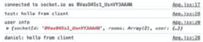

# 13

# 使用 Express 和 Socket.IO 构建事件驱动后端

在本章中，我们将学习关于事件驱动应用程序以及使用这种架构与更传统架构相比的权衡。然后，我们将学习关于 WebSockets 以及它们是如何工作的。之后，我们将使用 Socket.IO 和 Express 实现后端。最后，我们将学习如何通过使用 JWT 与 Socket.IO 集成来实现身份验证。

在本章中，我们将涵盖以下主要主题：

+   什么是事件驱动应用程序？

+   设置 Socket.IO

+   使用 Socket.IO 创建聊天应用的后端

+   通过将 JWT 与 Socket.IO 集成来添加身份验证

# 技术要求

在我们开始之前，请从*第一章*，*为全栈开发做准备*，以及*第二章*，*了解 Node.js 和 MongoDB*中安装所有要求。

那些章节中列出的版本是本书中使用的版本。虽然安装较新版本不应有问题，但请注意，某些步骤可能有所不同。如果你在使用本书中提供的代码和步骤时遇到问题，请尝试使用 *第一章* 和 *第二章* 中提到的版本。

你可以在 GitHub 上找到本章的代码：[`github.com/PacktPublishing/Modern-Full-Stack-React-Projects/tree/main/ch13`](https://github.com/PacktPublishing/Modern-Full-Stack-React-Projects/tree/main/ch13)。

如果你克隆了本书的完整仓库，在运行 `npm install` 时 Husky 可能找不到 `.git` 目录。在这种情况下，只需在相应章节文件夹的根目录下运行 `git init`。

本章的 CiA 视频可以在以下位置找到：[`youtu.be/kHGvkopIHf4`](https://youtu.be/kHGvkopIHf4)。

# 什么是事件驱动应用程序？

与传统的基于请求-响应模式的 Web 应用程序相比，在事件驱动应用程序中，我们处理的是事件。服务器和客户端保持连接，每一方都可以发送事件，另一方监听并做出反应。

以下图表显示了在请求-响应模式与事件驱动模式之间实现聊天应用的区别：


图 13.1 – 使用请求-响应和事件驱动模式的聊天应用实现

例如，在请求-响应模式中实现聊天应用，我们需要定期向`GET /chat/messages`端点发送请求以刷新聊天室中发送的消息列表。这种定期发送请求的过程称为短轮询。要发送聊天消息，我们会向`POST /chat/messages`发送请求。在事件驱动模式中，我们可以从客户端向服务器发送`chat.message`事件，然后服务器将`chat.message`事件发送给所有已连接的用户。然后客户端监听`chat.message`事件，并在消息到来时显示它们；不需要定期请求！

当然，每种模式都有其优缺点：

+   REST/请求-响应：

    +   当数据不经常变化时很有用

    +   响应可以轻松缓存

    +   请求是无状态的，这使得扩展后端变得容易

    +   在实时更新方面表现不佳（需要定期轮询）

    +   每个请求的开销更大（在发送许多短响应时不好）

+   WebSocket/事件驱动：

    +   对于需要频繁更新的应用很有用

    +   更高效，因为客户端和服务器之间的持久连接被重复用于多个请求

    +   每个请求的开销较小

    +   可能会与（企业）代理存在连接问题

    +   它是有状态的，这可能会使扩展应用更困难

如我们所见，对于获取不经常变化（并且可以缓存）的数据（如博客文章），请求-响应模式更合适。对于数据频繁变化的应用（如聊天室），事件驱动模式更合适。

## 什么是 WebSockets？

WebSocket API 是一个浏览器功能，允许 Web 应用程序在客户端和服务器之间创建一个开放的连接，类似于 Unix 风格的套接字。使用 WebSockets，通信可以同时双向进行。这与 HTTP 请求形成对比，在 HTTP 请求中，双方可以通信，但不能同时进行。

WebSockets 使用 HTTP 在客户端和服务器之间建立连接，然后将协议从 HTTP 升级到 WebSocket 协议。虽然 HTTP 和 WebSockets 都依赖于**传输控制协议**（**TCP**），但它们是**开放系统互联**（**OSI**）模型应用层（第 7 层）上的不同协议。

通过发送带有`Upgrade: websocket`头和其他参数的 HTTP 请求来建立 WebSocket 连接。然后服务器响应以`HTTP 101 Switching Protocols`响应代码和建立连接的信息。然后，客户端和服务器继续在 WebSocket 协议上进行通信。

## 什么是 Socket.IO？

Socket.IO 是一个基于事件的客户端和服务器库的实现。在大多数情况下，它使用 WebSocket 连接到服务器。如果 WebSocket 连接不可行（由于浏览器支持不足或防火墙设置），Socket.IO 也可以回退到 HTTP 长轮询。然而，Socket.IO 并不是一个纯 WebSocket 实现，因为它为每个数据包添加了额外的元数据。它仅在内部使用 WebSocket 传输数据。

除了提供客户端和服务器之间发送事件的方式之外，Socket.IO 还在普通 WebSocket 之上提供了以下功能：

+   **回退到 HTTP 长轮询**：如果 WebSocket 连接无法建立，则会发生这种情况。这对于使用代理或防火墙且阻止 WebSocket 连接的公司来说特别有用。

+   **自动重连**：如果 WebSocket 连接中断。

+   **缓冲数据包**：当客户端断开连接时，数据包可以在重新连接时自动重新发送。

+   **确认**：在请求-响应模式中发送事件的一种便捷方式，这在某些情况下甚至在基于事件的程序中也可能很有用。

+   **广播**：向所有（或所有连接客户端的子集）发送事件。

+   **多路复用**：Socket.IO 实现了命名空间，可以用来创建“频道”，只有特定用户可以发送事件并接收事件，例如“仅管理员频道”。

现在我们已经学习了 Socket.IO 的基本知识，让我们深入了解连接以及发送/接收事件的工作原理。

## 连接到 Socket.IO

以下图示展示了如何使用 Socket.IO 建立连接：


图 13.2 – 使用 Socket.IO 建立连接

首先，Socket.IO 从客户端（前端）向服务器（后端）发送一个握手信号，这个握手信号可以包含用于与服务器进行身份验证的信息，或者查询参数，以便在建立连接时提供额外的信息。

如果无法通过 WebSocket 建立连接，Socket.IO 将通过 HTTP 长轮询连接到服务器，这意味着向服务器发送一个保持活跃的请求，直到发生事件，此时服务器向请求发送响应。这允许等待事件，而无需定期发送请求以查看是否有新事件。当然，这不如 WebSocket 性能好，但它是当 WebSocket 不可用时的一个很好的回退方案。

## 发送和接收事件

一旦连接到 Socket.IO，我们就可以开始 **发射**（发送）和接收事件。事件通过注册事件处理函数来处理，当客户端或服务器接收到某种类型的事件时，这些函数会被调用。客户端和服务器都可以发射和接收事件。此外，事件还可以从服务器广播到多个客户端。以下图示展示了在聊天应用程序中事件是如何发射和接收的：


图 13.3 – 使用 Socket.IO 发射和接收事件

正如我们所见，**用户 1** 发送了一条 **大家好** 的消息，服务器（后端）随后将其广播给所有其他客户端（前端）。在这种情况下，消息被广播回 **用户 1**，以及 **用户 2**。

如果我们想限制接收特定事件的客户端，Socket.IO 允许创建 **rooms**。客户端可以加入一个房间，在服务器上，我们也可以向特定房间广播事件。这个概念可以用于聊天室，也可以用于在特定项目上协作（例如实时共同编辑文档）。

除了异步地发射和接收事件外，Socket.IO 还提供了一种通过 `user.info` 事件发送期望响应的事件的方式，并同步等待服务器响应（确认）。我们可以在前面的图中看到这一点，其中 **用户 2** 请求有关某个用户的信息，然后收到包含用户信息的响应。

现在我们已经了解了基于事件的程序、WebSockets 和 Socket.IO，让我们将这个理论付诸实践并设置 Socket.IO。

# 设置 Socket.IO

要设置 Socket.IO 服务器，我们将基于我们在 *第六章* 中所学的代码，*使用 JWT 添加身份验证和角色*，因为它已经包含了一些后端和前端 JWT 身份验证的样板代码。在本章的 *通过将 JWT 与 Socket.IO 集成来添加身份验证* 部分，我们将使用 JWT 为 Socket.IO 添加身份验证：

1.  将现有的 **ch6** 文件夹复制到新的 **ch13** 文件夹中，如下所示：

    ```js
    $ cp -R ch6 ch13
    ```

1.  在 VS Code 中打开 **ch13** 文件夹。

1.  现在，我们可以开始设置 Socket.IO。首先，通过运行以下命令在后端文件夹中安装 **socket.io** 包：

    ```js
    $ cd backend/
    $ npm install socket.io@4.7.2
    ```

1.  编辑 **backend/.env** 并更改 **DATABASE_URL**，使其指向一个新的 **chat** 数据库：

    ```js
    DATABASE_URL=mongodb://localhost:27017/chat
    ```

1.  编辑 **backend/src/app.js** 并从 **node:http** 导入 **createServer** 函数，从 **socket.io** 导入 **Server** 函数：

    ```js
    import { createServer } from 'node:http'
    import { Server } from 'socket.io'
    ```

    我们需要创建一个 `node:http` 服务器，因为我们不能直接将 Socket.IO 连接到 Express。相反，Socket.IO 附加到 `node:http` 服务器上。

1.  幸运的是，Express 也很容易附加到 **node:http** 服务器上。编辑 **backend/src/app.js** 并在 **app** 导出之前，从 Express 应用程序创建一个新的 **node:http** 服务器，如下所示：

    ```js
    const server = createServer(app)
    ```

1.  现在，从 **node:http** 服务器创建一个新的 Socket.IO 服务器：

    ```js
    const io = new Server(server, {
      cors: {
        origin: '*',
      },
    })
    ```

警告

设置原点为 ***** 使得钓鱼网站可以模仿你的网站并向你的后端发送请求。在生产环境中，原点应设置为前端部署的 URL。

1.  我们可以使用 Socket.IO 服务器来监听来自客户端的连接并打印一条消息：

    ```js
    io.on('connection', (socket) => {
      console.log('user connected:', socket.id)
    ```

1.  可以通过使用 **socket** 对象来跟踪活跃的客户端连接。例如，我们可以像这样监听来自客户端的断开事件：

    ```js
      socket.on('disconnect', () => {
        console.log('user disconnected:', socket.id)
      })
    })
    ```

1.  最后，更改导出，使其使用 **node:http** 服务器而不是直接使用 Express 应用：

    ```js
    export { server as app }
    ```

1.  通过运行以下命令来启动后端：

    ```js
    $ cd backend/
    $ npm run dev
    ```

    在启动后端之前，别忘了启动 Docker 和数据库容器。保持后端在本章的剩余部分运行。

现在我们已经设置了一个简单的 Socket.IO 服务器，让我们继续设置客户端。

## 设置简单的 Socket.IO 客户端

我们现在将使用现有的前端。在下一章，*第十四章*，*创建一个用于消费和发送事件的客户端前端*，我们将移除博客组件并为我们的聊天应用创建一个新的 React 前端。让我们开始设置一个简单的 Socket.IO 客户端：

1.  在项目的根目录中，通过运行以下命令为前端安装 **socket.io-client** 包：

    ```js
    backend folder anymore!
    ```

1.  编辑 **src/App.jsx** 并从 **socket.io-client** 中导入 **io** 函数：

    ```js
    import { io } from 'socket.io-client'
    ```

1.  通过使用 **io** 函数并传递主机名和端口号来定义一个新的 Socket.IO 客户端实例：

    ```js
    const socket = io(import.meta.env.VITE_SOCKET_HOST)
    ```

    在这里，我们将通过环境变量传递 `localhost:3001`。我们无法在这里传递 HTTP URL，因为 Socket.IO 将尝试使用 WebSockets 连接到主机名和端口号。

1.  监听 **connect** 事件，并在成功连接到 Socket.IO 服务器时打印一条消息：

    ```js
    socket.on('connect', () => {
      console.log('connected to socket.io as', socket.id)
    })
    ```

1.  此外，监听 **connect_error** 事件，并在连接到 Socket.IO 服务器失败时记录错误消息：

    ```js
    socket.on('connect_error', (err) => {
      console.error('socket.io connect error:', err)
    })
    ```

1.  编辑 **.env** 并添加以下环境变量：

    ```js
    VITE_SOCKET_HOST="localhost:3001"
    ```

1.  按照以下方式运行前端：

    ```js
    $ npm run dev
    ```

1.  现在，通过访问 **http://localhost:5173/** 在浏览器中打开前端。保持前端在本章的剩余部分运行。

你将在浏览器控制台中看到一个表示 **已连接到 socket.io** 的消息。在服务器输出中，你会看到客户端已成功连接。尝试刷新页面以查看它断开连接并再次连接（使用新的 socket ID）：


图 13.4 – 观察 Socket.IO 客户端连接到并断开我们的服务器

现在我们已经成功设置了 Socket.IO 服务器，让我们继续创建一个使用 Socket.IO 的聊天应用的后端。

# 使用 Socket.IO 为聊天应用创建后端

我们现在可以开始使用 Socket.IO 实现聊天应用了。我们将为我们的聊天应用开发以下功能：

+   **从客户端向服务器发射** 聊天消息的事件

+   **从服务器向所有客户端广播** 聊天消息

+   加入 **房间** 以发送消息

+   使用 **确认** 获取关于用户的信息

让我们开始吧！

## 从客户端向服务器发送聊天消息的事件发射

我们将从客户端到服务器的 `chat.message` 事件开始。目前，我们将在这个连接后立即发射此事件。稍后，我们将将其集成到前端。按照以下步骤从客户端发送聊天消息并在服务器上接收：

1.  编辑 **backend/src/app.js** 并 *剪切*/*删除* 以下代码：

    ```js
    io.on('connection', (socket) => {
      console.log('user connected:', socket.id)
      socket.on('disconnect', () => {
        console.log('user disconnected:', socket.id)
      })
    })
    ```

1.  创建一个新的 **backend/src/socket.js** 文件，在那里定义一个 **handleSocket** 函数，并在其中粘贴以下代码：

    ```js
    export function handleSocket(io) {
      io.on('connection', (socket) => {
        console.log('user connected:', socket.id)
        socket.on('disconnect', () => {
          console.log('user disconnected:', socket.id)
        })
    ```

1.  现在添加一个新的监听器，它监听 **chat.message** 事件并记录客户端发送的消息：

    ```js
        socket.on('chat.message', (message) => {
          console.log(`${socket.id}: ${message}`)
        })
      })
    }
    ```

1.  编辑 **backend/src/app.js** 并导入 **handleSocket** 函数：

    ```js
    import { handleSocket } from './socket.js'
    ```

1.  一旦创建好 Socket.IO 服务器，调用 **handleSocket** 函数：

    ```js
    const io = new Server(server, {
      cors: {
        origin: '*',
      },
    })
    handleSocket(io)
    ```

1.  编辑 **src/App.jsx** 并发射一个包含一些文本的 **chat.message** 事件，如下所示：

    ```js
    socket.on('connect', () => {
      console.log('connected to socket.io as', socket.id)
      socket.emit('chat.message', 'hello from client')
    })
    ```

信息

Socket.IO 允许我们在事件中发送任何可序列化的数据结构，而不仅仅是字符串！例如，可以发送对象和数组。

后端和前端应该自动刷新，服务器将记录以下消息：

```js
XXmWHjA_5zew70VIAAAM: hello from client
```

如果没有，请确保你（重新）启动后端和前端，并手动刷新页面。

如您所见，使用 Socket.IO 异步实时发送和接收事件相当简单。

## 从服务器向所有客户端广播聊天消息

现在后端服务器可以接收来自客户端的消息，我们需要将这些消息 **广播** 给所有其他客户端，以便其他人可以看到发送的聊天消息。让我们现在就来做这件事：

1.  编辑 **backend/src/socket.js** 并扩展 **chat.message** 事件监听器，使其调用 **io.emit** 并将聊天消息发送给所有人：

    ```js
        socket.on('chat.message', (message) => {
          console.log(`${socket.id}: ${message}`)
          io.emit('chat.message', {
            username: socket.id,
            message,
          })
        })
    ```

注意

或者，你可以使用 **socket.broadcast.emit** 向除了发送消息的那个客户端以外的所有客户端发送事件。

1.  我们还需要在客户端添加一个用于聊天消息的监听器。这与服务器上的方式相同。编辑 **src/App.jsx** 并添加以下事件监听器：

    ```js
    socket.on('chat.message', (msg) => {
      console.log(`${msg.username}: ${msg.message}`)
    })
    ```

1.  现在，你应该能在服务器和客户端看到消息被记录。尝试打开第二个窗口；你将在浏览器中看到来自两个客户端的消息！


图 13.5 – 从另一个客户端接收消息

## 加入房间以发送消息

虽然有一个可以传递消息给所有人的工作聊天室是件好事，但通常我们不想将我们的消息广播给所有人。相反，我们可能只想将消息发送给特定的一组人。为了实现这一点，Socket.IO 提供了 **rooms**。房间可以用来将客户端分组，以便只将事件发送到房间中的所有其他客户端。这个功能可以用来创建聊天室，也可以用来共同协作完成项目（通过为每个项目创建一个新的房间）。让我们学习如何在 Socket.IO 中使用房间：

1.  Socket.IO 允许我们在握手过程中传递查询字符串。我们可以访问这个查询字符串来获取客户端想要加入的房间。编辑 **backend/src/socket.js** 并从握手查询中获取房间：

    ```js
      io.on('connection', (socket) => {
        console.log('user connected:', socket.id)
        const room = socket.handshake.query?.room ?? 'public'
    ```

1.  现在，使用 **socket.join** 将客户端加入所选房间：

    ```js
        socket.join(room)
        console.log(socket.id, 'joined room:', room)
    ```

1.  然后，在 **chat.message** 处理程序内部，使用 **.to(room)** 确保来自该客户端的聊天消息只发送到特定的房间：

    ```js
          io.to(room).emit('chat.message', {
            username: socket.id,
            message,
          })
    ```

1.  在客户端，我们需要传递一个查询字符串来告诉服务器我们想要加入哪个房间。编辑 **src/App.jsx**，如下所示：

    ```js
    const socket = io(import.meta.env.VITE_SOCKET_HOST, {
      query: window.location.search.substring(1),
    ? at the beginning of the string).
    ```

1.  在两个不同的浏览器窗口中打开 **http://localhost:5173/** 和 **http://localhost:5173/?room=test**，并从两个窗口发送消息。你会看到第二个窗口的消息没有发送到第一个窗口。然而，如果你打开另一个带有 **?room=test** 查询字符串的窗口并发送消息，你会看到消息被转发到第二个窗口（但不是第一个窗口）。

如我们所见，我们可以使用房间来对哪些客户端接收特定事件有更细粒度的控制。因为服务器控制客户端加入哪些房间，我们也可以在允许客户端加入房间之前添加权限检查。

## 使用确认信息来获取用户信息

正如我们所见，事件是发送异步消息的好方法。然而，有时我们想要一个更传统的同步请求-响应 API，就像我们之前在 REST 中所做的那样。在 Socket.IO 中，我们可以通过使用 **acknowledgments** 来实现同步事件。我们可以使用确认信息，例如，获取当前聊天室中用户的更多信息。目前，我们只将返回用户所在的房间。稍后，当我们添加身份验证时，我们将在这里从数据库中获取用户对象。让我们开始实现确认信息：

1.  编辑 **backend/src/socket.js** 并定义一个新的事件监听器：

    ```js
        socket.on('user.info', async (socketId, callback) => {
    ```

    注意我们是如何将回调函数作为最后一个参数传递的。这就是使事件成为确认信息的原因。

1.  在这个事件监听器中，我们将获取具有我们 socket ID 的房间中的所有 socket：

    ```js
          const sockets = await io.in(socketId).fetchSockets()
    ```

    内部，Socket.IO 为每个连接的 socket 创建一个房间，以便能够向单个 socket 发送事件。

注意

我们可以直接访问当前实例的 socket，但当我们把我们的服务扩展到集群中的多个实例时，这就不起作用了。为了使其即使在集群中也能工作，我们需要使用房间功能通过 ID 获取 socket。

1.  现在，我们必须检查是否找到了具有给定 ID 的 socket。如果没有找到，我们返回 **null**：

    ```js
          if (sockets.length === 0) return callback(null)
    ```

1.  否则，我们返回 socket ID 和用户所在的房间列表：

    ```js
          const socket = sockets[0]
          const userInfo = {
            socketId,
            rooms: Array.from(socket.rooms),
          }
          return callback(userInfo)
        })
    ```

1.  现在，我们可以在客户端上发出 **user.info** 事件。编辑 **src/App.jsx** 并首先将 **connect** 事件监听器改为 **async** 函数：

    ```js
    socket.on('connect', async () => {
      console.log('connected to socket.io as', socket.id)
      socket.emit('chat.message', 'hello from client')
    ```

1.  要使用确认发出事件，我们可以使用 **emitWithAck** 函数，它返回一个可以 **await** 的 Promise：

    ```js
      const userInfo = await socket.emitWithAck('user.info', socket.id)
      console.log('user info', userInfo)
    })
    ```

1.  保存代码后，转到浏览器窗口；你将看到用户信息在控制台中记录下来：


图 13.6 – 使用确认获取用户信息

现在我们已经学习了如何发送各种类型的事件，让我们进入一个更高级的主题：使用 Socket.IO 进行身份验证。

# 通过将 JWT 与 Socket.IO 集成添加身份验证

到目前为止，所有聊天消息都是使用 socket ID 作为“用户名”发送的。这不是在聊天室中识别用户的好方法。为了解决这个问题，我们将通过使用 JWT 验证 socket 来引入用户账户。按照以下步骤在 Socket.IO 中实现 JWT：

1.  编辑 **backend/src/socket.js** 并从 **jsonwebtoken** 包中导入 **jwt**，以及从我们的服务函数中导入 **getUserInfoById**：

    ```js
    import jwt from 'jsonwebtoken'
    import { getUserInfoById } from './services/users.js'
    ```

1.  在 **handleSocket** 函数内部，使用 **io.use()** 定义一个新的 Socket.IO 中间件。Socket.IO 中的中间件与 Express 中的中间件类似 – 我们定义一个在请求处理之前运行的函数，如下所示：

    ```js
    export function handleSocket(io) {
      io.use((socket, next) => {
    ```

1.  在这个函数内部，我们检查令牌是否通过 **auth** 对象发送（类似于我们之前如何通过查询字符串发送 **room**）。如果没有传递令牌，我们将错误传递给 **next()** 函数并导致连接失败：

    ```js
        if (!socket.handshake.auth?.token) {
          return next(new Error('Authentication failed: no token provided'))
        }
    ```

注意

重要的是不要通过查询字符串传递 JWT，因为这是 URL 的一部分。它在浏览器地址栏中暴露，因此可能被潜在攻击者存储在浏览器历史记录中。相反，**auth** 对象在握手过程中通过请求有效载荷发送，这不会在地址栏中暴露。

1.  否则，我们调用 **jwt.verify** 通过现有的 **JWT_SECRET** 环境变量来验证令牌：

    ```js
        jwt.verify(
          socket.handshake.auth.token,
          process.env.JWT_SECRET,
    ```

1.  如果令牌无效，我们再次在 **next()** 函数中返回一个错误：

    ```js
          async (err, decodedToken) => {
            if (err) {
              return next(new Error('Authentication failed: invalid token'))
            }
    ```

1.  否则，我们将解码的令牌保存到 **socket.auth**：

    ```js
            socket.auth = decodedToken
    ```

1.  此外，我们从数据库中获取用户信息，为了方便，将其存储在 **socket.user**：

    ```js
            socket.user = await getUserInfoById(socket.auth.sub)
            return next()
          },
        )
      })
    ```

注意

确保在 Socket.IO 中间件中始终调用 **next()**。否则，Socket.IO 将保持连接打开，直到在给定超时后关闭。

1.  **user**对象包含一个**username**值。现在，我们可以**替换**聊天消息中的 socket ID 为用户名：

    ```js
             socket.on('chat.message', (message) => {
          console.log(`${socket.id}: ${message}`)
          io.to(room).emit('chat.message', {
            username: socket.user.username,
            message,
          })
        })
    ```

1.  我们还可以从**user.info**事件返回用户信息：

    ```js
          const userInfo = {
            socketId,
            rooms: Array.from(socket.rooms),
            user: socket.user,
          }
    ```

1.  我们仍然需要从客户端发送身份验证对象，编辑**src/App.jsx**，并从**localStorage**中获取令牌，如下所示：

    ```js
    const socket = io(import.meta.env.VITE_SOCKET_HOST, {
      query: window.location.search.substring(1),
      auth: {
        token: window.localStorage.getItem('token'),
      },
    })
    ```

注意

为了简单起见，我们在这个例子中将 JWT 存储和读取到**localStorage**中。然而，在生产环境中将 JWT 以这种方式存储并不是一个好主意，因为如果攻击者找到了注入 JavaScript 的方法，**localStorage**可能会被读取。存储 JWT 的更好方式是使用具有**Secure**、**HttpOnly**和**SameSite="Strict"**属性的 cookie。

1.  现在服务器端已设置好，我们可以在客户端尝试登录。最初，我们会看到一个错误消息：


图 13.7 – 由于未提供 JWT 而从 Socket.IO 发出的错误消息

1.  要获取令牌，我们可以使用现有的博客前端正常注册和登录。然后，我们可以检查检查器的**网络**选项卡，以找到响应中包含令牌的**/login**请求：


图 13.8 – 从网络选项卡复制 JWT

1.  将此令牌复制并添加到**localStorage**中，通过在浏览器控制台中运行**localStorage.setItem('token', '<JWT>')**（将**<JWT>**替换为复制的令牌）。刷新页面后，它应该可以工作！正如我们所见，当我们用两个不同的用户登录时，我们可以看到他们带有各自用户名的消息：



图 13.9 – 从不同用户接收消息

我们聊天应用的后端现在完全功能正常！在下一章中，我们将创建一个前端来完善我们的聊天应用。

# 摘要

在本章中，我们学习了基于事件的应用程序、WebSockets 和 Socket.IO。然后，我们在后端（服务器）和前端（客户端）上设置了 Socket.IO。之后，我们学习了如何在服务器和客户端之间发送消息，如何加入房间，以及如何广播消息。我们还使用确认来获取有关请求-响应模式中用户的信息。最后，我们在 Socket.IO 中实现了使用 JWT 的身份验证，完成了我们的聊天应用后端。

在下一章*第十四章*，*创建用于消费和发送事件的客户端*，我们将创建我们的聊天应用的客户端，它将与我们本章创建的后端交互。
