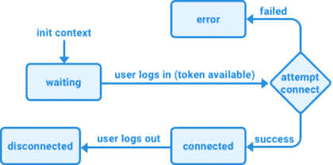
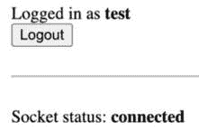
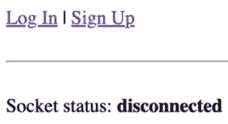
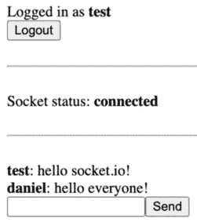

# 14

# 创建一个用于消费和发送事件的前端

在上一章成功创建 Socket.IO 后端，并进行了第一次 Socket.IO 客户端实验后，现在让我们专注于实现一个前端来连接后端并消费和发送事件。

我们首先将清理我们的项目，通过从之前创建的博客应用中删除文件。然后，我们将实现一个 React Context 来初始化和存储我们的 Socket.IO 实例，利用现有的 `AuthProvider` 为与后端进行身份验证提供令牌。之后，我们将实现一个用于我们的聊天应用的接口，以及发送聊天消息和显示接收到的聊天消息的方法。最后，我们将实现带有确认的聊天命令，以显示我们当前所在的房间。

在本章中，我们将涵盖以下主要主题：

+   将 Socket.IO 客户端集成到 React 中

+   实现聊天功能

+   实现带有确认的聊天命令

# 技术要求

在我们开始之前，请安装来自 *第一章* *为全栈开发做准备* 和 *第二章* *了解 Node.js 和 MongoDB* 的所有要求。

那些章节中列出的版本是书中使用的版本。虽然安装较新版本可能不会出现问题，但请注意，某些步骤在较新版本上可能有所不同。如果您在这本书提供的代码和步骤中遇到问题，请尝试使用 *第一章* 和 *第二章* 中列出的版本。

您可以在 GitHub 上找到本章的代码：[`github.com/PacktPublishing/Modern-Full-Stack-React-Projects/tree/main/ch14`](https://github.com/PacktPublishing/Modern-Full-Stack-React-Projects/tree/main/ch14)。

如果您克隆了本书的完整仓库，Husky 在运行 `npm install` 时可能找不到 `.git` 目录。在这种情况下，只需在相应章节文件夹的根目录中运行 `git init`。

本章的 CiA 视频可以在：[`youtu.be/d_TZK6S_XDU`](https://youtu.be/d_TZK6S_XDU) 找到。

# 将 Socket.IO 客户端集成到 React 中

让我们先清理项目，删除从博客应用中复制过来的所有旧文件。然后，我们将设置一个 Socket.IO 上下文，以便在 React 组件中更容易地初始化和使用 Socket.IO。最后，我们将创建第一个利用此上下文来显示我们的 Socket.IO 连接状态的组件。

## 清理项目

让我们先删除我们之前创建的博客应用中的文件夹和文件：

1.  将现有的 **ch13** 文件夹复制到新的 **ch14** 文件夹中，如下所示：

    ```js
    $ cp -R ch13 ch14
    ```

1.  在 VS Code 中打开 **ch14** 文件夹。

1.  *删除* 以下文件夹和文件，因为它们仅适用于博客应用的后端：

    +   **backend/src/__tests__/**

    +   **backend/src/example.js**

    +   **backend/src/db/models/post.js**

    +   **backend/src/routes/posts.js**

    +   **backend/src/services/posts.js**

1.  在 **backend/src/app.js** 中，*移除* 以下导入：

    ```js
    import postRoutes from './routes/posts.js'
    ```

1.  此外，*移除* **postRoutes**：

    ```js
    postRoutes(app)
    ```

1.  *删除* 以下文件夹和文件，因为它们仅用于博客应用的前端：

    +   **src/api/posts.js**

    +   **src/components/CreatePost.jsx**

    +   **src/components/Post.jsx**

    +   **src/components/PostFilter.jsx**

    +   **src/components/PostList.jsx**

    +   **src/components/PostSorting.jsx**

    +   **src/pages/Blog.jsx**

现在我们已经清理了我们的项目，让我们开始实现我们新聊天应用的 Socket.IO 上下文。

## 创建 Socket.IO 上下文

到目前为止，我们一直在 `src/App.jsx` 组件中初始化 Socket.IO 客户端实例。然而，这样做有一些缺点：

+   要在其他组件中访问套接字，我们需要通过属性传递它。

+   我们在整个应用中只能有一个套接字连接。

+   从 **AuthContext** 中动态获取令牌是不可能的，这迫使我们将其存储在本地存储中。

+   我们的应用需要完全刷新才能加载新的令牌并与之连接。

+   我们仍然尝试连接，并在未登录时获取错误。

为了解决这些问题，我们可以创建一个 Socket.IO 上下文。然后我们可以使用提供者组件执行以下操作：

+   只有在 **AuthContext** 中有可用令牌时才连接到 Socket.IO。

+   存储 Socket.IO 连接的状态，并在组件中使用它，例如，仅在登录时显示聊天界面。

+   存储错误对象并在用户界面中显示错误。

以下图表显示了我们的连接状态将如何被跟踪：



图 14.1 – 连接的不同状态

如所见，套接字连接最初正在等待用户登录。一旦可用令牌，我们尝试建立套接字连接。如果成功，状态变为`connected`，否则变为`error`。如果套接字断开连接（例如，当互联网连接丢失时），状态设置为`disconnected`。

现在，让我们开始创建 Socket.IO 上下文：

1.  创建一个新的 **src/contexts/SocketIOContext.jsx** 文件。

1.  在此文件中，从 **react**、**socket.io-client** 和 **prop-types** 中导入以下函数：

    ```js
    import { createContext, useState, useContext, useEffect } from 'react'
    import { io } from 'socket.io-client'
    import PropTypes from 'prop-types'
    ```

1.  此外，从 **AuthContext** 中导入 **useAuth** 钩子以获取当前令牌：

    ```js
    import { useAuth } from './AuthContext.jsx'
    ```

1.  现在，定义一个带有一些初始值（**socket**、**status** 和 **error**）的 React 上下文：

    ```js
    export const SocketIOContext = createContext({
      socket: null,
      status: 'waiting',
      error: null,
    })
    ```

1.  接下来，定义一个提供者组件，在其中我们首先为上下文的不同值创建状态钩子：

    ```js
    export const SocketIOContextProvider = ({ children }) => {
      const [socket, setSocket] = useState(null)
      const [status, setStatus] = useState('waiting')
      const [error, setError] = useState(null)
    ```

1.  然后，使用 **useAuth** 钩子获取 JWT（如果可用）：

    ```js
      const [token] = useAuth()
    ```

1.  创建一个效果钩子，检查令牌是否可用，如果可用，则尝试连接到 Socket.IO 后端：

    ```js
      useEffect(() => {
        if (token) {
          const socket = io(import.meta.env.VITE_SOCKET_HOST, {
            query: window.location.search.substring(1),
            auth: { token },
          })
    ```

    就像之前一样，我们传递主机、`query` 字符串和 `auth` 对象。然而，现在我们从 `useAuth` 钩子而不是本地存储中获取令牌。

1.  为**connect**、**connect_error**和**disconnect**事件创建处理程序，并分别设置**status**字符串和**error**对象：

    ```js
          socket.on('connect', () => {
            setStatus('connected')
            setError(null)
          })
          socket.on('connect_error', (err) => {
            setStatus('error')
            setError(err)
          })
          socket.on('disconnect', () => setStatus('disconnected'))
    ```

1.  设置**socket**对象并列出 effect 钩子所需的所有必要依赖项：

    ```js
          setSocket(socket)
        }
      }, [token, setSocket, setStatus, setError])
    ```

1.  现在，我们可以返回提供者，将状态钩子中的所有值传递给它：

    ```js
      return (
        <SocketIOContext.Provider value={{ socket, status, error }}>
          {children}
        </SocketIOContext.Provider>
      )
    }
    ```

1.  最后，我们为上下文提供者组件设置**PropTypes**，并定义一个将简单地返回整个上下文的**useSocket**钩子：

    ```js
    SocketIOContextProvider.propTypes = {
      children: PropTypes.element.isRequired,
    }
    export function useSocket() {
      return useContext(SocketIOContext)
    }
    ```

现在我们有一个上下文来初始化我们的 Socket.IO 客户端，让我们将其连接并显示套接字连接的状态。

## 连接上下文并显示状态

我们现在可以从`App`组件中删除连接到 Socket.IO 的代码，并使用提供者，如下所示：

1.  编辑**src/App.jsx**并*删除*以下导入：

    ```js
    import { io } from 'socket.io-client'
    ```

1.  向**SocketIOContextProvider**添加导入：

    ```js
    import { SocketIOContextProvider } from './contexts/SocketIOContext.jsx'
    ```

1.  然后，*删除*与 Socket.IO 连接相关的以下代码：

    ```js
    const socket = io(import.meta.env.VITE_SOCKET_HOST, {
      query: window.location.search.substring(1),
      auth: {
        token: window.localStorage.getItem('token'),
      },
    })
    socket.on('connect', async () => {
      console.log('connected to socket.io as', socket.id)
      socket.emit('chat.message', 'hello from client')
      const userInfo = await socket.emitWithAck('user.info', socket.id)
      console.log('user info', userInfo)
    })
    socket.on('connect_error', (err) => {
      console.error('socket.io connect error:', err)
    })
    socket.on('chat.message', (message) => {
      console.log(message)
    })
    ```

1.  在**App**组件内部，渲染上下文提供者：

    ```js
    export function App() {
      return (
        <QueryClientProvider client={queryClient}>
          <AuthContextProvider>
            <SocketIOContextProvider>
              <RouterProvider router={router} />
            </SocketIOContextProvider>
          </AuthContextProvider>
        </QueryClientProvider>
      )
    }
    ```

在连接 Socket.IO 上下文之后，让我们继续创建一个用于显示状态的`Status`组件。

### 创建一个状态组件

现在，让我们创建一个`Status`组件来显示套接字当前的状态：

1.  创建一个新的**src/components/Status.jsx**文件。

1.  在其中，从我们的**SocketIOContext**导入**useSocket**钩子：

    ```js
    import { useSocket } from '../contexts/SocketIOContext.jsx'
    ```

1.  定义一个**Status**组件，其中我们从钩子中获取**status**字符串和**error**对象：

    ```js
    export function Status() {
      const { status, error } = useSocket()
    ```

1.  渲染套接字状态：

    ```js
      return (
        <div>
          Socket status: <b>{status}</b>
    ```

1.  如果我们有一个**error**对象，我们现在还可以显示错误信息：

    ```js
          {error && <i> - {error.message}</i>}
        </div>
      )
    }
    ```

现在我们有一个`Status`组件，让我们创建一个`Chat`页面组件，在其中渲染`Header`和`Status`组件。

### 创建一个聊天页面组件

我们之前在我们的博客应用中有一个`Blog`页面，我们在本章早期删除了它。现在，让我们为我们的聊天应用创建一个新的`Chat`页面组件：

1.  创建一个新的**src/pages/Chat.jsx**文件。

1.  在其中，导入**Header**组件（我们将从**Blog**应用中重用）和**Status**组件：

    ```js
    import { Header } from '../components/Header.jsx'
    import { Status } from '../components/Status.jsx'
    ```

1.  渲染一个**Chat**组件，在其中显示**Header**和**Status**组件：

    ```js
    export function Chat() {
      return (
        <div style={{ padding: 8 }}>
          <Header />
          <br />
          <hr />
          <br />
          <Status />
        </div>
      )
    }
    ```

1.  编辑**src/App.jsx**并定位到以下导入：

    ```js
    import { Blog } from './pages/Blog.jsx'
    ```

    *替换*为对`Chat`组件的导入：

    ```js
    import { Chat } from './pages/Chat.jsx'
    ```

1.  最后，*替换*主路径中的**<Blog />**组件为**<Chat />**组件：

    ```js
    const router = createBrowserRouter(
      {
        path: '/',
        element: <Chat />,
      },
    ```

### 启动和测试我们的聊天应用前端

我们现在可以启动并测试我们的聊天应用前端：

1.  按照以下方式运行前端：

    ```js
    $ npm run dev
    ```

1.  按照以下方式运行后端（确保 Docker 和数据库容器正在运行！）：

    ```js
    $ cd backend/
    $ npm run dev
    ```

1.  现在转到**http://localhost:5173/**，你应该看到以下界面：



图 14.3 – 用户登录后套接字已连接

## 注销时断开套接字

你可能已经注意到，当按下 **注销** 时，套接字仍然保持连接。现在，让我们修复这个问题，通过在注销时断开套接字。

1.  编辑 **src/components/Header.jsx** 并导入 **useSocket** 钩子：

    ```js
    import { useSocket } from '../contexts/SocketIOContext.jsx'
    ```

1.  从 **useSocket** 钩子中获取套接字，如下所示：

    ```js
    export function Header() {
      const [token, setToken] = useAuth()
      const { socket } = useSocket()
    ```

1.  定义一个新的 **handleLogout** 函数，它断开套接字并重置令牌：

    ```js
      const handleLogout = () => {
        socket.disconnect()
        setToken(null)
      }
    ```

1.  最后，将 **onClick** 处理器设置为 **handleLogout** 函数：

    ```js
            <button onClick={handleLogout}>Logout</button>
    ```

现在，当你注销时，套接字将会断开连接，如下面的截图所示：



图 14.4 – 注销后套接字已断开

现在 Socket.IO 客户端已成功集成到我们的 React 前端，我们可以继续在前端实现聊天功能。

# 实现 chat 功能

我们现在将实现发送和接收消息的功能。首先，我们将实现所有需要的组件。然后，我们将创建一个 `useChat` 钩子来实现与套接字连接的接口并提供发送/接收消息的函数。最后，我们将通过创建聊天室来将这些功能组合在一起。

## 实现 chat 组件

我们将实现以下聊天组件：

+   **ChatMessage**：用于显示聊天消息

+   **EnterMessage**：一个输入新消息的字段和一个发送它们的按钮

### 实现 ChatMessage 组件

让我们先实现 `ChatMessage` 组件：

1.  创建一个新的 **src/components/ChatMessage.jsx** 文件，它将渲染聊天消息。

1.  导入 **PropTypes** 并定义一个新的函数，带有 **username** 和 **message** 属性：

    ```js
    import PropTypes from 'prop-types'
    export function ChatMessage({ username, message }) {
    ```

1.  以粗体形式渲染用户名，并在其旁边显示消息：

    ```js
      return (
        <div>
          <b>{username}</b>: {message}
        </div>
      )
    }
    ```

1.  定义属性类型，如下所示：

    ```js
    ChatMessage.propTypes = {
      username: PropTypes.string.isRequired,
      message: PropTypes.string.isRequired,
    }
    ```

### 实现 EnterMessage 组件

现在，让我们创建 `EnterMessage` 组件，它将允许用户发送新的聊天消息：

1.  创建一个新的 **src/components/EnterMessage.jsx** 文件。

1.  导入 **useState** 钩子和 **PropTypes**：

    ```js
    import { useState } from 'react'
    import PropTypes from 'prop-types'
    ```

1.  定义一个新的 **EnterMessage** 组件，它接收一个 **onSend** 函数作为属性：

    ```js
    export function EnterMessage({ onSend }) {
    ```

1.  我们存储输入的消息的当前状态：

    ```js
      const [message, setMessage] = useState('')
    ```

1.  然后，我们定义一个函数来处理发送请求并在之后清除字段：

    ```js
      function handleSend(e) {
        e.preventDefault()
        onSend(message)
        setMessage('')
      }
    ```

提醒

因为我们是使用 **submit** 按钮提交表单，所以我们需要调用 **e.preventDefault()** 来防止表单刷新页面。

1.  渲染一个表单，包含一个输入字段来输入消息和一个按钮来发送它：

    ```js
      return (
        <form onSubmit={handleSend}>
          <input
            type='text'
            value={message}
            onChange={(e) => setMessage(e.target.value)}
          />
          <input type='submit' value='Send' />
        </form>
      )
    }
    ```

1.  定义属性类型，如下所示：

    ```js
    EnterMessage.propTypes = {
      onSend: PropTypes.func.isRequired,
    }
    ```

## 实现 useChat 钩子

为了将所有逻辑组合在一起，我们将实现一个 `useChat` 钩子，它将处理发送和接收消息，以及将所有当前消息存储在状态钩子中。按照以下步骤实现它：

1.  创建一个新的 **src/hooks/** 文件夹。在其内部，创建一个新的 **src/hooks/useChat.js** 文件。

1.  从 React 中导入 **useState** 和 **useEffect** 钩子：

    ```js
    import { useState, useEffect } from 'react'
    ```

1.  从我们的上下文中导入 **useSocket** 钩子：

    ```js
    import { useSocket } from '../contexts/SocketIOContext.jsx'
    ```

1.  定义一个新的 **useChat** 函数，其中我们从 **useSocket** 钩子获取套接字，并定义一个状态钩子来存储消息数组：

    ```js
    export function useChat() {
      const { socket } = useSocket()
      const [messages, setMessages] = useState([])
    ```

1.  接下来，定义一个 **receiveMessage** 函数，该函数将新消息追加到数组中：

    ```js
      function receiveMessage(message) {
        setMessages((messages) => [...messages, message])
      }
    ```

1.  现在，创建一个效果钩子，在其中我们使用 **socket.on** 创建一个监听器：

    ```js
      useEffect(() => {
        socket.on('chat.message', receiveMessage)
    ```

1.  我们需要确保在效果钩子卸载时再次使用 **socket.off** 移除监听器，否则在组件重新渲染或卸载时我们可能会得到多个监听器：

    ```js
        return () => socket.off('chat.message', receiveMessage)
      }, [])
    ```

1.  现在，接收消息应该可以正常工作。让我们继续发送消息。为此，我们创建一个 **sendMessage** 函数，该函数使用 **socket.emit** 来发送消息：

    ```js
      function sendMessage(message) {
        socket.emit('chat.message', message)
      }
    ```

1.  最后，返回 **messages** 数组和 **sendMessage** 函数，以便我们可以在我们的组件中使用它们：

    ```js
      return { messages, sendMessage }
    }
    ```

现在我们已经成功实现了 `useChat` 钩子，让我们使用它！

## 实现 ChatRoom 组件

最后，我们可以把它们全部放在一起，并实现一个 `ChatRoom` 组件。按照以下步骤开始：

1.  创建一个新的 **src/components/ChatRoom.jsx** 文件。

1.  导入 **useChat** 钩子和 **EnterMessage** 以及 **ChatMessage** 组件：

    ```js
    import { useChat } from '../hooks/useChat.js'
    import { EnterMessage } from './EnterMessage.jsx'
    import { ChatMessage } from './ChatMessage.jsx'
    ```

1.  定义一个新的组件，该组件从 **useChat** 钩子获取 **messages** 数组和 **sendMessage** 函数：

    ```js
    export function ChatRoom() {
      const { messages, sendMessage } = useChat()
    ```

1.  然后，将消息列表渲染为 **ChatMessage** 组件：

    ```js
      return (
        <div>
          {messages.map((message, index) => (
            <ChatMessage key={index} {...message} />
          ))}
    ```

1.  接下来，渲染 **EnterMessage** 组件，并将 **sendMessage** 函数作为 **onSend** 属性传递：

    ```js
          <EnterMessage onSend={sendMessage} />
        </div>
      )
    }
    ```

1.  编辑 **src/pages/Chat.jsx** 并导入 **ChatRoom** 组件和 **useSocket** 钩子：

    ```js
    import { ChatRoom } from '../components/ChatRoom.jsx'
    import { useSocket } from '../contexts/SocketIOContext.jsx'
    ```

1.  从 **Chat** 页面组件中的 **useSocket** 钩子获取状态：

    ```js
    export function Chat() {
      const { status } = useSocket()
    ```

1.  如果状态是 **已连接**，我们显示 **ChatRoom** 组件：

    ```js
      return (
        <div style={{ padding: 8 }}>
          <Header />
          <br />
          <hr />
          <br />
          <Status />
          <br />
          <hr />
          <br />
          {status === 'connected' && <ChatRoom />}
    ```

1.  现在，在您的浏览器中转到 **http://localhost:5173/** 并使用用户名和密码登录。套接字连接并渲染聊天室。输入一条聊天消息，并通过按 *Return/Enter* 或点击 **发送** 按钮发送它。您将看到消息被接收并显示出来！

1.  打开第二个浏览器窗口并使用第二个用户登录。在那里发送另一条消息。您将看到消息被两个用户接收，如下面的截图所示：



图 14.5 – 从不同用户发送和接收消息

现在我们有一个基本的聊天应用正在运行，让我们探索如何使用确认来实现聊天命令。

# 使用确认实现聊天命令

除了发送和接收消息外，聊天应用通常还提供了一种向客户端和/或服务器发送命令的方式。例如，我们可以发送一个 `/clear` 命令来清除我们的本地消息列表。或者，我们可以发送一个 `/rooms` 命令来获取我们所在的房间列表。按照以下步骤实现聊天命令：

1.  编辑**src/hooks/useChat.js**并调整其中的**sendMessage**函数。首先，让我们将其改为**async**函数：

    ```js
      async function sendMessage(message) {
    ```

1.  *替换*函数的内容如下。我们首先检查消息是否以斜杠（**/**）开头。如果是，那么我们通过删除斜杠来获取命令，并使用**switch**语句：

    ```js
        if (message.startsWith('/')) {
          const command = message.substring(1)
          switch (command) {
    ```

1.  对于**clear**命令，我们只需将消息数组设置为空数组：

    ```js
            case 'clear':
              setMessages([])
              break
    ```

1.  对于**rooms**命令，我们通过使用**socket.emitWithAck**和我们的**socket.id**来获取用户信息：

    ```js
            case 'rooms': {
              const userInfo = await socket.emitWithAck('user.info', socket.id)
    ```

1.  然后，我们获取房间列表，过滤掉我们自动加入的带有我们**socket.id**名称的房间：

    ```js
              const rooms = userInfo.rooms.filter((room) => room !== socket.id)
    ```

1.  我们重用**receiveMessage**函数从服务器发送消息，告诉我们我们所在的房间：

    ```js
              receiveMessage({
                message: `You are in: ${rooms.join(', ')}`,
              })
              break
            }
    ```

    注意，这里我们没有发送用户名，只是发送消息。我们稍后必须调整`ChatMessage`组件以适应这一点。

1.  如果我们收到任何其他命令，我们将显示一个错误消息：

    ```js
            default:
              receiveMessage({
                message: `Unknown command: ${command}`,
              })
              break
          }
    ```

1.  否则（如果消息没有以斜杠开头），我们就像之前一样简单地发出聊天消息：

    ```js
        } else {
          socket.emit('chat.message', message)
        }
      }
    ```

1.  最后，编辑**src/components/ChatMessage.jsx**并调整组件以在未提供用户名时渲染系统消息：

    ```js
    export function ChatMessage({ username, message }) {
      return (
        <div>
          {username ? (
            <span>
              <b>{username}</b>: {message}
            </span>
          ) : (
            <i>{message}</i>
          )}
        </div>
      )
    }
    ```

1.  不要忘记调整**PropTypes**以使用户名可选（通过从**username**属性中*移除***.isRequired**）：

    ```js
    ChatMessage.propTypes = {
      username: PropTypes.string,
    ```

1.  在您的浏览器中转到**http://localhost:5173/**并尝试发送几条消息。然后，键入**/clear**，您将看到所有消息都被清除了。接下来，键入**/rooms**以获取您所在的房间列表，如下面的截图所示：


图 14.6 – 发送/rooms 命令

注意

由于登录后查询参数被清除，目前无法加入不同的房间。在下一章中，我们将重构聊天应用并实现**/join**命令以加入不同的房间。

# 摘要

在本章中，我们为我们的聊天应用后端实现了一个前端。我们首先通过创建一个上下文和自定义钩子来集成 Socket.IO 客户端和 React。然后，我们使用`AuthProvider`获取令牌以在连接到 socket 时验证用户。之后，我们显示了我们的 socket 状态。然后，我们实现了聊天应用界面以发送和接收消息。最后，我们通过使用确认来获取我们所在的房间实现了聊天命令。

在下一章，*第十五章*，*使用 MongoDB 为 Socket.IO 添加持久性*，我们将学习如何使用 MongoDB 和 Socket.IO 存储和回放之前发送的消息。
