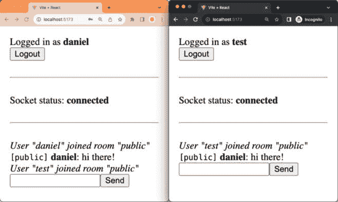
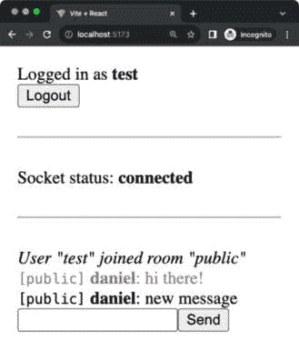
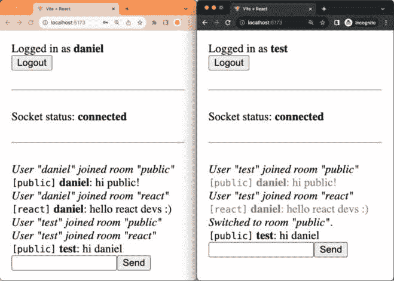

# 第十五章：在 Socket.IO 中使用 MongoDB 添加持久性

现在我们已经实现了 Socket.IO 后端和前端，让我们花些时间将其与 MongoDB 数据库集成，通过在数据库中临时存储消息并在新用户加入时回放它们，这样用户在加入后可以看到聊天历史。此外，我们将重构我们的聊天应用程序，使其为未来的扩展和维护做好准备。最后，我们将通过实现新的加入和切换房间的命令来测试新的结构。

在本章中，我们将涵盖以下主要主题：

+   使用 MongoDB 存储和回放消息

+   重构应用程序以使其更具可扩展性

+   实现加入和切换房间的命令

# 技术要求

在我们开始之前，请从*第一章**，准备全栈开发*和*第二章**，了解 Node.js*和 MongoDB*中安装所有要求。

那些章节中列出的版本是书中使用的版本。虽然安装较新版本可能不会有问题，但请注意，某些步骤在较新版本上可能有所不同。如果您在这本书提供的代码和步骤中遇到问题，请尝试使用*第一章*和*第二章*中提到的版本。

您可以在 GitHub 上找到本章的代码：[`github.com/PacktPublishing/Modern-Full-Stack-React-Projects/tree/main/ch15`](https://github.com/PacktPublishing/Modern-Full-Stack-React-Projects/tree/main/ch15)。

如果您克隆了本书的完整仓库，Husky 在运行 `npm install` 时可能找不到 `.git` 目录。在这种情况下，只需在相应章节文件夹的根目录中运行 `git init`。

本章的 CiA 视频可以在以下网址找到：[`youtu.be/Mi7Wj_jxjhM`](https://youtu.be/Mi7Wj_jxjhM)。

# 使用 MongoDB 存储和回放消息

目前，如果新用户加入聊天，他们将看不到任何消息，直到有人主动发送消息。因此，新用户将无法很好地参与正在进行中的讨论。为了解决这个问题，我们可以将消息存储在数据库中，并在用户加入时回放它们。

## 创建 Mongoose 模式

按照以下步骤创建用于存储聊天消息的 Mongoose 模式：

1.  将现有的 **ch14** 文件夹复制到新的 **ch15** 文件夹，如下所示：

    ```js
    $ cp -R ch14 ch15
    ```

1.  在 VS Code 中打开新的 **ch15** 文件夹。

1.  创建一个新的 **backend/src/db/models/message.js** 文件。

1.  在其中，定义一个新的 **messageSchema**，我们将使用它来在数据库中存储聊天消息：

    ```js
    import mongoose, { Schema } from 'mongoose'
    const messageSchema = new Schema({
    ```

1.  消息模式应包含 **username**（发送消息的人）、**message**、一个 **room**（消息发送的房间）和 **sent** 日期（消息发送的时间）：

    ```js
      username: { type: String, required: true },
      message: { type: String, required: true },
      room: { type: String, required: true },
      sent: { type: Date, expires: 5 * 60, default: Date.now, required: true },
    })
    ```

    对于`发送`日期，我们指定`expires`以使消息在 5 分钟后自动过期（`5 * 60`秒）。这确保我们的数据库不会因为大量的聊天消息而变得杂乱。我们还设置了`default`值为`Date.now`，以便所有消息默认标记为在当前时间发送。

信息

MongoDB 实际上只在每分钟检查一次数据过期，因此过期的文档可能会在其定义的过期时间后持续一分钟。

1.  从模式创建一个模型并导出它：

    ```js
    export const Message = mongoose.model('message', messageSchema)
    ```

在创建 Mongoose 模式和模型后，让我们继续创建处理聊天消息的服务函数。

## 创建服务函数

我们需要创建服务函数来在数据库中保存一条新消息，并获取在给定房间中发送的所有消息，按`发送`日期排序，首先显示最旧的消息。按照以下步骤实现服务函数：

1.  创建一个新的**backend/src/services/messages.js**文件。

1.  在其中，导入**Message**模型：

    ```js
    import { Message } from '../db/models/message.js'
    ```

1.  然后，定义一个函数在数据库中创建一个新的**Message**对象：

    ```js
    export async function createMessage({ username, message, room }) {
      const messageDoc = new Message({ username, message, room })
      return await messageDoc.save()
    }
    ```

1.  此外，定义一个函数以获取某个房间的所有消息，按最旧的消息列表显示：

    ```js
    export async function getMessagesByRoom(room) {
      return await Message.find({ room }).sort({ sent: 1 })
    }
    ```

接下来，我们将在我们的聊天服务器中使用这些服务函数。

## 存储和回放消息

现在我们有了所有函数，我们需要在我们的聊天服务器中实现存储和回放消息。按照以下步骤实现功能：

1.  编辑**backend/src/socket.js**并导入我们之前定义的服务函数：

    ```js
    import { createMessage, getMessagesByRoom } from './services/messages.js'
    ```

1.  当新用户连接时，获取当前房间的所有消息，并使用**socket.emit**将它们发送（回放）给用户：

    ```js
    export function handleSocket(io) {
      io.on('connection', async (socket) => {
        const room = socket.handshake.query?.room ?? 'public'
        socket.join(room)
        console.log(socket.id, 'joined room:', room)
        const messages = await getMessagesByRoom(room)
        messages.forEach(({ username, message }) =>
          socket.emit('chat.message', { username, message }),
        )
    ```

1.  此外，当用户发送消息时，将其存储在数据库中：

    ```js
        socket.on('chat.message', (message) => {
          console.log(`${socket.id}: ${message}`)
          io.to(room).emit('chat.message', {
            username: socket.user.username,
            message,
          })
          createMessage({ username: socket.user.username, message, room })
        })
    ```

1.  按照以下方式启动前端服务器：

    ```js
    $ npm run dev
    ```

1.  然后，启动后端服务器（不要忘记启动数据库的 Docker 容器！）：

    ```js
    $ cd backend/
    $ npm run dev
    ```

1.  前往**http://localhost:5173/**，登录并发送一些消息。然后，打开一个新标签页，用不同的用户登录，您将看到之前发送的消息被回放：



图 15.1 – 成功回放存储的消息

注意

*图 15.1*中的截图是应用程序的较晚版本，其中我们在用户加入房间时显示消息（我们将在本章后面实现这些消息）。在这里，我们使用这些消息来显示当用户在发送消息后加入时，回放是有效的。

如果您等待 5 分钟然后再次加入聊天，您将看到现有的消息已过期并且不再被回放。

现在，让我们让用户界面更清晰地显示哪些消息被回放了。

## 可视区分回放消息

目前看来，其他用户似乎在我们加入后立即发送了消息。这并不明显表明消息是从服务器回放的。为了解决这个问题，我们可以通过例如使它们稍微灰一些来在视觉上区分回放的消息。现在让我们这样做，如下所示：

1.  编辑 **backend/src/socket.js** 并为回放消息添加一个 **replayed** 标志：

    ```js
        const messages = await getMessagesByRoom(room)
        messages.forEach(({ username, message }) =>
          socket.emit('chat.message', { username, message, replayed: true }),
        )
    ```

1.  现在，编辑 **src/components/ChatMessage.jsx**，如果设置了 **replayed** 标志，则以较低的透明度显示消息：

    ```js
    export function ChatMessage({ username, message, replayed }) {
      return (
        <div style={{ opacity: replayed ? 0.5 : 1.0 }}>
    ```

1.  不要忘记更新 **propTypes** 并添加 **replayed** 标志：

    ```js
    ChatMessage.propTypes = {
      username: PropTypes.string,
      message: PropTypes.string.isRequired,
      replayed: PropTypes.bool,
    }
    ```

1.  再次访问 **http://localhost:5173/** 并重复相同的程序（从一个用户发送消息，然后在另一个标签页中用不同的用户登录），你将看到回放的消息现在很容易与新的消息区分开来：



图 15.2 – 回放的消息现在以较浅的颜色显示

现在我们已经成功将消息历史存储在数据库中，让我们稍微关注一下重构聊天应用程序，使其在未来更具可扩展性和可维护性。

# 将应用程序重构为更易于扩展

对于重构，我们将首先定义所有由我们的服务器提供的聊天功能的服务函数。

## 定义服务函数

按照以下步骤开始定义聊天功能的服务函数：

1.  创建一个新的 **backend/src/services/chat.js** 文件。

1.  在其中，导入与消息相关的服务函数：

    ```js
    import { createMessage, getMessagesByRoom } from './messages.js'
    ```

1.  定义一个新函数，直接向用户发送私密消息：

    ```js
    export function sendPrivateMessage(
      socket,
      { username, room, message, replayed },
    ) {
      socket.emit('chat.message', { username, message, room, replayed })
    }
    ```

    私信将被用于，例如，将消息回放给特定用户，并且不会存储在数据库中。

1.  此外，定义一个函数来发送系统消息：

    ```js
    export function sendSystemMessage(io, { room, message }) {
      io.to(room).emit('chat.message', { message, room })
    }
    ```

    系统消息将被用于，例如，宣布用户加入了房间。我们也不希望将这些存储在数据库中。

1.  然后，定义一个函数来发送公共消息：

    ```js
    export function sendPublicMessage(io, { username, room, message }) {
      io.to(room).emit('chat.message', { username, message, room })
      createMessage({ username, message, room })
    }
    ```

    公共消息将被用于向房间发送常规聊天消息。这些消息存储在数据库中，以便我们稍后回放。

1.  我们还定义了一个新函数来将给定的 **socket** 加入到 **room** 中：

    ```js
    export async function joinRoom(io, socket, { room }) {
      socket.join(room)
    ```

1.  在此函数内部，发送一个系统消息，告诉房间内所有人有人加入了：

    ```js
      sendSystemMessage(io, {
        room,
        message: `User "${socket.user.username}" joined room "${room}"`,
      })
    ```

1.  然后，将房间中发送的私密消息回放给刚刚加入的用户：

    ```js
      const messages = await getMessagesByRoom(room)
      messages.forEach(({ username, message }) =>
        sendPrivateMessage(socket, { username, message, room, replayed: true })
      )
    }
    ```

1.  最后，定义一个服务函数来从 **socketId** 获取用户信息。我们只需将之前在 **backend/src/socket.js** 中已有的代码复制粘贴到这里：

    ```js
    export async function getUserInfoBySocketId(io, socketId) {
      const sockets = await io.in(socketId).fetchSockets()
      if (sockets.length === 0) return null
      const socket = sockets[0]
      const userInfo = {
        socketId,
        rooms: Array.from(socket.rooms),
        user: socket.user,
      }
      return userInfo
    }
    ```

现在我们已经为聊天功能创建了服务函数，让我们在 Socket.IO 服务器中使用它们。

## 将 Socket.IO 服务器重构为使用服务函数

现在我们已经定义了服务函数，让我们重构聊天服务器代码以使用它们。按照以下步骤进行操作：

1.  打开 **backend/src/socket.js** 并找到以下导入：

    ```js
    import { createMessage, getMessagesByRoom } from './services/messages.js'
    ```

    用以下导入替换前面的导入以使用新的聊天服务函数：

    ```js
    import {
      joinRoom,
      sendPublicMessage,
      getUserInfoBySocketId,
    } from './services/chat.js'
    ```

1.  *替换*整个**handleSocket**函数为以下新代码。当建立连接时，我们自动使用**joinRoom**服务函数加入公共房间：

    ```js
    export function handleSocket(io) {
      io.on('connection', (socket) => {
        joinRoom(io, socket, { room: 'public' })
    ```

1.  然后，定义一个监听**chat.message**事件的监听器，并使用**sendPublicMessage**服务函数将事件发送到指定的房间：

    ```js
        socket.on('chat.message', (room, message) =>
          sendPublicMessage(io, { username: socket.user.username, room, message }),
        )
    ```

注意

我们将**chat.message**事件的签名更改为现在需要传递一个房间，这样我们就可以在以后实现一种更好的处理多个房间的方法。稍后，我们需要确保调整客户端代码以适应这一点。

1.  接下来，定义一个监听**user.info**事件的监听器，在其中我们使用**async**服务函数**getUserInfoBySocketId**并在**callback**中返回其结果，将此事件转换为确认：

    ```js
        socket.on('user.info', async (socketId, callback) =>
          callback(await getUserInfoBySocketId(io, socketId)),
        )
      })
    ```

1.  最后，我们可以重新使用之前的身份验证中间件：

    ```js
      io.use((socket, next) => {
        if (!socket.handshake.auth?.token) {
          return next(new Error('Authentication failed: no token provided'))
        }
        jwt.verify(
          socket.handshake.auth.token,
          process.env.JWT_SECRET,
          async (err, decodedToken) => {
            if (err) {
              return next(new Error('Authentication failed: invalid token'))
            }
            socket.auth = decodedToken
            socket.user = await getUserInfoById(socket.auth.sub)
            return next()
          },
        )
      })
    }
    ```

现在我们已经重构了聊天服务器，让我们继续重构客户端代码。

## 重构客户端代码

现在由于我们的服务器端代码使用服务函数来封装聊天应用的功能，让我们通过将客户端命令提取到单独的函数中来对客户端代码进行类似的重构，如下所示：

1.  编辑**src/hooks/useChat.js**并在**useChat**钩子中定义一个新的函数来清除消息：

    ```js
      function clearMessages() {
        setMessages([])
      }
    ```

1.  然后，定义一个**async**函数来获取用户所在的全部房间：

    ```js
      async function getRooms() {
        const userInfo = await socket.emitWithAck('user.info', socket.id)
        const rooms = userInfo.rooms.filter((room) => room !== socket.id)
        return rooms
      }
    ```

1.  我们现在可以在**sendMessage**函数中使用这些函数，如下所示：

    ```js
      async function sendMessage(message) {
        if (message.startsWith('/')) {
          const command = message.substring(1)
          switch (command) {
            case 'clear':
              clearMessages()
              break
            case 'rooms': {
              const rooms = await getRooms()
              receiveMessage({
                message: `You are in: ${rooms.join(', ')}`,
              })
              break
            }
    ```

1.  最后，我们调整**chat.message**事件以发送**room**和**message**。目前，我们总是向**'****public'**房间发送消息：

    ```js
            default:
              receiveMessage({
                message: `Unknown command: ${command}`,
              })
              break
          }
        } else {
          socket.emit('chat.message', 'public', message)
        }
      }
    ```

    在下一节中，我们将扩展它以能够在不同的房间之间切换。

1.  访问**http://localhost:5173/**并验证聊天应用是否仍然像以前一样工作。

现在我们已经成功重构了聊天应用以使其更具可扩展性，让我们通过实现新的加入和切换房间的命令来测试新结构的灵活性。

# 实现加入和切换房间的命令

让我们现在通过在聊天应用中实现加入和切换房间的命令来测试新结构，如下所示：

1.  编辑**backend/src/socket.js**并在**chat.message**监听器下方定义一个新的监听器，当从客户端接收到**chat.join**事件时，它将调用**joinRoom**服务函数：

    ```js
        socket.on('chat.join', (room) => joinRoom(io, socket, { room }))
    ```

    如我们所见，有一个**joinRoom**服务函数使得在这里重新使用代码加入新房间变得非常简单。它已经发送了一条系统消息告诉每个人有人加入了房间，就像用户在连接时默认加入`public`房间时一样。

1.  编辑**src/components/ChatMessage.jsx**并显示**room**：

    ```js
    export function ChatMessage({ room, username, message, replayed }) {
      return (
        <div style={{ opacity: replayed ? 0.5 : 1.0 }}>
          {username ? (
            <span>
              <code>[{room}]</code> <b>{username}</b>: {message}
            </span>
    ```

1.  将**room**属性添加到**propTypes**定义中：

    ```js
    ChatMessage.propTypes = {
      username: PropTypes.string,
      message: PropTypes.string.isRequired,
      replayed: PropTypes.bool,
      room: PropTypes.string,
    }
    ```

1.  现在，编辑**src/hooks/useChat.js**并定义一个状态钩子来存储我们当前所在的房间：

    ```js
    export function useChat() {
      const { socket } = useSocket()
      const [messages, setMessages] = useState([])
    public room.
    ```

1.  定义一个新函数来切换房间：

    ```js
      function switchRoom(room) {
        setCurrentRoom(room)
      }
    ```

    目前，我们在这里只调用了`setCurrentRoom`，但我们可能希望在以后扩展这个功能，所以提前将其抽象成一个单独的函数是一个好的实践。

1.  定义一个新的函数，通过发送**chat.join**事件和切换当前房间来加入一个房间：

    ```js
      function joinRoom(room) {
        socket.emit('chat.join', room)
        switchRoom(room)
      }
    ```

1.  将**sendMessage**函数修改为接受命令参数，如下所示：

    ```js
      async function sendMessage(message) {
        if (message.startsWith('/')) {
          const [command, ...args] = message.substring(1).split(' ')
          switch (command) {
    ```

    我们现在可以发送如`/join <room-name>`之类的命令，房间名称将存储在`args[0]`中。

1.  定义一个新的命令来加入一个房间，其中我们首先检查是否向命令传递了参数：

    ```js
            case 'join': {
              if (args.length === 0) {
                return receiveMessage({
                  message: 'Please provide a room name: /join <room>',
                })
              }
    ```

1.  然后，我们使用**getRooms**函数确保我们没有已经加入房间：

    ```js
              const room = args[0]
              const rooms = await getRooms()
              if (rooms.includes(room)) {
                return receiveMessage({
                  message: `You are already in room "${room}".`,
                })
              }
    ```

1.  最后，我们可以通过使用**joinRoom**函数加入房间：

    ```js
              joinRoom(room)
              break
            }
    ```

1.  类似地，我们可以实现**/switch**命令，如下所示：

    ```js
            case 'switch': {
              if (args.length === 0) {
                return receiveMessage({
                  message: 'Please provide a room name: /switch <room>',
                })
              }
              const room = args[0]
              const rooms = await getRooms()
              if (!rooms.includes(room)) {
                return receiveMessage({
                  message: `You are not in room "${room}". Type "/join ${room}" to join it first.`,
                })
              }
              switchRoom(room)
              receiveMessage({
                message: `Switched to room "${room}".`,
              })
              break
            }
    ```

    在这种情况下，我们正在检查用户是否已经在房间中。如果没有，我们告诉他们他们必须先加入房间，然后再切换到它。

1.  调整**chat.message**事件，使其发送到**currentRoom**，如下所示：

    ```js
        } else {
          socket.emit('chat.message', currentRoom, message)
        }
    ```

1.  访问**http://localhost:5173/**，向公共房间发送一条消息，然后通过执行**/join react**命令加入**react**房间。向该房间发送不同的消息。

1.  打开另一个浏览器窗口，用不同的用户登录，你会看到来自**公共**房间的第一条消息被回放了。然而，我们看不到来自**react**房间的消息，因为我们还没有加入它！

1.  现在，在第二个浏览器窗口中，也调用**/join react**。你会看到现在第二个消息被回放了。

1.  尝试使用**/switch public**来切换回**公共**房间并发送另一条消息。你会看到两个客户端都收到了这条消息，因为他们都在**公共**房间中。

这些操作的结果可以在以下屏幕截图中看到：



图 15.3 – 在不同房间聊天

# 概述

在本章中，我们首先通过将消息存储在 MongoDB 中来将我们的聊天应用连接到数据库。我们还学习了如何使文档在一段时间后过期。然后，我们实现了当新用户加入聊天时回放消息的功能。接下来，我们花了一些时间重构聊天应用，使其在未来更具可扩展性和可维护性。最后，我们实现了加入新房间和在不同房间之间切换的方法。

到目前为止，我们只使用库来开发我们的应用。在下一章*第十六章**，使用 Next.js 入门*中，我们将学习如何使用全栈 React 框架来开发应用。框架，如 Next.js，为我们提供了更多的应用结构，并提供了许多功能，例如服务器端渲染等。
