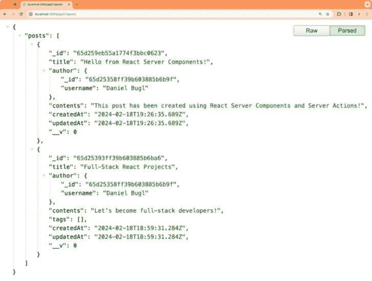
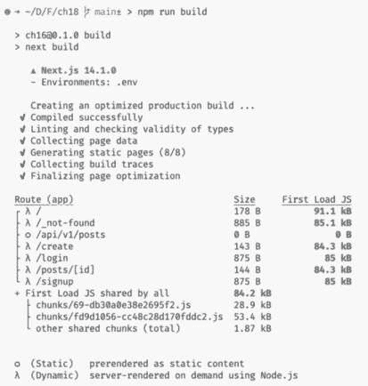
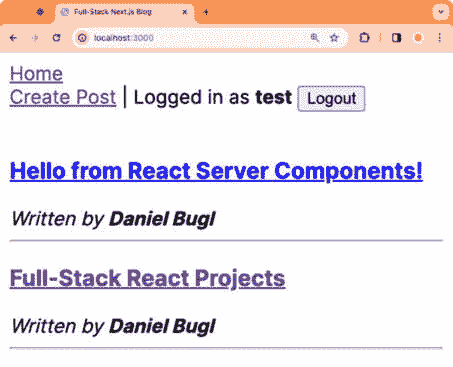
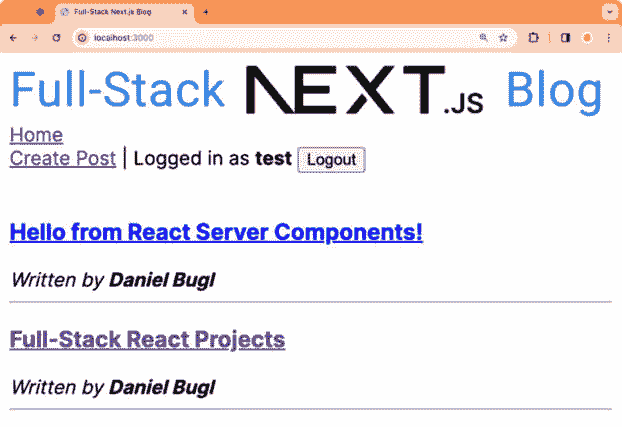

# 第十八章：高级 Next.js 概念和优化

现在我们已经了解了 Next.js 和 **React 服务器组件**（**RSCs**）的基本功能，让我们更深入地探讨 Next.js 框架。在本章中，我们将学习 Next.js 中的缓存工作原理以及如何利用它来优化我们的应用程序。我们还将学习如何在 Next.js 中实现 API 路由。然后，我们将学习如何通过添加元数据来优化 Next.js 应用程序以适应搜索引擎和社交媒体。最后，我们将学习如何在 Next.js 中最优地加载图片和字体。

在本章中，我们将涵盖以下主要主题：

+   在 Next.js 中定义 API 路由

+   Next.js 中的缓存

+   **搜索引擎优化**（**SEO**）与 Next.js

+   Next.js 中优化的图片和字体加载

# 技术要求

在我们开始之前，请安装来自 *第一章* *为全栈开发做准备* 和 *第二章* *了解 Node.js 和 MongoDB* 的所有要求。

那些章节中列出的版本是本书中使用的版本。虽然安装较新版本可能不会有问题，但请注意，某些步骤可能会有所不同。如果你在使用本书中提供的代码和步骤时遇到问题，请尝试使用 *第一章* 和 *2* 中提到的版本。

你可以在 GitHub 上找到本章的代码：[`github.com/PacktPublishing/Modern-Full-Stack-React-Projects/tree/main/ch18`](https://github.com/PacktPublishing/Modern-Full-Stack-React-Projects/tree/main/ch18)。

本章的 CiA 视频可在以下网址找到：[`youtu.be/jzCRoJPGoG0`](https://youtu.be/jzCRoJPGoG0)。

# 在 Next.js 中定义 API 路由

在上一章中，我们使用 RSCs 通过数据层访问我们的数据库；为此不需要 API 路由！然而，有时公开外部 API 仍然是有意义的。例如，我们可能希望允许第三方应用程序查询博客文章。幸运的是，Next.js 也提供了一个名为路由处理器（Route Handlers）的功能来定义 API 路由。

路由处理器也定义在 `src/app/` 目录下，但是在一个 `route.js` 文件中而不是 `page.js` 文件中（一个路径只能是路由或页面，所以文件夹中只能放置这些文件中的一个）。我们不需要导出一个页面组件，而是需要导出处理各种类型请求的函数。例如，要处理 `GET` 请求，我们必须定义并导出以下函数：

```js
export async function GET() {
```

Next.js 支持以下 HTTP 方法用于路由处理器：`GET`、`POST`、`PUT`、`PATCH`、`DELETE`、`HEAD` 和 `OPTIONS`。对于不支持的方法，Next.js 将返回 `405 Method Not Allowed` 响应。

Next.js 支持原生的`Request`([`developer.mozilla.org/en-US/docs/Web/API/Request`](https://developer.mozilla.org/en-US/docs/Web/API/Request))和`Response`([`developer.mozilla.org/en-US/docs/Web/API/Response`](https://developer.mozilla.org/en-US/docs/Web/API/Response))网络 API，但将它们扩展为`NextRequest`和`NextResponse` API，这使得处理 cookie 和头部信息变得更容易。我们在上一章中使用了 Next.js 的`cookies()`函数来轻松创建、获取和删除 JWT 的 cookie。`headers()`函数使得从请求中获取头部信息变得容易。这些函数可以在 RSCs 和路由处理器中以相同的方式使用。

## 为列出博客文章创建 API 路由

让我们先定义一个用于列出博客文章的 API 路由：

1.  按照以下步骤将现有的**ch17**文件夹复制到新的**ch18**文件夹：

    ```js
    $ cp -R ch17 ch18
    ```

1.  在 VS Code 中打开**ch18**文件夹。

1.  为了使 API 路由更容易与我们的应用页面区分开来，创建一个新的**src/app/api/**文件夹。

1.  在**src/app/api/**文件夹内，创建一个新的**src/app/api/v1/**文件夹，以确保我们的 API 在将来可能对 API 进行更改时进行了版本控制。

1.  接下来，为**/****api/v1/posts**路由创建一个**src/app/api/v1/posts/**文件夹。

1.  创建一个新的**src/app/api/posts/route.js**文件，其中我们从数据层导入**initDatabase**函数和**listAllPosts**函数：

    ```js
    import { initDatabase } from '@/db/init'
    import { listAllPosts } from '@/data/posts'
    ```

1.  然后，定义并导出一个**GET**函数。这个函数将处理对**/****api/v1/posts**路由的 HTTP GET 请求：

    ```js
    export async function GET() {
    ```

1.  在其中，我们必须初始化数据库并获取所有文章的列表：

    ```js
      await initDatabase()
      const posts = await listAllPosts()
    ```

1.  使用**Response**网络 API 生成 JSON 响应：

    ```js
      return Response.json({ posts })
    }
    ```

1.  确保 Docker 和 MongoDB 容器运行正常！

1.  按照以下步骤启动 Next.js 应用：

    ```js
    $ npm run dev
    ```

1.  现在，前往**http://localhost:3000/api/v1/posts**查看返回的 JSON 格式的文章，如下所示：



图 18.1 – 由 Next.js 路由处理器生成的 JSON 响应

现在，第三方应用也可以通过我们的 API 获取文章！让我们继续学习更多关于 Next.js 中的缓存知识。

# Next.js 中的缓存

到目前为止，我们一直都在使用 Next.js 的 dev 模式。在 dev 模式下，Next.js 所做的大多数缓存都被关闭，以便我们能够使用热重载和始终更新的数据来开发我们的应用。然而，一旦我们切换到生产模式，静态渲染和缓存默认开启。静态渲染意味着如果一个页面只包含静态组件（例如“关于我们”或“版权声明”页面，这些页面只包含静态内容），它将被静态渲染并作为 HTML 或作为静态文本/JSON 为路由提供服务。此外，Next.js 会尽可能缓存数据和服务器端渲染的组件，以保持应用性能。

Next.js 有四种主要的缓存类型：

+   **数据缓存**：用于在用户请求和部署之间存储数据的服务器端缓存。这是持久的，但可以进行验证。

+   **请求记忆化**：如果函数在单个请求中多次调用，则为函数的返回值提供服务器端缓存。

+   **完整路由缓存**：Next.js 路由的服务器端缓存。此缓存是持久的，但可以进行验证。

+   **路由缓存**：一种客户端缓存，用于存储路由以减少导航时的服务器请求，适用于单个用户会话或基于时间的。

前两种缓存类型（数据缓存和请求记忆化）主要适用于在服务器端使用 `fetch()` 函数，例如从第三方 API 获取数据。然而，最近，也可以通过使用 `unstable_cache()` 函数将这些两种类型的缓存应用于任何函数。尽管这个名字听起来不稳定，但这个函数已经可以在生产环境中安全使用。它之所以被称为“不稳定”，是因为当发布新的 Next.js 版本时，API 可能会改变并需要代码更改。有关更多信息，请参阅[`nextjs.org/docs/app/api-reference/functions/unstable_cache`](https://nextjs.org/docs/app/api-reference/functions/unstable_cache)。

注意

或者，可以使用 React 的 **cache()** 函数来记忆化函数的返回值，但 Next.js 的 **unstable_cache()** 函数更灵活，允许我们通过路径或标签动态重新验证缓存。我们将在本节的后面部分学习更多关于缓存重新验证的内容。

完整路由缓存是一个额外的缓存，确保当数据没有变化时，我们甚至不需要在服务器端重新渲染页面，这样 Next.js 可以直接返回预渲染的静态 HTML 和 RSC 有效负载。然而，验证数据缓存也会使相应的完整路由缓存失效并触发重新渲染。

路由缓存是一种客户端缓存，主要用于用户在页面之间导航时，允许我们立即显示他们已经访问过的页面，而无需再次从服务器获取。

此外，如果 Next.js 检测到某个页面或路由只包含静态内容，它将预渲染并存储为静态内容。静态内容不能再进行验证，因此我们需要小心并确保我们应用中的所有动态内容都被 Next.js 视为“动态”的，而不是意外地被检测为“静态”内容。

注意

在这本书中，我们称这个过程为 **静态渲染**。然而，在其他资源中，它也可能被称为“自动静态优化”或“静态站点生成”。

在以下情况下，Next.js 将退出静态渲染并考虑页面或路由为动态：

+   当使用动态函数，如 **cookies()**、**headers()** 或 **searchParams**

+   当设置 **export const dynamic = 'force-dynamic'** 或 **export const revalidate = 0**

+   当路由处理器处理非 GET 请求时

想要更深入地了解不同类型的缓存信息，请查看 Next.js 关于缓存的文档：[`nextjs.org/docs/app/building-your-application/caching`](https://nextjs.org/docs/app/building-your-application/caching)。

现在，让我们通过查看我们的路由在生产构建中的应用行为来探索静态渲染在实际中的工作方式。

## 探索 API 路由中的静态渲染

在本章中，我们实现了一个用于获取博客文章的路由处理器。现在，让我们探索这个路由在开发和生产模式下的行为：

1.  编辑**src/app/api/v1/posts/route.js**，并在响应中添加一个**currentTime**值，使用**Date.now()**，如下所示：

    ```js
      return Response.json({ posts, currentTime: Date.now() })
    ```

1.  在**http://localhost:3000/api/v1/posts**上刷新页面几次；你会看到**currentTime**总是最新的时间戳。

1.  使用*Ctrl* + *C*退出 Next.js 开发服务器。

1.  按照以下步骤构建 Next.js 应用以用于生产并启动它：

    ```js
    $ npm run build
    $ npm start
    ```

1.  在**http://localhost:3000/api/v1/posts**上刷新页面几次。现在，**currentTime**一点都没有变化！即使我们重启 Next.js 服务器，**currentTime**仍然不会改变。**GET /api/v1/posts**路由的响应在构建时是静态渲染的。

对于路由和页面，静态渲染的工作方式相似，因此页面也将默认进行静态渲染。这意味着 RSC（React Server Components）本身不需要服务器；它们也可以在构建时运行。如果我们想要有动态的页面/路由，我们才需要一个 Node.js 服务器。这意味着我们可以在 Next.js 中创建一个博客或网站，并导出一个静态包，这样我们就可以将其托管在简单的 Web 服务器上。

注意

通过在**next.config.js**文件中指定**output: 'export'**选项，可以将 Next.js 应用导出为静态包。

有趣的是，如果我们创建一个新的博客文章，我们的主页*确实*会更新。然而，这种情况只因为`RootLayout`使用了`cookies()`来检查用户是否登录，使得我们博客应用上的所有页面都是动态的（因此不是静态渲染）。这也可以通过查看`npm run build`的输出看到：



图 18.2 – 在构建输出中查看哪些路由是静态和动态渲染的

如*图 18**.2*所示，`/api/v1/posts`路由是“作为静态内容预渲染”，而所有其他路由则是“使用 Node.js 按需服务器渲染。”

注意

如果我们想在博客中静态渲染一些页面，我们必须确保用户栏在这些页面上不可见。例如，我们可以为所有带有用户栏的页面创建一个 **路由组** ([`nextjs.org/docs/app/building-your-application/routing/route-groups`](https://nextjs.org/docs/app/building-your-application/routing/route-groups))，并使用一个包含用户栏的单独布局。然后，我们可以从根布局中移除用户栏。这样，我们就可以创建一个静态渲染的关于页面，同时保持博客的其他部分动态。

正如我们所见，在 Next.js 中，页面和路由默认是静态渲染的（如果可能）。然而，在我们的 API 路由的情况下，这并不是我们想要的！我们希望能够从 API 动态获取帖子。当我们刚开始用 Next.js 开发应用程序时，静态渲染和缓存可能会让人困惑，但它成为了一个强大的工具，可以帮助我们优化应用程序。

现在，让我们学习如何正确处理缓存，以便在需要时使我们的页面和路由动态化，同时在可能的情况下保持它们被缓存。

## 使路由动态化

要使路由动态化，我们需要在它上面设置 `export const dynamic = 'force-dynamic'` 标志。按照以下步骤操作：

1.  编辑 **src/app/api/v1/posts/route.js** 并添加以下代码：

    ```js
    export const dynamic = 'force-dynamic'
    ```

1.  退出当前运行的 Next.js 服务器。

1.  按照以下步骤构建 Next.js 应用程序以进行生产并启动它：

    ```js
    $ npm run build
    $ npm start
    ```

1.  在 **http://localhost:3000/api/v1/posts** 上刷新页面几次。现在，API 路由的行为与开发服务器上的行为相同！

不幸的是，我们现在已经完全禁用了缓存，因此我们也没有使用缓存带来的任何好处。接下来，我们将学习如何为特定函数打开缓存。

## 在数据层中缓存函数

要从我们的数据层缓存函数，我们可以使用 Next.js 的 `unstable_cache()` 函数。`unstable_cache(fetchData, keyParts, options)` 函数接受三个参数：

+   **fetchData**: 第一个参数是要调用的函数。该函数也可以有参数。

+   **keyParts**: 第二个参数是一个唯一键的数组，用于在缓存中标识函数。传递给第一个参数中函数的参数也将自动添加到这个数组中。

+   **options**: 第三个参数是一个包含缓存选项的对象，其中我们可以指定 **标签** 以在以后重新验证缓存，以及一个 **重新验证** 超时，在经过一定秒数后自动重新验证缓存。

现在，让我们为所有合适的函数启用这个缓存。按照以下步骤开始：

1.  编辑 **src/data/posts.js** 并导入 **unstable_cache()** 函数，将其别名为 **cache()**：

    ```js
    import { unstable_cache as cache } from 'next/cache'
    ```

1.  将 **listAllPosts** 函数用 **cache()** 包装，如下所示：

    ```js
    export const listAllPosts = cache(
      async function listAllPosts() {
        return await Post.find({})
          .sort({ createdAt: 'descending' })
          .populate('author', 'username')
          .lean()
      },
      ['posts', 'listAllPosts'],
      { tags: ['posts'] },
    posts) and the function name (listAllPosts) to uniquely identify the function in our data layer. Additionally, we added a posts tag, which we are going to use later to revalidate the cache when new posts are created.
    ```

1.  接下来，包装 **getPostById** 函数：

    ```js
    export const getPostById = cache(
      async function getPostById(postId) {
        return await Post.findById(postId).populate('author', 'username').lean()
      },
      ['posts', 'getPostById'],
    )
    ```

1.  你可能会注意到，在获取帖子时现在出现了错误，因为 MongoDB 中的**ObjectId**被缓存序列化为字符串。编辑**src/components/Post.jsx**并调整**propType**，如下所示：

    ```js
    Post.propTypes = {
      _id: PropTypes.string.isRequired,
    ```

1.  编辑**src/data/users.js**并在其中导入**unstable_cache**：

    ```js
    import { unstable_cache as cache } from 'next/cache'
    ```

1.  包装**getUserInfoById**函数：

    ```js
    export const getUserInfoById = cache(
      async function getUserInfoById(userId) {
        const user = await User.findById(userId)
        if (!user) throw new Error('user not found!')
        return { username: user.username }
      },
      ['users', 'getUserInfoById'],
    )
    ```

1.  停止当前运行的 Next.js 服务器。

1.  在生产环境中重新构建并启动应用。你会注意到在创建新帖子后，它不再更新主页（或 API 路由）了：

    ```js
    $ npm run build
    $ npm start
    ```

    那是因为我们的帖子现在被缓存了！

1.  这个缓存即使在开发模式下也能工作。按照以下步骤停止 Next.js 服务器并重新启动：

    ```js
    $ npm run dev
    ```

1.  创建一个新的帖子；你会看到主页和 API 路由列表中都没有新创建的帖子。

现在缓存已经配置好了，让我们学习如何处理缓存重新验证（导致缓存中的数据更新）。

## 通过 Server Actions 重新验证缓存

处理过时数据的最佳方式是在新数据到来时重新验证缓存，例如通过 Server Actions。为此，我们有两种选择：

+   使用**revalidatePath**函数在特定路径上重新验证所有路由段

+   使用**revalidateTag**函数通过特定的标签（从而可能重新验证多个路径）进行重新验证

重新验证意味着下次从缓存的函数请求数据时，该函数将被调用，并将返回新数据并将其缓存（而不是返回之前缓存的旧数据）。这两个函数都会重新验证数据缓存，因此也会重新验证完整的路由缓存和客户端路由缓存。

按照以下步骤在创建新帖子后调用`revalidateTag`函数：

1.  编辑**src/app/create/page.js**并导入**revalidateTag**函数：

    ```js
    import { revalidateTag } from 'next/cache'
    ```

1.  在**createPostAction**内部，在创建新帖子后，对**posts**标签调用**revalidateTag**函数：

    ```js
      async function createPostAction(formData) {
        'use server'
        const userId = getUserIdByToken(token?.value)
        await initDatabase()
        const post = await createPost(userId, {
          title: formData.get('title'),
          contents: formData.get('contents'),
        })
        revalidateTag('posts')
        redirect(`/posts/${post._id}`)
      }
    ```

1.  现在，创建一个新的帖子并转到主页。你会看到新创建的帖子出现在列表中！API 路由现在也会显示新创建的帖子。

当数据通过 Server Actions 更改时重新验证缓存是更新缓存的最直接方式。然而，有时我们会从第三方 API 获取数据，在这种情况下无法进行重新验证。我们现在将探讨这种情况。

## 通过 Webhook 重新验证缓存

如果数据来自第三方源，我们可以通过 Webhook 重新验证缓存。Webhooks 是可以用作回调的 API。例如，当数据发生变化时，第三方源会调用我们的 API 端点，让我们知道我们需要重新获取数据。

### 集成第三方 API

在我们开始实现 Webhook 之前，让我们将第三方 API 集成到我们的应用中。在这个例子中，我们将使用 WorldTimeAPI ([`worldtimeapi.org/`](https://worldtimeapi.org/))，但你可以自由选择任何你喜欢的 API。

让我们开始实现一个从第三方 API 获取数据的页面：

1.  在 **src/app/time/** 文件夹中创建一个新的文件夹。在其内部，创建一个新的 **src/app/time/page.js** 文件。

1.  编辑 **src/app/time/page.js** 并定义一个异步页面组件：

    ```js
    export default async function TimePage() {
    ```

1.  在组件内部，从 WorldTimeAPI 获取当前时间并将响应解析为 JSON：

    ```js
      const timeRequest = await fetch('https://worldtimeapi.org/api/timezone/UTC')
      const time = await timeRequest.json()
    ```

1.  渲染当前时间戳：

    ```js
      return <div>Current timestamp: {time?.datetime}</div>
    }
    ```

1.  如果你通过浏览器访问 **http://localhost:3000/time** 页面，你会看到它显示了当前时间。然而，当刷新时，时间永远不会更新。这是因为使用 **fetch** 的请求默认被缓存，类似于我们在数据层函数中添加 **unstable_cache()** 后发生的情况。

### 实现钩子

现在，让我们在我们的应用程序中创建一个 Webhook API 端点，当被调用时，重新验证第三方数据的缓存：

1.  在 **src/app/api/v1/webhook/** 文件夹中创建一个新的文件夹。在其内部，创建一个新的 **src/app/api/v1/webhook/route.js** 文件。

1.  编辑 **src/app/api/v1/webhook/route.js** 并导入 **revalidatePath** 函数：

    ```js
    import { revalidatePath } from 'next/cache'
    ```

1.  现在，定义一个新的 **GET** 路由处理器，它在 **/time** 页面上调用 **revalidatePath**，然后返回一个表示成功的响应：

    ```js
    export async function GET() {
      revalidatePath('/time')
      return Response.json({ ok: true })
    }
    export const dynamic = 'force-dynamic'
    ```

    通常，Webhooks 被定义为 `POST` 路由处理器（因为它们会影响应用程序的状态），但为了简化通过在浏览器中访问页面来触发 Webhook，我们将其定义为 `GET` 路由处理器。`POST` 路由将放弃静态渲染，但 `GET` 路由不会，因此我们需要指定 `force-dynamic`。

1.  在浏览器中访问 **http://localhost:3000/api/v1/webhook**，然后再次访问 **http://localhost:3000/time**；你应该看到时间已经更新了！在现实世界中，我们会将我们的 Webhook URL 添加到提供 API 的第三方网站界面中。

注意

或者，我们可以在请求中添加一个标签，通过在 **fetch()** 函数中传递 **next.tags** 选项，如下所示：**fetch('https://worldtimeapi.org/api/timezone/UTC', { next: { tags: ['time'] } })**。然后，我们可以通过调用 **revalidateTag('time')** 来重新验证缓存。

如我们所见，使用 Webhooks 重新验证缓存效果很好。然而，有时我们甚至无法向第三方 API 添加 Webhook。让我们探讨当我们无法控制第三方 API 时应该做什么。

## 定期重新验证缓存

如果我们对第三方数据源完全没有控制权，我们可以告诉 Next.js 定期重新验证缓存。现在让我们设置一下：

1.  编辑 **src/app/time/page.js** 并调整 **fetch()** 函数，向其中添加 **next.revalidate** 选项：

    ```js
      const timeRequest = await fetch('https://worldtimeapi.org/api/timezone/UTC', {
        next: { revalidate: 10 },
      })
    ```

    在这种情况下，我们告诉 Next.js 在下次请求 API 时重新验证数据缓存，如果自上次请求以来至少过去了 10 秒。

注意

使用 **unstable_cache()**，我们可以在第三个参数中传递 **revalidate** 选项。对于路由和页面，我们可以指定 **export const revalidate = 10**，这将重新验证相应的路由/页面。

1.  在浏览器中刷新 **http://localhost:3000/time** 页面。你会看到时间更新。再次刷新页面；时间将不会再次更新。如果你在至少 10 秒后刷新，时间将再次更新。

现在，我们已经了解了定期重新验证缓存的方法，让我们学习如何退出缓存。

## 退出缓存

有时，你可能希望完全退出某些请求的缓存。为此，将以下选项传递给 `fetch` 函数：

```js
fetch('<URL>', export const dynamic = 'force-dynamic' to opt out of the full route cache (the data may still be cached though!).
Now that we’ve learned how to use the cache in Next.js to optimize our app, let’s learn about SEO with Next.js.
SEO with Next.js
In *Chapter 8*, we learned about SEO in full-stack apps. Next.js provides functionality for SEO out of the box. Let’s explore this functionality now, starting with adding dynamic titles and meta tags.
Adding dynamic titles and meta tags
In Next.js, we can statically define metadata by exporting a metadata object from a `page.js` file, or we can dynamically define metadata by exporting a `generateMetadata` function. We have already added static metadata to the root layout, as can be seen in `src/app/layout.js`:

```

导出 const metadata = {

title: '全栈 Next.js 博客',

description: '关于 React 和 Next.js 的博客',

}

```js

 Now, let’s dynamically generate metadata for our post pages:

1.  Edit **src/app/posts/[id]/page.js** and define the following function outside of the page component:

    ```

    导出异步函数 generateMetadata({ params }) {

    const id = params.id

    ```js

     2.  Fetch the post; if it does not exist, call **notFound()**:

    ```

    const post = 等待 getPostById(id)

    if (!post) notFound()

    ```js

     3.  Otherwise, return a title and description:

    ```

    return {

    title: `${post.title} | 全栈 Next.js 博客`,

    description: `由 ${post.author.username} 撰写`,

    }

    }

    ```js

That’s all there is to it! Next.js will set the title and meta tags appropriately for us.
Note
Metadata is inherited from layouts. So, it is possible to define defaults for metadata in the layout and then selectively override it for specific pages.
Now that we have successfully added a dynamic title and meta tags, let’s continue by creating a `robots.txt` file so that search engines know they are allowed to index our blog app.
Creating a robots.txt file
Next.js has two ways of creating a `robots.txt` file:

*   Creating a static **robots.txt** file in **src/app/robots.txt**
*   Creating a dynamic **robots.txt** file by creating a **src/app/robots.js** script, which returns a special object that is turned into a **robots.txt** file by Next.js

Note
If you need a refresher on what a **robots.txt** file is and how search engines work, please check out *Chapter 8*.
We are only going to create a static `robots.txt` file as there is no need for a dynamic file for now. Follow these steps to get started:

1.  Create a new **src/app/robots.txt** file.
2.  Edit **src/app/robots.txt** and add the following contents to allow all crawlers to index all pages:

    ```

    User-agent: *

    Allow: /

    ```js

Now that we have created a `robots.txt` file, let’s create meaningful URLs.
Creating meaningful URLs (slugs)
Now, we are going to create slugs for our blog posts, similar to what we did in *Chapter 8*. Let’s get started:

1.  Rename the **src/app/posts/[id]/** folder to **src/app/posts/[...path]/**. This turns it into a catch-all route, matching everything that comes after **/posts**.
2.  Edit **src/app/posts/[...path]/page.js** and adjust the code to get the first part of the URL (the **id** value) from the **path** param:

    ```

    导出默认异步函数 ViewPostPage({ params }) {

    等待初始化数据库()

    const [id] = params.path

    const post = 等待 getPostById(id)

    ```js

     3.  Also, adjust the code for the **generateMetadata** function:

    ```

    导出异步函数 generateMetadata({ params }) {

    const [id] = params.path

    ```js

    With that, our router has been set up to accept an optional slug in the URL.

     4.  Install the **slug** npm package:

    ```

    $ npm install slug@8.2.3

    ```js

     5.  Edit **src/components/Post.jsx** and import the **slug** function:

    ```

    导入 slug 从 'slug'

    ```js

     6.  Adjust the link to the blog post by adding the slug, as follows:

    ```

    <Link href={`/posts/${_id}/${slug(title)}`}>{title}</Link>

    ```js

     7.  Open a link from the post list; you will see that the URL now contains the slug.

Now that we’ve made sure our URLs are meaningful, we’ll wrap up this section by creating a sitemap for our blog app.
Creating a sitemap
As we learned in *Chapter 8*, a sitemap contains a list of URLs that are part of an app so that crawlers can easily detect new content and crawl the app more efficiently, making sure that all content on our blog is found.
Follow these steps to set up a dynamic sitemap in Next.js:

1.  First, define a **BASE_URL** for our app as an environment variable. Edit **.env** and add the following line:

    ```

    BASE_URL=http://localhost:3000

    ```js

     2.  Create a new **src/app/sitemap.js** file, where we import the **initDatabase**, **listAllPosts**, and **slug** functions:

    ```

    导入 { initDatabase } 从 '@/db/init'

    导入 { listAllPosts } 从 '@/data/posts'

    导入 slug 从 'slug'

    ```js

     3.  Define and export a new asynchronous function that will generate the sitemap:

    ```

    导出默认异步函数 sitemap() {

    ```js

     4.  First, we list all the static pages:

    ```

    const staticPages = [

    {

    url: `${process.env.BASE_URL}`,

    },

    {

    url: `${process.env.BASE_URL}/create`,

    },

    {

    url: `${process.env.BASE_URL}/login`,

    },

    {

    url: `${process.env.BASE_URL}/signup`,

    },

    {

    url: `${process.env.BASE_URL}/time`,

    },

    ]

    ```js

     5.  Then, we get all the posts from the database:

    ```

    等待初始化数据库()

    const posts = 等待 listAllPosts()

    ```js

     6.  Generate an entry for each post by building the URL and adding a **lastModified** timestamp:

    ```

    const postsPages = posts.map((post) => ({

    url: `${process.env.BASE_URL}/posts/${post._id}/${slug(post.title)}`,

    lastModified: post.updatedAt,

    }))

    ```js

     7.  Finally, return **staticPages** and **postsPages** in an array:

    ```

    return [...staticPages, ...postsPages]

    }

    ```js

     8.  Go to **http://localhost:3000/sitemap.xml** in your browser; you will see that Next.js generated the XML for us from the array of objects!

Note
It is best practice to add the sitemap to the **robots.txt** file, but we would need to turn it into a dynamic **robots.js** file so that we can provide the full URL to the sitemap (using the **BASE_URL** environment variable). Doing this is left as an exercise for you.
Now that we’ve optimized our blog app for search engines, let’s learn about optimized image and font loading in Next.js.
Optimized image and font loading in Next.js
Loading images and fonts in an optimized way can be tedious, but Next.js makes it very simple by providing the `Font` and `Image` components.
The Font component
Often, you’ll want to use a specific font for your page to make it unique and stand out. If your font is on Google Fonts, you can have Next.js automatically self-host it for you. No requests will be sent to Google by your browser if you use this feature. Additionally, the fonts will be loaded optimally with zero layout shift.
Let’s find out how Google Fonts can be self-hosted with Next.js:

1.  We are going to load the **Inter** font by importing it from **next/font/google**. Edit **src/app/layout.js** and add the following import:

    ```

    导入 { Inter } 从 'next/font/google'

    ```js

     2.  Now, load the font, as follows:

    ```

    const inter = Inter({

    subsets: ['latin'],

    display: 'swap',

    })

    ```js

    `Inter` is a variable font, so we don’t need to specify the weight that we want to load. If the font isn’t a variable font, don’t forget to specify the weight. The `display: 'swap'` property means that the font gets an extremely small block period to be loaded. If it does not load by then, a fallback font will be used. Once the font has been loaded, it will be swapped in.

     3.  Specify the font in the **<html>** tag, as follows:

    ```

    <html lang='en' className={inter.className}>

    ```js

     4.  Go to **http://localhost:3000/** in your browser; you will see that our blog app is now using the **Inter** font! See the following screenshot for reference:



Figure 18.3 – Our blog app rendered with the Inter font
As you can see, it’s very simple to use self-hosted Google Fonts with Next.js!
Note
If you want to use a font that is not on Google Fonts, use the **localFont** function from **next/font/local**. This allows you to load a font from a file in your project. For more information on the **Font** component, check out the Next.js docs: [`nextjs.org/docs/app/building-your-application/optimizing/fonts`](https://nextjs.org/docs/app/building-your-application/optimizing/fonts).
Next, we are going to learn about the `Image` component, which allows us to easily load images in an optimized way.
The Image component
Images make up a large portion of the download size of your web application, and can thus have a big impact on the `Image` component, which extends the `` element by doing the following:

*   Automatically serving resized images for each device and resolution
*   Automatically preventing layout shift when images are loading
*   Only loading images when they enter the viewport (“lazy loading”), with optional blurred placeholder images
*   Offering on-demand resizing for images, even if they are stored remotely

Using the `Image` component is simple – just import it and load your images as you would with the `` element. Let’s try it out now:

1.  Get an image to be used as a logo for your blog. Any image can be used, but make sure it is a non-vector format (such as PNG). For vector formats, resizing is not necessary, so you will not see any effect.
2.  Save the image as a **src/app/logo.png** file.
3.  Edit **src/app/layout.js** and import the **Image** component and the logo:

    ```

    导入 Image 从 'next/image'

    导入 logo 从 './logo.png'

    ```js

     4.  Above the **<nav>** element, render the **<Image>** component, as follows:

    ```

    return (

    <html lang='en' className={inter.className}>

    <body>

    <Image

    src={logo}

    alt='全栈 Next.js 博客 Logo'

    width={500}

    height={47}

    />

    <nav>

    <Navigation username={user?.username} logoutAction={logoutAction} />

    </nav>

    ```js

    It is important to specify the width and height of the image so that Next.js can infer the correct aspect ratio and prevent layout shift when the image loads in.

     5.  Go to **http://localhost:3000/** in your browser; you will see the logo being displayed properly! See the following screenshot for reference:



Figure 18.4 – Using the Image component to display a logo for our blog
If you inspect the image in the browser, you will see that it has the `srcset` property with different sizes provided so that the browser can choose which one to load depending on the screen resolution.
Note
In this example, we loaded a local image, but the **Image** component also supports loading images from a remote server, and it will still resize them properly! To use external URLs, allow the remote server by using the **images.remotePatterns** setting in the **next.config.js** file, then simply pass a URL instead of a local file to the **Image** component.
Summary
In this chapter, we learned how to define API routes in Next.js. Then, we learned about caching, how to revalidate the cache, and how to opt out of the cache. Next, we learned about SEO in Next.js by adding metadata to our pages, creating meaningful URLs, defining a `robots.txt` file, and generating a sitemap. Finally, we learned about the `Font` and `Image` components, which allowed us to load fonts and images easily and optimally in our app.
There are still many more features that Next.js offers that we have not covered yet in this book, such as the following:

*   **Internationalization**: Allows us to configure the process of routing and rendering content for multiple languages
*   **Middleware**: Allows us to run code before requests are completed, similar to how middleware works in Express
*   **Serverless Node.js and Edge runtimes**: Allow us to scale our apps even more by not running a full Node.js server
*   **Advanced routing**: Allows us to model complex routing scenarios, such as parallel routes (displaying two pages at once)

In the next chapter, *Chapter 19*, *Deploying a Next.js App*, we are going to learn how to deploy a Next.js app using Vercel and a custom deployment setup.

```
