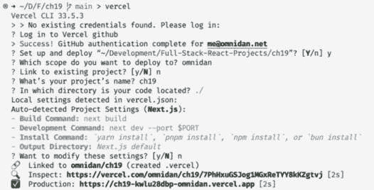
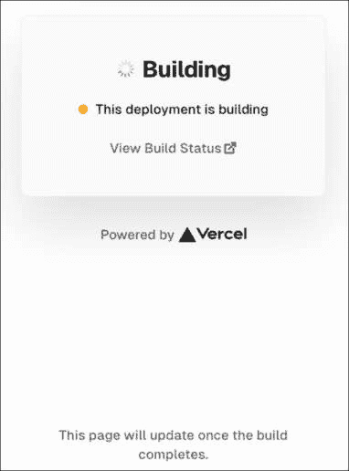
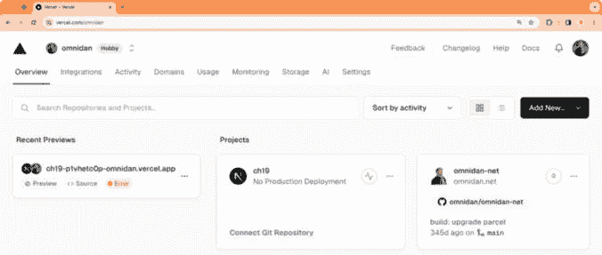
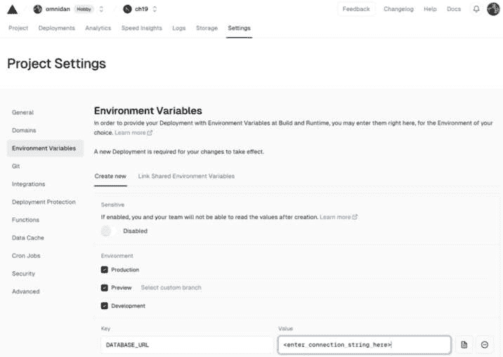
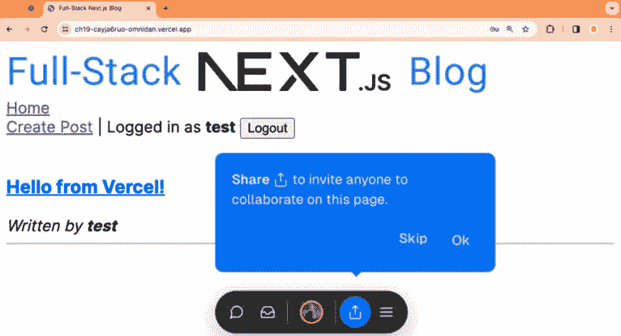
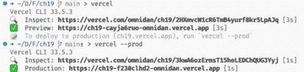

# 19

# 部署 Next.js 应用

在学习完高级 Next.js 概念之后，现在是时候学习如何部署 Next.js 应用了。部署 Next.js 应用最简单的方式是使用由 Next.js 框架开发公司提供的 Vercel 平台。在学会如何在 Vercel 平台上部署我们的应用之后，我们将学习如何使用 Docker 创建自定义部署设置。

在本章中，我们将涵盖以下主要主题：

+   使用 Vercel 部署 Next.js 应用

+   为 Next.js 应用创建自定义部署设置

# 技术要求

在我们开始之前，请安装*第一章*“为全栈开发做准备”和*第二章*“了解 Node.js 和 MongoDB”中提到的所有要求。

列出那些章节中的版本是书中使用的版本。虽然安装较新版本通常不会有问题，但请注意，某些步骤在较新版本上可能工作方式不同。如果你在使用本书提供的代码和步骤时遇到问题，请尝试使用*第一章*和*第二章*中提到的版本。

你可以在 GitHub 上找到本章的代码：[`github.com/PacktPublishing/Modern-Full-Stack-React-Projects/tree/main/ch19`](https://github.com/PacktPublishing/Modern-Full-Stack-React-Projects/tree/main/ch19)。

本章的 CiA 视频可以在以下网址找到：[`youtu.be/ERBFy5mHwek`](https://youtu.be/ERBFy5mHwek)。

# 使用 Vercel 部署 Next.js 应用

我们将首先在 Vercel 上部署我们的应用，这是一个我们可以免费简单方便地部署应用的平台。按照以下步骤开始部署我们的 Next.js 应用：

1.  通过运行以下命令将现有的**ch18**文件夹复制到新的**ch19**文件夹：

    ```js
    $ cp -R ch18 ch19
    ```

1.  在 VS Code 中打开**ch19**文件夹。

1.  使用以下命令将 Vercel CLI 工具作为全局包安装：

    ```js
    $ npm install -g vercel@33.5.3
    ```

1.  运行 Vercel CLI：

    ```js
    $ vercel
    ```

1.  你将被要求登录到 Vercel。选择任意一种登录方式，并按照 Vercel 提供的步骤进行登录。

1.  登录成功后，你将被询问有关项目部署的问题，通过按*Enter*/*Return*键确认所有问题，直到 Vercel CLI 尝试构建你的项目。



图 19.1 – 尝试将我们的应用部署到 Vercel

1.  在项目构建过程中，你可以访问 CLI 提供的 URL 查看构建过程的当前状态（确保你在同一浏览器中登录到 Vercel），如下截图所示：



图 19.2 – 在浏览器中监控构建过程

1.  很遗憾，构建失败是因为**DATABASE_URL**环境变量设置为**mongodb://localhost:27017/blog**。

现在我们需要调整 Vercel 中的这个环境变量。

## 在 Vercel 中设置环境变量

按照以下步骤在 Vercel 中设置必要的环境变量：

1.  重新使用在 MongoDB Atlas 中创建的现有数据库集群，或者按照*第五章*中“创建 MongoDB Atlas 数据库”部分的步骤创建一个新的数据库集群。你现在应该已经有了数据库的连接字符串。

1.  通过执行以下命令来验证连接字符串是否有效：

    ```js
    $ mongosh "<connection-string>"
    ```

1.  如果你正在重新使用现有的数据库集群，请确保清除数据库/集合，因为帖子和使用者在*第五章*中略有不同的格式！在 MongoDB Shell 中运行以下命令以清除集合：

    ```js
    > db.posts.drop()
    > db.users.drop()
    ```

1.  前往 [`vercel.com/`](https://vercel.com/) 并使用你之前使用的相同登录提供者登录。

1.  你应该能看到你项目的概览，包括我们之前通过 Vercel CLI 创建的**ch19**项目，如下面的截图所示：



图 19.3 – Vercel 控制台

1.  点击**ch19**项目，然后转到**设置**标签，在侧边栏中选择**环境变量**，通过输入**DATABASE_URL**作为**键**和之前获得的连接字符串作为**值**来创建一个新的环境变量，如下面的截图所示：



图 19.4 – 在 Vercel 中添加环境变量

注意

对于生产应用，你还会在这里设置**JWT_SECRET**环境变量为一个随机密钥。此外，你还会设置**BASE_URL**环境变量为你应用的部署生产 URL。例如，如果你的博客的公开 URL 将是**https://ch19-omnidan.vercel.app/**，你将设置**BASE_URL**为该 URL。

1.  点击环境变量下方的**保存**按钮以保存你的更改。

1.  再次运行 Vercel CLI 以尝试另一次部署：

    ```js
    $ vercel
    ```

    或者，你可以从 Vercel 网页界面触发重建。

1.  你会看到现在部署成功，访问 Vercel CLI 提供的**预览** URL，在你的浏览器中查看我们的博客应用成功加载：



图 19.5 – 我们应用的“预览”部署工作情况

有趣的是，Vercel CLI 现在为我们提供了**预览**部署功能。这是 Vercel 的默认行为。它首先将应用部署到**预览**环境，在那里我们可以测试一切以确保我们的应用运行正常。**预览**环境只有通过 Vercel 登录才能访问。我们还可以邀请其他人来测试我们的应用，并通过 Vercel 底部的工具栏添加评论。

1.  既然我们已经确认了我们的应用可以工作，我们可以将其部署到生产环境，如下所示：

    ```js
    $ vercel --prod
    ```

    以下截图显示了使用 Vercel CLI 进行的 **预览** 和 **生产** 部署：



图 19.6 – 使用 Vercel CLI 将我们的应用部署到“预览”和“生产”环境

现在我们的应用已部署在 **生产** 环境中，任何人都可以访问，无需通过 Vercel 登录！

注意

Vercel CLI 输出的 URL 对任何人都不可用；您需要使用 Vercel 控制台 **域名** 部分中指定的域名之一。默认应该是 **https://ch19-<vercel-username>.vercel.app/**。

如我们所见，使用 Vercel 部署我们的应用非常简单方便。然而，在某些情况下，我们想在自有的基础设施上部署我们的应用。现在让我们学习如何为 Next.js 应用创建自定义部署设置。

# 为 Next.js 应用创建自定义部署设置

我们现在将学习如何使用 Docker 为 Next.js 应用设置自定义部署。我们已经在 *第五章* 中学习了使用 Docker 部署应用的基础知识，所以如果任何内容不清楚，或者需要 Docker 的复习，请参考该章节。现在让我们开始设置我们的 Next.js 应用以进行 Docker 部署：

1.  首先，我们需要将 Next.js 的输出格式更改为 **standalone**。此选项告诉 Next.js 创建一个仅包含生产部署所需文件的 **.next/standalone** 文件夹，包括必要的 **node_modules**。然后，此文件夹可以部署而无需再次安装 **node_modules**。编辑 **next.config.mjs** 并调整配置，如下所示：

    ```js
    /** @type {import('next').NextConfig} */
    const nextConfig = {
      output: 'standalone',
    }
    export default nextConfig
    ```

1.  现在，我们创建一个 **.dockerignore** 文件来忽略不应包含在我们的镜像中的某些文件：

    ```js
    node_modules
    .env*
    .vscode
    .git
    ```

1.  创建一个新的 **Dockerfile**，首先定义一个来自 **node:20** 的 **base** 镜像：

    ```js
    FROM node:20 AS base
    ```

1.  然后，定义一个基于 **base** 镜像构建应用的新镜像：

    ```js
    FROM base AS build
    ```

1.  将工作目录设置为 **/app** 文件夹，并复制 **package.json** 和 **package-lock.json** 文件：

    ```js
    WORKDIR /app
    COPY package.json .
    COPY package-lock.json .
    ```

1.  现在，安装所有依赖项，并额外安装 **sharp**，这是 Next.js 在生产中用于调整大小和优化图像的库：

    ```js
    RUN npm install
    RUN npm install sharp
    ```

1.  复制我们项目中的所有文件：

    ```js
    COPY . .
    ```

1.  接下来，定义构建过程的参数。我们将在这里定义所有环境变量，因为 Next.js 在构建过程中也会使用它们来静态构建某些路由：

    ```js
    ARG DATABASE_URL
    ARG JWT_SECRET
    ARG BASE_URL
    ```

1.  我们现在可以运行 **build** 命令，如下所示：

    ```js
    RUN npm run build
    ```

1.  根据基础镜像定义一个新的最终应用镜像：

    ```js
    FROM base AS final
    ```

1.  我们还定义了工作目录：

    ```js
    WORKDIR /app
    ```

1.  我们设置了权限，使我们的应用以特殊的 **nextjs** 用户身份运行而不是 root：

    ```js
    RUN addgroup --system --gid 1001 nodejs
    RUN adduser --system --uid 1001 nextjs
    ```

1.  现在，从 **build** 镜像复制运行独立 Next.js 服务器所需的必要文件：

    ```js
    COPY --from=build /app/public ./public
    RUN mkdir -p .next
    RUN chown nextjs:nodejs .next
    COPY --from=build /app/.next/standalone ./
    COPY --from=build /app/.next/static ./.next/static
    ```

1.  我们定义了 **PORT**、**HOSTNAME** 和 **NODE_ENV** 变量：

    ```js
    EXPOSE 3000
    ENV PORT 3000
    ENV HOSTNAME "0.0.0.0"
    ENV NODE_ENV production
    ```

1.  然后，我们以之前定义的 **nextjs** 用户身份执行独立 Next.js 服务器：

    ```js
    USER nextjs
    CMD ["node", "server.js"]
    ```

1.  确保数据库服务器正在 Docker 容器中运行。

1.  现在我们可以通过运行以下命令来构建 Docker 镜像：

    ```js
    $ docker build \
      -t blog-nextjs \
      --build-arg "DATABASE_URL=mongodb://host.docker.internal:27017/blog" \
      --build-arg "JWT_SECRET=replace-with-random-secret" \
      --build-arg "BASE_URL=http://localhost:3000" \
    blog-nextjs as the name for our image and the necessary environment variables for building the image. Do not forget the dot (.) at the end of the command, as that is what specifies the build context, including where to look for the Dockerfile!
    ```

注意

您可以查看 Next.js 的官方示例 **Dockerfile** 以获取最新版本：[`github.com/vercel/next.js/blob/canary/examples/with-docker/Dockerfile`](https://github.com/vercel/next.js/blob/canary/examples/with-docker/Dockerfile)

1.  最后，运行一个新的 Docker 容器，如下所示：

    ```js
    $ docker run \
      -d \
      --name blog-app \
      -p 3000:3000 \
      -e "DATABASE_URL=mongodb://host.docker.internal:27017/blog" \
      -e "JWT_SECRET=replace-with-random-secret" \
      -e "BASE_URL=http://localhost:3000" \
      --restart unless-stopped \
    blog-app in the background (daemon mode) published to port 3000, then specified the environment variables and told Docker to restart the container if it crashes. Lastly, we specified the image name, which is blog-nextjs (the image we built in the previous step).
    ```

1.  访问 **http://localhost:3000**，您将看到博客成功运行！

现在我们有了 Docker 容器，我们可以将其部署到云服务（或我们自己的服务器）上，就像我们在*第五章*中所做的那样。虽然为 Next.js 应用程序设置自定义部署需要稍微多一点努力，但进行简单的设置仍然相当直接！

对于更高级的设置，例如多个实例，您需要在实例之间设置共享卷，以便缓存和优化后的镜像可以共享（在 Vercel 上，这会在幕后自动完成）。然而，这种设置超出了本书的范围。您可以查看 Next.js 关于自托管的文档以获取更多关于如何进行此操作的信息：[`nextjs.org/docs/app/building-your-application/deploying#self-hosting`](https://nextjs.org/docs/app/building-your-application/deploying#self-hosting)。

# 摘要

在本章中，我们首先学习了如何使用 Vercel 部署 Next.js 应用程序。然后，我们学习了如何使用 Docker 创建自定义部署设置。

在下一章和最后一章，*第二十章*“深入全栈开发”，我们将简要介绍本书迄今为止未涉及的各种高级全栈开发主题，让您了解如何继续使用 React 学习全栈 Web 开发的旅程。
