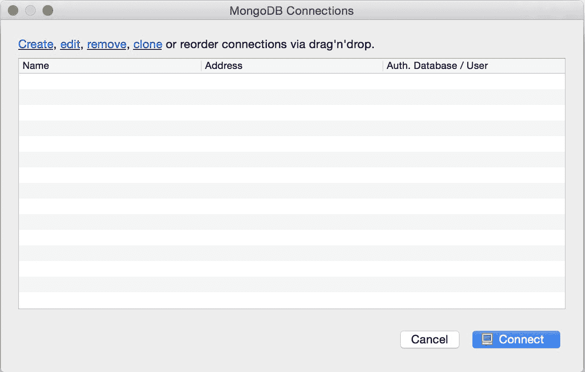

# 配置使用 Node.js、Express.js、MongoDB、Mongoose、Falcor 和 Redux 的全栈开发环境

欢迎来到*精通全栈 React Web 开发*。在这本书中，你将使用 JavaScript 创建一个通用全栈应用程序。我们将要构建的应用程序是一个类似于市场上目前流行的发布平台，例如：

+   Medium ([`medium.com/`](https://medium.com/))

+   WordPress ([`wordpress.com/`](https://wordpress.com/))

+   issuu ([`issuu.com/`](https://issuu.com/))

有许多较小的发布平台，当然，我们的应用程序将比上述列表中的功能要少，因为我们只会关注主要功能，如发布文章、编辑文章或删除文章（你可以用来实现自己想法的核心功能）。除此之外，我们还将专注于构建一个健壮的应用程序，因为它可以构建，因为这些类型的应用程序最重要的特点是可扩展性。有时，一篇文章的网页流量会比整个网站的流量还要多（在行业中，一篇文章的流量可能是整个网站的 10,000 倍，因为例如，一篇文章可能通过社交媒体获得疯狂的关注）。

本书的第一章全部关于设置项目的主要依赖项。

本章的重点将包括以下主题：

+   安装**Node 版本管理器**（**NVM**）以简化 Node 管理

+   安装 Node 和 NPM

+   在我们的本地环境中准备 MongoDB

+   Robomongo 作为 Mongo 的 GUI

+   Express.js 配置

+   Mongoose 的安装和配置

+   客户端应用程序的初始 React Redux 结构

+   在后端和前端使用 Netflix Falcor 作为旧 RESTful 方法的粘合剂和替代品

我们将使用在 2015 年和 2016 年获得了大量关注的非常现代的应用程序栈--我确信你在本书中将要学习的栈在未来几年将会更加流行，因为我们公司*MobileWebPro.pl*对之前提到的技术产生了巨大的兴趣。你将从这本书中获得很多收获，并能够跟上构建健壮、全栈应用程序的最新方法。

# 更多关于我们的技术栈

在这本书中，我们假设你已经熟悉 JavaScript（ES5 和 ES6），我们还将向你介绍一些 ES7 和 ES8 的机制。

对于客户端，你将使用 React.js，这你应该已经很熟悉了，所以我们不会详细讨论 React 的 API。

对于客户端的数据管理，我们将使用 Redux。我们还将向您展示如何使用 Redux 设置服务器端渲染。

对于数据库，你将学习如何使用 MongoDB 和 Mongoose。后者是一个对象数据建模库，为你的数据提供了一个严格的建模环境。它强制执行结构，同时它也允许你保持使 MongoDB 如此强大的灵活性。

Node.js 和 Express.js 是前端开发者开始全栈开发的标准化选择。Express 的框架对**Netflix**-**Falcor.js**创建的创新客户端后端数据获取机制提供了最佳支持。我们相信你会喜欢 Falcor，因为它简单，并且在做全栈开发时能为你节省大量时间。我们将在本书的后面详细解释为什么使用这个数据获取库比构建 RESTful API 的标准流程更有效率。

通常，我们几乎会在所有地方使用对象表示法（JSON）--使用 React 作为库，JSON 被大量用于比较 Virtual DOM（底层）。Redux 使用 JSON 树作为其单一状态树容器。Netflix Falcor 的库也使用一个高级概念，称为虚拟 JSON 图（我们将在后面详细描述）。最后，MongoDB 也是一个基于文档的数据库。

JSON 无处不在--这个设置将极大地提高我们的生产力，主要是因为 Falcor 将所有东西绑定在一起。

# 环境准备

为了启动，你需要在你的操作系统上安装以下工具：

+   MongoDB

+   Node.js

+   NPM--与 Node.js 自动安装

我们强烈建议使用 Linux 或 OS X 进行开发。对于 Windows 用户，我们建议设置一个虚拟机，并在其中进行开发。为此，你可以使用**Vagrant** ([`www.vagrantup.com/`](https://www.vagrantup.com/))，它会在后台创建一个虚拟环境，几乎以原生方式在 Windows 上进行开发，或者你可以直接使用 Oracle 的**VirtualBox** ([`www.virtualbox.org/`](https://www.virtualbox.org/))，并在虚拟桌面上工作，然而这里的性能比原生工作要低得多。

# NVM 和 Node 安装

NVM 是一个在开发过程中保持不同 Node 版本在机器上的非常实用的工具。如果你还没有在你的系统上安装 NVM，请访问[`github.com/creationix/nvm`](https://github.com/creationix/nvm)获取说明。

在你的系统上安装了 NVM 之后，你可以输入以下内容：

```js
$ nvm list-remote

```

此命令列出了所有可用的 Node 版本。在我们的例子中，我们将使用 Node v4.0.0，因此你需要在你的终端中输入以下内容：

```js
$ nvm install v4.0.0
$ nvm alias default v4.0.0

```

这些命令将安装 Node 版本 4.0.0 并设置为默认。本书中使用 NPM 2.14.23，你可以使用以下命令检查你的版本：

```js
$ npm -v
2.14.23

```

在你本地机器上安装了相同版本的 Node 和 NPM 之后，我们就可以开始设置我们将要使用的其余工具了。

# MongoDB 安装

您可以在教程部分下的 [`docs.mongodb.org/manual/installation/`](https://docs.mongodb.org/manual/installation/) 找到所有 MongoDB 指令。

以下是从 MongoDB 网站截取的屏幕截图：


安装 Node.js 的说明和准备好的软件包可以在 [`nodejs.org`](https://nodejs.org) 找到。

# Robomongo GUI for MongoDB

**Robomongo** 是一个跨平台的桌面客户端，可以与 SQL 数据库中的 MySQL 或 PostgreSQL 相比。

在开发应用程序时，拥有一个 GUI 并能够快速查看数据库中的集合是很有帮助的。如果您熟悉使用 shell 进行数据库管理，这是一个可选步骤，但如果这是您与数据库打交道的第一步，那么它将非常有帮助。

要获取 Robomongo（适用于所有操作系统），请访问 [`robomongo.org/`](https://robomongo.org/) 并在您的机器上安装一个。

在我们的案例中，我们将使用 Robomongo 的 0.9.0 RC4 版本。

# 运行 MongoDB 并在 Robomongo GUI 中查看我们的集合

在您的机器上安装 MongoDB 和 Robomongo 后，您需要运行其守护进程，该进程监听连接并将它们委托给数据库。要在终端中运行 Mongo 守护进程，请使用以下命令：

```js
mongod

```

然后执行以下步骤：

1.  打开 Robomongo 的客户端--以下屏幕将出现：



1.  通过点击创建链接创建一个默认连接：


1.  为您的连接选择一个名称并使用默认的端口 `27017`，然后点击保存。

到目前为止，您已经完成了本地数据库的设置，并且可以使用 GUI 客户端预览其内容。

# 将第一个示例集合导入数据库

在项目的目录下，创建一个名为 `initData.js` 的文件：

```js
touch initData.js

```

在我们的案例中，我们正在构建发布应用程序，因此它将是一个文章列表。在以下代码中，我们有一个包含两个文章的 JSON 格式的示例集合：

```js
[ 
    { 
        articleId: '987654', 
        articleTitle: 'Lorem ipsum - article one', 
        articleContent: 'Here goes the content of the article' 
    }, 
    { 
        articleId: '123456', 
        articleTitle: 'Lorem ipsum - article two', 
        articleContent: 'Sky is the limit, the content goes here.' 
    } 
]

```

通常，我们从模拟的文章集合开始--稍后我们将添加一个功能来将更多文章添加到 MongoDB 的集合中，但现在我们将只保留两个文章以保持简洁。

要列出您本地的数据库，通过输入以下命令打开 Mongo shell：

```js
$ mongo

```

在 Mongo shell 中，输入以下命令：

```js
show dbs

```

以下是一个完整示例：

```js
Welcome to the MongoDB shell. 
For interactive help, type "help". 
For more comprehensive documentation, see 
 http://docs.mongodb.org/ 
Questions? Try the support group 
 http://groups.google.com/group/mongodb-user 
Server has startup warnings: 
2016-02-25T13:31:05.896+0100 I CONTROL  [initandlisten] 
2016-02-25T13:31:05.896+0100 I CONTROL  [initandlisten] ** WARNING: soft rlimits too low. Number of files is 256, should be at least 1000 
> show dbs 
local  0.078GB 
>

```

在我们的示例中，它显示在本地主机中有一个名为 `local` 的数据库。

# 将文章导入 MongoDB

在以下内容中，我们将使用终端（命令提示符）来将文章导入数据库。您也可以使用 Robomongo 通过 GUI 来完成此操作：

```js
mongoimport --db local --collection articles --jsonArray initData.js --host=127.0.0.1

```

请记住，您需要在终端中打开一个新标签页，并且当您在 Mongo shell 中时，`mongo import` 将会工作（不要与 `mongod` 进程混淆）。

然后您将在终端中看到以下信息：

```js
connected to: 127.0.0.1
imported 2 documents

```

如果您收到错误 `Failed: error connecting to db server: no reachable servers`，请确保在指定的主机 IP (`127.0.0.1`) 上运行了 `mongod`。

通过命令行导入这些文章后，你也会在 Robomongo 中看到这一点：


# 使用 Node.js 和 Express.js 设置服务器

一旦我们在 MongoDB 中有了我们的文章集合，我们就可以开始在我们的 Express.js 服务器上工作，以便处理这个集合。

首先，我们需要在我们的目录中创建一个 NPM 项目：

```js
npm init --yes

```

`--yes` 标志意味着我们将使用 `package.json` 的默认设置。

接下来，让我们在 `server` 目录中创建一个 `index.js` 文件：

```js
mkdir server
cd server
touch index.js

```

在 `index.js` 中，我们需要添加一个 Babel/register 以获得更好的 ECMAScript 2015 和 2016 规范的覆盖。这将使我们能够支持如 `async` 和 `generator` 函数这样的结构，这些在 Node.js 的当前版本中默认不可用。

以下为 `index.js` 文件的内容（我们将在稍后安装 Babel 的 `dev` 依赖项）：

```js
// babel-core and babel-polyfill to be installed later in that  
//chapter 
require('babel-core/register'); 
require('babel-polyfill'); 
require('./server');

```

安装 `express` 和其他初始依赖项：

```js
npm i express@4.13.4  cors@2.7.1 body-parser@1.15.0--save

```

在命令中，你可以在 `express` 和其他库后面看到 `@4.13.4`。这些是我们将要安装的库的版本，我们有意选择这些版本以确保它们与 Falcor 一起工作良好，但很可能你可以跳过这些版本，新版本也应该同样有效。

我们还需要安装 `dev` 依赖项（我们将所有 `npm install` 命令分散到单独的文件中以提高可读性）：

```js
npm i --save-dev babel@6.5.2 
npm i --save-dev babel-core@6.6.5 
npm i --save-dev babel-polyfill@6.6.1 
npm i --save-dev babel-loader@6.2.4 
npm i --save-dev babel-preset-es2015@6.6.0 
npm i --save-dev babel-preset-react@6.5.0 
npm i --save-dev babel-preset-stage-0@6.5.0

```

我们需要的 `babel-preset-stage-0` 是用于 ES7 特性的。`babel-preset-es2015` 和 `babel-preset-react` 是用于 JSX 和 ES6 支持的必需品。

此外，请注意，我们安装 Babel 以使我们的 Node 服务器能够使用 ES6 特性。我们需要添加 `.babelrc` 文件，因此创建以下内容：

```js
$ [[[you are in the main project's directory]]] 
$ touch .babelrc 

```

然后打开 `.babelrc` 文件，并填充以下内容：

```js
{ 
'presets': [ 
'es2015', 
'react', 
'stage-0' 
  ] 
}

```

记住，`.babelrc` 是一个隐藏文件。可能最好的编辑 `.babelrc` 的方式是在文本编辑器（如 Sublime Text）中打开整个项目。然后你应该能够看到所有隐藏文件。

我们还需要以下库：

+   `babel` 和 `babel-core/register`：这是一个将新的 ECMAScript 函数转换为现有版本的库

+   `cors`：这个模块负责以简单的方式创建对我们域的跨源请求

+   `body-parser`：这是解析请求体的中间件

在此之后，你的项目文件结构应该看起来像以下这样：

```js
&boxvr;&boxh;&boxh; node_modules 
&boxv;   &boxvr;&boxh;&boxh; *** 
&boxvr;&boxh;&boxh; initData.js 
&boxvr;&boxh;&boxh; package.json 
&boxur;&boxh;&boxh; server 
    &boxur;&boxh;&boxh; index.js

```

`***` 是一个通配符，这意味着有一些文件是我们项目所需的，但我们没有在这里列出，因为这会太长。

# 在我们的服务器上工作（server.js）

我们将开始处理我们的 `server/server.js` 文件，这是我们的项目中的新文件，因此我们需要首先在项目的 `server` 目录中使用以下命令创建它：

```js
touch server.js

```

`server/server.js` 文件的内容如下：

```js
import http from 'http'; 
import express from 'express'; 
import cors from 'cors'; 
import bodyParser from 'body-parser'; 

const app = express(); 
app.server = http.createServer(app); 

// CORS - 3rd party middleware 
app.use(cors()); 

// This is required by falcor-express middleware  
//to work correctly with falcor-browser 
app.use(bodyParser.json({extended: false})); 

app.get('/', (req, res) => res.send('Publishing App Initial Application!')); 

app.server.listen(process.env.PORT || 3000); 
console.log(&grave;Started on port ${app.server.address().port}&grave;); 
export default app;

```

这些文件使用`babel/register`库，这样我们就可以在我们的代码中使用 ES6 语法。在`index.js`文件中，我们有一个来自 Node.js 的`http`模块（[`nodejs.org/api/http.html#http_http`](https://nodejs.org/api/http.html#http_http)）。接下来，我们有`express`、`cors`和`body-parser`。

Cors 是用于在 Express 应用程序中动态或静态启用**跨源资源共享**（**CORS**）的中间件 - 它将在我们的开发环境中很有用（我们将在生产服务器上删除它）。

Body-parser 是 HTTP 体解析的中间件。它有一些花哨的设置，可以帮助我们更快地构建应用。

在我们开发的这个阶段，我们的应用看起来是这样的：


# Mongoose 和 Express.js

目前，我们有一个简单的 Express.js 服务器。现在我们必须将 Mongoose 添加到我们的项目中：

```js
npm i mongoose@4.4.5 --save

```

一旦我们安装了 Mongoose 并在后台运行了 MongoDB 数据库，我们就可以将其导入到`server.js`文件中并进行编码：

```js
import http from 'http'; 
import express from 'express'; 
import cors from 'cors'; 
import bodyParser from 'body-parser'; 
import mongoose from 'mongoose'; 

mongoose.connect('mongodb://localhost/local'); 

const articleSchema = { 
    articleTitle:String, 
    articleContent:String 
}; 

const Article = mongoose.model('Article', articleSchema,  'articles');
const app = express(); 
app.server = http.createServer(app); 

// CORS - 3rd party middleware 
app.use(cors()); 

// This is required by falcor-express middleware to work correctly  
//with falcor-browser 
app.use(bodyParser.json({extended: false})); 

app.use(express.static('dist')); 

app.get('/', (req, res) => {  
    Article.find( (err, articlesDocs) => { 
      const ourArticles = articlesDocs.map((articleItem) => { 
        return &grave;<h2>${articleItem.articleTitle}</h2>            
        ${articleItem.articleCon tent}&grave;; 
      }).join('<br/>'); 

      res.send(&grave;<h1>Publishing App Initial Application!</h1>        
      ${ourArticles}&grave;); 
    }); 
}); 

app.server.listen(process.env.PORT || 3000); 
console.log(&grave;Started on port ${app.server.address().port}&grave;); 
export default app;

```

# 运行项目的总结

确保你使用以下命令在你的机器上后台运行 MongoDB：

```js
mongod

```

在你的终端（或在 Windows 上的 PowerShell）中运行`mongod`命令后，你应该在你的控制台中看到以下类似的内容：


在运行服务器之前，请确保你的`package.json`文件中的`devDependencies`看起来像以下这样：

```js
"devDependencies": { 
"babel": "6.5.2", 
"babel-core": "6.6.5", 
"babel-loader": "6.2.4", 
"babel-polyfill": "6.6.1", 
"babel-preset-es2015": "6.6.0", 
"babel-preset-react": "6.5.0", 
"babel-preset-stage-0": "6.5.0" 
  }

```

在运行服务器之前，请确保你的`package.json`文件中的依赖项看起来像以下这样：

```js
"dependencies": { 
"body-parser": "1.15.0", 
"cors": "2.7.1", 
"express": "4.13.4", 
"mongoose": "4.4.5" 
  }

```

在主目录下，使用以下命令运行 Node：

```js
node server/index.js 

```

之后，你的终端应该显示以下类似的内容：

```js
$ node server/index.js
Started on port 3000

```


# Redux 基本概念

在本节中，我们将仅涵盖 Redux 的最基本概念，这将帮助我们制作简单的发布应用。在本章中，应用将只处于*只读*模式；在本书的后面部分，我们将添加更多功能，例如添加/编辑文章。你将在后面的章节中了解到关于 Redux 的所有重要规则和原则。

涵盖的基本主题包括：

+   什么是状态树？

+   Redux 中不可变性的工作原理

+   Reducers 的概念和基本用法

让我们从基础知识开始。

# 单个不可变状态树

Redux 最重要的原则是，你将用单个 JavaScript 对象来表示你应用程序的整个状态。

Redux 中的所有更改（动作）都是显式的，因此你可以通过开发工具跟踪应用程序中的所有动作的历史。


上述截图是一个简单的、示例开发工具使用案例，你将在你的开发环境中使用它。它将帮助你跟踪应用中状态的变化。示例显示了如何通过在状态中三次增加计数器值*+1*。当然，我们的发布应用结构将比这个例子复杂得多。你将在本书的后面部分了解更多关于这个开发工具的内容。

# 不可变性 - 动作和状态树是只读的

由于 Redux 基于函数式编程范式，你不能像在 Facebook 的（和其他）FLUX 实现中那样修改/突变你的状态树中的值。

与其他 FLUX 实现一样，一个动作是一个描述变化的普通对象--比如添加一篇文章（在下面的代码中，我们为了简洁起见模拟了有效载荷）：

```js
{ 
    type: 'ADD_ARTICLE', 
    payload: '_____HERE_GOES_INFORMATION_ABOUT_THE_CHANGE_____' 
}

```

一个动作是我们应用状态树变化的最小表示。让我们为我们的发布应用准备动作。

# 纯函数和不纯函数

一个**纯函数**是一个没有副作用的功能，例如，例如 I/O（读取文件或 HTTP 请求）。**不纯函数**有副作用，所以，例如，如果你调用 HTTP 请求，它可以为完全相同的参数*Y,Z（函数(X,Y)*）返回不同的值，因为端点返回给我们一个随机值，或者可能因为服务器错误而宕机。

纯函数对于相同的*X,Y*参数总是可预测的。在 Redux 中，我们只在 reducer 和动作中使用纯函数（否则 Redux 的`lib`将无法正常工作）。

在这本书中，你将学习整个结构和在哪里进行 API 调用。所以如果你遵循这本书，那么你就不必太担心 Redux 中的那个原则。

# Reducer 函数

Redux 的 reducer 可以与 Facebook 的 Flux 的单个 store 进行比较。重要的是，reducer 始终接受一个先前的状态并返回对新对象的新的引用（使用`Object.assign`和其他类似方法），这样我们就可以使用不可变 JS 帮助我们构建比旧 Flux 实现更可预测的应用状态。

因此，创建一个新的引用是最优的，因为 Redux 使用旧引用来访问未更改的 reducer 中的值。这意味着即使每个动作通过 reducer 创建了一个全新的对象，那些未更改的值在内存中仍然有之前的引用，所以我们不会过度使用机器的计算能力。一切都很快速。

在我们的应用中，我们将有一个文章 reducer，它将帮助我们从视图层列出、添加、编辑和删除文章。

# 第一个 reducer 和 webpack 配置

首先，让我们为我们的发布应用创建一个 reducer：

```js
mkdir src 
cd src 
mkdir reducers 
cd reducers 
touch article.js 

```

因此，我们的第一个 reducer 的位置是`src/reducers/article.js`，我们的`reducers/article.js`的内容如下：

```js
const articleMock = { 
'987654': { 
        articleTitle: 'Lorem ipsum - article one', 
        articleContent: 'Here goes the content of the article' 
    }, 
'123456': { 
        articleTitle: 'Lorem ipsum - article two', 
        articleContent: 'Sky is the limit, the content goes here.' 
    } 
}; 

const article = (state = articleMock, action) => { 
    switch (action.type) { 
        case 'RETURN_ALL_ARTICLES': 
            return Object.assign({}, state); 
        default: 
            return state; 
    } 
} 
export default article;

```

在前面的代码中，我们有`articleMock`保存在浏览器内存中（它与`initData.js`中的相同）--稍后，我们将从我们的后端数据库中获取这些数据。

箭头函数`const article`正在获取`action.type`，它将来自常数（我们稍后会创建它们），就像 Facebook 的 FLUX 实现一样工作。

对于 `switch` 语句中的默认 `return`，我们提供 `state = articleMock` 的状态（上面的 `return state;` 部分）。这将返回我们发布应用程序在首次启动时的初始状态，在发生任何其他动作之前。更确切地说，在我们的情况下，默认将与我们开始从后端获取数据之前的 `RETURN_ALL_ARTICLES` 动作完全相同（在实现后端文章获取机制之后；然后默认将返回一个空对象）。

由于我们的 webpack 配置（在此描述），我们需要在 `dist` 中 `index.html`。让我们创建一个 `dist/index.html` 文件：

```js
pwd 
/Users/przeor/Desktop/React-Convention-Book/src/reducers 
cd ../.. 
mkdir dist 
cd dist 
touch index.html 

```

`dist/index.html` 文件的内容如下：

```js
<!doctype html> 
<html lang="en"> 
<head> 
<title>Publishing App</title> 
<meta charset="utf-8"> 

</head> 
<body> 
<div id="publishingAppRoot"></div> 

<script src="img/app.js"></script> 
</body> 
</html>

```

我们有一个文章 `reducer` 和 `dist/index.html`，但在我们开始构建 Redux 的发布应用程序之前，我们需要为我们的构建自动化配置 webpack。

首先安装 webpack（你可能需要 `sudo` 根权限）：

```js
npm i --save-dev webpack@1.12.14 webpack-dev-server@1.14.1 

```

然后，在 `package.json` 和 `initData.js` 文件旁边的主目录中，输入以下内容：

```js
touch webpack.config.js

```

然后创建 webpack 配置：

```js
module.exports = { 
    entry: ['babel-polyfill', './src/app.js'], 
    output: { 
        path: './dist', 
        filename: 'app.js', 
        publicPath: '/' 
    }, 
    devServer: { 
        inline: true, 
        port: 3000, 
        contentBase: './dist' 
    }, 
    module: { 
        loaders: [ 
            { 
                test: /.js$/, 
                exclude: /(node_modules|bower_components)/, 
                loader: 'babel', 
        query: { 
                    presets: ['es2015', 'stage-0', 'react'] 
                } 
            } 
        ] 
    } 
}

```

简单来说，webpack 配置说明 CommonJS 模块的入口在 `entry './src/app.js'`。webpack 会根据 `app.js` 中的所有导入构建整个应用程序，最终输出位于路径 `'./dist'`。我们位于 `contentBase: './dist'` 的应用程序将运行在端口 `3000`。我们还配置了使用 ES2015 和 React，以便 webpack 会将 ES2015 编译成 ES5，并将 React 的 JSX 编译成 JavaScript。如果你对 webpack 的配置选项感兴趣，那么请阅读其文档。

# 其余的重要依赖安装和 npm 开发脚本

安装 webpack 所使用的 Babel 工具（检查配置文件）：

```js
npm i --save react@0.14.7 react-dom@0.14.7 react-redux@4.4.0 redux@3.3.1

```

我们还需要更新我们的 `package.json` 文件（添加 `scripts`）：

```js
"scripts": { 
"dev": "webpack-dev-server" 
  },

```

我们完整的 `package.json` 应该如下所示，包含所有前端依赖：

```js
01{ 
"name": "project", 
"version": "1.0.0", 
"description": "", 
"scripts": { 
"dev": "webpack-dev-server" 
  }, 
"dependencies": { 
"body-parser": "1.15.0", 
"cors": "2.7.1", 
"express": "4.13.4", 
"mongoose": "4.4.5", 
"react": "0.14.7", 
"react-dom": "0.14.7", 
"react-redux": "4.4.0", 
"redux": "3.3.1" 
  }, 
"devDependencies": { 
"babel": "6.5.2", 
"babel-core": "6.6.5", 
"babel-loader": "6.2.4", 
"babel-polyfill": "6.6.1", 
"babel-preset-es2015": "6.6.0", 
"babel-preset-react": "6.5.0", 
"babel-preset-stage-0": "6.5.0", 
"webpack": "1.12.14", 
"webpack-dev-server": "1.14.1" 
  } 
}

```

如你所意识到的那样，提到的 `package.json` 中没有我们想要的 `^` 符号，因为我们想使用每个包的确切版本，以确保所有我们的包都安装了在 `package` 中给出的正确且确切的版本。否则，你可能会有一些困难，例如，如果你添加 `"mongoose": "4.4.5"`，带有 `^` 符号，那么它将安装一个较新的版本，这会在控制台产生一些额外的警告。让我们坚持书中提到的版本，以避免我们正在构建的应用程序出现不必要的麻烦。我们无论如何都要避免 NPM 依赖地狱。

# 在处理 src/app.js 和 src/layouts/PublishingApp.js

让我们创建我们的 `app.js` 文件，我们应用程序的主要部分将位于 `src/app.js`：

```js
//[[your are in the main directory of the project]] cd src
touch app.js

```

我们新的 `src/app.js` 文件的内容如下：

```js
import React from 'react'; 
import { render } from 'react-dom'; 
import { Provider } from 'react-redux'; 
import { createStore } from 'redux'; 
import article from './reducers/article'; 
import PublishingApp from './layouts/PublishingApp'; 

const store = createStore(article); 

render( 
<Provider store={store}> 
<PublishingApp /> 
</Provider>, 
    document.getElementById('publishingAppRoot') 
);

```

新的部分是 `store = createStore(article)` 部分--这个来自 Redux 的实用工具让你可以保持一个应用程序状态对象，分发一个动作，并允许你提供一个作为参数的 reducer，它告诉你应用程序如何通过动作更新。

`react-redux` 是将 Redux 绑定到 React 中的一个有用的绑定（因此我们将编写更少的代码，并更有效率）：

```js
<Provider store>

```

`Provider store` 帮助我们将 Redux store 传递给子组件中的 `connect()` 调用（如下所示）：

```js
connect([mapStateToProps], [mapDispatchToProps], [mergeProps], [options])

```

`connect` 将用于任何必须监听我们应用程序中 reducer 变化的组件。你将在本章后面看到如何使用它。

对于存储，我们使用 `const store = createStore(article)`--仅为了简洁，我将提到在构建我们应用程序的下一个步骤中，我们将使用存储中的几个方法：

```js
store.getState();

```

`getState` 函数会给你当前应用程序的状态：

```js
store.dispatch({ type: 'RETURN_ALL_ARTICLES' });

```

`dispatch` 函数可以帮助你更改应用程序的状态：

```js
store.subscribe(() => { 

});

```

订阅允许你注册一个回调，每当分发了一个动作时，Redux 都会调用它，这样视图层就可以了解应用程序状态的变化并刷新其视图。

# 总结 React-Redux 应用程序

让我们完成我们的第一个 React-Redux 应用程序。为了总结，让我们看看我们当前的目录结构：

```js
&boxvr;&boxh;&boxh; dist 
&boxv;   &boxur;&boxh;&boxh; index.html 
&boxvr;&boxh;&boxh; initData.js 
&boxvr;&boxh;&boxh; node_modules 
&boxv;   &boxvr;&boxh;&boxh; ********** (A LOT OF LIBRARIES HERE) 
&boxvr;&boxh;&boxh; package.json 
&boxvr;&boxh;&boxh; server 
&boxv;   &boxvr;&boxh;&boxh; index.js 
&boxv;   &boxur;&boxh;&boxh; server.js 
&boxvr;&boxh;&boxh; src 
&boxv;   &boxvr;&boxh;&boxh; app.js 
&boxv;   &boxur;&boxh;&boxh; reducers 
&boxv;       &boxur;&boxh;&boxh; article.js 
&boxur;&boxh;&boxh; webpack.config.js

```

现在我们需要创建我们应用程序的主视图。在我们的第一个版本中，我们将将其放入布局目录：

```js
pwd
/Users/przeor/Desktop/React-Convention-Book/src
mkdir layouts
cd layouts
touch PublishingApp.js

```

`PublishingApp.js` 的内容是：

```js
import React from 'react'; 
import { connect } from 'react-redux'; 

const mapStateToProps = (state) => ({ 
  ...state 
}); 

const mapDispatchToProps = (dispatch) => ({ 
}); 

class PublishingApp extends React.Component { 
  constructor(props) { 
    super(props); 
  } 
  render () { 
    console.log(this.props);     
    return ( 
<div> 
          Our publishing app 
</div> 
    ); 
  } 
} 
export default connect(mapStateToProps, mapDispatchToProps)(PublishingApp);

```

前面介绍了 `...` 旁边的 ES7 语法 `...`：

```js
const mapStateToProps = (state) => ({ 
  ...state 
});

```

`...` 是一个扩展操作符，在 Mozilla 的文档中有很好的描述，作为；*一个表达式，在需要多个参数（函数调用）或多个元素（数组字面量）的地方进行扩展*。在我们的案例中，这个 `...` 操作符将一个对象状态扩展到第二个（在我们的案例中，空对象 `{ }`）。它在这里是这样写的，因为，在未来，我们将指定多个必须从我们的应用程序状态映射到 `this.props` 组件的 reducer。

# 完成我们的第一个静态发布应用程序

在我们的静态应用程序中最后要做的就是在 `this.props` 中渲染文章。

多亏了 Redux，reducer 中模拟的对象现在是可用的，所以如果你在 `PublishingApp.js` 的渲染函数中检查 `console.log(this.props)`，那么你将能够访问我们的 `articles` 对象：

```js
const articleMock = { 
'987654': { 
        articleTitle: 'Lorem ipsum - article one', 
        articleContent: 'Here goes the content of the article' 
    }, 
"123456": { 
        articleTitle: 'Lorem ipsum - article two', 
        articleContent: 'Sky is the limit, the content goes here.' 
    } 
};

```

在我们的案例中，我们需要更改 React 的渲染函数，如下所示（在 `src/layouts/PublishingApp.js`）：

```js
 render () { 
    let articlesJSX = []; 

    for(let articleKey in this.props) { 
        const articleDetails = this.props[articleKey]; 
        const currentArticleJSX = ( 
          <div key={articleKey}> 
          <h2>{articleDetails.articleTitle}</h2> 
          <h3>{articleDetails.articleContent}</h3> 
          </div>); 

        articlesJSX.push(currentArticleJSX); 
    } 

    return ( 
      <div> 
      <h1>Our publishing app</h1> 
          {articlesJSX} 
      </div> 
    ); 
  }

for(let articleKey in this.props) over the article Mock object (passed from the reducer's state in this.props) and creating an array of articles (in JSX) with articlesJSX.push(currentArticleJSX);. After it is created, then we will have added the articlesJSX into the return statement:
```

```js
<div> 
<h1>Our publishing app</h1> 
          {articlesJSX} 
</div>

```

这个注释将在端口 `3000` 上启动你的项目：

```js
npm run dev

```

在你检查 `localhost:3000` 之后，新的静态 Redux 应用程序应该看起来如下所示：


太好了，我们已经在 Redux 中创建了一个静态应用！现在是时候使用 Falcor 从我们的 MongoDB 数据库中获取数据了。

# Falcor 的基本概念

Falcor 就像是一种粘合剂，介于：

+   后端及其数据库结构（记住将 `initData.js` 导入 MongoDB）

+   前端 Redux 单个状态树容器

它以一种比为单页应用程序构建老式的 REST API 更有效的方式将各个部分粘合在一起。

就像“Redux 基本概念”部分一样，在这一部分中，我们将只学习 Falcor 的最基本概念，它们将帮助我们以只读模式构建一个简单的全栈应用。在本书的后面部分，您将学习如何使用 Falcor 添加/编辑文章。

我们将关注最重要的方面：

+   Falcor 的模型是什么？

+   从 Falcor（前端和后端）检索值

+   JSON 图的概念和基本用法

+   代理概念和基本用法

+   如何从后端检索数据

+   如何使用 Express.js 的中间件配置我们的第一个路由

    `falcor-router`

# 什么是 Falcor 以及为什么我们需要在我们的全栈发布应用中使用它？

让我们首先考虑网页和 Web 应用之间的区别：

+   当**万维网**（**WWW**）被发明时，网页服务于少量的大型资源（如 HTML、PDF 和 PNG 文件）。例如，您可以从服务器请求 PDF、视频或文本文件。

+   自从大约 2008 年以来，Web 应用的开发变得越来越流行。Web 应用服务于大量的小型资源。这对我们意味着什么？您需要使用 AJAX 调用向服务器发送大量的小型 REST API 请求。旧的许多 API 请求方法会导致延迟，从而减慢移动/Web 应用的运行速度。

为什么我们在 2016 年及以后的 APP 中使用旧的 REST API 请求（就像我们在 2005 年做的那样）？这正是 Falcor 大放异彩的地方；它解决了后端与前端之间延迟和紧密耦合的问题。

# 紧密耦合和延迟与无处不在的单个模型

如果您熟悉前端开发，您知道如何向 API 发起请求。这种旧的方法总是迫使您将后端 API 与前端 API 工具紧密耦合。它总是这样：

1.  您创建一个 API 端点，例如[`applicationDomain.com/api/recordDetails?id=92`](https://applicationDomain.com/api/recordDetails?id=92)。

1.  您在前端使用 HTTP API 请求来获取数据：

```js
        { 
            id: '92', 
            title: 'example title', 
            content: 'example content' 
        }

```

在大型应用中，维护真正的 DRY RESTful API 很困难，这个问题导致了很多未优化的端点，因此前端有时不得不进行多次往返才能获取特定视图所需的数据（有时获取的数据远多于所需，这甚至给应用最终用户带来了更多的延迟）。

想象一下，您有一个拥有超过 50 个不同 API 端点的庞大应用。当您的应用的第一版完成后，您的客户或老板发现了一种更好的方法来结构化应用中的用户流程。这意味着什么？这意味着您必须修改前端和后端端点以满足用户界面层的更改。这被称为前端和后端之间的紧密耦合。

Falcor 为这种情况带来了什么，以改善导致使用 RESTful API 效率低下的两个领域？答案是无处不在的单个模型。

如果所有数据都在客户端的内存中可访问，构建您的 Web 应用程序将会非常简单。

Falcor 提供了帮助您感觉所有数据都在指尖的实用工具，而无需编写后端 API 端点和客户端消费工具。

# 客户端和服务器端不再紧密耦合。

Falcor 帮助您在服务器上表示所有应用程序的数据作为一个虚拟的 JSON 模型。

当进行客户端编程时，Falcor 让您感觉整个应用程序的 JSON 模型都可以在本地访问，并允许您以与从内存中的 JSON 相同的方式读取数据——您很快就会学会这一点！

由于 Falcor 浏览器库和`falcor-express`中间件，您可以从云端的模型中按需检索数据。

Falcor 透明地处理所有网络通信，并保持您的客户端应用程序与服务器和数据库同步。

在本章中，我们还将学习如何使用`falcor-router`。

# 客户端 Falcor

让我们先从 NPM 安装 Falcor：

```js
pwd 
/Users/przeor/Desktop/React-Convention-Book 
npm i --save falcor@0.1\. 
16 falcor-http-datasource@0.1.3 

```

`falcor-http-datasource`帮助我们从服务器检索数据到客户端，开箱即用（无需担心 HTTP API 请求）——我们将在将客户端模型移动到后端时使用它。

让我们在客户端创建我们的应用程序 Falcor 模型：

```js
cd src
touch falcorModel.js

```

然后`falcorModel.js`的内容将如下所示：

```js
import falcor from 'falcor';  
import FalcorDataSource from 'falcor-http-datasource'; 

let cache = { 
  articles: [ 
    { 
        id: 987654, 
        articleTitle: 'Lorem ipsum - article one', 
        articleContent: 'Here goes the content of the article' 
    }, 
    { 
        id: 123456, 
        articleTitle: 'Lorem ipsum - article two from backend', 
        articleContent: 'Sky is the limit, the content goes here.' 
    } 
  ] 
}; 

const model = new falcor.Model({ 
'cache': cache 
}); 
export default model;

```

在此代码中，您可以找到一个包含两篇文章的我们发布应用的知名、简洁且易于阅读的模型。

现在，我们将从我们的`src/layouts/PublishingApp.js` React 组件的前端 Falcor 模型中检索数据，我们将添加一个名为`_fetch()`的新函数，该函数将负责在应用程序启动时检索所有文章。

我们需要首先导入我们的 Falcor 模型，因此需要在`PublishingApp.js`文件的顶部添加以下内容：

```js
import falcorModel from '../falcorModel.js';

```

在我们的`PublishingApp`类中，我们需要添加以下两个函数；`componentWillMount`和`_fetch`（更多解释随后）：

```js
class PublishingApp extends React.Component { 
  constructor(props) { 
    super(props); 
  } 

  componentWillMount() { 
    this._fetch(); 
  } 

  async _fetch() { 
    const articlesLength = await falcorModel. 
      getValue('articles.length'). 
      then((length) => length ); 

    const articles = await falcorModel. 
      get(['articles', {from: 0, to: articlesLength-1},  
      ['id','articleTitle', 'articleContent']])  
      .then((articlesResponse) => articlesResponse.json.articles); 
  } 
  // below here are next methods o the PublishingApp

```

这里，您可以看到名为`_fetch`的异步函数。这是一种特殊语法，允许您像使用`let articlesLength = await falcorModel`和`let articles = await falcorModel`一样使用`await`关键字。

使用`async await`代替 Promise 意味着我们的代码更易于阅读，并避免了回调地狱的情况，其中多个回调嵌套在一起使得代码难以阅读和扩展。

`async`/`await`特性是从受 C#启发的 ECMAScript 7 中提取的。它允许您编写在等待异步操作结果之前在每个异步操作上看似阻塞的函数，然后继续执行下一个操作。

在我们的例子中，代码将按以下方式执行：

1.  首先它将调用 Falcor 的模型以获取文章数量，如下所示：

```js
        const articlesLength = await falcorModel. 
          getValue('articles.length'). 
          then( (length) =>  length );

```

1.  在文章的`Length`变量中，我们将从我们的模型中获得`articles.length`的计数（在我们的例子中将是数字二）。

1.  在我们知道我们的模型中有两篇文章之后，接下来的代码块执行以下操作：

```js
        let articles = await falcorModel. 
          get(['articles', {from: 0, to: articlesLength-1},
          ['id','articleTitle', 'articleContent']]).  
          then( (articlesResponse) => articlesResponse.json.articles);

```

`falcorModel.get(['articles', {from: 0, to: articlesLength-1}, ['id','articleTitle', 'articleContent']]).` 上的 `get` 方法也是一个异步操作（与 `http 请求` 类似）。在 `get` 方法的参数中，我们提供了我们模型中文章的位置（在 `src/falcorModel.js` 中），因此我们提供了以下路径：

```js
falcorModel.get( 
['articles', {from: 0, to: articlesLength-1}, ['id','articleTitle', 'articleContent']] 
)

```

上述 Falcor 路径的解释基于我们的模型。让我们再次调用它：

```js
{ 
  articles: [ 
    { 
        id: 987654, 
        articleTitle: 'Lorem ipsum - article one', 
        articleContent: 'Here goes the content of the article' 
    }, 
    { 
        id: 123456, 
        articleTitle: 'Lorem ipsum - article two from backend', 
        articleContent: 'Sky is the limit, the content goes here.' 
    } 
  ] 
}

```

我们对 Falcor 所说的：

1.  首先，我们想要使用以下方式从我们的对象中的`articles`获取数据：

```js
        ['articles']

```

1.  接下来，从 `articles` 集合中选择所有文章的子集，范围是 `{from: 0, to: articlesLength-1}`（我们之前获取的 `articlesLength`），路径如下：

```js
        ['articles', {from: 0, to: articlesLength-1}]

```

1.  最后一步是向 Falcor 解释，你想要从对象中获取哪些属性。所以 `falcorModel.get` 查询中的完整路径如下：

```js
        ['articles', {from: 0, to: articlesLength-1},   
        ['id','articleTitle', 'articleContent']]

```

1.  `['id','articleTitle', 'articleContent']` 数组表示你想要从每篇文章中获取这三个属性。

1.  最后，我们从 Falcor 接收一个文章对象的数组：


在我们从 Falcor 模型获取数据之后，我们需要分发一个动作，该动作将相应地更改文章的 reducer，并最终从 `const articleMock`（在 `src/reducers/article.js` 中）重新渲染我们的文章列表。

但在我们能够分发一个动作之前，我们需要做以下事情：

创建 `actions` 目录并包含 `article.js`：

```js
pwd 
$ /Users/przeor/Desktop/React-Convention-Book 
cd src 
mkdir actions 
cd actions 
touch article.js 

```

按照以下方式为我们的 `src/actions/article.js` 文件创建内容：

```js
export default { 
  articlesList: (response) => { 
    return { 
      type: 'ARTICLES_LIST_ADD', 
      payload: { response: response } 
    } 
  } 
}

```

在那个 `actions/article.js` 文件中并没有太多内容 `.`。如果你已经熟悉 FLUX，那么它非常相似。对于 Redux 中的动作，一个重要的规则是它必须是一个纯函数。现在，我们将一个名为 `ARTICLES_LIST_ADD` 的常量硬编码到 `actions/article.js` 中。

在 `src/layouts/PublishingApp.js` 文件中，我们需要在文件顶部添加一个新的导入代码：

```js
import {bindActionCreators} from 'redux'; 
import articleActions from '../actions/article.js';

```

当你在 `PublishingApp` 中添加了上述两个文件后，然后修改同一文件中现有的函数如下：

```js
const mapDispatchToProps = (dispatch) => ({ 
});

```

添加 `articleActions: bindActionCreators(articleActions, dispatch)` 以便我们能够将文章的动作绑定到我们的 `this.props` 组件：

```js
const mapDispatchToProps = (dispatch) => ({ 
  articleActions: bindActionCreators(articleActions, dispatch) 
});

```

多亏了在组件中提到的这些更改 `(articleActions: bindActionCreators(articleActions, dispatch))`，我们现在将能够从 props 中分发一个动作，因为现在，当你使用 `this.props.articleActions.articlesList(articles)` 时，从 Falcor 获取的 `articles` 对象将可用于我们的 reducer（并且从那里，只需一步就可以让我们的应用程序获取数据工作）。

现在，在你完成这些更改之后，将一个动作添加到我们的组件的 `_fetch` 函数中：

```js
this.props.articleActions.articlesList(articles);

```

我们整个获取函数看起来如下：

```js
 async _fetch() { 
    const articlesLength = await falcorModel. 
      getValue('articles.length'). 
      then( (length) => length); 

    let articles = await falcorModel. 
      get(['articles', {from: 0, to: articlesLength-1},  
      ['id','articleTitle', 'articleContent']]).  
      then( (articlesResponse) => articlesResponse.json.articles); 

    this.props.articleActions.articlesList(articles); 
  }

```

同时，别忘了从 `ComponentWillMount` 中调用 `_fetch`：

```js
 componentWillMount() { 
    this._fetch(); 
  }

```

到这一点，我们应当能够接收到 Redux 的 reducer 中的动作。让我们改进我们的 `src/reducers/article.js` 文件：

```js
const article = (state = {}, action) => { 
    switch (action.type) { 
        case 'RETURN_ALL_ARTICLES': 
            return Object.assign({}, state); 
        case 'ARTICLES_LIST_ADD': 
            return Object.assign({}, action.payload.response); 
        default: 
            return state; 
    } 
} 
export default article

```

如你所见，我们不再需要`articleMock`，所以我们已经从`src/reducers/article.js`中删除了它。

我们添加了一个新的情况，`ARTICLES_LIST_ADD`：

```js
   case 'ARTICLES_LIST_ADD': 
        let articlesList = action.payload.response; 
        return Object.assign({}, articlesList);

```

它返回一个新的`articlesList`对象（由于`Object.assign`，在内存中有新的引用）。

不要混淆两个文件，它们具有相同的名称和其他位置，例如：

`reducers/article.js`

`actions/article.js`

你需要确保你正在编辑正确的文件，否则应用程序将无法工作。

# 客户端 Falcor + Redux 的概述

如果你运行`http://localhost:3000/index.html`，你会看到，目前我们有两个独立的应用程序：

+   一个在前端使用 Redux 和客户端 Falcor

+   一个在 MongoDB、Mongoose 和 Express 使用的后端

我们需要将它们放在一起，以便我们有应用程序的一个状态源（来自 MongoDB）。

# 将 Falcor 模型移到后端

我们还需要更新我们的`package.json`文件：

```js
"scripts": { 
  "dev": "webpack-dev-server", 
  "start": "npm run webpack; node server", 
  "webpack": "webpack --config ./webpack.config.js" 
},

```

因为我们要开始全栈开发部分，所以需要在`package.json`中的脚本中添加`npm start`--这将帮助编译客户端代码，将它们放入`dist`文件夹（通过 webpack 生成），并在`dist`中创建静态文件，然后使用此文件夹作为静态文件的源（检查`server/server.js`中的`app.use(express.static('dist'));`）。

下一个重要的事情是在后端安装 Falcor 所需的新依赖项：

```js
npm i --save falcor-express@0.1.2 falcor-router@0.2.12

```

当你最终安装了新依赖项并配置了在相同端口上运行后端和前端的基本脚本后，然后按照以下方式编辑`server/server.js`：

1.  在我们的文件顶部，导入新的库到`server/server.js`：

```js
        import falcor from 'falcor'; 
        import falcorExpress from 'falcor-express';

```

1.  然后在以下两个之间：

```js
        app.use(bodyParser.json({extended: false})); 
        app.use(express.static('dist'));

```

1.  在后端添加管理 Falcor 的新代码：

```js
        app.use(bodyParser.json({extended: false})); 

        let cache = { 
          articles: [ 
            { 
                id: 987654, 
                articleTitle: 'Lorem ipsum - article one', 
                articleContent: 'Here goes the content of the article' 
            }, 
            { 
                id: 123456, 
                articleTitle: 'Lorem ipsum - article two from          
                backend', 
                articleContent: 'Sky is the limit, the content goes          
                here.' 
            } 
          ] 
        }; 

        var model = new falcor.Model({ 
          cache: cache 
        }); 

        app.use('/model.json', falcorExpress.dataSourceRoute((req,               
        res) => { 
            return model.asDataSource(); 
        })); 
        app.use(express.static('dist'));

```

1.  上述代码几乎与`src/falcorModel.js`文件中的代码相同。唯一的区别是现在 Falcor 将从后端的模拟对象中获取数据，在`server.js`中称为`cache`。

1.  第二部分是在前端更改我们的数据源，因此需要在`src/falcorModel.js`文件中更改以下旧代码：

```js
        import falcor from 'falcor'; 
        import FalcorDataSource from 'falcor-http-datasource'; 

        let cache = { 
          articles: [ 
          { 
            id: 987654, 
            articleTitle: 'Lorem ipsum - article one', 
            articleContent: 'Here goes the content of the article' 
          }, 
          { 
            id: 123456, 
            articleTitle: 'Lorem ipsum - article two from backend', 
            articleContent: 'Sky is the limit, the content goes here.' 
          } 
         ] 
        }; 

        const model = new falcor.Model({ 
        'cache': cache 
        }); 

        export default model;

```

1.  更改为以下更新后的代码：

```js
        import falcor from 'falcor'; 
        import FalcorDataSource from 'falcor-http-datasource'; 

        const model = new falcor.Model({ 
          source: new FalcorDataSource('/model.json') 
        }); 

        export default model;

```

1.  使用以下命令运行你的应用程序：

```js
 npm start

```

1.  你将在浏览器开发工具中看到 Falcor 发起的新 HTTP 请求--例如，在我们的案例中：


如果你正确地遵循所有指示，那么你也可以通过执行以下操作直接从你的浏览器向你的服务器发送请求：

```js
http://localhost:3000/model.json?paths=[["articles", {"from":0,"to":1},   
["articleContent","articleTitle","id"]]]&method=get.

```

然后你将看到响应中的`jsonGraph`：


你不必担心前面的两个截图。它们只是 Falcor 在 Falcor 语言中如何在后端和前端之间通信的一个示例。你不必再担心暴露 API 端点和编程前端来理解后端提供的数据了。Falcor 会自动完成所有这些，你将在制作此发布应用程序的过程中了解更多细节。

# 配置 Falcor 的路由（Express.js）

目前，后端上的我们的模型是硬编码的，所以它保持在服务器的 RAM 内存中。我们需要添加从我们的 MongoDB 的文章集合中读取数据的能力--这就是 `falcor-router` 发挥作用的地方。

我们需要创建我们的路由定义文件，这些文件将被 `falcor-router` 库消费：

```js
$ pwd 
/Users/przeor/Desktop/React-Convention-Book 
$ cd server 
$ touch routes.js 

```

我们已经创建了 `server/routes.js` 文件；该路由的内容如下：

```js
const PublishingAppRoutes = [{ 
  route: 'articles.length', 
  get: () => { 
    const articlesCountInDB = 2; // hardcoded for example 
    return { 
      path: ['articles', 'length'], 
      value: articlesCountInDB 
    }; 
  } 
}]; 
export default PublishingAppRoutes;

```

如你所见，我们已经创建了一条路由，它将匹配 `_fetch` 函数（在 `layouts/PublishingApp.js` 中）的 `articles.length`。

我们在 `articlesCountInDB` 中硬编码了数字二，稍后我们将在这里进行数据库查询。

这里新的是 `route: 'articles.length'`，这是一个简单的路由，用于通过 Falcor 匹配。

更准确地说，Falcor 路由的路径与你提供的完全相同的东西，例如在 `src/layouts/PublishingApp.js (_fetch 函数)` 中，用于匹配这个前端调用：

```js
 // location of that code snippet: src/layouts/PublishingApp.js 
 const articlesLength = await falcorModel. 
    getValue('articles.length'). 
    then((length) => length);

```

+   `path: ['articles', 'length']`：这个属性告诉我们 Falcor 的路径（它在后端和前端被 Falcor 消费）。我们需要提供这个，因为有时，一个路由可以返回许多不同的对象作为服务器文章（你将在我们创建的下一条路由中看到）。

+   `value: articlesCountInDB`：这是一个返回值。在这种情况下，它是一个整数，但它也可以是一个具有多个属性的对象，正如你稍后将要了解到的。

# 第二条路由用于从后端返回我们的两个文章

我们的第二条路由（也是本章的最后一个）将是以下内容：

```js
{ 
  route: 'articles[{integers}]["id","articleTitle","articleContent"]', 
  get: (pathSet) => { 
    const articlesIndex = pathSet[1]; 
    const articlesArrayFromDB = [{ 
    'articleId': '987654', 
    'articleTitle': 'BACKEND Lorem ipsum - article one', 
    'articleContent': 'BACKEND Here goes the content of the article' 
    }, { 
    'articleId': '123456', 
    'articleTitle': 'BACKEND Lorem ipsum - article two', 
    'articleContent': 'BACKEND Sky is the limit, the content goes here.' 
    }]; // That are our mocked articles from MongoDB 

    let results = []; 
    articlesIndex.forEach((index) => { 
      const singleArticleObject = articlesArrayFromDB[index]; 
      const falcorSingleArticleResult = { 
        path: ['articles', index], 
        value: singleArticleObject 
      }; 
      results.push(falcorSingleArticleResult); 
    }); 

    return results; 
  } 
}

```

第二条路由中的新内容是 `pathSet`，如果你将其输出到控制台，那么你将看到，在我们的情况下（当我们尝试运行我们的全栈应用时），以下内容：

```js
[  
'articles', 
  [ 0, 1 ], 
  [ 'articleContent', 'articleTitle', 'id' ]  
]

```

`pathSet` 告诉我们客户端请求了哪些索引（在我们的例子中是 `[ 0, 1 ]`）。

因为，在这种情况下，我们正在返回一个文章数组（多个文章），我们需要创建一个结果变量：

```js
let results = [];

```

遍历请求的索引：

```js
articlesIndex.forEach((index) => { 
   const singleArticleObject = articlesArrayFromDB[index]; 
   const falcorSingleArticleResult = { 
     path: ['articles', index], 
     value: singleArticleObject 
   }; 
   results.push(falcorSingleArticleResult); 
 });

{from: 0, to: articlesLength-1} in PublishingApp.js?). Based on the indexes ([0, 1]) we fetch mocked data via const singleArticleObject = articlesArrayFromDB[index];. Later we put into the path and index (path: ['articles', index],) so Falcor knows to what path in our JSON graph object, the value singleArticleObject belongs to.
```

返回该文章数组：

```js
console.info(results) 
 return results;

```

`console.info` 将显示该路径返回的内容：

```js
[{ 
  path: ['articles', 0], 
  value: { 
    articleId: '987654', 
    articleTitle: 'BACKEND Lorem ipsum - article one', 
    articleContent: 'BACKEND Here goes the content of the article' 
  } 
}, { 
  path: ['articles', 1], 
  value: { 
    articleId: '123456', 
    articleTitle: 'BACKEND Lorem ipsum - article two', 
    articleContent: 'BACKEND Sky is the limit, the content goes here.' 
  } 
}]

```

# 最后的润色，使全栈 Falcor 运行

目前，我们还在路由中使用模拟数据，但在我们开始调用 MongoDB 之前，我们需要整理当前设置，这样你就可以在你的浏览器中看到它运行。

打开你的 `server/server.js` 并确保你导入以下两个内容：

```js
import falcorRouter from 'falcor-router'; 
import routes from './routes.js';

```

现在我们已经导入了我们的 `falcor-router` 和 `routes.js`--我们需要使用它们，所以修改以下旧代码：

```js
// This is old code, remove it and replace with new 
app.use('/model.json', falcorExpress.dataSourceRoute((req, res) =>  { 
  return model.asDataSource(); 
}));

```

将前面的代码替换为：

```js
app.use('/model.json', falcorExpress.dataSourceRoute((req, res) => { 
 return new falcorRouter(routes); 
}));

```

这只会在 `falcor-router` 已经在 `server.js` 文件中安装并导入时工作。这是一个 `DataSource` 库，它在你应用服务器上创建一个虚拟的 JSON 图文档。正如你在 `server.js` 中迄今为止所看到的，我们有一个由我们硬编码的模型提供的 `DataSource`，`return model.asDataSource();`。这里的路由器将做同样的事情，但现在你将能够根据你的应用需求匹配路由。

此外，正如你所看到的，新的 `falcorRouter` 接受我们的路由参数 `return new falcorRouter(routes);`。

如果你正确地遵循了指示，你将能够运行项目：

```js
npm start

```

在端口 `3000` 上，你会看到以下内容：


# 根据 Falcor 的路由添加 MongoDB/Mongoose 调用

让我们回到我们的 `server/routes.js` 文件。我们需要移动（从 `server.js` 删除并移动到 `routes.js`）以下代码：

```js
// this goes to server/routes.js 
import mongoose from 'mongoose'; 

mongoose.connect('mongodb://localhost/local'); 

const articleSchema = { 
  articleTitle:String, 
  articleContent:String 
}; 
const Article = mongoose.model('Article', articleSchema, 'articles');

```

在第一个路由 `articles.length` 中，你需要将模拟的数字二（文章数量）替换为 Mongoose 的 `count` 方法：

```js
 route: 'articles.length', 
    get: () => { 
    return Article.count({}, (err, count) => count) 
    .then ((articlesCountInDB) => { 
      return { 
        path: ['articles', 'length'], 
        value: articlesCountInDB 
      } 
    }) 
  }

```

我们在 `get` 中返回一个 Promise（由于 Mongoose 的异步性质，在执行任何数据库请求时，它总是返回一个 Promise，如示例中的 `Article.count`）。

方法 `Article.count` 简单地从我们的 *Article* 模型（本书开头在 `MongoDB/Mongoose 子章节` 中准备）中检索文章数量的整数。

第二个路由 `route: 'articles[{integers}]["id","articleTitle","articleContent"]'` 需要按照以下方式更改：

```js
{ 
  route: 'articles[{integers}]["id","articleTitle","articleContent"]', 
  get: (pathSet) => { 
    const articlesIndex = pathSet[1]; 

    return Article.find({}, (err, articlesDocs) => articlesDocs) 
    .then ((articlesArrayFromDB) => { 
      let results = []; 
      articlesIndex.forEach((index) => { 
        const singleArticleObject =          
        articlesArrayFromDB[index].toObject(); 
        const falcorSingleArticleResult = { 
          path: ['articles', index], 
          value: singleArticleObject 
        }; 
        results.push(falcorSingleArticleResult); 
      }); 
      return results; 
    }) 
  } 
}

```

我们再次使用 `Article.find` 返回一个 Promise。同时，我们已经从数据库中删除了模拟的响应，而是使用 `Article.find` 方法。

文章数组通过 `}).then ((articlesArrayFromDB) => {` 返回，接下来我们只需迭代并创建一个结果数组。

注意，在 `const singleArticleObject = articlesArrayFromDB[index].toObject();` 我们使用了 `.toObject` 方法。这对于使这个工作非常重要。

# 与 server/routes.js 和 package.json 进行双重检查

为了在应用没有运行的情况下节省你的时间，我们可以再次检查后端的 Falcor 路由是否正确准备：

```js
import mongoose from 'mongoose'; 

mongoose.connect('mongodb://localhost/local'); 

const articleSchema = { 
  articleTitle:String, 
  articleContent:String 
}; 

const Article = mongoose.model('Article', articleSchema, 'articles'); 

const PublishingAppRoutes = [ 
  { 
    route: 'articles.length', 
      get: () =>  Article.count({}, (err, count) => count) 
        .then ((articlesCountInDB) => { 
          return { 
            path: ['articles', 'length'], 
            value: articlesCountInDB 
          }; 
      }) 
  }, 
  { 
    route: 'articles[{integers}]  
    ["id","articleTitle","articleContent"]', 
    get: (pathSet) => { 
      const articlesIndex = pathSet[1]; 

      return Article.find({}, (err, articlesDocs) =>         
      articlesDocs); 
       .then ((articlesArrayFromDB) => { 
          let results = []; 

          articlesIndex.forEach((index) => { 
            const singleArticleObject =              
            articlesArrayFromDB[index].toObject(); 
            const falcorSingleArticleResult = { 
              path: ['articles', index], 
              value: singleArticleObject 
            }; 

            results.push(falcorSingleArticleResult); 
          }); 

          return results; 
        }) 
      } 
  } 
]; 

export default PublishingAppRoutes;

```

确保你的 `server/routes.js` 文件看起来与前面的代码以及你使用的其他代码元素相似。

此外，检查你的 `package.json` 看起来如下所示：

```js
{ 
"name": "project", 
"version": "1.0.0", 
"scripts": { 
"dev": "webpack-dev-server", 
"start": "npm run webpack; node server", 
"webpack": "webpack --config ./webpack.config.js" 
  }, 
"dependencies": { 
"body-parser": "¹.15.0", 
"cors": "².7.1", 
"express": "⁴.13.4", 
"falcor": "⁰.1.16", 
"falcor-express": "⁰.1.2", 
"falcor-http-datasource": "⁰.1.3", 
"falcor-router": "0.2.12", 
"mongoose": "4.4.5", 
"react": "⁰.14.7", 
"react-dom": "⁰.14.7", 
"react-redux": "⁴.4.0", 
"redux": "³.3.1" 
  }, 
"devDependencies": { 
"babel": "⁶.5.2", 
"babel-core": "⁶.6.5", 
"babel-loader": "⁶.2.4", 
"babel-polyfill": "⁶.6.1", 
"babel-preset-es2015": "⁶.6.0", 
"babel-preset-react": "⁶.5.0", 
"babel-preset-stage-0": "⁶.5.0", 
"webpack": "¹.12.14", 
"webpack-dev-server": "¹.14.1" 
  } 
}

```

关于 `package.json` 的重要事项是，我们已经从 `"mongoose": "4.4.5"` 中移除了 `^`。我们这样做是因为如果 NPM 安装了高于 `4.4.5` 的任何版本，那么我们会在 bash/命令行中得到一个警告。

# 我们的第一个工作全栈应用

之后，你应该有一个完整的全栈版本的应用程序正在运行：


几乎在每一步，我们应用的 UI 部分都是相同的。前面的截图是发布应用，它执行以下操作：

1.  使用 `Falcor-Express` 和 `Falcor-Router` 从数据库获取数据。

1.  数据从后端（源为 MongoDB）移动到前端。我们填充 Redux 的 `src/reducers/article.js` 状态树。

1.  我们根据我们的单个状态树渲染 DOM 元素。

1.  所有这些步骤使我们能够将全栈应用的所有数据从数据库传输到用户的浏览器（因此用户可以看到文章）。

# 摘要

我们还没有开始设计应用界面，但在我们的书中，我们将使用为 React 设计的 Material Design CSS（[`material-ui.com`](http://material-ui.com)）。在下一章中，我们将开始使用它来处理用户注册和登录。之后，我们将使用 Material Design 的组件重新设计我们应用的主页。

为了在你阅读本书的过程中给你一个目标预览，这里有一张应用截图以及接下来章节中出版应用将如何改进：


在前面的截图中有我们应用的一个示例文章。我们正在使用几个 Material Design 组件来简化我们的工作并使出版应用看起来更加专业。你将在稍后学习到这些内容。

你准备好在下一章中为我们的出版应用全栈登录和注册功能工作了么？让我们继续享受乐趣。
