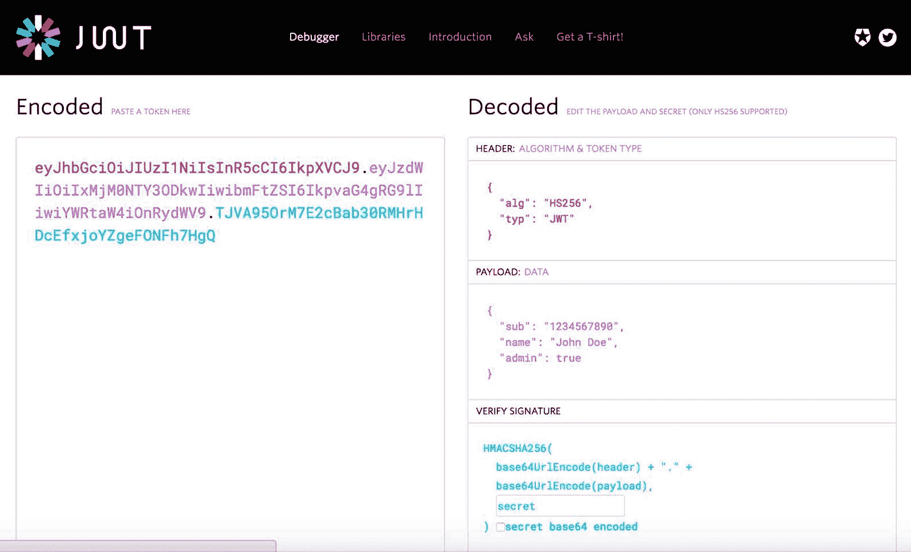
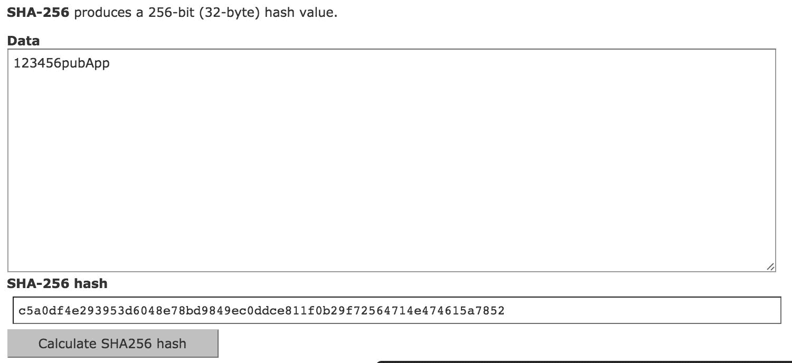
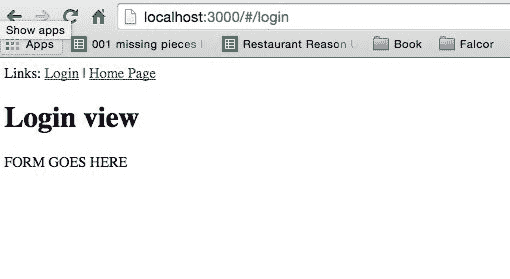
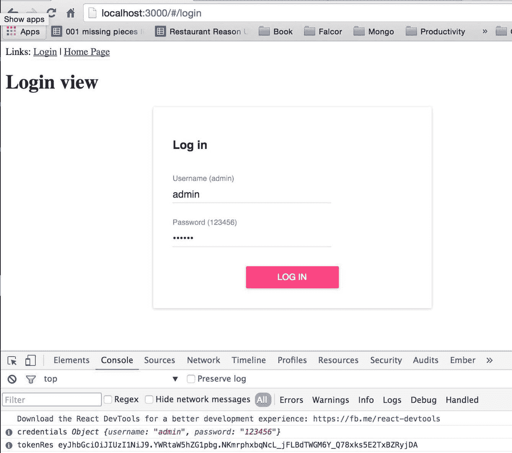
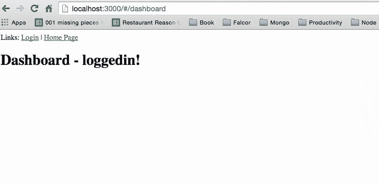
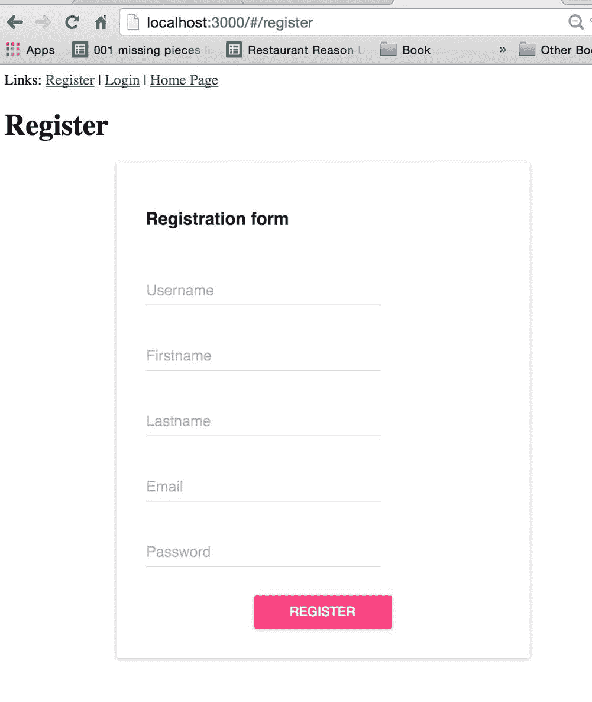

# 我们发布应用程序的全栈登录和注册

**JSON Web Token**（**JWT**）是一种安全令牌格式，相对较新，但效果很好。它是一个开放标准（RFC 7519），在处理在 Web 应用程序环境中传递声明的问题时，它改进了 OAuth2 和 OpenID 连接。

实际上，流程如下：

+   服务器分配一个编码的 JSON 对象

+   在客户端被提醒后，它将编码的令牌与每个请求一起发送到服务器

+   根据该令牌，服务器知道谁在发送请求

在开始使用它之前，值得访问[`jwt.io/`](http://jwt.io/)网站并尝试一下：



登录成功后，JWT 解决方案为我们前端应用程序提供一个对象，告诉我们当前用户的授权情况：

```js
{'iss': 'PublishginAppIssuer','name': 'John Doe','admin':true}

```

`iss`是一个发行者属性——在我们的案例中，它将是我们的发布应用程序的后端应用程序。已登录用户的名称很明显——`John Doe`已成功登录。`admin`属性只是说明一个已识别的用户（使用正确的登录名和密码登录到我们的后端应用程序）是一个管理员（`'admin': true`标志）。您将在本章中学习如何使用它。

除了前面例子中提到的内容外，JWT 的响应还包含有关主题/声明的信息、生成的签名 SHA256 令牌和过期日期。这里的重要规则是您必须确信您的令牌发行者。您需要信任随响应提供的内 容。这可能听起来很复杂，但在实际应用中非常简单。

重要的是，您需要保护由 JWT 生成的令牌——这一点将在本章后面详细说明。

流程如下：

1.  我们的客户端发布应用程序从我们的 express 服务器请求令牌。

1.  发布后端应用程序向前端 Redux 应用程序发行令牌。

1.  之后，每次我们从后端获取数据时，我们都会检查用户是否有权访问后端请求的资源——资源消耗令牌。

在我们的案例中，资源是一个 falcor-router 的路由，它与后端有密切的关系，但这在更分散的平台上也同样适用。

记住 JWT 令牌类似于私钥——您必须确保它们的安全！

# JWT 令牌的结构

头部包含后端需要的信息，以便根据该信息识别要执行的加密操作（元数据、使用的算法和密钥）：

```js
{ 
'typ': 'JWT', 
'alg': 'HS256' 
}

```

通常，这部分对我们来说是 100%自动完成的，所以我们实现时不需要关心头信息。

第二部分由 JSON 格式提供的声明组成，例如：

+   **发行者**：这让我们知道谁发行了令牌

+   **受众**：这让我们知道这个令牌必须被我们的应用程序消耗

+   **发行日期**：这让我们知道令牌是在何时创建的

+   **过期日期**：这让我们知道令牌何时过期，因此我们需要生成一个新的令牌

+   **主题**：这让我们知道应用中的哪个部分可以使用令牌（在更大的应用中很有用）

除了这些声明之外，我们还可以创建由应用创建者特别定义的自定义声明：

```js
{ 
'iss': 'http://theIssuerAddress', 
'exp': '1450819372', 
'aud': 'http://myAppAddress', 
'sub': 'publishingApp', 
'scope': ['read'] 
}

```

# 新的 MongoDB 用户集合

我们需要在数据库中创建一个用户集合。用户将拥有以下权限：

+   在我们的发布应用中添加新文章

+   在我们的发布应用中编辑现有文章

+   删除我们发布应用中的文章

第一步是我们需要创建一个集合。你可以从 Robomongo 的 GUI 中这样做（本书开头介绍），但我们将使用命令行。

首先，我们需要创建一个名为 `initPubUsers.js` 的文件：

```js
$ [[you are in the root directory of your project]]
$ touch initPubUsers.js

```

然后将以下内容添加到 `initPubUsers.js` 文件中：

```js
[ 
  { 
'username' : 'admin', 
'password' : 'c5a0df4e293953d6048e78bd9849ec0ddce811f0b29f72564714e474615a7852', 
'firstName' : 'Kamil', 
'lastName' : 'Przeorski', 
'email' : 'kamil@mobilewebpro.pl', 
'role' : 'admin', 
'verified' : false, 
'imageUrl' : 'http://lorempixel.com/100/100/people/' 
  } 
]

```

# 说明

SHA256 字符串，`c5a0df4e293953d6048e78bd9849ec0ddce811f0b29f72564714e474615a7852`，相当于一个密码，123456，其盐字符串等于 `pubApp`。

如果你想要自己生成这个加盐密码散列，那么请访问 [`www.xorbin.com/tools/sha256-hash-calculator`](http://www.xorbin.com/tools/sha256-hash-calculator) 并在他们的网站上输入 `123456pubApp`。你将得到以下屏幕：



这些步骤仅在开始时需要。之后我们需要编写一个注册表单，为我们的应用加盐密码。

# 将 initPubUsers.js 文件导入 MongoDB

在我们的 `initPubUsers.js` 文件中正确的内容后，我们可以运行以下命令行来将新的 `pubUsers` 集合导入到数据库中：

```js
mongoimport --db local --collection pubUsers --jsonArrayinitPubUsers.js --host=127.0.0.1

```

你将得到与我们在 第一章 中导入文章后相同的终端输出，*配置 Node.js、Express.js、MongoDB、Mongoose、Falcor 和 Redux 全栈*，看起来像这样：

```js
2009-04-03T11:36:00.566+0200  connected to: 127.0.0.1
2009-04-03T11:36:00.569+0200  imported 1 document

```

# 在登录的 falcor-route 上工作

现在我们需要开始使用 falcor-router 来创建一个新的端点，该端点将使用 JWT 库为客户端应用提供唯一的令牌。

我们需要做的第一件事是在后端提供 `secret`。

让我们创建那个 `secret` 端点的配置文件：

```js
$ cd server
$ touch configSecret.js

```

现在，我们需要将此 `secret` 的内容放入其中：

```js
export default { 
'secret': process.env.JWT_SECRET || 'devSecretGoesHere' 
}

```

在未来，我们将在生产服务器上使用环境变量，所以表示法 `process.env.JWT_SECRET || 'devSecretGoesHere'` 意味着 `JWT_SECRET` 环境变量不存在，因此使用默认的 `secret` 端点的 `string,devSecretGoesHere`。在此阶段我们不需要任何开发环境变量。

# 创建 falcor-router 的登录（后端）

为了使我们的代码库更有组织性，我们不会在 `server/routes.js` 文件中添加更多路由，而是将创建一个名为 `routesSession.js` 的新文件，并在该文件中保存所有与当前登录用户会话相关的端点。

确保你处于 `server` 目录：

```js
$ cd server

```

首先打开 `server.js` 文件，添加一行代码，这将允许你将用户名和密码发送到后端。添加以下内容：

```js
app.use(bodyParser.urlencoded({extended: false}));

```

这需要在 `app.use(bodyParser.json({extended: false}));` 之下添加，这样你最终得到的 `server.js` 代码将如下所示：

```js
import http from 'http'; 
import express from 'express'; 
import cors from 'cors'; 
import bodyParser from 'body-parser'; 
import mongoose from 'mongoose'; 
import falcor from 'falcor'; 
import falcorExpress from 'falcor-express'; 
import Router from 'falcor-router'; 
import routes from './routes.js'; 

var app = express(); 
app.server = http.createServer(app); 

// CORS - 3rd party middleware 
app.use(cors()); 

// This is required by falcor-express middleware to work correctly with falcor-browser 
app.use(bodyParser.json({extended: false})); 
app.use(bodyParser.urlencoded({extended: false})); 

```

最后需要添加一行新行，以便使其正常工作。然后在同一目录下创建一个新文件，使用以下命令：

```js
$ touch routesSession.js 

```

并将以下初始内容放入 `routesSession.js` 文件中：

```js
export default [ 
  {  
    route: ['login'] , 
    call: (callPath, args) => 
      { 
      const { username, password } = args[0]; 

      const userStatementQuery = { 
          $and: [ 
              { 'username': username }, 
              { 'password': password } 
          ] 
        } 
      } 
  } 
];

```

# 调用路由的工作原理

我们刚刚在 `routesSession.js` 文件中创建了一个初始的调用登录路由。我们不是使用 GET 方法，而是使用 `'call'(**call: async (callPath, args) => **)`。这在旧的 RESTful 方法中相当于 POST。

在 Falcor 路由中，调用方法和 get 方法之间的区别在于我们可以通过 `args` 提供参数。这允许我们从客户端获取用户名和密码：

计划是在我们收到以下凭据后：

```js
const { username, password } = args[0];

```

然后，我们将它们与我们的数据库中的一个用户 admin 进行比较。用户需要知道真实的明文密码是 `123456`，才能获取正确的登录 JWT 令牌：

在这一步中，我们还准备了一个 `userStatementQuery`——这将在稍后查询数据库时使用：

```js
const userStatementQuery = { 
  $and: [ 
      { 'username': username }, 
      { 'password': password } 
  ] 
}

```

# 分离数据库配置 - configMongoose.js

我们需要将数据库配置从 `routes.js` 中分离出来：

```js
$ [[we are in the server/ directory]]
$ touch configMongoose.js

```

以及其新内容：

```js
import mongoose from 'mongoose'; 

const conf = { 
  hostname: process.env.MONGO_HOSTNAME || 'localhost', 
  port: process.env.MONGO_PORT || 27017, 
  env: process.env.MONGO_ENV || 'local', 
}; 

mongoose.connect(&grave;mongodb://${conf.hostname}:  
${conf.port}/${conf.env}&grave;); 

const articleSchema = { 
articleTitle:String, 
articleContent:String 
}; 

const Article = mongoose.model('Article', articleSchema,  
'articles'); 

export default { 
  Article 
};

```

# 说明

我们刚刚引入了以下新的 `env` 变量：`MONGO_HOSTNAME`、`MONGO_PORT` 和 `MONGO_ENV`。当准备生产环境时，我们将使用它们。

`mongodb://${conf.hostname}:${conf.port}/${conf.env}` 表达式正在使用自 EcmaScript6 以来可用的模板功能。

`configMongoose.jsconfig` 的其余部分你应该已经了解，因为我们已经在 第一章 中介绍了它，*使用 Node.js、Express.js、MongoDB、Mongoose、Falcor 和 Redux 配置全栈*。

# 改进 `routes.js` 文件

在我们创建了两个新文件 `configMongoose.js` 和 `routesSession.js` 之后，我们必须改进我们的 `server/routes.js` 文件，以便使所有内容协同工作。

第一步是从 `routes.js` 中删除以下代码：

```js
import mongoose from 'mongoose'; 

mongoose.connect('mongodb://localhost/local'); 

const articleSchema = { 
articleTitle:String, 
articleContent:String 
}; 

const Article = mongoose.model('Article', articleSchema,  
'articles');

```

用以下新代码替换它：

```js
import configMongoosefrom './configMongoose'; 
import sessionRoutes from './routesSession'; 
const Article = configMongoose.Article;

```

此外，我们还需要按照以下方式将 `sessionRoutes` 展开到当前的 `PublishingAppRoutes` 中：

```js
const PublishingAppRoutes =  
    ...sessionRoutes, 
  { 
  route: 'articles.length',

```

在 `PublishingAppRoutes` 的开始处，你需要展开 `...sessionRoutes` 和 `routes`，这样登录路由就可以在整个 Falcor 路由中使用。

# 说明

我们已经移除了帮助我们运行第一个 Mongoose 查询的旧代码，该查询用于获取文章，并将所有内容移动到 `configMongoose` 中，以便我们可以在项目的不同文件中使用它。我们还导入了会话路由，并在之后使用 `...` 展开操作将它们扩展到名为 `PublishingAppRoutes` 的数组中。

# 在实现 JWT 之前检查应用是否工作

在这一点上，当执行 `npm start` 时，应用程序应该正在运行并显示文章列表：

![

当使用 `npm start` 运行时，你应该得到以下信息，以验证一切是否正常工作：

```js
Hash: eeeb09711c820a7978d5 
Version2,: webpack 1.12.14 
Time: 2609ms 
 Asset    Size  Chunks             Chunk Names 
app.js  1.9 MB       0  [emitted]  main 
   [0] multi main 40 bytes {0} [built] 
    + 634 hidden modules 
Started on port 3000

```

# 创建 Mongoose 用户模型

在文件 `configMongoose.js` 中，我们需要创建并导出一个 `User` 模型。向该文件添加以下代码：

```js
const userSchema = { 
'username' : String, 
'password' : String, 
'firstName' : String, 
'lastName' : String, 
'email' : String, 
'role' : String, 
'verified' : Boolean, 
'imageUrl' : String 
}; 

const User = mongoose.model('User', userSchema, 'pubUsers'); 

export default { 
  Article, 
  User 
};

```

# 说明

`userSchema` 描述了我们的用户 JSON 模型。用户是我们指向 MongoDB 中 `pubUsers` 集合的 Mongoose 模型。最后，我们通过将其添加到 `export default` 对象中导出 `User` 模型。

# 在 `routesSession.js` 文件中实现 JWT

第一步是将我们的 `User` 模型导出到 `routesSession` 范围内，通过在该文件顶部添加一个 `import` 语句：

```js
import configMongoosefrom './configMongoose'; 
const User = configMongoose.User;

```

安装 `jsonwebtoken` 和 `crypto` (用于 SHA256):

```js
$ npmi --save jsonwebtoken crypto

```

在安装 `jsonwebtoken` 后，我们需要将其导入到 `routesSession.js`：

```js
import jwt from 'jsonwebtoken'; 
import crypto from 'crypto'; 
import jwtSecret from './configSecret';

```

在 `routesSession` 中导入所有内容后，继续使用 `route: ['login']`。

你需要改进 `userStatementQuery`，使其包含 `saltedPassword` 而不是纯文本：

```js
const saltedPassword = password+'pubApp';  
// pubApp is our salt string 
const saltedPassHash = crypto 
.createHash('sha256') 
.update(saltedPassword) 
.digest('hex'); 
const userStatementQuery = { 
  $and: [ 
      { 'username': username }, 
      { 'password': saltedPassHash } 
  ] 
}

```

因此，我们不会查询纯文本，而是查询盐化的 SHA256 密码。

在 `userStatementQuery` 下，返回 Promise，以下为详细信息：

```js
return User.find(userStatementQuery, function(err, user) { 
   if (err) throw err; 
 }).then((result) => { 
   if(result.length) { 
     return null;  
     // SUCCESSFUL LOGIN mocked now (will implement next) 
   } else { 
     // INVALID LOGIN 
     return [ 
       { 
         path: ['login', 'token'],  
         value: "INVALID" 
       }, 
       { 
         path: ['login', 'error'],  
         value: "NO USER FOUND, incorrect login  
         information" 
       } 
     ]; 
   } 
   return result; 
 });

```

# 说明

`User.find` 是来自 Mongoose 用户模型的 Promise（我们在 `configMongoose.js` 中创建的）--这是一个标准方法。然后我们作为第一个参数提供 `userStatementQuery`，这是一个包含用户名和密码的过滤器对象：`(*{ username, password } = args[0];)`.

接下来，我们提供一个函数，它是查询完成后调用的回调函数：`(function(err, user) {)`. 我们使用 `if(result.length) {}` 计算结果的数量。

如果 `result.length=== 0`，那么我们模拟了 `return` 语句，并且正在执行以下 `else` 代码的返回：

```js
 return [ 
    { 
      path: ['login', 'token'],  
      value: "INVALID" 
    }, 
    { 
      path: ['login', 'error'],  
      value: 'NO USER FOUND, incorrect login  
      information' 
    } 
  ];

```

如你稍后所学，我们将在前端请求该令牌的路径，`['login', 'token']`。在这种情况下，我们没有找到正确的用户名和提供的密码，所以我们返回 `"INVALID"` 字符串，而不是 JWT 令牌。路径 `['login', 'error']` 更详细地描述了错误类型，以便将消息显示给提供无效登录凭据的用户。

# 在 falcor-route 上成功登录

我们需要改进成功的登录路径。我们有一个处理无效登录的情况；我们需要创建一个处理成功登录的情况，所以替换以下代码：

```js
return null; // SUCCESSFUL LOGIN mocked now (will implement next)

```

用以下代码返回成功登录的详细信息：

```js
const role = result[0].role; 
const userDetailsToHash = username+role; 
const token = jwt.sign(userDetailsToHash, jwtSecret.secret); 
return [ 
  { 
    path: ['login', 'token'], 
    value: token 
  }, 
  { 
    path: ['login', 'username'], 
    value: username 
  }, 
  { 
    path: ['login', 'role'], 
    value: role 
  }, 
  { 
    path: ['login', 'error'], 
    value: false 
  } 
];

```

# 说明

如你所见，我们现在从数据库中获取的唯一东西是角色 `value === result[0].role`。我们需要将其添加到哈希中，因为我们不希望我们的应用程序容易受到攻击，以至于普通用户可以通过一些黑客手段获得管理员角色。令牌的值基于 `userDetailsToHash = username+role` 计算---现在就足够了。

在我们对此满意之后，后端需要做的唯一一件事就是返回带有值的路径：

+   登录令牌`['login', 'token']`

+   用户名`['login', 'username']`

+   登录用户的角色`['login', 'role']`

+   没有错误发生的`['login', 'error']`信息

下一步是在前端使用这个路由。运行应用，如果一切正常，我们就可以开始在前端进行编码了。

# 前端和 Falcor

让我们在 Redux 应用中创建一个新的登录路由。为了做到这一点，我们需要引入`react-router`：

```js
$ npmi --save react-router@1.0.0redux-simple-router@0.0.10redux-thunk@1.0.0

```

重要的是要使用正确的 NPM 版本，否则事情会出错！

安装它们之后，我们需要在`src`中添加路由：

```js
$ cd src
$ mkdir routes
$ cd routes
$ touch index.js

```

然后，将此`index.js`文件的内容设置为以下内容：

```js
import React  from 'react'; 
import {Route, IndexRoute} from 'react-router'; 
import CoreLayout  from '../layouts/CoreLayout'; 
import PublishingApp  from '../layouts/PublishingApp'; 
import LoginView  from '../views/LoginView'; 

export default ( 
<Route component={CoreLayout} path='/'> 
<IndexRoute component={PublishingApp} name='home' /> 
<Route component={LoginView} path='login' name='login' /> 
</Route> 
);

```

到目前为止，我们缺少两个应用组件，称为`CoreLayout`和`LoginView`（我们将在下一分钟实现它们）。

# 核心布局组件

`CoreLayout`组件是我们整个应用的包装器。通过执行以下操作来创建它：

```js
cd ../layouts/ 
touch CoreLayout.js 

```

然后，用以下内容填充它：

```js
import React from 'react'; 
import {Link} from 'react-router'; 

class CoreLayout extends React.Component { 
  static propTypes = { 
    children : React.PropTypes.element 
  } 

  render () { 
    return ( 
<div> 
<span> 
Links: <Link to='/login'>Login</Link> |  
<Link to='/'>Home Page</Link> 
</span> 
<br/> 
          {this.props.children} 
</div> 
    ); 
  } 
} 

export default CoreLayout;

```

如你所知，当前路由的所有内容都将进入`{this.props.children}`目标（这是一个你必须事先了解的`basicReact.JS`概念）。我们还创建了两个链接到我们的路由作为标题。

# 登录视图组件

目前，我们将创建一个模拟的`LoginView`组件。让我们创建`views`目录：

```js
$ pwd
$ [[[you shall be at the src folder]]]
$ mkdir views
$ cd views
$ touch LoginView.js

```

以下代码显示了`LoginView.js`文件的内容，其中包含`FORM GOES HERE`占位符：

```js
import React from 'react'; 
import Falcor from 'falcor'; 
import falcorModel from '../falcorModel.js'; 
import {connect} from 'react-redux'; 
import {bindActionCreators} from 'redux'; 

const mapStateToProps = (state) => ({ 
  ...state 
}); 

// You can add your reducers here 
const mapDispatchToProps = (dispatch) => ({}); 

class LoginView extends React.Component { 
  render () { 
    return ( 
<div> 
<h1>Login view</h1> 
          FORM GOES HERE 
</div> 
    ); 
  } 
} 

export default connect(mapStateToProps, mapDispatchToProps)(LoginView);

```

我们完成了`routes/index.js`中所有缺失的部分，但在我们的路由应用开始工作之前，还有一些其他待办事项。

# 我们应用的根容器

因为我们的应用变得越来越复杂，我们需要创建一个容器，它将生活在这个容器中。为了做到这一点，让我们在`src`位置执行以下操作：

```js
$ pwd
$ [[[you shall be at the src folder]]]
$ mkdir containers
$ cd containers
$ touch Root.js

```

`Root.js`将成为我们的主要根文件。此文件的内容如下：

```js
import React  from 'react'; 
import {Provider}  from 'react-redux'; 
import {Router}  from 'react-router'; 
import routes   from '../routes'; 
import createHashHistory  from 'history/lib/createHashHistory'; 

const noQueryKeyHistory = createHashHistory({ 
queryKey: false 
}); 

export default class Root extends React.Component { 
  static propTypes = { 
    history : React.PropTypes.object.isRequired, 
    store   : React.PropTypes.object.isRequired 
  } 

  render () { 
    return ( 
<Provider store={this.props.store}> 
<div> 
<Router history={noQueryKeyHistory}> 
            {routes} 
</Router> 
</div> 
</Provider> 
    ); 
  } 
}

```

目前它只是一个简单的容器，但稍后我们将实现更多功能，如调试、热重载等。`noQueryKeyHistory`告诉路由器，我们不希望在 URL 中包含任何随机字符串，因此我们的路由将看起来更美观（这不是什么大问题，你可以将 false 标志更改为 true，看看我在说什么）。

# configureStore 和 rootReducer 的剩余配置

让我们先创建`rootReducer`。为什么我们需要它？因为在更大的应用中，你总是会遇到许多不同的还原器；例如，在我们的应用中，我们将有如下的还原器：

+   **文章还原器**：它保留与文章相关的信息（`RETURN_ALL_ARTICLES`等）

+   **会话还原器**：这将与我们的用户会话（`LOGIN`、`REGISTER`等）相关

+   **编辑器还原器**：它将与编辑器的操作（`EDIT_ARTICLE`、`DELETE_ARTICLE`、`ADD_NEW_ARTICLE`等）相关

+   **路由的 reducer**：这将管理我们路由的状态（开箱即用，因为它由 redux-simple-router 的外部库管理）

让我们在 `reducers` 目录中创建一个 `index.js` 文件：

```js
$ pwd
$ [[[you shall be at the src folder]]]
$ cd reducers
$ touch index.js

```

`index.js` 文件的内容如下：

```js
import {combineReducers} from 'redux'; 
import {routeReducer} from 'redux-simple-router'; 
import article  from './article'; 

export default combineReducers({ 
  routing: routeReducer, 
  article 
});

```

这里新引入的是来自 Redux 的 `combineReducers` 函数。这正是我之前写过的。我们将有多个 reducer——在我们的例子中，我们还从 `redux-simple-router` 库中引入了 `routeReducer`。

下一步是创建 `configureStore`，它将管理我们的存储，并在本书后面实现服务器端渲染：

```js
$ pwd
$ [[[you shall be at the src folder]]]
$ mkdir store
$ cd store
$ touch configureStore.js

```

`configureStore.js` 文件的内容如下：

```js
import rootReducer  from '../reducers'; 
import thunk  from 'redux-thunk'; 
import {applyMiddleware,compose,createStore} from 'redux'; 

export default function configureStore (initialState, debug =  
false) { 
let createStoreWithMiddleware; 
const middleware = applyMiddleware(thunk); 

createStoreWithMiddleware = compose(middleware); 

const store = createStoreWithMiddleware(createStore)( 
rootReducer, initialState 
  ); 
  return store; 
}

```

在前面的代码中，我们正在导入我们最近创建的 `rootReducer`。我们还导入了 `redux-thunk` 库，这个库对于服务器端渲染非常有用（本书后面将描述）。

最后，我们导出一个由许多不同的 reducer 组成的 store（目前是路由和您可以在 `reducer/index.js` 中找到的文章的 reducer），并且能够处理服务器端渲染的初始状态。

# 运行应用前在 layouts/PublishingApp.js 中的最后微调

我们应用中最后更改的是，我们的发布应用中有过时的代码。

为什么它会过时？因为我们引入了 `rootReducer` 和 `combineReducers`。所以如果您检查 `PublishingApp` 的渲染代码，它将不会工作：

```js
let articlesJSX = []; 

for(let articleKey in this.props) { 
const articleDetails = this.props[articleKey]; 

const currentArticleJSX = ( 
<div key={articleKey}> 
<h2>{articleDetails.articleTitle}</h2> 
<h3>{articleDetails.articleContent}</h3> 
</div>); 

articlesJSX.push(currentArticleJSX); 
}

```

您需要将其更改为以下内容：

```js
let articlesJSX = []; 

for(let articleKey in this.props.article) { 
const articleDetails = this.props.article[articleKey]; 

const currentArticleJSX = ( 
<div key={articleKey}> 
<h2>{articleDetails.articleTitle}</h2> 
<h3>{articleDetails.articleContent}</h3> 
</div>); 

articlesJSX.push(currentArticleJSX); 
}

```

您看到区别了吗？旧的 `for(let articleKey in this.props)` 已更改为 `for(let articleKey in this.props.article)`，而 `this.props[articleKey]` 已更改为 `this.props.article[articleKey]`。为什么？我会再次提醒：现在每个新的 reducer 都将通过在 `routes/index.js` 中创建的名称在我们的应用中可用。我们命名了我们的 reducer 为 article，所以我们现在必须将其添加到 `this.props.article` 中以使这些功能协同工作。

# 运行应用前 src/app.js 的最后更改

最后一件事情是改进 `src/app.js`，使其使用根容器。我们需要更改旧代码：

```js
// old codebase, to improve: 
import React from 'react' 
import { render } from 'react-dom' 
import { Provider } from 'react-redux' 
import { createStore } from 'redux' 
import article from './reducers/article' 
import PublishingApp from './layouts/PublishingApp' 

const store = createStore(article) 

render( 
<Provider store={store}> 
<PublishingApp store={store} /> 
</Provider>, 
document.getElementById('publishingAppRoot') 
);

```

我们需要将前面的代码更改为以下内容：

```js
import React from 'react'; 
import ReactDOM from 'react-dom'; 
import createBrowserHistory from 'history/lib/createBrowserHistory'; 
import {syncReduxAndRouter} from 'redux-simple-router'; 
import Root from './containers/Root'; 
import configureStore from './store/configureStore'; 

const target  = document.getElementById('publishingAppRoot'); 
const history = createBrowserHistory(); 

export const store = configureStore(window.__INITIAL_STATE__); 

syncReduxAndRouter(history, store); 

const node = ( 
<Root 
      history={history} 
      store={store}  /> 
); 

ReactDOM.render(node, target);

```

我们开始直接使用 `Root` 而不是 `Provider`，并且我们需要将 store 和 history 的属性发送到 `Root` 组件。`***export const store = configureStore(window.__INITIAL_STATE__)***` 这部分是为了服务器端渲染，我们将在接下来的章节中添加。我们还使用 history 库用 JavaScript 管理浏览器的历史记录。

# 我们运行应用的截图

目前当您执行 `npm start` 时，您将看到以下两个路由。

# 首页



# 登录视图



# 正在处理登录表单，该表单将调用后端以进行身份验证

好的，所以我们在项目结构可扩展性方面做了很多准备工作（`routes`、`rootReducer`、`configStores` 等）。

为了从用户的角度使我们的应用看起来更美观，我们将开始使用 Material Design CSS。为了使我们的表单工作更轻松，我们将开始使用`formsy-react`库。让我们来安装它：

```js
$ npm i --save material-ui@0.14.4formsy-react@0.17.0

```

在撰写本书时，Material UI 的版本.20.14.4 是最好的选择；我使用这个版本是因为生态系统变化非常快，所以最好在这里标记所使用的版本，这样你在遵循本书中的说明时就不会有任何惊喜。

`formsy-react`库是一个非常实用的库，它将帮助我们验证发布应用中的表单。我们将在登录和注册等页面上使用它，正如你将在下一页看到的那样。

# 在`LoginForm`和`DefaultInput`组件上工作

在我们完成安装新的依赖项后，让我们创建一个文件夹，用于保存与无状态组件（没有访问任何存储的组件；它们通过回调与我们的应用的其他部分进行通信---你将在稍后了解更多关于这个的信息）相关的文件：

```js
$ pwd
$ [[[you shall be at the src folder]]]
$ mkdir components
$ cd components
$ touch DefaultInput.js

```

然后使这个文件的内容如下：

```js
import React from 'react'; 
import {TextField} from 'material-ui'; 
import {HOC} from 'formsy-react'; 

class DefaultInput extends React.Component { 
  constructor(props) { 
    super(props); 
    this.changeValue = this.changeValue.bind(this); 
    this.state = {currentText: null} 
  } 

changeValue(e) { 
this.setState({currentText: e.target.value}) 
this.props.setValue(e.target.value); 
this.props.onChange(e); 
  } 

  render() { 
    return ( 
<div> 

<TextField 
          ref={this.props.name} 
          floatingLabelText={this.props.title} 
          name={this.props.name} 
          onChange={this.changeValue} 
          required={this.props.required} 
          type={this.props.type} 
          value={this.state.currentText ?  
          this.state.currentText : this.props.value} 
          defaultValue={this.props.defaultValue} /> 
        {this.props.children} 
</div>); 
  } 
}; 

export default HOC(DefaultInput);

```

# 说明

`formsy-react`中的`{HOC}`是装饰组件（在 React 的 ECMAScript5 中称为`mixin`）的另一种方式，导出默认的`HOC(DefaultInput)`--你可以在[`github.com/christianalfoni/formsy-react/blob/master/API.md#formsyhoc`](https://github.com/christianalfoni/formsy-react/blob/master/API.md#formsyhoc)找到更多关于这个的信息。

我们还在使用来自`material-ui`的`TextField`；它具有不同的属性。以下是一些属性：

+   `ref`: 我们希望为每个输入项都提供一个带有其名称（用户名和电子邮件）的`ref`。

+   `floatingLabelText`: 这是一个看起来很不错的浮动文本（也称为标签）。

+   `onChange`: 这告诉函数的名称，当有人正在 TextField 中输入时必须调用该函数。

+   `required`: 这有助于我们管理表单中的必填输入项。

+   `value`: 当然，这是我们的 TextField 的当前值。

+   `defaultValue`: 这是一个初始值。非常重要的一点是，当组件调用组件的构造函数时，它只被调用一次。

当前的文本(`this.state.currentText`)是`DefaultInput`组件的值---它会在每次由`TextFieldonChange`属性中提供的回调函数触发的`changeValue`事件上改变。

# 创建`LoginForm`并使其与`LoginView`一起工作

下一步是创建`LoginForm`。这将使用`DefaultInput`组件，以下是一些命令：

```js
$ pwd
$ [[[you shall be at the components folder]]]
$ touch LoginForm.js

```

然后我们的`src/components/LoginForm.js`文件的内容如下：

```js
import React from 'react'; 
import Formsy from 'formsy-react'; 
import {RaisedButton, Paper} from 'material-ui'; 
import DefaultInput from './DefaultInput'; 

export class LoginForm extends React.Component { 
  constructor() { 
    super(); 
  } 

  render() { 
    return ( 
<Formsy.FormonSubmit={this.props.onSubmit}> 
<Paper zDepth={1} style={{padding: 32}}> 
<h3>Log in</h3> 
<DefaultInput 
onChange={(event) => {}}  
name='username' 
title='Username (admin)' 
required /> 

<DefaultInput 
onChange={(event) => {}}  
type='password' 
name='password' 
title='Password (123456)' 
required /> 

<div style={{marginTop: 24}}> 
<RaisedButton 
              secondary={true} 
              type="submit" 
              style={{margin: '0 auto', display: 'block', width:  
              150}} 
              label={'Log in'} /> 
</div> 
</Paper> 
</Formsy.Form> 
    ); 
  } 
}

```

在前面的代码中，我们有使用`DefaultInput`组件的`LoginForm`组件。这是一个简单的`React.js`表单，在提交后调用`this.props.onSubmit`--这个`onSubmit`函数将在稍后的`src/views/LoginView.js`智能组件中定义。我不会过多地谈论组件上的附加样式，因为这取决于您如何进行样式设计--您将很快看到我们应用所应用的样式的截图。

# 改进`src/views/LoginView.js`

在我们运行应用程序之前，当前开发阶段的最后一部分是改进`LoginView`组件。

在`src/views/LoginView.js`中做出以下更改。导入我们新的`LoginForm`组件：

```js
import {LoginForm} from '../components/LoginForm.js'; 
Add a new constructor of that component: 
 constructor(props) { 
    super(props); 
    this.login = this.login.bind(this); 
    this.state = { 
      error: null 
    }; 
  }

```

然后在您完成导入和构造函数之后，您需要一个名为`login`的新函数：

```js
async login(credentials) { 
console.info('credentials', credentials); 

    await falcorModel 
      .call(['login'],[credentials]) 
      .then((result) =>result); 

const tokenRes = await falcorModel.getValue('login.token'); 
console.info('tokenRes', tokenRes); 
    return; 
  }

```

在这一点上，`login`函数只将我们的新 JWT 令牌打印到控制台--现在足够了；稍后我们将在此基础上构建更多功能。

此处的最后一步是改进我们的`render`函数：

```js
 render () { 
    return ( 
<div> 
<h1>Login view</h1> 
          FORM GOES HERE 
</div> 
    ); 
  }

```

对新的方法，如下所示：

```js
 render () { 
    return ( 
<div> 
<h1>Login view</h1> 
<div style={{maxWidth: 450, margin: '0 auto'}}> 
<LoginForm 
onSubmit={this.login} /> 
</div> 
</div> 
    ); 
  }

```

太好了！现在我们已经完成了！以下是在运行`npm start`并在浏览器中运行它后您将看到的内容：



如您在浏览器控制台中所见，我们可以看到提交的凭据对象`(credentials Object {username: "admin", password: "123456"})`以及从后端获取的令牌`(tokenRes eyJhbGciOiJIUzI1NiJ9.YWRtaW5hZG1pbg.NKmrphxbqNcL_jFLBdTWGM6Y_Q78xks5E2TxBZRyjDA)`。所有这些都告诉我们，我们在实现发布应用程序的登录机制方面正在按计划进行。

重要

如果您遇到错误，请确保在创建哈希时使用了`123456`密码。否则，输入适用于您情况的自定义密码。

# 制作 DashboardView 组件

到目前为止，我们有一个未完成的登录功能，但在继续工作之前，让我们创建一个简单的`src/views/DashboardView.js`组件，该组件将在成功登录后显示：

```js
$ pwd 
$ [[[you shall be at the views folder]]] 
$ touch DashboardView.js

```

添加以下简单内容：

```js
import React from 'react'; 
import Falcor from 'falcor'; 
import falcorModel from '../falcorModel.js'; 
import { connect } from 'react-redux'; 
import { bindActionCreators } from 'redux'; 
import { LoginForm } from '../components/LoginForm.js'; 

const mapStateToProps = (state) => ({ 
  ...state 
}); 

// You can add your reducers here 
const mapDispatchToProps = (dispatch) => ({}); 

class DashboardView extends React.Component { 
render () { 
    return ( 
<div> 
<h1>Dashboard - loggedin!</h1> 
</div> 
    ); 
  } 
} 
export default connect(mapStateToProps, mapDispatchToProps)(DashboardView);

```

这是一个简单的组件，目前是静态的。稍后，我们将将其构建得更加完善。

关于仪表板，我们需要在`src/routes/index.js`文件中创建的最后一件事情是添加一个新的路由：

```js
import DashboardView from '../views/DashboardView'; 

export default ( 
<Route component={CoreLayout} path='/'> 
<IndexRoute component={PublishingApp} name='home' /> 
<Route component={LoginView} path='login' name='login' /> 
<Route component={DashboardView} path='dashboard'   name='dashboard' /> 
</Route> 
);

```

我们刚刚使用 react-router 的配置添加了第二个路由。它使用位于`../views/DashboardView`文件的`DashboardView`组件。

# 完成登录机制

在我们发布应用程序的这个阶段，对登录的最后改进仍然位于`src/views/LoginView.js`位置：

首先，让我们添加处理无效登录的方法：

```js
console.info('tokenRes', tokenRes); 

if(tokenRes === 'INVALID') { 
    const errorRes = await falcorModel.getValue('login.error'); 
    this.setState({error: errorRes}); 
    return; 
} 

return;

```

我们添加了`if(tokenRes === 'INVALID')`这个条件，以便用`this.setState({error: errorRes})`更新错误状态。

下一步是将`Snackbar`添加到`render`函数中，以便向用户显示错误类型。在`LoginView`组件的顶部添加以下导入：

```js
import { Snackbar } from 'material-ui';

```

然后您需要更新`render`函数如下：

```js
<Snackbar 
  autoHideDuration={4000} 
  open={!!this.state.error} 
  message={this.state.error || ''}  
  onRequestClose={() => null} />

```

所以在添加之后，`render`函数将看起来像这样：

```js
render () { 
  return ( 
<div> 
<h1>Login view</h1> 
<div style={{maxWidth: 450, margin: '0 auto'}}> 
<LoginForm 
onSubmit={this.login} /> 
</div> 
<Snackbar autoHideDuration={4000} 
          open={!!this.state.error} 
          message={this.state.error || ''}  
onRequestClose={() => null} /> 
</div> 
  ); 
}

```

`SnackBar onRequestClose`在这里是必需的，否则你将在开发者的控制台中收到警告。好的，所以我们正在处理登录错误，现在让我们来处理成功的登录。

# 在 LoginView 组件中处理成功的登录

为了处理成功的令牌的后端响应，添加登录函数：

```js
if(tokenRes === 'INVALID') { 
const errorRes = await falcorModel.getValue('login.error'); 
this.setState({error: errorRes}); 
      return; 
    }

```

处理正确响应的新代码，如下所示：

```js
if(tokenRes) { 
const username = await falcorModel.getValue('login.username'); 
const role = await falcorModel.getValue('login.role'); 

localStorage.setItem('token', tokenRes); 
localStorage.setItem('username', username); 
localStorage.setItem('role', role); 

this.props.history.pushState(null, '/dashboard'); 
}

```

# 说明

在我们知道`tokenRes`不是`INVALID`并且它不是未定义的（否则向用户显示致命错误）之后，我们遵循以下步骤：

我们从 Falcor 的模型中获取用户名`(await falcorModel.getValue('login.username'))`。我们获取用户的角色`(await falcorModel.getValue('login.role'))`。然后我们将所有已知的变量从后端保存到`localStoragewith`：

```js
localStorage.setItem('token', tokenRes); 
localStorage.setItem('username', username); 
localStorage.setItem('role', role);

```

在同一端，我们使用`this.props.history.pushState(null, '/dashboard')`将用户发送到`/dashboard`路由。

# 关于 DashboardView 和安全的几个重要注意事项

在这个阶段，我们不会对`DashboardView`进行安全设置，因为没有需要保护的重要内容——我们将在将更多资产/功能放入这个路由时进行，到本书的结尾，这个路由将是一个编辑仪表板，将控制系统中所有文章。

我们剩下的唯一一步是将它变成一个`RegistrationView`组件。到这个时候，这个路由也将对每个人开放。在本书的后面部分，我们将创建一个机制，使得只有主管理员才能将新编辑添加到系统中（并管理他们）。

# 开始新的编辑注册工作

为了完成注册，让我们首先在我们的用户方案中做一些更改，这些更改位于 Mongoose 的配置文件`server/configMongoose.js`的位置：

```js
const userSchema = { 
'username' : String, 
'password' : String, 
'firstName' : String, 
'lastName' : String, 
'email' : String, 
'role' : String, 
'verified' : Boolean, 
'imageUrl' : String 
};

```

按照以下新方案：

```js
const userSchema = { 
'username' : { type: String, index: {unique: true, dropDups: true }}, 
'password' : String, 
'firstName' : String, 
'lastName' : String, 
'email' : { type: String, index: {unique: true, dropDups: true }}, 
'role' : { type: String, default: 'editor' }, 
'verified' : Boolean, 
'imageUrl' : String 
};

```

如你所见，我们已经在`username`和`email`字段上添加了唯一索引。我们还为角色添加了一个默认值，因为在我们集合中的下一个用户将是一个编辑（而不是管理员）。

# 添加注册的 falcor-route

在位于`server/routesSession.js`的文件中，你需要添加一个新的路由（在登录路由旁边）：

```js
 {  
    route: ['register'], 
    call: (callPath, args) => 
      { 
        const newUserObj = args[0]; 
        newUserObj.password = newUserObj.password+'pubApp'; 
        newUserObj.password = crypto 
          .createHash('sha256') 
          .update(newUserObj.password) 
          .digest('hex'); 
          const newUser = new User(newUserObj); 
          return newUser.save((err, data) => { if (err) return err; }) 
          .then ((newRes) => { 
            /* 
              got new obj data, now let's get count: 
             */ 
             const newUserDetail = newRes.toObject(); 

            if(newUserDetail._id) { 
              return null; // Mocked for now 
            } else { 
              // registration failed 
              return [ 
                { 
                  path: ['register', 'newUserId'],  
                  value: 'INVALID' 
                }, 
                { 
                  path: ['register', 'error'],  
                  value: 'Registration failed - no id has been                                  
                  created' 
                } 
              ]; 
            } 
            return; 
          }).catch((reason) =>console.error(reason)); 
      } 
  }

```

这段代码实际上只是通过`const newUserObj = args[0]`从前端接收新用户的对象。

然后我们对将要存储在我们数据库中的密码进行加盐处理：

```js
newUserObj.password = newUserObj.password+'pubApp'; 
newUserObj.password = crypto 
  .createHash('sha256') 
  .update(newUserObj.password) 
  .digest('hex');

```

然后我们通过`const newUser = new User(newUserObj)`从 Mongoose 创建一个新的用户模型，因为`newUser`变量是用户的新模型（尚未保存）。接下来我们需要用以下代码保存它：

```js
return newUser.save((err, data) => { if (err) return err; })

```

在它被保存到数据库并且 Promise 被解决之后，我们首先通过将 Mongoose 结果的对象转换成一个简单的 JSON 结构`const newUserDetail = newRes.toObject();`来管理数据库中的无效条目。

完成之后，我们将向 Falcor 的模型返回一个`INVALID`信息：

```js
 // registration failed 
    return [ 
      { 
        path: ['register', 'newUserId'],  
        value: 'INVALID' 
      }, 
      { 
        path: ['register', 'error'],  
        value: 'Registration failed - no id has been created' 
      }

```

因此，我们已经处理了来自 Falcor 的无效用户注册。下一步是替换以下内容：

```js
// you shall already have this in your codebase, just a recall 
if(newUserDetail._id) { 
  return null; // Mocked for now 
} 
The preceding code needs to be replaced with: 
if(newUserDetail._id) { 
const newUserId = newUserDetail._id.toString(); 

  return [ 
    { 
      path: ['register', 'newUserId'],  
      value: newUserId 
    }, 
    { 
      path: ['register', 'error'],  
      value: false  
    } 
  ]; 
}

```

# 说明

我们需要将新用户的 ID 转换为字符串，`newUserId = newUserDetail._id.toString()`（否则代码会出错）。

如你所见，我们有一个标准的返回语句，它补充了 Falcor 中的模型。

为了快速回顾，在它正确返回后端之后，我们将在前端以如下方式请求此值：`const newUserId = await falcorModel.getValue(['register', 'newUserId']);`（这只是一个如何在客户端获取这个新的`UserId`的示例——不要将其写入你的代码中，我们将在一会儿做这个操作）。

在几个更多示例之后，你会习惯它的。

# 前端实现（注册视图和注册表单）

让我们首先创建一个组件，它将在前端管理注册表单，以下是一些操作：

```js
$ pwd 
$ [[[you shall be at the components folder]]] 
$ touch RegisterForm.js 

```

该文件的内容将是：

```js
import React from 'react'; 
import Formsy from 'formsy-react'; 
import {RaisedButton, Paper} from 'material-ui'; 
import DefaultInput from './DefaultInput'; 

export class RegisterForm extends React.Component { 
  constructor() { 
    super(); 
  } 

  render() { 
    return ( 
<Formsy.FormonSubmit={this.props.onSubmit}> 
<Paper zDepth={1} style={{padding: 32}}> 
<h3>Registration form</h3> 
<DefaultInput 
  onChange={(event) => {}}  
  name='username' 
  title='Username' 
  required /> 

<DefaultInput 
  onChange={(event) => {}}  
  name='firstName' 
  title='Firstname' 
  required /> 

<DefaultInput 
  onChange={(event) => {}}  
  name='lastName' 
  title='Lastname' 
  required /> 

<DefaultInput 
  onChange={(event) => {}}  
  name='email' 
  title='Email' 
  required /> 

<DefaultInput 
  onChange={(event) => {}}  
  type='password' 
  name='password' 
  title='Password' 
  required /> 

<div style={{marginTop: 24}}> 
<RaisedButton 
              secondary={true} 
              type="submit" 
              style={{margin: '0 auto', display:                      
              'block', width: 150}} 
              label={'Register'} /> 
</div> 
</Paper> 
</Formsy.Form> 
    ); 
  } 
}

```

之前的注册组件创建了一个与`LoginForm`中完全相同的表单。当用户点击`注册`按钮时，它向`src/views/RegisterView.js`组件发送一个回调（我们将在一会儿创建这个组件）。

记住，在组件目录中我们只保留简单的组件，所以与整个应用的其余部分的通信必须通过回调函数来完成，就像这个例子一样。

# 注册视图

让我们创建一个`RegisterView`文件：

```js
$ pwd 
$ [[[you shall be at the views folder]]] 
$ touch RegisterView.js

```

其内容如下：

```js
import React from 'react'; 
import falcorModel from '../falcorModel.js'; 
import { connect } from 'react-redux'; 
import { bindActionCreators } from 'redux'; 
import { Snackbar } from 'material-ui'; 
import { RegisterForm } from '../components/RegisterForm.js'; 

const mapStateToProps = (state) => ({  
  ...state  
}); 
const mapDispatchToProps = (dispatch) => ({});

```

这些是我们智能组件中使用的标准事物（我们需要`falcorModel`来与后端通信，以及`mapStateToProps`和`mapDispatchToProps`来与我们的 Redux 的 store/reducer 通信）。

好的，注册视图的内容还不止这些；接下来让我们添加一个组件：

```js
const mapDispatchToProps = (dispatch) => ({}); 

class RegisterView extends React.Component { 
  constructor(props) { 
    super(props); 
    this.register = this.register.bind(this); 
    this.state = { 
      error: null 
    }; 
  } 

  render () { 
    return ( 
<div> 
<h1>Register</h1> 
<div style={{maxWidth: 450, margin: '0 auto'}}> 
<RegisterForm 
onSubmit={this.register} /> 
</div> 
</div> 
    ); 
  } 
} 
export default connect(mapStateToProps, mapDispatchToProps)(RegisterView);

register function, so between the constructor and the render function add the function, as follows:
```

```js
async register (newUserModel) {console.info("newUserModel",  newUserModel); 

    await falcorModel 
      .call(['register'],[newUserModel]) 
      .then((result) =>result); 

      const newUserId = await falcorModel.getValue(['register',  
      'newUserId']); 

    if(newUserId === 'INVALID') { 
      const errorRes = await falcorModel.getValue('register.error'); 

      this.setState({error: errorRes}); 
      return; 
    } 

    this.props.history.pushState(null, '/login'); 
  }

```

如你所见，`async register (newUserModel)`函数是异步的，并且对`await`友好。接下来，我们只是在控制台中使用`console.info("newUserModel", newUserModel)`记录用户提交的内容。之后，我们通过调用查询 falcor-router：

```js
await falcorModel 
      .call(['register'],[newUserModel]) 
      .then((result) => result);

```

在我们调用路由器之后，我们使用以下方式获取响应：

```js
const newUserId = await falcorModel.getValue(['register', 'newUserId']);

```

根据后端的响应，我们执行以下操作：

+   对于`INVALID`，我们在组件的状态中获取并设置错误信息（`this.setState({error: errorRes})`）。

+   如果用户注册正确，那么我们就有了他们的新 ID，并且我们要求用户使用历史记录的 push 状态`(this.props.history.pushState(null, '/login');)`进行登录。

我们在`routes/index.js`中没有为`RegisterView`创建路由，并且在`CoreLayout`中也没有链接，所以我们的用户无法使用它。在`routes/index.js`中添加新的导入：

```js
import RegisterView from '../views/RegisterView';

```

然后添加一个路由，所以`routes/index.js`中的导出默认值将看起来像这样：

```js
export default ( 
<Route component={CoreLayout} path='/'> 
<IndexRoute component={PublishingApp} name='home' /> 
<Route component={LoginView} path='login' name='login' /> 
<Route component={DashboardView} path='dashboard'  name='dashboard' /> 
<Route component={RegisterView} path='register' name='register' /> 
</Route> 
);

```

最后，在`src/layoutsCoreLayout.js`文件中的`render`方法内添加一个链接：

```js
render () { 
    return ( 
<div> 
<span> 
   Links:<Link to='/register'>Register</Link> 
  <Link to='/login'>Login</Link> 
  <Link to='/'>Home Page</Link> 
</span> 
  <br/> 
 {this.props.children} 
</div> 
    ); 
  }

```

在这一点上，我们应该能够使用此表单进行注册：



# 摘要

在下一章中，我们将开始着手我们应用的服务器端渲染。这意味着在每次向我们的 Express 服务器发送请求时，我们将根据客户端的请求生成 HTML 标记。这个特性对我们这样的应用非常有用，因为我们这类用户对网页加载速度的要求非常高。

你可以想象，大多数新闻网站都是为了娱乐，这意味着我们潜在用户的注意力集中时间较短。加载速度很重要。还有一些观点认为，服务器端渲染也有助于搜索引擎优化的原因。

爬虫有更简单的方式来*读取*我们文章中的文本，因为它们不需要执行服务器端的 JavaScript 来从服务器获取它（与不使用服务器端渲染的单页应用相比）。

至少有一点是确定的：如果你在你的文章发布应用中实现了服务器端渲染，那么谷歌可能会认为你关心你应用的快速加载，因此它可能会给你带来一些优势，相对于那些不关心服务器端渲染的完整单页网站。
