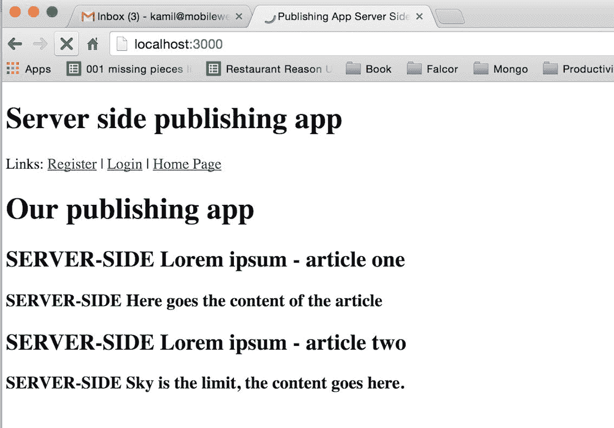
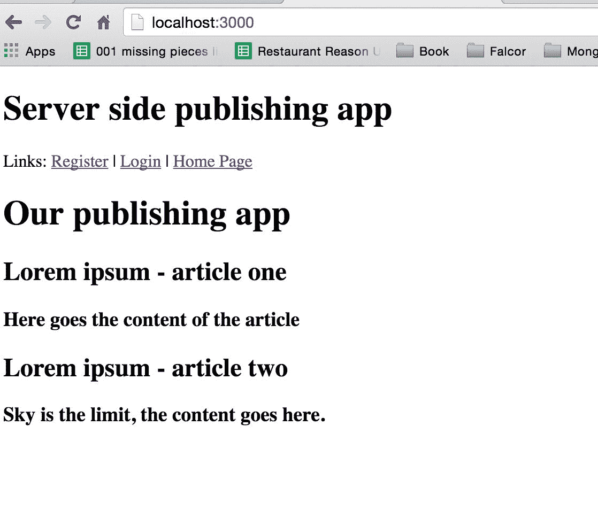
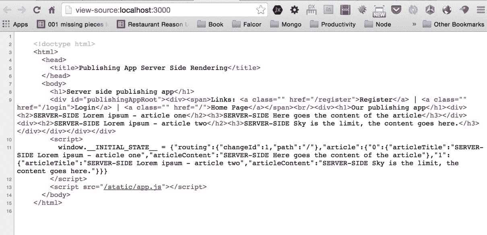

# 第三章：服务器端渲染

全局 JavaScript，或同构 JavaScript，是我们要在本章中实现的功能的不同名称。更准确地说，我们将开发我们的应用，并在服务器和客户端上渲染应用页面。它将不同于主要在客户端渲染的 **Angular1** 或 Backbone 单页应用程序。从技术角度来看，我们的方法更复杂，因为你需要部署你的全栈技能，这些技能在服务器端渲染上工作，但拥有这种经验将使你成为一个更受欢迎的程序员，你可以将你的技能在市场上提升到下一个水平——你将能够为你的技能收取更高的费用。

# 当服务器端值得实施时

服务器端渲染是文本内容（如新闻门户）初创公司/公司的非常有用的功能，因为它有助于通过不同的搜索引擎实现更好的索引。对于任何新闻和内容丰富的网站来说，这是一个基本功能，因为它有助于增长有机流量。在本章中，我们还将使用服务器端渲染运行我们的应用。其他可能有用服务器端渲染的公司是娱乐业务，其中用户对网页加载缓慢的情况耐心较少，他们可能会关闭浏览器。总的来说，所有 **B2C**（面向消费者）的应用程序都应该使用服务器端渲染来改善访问其网站的人们的体验。

本章我们将关注的重点包括以下内容：

+   对整个服务器端代码进行重新排列以准备服务器端渲染

+   开始使用 react-dom/server 及其 `renderToString` 方法

+   `RoutingContext` 和在服务器端工作的 react-router 的匹配

+   优化客户端应用程序，使其适用于同构 JavaScript 应用程序

你准备好了吗？我们的第一步是在后端模拟数据库的响应（在服务器端渲染在模拟数据上正确工作后，我们将创建一个真实的数据库查询）。

# 模拟数据库响应

首先，我们将模拟后端数据库响应，以便为直接进入服务器端渲染做准备；我们将在本章稍后更改它：

```js
$ [[you are in the server directory of your project]]
$ touch fetchServerSide.js  

```

`fetchServerSide.js` 文件将包含所有从我们的数据库获取数据以使服务器端工作的函数。

如前所述，我们现在将使用以下 `fetchServerSide.js` 中的代码进行模拟：

```js
export default () => { 
    return { 
'article':{ 
      '0': { 
        'articleTitle': 'SERVER-SIDE Lorem ipsum - article one', 
        'articleContent':'SERVER-SIDE Here goes the content of the 
         article' 
      }, 

      '1': { 
        'articleTitle':'SERVER-SIDE Lorem ipsum - article two', 
        'articleContent':'SERVER-SIDE Sky is the limit, the 
         content goes here.' 
      } 
    } 
  } 
} 

```

创建这个模拟对象的目标是，在实施后，我们能够看到我们的服务器端渲染是否正确工作，因为你可能已经注意到了，我们在每个标题和内容的开头都添加了`SERVER-SIDE`——这将帮助我们了解我们的应用是否从服务器端渲染获取数据。稍后，这个功能将被替换为对 MongoDB 的查询。

帮助我们实现服务器端渲染的下一件事是创建一个 `handleServerSideRender` 函数，该函数将在每次请求击中服务器时被触发。

为了使`handleServerSideRender`在每次前端调用我们的后端时触发，我们需要使用 Express 中间件`app.use`。到目前为止，我们已经使用了一些外部库，例如：

```js
app.use(cors()); 
app.use(bodyParser.json({extended: false})) 

```

在这本书中，我们第一次将编写自己的、小的中间件函数，其行为类似于`cors`或`bodyParser`（也是中间件的外部`libs`）。

在这样做之前，让我们导入 React 服务器端渲染所需的依赖项（`server/server.js`）：

```js
import React from 'react'; 
import {createStore} from 'redux'; 
import {Provider} from 'react-redux'; 
import {renderToStaticMarkup} from 'react-dom/server'; 
import ReactRouter from 'react-router'; 
import {RoutingContext, match} from 'react-router'; 
import * as hist  from 'history'; 
import rootReducer from '../src/reducers'; 
import reactRoutes from '../src/routes'; 
import fetchServerSide from './fetchServerSide'; 

```

因此，在添加了所有这些`server/server.js`的导入之后，文件将如下所示：

```js
import http from 'http'; 
import express from 'express'; 
import cors from 'cors'; 
import bodyParser from 'body-parser'; 
import falcor from 'falcor'; 
import falcorExpress from 'falcor-express'; 
import falcorRouter from 'falcor-router'; 
import routes from './routes.js'; 
import React from 'react' 
import { createStore } from 'redux' 
import { Provider } from 'react-redux' 
import { renderToStaticMarkup } from 'react-dom/server' 
import ReactRouter from 'react-router'; 
import { RoutingContext, match } from 'react-router'; 
import * as hist  from 'history'; 
import rootReducer from '../src/reducers'; 
import reactRoutes from '../src/routes'; 
import fetchServerSide from './fetchServerSide'; 

```

这里解释的大部分内容与上一章中的客户端开发类似。重要的是以给定方式导入 history，例如在示例中：`import * as hist from 'history'`。`RoutingContext`和`match`是使用`React-Router`在服务器端的一种方式。`renderToStaticMarkup`函数将在服务器端为我们生成 HTML 标记。

在我们添加了新的导入之后，然后在 Falcor 的中间件设置下：

```js
// this already exists in your codebase 
app.use('/model.json', falcorExpress.dataSourceRoute((req, res) => { 
  return new falcorRouter(routes); // this already exists in your 
   codebase 
})); 

```

在那个`model.json`代码下，添加以下内容：

```js
let handleServerSideRender = (req, res) => 
{ 
  return; 
}; 

let renderFullHtml = (html, initialState) => 
{ 
  return; 
}; 
app.use(handleServerSideRender); 

```

`app.use(handleServerSideRender)`事件在服务器端每次收到客户端应用程序的请求时被触发。然后我们将准备我们将要使用的空函数：

+   `handleServerSideRender`：它将使用`renderToString`来创建有效的服务器端 HTML 标记。

+   `renderFullHtml`：这是一个辅助函数，它将我们的新 React HTML 标记嵌入到整个 HTML 文档中，正如我们稍后将会看到的。

# 处理服务器端渲染的函数

首先，我们将创建一个新的 Redux 存储实例，该实例将在每次调用后端时创建。这个主要目的是向我们的应用程序提供初始状态信息，以便它可以根据当前请求创建有效的标记。

我们将使用已经在我们的客户端应用中使用的`Provider`组件，它将包装`Root`组件。这将使存储对所有组件可用。

这里最重要的部分是`ReactDOMServer.renderToString()`，用于渲染我们应用程序的初始 HTML 标记，在我们将标记发送到客户端之前。

下一步是使用`store.getState()`函数从 Redux 存储中获取初始状态。初始状态将通过我们的`renderFullHtml`函数传递，你将在稍后了解这一点。

在我们处理两个新函数（`handleServerSideRender`和`renderFullHtml`）之前，在`server.js`中替换以下内容：

```js
app.use(express.static('dist')); 

```

替换为以下内容：

```js
app.use('/static', express.static('dist')); 

```

这就是我们的`dist`项目中的所有内容。它将作为静态文件在本地地址（`http://localhost:3000/static/app.js*`）下可用。这将帮助我们创建一个单页应用程序，在初始服务器端渲染之后。

确保将`app.use('/static', express.static('dist'));`直接放置在`app.use(bodyParser.urlencoded({extended: false }));`之下。否则，如果在这个`server/server.js`文件中放置不当，它可能不会工作。

在完成`express.static`的前面工作后，让我们使这个函数更加完整：

```js
let renderFullHtml = (html, initialState) => 
{ 
  return; // this is already in your codebase 
}; 

```

用以下改进的版本替换前面的空函数：

```js
let renderFullPage = (html, initialState) => 
{ 
  return &grave; 
<!doctype html> 
<html> 
<head> 
<title>Publishing App Server Side Rendering</title> 
</head> 
<body> 
<h1>Server side publishing app</h1> 
<div id="publishingAppRoot">${html}</div> 
<script> 
window.__INITIAL_STATE__ = ${JSON.stringify(initialState)} 
</script> 
<script src="img/app.js"></script> 
</body> 
</html> 
    &grave; 
}; 

```

简而言之，当用户第一次访问网站时，我们的服务器将发送这段 HTML 代码，因此我们需要创建带有 body 和 head 的 HTML 标记，以便使其工作。服务器端发布应用的 header 只是临时性的，用于检查我们是否正确地获取了服务器端 HTML 模板。稍后你可以使用以下命令找到`$html`：

```js
${html}  

```

注意，我们正在使用带有`&grave;`的 ES6 模板（Google ES6 模板字面量）语法。

在这里，我们稍后会放置由`renderToStaticMarkup`函数生成的值。`renderFullPage`函数的最后一步是在窗口中提供初始的服务器端渲染状态，使用`window.INITIAL_STATE = ${JSON.stringify(initialState)}`，这样应用就可以在客户端正确地使用从后端获取的数据工作，当第一次向服务器发出请求时。

好的，接下来让我们专注于`handleServerSideRender`函数，通过替换以下内容：

```js
let handleServerSideRender = (req, res) => 
{ 
  return; 
}; 

```

用以下更完整的函数版本替换：

```js
let handleServerSideRender = (req, res, next) => { 
  try { 
    let initMOCKstore = fetchServerSide(); // mocked for now 

    // Create a new Redux store instance 
    const store = createStore(rootReducer, initMOCKstore); 
    const location = hist.createLocation(req.path); 

    match({ 
      routes: reactRoutes, 
      location: location, 
    }, (err, redirectLocation, renderProps) => { 
      if (redirectLocation) { 
        res.redirect(301, redirectLocation.pathname + 
        redirectLocation.search); 
      } else if (err) { 
        console.log(err); 
        next(err); 
        // res.send(500, error.message); 
      } else if (renderProps === null) { 
        res.status(404) 
        .send('Not found'); 
      } else { 

      if  (typeofrenderProps === 'undefined') { 
        // using handleServerSideRender middleware not required; 
        // we are not requesting HTML (probably an app.js or other 
        file) 
        return; 
      } 

        let html = renderToStaticMarkup( 
          <Provider store={store}> 
          <RoutingContext {...renderProps}/> 
          </Provider> 
        ); 

        const initialState = store.getState() 

        let fullHTML = renderFullPage(html, initialState); 
        res.send(fullHTML); 
      } 
    }); 
  } catch (err) { 
      next(err) 
  } 
} 

```

`let initMOCKstore = fetchServerSide();`表达式正在从 MongoDB（目前是模拟的，稍后将进行改进）获取数据。接下来，我们使用`store = createStore(rootReducer, initMOCKstore)`创建服务器端的 Redux store。我们还需要为我们的应用的用户准备一个正确的地方，以便 react-router 可以使用`location = hist.createLocation(req.path)`（在`req.path`中有一个简单的路径，位于浏览器中；`/register`或`/login`或简单的`main page /`）。`match`函数由 react-router 提供，用于在服务器端匹配正确的路由。

当我们在服务器端匹配了路由后，我们将看到以下内容：

```js
// this is already added to your codebase: 
let html = renderToStaticMarkup( 
<Provider store={store}> 
<RoutingContext {...renderProps}/> 
</Provider> 
); 

const initialState = store.getState(); 

let fullHTML = renderFullPage(html, initialState); 
res.send(fullHTML); 

```

如你所见，我们正在使用`renderToStaticMarkup`创建服务器端的 HTML 标记。在这个函数内部，有一个使用之前通过`let initMOCKstore = fetchServerSide()`获取的 store 的 Provider。在 Redux Provider 内部，我们有`RoutingContext`，它简单地传递所有必要的 props 到我们的应用，这样我们就可以在服务器端创建正确的标记。

在完成所有这些之后，我们只需要用`const initialState = store.getState();`来准备我们的 Redux Store 的`initialState`，然后使用`let fullHTML = renderFullPage(html, initialState);`来获取发送给客户端所需的一切，使用`res.send(fullHTML)`。

我们已经完成了服务器端的准备工作。

# 重新检查 server/server.js

在我们开始进行客户端开发之前，我们将对`server/server.js`进行双重检查，因为我们的代码顺序很重要，而且这是一个容易出错的文件：

```js
import http from 'http'; 
import express from 'express'; 
import cors from 'cors'; 
import bodyParser from 'body-parser'; 
import falcor from 'falcor'; 
import falcorExpress from 'falcor-express'; 
import falcorRouter from 'falcor-router'; 
import routes from './routes.js'; 
import React from 'react' 
import { createStore } from 'redux' 
import { Provider } from 'react-redux' 
import { renderToStaticMarkup } from 'react-dom/server' 
import ReactRouter from 'react-router'; 
import { RoutingContext, match } from 'react-router'; 
import * as hist from 'history'; 
import rootReducer from '../src/reducers'; 
import reactRoutes from '../src/routes'; 
import fetchServerSide from './fetchServerSide'; 

const app = express(); 

app.server = http.createServer(app); 
// CORS - 3rd party middleware 
app.use(cors()); 
// This is required by falcor-express middleware to work correctly 
 with falcor-browser 
app.use(bodyParser.json({extended: false})); 

app.use(bodyParser.urlencoded({extended: false})); 

app.use('/static', express.static('dist')); 

app.use('/model.json', falcorExpress.dataSourceRoute(function(req, res) { 
  return new falcorRouter(routes); 
})); 

let handleServerSideRender = (req, res, next) => { 
  try { 
    let initMOCKstore = fetchServerSide(); // mocked for now 
    // Create a new Redux store instance 
    const store = createStore(rootReducer, initMOCKstore); 
    const location = hist.createLocation(req.path); 
    match({ 
      routes: reactRoutes, 
      location: location, 
      }, (err, redirectLocation, renderProps) => { 
        if (redirectLocation) { 

          res.redirect(301, redirectLocation.pathname +  
          redirectLocation.search); 
        } else if (err) { 

          next(err); 
        // res.send(500, error.message); 
        } else if (renderProps === null) { 

          res.status(404) 
          .send('Not found'); 
        } else { 
            if (typeofrenderProps === 'undefined') { 
            // using handleServerSideRender middleware not 
             required; 
            // we are not requesting HTML (probably an app.js or 
             other file) 

            return; 
          } 
          let html = renderToStaticMarkup( 
            <Provider store={store}> 
            <RoutingContext {...renderProps}/> 
            </Provider> 
          ); 

          const initialState = store.getState() 
          let fullHTML = renderFullPage(html, initialState); 
          res.send(fullHTML); 
        } 
       }); 
    } catch (err) { 
    next(err) 
  } 
} 

let renderFullPage = (html, initialState) => 
{ 
return &grave; 
<!doctype html> 
<html> 
<head> 
<title>Publishing App Server Side Rendering</title> 
</head> 
<body> 
<h1>Server side publishing app</h1> 
<div id="publishingAppRoot">${html}</div> 
<script> 
window.__INITIAL_STATE__ = ${JSON.stringify(initialState)} 
</script> 
<script src="img/app.js"></script> 
</body> 
</html> 
&grave; 
}; 

app.use(handleServerSideRender); 

app.server.listen(process.env.PORT || 3000); 
console.log(&grave;Started on port ${app.server.address().port}&grave;); 

export default app; 

```

这里你就有在服务器端进行渲染所需的一切。让我们继续进行前端方面的改进。

# 前端调整以使服务器端渲染工作

我们需要对前端进行一些调整。首先，转到`src/layouts/CoreLayout.js`文件，并添加以下内容：

```js
import React from 'react'; 
import { Link } from 'react-router'; 

import themeDecorator from 'material-ui/lib/styles/theme- 
 decorator'; 
import getMuiTheme from 'material-ui/lib/styles/getMuiTheme'; 

class CoreLayout extends React.Component { 
  static propTypes = { 
    children :React.PropTypes.element 
  } 

```

从前面的代码中，需要添加的新内容是：

```js
import themeDecorator from 'material-ui/lib/styles/theme-decorator'; 
import getMuiTheme from 'material-ui/lib/styles/getMuiTheme'; 

```

此外，改进`render`函数并将`default`导出为：

```js
  render () { 
    return ( 
<div> 
<span> 
    Links:   <Link to='/register'>Register</Link> |  
      <Link to='/login'>Login</Link> |  
      <Link to='/'>Home Page</Link> 
</span> 
<br/> 
   {this.props.children} 
</div> 
    ); 
  } 

export default themeDecorator(getMuiTheme(null, { userAgent: 'all' }))(CoreLayout); 

```

我们需要在`CoreLayout`组件中进行更改，因为 Material UI 设计默认情况下会检查你在哪个浏览器上运行它，正如你可以预测的，服务器端没有浏览器，因此我们需要在我们的应用程序中提供有关`{ userAgent: 'all' }`是否设置为`all`的信息。这将有助于避免控制台中的警告，关于服务器端 HTML 标记与客户端浏览器生成的标记不同。

我们还需要改进发布应用程序组件中的`WillMount/_fetch`函数，使其仅在前端触发。然后转到`src/layouts/PublishingApp.js`文件，替换以下旧代码：

```js
componentWillMount() { 
  this._fetch(); 
} 

```

用以下新改进的代码替换它：

```js
componentWillMount() { 
  if(typeof window !== 'undefined') { 
    this._fetch(); // we are server side rendering, no fetching 
  } 
} 

```

这条`if(typeof window !== 'undefined')`语句检查是否存在窗口（在服务器端，窗口将是未定义的）。如果存在，则通过 Falcor 开始获取数据（当在客户端时）。

接下来，打开`containers/Root.js`文件并将其更改为以下内容：

```js
import React  from 'react'; 
import {Provider}  from 'react-redux'; 
import {Router}  from 'react-router'; 
import routes  from '../routes'; 
import createHashHistory  from 'history/lib/createHashHistory'; 

export default class Root extends React.Component { 
  static propTypes = { 
    history : React.PropTypes.object.isRequired, 
    store   : React.PropTypes.object.isRequired 
  } 

render () { 
    return ( 
<Provider store={this.props.store}> 
<div> 
<Router history={this.props.history}> 
{routes} 
</Router> 
</div> 
</Provider> 
    ); 
  } 
} 

```

正如你所看到的，我们已经删除了这部分代码：

```js
// deleted code from Root.js 
const noQueryKeyHistory = createHashHistory({ 
  queryKey: false 
}); 

```

我们已经做了以下更改：

```js
<Router history={noQueryKeyHistory}> 

```

变为以下内容：

```js
<Router history={this.props.history}> 

```

我们为什么要做所有这些？这有助于我们从客户端浏览器 URL 中去除`/#/`标志，因此下次当我们点击例如`http://localhost:3000/register`时，我们的`server.js`可以看到用户当前的 URL，即我们在`handleServerSideRender`函数中使用的`req.path`（在我们的情况下，当点击`http://localhost:3000/register`时，`req.path`等于`/register`）。

在完成所有这些之后，你将在客户端浏览器中看到以下内容：



在 1-2 秒后，它将变为以下内容，因为`PublishingApp.js`中触发了真实的`this._fetch()`函数：



当然，你可以通过查看页面 HTML 源代码来查看服务器端渲染的标记：



# 摘要

我们已经完成了基本的服务器端渲染，正如你在屏幕截图中所看到的。服务器端渲染中唯一缺少的部分是从我们的 MongoDB 获取真实数据--这将在下一章中实现（我们将在`server/fetchServerSide.js`中解锁此获取）。

在取消模拟服务器端数据库查询后，我们将开始改进应用程序的整体外观并实现一些对我们来说非常重要的关键功能，例如添加/编辑/删除文章。
