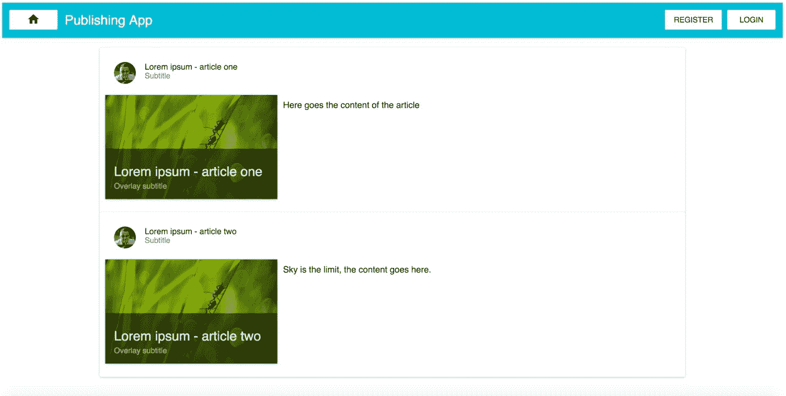
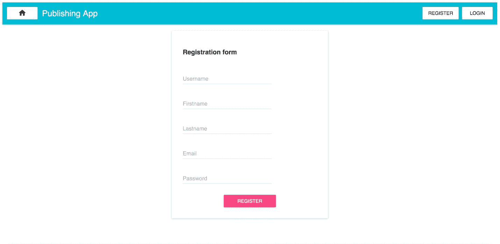
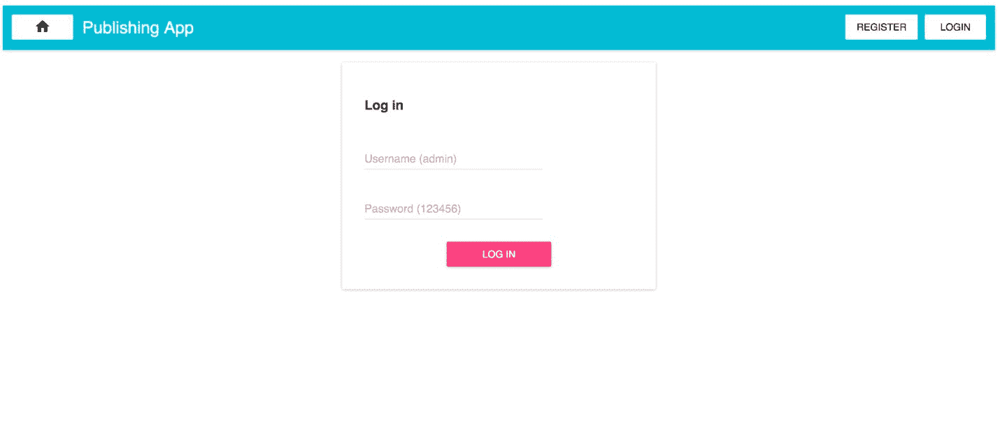
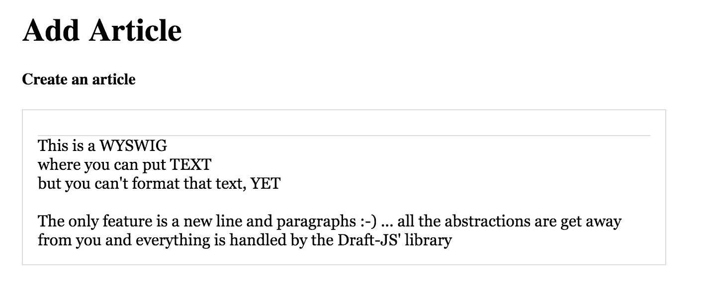
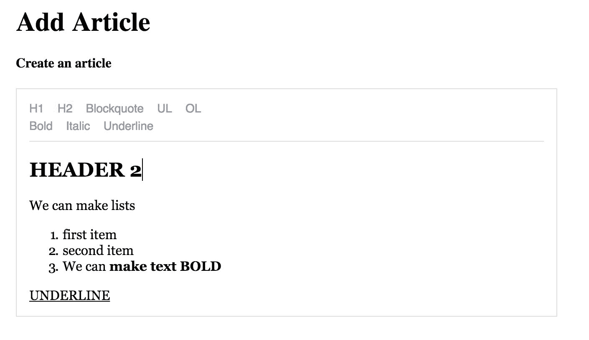

# 客户端的高级 Redux 和 Falcor

Redux 是我们应用程序的状态容器，它保存有关 React 视图层如何在浏览器中渲染的信息。另一方面，Falcor 与 Redux 不同，因为它是一个全栈工具集，它取代了过时的 API 端点数据通信方法。在下一页中，我们将从客户端使用 Falcor，但你需要记住 Factor 是一个全栈库。这意味着，我们需要在两端使用它（在后端我们使用一个名为 Falcor-Router 的附加库）。从第五章，“Falcor 高级概念”开始，我们将使用全栈 Falcor。而在当前章节中，我们将只关注客户端。

# 专注于应用程序的前端

目前，我们的应用程序是一个简单的入门套件，它是进一步开发的骨架。我们需要更多地关注面向客户的客户端前端，因为在这个时代拥有一个好看的客户端前端非常重要。多亏了 Material UI，我们可以重用许多东西来使我们的应用程序看起来更漂亮。

需要注意的是，响应式网页设计目前（以及总体上）不在此书的范围内，因此你需要找出如何改进所有样式以适应移动设备。我们将要工作的应用程序在平板电脑上看起来很好，但小屏幕手机可能看起来不那么好。

在本章中，我们将集中精力做以下工作：

+   取消模拟`fetchServerSide.js`

+   添加一个新的`ArticleCard`组件，这将使我们的主页对用户来说更加专业

+   改进我们应用程序的一般外观

+   实现登出功能

+   在`Draft.js`中添加一个所见即所得（WYSIWYG）编辑器，这是一个由 Facebook 团队为 React 创建的富文本编辑器框架

+   在我们的 Redux 前端应用程序中添加创建新文章的功能

# 在前端改进之前完成后端工作

在上一章中，我们执行了服务器端渲染，这将影响我们的用户，使他们能够更快地看到他们的文章，并且由于整个 HTML 标记都在服务器端渲染，这将提高我们网站的 SEO。

要使我们的服务器端渲染工作达到 100%，最后一步是取消模拟`/server/fetchServerSide.js`中的服务器端文章获取。获取的新代码如下：

```js
import configMongoose from './configMongoose'; 
const Article = configMongoose.Article; 

export default () => { 
  return Article.find({}, function(err, articlesDocs) { 
    return articlesDocs; 
  }).then ((articlesArrayFromDB) => { 
    return articlesArrayFromDB; 
  }); 
}

Article.find (the find function comes from Mongoose). You can also find that we are returning an array of articles that are fetched from our MongoDB.
```

# 改进`handleServerSideRender`

下一步是对`handleServerSideRender`函数进行微调，该函数目前保存在`/server/server.js`文件中。当前的函数如下代码片段所示：

```js
// te following code should already be in your codebase: 
let handleServerSideRender = (req, res, next) => { 
try { 
    let initMOCKstore = fetchServerSide(); // mocked for now 

    // Create a new Redux store instance 
    const store = createStore(rootReducer, initMOCKstore) 
    const location = hist.createLocation(req.path);

```

我们需要用这个改进版本来替换它：

```js
// this is an improved version: 
let handleServerSideRender = async (req, res, next) => { 
  try { 
    let articlesArray = await fetchServerSide(); 
    let initMOCKstore = { 
      article: articlesArray 
    } 

  // Create a new Redux store instance 
  const store = createStore(rootReducer, initMOCKstore) 
  const location = hist.createLocation(req.path);

```

我们改进的`handleServerSideRender`有什么新内容？如您所见，我们添加了`async await`。回想一下，它帮助我们使代码在异步调用（如对数据库的查询）上不那么痛苦（看起来同步的生成器风格代码）。这个 ES7 特性使我们能够将异步调用写成同步的样子——在底层，`async await`要复杂得多（在它被转换为 ES5 之后，以便可以在任何现代浏览器中运行），但我们将不会深入探讨`async await`是如何工作的，因为这不在这个章节的范围内。

# 在 Falcor 中更改路由（前端和后端）

您还需要将两个 ID 变量名更改为`_id`（`_id`是 Mongo 集合中文档 ID 的默认名称）。

在`server/routes.js`中查找以下旧代码：

```js
route: 'articles[{integers}]["id","articleTitle","articleContent"]',

```

将其更改为以下内容：

```js
route: 'articles[{integers}]["_id","articleTitle","articleContent"]',

```

唯一的改变是我们将返回`_id`而不是`id`。我们需要在`src/layouts/PublishingApp.js`中获取`_id`值，所以找到以下代码片段：

```js
get(['articles', {from: 0, to: articlesLength-1}, ['id','articleTitle', 'articleContent']]).

```

将其更改为带有`_id`的新路由：

```js
get(['articles', {from: 0, to: articlesLength-1}, ['_id','articleTitle', 'articleContent']]).

```

# 我们的网站页眉和文章列表需要改进

由于我们已经完成了服务器端渲染和从数据库中获取文章的封装，让我们从前端开始。

首先，从`server/server.js`中删除以下标题；我们不再需要它了：

```js
<h1>Server side publishing app</h1>

```

您也可以在`src/layouts/PublishingApp.js`中删除这个标题：

```js
<h1>Our publishing app</h1>

```

在注册和登录视图（`src/LoginView.js`）中删除`h1`标记：

```js
<h1>Login view</h1>

```

在`src/RegisterView.js`中删除注册：

```js
<h1>Register</h1>

```

所有这些`h1`行都不需要，因为我们想要一个看起来更美观的设计，而不是过时的设计。

然后，转到`src/CoreLayout.js`并从 Material UI 导入一个新的`AppBar`组件和两个按钮组件：

```js
import AppBar from 'material-ui/lib/app-bar'; 
import RaisedButton from 'material-ui/lib/raised-button'; 
import ActionHome from 'material-ui/lib/svg-icons/action/home';

```

将此`AppBar`连同内联样式一起添加到`render`中：

```js
 render () { 
    const buttonStyle = { 
      margin: 5 
    }; 
    const homeIconStyle = { 
      margin: 5, 
      paddingTop: 5 
    }; 

    let menuLinksJSX = ( 
    <span> 
        <Link to='/register'> 
       <RaisedButton label='Register' style={buttonStyle}  /> 
     </Link>  
        <Link to='/login'> 
       <RaisedButton label='Login' style={buttonStyle}  /> 
     </Link>  
      </span>); 

    let homePageButtonJSX = ( 
     <Link to='/'> 
          <RaisedButton label={<ActionHome />} 
           style={homeIconStyle}  /> 
        </Link>); 

    return ( 
      <div> 
        <AppBar 
          title='Publishing App' 
          iconElementLeft={homePageButtonJSX} 
          iconElementRight={menuLinksJSX} /> 
          <br/> 
          {this.props.children} 
      </div> 
    ); 
  }

```

我们为`buttonStyle`和`homeIconStyle`添加了内联样式。`menuLinksJSX`和`homePageButtonJSX`的视觉输出将会得到改善。这就是在那些`AppBar`更改之后您的应用将呈现的样子：


# 新的 ArticleCard 组件

为了改进主页的外观，下一步是使文章卡片基于 Material Design CSS。让我们首先创建一个组件文件：

```js
$ [[you are in the src/components/ directory of your project]]
$ touch ArticleCard.js

```

然后，在`ArticleCard.js`文件中，让我们使用以下内容初始化`ArticleCard`组件：

```js
import React from 'react'; 
import {  
  Card,  
  CardHeader,  
  CardMedia,  
  CardTitle,  
  CardText  
} from 'material-ui/lib/card'; 
import {Paper} from 'material-ui'; 

class ArticleCard extends React.Component { 
  constructor(props) { 
    super(props); 
  } 

  render() { 
    return <h1>here goes the article card</h1>; 
  } 
}; 
export default ArticleCard;

```

如您在前面的代码中可以看到，我们已从 material-ui/card 导入所需的组件，这将帮助我们的主页文章列表看起来更美观。下一步是使用以下内容改进文章卡片的`render`函数：

```js
render() { 
  let title = this.props.title || 'no title provided'; 
  let content = this.props.content || 'no content provided'; 

  const paperStyle = { 
    padding: 10,  
    width: '100%',  
    height: 300 
  }; 

  const leftDivStyle = { 
    width: '30%',  
    float: 'left' 
  }; 

  const rightDivStyle = { 
    width: '60%',  
    float: 'left',  
    padding: '10px 10px 10px 10px' 
  }; 

  return ( 
    <Paper style={paperStyle}> 
      <CardHeader 
        title={this.props.title} 
        subtitle='Subtitle' 
        avatar='/static/avatar.png' 
      /> 

      <div style={leftDivStyle}> 
        <Card > 
          <CardMedia 
            overlay={<CardTitle title={title} 
             subtitle='Overlay subtitle' />}> 
             
          </CardMedia> 
        </Card> 
      </div> 
      <div style={rightDivStyle}> 
        {content} 
      </div> 
    </Paper>); 
}

```

如您在前面的代码中可以看到，我们创建了一个文章卡片，并为`Paper`组件以及左右`div`添加了一些内联样式。如果您想的话，可以随意更改这些样式。

通常，我们在之前的`render`函数中缺少两张静态图片，分别是`src= '/static/placeholder.png'`和`avatar='/static/avatar.png'`。让我们按照以下步骤添加它们：

1.  在 `dist` 目录中创建一个名为 `placeholder.png` 的 PNG 文件。在我的情况下，我的 `placeholder.png` 文件如下所示：


1.  还需要在 `dist` 目录中创建一个 `avatar.png` 文件，它将在 `/static/avatar.png` 中公开。这里不提供截图，因为它包含我的个人照片。

`express.js` 中的 `/static/` 文件在 `/server/server.js` 文件中使用 `codeapp.use('/static', express.static('dist'));` 公开（您已经在其中添加了它，因为我们已经在上一章中添加了它）。

最后，您需要导入 `ArticleCard` 并修改 `layouts/PublishingApp.js` 的渲染，从旧的单视图修改为新视图。

在文件顶部添加 `import`：

```js
import ArticleCard from '../components/ArticleCard';

```

然后，用这个新视图替换渲染：

```js
render () { 

  let articlesJSX = []; 
  for(let articleKey in this.props.article) { 
    const articleDetails = this.props.article[articleKey]; 

    const currentArticleJSX = ( 
      <div key={articleKey}> 
        <ArticleCard  
          title={articleDetails.articleTitle} 
          content={articleDetails.articleContent} /> 
      </div> 
    ); 

    articlesJSX.push(currentArticleJSX); 
  } 
  return ( 
    <div style={{height: '100%', width: '75%', margin: 'auto'}}> 
        {articlesJSX} 
    </div> 
  ); 
}

```

上述新代码仅在此新的 `ArticleCard` 组件中有所不同：

```js
<ArticleCard  
  title={articleDetails.articleTitle} 
  content={articleDetails.articleContent} />

```

我们还在 `div style={{height: '100%', width: '75%', margin: 'auto'}}` 中添加了一些样式。

在完全按照这些步骤执行样式的情况下，您将看到以下内容：



这是注册用户视图：



这是登录用户视图：



# 仪表板 - 添加文章按钮、注销和页眉改进

我们目前的计划是创建一个注销机制，让我们的页眉知道用户是否已登录，并基于此信息在页眉中显示不同的按钮（当用户未登录时显示“登录/注册”，当用户登录时显示“仪表板/注销”）。我们将在仪表板中创建一个“添加文章”按钮，并创建一个带有模拟 WYSIWYG 的模拟视图（我们稍后会取消模拟）。

**WYSIWYG** 代表 **所见即所得**，当然。

WYSIWYG 模拟将位于 `src/components/articles/WYSIWYGeditor.js`，因此您需要在 `components` 中创建一个新的目录和文件，以下是一些命令：

```js
$ [[you are in the src/components/ directory of your project]]
$ mkdir articles
$ cd articles
$ touch WYSIWYGeditor.js

```

然后我们的 `WYSIWYGeditor.js` 模拟内容将如下所示：

```js
import React from 'react'; 

class WYSIWYGeditor extends React.Component { 
  constructor(props) { 
    super(props); 
  } 

  render() { 
    return <h1>WYSIWYGeditor</h1>; 
  } 
}; 
export default WYSIWYGeditor;

```

下一步是在 `src/views/LogoutView.js` 中创建一个注销视图：

```js
$ [[you should be at src/views/ directory of your project]]
$ touch LogoutView.js

```

`src/views/LogoutView.js` 文件的内容如下：

```js
import React from 'react'; 
import {Paper} from 'material-ui'; 

class LogoutView extends React.Component { 
  constructor(props) { 
    super(props); 
  } 

  componentWillMount() { 
    if (typeof localStorage !== 'undefined' && localStorage.token) { 
      delete localStorage.token; 
      delete localStorage.username; 
      delete localStorage.role; 
    } 
  } 

  render () { 
    return ( 
      <div style={{width: 400, margin: 'auto'}}> 
        <Paper zDepth={3} style={{padding: 32, margin: 32}}> 
          Logout successful. 
        </Paper> 
      </div> 
    ); 
  } 
} 
export default LogoutView;

```

这里提到的 `logout` 视图是一个没有连接到 Redux 的简单视图（与 `LoginView.js` 相比）。我们使用一些样式使其看起来更美观，使用了 Material UI 的 `Paper` 组件。

当用户访问注销页面时，`componentWillMount` 函数将从 `localStorage` 信息中删除。如您所见，它还检查是否存在带有 `**if(typeof localStorage !== 'undefined' && localStorage.token) **` 的 `localStorage`，因为正如您所想象的那样，当您执行服务器端渲染时，`localStorage` 是未定义的（服务器端没有 `localStorage` 和 `window`，就像客户端一样）。

# 在创建前端添加文章功能之前的重要注意事项

我们已经到达了需要从你的 MongoDB 文章集合中删除所有文档的点，否则在执行下一步之前你可能会有一些麻烦，因为我们将要使用 draft-js 库和一些其他东西，它们在服务器端需要一个新的模式。我们将在下一章创建该后端模式，因为本章专注于前端。

现在立即删除你的 MongoDB 文章集合中的所有文档，但保留用户集合不变（不要从数据库中删除用户）。

# AddArticleView 组件

在创建了`LogoutView`和`WYSIWYGeditor`组件之后，让我们创建我们流程中缺失的最后一个组件：`src/views/articles/AddArticleView.js`文件。现在让我们创建一个目录和文件：

```js
$ [[you are in the src/views/ directory of your project]]
$ mkdir articles
$ cd articles
$ touch AddArticleView.js

```

因此，你将在`views/articles`目录中找到该文件。我们需要将其内容放入其中：

```js
import React from 'react'; 
import {connect} from 'react-redux'; 
import WYSIWYGeditor from '../../components/articles/WYSIWYGeditor.js'; 

const mapStateToProps = (state) => ({ 
  ...state 
}); 

const mapDispatchToProps = (dispatch) => ({ 

}); 

class AddArticleView extends React.Component { 
  constructor(props) { 
    super(props); 
  } 

  render () { 
    return ( 
      <div style={{height: '100%', width: '75%', margin: 'auto'}}> 
        <h1>Add Article</h1> 
        <WYSIWYGeditor /> 
      </div> 
    ); 
  } 
} 
export default connect(mapStateToProps, mapDispatchToProps)(AddArticleView);

```

如此可见，这是一个简单的 React 视图，它导入了我们刚才创建的`WYSIWYGeditor`组件（`import WYSIWYGeditor from '../../components/articles/WYSIWYGeditor.js'`）。我们有一些内联样式，以便让视图对用户看起来更美观。

让我们通过修改位于`**src/routes/index.js*`位置的`routes`文件来创建两个新的路由，一个用于登出，另一个用于添加文章功能：

```js
import React from 'react'; 
import {Route, IndexRoute} from 'react-router'; 
import CoreLayout from '../layouts/CoreLayout'; 
import PublishingApp from '../layouts/PublishingApp'; 
import LoginView from '../views/LoginView'; 
import LogoutView from '../views/LogoutView'; 
import RegisterView from '../views/RegisterView'; 
import DashboardView from '../views/DashboardView'; 
import AddArticleView from '../views/articles/AddArticleView'; 

export default ( 
  <Route component={CoreLayout} path='/'> 
    <IndexRoute component={PublishingApp} name='home' /> 
    <Route component={LoginView} path='login' name='login' /> 
    <Route component={LogoutView} path='logout' name='logout' /> 
    <Route component={RegisterView} path='register' 
       name='register' /> 
    <Route component={DashboardView} path='dashboard' 
       name='dashboard' /> 
    <Route component={AddArticleView} path='add-article' 
       name='add-article' /> 
  </Route> 
);

```

如同在`src/routes/index.js`文件中解释的那样，我们添加了两个路由：

+   `<Route component={LogoutView} path='logout' name='logout' />`

+   `<Route component={AddArticleView} path='add-article' name='add-article' />`

不要忘记使用以下方式导入这两个视图的组件：

```js
import LogoutView from '../views/LogoutView'; 
import AddArticleView from '../views/articles/AddArticleView';

```

现在，我们已经创建了视图并创建了进入该视图的路由。最后一步是在我们的应用中显示这两个路由的链接。

首先，让我们创建`src/layouts/CoreLayout.js`组件，以便它将有一个登录/登出类型的登录，这样登录用户将看到与未登录用户不同的按钮。修改`CoreLayout`组件中的`render`函数如下：

```js
  render () { 
    const buttonStyle = { 
      margin: 5 
    }; 
    const homeIconStyle = { 
      margin: 5, 
      paddingTop: 5 
    }; 

    let menuLinksJSX; 
    let userIsLoggedIn = typeof localStorage !== 'undefined' &&  
     localStorage.token && this.props.routes[1].name !== 'logout'; 

    if (userIsLoggedIn) { 
      menuLinksJSX = ( 
     <span> 
          <Link to='/dashboard'> 
      <RaisedButton label='Dashboard' style={buttonStyle}  /> 
    </Link>  
          <Link to='/logout'> 
      <RaisedButton label='Logout' style={buttonStyle}  /> 
    </Link>  
      </span>); 
    } else { 
      menuLinksJSX = ( 
     <span> 
         <Link to='/register'> 
      <RaisedButton label='Register' style={buttonStyle}  /> 
    </Link>  
           <Link to='/login'> 
       <RaisedButton label='Login' style={buttonStyle}  /> 
     </Link>  
       </span>); 
    } 

    let homePageButtonJSX = ( 
      <Link to='/'> 
        <RaisedButton label={<ActionHome />} style={homeIconStyle}  
         /> 
      </Link>); 

    return ( 
      <div> 
        <AppBar 
          title='Publishing App' 
          iconElementLeft={homePageButtonJSX} 
          iconElementRight={menuLinksJSX} /> 
          <br/> 
          {this.props.children} 
      </div> 
    ); 
  }

```

你可以看到，前面代码中的新部分如下：

```js
  let menuLinksJSX; 
  let userIsLoggedIn = typeof localStorage !== 
  'undefined' && localStorage.token && this.props.routes[1].name 
   !== 'logout'; 

  if (userIsLoggedIn) { 
    menuLinksJSX = ( 
  <span> 
        <Link to='/dashboard'> 
    <RaisedButton label='Dashboard' style={buttonStyle}  /> 
  </Link>  
        <Link to='/logout'> 
    <RaisedButton label='Logout'style={buttonStyle}  /> 
  </Link>  
      </span>); 
  } else { 
    menuLinksJSX = ( 
  <span> 
        <Link to='/register'> 
    <RaisedButton label='Register' style={buttonStyle}  /> 
  </Link>  
        <Link to='/login'> 
    <RaisedButton label='Login' style={buttonStyle}  /> 
  </Link>  
      </span>); 
  }

```

我们添加了`let userIsLoggedIn = typeof localStorage !== 'undefined' && localStorage.token && this.props.routes[1].name !== 'logout';`。如果不在服务器端（如前所述，它没有`localStorage`），则找到`userIsLoggedIn`变量。然后，它检查`localStorage.token`是否为`yes`，并使用`this.props.routes[1].name !== 'logout'`表达式检查用户是否没有点击登出按钮。`this.props.routes[1].name`值/信息由`redux-simple-router`和`react-router`提供。这始终是客户端当前路由的名称，因此我们可以根据该信息渲染适当的按钮。

# 修改 DashboardView

正如你将发现的，我们添加了`if (userIsLoggedIn)`语句，新部分是包含到正确路由的仪表板和登出`RaisedButton`实体。

在这个阶段，最后要完成的部分是修改 `src/views/DashboardView.js` 组件。使用从 react-router 导入的 `{Link}` 组件添加到 `/add-article` 路由的链接。此外，我们需要导入新的 Material UI 组件，以便使 `DashboardView` 更美观：

```js
import {Link} from 'react-router'; 
import List from 'material-ui/lib/lists/list'; 
import ListItem from 'material-ui/lib/lists/list-item'; 
import Avatar from 'material-ui/lib/avatar'; 
import ActionInfo from 'material-ui/lib/svg-icons/action/info'; 
import FileFolder from 'material-ui/lib/svg-icons/file/folder'; 
import RaisedButton from 'material-ui/lib/raised-button'; 
import Divider from 'material-ui/lib/divider';

```

在您将所有这些导入到您的 `src/views/DashboardView.js` 文件之后，然后我们需要开始改进 `render` 函数：

```js
render () { 

    let articlesJSX = []; 
    for(let articleKey in this.props.article) { 
      const articleDetails = this.props.article[articleKey]; 
      const currentArticleJSX = ( 
        <ListItem 
          key={articleKey} 
          leftAvatar={} 
          primaryText={articleDetails.articleTitle} 
          secondaryText={articleDetails.articleContent} 
        /> 
      ); 

      articlesJSX.push(currentArticleJSX); 
    } 
    return ( 
      <div style={{height: '100%', width: '75%', margin: 'auto'}}> 
        <Link to='/add-article'> 
          <RaisedButton  
            label='Create an article'  
            secondary={true}  
            style={{margin: '20px 20px 20px 20px'}} /> 
        </Link> 

        <List> 
          {articlesJSX} 
        </List> 
      </div> 
    ); 
  }

```

在这里，我们为 `DashboardView` 创建了新的 `render` 函数。我们使用 `ListItem` 组件来制作我们漂亮的项目列表。我们还添加了链接和按钮到 `/add-article` 路由。有一些内联样式，但请随意根据您的喜好来设计这个应用。

让我们看看在添加了创建文章按钮并添加了文章的新视图之后，应用的所有这些变化后的截图：


在模拟了 `/add-article` 视图中的 WYSIWYG 之后：


我们新的注销视图页面看起来是这样的：


# 开始我们的 WYSIWYG 工作吧

让我们安装一个 draft-js 库，它是一个“在 React 中构建富文本编辑器的框架，由不可变模型驱动，并抽象了跨浏览器的差异”，正如他们在网站上所描述的。

通常，draft-js 是由 Facebook 的朋友们制作的，它帮助我们创建强大的 WYSIWYG 工具。在我们的发布应用中，这将很有用，因为我们希望为我们的编辑提供良好的工具，以便在我们的平台上创建有趣的文章。

让我们先安装它：

```js
npm i --save draft-js@0.5.0

```

我们将在本书中使用 draft-js 的 0.5.0 版本。在我们开始编码之前，让我们安装一个额外的依赖项，这将有助于我们稍后通过 Falcor 从数据库中获取文章。执行以下命令：

```js
npm i --save falcor-json-graph@1.1.7

```

通常，`falcor-json-graph@1.1.7` 语法为我们提供了使用通过 Falcor 辅助库提供的不同哨兵的能力（这将在下一章中详细描述）。

# draft-js WYSIWYG 的样式表

为了样式化 draft-js 编辑器，我们需要在 `dist` 文件夹中创建一个新的 CSS 文件，位于 `dist/styles-draft-js.css`。这是我们唯一放置 CSS 样式表的地方：

```js
.RichEditor-root { 
  background: #fff; 
  border: 1px solid #ddd; 
  font-family: 'Georgia', serif; 
  font-size: 14px; 
  padding: 15px; 
} 

.RichEditor-editor { 
  border-top: 1px solid #ddd; 
  cursor: text; 
  font-size: 16px; 
  margin-top: 10px; 
  min-height: 100px; 
} 

.RichEditor-editor .RichEditor-blockquote { 
  border-left: 5px solid #eee; 
  color: #666; 
  font-family: 'Hoefler Text', 'Georgia', serif; 
  font-style: italic; 
  margin: 16px 0; 
  padding: 10px 20px; 
} 

.RichEditor-controls { 
  font-family: 'Helvetica', sans-serif; 
  font-size: 14px; 
  margin-bottom: 5px; 
  user-select: none; 
} 

.RichEditor-styleButton { 
  color: #999; 
  cursor: pointer; 
  margin-right: 16px; 
  padding: 2px 0; 
} 

.RichEditor-activeButton { 
  color: #5890ff; 
}

```

在您在 `dist/styles-draft-js.css` 创建了这个文件之后，我们需要将其导入到 `server/server.js` 中，在那里我们一直在创建 HTML 头部，所以以下代码已经存在于 `server.js` 文件中：

```js
let renderFullPage = (html, initialState) => 
{ 
  return &grave; 
    <!doctype html> 
    <html> 
      <head> 
        <title>Publishing App Server Side Rendering</title> 
        <link rel="stylesheet" type="text/css" 
         href="/static/styles-draft-js.css" /> 
      </head> 
      <body> 
        <div id="publishingAppRoot">${html}</div> 
        <script> 
          window.__INITIAL_STATE__ = 
           ${JSON.stringify(initialState)} 
        </script> 
        <script src="img/app.js"></script> 
      </body> 
    </html> 
    &grave; 
};

```

然后您需要包含样式表的链接，如下所示：

```js
<link rel="stylesheet" type="text/css" href="/static/styles-draft- 
 js.css" />

```

到目前为止，还没有什么特别之处。在我们完成我们的富文本 WYSIWYG 编辑器的样式之后，让我们享受一些乐趣。

# 编码 draft-js 骨架

让我们回到 `src/components/articles/WYSIWYGeditor.js` 文件。它目前是模拟的，但我们将现在对其进行改进。

顺便提醒一下，我们现在将创建一个 WYSIWYG 的骨架。我们将在本书的后续章节中对其进行改进。到目前为止，WYSIWYG 不会有任何功能，例如使文本加粗或使用 OL 和 UL 元素创建列表。

```js
import React from 'react'; 
import { 
  Editor,  
  EditorState,  
  ContentState,  
  RichUtils,  
  convertToRaw, 
  convertFromRaw 
} from 'draft-js'; 

export default class   WYSIWYGeditor extends React.Component { 
  constructor(props) { 
    super(props); 

    let initialEditorFromProps = 
     EditorState.createWithContent 
     (ContentState.createFromText('')); 

    this.state = { 
      editorState: initialEditorFromProps 
    }; 

    this.onChange = (editorState) => {  
      var contentState = editorState.getCurrentContent(); 

      let contentJSON = convertToRaw(contentState); 
      props.onChangeTextJSON(contentJSON, contentState); 
      this.setState({editorState})  
    }; 
  } 

  render() { 
    return <h1>WYSIWYGeditor</h1>; 
  } 
}

```

在这里，我们只创建了我们的新 draft-js 文件的 WYSIWYG 的构造函数。`let initialEditorFromProps = EditorState.createWithContent(ContentState.createFromText(''));`这个表达式只是创建了一个空的 WYSIWYG 容器。稍后，我们将对其进行改进，以便我们能够在想要编辑 WYSIWYG 时从数据库接收`ContentState`。

`editorState: initialEditorFromProps`是我们当前的状态。我们的`**this.onChange = (editorState) => { **`这一行会在每次更改时触发，因此我们的`src/views/articles/AddArticleView.js`视图组件将知道 WYSIWYG 中的任何更改。

无论如何，你可以在[`facebook.github.io/draft-js/`](https://facebook.github.io/draft-js/)查看 draft-js 的文档。

这只是开始；下一步是在`onChange`下添加两个新功能：

```js
this.focus = () => this.refs['refWYSIWYGeditor'].focus(); 
this.handleKeyCommand = (command) => this._handleKeyCommand(command);

```

在我们的`WYSIWYGeditor`类中添加一个新函数：

```js
_handleKeyCommand(command) { 
   const {editorState} = this.state; 
   const newState = RichUtils.handleKeyCommand(editorState, 
    command); 

   if (newState) { 
     this.onChange(newState); 
     return true; 
   } 
   return false; 
 }

```

在所有这些更改之后，你的`WYSIWYGeditor`类的构建应该看起来像这样：

```js
export default class   WYSIWYGeditor extends React.Component { 
  constructor(props) { 
    super(props); 

    let initialEditorFromProps = 
     EditorState.createWithContent 
     (ContentState.createFromText('')); 

    this.state = { 
      editorState: initialEditorFromProps 
    }; 

    this.onChange = (editorState) => {  
      var contentState = editorState.getCurrentContent(); 

      let contentJSON = convertToRaw(contentState); 
      props.onChangeTextJSON(contentJSON, contentState); 
      this.setState({editorState}); 
    }; 

    this.focus = () => this.refs['refWYSIWYGeditor'].focus(); 
    this.handleKeyCommand = (command) => 
     this._handleKeyCommand(command); 
  }

```

这个类的其余部分如下：

```js
  _handleKeyCommand(command) { 
    const {editorState} = this.state; 
    const newState = RichUtils.handleKeyCommand(editorState, 
     command); 

    if (newState) { 
      this.onChange(newState); 
      return true; 
    } 
    return false; 
  } 

  render() { 
    return <h1> WYSIWYGeditor</h1>; 
  } 
}

```

下一步是使用以下代码改进`render`函数：

```js
 render() { 
    const { editorState } = this.state; 
    let className = 'RichEditor-editor'; 
    var contentState = editorState.getCurrentContent(); 

    return ( 
      <div> 
        <h4>{this.props.title}</h4> 
        <div className='RichEditor-root'> 
          <div className={className} onClick={this.focus}> 
            <Editor 
              editorState={editorState} 
              handleKeyCommand={this.handleKeyCommand} 
              onChange={this.onChange} 
              ref='refWYSIWYGeditor' /> 
          </div> 
        </div> 
      </div> 
    ); 
  }

```

在这里，我们所做的是简单地使用 draft-js API 来制作一个简单的富文本编辑器；稍后，我们将使其更加功能化，但现在让我们专注于简单的事情。

# 改进`views/articles/AddArticleView`组件

在我们添加所有 WYSIWYG 功能（如加粗）之前，我们需要通过以下方式使用一些东西来改进`views/articles/AddArticleView.js`组件：安装一个库，该库将 convert draft-js 状态转换为纯 HTML：

```js
npm i --save draft-js-export-html@0.1.13

```

我们将使用这个库来保存只读的纯 HTML，供我们的普通读者使用。接下来，将其导入到`src/views/articles/AddArticleView.js`：

```js
import { stateToHTML } from 'draft-js-export-html';

```

通过更改构造函数并添加一个名为`_onDraftJSChange`的新函数来改进`AddArticleView`：

```js
class AddArticleView extends React.Component { 
  constructor(props) { 
    super(props); 
    this._onDraftJSChange = this._onDraftJSChange.bind(this); 

    this.state = { 
      contentJSON: {}, 
      htmlContent: '' 
    }; 
  } 

  _onDraftJSChange(contentJSON, contentState) { 
    let htmlContent = stateToHTML(contentState); 
    this.setState({contentJSON, htmlContent}); 
  }

```

我们需要在每次更改时保存`this.setState({contentJSON, htmlContent});`的状态。这是因为`contentJSON`将被保存到数据库中，以便我们有关于我们的 WYSIWYG 不可变信息的记录，而`htmlContent`将是我们的读者服务器。`htmlContent`和`contentJSON`变量都将保存在文章集合中。`AddArticleView`类中的最后一件事是修改`render`到新代码，如下所示：

```js
render () { 
   return ( 
     <div style={{height: '100%', width: '75%', margin: 'auto'}}> 
       <h1>Add Article</h1> 
       <WYSIWYGeditor 
         initialValue='' 
         title='Create an article' 
         onChangeTextJSON={this._onDraftJSChange} /> 
     </div> 
   ); 
 }

```

在所有这些更改之后，你将看到的新视图如下：



# 为我们的 WYSIWYG 添加更多格式化功能

让我们从我们的 WYSIWYG 的第二版开始工作，它提供了更多选项，如下所示：



在遵循这里提到的步骤之后，你将能够按照以下方式格式化文本，并从中提取 HTML 标记，这样我们就可以在我们的 MongoDB 文章集合中保存 WYSIWYG 的 JSON 状态和纯 HTML。

在以下新文件中，称为`WYSIWYGbuttons.js`，我们将导出两个不同的类，并且我们将使用以下方式将它们导入到`components/articles/WYSWIWYGeditor.js`：

```js
// don't write it, this is only an example:
import { BlockStyleControls, InlineStyleControls } from 
 './wysiwyg/WYSIWY
    Gbuttons';

```

通常，这个新文件将包含三个不同的 React 组件，如下所示：

+   `StyleButton`：这将是用于`BlockStyleControls`和`InlineStyleControls`的通用样式按钮。不要因为`WYSIWYGbuttons`文件中首先创建`StyleButton` React 组件而感到困惑。

+   `BlockStyleControls`：这是一个导出的组件，将用于块控件，如`H1`、`H2`、`Blockquote`、`UL`和`OL`。

+   `InlineStyleControls`：此组件用于粗体、斜体和下划线。

现在我们知道在新文件中，您将创建三个独立的 React 组件。

首先，我们需要在`src/components/articles/wysiwyg/WYSIWYGbuttons.js`位置创建 WYSWYG 按钮：

```js
$ [[you are in the src/components/articles directory of your project]]
$ mkdir wysiwyg
$ cd wysiwyg
$ touch  WYSIWYGbuttons.js

```

该文件的内容将是按钮组件：

```js
import React from 'react'; 

class StyleButton extends React.Component { 
  constructor() { 
    super(); 
    this.onToggle = (e) => { 
      e.preventDefault(); 
      this.props.onToggle(this.props.style); 
    }; 
  } 

  render() { 
    let className = 'RichEditor-styleButton'; 
    if (this.props.active) { 
      className += ' RichEditor-activeButton'; 
    } 

    return ( 
      <span className={className} onMouseDown={this.onToggle}> 
        {this.props.label} 
      </span> 
    ); 
  } 
}

```

上述代码为我们提供了一个具有特定标签`this.props.label`的可重用按钮。如前所述，不要与`WYSIWYGbuttons`混淆；它是一个通用的按钮组件，将在内联和块类型按钮控件中重用。

在该组件下，您可以放置以下对象：

```js
const BLOCK_TYPES = [ 
  {label: 'H1', style: 'header-one'}, 
  {label: 'H2', style: 'header-two'}, 
  {label: 'Blockquote', style: 'blockquote'}, 
  {label: 'UL', style: 'unordered-list-item'}, 
  {label: 'OL', style: 'ordered-list-item'} 
];

```

此对象是块类型，我们可以在我们的 draft-js WYSWYG 中创建它。它用于以下组件：

```js
export const BlockStyleControls = (props) => { 
  const {editorState} = props; 
  const selection = editorState.getSelection(); 
  const blockType = editorState 
    .getCurrentContent() 
    .getBlockForKey(selection.getStartKey()) 
    .getType(); 

  return ( 
    <div className='RichEditor-controls'> 
      {BLOCK_TYPES.map((type) => 
        <StyleButton 
          key={type.label} 
          active={type.style === blockType} 
          label={type.label} 
          onToggle={props.onToggle} 
          style={type.style} 
        /> 
      )} 
    </div> 
  ); 
};

```

上述代码是一系列用于块样式格式的按钮。我们将在稍后将其导入`WYSIWYGeditor`。如您所见，我们使用`export const BlockStyleControls = (props) => {`导出它。

在`BlockStyleControls`组件下放置下一个对象，但这次是为了内联样式，如`Bold`：

```js
var INLINE_STYLES = [ 
  {label: 'Bold', style: 'BOLD'}, 
  {label: 'Italic', style: 'ITALIC'}, 
  {label: 'Underline', style: 'UNDERLINE'} 
];

```

如您所见，在我们的 WYSWYG 中，编辑器将能够使用粗体、斜体和下划线。

对于所有这些内联样式，您可以放置的最后一个组件如下：

```js
export const InlineStyleControls = (props) => { 
  var currentStyle = props.editorState.getCurrentInlineStyle(); 
  return ( 
    <div className='RichEditor-controls'> 
      {INLINE_STYLES.map(type => 
        <StyleButton 
          key={type.label} 
          active={currentStyle.has(type.style)} 
          label={type.label} 
          onToggle={props.onToggle} 
          style={type.style} 
        /> 
      )} 
    </div> 
  ); 
};

```

如您所见，这非常简单。我们每次都在映射块和内联样式定义的样式，并根据每次迭代创建`StyleButton`。

下一步是将`InlineStyleControls`和`BlockStyleControls`导入我们的`WYSIWYGeditor`组件（`src/components/articles/WYSIWYGeditor.js`）：

```js
import { BlockStyleControls, InlineStyleControls } from './wysiwyg/WYSIWYGbuttons';

```

然后，在`WYSIWYGeditor`构造函数中，包含以下代码：

```js
this.toggleInlineStyle = (style) => 
this._toggleInlineStyle(style); 
this.toggleBlockType = (type) => this._toggleBlockType(type);

```

绑定到`toggleInlineStyle`和`toggleBlockType`两个箭头函数，这些函数将作为有人选择切换以在`WYSIWYGeditor`中使用内联或块类型时的回调（我们将在稍后创建这些函数）。

创建这两个新函数：

```js
 _toggleBlockType(blockType) {this.onChange( 
      RichUtils.toggleBlockType( 
        this.state.editorState, 
        blockType 
      ) 
    ); 
  } 

  _toggleInlineStyle(inlineStyle) { 
    this.onChange( 
      RichUtils.toggleInlineStyle( 
        this.state.editorState, 
        inlineStyle 
      ) 
    ); 
  }

```

在这里，两个函数都使用 draft-js 的`RichUtils`来设置我们 WYSWYG 内部的标志。我们使用从`import { BlockStyleControls, InlineStyleControls }` from `'./wysiwg/WYSIWYGbuttons';`中定义的`BLOCK_TYPES`和`INLINE_STYLES`中的某些格式化选项。

在我们完成改进`WYSIWYGeditor`构造和`_toggleBlockType`和`_toggleInlineStyle`函数后，然后我们可以开始改进我们的`render`函数：

```js
 render() { 
    const { editorState } = this.state; 
    let className = 'RichEditor-editor'; 
    var contentState = editorState.getCurrentContent(); 

    return ( 
      <div> 
        <h4>{this.props.title}</h4> 
        <div className='RichEditor-root'> 
          <BlockStyleControls 
            editorState={editorState} 
            onToggle={this.toggleBlockType} /> 

          <InlineStyleControls 
            editorState={editorState} 
            onToggle={this.toggleInlineStyle} /> 

          <div className={className} onClick={this.focus}> 
            <Editor 
              editorState={editorState} 
              handleKeyCommand={this.handleKeyCommand} 
              onChange={this.onChange} 
              ref='refWYSIWYGeditor' /> 
          </div> 
        </div> 
      </div> 
    ); 
  }

```

如您可能注意到的，在前面的代码中，我们只添加了`BlockStyleControls`和`InlineStyleControls`组件。同时请注意，我们正在使用`onToggle={this.toggleBlockType}`和`onToggle={this.toggleInlineStyle}`回调；这是为了在我们`WYSIWYGbuttons`和 draft-js `RichUtils`之间通信，了解用户点击了什么以及他们当前使用的是哪种模式（例如粗体、标题 1、UL 或 OL）。

# 将新文章推入文章 reducer

我们需要在`src/actions/article.js`位置创建一个名为`pushNewArticle`的新操作：

```js
export default { 
  articlesList: (response) => { 
    return { 
      type: 'ARTICLES_LIST_ADD', 
      payload: { response: response } 
    } 
  }, 
  pushNewArticle: (response) => { 
    return { 
      type: 'PUSH_NEW_ARTICLE', 
      payload: { response: response } 
    } 
  } 
}

```

下一步是改进`src/components/ArticleCard.js`组件，通过改进其中的`render`函数：

```js
return ( 
   <Paper style={paperStyle}> 
     <CardHeader 
       title={this.props.title} 
       subtitle='Subtitle' 
       avatar='/static/avatar.png' 
     /> 

     <div style={leftDivStyle}> 
       <Card > 
         <CardMedia 
           overlay={<CardTitle title={title} subtitle='Overlay 
            subtitle' />}> 
            
         </CardMedia> 
       </Card> 
     </div> 
     <div style={rightDivStyle}> 
       <div dangerouslySetInnerHTML={{__html: content}} /> 
     </div> 
   </Paper>); 
}

```

在这里，我们将旧的`{content}`变量（它接收内容变量中的纯文本值）替换为一个新的变量，该变量在文章卡片中使用`dangerouslySetInnerHTML`显示所有 HTML：

```js
<div dangerouslySetInnerHTML={{__html: content}} />

```

这将帮助我们向读者展示我们 WYSIWYG 生成的 HTML 代码。

# MapHelpers 用于改进我们的 reducers

通常，所有 reducers *必须*在发生变化时返回对象的新引用。在我们的第一个例子中，我们使用了`Object.assign`：

```js
// this already exsits in your codebasecase 'ARTICLES_LIST_ADD': 
let articlesList = action.payload.response; 
return Object.assign({}, articlesList);

```

我们将用 ES6 的 Maps 替换这个`Object.assign`方法。

```js
case 'ARTICLES_LIST_ADD': 
  let articlesList = action.payload.response; 
  return mapHelpers.addMultipleItems(state, articlesList);

```

在前面的代码中，你可以找到一个新的`ARTICLES_LIST_ADD`，使用`mapHelpers.addMultipleItems(state, articlesList)`。

为了制作我们的地图助手，我们需要创建一个名为`utils`的新目录和一个名为`mapHelpers.js(src/utils/mapHelpers.js)`的文件：

```js
$ [[you are in the src/ directory of your project]]
$ mkdir utils
$ cd utils
$ touch mapHelpers.js

```

然后，你可以将这个第一个函数输入到那个`src/utils/mapHelpers.js`文件中：

```js
const duplicate = (map) => { 
  const newMap = new Map(); 
  map.forEach((item, key) => { 
    if (item['_id']) { 
      newMap.set(item['_id'], item); 
    } 
  }); 
  return newMap; 
}; 

const addMultipleItems = (map, items) => { 
  const newMap = duplicate(map); 

  Object.keys(items).map((itemIndex) => { 
    let item = items[itemIndex]; 
    if (item['_id']) { 
      newMap.set(item['_id'], item); 
    } 
  }); 

  return newMap; 
};

```

这个重复项只是在内存中创建一个新的引用，以便使我们的不可变性成为 Redux 应用程序的要求。我们还通过`if(key === item['_id'])`检查是否存在一个边缘情况，即键与我们的对象 ID（`_id`中的`_`）不同（`_`在这里是故意的，因为这是 Mongoose 标记我们数据库中的 ID 的方式）。`addMultipleItems`函数将项目添加到新的重复映射中（例如，在文章成功获取后）。

我们需要的下一个代码更改是在同一文件`src/utils/mapHelpers.js`中：

```js
const addItem = (map, newKey, newItem) => { 
  const newMap = duplicate(map); 
  newMap.set(newKey, newItem); 
  return newMap; 
}; 

const deleteItem = (map, key) => { 
  const newMap = duplicate(map); 
  newMap.delete(key); 

  return newMap; 
}; 

export default { 
  addItem, 
  deleteItem, 
  addMultipleItems 
};

```

如您所见，我们为单个项目添加了`add`函数和`delete`函数。之后，我们将所有这些从`src/utils/mapHelpers.js`导出。

下一步是改进`src/reducers/article.js` reducer，以便在其中使用地图工具：

```js
import mapHelpers from '../utils/mapHelpers'; 

const article = (state = {}, action) => { 
  switch (action.type) { 
    case 'ARTICLES_LIST_ADD': 
      let articlesList = action.payload.response; 
      return mapHelpers.addMultipleItems(state, articlesList); 
    case 'PUSH_NEW_ARTICLE': 
      let newArticleObject = action.payload.response; 
      return mapHelpers.addItem(state, newArticleObject['_id'], 
       newArticleObject); 
    default: 
      return state; 
  } 
} 
export default article

```

`src/reducers/article.js`文件中的新内容是什么？如您所见，我们改进了`ARTICLES_LIST_ADD`（已讨论）。我们添加了一个新的`PUSH_NEW_ARTICLE`；情况；这将把一个新的对象推入我们的 reducer 状态树。它与将项目推入数组类似，但我们使用我们的 reducer 和 maps。

# CoreLayout 改进

因为我们正在将前端切换到 ES6 的 Map，所以我们也需要确保在从服务器端渲染接收对象后，它也是一个 Map（而不是一个纯 JS 对象）。查看以下代码：

```js
// The following is old codebase: 
import React from 'react'; 
import { Link } from 'react-router'; 
import themeDecorator from 'material-ui/lib/styles/theme- 
 decorator'; 
import getMuiTheme from 'material-ui/lib/styles/getMuiTheme'; 
import RaisedButton from 'material-ui/lib/raised-button'; 
import AppBar from 'material-ui/lib/app-bar'; 
import ActionHome from 'material-ui/lib/svg-icons/action/home';

CoreLayout component:
```

```js
import React from 'react'; 
import {Link} from 'react-router'; 
import themeDecorator from 'material-ui/lib/styles/theme- 
 decorator'; 
import getMuiTheme from 'material-ui/lib/styles/getMuiTheme'; 
import RaisedButton from 'material-ui/lib/raised-button'; 
import AppBar from 'material-ui/lib/app-bar'; 
import ActionHome from 'material-ui/lib/svg-icons/action/home'; 
import {connect} from 'react-redux'; 
import {bindActionCreators} from 'redux'; 
import articleActions from '../actions/article.js'; 

const mapStateToProps = (state) => ({ 
  ...state 
}); 

const mapDispatchToProps = (dispatch) => ({ 
  articleActions: bindActionCreators(articleActions, dispatch) 
});

```

在`CoreLayout`组件之上，我们添加了 Redux 工具，因此我们将在`CoreLayout`组件中拥有状态树和可用的动作。

此外，在`CoreLayout`组件中，添加`componentWillMount`函数：

```js
  componentWillMount() { 
    if (typeof window !== 'undefined' && !this.props.article.get) 
     { 
      this.props.articleActions.articlesList(this.props.article); 
    } 
  }

```

此函数负责检查文章属性是否为 ES6 Map。如果不是，则向`articlesList`发送一个动作来完成工作，之后我们就有`this.props.article`中的 Map 了。

最后，我们需要改进`CoreLayout`组件中的`export`：

```js
const muiCoreLayout = themeDecorator(getMuiTheme(null, { 
 userAgent: 'all' }))(CoreLayout); 
 export default connect(mapStateToProps, 
 mapDispatchToProps)(muiCoreLayout);

```

上述代码帮助我们连接到 Redux 的单状态树以及它允许的动作。

# 为什么使用 Map 而不是 JS 对象？

通常，ES6 的 Map 具有一些易于数据操作的功能——例如`.get`和`.set`函数，这使得编程更加愉快。它还有助于拥有更简单的代码，以便能够保持 Redux 所要求的不可变性。

Map 方法比`slice/c-oncat/Object.assign`更容易使用。我相信每种方法都有一些优点和缺点，但在这个应用程序中，我们将使用 ES6 Map 的方法，以便在完全设置好之后使事情更简单。

# 改进`PublishingApp`和`DashboardView`

在`src/layouts/PublishingApp.js`文件中，我们需要改进我们的`render`函数：

```js
render () { 

  let articlesJSX = []; 

  this.props.article.forEach((articleDetails, articleKey) => { 
    const currentArticleJSX = ( 
      <div key={articleKey}> 
        <ArticleCard  
          title={articleDetails.articleTitle} 
          content={articleDetails.articleContent} /> 
      </div> 
    ); 

    articlesJSX.push(currentArticleJSX); 
  }); 

  return ( 
    <div style={{height: '100%', width: '75%', margin: 'auto'}}> 
        {articlesJSX} 
    </div> 
  ); 
}

```

如前述代码所示，我们将旧的`for(let articleKey in this.props.article) {`代码切换为`this.props.article.forEach`，因为我们已经从对象切换到使用 Map。

我们需要在`src/views/DashboardView.js`文件的`render`函数中也做同样的操作：

```js
render () { 

  let articlesJSX = []; 
  this.props.article.forEach((articleDetails, articleKey) => { 
    const currentArticleJSX = ( 
      <ListItem 
        key={articleKey} 
        leftAvatar={} 
        primaryText={articleDetails.articleTitle} 
        secondaryText={articleDetails.articleContent} 
      /> 
    ); 

    articlesJSX.push(currentArticleJSX); 
  }); 

  return ( 
    <div style={{height: '100%', width: '75%', margin: 'auto'}}> 
      <Link to='/add-article'> 
        <RaisedButton  
          label='Create an article'  
          secondary={true}  
          style={{margin: '20px 20px 20px 20px'}} /> 
      </Link> 

      <List> 
        {articlesJSX} 
      </List> 
    </div> 
  ); 
}

```

与`PublishingApp`组件中的原因相同，我们切换到使用 ES6 的新 Map，我们还将使用新的 ES6 `forEach`方法：

```js
this.props.article.forEach((articleDetails, articleKey) => {

```

# 对`AddArticleView`的调整

在我们完成准备我们的应用程序以将新文章保存到文章的 reducer 中之后，我们需要调整`src/views/articles/AddArticleView.js`组件。`AddArticleView.js`中的新导入如下：

```js
import {bindActionCreators} from 'redux'; 
import {Link} from 'react-router'; 
import articleActions from '../../actions/article.js'; 
import RaisedButton from 'material-ui/lib/raised-button';

```

如前述代码所示，我们正在导入`RaisedButton`和`Link`，这对于在成功添加文章后重定向编辑器到仪表板视图非常有用。然后，我们导入`articleActions`，因为我们需要在文章提交时执行`this.props.articleActions.pushNewArticle(newArticle);`动作。如果你遵循了前几章的说明，`bindActionCreators`已经导入到了你的`AddArticleView`中。

使用`bindActionCreators`以便在`AddArticleView`组件中拥有`articleActions`，通过替换以下代码片段：

```js
// this is old code, you shall have it already 
const mapDispatchToProps = (dispatch) => ({ 
});

```

这是新的`bindActionCreators`代码：

```js
const mapDispatchToProps = (dispatch) => ({ 
  articleActions: bindActionCreators(articleActions, dispatch) 
});

```

以下是对`AddArticleView`组件的更新构造函数：

```js
 constructor(props) { 
    super(props); 
    this._onDraftJSChange = this._onDraftJSChange.bind(this); 
    this._articleSubmit = this._articleSubmit.bind(this); 

    this.state = { 
      title: 'test', 
      contentJSON: {}, 
      htmlContent: '', 
      newArticleID: null 
    }; 
  }

```

当编辑器想要添加文章后，将需要`_articleSubmit`方法。我们还为我们的标题、`contentJSON`（我们将在其中保留 draft-js 文章状态）、`htmlContent`和`newArticleID`添加了一些默认状态。下一步是创建`_articleSubmit`函数：

```js
 _articleSubmit() { 
    let newArticle = { 
      articleTitle: this.state.title, 
      articleContent: this.state.htmlContent, 
      articleContentJSON: this.state.contentJSON 
    } 

    let newArticleID = 'MOCKEDRandomid' + Math.floor(Math.random() 
     * 10000); 

    newArticle['_id'] = newArticleID; 
    this.props.articleActions.pushNewArticle(newArticle); 
    this.setState({ newArticleID: newArticleID}); 
  }

```

如您在此处所见，我们通过 `this.state.title`、`this.state.htmlContent` 和 `this.state.contentJSON` 获取我们当前写作的状态，并根据这些信息创建一个 `newArticle` 模型：

```js
let newArticle = { 
  articleTitle: this.state.title, 
  articleContent: this.state.htmlContent, 
  articleContentJSON: this.state.contentJSON 
}

```

然后我们使用 `newArticle['_id'] = newArticleID;` 模拟新的文章 ID（稍后我们将将其保存到数据库中），并通过 `this.props.articleActions.pushNewArticle(newArticle);` 将其推入我们的文章 reducer 中。唯一要做的是使用 `this.setState({ newArticleID: newArticleID});` 设置 `newarticleID`。最后一步是更新 `AddArticleView` 组件中的 `render` 方法：

```js
 render () { 
    if (this.state.newArticleID) { 
      return ( 
        <div style={{height: '100%', width: '75%', margin: 
         'auto'}}> 
          <h3>Your new article ID is 
           {this.state.newArticleID}</h3> 
          <Link to='/dashboard'> 
            <RaisedButton 
              secondary={true} 
              type='submit' 
              style={{margin: '10px auto', display: 'block', 
               width: 150}} 
              label='Done' /> 
          </Link> 
        </div> 
      ); 
    } 

    return ( 
      <div style={{height: '100%', width: '75%', margin: 'auto'}}> 
        <h1>Add Article</h1> 
        <WYSIWYGeditor 
          name='addarticle' 

          onChangeTextJSON={this._onDraftJSChange} /> 
          <RaisedButton 
            onClick={this._articleSubmit} 
            secondary={true} 
            type='submit' 
            style={{margin: '10px auto', display: 'block', width: 
             150}} 
            label={'Submit Article'} /> 
      </div> 
    ); 
  }

```

在 `render` 方法中，我们有一个语句检查文章编辑器是否已经创建了一个文章（点击了提交文章按钮）`if(this.state.newArticleID)`。如果是，则编辑器将看到他新文章的 ID 和一个链接到仪表板的按钮（链接为 `to='/dashboard'`）。

第二个返回值是在编辑器处于编辑模式的情况下；如果是，则可以通过点击具有 `onClick` 方法 `_articleSubmit` 的 `RaisedButton` 组件来提交它。

# 编辑文章的能力（`EditArticleView` 组件）

我们可以添加一篇文章，但还不能编辑它。让我们实现这个功能。

首先要做的是在 `src/routes/index.js` 中创建一个路由：

```js
import EditArticleView from '../views/articles/EditArticleView';

```

然后编辑路由：

```js
export default ( 
  <Route component={CoreLayout} path='/'> 
    <IndexRoute component={PublishingApp} name='home' /> 
    <Route component={LoginView} path='login' name='login' /> 
    <Route component={LogoutView} path='logout' name='logout' /> 
    <Route component={RegisterView} path='register' 
     name='register' /> 
    <Route component={DashboardView} 
    path='dashboard' name='dashboard' /> 
    <Route component={AddArticleView} 
    path='add-article' name='add-article' /> 
    <Route component={EditArticleView} 
  path='/edit-article/:articleID' name='edit-article' /> 
  </Route> 
);

```

如您所见，我们已经添加了 `EditArticleViews` 路由，其 `path='/edit-article/:articleID'`；如您所知，`articleID` 将以 props 的形式 `this.props.params.articleID` 发送到我们（这是 `redux-router` 的默认功能）。

下一步是创建 `src/views/articles/EditArticleView.js` 组件，这是一个新的组件（目前是模拟的）：

```js
import React from 'react'; 
import Falcor from 'falcor'; 
import {Link} from 'react-router'; 
import falcorModel from '../../falcorModel.js'; 
import {connect} from 'react-redux'; 
import {bindActionCreators} from 'redux'; 
import articleActions from '../../actions/article.js'; 
import WYSIWYGeditor from '../../components/articles/WYSIWYGeditor'; 
import {stateToHTML} from 'draft-js-export-html'; 
import RaisedButton from 'material-ui/lib/raised-button'; 

const mapStateToProps = (state) => ({ 
  ...state 
}); 

const mapDispatchToProps = (dispatch) => ({ 
  articleActions: bindActionCreators(articleActions, dispatch) 
}); 

class EditArticleView extends React.Component { 
  constructor(props) { 
    super(props); 
  } 

  render () { 
    return <h1>An edit article MOCK</h1> 
  } 
} 
export default connect(mapStateToProps, 
 mapDispatchToProps)(EditArticleView);

```

在这里，您可以找到一个具有 `render` 函数的标准视图组件，该函数返回一个模拟（我们将在稍后改进它）。我们已放置所有必需的导入（我们将在 `EditArticleView` 组件的下一个迭代中使用它们）。

# 让我们在文章的编辑中添加一个仪表板链接

在 `src/views/DashboardView.js` 中进行小的调整：

```js
 let articlesJSX = []; 
  this.props.article.forEach((articleDetails, articleKey) => { 
    let currentArticleJSX = ( 
      <Link to={&grave;/edit-article/${articleDetails['_id']}&grave;} 
       key={articleKey}> 
        <ListItem 
          leftAvatar={} 
          primaryText={articleDetails.articleTitle} 
          secondaryText={articleDetails.articleContent} 
        /> 
      </Link> 
    ); 

    articlesJSX.push(currentArticleJSX); 
  });

```

这里，我们需要更改两件事：向 `to={/edit-article/${articleDetails['_id']}` 添加一个 `Link` 属性。这将使用户在点击 `ListItem` 后重定向到文章的编辑视图。我们还需要给 `Link` 元素一个唯一的键属性。

# 创建一个新的动作和 reducer

修改 `src/actions/article.js` 文件并添加这个名为 `EDIT_ARTICLE` 的新动作：

```js
export default { 
  articlesList: (response) => { 
    return { 
      type: 'ARTICLES_LIST_ADD', 
      payload: { response: response } 
    } 
  }, 
  pushNewArticle: (response) => { 
    return { 
      type: 'PUSH_NEW_ARTICLE', 
      payload: { response: response } 
    } 
  }, 
  editArticle: (response) => { 
    return { 
      type: 'EDIT_ARTICLE', 
      payload: { response: response } 
    } 
  } 
}

```

下一步是改进 `src/reducers/article.js` 中的 reducer：

```js
import mapHelpers from '../utils/mapHelpers'; 

const article = (state = {}, action) => { 
  switch (action.type) { 
    case 'ARTICLES_LIST_ADD': 
      let articlesList = action.payload.response; 
      return mapHelpers.addMultipleItems(state, articlesList); 
    case 'PUSH_NEW_ARTICLE': 
      let newArticleObject = action.payload.response; 
      return mapHelpers.addItem(state, newArticleObject['_id'], 
       newArticleObject); 
    case 'EDIT_ARTICLE': 
      let editedArticleObject = action.payload.response; 
      return mapHelpers.addItem(state, editedArticleObject['_id'], 
       editedArticleObject); 
    default: 
      return state; 
  } 
};export default article;

```

如您在此处所见，我们为 `EDIT_ARTICLE` 添加了一个新的 `switch` 案例使用我们的 `mapHelpers.addItem`；一般来说，如果 Map 中存在 `_id`，则它将替换一个值（这对于编辑操作效果很好）。

# 在 `src/components/articles/WYSIWYGeditor.js` 中的编辑模式

现在我们通过改进 `WYSIWYGeditor.js` 文件中的构建来实现我们 `WYSIWYGeditor` 组件中使用编辑模式的能力：

```js
export default class  WYSIWYGeditor extends React.Component { 
  constructor(props) { 
    super(props); 

    let initialEditorFromProps; 

    if (typeof props.initialValue === 'undefined' || typeof 
     props.initialValue !== 'object') { 
      initialEditorFromProps = 
       EditorState.createWithContent 
       (ContentState.createFromText('')); 
    } else { 
      let isInvalidObject = typeof props.initialValue.entityMap 
       === 'undefined' || typeof props.initialValue.blocks === 
       'undefined'; 

      if (isInvalidObject) { 
        alert('Invalid article-edit error provided, exit'); 
        return; 
      } 
      let draftBlocks = convertFromRaw(props.initialValue); 
      let contentToConsume = 
       ContentState.createFromBlockArray(draftBlocks); 

      initialEditorFromProps = 
       EditorState.createWithContent(contentToConsume); 
    } 

    this.state = { 
      editorState: initialEditorFromProps 
    }; 

    this.focus = () => this.refs['refWYSIWYGeditor'].focus(); 
    this.onChange = (editorState) => {  
      var contentState = editorState.getCurrentContent(); 

      let contentJSON = convertToRaw(contentState); 
      props.onChangeTextJSON(contentJSON, contentState); 
      this.setState({editorState})  
    }; 

    this.handleKeyCommand = (command) => 
     this._handleKeyCommand(command); 
      this.toggleInlineStyle = (style) => 
       this._toggleInlineStyle(style); 
      this.toggleBlockType = (type) => 
       this._toggleBlockType(type); 
  }

```

你可以在这里看到修改后构造函数的样子。

如你所知，draft-js 必须是一个对象，所以我们首先在第一个`if`语句中检查它是否是一个对象。然后，如果不是，我们将默认使用一个空的 WYSIWYG（检查`if(typeof props.initialValue === 'undefined' || typeof props.initialValue !== 'object'))`）。

在`else`语句中，我们放置以下内容：

```js
let isInvalidObject = typeof props.initialValue.entityMap === 
 'undefined' || typeof blocks === 'undefined'; 
if (isInvalidObject) { 
  alert('Error: Invalid article-edit object provided, exit'); 
  return; 
} 
let draftBlocks = convertFromRaw(props.initialValue); 
let contentToConsume = 
 ContentState.createFromBlockArray(draftBlocks); 
 initialEditorFromProps = 
 EditorState.createWithContent(contentToConsume);

```

在这里，我们检查是否有一个有效的 draft-js JSON 对象；如果没有，我们需要抛出一个关键错误并返回，因为否则错误可能会崩溃整个浏览器（我们需要使用`withif(isInvalidObject)`来处理这个边缘情况）。

在我们得到一个有效的对象后，我们使用 draft-js 库提供的`convertFromRaw`、`ContentState.createFromBlockArray`和`EditorState.createWithContent`函数来恢复我们的 WYSIWYG 编辑器的状态。

# EditArticleView 的改进

在完成文章编辑模式之前，最后一个改进是提高`src/views/articles/EditArticleView.js`：

```js
class EditArticleView extends React.Component { 
  constructor(props) { 
    super(props); 
    this._onDraftJSChange = this._onDraftJSChange.bind(this); 
    this._articleEditSubmit = this._articleEditSubmit.bind(this); 
    this._fetchArticleData = this._fetchArticleData.bind(this); 

    this.state = { 
      articleFetchError: null, 
      articleEditSuccess: null, 
      editedArticleID: null, 
      articleDetails: null, 
      title: 'test', 
      contentJSON: {}, 
      htmlContent: '' 
    }; 
  }

```

这是我们的构造函数；我们将有一些状态变量，例如`articleFetchError`、`articleEditSuccess`、`editedArticleID`、`articleDetails`、`title`、`contentJSON`和`htmlContent`。

通常，所有这些变量都是自解释的。关于这里的`articleDetails`变量，我们将保留从`reducer/mongoDB`获取的整个对象。例如`title`、`contentHTML`和`contentJSON`等数据都保存在`articleDetails`状态中（你很快就会看到）。

在完成`EditArticleView`构造函数后，添加一些新函数：

```js
 componentWillMount() { 
    this._fetchArticleData(); 
  } 

  _fetchArticleData() { 
    let articleID = this.props.params.articleID; 
    if (typeof window !== 'undefined' && articleID) { 
        let articleDetails = this.props.article.get(articleID); 
        if(articleDetails) { 
          this.setState({  
            editedArticleID: articleID,  
            articleDetails: articleDetails 
          }); 
        } else { 
          this.setState({ 
            articleFetchError: true 
          }) 
        } 
    } 
  } 

  onDraftJSChange(contentJSON, contentState) { 
    let htmlContent = stateToHTML(contentState); 
    this.setState({contentJSON, htmlContent}); 
  } 

  _articleEditSubmit() { 
    let currentArticleID = this.state.editedArticleID; 
    let editedArticle = { 
      _id: currentArticleID, 
      articleTitle: this.state.title, 
      articleContent: this.state.htmlContent, 
      articleContentJSON: this.state.contentJSON 
    } 

    this.props.articleActions.editArticle(editedArticle); 
    this.setState({ articleEditSuccess: true }); 
  }

```

在`componentWillMount`中，我们将使用`_fetchArticleData`获取文章的相关数据。`_fetchArticleData`通过`react-redux`从 props 中获取文章的 ID（`let articleID = this.props.params.articleID;`）。然后，我们检查是否不在服务器端`if(typeof window !== 'undefined' && articleID)`。之后，我们使用`.get` Map 函数从 reducer 获取详细信息（`let articleDetails = this.props.article.get(articleID);`），并根据情况设置组件的状态如下：

```js
if (articleDetails) { 
  this.setState({  
    editedArticleID: articleID,  
    articleDetails: articleDetails 
  }); 
} else { 
  this.setState({ 
    articleFetchError: true 
  }) 
}

```

在这里，你可以看到在`articleDetails`变量中，我们保留了从 reducer/DB 获取的所有数据。一般来说，现在我们只有前端部分，因为本书后面将介绍如何从后端获取已编辑的文章。

`_onDraftJSChange`函数与`AddArticleView`组件中的类似。

`_articleEditSubmit`相当标准，所以我会留给你去阅读代码。我只提一下`_id: currentArticleID`非常重要，因为它在后面的`reducer/mapUtils`中用于正确更新文章。

# EditArticleView 的渲染改进

最后的部分是改进`EditArticleView`组件中的`render`函数：

```js
render () { 
    if (this.state.articleFetchError) { 
      return <h1>Article not found (invalid article's ID 
       {this.props.params.articleID})</h1>; 
    } else if (!this.state.editedArticleID) { 
        return <h1>Loading article details</h1>; 
    } else if (this.state.articleEditSuccess) { 
      return ( 
        <div style={{height: '100%', width: '75%', margin: 
         'auto'}}> 
          <h3>Your article has been edited successfully</h3> 
          <Link to='/dashboard'> 
            <RaisedButton 
              secondary={true} 
              type='submit' 
              style={{margin: '10px auto', display: 'block', 
               width: 150}} 
              label='Done' /> 
          </Link> 
        </div> 
      ); 
    } 

    let initialWYSIWYGValue = 
     this.state.articleDetails.articleContentJSON; 

    return ( 
      <div style={{height: '100%', width: '75%', margin: 'auto'}}> 
        <h1>Edit an existing article</h1> 
        <WYSIWYGeditor 
          initialValue={initialWYSIWYGValue} 
          name='editarticle' 
          title='Edit an article' 
          onChangeTextJSON={this._onDraftJSChange} /> 
          <RaisedButton 
            onClick={this._articleEditSubmit} 
            secondary={true} 
            type='submit' 
            style={{margin: '10px auto', display: 'block', 
             width: 150}} 
            label={'Submit Edition'} /> 
      </div> 
    ); 
  }

```

我们使用 `if(this.state.articleFetchError)`, `else if(!this.state.editedArticleID)`, 和 `else if(this.state.articleEditSuccess)` 来管理组件的不同状态，如下所示：

```js
<WYSIWYGeditor 
  initialValue={initialWYSIWYGValue} 
  name='editarticle' 
  title='Edit an article' 
  onChangeTextJSON={this._onDraftJSChange} />

```

在这部分，主要变化是添加了一个名为 `initialValue` 的新属性，该属性传递给 `WYSIWYGeditor`，即 draft-js JSON 对象。

# 删除文章的功能实现

让我们在 `src/actions/article.js` 中创建一个新的删除操作：

```js
deleteArticle: (response) => { 
  return { 
    type: 'DELETE_ARTICLE', 
    payload: { response: response } 
  } 
}

```

接下来，让我们在 `src/reducers/article.js` 中添加一个 `DELETE_ARTICLE` switch 情况：

```js
import mapHelpers from '../utils/mapHelpers'; 

const article = (state = {}, action) => { 
  switch (action.type) { 
    case 'ARTICLES_LIST_ADD': 
      let articlesList = action.payload.response; 
      return mapHelpers.addMultipleItems(state, articlesList); 
    case 'PUSH_NEW_ARTICLE': 
      let newArticleObject = action.payload.response; 
      return mapHelpers.addItem(state, newArticleObject['_id'], 
       newArticleObject); 
    case 'EDIT_ARTICLE': 
      let editedArticleObject = action.payload.response; 
      return mapHelpers.addItem(state, editedArticleObject['_id'], 
       editedArticleObject); 
    case 'DELETE_ARTICLE': 
      let deleteArticleId = action.payload.response; 
      return mapHelpers.deleteItem(state, deleteArticleId); 
    default: 
      return state; 
  } 
export default article

```

实现删除按钮的最后一步是修改 `src/views/articles/EditArticleView.js` 组件中的 `Import PopOver`（它将再次询问你是否确定要删除文章）：

```js
import Popover from 'material-ui/lib/popover/popover'; 
Improve the constructor of EditArticleView: 
class EditArticleView extends React.Component { 
  constructor(props) { 
    super(props); 
    this._onDraftJSChange = this._onDraftJSChange.bind(this); 
    this._articleEditSubmit = this._articleEditSubmit.bind(this); 
    this._fetchArticleData = this._fetchArticleData.bind(this); 
    this._handleDeleteTap = this._handleDeleteTap.bind(this); 
    this._handleDeletion = this._handleDeletion.bind(this); 
    this._handleClosePopover = 
     this._handleClosePopover.bind(this); 

    this.state = { 
      articleFetchError: null, 
      articleEditSuccess: null, 
      editedArticleID: null, 
      articleDetails: null, 
      title: 'test', 
      contentJSON: {}, 
      htmlContent: '', 
      openDelete: false, 
      deleteAnchorEl: null 
    }; 
  }

```

这里新增加的是 `_handleDeleteTap`, `_handleDeletion`, `_handleClosePopover` 和 `state (htmlContent, openDelete, deleteAnchorEl)`。然后，向 `EditArticleView` 添加三个新函数：

```js
 _handleDeleteTap(event) { 
    this.setState({ 
      openDelete: true, 
      deleteAnchorEl: event.currentTarget 
    }); 
  } 

  _handleDeletion() { 
    let articleID = this.state.editedArticleID; 
    this.props.articleActions.deleteArticle(articleID); 

    this.setState({ 
      openDelete: false 
    }); 
    this.props.history.pushState(null, '/dashboard'); 
  } 

  _handleClosePopover() { 
    this.setState({ 
      openDelete: false 
    }); 
  }

```

改进 `render` 函数中的返回值：

```js
let initialWYSIWYGValue = 
 this.state.articleDetails.articleContentJSON; 

 return ( 
   <div style={{height: '100%', width: '75%', margin: 'auto'}}> 
     <h1>Edit an exisitng article</h1> 
     <WYSIWYGeditor 
       initialValue={initialWYSIWYGValue} 
       name='editarticle' 
       title='Edit an article' 
       onChangeTextJSON={this._onDraftJSChange} /> 
       <RaisedButton 
         onClick={this._articleEditSubmit} 
         secondary={true} 
         type='submit' 
         style={{margin: '10px auto', display: 'block', 
          width: 150}} 
         label={'Submit Edition'} /> 
     <hr /> 
     <h1>Delete permanently this article</h1> 
       <RaisedButton 
         onClick={this._handleDeleteTap} 
         label='Delete' /> 
       <Popover 
         open={this.state.openDelete} 
         anchorEl={this.state.deleteAnchorEl} 
         anchorOrigin={{horizontal: 'left', vertical: 
          'bottom'}} 
         targetOrigin={{horizontal: 'left', vertical: 'top'}} 
         onRequestClose={this._handleClosePopover}> 
         <div style={{padding: 20}}> 
           <RaisedButton  
             onClick={this._handleDeletion}  
             primary={true}  
             label="Permanent delete, click here"/> 
         </div> 
       </Popover> 
   </div> 
 );

```

关于 `render`，所有新内容都位于新的 `hr` 标签下：`<h1>: 删除此文章永久<h1>`。`RaisedButton: DeletePopover` 是来自 Material-UI 的一个组件。你可以在[`www.material-ui.com/v0.15.0-alpha.1/#/components/popover`](http://www.material-ui.com/v0.15.0-alpha.1/#/components/popover)找到更多关于此组件的文档。以下截图显示了它应该在 `browserRaisedButton: 永久删除，点击此处` 标签下的样子。`AddArticleView` 组件：


点击 `SUBMIT ARTICLE` 按钮后的 `AddArticleView` 组件：


仪表板组件：


`EditArticleView` 组件：


在 `EditArticleView` 组件上的 DELETE 按钮：


在第一次点击后的 `EditArticleView` 组件上的 DELETE 按钮（弹出组件）：


`PublishingApp` 组件（主页）：


# 摘要

目前，我们已经在前端使用 Redux 取得了很大进展，将应用程序的状态存储在其单状态树中。重要的缺点是，在刷新后，所有数据都会消失。

在下一章中，我们将开始实现后端，以便将文章存储到我们的数据库中。

如你所知，Falcor 是我们的粘合剂，取代了旧的流行 RESTful 方法；你很快就会掌握与 Falcor 相关的内容。你还将了解 Relay/GraphQL 和 Falcor 之间的区别。两者都试图解决类似的问题，但方式非常不同。

让我们更深入地了解我们的全栈 Falcor 应用程序。我们将使其对我们的最终用户更加出色。
