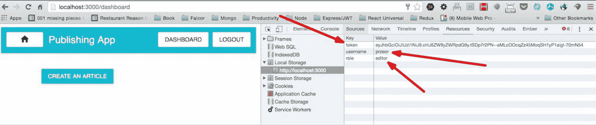
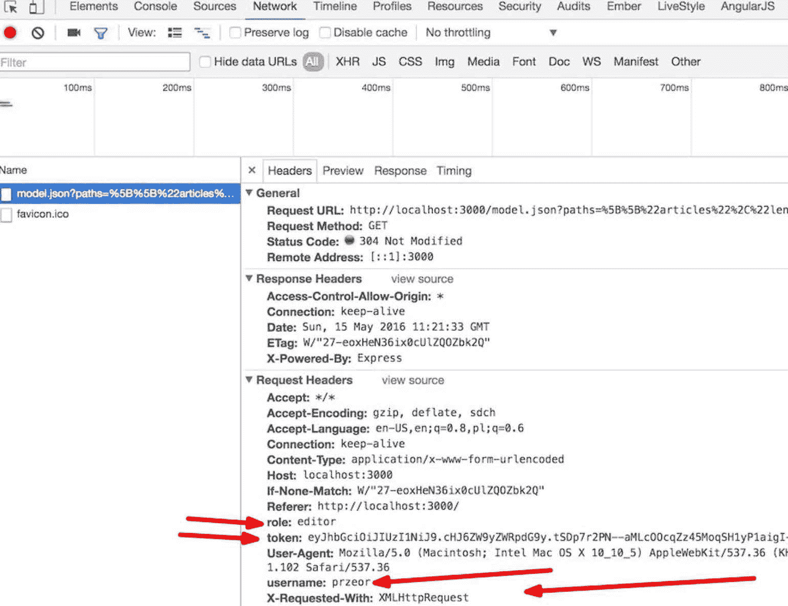
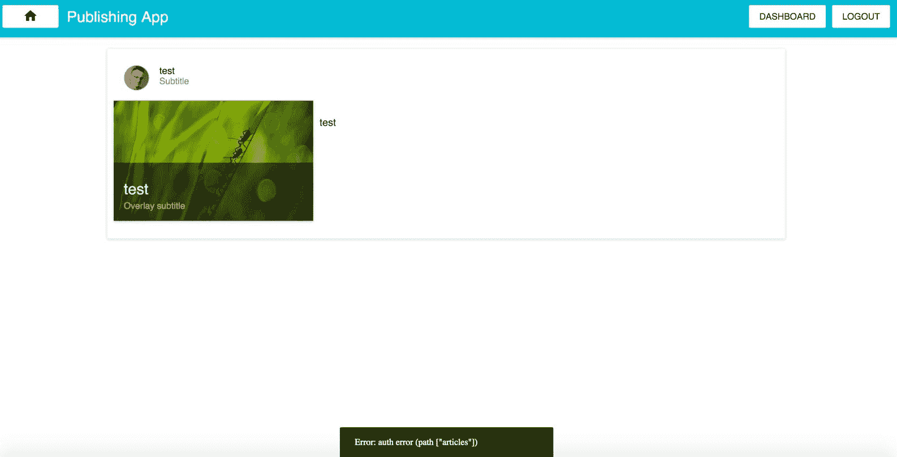

# Falcor 高级概念

目前，我们的应用程序具有添加、编辑和删除文章的能力，但仅限于前端，借助 Redux 的 reducers。我们需要添加一些全栈机制，以便能够在数据库上执行 CRUD 操作。我们还需要在后台添加一些安全功能，以便未经认证的用户无法对 MongoDB 集合执行 CRUD 操作。

让我们暂时停止编码。在我们开始开发全栈 Falcor 机制之前，让我们更详细地讨论我们的 React、Node 和 Falcor 设置。

理解为什么我们在技术栈中选择了 Falcor 是很重要的。一般来说，在我工作的定制软件开发公司（你可以在[www.ReactPoland.com](http://www.ReactPoland.com)上找到更多信息），我们使用 Falcor，因为它在开发全栈移动/Web 应用程序方面为客户带来了许多优势。其中一些如下：

+   概念的简单性

+   与 RESTful 方法相比，开发速度提高 30%以上

+   浅度学习曲线，因此学习 Falcor 的开发者可以非常快速地变得有效

+   一种非常令人惊叹的数据获取方式（从后端到客户端）

我将暂时将这些四个要点简短而精炼。在本章的后面部分，你将了解到使用 Falcor 和 Node 时可能会遇到的问题。

目前，我们已经使用 React、Redux、Falcor、Node、Express 和 MongoDB 组装了一种全栈入门套件。它还不是完美的。我们将把它作为本章的重点，其中包括以下主题：

+   更好地理解*无 REST 数据获取*解决方案的整体概念，以及 Falcor 与 Relay/GraphQL 之间的相似之处和不同之处

+   如何在后台安全地路由以验证用户

+   如何通过 errorSelectors 在后端处理错误并将其无缝发送到前端

+   详细了解 Falcor 的哨兵以及`$ref`、`$atom`和`$error`在 Falcor 中是如何工作的

+   JSON 图是什么以及它是如何工作的

+   Falcor 中的虚拟 JSON 概念是什么

# Falcor 旨在解决的问题

在单页应用时代之前，客户端获取数据并没有问题，因为所有数据都是始终在服务器上获取的，即使如此，服务器也会将 HTML 标记发送到客户端。每次有人点击 URL（`href`）时，我们的浏览器都会从服务器请求全新的 HTML 标记。

基于非 SPA 应用程序的先前原则，Ruby on Rails 成为了 Web 开发技术栈的王者，但后来情况发生了变化。自 2009-2010 年以来，我们一直在创建越来越多的 JavaScript 客户端应用程序，它们更有可能从后端一次性获取，例如`bundle.js`文件。它们被称为 SPA。

由于这种 SP Apps 趋势，一些新的问题出现了，这些问题对于非 SP Apps 开发者来说是未知的，例如从后端的 API 端点获取数据以在客户端消费这些 JSON 数据。

通常，RESTful 应用程序的传统工作流程如下：

1.  在后端创建端点。

1.  在前端创建获取机制。

1.  通过在前端根据 API 规范编写 POST/GET 请求来从后端获取数据。

1.  当你从后端获取 JSON 数据到前端时，你可以消费这些数据，并基于特定的用例使用它来创建 UI 视图。

如果客户或老板等人改变主意，这个过程会变得有些令人沮丧，因为你已经在后端和前端实现了整个代码。后来后端 API 端点变得不再相关，因此你需要根据变更后的需求从头开始工作。

# 虚拟 JSON - 一个模型无处不在

对于 Falcor 来说，一个模型无处不在是这一伟大库的主要口号。总的来说，使用它的主要目的是创建一个在前端和后端完全相同的单一 JSON 模型。这对我们意味着什么？这意味着如果任何东西发生变化，我们需要更改模型，这个模型在前后端都是一样的——所以在这种情况下，我们需要调整我们的模型，而不用担心后端如何提供数据以及前端如何获取数据。

Falcor 的创新之处在于引入了一个名为虚拟 JSON（类似于 React 的虚拟 DOM）的新概念。这让你可以将所有远程数据源（例如，在我们的案例中是 MongoDB）表示为一个单一的领域模型。整个想法是，你可以以相同的方式编码，而不必关心数据在哪里：是在客户端内存缓存中还是在服务器上？你不需要关心，因为 Falcor 以其创新的方法为你做了很多工作（例如，使用`xhr`请求进行查询）。

数据获取是开发人员面临的问题。Falcor 的出现就是为了帮助简化这个问题。你可以从后端获取数据到前端，比以往任何时候都少写代码！

2016 年 5 月，我看到的唯一可行的竞争对手是 Facebook 的库，称为 Relay（在客户端）和 GraphQL（在后端）。

让我们尝试比较一下两者。

# Falcor 与 Relay/GraphQL 的比较

就像任何工具一样，总有优点和缺点。

当然，Falcor 在小/中型项目中总是比 Relay/GraphQL 更好，至少除非你有精通开发者（或者你就是自己）非常了解 Relay/GraphQL。为什么是这样呢？

通常，Relay（用于前端）和 GrapQL（用于后端）是两种不同的工具，你必须高效地使用它们才能正确使用。

在商业环境中，你往往没有太多时间去从头学习新事物。这也是 React 成功的一个原因。

为什么 React 会成功？React 对于成为一个高效的开发者来说更容易掌握。CTO 或技术总监雇佣一个了解 jQuery（例如）的新手开发者，然后 CTO 可以轻松地预测这位初级开发者将在 7 到 14 天内有效地使用 React；我曾教过一些对 JavaScript/jQuery 有基本知识的初级前端开发者，我发现他们相当快地就能够在 React 中高效地创建客户端应用程序。

我们可以在 Falcor 中找到相同的情况。与 Relay + GraphQL 相比，Falcor 就像 React 的简单性与 Angular 单体框架的复杂性相比。

在前几段中描述的单一因素意味着 Falcor 更适合预算有限的小型/中型项目。

当你有 6 个月的时间掌握一项技术时，你可能会在大公司中找到学习 Relay/GraphQL 的机会，这些公司拥有庞大的预算，例如 Facebook。

FalcorJS 可以在两周内有效掌握，但 GraphQL + Relay 不行。

# 大图相似性

这两个工具都在试图解决相同的问题。它们在设计上对开发者和网络都高效（试图优化与 RESTful 方法相比的查询数量）。

他们具有查询后端服务器以获取数据的能力，并且具有批量处理能力（因此你可以通过一个网络请求获取超过两组不同的数据）。两者都有一些缓存能力。

# 技术差异 - 概述

通过技术概述，我们可以发现，通常，Relay 允许你从 GraphQL 服务器查询未定义数量的项目。相比之下，在 Falcor 中，你需要先询问后端它有多少个项目，然后才能查询集合对象的详细信息（例如，在我们的书中，文章的情况）。

通常，这里最大的区别是 GraphQL/Relay 是一个查询语言工具，而 Falcor 不是。什么是查询语言？它是一种你可以从前端进行查询的语言，类似于 SQL，如下所示：

```js
post: () => Relay.QL 
  fragment on Articles { 
    title, 
    content 
  } 

```

之前的代码可以通过`Relay.QL`从前端进行查询，然后 GraphQL 以与 SQL 相同的方式处理查询，如下所示：

```js
SELECT title, content FROM Articles 

```

如果数据库中有，例如，一百万篇文章，而你没有预料到这么多在前端，事情可能会变得更难。

在 Falcor 中，你将采取不同的做法，就像你已经学到的：

```js
const articlesLength = await falcorModel. 
  getValue('articles.length'). 
  then((length) => length); 

const articles = await falcorModel. 
  get(['articles', {from: 0, to: articlesLength-1}, 
   ['_id','articleTitle', 'articleContent']]).  
  then((articlesResponse) => articlesResponse.json.articles); 

```

在先前的 Falcor 示例中，你必须首先知道 MongoDB 实例中有多少条记录。

这是最重要的区别之一，并为双方创造了一些挑战。

对于 GraphQL 和 Relay 来说，问题是这些查询语言的力量是否值得学习曲线中产生的复杂性，因为这种复杂性可能对小型/中型项目来说不值得。

现在已经讨论了基本的不同之处，让我们专注于 Falcor 和改进我们当前的发布应用程序。

# 提高我们的应用程序并使其更加可靠

我们需要改进以下事项：

+   登录后，我们应在每个请求中发送用户详情（令牌、用户名和角色；你可以在本节后面的 *改进前端上的 Falcor 代码* 部分找到截图）

+   后端需要得到保护，以便在执行添加/编辑/删除操作之前进行身份验证检查。

+   我们需要在后端提供捕获错误的能力，并在前端通知用户某些操作不正确

# 保护需要身份验证的路由

目前，我们的应用程序具有添加/编辑/删除路由的能力。我们当前实现的问题是我们没有检查发起 CRUD 操作的客户端是否有权限这样做。

保护 Falcor 路由的解决方案需要对我们当前的实施进行一些更改，因此对于每个请求，在执行操作之前，我们将检查是否从客户端获得了正确的令牌，以及发起调用的用户是否有编辑的能力（在我们的情况下，这意味着如果任何人有编辑角色并且正确地使用用户名和密码进行身份验证，那么他可以添加/编辑/删除文章）。

# Falcor 中的 JSON 图和 JSON 封装

如 Falcor 文档所述，“JSON 图是将图信息建模为 JSON 对象的约定。使用 Falcor 的应用程序将它们的所有领域数据表示为一个单一的 JSON 图对象。”

通常情况下，Falcor 中的 JSON 图是有效的 JSON，并具有一些新特性。更精确地说，JSON 图引入了除了字符串、数字和布尔值之外的新数据类型。在 Falcor 中，这种新数据类型被称为 **哨兵**。我将在本章后面尝试解释它。

通常，在 Falcor 中理解第二重要的是 JSON 封装。好事是它们开箱即用，所以你不必过于担心它们。但如果你想知道简短而直接的答案，JSON 封装帮助通过 HTTP 协议发送 JSON 的模型。这是一种从前端到后端（使用 `.call`、`.set` 和 `.get` 方法）传输数据的方式。同样，在发送改进后的模型详情到客户端之前，在处理请求详情之后，Falcor 会将其放入一个 *封装* 中，以便通过网络轻松传输。

JSON 封装的类比是，你将一份书面清单放入信封中，因为你不想将一些有价值的信息从点 *A* 发送到点 *B*；网络不关心你在这个信封中发送什么。最重要的是，发送者和接收者知道应用程序模型的环境。

你可以在 [`netflix.github.io/falcor/documentation/jsongraph.html`](http://netflix.github.io/falcor/documentation/jsongraph.html) 找到有关 JSON 图和封装的更多信息。

# 改进前端上的 Falcor 代码

目前，在用户授权后，所有数据都保存在本地存储中。我们需要通过在每个请求中发送该数据--令牌、用户名和角色--来闭合循环，以便我们可以再次检查用户是否正确认证。如果没有，那么我们需要在请求中发送认证错误并将其显示在前端。

以下截图中的排列对于安全原因特别重要，以确保未经授权的用户无法在我们的数据库中添加/编辑/删除文章：



在截图上，你可以找到获取`localStorage`数据信息的地方。

以下是我们当前在`src/falcorModel.js`中的代码：

```js
// this code is already in the codebase 
const falcor = require('falcor'); 
const FalcorDataSource = require('falcor-http-datasource'); 

const model = new falcor.Model({ 
  source: new FalcorDataSource('/model.json') 
}); 
export default model; 

```

我们需要将其更改为一个新的、改进的版本：

```js
import falcor from 'falcor'; 
import FalcorDataSource from 'falcor-http-datasource'; 

class PublishingAppDataSource extends FalcorDataSource { 
  onBeforeRequest ( config ) { 
    const token = localStorage.token; 
    const username = localStorage.username; 
    const role = localStorage.role; 

    if (token && username && role) { 
      config.headers['token'] = token; 
      config.headers['username'] = username; 
      config.headers['role'] = role; 
    } 
  } 
} 

const model = new falcor.Model({ 
  source: new PublishingAppDataSource('/model.json') 
}); 
export default model; 

extends keyword from ECMAScript6 shows an example of where the simplicity of the class syntax shines. Extending the FalcorDataSource means that PublishingAppDataSource inherits everything that the FalcorDataSource has and it makes the onBeforeRequest method have our custom behavior (by mutating config.headers). The onBeforeRequest method is checking the configuration mutated by us before our xhr instance is created. This helps us modify the XMLHttpRequest with a token, username, and role--in case our app's user logs out in the meantime, we can send that information to the backend.
```

在你在`falcorModel.js`中实现前面的代码并且用户登录后，这些变量将被添加到每个请求中：



# 改进`server.js`和`routes.js`

通常，我们目前从`server/routes.js`文件中导出一个对象数组。我们需要改进它，所以我们将返回一个函数，该函数将修改我们的对象数组，以便我们能够控制将哪个路由返回给哪个用户，并且如果用户没有有效的令牌或足够的权限，我们将返回一个错误。这将提高我们整个应用程序的安全性。

在`server/server.js`文件中，找到以下旧代码：

```js
// this shall be already in your codebase 
app.use('/model.json', falcorExpress.dataSourceRoute((req, res) 
 => { 
  return new falcorRouter(routes); 
})); 

```

用这个改进版本替换它：

```js
app.use('/model.json', falcorExpress.dataSourceRoute((req, res) 
 => { 
  return new falcorRouter( 
      [] 
        .concat(routes(req, res)) 
    ); 
})); 

```

在我们的新版本中，我们假设`routes`变量是一个带有`req`和`res`变量的函数。

让我们改进路由本身，这样我们就不再返回一个数组了，而是一个返回数组的函数（这样我们就有了更多的灵活性）。

下一步是改进`server/routes.js`文件，以便创建一个接收`currentSession`对象的函数，该对象存储有关请求的所有信息。我们需要在`routes.js`中做出以下更改：

```js
// this code is already in your codebase: 
const PublishingAppRoutes = [ 
    ...sessionRoutes, 
  { 
  route: 'articles.length', 
    get: () => { 
      return Article.count({}, function(err, count) { 
        return count; 
      }).then ((articlesCountInDB) => { 
        return { 
          path: ['articles', 'length'], 
          value: articlesCountInDB 
        } 
      }) 
  } 
}, 
//  
// ...... There is more code between, it has been truncated in 
 //order to save space 
// 
export default PublishingAppRoutes;  

```

而不是导出一个路由数组，我们需要导出一个函数，该函数将根据当前请求的头部详细信息返回路由。

`server/routes.js`文件的上半部分（包含导入）如下所示：

```js
import configMongoose from './configMongoose'; 
import sessionRoutes from './routesSession'; 
import jsonGraph from 'falcor-json-graph'; 
import jwt from 'jsonwebtoken'; 
import jwtSecret from './configSecret'; 

let $atom = jsonGraph.atom; // this will be explained later 
                            //in the chapter 
const Article = configMongoose.Article; 

```

然后导出一个新的函数：

```js
export default ( req, res ) => { 
  let { token, role, username } = req.headers; 
  let userDetailsToHash = username+role; 
  let authSignToken = jwt.sign(userDetailsToHash, 
   jwtSecret.secret); 
  let isAuthorized = authSignToken === token; 
  let sessionObject = {isAuthorized, role, username}; 

  console.info(&grave;The ${username} is authorized === &grave;, 
   isAuthorized); 

  const PublishingAppRoutes = [ 
      ...sessionRoutes, 
    { 
    route: 'articles.length', 
      get: () => { 
        return Article.count({}, function(err, count) { 
          return count; 
        }).then ((articlesCountInDB) => { 
          return { 
            path: ['articles', 'length'], 
            value: articlesCountInDB 
          } 
        }) 
    } 
  }]; 

  return PublishingAppRoutes; 
} 

```

首先，我们将`req`（请求详情）和`res`（代表 HTTP 响应的对象）变量接收进箭头函数中。根据`req`提供的信息，我们获取头部详细信息（`let { token, role, username } = req.headers;`）。接下来，我们有`userDetailsToHash`，然后我们检查正确的`authToken`（`let authSignToken = jwt.sign(userDetailsToHash, jwtSecret.secret)`）。之后，我们检查用户是否被授权（`let isAuthorized = authSign === token`）。然后我们创建一个`sessionObject`，它将在之后的所有 Falcor 路由中被重复使用（`let sessionObject = {isAuthorized, role, username};`）。

目前，我们有一个路由（`articles.length`），这在第二章中已有描述，即“我们发布应用的完整栈登录和注册”（所以目前还没有什么新内容）。

如前述代码所示，我们不是直接导出`PublishingAppRoutes`，而是使用箭头函数`export default (req, res)`进行导出。

我们需要在`articles.length`下重新添加第二个路由，称为`articles[{integers}]["_id","articleTitle","articleContent"]`，并在`server/routes`中使用以下代码：

```js
 { 
    route: 
     'articles[{integers}]["_id","articleTitle","articleContent"]', 
    get: (pathSet) => { 
      const articlesIndex = pathSet[1]; 

      return Article.find({}, function(err, articlesDocs) { 
        return articlesDocs; 
      }).then ((articlesArrayFromDB) => { 
        let results = []; 
        articlesIndex.forEach((index) => { 
          const singleArticleObject = 
           articlesArrayFromDB[index].toObject(); 

          const falcorSingleArticleResult = { 
            path: ['articles', index], 
            value: singleArticleObject 
          }; 

          results.push(falcorSingleArticleResult); 
        }); 
        return results; 
      }) 
    } 
  } 

```

这是获取数据库中文章的路由，并返回`falcor-route`的路由。它与之前介绍的是完全相同的；唯一的区别是现在它是函数的一部分（`export default ( req, res ) => { ... }`）。

在我们开始使用`falcor-router`在后台实现添加/编辑/删除功能之前，我们需要先了解哨兵的概念，因为它对我们的全栈应用的健康至关重要，原因将在稍后解释。

# Falcor 的哨兵实现

让我们了解什么是哨兵。它们是使 Fullstack 的 Falcor 应用工作所必需的。它是一套你必须学习的工具。

这些是新原始值类型，专门用于使后端和客户端之间的数据传输更加容易和直接（新 Falcor 原始值示例包括`$error`和`$ref`）。这里有一个类比：你有一个常规 JSON 中的类型，如字符串、数字和对象，另一方面，在 Falcor 的虚拟 JSON 中，你可以使用与之前列出的标准 JSON 类型并行的哨兵，如`$error`、`$ref`或`$atom`。

关于哨兵的更多信息可在[`netflix.github.io/falcor/documentation/model.html#sentinel-metadata`](https://netflix.github.io/falcor/documentation/model.html#sentinel-metadata)找到。

在这个阶段，理解 Falcor 的哨兵是如何工作的是非常重要的。Falcor 中不同类型的哨兵将在以下章节中解释。

# `$ref`哨兵

根据文档，“一个引用是一个具有`$type`键且其值为`ref`，以及一个`value`键且其值为`Path`数组对象的 JSON 对象。”

“一个引用就像 UNIX 文件系统中的符号链接，”正如文档所述，这个比较非常恰当。

`$ref`的一个例子如下：

```js
{ $type: 'ref', value: ['articlesById', 'STRING_ARTICLE_ID_HERE'] } 

```

如果你使用`$ref(['articlesById','STRING_ARTCILE_ID_HERE'])`，它与前面的例子是等价的。`$ref`哨兵是一个函数，它将数组的详细信息转换为那种`$type`和值的表示对象。

你可以在任何与 Falcor 相关的项目中找到部署/使用`$ref`的两种方法，但在我们的项目中，我们将坚持使用`$ref(['articlesById','STRING_ARTCILE_ID_HERE'])`约定。

为了明确起见，这是在我们的代码库中导入`$ref`哨兵的方法：

```js
// wait, this is just an example, don't code this here: 
import jsonGraph from 'falcor-json-graph'; 
let $ref = jsonGraph.ref; 
// now you can use $ref([x, y]) function 

```

在你导入 `falcor-json-graph` 之后，你可以使用 `$ref` 监视器。你已经在上一章中描述了安装过程，已经安装了 `falcor-json-graph` 库；如果没有，请使用以下内容：

```js
npm i --save falcor-json-graph@1.1.7 

```

但在那个 `$ref` 大事件中，“`articlesById`”是什么意思？在先前的例子中，“`STRING_ARTICLE_ID_HERE`”又是什么意思？让我们看看我们项目中的一个例子，可能会让你更清楚。

# `$ref` 监视器的详细示例

假设我们在 MongoDB 实例中有两篇文章：

```js
// this is just explanation example, don't write this here 
// we assume that _id comes from MongoDB 
[ 
  { 
    _id: '987654', 
    articleTitle: 'Lorem ipsum - article one', 
    articleContent: 'Here goes the content of the article' 
  }, 
  { 
    _id: '123456', 
    articleTitle: 'Lorem ipsum - article two', 
    articleContent: 'Sky is the limit, the content goes here.' 
  } 
] 

```

因此，基于我们的带有模拟文章（ID `987654` 和 `123456`）的数组示例，`$ref` 将如下所示：

```js
// JSON envelope is an array of two $refs  
// The following is an example, don't write it 
[ 
  $ref([ articlesById,'987654' ]), 
  $ref([ articlesById,'123456' ]) 
] 

```

更详细的答案如下：

```js
// JSON envelope is an array of two $refs (other notation than 
 //above, but the same end effect) 
[ 
  { $type: 'ref', value: ['articlesById', '987654'] }, 
  { $type: 'ref', value: ['articlesById', '123456'] } 
] 

```

需要注意的一个重要事项是，“`articlesById`”是一个尚未创建的新路由（我们将在下一刻这样做）。

但为什么在我们的文章中需要那些 `$ref` 呢？

通常，你可以在数据库中的许多地方保留对一个对象的引用（就像 Unix 中的符号链接一样）。在我们的例子中，它是一个在文章集合中具有特定 `_id` 的文章。

何时使用 `$ref` 监视器会很有用？想象一下，在我们的发布应用模型中，我们添加了一个“**最近访问的文章**”功能，并提供了喜欢文章的能力（就像在 Facebook 上一样）。

基于这两个新功能，我们的新模型将如下所示（这只是一个例子；不要编写代码）：

```js
// this is just explanatory example code: 
let cache = { 
  articles: [ 
    { 
        id: 987654, 
        articleTitle: 'Lorem ipsum - article one', 
        articleContent: 'Here goes the content of the article' 
        numberOfLikes: 0 
    }, 
    { 
        id: 123456, 
        articleTitle: 'Lorem ipsum - article two from backend', 
        articleContent: 'Sky is the limit, the content goes 
         here.', 
        numberOfLikes: 0 
    } 
  ], 
  recentlyVisitedArticles: [ 
    { 
        id: 123456, 
        articleTitle: 'Lorem ipsum - article two from backend', 
        articleContent: 'Sky is the limit, the content goes 
         here.', 
        numberOfLikes: 0 
    } 
  ] 
}; 

```

根据我们先前示例中的模型，如果有人喜欢了 ID 为 `123456` 的文章，我们将在模型中需要更新两个地方。这正是 `$ref` 发挥作用的地方。

# 使用 `$ref` 改善我们的文章的 `numberOfLikes`

让我们改进我们的例子到以下内容：

```js
let cache = { 
  articlesById: { 
    987654: { 
        _id: 987654, 
        articleTitle: 'Lorem ipsum - article one', 
        articleContent: 'Here goes the content of the article' 
        numberOfLikes: 0 
    }, 
    123456: { 
        _id: 123456, 
        articleTitle: 'Lorem ipsum - article two from backend', 
        articleContent: 'Sky is the limit, the content goes 
         here.', 
        numberOfLikes: 0 
    } 
  }, 
  articles: [ 
    { $type: 'ref', value: ['articlesById', '987654'] }, 
    { $type: 'ref', value: ['articlesById', '123456'] } 
  ], 
  recentlyVisitedArticles: [ 
    { $type: 'ref', value: ['articlesById', '123456'] } 
  ] 
}; 

```

在我们改进的 `$ref` 示例中，你可以找到需要告诉 Falcor 你想在 `articles` 或 `recentlyVisitedArticles` 中包含的文章 ID 的标记。Falcor 将会根据路由名称（在这种情况下是 `articlesById` 路由）和我们要查找的对象的 ID（在我们的例子中是 `123456` 或 `987654`）来跟随 `$ref` 监视器。我们将在稍后将其用于实践。

了解这是它工作原理的简化版本，但要理解 `$ref` 的最佳类比是 UNIX 的符号链接。

# 在我们的项目中 `$ref` 的实际应用

好吧，理论讲得够多了——让我们开始编码！我们将改进我们的 Mongoose 模型。

然后，我们将之前描述的 `$ref` 监视器添加到 `server/routes.js` 文件中：

```js
// example of ref, don't write it yet: 
let articleRef = $ref(['articlesById', currentMongoID]); 

```

我们还将添加两个 Falcor 路由，“`articlesById`”和“`articles.add`”。在前端，我们将对 `src/layouts/PublishingApp.js` 和 `src/views/articles/AddArticleView.js` 进行一些改进。

让我们开始吧。

# Mongoose 配置改进

我们首先要做的事情是打开 `server/configMongoose.js` 中的 Mongoose 模型：

```js
// this is old codebase, you already shall have it: 
import mongoose from 'mongoose'; 

const conf = { 
  hostname: process.env.MONGO_HOSTNAME || 'localhost', 
  port: process.env.MONGO_PORT || 27017, 
  env: process.env.MONGO_ENV || 'local', 
}; 

mongoose.connect(&grave;mongodb://${conf.hostname}:${conf.port}/ 
 ${conf.env}&grave;); 

const articleSchema = { 
  articleTitle:String, 
  articleContent:String 
} 

```

我们将改进到这个版本：

```js
import mongoose from 'mongoose'; 
const Schema = mongoose.Schema; 

const conf = { 
  hostname: process.env.MONGO_HOSTNAME || 'localhost', 
  port: process.env.MONGO_PORT || 27017, 
  env: process.env.MONGO_ENV || 'local', 
}; 

mongoose.connect(&grave;mongodb://${conf.hostname}:${conf.port}/ 
 ${conf.env}&grave;); 

const articleSchema = new Schema({ 
    articleTitle:String, 
    articleContent:String, 
    articleContentJSON: Object 
  },  
  {  
    minimize: false  
  } 
); 

```

在前面的代码中，你会发现我们导入了`new const Schema = mongoose.Schema`。后来，我们通过添加`articleContentJSON: Object`来改进我们的`articleSchema`。这是必需的，因为 draft-js 的状态将保存在一个 JSON 对象中。如果用户创建一篇文章，将其保存到数据库中，然后稍后想编辑这篇文章，这将非常有用。在这种情况下，我们将使用这个`articleContentJSON`来恢复 draft-js 编辑器的状态。

第二件事是提供带有`{ minimize: false }`的选项。这是必需的，因为默认情况下 Mongoose 会移除所有空对象，例如`{ emptyObject: {}, nonEmptyObject: { test: true } }`，所以如果不设置`minimize: false`，那么我们数据库中就会得到不完整的对象（这是一个非常重要的步骤，这里要有这个标志）。

# 服务器`routes.js`的改进

在`server/routes.js`文件中，我们需要开始使用`$ref`哨兵。该文件中的导入应如下所示：

```js
import configMongoose from './configMongoose'; 
import sessionRoutes from './routesSession'; 
import jsonGraph from 'falcor-json-graph'; // this is new 
import jwt from 'jsonwebtoken'; 
import jwtSecret from './configSecret'; 

let $ref = jsonGraph.ref; // this is new 
let $atom = jsonGraph.atom; // this is new 
const Article = configMongoose.Article; 

jsonGraph from 'falcor-json-graph'; and then add let $ref = jsonGraph.ref; and let $atom = jsonGraph.atom.
```

我们在`routes.js`作用域中添加了`$ref`哨兵。我们需要准备一个新的路由，`articlesById[{keys}]["_id","articleTitle","articleContent","articleContentJSON"]`，如下所示：

```js
 { 
    route: 'articlesById[{keys}]["_id","articleTitle", 
     "articleContent","articleContentJSON"]', 
      get: function(pathSet) { 
      let articlesIDs = pathSet[1]; 
      return Article.find({ 
            '_id': { $in: articlesIDs} 
        }, function(err, articlesDocs) { 
          return articlesDocs; 
        }).then ((articlesArrayFromDB) => { 
          let results = []; 

          articlesArrayFromDB.map((articleObject) => { 
            let articleResObj = articleObject.toObject(); 
            let currentIdString = String(articleResObj['_id']); 

            if (typeof articleResObj.articleContentJSON !== 
             'undefined') { 
              articleResObj.articleContentJSON = 
               $atom(articleResObj.articleContentJSON); 
            } 

            results.push({ 
              path: ['articlesById', currentIdString], 
              value: articleResObj 
            }); 
          }); 
          return results; 
        }); 
    } 
  }, 

```

`articlesById[{keys}]`路由已定义，键是请求 URL 中我们需要返回的 ID，正如您通过`const articlesIDs = pathSet[1];`所看到的那样。

要更具体地了解`pathSet`，请查看以下示例：

```js
// just an example: 
[ 
  { $type: 'ref', value: ['articlesById', '123456'] }, 
  { $type: 'ref', value: ['articlesById', '987654'] } 
] 

```

在这种情况下，`falcor-router`将跟随`articlesById`，在`pathSet`中，您将得到以下内容（您可以看到`pathSet`的确切值）：

```js
['articlesById', ['123456', '987654']] 

```

您可以从`const articlesIDs = pathSet[1]``;`中找到`articlesIDs`的值：

```js
['123456', '987654'] 

```

您稍后会发现，我们使用这个`articlesIDs`值：

```js
// this is already in your codebase: 
return Article.find({ 
            '_id': { $in: articlesIDs} 
        }, function(err, articlesDocs) { 

```

如您在`'_id': { $in: articlesIDs}`中看到的那样，我们正在传递一个`articlesIDs`数组。基于这些 ID，我们将接收到一个根据 ID 找到的特定文章数组（相当于 SQL 的`WHERE`语句）。接下来的步骤是遍历接收到的文章：

```js
// this already is in your codebase: 
articlesArrayFromDB.map((articleObject) => { 

```

将对象推入`results`数组：

```js
// this already is in your codebase: 
let articleResObj = articleObject.toObject(); 
let currentIdString = String(articleResObj['_id']); 

if (typeof articleResObj.articleContentJSON !== 'undefined') { 
  articleResObj.articleContentJSON = 
   $atom(articleResObj.articleContentJSON); 
} 

results.push({ 
  path: ['articlesById', currentIdString], 
  value: articleResObj 
}); 

```

上述代码片段中几乎没有新内容。唯一的新内容是这一句：

```js
// this already is in your codebase: 
if (typeof articleResObj.articleContentJSON !== 'undefined') { 
  articleResObj.articleContentJSON = 
   $atom(articleResObj.articleContentJSON); 
} 

```

我们在这里明确使用了 Falcor 的`$atom`哨兵：`$atom(articleResObj.articleContentJSON);`。

# JSON 图原子

`$atom`哨兵是附加到值上的元数据，模型必须以不同的方式处理。您可以用 Falcor 简单地返回数字类型的值或字符串类型的值。为什么返回对象会更复杂？

Falcor 通过大量使用 JavaScript 的对象和数组进行 diff 操作，当我们告诉一个对象/数组被`$atom`哨兵（例如，在我们的例子中是`$atom(articleResObj.articleContentJSON)`）包装时，Falcor 就知道它不应该深入到那个数组/对象中。这是出于性能考虑而设计成这样的。

为什么要考虑性能原因？例如，如果您返回一个未包装的包含 10,000 个非常深层对象的数组，构建和 diff 模型可能需要非常长的时间。通常，出于性能考虑，您想要通过`falcor-router`返回到前端的对象和数组必须在这样做之前被`$atom`包装；否则，您将得到这样的错误（如果您没有通过`$atom`包装此对象）：

```js
Uncaught MaxRetryExceededError: The allowed number of retries 
have been exceeded. 

```

当 Falcor 试图在未在后台事先用`$atom`哨兵包装的情况下获取那些深层对象时，这个错误将在客户端显示。

# 改进`articles[{integers}]`路由

现在，我们需要返回一个`$ref`哨兵到`articlesById`而不是所有文章的详细信息，因此我们需要更改以下旧代码：

```js
// this already shall be in your codebase: 
  { 
    route: 
     'articles[{integers}]["_id","articleTitle","articleContent"]', 
    get: (pathSet) => { 
      const articlesIndex = pathSet[1]; 

      return Article.find({}, function(err, articlesDocs) { 
        return articlesDocs; 
      }).then ((articlesArrayFromDB) => { 
        let results = []; 
        articlesIndex.forEach((index) => { 
          const singleArticleObject = 
           articlesArrayFromDB[index].toObject(); 

          const falcorSingleArticleResult = { 
            path: ['articles', index], 
            value: singleArticleObject 
          }; 

          results.push(falcorSingleArticleResult); 
        }); 
        return results; 
      }) 
    } 
  } 

```

我们将改进到以下新代码：

```js
 { 
    route: 'articles[{integers}]', 
    get: (pathSet) => { 
      const articlesIndex = pathSet[1]; 

      return Article.find({}, '_id', function(err, articlesDocs) { 
        return articlesDocs; 
      }).then ((articlesArrayFromDB) => { 
        let results = []; 
        articlesIndex.forEach((index) => { 
          let currentMongoID = 
           String(articlesArrayFromDB[index]['_id']); 
          let articleRef = $ref(['articlesById', currentMongoID]); 

          const falcorSingleArticleResult = { 
            path: ['articles', index], 
            value: articleRef 
          }; 

          results.push(falcorSingleArticleResult); 
        }); 
        return results; 
      }) 
    } 
  }, 

```

发生了什么变化？看看旧代码库中的路由：`articles[{integers}]["_id","articleTitle","articleContent"]`。目前，我们的`articles[{integers}]`路由（在新版本中）并没有直接返回`for["_id","articleTitle","articleContent"]`数据，因此我们必须删除它，以便让 Falcor 知道这个事实（`articlesById`现在返回详细的信息）。

下一个变化是，我们创建了一个新的`$ref`哨兵，如下所示：

```js
// this is already in your codebase: 
let currentMongoID = String(articlesArrayFromDB[index]['_id']); 
let articleRef = $ref(['articlesById', currentMongoID]); 

```

如您所见，通过这样做，我们通过`$ref`通知`falcor-router`，如果前端请求关于`article[{integers}]`的更多信息，那么`falcor-router`应该遵循`articlesById`路由以从数据库检索该数据。

在此之后，看看这个旧路径的值：

```js
// old version 
const singleArticleObject = articlesArrayFromDB[index].toObject(); 

const falcorSingleArticleResult = { 
  path: ['articles', index], 
  value: singleArticleObject 
}; 

```

您会发现它已经被`articleRef`的值所替换：

```js
// new improved version 
let articleRef = $ref(['articlesById', currentMongoID]); 

const falcorSingleArticleResult = { 
  path: ['articles', index], 
  value: articleRef 
}; 

```

如您可能已注意到，在旧版本中，我们返回了关于一篇文章的所有信息（`singleArticleObject`变量），但在新版本中，我们只返回`$ref`哨兵（`articleRef`）。

`$ref`哨兵使`falcor-router`在后台自动跟随，所以如果第一个路由中有任何引用，Falcor 将解析所有的`$ref`哨兵，直到获取所有挂起的数据；之后，它将数据在一个请求中返回，这大大减少了延迟（而不是执行多个 HTTP 请求，所有跟随`$refs`的内容都在一个浏览器到后端的调用中获取）。

# 服务器路由中的新路由：`server/routes.js: articles.add`

我们唯一需要做的事情是将一个新的`articles.add`路由添加到路由器中：

```js
 { 
    route: 'articles.add', 
    call: (callPath, args) => { 
      const newArticleObj = args[0]; 
      var article = new Article(newArticleObj); 

      return article.save(function (err, data) { 
        if (err) { 
          console.info('ERROR', err); 
          return err; 
        } 
        else { 
          return data; 
        } 
      }).then ((data) => { 
        return Article.count({}, function(err, count) { 
        }).then((count) => { 
          return { count, data }; 
        }); 
      }).then ((res) => { 
        // 
        // we will add more stuff here in a moment, below 
        // 
        return results; 
      }); 
    } 
  } 

```

如您在此处所见，我们从前端接收到一个新文章的详细信息，使用`const newArticleObj = args[0];`，然后我们使用`var article = new Article(newArticleObj);`创建一个新的`Article`模型。之后，`article`变量有一个`.save`方法，在接下来的查询中会被调用。我们执行了两个查询，这两个查询都从 Mongoose 返回一个 promise。以下是第一个查询：

```js
return article.save(function (err, data) { 

```

这个 `.save` 方法只是帮助我们将文档插入数据库。在保存文章后，我们需要计算数据库中有多少文章，因此我们运行第二个查询：

```js
return Article.count({}, function(err, count) { 

```

在保存文章并计数后，我们返回该信息（`return { count, data };`）。最后，我们需要使用 `falcor-router` 将新的文章 ID 和计数数量从后端返回到前端，所以我们替换此注释：

```js
// 
// we will add more stuff here in a moment, below 
// 

```

在其位置，我们将有这段新的代码，帮助我们实现所需的功能：

```js
 let newArticleDetail = res.data.toObject(); 
 let newArticleID = String(newArticleDetail['_id']); 
 let NewArticleRef = $ref(['articlesById', newArticleID]); 
 let results = [ 
   { 
     path: ['articles', res.count-1], 
     value: NewArticleRef 
   }, 
   { 
     path: ['articles', 'newArticleID'], 
     value: newArticleID 
   }, 
   { 
     path: ['articles', 'length'], 
     value: res.count 
   } 
 ]; 
 return results; 

newArticleDetail details here. Next, we take the new ID with newArticleID and make sure that it's a string. After all that, we define a new $ref sentinel with let NewArticleRef = $ref(['articlesById', newArticleID]);.
```

在 `results` 变量中，您可以找到三个新的路径：

+   `path: ['articles', res.count-1]`：此路径构建模型，因此我们可以在客户端收到响应后，在 Falcor 模型中拥有所有信息。

+   `path: ['articles', 'newArticleID']`：这有助于我们在前端快速获取新的 ID。

+   `path: ['articles', 'length']`：当然，这会更新我们文章集合的长度，因此前端 Falcor 模型在添加新文章后可以拥有最新的信息。

我们刚刚为添加文章创建了一个后端路由。现在让我们开始处理前端，以便我们将所有新文章推入数据库。

# 为了添加文章而进行的客户端更改

在 `src/layouts/PublishingApp.js` 文件中，找到此代码：

```js
get(['articles', {from: 0, to: articlesLength-1}, ['_id','articleTitle', 'articleContent']]). 

```

改进为带有 `articleContentJSON` 的改进版本：

```js
get(['articles', {from: 0, to: articlesLength-1}, ['_id','articleTitle', 'articleContent', 'articleContentJSON']]).  

```

下一步是改进 `src/views/articles/AddArticleView.js` 中的 `_submitArticle` 函数，并添加 `falcorModel` 导入：

```js
// this is old function to replace: 
  _articleSubmit() { 
    let newArticle = { 
      articleTitle: this.state.title, 
      articleContent: this.state.htmlContent, 
      articleContentJSON: this.state.contentJSON 
    } 

    let newArticleID = 'MOCKEDRandomid' + Math.floor(Math.random() *    
    10000); 

    newArticle['_id'] = newArticleID; 
    this.props.articleActions.pushNewArticle(newArticle); 
    this.setState({ newArticleID: newArticleID}); 
  } 

```

用以下改进版本替换此代码：

```js
 async _articleSubmit() { 
    let newArticle = { 
      articleTitle: this.state.title, 
      articleContent: this.state.htmlContent, 
      articleContentJSON: this.state.contentJSON 
    } 

    let newArticleID = await falcorModel 
      .call( 
            'articles.add', 
            [newArticle] 
          ). 
      then((result) => { 
        return falcorModel.getValue( 
            ['articles', 'newArticleID'] 
          ).then((articleID) => { 
            return articleID; 
          }); 
      }); 

    newArticle['_id'] = newArticleID; 
    this.props.articleActions.pushNewArticle(newArticle); 
    this.setState({ newArticleID: newArticleID}); 
  } 

```

此外，在 `AddArticleView.js` 文件顶部，添加此导入；否则，`async_articleSumbit` 不会工作：

```js
import falcorModel from '../../falcorModel.js'; 

```

如您所见，我们在函数名（`async _articleSubmit()`）之前添加了 `async` 关键字。新的是这个请求：

```js
// this already is in your codebase: 
let newArticleID = await falcorModel 
  .call( 
        'articles.add', 
        [newArticle] 
      ). 
  then((result) => { 
    return falcorModel.getValue( 
        ['articles', 'newArticleID'] 
      ).then((articleID) => { 
        return articleID; 
      }); 
  }); 

```

在这里，我们等待 `falcorModel.call`。在 `.call` 参数中，我们添加 `newArticle`。然后，在承诺解决之后，我们通过以下方式检查 `newArticleID`：

```js
// this already is in your codebase: 
return falcorModel.getValue( 
        ['articles', 'newArticleID'] 
      ).then((articleID) => { 
        return articleID; 
      }); 

```

之后，我们简单地使用与旧版本完全相同的内容：

```js
newArticle['_id'] = newArticleID; 
this.props.articleActions.pushNewArticle(newArticle); 
this.setState({ newArticleID: newArticleID}); 

```

这只是通过 `articleActions` 将带有真实 MongoDB ID 的更新后的 `newArticle` 推送到文章的 reducer。我们还使用 `setState` 与 `newArticleID`，这样您就可以看到新文章已经正确地使用真实的 Mongo ID 创建。

# 关于路由返回的重要注意事项

您应该知道，在每条路由中，我们返回一个对象或一个对象数组；即使只有一条路由返回，这两种方法都是可行的。以这个为例：

```js
// this already is in your codebase (just an example) 
    { 
    route: 'articles.length', 
      get: () => { 
        return Article.count({}, function(err, count) { 
          return count; 
        }).then ((articlesCountInDB) => { 
          return { 
            path: ['articles', 'length'], 
            value: articlesCountInDB 
          } 
        }) 
    } 
  },  

```

这也可以返回一个包含一个对象的数组，如下所示：

```js
     get: () => { 
        return Article.count({}, function(err, count) { 
          return count; 
        }).then ((articlesCountInDB) => { 
          return [ 
            { 
              path: ['articles', 'length'], 
              value: articlesCountInDB 
            } 
          ] 
        }) 
    } 

```

如您所见，即使只有一个 `articles.length`，我们也是返回一个数组（而不是单个对象），这同样有效。

与之前描述的原因相同，这就是为什么在 `articlesById` 中，我们将多个路由推入数组的原因：

```js
// this is already in your codebase 
let results = []; 

articlesArrayFromDB.map((articleObject) => { 
  let articleResObj = articleObject.toObject(); 
  let currentIdString = String(articleResObj['_id']); 

  if (typeof articleResObj.articleContentJSON !== 'undefined') { 
    articleResObj.articleContentJSON = 
     $atom(articleResObj.articleContentJSON); 
  } 
  // pushing multiple routes 
  results.push({ 
    path: ['articlesById', currentIdString], 
    value: articleResObj 
  }); 
}); 
return results; // returning array of routes' objects 

```

这是在 Falcor 章节中可能值得提及的一点。

# 全栈 - 编辑和删除文章

让我们在`server/routes.js`文件中创建一个用于更新现有文档的路由（编辑功能）：

```js
 { 
  route: 'articles.update', 
  call: async (callPath, args) =>  
    { 
      let updatedArticle = args[0]; 
      let articleID = String(updatedArticle._id); 
      let article = new Article(updatedArticle); 
      article.isNew = false; 

      return article.save(function (err, data) { 
        if (err) { 
          console.info('ERROR', err); 
          return err; 
        } 
      }).then ((res) => { 
        return [ 
          { 
            path: ['articlesById', articleID], 
            value: updatedArticle 
          }, 
          { 
            path: ['articlesById', articleID], 
            invalidate: true 
          } 
        ]; 
      }); 
    } 
  }, 

```

如您所见，我们仍然使用与`articles.add`路由类似的`article.save`方法。需要注意的是，Mongoose 需要设置`isNew`标志为`false`（`article.isNew = false;`）。如果您不提供此标志，那么您将得到类似于以下的 Mongoose 错误：

```js
{"error":{"name":"MongoError","code":11000,"err":"insertDocument 
 :: caused by :: 11000 E11000 duplicate key error index: 
 staging.articles.$_id _ dup key: { : 
 ObjectId('1515b34ed65022ec234b5c5f') }"}} 

```

代码的其余部分相当简单；我们保存文章的模型，然后通过`falcor-router`返回更新后的模型，具体如下：

```js
// this is already in your code base: 
return [ 
  { 
    path: ['articlesById', articleID], 
    value: updatedArticle 
  }, 
  { 
    path: ['articlesById', articleID], 
    invalidate: true 
  } 
]; 

```

新的是`invalidate`标志。正如文档中所述，“`invalidate`方法同步地从模型缓存中删除多个路径或路径集。”换句话说，您需要告诉前端上的 Falcor 模型在`["articlesById", articleID]`路径上已经发生了变化，这样您就可以在前后端都有同步的数据。

关于 Falcor 中`invalidate`的更多信息，您可以访问[`netflix.github.io/falcor/doc/Model.html#invalidate`](https://netflix.github.io/falcor/doc/Model.html#invalidate)。

# 删除文章

为了实现`删除`功能，我们需要创建一个新的路由：

```js
 { 
  route: 'articles.delete', 
  call: (callPath, args) =>  
    { 
      const toDeleteArticleId = args[0]; 
      return Article.find({ _id: toDeleteArticleId }). 
       remove((err) => { 
        if (err) { 
          console.info('ERROR', err); 
          return err; 
        } 
      }).then((res) => { 
        return [ 
          { 
            path: ['articlesById', toDeleteArticleId], 
            invalidate: true 
          } 
        ] 
      }); 
    } 
  } 

```

这也使用了`invalidate`，但这次，这是我们在这里返回的唯一东西，因为文档已经被删除，所以我们唯一需要做的是通知浏览器缓存，旧文章已被失效，没有东西可以替换，就像更新示例中那样。

# 前端 - 编辑和删除

我们已经在后端实现了`更新`和`删除`路由。接下来，在`src/views/articles/EditArticleView.js`文件中，您需要找到以下代码：

```js
// this is old already in your codebase: 
  _articleEditSubmit() { 
    let currentArticleID = this.state.editedArticleID; 
    let editedArticle = { 
      _id: currentArticleID, 
      articleTitle: this.state.title, 
      articleContent: this.state.htmlContent, 
      articleContentJSON: this.state.contentJSON 
    } 

    this.props.articleActions.editArticle(editedArticle); 
    this.setState({ articleEditSuccess: true }); 
  } 

```

用这个`async _articleEditSubmit`函数替换它：

```js
 async _articleEditSubmit() { 
    let currentArticleID = this.state.editedArticleID; 
    let editedArticle = { 
      _id: currentArticleID, 
      articleTitle: this.state.title, 
      articleContent: this.state.htmlContent, 
      articleContentJSON: this.state.contentJSON 
    } 

    let editResults = await falcorModel 
      .call( 
            ['articles', 'update'], 
            [editedArticle] 
          ). 
      then((result) => { 
        return result; 
      }); 

    this.props.articleActions.editArticle(editedArticle); 
    this.setState({ articleEditSuccess: true }); 
  } 

```

如您所见，最重要的是我们在`_articleEditSubmit`函数中实现了`.call`函数，该函数使用`editedArticle`变量发送编辑对象的详细信息。

在同一文件中，找到`_handleDeletion`方法：

```js
// old version 
  _handleDeletion() { 
    let articleID = this.state.editedArticleID; 
    this.props.articleActions.deleteArticle(articleID); 

    this.setState({ 
      openDelete: false 
    }); 
    this.props.history.pushState(null, '/dashboard'); 
  } 

```

更改为新的改进版本：

```js
 async _handleDeletion() { 
    let articleID = this.state.editedArticleID; 

    let deletetionResults = await falcorModel 
      .call( 
            ['articles', 'delete'], 
            [articleID] 
          ). 
      then((result) => { 
        return result; 
      }); 

    this.props.articleActions.deleteArticle(articleID); 
    this.setState({ 
      openDelete: false 
    }); 
    this.props.history.pushState(null, '/dashboard'); 
  } 

```

与删除类似，唯一的区别是我们只通过`.call`发送被删除文章的`articleID`。

# 保护 CRUD 路由

我们需要实现一种方法来保护所有添加/编辑/删除路由，并创建一个通用的**DRY**（不要重复自己）方式来通知用户后端发生的错误。例如，前端可能发生的错误，我们需要在我们的 React 实例的客户端应用程序中用错误消息通知用户：

+   **认证错误**：您没有权限执行此操作

+   **超时错误**：例如，您使用外部 API 的服务；我们需要通知用户任何潜在的错误

+   **数据不存在**：可能存在用户调用不存在于我们数据库中的文章 ID 的情况，所以让我们通知他

总的来说，我们现在的目标是创建一种通用的方法，将所有潜在的错误消息从后端移动到客户端，以便我们可以改善我们应用程序的使用体验。

# $error 哨兵基础

这里是`$error`哨兵（与 Falcor 相关的变量类型），它通常是一种返回错误的方法。

通常，正如你应该已经知道的，Falcor 会批量处理请求。多亏了它们，你可以在一个 HTTP 请求中获取来自不同的 falcor-routes 的数据。以下是一个你可以一次性获取的示例：

+   **一个数据集**：完整且准备就绪，可以检索

+   **第二个数据集**：第二个数据集，可能包含错误

当第二个数据集出现错误时，我们不想影响一个数据集的获取过程（你需要记住，我们示例中的两个数据集是在一个请求中获取的）。

这里有一些有用的文档部分，可能有助于你理解 Falcor 中的错误处理：

[`netflix.github.io/falcor/doc/Model.html#~errorSelector`](https://netflix.github.io/falcor/doc/Model.html#~errorSelector)

[`netflix.github.io/falcor/documentation/model.html#error-handling`](https://netflix.github.io/falcor/documentation/model.html#error-handling)

[`netflix.github.io/falcor/documentation/router.html`](http://netflix.github.io/falcor/documentation/router.html)（在此页面上搜索`$error`以找到更多文档中的示例）

# 客户端 DRY 错误管理

让我们从对 CoreLayout（`src/layouts/CoreLayout.js`）的改进开始。在`AppBar`下，使用以下内容导入一个新的`snackbar`组件：

```js
import AppBar from 'material-ui/lib/app-bar'; 
import Snackbar from 'material-ui/lib/snackbar'; 

```

然后，在导入部分，在 CoreLayout 外部创建一个新的函数并导出它：

```js
let errorFuncUtil =  (errMsg, errPath) => { 
} 
export { errorFuncUtil as errorFunc }; 

```

然后找到`CoreLayout`构造函数，将其更改为在 Falcor `$error`哨兵返回错误时使用导出的函数`errorFuncUtil`作为回调：

```js
// old constructor 
constructor(props) { 
  super(props); 
} 

```

这里是新的函数：

```js
constructor(props) { 
  super(props); 
    this.state = { 
      errorValue: null 
    } 

  if (typeof window !== 'undefined') { 
    errorFuncUtil = this.handleFalcorErrors.bind(this); 
  } 

} 

```

正如你可以在这里找到的，我们引入了一个新的`errorValue`状态（默认状态是`null`）。然后，仅在前端（因为`if(typeof window !== 'undefined')`），我们将`this.handleErrors.bind(this)`分配给我们的`errorFuncUtil`。

正如你很快就会发现的，这是因为导出的`errorFuncUtil`将被导入到我们的`falcorModel.js`中，在那里我们将使用最佳可能的 DRY 方式通知 CoreLayout 关于 Falcor 后端发生的任何错误。这件事的好处是，我们只需实现一次，但它将成为通知我们客户端应用程序用户任何错误的一种通用方式（这也会在未来节省我们的开发工作量，因为任何错误都将通过我们现在正在实施的方法来处理）。

我们需要在 CoreLayout 中添加一个新的函数，称为`handleFalcorErrors`：

```js
handleFalcorErrors(errMsg, errPath) { 
  let errorValue = &grave;Error: ${errMsg} (path ${JSON.stringify(errPath)})&grave; 
  this.setState({errorValue}); 
} 

```

`handleFalcorErrors`函数正在设置我们的错误的新状态。我们将使用`errMsg`（我们在后端创建，你很快就会学到）和`errPath`（可选，但这是错误发生的`falcor-route`路径）来组合用户错误。

好的，我们已经把所有东西都准备好了；从`CoreLayout`函数中缺失的只有改进后的渲染。CoreLayout 的新渲染如下：

```js
 render () { 
    let errorSnackbarJSX = null; 
    if (this.state.errorValue) { 
      errorSnackbarJSX = <Snackbar 
        open={true} 
        message={this.state.errorValue} 
        autoHideDuration={8000} 
        onRequestClose={ () => console.log('You can add custom 
         onClose code') } />; 
    } 

    const buttonStyle = { 
      margin: 5 
    }; 
    const homeIconStyle = { 
      margin: 5, 
      paddingTop: 5 
    }; 

    let menuLinksJSX; 
    let userIsLoggedIn = typeof localStorage !== 'undefined' && 
     localStorage.token && this.props.routes[1].name !== 'logout'; 

    if (userIsLoggedIn) { 
      menuLinksJSX = ( 
  <span> 
        <Link to='/dashboard'> 
     <RaisedButton label='Dashboard' style={buttonStyle}  /> 
  </Link>  
        <Link to='/logout'> 
     <RaisedButton label='Logout' style={buttonStyle}  /> 
  </Link>  
      </span>); 
    } else { 
      menuLinksJSX = ( 
  <span> 
          <Link to='/register'> 
      <RaisedButton label='Register' style={buttonStyle}  /> 
  </Link>  
        <Link to='/login'> 
    <RaisedButton label='Login' style={buttonStyle}  /> 
  </Link>  
      </span>); 
    } 

    let homePageButtonJSX = ( 
    <Link to='/'> 
        <RaisedButton label={<ActionHome />} 
         style={homeIconStyle}  /> 
      </Link>); 
    return ( 

        <div> 
          {errorSnackbarJSX} 
          <AppBar 
            title='Publishing App' 
            iconElementLeft={homePageButtonJSX} 
            iconElementRight={menuLinksJSX} /> 
            <br/> 
            {this.props.children} 
        </div> 

    ); 
  } 

```

正如你可以在这里找到的，新部分与 Material-UI 的`snackbar`组件相关。看看这个：

```js
let errorSnackbarJSX = null; 
if (this.state.errorValue) { 
  errorSnackbarJSX = <Snackbar 
    open={true} 
    message={this.state.errorValue} 
    autoHideDuration={8000} />; 
} 

erroSnackbarJSX and the following:
```

```js
  <div> 
    {errorSnackbarJSX} 
    <AppBar 
      title='Publishing App' 
      iconElementLeft={homePageButtonJSX} 
      iconElementRight={menuLinksJSX} /> 
      <br/> 
      {this.props.children} 
  </div> 

```

确保将`{errorSnackbarJSX}`放置与此示例完全相同的位置。否则，你可能会在应用测试运行期间遇到一些问题。你现在已经完成了与 CoreLayout 改进相关的一切。

# 调整 - 前端 FalcorModel.js

在`src/falcorModel.js`文件中，识别以下代码：

```js
// already in your codebase, old code: 
import falcor from 'falcor'; 
import FalcorDataSource from 'falcor-http-datasource'; 

class PublishingAppDataSource extends FalcorDataSource { 
  onBeforeRequest ( config ) { 
    const token = localStorage.token; 
    const username = localStorage.username; 
    const role = localStorage.role; 

    if (token && username && role) { 
      config.headers['token'] = token; 
      config.headers['username'] = username; 
      config.headers['role'] = role; 
    } 
  } 
} 

const model = new falcor.Model({ 
  source: new PublishingAppDataSource('/model.json') 
}); 
export default model; 

```

这段代码需要通过向`falcor.Model`添加一个新选项来改进：

```js
import falcor from 'falcor'; 
import FalcorDataSource from 'falcor-http-datasource'; 
import {errorFunc} from './layouts/CoreLayout'; 

class PublishingAppDataSource extends FalcorDataSource { 
  onBeforeRequest ( config ) { 
    const token = localStorage.token; 
    const username = localStorage.username; 
    const role = localStorage.role; 

    if (token && username && role) { 
      config.headers['token'] = token; 
      config.headers['username'] = username; 
      config.headers['role'] = role; 
    } 
  } 
} 

let falcorOptions = { 
  source: new PublishingAppDataSource('/model.json'),    
  errorSelector: function(path, error) { 
    errorFunc(error.value, path); 
    error.$expires = -1000 * 60 * 2; 
    return error; 
  }  
}; 

const model = new falcor.Model(falcorOptions); 
export default model; 

```

我们首先添加的是将`errorFunc`导入到该文件顶部的操作：

```js
import {errorFunc} from './layouts/CoreLayout'; 

```

除了`errorFunc`之外，我们还引入了`falcorOptions`变量。源代码与上一个版本相同。我们添加了`errorSelector`，它在客户端每次调用后端和后端的`falcor-router`返回一个`$error`哨兵时都会运行。

关于错误选择器的更多详细信息可以在[`netflix.github.io/falcor/documentation/model.html#the-errorselector-value`](https://netflix.github.io/falcor/documentation/model.html#the-errorselector-value)找到。

# $error 哨兵的后端实现

我们将分两步进行后端实现：

1.  这是一个错误示例，仅用于测试我们的客户端代码。

1.  在我们确认错误处理正确无误后，我们将正确地保护端点。

# 测试我们的与错误相关的代码

让我们从`server/routes.js`文件中的导入开始：

```js
import configMongoose from './configMongoose'; 
import sessionRoutes from './routesSession'; 
import jsonGraph from 'falcor-json-graph'; 
import jwt from 'jsonwebtoken'; 
import jwtSecret from './configSecret'; 

let $ref = jsonGraph.ref; 
let $atom = jsonGraph.atom; 
let $error = jsonGraph.error; 
const Article = configMongoose.Article; 

```

唯一的新事物是，你需要从`falcor-json-graph`导入`$error`哨兵。

我们对$错误进行测试的目标是替换一个负责获取文章的（`articles[{integers}]`）工作路由。在我们破坏这个路由后，我们将能够测试我们的前端和后端设置是否正常工作。在测试了错误（参考下一张截图）后，我们将从`articles[{integers}]`中删除这个破坏性的$错误代码。继续阅读以获取详细信息。

使用`article`路由进行测试：

```js
 { 
    route: 'articles[{integers}]', 
    get: (pathSet) => { 
      const articlesIndex = pathSet[1]; 

      return { 
        path: ['articles'], 
        value: $error('auth error') 
      } 

      return Article.find({}, '_id', function(err, articlesDocs) { 
        return articlesDocs; 
      }).then ((articlesArrayFromDB) => { 
        let results = []; 
        articlesIndex.forEach((index) => { 
          let currentMongoID = 
           String(articlesArrayFromDB[index]['_id']); 
          let articleRef = $ref(['articlesById', currentMongoID]); 

          const falcorSingleArticleResult = { 
            path: ['articles', index], 
            value: articleRef 
          }; 

          results.push(falcorSingleArticleResult); 
        }); 
        return results; 
      }) 
    } 
  }, 

```

如你所见，这只是一个测试。我们很快就会改进这段代码，但让我们测试一下`$error('auth error')`哨兵中的文本是否会显示给用户。

运行 MongoDB：

```js
$ mongod   

```

然后，在另一个终端中运行服务器：

```js
$ npm start  

```

在运行这两个命令后，将你的浏览器指向`http://localhost:3000`，你将看到这个错误持续 8 秒钟：



如你所见，窗口底部有白色文字在黑色背景上：


如果你运行了应用，并在主页上看到截图中的错误消息，那么这表明一切正常！

# 在成功测试后清理$错误

在你确信错误处理对你有效后，你可以替换旧代码：

```js
 { 
    route: 'articles[{integers}]', 
    get: (pathSet) => { 
      const articlesIndex = pathSet[1]; 

      return { 
        path: ['articles'], 
        value: $error('auth error') 
      } 
      return Article.find({}, '_id', function(err, articlesDocs) { 

```

更改为以下内容，不返回错误：

```js
 { 
    route: 'articles[{integers}]', 
    get: (pathSet) => { 
      const articlesIndex = pathSet[1]; 
      return Article.find({}, '_id', function(err, articlesDocs) { 

```

现在，当你尝试从后端获取文章时，应用程序将正常启动而不会抛出错误。

# 完成路由的安全包装

我们已经在`server/routes.js`中实现了一些逻辑，用于检查用户是否有权限，具体如下：

```js
// this already is in your codebase: 
export default ( req, res ) => { 
  let { token, role, username } = req.headers; 
  let userDetailsToHash = username+role; 
  let authSignToken = jwt.sign(userDetailsToHash, jwtSecret.secret); 
  let isAuthorized = authSignToken === token; 
  let sessionObject = {isAuthorized, role, username}; 
  console.info(&grave;The ${username} is authorized === &grave;, isAuthorized); 

```

在此代码中，你会发现我们可以在每个需要授权和编辑角色的角色开始处创建以下逻辑：

```js
// this is example of falcor-router $errors, don't write it: 
if (isAuthorized === false) { 
  return { 
    path: ['HERE_GOES_THE_REAL_FALCOR_PATH'], 
    value: $error('auth error') 
  } 
} elseif(role !== 'editor') { 
  return { 
    path: ['HERE_GOES_THE_REAL_FALCOR_PATH'], 
    value: $error('you must be an editor in order 
     to perform this action') 
  } 
} 

```

如你所见，这只是一个示例（现在不要更改它；我们很快就会实现它），带有`path['HERE_GOES_THE_REAL_FALCOR_PATH']`。

首先，我们使用`isAuthorized === false`检查用户是否完全授权；如果没有授权，他将看到一个错误（使用我们刚刚实现的通用错误机制）：


在未来，我们可能在我们的发布应用程序中有更多角色，所以如果某人不是编辑，那么他将在错误中看到以下内容：


# 要保护哪些路由

对于需要在我们应用程序文章中授权的路由（`server/routes.js`），添加以下内容：

```js
route: 'articles.add', 

```

这是旧代码：

```js
// this is already in your codebase, old code: 
  { 
    route: 'articles.add', 
    call: (callPath, args) => { 
      const newArticleObj = args[0]; 
      var article = new Article(newArticleObj); 

      return article.save(function (err, data) { 
        if (err) { 
          console.info('ERROR', err); 
          return err; 
        } 
        else { 
          return data; 
        } 
      }).then ((data) => { 
// code has been striped out from here for the sake of brevity, 
 nothing changes below 

```

带有`auth`检查的新代码如下：

```js
 { 
    route: 'articles.add', 
    call: (callPath, args) => { 
      if (sessionObject.isAuthorized === false) { 
        return { 
          path: ['articles'], 
          value: $error('auth error') 
        } 
      } else if(sessionObject.role !== 'editor' && 
       sessionObject.role !== 'admin') { 
        return { 
          path: ['articles'], 
          value: $error('you must be an editor 
           in order to perform this action') 
        } 
      } 

      const newArticleObj = args[0]; 
      var article = new Article(newArticleObj); 

      return article.save(function (err, data) { 
        if (err) { 
          console.info('ERROR', err); 
          return err; 
        } 
        else { 
          return data; 
        } 
      }).then ((data) => { 
// code has been striped out from here for 
 //the sake of brevity, nothing changes below 

```

正如你在这里可以看到的，我们添加了两个检查，`isAuthorized === false`和角色`!== 'editor'`。以下路由内容几乎相同（只是路径略有变化）。

这里是`articles`更新：

```js
route: 'articles.update', 

```

这是旧代码：

```js
// this is already in your codebase, old code: 
  { 
  route: 'articles.update', 
  call: async (callPath, args) =>  
    { 
      const updatedArticle = args[0]; 
      let articleID = String(updatedArticle._id); 
      let article = new Article(updatedArticle); 
      article.isNew = false; 

      return article.save(function (err, data) { 
        if (err) { 
          console.info('ERROR', err); 
          return err; 
        } 
      }).then ((res) => { 
// code has been striped out from here for the 
 //sake of brevity, nothing changes below 

```

带有`auth`检查的新代码如下：

```js
 { 
  route: 'articles.update', 
  call: async (callPath, args) =>  
    { 
      if (sessionObject.isAuthorized === false) { 
        return { 
          path: ['articles'], 
          value: $error('auth error') 
        } 
      } else if(sessionObject.role !== 'editor' && 
       sessionObject.role !== 'admin') { 
        return { 
          path: ['articles'], 
          value: $error('you must be an editor 
           in order to perform this action') 
        } 
      } 

      const updatedArticle = args[0]; 
      let articleID = String(updatedArticle._id); 
      let article = new Article(updatedArticle); 
      article.isNew = false; 

      return article.save(function (err, data) { 
        if (err) { 
          console.info('ERROR', err); 
          return err; 
        } 
      }).then ((res) => { 
// code has been striped out from here 
 //for the sake of brevity, nothing changes below 

articles delete: 
route: 'articles.delete', 

```

找到以下旧代码：

```js
// this is already in your codebase, old code: 

  { 
  route: 'articles.delete', 
  call: (callPath, args) =>  
    { 
      let toDeleteArticleId = args[0]; 
      return Article.find({ _id: toDeleteArticleId }).remove((err) => { 
        if (err) { 
          console.info('ERROR', err); 
          return err; 
        } 
      }).then((res) => { 
// code has been striped out from here 
 //for the sake of brevity, nothing changes below 

```

将其替换为以下带有`auth`检查的新代码：

```js
 { 
  route: 'articles.delete', 
  call: (callPath, args) =>  
    { 

      if (sessionObject.isAuthorized === false) { 
        return { 
          path: ['articles'], 
          value: $error('auth error') 
        } 
      } else if(sessionObject.role !== 'editor' && 
       sessionObject.role !== 'admin') { 
        return { 
          path: ['articles'], 
          value: $error('you must be an 
           editor in order to perform this action') 
        } 
      } 

      let toDeleteArticleId = args[0]; 
      return Article.find({ _id: toDeleteArticleId }).remove((err) => { 
        if (err) { 
          console.info('ERROR', err); 
          return err; 
        } 
      }).then((res) => { 
// code has been striped out from here 
 //for the sake of brevity, nothing below changes 

```

# 摘要

如你所见，返回值几乎相同--我们可以减少代码重复。我们可以为它们创建一个辅助函数，这样代码会更少，但你需要记住，当你返回错误时，需要设置一个类似于你请求的路径。例如，如果你在`articles.update`上，那么你需要在该文章的路径上返回错误（或者如果你在`XYZ.update`上，错误将转到`XYZ`路径）。

在下一章中，我们将实现 AWS S3，以便能够上传文章的封面照片。除此之外，我们还将通过新功能一般性地改进我们的发布应用程序。
