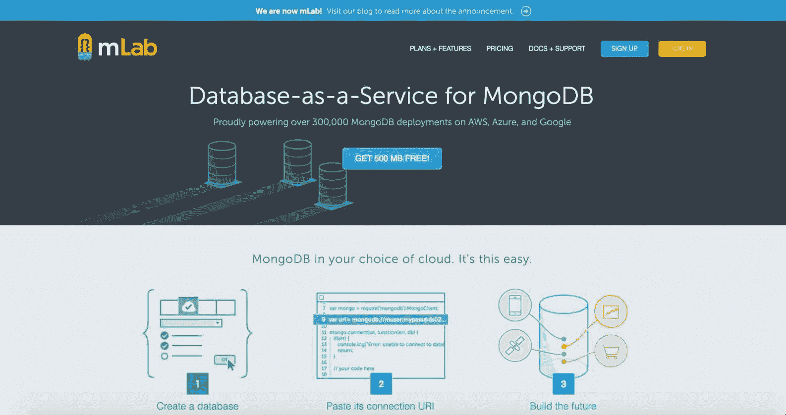
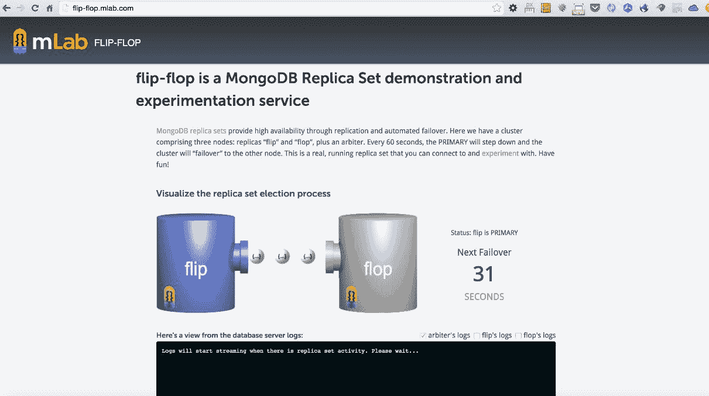
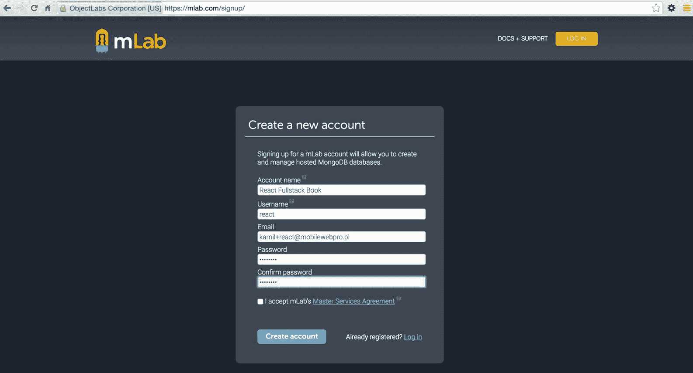
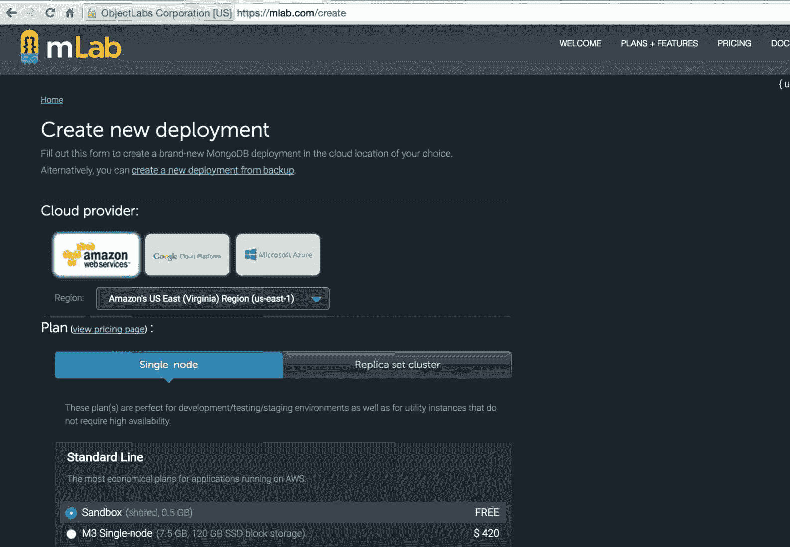
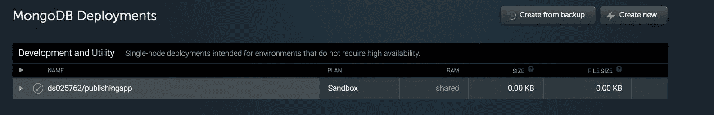
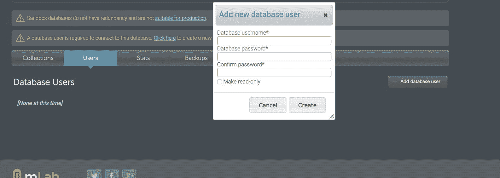
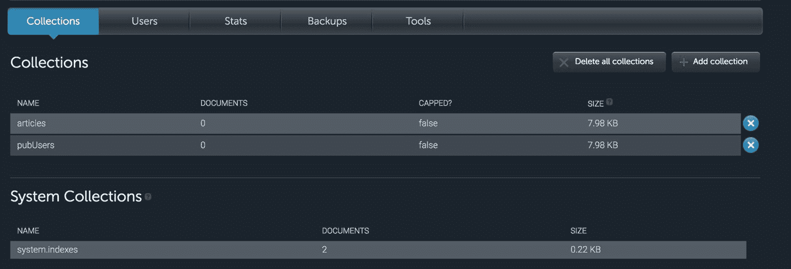
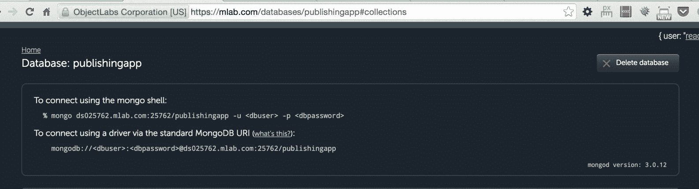

# mLab 上的 MongoDB 部署

我们已经到了需要开始规划我们的应用程序部署的阶段。我们选择了 MongoDB 作为我们的数据库。使用它的不同方法用于扩展--您可以自己使用自己的服务器做所有事情（耗时且要求高）或者您可以使用为您执行复制/扩展的服务，例如数据库即服务提供商。

在本章中，我们将涵盖以下主题：

+   创建 mLab 账户和创建新的 MongoDB 部署

+   MongoDB 中的复制集是如何工作的，以及您如何在 mLab 中使用它

+   在实时演示中测试复制集（在 mLab 中切换）

+   设置数据库用户和密码

+   了解在 AWS EC2 上部署需要准备的事项

# mLab 概述

在我们的案例中，我们将使用 mLab 来减少在 MongoDB 上配置底层配置的时间，并更多地构建一个健壮可扩展的应用程序。

如果我们访问[www.mLab.com](http://www.mLab.com)，有一个免费的数据库计划（我们将在本章中使用）和一个付费的数据库计划：



通常，mLab 提供以下一些有趣的功能：

+   **云自动化工具**：这些提供 AWS、Azure 或 Google 上的按需配置（准备），复制集（将在本章后面详细描述）；以及**分片集群**。这些还提供通过自动故障转移的无缝、零停机时间扩展和高可用性。

+   **备份和恢复工具**：这些提供自动备份，在紧急情况下可以在后续项目阶段提供帮助。

+   **监控和警报工具**：例如，有一个**慢查询**工具，可以帮助您找到慢查询，这些查询可以通过添加索引进行优化。

+   **在线数据浏览工具**：当您登录到 mLab 的管理面板时，您可以通过浏览器浏览 MongoDB 的集合。

# 复制集连接和高可用性

在 MongoDB 中，有一个使用自动故障转移确保高可用性的功能。简而言之，故障转移是一个确保如果主服务器（拥有您数据库最重要的副本）失败，那么如果原始主服务器不可用，则次要成员的数据库将成为主数据库的功能。

次要成员的数据库是一个服务器，它保存了所谓的**只读备份**。

主数据库和次要数据库经常相互复制，以确保始终同步。次要服务器主要用于读取操作。

从头开始（没有 mLab）实现整个复制集功能相当耗时，但 mLab 提供此功能是为了*抽象*这一部分，以便我们的整个过程将更加自动化。

# MongoDB 故障转移

mLab 还提供了一个测试我们应用程序中故障转移场景的出色工具，可在[`flip-flop.mlab.com`](http://flip-flop.mlab.com)找到。



在这里，我们可以测试 MongoDB 副本集的自动故障转移功能。正如我们可以在前面的截图中所见，有三个节点：副本的**翻转**和**折叠**，以及一个仲裁者。在 flip-flop 的演示中，您可以连接到仲裁者服务器，主服务器将下线，集群将故障转移到其他节点。您可以自己尝试并享受乐趣！

您可以在[`docs.mlab.com/connecting/#replica-set-connections`](http://docs.mlab.com/connecting/#replica-set-connections)找到更多有关如何使用 flip-flop 演示的文档。

# mLab 的免费与付费计划

在这本书中，我们将指导您使用免费计划来操作 mLab。在 mLab 中，副本集在付费计划中可用（起价为每月 15 美元），当然，您也可以免费使用 flip-flop 的演示来体验 MongoDB 的非常重要的功能。

# 新的 mLab 账户和节点

1.  前往[`mlab.com/signup/`](https://mlab.com/signup/)，如下面的截图所示：



1.  通过点击收件箱中的确认链接来验证您的电子邮件。

1.  点击创建新按钮，如下面的截图所示：


1.  您现在处于创建新部署页面。选择单节点 | 沙盒（免费），如下面的截图所示：



1.  当您仍然在[`mlab.com/create`](https://mlab.com/create)（创建新部署）时，将数据库名称设置为`publishingapp`，然后点击创建新的 MongoDB 部署按钮，如下面的截图所示：


1.  在遵循前面的步骤之后，您应该能够在仪表板上找到 MongoDB 部署（[`mlab.com/home`](https://mlab.com/home)），如下面的截图所示：



# 创建数据库的用户/密码和其他配置

目前，数据库已准备好用于我们的发布应用程序，但它仍然是空的。

我们需要采取以下步骤才能使用它：

1.  创建用户/密码组合。我们需要点击刚刚创建的数据库，找到名为“用户”的标签页。点击它后，点击添加新数据库用户按钮，然后在表单中填写详细信息，如下面的截图所示：



1.  让我们假设这本书的详细信息如下：

数据库用户名：`usermlab`

数据库密码：`pwdmlab`

在我们需要使用用户名和密码的地方，我将使用这些详细信息。

1.  之后，我们需要创建与本地 MongoDB 中相同的集合：

集合 | 添加集合 | articles

集合 | 添加集合 | pubUsers

1.  在执行所有前面的步骤之后，您应该会看到如下截图所示的内容：



1.  在这个阶段，最后一步是从以下截图中写下 Mongo 的详细信息：



# 配置总结

我们需要保留并分享所有来自 mLab 的信息，以及 AWS S3 的详细信息。这些细节将在下一章部署我们的应用在 Amazon AWS EC2 时有用。

在本书的这一部分，有一些细节我们需要单独保留：

```js
AWS_ACCESS_KEY_ID=<<access-key-obtained-in-previous-chapter>>
AWS_SECRET_ACCESS_KEY=<<secret-key-obtained-in-previous-chapter>>
AWS_BUCKET_NAME=publishing-app
AWS_REGION_NAME=eu-central-1
MONGO_USER=usermlab
MONGO_PASS=pwdmlab
MONGO_PORT=<<port-from-your-mlab-node>>
MONGO_ENV=publishingapp
MONGO_HOSTNAME=<<hostname-from-your-mlab-node>>

```

确保你已经将端口和主机名替换为正确的值（如前一个屏幕截图中所提供的 mLab 提供的）。

所有 Mongo `env`变量都可以从 mLab 获得，在那里你可以找到一个类似以下链接（这是一个在编写本章时创建的账户的示例）：

```js
mongo ds025762.mlab.com:25762/publishingapp -u <dbuser> -p <dbpassword>

```

# 摘要

在下一章，我们将开始在 AWS EC2 平台上我们的生产服务器上使用这些环境变量。将这些细节记录在一个易于访问、安全的地方，因为我们很快就会使用它们。

最后一步是检查应用是否运行正确，并使用远程 mLab MongoDB（而不是使用`mongd`命令运行的本地 MongoDB）。你可以通过运行`npm start`来实现，然后你应该能看到发布应用的空主页。因为我们已经从本地数据库迁移到了远程数据库，而远程数据库是空的，所以你需要注册一个新用户，并尝试在 mLab 下发布一篇文章来存储数据。
