# 第八章：Docker 和 EC2 容器服务

我们已经完成了与数据库作为后端的所有相关事宜，使用的是 mLab。发布应用程序应该在 mLab MongoDB 实例上 100%远程工作，所以你不再需要运行`mongod`命令了。

是时候准备我们的 Docker 容器，并使用 ECS（EC2 容器服务）和负载均衡器将其完全部署到 EC2 上了。

什么是 Docker？它是一个非常实用的开源软件，可以帮助你打包、运输和运行任何应用程序作为一个轻量级的容器（例如，与虚拟机相比）。

容器的目标与虚拟机类似--最大的区别是 Docker 是为了软件开发而创建的，而不是 VM。你还需要意识到，一个完全虚拟化的系统为其分配了自身的资源，这导致了最小资源共享，这与 Docker 容器不同。当然，在 VM 中，你得到更多的隔离，但代价是 VM 要重得多（需要更多的磁盘空间、RAM 和其他资源）。Docker 的容器轻量级，并且与 VM 相比，能够在不同的容器之间共享更多东西。

好的一点是，Docker 的容器是硬件和平台无关的，所以关于你正在工作的内容是否能在任何地方运行的担忧都消失了。

通常，Docker 的好处是它提高了开发者的生产力，帮助他们更快地发布软件，帮助他们将软件从本地开发机器移动到 AWS 上的生产部署，等等。Docker 还允许对软件进行版本控制（类似于 Git），这在需要快速在生产服务器上回滚时非常有帮助。

在本章中，你将学习以下内容：

+   在非 Linux 机器上使用 Docker Toolbox 安装 Docker 应用程序

+   测试你的 Docker 设置是否正确

+   准备发布应用程序以使用 mLab Mongo 作为数据库

+   为发布应用程序创建一个新的 Docker 容器

+   创建你的第一个 Dockerfile，该文件将在 Linux CentOS 上部署发布应用程序

+   EC2 容器服务

+   AWS 负载均衡器

+   使用 Amazon Route 53 进行 DNS 服务

+   AWS 身份和访问管理（IAM）

# 使用 Docker Toolbox 安装 Docker

安装 Docker 相当简单。访问官方安装页面[`docs.docker.com/engine/installation/`](https://docs.docker.com/engine/installation/)，因为它会根据你的操作系统提供最佳指导。有适用于 iOS 和 Windows 的易于遵循的安装程序，以及针对不同 Linux 发行版的许多说明。

如果你使用的是非 Linux 机器，那么你还需要安装 Docker Toolbox for Windows 或 OS X。这很简单，因为它的安装程序可以在[`www.docker.com/products/docker-toolbox`](https://www.docker.com/products/docker-toolbox)找到，如下面的截图所示：

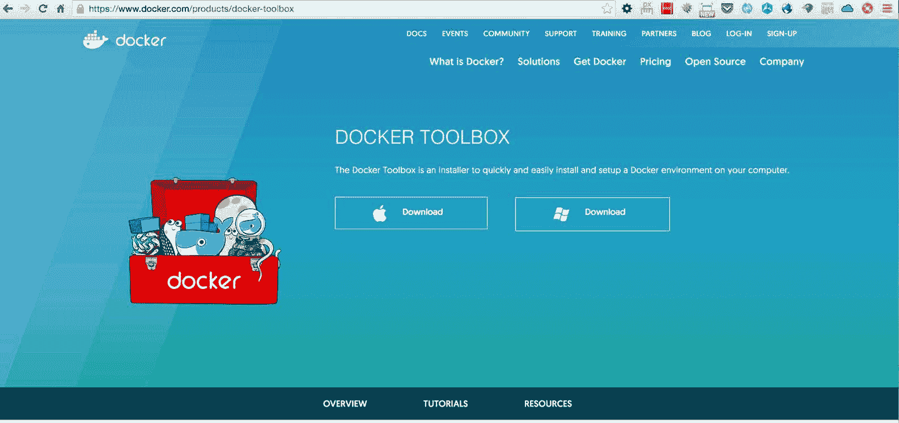

如果你使用的是 Linux，你需要执行一些额外的步骤，因为你需要在 BIOS 中开启虚拟化：

+   按照官方文档中的说明安装 Docker machine，文档链接为 [`docs.docker.com/machine/install-machine/`](https://docs.docker.com/machine/install-machine/)

+   对于 Ubuntu，你需要手动从 [`help.ubuntu.com/community/VirtualBox`](https://help.ubuntu.com/community/VirtualBox) 安装 VirtualBox

+   对于其他 Linux 发行版，请访问 [`www.virtualbox.org/wiki/Linux_Downloads`](https://www.virtualbox.org/wiki/Linux_Downloads)

在你的本地机器上安装 Docker（包括在 OS X 和 Windows 上的 Toolbox）后，请在终端中运行以下命令：

```js
$ docker info

```

在运行此命令后，你将能够看到以下类似截图的内容：

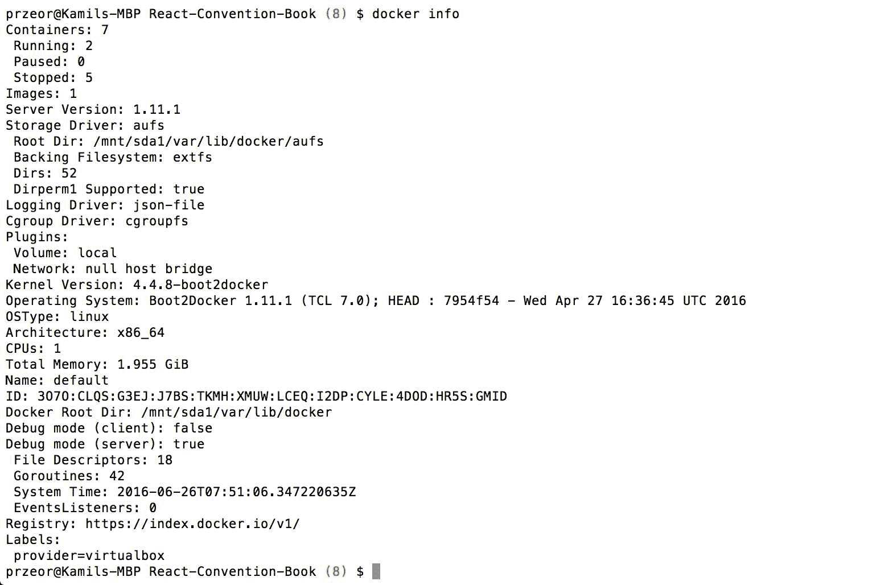

如果你看到类似的内容，那么你的安装就成功了。让我们继续学习 Docker。

# Docker Hub - 一个 hello world 示例

在我们开始创建发布应用的 Docker 容器之前，让我们先玩一个官方的 Docker *hello world* 示例，这将让你了解 Docker Hub 的工作方式。

Docker Hub 对于 Docker 容器来说，就像 GitHub 对于 Git 仓库一样。你可以在 Docker 中拥有公共和私有容器。Docker Hub 的主页看起来是这样的：

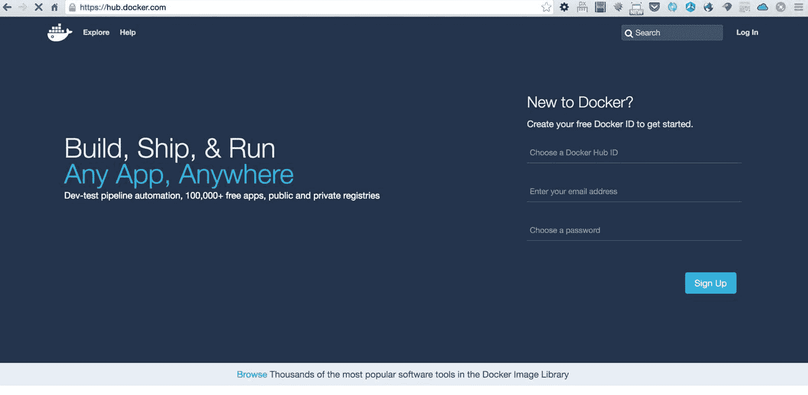

只是为了让你有个感觉，如果你访问 [`hub.docker.com/explore/`](https://hub.docker.com/explore/)，你可以看到不同已经准备好使用的容器，比如这个，例如：

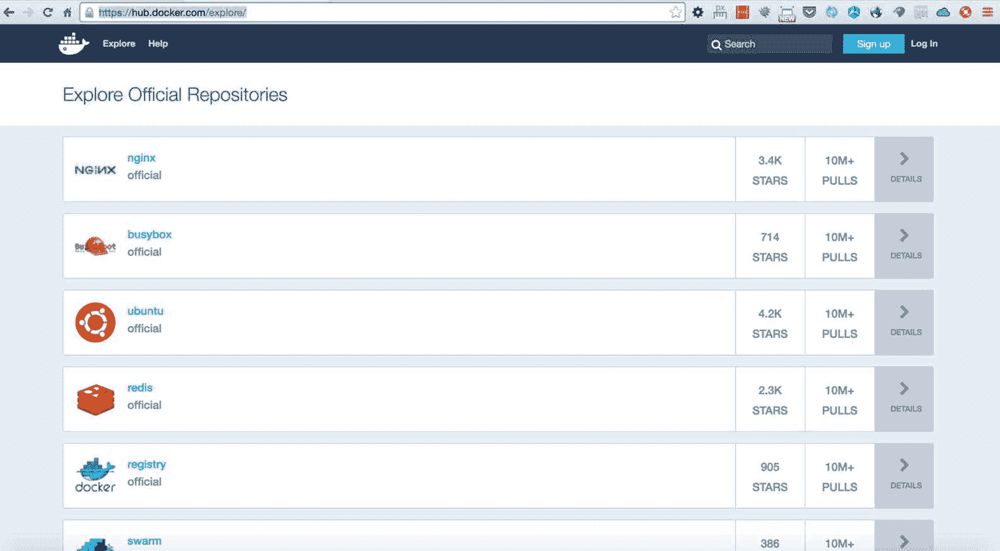

仅为了我们的演示练习，我们将使用一个名为 `hello world` 的容器，该容器在 [`hub.docker.com/r/library/hello-world/`](https://hub.docker.com/r/library/hello-world/) 公开可用。

为了运行这个 `hello-world` 示例，请在你的终端中运行以下命令：

```js
$ docker run hello-world

```

在运行此命令后，你将看到以下类似的内容：

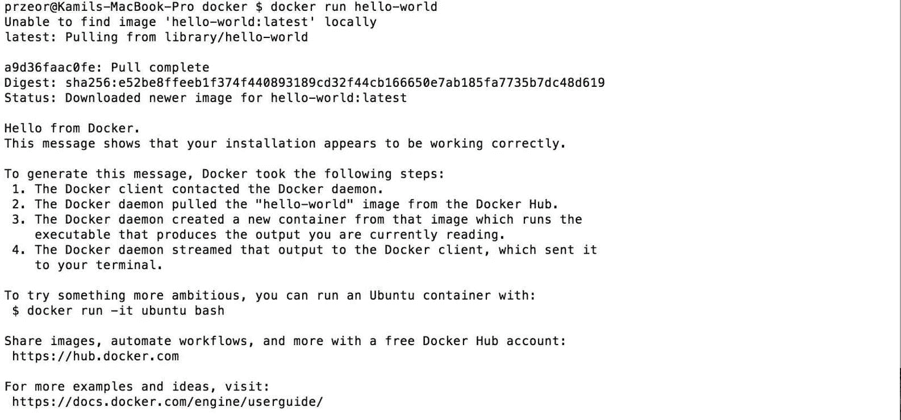

让我们理解刚刚发生了什么：我们使用 `docker run` 命令来启动基于镜像的容器（在我们的例子中，我们使用了 hello world 容器镜像）。在这种情况下，我们执行以下操作：

1.  运行命令，告诉 Docker 使用无额外命令启动名为 `hello-world` 的容器。

1.  在按 Enter 键后，Docker 将下载 Docker Hub。

1.  然后，它将在虚拟机中使用 Docker Toolbox 在非 Linux 系统上启动容器。

如前所述，`hello-world` 镜像来自名为 Docker Hub 的公共注册表（你可以在 [`hub.docker.com/r/library/hello-world/`](https://hub.docker.com/r/library/hello-world/) 访问）。

# Dockerfile 示例

每个镜像都由一个 Dockerfile 组成。`hello-world` 示例的 Dockerfile 看起来如下所示：

```js
// source: https://github.com/docker-library/hello-world/blob/master/Dockerfile 
FROM scratch 
COPY hello / 
CMD ["/hello"]

```

Dockerfile 是一组指令，告诉 Docker 如何构建容器镜像。我们将在稍后创建自己的。Dockerfile 的一个类比可以在任何 Linux/Unix 机器上使用的 Bash 语言。当然，它不同，但编写指令以创建工作的总体思想是相似的。

# 为了创建它，我们需要对我们的代码库进行修改

目前，我们确信我们的 Docker 应用程序的设置是正确的。

首先，我们需要对我们的当前代码库进行一些修改，因为有一些小的调整才能使其正常工作。

确保以下文件具有适当的内容。

`server/.env`文件的内容必须如下：

```js
AWS_ACCESS_KEY_ID=<<___AWS_ACCESS_KEY_ID__>> 
AWS_SECRET_ACCESS_KEY=<<___AWS_SECRET_ACCESS_KEY__>> 
AWS_BUCKET_NAME=publishing-app 
AWS_REGION_NAME=eu-central-1 
MONGO_USER=<<___your_mlab_mongo_user__>> 
MONGO_PASS=<<___your_mlab_mongo_pass__>> 
MONGO_PORT=<<___your_mlab_mongo_port__>> 
MONGO_ENV=publishingapp 
MONGO_HOSTNAME=<<___your_mlab_mongo_hostname__>>

```

现在，我们将从文件中加载环境变量，但稍后我们将从 AWS 面板加载它们。将所有这些机密数据保留在服务器上并不真正符合生产安全。我们现在是出于简洁的考虑使用它；稍后，我们将删除它，转而采用更安全的方法。

关于 Mongo 环境变量，我们在上一章关于设置 mLab（如果遗漏了此点所需的任何细节，请回到该章节）中学习了它们。

`server/index.js`文件的内容必须如下：

```js
var env = require('node-env-file'); 
// Load any undefined ENV variables form a specified file.  
env(__dirname + '/.env'); 

require("babel-core/register"); 
require("babel-polyfill"); 
require('./server');

```

确保你在`server/index.js`的开始处加载`.env`文件。这将是为了从环境变量（`server/.env`）中加载 mLab Mongo 详细信息所必需的。

`server/configMongoose.js`文件的内容必须替换。找到以下代码：

```js
// this is old code from our codebase: 
import mongoose from 'mongoose'; 
var Schema = mongoose.Schema; 

const conf = { 
  hostname: process.env.MONGO_HOSTNAME || 'localhost', 
  port: process.env.MONGO_PORT || 27017, 
  env: process.env.MONGO_ENV || 'local', 
}; 
mongoose.connect(&grave;mongodb://${conf.hostname}: 
 ${conf.port}/${conf.env}&grave;);

```

同样改进的代码的新版本必须如下：

```js
import mongoose from 'mongoose'; 
var Schema = mongoose.Schema; 

const conf = { 
  hostname: process.env.MONGO_HOSTNAME || 'localhost', 
  port: process.env.MONGO_PORT || 27017, 
  env: process.env.MONGO_ENV || 'local', 
}; 

let dbUser 
if(process.env.MONGO_USER && process.env.MONGO_PASS) { 
  dbUser = {user: process.env.MONGO_USER, pass: 
   process.env.MONGO_PASS} 
} else { 
  dbUser = undefined; // on local dev not required 
} 
mongoose.connect(&grave;mongodb://${conf.hostname}:${conf.port}/${conf.env}&grave;, dbUser);

```

如你所见，我们增加了连接到特定数据库用户的可能性。我们需要它，因为我们之前工作的 localhost 不需要任何用户，但当我们开始使用 mLab MongoDB 时，指定我们的数据库用户是必须的。否则，我们无法正确认证。

从这一点开始，你不需要在你的系统后台运行`mongod`进程，因为应用程序将连接到你在上一章中创建的 mLab MongoDB 节点。mLab MongoDB（免费版）全天候运行，但如果计划将其用于生产就绪应用程序，那么你需要更新它并开始使用副本集功能（这在上一章中已提及）。

你可以尝试使用以下命令运行项目：

```js
npm start

```

然后，你应该能够加载应用程序：

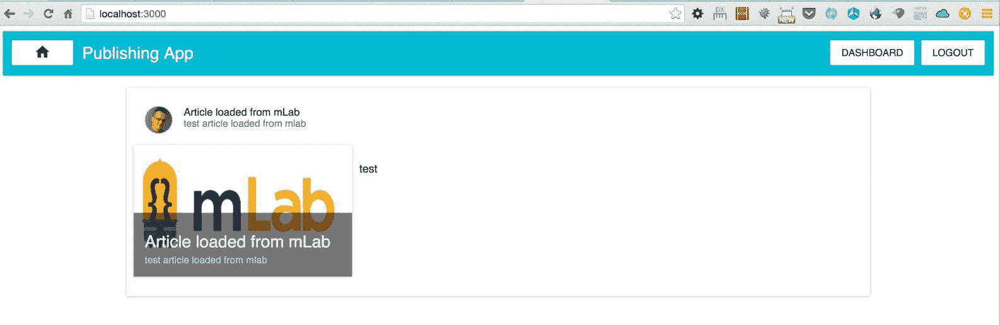

现在的重要区别是，所有的 CRUD 操作（通过我们的发布应用程序的读写）都是在我们的远程 MongoDB（而不是本地）上完成的。

在发布应用程序使用 mLab MongoDB 之后，我们就可以准备我们的 Docker 镜像，然后使用 AWS Load Balancer 和 EC2 Container Service 在 AWS EC2 的几个实例上部署它。

# 在发布应用程序的 Docker 镜像上工作

在继续之前，您应该能够通过使用远程 mLab MongoDB 来在本地运行您的项目。这是必需的，因为我们将在 Docker 容器中启动我们的发布应用。然后我们的应用将远程连接到 Mongo。我们不会在任何一个 Docker 容器中运行任何 MongoDB 进程。这就是为什么在以下步骤中使用 mLab 如此重要的原因。

让我们在终端/命令行中执行以下命令来创建 Dockerfile：

```js
[[your are in the project main directory]]
$ touch Dockerfile

```

在您的新 Dockerfile 中输入以下内容：

```js
FROM centos:centos7 

RUN yum update -y 
RUN yum install -y tar wget 
RUN wget -q https://nodejs.org/dist/v4.0.0/node-v4.0.0-linux-x64.tar.gz -O - | tar xzf - -C /opt/ 

RUN mv /opt/node-v* /opt/node 
RUN ln -s /opt/node/bin/node /usr/bin/node 
RUN ln -s /opt/node/bin/npm /usr/bin/npm 

COPY . /opt/publishing-app/ 

WORKDIR /opt/publishing-app 

RUN npm install 
RUN yum clean all 

EXPOSE 80 
CMD ["npm", "start"]

```

让我们一步一步地看看我们将要在我们的发布应用中与 Docker 一起使用的 Dockerfile：

+   `FROM centos:centos7`：这意味着我们将使用来自[`hub.docker.com/r/_/centos/`](https://hub.docker.com/r/_/centos/)公共 Docker 仓库的 CentOS 7 Linux 发行版作为起点。

您可以使用任何其他包作为起点，例如 Ubuntu，但我们使用 CentOS 7，因为它更轻量级，并且通常非常适合 Web 应用部署。您可以在[`www.centos.org/`](https://www.centos.org/)找到更多详细信息。

所有命令的文档可在[`docs.docker.com/engine/reference/builder/`](https://docs.docker.com/engine/reference/builder/)找到。

+   `RUN yum update -y`：这通过命令行使用`yum--`更新包，这是任何 Linux 设置的常规做法。

+   `RUN yum install -y tar wget`：这安装了两个包作为`tar`（用于解压文件）和`wget`（用于下载文件）。

+   `RUN wget -q https://nodejs.org/dist/v4.0.0/node-v4.0.0-linux-x64.tar.gz -O - | tar xzf - -C /opt/*`：这个命令将`node4.0.0`下载到我们的 CentOS 容器中，解压它，并将所有文件放入`/opt/`目录。

+   `RUN mv /opt/node-v /opt/node*`：这会将我们刚刚下载并解压的文件夹（带有`node`）重命名为不带版本命名的简单`node`。

+   `RUN ln -s /opt/node/bin/node /usr/bin/node`：我们将`/opt/node/bin/node`位置与`/usr/bin/node`链接链接起来，这样我们就能在终端中使用简单的`$ node`命令。这是 Linux 用户的常规做法。

+   `RUN ln -s /opt/node/bin/npm /usr/bin/npm`：与`node`相同，但与`npm`。我们将其链接起来，以便更容易使用，并将其链接到我们的 CentOS 7 上的`$ npm`。

+   `COPY . /opt/publishing-app/`：这会将上下文中的所有文件复制（`.`（点）符号是启动容器构建时的位置。我们将在稍后进行操作。）它将所有文件复制到我们的容器中`/opt/publishing-app/`位置。

在我们的案例中，我们在发布应用的目录中创建了 Dockerfile，因此它将容器中的所有项目文件复制到指定的位置`/opt/publishing-app/`。

+   `WORKDIR /opt/publishing-app`：在我们将发布应用的文件放入我们的 Docker 容器后，我们需要选择工作目录。它类似于在任何 Unix/Linux 机器上的`$ cd /opt/publishing-app`。

+   `RUN npm install`: 当我们在工作目录 `/opt/publishing-app` 中时，我们运行标准的 `npm install` 命令。

+   `RUN yum clean all`: 我们清理 `yum` 缓存。

+   `EXPOSE 80`: 我们定义了使用我们的发布应用程序的端口。

+   `CMD ["npm", "start"]`: 然后，我们指定如何在 Docker 容器中运行应用程序。

我们还将在主项目目录中创建一个 `.dockerignore` 文件：

```js
$ [[[in the main directory]]]
$ touch .dockerignore

```

文件内容如下：

```js
.git 
node_modules 
.DS_Store

```

我们不想复制提到的文件（`.DS_Store` 是针对 OS X 的特定文件）。

# 构建发布应用程序容器

目前，你将能够构建 Docker 的容器。

在项目主目录中，你需要运行以下命令：

```js
docker login

```

`login` 命令将提示你输入 Docker 用户名和密码。认证正确后，你可以运行 `build` 命令：

```js
docker build -t przeor/pub-app-docker .

```

当然，用户名和容器名称组合必须是你的。用你的详细信息替换它。

前面的命令将使用 Dockerfile 命令构建容器。这是你将看到的内容（步骤 1，步骤 2 等）：

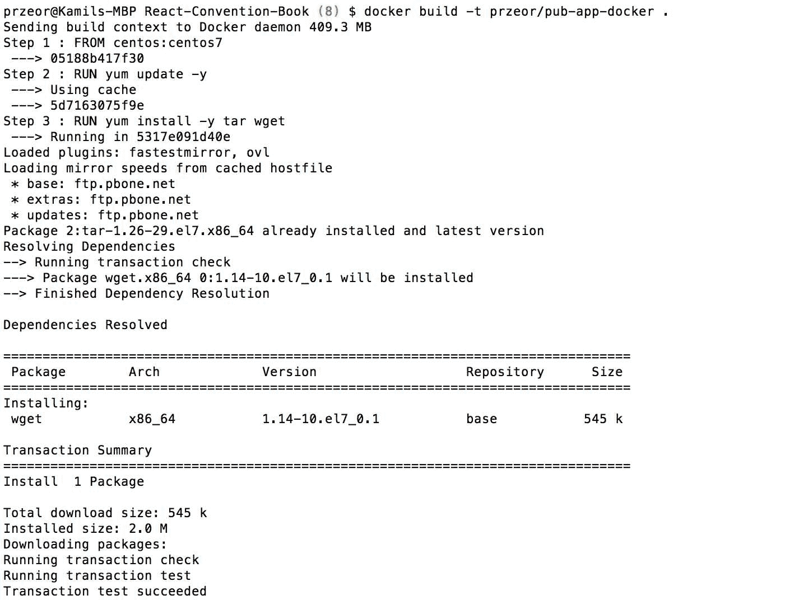

构建成功后，你将在你的终端/命令行中看到类似以下的内容：

```js
[[[striped from here for the sake of brevity]]]
Step 12 : EXPOSE 80
 ---> Running in 081e0359cbd5
 ---> ce0433b220a0
Removing intermediate container 081e0359cbd5
Step 13 : CMD npm start
 ---> Running in 581df04c8c81
 ---> 1970dde57fec
Removing intermediate container 581df04c8c81
Successfully built 1910dde57fec

```

如你从 Docker 终端中看到的那样，我们已经成功构建了一个容器。下一步是本地测试它，然后学习一些 Docker 的基础知识，最后开始我们的 AWS 部署工作。

# 本地运行发布应用程序容器

为了测试容器是否已正确构建，请执行以下步骤。

运行以下命令：

```js
$ docker-machine env

```

前面的命令将给出类似以下的内容：

```js
export DOCKER_TLS_VERIFY="1"
export DOCKER_HOST="tcp://192.168.99.100:2376"
export DOCKER_CERT_PATH="/Users/przeor/.docker/machine/machines/default"
export DOCKER_MACHINE_NAME="default"
# Run this command to configure your shell: 
# eval $(docker-machine env)

```

我们正在寻找 `DOCKER_HOST` IP 地址；在这种情况下，它是 `192.168.99.100`。

这个 Docker 主机 IP 将用于检查我们的应用程序是否在容器中正确运行。记下来。

下一步是使用以下命令运行我们的本地容器：

```js
$ docker run -d -p 80:80  przeor/pub-app-docker npm start

```

关于标志：`d` 标志代表 "分离"，因此进程将在后台运行。你可以使用以下命令列出所有正在运行的 Docker 进程：

```js
docker ps

```

一个示例输出如下：

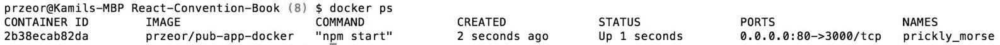

`-p` 标志告诉我们容器的端口 `80` 绑定到 Docker IP 主机的端口 `80`。因此，如果我们将在容器中将 Node 应用程序暴露在端口 `80` 上，那么它将能够在 IP 地址的标准端口 `80` 上运行（在示例中，它将是 `192.168.99.100:80`；显然，端口 `80` 是用于所有 HTTP 请求的）。

`przeor/pub-app-docker` 命令将指定我们想要运行的容器名称。

使用 `npm start`，我们告诉 Docker 容器启动后要运行的命令（否则，容器将立即启动并停止）。

关于 `docker run` 的更多参考资料可在 [`docs.docker.com/engine/reference/run/`](https://docs.docker.com/engine/reference/run/) 找到。

前面的命令将运行应用程序，如下面的截图所示：

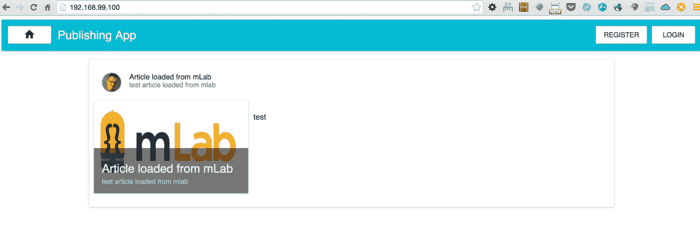

正如你所见，浏览器 URL 栏中的 IP 地址是 http://192.168.99.100。这是我们的 Docker 主机 IP。

# 容器调试

如果容器对你不起作用，就像以下截图所示，请使用以下命令进行调试并找出原因：

```js
docker run -i -t -p 80:80 przeor/pub-app-docker

```

这个带有 `-i -t -p` 标志的命令将在终端/命令行中显示所有日志，如下面的截图所示（这只是一个示例，以展示你可以在本地调试 Docker 容器的能力）：

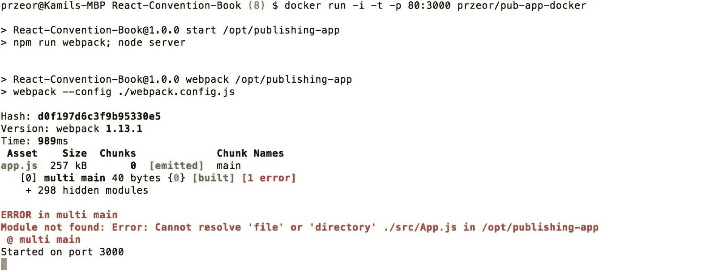

# 将 Docker 容器推送到远程仓库

如果容器在本地运行正常，那么它几乎就准备好进行 AWS 部署了。

在推送容器之前，让我们将 `.env` 文件添加到 `.dockerignore`，因为其中包含所有你不会放入容器中的敏感数据。因此，在 `.dockerignore` 文件中，添加以下内容：

```js
.git 
node_modules 
.DS_Store 
.env

```

在将 `.env` 文件添加到 `.gitignore` 之后，我们需要修改 `server/index.js` 文件并添加一个额外的 `if` 语句：

```js
if(!process.env.PORT) { 
  var env = require('node-env-file'); 
  // Load any undefined ENV variables form a specified file.  
  env(__dirname + '/.env'); 
}

```

这个 `if` 语句检查我们是在本地运行应用程序（带有 `.env` 文件）还是在 AWS 实例上远程运行（然后我们以更安全的方式传递 `env` 变量）。

在将 `.env` 文件添加到 `.dockerignore`（并修改 `server/index.js`）之后，构建好即将推送的容器：

```js
docker build -t przeor/pub-app-docker

```

关于环境变量，我们将通过 AWS 高级选项添加它们。你将在稍后了解这一点，但为了了解如何在本地运行时添加它们，请查看以下示例（命令标志中提供了假数据）：

```js
$ docker run -i -t -e PORT=80 -e AWS_ACCESS_KEY_ID='AKIMOCKED5JM4VUHA' -e AWS_SECRET_ACCESS_KEY='k3JxMOCKED0oRI6w3ZEmENE1I0l' -e AWS_BUCKET_NAME='publishing-app' -e AWS_REGION_NAME='eu-central-1' -e MONGO_USER='usermlab' -e MONGO_PASS='MOCKEDpassword' -e MONGO_PORT=25732 -e MONGO_ENV='publishingapp' -e MONGO_HOSTNAME='ds025761.mlab.com' -p 80:80 przeor/pub-app-docker
npm start

```

确保你已经提供了正确的 `AWS_REGION_NAME`。我的是 `eu-central-1`，但你的可能不同。

正如你所见，`server/.env` 文件中的所有内容都已经移动到了 Bash 终端的 Docker 运行命令中：

```js
AWS_ACCESS_KEY_ID=<<___AWS_ACCESS_KEY_ID__>>
AWS_SECRET_ACCESS_KEY=<<___AWS_SECRET_ACCESS_KEY__>>
AWS_BUCKET_NAME=publishing-app
AWS_REGION_NAME=eu-central-1
MONGO_USER=<<___your_mlab_mongo_user__>>
MONGO_PASS=<<___your_mlab_mongo_pass__>>
MONGO_PORT=<<___your_mlab_mongo_port__>>
MONGO_ENV=publishingapp
MONGO_HOSTNAME=<<___your_mlab_mongo_hostname__>>
PORT=80

```

正如这里所示，`-e` 标志是用于 `env` 变量的。最后一步是将容器推送到由 Docker Hub 托管的远程仓库：

```js
docker push przeor/pub-app-docker

```

然后，你将在你的 Bash/命令行中找到类似以下的内容：

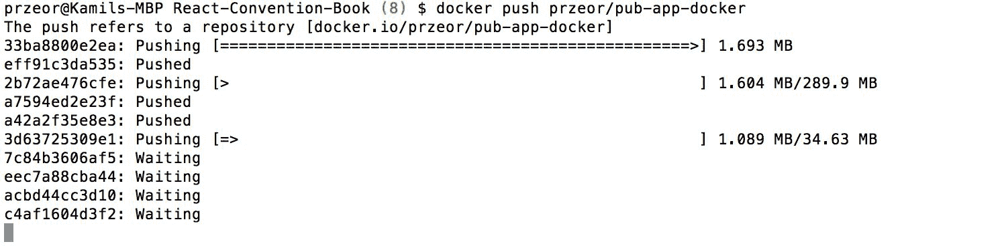

推送仓库的链接将与以下类似：

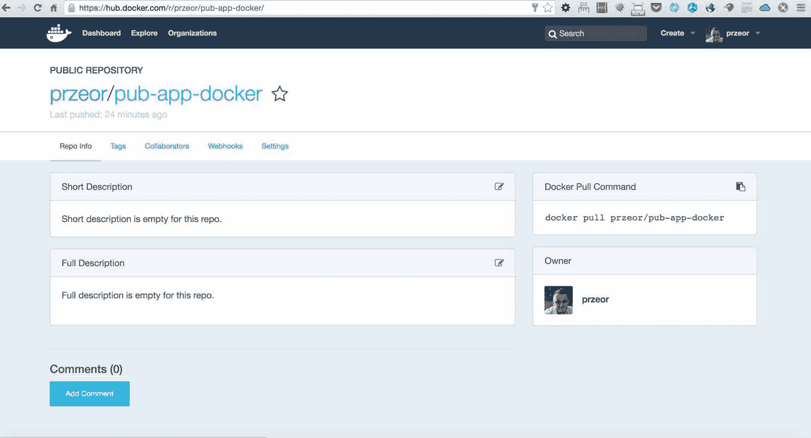

上述截图是从推送的 Docker 仓库制作的。

# 有用 Docker 命令的总结

以下是一些有用的 Docker 命令：

+   这个命令将列出所有镜像，如果需要从你的本地机器删除仓库，可以使用 `docker rm`：

```js
 docker images
 docker rm CONTAINER-ID

```

+   你可以使用 `CONTAINER-ID` 的前三个字符。你不需要写下整个容器 ID。这是一个便利。

+   这个命令用于停止正在运行的 Docker 容器：

```js
        docker ps
docker stop CONTAINER-ID

```

+   你可以使用以下方法使用容器的版本标签：

```js
        docker tag przeor/pub-app-docker:latest przeor/pub-app-  
        docker:0.1
docker images

```

+   在列出 Docker 镜像后，你可能注意到你有两个容器，一个带有 `latest` 标签，另一个带有 `0.1` 标签。这是一种跟踪更改的方式，因为如果你推送容器，标签也会在 Docker Hub 上列出。

+   检查容器的本地 IP：

```js
        $ docker-machine env

```

+   从 Dockerfile 构建你的容器：

```js
        docker build -t przeor/pub-app-docker .

```

+   以“分离”模式运行你的容器：

```js
        $ docker run -d -p 80:80 przeor/pub-app-docker npm start

```

+   运行你的容器以调试它，而不将其分离，这样你就可以在容器的 Bash 终端中找到正在发生的事情：

```js
        docker run -i -t -p 80:80 przeor/pub-app-docker

```

# AWS EC2 上的 Docker 简介

在两章之前，我们实现了亚马逊 AWS S3 用于静态图像上传。你应该已经有了 AWS 账户，因此你已准备好进行以下步骤以在 AWS 上创建我们的部署。

通常，你可以使用免费 AWS 层级的步骤，但在这个教程中，我们将使用付费版本。在开始本节关于如何在 AWS 上部署 Docker 容器的部分之前，请阅读 AWS EC2 定价。

AWS 还通过其名为**EC2 容器服务**（**ECS**）的服务提供了对 Docker 容器的强大支持。

如果你购买了这本书，这可能意味着你之前还没有使用过 AWS。因此，我们将首先在 EC2 上手动部署 Docker，以便向你展示 EC2 实例的工作原理，这样你就可以从这本书中获得更多知识。

我们的主要目标是使我们的 Docker 容器部署自动化，但现在是手动方法。如果你已经使用过 EC2，你可以跳过下一个子节，直接进入 ECS。

# 手动方法 - EC2 上的 Docker

我们之前（几页之前）使用以下命令在本地运行我们的 Docker 容器：

```js
$ docker run -d -p 80:80  przeor/pub-app-docker npm start

```

我们将做同样的事情，但不是在本地，而是在 EC2 实例上，现在 100%手动；稍后，我们将使用 AWS ECS 100%自动完成。

在我们继续之前，让我们了解什么是 EC2。它位于亚马逊网络服务云中的可扩展计算能力。在 EC2 中，你不需要预先投资购买任何硬件。你所支付的一切都是为了使用 EC2 实例所花费的时间。这允许你更快地部署应用程序。非常快，你就可以添加新的虚拟服务器（当有更大的网络流量需求时）。有一些机制可以自动使用**AWS CloudWatch**来扩展 EC2 实例的数量。亚马逊 EC2 让你能够根据变化的需求（如流行度的激增）进行扩展或缩减，这个功能减少了你需要预测流量的需求（并为你节省时间和金钱）。

目前，我们只将使用一个 EC2 实例（在本书的后面部分，我们将看到带有负载均衡器和 ECS 的更多 EC2 实例）。

# 基础 - 启动 EC2 实例

我们将启动一个 EC2 实例，然后通过 SSH 登录到它（在 Windows 操作系统上，你可以使用**PuTTY**）。

通过访问此链接登录 AWS 控制台：[`eu-central-1.console.aws.amazon.com/console/home`](https://eu-central-1.console.aws.amazon.com/console/home)。

点击 EC2 链接：[`eu-central-1.console.aws.amazon.com/ec2/v2/home`](https://eu-central-1.console.aws.amazon.com/ec2/v2/home)

然后点击蓝色的“启动实例”按钮：

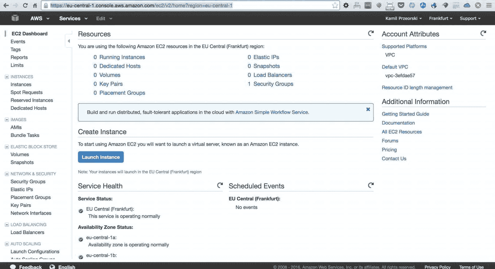

按钮看起来是这样的：

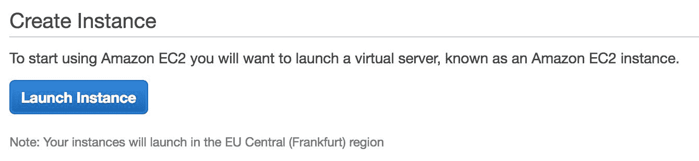

点击按钮后，你将被重定向到**亚马逊机器镜像**（**AMI**）页面：

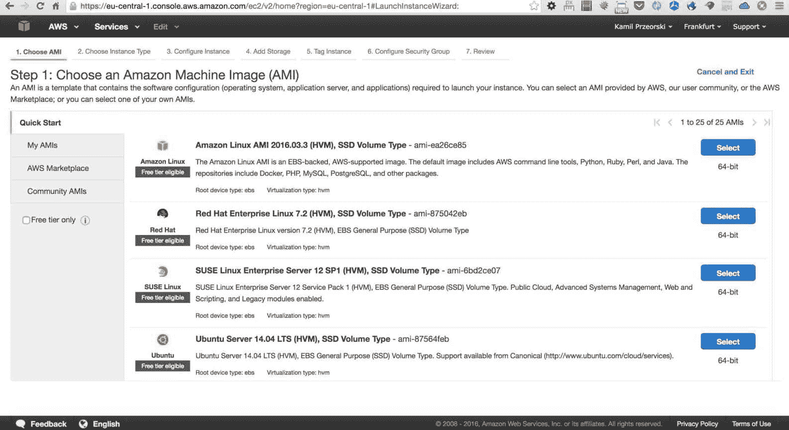

AMI 有一个可以运行 EC2 实例的镜像列表。每个镜像都有一个预安装软件列表。例如，最标准的镜像如下：

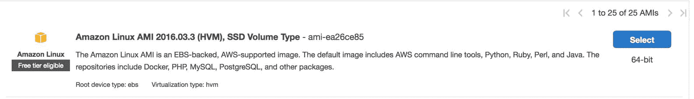

它已预安装了软件；例如，Amazon Linux AMI 是一个基于 EBS、AWS 支持的镜像。默认镜像包括 AWS 命令行工具、Python、Ruby、Perl 和 Java。仓库包括 Docker、PHP、MySQL、PostgreSQL 和其他包。

在同一页面上，您还可以找到市场上可购买的或其他社区免费创建和共享的其他 AMIs。您还可以过滤镜像，使其仅列出免费层：

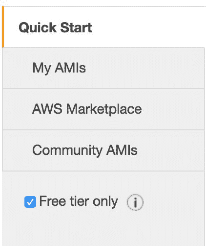

为了使这个逐步指南简单，让我们选择前一个截图中的镜像；其名称将与`Amazon Linux AMI 2016.03.3 (HVM), SSD Volume Type`类似。

镜像的名称可能略有不同；无需担心。

点击蓝色选择按钮。然后您将被转到第 2 步：选择实例类型页面，如下截图所示：

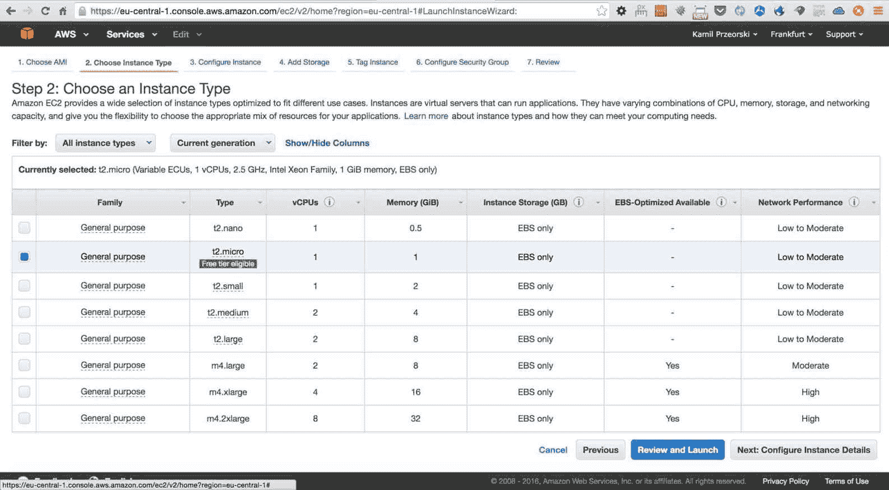

从此页面，选择以下内容：

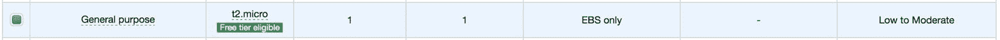

然后，点击此按钮：


最简单的方法是选择默认选项：

1.  审查。

1.  配置安全组（我们将在此选项卡中进行一些更改）。

1.  标记实例（保持默认选项）。

1.  添加存储（保持默认选项）。

1.  配置实例（保持默认选项）。

1.  选择实例类型。

1.  选择一个 AMI。

1.  通常，一直点击下一个按钮，直到我们到达配置安全组。

您可以在顶部找到的进度指示器如下：


我们现在的目标是到达安全配置页面，因为我们需要稍微自定义允许的端口。安全组由控制 EC2 实例（即防火墙选项）网络流量的规则组成。为了安全起见，将名称设置为`ssh-and-http-security-group`：

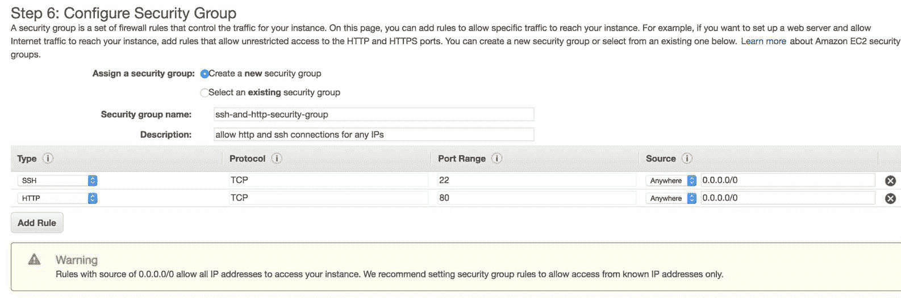

如您在此处可以看到，您还需要点击添加规则按钮并添加一个名为 HTTP 的新规则。这将允许我们的新 EC2 实例通过端口 80 对所有 IP 地址可用。

在您添加了名称并将 HTTP 端口 80 作为新规则后，您可以点击审查和启动按钮：


然后，在您满意审查实例后，点击该视图中的蓝色按钮“启动”：

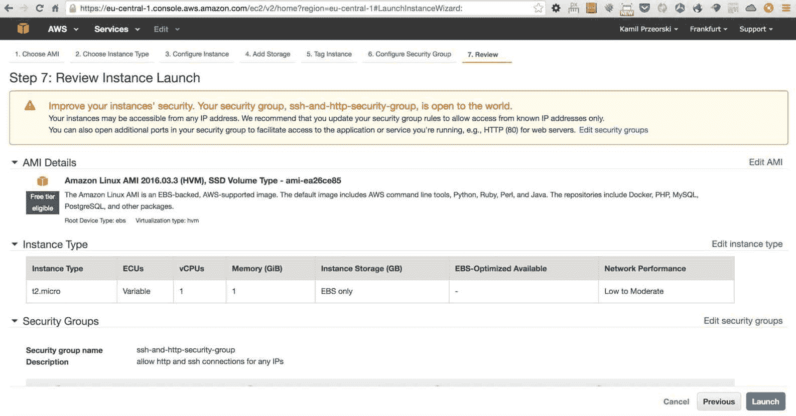

在您点击启动按钮后，您将看到一个模态窗口，提示选择现有的密钥对或创建新的密钥对：

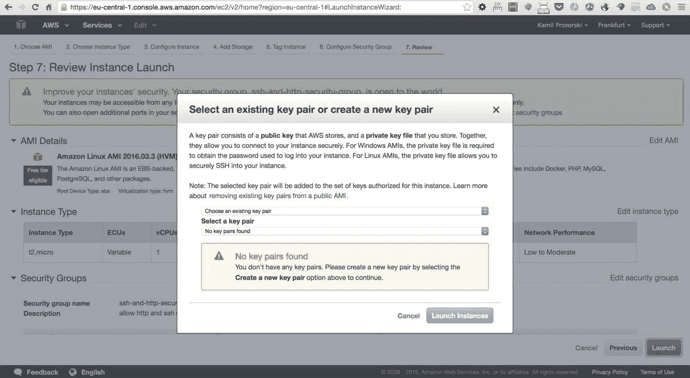

通常，您需要创建一个新的密钥对。将其命名为`pubapp-ec2-key-pair`，然后点击下载按钮，如下截图所示：

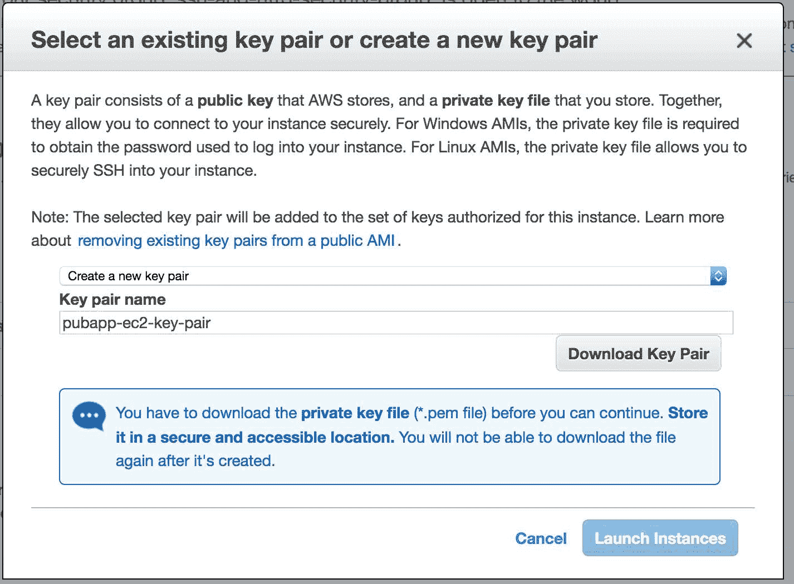

在您下载了`pubapp-ec2-key-pai`后，您将能够点击蓝色启动按钮。接下来，您将看到以下内容：

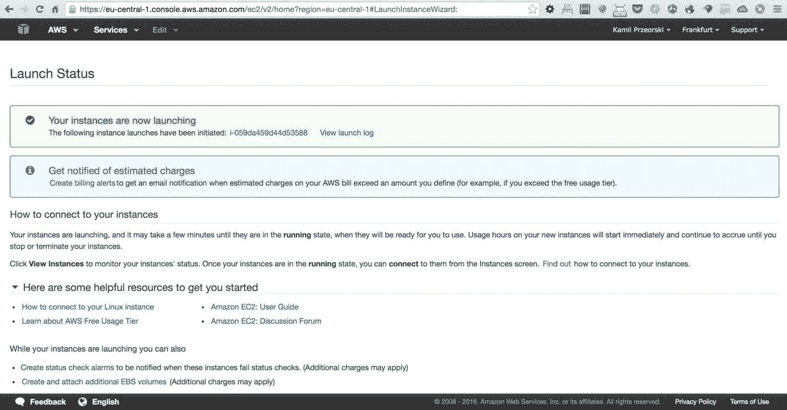

从此屏幕，您可以直接转到 EC2 启动日志（点击查看启动日志链接），这样您就可以找到您的实例，如下面的截图所示：

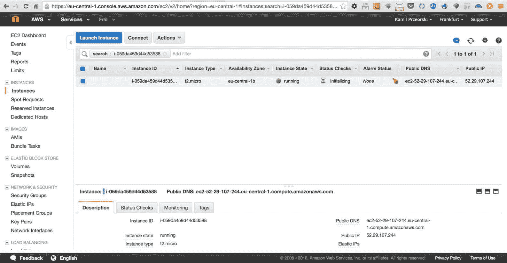

太好了。您的第一个 EC2 已经成功启动！我们需要登录到它，并从那里设置 Docker 容器。

保存您 EC2 实例的公网 IP。在之前的启动日志中，您可以找到我们刚刚创建的机器的公网 IP 为 52.29.107.244。

您的 IP 将不同（当然，这只是一个示例）。将其保存在某处；我们将在稍后使用它，因为您需要它通过 SSH 登录到服务器并安装 Docker 应用程序。

# PuTTy 通过 SSH 访问 - 仅限 Windows 用户

如果您不在 Windows 上工作，您可以跳过本节。

我们将使用 PuTTy，它可以在[`www.chiark.greenend.org.uk/~sgtatham/putty/download.html`](http://www.chiark.greenend.org.uk/~sgtatham/putty/download.html)下载（`putty.exe`、`pageant.exe`和`puttygen.exe`）。

下载 EC2 实例的密钥对，并使用`puttygen.exe`将其转换为`ppk`：

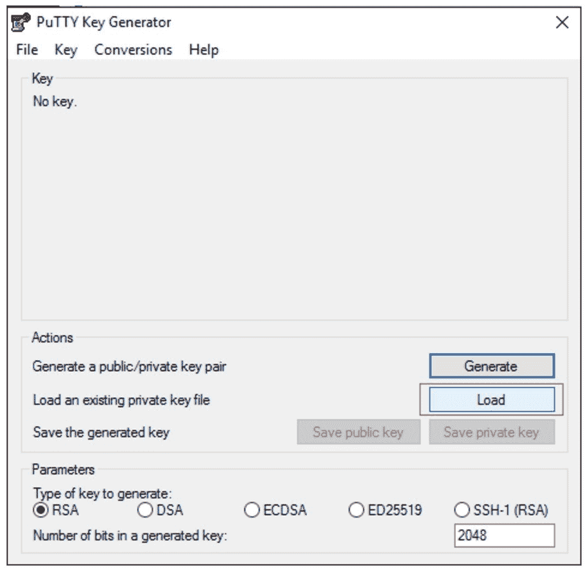

点击“加载”按钮并选择`pubapp-ec2-key-pair.pem`文件，然后将其转换为`ppk`。

然后您需要点击“保存私钥”按钮。您已经完成了；您可以关闭`puttygen.exe`并打开`pageant.exe`。从它，您需要做以下操作：

+   选择“添加密钥”

+   然后检查您的密钥是否已正确添加到 Pageant 密钥列表

如果您的私钥在列表中，您就可以使用`putty.exe`了。

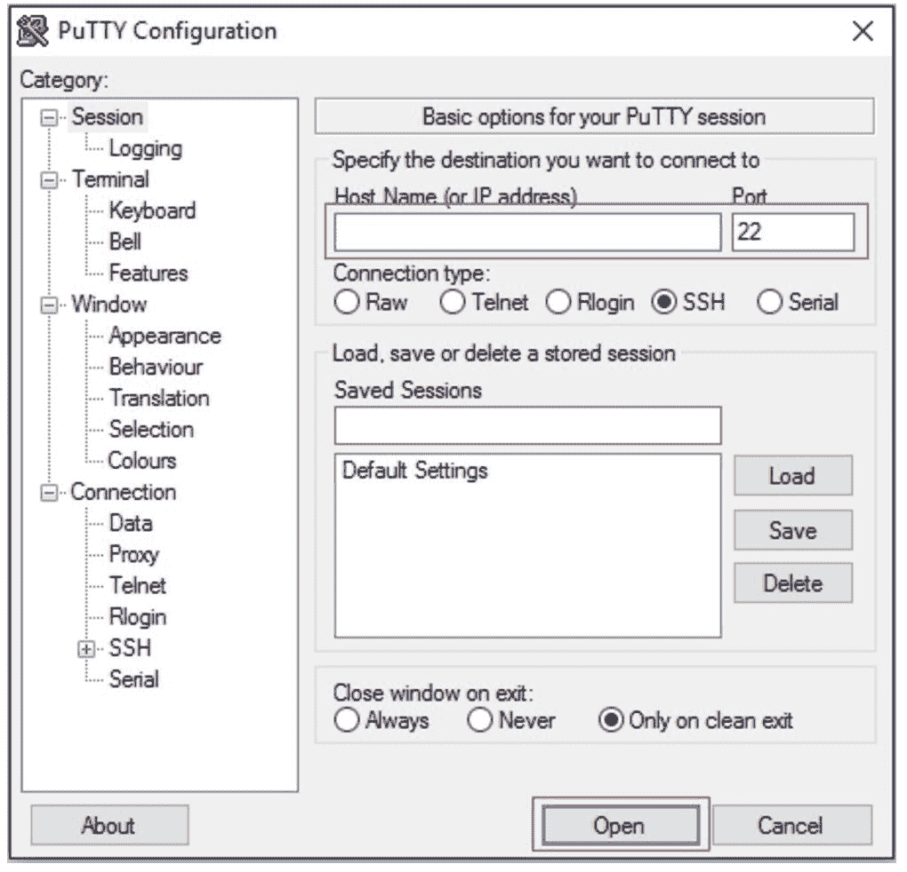

如果您已经打开了 PuTTy 程序，您需要通过 SSH 输入您的 EC2 实例 IP 并点击打开按钮，如前面的截图所示。PuTTy 允许在 Windows 上使用 SSH 连接。

# 通过 SSH 连接到 EC2 实例

在前一章中，在我们启动 EC2 实例后，我们找到了我们的公网 IP（记住您的公网 IP 将不同）：`52.29.107.244`。我们需要使用这个公网 IP 连接到远程 EC2 实例。

我已经将`pubapp-ec2-key-pair.pem`保存在我的`下载`目录中，所以请转到您下载`.pem`文件的目录：

```js
$ cd ~/Downloads/
$ chmod 400 pubapp-ec2-key-pair.pem
$ ssh -i pubapp-ec2-key-pair.pem ec2-user@52.29.107.244

```

在 Windows 的 PuTTy 中，完成此步骤后，界面将与此类似。您需要在 PuTTy 窗口中提供 IP 和端口，以便正确登录到机器。当您收到输入用户名的提示时，请使用`ec2-user`，就像 SSH 示例中那样。

登录成功后，您将能够看到以下内容：

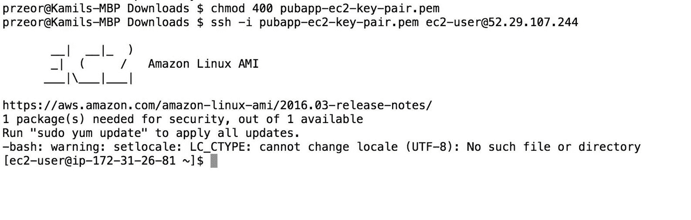

以下说明适用于所有操作系统用户（OS X、Linux 和 Windows），因为我们是通过 SSH 登录到 EC2 实例的。以下命令是必需的：

```js
[ec2-user@ip-172-31-26-81 ~]$ sudo yum update -y
[ec2-user@ip-172-31-26-81 ~]$ sudo yum install -y docker
[ec2-user@ip-172-31-26-81 ~]$ sudo service docker start

```

这些命令将更新`yum`包管理器，并在后台安装和启动 Docker 服务：

```js
[ec2-user@ip-172-31-26-81 ~]$ sudo usermod -a -G docker ec2-user
[ec2-user@ip-172-31-26-81 ~]$ exit

> ssh -i pubapp-ec2-key-pair.pem ec2-user@52.29.107.244
[ec2-user@ip-172-31-26-81 ~]$ docker info

```

在您运行`docker info`命令后，它将显示类似于以下输出的内容：

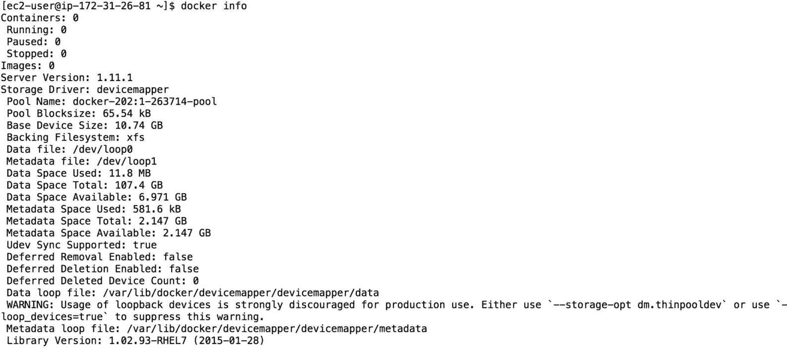

如果你查看前面的截图，你会看到一切正常，我们可以继续使用以下命令运行发布应用的 Docker 容器：

```js
    [ec2-user@ip-172-31-26-81 ~]$ docker run -d PORT=80 -e AWS_ACCESS_KEY_ID='AKIMOCKED5JM4VUHA' -e AWS_SECRET_ACCESS_KEY='k3JxMOCKED0oRI5w3ZEmENE1I0l' -e AWS_BUCKET_NAME='publishing-app' -e AWS_REGION_NAME='eu-central-1' -e MONGO_USER='usermlab' -e MONGO_PASS='MOCKEDpassword' -e MONGO_PORT=25732 -e MONGO_ENV='publishingapp' -e MONGO_HOSTNAME='ds025761.mlab.com' -p 80:80 przeor/pub-app-docker npm start

```

确保你已经提供了正确的`AWS_REGION_NAME`。我的设置为`eu-central-1`，但你的可能不同。

正如你所见，从`server/.env`文件中的所有内容都已经移动到了 Bash 终端中的`docker run`命令中：

```js
AWS_ACCESS_KEY_ID=<<___AWS_ACCESS_KEY_ID__>>
AWS_SECRET_ACCESS_KEY=<<___AWS_SECRET_ACCESS_KEY__>>
AWS_BUCKET_NAME=publishing-app
AWS_REGION_NAME=eu-central-1
MONGO_USER=<<___your_mlab_mongo_user__>>
MONGO_PASS=<<___your_mlab_mongo_pass__>>
MONGO_PORT=<<___your_mlab_mongo_port__>>
MONGO_ENV=publishingapp
MONGO_HOSTNAME=<<___your_mlab_mongo_hostname__>>
PORT=80

```

同时，如果你有不同的设置，请确保重命名`AWS_BUCKET_NAME`、`AWS_REGION_NAME`或`MONGO_ENV`（如果你设置得与上一章中建议的不同）。

然后，为了检查一切是否顺利进行，你也可以使用以下命令：

```js
[ec2-user@ip-172-31-26-81 ~]$ docker ps

```

这个命令将显示 Docker 进程是否作为分离容器在后台正确运行。在 10-30 秒后，当`npm start`运行整个项目时，你可以用以下命令进行测试：

```js
[ec2-user@ip-172-31-26-81 ~]$ curl http://localhost

```

在应用程序正确引导之后，你可以看到类似以下输出：

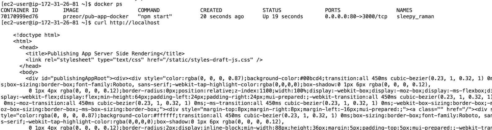

在你访问 EC2 实例的公网 IP（在我们的例子中，它是`52.29.107.244`）之后，你将能够找到我们已在线设置的发布应用。以下是一个截图：

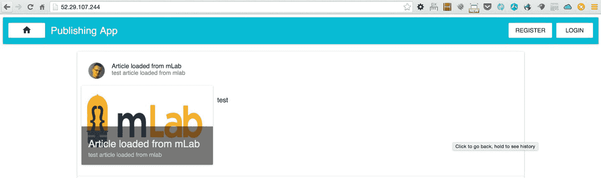

如果你看到我们的发布应用在公网 IP 下，那么你就已经成功地在 Amazon AWS EC2 上部署了一个 Docker 容器！

我们刚才经历的过程非常低效且手动，但它确切地展示了当我们开始使用 ECS 时幕后发生了什么。

我们在当前的方法中缺少以下内容：

+   与其他 Amazon 服务的集成，例如负载均衡、监控、警报、故障恢复和 route 53。

+   自动化，因为我们目前无法高效地快速部署 10 个 Docker 容器。如果你想要为不同的服务部署不同的 Docker 容器，这也同样重要，例如，你可以为前端、后端甚至数据库（在我们的案例中，我们使用 mLab，因此这里不需要）分别设置容器。

你刚刚学习了 Amazon Web Services 的基础知识。

# ECS 的基础 - AWS EC2

EC2 容器服务可以帮助你创建一个 Docker 容器实例的集群（在多个 EC2 实例上运行相同容器的多个副本）。每个容器都会自动部署--这意味着你不需要通过 SSH 登录到任何 EC2 实例，就像我们在上一章中做的那样（手动方法）。整个工作都由 AWS 和 Docker 软件完成，你将在未来学习如何使用它们（一种更自动化的方法）。

例如，您设置想要拥有五个不同的 EC2 实例——在公开端口 80 上的 EC2 实例组，这样您就能在`http://[[EC2_PUBLIC_IP]]`地址下找到发布的应用程序。此外，我们在所有 EC2 实例和外部世界之间添加了一个负载均衡器，以便在流量激增或任何 EC2 实例出现故障的情况下，负载均衡器将用新的实例替换故障的 EC2 实例，或根据流量调整 EC2 实例的数量。

AWS 负载均衡器的一个出色功能是它会用端口 80 对每个 EC2 实例进行 ping 操作，如果被 ping 的实例没有以正确的代码（200）响应，那么它将终止故障实例并启动一个全新的带有我们发布应用镜像的 Docker 容器。这有助于我们保持应用的持续可用性。

此外，我们将使用 Amazon Route 53 来拥有一个高度可用和可扩展的云**域名系统**（**DNS**）网络服务，这样我们就能设置一个顶级域名；在我们的案例中，我将使用我为这本书专门购买的域名：`http://reactjs.space`。

当然，那将是我们的 HTTP 地址。如果您构建不同的服务，您需要购买自己的域名，以便遵循说明并了解 Amazon Route 53 的工作原理。

# 使用 ECS

在我们开始使用 ECS 之前，让我们了解一些基本术语：

+   **集群**：这是我们流程的主要部分，它将底层资源（EC2 实例和任何附加存储）池化。它将许多 EC2 实例聚合成一个容器化应用程序，旨在可扩展。

+   **任务定义**：此任务确定您将在每个 EC2 实例上运行哪些 Docker 容器（即`docker run`命令），它还帮助您定义更高级的选项，例如您想要传递到容器中的环境变量。

+   **服务**：这是集群和任务定义之间的一种粘合剂。服务处理我们集群中正在运行的任务的登录。这还包括您想要运行的任务（容器及其设置的组合）的版本管理。每次您更改任务中的任何设置时，都会创建您任务的新版本。在服务中，您指定任务及其版本，您希望在您的 ECS EC2 实例上运行。

访问 AWS 控制台并找到 ECS。点击链接进入 EC2 容器服务控制台。在那里，您将找到一个名为“开始”的蓝色按钮：

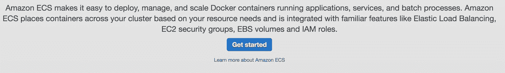

之后，您将看到一个包含以下步骤的 ECS 向导：

1.  创建一个任务定义。

1.  配置服务。

1.  配置集群。

1.  审查。

# 第 1 步 - 创建任务定义

在 ECS 中，任务定义是一个容器的配方。这是帮助 ECS 理解你希望在 EC2 实例上运行的 Docker 容器的东西。这是一个 ECS 自动执行以成功部署我们的发布应用容器的步骤配方或蓝图。

本步骤的详细信息如下所示：

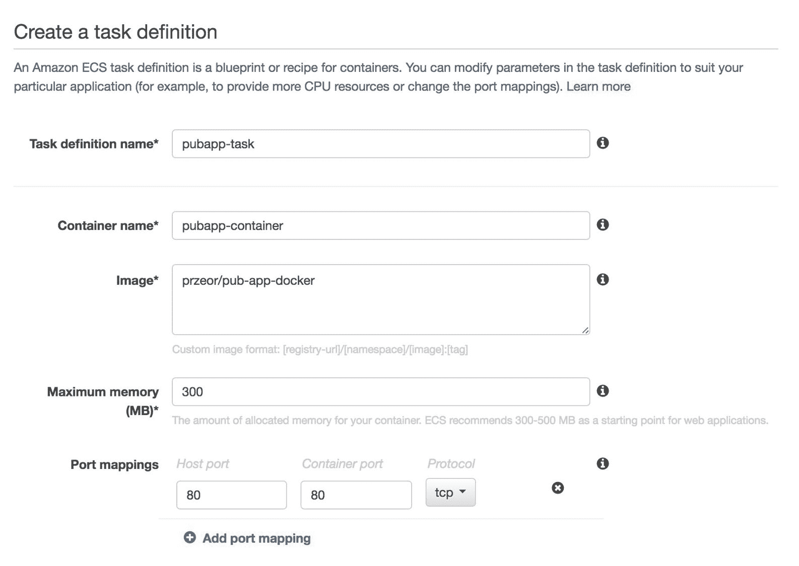

在前面的屏幕截图中，你可以看到我们的任务定义名称是`pubapp-task`，容器名称是`pubapp-container`。

对于镜像，我们使用与本地运行容器时相同的参数`docker run`。在`przeor/pub-app-docker`的情况下，ECS 将知道它必须从[`hub.docker.com/r/przeor/pub-app-docker/`](https://hub.docker.com/r/przeor/pub-app-docker/)下载容器。

目前，让我们将最大内存保持为默认值（`300`）。将端口映射设置为`80`。

在撰写本书时，如果你的容器没有暴露端口`80`，可能会出现一些问题。这可能是 ECS 向导的 bug；没有向导，容器上可以使用任何端口。

在任务定义视图中点击“高级选项”：


你将看到一个带有附加选项的幻灯片面板：

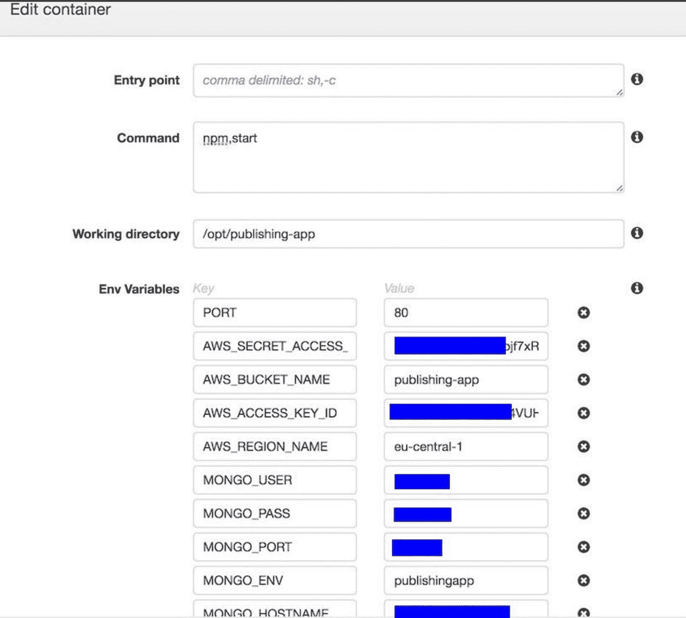

我们需要指定以下事项：

+   **命令**：这个命令必须用逗号分隔，所以我们使用`npm,start`。

+   **工作目录**：我们使用`/opt/publishing-app`（在 Dockerfile 中设置了相同的路径）。

+   **环境变量**：在这里，我们指定`server/.env`文件中的所有值。这部分设置很重要；如果没有通过环境变量提供正确的详细信息，应用程序将无法正确运行。

+   **其余的值/输入**：保持默认值不变。

添加所有环境变量非常重要。我们需要非常小心，因为在这里很容易犯错误，这可能会破坏 EC2 实例内的应用程序。

在进行所有这些更改后，你可以点击“下一步”按钮。

# 第 2 步 - 配置服务

通常，服务是一种机制，它保持一定数量的 EC2 实例运行，同时检查它们的健康状态（使用**弹性负载均衡器**（**ELB**））。ELB 自动将传入的应用程序流量分配到多个 Amazon EC2 实例。如果服务器在端口 80（默认值，但可以更改为更高级的健康检查）上没有响应，那么服务将运行新的服务，同时关闭不健康的那个。这有助于你保持应用程序非常高的可用性。

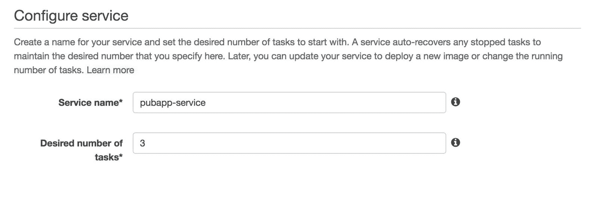

服务名称是`pubapp-service`。在这本书中，我们将设置三个不同的 EC2 实例（你可以设置更少或更多；这取决于你），所以这是“所需任务数”输入的数字。

在相同的步骤中，我们还需要设置**弹性负载均衡器**（**ELB**）：

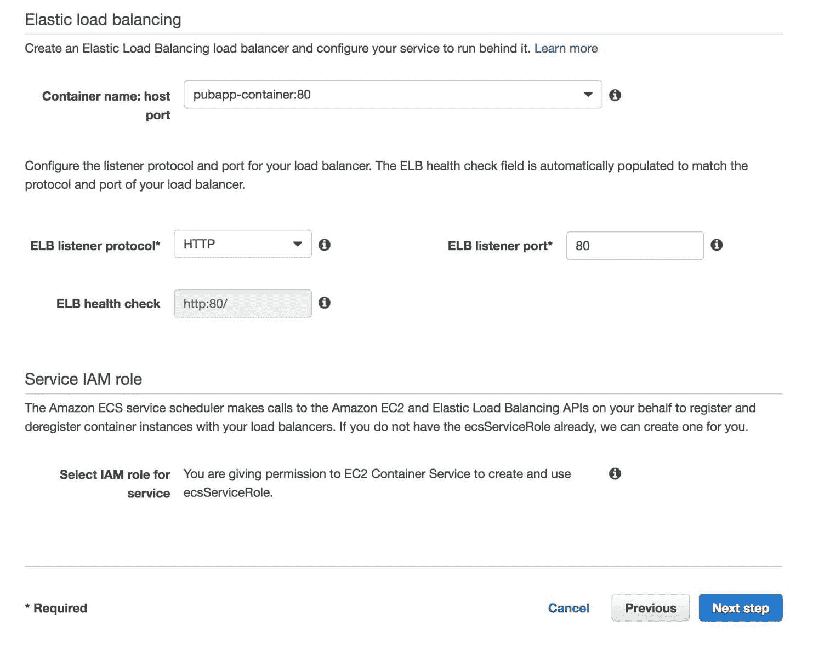

+   容器名称：主机端口：从下拉列表中选择`pubapp-container:80`

+   ELB 监听器协议：HTTP

+   ELB 监听端口*：`80`

+   ELB 健康检查：保持默认；你可以在退出向导时更改它（在特定 ELB 的页面上）

+   服务 IAM 角色：向导将为我们创建此角色

在完成所有这些后，你可以点击“下一步”按钮继续：


# 第 3 步 - 配置集群

现在，你需要设置 ECS 容器代理的详细信息，也就是集群。在这里，你指定集群的名称、你希望使用的实例类型、实例数量（必须大于服务所需数量），以及密钥对。

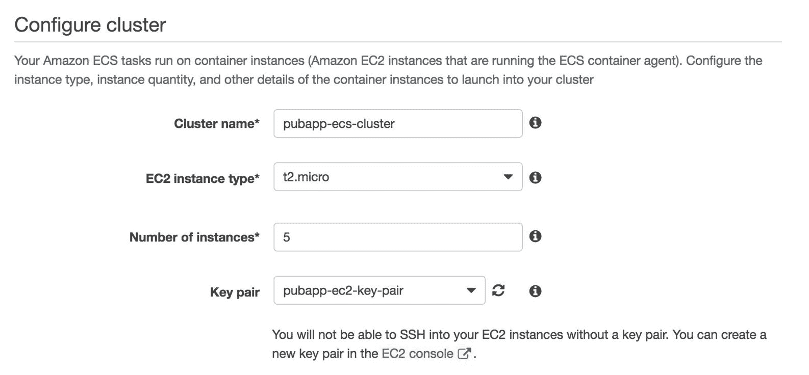

+   集群名称：我们的集群名称是`pubapp-ecs-cluster`。

+   EC2 实例类型：`t2.micro`（在生产环境中，请使用更大的实例）。

+   实例数量：五个，这意味着服务将保持三个实例运行，另外两个实例将在备用状态，等待任何致命情况。备用状态意味着（在我们的设置中），我们一次只会使用三个实例，而另外两个准备就绪，但未被积极使用（流量不会被重定向到它们）。

+   密钥对：我在本章前面指定了名为`pubapp-ec2-key-pair`的密钥对。始终将它们保存在安全的地方以备后用。

在同一页面上，你还会找到安全组和容器实例 IAM 角色的设置，但我们会保持默认设置：

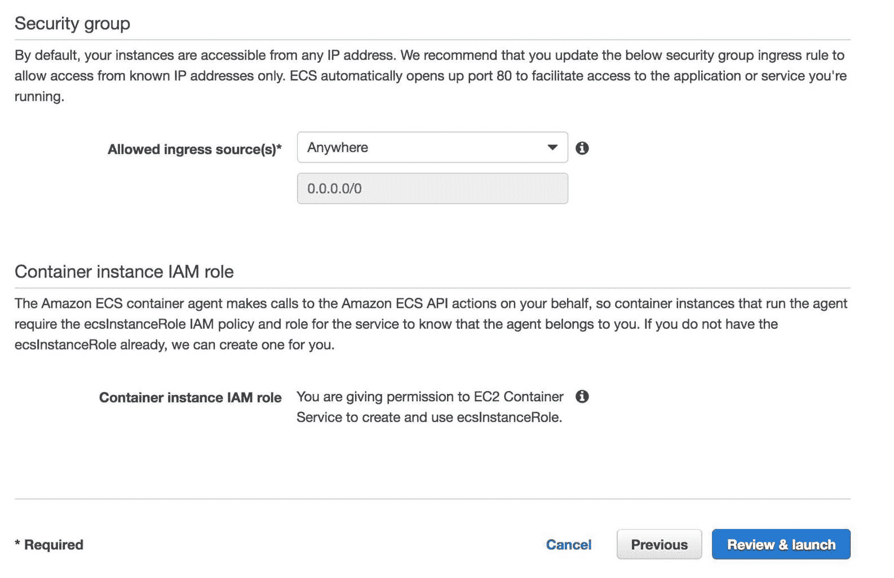

# 第 4 步 - 审查

最后，检查一切是否正常：

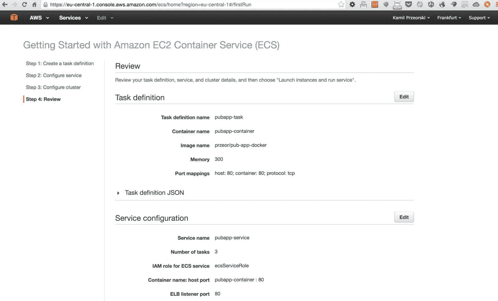

然后，选择“启动实例并运行服务”：


# 启动状态

点击“启动”按钮后，你会看到一个显示状态的页面。保持打开状态，直到所有框都显示成功指示器为绿色：

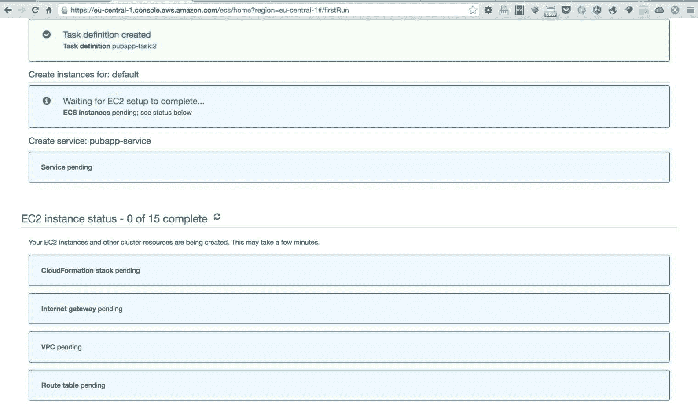

这是所有设置完成后运行的样子：

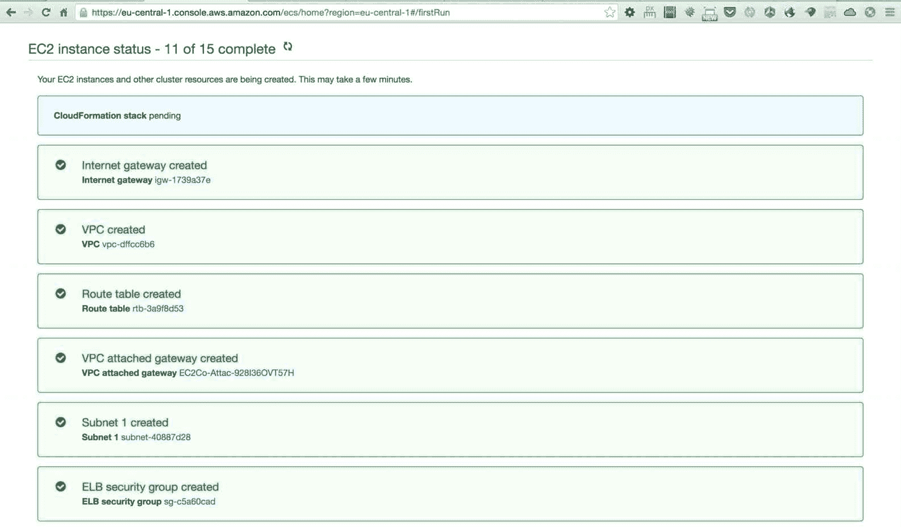

所有框都显示成功指示器后，你将能够点击顶部的“查看服务”按钮：

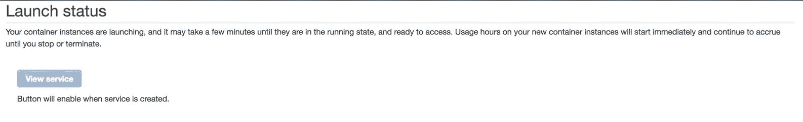

在它可用后，点击该按钮（查看服务）。

# 查找你的负载均衡器地址

点击“查看服务”按钮后，你会看到主仪表板，其中列出了所有你的集群（目前只有一个）：

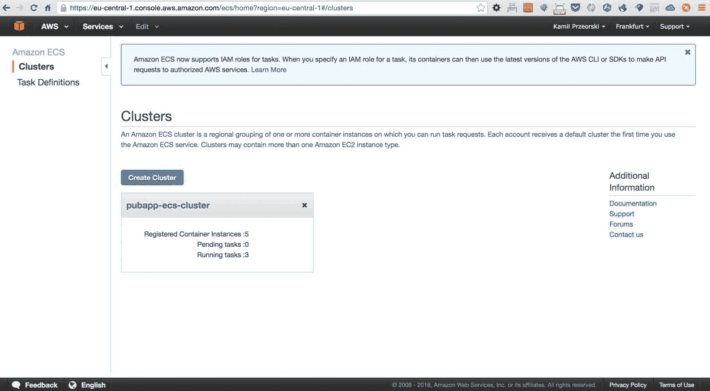

点击 pubapp-ecs-cluster，你会看到以下内容：

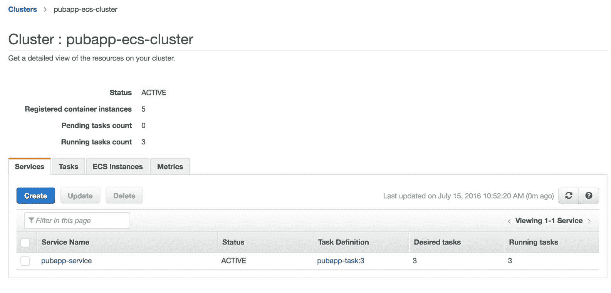

在前面的屏幕上，从列表中选择 pubapp-service：

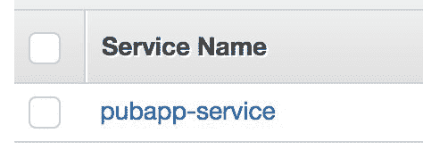

然后，你会看到以下内容：


在此页面上，选择弹性负载均衡器：

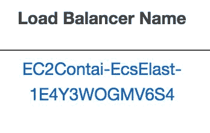

ELB 的最终视图如下：

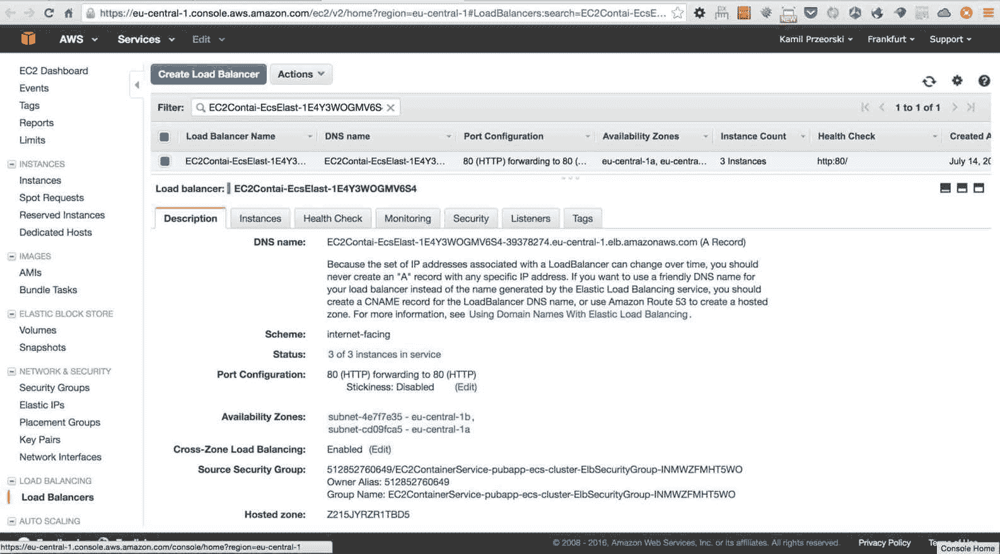

在前面的视图中，你将在“描述名称”选项卡下找到一个类似这样的弹性负载均衡器地址：

```js
    DNS name: 
EC2Contai-EcsElast-1E4Y3WOGMV6S4-39378274.eu-central-
    1.elb.amazonaws.com (A Record)

```

如果你尝试打开地址但无法工作，请给它更多时间。EC2 实例可能正在运行我们的 Docker 发布应用容器。在 ECS 集群的初始运行期间，我们必须保持耐心。

这是你的 ELB 地址，你可以将其放入浏览器中查看发布应用：

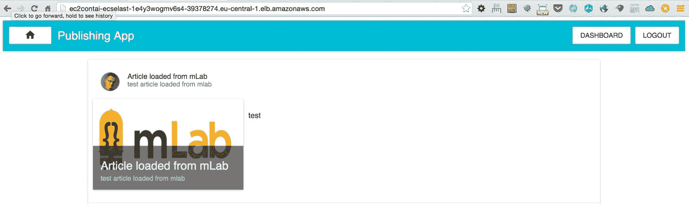

# AWS Route 53

本章的最后一步是设置 Route 53，这是一个高度可用和可扩展的云 DNS 网络服务。

对于这一步，您有两个选择：

+   已经注册了自己的域名

+   通过 Route 53 注册新域名

在以下过程中，我们将使用第一个选项，因此我们假设我们已经注册了`reactjs.space`域名（当然，您需要拥有自己的域名才能成功执行这些步骤）。

我们将通过将名称`http://reactjs.space`转换为我们的 ELB（`EC2Contai-EcsElast-1E4Y3WOGMV6S4-39378274.eu-central-1.elb.amazonaws.com`）的地址来路由最终用户，这样用户就可以通过在浏览器的地址栏中输入`reactjs.space`来以更用户友好的方式访问我们的应用程序。

从 AWS 服务列表中选择 Route 53：

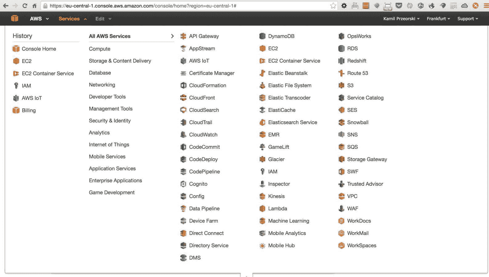

您将能够看到一个如下所示的主页：

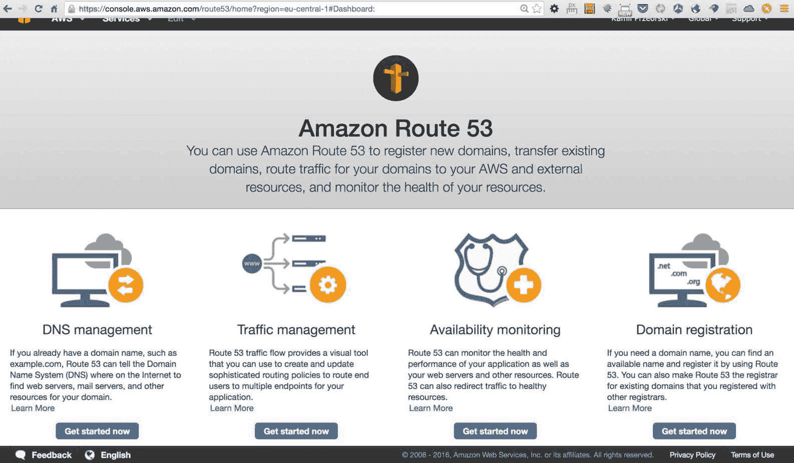

下一步是在 Route 53 上创建一个托管区域，因此请点击名为“创建托管区域”的蓝色按钮：

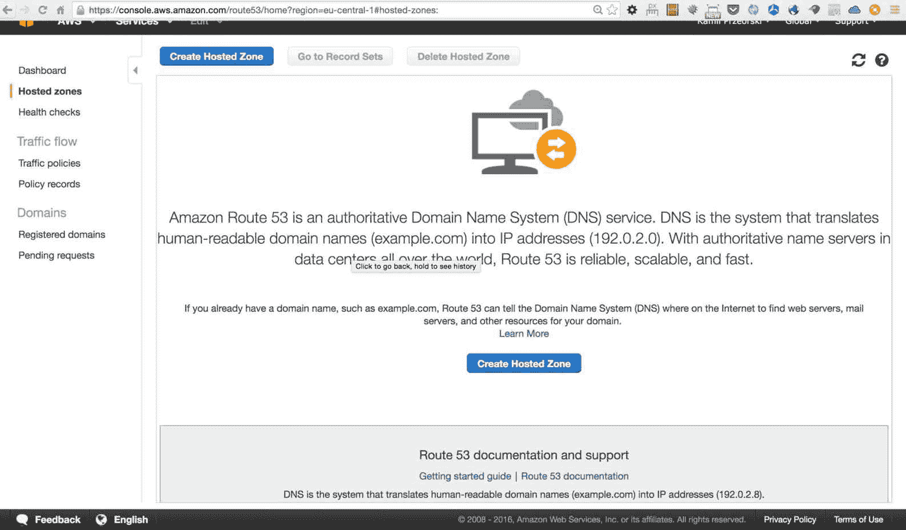

在此之后，您将看不到任何托管区域，因此请再次点击蓝色按钮：

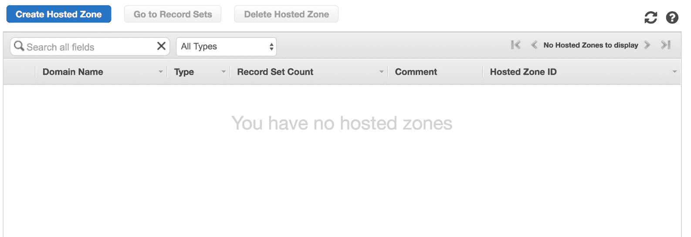

表单将有一个域名字段，您可以在其中输入您的域名（在我们的情况下，它是`reactjs.space`）：

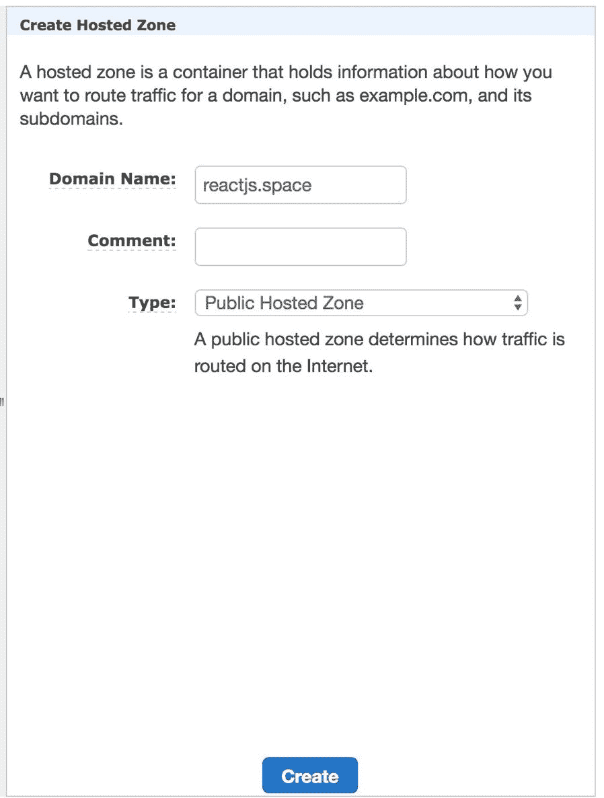

成功！现在您将能够看到您的 DNS 名称：

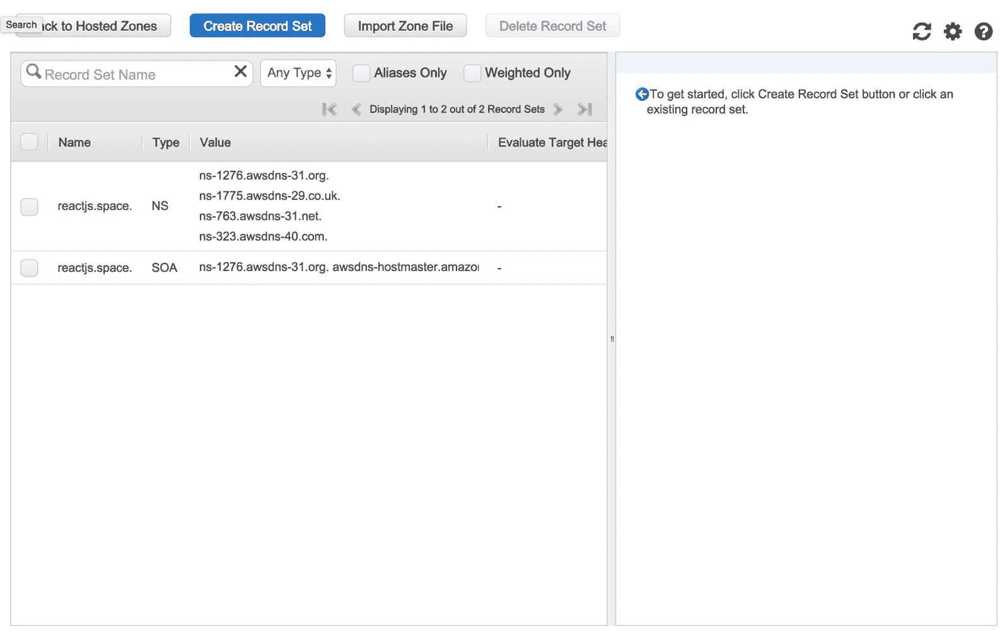

下一步是将 DNS 记录停放在您域名的提供商上。最后一步是在您的域名注册商处更改 DNS 设置；在我的情况下，如下所示（您的将不同）：

```js
ns-1276.awsdns-31.org.
ns-1775.awsdns-29.co.uk.
ns-763.awsdns-31.net.
ns-323.awsdns-40.com.

```

注意最后的`.`（点）；您可以去掉它们，这样我们最终要更改的 DNS 如下所示：

```js
ns-1276.awsdns-31.org
ns-1775.awsdns-29.co.uk
ns-763.awsdns-31.net
ns-323.awsdns-40.com

```

在完成所有这些步骤之后，您可以访问`http://reactjs.space`网站（DNS 更改可能需要长达 48 小时）。

最后一件事情是创建一个指向我们的弹性负载均衡器的`reactjs.space`域名的别名。点击以下按钮：


然后，您将看到以下视图：

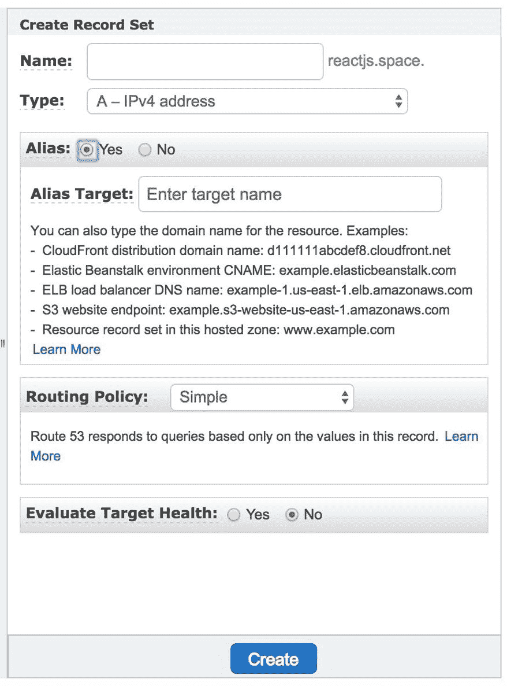

从别名单选按钮中选择“是”，然后从列表中选择 ELB，如下例所示：

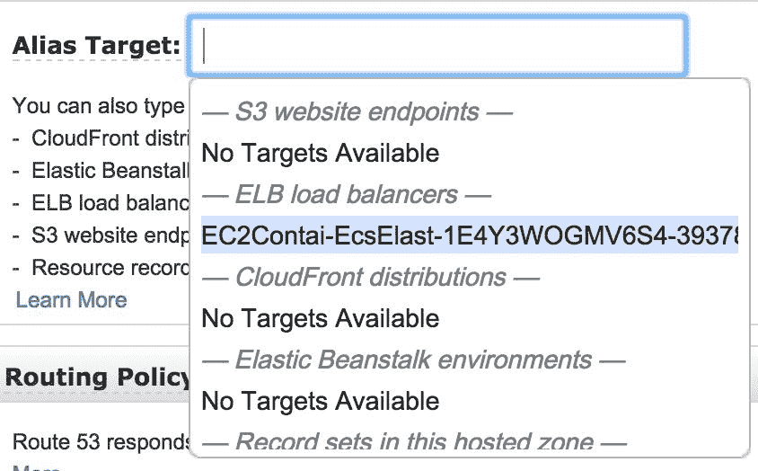

目前，在 DNS 更改完成后（可能需要长达 48 小时），一切都将正常工作。为了提高我们应用程序的体验，让我们也创建一个从`www.reactjs.space`到`reactjs.space`的别名，这样如果有人在域名名前输入`www.`，它将按预期工作。

再次点击名为“创建记录集”的按钮，选择一个别名，并输入`www`，之后您将能够选择`www.reactjs.space`域名。这样做并点击创建按钮：

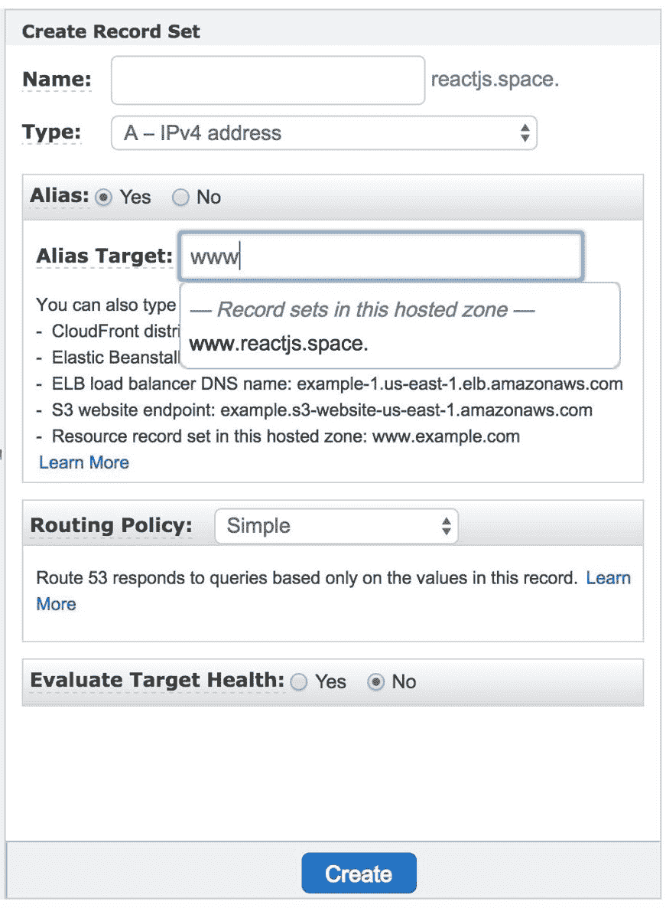

# 摘要

我们完成了所有的 AWS/Docker 设置。在 DNS 更改成功后，您将能够在`http://reactjs.space`地址下找到我们的应用程序：

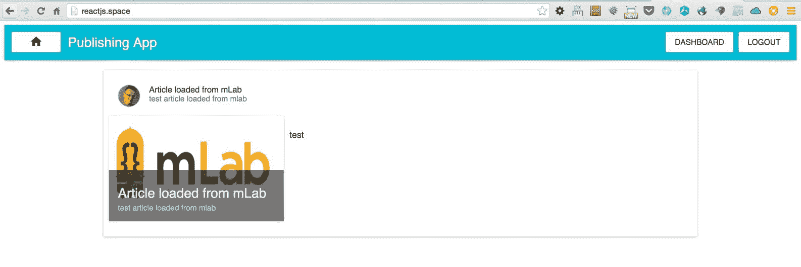

下一章将讨论持续集成的基础知识，并帮助你完成应用在达到 100%生产就绪前的剩余工作（目前尚未进行代码压缩）。

让我们在下一章中继续，对书中将要涵盖的剩余主题进行更详细的描述。
