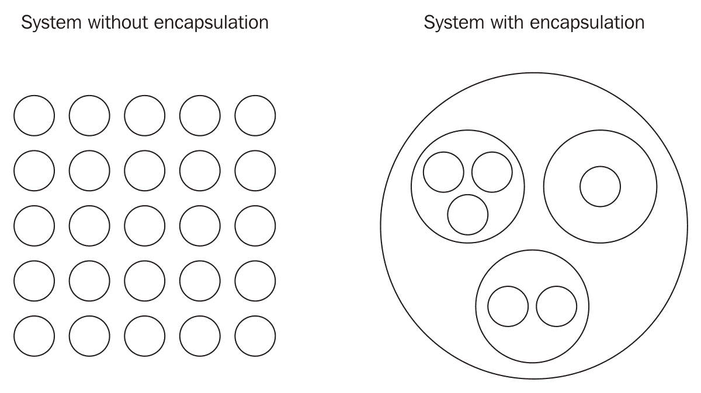
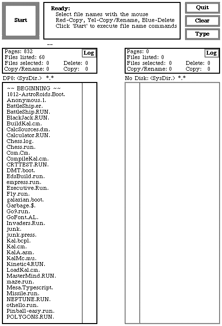
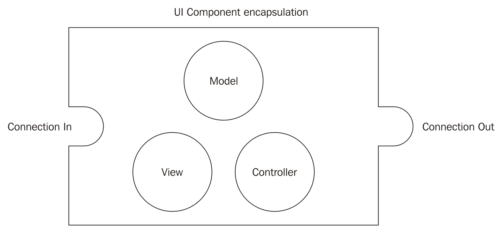
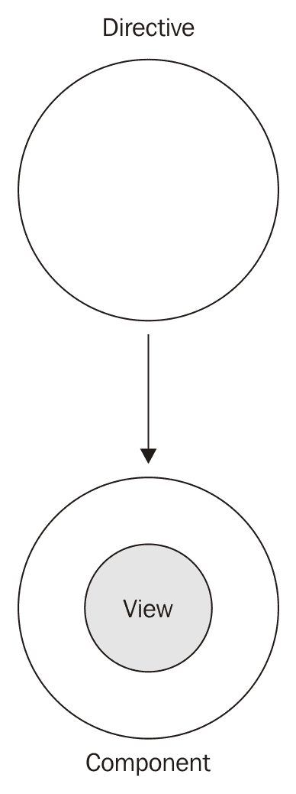
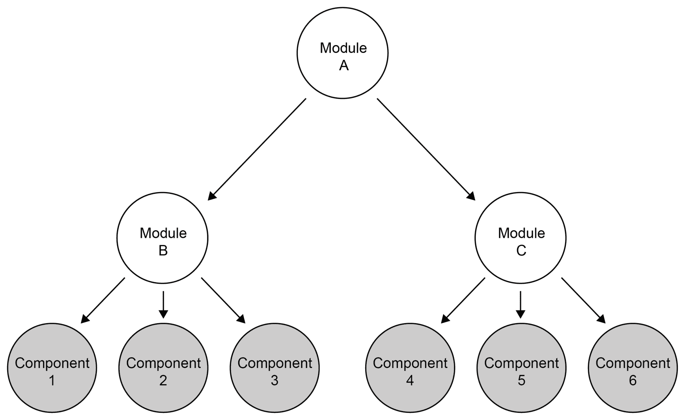
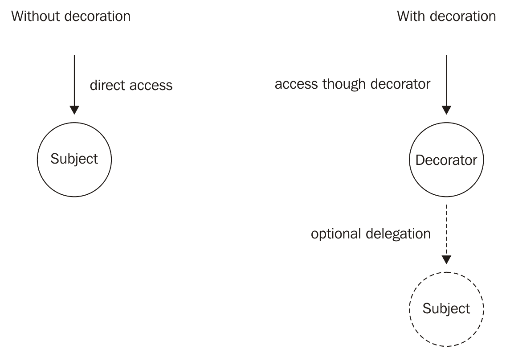

# 基于组件的用户界面

虽然本书将涵盖许多与 Angular 相关的主题，但重点将主要放在创建基于组件的用户界面。理解像 Angular 这样的框架是一回事，但使用基于组件的架构建立有效的流程则是另一回事。在本书中，我将尝试解释 Angular 组件背后的核心概念以及我们如何利用这种架构来创建现代、高效和可维护的用户界面。

除了学习 Angular 背后的所有必要概念外，我们还将一起从头创建一个任务管理应用程序。这将使我们能够探索使用 Angular 提供的组件系统解决常见 UI 问题的方法。

在本章中，我们将探讨基于组件的用户界面如何帮助我们构建更强大的应用程序。在本书的整个过程中，我们将一起构建一个 Angular 应用程序，我们将充分利用基于组件的方法。本章还将介绍本书中使用的各种技术。

本章我们将涵盖以下主题：

+   基于组件的用户界面简介

+   使用基于组件的用户界面进行封装和组合

+   UI 框架的演变

+   标准的 Web 组件

+   Angular 组件系统的简介

+   编写你的第一个 Angular 组件

+   `NgModule` 的基础知识

+   ECMAScript 和 TypeScript 的概述及历史

+   ECMAScript 7 装饰器作为元注释

+   使用 Angular CLI 的基于 Node.js 的工具简介

# 以组件思维

今天的用户界面不仅仅是一堆拼凑到屏幕上的表单元素。现代用户在体验设计创新视觉展示的交互式内容时，对技术的挑战比以往任何时候都要大。

可惜，当我们为网络应用程序构思概念时，我们几乎总是倾向于以页面为单位思考，比如印刷书籍中的页面。思考一本书，这可能是传达此类内容和中介信息最有效的方式。你可以逐页浏览，无需任何真正的体力劳动，逐段阅读，只需扫描那些你不感兴趣的部分即可。

过度思考页面的问题在于，这个从书籍中借用的概念并没有很好地转化为现实世界中事物的工作方式。世界是由形成组件系统的组件构成的。

以我们的身体为例。我们主要由相互通过电和化学信号交互的独立器官组成。器官本身由蛋白质组成，这些蛋白质本身就像机器一样工作，形成一个系统。从分子、原子、质子到夸克，我们实际上无法确定哪里开始哪里结束。我们可以肯定的是，这全部都是关于具有相互依赖性的组件系统，而不是关于页面。

现代用户界面非常类似于现实世界中的组件系统。在设计时，它们在哪里、如何分布到页面上是次要的。此外，它们应该能够独立工作，并且应该在相互依赖的水平上相互交互。

# 组件——用户界面的器官

“我们不是在设计页面，我们是在设计组件系统。”

- 斯蒂芬·海

这句话来自斯蒂芬·海在 2012 年奥兰多的 BDConf 上的发言，它点明了关键。界面设计实际上并不是关于页面。为了创建既高效又便于维护的用户界面，不仅是为了用户，也是为了维护它们的开发者，我们需要从组件系统的角度思考。组件是独立的，但当它们组合在一起时，可以相互交互并形成更大的组件。我们需要从整体上看待用户界面，而使用组件使我们能够做到这一点。

在接下来的主题中，我们将探讨组件的一些基本方面。其中一些已经从其他概念中得知，例如**面向对象编程**（**OOP**），但在考虑组件时它们呈现出不同的光景。

# 封装

封装是在考虑系统维护时一个非常重要的因素。拥有经典的 OOP 背景，我了解到封装意味着将逻辑和数据捆绑到一个隔离的容器中。这样，我们可以从外部操作容器，并把它当作一个封闭系统来对待。

在可维护性和可访问性方面，这种方法有许多积极方面。处理封闭系统对于我们的代码组织很重要。然而，这甚至更重要，因为我们可以在编写代码的同时组织自己：



以封装的组件组织系统使我们能够更容易地对其进行分析

我的记忆力相当差，因此在编写代码时找到合适的专注程度对我来说非常重要。即时记忆研究告诉我们，人类大脑平均一次可以记住大约七个项目。因此，我们编写代码的方式必须允许我们一次专注于更少、更小的部分。

清晰的封装帮助我们组织代码。我们可能忘记封闭系统的所有内部细节以及我们放入其中的逻辑和数据类型。我们应该只关注其表面，这使我们能够在更高的抽象级别上工作。类似于之前的图示，如果不使用封装组件的层次结构，我们的所有代码都会在同一级别上拼凑在一起。

封装鼓励我们将小型且简洁的组件隔离出来，构建一个组件系统。在开发过程中，我们可以专注于一个组件的内部，只需处理其他组件的接口。

有时候，我们会忘记我们实际进行的所有编码组织都是为了我们自己，而不是运行此代码的计算机。如果是为了计算机，那么我们可能都会重新开始用机器语言编写。强大的封装帮助我们轻松访问特定代码，专注于代码的一层，并信任胶囊中的底层实现。

下面的 TypeScript 示例展示了如何使用封装来编写可维护的应用程序。让我们假设我们在一个 T 恤工厂，我们需要一些代码来生成具有背景和前景颜色的 T 恤。此示例使用了一些 TypeScript 的语言特性。如果您不熟悉 TypeScript 的语言特性，请不要过于担心这一点。我们将在本章的后面学习这些内容：

```js
// This class implements data and logic to represent a color 
// which establishes clean encapsulation. 
class Color { 
  constructor(private red: number, private green: number, private blue: number) {} 

  // Using this function we can convert the internal color values 
  // to a hex color string like #ff0000 (red). 
  getHex(): string { 
    return '#' + Color.getHexValue(this.red) + Color.getHexValue(this.green) + 
      Color.getHexValue(this.blue); 
  } 

  // Static function on Color class to convert a number from 
  // 0 to 255 to a hexadecimal representation 00 to ff 
  static getHexValue(number): string { 
    const hex = number.toString(16); 
    return hex.length === 2 ? hex : '0' + hex; 
  } 
} 

// Our TShirt class expects two colors to be passed during 
// construction that will be used to render some HTML 
class TShirt { 
  constructor(private backgroundColor: Color, private foregroundColor: Color) {} 

  // Function that returns some markup which represents our T-Shirts 
  getHtml(): string { 
    return ` 
      <t-shirt style="background-color: ${this.backgroundColor.getHex()}"> 
        <t-shirt-text style="color: ${this.foregroundColor.getHex()}"> 
          Awesome Shirt! 
        </t-shirt-text> 
      </t-shirt> 
    `; 
  } 
} 

// Instantiate a blue colour 
const blue: Color = new Color(0, 0, 255); 
// Instantiate a red color 
const red: Color = new Color(255, 0, 0); 
// Create a new shirt using the above colours 
const awesomeShirt: TShirt = new TShirt(blue, red); 
// Adding the generated markup of our shirt to our document 
document.body.innerHTML = awesomeShirt.getHtml(); 
```

使用干净的封装，我们现在可以处理 T 恤上的颜色抽象。我们不需要担心如何计算 T 恤级别的颜色十六进制表示，因为`Color`类已经完成了这项工作。这使得应用程序易于维护，并且非常开放，便于更改。

如果您还没有这样做，我强烈建议您阅读有关 SOLID 原则的内容。正如其名称所暗示的，这个原则的集合是一个强大的工具，可以极大地改变您组织代码的方式。您可以在罗伯特·C·马丁的《敏捷原则、模式和实践》一书中了解更多关于 SOLID 原则的内容。

# 组合性

组合是一种特殊的可重用性。你不是扩展现有组件，而是通过将许多较小的组件组合在一起形成一个组件系统来创建一个新的、更大的组件。

在面向对象编程语言中，组合通常用于解决大多数面向对象编程语言都存在的多重继承问题。子类多态性总是很好的，直到你达到你的设计不再符合项目最新要求的地步。让我们看看一个简单的例子，说明这个问题。

你有一个`Fisher`类和一个`Developer`类，它们都持有特定的行为。现在，你想要创建一个继承自`Fisher`和`Developer`的`FishingDeveloper`类。除非你使用支持多重继承的语言（例如 C++，它在一定程度上这样做），否则你将无法使用继承重用这个功能。没有办法告诉语言你的新类应该从两个超类继承。使用组合，你可以轻松解决这个问题。你不需要使用继承，而是组合一个新的`FishingDeveloper`类，将所有行为委托给内部的`Developer`和`Fisher`实例：

```js
interface IDeveloper {
  code(): void;
}

interface IFisher {
  fish(): void;
}

class Developer implements IDeveloper { 
 constructor(private name: string) {}

 code(): void { 
   console.log(`${this.name} writes some code!`); 
 } 
} 

class Fisher implements IFisher {
 constructor(private name: string) {}

 fish(): void { 
   console.log(`${this.name} catches a big fish!`); 
 } 
} 

class FishingDeveloper implements IFisher, IDeveloper { 
 constructor(private name: string) { 
   this.name = name; 
   this.developerStuff = new Developer(name); 
   this.fisherStuff = new Fisher(name); 
 } 

 code(): void { 
   this.developerStuff.code(); 
 } 

 fish(): void { 
   this.fisherStuff.fish(); 
 } 
} 

var bob: FishingDeveloper = new FishingDeveloper('Bob'); 
bob.code(); 
bob.fish(); 
```

经验告诉我们，组合可能是重用代码最有效的方式。与继承、装饰和其他提高可重用性的方法相比，组合可能是最不侵入性和最灵活的。

一些语言的最新版本也支持一种称为特质的模式，即混合。特质允许你以类似于多重继承的方式重用其他类中的某些功能性和属性。

如果我们思考组合的概念，它不过是设计生物体。我们有两个`Developer`和`Fisher`生物体，并将它们的行为统一到一个单一的`FishingDeveloper`生物体中。

# 组件，自然界发明

组件、拥抱封装和组合是构建可维护应用的有效方式。由组件组成的应用对变化的负面影响具有很强的抵抗力，而变化是每个应用都会发生的事情。你的设计最终将受到变化效应的挑战，这只是时间问题；因此，编写尽可能平滑地处理变化的代码非常重要。

自然是最好的老师。几乎所有技术发展的成就都源于对自然界解决问题方式的观察。如果我们看看进化，它就是通过适应外部力量和约束对物质进行持续重新设计。自然界通过突变和自然选择来通过不断变化解决这个问题。

如果我们将进化的概念投射到应用开发中，我们可以说自然界实际上在每一刻都在重构其代码。这实际上是每个产品经理的梦想——一个可以经历持续变化但不会失去任何效率的应用。

我认为有两个关键概念在自然界中起着重要作用，使得它能够在设计中不断变化而不会失去太多效率。这使用了封装和组合。回到我们身体的例子，我们实际上可以告诉我们的器官使用了一种非常清晰的封装。它们使用膜来创建隔离，使用静脉来输送营养，使用突触来发送信息。此外，它们有相互依赖性，并且通过电化学信息进行交流。最明显的是，它们形成了更大的系统，这是组合的核心概念。

当然，还有许多其他因素，我并不是生物学的教授。然而，我认为看到我们学会了以与自然界组织物质相似的方式组织我们的代码，这是一件非常有趣的事情。

创建可重用 UI 组件的想法相当古老，并且在各种语言和框架中得到了实现。可能最早使用 UI 组件的系统是 20 世纪 70 年代的 Xerox Alto 系统。它使用了可重用的 UI 组件，允许开发者通过在用户可以与之交互的屏幕上组合它们来创建应用程序：



20 世纪 70 年代的 Xerox Alto 系统上的文件管理器用户界面

早期的前端 UI 框架，如 DHTMLX、Ext JS 或 jQuery UI，以更有限的方式实现组件，这并没有提供很大的灵活性或可扩展性。这些框架中的大多数只是提供了小部件库。UI 小部件的问题在于它们大多数并没有充分拥抱组合模式。你可以在页面上排列小部件，并且它们提供了封装，但大多数工具包中，你不能通过嵌套来创建更大的组件。一些工具包通过提供一种特殊类型的小部件来解决此问题，这通常被称为容器。然而，这并不等同于允许你创建系统内系统的完整组件树。实际上，容器是为了提供视觉布局容器而不是复合容器来形成更大的系统。

通常，当我们在应用程序的页面上处理小部件时，我们会有一个大控制器来控制所有这些小部件、用户输入和状态。然而，我们只剩下两个层次的组合，我们无法以更细粒度的方式结构化我们的代码。这里有页面，这里有小部件。仅仅有一堆 UI 小部件是不够的，我们几乎回到了创建满是表单元素页面的状态。

我已经使用 JavaServer Faces 多年了，尽管它存在许多问题，但拥有可重用自定义元素的概念是革命性的。使用 XHTML，可以编写所谓的复合组件，这些组件由其他复合组件或原生 HTML 元素组成。开发者可以通过组合获得极高的可重用性。在我看来，这个技术的重大问题是它没有足够解决前端的问题，以至于无法真正用于复杂的用户交互。事实上，这样的框架应该完全存在于前端。

# 我的 UI 框架愿望清单

通常，当 UI 框架被比较时，它们会根据指标相互比较，例如小部件计数、主题功能和异步数据检索功能。每个框架都有其优点和缺点，但抛开所有额外功能，将其简化为 UI 框架的核心关注点，我只剩下几个指标想要评估。当然，这些指标并不是今天 UI 开发中唯一重要的指标，但它们也是构建支持变化原则的清晰架构的主要因素：

+   我可以创建具有清晰接口的封装组件

+   我可以通过组合来创建更大的组件

+   我可以让组件在其层次结构内相互交互

如果你正在寻找一个能够让你充分利用基于组件的 UI 开发的框架，你应该寻找这三个关键指标。

首先，我认为了解网络的主要目的及其演变过程非常重要。如果我们回想一下 20 世纪 90 年代的早期网络，它可能只是关于超文本。有一些非常基本的语义可以用来结构化信息并将其显示给用户。HTML 被创建来存储结构和信息。对信息定制视觉呈现的需求导致了 CSS 在 HTML 开始广泛使用后不久的发展。

布兰登·艾奇在 20 世纪 90 年代中期发明了 JavaScript，并且它最初是在 Netscape Navigator 中实现的。通过提供实现行为和状态的方法，JavaScript 成为了实现完整网页定制的最后一块缺失的拼图：

| **技术** | **关注点** |
| --- | --- |
| HTML | 结构和信息 |
| CSS | 布局 |
| JavaScript | 行为和状态 |

我们已经学会了尽可能地将这些关注点分开，以保持清晰的架构。尽管对此有不同的看法，并且一些最近的技术也开始偏离这一原则，但我认为这些关注点的清晰分离对于创建可维护的应用程序非常重要。

把这个视图放在一边，面向对象编程中封装的标准定义只是关注逻辑和数据耦合与隔离。这可能很好地适用于经典软件组件。然而，一旦我们将用户界面视为架构的一部分，就会增加一个新的维度。

经典的 MVC 框架以视图为中心，开发者根据页面组织代码。你可能会继续创建一个新的视图来表示一个页面。当然，你的视图需要一个控制器和模型，所以你也会创建它们。按页面组织的问题在于，几乎没有获得复用性的收益。一旦你创建了一个页面，你只想重用页面的一部分，你需要一种方法来封装这个模型的具体部分——视图和控制器。

UI 组件很好地解决了这个问题。我喜欢把它们看作是 MVC 的模块化方法。尽管它们仍然遵循 MVC 模式，但它们也建立了封装和可组合性。这样，视图本身就是一个组件，但它也由组件组成。通过组合组件的视图，可以最大限度地提高复用性：



UI 组件拥抱 MVC，但它们在更低的层面上也支持封装和组合。

技术上，使用 Web 技术实现组件时存在一些挑战。JavaScript 始终足够灵活，可以实施不同的模式和范式。与封装和组合一起工作根本不是问题，组件的控制部分和模型可以轻松实现。例如，揭示模块模式、命名空间、原型或最近的 ECMAScript 6 模块等方法，都提供了从 JavaScript 方面需要的所有工具。

然而，对于组件的视图部分，我们面临一些限制。尽管 HTML 在可组合性方面提供了很大的灵活性，因为 DOM 树本质上就是一个大型的组合，但我们无法重用这些组合。我们只能创建一个大的组合，即页面本身。HTML 只是从服务器端交付的最终视图，这从来就不是真正的问题。今天的应用程序要求更高，我们需要在浏览器中运行一个完全封装的组件，它还包含部分视图。

我们在 CSS 上也面临着同样的问题。在编写 CSS 时，没有真正的模块化和封装，我们需要使用命名空间和前缀来隔离我们的 CSS 样式。尽管如此，CSS 的整个级联特性很容易破坏我们试图通过 CSS 结构模式引入的任何封装。

# 新标准的时间到了

在过去几年里，Web 标准已经发生了巨大的变化。有如此多的新标准，浏览器已经成为一个如此庞大的多媒体框架，以至于其他平台很难与之竞争。

我甚至可以说，Web 技术实际上将在未来取代其他框架，并且它可能将被重新命名为多媒体技术或类似的东西。我们没有理由需要使用不同的原生框架来创建用户界面和演示。Web 技术集成了许多功能，很难找到不使用它们的理由。只需看看 Firefox OS 或 Chrome OS，它们都是设计用来使用 Web 技术运行的。我认为这只是时间问题，直到更多操作系统和嵌入式设备开始利用 Web 技术来实现它们的软件。这就是为什么我相信在某个时刻，*Web 技术* 这个术语是否仍然合适，或者我们应该用更通用的术语来替代它，将变得可疑。

尽管我们通常只看到浏览器中新功能的出现，但它们背后有一个非常开放且冗长的标准化过程。标准化功能非常重要，但这需要花费大量时间，尤其是在人们对于解决问题的不同方法存在分歧时。

回到组件的概念，这是我们真正需要 Web 标准支持以突破当前限制的地方。幸运的是，W3C（万维网联盟）也有同样的想法，一群开发者开始在名为 *Web 组件* 的伞形规范下制定规范。

以下主题将为您简要概述两个在 Angular 组件中也起到作用的规范。Angular 的核心优势之一是它更像是一个 Web 标准的超集，而不是一个完全独立的框架。

# 模板元素

模板元素允许您在 HTML 中定义不会由浏览器渲染的区域。然后，您可以使用 JavaScript 实例化这些文档片段，并将生成的 DOM 放置在文档中。

当浏览器实际上正在解析模板内容时，它只是为了验证 HTML。解析器通常执行的所有即时操作都不会被执行。在模板元素的内容中，图像不会加载，脚本也不会执行。只有当模板被实例化后，解析器才会采取必要的行动，如下所示：

```js
<body> 
<template id="template"> 
  <h1>This is a template!</h1> 
</template> 
</body> 
```

这个简单的 HTML 模板元素示例不会在您的页面上显示标题。因为标题位于模板元素内部，我们首先需要实例化模板，并将生成的 DOM 添加到我们的文档中：

```js
var template = document.querySelector('#template'); 
var instance = document.importNode(template.content, true); 
document.body.appendChild(instance); 
```

使用这三行 JavaScript，我们可以实例化模板并将其附加到我们的文档中。

Angular 使用模板元素来实例化用户界面的动态部分。这将在使用 `ngIf` 指令有条件地渲染模板的部分时发生，或者通过使用 `ngFor` 指令重复模板时发生。

# 阴影 DOM

这部分 Web 组件规范是创建适当 DOM 封装和组合所缺失的部分。有了阴影 DOM，我们可以创建隔离的 DOM 部分，这些部分可以防止外部常规 DOM 操作。此外，CSS 不会自动进入阴影 DOM，我们可以在我们的组件内创建局部 CSS。

如果你将`style`标签添加到阴影 DOM 内部，样式将限定在阴影 DOM 的根元素内，并且它们不会泄露到外部。这为 CSS 提供了非常强大的封装。

内容插入点使得从阴影 DOM 组件的外部控制内容变得容易，并且它们提供了一种传递内容的接口。

在撰写本书时，大多数浏览器都支持阴影 DOM，尽管在 Firefox 中仍需要启用。

# Angular 的组件架构

对我来说，Angular 第一版中指令的概念改变了前端 UI 框架的游戏规则。这是我第一次感觉到有一个简单而强大的概念，允许创建可重用的 UI 组件。指令可以与 DOM 事件或消息服务进行通信。它们允许你遵循组合原则，你可以嵌套指令并创建由较小指令组合而成的较大指令。实际上，指令是浏览器中组件的一个非常好的实现。

在本节中，我们将探讨 Angular 的组件化架构以及我们关于组件所学的知识如何融入 Angular。

# 一切都是组件

作为 Angular 的早期采用者，在与其他人谈论它时，我经常被问及与第一版最大的区别是什么。我对这个问题的回答总是相同的。一切都是组件：



在 Angular 架构中，组件是一个具有附加视图的指令。

对我来说，这种范式转变是简化并丰富了框架的最相关变化。当然，Angular 还有很多其他的变化。然而，作为一个基于组件的用户界面倡导者，我发现这个变化是最有趣的。当然，这个变化也伴随着许多架构上的变化。

Angular 支持从整体上看待用户界面的想法，并鼓励使用组件进行组合。然而，与第一版最大的区别是，现在你的页面不再是全局视图；它们只是由其他组件组装而成的组件。如果你一直在跟随本章，你会注意到这正是整体方法对用户界面所要求的。不再有页面，而是组件系统。

Angular 仍然使用指令的概念，尽管指令现在确实如其名称所暗示的那样。它们是浏览器附加给定行为的命令。组件是一种带有视图的特殊指令。

# 您的第一个组件

按照传统，在我们开始一起构建真实的应用程序之前，我们应该使用 Angular 编写我们的第一个`hello world`组件：

```js
import {Component} from '@angular/core';

@Component({ 
  selector: 'hello-world', 
  template: '<div>Hello {{name}}</div>' 
}) 
class HelloWorldComponent {
  name: string = 'World';
}
```

这已经是一个完全工作的 Angular 组件。我们使用了 ECMAScript 6 类来创建组件所需的封装。你还可以看到用于声明性配置我们的组件的元注解。这个看起来像是一个带有*at*符号前缀的函数调用的语句，实际上来自 ECMAScript 7 装饰器提案。目前，你可以将装饰器视为将元数据附加到我们的组件类的一种方式。

在撰写本书时，ECMAScript 7 装饰器仍然非常实验性。我们在本书的示例中使用了 TypeScript，它已经通过轻微的修改实现了装饰器提案。Angular 核心团队决定采用这种实验性技术，因为它减少了代码总量，并为 Angular API 引入了面向方面的风味。

重要的是要理解，一个元素只能绑定到一个单一组件。因为组件总是带有视图，所以我们无法将多个组件绑定到元素上。另一方面，一个元素可以绑定到多个指令，因为指令不带有视图——它们只附加行为。

在`Component`装饰器中，我们需要配置与描述我们的组件相关的所有内容，以便 Angular 使用。这当然也包括我们的视图模板。在前面的示例中，我们直接在 JavaScript 中以字符串的形式指定了我们的模板。我们还可以使用`templateUrl`属性来指定模板应该从中加载的 URL。

第二种配置，通过使用`selector`属性应用，允许我们指定一个 CSS 选择器，Angular 使用这个选择器将组件附加到我们视图中的某些元素上。每次 Angular 遇到与组件选择器匹配的元素时，它都会将给定的组件渲染到该元素中。

现在，让我们稍微增强我们的示例，以便我们可以看到我们如何从更小的组件中组合我们的应用程序：

```js
import {Component} from '@angular/core';

@Component({ 
  selector: 'shout-out', 
  template: '<strong>{{words}}</strong>' 
}) 
class ShoutOutComponent { 
  @Input() words: string; 
} 

@Component({ 
  selector: 'hello-world' 
  template: '<shout-out words="Hello, {{name}}!"></shout-out>'
}) 
class HelloWorldComponent { 
  name: string = 'World';
}
```

你可以看到，我们现在创建了一个小组件，允许我们像我们喜欢的那样大声喊出单词。在我们的*Hello World*应用程序中，我们使用这个组件来大声喊出 Hello, World!

在我们的 hello world 组件的模板中，我们通过放置一个与喊话组件的 CSS 元素选择器匹配的 HTML 元素来包含喊话组件。

在本书的整个过程中，以及编写我们的任务管理应用时，我们将学习更多关于组件配置和实现的知识。然而，在我们开始 第二章 “准备，设置，启动！”之前，我们应该看看本书中我们将使用的一些工具和语言特性。

# Angular NgModule

仅通过组合组件来组织应用会带来一些挑战。Angular 支持应用模块的概念，本质上这些模块只是组件的容器，有助于结构化你的应用。

`NgModule` 的概念引入主要是为了解决以下问题：

+   **显式模板解析**：

    通过使用模块并声明应用模块内部使用的所有组件、指令、管道和提供者，Angular 能够非常明确地解析 HTML 模板。这在调试时非常有帮助。假设你在组件模板中包含了一个元素，而这个元素与模块内组件指定的任何选择器都不匹配。现在 Angular 可以断言一个错误，因为你明确地告诉了它模块内可用的组件。如果不告诉 Angular 哪些组件属于你的应用模块，它将无法知道你是否在模板中包含了不存在的组件。

+   **更简单的依赖解析**：

    由于 Angular 现在可以简单地解析主应用模块以找出应用中存在哪些组件，因此事情变得简单多了。想象一下，你有一个由数百个组件组成的非常复杂的应用。没有模块，Angular 需要逐个跟踪每个组件，以找出它们之间的依赖关系。有了模块，Angular 可以简单地检查模块内部声明的组件，以找到所有组件。

+   **使用 Angular 路由的懒加载**：

    Angular 的路由器能够在需要时懒加载应用的部分。这是一个非常强大的功能，但它要求你声明一个包含组件或指令等应用实体的包，以便在主应用启动后异步加载。在这个时候，`NgModule` 非常有用。通过使用 `NgModule` 创建一个单独的模块，你现在可以定义应用的一部分，包括新的组件和其他实体。在应用的构建过程中，这个模块将单独构建成自己的 JavaScript 资源，然后可以在运行时由路由器异步加载。

你的应用至少需要一个主模块，该模块声明了所有应用组件。让我们来看一个非常简单的例子，并构建 `HelloWorld` 组件的主模块：

```js
import {BrowserModule} from '@angular/platform-browser';
import {NgModule} from '@angular/core';
import {HelloWorldComponent} from './hello-world.component';
import {ShoutOutComponent} from './shout-out.component';

@NgModule({
  declarations: [HelloWorldComponent, ShoutOutComponent],
  imports: [BrowserModule],
  bootstrap: [HelloWorldComponent]
})
export class HelloWorldAppModule { }

```

与组件定义类似，我们使用 ES6 类和装饰器来定义 Angular 模块。我们主应用程序模块的`NgModule`装饰器有三个配置属性：



模块依赖树：模块 A 导入模块 B 和 C，以便所有组件都对模块 A 可用

`declarations`属性用于告诉 Angular 该模块中存在哪些组件、指令和管道。如果我们的应用程序由 30 个组件组成，我们需要将它们全部添加到`NgModule`的声明中。每次你创建一个新的组件时，你也需要将其添加到应用程序模块中的声明数组中。

在`imports`属性的数组中，我们可以告诉 Angular 导入其他`NgModule`。这样，如果你喜欢，你可以从许多较小的模块中组合你的应用程序模块。然而，除非你将子模块作为库导出，或者你正在使用之前讨论过的路由器的懒加载功能，否则将应用程序结构化为子模块并没有真正的优势。在主应用程序模块中始终导入 Angular 的`BrowserModule`是至关重要的。`BrowserModule`包含所有在浏览器环境中运行应用程序所需的 Angular 核心组件、指令和其他依赖项。

最后，`bootstrap`属性告诉 Angular 哪些组件应该首先渲染。你应该在这里指定你的主应用程序组件，它代表你应用程序的根组件。在这本书的第二章中，我们将更详细地探讨 Angular 的引导机制。

# 未来的 JavaScript

不久前，有人问我我们是否真的应该使用 ECMAScript 5.1 的 bind 函数，因为这样我们可能会遇到浏览器兼容性问题。网络发展非常快，我们需要跟上节奏。我们不能编写不使用最新特性的代码，即使这会在旧浏览器中引起问题。

负责编写 ECMAScript 规范的技术委员会 TC39 的杰出人士们已经出色地逐步增强了 JavaScript 语言。这一点，加上 JavaScript 的灵活性，使我们能够使用所谓的 polyfills 和 shims 来使我们的代码在旧浏览器中运行。

ECMAScript 6（也称为 ECMAScript 2015）于 2015 年 6 月发布，正好是其前身四年后。它新增了大量 API 以及许多新的语言特性。这些语言特性是语法糖，ECMAScript 6 可以被转换为之前的版本，在旧浏览器中运行得很好。在撰写本书时，当前所有浏览器版本都没有完全实现 ECMAScript 6，但完全没有理由不将其用于生产应用程序。

语法糖是一种设计方法，我们在不破坏向后兼容性的情况下演进编程语言。这允许语言设计者提出新的语法，这丰富了开发者的体验，但不会破坏网络。每个新特性都需要转换成旧语法。这样，所谓的 transpilers 就可以用来将代码转换成旧版本。

# 我说 JavaScript，请翻译！

当编译器将高级语言编译成低级语言时，transpiler 或 transcompiler 更像是一个转换器。它是一种源到源的编译器，可以将代码转换成在另一个解释器中运行的代码。

最近，在将新语言编译成 JavaScript 并在浏览器中运行的新语言之间，确实存在一场真正的战斗。我使用 Google Dart 有一段时间了，我必须承认，我真的很喜欢这个语言特性。非标准化语言的问题在于它们严重依赖于社区采用和炒作。此外，它们几乎肯定永远不会在浏览器中本地运行。这也是我为什么更喜欢标准 JavaScript，以及使用 transpilers 和 polyfills 的未来的 JavaScript 的原因。

有些人认为 transpilers 引入的代码性能不佳，因此建议您根本不要使用 ECMAScript 6 和 transpilers。我不同意这种观点，原因有很多。通常，这关乎微秒甚至纳秒级别的性能，对于大多数应用来说这通常并不重要。

我并不是说性能不重要，但性能总是需要在特定语境下讨论。如果你试图通过将处理时间从 10 微秒减少到 5 微秒来优化应用程序中的循环，而你永远不会迭代超过 100 个项目，那么你可能正在浪费时间在错误的事情上。

此外，一个非常重要的是事实是，transpiled 代码是由那些比我更了解微性能优化的人设计的，我确信他们的代码运行速度比我快。在此基础上，transpiler 可能也是你想要进行性能优化的正确地方，因为这段代码是自动生成的，你不会因为性能问题而失去代码的可维护性。

我想在这里引用唐纳德·克努特的话，说过早的优化是万恶之源。我强烈建议你阅读他关于这个主题的论文（唐纳德·克努特，1974 年 12 月，*使用 goto 语句的结构化编程*）。仅仅因为 goto 语句被从所有现代编程语言中废除，并不意味着这不是一篇好读的文章。

在本章的后面部分，你将了解一些工具，这些工具可以帮助你轻松地在项目中使用 transpilers，我们还将看看 Angular 在源代码方面做出的决策和方向。

让我们看看 ECMAScript 6 带来的几个语言特性，这些特性让我们的生活变得更加容易。

# 类

类是 JavaScript 中最受欢迎的功能之一，我也是投票支持它的人之一。嗯，由于我来自面向对象背景，并且习惯于在类中组织一切，所以很难让我放手。尽管如此，在一段时间内使用现代 JavaScript 之后，你会将它们的使用减少到最低限度，并且只用于它们被制造的目的——继承。

ECMAScript 6 中的类为你提供了语法糖，以处理原型、构造函数、super 调用和对象属性定义，让你产生一种错觉，认为 JavaScript 可以是一个基于类的面向对象语言：

```js
class Fruit { 
  constructor(name) { this.name = name; } 
} 
const apple = new Fruit('Apple'); 
```

正如我们在关于转译器的上一个主题中学到的，ECMAScript 6 可以被去糖化为 ECMAScript 5。让我们看看转译器从这个简单例子中会产生什么：

```js
function Fruit(name) { this.name = name; } 
var apple = new Fruit('Apple'); 
```

这个简单的例子可以很容易地使用 ECMAScript 5 构建。然而，一旦我们使用基于类的面向对象语言的更复杂特性，去糖化过程就会变得相当复杂。

ECMAScript 6 类引入了简化的语法来编写类成员函数（静态函数），使用 super 关键字，以及使用 extends 关键字进行继承。

如果你想要了解更多关于类和 ECMAScript 6 中功能的信息，我强烈推荐你阅读 Dr. Axel Rauschmayer 的文章（[`www.2ality.com/`](http://www.2ality.com/)）。

# 模块

模块提供了一种封装你的代码和创建隐私的方法。在面向对象语言中，我们通常使用类来做这件事。然而，我实际上认为这与其说是一种好的实践，不如说是一种反模式。类应该用于需要继承的地方，而不仅仅是用来结构化你的代码。

我相信你已经遇到了很多不同的 JavaScript 模块模式。其中最受欢迎的一种是使用立即执行函数表达式（**IIFE**）的函数闭包来创建隐私的揭示模块模式。如果你想了解更多关于这个以及其他一些优秀的模式，我推荐阅读 Addy Osmani 的书籍《Learning JavaScript Design Patterns》。

在 ECMAScript 6 中，我们现在可以使用模块来达到这个目的。我们只需为每个模块创建一个文件，然后我们使用导入和导出关键字将我们的模块连接起来。

在 ECMAScript 6 模块规范中，我们可以从每个模块中导出我们喜欢的东西。然后我们可以从任何其他模块导入这些命名的导出。每个模块可以有一个默认导出，这特别容易导入。默认导出不需要命名，导入时也不需要知道它们的名称：

```js
import SomeModule from './some-module.js'; 
var something = SomeModule.doSomething(); 
export default something; 
```

使用模块的方式有很多种。在接下来的章节中，我们将一起在任务管理应用程序的开发过程中发现其中的一些。如果您想看到更多关于如何使用模块的示例，我可以推荐 Mozilla 开发者网络文档（[`developer.mozilla.org`](https://developer.mozilla.org)）中关于 `import` 和 `export` 关键字的说明。

# 模板字符串

模板字符串非常简单，但它们是 JavaScript 语法中一个极其有用的补充。它们主要有三个用途：

+   编写多行字符串

+   字符串插值

+   标签模板字符串

在模板字符串出现之前，编写多行字符串相当繁琐。您需要手动拼接字符串片段，并在行尾添加换行符：

```js
const header = '<header>\n' + 
  '  <h1>' + title + '</h1>\n' + 
  '</header>'; 
```

使用模板字符串，我们可以大大简化这个例子。我们可以编写多行字符串，还可以使用之前用于连接的字符串插值功能：

```js
const header = ` 
  <header> 
    <h1>${title}</h1> 
  </header> 
`; 
```

注意，我们使用了反引号而不是之前的单引号。模板字符串始终用反引号书写，解析器将解释它们之间的所有字符作为结果字符串的一部分。这样，源文件中存在的换行符也会自动成为字符串的一部分。

您还可以看到，我们使用了美元符号后跟花括号来插值我们的字符串。这允许我们在字符串中写入任意 JavaScript 代码，并在构建 HTML 模板字符串时非常有帮助。

您可以在 Mozilla 开发者网络上了解更多关于模板字符串的信息。

# TypeScript

TypeScript 是由 Anders Hejlsberg 在 2012 年创建的，旨在实现 ECMAScript 6 的未来标准，同时也提供了一组超集的语法和特性，这些特性原本并不包含在规范中。

TypeScript 中有许多特性是 ECMAScript 6 标准的超集，包括但不限于以下内容：

+   带有类型注解的可选静态类型

+   接口

+   枚举类型

+   泛型

重要的是要理解 TypeScript 提供的所有作为超集的特性都是可选的。您可以编写纯 ECMAScript 6 代码，而不必利用 TypeScript 提供的附加特性。TypeScript 编译器仍然会将纯 ECMAScript 6 代码无错误地转换为 ECMAScript 5。

TypeScript 中看到的大多数特性实际上在其他语言中已经存在，例如 Java 和 C#。TypeScript 的一个目标是为大型应用程序提供支持工作流程和更好的可维护性的语言特性。

任何非标准语言的缺点在于，没有人能确定这种语言将维持多久，以及它在未来的势头将有多快。就支持而言，TypeScript，凭借其赞助商微软，实际上可能会拥有很长的一生。然而，仍然没有保证语言的势头和趋势会以合理的速度持续发展。显然，对于标准的 ECMAScript 6 来说，这个问题并不存在，因为它是未来网络的构成部分，以及浏览器将原生支持的语言。

尽管如此，如果你想要解决以下明显超过项目未来不确定性的负面影响的问题，使用 TypeScript 的扩展功能是有充分理由的：

+   经历大量更改和重构的大型应用程序

+   在编码时需要严格治理的大型团队

+   创建基于类型的文档，否则将难以维护

当前的 Angular 版本完全是基于 TypeScript 的，因此如果你开始使用 Angular 作为你的框架，这是你的最佳选择。即使不使用编译器，也有方法使用 Angular 与纯 ECMAScript，但你将错过一些出色的语言特性和支持。

在这本书中，我们使用 TypeScript 来展示所有示例，以及创建我们的任务管理系统。我们将要使用的大多数功能已经在本章中或将要向你解释。TypeScript 的类型系统相当直观，然而，如果你想了解更多关于 TypeScript 及其功能的信息，我强烈建议你访问他们官方网站上的 TypeScript 文档：[`www.typescriptlang.org`](https://www.typescriptlang.org)。

# Angular 中的 TypeScript 历史

当 Angular 项目开发时，核心团队包括他们能得到的最佳语言支持是很重要的。在评估不同的语言时，他们实际上已经考虑了 Google Dart 和 TypeScript 作为实现框架的潜在候选人。然而，在 TypeScript 提供的超集中缺少了一个主要功能。让我们再次看看我们在上一节中编写的第一个 Angular 组件：

```js
@Component({ 
  selector: 'hello-world', 
  template: '<div>Hello World</div>' 
}) 
class HelloWorld {}
```

一个 Angular 组件始终由一个 ECMAScript 6 类以及用于配置我们的组件的`@Component`装饰器组成。当 Google 开始开发 Angular 项目时，还没有 ECMAScript 7 装饰器提案，TypeScript 也不支持类似的功能。尽管如此，Angular 团队不想错过这样一个可以简化并简化他们框架 API 使用的语言特性。这标志着 AtScript 的诞生。AtScript 是由 Angular 核心团队创建的，它是 TypeScript 的一个分支，增加了使用 at 符号编写元注释的可能性。同时，ECMAScript 7 装饰器提案被创建，以向 JavaScript 标准提出类似的功能。仅在几个月后，随着 TypeScript 1.5 版本的发布，微软宣布他们将在 TypeScript 转换器中包含对装饰器的实验性支持。

现在，Angular 已经完全切换到 TypeScript、AtScript 以及 Dart，后者在核心项目中不再受支持。他们已经更改了代码，以便在 TypeScript 的实验性装饰器支持下运行，不再依赖于自定义解决方案。

从这段相当冗长的历史中，你可以了解到 Angular 核心团队为了能够使用装饰器语言特性而进行了艰苦的斗争。他们成功了。鉴于这个特性的重要性，我们将在下一节中简要讨论我们在 ECMAScript 7 装饰器中拥有的可能性。

# 装饰器

装饰器不是 ECMAScript 6 规范的一部分，但它们被提议在 2016 年的 ECMAScript 7 标准中。它们为我们提供了一种在设计时装饰类和属性的方法。这允许开发者在编写类时使用元注释，并声明性地将功能附加到类及其属性上。

装饰器是以最初在 Erich Gamma 及其同事所著的《设计模式：可复用面向对象软件元素》（Design Patterns: Elements of Reusable Object-Oriented Software）一书中描述的装饰器模式命名的，这本书也被称为**四人帮**（**GoF**）。

装饰的原则是拦截现有的过程，装饰器有机会委托、提供替代过程，或者两者兼而有之：



以简单的访问过程为例，在动态环境中可视化装饰

ECMAScript 7 中的装饰器可以用来注释类和类属性。请注意，这还包括类方法，因为类方法也是类原型对象属性的一部分。装饰器被定义为常规函数，并且可以使用*at*符号附加到类或类属性上。每次装饰器被放置时，我们的装饰器函数都会使用关于包含位置的上下文信息被调用。

让我们来看一个简单的例子，它说明了装饰器的使用：

```js
function logAccess(obj, prop, descriptor) { 
  const delegate = descriptor.value; 
  descriptor.value = function() { 
    console.log(`${prop} was called!`); 
    return delegate.apply(this, arguments); 
  }; 
} 

class MoneySafe { 
  @logAccess 
  openSafe() { 
    this.open = true; 
  } 
} 

const safe = new MoneySafe(); 
safe.openSafe(); // openSafe was called! 
```

我们创建了一个 `logAccess` 装饰器，它将记录所有带有装饰器的函数调用。如果我们查看 `MoneySafe` 类，我们可以看到我们已经用我们的 `logAccess` 装饰器装饰了 `openSafe` 方法。

`logAccess` 装饰器函数将在我们代码中的每个注解属性上执行。这使我们能够拦截给定属性的属性定义。让我们看看我们的装饰器函数的签名。放置在类属性上的装饰器函数将以属性定义的目标对象作为第一个参数被调用。第二个参数是实际定义的属性名，后面是最后一个参数，即应该应用于对象的描述符对象。

装饰器给了我们拦截属性定义的机会。在我们的情况下，我们使用这种能力来交换描述符值（即注解函数）与一个在调用原始函数之前记录函数调用的代理函数。为了简化起见，我们实现了一个非常简单但又不完整的函数代理。对于现实世界的场景，建议使用更好的代理实现，例如 ECMAScript 6 代理对象。

装饰器是利用面向方面概念并声明式地在设计时向我们的代码添加行为的一个很好的特性。

让我们看看第二个例子，其中我们使用了一种不同的方式来声明和使用装饰器。我们可以将装饰器视为函数表达式，其中我们的装饰器函数被重写为一个工厂函数。这种使用形式在需要将配置传递给装饰器时特别有用，该配置在装饰器工厂函数中可用：

```js
function delay(time) { 
  return function(obj, prop, descriptor) { 
    const delegate = descriptor.value; 
    descriptor.value = function() { 
      const context = this; 
      const args = arguments; 
      return new Promise(function(success) { 
        setTimeout(function() { 
          success(delegate.apply(context, arguments)); 
        }, time); 
      }); 
    }; 
  }; 
} 

class Doer { 
  @delay(1000) 
  doItLater() { 
    console.log('I did it!'); 
  } 
} 

const doer = new Doer(); 
doer.doItLater(); // I did it! (after 1 second) 
```

我们现在已经学会了如何使用 ECMAScript 7 装饰器帮助你编写具有面向方面特性的声明式代码。这大大简化了开发过程，因为我们现在可以在设计时考虑添加到我们类中的行为，当我们实际上将类作为一个整体来思考并编写类的初始存根时。

TypeScript 中的装饰器与 ECMAScript 7 中的装饰器略有不同。它们不仅限于类和类属性，还可以放置在类方法内的参数上。这允许你注解函数参数，这在某些情况下可能很有用：

```js
class TypeScriptClass { 
  constructor(@ParameterDecorator() param) {} 
}  
```

Angular 使用这个特性来简化类构造函数上的依赖注入。由于所有指令、组件和服务类都是由 Angular 依赖注入实例化，而不是直接由我们实例化，这些注解帮助 Angular 找到正确的依赖。对于这个用例，函数参数装饰器实际上非常有意义。

目前，类方法参数上装饰器的实现仍然存在问题，这也是为什么 ECMAScript 7 不支持它的原因。TypeScript 编译器已经解决了这个问题，但目前并不符合 ECMAScript 7 的提案。

# 工具

为了利用所有这些未来的技术，我们需要一些工具来支持我们。我们之前已经讨论了 ECMAScript 6 和装饰器，我们实际上更喜欢 TypeScript 装饰器，因为它们支持 Angular 使用的构造函数参数装饰器。尽管 ECMAScript 6 语法支持模块，我们仍然需要某种模块加载器，它实际上会在浏览器中加载所需的模块或帮助我们生成可执行的包。

# Node.js 和 npm

Node.js 是增强版的 JavaScript。最初，Node.js 是 Google Chrome 浏览器中的 V8 JavaScript 引擎的一个分支，后来扩展了更多功能，特别是为了使 JavaScript 在服务器端变得有用。文件处理、流、系统 API 和庞大的用户生成包生态系统只是使这项技术成为你网络开发杰出伙伴的一些事实。

节点包管理器，NPM，是通往超过 20 万个包和库的大门，这些包和库可以帮助你构建自己的应用程序或库。Node.js 的哲学与 UNIX 哲学非常相似，即包应该保持小巧而锋利，但它们应该通过组合来实现更大的目标。

为了构建我们的应用程序，我们将依赖 Node.js 作为我们将要使用的工具的主机。因此，我们应该确保在我们的机器上安装 Node.js，以便为下一章做好准备，我们将开始构建我们的任务管理应用程序。

本书中的代码使用 Node.js 8.9.0 编写。请确保你在系统上安装了一个等效的 Node.js 版本。你可以从他们的网站 [`nodejs.org`](https://nodejs.org) 获取 Node.js，按照网站上的说明安装应该非常简单。

一旦你安装了 Node.js，我们可以执行一个简单的测试来检查一切是否正常运行。打开终端控制台并执行以下命令：

```js
node -e "console.log('Hello World');"
```

# Angular CLI

有许多方法可以开始一个新的 Angular 项目。最方便的方法可能是使用 Angular CLI。正如名称所暗示的，CLI 是一个命令行界面，用于创建新项目以及现有项目中的新工件。

以下说明将指导你使用 Angular CLI 工具创建你的第一个 Angular 项目。

1.  让我们从在你的系统上安装 Angular CLI 开始。在你的命令行中执行以下命令：

```js
npm install -g @angular/cli@6.0.8
```

1.  在安装了 Angular CLI 工具之后，你现在可以使用它来搭建一个新的 Angular 项目。你可以在终端中输入 `ng` 来访问工具的可执行文件。让我们打开另一个终端窗口，使用 Angular CLI 工具创建一个新的 Angular 项目：

```js
ng new my-first-app --prefix mac
```

1.  前一步需要一些时间，因为你的项目所有依赖项都需要先安装。完成后，我们现在可以使用 CLI 工具来启动本地开发服务器：

```js
cd my-first-app
ng serve
```

1.  你现在可以启动你喜欢的浏览器，并打开地址 `http://localhost:4200`，你应该会看到欢迎来到 mac 的消息。

恭喜！你刚刚使用 Angular CLI 工具创建了你第一个 Angular 应用程序！正如我之前告诉你的，以这种方式启动 Angular 项目的便利性真的很棒。

CLI 工具可以被视为一个脚手架工具，它帮助你设置必要的工具以及项目的结构。让我们看看当你使用 CLI 创建项目时，你会免费获得的最重要功能：

+   **TypeScript**: 可能很明显，但为了使用转换器，你需要进行许多手动步骤来设置必要的工具。

+   **Webpack**: 这款强大的工具正在解决你可能还没有考虑到的许多问题。除了 TypeScript 转换，它主要关注的是加载 ECMAScript 模块，并提供一个开发服务器来预览和编辑你的项目。最后，它也是帮助你为生产使用创建项目优化打包版本的工具。

+   **Karma, Jasmine, and Protractor**: 这三个组合在测试方面是无敌的！当 Karma 运行你的可执行规范时，Jasmine 帮助你编写测试。另一方面，Protractor 可以用来创建完整的端到端、集成测试。

你也可以使用 ECMAScript 5 风格编写 Angular 应用程序，这将允许你立即开发应用程序而无需额外的工具。然而，如果你想充分利用 Angular 的潜力，你应该用 TypeScript 而不是 JavaScript 来编写应用程序。Angular API 针对使用未来 JavaScript 版本和 TypeScript 的功能进行了优化，以提供最佳的开发便利性。

请继续探索使用 Angular CLI 生成的源代码。在本书的章节中，我们将获得更深入的知识，这将帮助你理解和将这些组件组合在一起。目前，我们只关注 Angular CLI 的安装，并进行了快速测试运行。

# 摘要

在本章中，我们探讨了基于组件的方法来构建用户界面。我们讨论了理解为什么我们要随着网络标准和框架，如 Angular，走向这个方向所必需的背景知识。我们还确保我们为本书后续章节中将要使用的所有技术做好了准备。您已使用 Angular CLI 工具创建了您的第一个简单的 Angular 应用程序。现在，我们准备开始利用组件化架构的潜力来构建我们的任务管理系统。

在下一章中，我们将开始使用 Angular 组件构建我们的任务管理应用程序。我们将查看创建 Angular 应用程序所需的初始步骤，并完善前几个组件，以便构建任务列表。
