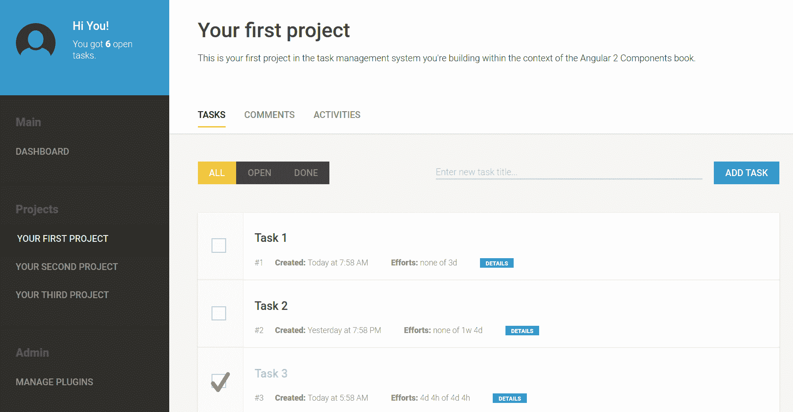
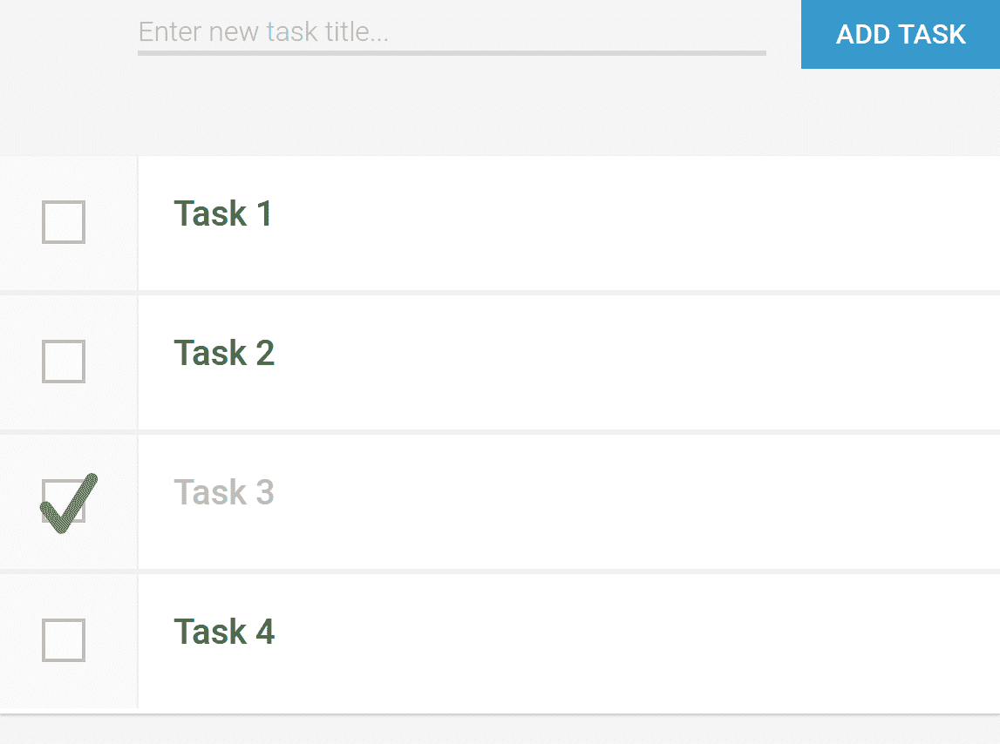
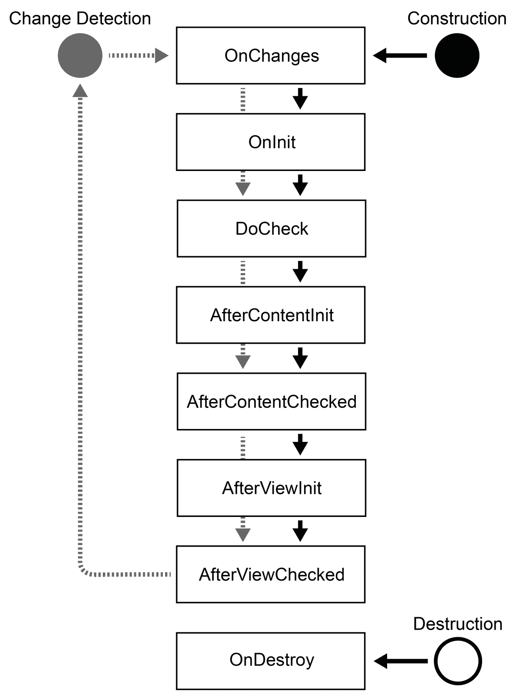
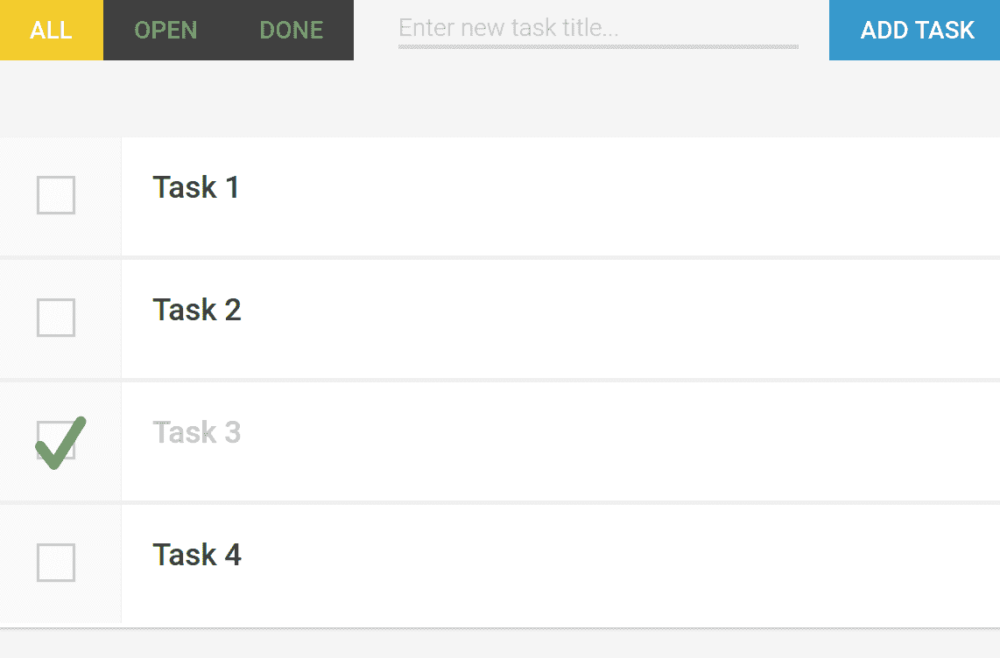

# 准备，设置，出发！

在本章中，我们将开始构建我们的任务管理应用程序。我们将直接进入应用程序的核心，并创建管理简单任务列表所需的初始组件。

在阅读本章的过程中，你将了解以下主题：

+   `NgModule` 简介

+   使用主模块引导 Angular 应用程序

+   组件输入和输出

+   主属性绑定

+   样式和视图封装

+   使用 `EventEmitter` 发射自定义事件

+   组件生命周期

# 管理任务

在从上一章掌握基础知识之后，我们现在将继续在接下来的章节中一起创建一个任务管理应用程序。在这些章节中，你将学习一些概念，然后通过实际示例来使用它们。你还将学习如何使用组件来构建应用程序。这从文件夹结构开始，以设置组件之间的交互结束。

# 视觉

在本书的整个过程中，我们将要创建的任务管理应用程序应使用户能够轻松地管理任务，并帮助他们组织小型项目。可用性是任何应用程序的核心方面；因此，你需要设计一个现代且灵活的用户界面，以支持用户管理他们的任务：



我们将要构建的任务管理应用程序预览

我们的任务管理应用程序将包含组件，使我们能够设计一个平台，为管理任务提供良好的用户体验。让我们定义我们应用程序的核心功能：

+   在多个项目中管理任务并提供项目概览

+   简单的排程以及时间和努力跟踪机制

+   使用图形图表概述 DASHBOARD

+   跟踪活动并提供可视审计日志

+   一个将在不同组件间工作的简单评论系统

任务管理应用程序是本书的主要示例。因此，本书中的构建块应仅包含与本书主题相关的代码。当然，除了组件之外，应用程序还需要其他功能，如视觉设计、数据、会话管理和其他重要部分，才能运行。虽然每章所需的代码都可以在线下载，但我们只讨论与本书将要学习的话题相关的代码。

# 从零开始

让我们从使用 Angular CLI 创建一个新的 Angular 项目开始。我们将将其命名为 `mastering-angular-components`：

1.  打开控制台窗口并导航到我们的项目适当的工作空间。让我们使用 Angular CLI 来创建我们的初始项目结构：

```js
ng new mastering-angular-components --prefix=mac
```

1.  在项目成功创建后，让我们进入项目文件夹，并使用 `ng serve` 命令开始提供服务：

```js
cd mastering-angular-components
ng serve
```

在完成前面的步骤后，您应该能够打开浏览器并将它指向 `http://localhost:4200`。您应该能够看到生成的应用程序 app，并显示欢迎信息：欢迎使用 mac!。

开发过程中，建议您始终运行 CLI 的服务模式。由于底层 webpack 在重新编译输出包时会使用缓存，这将大大加快您的开发过程。我建议您始终打开一个第二个命令行窗口，并在其中启动 Angular CLI 的服务模式。

让我们检查 Angular CLI 工具为我们创建的内容。除了将在后续章节中介绍的大量文件外，Angular CLI 工具还创建了组装简单 Angular 应用程序所需的核心文件。以下目录列表显示了所有关键文件，您也将在生成的项目文件夹中找到这些文件：

```js
mastering-angular-components
├── node_modules
├── package.json
└── src
 ├── app
 │   ├── app.component.css
 │   ├── app.component.html
 │   ├── app.component.ts
 │   └── app.module.ts
 ├── index.html
 ├── styles.css
 └── main.ts
```

让我们快速查看这些依赖项、开发依赖项及其用途：

| **文件** | **描述** |
| --- | --- |
| `package.json` `node_modules` | 由于 Angular CLI 使用 Node.js 作为工具，因此我们的项目包含一个 `package.json` 文件来存储所有必需的依赖项及其版本。Node 依赖项安装在 `node_modules` 文件夹中。如果您想检查与您的项目一起安装的 Angular 版本，可以检查 `package.json` 文件中的依赖项。 |
| `src/index.html` | 这是您项目的主体 HTML 文件。在此文件中，您将找到根组件的主元素。这是您根或主要组件将被渲染的地方。只需打开文件，您就会注意到一个名为 `<mac-root>` 的元素。由于我们使用 Angular CLI 创建项目时指定了前缀 `mac`，因此我们所有的组件以及所有组件的主元素都包含此前缀。 |
| `src/main.ts` | 这是我们的 TypeScript 项目代码的主要入口文件。它包含启动 Angular 和引导主应用程序模块所需的所有必要代码。 |
| `src/styles.css` | 我们希望应用到我们的应用程序网站上的任何全局 CSS 样式都放在这里。 |
| `src/app/app.module.ts` | 这是您的 Angular 项目的主体 `NgModule`。当您的应用程序启动时，会引导此模块。它包含对您的项目组件的引用，并指定了启动时应渲染的主要入口组件。 |
| `src/app/app.component.ts` `src/app/app.component.html` `src/app/app.component.css`  | 这是您的 Angular 应用程序的主要组件。该组件代表最外层的组件，有时也称为 app 或根组件。TypeScript、HTML 和 CSS 代码默认被分隔到不同的文件中。这也可以更改，以便所有内容都嵌入到 TypeScript 文件中。然而，遵循良好的分离实践，将所有关于组件的关注点放在单独的文件中是完全有意义的。 |

# 主要应用程序组件

让我们来看看我们的主要应用程序组件。你可以将其视为应用程序的最外层组件。它被称为主要组件，因为它代表了整个应用程序。这是组件树的根本所在，因此有时也被称为根组件。

首先，让我们看看位于 `src/app/app.component.ts` 的组件 TypeScript 文件：

```js
import {Component} from '@angular/core';

@Component({
  selector: 'mac-root',
  templateUrl: './app.component.html',
  styleUrls: ['./app.component.css']
})
export class AppComponent {
  title = 'mac';
} 
```

这里与我们之前在上一章中学到的组件结构化方法没有太大区别。然而，与之前创建组件的方式相比，这里有两个主要的不同点。我们不再使用 `template` 属性来内联编写我们的 HTML 模板，而是使用 `templateUrl` 属性告诉 Angular 从指定的文件加载 HTML。第二件事是我们还没有涉及到的，那就是如何为组件加载 CSS。`styleUrls` 属性允许我们指定一个 URL 数组，这些 URL 被解析以组装组件的样式。类似于 HTML 模板机制，我们也可以使用一个名为 `styles` 的属性，在组件 TypeScript 文件内内联编写我们的样式。

对于我们的应用程序，我们希望稍微改变我们处理样式的行为。创建组件时组织样式的默认方式是每个组件包含其自己的封装样式。然而，对于我们的项目，我们希望使用全局的 `styles.css` 文件来添加所有组件的样式。这将使与书籍源代码库一起工作变得更加容易，并消除了在本书中包含 CSS 代码片段的需要。

默认情况下，Angular 在我们的组件上使用阴影 DOM 模拟，这阻止了组件内的样式泄漏到外部并影响其他组件。然而，这种行为可以通过配置组件的视图封装来轻松更改。

Angular 有三种处理视图封装的方法，每种方法都有其优缺点。让我们看看不同的设置：

| **封装类型** | **描述** |
| --- | --- |
| `ViewEncapsulation.Emulated` | 如果组件设置为模拟视图封装，它将通过将生成的属性附加到组件元素并修改 CSS 选择器以包含这些属性选择器来模拟样式封装。这将启用某些形式的封装，尽管如果存在其他全局样式，外部样式仍然可能泄漏到组件中。这种视图封装模式是默认模式，除非有其他指定。 |
| `ViewEncapsulation.Native` | 原生视图封装应该是 Angular 中视图封装概念的最终目标。它使用上一章中描述的 Shadow DOM 来为整个组件创建一个隔离的 DOM。此模式依赖于浏览器原生支持 Shadow DOM，因此并不总是可以使用。还重要的是要注意，全局样式将不再被尊重，并且局部样式需要放置在组件的行内样式标签中（或使用组件注解上的 `styles` 属性）。 |
| `ViewEncapsulation.None` | 此模式告诉 Angular 不提供任何模板或样式封装。在我们的应用程序中，我们依赖于来自全局 CSS 的样式；因此，我们为大多数组件使用此模式。既不使用 Shadow DOM，也不使用属性来创建样式封装；我们只需简单地使用全局 CSS 文件中指定的类即可。 |

让我们更改主组件的视图封装模式，使用 `ViewEncapsulation.None` 模式。由于我们将所有样式放入全局的 `src/styles.css` 文件中，我们也可以完全从组件配置中移除 `styleUrls` 属性：

```js
import {Component, ViewEncapsulation} from '@angular/core';

@Component({
  selector: 'mac-root',
  templateUrl: './app.component.html',
  encapsulation: ViewEncapsulation.None
})
export class AppComponent {
  title = 'mac';
}
```

# 资源下载

本书前几章的目标是从零开始构建我们的应用程序。有一些构建应用程序所需的代码，这些代码并不完全符合本书的主题，但为了掌握创建稳固的组件架构，它们是必要的。其中之一就是 CSS 样式。尽管它是使用网络技术构建的一切的组成部分，但在这本书中，它绝对不是需要过多关注的东西。

为了这个目的，我已经准备了本书中创建的所有组件所使用的所有 CSS 样式。在你继续工作于你的应用程序之前，你应该下载这些样式并将它们应用到你的项目中。请在第十一章 *任务管理应用程序源代码* 的下载部分找到确切的下载链接。

将下载的 StyleSheet 放入项目的 `src` 文件夹中，它将替换现有的 `styles.css` 文件。

# 主要应用 NgModule

让我们再看看由 Angular CLI 生成的主 `NgModule`。你可以在路径 `src/app/app.module.ts` 中找到它：

```js
import {BrowserModule} from '@angular/platform-browser';
import {NgModule} from '@angular/core';
import {AppComponent} from './app.component';

@NgModule({
  declarations: [AppComponent],
  imports: [BrowserModule],
  bootstrap: [AppComponent],
  providers: []
})
export class AppModule { }
```

如果你一直在关注本书第一章中关于 *Angular NgModule* 的部分，那么在查看我们生成的主应用程序模块时，不应该有任何惊喜。

我们的应用目前仅包含一个组件，即 `AppComponent`，我们在 `AppModule` 中声明了这个组件。我们还指定当此模块正在启动时，应该启动此组件。

# 启动

我们项目的起点位于 `src/main.ts` 文件中。此文件负责启动 Angular 框架并启动我们的应用程序主模块。

我们可以继续启动我们的 Angular 应用程序，提供我们的主应用程序模块 `AppModule`。

为了启动一个 Angular 模块，我们首先需要创建一个平台。对于不同的平台和环境，有许多创建平台的方法。如果你想要创建一个浏览器平台，这是浏览器环境的默认平台，我们需要从 `@angular/platform-browser-dynamic` 模块导入平台工厂函数 `platformBrowserDynamic`。只需调用平台工厂函数，我们就会收到一个新创建的平台实例。在平台实例上，我们可以调用 `bootstrapModule` 函数，将我们的主应用程序模块作为参数传递：

```js
import {platformBrowserDynamic} from '@angular/platform-browser-dynamic';
import {AppModule} from './app/app.module';

platformBrowserDynamic().bootstrapModule(AppModule)
  .catch(err => console.log(err));
```

让我们更详细地看看 Angular 启动机制中涉及的步骤。我们应该尝试理解通过在平台实例上调用 `bootstrapModule` 函数，我们的根组件是如何被渲染到正确位置的：

1.  首先，我们在我们的平台实例上调用 `bootstrapModule` 函数，将我们的主应用程序模块作为参数传递

1.  Angular 将检查我们的主应用程序模块元数据，并在 `NgModule` 配置的 `bootstrap` 属性中找到列出的 `AppComponent`

1.  通过评估 `AppComponent` 上的元数据，查看 `selector` 属性，Angular 将知道在哪里渲染我们的根组件

1.  `AppComponent` 被渲染为我们的根组件，位于 `index.html` 文件中，与组件元数据中 `selector` 属性匹配的宿主元素

# 运行应用程序

为了确保我们对主组件 `AppComponent` 的修改按预期工作，并且我们没有破坏任何东西，让我们使用 Angular CLI 启动我们的应用程序。打开命令行，将其指向你的项目目录。然后，以服务模式启动 CLI：

```js
ng serve
```

如果一切顺利，你将拥有一个显示“欢迎使用 mac!”的打开网页浏览器。

# 回顾

让我们回顾一下到目前为止我们已经做了什么：

1.  我们使用 Angular CLI 初始化了一个新项目

1.  我们修改了 `src/app/app.component.ts` 中的主应用程序组件，以包含 `ViewEncapsulation.None` 以启用全局样式

1.  我们已经查看了生成的 `MainModule` 以及我们主入口文件 `src/main.ts` 中的启动过程

1.  最后，我们使用 Angular CLI 启动了我们的应用程序

# 创建任务列表

现在我们已经设置了主应用程序组件，我们可以继续完善我们的任务管理应用程序。我们将要创建的第二个组件将负责列出任务。遵循组合的概念，我们将创建一个任务列表组件作为主应用程序组件的子组件。

让我们使用 Angular CLI 生成器功能创建一个新的任务列表组件。我们希望按区域结构化我们的应用程序，将所有与任务相关的组件放入一个 `tasks` 子文件夹中：

```js
ng generate component --spec false -ve none tasks/task-list
```

在生成我们的组件时使用`--spec false`选项，我们可以跳过创建测试规范。由于我们将在后面的章节中介绍测试，所以我们目前跳过这个步骤。此外，通过使用`-ve none`参数，我们可以告诉 Angular 使用`ViewEncapsulation.None`作为默认的封装设置来创建组件。

如果你使用 Angular CLI 工具来生成组件，它们将自动添加到你的主模块中。这非常方便，可以为你节省大量的样板工作。如果你是手动创建组件，你永远不应该忘记在你的`NgModule`声明中包含新创建的组件。

让我们打开生成的文件`src/app/tasks/task-list.ts`并对其进行一些修改：

```js
import {Component, ViewEncapsulation} from '@angular/core';

@Component({ 
  selector: 'mac-task-list',
  templateUrl: './task-list.component.html',
  encapsulation: ViewEncapsulation.None 
})
export class TaskListComponent {
  tasks = [
    {id: 1, title: 'Task 1', done: false}, 
    {id: 2, title: 'Task 2', done: true}
  ];
}
```

我们创建了一个非常简单的任务列表组件，它内部存储了一个任务列表。这个组件将被附加到匹配 CSS 元素选择器`mac-task-list`的 HTML 元素上。

现在，让我们为这个组件创建一个视图模板来显示任务。如你所见，从组件元数据中的`templateUrl`属性，我们正在寻找一个名为`task-list.component.html`的文件。

让我们更改这个文件的内容，以匹配以下摘录：

```js
<div *ngFor="let task of tasks"> 
  <input type="checkbox" [checked]="task.done"> 
  <div>{{task.title}}</div> 
</div> 
```

我们使用`NgFor`指令重复最外层的 DIV 元素，以匹配我们组件任务列表中的任务数量。Angular 中的`NgFor`指令将从其底层内容创建一个模板元素，并根据表达式评估的结果实例化模板中的元素。我们目前在任务列表组件中有两个任务，所以这将创建我们模板的两个实例。

为了使我们的任务列表工作，我们剩下的工作就是在主应用程序组件中包含任务列表组件。我们可以继续修改我们的`src/app/app.component.html`文件，并将其内容更改为以下内容：

```js
<mac-task-list></mac-task-list>
```

这是我们为了让任务列表组件工作而需要做的最后一个更改。要查看你的更改，你可以启动 Angular CLI 的服务模式，如果你还没有运行它的话。

# 概述

让我们看看在之前的构建块中我们做了什么。通过遵循以下步骤，我们实现了在封装组件内对任务的简单列表：

1.  我们创建了包含组件逻辑的组件 TypeScript 文件

1.  我们在单独的 HTML 文件中创建了组件的视图

1.  我们将组件的 HTML 元素包含在我们的主应用程序视图模板中

# 组件的正确大小

我们的任务列表显示正确，我们用来实现这一点的代码看起来相当不错。然而，如果我们想遵循更好的组合方法，我们应该重新思考任务列表组件的设计。如果我们划一条线来列举任务列表的责任，我们会得到诸如列出任务、向列表添加新任务、对任务列表进行排序或过滤等事情；然而，操作并不是在单个任务本身上执行的。此外，渲染任务本身超出了任务列表的责任范围。任务列表组件应该只作为任务的容器。

如果我们再次查看我们的代码，我们会发现我们违反了单一职责原则，在任务列表组件中渲染了整个任务体。让我们看看我们如何通过增加组件的粒度来修复这个问题。

目前的目标是进行代码重构练习，也称为提取。我们将任务的相关模板从任务列表模板中提取出来，并创建一个新的组件来封装任务。

让我们使用 Angular CLI 创建一个新的任务组件。打开命令行并进入我们应用程序的根目录。执行必要的代码来创建任务组件：

```js
ng generate component --spec false -ve none tasks/task
```

这将生成一个新的文件夹，其中包含我们新任务组件的所有代码。现在，让我们打开位于路径`src/app/tasks/task/task.component.html`的 HTML 模板，并将其内容更改为表示单个任务：

```js
<input type="checkbox" [checked]="task.done"> 
<div>{{task.title}}</div> 
```

我们新的`task.component.html`文件的内容基本上与我们任务列表组件中已有的内容相同。然而，在新建的任务组件中，我们只关心任务的外观，而不是整个任务列表。

让我们更改位于路径`src/app/tasks/task/task.component.ts`的任务组件 TypeScript 文件：

```js
import {Component, Input, ViewEncapsulation} from '@angular/core'; 

@Component({ 
  selector: 'mac-task',
  templateUrl: './task.component.html', 
  encapsulation: ViewEncapsulation.None 
}) 
export class TaskComponent {
  @Input() task: any; 
}
```

在本书的前一章中，我们讨论了封装和为 UI 组件建立干净封装的先决条件。这些先决条件之一是能够在组件内外设计适当的接口。这些输入和输出方法是使组件在组合中工作所必需的。这就是组件如何接收和发布信息的方式。

如您从我们的任务组件实现中看到的，我们现在正在使用类实例属性上的`@Input`装饰器来构建这样的接口。为了使用这个装饰器，我们首先需要从 angular 核心模块中导入它。

Angular 中的输入属性允许我们将模板中的表达式绑定到组件的类实例属性上。这样，我们可以通过组件的模板从组件外部传递数据到组件内部。这可以被视为单向绑定的一个例子，即从父组件视图到子组件实例的绑定。

如果我们在常规 DOM 属性上使用属性绑定，Angular 会直接将表达式绑定到元素的 DOM 属性上。我们使用这种类型的绑定将任务完成标志绑定到复选框的`input`元素的`checked`属性：

| **用法** | **描述** |
| --- | --- |
| `@Input() inputProp;` | 这允许我们将`inputProp`属性绑定到父组件内的组件元素。Angular 假设宿主元素上的属性与`input`属性的名称相同。 |
| `@Input('inp') inputProp;` | 你也可以覆盖应映射到此输入的属性名称。在这里，组件宿主元素的`inp`属性被映射到组件的输入属性`inputProp`。 |

为了使用我们新创建的任务组件，最后缺失的部分是修改任务列表的现有模板。

我们通过使用在任务组件中指定的选择器内的`<mac-task>`元素，将任务组件包含在我们的任务列表模板中。此外，我们还需要在任务组件上创建一个输入绑定，将当前`NgFor`迭代中的`task`对象传递到`task`组件的`task`输入。我们需要将`src/app/tasks/task-list/task-list.component.html`文件中所有现有的内容替换为以下代码行：

```js
<mac-task *ngFor="let task of tasks"
          [task]="task"></mac-task> 
```

恭喜！你已经通过将任务提取到其自己的组件中并建立了干净的组合、封装和单一职责成功地重构了你的任务列表。此外，我们现在可以说我们的任务列表是由任务组成的。

如果你考虑可维护性和可重用性，这实际上是我们构建应用程序过程中的一个非常重要的步骤。你应该不断寻找这样的组合机会，如果你觉得某件事可以被组织成多个子组件，你可能会选择这样做。当然，你也可以做得太过分。实际上没有金科玉律来确定组合的粒度应该是多少。

组件架构的组件组合和封装的正确粒度始终取决于上下文。我个人的建议是使用 OOP 中的已知原则，如单一职责，为你的组件树的良好设计打下基础。始终确保你的组件只做它们应该做的事情，正如它们的名称所暗示的那样。任务列表有列出任务和为列表提供一些过滤器或其他控件的责任。操作单个任务数据并渲染必要视图的明确责任属于任务组件，而不是任务列表。

# 回顾

在这个构建块中，我们清理了组件树并使用子组件建立了干净的封装。然后，我们使用输入绑定设置了 Angular 提供的接口。我们通过以下步骤执行了这些操作：

1.  我们创建了一个任务子组件

1.  我们使用了任务子组件与任务列表组件。

1.  我们在任务组件中使用了输入绑定和 DOM 元素属性绑定来建立单向数据绑定。

# 添加任务

我们的任务列表看起来已经很不错了，但如果用户无法向列表中添加新任务，那将毫无用处。让我们一起创建一个用于输入新任务的组件。让我们创建一个新的组件，该组件负责处理将新任务添加到列表中所需的所有 UI 逻辑。

让我们使用 Angular CLI 工具创建一个新的组件占位符：

```js
ng generate component --spec false -ve none tasks/enter-task
```

打开位于 `src/app/tasks/enter-task/enter-task.component.html` 的新创建的组件模板，并应用以下更改：

```js
<input type="text"
       placeholder="Enter new task title..." 
       #titleInput> 
<button (click)="enterTask(titleInput)"> 
  Add Task 
</button>
```

此模板包含一个输入字段以及一个用于输入新任务的按钮。如果你仔细观察输入字段，你会发现我们添加了一个名为 `#titleInput` 的特殊属性。这被称为局部视图引用，我们可以在当前组件视图中使用此引用，或者在我们的组件代码中查询该元素。

在这种情况下，我们实际上使用局部视图引用将输入字段 DOM 元素传递给我们在“添加任务”按钮的点击事件上调用的 `enterTask` 函数。所有局部视图引用都作为变量在组件视图的表达式中可用。

让我们看看我们组件类的实现，用于输入新任务。为此，我们需要将 `src/app/tasks/enter-task/enter-task.component.ts` 文件中生成的代码替换为以下代码：

```js
import {Component, Output, ViewEncapsulation, EventEmitter} from '@angular/core'; 

@Component({ 
  selector: 'mac-enter-task',
  templateUrl: './enter-task.component.html', 
  encapsulation: ViewEncapsulation.None 
}) 
export class EnterTaskComponent {
  @Output() outEnterTask = new EventEmitter<string>();
  enterTask(titleInput: HTMLInputElement) { 
    this.outEnterTask.emit(titleInput.value); 
    titleInput.value = '';  
    titleInput.focus();
  } 
} 
```

对于此组件，我们选择了一种设计方法，其中我们使用与任务列表的松散关系，实际的任务将在其中创建。尽管此组件与任务列表密切相关，但最好尽可能保持组件之间的松散耦合。

控制反转的最简单形式之一是回调函数或事件监听器，这是一个建立松散耦合的绝佳原则。在这个组件中，我们使用 `@Output` 装饰器创建一个事件发射器。输出属性需要是实例属性，在组件中持有事件发射器。然后，在组件的主元素上，我们可以使用事件绑定来捕获任何发射的事件。这为我们提供了极大的灵活性，我们可以利用它创建一个干净的应用程序设计，通过视图中的绑定将组件粘合在一起：

大多数情况下，你的输出名称将与你的组件实例方法名称冲突。为此，建议你在命名输出和触发输出的方法时遵循一些命名约定。在本书中，我们遵循了在所有输出名称前缀为“out”的命名约定。这样，我们可以避免名称冲突，同时保持名称相似。

| **用法** | **描述** |
| --- | --- |

| `@Output() outputProp = new EventEmitter();` | 当调用 `outputProp.emit()` 时，组件上会发出一个名为 `outputProp` 的自定义事件。Angular 将在组件的 HTML 元素（组件使用的地方）上查找事件绑定并执行它们：

```js
<my-comp (outputProp)="doSomething()">   
```

在事件绑定表达式中的表达式，你将始终可以访问一个名为 `$event` 的合成变量。这个变量是对事件发射器发出的数据的引用。|

| `@Output('out') outputProp = new EventEmitter();` | 使用这种方式声明你的输出属性，如果你想将事件名称与属性名称区分开来。在这个例子中，当调用 `outputProp.emit()` 时，将触发一个名为 `out` 的自定义事件：

```js
<my-comp (out)= "doSomething()">   
```

|

好的，让我们使用我们新创建的组件向我们的任务列表组件添加新任务。首先，让我们修改任务列表组件的现有模板。打开任务列表模板文件，`src/app/tasks/task-list/task-list.component.html`。我们需要将 `enter-task` 组件添加到模板中，并处理我们将要触发的自定义事件，一旦输入了新任务：

```js
<mac-enter-task (outEnterTask)="addTask($event)"></mac-enter-task>
<div class="tasks">
  <mac-task *ngFor="let task of tasks"  
            [task]="task"></mac-task> 
</div>
```

由于进入任务组件中的输出属性名为 `outEnterTask`，我们可以将其与组件宿主元素上的事件绑定属性 `(outEnterTask)=""` 绑定。

在事件绑定表达式中，我们调用任务列表组件上的 `addTask` 函数。我们还使用了合成变量 `$event`，它包含来自进入任务组件的任务标题。现在，每次我们在进入任务组件中按下按钮并从组件中发出事件时，我们都会在事件绑定中捕获该事件，并在任务列表组件中处理它。

我们还需要对任务列表组件的 TypeScript 文件做一些小的修改。我们需要实现 `addTask` 函数，该函数在任务列表组件的模板中被调用。让我们打开 `src/app/tasks/task-list/task-list.component.ts` 并进行以下修改：

```js
import {Component, ViewEncapsulation} from '@angular/core';

@Component({
  selector: 'mac-task-list',
  templateUrl: './task-list.component.html',
  encapsulation: ViewEncapsulation.None
})
export class TaskListComponent {
  tasks = [
    {id: 1, title: 'Task 1', done: false},
    {id: 2, title: 'Task 2', done: true}
  ];

  addTask(title: string) {
    this.tasks.push({
      title, done: false
    });
  }
}
```

我们创建了一个名为 `addTask` 的函数，该函数将使用传递给函数的标题将新任务添加到我们的任务列表中。现在，循环已关闭，并且来自进入任务组件的事件已转发到任务列表组件的视图中。

如果你还没有预览你的更改，现在是时候了。尝试向列表中添加新任务，并将行为与你对代码所做的更改联系起来。

# 回顾

我们添加了一个新的进入任务组件，该组件负责提供添加新任务的 UI 逻辑。我们涵盖了以下主题：

+   我们创建了一个使用输出属性和事件发射器松散耦合的子组件

+   我们学习了 `@Output` 装饰器及其如何用于创建输出属性

+   我们使用事件绑定来响应组件输出并执行操作

# 自定义 UI 元素

浏览器中的标准 UI 元素很棒，但有时，现代 Web 应用程序需要比浏览器内可用的更智能和更复杂的输入元素。

现在，我们将创建两个特定的自定义 UI 元素，我们将从现在开始在应用程序中使用它们，以提供良好的用户体验：

+   **复选框**：浏览器中已经有一个原生的复选框输入，但有时很难将其融入应用程序的视觉设计中。原生复选框在样式方面有限，因此很难使它们看起来很棒。有时，正是那些细微之处让应用程序看起来吸引人。

+   **切换按钮**：这是一个切换按钮列表，列表中只有一个按钮可以被切换。它们也可以用原生的单选按钮列表表示。然而，就像原生复选框一样，单选按钮有时并不是解决这个问题的最佳视觉解决方案。一个既代表单选用户输入元素又表示切换按钮列表的列表更加现代，并提供了我们所需的视觉方面。此外，谁不喜欢按按钮呢？

让我们首先创建我们的自定义复选框 UI 元素。由于我们可能会想出几个自定义 UI 元素，我们将引入一个新的顶级 UI 文件夹。通过使用正确的参数调用 Angular CLI 生成器，我们可以在正确的文件夹中创建复选框组件的占位符：

```js
ng generate component --spec false -ve none ui/checkbox
```

让我们从我们新组件的模板开始，并更改`src/app/ui/checkbox/checkbox.component.html`的内容：

```js
<label class="label">
  <input class="input" type="checkbox"
         [checked]="checked"
         (change)="check($event.target.checked)">
  <span class="text">{{label}}</span>
</label>
```

在复选框输入上，我们有两个绑定。首先，我们在 DOM 元素上有一个`checked`属性的属性绑定。我们将 DOM 属性绑定到我们将要创建的组件的`checked`成员字段上。

此外，我们在输入元素上有一个事件绑定，我们监听复选框变化的 DOM 事件，并在我们的组件实例上调用`check`方法。我们使用合成变量`$event`传递复选框 DOM 元素的`checked`属性，其中变化事件发生。

接下来，让我们编辑组件类实现，修改路径`src/app/ui/checkbox/checkbox.component.ts`上的 TypeScript 文件：

```js
import {Component, Input, Output, ViewEncapsulation, EventEmitter} from '@angular/core';

@Component({
  selector: 'mac-checkbox',
  templateUrl: './checkbox.component.html',
  encapsulation: ViewEncapsulation.None
})
export class CheckboxComponent {
  @Input() label: string;
  @Input() checked: boolean;
  @Output() outCheck = new EventEmitter<boolean>();

  check(checked: boolean) {
    this.outCheck.emit(checked);
  }
}
```

这个组件类并没有什么特别之处。它使用一个输入属性从外部设置选中状态，并且它还有一个带有事件发射器的输出属性，允许我们通知外部组件关于选中状态的变化。

让我们把我们的复选框集成到任务组件中，以替换我们目前在那里使用的原生复选框输入。为此，我们需要修改`src/app/tasks/task/task.component.html`文件，用以下代码替换其之前的内容：

```js
<mac-checkbox [checked]="task.done"
              (outCheck)="task.done = $event"></mac-checkbox>
<div class="title">{{task.title}}</div>
```

你现在应该已经能够在浏览器中看到变化，并看到我们漂亮的自定义复选框组件在行动。作为下一步，我们希望当任务被标记为完成时应用一些样式更改。这比仅仅勾选复选框提供了更好的视觉反馈。为此，我们正在考虑一个新的概念来操作组件的主元素。让我们打开路径`src/app/tasks/task/task.component.ts`上的任务组件类，并将以下代码添加到`TaskComponent`类的主体中：

```js
@HostBinding('class.done') 
get done() { 
  return this.task && this.task.done; 
}
```

使用`@HostBinding`装饰器，我们可以在组件的主元素上根据我们组件的成员创建属性绑定。让我们使用这个装饰器来创建一个条件性地在组件的 HTML 元素上设置名为`done`的类的绑定。这用于在我们的样式中对完成的任务进行一些视觉区分。

现在是检查你的结果并在任务列表中尝试这些新的大复选框的好时机。这难道不是比激活常规复选框更有趣吗？不要低估一个令人愉悦的用户界面对产品使用的影响。这可能会对你的产品使用产生非常积极的影响：



添加我们的自定义复选框组件后的任务列表

# 概述

在本节中，你学习了如何构建通用且松耦合的自定义 UI 组件，以便它们可以作为子组件在其他组件中使用。我们还完成了以下任务：

+   我们创建了一个子组件，该组件通过输出属性和事件发射器进行松耦合

+   我们学习了`@Output`装饰器的含义以及如何使用它来创建输出属性

+   我们使用事件绑定从组件的视图中将行为链接在一起

# 任务数据服务

我们已经学到了很多关于构建基本组件以及如何将它们组合在一起以形成更大组件的知识。在上一个构建块中，我们创建了一个可重用的复选框 UI 组件，我们用它来增强任务列表的可用性。

在这个主题中，我们将使用切换按钮组件来为我们的任务列表创建一个过滤器。但在我们开始向应用程序引入更多复杂性之前，我们将通过引入数据服务来重构我们的应用程序。随着应用程序的扩大，集中我们的数据操作和简化我们的数据流变得至关重要。服务非常有用，因为它们允许我们存储状态，这些状态可以通过 Angular 的依赖注入在所有组件中访问。

从现在开始，我们将在应用程序中处理大量的数据。在构建类型安全的数据结构方面，TypeScript 为我们提供了非常好的支持。到目前为止，我们一直将任务数据作为对象字面量处理，TypeScript 从那里提取类型信息。然而，当我们开始在应用程序的不同区域使用我们的数据时，在中央位置对数据进行建模是有意义的。为此，我们将创建我们的第一个 TypeScript 接口来表示我们的任务数据。在 TypeScript 中，我们不仅可以使用接口来实现类和多态，我们还可以仅使用它来为对象字面量和对象操作添加类型安全。这被认为是一种非常有用的实践，并将帮助我们避免未来许多潜在的错误。

让我们在路径 `src/app/model.ts` 上创建一个新的 TypeScript 文件，并将以下内容添加到该文件中：

```js
export interface Task {
  id?: number;
  title: string;
  done: boolean;
}
```

到目前为止，我们一直在任务列表组件中直接存储任务列表数据，但在这里让我们改变这一点，并使用一个为我们提供任务数据的服务。通常，将数据直接存储在组件中并不是一个好主意。将我们的数据重构到服务中只是迈向清晰组件架构的第一步，我们将在本书的后续章节中学习如何存储我们的状态和数据的不同方法。

为了使用我们即将创建的服务，我们将首次使用 Angular 的依赖注入。Angular CLI 在这里也很有用。我们可以使用它为我们生成一个服务占位符：

```js
ng generate service --spec false tasks/task
```

这将在路径 `src/app/tasks/task.service.ts` 上为我们生成一个文件。让我们在编辑器中打开这个文件，并使用以下更改进行编辑：

```js
import {Injectable} from '@angular/core';
import {Task} from '../model';

@Injectable()
export class TaskService {
  private tasks: Task[] = [
    {id: 1, title: 'Task 1', done: false},
    {id: 2, title: 'Task 2', done: false},
    {id: 3, title: 'Task 3', done: true},
    {id: 4, title: 'Task 4', done: false}
  ];

  getTasks(): Task[] {
    return this.tasks.slice();
  }

  addTask(task: Task) {
    this.tasks.push({
      ...task,
      id: this.tasks.length + 1
    });
  }

  updateTask(task: Task) {
    const index = this.tasks
      .findIndex((t) => t.id === task.id);
    this.tasks[index] = task;
  }
}
```

我们已经将所有任务数据移动到了新创建的服务中。为了使我们的服务类可注入，我们需要用 `@Injectable` 装饰器对其进行装饰。

我们还使用 `Task` 接口来处理我们的任务，以便在处理任务对象时具有更好的类型安全。为了保持我们的数据封装和安全，当我们将其暴露给任何消费者时，我们将创建内部任务列表的副本。在 JavaScript 中，我们可以简单地调用 `Array.prototype.slice` 来创建现有数组的副本。

在我们可以在组件中使用任务服务之前，我们需要将其作为依赖项提供。依赖项通常在应用程序级别提供。为了在应用程序级别提供依赖项，我们需要对我们的主应用程序模块（位于路径 `src/app/app.module.ts`）进行一些修改。模块的更改在以下代码摘录中突出显示。省略号字符表示现有文件中还有更多代码，但这些代码对我们应用更改不相关：

```js
...
import {TaskService} from './tasks/task.service';
...
@NgModule({
...
 providers: [TaskService],
 ...
})
export class AppModule {
}
```

由于我们已经将任务服务作为依赖项提供给主模块，因此它现在将可用于应用程序注入器中的注入。

现在，我们可以继续修改我们的任务列表组件以消费我们的任务服务。所有任务现在都存储在任务服务中，我们需要从任务列表组件中移除之前嵌入的数据。

让我们将更改应用到我们的任务列表组件，并修改`src/app/tasks/task-list/task-list.component.ts`文件。以下摘录包含了任务列表组件的全部代码。更改和新部分被突出显示：

```js
import {Component, ViewEncapsulation} from '@angular/core';
import {TaskService} from '../task-list.service';
import {Task} from '../../model';

@Component({
  selector: 'mac-task-list',
  templateUrl: './task-list.component.html',
  encapsulation: ViewEncapsulation.None
})
export class TaskListComponent {
 tasks: Task[];

 constructor(private taskService: TaskService) {
 this.tasks = taskService.getTasks();
 }

  addTask(title: string) {
 const task: Task = {
 title, done: false
 };
 this.taskService.addTask(task);
 this.tasks = this.taskService.getTasks();
  }

 updateTask(task: Task) {
 this.taskService.updateTask(task);
 this.tasks = this.taskService.getTasks();
 }
}
```

我们现在不再在任务列表组件中存储所有任务，而是只声明`tasks`成员。在我们的组件构造函数中，我们使用依赖注入来注入我们新创建的任务服务。在构造函数体中，我们通过在服务上调用`getTasks`方法来检索任务数据。然后，这个结果列表被存储在我们的组件的`tasks`成员中。

在`addTask`方法中，我们不再直接修改我们的任务列表。相反，我们正在使用服务来添加一个新任务。之后，我们需要通过再次调用`getTasks`来从服务中获取更新后的列表。

我们还创建了一个名为`updateTask`的方法来使用我们的任务服务更新任务。到目前为止，我们一直在任务组件内部直接更新任务数据。我们的复选框上的输出绑定直接从视图中更新任务的状态。在我们塑造应用程序的过程中，以更受控的方式修改应用程序的状态变得至关重要。想象一下，在你的应用程序中有数十个组件，每个组件都在修改应用程序的状态。这将是一场真正的维护噩梦。

那么，我们应该如何最好地解决这个问题呢？答案是委托。我们将状态操作委托给父组件，直到我们达到应该处理操作的组件。组件输出非常适合这个用例。我们可以通过发出输出值来告诉父组件发生了变化。在我们的情况下，这意味着以下流程应该发生：

1.  复选框组件将告诉任务组件复选框已被勾选

1.  任务组件将告诉任务列表组件任务应该被更新

1.  任务列表组件将调用服务来更新任务数据

首先，我们将修复在任务组件中发生的状态操作。打开位于`src/app/tasks/task/task.component.html`的任务组件模板，并执行以下更改：

```js
<mac-checkbox [checked]="task.done"
              (outCheck)="updateTask($event)"></mac-checkbox>
<div class="title">{{task.title}}</div>
```

现在，我们在任务组件中添加了一个新的输出，并在`src/app/tasks/task/task.component.ts`中实现了`updateTask`方法：

```js
...
export class TaskComponent {
  @Input() task: Task;
  @Output() outUpdateTask = new EventEmitter<Task>();
  ...

  updateTask(done: boolean) {
 this.outUpdateTask.emit({
 ...this.task,
 done
 });
 }
}
```

太好了！现在我们唯一要做的就是捕获任务列表组件模板中的`outUpdateTask`输出并调用我们已添加到组件类中的`updateTask`方法。让我们编辑文件`src/app/tasks/task-list/task-list.component.html`：

```js
<mac-enter-task (outEnterTask)="addTask($event)"></mac-enter-task>
<div class="tasks">
  <mac-task *ngFor="let task of filteredTasks"
            [task]="task"
            (outUpdateTask)="updateTask($event)"></mac-task>
</div>
```

现在是预览您更改的好时机。我们的任务列表应该又能完全正常工作了。尝试添加新任务和标记任务为完成。由于我们不在组件内部存储任何数据，我们的任务列表组件已经变得更加简洁。相反，我们使用了一个服务，这个服务也可以在其他组件中使用。

# 概述

在本节中，我们并没有在应用程序的用户界面中创建任何新内容。然而，这仍然是本章中较为重要的部分之一。我们学习了关于清洁数据流、数据和状态的最佳实践，并创建并集成了我们的第一个 Angular 服务：

1.  我们创建了一个任务服务来存储和处理我们的任务数据

1.  我们将状态操作从任务组件委托给了任务列表组件，然后该组件与我们的服务进行交互

1.  我们了解了`@Injectable`及其如何在应用级别提供依赖项

1.  我们在任务列表组件的构造函数中注入了我们的任务服务，在那里我们使用它来获取数据

# 过滤任务

在本节中，我们将为我们的任务列表实现一些过滤功能。为了控制活动过滤标准，我们首先构建了一个切换按钮列表组件。让我们继续使用 Angular CLI 创建一个新的组件：

```js
ng generate component --spec false -ve none ui/toggle
```

在您的控制台运行 Angular CLI 生成器命令后，让我们编辑新创建组件的 HTML 模板`src/app/ui/toggle/toggle.component.html`：

```js
<button class="toggle-button" 
        *ngFor="let button of buttonList" 
        [class.active]="button === activeButton" 
        (click)="activate(button)">{{button}}</button> 
```

实际上这里没有什么特别的！我们通过迭代一个名为`buttonList`的实例字段来重复一个按钮，使用`NgFor`指令。这个按钮列表将包含我们的切换按钮的标签。条件性地，我们使用属性绑定设置一个名为`active`的类，并检查它是否与迭代中的当前按钮匹配一个名为`selectedButton`的实例字段。当按钮被点击时，我们在组件实例上调用一个名为`activate`的方法，并传递迭代中的当前按钮标签。

现在，让我们更改组件类路径`src/app/ui/toggle/toggle.component.ts`的代码：

```js
import {Component, Input, Output, ViewEncapsulation, EventEmitter, OnInit} from '@angular/core';

@Component({
  selector: 'mac-toggle',
  templateUrl: './toggle.component.html',
  encapsulation: ViewEncapsulation.None
})
export class ToggleComponent implements OnInit {
  @Input() buttonList: string[];
  @Input() activeButton: string;
  @Output() outActivate = new EventEmitter<string>();

  ngOnInit() {
    if (!this.activeButton) {
      this.activeButton = this.buttonList[0];
    }
  }

  activate(button: string) {
    this.outActivate.emit(button);
  }
}
```

在我们的切换组件中，我们依赖于`buttonList`输入是一个按钮标签字符串数组。我们在模板中使用这个数组，通过`NgFor`指令。

预期的`activeButton`输入应设置为当前在切换列表中激活的按钮标签字符串。我们还创建了一个名为`outActivate`的输出，以通知外界关于活动切换按钮状态的变化。

在 `activate` 函数中，我们只发出 `outActivate` 输出。从组件外部的绑定，我们期望 `activeButton` 输入相应地更新。重要的是要理解，我们的切换组件仅与父组件通信有关被激活的按钮。实际上并没有更新任何状态。我们期望使用我们的切换组件的父组件相应地更新 `activeButton` 输入。

`ngOnInit` 方法由 Angular 在指令和组件的生命周期中自动调用。这也是我们的切换组件类实现生命周期钩子接口 `OnInit` 的原因。在 `activeButton` 输入属性未指定的情况下，我们将添加一个检查并从可用的按钮列表中选择第一个按钮。由于 `activeButton` 以及 `buttonList` 都是输入属性，我们需要等待它们被初始化才能执行此逻辑。重要的是不要在组件构造函数中执行此初始化。只有在生命周期钩子 `OnInit` 中，我们才能保证我们的输入属性已经被设置。它只为每个创建的组件调用一次。

Angular 会自动调用你在组件中实现的任何生命周期钩子。每个生命周期钩子可用的接口仅有助于确保你已经为每个生命周期钩子实现了所有所需的回调。

以下图表展示了 Angular 组件的生命周期。在组件构建过程中，所有生命周期钩子将按照图中的顺序被调用，除了 `OnDestroy` 钩子，它将在组件销毁时被调用。

变更检测也会启动生命周期钩子的一部分，其中在创建过程中调用的某些钩子将被跳过：

+   `doCheck`

+   `afterContentChecked`

+   `afterViewChecked`

+   `onChanges (如果有任何更改被检测到)`

有关生命周期钩子和它们的目的的详细描述，可在 Angular 文档网站上找到：[`angular.io/guide/lifecycle-hooks`](https://angular.io/guide/lifecycle-hooks)



Angular 组件生命周期的示意图

好的！我们已经创建了一个新的 UI 组件来渲染切换按钮列表。现在，是时候继续本章的主要目标，在我们的任务列表组件中实现一个过滤系统。

首先，我们应该考虑过滤器的模型。我们希望包含三种状态：全部、打开和完成，每种状态都应导致任务列表的不同视图。让我们打开位于 `src/app/model.ts` 的模型文件，并添加以下更改：

```js
export interface Task {
  id?: number;
  title: string;
  done: boolean;
}

export type TaskListFilterType = 'all' | 'open' | 'done';
```

我们定义了一个类型别名，它代表一个有效过滤器类型的列表。TypeScript 类型别名对于使某些事情更加类型安全非常有帮助。特别是当你处理字符串类型时，你可以使用类型别名来创建字符串字面量类型。通过创建一个类型别名`TaskListFilterType`，并在过滤的上下文中使用它，我们可以在过滤时指定哪些字符串是有效的。这将防止在我们应用程序中处理任务过滤器类型字符串时出现任何错误。

现在，是时候实现我们的过滤功能了。让我们打开位于`src/app/tasks/task-list/task-list.component.ts`的任务列表组件文件，并应用一些代码更改。同样，更改的部分代码被突出显示，以便您更容易看到有效的更改：

```js
import {Component, ViewEncapsulation} from '@angular/core';
import {TaskService} from '../task.service';
import {Task, TaskListFilterType} from '../../model';

@Component({
  selector: 'mac-task-list',
  templateUrl: './task-list.component.html',
  encapsulation: ViewEncapsulation.None
})
export class TaskListComponent {
  tasks: Task[];
  filteredTasks: Task[];
 taskFilterTypes: TaskListFilterType[] = ['all', 'open', 'done'];
 activeTaskFilterType: TaskListFilterType = 'all';

  constructor(private taskService: TaskService) {
    this.tasks = taskService.getTasks();
 this.filterTasks();
  }

  activateFilterType(type: TaskListFilterType) {
 this.activeTaskFilterType = type;
 this.filterTasks();
 }

  filterTasks() {
 this.filteredTasks = this.tasks
 .filter((task: Task) => {
 if (this.activeTaskFilterType === 'all') {
 return true;
 } else if (this.activeTaskFilterType === 'open') {
 return !task.done;
 } else {
 return task.done;
 }
 });
 }

  addTask(title: string) {
    const task: Task = {
      title, done: false
    };
    this.taskService.addTask(task);
    this.tasks = this.taskService.getTasks();
 this.filterTasks();
  }

  updateTask(task: Task) {
    this.taskService.updateTask(task);
    this.tasks = this.taskService.getTasks();
 this.filterTasks();
  }
}
```

在组件内部，我们希望存储一个任务过滤器可能拥有的类型列表。这个列表将作为我们切换按钮列表的输入。如果你还记得我们的切换按钮的输入属性，我们有一个接受按钮标签列表的`buttonList`输入。为了存储当前选中的过滤器类型，我们使用一个名为`activeTaskFilterType`的实例字段。

我们需要添加到任务列表组件中的最后一部分是实际的任务过滤。为此，我们引入了一个名为`filteredTasks`的新成员，它将始终更新为当前过滤的任务子集。在`filterTasks`方法中，我们通过评估存储在`activeTaskFilterType`中的活动过滤器标准来计算过滤任务的子集。过滤的结果将存储在我们的`filteredTasks`成员中。

我们还创建了一个名为`activateFilterType`的方法，我们可以调用它来切换活动过滤器标准。然后，这个方法将调用`filterTasks`方法来更新我们的过滤任务子集。

好了，这就是我们将在组件类中进行的所有更改。尽管如此，我们仍然需要更改我们的视图模板。我们需要在过滤器标准更改时渲染我们的切换组件并执行过滤。由于我们想要渲染过滤后的任务子集而不是整个任务列表，我们还需要更改`NgFor`的源，它在视图中重复我们的任务。让我们打开模板文件`src/app/tasks/task-list/task-list.html`，并按照以下更改进行修改：

```js
<mac-toggle [buttonList]="taskFilterTypes"
 [activeButton]="activeTaskFilterType"
 (outActivate)="activateFilterType($event)">
</mac-toggle>
<mac-enter-task (outEnterTask)="addTask($event)"></mac-enter-task>
<div class="tasks">
  <mac-task *ngFor="let task of filteredTasks"
            [task]="task"
            (outUpdateTask)="updateTask($event)"></mac-task>
</div>
```

让我们快速讨论一下这些更改。首先，我们将存储在任务列表组件类中可能过滤类型列表的`taskFilterTypes`属性绑定到切换组件的`buttonList`输入属性。这将使切换组件渲染所有过滤类型作为切换按钮。

我们还将任务列表的 `activeTaskFilterType` 实例字段绑定到切换组件的 `activeButton` 输入属性。这样，`activeTaskFilterType` 属性的更改将在切换组件中反映出来。同时，当用户在切换组件内部更改活动切换按钮时，我们捕获切换组件的 `outActivate` 输出，并在任务列表组件上调用 `activateFilterType` 方法。

就这样，恭喜！你已经成功通过使用我们新创建的切换组件添加了过滤机制到你的任务列表中。在你的浏览器中预览更改；你应该看到一个功能齐全的任务列表，你可以标记任务为完成，添加新任务，并通过激活我们漂亮的切换按钮来过滤列表：



新增切换按钮组件的过滤任务状态的截图

# 复习

在本节中，我们已经在任务列表组件中构建了一个过滤系统。我们还创建了一个额外的 UI 组件来渲染切换按钮，我们将这些按钮展示给用户以选择过滤标准：

+   我们创建了一个新的切换组件来渲染一组切换按钮。

+   我们使用 `@HostBinding` 装饰器从我们的组件类内部声明性地创建属性绑定。

+   我们了解了 Angular 组件生命周期以及我们如何使用 `OnInit` 生命周期钩子在第一次处理输入后初始化组件。

# 摘要

在本章中，你学习了使用 Angular 构建基于 UI 组件的应用程序的新概念。我们还构建了我们任务管理应用程序的核心组件，即任务列表本身。你了解了输入和输出属性的概念以及如何使用它们来建立适当的组件通信。

我们还涵盖了 Angular 组件生命周期的基本知识以及如何在 `OnInit` 钩子中通过生命周期钩子执行初始化后的步骤。

作为最后一步，我们在任务列表中集成了切换按钮列表组件以过滤任务状态。我们将任务列表组件重构为使用服务来获取任务数据。为此，我们使用了 Angular 的依赖注入。

在下一章中，我们将探讨如何改进我们对数据和状态的处理方式。处理应用程序状态的方法有很多，我们将学习如何最好地解决这个问题。
