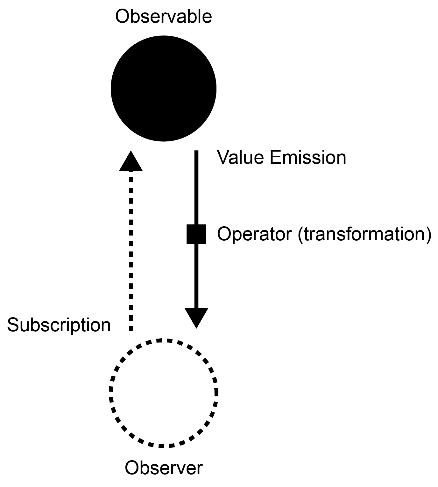
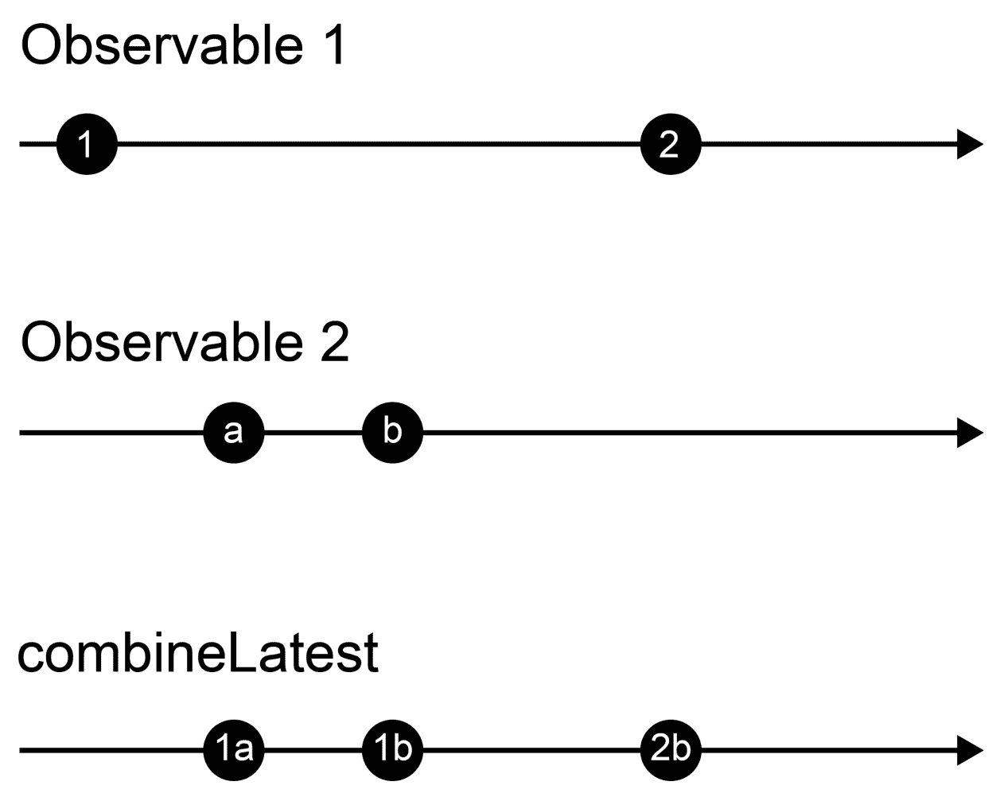
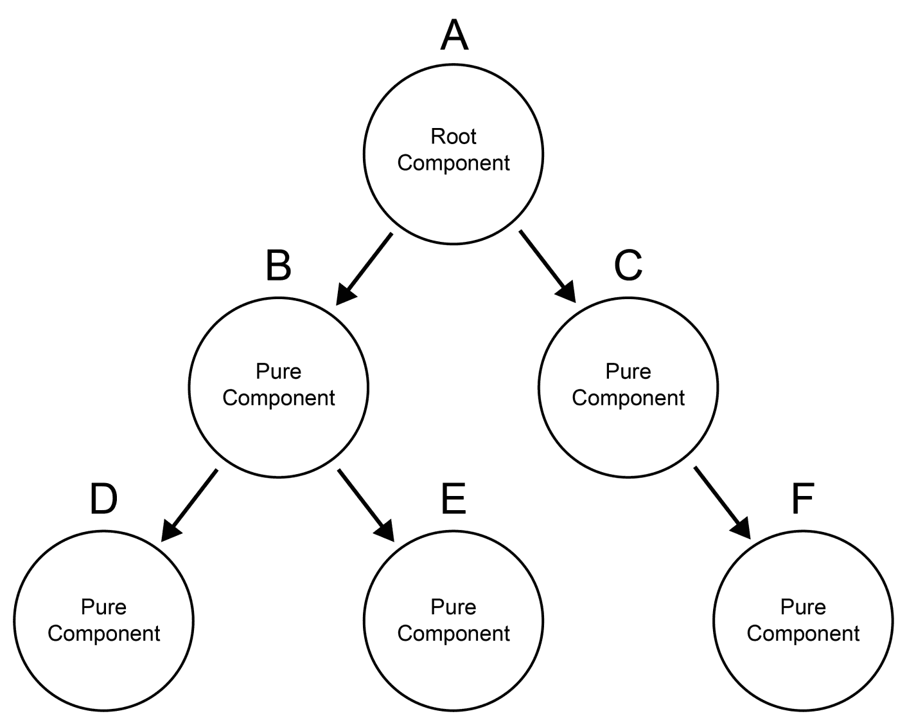
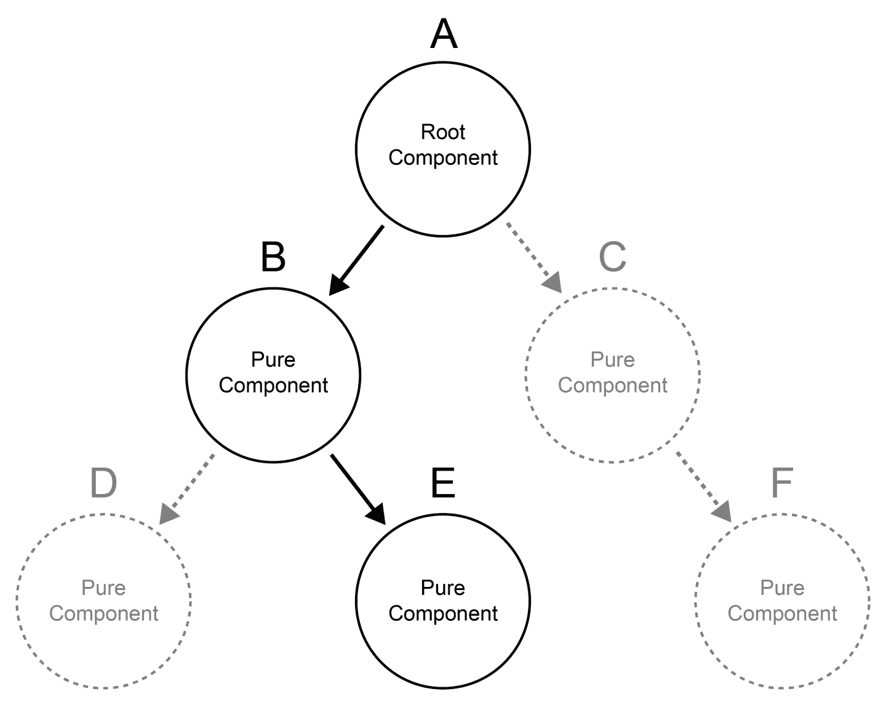
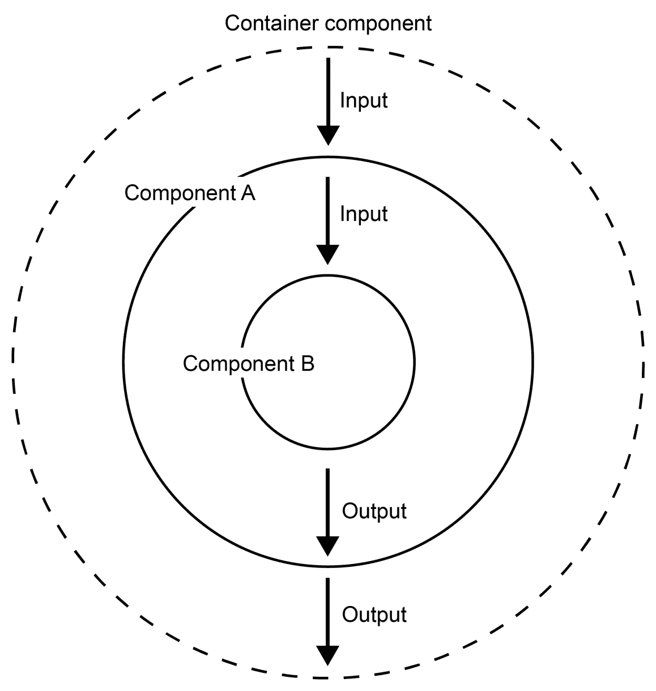

# 处理数据和状态

在本章中，我们将进一步构建我们的应用程序结构，并专注于作为我们任务管理系统基础的数据架构。到目前为止，我们已经从我们在上一章中创建的任务服务同步获取了任务数据。然而，在现实世界的场景中，这种情况很少发生。在实际应用中，我们会以异步方式获取数据，我们需要管理客户端状态，并确保我们的状态和数据始终保持完整性。在本章中，我们将探讨如何重新构建我们的应用程序以使用 Angular 中的 HTTP 客户端模块处理 RESTful 接口。我们将使用内存数据库来模拟我们的 HTTP 后端。此外，我们还将探讨一些关键概念，如响应式编程、不可变性和“纯”组件，以帮助我们构建一个在小规模和大规模上都能发光的数据架构。

在本章中，我们将探讨以下主题：

+   响应式编程、RxJS 的基础知识及其操作符，用于处理异步数据

+   重新构建我们的应用程序以处理对内存数据库的模拟 HTTP 调用

+   不可变性的概念

+   在 Angular 中使用纯组件

+   引入容器组件以将我们的用户界面与应用程序状态分离

+   为纯组件使用 `ChangeDetectionStrategy.OnPush`

# 使用 RxJS 进行响应式编程

到目前为止，我们在创建的任务列表中使用了简单的数组数据结构。这并不是我们在现实世界场景中会遇到的。在实际应用中，我们必须处理来自服务器的异步数据。

在应用程序中处理数据的行为与流非常相似。你接收输入，转换它，组合它，合并它，最后将其写入输出。在这样的系统中，输入通常是连续的，有时甚至是无限期的。以实时流为例；这种类型的数据是连续流动的，数据也是无限流动的。函数式和响应式编程是帮助我们更干净地处理这类数据的范式：



一个简单的可观察订阅，带有值发射和转换

Angular 在其核心是响应式的，整个变更检测和绑定都是使用响应式架构构建的。我们在上一章中学到的组件的输入和输出，实际上就是一个使用响应式事件驱动方法建立的数据流。Angular 使用 RxJS，这是一个用于 JavaScript 的函数式和响应式编程库，来实现这种数据流。实际上，我们用来从组件内部发送输出的 `EventEmitter`，只是 RxJS 可观察对象的一个包装器。

在我们在任务管理系统内玩弄 RxJS 之前，让我们先看看一个简单的 RxJS 示例，看看我们如何处理可观测流：

```js
import {from} from 'rxjs';
import {map, filter} from 'rxjs/operators';

from([1, 2, 3, 4])
  .pipe(
    map((num) => num * num),
    filter((num) => num < 10)
  )
  .subscribe((num) => console.log(num));

// This script is finishing with the following output on the console:
// 1
// 4
// 9
```

这个简单的脚本将从数字数组生成一个可观测序列。我们逐个将数字通过可观测流传递，使用两个简单的算子在我们订阅可观测量并打印结果到控制台之前。`map` 算子将每个数字平方，这些数字通过可观测流流动。然后，`filter` 算子过滤掉大于或等于 `10` 的项。

可观测量提供了一大批所谓的算子，这些算子允许你转换源自源可观测量的数据流。你可能已经从 ECMAScript 5 数组扩展函数中了解到一些这些函数算子，例如 `map` 和 `filter`。使用算子，你可以模拟整个转换流程，直到你最终订阅数据。

我经常在谈论 RxJS 可观测量时使用水管的类比。如果你认为你的转换算子是管道中的部件，那么 `subscribe` 函数就是管道中的最终排水阀。如果你不打开水管的排水口，水就不会流动。RxJS 的行为非常相似。如果没有最后的订阅调用，RxJS 不会执行任何算子。只有当你订阅一个可观测量时，它才会变得活跃。在订阅回调中，你可以使用通过流流动的结果项。

现在，构建管道带来了显著的优势。像管道一样构建的转换系统期待输入，并将产生一些输出。然而，我们不会立即执行任何操作。相反，我们正在设置一个系统，该系统知道如何处理通过它的数据，当有数据流动时。这个管道系统是完全无状态的并且是响应式的——响应式意味着它会对外来数据进行响应，并为每个输入产生新的输出。

我们可以将任何随时间发出项的源视为可观测量。让我们看看另一个例子：

```js
import {fromEvent} from 'rxjs';
import {throttleTime, map} from 'rxjs/operators';

fromEvent(window, 'mousemove')
  .pipe(
    throttleTime(200),
    map((event: MouseEvent) => `Move(${event.screenX}, ${event.screenY})`)
  )
  .subscribe((move) => console.log(move));
```

在这个例子中，我们使用 `fromEvent` 可观测量辅助函数从窗口对象的鼠标移动事件创建一个可观测源。对于每个鼠标移动事件，事件对象将通过可观测流发出。然后，我们将使用 `throttleTime` 算子限制流发出的事件数量。这个算子将在给定的时间框架内阻止后续的发出，因此减缓了流。在 `map` 算子中，我们格式化发出的鼠标事件，并最终订阅将结果写入控制台。

仅用几行代码，我们就实现了一个优秀的管道，它将源转换成可用的结果。这就是观察者、响应式编程和 RxJS 的力量。我们可以以非常优雅和声明性的方式解决有关构建响应式系统的一些难题。

# HTTP 客户端和内存中的 Web API

在本章的开头，我们决定我们想要改变我们在应用程序中处理数据的方式。目前，我们的任务数据嵌入在我们的任务服务中，检索以及操作都是同步发生的。从现在开始，我们想要改变这一点，尽可能接近现实世界的情况。同时，我们还应该关注我们解决方案的复杂性成本。

Angular 为这些用例提供了一个非常棒的实用工具。使用内存中的 Web API 模块，我们可以创建一个模拟的后端服务，这将允许我们以连接到真实服务器相同的方式使用 RESTful 接口。然而，所有使用 Angular HTTP 客户端进行的远程调用都将重定向到我们的本地内存数据库。我们处理数据的方式将完全真实。在某个时候，我们甚至可以创建一个真正的后端服务器，并将我们的应用程序连接到它，同时我们的前端代码保持不变。

让我们看看实现我们的数据层所需的内存中 Web API 的必要更改。作为第一步，我们需要使用 npm 安装该包。打开命令行并导航到您的项目目录。然后，执行以下命令：

```js
npm install --save angular-in-memory-web-api@0.5.1
```

运行此命令将安装内存中的 Web API 包并将其保存到我们的项目 `package.json` 文件中。作为下一步，我们想要创建我们应用程序的内存数据库。我们在路径 `src/app/database.ts` 上创建一个新的 TypeScript 文件，并添加以下内容：

```js
import {InMemoryDbService} from 'angular-in-memory-web-api';
import {Task} from './model';

export class Database implements InMemoryDbService {
  createDb() {
    const tasks: Task[] = [
      {id: 1, title: 'Task 1', done: false},
      {id: 2, title: 'Task 2', done: false},
      {id: 3, title: 'Task 3', done: true},
      {id: 4, title: 'Task 4', done: false}
    ];
    return {tasks};
  }
}
```

使用 Angular 内存中的 Web API，我们可以创建一个类来存储所有初始数据。这个类实现了 `InMemoryDbService` 接口，要求我们创建一个名为 `createDb` 的方法。在这个函数中，我们可以创建资源，这些资源将以 RESTful 风格提供给 Angular HTTP 客户端使用。

接下来，我们将更新位于路径 `src/app/app.module.ts` 的主应用程序模块，并设置应用程序以使用我们新创建的内存中的 Web API 和数据库。你应该只添加以下代码摘录中突出显示的部分。省略号字符表示存在更多代码，但这些代码对你需要应用到代码中的更改不相关：

```js
...
import {HttpClientModule} from '@angular/common/http';
import {HttpClientInMemoryWebApiModule} from 'angular-in-memory-web-api';

import {Database} from './database';
...

@NgModule({
  ...
  imports: [
    BrowserModule,
    HttpClientModule,
 HttpClientInMemoryWebApiModule.forRoot(Database, {
 delay: 0
 })
  ],
  ...
})
export class AppModule {
}
```

我们在我们的主应用程序模块的导入部分添加了两个额外的模块。我们添加了 Angular HTTP 客户端模块，我们将使用它来调用数据库中的模拟 REST 端点。如前所述，如果我们要调用远程服务器，这个库也会以相同的方式使用。

我们导入的第二个模块是内存中 Web API 模块的 HTTP 客户端适配器。此模块将拦截 Angular HTTP 客户端执行的所有 HTTP 调用，并将请求重定向到我们的本地数据库。我们使用工厂方法`HttpClientInMemoryWebApiModule.forRoot`在导入之前配置适配器模块。在工厂函数的第一个参数中，我们传递我们创建的数据库类。在第二个参数中，我们可以为适配器提供一些额外的选项。在我们的例子中，我们将延迟设置为零。使用更高的值将人为地延迟数据库的响应，如果你想要模拟网络延迟，这会很有用。

# 使用行为主题

HTTP 客户端正在使用 RxJS 为所有 HTTP 请求方法返回可观察流。响应体将通过可观察流发射，我们可以订阅这些流以检索结果：

```js
this.http.get<Task[]>('/api/tasks')
  .subscribe((tasks) => console.log(tasks));
```

由于我们知道如何在组件中处理可观察流，我们可以继续直接返回 HTTP 客户端调用产生的可观察流。

然而，相反，我们想要利用一个名为`BehaviorSubject`的 RxJS 类。直接从 HTTP 客户端返回可观察流的问题在于，当任务从服务器加载时，我们总是返回一个新的可观察流。这将是不可行的，并且在重新加载任务以执行更新或添加新任务后，我们希望能够重用相同的可观察流来重新发射更新的任务列表。这样，当我们的任务重新加载时，系统中的所有组件都将被通知。你可以使用行为主题来创建自己的可观察流源。你可以控制应该发射什么以及何时发射。让我们看看一个简化的例子，看看如何使用行为主题：

```js
const subject = new BehaviorSubject<number>(0);
subject.asObservable().subscribe(num => console.log(`Item: ${num}`));
// console output -> Item: 0

subject.next(1);
// console output -> Item: 1

subject.next(2);
// console output -> Item: 2

subject.asObservable().subscribe(num => console.log(`Second subscription: ${num}`));
// console output -> Second subscription: 2
```

在行为主题的构造函数中，我们可以指定初始值或项目，这些值或项目将被最初发射给所有订阅者。行为主题也总是向新订阅者发射它们最新的项目。

行为主题既是观察者也是可观察的。因此，你可以在主题上直接调用`subscribe`方法。然而，如果你想将你的主题再次转换为普通的可观察流，你可以使用`asObservable`方法。这对于封装特别有用。当你返回你的可观察流以在你的程序逻辑之外使用时，你不想给外部世界发射项目的权力。应该只能观察流。

最后，无论何时你想通过可观察流发射新的项目，你都可以在主题上使用`next`方法。

# 在任务服务中加载数据

是时候改变我们的任务服务并利用 Angular HTTP 客户端从我们的数据库中获取任务数据了。让我们打开`src/app/tasks/task.service.ts`文件，并将文件内容更改为以下内容：

```js
import {Injectable} from '@angular/core';
import {HttpClient} from '@angular/common/http';
import {BehaviorSubject} from 'rxjs';
import {Task} from '../model';

@Injectable()
export class TaskService {
  private tasks = new BehaviorSubject<Task[]>([]);

  constructor(private http: HttpClient) {
    this.loadTasks();
  }

  private loadTasks() {
    this.http.get<Task[]>('/api/tasks')
      .subscribe((tasks) => this.tasks.next(tasks));
  }

  getTasks() {
    return this.tasks.asObservable();
  }

  addTask(task: Task) {
    return this.http
      .post<Task>('/api/tasks', task)
      .subscribe(() => this.loadTasks());
  }

  updateTask(task: Task) {
    return this.http
      .post(`/api/tasks/${task.id}`, task)
      .subscribe(() => this.loadTasks());
  }
}
```

我们在我们的构造函数中注入 Angular HTTP 客户端，以便我们可以在服务中使用它。在`loadTasks`方法中，我们正在对由我们的数据库提供的 RESTful 任务资源执行 GET 调用。

我们服务的`tasks`成员持有初始化为空数组的行为主题。每次我们调用内部的`loadTasks`方法时，结果的任务列表数组将通过调用`next`方法通过我们的行为主题发出。

`loadTasks`方法首先在服务构造函数中被调用。这将确保从 HTTP 调用中获得的结果任务列表最初通过我们的行为主题发出。我们还在`addTask`和`updateTask`方法完成 POST 请求后调用`loadTasks`方法。这将保证我们从“服务器”重新加载更新后的任务列表并通过我们的行为主题发出。

在`getTasks`方法中，我们将主题转换为可观察对象并返回它。这样，我们可以确保服务外部没有人有权力通过我们的主题发出项。使用行为主题的可观察对象，我们可以有数百个组件订阅，当数据发生变化时，所有这些组件都将接收到最新的任务列表。

当我们通过向任务资源执行 POST 请求添加新任务时，内存中的 Web API 将自动为我们生成任务 ID。这意味着当我们用任务对象调用`addTask`方法时，我们可以跳过添加 ID 属性，内存数据库将为我们找到下一个可能的 ID 值。

现在，让我们在我们的任务列表组件中使用更新的任务服务。打开`src/app/tasks/task-list/task-list.component.ts`文件并应用以下更改。同样，有效的更改以粗体显示：

```js
import {Component, ViewEncapsulation} from '@angular/core';
import {TaskService} from '../../tasks/task.service';
import {Task, TaskListFilterType} from '../../model';
import {Observable, combineLatest, BehaviorSubject} from 'rxjs';
import {map} from 'rxjs/operators';

@Component({
  selector: 'mac-task-list',
  templateUrl: './task-list.component.html',
  encapsulation: ViewEncapsulation.None
})
export class TaskListComponent {
  tasks: Observable<Task[]>;
  filteredTasks: Observable<Task[]>;
  taskFilterTypes: TaskListFilterType[] = ['all', 'open', 'done'];
  activeTaskFilterType = new BehaviorSubject<TaskListFilterType>('all');

  constructor(private taskService: TaskService) {
    this.tasks = taskService.getTasks();

    this.filteredTasks = combineLatest(this.tasks, this.activeTaskFilterType)
 .pipe(
 map(([tasks, activeTaskFilterType]) => {
 return tasks.filter((task: Task) => {
 if (activeTaskFilterType === 'all') {
 return true;
 } else if (activeTaskFilterType === 'open') {
 return !task.done;
 } else {
 return task.done;
 }
 });
 })
 );
  }

  activateFilterType(type: TaskListFilterType) {
    this.activeTaskFilterType.next(type);
  }

  addTask(title: string) {
    const task: Task = {
      title, done: false
    };
    this.taskService.addTask(task);
    // Two lines got removed from there
  }

  updateTask(task: Task) {
    this.taskService.updateTask(task);
 // Two lines got removed from there
  }
}
```

我们已经更改了`tasks`成员的类型，现在它持有带有任务数组泛型类型的可观察对象。在 TypeScript 中，RxJS 使用泛型来指定将通过可观察流发出的项的类型。`tasks`成员将存储我们通过调用任务服务获得的可观察流，它将成为我们在组件内部过滤的基础。

在我们的任务列表组件构造函数中，我们仍然在调用我们的服务中的`getTasks`方法。然而，这次，我们不会同步接收到任务列表。相反，我们是一个可观察的流，当订阅时将发出任务列表。由于我们在任务服务内部使用了一个行为主题，我们将永远不需要再次调用任务服务来获取任务。如果任务列表数据有更新，我们将通过连接的可观察流接收到一个新项目，其中包含最新的任务列表。

我们还将我们的`activeTaskFilterType`成员更改为行为主题。这将帮助我们在我们组件内构建一致的反应性数据流。我们不是直接存储活动过滤器类型，而是使用主题来发射过滤器类型。在`activateFilterType`方法中，我们正是这样做的。当这个方法从我们的视图中被调用，作为一个过滤器切换按钮被点击时，我们将使用行为主题发射新的活动过滤器类型。

我们的`tasks`可观察对象在底层数据发生变化时始终会发射最新的列表。此外，当改变活动任务过滤器时，`activeTaskFilterType`主题会发射一个项。现在，我们可以将这两个流合并以实现我们的过滤逻辑反应性。再次，想象一个管道系统。我们不是立即过滤，而是在构建一个网络，该网络将在新数据到达时进行过滤。那么，我们如何将两个可观察流合并成一个呢？使用 RxJS 提供的广泛操作符有很多种方法可以做到这一点。然而，在我们的当前情况下，`combineLatest`操作符将工作得最好。

让我们看看这个操作符如何将多个可观察流组合成一个单一的可观察流的小示例：



通过使用`combineLatest`操作符将两个可观察合并成一个

`combineLatest`操作符将两个或多个输入可观察对象组合成一个输出可观察对象。当所有输入可观察对象都至少发射了一个项时，输出可观察对象将发射第一个项。输出可观察对象上发射的项始终是一个数组，包含所有输入可观察对象的最新的或最新的项。在前面的示例中，你可以看到当**Observable 2**发射带有**（a）**标记的项时，第一个项被发射。发射的项是一个包含**（1）**从**Observable 1**和**（a）**从**Observable 2**的值的数组。在第一个组合项被发射之后，如果输入流中的任何一个正在发射一个新项，`combineLatest`的输出可观察对象将发射一个更新的项，该项再次包含所有输入可观察对象的最新项。

这正是我们在构建我们的过滤可观察对象时想要的精确行为。只需将前一个示例中的**Observable 1**替换为我们的任务可观察对象，**Observable 2**替换为我们的活动过滤器类型。现在，如果我们输入一个可观察对象、任务可观察对象、活动过滤器主题或发射一个新项，我们的过滤输出可观察对象也将产生一个新项。这是反应式编程的最佳实践。我们再也不需要担心更新我们的状态了。这一切都是通过反应流来处理的。

由于 `combineLatest` 只会生成由输入可观察对象发出的所有最新值的数组，我们需要使用一个额外的 `map` 操作符来提供所需的过滤列表输出。我们将 `combineLatest` 发出的值对解构为 `tasks` 和 `activeTaskFilterType` 变量，并根据该数据进行过滤。结果过滤列表被返回，并将由 `map` 操作符的输出可观察对象发出。

# 使用异步管道在视图中订阅

我们已经了解了 RxJS 的可观察对象，并且知道如果我们不订阅它们，它们就不会开始发出项目。你可以将这个类比于水管排水阀。如果你不打开排水阀，水就不会流动。

在我们更新的任务列表组件中，我们现在有一个 `filteredTasks` 可观察对象，我们可以订阅它并获取最新的过滤后的任务。然而，处理 RxJS 订阅有一个稍微更好的方法，我们现在将要看看。

订阅的问题在于它们总是想要被清理。想象一下，你的订阅正在导致许多事件处理程序被添加，以及其他可能为观察你的流而分配的资源。调用 `subscribe` 方法将返回一个订阅对象，在该订阅对象上，你会找到一个名为 `unsubscribe` 的方法。通常，当你不再需要可观察对象订阅时，调用这个方法总是一个好主意。在 Angular 组件的情况下，我们可以这样说，当组件从视图中移除时，清理可观察对象订阅是一个好时机。

幸运的是，有一个名为 `OnDestroy` 的生命周期钩子，用于检测组件何时从视图中移除。我们可以使用这个钩子来清理对 RxJS 可观察对象的任何订阅。让我们看看一个组件在 `OnDestroy` 生命周期钩子中订阅可观察对象并取消订阅的简单示例：

```js
import {OnDestroy} from '@angular/core';
import {Observable, Subscription, fromEvent} from 'rxjs';

...
export class MousePositionComponent implements OnDestroy {
  mouseObservable: Observable<MouseEvent> = fromEvent(window, 'mousemove')
    .map(e => `${e.screenX}, ${e.screenY}`);
  mousePosition: string;
  mouseSubscription: Subscription = this.mouseObservable
    .subscribe((position: string) => this.mousePosition = position);

  ngOnDestroy() {
    this.mouseSubscription.unsubscribe();
  }
}
```

在前面的例子中，我们正在从窗口对象的鼠标移动事件创建一个可观察对象流。我们想要做的只是显示由可观察对象流发出的最新鼠标位置，在我们的组件视图中。你可以立即看到，仅仅为了处理一个可观察对象，就需要编写大量的代码。对于每个可观察对象，我们需要存储三件事：

+   可观察对象本身

+   一个用于存储流最近发出的项目的属性

+   订阅对象，允许我们在组件被销毁时取消订阅并清理

如果我们只处理一个单一的可观察对象，这可能没问题，但是想象一下，如果你的组件需要同时处理多个可观察对象。这将变得相当混乱。

另一个问题是我们需要手动使用 `OnDestroy` 生命周期钩子来取消组件的订阅。这是一个手动且容易出错的流程，我们很容易就会失去对订阅的跟踪。

幸运的是，Angular 为这个问题提供了一个天才的解决方案。我们不需要手动处理订阅，我们将使用一个名为 `AsyncPipe` 的视图管道直接在我们的组件视图中进行订阅。这意味着我们不需要在我们的组件类中进行订阅并手动提取最新发出的项目。相反，异步管道将为我们提取项目，并在有新项目通过流传入时自动更新我们的视图。异步管道还将内部存储订阅，并在检测到组件已被销毁时自动为我们取消订阅。

让我们看看之前的相同示例，但现在使用异步管道。组件类将看起来像这样：

```js
import {Observable, fromEvent} from 'rxjs';

...
export class MousePositionComponent implements OnDestroy {
  mouseObservable: Observable<MouseEvent> = fromEvent(window, 'mousemove')
    .map(e => `${e.screenX}, ${e.screenY}`);
}
```

哇！这是一个激进的简化，不是吗？我们现在只需要存储可观察对象本身。提取最新发出的项目以及从流中取消订阅都由异步管道处理。让我们看看我们如何需要更改我们的视图来使用异步管道：

```js
<strong>Mouse position:</strong>
<p>{{mouseObservable | async}}</p>
```

这有多酷！仅通过在我们的视图中使用异步管道，我们就可以创建对可观察对象的订阅，渲染流发出的最新项目，并在我们的组件被销毁时取消订阅。此外，从功能和响应式角度来看，我们还以我们不在我们的组件类中创建任何副作用的方式增强了我们的代码。我们不保留任何中间状态，我们存储的只是可观察对象流本身。异步管道是处理异步数据时你工具集的一个优秀补充，你应该始终在工作与 RxJS 可观察对象一起时使用它。

好的，我希望你感受到了在前一个示例中使用异步管道的强大和简单。现在，我们将使用这些知识重构我们的任务列表组件，以便在组件视图中使用异步管道来订阅我们的可观察对象。

由于我们已经更新了我们的组件逻辑以公开一个可观察对象来发出我们的过滤任务列表，我们可以直接进入我们的任务列表组件视图并应用更改以使用异步管道。让我们打开`src/app/tasks/task-list/task-list.component.html`文件并实现以下更改：

```js
<mac-toggle [buttonList]="taskFilterTypes"
            [activeButton]="activeTaskFilterType | async"
            (outActivate)="activateFilterType($event)">
</mac-toggle>
<mac-enter-task (outEnterTask)="addTask($event)"></mac-enter-task>
<div class="tasks">
  <mac-task *ngFor="let task of filteredTasks | async"
            [task]="task"
            (outUpdateTask)="updateTask($event)"></mac-task>
</div>
```

我们添加了两个异步管道。第一个是订阅我们的 `activeTaskFilterType` 行为主题。异步管道将直接从视图创建订阅，并且每当有新项目通过流发出时，它将自动更新我们的绑定。

第二个异步管道直接用于 `NgFor` 指令的绑定。我们正在订阅我们的 `filteredTasks` 可观察对象，它将始终发出过滤任务列表的最新结果。

# 概述

恭喜！我们已经成功更新了我们的代码，使用内存 Web API 和 Angular HTTP 客户端在我们的应用中建立反应性数据流。我们正在使用 RxJS 可观察对象，使用操作符转换它们，并使用 Angular 异步管道直接在视图中解决数据。这次重构是一个相当技术性但重要的变化。我们现在遵循一个非常干净的方法来响应应用状态的变化。我们的可观察流直接路由到视图，然后我们使用异步管道进行订阅。如果 Angular 销毁我们的任务列表组件，异步管道也将处理必要的取消订阅。我们已经学习了以下主题：

+   使用 Angular 内存 API 模拟 RESTful 后端，并使用 HTTP 客户端获取数据

+   RxJS 基础，基本操作符，以及行为主题和 `combineLatest` 操作符

+   使用异步管道从组件视图订阅

+   在我们的应用中建立端到端反应性数据架构

# 不变性

在本节中，我们将学习不变性的概念。这些知识将帮助我们进行应用即将到来的重构练习。

不变数据最初是函数式编程的核心概念。本节不会深入探讨不变数据，但会解释这一核心概念，以便我们能够讨论如何将这一理念应用于 Angular 组件。

不变数据结构迫使你在修改数据之前创建数据的完整副本。你永远不会直接操作数据，而是操作这个相同数据的副本。这种方法相对于可变数据操作有许多优点，最明显的大概是干净的应用状态管理。当你始终操作新的数据副本时，你就不可能弄乱你不想修改的数据。

让我们来看一个简单的例子，它说明了对象引用可能引起的问题：

```js
const list = [1, 2, 3]; 
console.log(list === list.reverse()); // true 
```

虽然这乍一看似乎很奇怪，但这个案例的输出有效是有道理的。`Array.reverse()` 是一个可变操作，它将修改数组的内部结构。实际的引用将保持不变，因为 JavaScript 不会创建数组的副本来反转它。虽然从技术上讲这很有道理，但这并不是我们在查看这段代码时最初预期的。

我们可以通过在反转数组之前创建数组的副本，快速将这个例子改为一个不可变过程：

```js
const list = [1, 2, 3]; 
console.log(list === list.slice().reverse()); // false 
```

引用的问题在于它们可以引起很多意外的副作用。此外，如果我们回到第一章的封装主题，即*基于组件的用户界面*，对象引用完全违反了封装的概念。尽管我们可能认为将复杂的数据类型传递到胶囊中是安全的，但这并不正确。因为我们在这里处理的是引用，数据仍然可以从外部被修改，我们的胶囊将不会拥有完全的所有权。考虑以下示例：

```js
class Sum { 
  constructor(data) { 
    this.data = data; 
    this.data.sum = data.a + data.b; 
  } 
  getSum() { 
    return this.data.sum; 
  } 
} 

const data = {a: 5, b: 8}; 
var sum = new Sum(data); 
console.log(sum.getSum()); // 13 
console.log(data.sum); // 13 
```

即使我们的目标只是在我们自己的`Sum`类中内部存储数据，我们也会产生引用和修改外部数据对象的副作用，这会带来不希望的结果。多个`sum`实例也会共享外部相同的数据并引起更多的副作用。作为一个开发者，你已经学会了正确地处理对象引用，但它们仍然可以引起很多问题。

对于不可变数据，我们不会遇到这些问题，这可以通过 JavaScript 中的原始数据类型轻松说明。原始数据类型不使用引用，并且按设计是不可变的：

```js
let originalString = 'Hello there!'; 
let modifiedString = originalString.replace(/e/g, 3); 
console.log(originalString); // Hello there! 
console.log(modifiedString); // H3llo th3r3! 
```

我们无法修改字符串的一个实例。我们对字符串进行的任何修改都会生成一个新的字符串，这可以防止不希望出现的副作用。

那么，为什么我们仍然在编程语言中有对象引用，尽管它们会引起很多问题？为什么我们不只在不可变数据上执行所有这些操作，而不是只处理值而不是对象引用？

当然，可变数据结构也有其好处，并且是否带来价值总是取决于上下文。

人们经常反对不可变数据的一个主要原因是其糟糕的性能。当然，如果我们每次想要修改数据时都需要创建大量数据的副本，这会消耗一些性能。然而，有一些显著的优化技术可以消除我们从不可变数据结构中通常期望的性能问题。使用允许内部结构共享的树数据结构，数据副本将在内部共享。这项技术允许非常高效的内存管理，在某些情况下甚至可以超越可变数据结构。如果你想了解更多关于不可变数据结构中的性能的信息，我强烈推荐阅读 Chris Okasaki 关于*纯函数数据结构*的论文。

JavaScript 本身不支持不可变的数据结构。然而，你可以使用库，例如 Facebook 的`Immutable.js`，它为你提供了一个出色的 API 来处理不可变数据。`Immutable.js`甚至实现了结构共享，如果你决定在你的应用程序中构建不可变架构，它将是一个完美的强大工具。

正如每个范式一样，都有其优缺点，并且根据上下文，一个概念可能比另一个更适合。在我们的应用中，我们不会使用第三方库提供的不可变数据结构，但我们会借鉴以下不可变习惯用法中获得的一些好处：

+   **理解不可变数据更容易**：你总能知道你的数据为什么处于某种状态，因为你知道确切的转换路径。这可能听起来无关紧要，但在实践中，这对人类编写代码以及编译器和解释器优化代码来说都是巨大的好处。

+   **使用不可变对象使变更检测变得更快**：如果我们依赖不可变模式来处理我们的数据，我们可以依赖对象引用检查来检测变更。我们不再需要执行复杂的数据分析和比较来进行脏检查，而可以完全依赖引用检查。我们有保证，只有当对象身份发生变化时，对象属性才不会发生变化。这使得变更检测变得和 `oldObject === newObject` 一样简单。

# 使用 TypeScript 的不可变性

在 TypeScript 2 中，添加了新的类型特性，这些特性可以帮助你拥抱不可变操作。使用 `readonly` 类型修饰符，我们可以实现编译时不可变性保护。

让我们看看以下如何使用 `readonly` 修饰符来定义一些不可变数据结构的示例：

```js
export interface Person {
  readonly firstName: string;
  readonly lastName: string;
}

let person: Person = {
  firstName: 'Peter',
  lastName: 'Griffin'
};

// This will result in a compile time error
person.firstName = 'Mag';
```

如前例所示，我们可以使用 `readonly` 修饰符来防止对象属性被修改。相反，如果我们想修改 `person` 对象，我们需要创建该对象的副本。然而，有许多方法可以做到这一点，但使用对象属性展开操作符可能是最方便的。让我们看看我们如何使用对象属性展开操作符以不可变的方式更新我们的 `person` 对象：

```js
export interface Person {
    readonly firstName: string;
    readonly lastName: string;
}

let person: Person = {
    firstName: 'Peter',
    lastName: 'Griffin'
};

person = {
  ...person,
  firstName: 'Mag'
};
```

使用对象属性展开操作符，我们可以将现有的人对象的所有现有属性及其值展开到新对象字面量中。在相同步骤中，我们还可以在展开操作之后覆盖任何属性。这使我们能够轻松地创建现有对象的副本并添加或覆盖特定属性。前面的代码也可以通过使用 `Object.assign` 来编写：

```js
person = Object.assign({}, person, {
  firstName: 'Meg'
});
```

实际上，这就是对象展开操作符在 JavaScript 中解构的方式。然而，使用展开操作符比使用 `Object.assign` 更方便。对象展开操作符已被提出作为未来的 JavaScript 标准，目前处于第 3 阶段。

# 纯组件

“纯”组件的想法是，其整个状态由其输入表示，其中所有输入都是不可变的。这实际上是一个无状态组件，但除此之外，所有输入都是不可变的。

我喜欢称这样的组件为“纯”组件，因为它们的行为可以与函数式编程中纯函数的概念相比较。纯函数具有以下特性：

+   它不依赖于函数作用域之外的状态

+   如果输入参数没有改变，它总是表现相同并返回相同的结果

+   它永远不会在函数作用域之外改变任何状态（副作用）

使用纯组件，我们有一个简单的保证。纯组件在没有其输入参数改变的情况下永远不会改变。坚持这种关于组件的想法给我们带来了几个优点。除了对你的组件状态有完全的信任之外，我们还可以通过优化 Angular 的变更检测来获得一些性能上的好处。我们知道，如果组件的输入没有改变，它将渲染出完全相同的结果。这意味着，如果没有输入变化，我们可以忽略所有组件及其子组件的变更检测。

理解纯组件非常简单。它们的行为可以很容易地预测。让我们看看一个只有纯组件的组件树的简单示例：



具有不可变组件的组件树

通常，Angular 会对组件树中所有组件的每个绑定执行变更检测。它会在每个浏览器事件上执行，这些事件可能会改变你的系统状态。这最终会带来很大的性能开销。

如果我们保证树中的每个组件在不可变的输入属性改变之前都有一个稳定的状态，我们就可以安全地忽略 Angular 通常会触发的变更检测。这种组件唯一可能改变的方式是如果组件的输入发生了变化。假设有一个事件导致根组件（**A**）改变组件（**B**）的输入绑定值，这将改变组件（**E**）上的绑定值。这个事件和由此产生的程序将标记我们的组件树中的某个路径以供变更检测检查：



变更检测的标记路径（黑色）与“纯”组件

尽管根组件的状态发生了变化，这也导致了两个级别的子组件的输入属性发生变化，但在考虑系统可能的变化时，我们只需要关注给定路径。纯组件给我们一个承诺，即如果它们的输入没有变化，它们就不会改变。不可变性在这里起着重要作用。想象一下，你正在将一个可变对象绑定到组件（**B**），而组件（**A**）会改变这个对象的属性。由于我们使用对象引用和可变对象，该属性也会为组件（**B**）改变。然而，组件（**B**）无法注意到这种变化，并且它会使我们的组件树处于不稳定状态。基本上，我们需要再次回到整个树的常规脏检查。

由于我们知道所有组件都是纯组件，并且它们的输入是不可变的，我们可以告诉 Angular 在输入属性值发生变化之前禁用变更检测。这使得我们的组件树非常高效，Angular 可以有效地优化变更检测。当考虑大型组件树时，这可能会在惊人的快速应用程序和慢速应用程序之间产生差异。

Angular 的变更检测非常灵活，每个组件都有自己的变更检测器。我们可以通过指定组件装饰器的 `changeDetection` 属性来配置组件的变更检测。

使用 `ChangeDetectionStrategy`，我们可以从适用于我们组件变更检测的两个策略中选择。为了告诉 Angular，我们的组件只有在不可变输入发生变化时才应该被检查，我们可以使用 `OnPush` 策略。这种变更检测模式是专门为纯组件设计的。

让我们看看组件变更检测策略的两种不同配置可能性以及一些可能的用例：

| **变更检测策略** | **描述** |
| --- | --- |

| `OnPush` | 这种策略告诉 Angular，给定的组件子树只有在以下条件之一成立时才会改变：

+   其中一个输入属性发生变化，需要保持不可变。输入始终会检查引用变化（使用三元等号运算符 `===`）

+   组件子树内的一个事件绑定正在接收一个事件。这种条件告诉 Angular，组件内部可能发生了变化，并且它将触发变更检测，即使没有任何输入发生变化。

|

| 默认 | Angular 的变更检测默认策略将对应用程序内发生的每个浏览器事件执行变更检测。 |
| --- | --- |

# 引入容器组件

本书的主要主题是学习如何使用 Angular 组件创建可扩展的用户界面。你可能已经在这个章节中看到了一个趋势。从一个拥有自身状态的简单任务列表组件，我们正逐渐过渡到一个更严肃且可维护的应用程序架构。我们已经进行了一些主要的重构，可以总结如下：

+   创建一个简单的任务列表组件来列出一些来自简单对象列表的任务

+   将任务列表组件拆分为各种子组件，并找到我们组件的正确大小（任务列表、任务、复选框、切换）

+   引入一个服务来存储我们的任务数据，并移除任何直接嵌入到我们的组件中的数据

+   使用 Angular HTTP 客户端和内存中的 Web API 来模拟异步数据获取，并在我们的服务和组件中使用 RxJS 可观察对象

在本节中，我们将学习另一个概念，这将进一步增强我们的可维护性。容器组件的概念帮助我们分离用户界面和应用状态。这可能在开始时听起来有些困难，但实际上这是一个很好地融入我们现有方法的理念。随着容器组件的引入，我们在状态管理方面明确了责任。让我们看一下以下插图，以了解这一概念的实际应用：



容器组件与常规 UI 组件的交互

容器组件负责您的应用程序状态。它们是系统中唯一允许操作状态和数据的组件。它们通过组件输入将状态和数据传递到您的用户界面组件中。在前面的插图中，我们有一个围绕**组件 A**的容器组件。**组件 A**再次由一个子组件**B**组成。数据从我们的容器组件流向组件**A**和**B**。每当容器提供新的数据时，这些数据就会通过它们的输入渗透到您的用户界面组件中。

现在，这里是这个概念中棘手的部分。用户界面组件，如我们插图中的组件**A**和**B**，永远不会直接操作数据。它们总是会委托给父组件。我经常将这个概念解释为一种**控制反转**（**IoC**）。我们不是直接执行由用户控制的用户界面触发的操作，而是委托给父组件，并告诉它执行这个操作。如果父组件也是一个简单的 UI 组件，我们再次委托。这样一直进行，直到我们达到容器组件。容器组件然后能够有效地在应用程序状态上执行所需的操作。一旦执行，更新的数据就会通过组件树向下渗透。这种构建用户界面的方法给您的应用程序架构带来了惊人的积极影响：

+   **所有您的数据操作都在一个中心位置处理**：

    这非常有好处，因为如果我们需要更改处理状态和数据的方式，我们总是可以只去一个地方。

+   **所有用户界面组件都可以是"纯"组件**：

    由于我们不会有任何直接操作数据的用户界面组件，并且它们只依赖于流入其输入的组件树中的数据，我们大多数情况下可以构建"纯"组件。这带来了"纯"组件的所有好处，包括性能提升。

+   **容器组件作为适配层**：

    由于容器组件是唯一与您的数据服务、数据库、状态机或您用于管理状态和数据的任何其他组件交互的组件，我们可以将它们视为您的应用程序用户界面到数据层的适配器。当您决定改变您的状态管理和数据源时，您唯一需要应用更改的地方就是您的容器组件。

+   **状态和用户界面的分离**：

    将您应用程序的状态与您的用户界面分离被远远低估了。通过构建一个简单的 UI 组件，它只通过其输入接受数据，我们可以构建高度灵活和可重用的组件。如果我们想将它们包含在完全不同的状态和数据上下文中，我们只需创建另一个容器组件。

# 纯化我们的任务列表

在前面的三个部分中，我们探讨了使用不可变数据结构的基本方法，以及 Angular 可以被配置为假设组件只有在它们的输入发生变化时才会改变。我们学习了"纯"组件的概念以及我们如何配置 Angular 的变更检测以获得一些性能优势。我们还学习了容器组件的概念，以将我们的 UI 组件与应用程序状态分离。

在本节中，我们希望重构我们的应用程序，以包括我们新学的关于不可变性、"纯"组件和容器组件的技能。

让我们从现有的任务列表组件开始。目前，这个组件直接与来自任务服务的数据交互。然而，我们已经了解到，“纯”UI 组件永远不应该直接检索或操作应用程序的状态或数据。相反，它们应该只依赖于它们的输入来检索数据。

打开`src/app/tasks/task-list/task-list.component.ts`文件并应用以下更改。代码更改以粗体显示：

```js
import {Component, ChangeDetectionStrategy, EventEmitter, Input, Output, ViewEncapsulation} from '@angular/core';
import {Task, TaskListFilterType} from '../../model';

@Component({
  selector: 'mac-task-list',
  templateUrl: './task-list.component.html',
  encapsulation: ViewEncapsulation.None,
 changeDetection: ChangeDetectionStrategy.OnPush
})
export class TaskListComponent {
  @Input() taskFilterTypes: TaskListFilterType[];
 @Input() activeTaskFilterType: TaskListFilterType;
 @Input() tasks: Task[];
 @Output() outAddTask = new EventEmitter<string>();
 @Output() outActivateFilterType = new EventEmitter<TaskListFilterType>();
 @Output() outUpdateTask = new EventEmitter<Task>();

  addTask(title: string) {
    this.outAddTask.emit(title);
  }

  activateFilterType(filterType: TaskListFilterType) {
    this.outActivateFilterType.emit(filterType);
  }

  updateTask(task: Task) {
    this.outUpdateTask.emit(task);
  }
}
```

你可以立即看出，我们的组件现在要简单得多。不再包含所有过滤逻辑，我们只是依赖于通过`tasks`输入传递给组件的任务。我们的任务列表组件现在假定传入组件输入的任务已经过过滤，并且它不再控制过滤过程本身。然而，它仍然渲染过滤条件，正如从`activateFilterType`方法中可以看到的，我们现在使用输出属性将过滤操作委托给父组件。我们还添加了添加任务以及更新任务的输出。我们从上一节关于容器组件的内容中了解到，我们的 UI 组件使用控制反转。这正是这里发生的事情。我们不再直接操作我们的状态，而是通过输出属性将操作委托给父组件。`addTask`方法和`updateTask`方法都只是发出输出，没有其他操作。

我们用于任务的原则也应用于过滤类型列表和活动过滤类型。我们使用输入属性`taskFilterTypes`和`activeTaskFilterType`，以便我们可以从父组件传递这些信息。任务列表不再负责控制活动过滤类型的状态，我们可以从父容器组件控制这个状态。

由于我们现在假定通过任务输入属性传递给组件的任务已经过过滤，因此我们需要对我们的组件模板进行一些小的修改。此外，我们不再需要在任务列表组件中使用异步管道，因为我们的组件将直接接收过滤任务的解析数组。我们将让容器组件处理可观察对象。让我们打开`src/app/tasks/task-list/task-list.component.html`文件并应用一些更改。更改的代码以粗体显示，省略号符号表示更多隐藏但无关的代码：

```js
...
<div class="tasks">
  <mac-task *ngFor="let task of tasks"
            [task]="task"
            (outUpdateTask)="updateTask($event)"></mac-task>
</div>
```

在我们的任务列表组件中，这已经足够了。我们现在只依赖于输入属性来获取渲染组件所需的数据。这使我们的组件变得如此简单，不是吗？

让我们继续处理我们的任务列表容器组件。我们正在使用 Angular CLI 创建一个新的组件。这次，我们将组件创建到一个名为`container`的单独子文件夹中。随着我们的应用程序的增长，我们需要创建更多的容器组件，我们将它们全部放入这个文件夹中。

此外，请注意，我们现在开始使用 Angular CLI 的`-cd onpush`选项来生成组件。这将为我们生成的组件存根添加`OnPush`更改检测策略：

```js
ng generate component --spec false -ve none -cd onpush container/task-list-container
```

任务列表容器现在负责处理渲染任务列表组件所需的数据。它还将执行所有必要的状态和数据操作，以覆盖我们的任务列表的行为。让我们打开生成的组件类文件：

```js
import {ChangeDetectionStrategy, Component, ViewEncapsulation} from '@angular/core';
import {TaskService} from '../../tasks/task.service';
import {Task, TaskListFilterType} from '../../model';
import {Observable, combineLatest, BehaviorSubject} from 'rxjs';
import {map} from 'rxjs/operators';

@Component({
  selector: 'mac-task-list-container',
  templateUrl: './task-list-container.component.html',
  encapsulation: ViewEncapsulation.None,
  changeDetection: ChangeDetectionStrategy.OnPush
})
export class TaskListContainerComponent {
  tasks: Observable<Task[]>;
  filteredTasks: Observable<Task[]>;
  taskFilterTypes: TaskListFilterType[] = ['all', 'open', 'done'];
  activeTaskFilterType = new BehaviorSubject<TaskListFilterType>('all');

  constructor(private taskService: TaskService) {
    this.tasks = this.taskService.getTasks();

    this.filteredTasks = combineLatest(this.tasks, this.activeTaskFilterType)
      .pipe(
        map(([tasks, activeTaskFilterType]) => {
          return tasks.filter((task: Task) => {
            if (activeTaskFilterType === 'all') {
              return true;
            } else if (activeTaskFilterType === 'open') {
              return !task.done;
            } else {
              return task.done;
            }
          });
        })
      );
  }

  activateFilterType(type: TaskListFilterType) {
    this.activeTaskFilterType.next(type);
  }

  addTask(title: string) {
    const task: Task = {
      title, done: false
    };
    this.taskService.addTask(task);
  }

  updateTask(task: Task) {
    this.taskService.updateTask(task);
  }
}
```

当查看我们的新任务列表容器组件的代码时，你应该会注意到一些东西。代码是我们之前在任务列表组件中拥有的代码的精确副本。嗯，这看起来对吗？如果你再次查看代码，现在我们已经了解了如何将用户界面关注点从我们的应用程序状态中分离出来，你会注意到这些代码实际上并不是 UI 任务列表组件的责任。这是主要关注数据操作和检索的代码。实际上，这些代码永远不应该成为我们任务列表 UI 组件的一部分。这些代码显然属于容器组件。

下一步是创建我们的容器组件的视图模板。实际上，容器组件的模板中不应包含太多代码。理想情况下，你希望在容器组件的视图中做的唯一事情是渲染你在这个特定容器中关心的 UI 组件。让我们打开`src/app/container/task-list-container/task-list-container.component.html`文件，并将其内容更改为以下内容：

```js
<mac-task-list
  [tasks]="filteredTasks | async"
  [taskFilterTypes]="taskFilterTypes"
  [activeTaskFilterType]="activeTaskFilterType | async"
  (outUpdateTask)="updateTask($event)"
  (outActivateFilterType)="activateFilterType($event)"
  (outAddTask)="addTask($event)">
</mac-task-list>
```

正如你所注意到的，在我们任务列表容器组件的视图中，我们唯一关心的事情是渲染任务列表 UI 组件。我们将过滤后的任务列表传递给任务列表组件。由于我们在容器组件中使用了一个可观察对象，我们再次使用异步管道来订阅并解析最新的过滤后的任务列表。同样，我们传递过滤类型列表和当前活动过滤器，我们两者现在都存储在容器中，并将其传递到任务列表组件中。

另一方面，当我们在收到任务更新、过滤器更改和新添加的任务的通知时，我们将绑定任务列表 UI 组件的输出，并在容器中调用必要的函数。任务列表 UI 组件只是告诉我们**做什么**，而在容器组件内部，我们知道**如何**去做。

# 摘要

在本章中，我们学习了如何以最适合我们应用程序可维护性的方式处理数据和应用程序状态。我们将任务服务从直接在服务内存储的任务上的同步操作切换到使用 Angular 内存网络 API 和 HTTP 客户端。

我们学习了如何从概念中获利，例如响应式编程、可观察的数据结构和不可变对象，以便使我们的应用程序性能更佳，最重要的是，简单且易于推理。

我们还学习了将用户界面与应用程序状态分离，并将容器组件的概念应用到我们的应用程序中。

在下一章中，我们将以更大的规模组织我们的应用程序。通过引入一个新的项目层，我们可以开始组织项目内的任务。我们将创建必要的状态和 UI 组件，以便在项目内查看和编辑任务。
