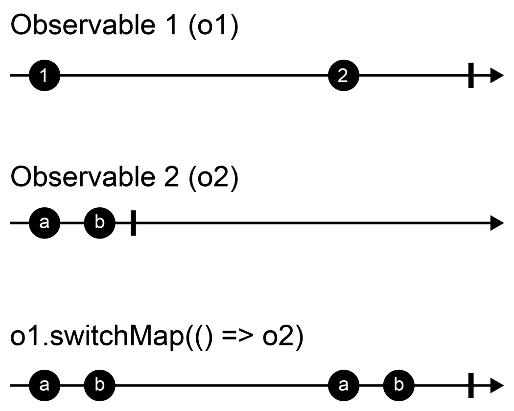
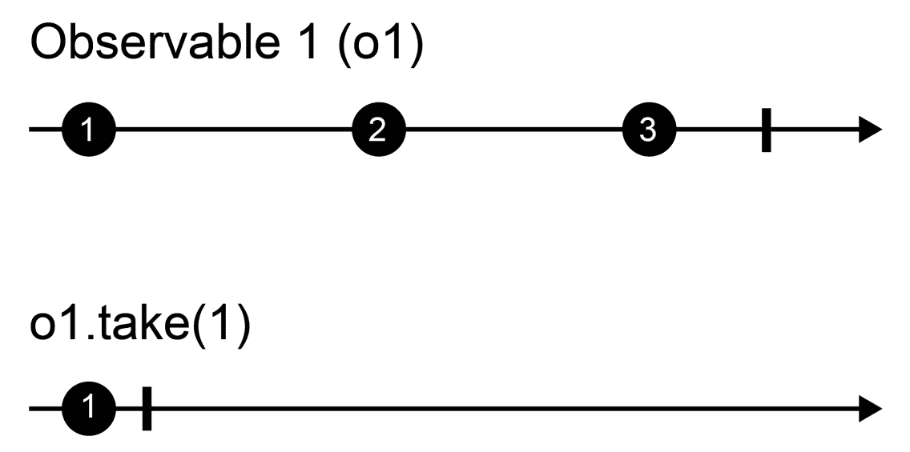
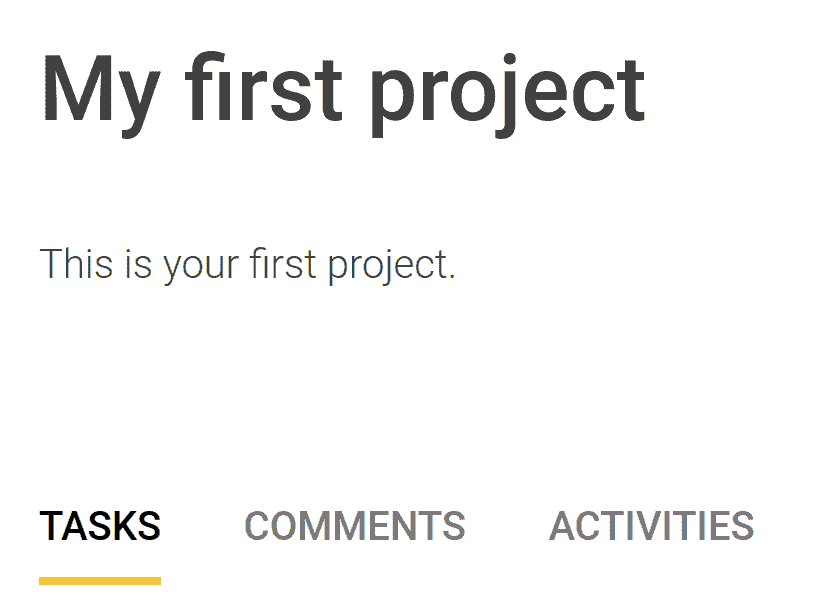
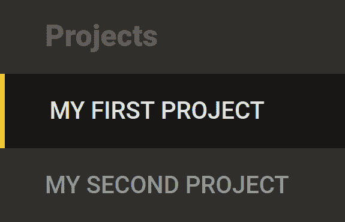
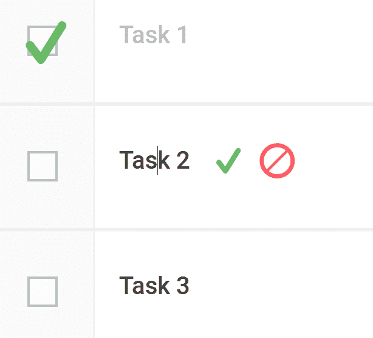
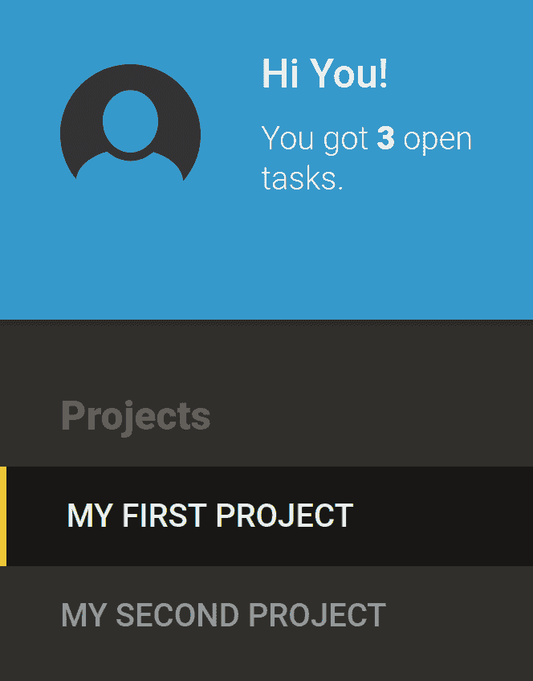
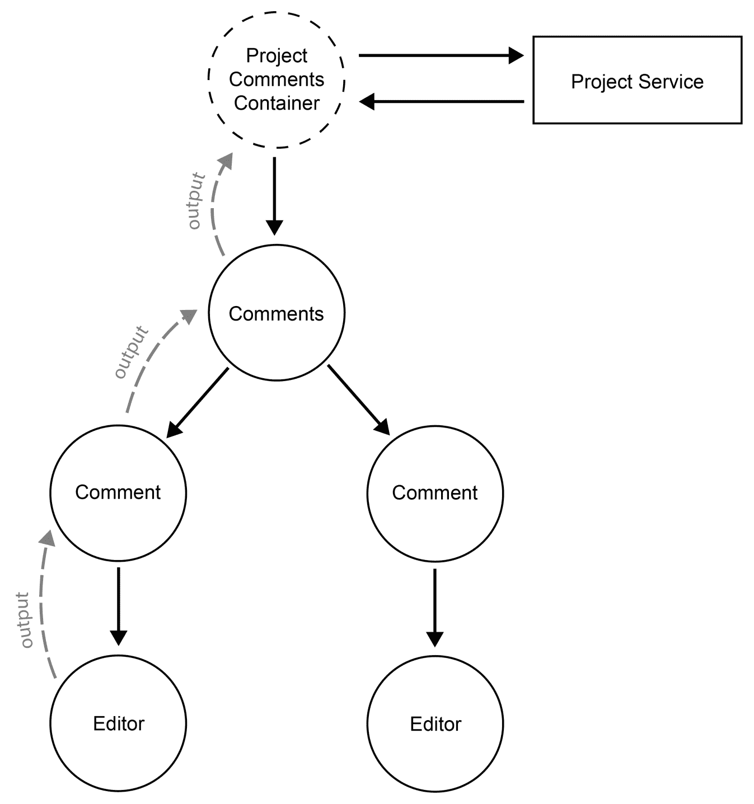
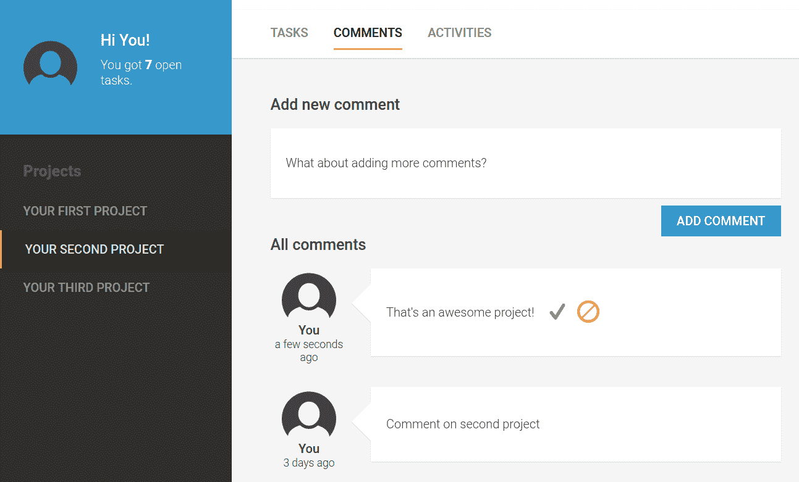
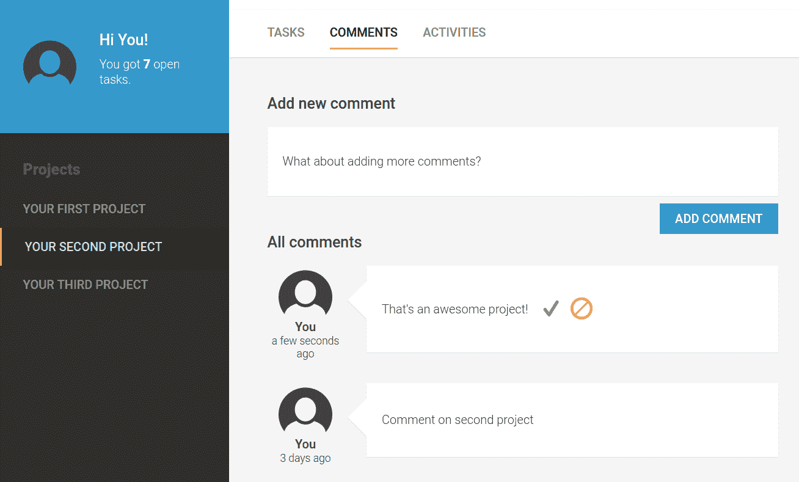

# 第四章：以项目思维思考

是时候考虑更宏大的目标了。到目前为止，我们围绕简单任务列表的概念创建了应用程序中的所有内容。然而，我们想要构建比这更大的东西。用户应该能够将他们的任务组织到项目中。在本章中，我们将围绕我们的任务列表引入一个框架，使其感觉像一个完整的应用程序。通过引入项目组件、主要导航、标签界面和用户区域，我们正朝着最终应用程序的外观迈出重要一步。

我们将创建一个可重用的就地编辑器组件，并将其应用于我们应用程序中的许多现有区域。借助这个编辑器，我们系统的用户体验将大大提升，我们的用户将开始感受到底层响应式架构。

在本章中，我们还将创建一个评论系统，我们将以允许我们在任何我们希望用户放置评论的地方放置它的方式构建它。

应用程序安全和适当用户管理不在此书的范围之内。然而，我们将创建一个模拟已登录用户的虚拟用户服务。这个服务将被评论系统使用，并且我们将重构现有的组件以利用它。

在本章中，我们将涵盖以下主题：

+   引入新的项目组件和额外的容器组件

+   两个新的 RxJS 操作符`switchMap`和`take`

+   为项目详情导航创建一个标签界面组件

+   使用内容投影创建导航 UI 组件

+   使用`contenteditable`创建就地编辑器

+   使用`@HostBinding`和`@HostListener`将组件成员绑定到宿主元素属性和事件

+   使用`@ViewChild`装饰器获取视图元素

+   通过使用`ElementRef` DOM 抽象执行 DOM 操作

+   创建一个允许我们在应用程序的不同区域收集用户评论的评论系统

+   使用第三方库 Moment.js 总结一个简单的管道来格式化相对时间间隔

+   创建一个允许用户就地编辑文本字段的编辑器

# 进入项目

在这个主题中，我们将实现将我们的简单任务列表移动到一个按项目组织结构的所需更改。为此，我们需要修改我们组件的主要布局，并引入一个代表我们项目的新的组件。

# 项目服务

首先，让我们更新我们的应用程序模型以包括项目数据。为此，我们将创建一个项目的新模型，并更新我们的任务模型以添加一个项目 ID。

打开`src/app/model.ts`文件并应用以下更改：

```js
export interface Task {
  readonly id?: number;
  readonly projectId?: number;
  readonly title: string;
  readonly done: boolean;
}

export type TaskListFilterType = 'all' | 'open' | 'done';

export interface Project {
 readonly id?: number;
 readonly title: string;
 readonly description: string;
}
```

每个任务现在都包括一个指向项目的引用。项目实体包括一个 ID、单个标题和描述属性。让我们也更新我们的内存中 Web API 数据库。打开`src/app/database.ts`文件并应用以下更改：

```js
import {InMemoryDbService} from 'angular-in-memory-web-api';
import {Project, Task} from './model';

export class Database implements InMemoryDbService {
  createDb() {
    const projects: Project[] = [
 {id: 1, title: 'My first project', description: 'This is your first project.'},
 {id: 2, title: 'My second project', description: 'This is your second project.'}
 ];

    const tasks: Task[] = [
      {id: 1, projectId: 1, title: 'Task 1', done: false},
      {id: 2, projectId: 1, title: 'Task 2', done: false},
      {id: 3, projectId: 1, title: 'Task 3', done: true},
      {id: 4, projectId: 1, title: 'Task 4', done: false}
    ];

    return {projects, tasks};
  }
}
```

我们在我们的数据库中添加了两个项目，并更新了所有任务以包含对两个项目中的第一个项目的引用。

现在，我们需要一个服务来访问我们的项目，我们还应该更新我们的任务服务以包括一个允许我们查询属于特定项目任务的方法。

首先，让我们将更改应用到现有的任务服务中。打开`src/app/tasks/task.service.ts`文件并实现以下更改。有效的更改以粗体显示，省略号字符表示与更改应用无关的更多代码：

```js
import {Injectable} from '@angular/core';
import {HttpClient} from '@angular/common/http';
import {BehaviorSubject} from 'rxjs';
import {map} from 'rxjs/operators';
import {Task} from '../model';

@Injectable()
export class TaskService {
  …

 getProjectTasks(projectId: number) {
 return this.tasks
 .asObservable()
 .pipe(
 map((tasks) => tasks.filter((task) => task.projectId === projectId))
 );
 }
}
```

添加的`getProjectTasks`方法提供了一个映射的可观察对象，它接受我们的源任务主题，并将每个任务数组映射以生成一个过滤后的任务数组，该数组仅包含特定项目的任务。

好的，现在我们需要创建一个新的服务，允许我们从我们的内存中 Web API 数据库获取项目信息。让我们使用 Angular CLI 创建一个新的服务：

```js
ng generate service --spec false project/project
```

Angular CLI 应该在`src/app/project/project.service.ts`路径上创建我们的服务。让我们打开该文件并将其内容替换为以下代码：

```js
import {Injectable} from '@angular/core';
import {HttpClient} from '@angular/common/http';
import {BehaviorSubject, Observable, combineLatest} from 'rxjs';
import {map} from 'rxjs/operators';
import {Project} from '../model';

@Injectable()
export class ProjectService {
  private projects = new BehaviorSubject<Project[]>([]);
  private selectedProjectId = new BehaviorSubject<number>(1);
  private selectedProject: Observable<Project>;

  constructor(private http: HttpClient) {
    this.loadProjects();
    this.selectedProject = combineLatest(this.projects, this.selectedProjectId)
      .pipe(
        map(([projects, selectedProjectId]) =>
        projects.find((project) => project.id === selectedProjectId)
      )
    );
  }

  private loadProjects() {
    this.http.get<Project[]>('/api/projects')
      .subscribe((projects) => this.projects.next(projects));
  }

  selectProject(id: number) {
    this.selectedProjectId.next(id);
  }

  getSelectedProject() {
    return this.selectedProject;
  }
}
```

让我们简要讨论前面的代码更改。我们的项目服务包含三个成员：

+   **projects: BehaviorSubject<Project[]>**

    `projects`成员行为主题在从我们的数据库加载后发射整个项目列表。这个主题是我们服务中所有操作的基础。

+   **selectedProjectId: BehaviorSubject<number>**

    由于我们需要知道在我们的应用程序中哪个项目当前被选中，因此我们需要在我们的服务中存储这个信息。我们使用行为主题来发射当前选中的项目 ID。这允许我们通过`selectedProjectId`简单地发射一个项目 ID，如果我们想选择一个特定的项目。

+   **selectedProject: Observable<Project>**

    `selectedProject`可观察对象将始终发射当前选中的项目。我们将使用`combineLatest`来确保如果`projects`或`selectedProjectId`发射了变化。我们将通过`selectedProject`可观察对象流重新发射更新的选中项目。

在我们的服务构造函数中，我们首先调用`loadProjects`方法来进行 HTTP 调用到我们的内存中 Web API 数据库以获取项目列表。在`loadProjects`方法中，我们遵循与我们的任务服务相同的模式。我们订阅 HTTP 服务可观察对象，并通过我们内部的`projects`主题发射结果项。

在构造函数中执行 `loadProjects` 方法之后，我们将创建 `selectedProject` 可观察对象。我们将使用已经在上一章中讨论过的 `combineLatest` 来将 `projects` 和 `selectedProjectId` 主题组合成一个单一的可观察流。每当这两个输入可观察对象中的任何一个发出事件时，`combineLatest` 将将两个输入可观察对象的最新结果组合成一个单一的项目，并通过输出可观察流发出。我们使用 map 操作符从项目列表中提取选定的项目，并将其作为项目返回到可观察输出流中。

最后，`selectProject` 方法仅仅是通过 `selectedProjectId` 主题发出新的项目 ID。由于我们在这个使用 `combineLatest` 创建的 `selectedProject` 可观察对象中使用这个主题，这个变化将导致 `selectedProject` 可观察对象重新发出当前选定的项目。

作为最后一步，我们需要将我们的新服务添加到应用模块提供者中。让我们打开 `src/app/app.module.ts` 文件并应用以下更改：

```js
…
import {ProjectService} from './project/project.service';

…
  providers: [ProjectService, TaskService],
…
```

现在，关于我们项目服务的部分就到这里了。我们以高度反应性的方式创建了我们的服务，其中我们存储所有状态在 RxJS 行为主题中，并响应变化、转换流，并在需要通信更新时发出。

# 项目组件

我们已经实现了处理我们项目所需的模型、数据和状态的所有必要更改。现在，是时候继续到显示我们的项目和它们所属的任务所需的组件了。

让我们从使用 Angular CLI 创建项目组件开始：

```js
ng generate component --spec false -ve none -cd onpush project/project
```

首先，让我们通过替换以下代码来更改位于 `src/app/project/project/project.component.ts` 的组件类文件：

```js
import {ChangeDetectionStrategy, Component, Input, ViewEncapsulation} from '@angular/core';
import {Project} from '../../model';

@Component({
  selector: 'mac-project',
  templateUrl: './project.component.html',
  styleUrls: ['./project.component.css'],
  encapsulation: ViewEncapsulation.None,
  changeDetection: ChangeDetectionStrategy.OnPush
})
export class ProjectComponent {
  @Input() project: Project;
}
```

这里没有什么特别之处。我们创建了一个简单的项目组件，它接受一个项目对象作为输入。让我们继续我们的新组件模板，并更改位于 `src/app/project/project/project.component.ts` 的文件内容：

```js
<header class="header">
  <h2 class="title">{{project.title}}</h2>
  {{project.description}}
</header>
<mac-task-list-container>
</mac-task-list-container>
```

在我们的模板中，我们首先渲染项目标题，它由我们项目的标题和描述组成。在项目标题之后，我们想要渲染所有项目任务。我们可以通过包含任务列表容器组件来实现这一点。

# 更新任务列表容器

关于我们的项目组件的部分就到这里了。然而，我们的任务列表容器仍然以处理所有可用任务的方式实现，并不知道任何关于项目的信息。让我们通过修改位于 `src/app/container/task-list-container.component.ts` 的组件类来改变这一点。更改的部分以粗体显示，而无关部分则被省略号字符隐藏：

```js
…
import {Project, Task, TaskListFilterType} from '../../model';
import {map, switchMap, take} from 'rxjs/operators';
import {ProjectService} from '../../project/project.service';

@Component({
  selector: 'mac-task-list-container',
  templateUrl: './task-list-container.component.html',
  encapsulation: ViewEncapsulation.None,
  changeDetection: ChangeDetectionStrategy.OnPush
})
export class TaskListContainerComponent {
  selectedProject: Observable<Project>;
  …

  constructor(private taskService: TaskService, private projectService: ProjectService) {
    this.selectedProject = this.projectService.getSelectedProject();

 this.tasks = this.selectedProject.pipe(
 switchMap((project) => this.taskService.getProjectTasks(project.id))
 );

    …
  }

  …

  addTask(title: string) {
    this.selectedProject
 .pipe(
 take(1)
 )
 .subscribe((project) => {
 const task: Task = {
 projectId: project.id, title, done: false
 };
 this.taskService.addTask(task);
 });
  }

  …
}
```

首先，我们引入一个名为 `selectedProject` 的新成员，它是一个我们从项目服务获取的可观察流。在我们的组件构造函数中，我们注入项目服务，并通过在服务上调用 `getSelectedProject` 方法来接收可观察对象。如果你还记得上一个主题，这个可观察对象将始终在我们的应用程序中发射当前所选项目。

在构造函数中，我们还需要改变我们获取任务列表的方式。从现在开始，我们将在容器内使用的任务列表始终依赖于所选项目。为了实现这一点，我们将研究一个新的 RxJS 操作符，称为 `switchMap`。

让我先尝试用一句话解释 `switchMap` 的工作原理。它接受一个可观察流，并为每个发射的项目连接一个不同的可观察流到输出。这可能听起来有些令人困惑，所以为了让你更好地掌握这个新概念，让我们看看一个简化的例子：

```js
import {from, interval} from 'rxjs';
import {switchMap} from 'rxjs/operators';

const o1 = interval(1000);
const o2 = from(['a', 'b']);

o1.pipe(
 switchMap(() => o2)
).subscribe((item) => console.log(item));
```

之前的例子使用 `switchMap` 将一个可观察对象 **(o2)** 连接到一个新的输出可观察对象，每次源可观察对象 **(o1)** 发射一个项目时。我们使用 `interval` 辅助函数创建一个每秒发射一个项目的可观察对象。对于第二个可观察对象 **(o2)**，我们使用 `from` 辅助函数生成一个发射字符串 **a** 和 **b** 作为单独项目的可观察对象序列。之后，我们使用 `switchMap` 操作符，它将创建一个新的输出可观察对象，将我们的 **(o2)** 可观察对象连接到输出，每当源可观察对象 **(o1)** 发射新项目时。因此，之前的例子将每秒将字符串 **a** 和 **b** 记录到控制台：



一个流图显示了 `switchMap` 操作符的行为

如果你习惯了 Promises，那么你也可以将 `switchMap` 操作符视为在 `then` 函数中返回新的 Promises 来构建异步 Promise 链：

```js
function timer(time) {
  return new Promise(resolve => setTimeout(resolve, time));
}

timer(1000)
 .then(() => timer(1000))
 .then(() => timer(1000))
 .then(() => timer(1000))
 .then(() => console.log('After 4 seconds!'));
```

通过链式调用 Promises，我们可以按顺序执行四个不同的异步操作。`switchMap` 操作符的行为几乎相同，但我们可以链式调用四个不同的可观察对象：

```js
import {timer} from 'rxjs';
import {switchMap} from 'rxjs/operators';

timer(1000).pipe(
 switchMap(() => timer(1000)),
 switchMap(() => timer(1000)),
 switchMap(() => timer(1000))
).subscribe((item) => console.log('After 4 seconds!'));
```

好的，我们已经了解了 `switchMap` 操作符以及我们如何使用它来按顺序链式调用多个异步操作。现在，让我们回到我们的任务列表容器组件，看看我们如何将这个概念应用到获取项目任务。以下核心摘录仅显示我们在任务列表容器组件中已经使用的相关更改部分：

```js
…  
this.tasks = this.selectedProject.pipe(
 switchMap((project) => this.taskService.getProjectTasks(project.id))
);
…
```

在我们的情况下，我们使用`switchMap`操作符将`selectedProject`可观察对象作为输入，并切换到通过`getProjectTasks`调用获得的可观察对象。这项技术允许我们将两个异步操作，获取选择的项目和接收任务，按顺序串联起来。在`switchMap`操作符的回调中，我们接收选择的项目对象，并使用项目的 ID 来获取项目任务的可观察对象。

现在，每当`selectedProject`可观察对象发出新的值时，我们的任务可观察对象也会发出所选项目的最新任务。非常好，非常响应式。

好的！只剩下一个变更需要讨论。让我们专注于`addTask`方法中的变更。由于我们的任务模型现在也包括一个`projectId`属性，我们需要确保每次创建任务时都添加正确的项目 ID。

在`addTask`方法的代码变更中，我们使用了另一个未知的 RxJS 操作符`take`。不用担心，`take`操作符的工作方式比`switchMap`操作符更直接。再次，让我们从简化开始：

```js
import {from} from 'rxjs';
import {take} from 'rxjs/operators';

from([1, 2, 3]).pipe(
 take(1)
).subscribe((item) => console.log(item));
```

之前示例中的代码将在控制台打印数字一。在经过`take`操作符转换后，数字二和三将不会被输出流发出。`take`操作符将创建一个新的可观察对象流，该流将只发出通过传递给它的参数指定的项目数。在指定的项目数发出后，该流将自行关闭，即使调用取消订阅所有父流：



使用`take`操作符将具有三个发射的输入可观察对象转换为只有一个发射的输出可观察对象

`take`操作符在我们的行为主题上特别引人注目，当你想在发出的项上执行一次性操作时。由于行为主题总是在新的订阅中发出最新的项，我们可以使用`take`操作符立即提取行为主题的最新值并对其进行操作。

让我们再次查看更新后的`addTask`方法的代码，看看我们是如何以及为什么在那里使用`take`操作符的：

```js
…
addTask(title: string) {
  this.selectedProject
 .pipe(
 take(1)
 )
 .subscribe((project) => {
 const task: Task = {
 projectId: project.id, title, done: false
 };
 this.taskService.addTask(task);
 });
}
…
```

首先，我们需要了解`addTask`方法在什么时间点被调用。这个调用发生在用户在用户界面中点击添加任务按钮时。我们现在真正想要做的就是获取我们`selectedProject`可观察对象的最新的值，以便我们可以使用项目 ID 来创建与该项目关联的任务。然而，如果我们以通常的方式订阅了`selectedProject`可观察对象，我们会在`addTask`方法中保持这些订阅永远活跃。这种行为意味着当我们继续调用此方法时，比如说，十次，每次选择项目发生变化时，这十个订阅都会再次触发并创建一些不想要的重复任务。

使用`take`操作符，我们可以防止这种行为。它允许我们创建一个可观察对象流，一旦达到所需数量的项目通过，它将自动取消订阅。当我们将数字一作为项目计数参数传递给`take`操作符时，我们只需从源流中取一个项目，并创建一个仅对这一个项目有效的订阅。

那就是任务列表容器组件中的所有更改。到目前为止，我们已经创建了一个新的项目服务，更新了现有的任务服务，创建了一个项目组件，并更新了我们的任务列表容器组件以处理当前选中的项目。最后要做的就是将我们的项目组件作为顶级组件集成到整体应用程序中。

# 集成项目组件

在这个主题中，我们将整合到目前为止应用到我们的应用程序中的更改。目前，我们的根组件正在直接渲染任务列表容器组件，这我们需要更改以渲染我们的项目。

我们可以直接在我们的应用程序根组件中渲染项目 UI 组件，然而，我们已经了解到我们永远不应该在没有容器组件来分离我们的状态关注点的情况下包含顶级组件。

让我们修复这个问题，并使用 Angular CLI 创建一个项目容器组件：

```js
ng generate component --spec false -ve none -cd onpush container/project-container
```

在组件占位符生成后，打开`src/app/container/project-container/project-container.component.ts`文件，并应用以下更改：

```js
import {Component, ChangeDetectionStrategy, ViewEncapsulation} from '@angular/core';
import {Observable} from 'rxjs';
import {Project} from '../../model';
import {ProjectService} from '../../project/project.service';

@Component({
  selector: 'mac-project-container',
  templateUrl: './project-container.component.html',
  styleUrls: ['./project-container.component.css'],
  encapsulation: ViewEncapsulation.None,
  changeDetection: ChangeDetectionStrategy.OnPush
})
export class ProjectContainerComponent {
  selectedProject: Observable<Project>;

  constructor(private projectService: ProjectService) {
    this.selectedProject = projectService.getSelectedProject();
  }
}
```

这里没有太多花哨的东西。我们正在使用项目服务来获取当前选中项目的可观察对象。我们将使用这个可观察对象来渲染我们的项目 UI 组件。让我们打开位于`src/app/container/project-container/project-container.component.html`的新容器组件的视图模板，并用以下代码替换占位符模板：

```js
<mac-project [project]="selectedProject | async">
</mac-project>
```

此外，视图模板极其简单。然而，我们不应因为事物看起来过于简单而不值得包装就跳过数据容器组件。你应该始终坚持规则，即每个顶级组件都需要一个容器组件来处理数据和状态问题。这将在未来为你节省大量时间。

现在，是时候将项目容器组件包含到我们的根组件视图中了。同时，我们也会稍微调整我们的应用程序布局，并进一步接近我们最终的应用程序外观。

让我们打开位于`src/app/app.component.html`的根组件视图模板，并应用以下更改：

```js
<aside class="side-nav"></aside>
<main class="main">
  <mac-project-container></mac-project-container>
</main>
```

我们还添加了两个布局元素以及我们新创建的项目容器组件。这就是我们将项目组件集成到我们的应用程序中的所有更改。

# 概述

恭喜！你已经成功地将项目功能的第一个版本实现到了我们的应用程序中。在这个主题中，我们创建了很多东西。除了构建模型和数据库、服务和组件之外，我们还通过创建和包含一个新的项目容器组件成功集成了我们的功能。请继续在你的浏览器中预览我们的更改。我希望你对结果感到满意，并期待进一步的改进。

让我们总结一下在这个主题中我们所做的工作：

+   创建并更新了我们的模型以包含项目

+   实现了一个新的项目服务来获取项目数据，并更新了现有的任务服务以处理项目任务

+   我们创建了一个新的项目组件以及一个项目容器组件，以将我们的 UI 与状态和数据关注点分离

+   我们更新了任务列表容器组件，使其使用活动项目信息来仅显示相关的项目任务

+   我们学习了 RxJS 中的`switchMap`和`take`操作符以及如何在我们的应用程序中使用它们

+   我们将根组件视图更新为包含我们的项目容器组件，而不是任务列表容器

# 创建一个分页界面组件

让我们向项目中引入一个新的 UI 组件，该组件将为我们提供一个分页界面，我们可以用它来在项目组件内部进行导航。我们希望将项目视图划分为不同的区域，这些区域可以通过这个分页界面访问：



我们将要创建的分页界面截图

在我们创建一个新的组件来渲染标签之前，我们将更新我们的模型以声明一个接口，该接口用于表示单个标签。打开`src/app/model.ts`文件并应用以下更改：

```js
…
export interface Tab {
 readonly id: any;
 readonly title: string;
}
```

我们的标签将始终包含一个标题和一个 ID，这在以后我们需要区分单个标签时将非常有用。接下来，我们将创建我们的标签组件。使用 Angular CLI，我们可以创建我们新组件的占位符：

```js
ng generate component --spec false -ve none -cd onpush ui/tabs/tabs
```

让我们打开位于`src/app/ui/tabs/tabs.component.ts`的组件类，并添加以下代码：

```js
import {
  ChangeDetectionStrategy, Component, EventEmitter, Input, Output, ViewEncapsulation
} from '@angular/core';
import {Tab} from '../../model';

@Component({
  selector: 'mac-tabs',
  templateUrl: './tabs.component.html',
  styleUrls: ['./tabs.component.css'],
  encapsulation: ViewEncapsulation.None,
  changeDetection: ChangeDetectionStrategy.OnPush
})
export class TabsComponent {
  @Input() tabs: Tab[];
  @Input() activeTab: Tab;
  @Output() outActivateTab = new EventEmitter<Tab>();

  activateTab(tab: Tab) {
    this.outActivateTab.emit(tab);
  }
}
```

我们遵循简单和“纯”组件的概念，并且只使用输入来确定我们应该如何渲染我们的标签。此外，当一个标签被激活时，我们将调用`activateTab`方法，然后通过`outActivateTab`输出发出。到现在为止，你应该非常熟悉这个组件类及其背后的概念。`tabs`输入预期是一个标签对象的列表，我们已经在模型中创建了一个接口。让我们打开位于`src/app/ui/tabs/tabs.component.html`的组件视图模板，并用以下代码替换其内容：

```js
<ul class="tab-list">
  <li *ngFor="let tab of tabs"
      class="tab-list-item">
    <button class="tab-button"
            [class.tab-button-active]="activeTab?.id === tab.id"
            (click)="activateTab(tab)">{{tab.title}}</button>
  </li>
</ul>
```

我们正在遍历我们的标签列表，并为每个标签渲染一个按钮作为有效的标签元素。在标签按钮上，我们根据当前重复的标签是否与传递给我们的组件作为活动标签的标签相同来设置一个类。这将使我们的活动标签看起来与其它不同。当用户点击其中一个标签时，我们将调用`activateTab`方法并将点击的标签对象作为参数传递。回到组件代码，你可以看到我们随后通过`outActivateTab`输出发射这个标签。

好的，这就是我们标签组件所需的所有内容。让我们在我们的项目组件中使用标签，并提供一个标签界面来访问项目详情。

首先，让我们打开位于`src/app/project/project/project.component.ts`的项目组件类，并按照以下更改更新我们的代码：

```js
import {ChangeDetectionStrategy, Component, EventEmitter, Input, Output, ViewEncapsulation} from '@angular/core';
import {Project, Tab} from '../../model';

…
export class ProjectComponent {
  @Input() project: Project;
 @Input() tabs: Tab[];
 @Input() activeTab: Tab;
 @Output() outActivateTab = new EventEmitter<Tab>();

 activateTab(tab: Tab) {
 this.outActivateTab.emit(tab);
 }
}
```

我们将在我们的项目组件中使用标签组件，因此我们需要提供必要的输入并处理标签组件的输出。因此，我们的项目组件现在也将包含输入`tabs`和`activeTab`。

我们从上一章第三章，*处理数据和状态*中学到了，我们的 UI 组件应该始终将输出委托到容器组件。遵循这个概念将确保我们将状态和数据操作与 UI 组件分离，这将显著提高代码的整体可维护性。由于我们的标签组件会通知我们活动标签的变化，我们将通过委托并仅重新发射`outActivateTab`输出来响应这一变化。

好的，让我们打开位于`src/app/project/project/project.comonent.html`的项目视图模板，并按照以下更改进行编辑：

```js
<header class="header">
  <h2 class="title">{{project.title}}</h2>
  {{project.description}}
</header>
<mac-tabs [tabs]="tabs"
 [activeTab]="activeTab"
 (outActivateTab)="activateTab($event)">
</mac-tabs>
<mac-task-list-container *ngIf="activeTab.id === 'tasks'">
</mac-task-list-container>
```

我们正在渲染我们的标签组件，将标签对象和接收到的当前活动标签作为输入传递给项目组件。我们还将监听标签组件上的标签激活输出，并在项目组件内调用`activateTab`方法。

我们还使用活动标签的信息来决定是否渲染任务列表容器组件。只有当当前活动标签的 ID 等于“tasks”时，我们才会渲染任务列表。

好的，现在我们需要确保我们将所需的数据传递给项目组件。我们还需要确保当一个标签被激活时，我们对应用程序状态进行必要的更改。项目容器组件渲染项目组件，所以让我们打开位于`src/app/container/project-container/project-container.component.ts`的组件类，并应用以下更改：

```js
…
import {Project, Tab} from '../../model';

…
export class ProjectContainerComponent {
  selectedProject: Observable<Project>;
 tabs: Tab[] = [
 {id: 'tasks', title: 'Tasks'},
 {id: 'comments', title: 'Comments'},
 {id: 'activities', title: 'Activities'}
 ];
 activeTab: Tab = this.tabs[0];

  …
 activateTab(tab: Tab) {
 this.activeTab = tab;
 }
}
```

由于我们现在处于容器组件中，存储状态并在该状态上执行操作是可以的。我们添加了一个标签对象列表，我们已经提前思考了一些。评论标签页将用于切换到我们在本章后面将要构建的评论系统。活动标签页将在本书的后续章节中使用。

我们还使用`activeTab`成员存储当前激活的标签页，并用我们标签列表中的第一个标签初始化它。

`activateTab`方法中的代码看起来几乎太简单，以至于不像是正确的。我们只是在接受一个标签对象作为参数，并更新我们的`activeTab`成员。

现在，为了使用我们的标签组件，我们只剩下更新项目容器组件内的绑定。让我们打开位于`src/app/container/project-container/project-container.component.html`的组件视图模板，并应用以下更改：

```js
<mac-project [project]="selectedProject | async"
             [tabs]="tabs"
 [activeTab]="activeTab"
 (outActivateTab)="activateTab($event)">
</mac-project>
```

这很简单，对吧？这次最后的更改已经包含了提供友好标签页界面所需的所有内容，针对我们的项目组件。我们将利用`activeTab`属性来激活我们项目更多的详细视图。目前，任务标签页是唯一一个在我们的用户界面中启用功能的标签页，但随着我们继续添加功能，我们也将使用其他两个标签页进行导航。

# 构建主要导航

在本章中，我们已经在我们的应用程序中添加了一个项目功能，我们还添加了一个标签页界面来导航项目的详细信息。然而，目前还没有方法在项目之间进行导航。这正是我们现在要改变的地方。在本节中，我们将创建组件来构建我们的主要导航。然后我们将将其集成并使用它来在应用程序中导航到所有现有的项目：



我们将在本书的这一节中构建的主要导航的截图

我们正在设计我们的导航组件，以便我们可以在任何情况下快速使用它们。为了实现这个目标，我们将探讨 Angular 中的一个新概念，称为内容投影。通过使用内容投影，我们可以达到组件组合的新水平。

# 使用内容投影进行组合

内容投影允许你将父组件中的一个视图部分插入到其子组件中。当涉及到组合时，这个概念是一个强大的工具。通过所谓的插槽，我们可以在子组件中标记一个位置，以便给父组件提供传递视图部分的机会。

让我们看看一个简单的内容投影示例，这有助于我们理解它能做什么：

```js
@Component({ 
  selector: 'mac-reveal-content', 
  template: ` 
    <h2 (click)="showContent = !showContent">{{revealTitle}}</h2>
    <div *ngIf="showContent" class="content">
      <ng-content></ng-content>
    </div>
  ` 
}) 
export class RevealContentComponent {
  @Input() title: string;
  showContent = false;
} 

@Component({ 
  selector: 'mac-root', 
  template: ` 
    <mac-reveal-content revealTitle="Click to show more">
      <p>I'm the content which is shown or hidden when you click the above title</p>
    </mac-reveal-content>
  `
})
export class AppComponent {}
```

前面的示例展示了一个简单的 UI 组件，称为内容揭示组件。它显示了一个我们可以点击以显示或隐藏内容的标题。在许多情况下，这种行为都是有利的，并且类似于手风琴或可折叠组件的概念。

在这个示例中有两个独特的地方，你应该感到不熟悉。我还为你突出显示了这两行代码，这样你可以立即看到它们。

在我们的内容揭示组件中，我们使用`<ng-content>`元素来标记从父组件投影内容的位置。这个元素也被称为内容投影槽，你可以在组件视图中拥有多个这样的槽。

第二件事，这是我们迄今为止从未做过的事情，是在前一个示例的应用组件中。我们在内容揭示组件的开启和关闭标签之间放置了一些模板代码。通常，一个组件会消除放入其宿主元素中的任何模板代码。然而，在这样做之前，它首先检查子组件是否包含内容投影槽。如果子组件中有内容投影槽，它将把在宿主元素中找到的任何视图部分投影到子组件指定的位置。这就是我们使用`<ng-content>`元素标记的位置。

内容投影和投影槽是从 Web 组件 Shadow DOM 规范中借用的概念。Angular 目前默认不使用 Shadow DOM，因此这种行为是模拟的。然而，概念是相同的。如果你熟悉 Angular.js，Angular 的第一个版本，内容投影与 Angular.js 中的 transclusion 概念非常相似。

此外，我们可以在`<ng-content>`元素上使用一个选择属性来设置类似于 CSS 的选择器。这个选择器将被用来选择性地选择那些应该被投影到特定内容槽中的元素。通过这种方式，你可以拥有多个内容槽，它们覆盖不同的需求。

来自组件宿主元素的元素只能投影一次，并且这种内容投影是通过按顺序通过所有`<ng-content>`元素进行投影来实现的，任何匹配的元素都会被投影。如果你在模板中有多个竞争的内容投影槽，第一个将获胜并接收被投影到你的组件中的元素。

让我们看看另一个示例，以说明这种行为：

```js
@Component({ 
  selector: 'mac-multi-projection', 
  template: `
    <header class="title">
      <ng-content select="h1"></ng-content>
    </header>
    <main class="rest-content">
      <ng-content></ng-content>
    </main>
  `
}) 
export class MultiProjectionComponent {}

@Component({
  selector: 'mac-root',
  template: `
    <mac-multi-projection>
      <h1>This title will be projected in the first slot</h1>
      <p>Any other element will be projected into the second, generic slot</p>
    </mac-multi-projection>
  `
})
export class AppComponent {}
```

前面的示例展示了如何使用`<ng-content>`元素上的`select`属性进行选择性的内容投影。由于我们使用了一个匹配所有`h1`元素的 CSS 选择器，`h1`标题元素被投影到第一个内容投影槽中。第二个内容槽没有包含`select`属性，因此接受所有其他被投影到组件中的元素。

# 创建导航组件

我们将从三个单独的组件构建我们的导航。让我们快速看看它们的目的：

+   **导航项组件**：代表我们导航中的一个导航项。其职责是渲染导航项的标题以及当项被激活时的行为。

+   **导航部分组件**：这个组件用于在视觉上将属于一起的导航项分开。我们可以使用这个组件将导航项分组在标题下。这种分组使得我们的用户更容易找到他们正在寻找的导航项。

+   **导航组件**：这个组件负责将整个导航组合在一起。它只是一个容器，将我们的导航部分组件组合在一起。

通过使用选择性的内容投影，我们可以提供一个优秀的内容 API，这使得在任何情况下使用我们的导航组件变得容易。构建基于内容的 API 的好处是我们可以通过在视图模板中包含它们来组合我们的组件。 

让我们从创建三个组件中的最低级组件开始，即导航项：

```js
ng generate component --spec false -ve none -cd onpush ui/navigation-item/navigation-item
```

让我们打开位于`src/app/ui/navigation-item/navigation-item.component.html`的视图模板，并使用以下代码更改其内容：

```js
{{title}}
```

是的，我知道，这看起来太简单以至于不真实。但这正是我们导航项组件视图中所需要的所有内容。让我们继续到位于`src/app/ui/navigation-item/navigation-item.component.ts`的导航项组件类：

```js
import {
  ChangeDetectionStrategy, Component, EventEmitter, HostListener, Input, Output,
  ViewEncapsulation
} from '@angular/core';

@Component({
  selector: 'mac-navigation-item',
  templateUrl: './navigation-item.component.html',
  styleUrls: ['./navigation-item.component.css'],
  encapsulation: ViewEncapsulation.None,
  changeDetection: ChangeDetectionStrategy.OnPush
})
export class NavigationItemComponent {
  @Input() title: string;
  @Input() navId: any;
  @Output() outActivateNavigationItem = new EventEmitter<any>();

  @HostListener('click')
  activateNavigationItem() {
    this.outActivateNavigationItem.emit(this.navId);
  }
}
```

除了`title`输入外，该组件还接受一个名为`navId`的输入，该输入将在激活时使用。这个 ID 将帮助我们父组件检测哪个导航项被激活。

我们在组件中使用了一个之前未使用过的新装饰器。`@HostListener`装饰器是 Angular 工具集的一个方便的补充。借助主机监听器，你可以在组件的主机元素上创建事件绑定，但处理它们在你的组件内部。通常，主机元素并不直接受我们的组件控制。主机元素始终位于我们的组件放置的父组件中。然而，有时需要绑定到该元素的属性或事件。就像在我们的案例中，我们希望绑定到我们组件的主机元素的点击事件。你可以在一个方法上使用`@HostListener`装饰器来绑定该方法到主机元素上的特定事件。将你想要绑定的事件名称作为参数传递给装饰器。在我们的案例中，我们绑定到导航项主机元素的点击事件。每次点击事件被触发时，我们的`activateNavigationItem`方法将被执行。

在`activateNavigationItem`方法内部，当点击一个导航项后，我们通过`outActivateNavigationItem`输出发射特定导航项的 ID。

好的，关于我们的导航项就到这里。让我们在导航组件树中再往上一层，创建导航部分组件：

```js
ng generate component --spec false -ve none -cd onpush ui/navigation-section/navigation-section
```

导航部分组件负责将导航项组合在一起。让我们首先打开位于`src/app/ui/navigation-section/navigation-section.component.html`的视图模板并应用必要的更改：

```js
<div class="title">{{title}}</div>
<div class="item-list">
  <ng-content select="mac-navigation-item"></ng-content>
</div>
```

每个导航部分都包含一个标题以及一系列导航项。现在，我们正在使用内容投影，这是我们在上一节中讨论过的。我们在视图模板中标记了一个位置，以便从父组件中投影视图部分到导航部分组件。由于我们知道我们只想将导航项组件投影到我们的导航部分，所以我们正在使用`<ng-content>`元素上的`select`属性。通过将`select`属性设置为`mac-navigation-item`，Angular 将只投影导航项组件到这个内容槽中。

让我们也对我们的导航部分组件类`src/app/ui/navigation-section/navigation-section.component.ts`应用更改：

```js
import {ChangeDetectionStrategy, Component, Input, ViewEncapsulation} from '@angular/core';

@Component({
  selector: 'mac-navigation-section',
  templateUrl: './navigation-section.component.html',
  styleUrls: ['./navigation-section.component.css'],
  encapsulation: ViewEncapsulation.None,
  changeDetection: ChangeDetectionStrategy.OnPush
})
export class NavigationSectionComponent {
  @Input() title: string;
}
```

这个组件类很简单。我们在这里做的唯一一件事是提供一个标题输入，该输入在导航部分视图中被渲染。我们组件的其余逻辑是通过内容投影处理的，它为我们提供了一个美丽的内容 API。

现在，我们已经在应用中使用这两个组件，并将它们排列在我们的应用中的任何视图模板中。例如，我们可以编写一个导航来访问可爱的狗狗图片：

```js
<mac-navigation-section title="Dogs">
  <mac-navigation-item navId="pug" title="Pug"></mac-navigation-item>
  <mac-navigation-item navId="french-bulldog" title="French Bulldog"></mac-navigation-item>
  <mac-navigation-item navId="corgi" title="Corgi"></mac-navigation-item>
</mac-navigation-section>
```

这就是基于内容 API 的强大之处。使用内容投影，我们提供了组合复杂组件树和仅使用视图模板配置行为的能力。这带来了显著的使用便利性。不出所料，许多 Angular UI 库都在使用内容投影来创建它们的 API，仅仅是因为使用 Angular 模板声明性地配置所需的一切要容易得多。

好的，现在，让我们创建我们三个组件中的最后一个——导航组件。导航组件为我们的导航添加了一个框架，并将导航部分组合在一起：

```js
ng generate component --spec false -ve none -cd onpush ui/navigation/navigation
```

首先，让我们打开位于`src/app/ui/navigation/navigation.component.html`的导航组件的视图模板，并将其内容更改为以下代码：

```js
<nav>
  <ng-content select="mac-navigation-section"></ng-content>
</nav>
```

我们再次使用内容投影将元素投影到我们的导航视图中。这次，我们只选择导航部分组件。让我们也更改`src/app/ui/navigation/navigation.component.ts`中的组件类：

```js
import {Component, ViewEncapsulation} from '@angular/core';

@Component({
  selector: 'mac-navigation',
  templateUrl: './navigation.component.html',
  styleUrls: ['./navigation.component.css'],
  encapsulation: ViewEncapsulation.None
})
export class NavigationComponent {

}
```

好的，这就像一个组件类可能的那样简单。这个类是空的，我们没有提供任何特定的组件配置。你可能想知道为什么我们甚至需要这个组件。嗯，为了决定我们组件存在的权利，我们需要查看所有定义组件的部分。组件类可能不包含任何行为内容。然而，样式和组件视图可以提供使组件值得存在的材料。如果你使用内容投影，你通常会在你的类中拥有非常少的代码，这是完全可以接受的。只要内容投影或甚至仅封装的样式为我们开发者提供了更方便的 API，我们就应该对我们的架构感到满意。

回到整体导航组件树，事情可能会开始变得有些混乱，当涉及多个层级时这是正常的。只是为了快速回顾：

+   导航项正在渲染标题并处理当项被激活时的行为

+   导航部分渲染部分标题和项目导航项

+   导航仅投影导航部分，并作为我们导航的容器

现在，我们已经准备好使用我们的导航组件，并在我们的应用程序中将它们付诸实践！

# 提供项目导航

在本节中，我们将使用我们刚刚创建的导航组件来提供项目导航。为此，我们首先将在`src/main/app/app.component.ts`中找到的应用程序组件类中引入必要的更改。这是我们第一次处理应用程序或根组件类。由于这是我们根组件，我们将其视为容器组件，并获得了处理状态和数据的特权：

```js
import {Component, ViewEncapsulation} from '@angular/core';
import {Observable} from 'rxjs';
import {Project} from './model';
import {ProjectService} from './project/project.service';

@Component({
  selector: 'mac-root',
  templateUrl: './app.component.html',
  styleUrls: ['./app.component.css'],
  encapsulation: ViewEncapsulation.None
})
export class AppComponent {
  projects: Observable<Project[]>;
  selectedProject: Observable<Project>;

  constructor(private projectService: ProjectService) {
    this.projects = projectService.getProjects();
    this.selectedProject = this.projectService.getSelectedProject();
  }

  selectProject(id: number) {
    this.projectService.selectProject(id);
  }
}
```

在我们的应用程序组件中，我们存储了两个可观察对象。使用项目服务，我们获取了一个发出可用项目列表的可观察对象。我们还存储了一个发出当前选中项目的可观察对象。

`selectProject`方法接受一个项目 ID 作为参数，并将调用委托给我们的项目服务。这将导致所有订阅了选中项目可观察对象的观察者接收到新选中的项目。如果你记得，我们已经在我们的任务列表容器组件中使用了这个可观察对象。

让我们继续到我们的应用程序组件的视图模板，位于`src/app/app.component.html`，并应用以下更改：

```js
<aside class="side-nav">
 <mac-navigation>
 <mac-navigation-section title="Projects">
 <mac-navigation-item *ngFor="let project of projects | async"
 [navId]="project.id"
 [title]="project.title"
 [class.active]="project.id === (selectedProject | async).id"
 (outActivateNavigationItem)="selectProject($event)">
 </mac-navigation-item>
 </mac-navigation-section>
 </mac-navigation>
</aside>
<main class="main">
  <mac-project-container></mac-project-container>
</main>
```

我们正在使用我们的导航组件在为主导航预留的空间中创建项目导航。目前，我们正在渲染属于我们项目的单个导航部分。通过使用`NgFor`指令，我们在可用项目列表中为每个项目重复一个导航项组件。我们将项目 ID 绑定到`navId`输入，以及将项目标题绑定到导航项的`title`输入。此外，如果特定项目当前被选中，我们还在导航项组件上设置了一个活动类。

如果导航项之一被激活，我们调用应用程序组件的`selectProject`方法，并将`outActivgateNavigationItem`发出的 ID 作为`$event`传递。

就这样！你已经成功构建了一个项目导航。现在是时候在浏览器中预览你的更改了。你应该已经能够在我们数据库中添加的两个项目之间进行导航。由于我们的任务列表容器已经利用了所选项目的可观察性，因此项目之间的切换逻辑应该已经非常流畅。你可以尝试导航到第二个项目，该项目中没有任何任务。尝试添加任务并在两个项目之间切换。

# 概述

在本节中，我们创建了我们的导航组件，并使用它们来创建我们的项目导航。你已经了解了以下概念：

+   使用内容投影为你的组件构建基于内容的 API

+   内容投影槽和`<ng-content>`的使用理念

+   使用内容槽的`select`属性来选择性地投影内容

+   使用`@HostListener`装饰器将宿主元素事件绑定到组件方法

# 一个编辑器统治一切

我们将在我们的应用程序中处理大量的用户输入。因此，为我们的用户提供愉快的创作体验至关重要。用户需要能够编辑项目标题、描述和任务标题。在我们在本章后面创建的评论系统中，用户还需要能够编辑他们的评论。我们可以使用常规文本区域输入并使用对话框来编辑这些字段，但这对于现代用户界面来说似乎过于过时。原生输入字段很棒，但有时它们并不提供出色的用户体验。我们正在寻找一种在原地编辑内容的方法：



我们原地编辑器正在工作的截图，显示了保存和取消按钮

为了构建我们的原地编辑器，我们将使用 contenteditable API，这将使用户能够直接在 HTML 元素中修改内容。

以下示例说明了我们如何使用`contenteditable`属性来使 HTML 元素可编辑：

```js
<h1 contenteditable>I'm an editable title</h1> 
<p>I can't be edited</p> 
```

在一个空白 HTML 页面上运行前面的示例，并点击`h1`文本。你会看到该元素已经变为可编辑状态，你可以输入来修改其内容。

通知可编辑元素中的变化相对简单。每个可编辑的 DOM 元素都会发出一个输入事件，这将使我们能够轻松地做出反应：

```js
const h1 = document.querySelector('h1'); 
h1.addEventListener('input', event => console.log(h1.textContent); 
```

通过这个例子，我们已经创建了一个简单的原地编辑器实现，我们可以监控用户应用的变化。在本主题中，我们将使用这项标准技术来构建一个可重用的组件，我们可以在任何需要使内容可编辑的地方使用它。

# 创建一个编辑器组件

首先，让我们使用 Angular CLI 为我们的编辑器创建一个新的占位符组件：

```js
ng generate component --spec false -ve none -cd onpush ui/editor/editor
```

文件生成后，让我们打开位于`src/ui/editor/editor.component.ts`的组件类，并应用以下代码更改：

```js
import {
  AfterViewInit, ChangeDetectionStrategy, Component, ElementRef, EventEmitter, HostBinding, HostListener, 
  Input, OnChanges, Output, SimpleChanges, ViewChild, ViewEncapsulation
} from '@angular/core';

@Component({
  selector: 'mac-editor',
  templateUrl: './editor.component.html',
  styleUrls: ['./editor.component.css'],
  encapsulation: ViewEncapsulation.None,
  changeDetection: ChangeDetectionStrategy.OnPush
})
export class EditorComponent implements OnChanges, AfterViewInit {
  @ViewChild('editableContentElement') editableContentElement: ElementRef;
  @HostBinding('class.edit-mode') editMode = false;
  @Input() content: string;
  @Input() showControls: boolean;
  @Output() outSaveEdit = new EventEmitter<string>();
  @Output() outCancelEdit = new EventEmitter<never>();

  ngOnChanges(changes: SimpleChanges) {
    if (changes.content && this.editableContentElement) {
      this.setEditableContent(this.content);
    }
  }

  ngAfterViewInit() {
    this.setEditableContent(this.content);
  }

  @HostListener('click')
  focusEditableContent() {
    if (this.editMode) {
      this.editableContentElement.nativeElement.focus();
    }
  }

  saveEdit() {
    this.editMode = false;
    this.outSaveEdit.emit(this.getEditableContent());
  }

  cancelEdit() {
    this.editMode = false;
    this.setEditableContent(this.content);
    this.outCancelEdit.emit();
  }

  beginEdit() {
    this.editMode = true;
  }

  private getEditableContent() {
    return this.editableContentElement.nativeElement.textContent;
  }

  private setEditableContent(content: string) {
    this.editableContentElement.nativeElement.textContent = content;
  }
}

```

好吧，这有很多新的代码。让我们逐步分析编辑器组件的不同部分。

在我们的编辑器组件中，我们需要与原生 DOM 元素交互，我们可以通过 contenteditable API 使其可编辑。完成这一点的最简单也是最安全的方法是使用`@ViewChild`装饰器通过局部视图引用来检索 DOM 元素：

```js
@ViewChild('editableContentElement') editableContentElement: ElementRef; 
```

`@ViewChild`装饰器可以用来搜索我们的组件视图中的特定 DOM 元素或组件实例。当我们想要在视图中搜索特定的组件实例时，我们可以将组件类作为参数传递给装饰器。当搜索 DOM 元素时，我们需要传递一个字符串，该字符串应与组件视图中的一个元素的局部视图引用匹配。当我们搜索视图中的 DOM 元素时，Angular 返回一个名为`ElementRef`的类型。这个对象只是原生 DOM 元素的包装，然后你可以使用它来访问 DOM 元素。

如果我们想要在组件子树中搜索单个 DOM 元素或组件实例，我们可以使用`@ViewChild`装饰器。我们也可以使用`@ViewChildren`装饰器来搜索 DOM 元素或组件实例的列表：

| **查询装饰器** | **描述** |
| --- | --- |
| `@ViewChildren` (选择器) | 将查询当前组件的视图以获取指令或组件，并返回一个类型为`QueryList`的对象。如果视图是动态更新的，列表也会更新。当选择器参数是指令或组件类型时，查询装饰器将在我们的组件视图中搜索匹配的指令或组件，并返回指令或组件实例的列表。选择器参数也可以是一个字符串，然后用作局部视图引用名称，以查找包含此局部视图引用的 DOM 元素。 |
| `@ViewChildren` (选择器) | 将仅查询第一个匹配的组件或指令实例或包含特定局部视图引用的 DOM 元素。 |

如果您需要直接与视图子组件通信，可以使用 `@ViewChild` 和 `@ViewChildren` 装饰器来获取这些组件。有时，这可能是必需的，但应谨慎使用此技术。仅当您有无法通过使用组件输入和输出满足的要求时，直接组件通信才有意义。

有时，在组件初始化后，您需要在视图子组件上运行一些初始化代码。在这种情况下，您可以使用 `AfterViewInit` 生命周期钩子。尽管您的组件类的视图子属性在组件的构造函数中仍然是未定义的，但它们将在 `AfterViewInit` 生命周期回调之后填充和初始化。

让我们回到我们的编辑器组件代码。接下来我们要看的是编辑器组件中另一个名为 `editMode` 的属性：

```js
@HostBinding('class.edit-mode') editMode = false;
```

我们的编辑器以两种模式运行。`editMode` 属性用于我们的组件内部，以确定编辑器是在编辑模式还是显示模式。编辑器组件的默认模式是显示模式。用户可以将编辑器切换到编辑模式，在那里他/她将能够编辑编辑器内的内容。编辑完成后，他/她可以保存或取消更改。此操作也将组件切换回显示模式（此时 `editorMode` 再次为 false）。

我们使用 `@HostBinding` 装饰器有条件地设置组件宿主元素的 CSS 类 `edit-mode`。这个状态类将帮助我们根据编辑器模式不同地样式化我们的组件。

接下来，让我们看看我们组件的输入属性：

```js
@Input() content: string;
@Input() showControls: boolean;
```

`content` 输入属性可以用来从父组件设置我们的编辑器内容。此输入是必需的，用于设置编辑器在显示模式下出现的初始内容。

第二个输入属性，`showControls`，控制编辑器是否应显示控制功能。当此输入设置为 false 时，编辑器不会显示任何控制功能，因此以只读模式运行。当此属性设置为 true 时，在我们的编辑器中会显示三个 UI 控制：

+   **编辑按钮**：如果编辑器处于显示模式，则编辑按钮是编辑器上唯一可见的控制按钮。当用户点击此按钮时，编辑器组件将通过将 `editMode` 设置为 true 切换到编辑模式。

+   **保存按钮**：如果组件处于编辑模式，则只会显示此控制按钮。它用于保存用户执行的所有更改，并将组件切换回显示模式。

+   **取消按钮**：当组件处于编辑模式时，此控制按钮会与保存按钮一起显示。如果激活，组件将切换回显示模式，撤销用户在编辑器中输入的所有更改。

除了我们的输入属性外，我们还需要一些输出属性来通知外部世界关于我们编辑器内的更改。让我们快速讨论我们在组件上公开的两个输出属性：

```js
@Output() outSaveEdit = new EventEmitter<string>();
@Output() outCancelEdit = new EventEmitter<never>();
```

当用户对编辑器内容进行任何更改并点击保存按钮后，`outSaveEdit` 输出会发出更新后的内容。

我们的编辑器组件以简单的方式工作。如果组件处于编辑模式，它显示一个可以使用 contenteditable API 进行编辑的元素。然而，一旦编辑器切换回显示模式，我们看到的是一个不同的元素，该元素无法编辑。CSS 通过将修饰类设置为通过宿主元素属性绑定到 `editMode` 标志来控制可见性。

Angular 无法控制我们可编辑元素内的内容。我们通过使用原生 DOM 操作手动控制此内容。让我们看看我们是如何做到这一点的：

```js
private getEditableContent() {
  return this.editableContentElement.nativeElement.textContent;
}

private setEditableContent(content: string) {
  this.editableContentElement.nativeElement.textContent = content;
}
```

这两个私有方法可以在我们的编辑器组件内部使用，分别用于获取我们可编辑 DOM 元素的内容或设置其内容。

我们已经讨论了我们的编辑器组件的 `editableContentElement` 属性以及我们是如何使用 `@ViewChild` 装饰器在我们的组件视图中获取可编辑元素的引用。

Angular 并没有直接提供我们一个 DOM 元素引用，而是一个类型为 `ElementRef` 的包装对象。它是原生 DOM 元素的包装，包含与 Angular 相关的附加信息。使用 `nativeElement` 属性，我们可以获取到底层原生 DOM 元素的引用。

`ElementRef` 包装器在 Angular 的平台无关架构中起着至关重要的作用。它允许你在不同的环境中运行 Angular（例如，在服务器上、原生移动设备、web workers 或其他环境）。它是组件及其视图之间的抽象层的一部分。

让我们看看我们是如何使用 `setEditableContent` 方法在我们的组件视图中设置可编辑内容的。首先，我们想确保当我们的视图准备就绪时，我们使用 `content` 组件输入中的文本初始化可编辑内容。为此，我们可以使用 `AfterViewInit` 生命周期钩子。我们还需要一种方式来响应 `content` 输入属性的变化，并基于此更新可编辑内容元素。我们可以使用生命周期钩子 `OnChanges` 来实现这个目的：

```js
ngOnChanges(changes: SimpleChanges) {
  if (changes.content && this.editableContentElement) {
    this.setEditableContent(this.content);
  }
}

ngAfterViewInit() {
  this.setEditableContent(this.content);
}
```

在 `ngOnChanges` 回调函数中，一旦检测到内容输入属性的变化，我们就可以将更改的内容反映到我们的可编辑元素上。在调用 `setEditableContent` 之前，检查 `editableContentElement` 输入是否已经设置是很重要的。由于 `OnChanges` 生命周期钩子是在 `AfterViewInit` 生命周期之前调用的，因此通过我们的 `@ViewChild` 查询获得的 `editableContentElement` 还不可用。因此，我们还需要使用 `ngAfterViewInit` 回调函数来设置我们可编辑元素的初始内容，一旦我们的组件视图已初始化。

好的，到目前为止，我们已经看到了如何将我们的组件内容输入反映到编辑器组件视图中的可编辑元素。现在，让我们看看编辑器中三个用户操作的实施。这些是编辑、保存和取消按钮的动作：

```js
saveEdit() {
  this.editMode = false;
  this.outSaveEdit.emit(this.getEditableContent());
}

cancelEdit() {
  this.editMode = false;
  this.setEditableContent(this.content);
  this.outCancelEdit.emit();
}

beginEdit() {
  this.editMode = true;
}
```

当我们的编辑器处于显示模式时，用户只能激活编辑模式。我们正在使用`beginEdit`方法来处理这个问题。如果用户点击编辑器组件上的编辑按钮，我们唯一需要做的就是将编辑器切换到编辑模式。我们可以通过仅将`editMode`属性设置为`true`来实现这一点。

到目前为止，我们关于代码的讨论已经足够我们设置一个完全功能性的组件。然而，代码的最后部分，我们还没有讨论的部分，与确保我们的编辑器更好的可访问性有关。由于我们的编辑器组件比可编辑元素大一些，我们还想确保在编辑器组件内部任何地方的点击都会使可编辑元素获得焦点。以下代码实现了这一点：

```js
@HostListener('click')
focusEditableContent() {
  if (this.editMode) {
    this.editableContentElement.nativeElement.focus();
  }
}
```

使用`@HostListener`装饰器，我们在组件主机元素上注册了一个事件绑定，该绑定调用`focusEditableContent`方法。在这个方法内部，我们使用对可编辑 DOM 元素的引用并触发焦点。

那就是我们在组件类中讨论的最后一块缺失的代码。让我们看看我们的组件模板，它位于`src/app/ui/editor/editor.component.html`文件中，看看我们组件类中刚刚创建的代码是如何与组件视图相关的：

```js
<div #editableContentElement
     class="editable-content"
     contenteditable="true"></div>
<div class="output">{{content || '-'}}</div>
<div *ngIf="showControls && !editMode"
     class="controls">
  <button (click)="beginEdit()" class="icon-edit"></button>
</div>
<div *ngIf="showControls && editMode"
     class="controls">
  <button (click)="saveEdit()" class="icon-save"></button>
  <button (click)="cancelEdit()" class="icon-cancel"></button>
</div>
```

编辑器组件模板中的逻辑相当简单。如果你一直在关注组件代码，你现在应该能够识别出组成这个组件视图的不同元素。

CSS 类`editable-content`中的第一个元素是我们的具有`contenteditable`属性的可编辑元素。当编辑器处于编辑模式时，用户将能够在此元素中输入。需要注意的是，我们使用本地视图引用`#editableContentElement`对其进行了注释，这是我们用于视图子查询的。

CSS 类`output`中的第二个元素仅用于显示编辑器内容，并且仅在编辑器处于显示模式时可见。这两个元素的可见性都使用 CSS 控制，基于`edit-mode`修饰类，如果你还记得组件类代码，它是通过主机属性绑定根据`editMode`属性设置的。

三个控制按钮使用`NgIf`指令有条件地显示。`showControls`输入属性需要为`true`，并且根据`editMode`标志，视图将显示编辑按钮或保存和取消按钮。

# 集成编辑器组件

现在，是时候将我们刚刚创建的编辑器组件整合到我们的当前项目中。我们将使用编辑器组件来使我们的应用程序中的三个区域就地可编辑：

+   我们任务列表中的任务标题

+   项目的标题

+   项目的描述

让我们首先将我们的就地编辑器组件整合到任务列表组件中，并使我们的任务标题可编辑。打开位于`src/app/tasks/task/task.component.html`的文件，并应用以下更改：

```js
<mac-checkbox [checked]="task.done"
              (outCheck)="updateTask($event)"></mac-checkbox>
<div class="title">
 <mac-editor [content]="task.title"
 [showControls]="true"
 (outSaveEdit)="updateTitle($event)"></mac-editor>
</div>
```

我们现在将使用我们的编辑器组件来渲染任务标题，而不是直接渲染任务标题。我们将任务标题绑定到编辑器的`content`输入属性，并在编辑器发出`outSaveEdit`输出时调用新的`updateTitle`方法。`showControls`输入属性需要设置为`true`，否则编辑器将始终保持在只读模式。

让我们在`src/app/tasks/task/task.component.ts`中位于任务组件类的位置添加新的`updateTitle`方法。以下代码摘录以粗体显示了添加的方法；未更改的代码部分使用省略号字符隐藏：

```js
…
export class TaskComponent {
  …
  updateTitle(title: string) {
 this.outUpdateTask.emit({
 ...this.task,
 title
 });
 }
}
```

`updateTitle`方法与已存在的`updateTask`方法非常相似。区别在于我们正在发出一个包含从我们的编辑器组件更新后的标题的更新后的任务模型。`updateTask`方法正在发出一个更新后的任务模型，其中已更新了完成标志。

我们能够重用`outUpdateTask`输出使得将编辑器组件集成到我们的系统中变得非常简单。为了帮助您回忆现在在我们组件树中发生的当前数据流，让我们再次查看所有涉及的不同部分：

1.  用户在任务组件内的编辑器组件中点击编辑按钮

1.  在编辑并点击保存按钮后，编辑器从编辑器组件发出带有更新标题的`outSaveEdit`输出，并调用我们的`updateTitle`方法

1.  `updateTitle`方法正在使用`outUpdateTask`输出发出一个包含更新标题的新任务对象

1.  任务列表组件正在将具有相同名称的输出`outUpdateTask`委派给其父组件。

1.  任务列表容器组件正在捕获更新后的任务，并在我们的任务列表服务上调用`updateTask`方法

1.  在服务已更新我们内存中的 Web API 数据库中的数据后，更新后的任务列表将再次沿着组件树传递，直到我们刚刚更新的任务再次到达特定的任务组件，其中它也将更新编辑器的`content`输入

再次强调，当涉及到状态架构时，我们的响应式单向数据流再次证明其价值。通过最小的改动，我们添加了一个新功能，使得我们的任务标题可以就地编辑。此外，通过实施这一变更，我们的数据流复杂性并未增加。

让我们应用类似的变化来使我们的项目标题和描述可编辑。让我们从实现位于 `src/app/project/project/project.component.html` 的项目组件模板的变化开始。同样，变化以粗体显示，未更改的部分使用省略号字符隐藏：

```js
<header class="header">
  <h2 class="title">
    <mac-editor [content]="project.title"
 [showControls]="true"
 (outSaveEdit)="updateTitle($event)"></mac-editor>
  </h2>
 <mac-editor [content]="project.description"
 [showControls]="true"
 (outSaveEdit)="updateDescription($event)"></mac-editor>
</header>
…
```

这次，我们使用了两个编辑器，一个用于项目标题，一个用于描述。其余的更改与我们应用到任务组件的更改非常相似。我们使用了两个新方法 `updateTitle` 和 `updateDescription`，我们现在需要将它们添加到位于 `src/app/project/project/project.component.ts` 的项目组件类中：

```js
…
export class ProjectComponent {
  …
  @Output() outUpdateProject = new EventEmitter<Project>();

  activateTab(tab: Tab) {
    this.outActivateTab.emit(tab);
  }

  updateTitle(title: string) {
 this.outUpdateProject.emit({
 ...this.project,
 title
 });
 }

 updateDescription(description: string) {
 this.outUpdateProject.emit({
 ...this.project,
 description
 });
 }
}
```

由于我们之前在我们的项目组件中没有要更新的内容，我们首先需要添加一个新的输出 `outUpdateProject` 来通知我们的父组件关于项目更新。两个方法 `updateTitle` 和 `updateDescription` 都使用更新的信息发出项目数据的更新版本。

现在，我们需要更新我们的项目容器组件以处理新引入的项目更新。让我们从更改位于 `src/app/container/project-container/project-container.component.html` 的视图模板开始：

```js
<mac-project [project]="selectedProject | async"
             [tabs]="tabs"
             [activeTab]="activeTab"
             (outActivateTab)="activateTab($event)"
             (outUpdateProject)="updateProject($event)">
</mac-project>
```

我们处理项目组件的新 `outUpdateProject` 输出，并调用一个新的方法 `updateProject`。让我们看看这个方法在位于 `src/app/container/project-container/project-container.component.ts` 的项目容器组件类中的实现：

```js
…
export class ProjectContainerComponent {
  …
  updateProject(project: Project) {
 this.projectService.updateProject(project);
 }
}
```

在新添加的方法中，我们在项目服务上调用 `updateProject` 方法，并传递由项目 UI 组件最初发出的项目对象。

最后，让我们在我们的项目服务中实现 `updateProject` 方法，使用 Angular HTTP 服务更新项目数据。让我们打开 `src/app/project/project.service.ts` 文件并应用以下更改：

```js
…
export class ProjectService {
  …
  updateProject(project: Project) {
 this.http.post(`/api/projects/${project.id}`, project)
 .subscribe(() => this.loadProjects());
 }
}
```

这里没有新内容。我们正在使用 Angular HTTP 服务来执行对内存中 Web API 的 POST 请求。在成功调用后，我们在我们的服务上调用 `loadProjects` 方法，这将使用 `projects` 行为主题发出更新的项目列表。这将导致我们所有的反应式订阅接收更新的项目列表并相应地更新。

恭喜！你已经成功创建并集成了我们的编辑器组件，使项目标题、描述和任务标题可编辑。现在是时候在浏览器中预览你的更改并尝试使用编辑器组件添加的编辑功能了。使用内联编辑器，我们简化了用户在我们应用程序中的创作过程。此外，通过使用反应式数据架构，编辑感觉非常响应和直观。

# 概述

在这个模块中，我们创建了一个原地编辑组件，我们可以使用它来使应用中的任何内容可编辑。它允许我们为用户提供上下文编辑功能，这将带来出色的用户体验。

我们还学习了以下主题：

+   使用 `contenteditable` HTML5 属性来启用原地编辑

+   使用 `@ViewChild` 和 `@ViewChildren` 查询视图子元素

+   使用 `ElementRef` 依赖项执行原生 DOM 操作

+   使用 `OnChange` 以及 `AfterViewInit` 生命周期钩子实现逻辑，以在 Angular 和 Angular 不直接控制的内容之间反映数据

# 处理用户

从现在开始，我们将开始处理应用中的用户生成内容，因此需要最小化设置，以便正确处理用户。我们正在创建一个表示用户的模型以及一个简单的用户服务，该服务将告诉我们有关当前登录用户的信息。我们的服务将仅作为模拟用户服务，而注册、登录和身份验证等问题超出了本书的范围。

让我们遵循本书中建立的习惯，首先介绍用户的模型。让我们打开 `src/app/model.ts` 文件，并在文件末尾添加以下接口：

```js
export interface User {
  readonly id?: number;
  readonly name: string;
  readonly pictureUrl: string;
}
```

让我们尽可能保持简洁。我们的用户将只包含 ID、名称和指向个人头像的 URL。作为下一步，让我们向内存 Web API 数据库中添加一个新的用户资源。打开 `src/app/database.ts` 文件并应用以下更改。更新的内容以粗体显示，省略号字符表示代码中未更改的隐藏部分：

```js
import {InMemoryDbService} from 'angular-in-memory-web-api';
import {Project, Task, User} from './model';

export class Database implements InMemoryDbService {
  createDb() {
    const users: User[] = [
 {id: 1, name: 'You', pictureUrl: '/assets/user.svg'}
 ];

    …

    return {users, projects, tasks};
  }
}
```

我们已经使用新创建的用户模型向内存数据库中添加了一个新的用户资源。目前，我们将在用户资源中仅存储一个用户。

您可以从添加的用户对象中的 `pictureUrl` 中看到，我们引用了一个名为 `/assets/user.svg` 的路径。您可以从本书的在线资源库中下载此资源。请在第十三章 *任务管理应用程序源代码* 的下载部分找到确切的下载链接。

您也可以选择您个人的头像，而不是书中资源中提供的通用头像。无论哪种方式，在准备图像后，您需要将其存储在路径 `src/assets/` 下，并将文件名设置为与内存数据库中用户对象中指定的名称相匹配。

# 用户服务

好的，我们已经为应用中处理用户准备好了模型和数据库。现在，我们可以创建一个新的服务，该服务用于在容器组件中获取当前登录用户。让我们使用 Angular CLI 创建一个用户服务：

```js
ng generate service --spec false user/user
```

让我们打开位于 `src/app/user/user.service.ts` 路径上生成的占位符服务，并用以下代码替换其内容：

```js
import {Injectable} from '@angular/core';
import {HttpClient} from '@angular/common/http';
import {User} from '../model';

@Injectable()
export class UserService {
  constructor(private http: HttpClient) {

  }

  getCurrentUser() {
    return this.http.get<User>('/api/users/1');
  }
}
```

在这里我们保持简单。我们提供的唯一方法是我们服务中的`getCurrentUser`方法，它将执行对内存中的 Web API 的调用，并返回用户资源中的第一个用户。

对于我们的用户服务来说，这已经足够了。接下来，我们将创建两个简单的 UI 组件来在我们的应用程序中显示已登录用户。

# 用户区域组件

我们已经创建了表示我们应用程序中用户所需的数据结构。现在我们将利用这些结构来创建一个用户区域，显示当前登录用户的用户配置文件。用户区域将放置在我们应用程序布局的左侧区域的主导航上方：



用户区域组件将被放置在我们的主要导航上方

首先，我们将创建一个可重用的组件来渲染用户配置文件图片。让我们使用 Angular CLI 来生成我们的配置文件图片组件的占位符：

```js
ng generate component --spec false -ve none -cd onpush user/profile-picture/profile-picture
```

好的，让我们打开位于`src/app/user/profile-picture/profile-picture.component.ts`的组件类文件，并将其内容更改为以下代码：

```js
import {
  Component, ViewEncapsulation, ChangeDetectionStrategy, Input, SimpleChanges,
  OnChanges
} from '@angular/core';
import {User} from '../../model';
import {DomSanitizer, SafeResourceUrl} from '@angular/platform-browser';

@Component({
  selector: 'mac-profile-picture',
  templateUrl: './profile-picture.component.html',
  styleUrls: ['./profile-picture.component.css'],
  encapsulation: ViewEncapsulation.None,
  changeDetection: ChangeDetectionStrategy.OnPush
})
export class ProfilePictureComponent implements OnChanges {
  @Input() user: User;
  pictureSafeUrl: SafeResourceUrl;

  constructor(private sanitizer: DomSanitizer) {

  }

  ngOnChanges(changes: SimpleChanges) {
    if (changes.user) {
      this.pictureSafeUrl = this.sanitizer
        .bypassSecurityTrustResourceUrl(this.user.pictureUrl);
    }
  }
```

我们的配置文件图片组件有一个简单的职责：渲染用户的配置文件图片。它接受一个输入`user`，这是我们的`User`模型类型。

Angular 框架关注安全性，当我们渲染与安全相关的 HTML 时，我们需要告诉 Angular 这个特定操作应该被视为可信的。在我们的情况下，我们将渲染图片源属性，使用 Angular 动态显示用户配置文件图片。图片源属性被认为是易受攻击的，因为它们执行 GET 请求，可能包含用户生成的内容，因此也可能包含一些攻击向量。

当我们在 HTML 资源元素（如图片、脚本或链接元素）中使用普通字符串 URL 时，Angular 会引发错误。如果我们想在 Angular 模板中将表达式渲染到图片源属性中，我们需要使用 Angular 的 DOM sanitizer 首先创建一个可信的 URL。

让我们看看使用 Angular 的`DomSanitizer`标记易受攻击的资源为可信资源的不同用例：

| **用例** | **组件类** | **模板使用** |
| --- | --- | --- |
| 渲染 HTML |

```js
safeHtml: SafeHtml = 
  bypassSecurityTrustHtml(
    '<strong>Important</strong>'
  );
```

|

```js
<div [innerHtml]="safeHtml">
</div>
```

|

| 渲染样式 |
| --- |

```js
safeStyle: SafeStyle = 
  bypassSecurityTrustStyle(
    'url(/assets/image.jpg)'
  );
```

|

```js
<div [style.background]="safeStyle">
</div>
```

|

| 渲染链接 |
| --- |

```js
safeUrl: SafeUrl = 
  bypassSecurityTrustUrl(
    'https://google.com'
  );
```

|

```js
<a [href]="safeUrl">Google</a>
```

|

| 资源 |
| --- |

```js
safeUrl: SafeResourceUrl = 
  bypassSecurityTrustResourceUrl(
    '/assets/image.jpg'
  );
```

|

```js

```

|

注意，绕过安全措施并不总是好的解决方案。如果你正在渲染可能包含攻击向量的用户生成内容，你应该考虑清理这些内容。Angular 的`DomSanitizer`提供了一个`sanitize`方法，允许你为不同的上下文清理内容。它将移除并转义内容中的安全相关部分，并返回清理后的版本。

在我们的个人照片组件类中，我们正在使用 DOM 清洁器创建一个受信任的资源 URL，然后我们可以在模板中使用它。我们在 `OnChanges` 生命周期钩子中清洁用户个人照片 URL。这样，如果我们更改用户输入，受信任的资源 URL 也会更新。

让我们打开位于 `src/app/user/profile-picture/profile-picture.component.html` 的个人照片组件模板，并用以下代码替换内容：

```js

```

这就是我们在个人照片组件模板中所需的所有内容。我们现在可以在 `src` 属性中使用受信任的图片 URL，并在图像元素上绑定。

好的，让我们继续到我们希望在应用布局左侧区域创建的主要组件。我们再次使用 Angular CLI 来创建用户区域组件的占位符：

```js
ng generate component --spec false -ve none -cd onpush user/user-area/user-area
```

让我们直接跳转到位于 `src/app/user/user-area/user-area.component.ts` 的组件类文件，并用以下代码替换内容：

```js
import {Component, ViewEncapsulation, ChangeDetectionStrategy, Input} from '@angular/core';
import {User} from '../../model';

@Component({
  selector: 'mac-user-area',
  templateUrl: './user-area.component.html',
  encapsulation: ViewEncapsulation.None,
  changeDetection: ChangeDetectionStrategy.OnPush
})
export class UserAreaComponent {
  @Input() user: User;
  @Input() openTasksCount: number;
}
```

这里没有什么特别的。用户区域组件接受一个 `user` 输入以渲染特定用户的个人资料信息。此外，我们还在组件中添加了一个 `openTasksCount` 输入。这将用于显示应用程序项目中当前存在多少个开放任务的消息。

让我们修改位于 `src/app/user/user-area/user-area.component.html` 的用户区域组件模板，并用以下代码替换内容：

```js
<div class="profile">
  <mac-profile-picture [user]="user"></mac-profile-picture>
</div>
<div class="information">
  <p class="welcome-text">Hi {{user.name}}!</p>
  <p *ngIf="openTasksCount !== 0">You got <strong>{{openTasksCount}}</strong> open tasks.</p>
  <p *ngIf="openTasksCount === 0">No open tasks. Hooray!</p>
</div>
```

首先，我们通过使用我们新创建的个人照片组件来渲染用户的个人照片。我们只是将我们提供给用户区域组件的用户对象向下传递到个人照片组件。

在信息容器 DIV 元素内部，我们正在为我们的用户渲染一条欢迎信息以及显示开放任务数量的信息。

这并不复杂。我们只为用户功能创建了两个 UI 组件。用户区域 UI 组件正在渲染主要布局侧边区域内的一个部分，以显示当前登录用户的某些个人资料信息。我们还构建了一个可重用的个人照片组件，该组件根据用户对象渲染用户的个人照片。

# 集成用户区域组件

现在，是时候将我们的用户组件整合到我们的主要布局中。为此，我们将修改我们的根应用程序组件，该组件充当最外层的容器组件。

让我们打开位于 `src/app/app.component.ts` 的应用程序组件类，并应用以下更改：

```js
…
import {map} from 'rxjs/operators';
import {UserService} from './user/user.service';
import {Project, Task, User} from './model';
…
export class AppComponent {
 openTasksCount: Observable<number>;
 user: Observable<User>;
  projects: Observable<Project[]>;
  selectedProject: Observable<Project>;

  constructor(taskListService: TaskService,
 userService: UserService,
              private projectService: ProjectService) {
 this.openTasksCount = taskListService.getTasks()
 .pipe(
 map((tasks: Task[]) => {
 return tasks
 .filter((task) => !task.done)
 .length;
 })
 );
    this.projects = projectService.getProjects();
    this.selectedProject = this.projectService.getSelectedProject();
 this.user = userService.getCurrentUser();
  }

  selectProject(id: number) {
    this.projectService.selectProject(id);
  }
}
```

我们在应用程序组件中引入了两个新的可观察对象。

`openTasksCount`可观察对象是基于我们从任务列表服务调用`getTasks`方法获得的任务列表可观察对象。任务列表可观察对象正在发出应用程序中所有任务的最新列表。基于此，我们使用 RxJS 的 map 操作符将任务列表作为输入映射到打开任务的计数作为输出。这导致了一个始终发出应用程序中最新打开任务数量的可观察流。

第二个可观察对象`user`是通过在我们的新创建的用户服务上调用`getCurrentUser`方法获得的。

让我们来看看我们应用组件模板中的变化。打开`src/app/app.component.html`文件并应用以下更改。有效的更改以粗体显示，而一些未更改的代码部分则使用省略号字符隐藏。请确保您只更新突出显示的代码部分：

```js
<aside class="side-nav">
  <mac-user-area [user]="user | async"
 [openTasksCount]="openTasksCount | async">
 </mac-user-area>
  …
</aside>
…
```

我们正在渲染用户区域组件，并通过在视图中直接订阅我们的可观察对象来传递所需的输入，使用`async`管道。现在，一旦登录用户或打开任务的数量发生变化，我们的用户区域组件将接收更新的值作为输入。

干得好！您已成功创建了一个用户区域组件，您现在可以在浏览器中预览它。尝试标记任务为完成，并观察根据打开任务的总数正在更新的用户。

我们的应用程序主布局现在已完成，所有进一步的功能增强都将基于这个基本布局。

# 构建一个评论系统

在本章中，我们创建了主要项目组件、一个可重用的编辑器组件，在前一个主题中，我们创建并集成了用户区域组件。在本主题中，我们将创建一个允许用户在项目上写评论的评论系统。评论系统将使用我们的编辑器组件来使现有评论可编辑。我们还使用我们的用户特性和个人资料图片组件来可视化用户评论。根据评论的作者，我们将决定登录用户是否可以编辑现有评论：



我们评论系统组件子树的示意图

上述图表展示了我们即将创建的评论系统中组件树的架构。

评论组件将负责列出所有现有评论以及创建新评论。评论组件代表每个评论本身。评论组件使用一个编辑器，允许用户在创建后编辑评论。

当使用编辑器的控制按钮保存可编辑内容时，编辑器组件会发出一个名为 `outSaveEdit` 的输出。在评论组件中，我们将捕获这个输出并将新的输出向上传递到我们的评论组件。从那里，我们将进一步将输出委托给我们在本主题中创建的新项目评论容器组件。项目评论容器将负责使用项目服务存储和检索评论。

评论组件还将负责提供创建新评论所需的必要 UI 逻辑。进一步评论的创建也将通过组件输出与项目评论容器进行通信。在那里，我们将使用项目服务添加新创建的评论。

# 介绍评论模型

在我们创建应用程序中的更多组件之前，让我们首先定义我们用来表示评论的模型和数据。

让我们打开位于 `src/app/model.ts` 的模型文件，并应用以下更改：

```js
…

export interface Project {
  readonly id?: number;
  readonly title: string;
  readonly description: string;
  readonly comments: Comment[];
}

…

export interface Comment {
 readonly time: number;
 readonly user: User;
 readonly content: string;
}

export interface CommentUpdate {
 readonly index: number;
 readonly comment: Comment;
} 
```

我们添加了两个新的接口来表示我们的评论。`Comment` 接口包含一个 `time` 属性，它保存评论创建时的数字时间戳。我们还存储了评论的用户和当然评论本身，使用名为 `content` 的属性。

`CommentUpdate` 接口用于在组件和服务之间传递评论更新。

我们还更新了项目的模型，包括一个额外的字段 `comments`。所有项目评论都将存储在那里。

由于我们正在将 `Project` 接口更改为包含一个名为 `comments` 的新属性，因此我们还需要确保我们的数据库已更新此更改。让我们打开位于 `src/app/database.ts` 文件的数据库，并应用以下更改：

```js
import {InMemoryDbService} from 'angular-in-memory-web-api';
import {Project, Task, User} from './model';

export class Database implements InMemoryDbService {
  createDb() {
    …

    const projects: Project[] = [
      {id: 1, title: 'My first project', description: 'This is your first project.', comments: []},
      {id: 2, title: 'My second project', description: 'This is your second project.', comments: []}
    ];

    …
  }
}
```

在这个文件中，唯一的区别是我们为我们的项目对象添加了新的 `comments` 属性。对于这两个项目，我们只是添加了一个空的数组，没有预存的评论。

好的，现在我们数据和模型中所需的所有更改都已经完成。让我们继续创建我们的评论系统。

# 构建评论组件

让我们从完善评论组件开始，构建我们的评论系统。除了评论本身，我们还想显示用户的个人资料、评论者和评论时间。

为了显示时间，我们将使用相对时间格式，因为这会给我们的用户更好的时间感觉。相对时间格式以 "5 分钟前" 或 "1 个月前" 的格式呈现时间戳，与绝对时间戳相比，

如 "25.12.2015 18:00"。使用一个著名的第三方库 Moment.js，我们将创建一个视图管道，我们可以在组件模板中使用它将时间戳和日期转换为相对时间格式。

视图管道是丰富 Angular 模板语言的好方法。它们允许你创建辅助函数，然后你可以在组件模板的视图中使用这些函数。到目前为止，我们只使用了一个视图管道，即 `AsyncPipe`，它被用来在组件视图中直接订阅可观察流。在本节中，我们将创建我们的视图管道，它可以用来使用 Moment.js 库格式化日期。

首先，我们需要将 Moment.js 作为生产依赖项安装到我们的项目中。在你的项目根目录中打开一个终端，并执行以下命令：

```js
npm install --save moment@2.19.3
```

在安装了 Moment.js 之后，我们可以继续创建我们的第一个视图管道。我们还可以使用 Angular CLI 为我们生成管道的占位代码：

```js
ng generate pipe --spec false pipes/from-now
```

好的，Angular CLI 应该已经为我们创建了一个名为 `fromNow` 的新视图管道。让我们打开位于 `src/app/pipes/from-now.pipe.ts` 文件中的视图管道代码，并将其内容更改为以下代码：

```js
import {Pipe, PipeTransform} from '@angular/core';
import * as moment from 'moment';

@Pipe({
  name: 'fromNow'
})
export class FromNowPipe implements PipeTransform {
  transform(value: any) {
    return moment(value).fromNow();
  }
}
```

所有视图管道都需要使用 Angular 的 `@Pipe` 装饰器进行装饰。在配置对象内部，我们可以将其传递给装饰器工厂，并指定管道的名称。这个名称是我们如何在组件模板中引用视图管道的方式。

视图管道类应该始终实现一个名为 `PipeTransform` 的接口。这个接口将确保在我们的管道类中实现了强制性的 `transform` 方法。`transform` 方法是每个视图管道的核心部分。这个函数将在管道在组件视图模板中使用时被调用。让我们看看如何在模板中使用视图管道的一个基本示例：

```js
<div>{{name | toUpperCase}}</div>
```

在这个基本案例中，我们使用了一个名为 `toUpperCase` 的视图管道。Angular 将取表达式左侧的值，并将其作为第一个参数传递给 `toUpperCase` 管道的 `transform` 方法。然后，从 `transform` 方法返回的值将被评估并渲染到视图中。我们还可以通过将它们一个接一个地链在一起来组合多个视图管道：

```js
<div>{{name | reverse | toUpperCase}}</div>
```

在这个示例中，名称将被传递给 `reverse` 管道的 `transform` 方法。然后，`reverse` 管道 `transform` 方法的返回值将被传递给 `toUpperCase` 管道 `transform` 方法的第一个参数。这样，你可以将不定数量的管道链在一起，直接在组件视图模板中转换组件属性。

视图管道默认被视为无状态的。Angular 使用这个假设在后台执行一些优化。如果管道及其`transform`方法可以被认为是无状态和纯的，Angular 可以缓存管道转换的结果，并在以后重新使用这些缓存的值。这种行为在大多数情况下都是可以接受的，我们不想错过这种性能优化。然而，有时需要依赖于某些服务或其他状态源来确定管道转换的结果。在这种情况下，管道的`transform`方法不是纯的，因此不能被缓存。为了告诉 Angular 我们的管道不是纯的，你可以在管道上使用一个额外的配置属性，称为`pure`。如果你将此属性设置为 false，你的管道转换将不会被缓存，Angular 将在每次视图渲染时执行你的`transform`方法。

让我们使用我们新创建的`fromNow`管道来格式化评论组件中的时间戳。我们再次使用 Angular CLI 来创建评论组件的结构：

```js
ng generate component --spec false -ve none -cd onpush comments/comment/comment
```

让我们打开位于`src/app/comments/comment/comment.component.html`的组件模板文件，并用以下代码替换其内容：

```js
<div class="meta">
  <div class="user-picture">
    <mac-profile-picture [user]="comment.user"></mac-profile-picture>
  </div>
  <div class="user-name">{{comment.user.name}}</div>
  <div class="time">
    {{comment.time | fromNow}}
  </div>
</div>
<div class="main">
  <div class="content">
    <mac-editor [content]="comment.content"
                [showControls]="comment.user.id === user.id"
                (outSaveEdit)="updateComment($event)">
    </mac-editor>
  </div>
</div>
```

我们正在重用我们的个人资料图片组件来渲染评论作者用户。为了以相对格式显示评论时间，我们将使用我们之前创建的`fromNow`管道。

最后，我们将使用内联编辑器组件来显示评论的内容，并使其可编辑。我们将评论内容属性绑定到编辑器的`content`输入属性。同时，我们将监听编辑器的`outSaveEdit`输出，并在我们的评论组件类上调用`updateComment`方法。

我们还在决定当前登录的用户作为`user`输入传递给我们的组件是否是给定评论的作者，然后使用这些信息来启用或禁用编辑器上的控件，使用`showControls`输入属性。这样，当前用户只有在他/她也是该评论的作者时才能编辑评论。

让我们同时创建我们的组件类，并打开`src/app/comments/comment/comment.component.ts`文件，用以下代码替换其内容：

```js
import {
  Component, ViewEncapsulation, ChangeDetectionStrategy, Input, Output, EventEmitter
} from '@angular/core';
import {Comment, User} from '../../model';

@Component({
  selector: 'mac-comment',
  templateUrl: './comment.component.html',
  styleUrls: ['./comment.component.css'],
  encapsulation: ViewEncapsulation.None,
  changeDetection: ChangeDetectionStrategy.OnPush
})
export class CommentComponent {
  @Input() comment: Comment;
  @Input() user: User;
  @Output() outUpdateComment = new EventEmitter<Comment>();

  updateComment(content: string) {
    this.outUpdateComment.emit({
      ...this.comment,
      content
    });
  }
}
```

组件代码相当简单。作为输入，我们期望一个用户对象，该对象被传递到`user`输入属性。这个属性代表当前登录的用户，并在我们的模板中使用，以确定用户是否有权编辑评论。`comment`输入属性预期是一个类型为`Comment`的对象。从那里，我们收集评论内容、创建时间和评论作者用户。

回到我们评论组件的视图模板，我们可以观察到编辑组件上的 `outSaveEdit` 输出将调用我们评论组件中的 `updateComment` 方法。在 `updateComment` 方法内部，我们创建评论对象的副本并使用编辑器输出更新其内容。然后，这个副本通过评论组件的 `outUpdateComment` 输出发出。

这就是我们评论组件所需的所有内容。接下来，我们将创建评论组件，它代表评论列表并包含创建新评论所需的必要 UI 元素。

# 构建评论组件

我们评论系统最后缺失的拼图是评论组件，它将列出所有评论并提供创建新评论的 UI：



评论组件允许用户向项目添加评论

让我们使用 Angular CLI 为我们的评论组件创建结构：

```js
ng generate component --spec false -ve none -cd onpush comments/comments/comments
```

首先，让我们编辑位于 `src/app/comments/comments/comments.component.html` 的我们评论组件的模板：

```js
<div class="title">Add new comment</div>
<div class="add-comment-section">
  <div #commentContentEditable
       class="add-comment-box"
       contenteditable="true">
  </div>
  <button (click)="createComment()"
          class="button" >Add comment</button>
</div>

<ng-container *ngIf="comments.length > 0">
  <div class="title">All comments</div>
  <mac-comment *ngFor="let comment of comments; let index = index"
               [comment]="comment"
               [user]="user"
               (outUpdateComment)="updateComment(index, $event)">
  </mac-comment>
</ng-container>
```

为了允许用户创建新评论，我们通过添加一个包含 `contenteditable` 属性的 DIV 元素来使用 contenteditable API。我们在该元素上使用一个局部视图引用 `#commentContentEditable`，以便我们可以在组件类内部快速引用它。

要添加新评论，我们将使用一个带有点击事件绑定的按钮，该按钮在组件类中调用 `createComment` 方法。

在用户可以添加新评论的部分下方，我们将创建另一个部分来列出所有现有评论。如果没有评论存在，我们就不渲染该部分。

我们使用一个特定的视图元素 `<ng-container>` 来将所有评论标题与评论列表组合在一起。这个容器元素在需要使用模板元素（如使用 `NgIf`）但不想为此创建人工 HTML 元素的情况下很有用。使用 `<ng-container>` 元素与 `NgIf` 结合允许您有条件地显示或隐藏元素列表，而无需有一个共同的 HTML 父元素。

通过使用 `NgFor` 指令，我们遍历所有现有评论并为每个重复渲染一个评论组件。我们将评论对象绑定到我们的评论组件，并添加一个输出绑定来处理更新的评论。

让我们通过更改 `src/app/comments/comments/comments.component.ts` 文件的内容来创建我们评论组件的类：

```js
import {
  Component, ViewEncapsulation, ChangeDetectionStrategy, Input, Output,
  EventEmitter, ViewChild, ElementRef
} from '@angular/core';
import {Comment, CommentUpdate, User} from '../../model';

@Component({
  selector: 'mac-comments',
  templateUrl: './comments.component.html',
  styleUrls: ['./comments.component.css'],
  encapsulation: ViewEncapsulation.None,
  changeDetection: ChangeDetectionStrategy.OnPush
})
export class CommentsComponent {
  @Input() user: User;
  @Input() comments: Comment[];
  @Output() outUpdateComment = new EventEmitter<CommentUpdate>();
  @Output() outCreateComment = new EventEmitter<Comment>();
  @ViewChild('commentContentEditable') commentContentEditable: ElementRef;

  createComment() {
    this.outCreateComment.emit({
      user: this.user,
      time: +new Date(),
      content: this.commentContentEditable.nativeElement.textContent
    });
    this.commentContentEditable.nativeElement.textContent = '';
  }

  updateComment(index: number, comment: Comment) {
    this.outUpdateComment.next({
      index,
      comment
    });
  }
}
```

我们的组件类有两个输入。`user` 输入预期设置为当前登录用户。评论输入是一个列表，用于在我们的组件视图中迭代和渲染评论组件。

我们组件中还有两个输出。第一个，`outUpdateComment`，用于通知我们的父组件某个评论已被更新。输出值是 `CommentUpdate` 类型，它包含被更新的评论的索引和评论对象本身。在 `updateComment` 方法中，该方法由我们视图中的评论组件的绑定调用，我们构建了一个评论更新对象并通过 `outUpdateComment` 输出发射它。

`outCreateComment` 输出用于通知我们的父组件创建一个新的评论。`createComment` 方法用于创建一个新的评论对象并通过该输出发射它。此外，我们使用视图查询来获取组件视图中的可编辑 DOM 元素并将其存储到成员属性 `commentContentEditable` 中。当使用 `createComment` 方法创建新评论后，在发射新创建的评论对象之后，我们使用可编辑项的引用来重置其文本内容。这样，在创建新评论后，可编辑的内容元素将再次为空。

# 将评论系统集成到项目中

到目前为止，我们已经创建了我们的评论模型并更新了我们的内存中 Web API 数据库。我们创建了评论和评论组件，以及一个新的视图管道 `fromNow`，用于在评论视图模板中格式化相对时间。唯一缺少的部分是将我们的评论组件集成到项目中。为此，我们正在使用项目组件上的第二个标签页，我们已经为我们的评论系统准备好了。为了保持我们的数据流紧凑，我们引入了一个最终组件来填补项目与评论组件之间的差距。

让我们使用 Angular CLI 创建项目评论容器组件：

```js
ng generate component --spec false -ve none -cd onpush container/project-comments-container
```

在组件文件生成后，让我们打开位于 `src/app/container/project-comments-container/project-comments-container.component.ts` 的类文件，并用以下代码替换其内容：

```js
import {Component, ViewEncapsulation, ChangeDetectionStrategy} from '@angular/core';
import {ProjectService} from '../../project/project.service';
import {UserService} from '../../user/user.service';
import {Observable} from 'rxjs';
import {Comment, CommentUpdate, Project, User} from '../../model';
import {map, take} from 'rxjs/operators';

@Component({
  selector: 'mac-project-comments-container',
  templateUrl: './project-comments-container.component.html',
  styleUrls: ['./project-comments-container.component.css'],
  encapsulation: ViewEncapsulation.None,
  changeDetection: ChangeDetectionStrategy.OnPush
})
export class ProjectCommentsContainerComponent {
  user: Observable<User>;
  selectedProject: Observable<Project>;
  projectComments: Observable<Comment[]>;

  constructor(private projectService: ProjectService, private userService: UserService) {
    this.user = userService.getCurrentUser();
    this.selectedProject = projectService.getSelectedProject();
    this.projectComments = this.selectedProject
      .pipe(
        map((project) => project.comments)
      );
  }

  createComment(comment: Comment) {
    this.selectedProject
      .pipe(
        take(1)
      )
      .subscribe((project) => this.projectService.updateProject({
        ...project,
        comments: [...project.comments, comment]
      }));
  }

  updateComment(update: CommentUpdate) {
    this.selectedProject
      .pipe(
        take(1)
      )
      .subscribe((project) => {
        const updatedComments = project.comments.slice();
        updatedComments[update.index] = update.comment;
        this.projectService.updateProject({
          ...project,
          comments: updatedComments
        });
      });
  }
}
```

在我们的项目评论容器中，我们存储了三个不同的可观察对象。让我们逐一查看它们及其用途。

`user` 可观察对象发射当前登录的用户。在我们的容器组件的构造函数中，我们调用用户服务上的 `getCurrentUser` 方法来获取可观察对象。

`selectedProject` 可观察对象是通过在项目服务上调用 `getSelectedProject` 获得的。这个可观察对象将始终发射当前选定的项目。如果我们正在选择主导航中的不同项目，新选定的项目将通过这个可观察对象发射。

最后，`projectComments` 可观察对象是一个转换后的可观察对象，其源为 `selectedProject` 可观察对象。我们希望直接访问项目评论，以便我们可以将它们用作我们评论系统的输入。通过在管道转换中使用 `map` 操作符，我们可以选择选定项目的 `comments` 字段，并创建一个新的输出可观察对象，该对象始终发出选定项目的评论列表。

最后，我们提供了两个方法，`createComment` 和 `updateComment`，用于通过项目服务创建或更新评论。我们通过使用 `take` 操作符获取 `selectedProject` 可观察对象的最新值，并分别使用项目服务更新现有评论或添加新评论。

我们组件类的代码就到这里。你应该对我们容器组件内部的逻辑相当熟悉。我们使用的模式与我们现有的任务列表容器中的模式非常相似，或者与我们的应用程序组件中存在的模式相似。

让我们打开位于 `src/app/container/project-comments-container/project-comments-container.component.html` 的我们的项目评论容器组件视图模板，并将其内容更改为以下代码：

```js
<mac-comments [user]="user | async"
              [comments]="projectComments | async"
              (outCreateComment)="createComment($event)"
              (outUpdateComment)="updateComment($event)">
</mac-comments>
```

对于一个常规的容器组件模板，我们不会期望有任何意外。我们只是在渲染一个评论 UI 组件，并将组件的所有输入和输出绑定到容器组件类内部的逻辑和数据上。再次强调，我们通过使用容器组件将状态和数据问题分离，使我们的评论 UI 组件高度可重用。

好的，我们几乎完成了评论系统的集成。最后缺少的部分是将我们的项目评论容器组件包含在我们的项目组件中。让我们打开位于 `src/app/project/project/project.component.html` 的项目组件视图模板，并应用必要的更改以渲染我们的评论系统：

```js
<header class="header">
  <h2 class="title">
    <mac-editor [content]="project.title"
                [showControls]="true"
                (outSaveEdit)="updateTitle($event)"></mac-editor>
  </h2>
  <mac-editor [content]="project.description"
              [showControls]="true"
              (outSaveEdit)="updateDescription($event)"></mac-editor>
</header>
<mac-tabs [tabs]="tabs"
          [activeTab]="activeTab"
          (outActivateTab)="activateTab($event)">
</mac-tabs>
<mac-task-list-container *ngIf="activeTab.id === 'tasks'">
</mac-task-list-container>
<mac-project-comments-container *ngIf="activeTab.id === 'comments'">
</mac-project-comments-container>
```

我们只是重用了之前用来渲染任务列表容器的相同逻辑。我们确保通过放置一个带有相应条件的 `NgIf` 来激活项目组件内的选项卡界面，从而激活项目评论容器组件。

好的！这并不复杂，对吧？我们最终在我们的项目上创建并集成了评论系统。由于我们构建评论系统的方式，我们可以在任何我们想要的位置集成评论。

在浏览器中预览您的更改，并稍微尝试一下评论功能，以熟悉您刚刚构建的内容：



我们项目组件中集成的评论系统的截图

# 概述

在这个主题中，我们成功创建了一个完整的评论系统，可以放置在我们应用程序的各个区域以启用评论。用户可以通过原地编辑器与评论中的内容进行交互，从而获得极佳的用户体验。

在编写我们的评论系统代码时，我们学习了以下主题：

+   创建一个可重复使用的评论系统，可以在我们应用程序的每个区域添加评论功能

+   使用`@Pipe`装饰器和 Moment.js 库实现一个简单的管道，以提供相对时间格式化

+   使用`<ng-container>`元素在模板指令内分组元素

+   在评论组件内重复使用编辑器组件作为原地编辑器

# 摘要

本章的主要内容是介绍项目。我们创建了必要的模型和数据层来处理项目以分组单个任务。我们还创建了用于显示项目信息的 UI 组件和一个可重复使用的标签式用户界面组件，我们可以在需要的地方重复使用它。我们学习了内容投影的概念，这允许我们为我们的组件构建基于内容的美观 API。

我们进一步结构化我们的主要布局，并引入了一些我们目前正在使用的导航组件，以提供项目导航。

我们创建了一个简单的原地编辑器，在我们的应用程序中提供了出色的创作体验。展望未来，我们可以在任何需要让用户可编辑内容的地方使用编辑器组件。他们不需要跳入干扰性的对话框或单独的配置页面，可以直接在当前上下文中进行编辑。这是一个增强我们用户体验的绝佳工具。

除了我们闪亮的新编辑器组件外，我们还创建了一个可以轻松集成到我们应用程序中需要提供评论功能的区域的完整评论系统。我们已经在我们的项目中添加了评论系统，用户现在可以通过导航到项目详情中的“评论”标签来对项目进行评论。

我们构建的项目导航和标签式界面都非常出色。然而，我们会觉得将导航关注点从我们的常规应用程序组合中分离出来会更好。我们还想利用浏览器的位置 URL 和浏览器历史的原生功能。在下一章中，我们将解决这个问题，并学习将 Angular 路由器集成到我们的应用程序所需的所有内容。
