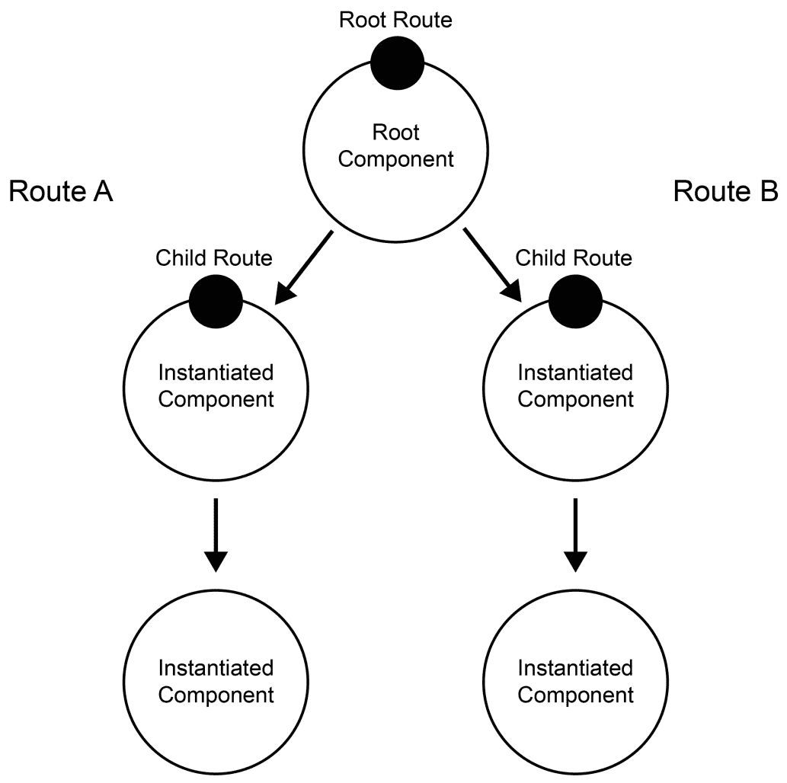
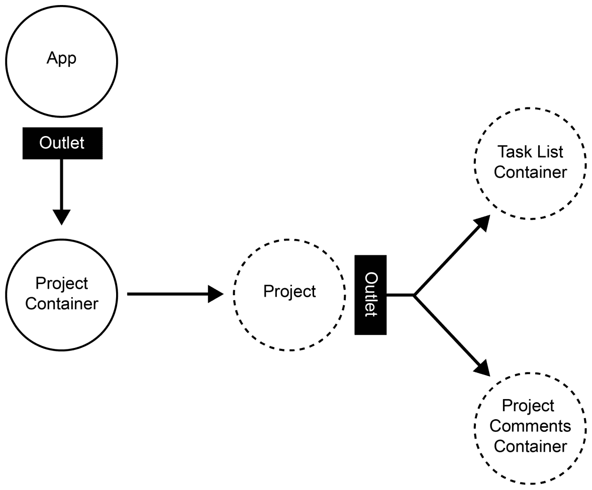
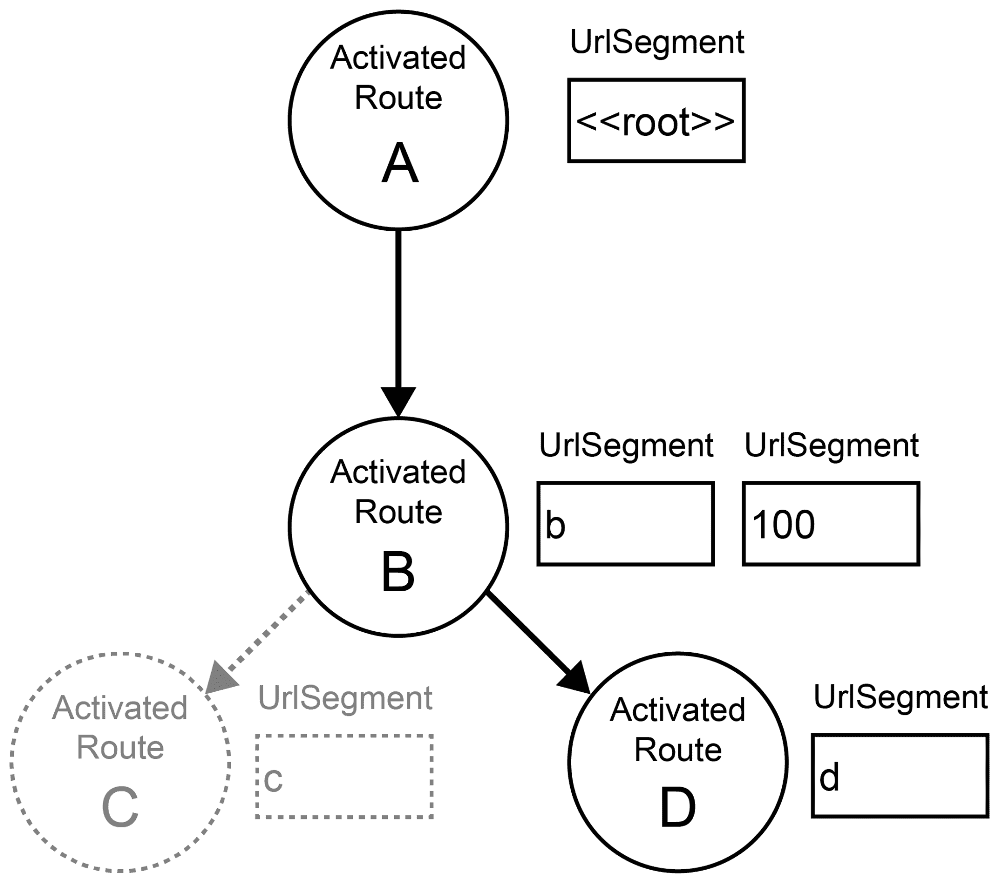

# 基于组件的路由

路由是当今前端应用程序的一个基本组成部分。一般来说，一个路由器有三个主要用途：

+   它使您的应用程序可导航，以便用户可以使用浏览器的后退按钮，并在应用程序中存储和共享链接

+   它将应用程序组合的部分卸载，以便路由器根据路由和路由参数负责组合您的应用程序

+   它将您应用程序的部分状态存储在浏览器 URL 中

随 Angular 一起提供的路由器支持许多不同的用例，并附带一个易于使用的 API。它支持与 Angular UI-Router 嵌套状态、Ember.js 嵌套路由或 Durandal 框架中的子路由类似的子路由。与组件树相关联的路由器还利用其自己的树结构来存储状态和解析请求的 URL。

在本章中，我们将重构我们的代码以使用 Angular 的基于组件的路由器。我们将探讨路由器的核心元素以及如何使用它们来在我们的应用程序中启用路由。

本章将涵盖以下主题：

+   介绍 Angular 路由器

+   路由器、容器和纯组件

+   概述在应用程序中启用路由所需的重构

+   创建路由配置文件并探讨不同的路由配置可能性

+   使用`RouterOutlet`指令创建由路由器控制的插入点

+   使用`RouterLink`指令和路由器 DSL 创建导航链接

+   使用响应式路由属性来获取路由参数

+   使用`RouterActive`指令以及程序化路由器 API 来响应激活的路由路径

+   使用路由器 API 进行编程导航

+   为项目容器创建路由守卫

# Angular 路由器的介绍

Angular 中的路由器与我们的组件树紧密耦合。Angular 路由器的设计基于这样的假设：组件树直接与我们的 URL 结构相关。这在大多数情况下都是正确的。如果我们有一个组件**B**，它嵌套在组件**A**中，表示我们位置的 URL 很可能就是`/a/b`。

要指定模板中我们希望启用路由实例化组件的位置，我们可以使用所谓的`outlets`。只需包含一个`<router-outlet>`元素，我们就可以标记模板中的位置，Angular 路由器将在该位置实例化组件。

基于我们可以在主模块中提供的某些路由配置，路由器随后决定哪些组件需要实例化并放置到相应的路由出口中。路由也可以参数化，我们可以在实例化的组件中访问这些参数。

使用我们的组件树和路由配置，我们可以构建分层路由，并使子路由与其父路由解耦。这种嵌套路由使得在元级别上组合我们的应用程序布局成为可能，并可以重用父组件以供多个子路由使用。通过使用路由器，我们可以为我们的应用程序添加另一层组合。请看以下图表：



通过组件树和路由出口建立的路由层次

让我们再次更详细地看看路由器的元素：

+   **路由配置**：在将路由导入我们的应用程序模块时进行路由配置。通过配置子路由，我们可以轻松地构建解耦的嵌套路由。

+   **路由出口**：出口是路由器将管理的组件的位置。基于路由配置实例化的组件将被放置到这些出口中。

+   **路由链接**：这些是用 DSL 风格符号构建的链接，使开发者能够通过路由树构建复杂的链接。

在本章中，我们将探讨 Angular 路由的不同概念，并重构我们的应用程序以实现适当的路由。

# 使用路由进行组合

到目前为止，我们通过在组件模板中直接包含子组件来实现组合。然而，我们现在希望将控制权交给路由器来组合我们的主要应用程序布局。

以下图表提供了我们应用程序组件架构的概述，我们将为路由器启用它：



显示路由容器组件（实线）和通过路由出口包含的组件的组件树

在我们即将实施的变化之后，项目容器组件不再直接包含在我们的应用程序组件中。相反，我们在应用程序组件的模板中使用路由出口。这样，我们可以将控制权交给路由器，让它决定哪个组件应该放置到出口中。目前，我们只有项目组件作为一级路由，但在后续章节中，当我们为应用程序添加更多功能时，这将会改变。

项目组件将包含另一个路由出口，这使我们能够进行嵌套子路由。在那里，我们将能够创建子路由，使我们能够在不同的项目详情视图之间切换。

# 使用容器组件进行路由

我们迄今为止处理过的组合完全是基于通过模板包含的实例化。我们使用了输入和输出属性来解耦和封装组件，并遵循了良好的可重用模式。

使用动态实例化组件的路由器，我们不能再在路由组件上使用模板绑定。虽然我们之前依赖于输入和输出属性来连接我们的组件，但使用路由器后，我们失去了这种可能性，不能再绑定到输入或输出。

幸运的是，我们已经了解了容器组件的概念。容器组件将我们的状态和数据连接到我们的用户界面组件。它们不应该有任何输入或输出属性，并作为顶级组件。它们是定义上完美的路由组件候选者：

+   由于容器组件不依赖于输入或输出属性，它们在由路由器实例化时将直接工作。

+   我们可以简单地将路由器视为一个不同的状态源，并将 URL 状态信息传递到我们的 UI 组件中

# 路由器配置

Angular 使用树形数据结构来表示路由状态。你可以想象，在你的应用程序中，每次导航都会激活这个树中的一个分支。让我们看看以下示例。

我们有一个由四个可能的路由组成的应用程序：

+   `/`：这是应用程序的根路由，由称为**A**的组件处理。

+   `/b/:id`：这是我们可以访问`b`详细视图的路由，该视图由称为**B**的组件处理。在 URL 中，我们可以传递一个`id`参数（即`/b/100`）。

+   `/b/:id/c`：这是`b`详细视图有另一个导航可能性的路由，它揭示了更具体的细节，我们称之为`c`。这由**C**组件处理。

+   `/b/:id/d`：这是我们可以导航到`b`详细视图中的`d`视图的路由。这由称为**D**的组件处理：



由激活路由 /b/100/d 的路由段组成的路由树

让我们假设我们通过导航 URL `/b/100/d` 在我们的示例中激活一个路由。在这种情况下，我们会激活一个反映前面图中概述的状态的路由。请注意，路由段**B**实际上由两个 URL 段组成。这是因为我们指定了我们的路由**B**实际上由`b`标识符和一个`:id`路由参数组成。

使用这种树形数据结构，我们有一个完美的抽象来处理导航树。我们可以比较树，检查某些段是否存在于树中，并提取激活路由上存在的参数。

在每个路由组件内部，我们有注入该级别激活路由的可能性。假设我们想在组件**B**中访问`:id`参数。我们可以将`ActivatedRoute`注入到我们组件的构造函数中，并使用以下代码从那里提取路由参数：

```js
@Component({
  selector: 'mac-b',
  templateUrl: './b.component.html'
})
export class BComponent {
  constructor(route: ActivatedRoute) {
 route.params.subscribe(params => console.log(params.id));
 }
}
```

默认情况下，Angular 路由器会重用组件实例。这意味着如果路由器再次激活相同的组件但带有不同的参数，Angular 不会销毁之前的组件实例。它会重用之前的实例，并将更新的参数提供给我们的组件。这就是为什么 `ActivatedRoute` 对象上的 `params` 属性是一个可观察的流。我们可以简单地订阅这个可观察的流，这允许我们对路由参数的变化做出反应。

如你所见，路由器 API 非常灵活，它允许我们以非常细粒度的方式检查路由活动。路由器中使用的树结构使得我们可以在不担心底层复杂性的情况下比较应用程序中的复杂路由状态。

# 回到路由

好的，现在是我们为应用程序实现路由的时候了！在接下来的主题中，我们将为我们的应用程序创建以下路由：

| **路由路径** | **描述** |
| --- | --- |
| `/projects/:projectId` | 此路由将在我们的根应用程序组件的出口中激活项目容器组件。这包括 `projects` URL 段以及 `:projectId` URL 段来指定项目 ID。 |
| `/projects/:projectId/tasks` | 此路由将在我们的项目组件内部激活 `TaskListContainer` 组件。虽然我们目前直接在项目组件的模板中渲染任务列表，但我们将使用另一个路由出口。 |
| `/projects/:projectId/comments` | 此路由将在我们的项目组件内部激活 `ProjectCommentsContainer` 组件。项目组件中的相同路由出口用于实例化项目评论容器组件。 |

你可以直接将前面的路由配置与之前主题中图示的组成联系起来，*使用路由进行组成*。

要使用 Angular 的路由器，我们首先需要做的是创建一个路由配置。让我们在路径 `src/app/routes.ts` 上创建一个新文件，并添加我们的初始路由配置，使用以下代码：

```js
import {Route} from '@angular/router';
import {ProjectContainerComponent} from './container/project-container/project-container.component';

export const routes: Route[] = [{
  path: 'projects/:projectId',
  component: ProjectContainerComponent
}, {
  path: '',
  pathMatch: 'full',
  redirectTo: '/projects/1'
}];
```

目前我们只将为项目配置路由，稍后会将子路由添加到项目评论和任务中。

在我们的路由配置对象中，`path` 属性被用作模式来匹配浏览器中的 URL。路由器将观察浏览器中的 URL 变化，然后尝试将我们的配置中的每个路径与新的 URL 进行匹配。

Angular 路由器始终采用“首次匹配获胜”的策略。这意味着你可以有配置场景，其中多个配置结果都匹配。然而，只有列表中第一个匹配的配置会被激活。

通过我们的路由配置中的组件属性，我们可以告诉 Angular 当激活特定路由时应实例化哪个组件。

对于我们的项目路由，我们也使用一个参数段来传递我们想要显示的项目 ID。

我们配置中的第二个路由是一个特殊路由，当用户在根 URL（在我们的开发服务器的情况下是`http://localhost:4200/`）进入我们的应用程序时，它将用户重定向到我们的项目列表中的第一个项目。

在重定向路由配置中，我们可以省略`component`属性，但指定`redirectTo`属性来告诉 Angular 我们希望将用户重定向到不同的 URL。在重定向路由中，你始终需要指定你想要如何匹配 URL 路径。默认情况下，Angular 使用前缀匹配策略进行匹配。然而，在许多情况下，你想要匹配整个 URL，而不仅仅是前缀。你可以使用`pathMatch`属性并将其设置为`'full'`来实现这一点。

通过指定一个空路径模式，我们可以告诉 Angular 当浏览器 URL 中有空路径段时激活一个路由。然而，当使用默认的前缀匹配策略时，这个模式总是会匹配。只有当我们将`pathMatch`属性设置为`'full'`时，我们才能在用户导航到根 URL 时引起匹配。

好的，让我们继续，并在我们的应用程序中包含路由器。我们可以使用我们刚刚创建的路由配置来初始化 Angular 路由。让我们打开位于路径`src/app/app.module.ts`上的主模块，并应用以下更改。未更改的不相关代码部分在代码摘录中隐藏，并用省略号字符标记。代码中的有效更改用粗体标出：

```js
…
import {RouterModule} from '@angular/router';
import {routes} from './routes';

@NgModule({
  declarations: [
    …
  ],
  imports: [
    BrowserModule,
    HttpClientModule,
    HttpClientInMemoryWebApiModule.forRoot(Database, {
      delay: 0
    }),
    RouterModule.forRoot(routes)
  ],
  providers: [TaskService, UserService, ProjectService],
  bootstrap: [AppComponent]
})
export class AppModule {
}
```

在对主模型进行的前置代码更改中，我们只是简单地从`@angular/router`导入了我们准备的路由配置和 Angular 路由模块。通过调用模块工厂函数`RouterModule.forRoot`，我们可以将我们的路由配置传递给路由器，并将生成的路由模块导入到我们的应用程序中。

这很简单！你已经成功创建了你的第一个路由配置，并将路由器包含在了你的应用程序中。当你预览你的更改并重新加载浏览器时，你应该已经看到重定向配置开始生效。你的浏览器 URL 应该被重定向到`http://localhost:4200/projects/0`。然而，我们还没有利用路由器的组合功能，我们的项目导航也需要进行更改。

# 使用路由器组合项目

我们已经为导航我们的项目准备了路由配置。下一步是使路由器能够根据用户导航正确处理项目的组合。我们将一起执行以下三个步骤来实现这一点：

1.  在我们的根组件中使用`<router-outlet>`元素，允许路由器放置实例化组件。

1.  使用路由链接指令使我们的项目导航与路由器协同工作。

1.  在我们的项目服务中移除选中的项目状态，转而依赖 URL 状态，该状态现在包括导航项目的项目 ID。然后我们可以重构我们的项目容器组件以利用这个路由参数。

让我们从根组件的模板开始。目前，我们直接在模板中包含项目容器组件。由于我们希望让路由决定哪个组件对用户可见，我们需要进行更改，并在模板中包含一个 `<router-outlet>`。

让我们打开根组件的模板，它位于 `src/app/app.component.html`，并应用以下更改。同样，省略号符号表示保持不变的无关代码部分：

```js
…
<main class="main">
  <router-outlet></router-outlet>
</main>
```

我们已经移除了项目容器组件的静态包含，并添加了一个路由出口元素。这样 Angular 路由就知道它应该在模板的这个位置实例化激活的组件。

我们列表上的下一件事是使用路由链接指令来启用项目导航。幸运的是，我们已经在正确的位置进行这个更改。项目导航是根组件模板的一部分，我们需要在那里添加路由链接指令。在模板 `src/app/app.component.html` 中，我们执行以下更改：

```js
…
<mac-navigation-section title="Projects">
  <mac-navigation-item *ngFor="let project of projects | async"
                       [navId]="project.id"
                       [title]="project.title"
 routerLinkActive="active"
 [routerLink]="['/projects', project.id]">
  </mac-navigation-item>
</mac-navigation-section>
…
```

路由链接指令允许我们使任何元素表现得像链接一样，激活一个给定的路由。通过使用路由 DSL，我们可以在数组中指定一个路由作为单独的段元素。由于我们正在遍历所有项目以渲染导航项组件，我们可以使用项目 ID 来构建激活我们之前配置的路由路径 `/projects/:projectId` 的链接。

第二个更改是在我们的导航项上使用 `routerLinkActive` 指令。这个指令是一个简单的辅助工具，它将 CSS 类添加到任何存在路由链接指令的元素上。如果配置的路由链接 URL 与浏览器中的 URL 匹配，则将添加 CSS 类。您可以在 `routerLinkActive` 属性值中指定 CSS 类名称。这有助于我们样式化活动的导航项，以便用户始终可以看到当前导航的项目。

太棒了！您已经成功更新了根组件中的导航以使用 Angular 路由指令。在预览更改时，您已经可以看到当您在项目导航中导航到不同的项目时，浏览器中的 URL 已经更新。

虽然到目前为止我们一直依赖我们的项目服务来告诉我们哪个项目当前被选中，但现在我们正在利用路由的 URL 状态来存储这个信息。让我们从 `src/app/app.component.ts` 中的根组件中移除 `selectedProject` 成员和对项目服务的调用。我们也可以去掉 `selectProject` 方法，因为现在路由负责选择项目：

```js
…
@Component({
  selector: 'mac-root',
  templateUrl: './app.component.html',
  styleUrls: ['./app.component.css'],
  encapsulation: ViewEncapsulation.None
})
export class AppComponent {
  openTasksCount: Observable<number>;
  user: Observable<User>;
  projects: Observable<Project[]>;

  constructor(taskListService: TaskService,
              userService: UserService,
              private projectService: ProjectService) {
    this.openTasksCount = taskListService.getTasks()
      .pipe(
        map((tasks: Task[]) => {
          return tasks
            .filter((task) => !task.done)
            .length;
        })
      );
    this.projects = projectService.getProjects();
    this.user = userService.getCurrentUser();
  }
}

```

完成切换到项目组合路由器的一步还缺失。如果你已经预览了我们迄今为止所做的更改，你会注意到我们已经在更改 URL，并且项目导航项被正确激活。然而，我们总是在项目组件中看到第一个项目标题和描述。项目容器组件目前仍然依赖于项目服务来获取所选项目。我们需要改变这一点，以便我们使用路由器的状态。

让我们在容器组件`src/app/container/project-container/project-container.component.ts`中实现更改，以从激活的路由中获取项目 ID 参数，并在导航后显示正确的项目：

```js
…
import {ActivatedRoute} from '@angular/router';
import {combineLatest} from 'rxjs';
import {map} from 'rxjs/operators';

@Component({
  selector: 'mac-project-container',
  templateUrl: './project-container.component.html',
  styleUrls: ['./project-container.component.css'],
  encapsulation: ViewEncapsulation.None,
  changeDetection: ChangeDetectionStrategy.OnPush
})
export class ProjectContainerComponent {
  …

  constructor(private projectService: ProjectService,
 private route: ActivatedRoute) {
    this.selectedProject = combineLatest(
 projectService.getProjects(),
 route.params
 ).pipe(
 map(([projects, routeParams]) =>
 projects.find((project) => project.id === +routeParams.projectId)
 )
 );
  }

  …
}
```

我们仍然使用一个类型为`Observable<Project>`的成员`selectedProject`来表示当前所选项目。然而，我们不再直接从项目服务中获取这个可观察对象。相反，我们使用 RxJS 的`combineLatest`辅助函数将两个可观察流组合在一起，以产生一个输出流，该流发出所选项目。

我们正在将激活路由的可观察路由参数与我们的项目服务中的项目列表结合起来。然后我们可以使用`map`运算符，使用从路由参数中获得的 ID 在项目列表中找到正确的项目。结果的可观察流将发出所选项目，并在路由参数或项目列表更改时重新发出。

现在，请在浏览器中再次预览更改。你应该现在看到，使用左侧项目导航的路由器导航也应该更新我们的项目组件。它应该始终显示正确的项目信息，取决于浏览器 URL 中存在的项目 ID。

# 项目详情的子路由

在本节中，我们将使用路由器在项目上导航详细视图。我们目前在项目上有两个详细视图：

+   使用任务列表容器组件的项目任务视图

+   使用项目评论容器组件的项目评论视图

我们还需要确保我们能够通过项目上的标签界面激活子视图。我们的当前解决方案是在项目容器组件中存储激活的标签。基于此，我们在项目组件的模板中决定显示哪个详细视图。在那里，我们使用简单的`ngIf`指令来确定显示两个子容器组件中的哪一个。

让我们从包括我们详细视图的子路由配置开始重构。打开路径`src/app/routes.ts`上的路由器配置文件，并执行以下更改：

```js
import {Route} from '@angular/router';
import {ProjectContainerComponent} from './container/project-container/project-container.component';
import {TaskListContainerComponent} from './container/task-list-container/task-list-container.component';
import {ProjectCommentsContainerComponent} from './container/project-comments-container/project-comments-container.component';

export const routes: Route[] = [{
  path: 'projects/:projectId',
  component: ProjectContainerComponent,
 children: [{
 path: 'tasks',
 component: TaskListContainerComponent
 }, {
 path: 'comments',
 component: ProjectCommentsContainerComponent
 }, {
 path: '**',
 redirectTo: 'tasks'
 }]
}, {
  path: '',
  pathMatch: 'full',
  redirectTo: '/projects/1'
}];
```

通过路由配置上的 `children` 属性，我们可以配置嵌套路由。它允许我们告诉 Angular，在路由父组件下方某处将有一个可以用于实例化由子路由激活的组件的路由出口。

假设用户使用我们的新配置导航到路径 `/projects/1/tasks`。这将激活我们的路由配置中的一个路径。项目容器组件被激活并实例化到根组件内的路由出口中。此外，路由参数 `:projectId` 被设置为值 `1`。由于我们已配置了一个匹配的子路由，路径为 `tasks`，因此此子路由也将被激活。现在 Angular 路由正在搜索项目容器组件下方的嵌套路由出口，以便在那里实例化任务列表容器组件。

让我们再次看一下上一节中的图，即本章的 *使用路由进行组合*。这张图反映了我们使用路由出口和实例化组件的最终目标，并说明了我们需要添加嵌套路由出口元素的位置。


显示路由容器组件（实线）和通过路由出口包含的组件的组件树

现在我们对项目组件应用一些更改，以便使我们的子路由工作。涉及三个更改：

1.  在项目组件中移除任务视图和注释视图的静态包含，并使用嵌套路由出口代替。

1.  更新项目容器组件，从子路由名称中获取活动标签。我们再次使用路由来存储当前哪个标签是活动的状态。

1.  更新项目注释容器组件以及任务列表容器组件，从路由而不是项目服务中获取所选项目。

让我们从第一步开始，这是一个相当简单的步骤。让我们打开文件 `src/app/project/project/project.component.ts` 并将静态包含的详情视图替换为路由出口：

```js
<header class="header">
  <h2 class="title">
    <mac-editor [content]="project.title"
                [showControls]="true"
                (outSaveEdit)="updateTitle($event)"></mac-editor>
  </h2>
  <mac-editor [content]="project.description"
              [showControls]="true"
              (outSaveEdit)="updateDescription($event)"></mac-editor>
</header>
<mac-tabs [tabs]="tabs"
          [activeTab]="activeTab"
          (outActivateTab)="activateTab($event)">
</mac-tabs>
<router-outlet></router-outlet>
```

好的，现在路由器控制着在我们的嵌套路由出口中实例化正确的项目详情组件。

我们将要应用的第二个更改是关于项目组件内的标签界面组件。由于我们的标签组件是一个纯组件，它依赖于项目容器组件来提供激活的标签。此外，当我们激活一个标签时，项目容器组件正在实现激活时应发生的事情。到目前为止，哪个标签当前激活的状态一直存储在项目容器组件中。现在，我们希望改变这种行为，以便我们使用路由来存储这个状态。标签的激活应该也会触发路由更改。让我们打开文件 `src/app/container/project-container/project-container.component.ts` 并实现以下更改：

```js
…
import {ActivatedRoute, Router} from '@angular/router';
import {combineLatest} from 'rxjs';
import {map} from 'rxjs/operators';

@Component({
  selector: 'mac-project-container',
  templateUrl: './project-container.component.html',
  styleUrls: ['./project-container.component.css'],
  encapsulation: ViewEncapsulation.None,
  changeDetection: ChangeDetectionStrategy.OnPush
})
export class ProjectContainerComponent {
  selectedProject: Observable<Project>;
  tabs: Tab[] = [
    {id: 'tasks', title: 'Tasks'},
    {id: 'comments', title: 'Comments'},
    {id: 'activities', title: 'Activities'}
  ];
  activeTab: Observable<Tab>;

  constructor(private projectService: ProjectService,
              private route: ActivatedRoute,
 private router: Router) {
    this.selectedProject = combineLatest(
      projectService.getProjects(),
      route.params
    ).pipe(
      map(([projects, routeParams]) =>
        projects.find((project) => project.id === +routeParams.projectId)
      )
    );

 this.activeTab = combineLatest(
 this.selectedProject,
 route.url
 ).pipe(
 map(([project]) =>
 this.tabs.find((tab) =>
 router.isActive(
 `/projects/${project.id}/${tab.id}`,
 false
 )
 )
 )
 );
  }

  …
}
```

标签组件是一个纯组件，这次我们不希望使用路由链接指令来使我们的项目详情标签可导航。保持组件的纯净，不将特定上下文的路由链接配置污染 UI 组件，在扩展应用程序时可能会带来好处。相反，我们希望在容器组件中程序化地使用路由来触发导航。我们还希望有一种方法来确定哪个标签应该是当前激活的，根据路由状态。

在前面的代码更改中，我们在组件构造函数中注入了路由实例。此外，我们将 `activeTab` 属性更改为 `Observable<Tab>` 类型。现在我们需要一种方法来响应路由 URL 更改并确定 URL 更改后哪个标签是激活的。`router.url` 后面的可观察对象正是我们开始我们的响应式管道所寻找的。在每次导航导致路由更改浏览器 URL 时，这个可观察对象将发出一个项。然而，我们还需要一个当前所选项目的引用来确定哪个标签当前被激活。为此，我们将 URL 更改的可观察对象与我们的 `selectedProject` 可观察对象结合起来。现在，我们有一个在 URL 更改和所选项目更改时发出项的流。然后，在 `map` 操作符中，我们使用 `router.isActive` 方法来确定哪个标签当前是激活的。我们可以将 URL 字符串传递给 `isActive` 方法，它告诉我们该 URL 字符串是否在路由中当前是激活的。我们使用所选项目的项目 ID 以及各个标签的 ID 来构造这个测试 URL 字符串。在操作符链的末尾，可观察对象输出激活的标签对象或 null，如果没有标签是激活的。

好的，我们几乎完成了！我们需要应用的最后一个更改是为了使我们的标签再次工作，那就是重构项目容器组件类中的 `activateTab` 方法。我们不再更新本地状态来表示激活的标签，我们现在需要通过使用以下代码来程序化地触发路由导航：

```js
…
import {map, take} from 'rxjs/operators';

@Component({
  selector: 'mac-project-container',
  templateUrl: './project-container.component.html',
  styleUrls: ['./project-container.component.css'],
  encapsulation: ViewEncapsulation.None,
  changeDetection: ChangeDetectionStrategy.OnPush
})
export class ProjectContainerComponent {
  …

  activateTab(tab: Tab) {
    this.selectedProject
 .pipe(take(1))
 .subscribe((project: Project) => {
 this.router.navigate([
 '/projects',
 project.id,
 tab.id
 ]);
 });
  }

  …
}
```

为了以编程方式导航到新的 URL，我们可以使用 `router.navigate` 方法并使用路由 DSL 构建所需路由的 URL 段。除了激活标签的 ID 之外，我们还需要所选项目的 ID 来构建目标 URL。因为所选项目被表示为一个可观察的流，我们可以使用 `take` 操作符进行转换，并订阅输出流以获取当前所选的项目对象。现在，在订阅中，我们手头有所有东西来执行编程导航。

由于我们现在使用可观察对象来表示活动标签，我们需要修改路径 `src/app/container/project-container/project-container.component.html` 上的模板，并使用异步管道订阅可观察对象，如下所示：

```js
<mac-project [project]="selectedProject | async"
             [tabs]="tabs"
             [activeTab]="activeTab | async"
             (outActivateTab)="activateTab($event)"
             (outUpdateProject)="updateProject($event)">
</mac-project>
```

你已经成功重构了我们的标签页以与路由和配置的子路由一起工作。如果你在浏览器中预览你的更改，你应该能够再次在标签页之间导航，并且在导航的同时浏览器 URL 应该会更新。你也可以尝试使用一个直接导航到特定标签页的特定 URL 重新加载你的浏览器——这同样适用于一个使用书签导航到项目特定标签页的用户。尝试，例如，导航到 `http://localhost:4200/projects/2/comments` 并看看你是否会到达你预期的位置。

完成我们的子路由重构的三个步骤中的最后一个仍然悬而未决。目前，两个详情视图仍然依赖于项目服务来确定所选项目。我们需要将它们都改为使用路由，并从路由中提取所选项目 ID，就像我们在项目容器组件中已经做的那样。让我们从文件 `src/app/container/task-list-container/task-list-container.component.ts` 中的任务列表容器组件开始：

```js
…
import {combineLatest} from 'rxjs';
import {ActivatedRoute} from '@angular/router';

@Component({
  selector: 'mac-task-list-container',
  templateUrl: './task-list-container.component.html',
  encapsulation: ViewEncapsulation.None,
  changeDetection: ChangeDetectionStrategy.OnPush
})
export class TaskListContainerComponent {
  …

  constructor(private taskService: TaskService,
              private projectService: ProjectService,
 private route: ActivatedRoute) {
    this.selectedProject = combineLatest(
 projectService.getProjects(),
 route.parent.params
 ).pipe(
 map(([projects, routeParams]) =>
 projects.find((project) => project.id === +routeParams.projectId)
 )
 );

    …
  }

 …
}
```

我们不再从项目服务中获取所选项目的可观察对象，而是将项目列表可观察对象与路由参数结合起来，以找到所选项目。这应该看起来非常熟悉，因为我们几乎使用了与项目容器组件中相同的代码。唯一的区别是我们需要首先访问父路由。通过调用 `route.parent.params`，我们可以访问父路由并从那里获取参数。这是必需的，因为我们正在使用嵌套路由，而任务列表容器是项目容器的子视图，其中 `:projectId` 参数可用。

让我们将同样的更改应用到我们的项目评论容器组件上。打开文件 `src/app/container/project-comments-container/project-comments-container.component.ts` 并使用以下更改更新代码：

```js
…
import {combineLatest} from 'rxjs';
import {ActivatedRoute} from '@angular/router';

@Component({
  selector: 'mac-project-comments-container',
  templateUrl: './project-comments-container.component.html',
  styleUrls: ['./project-comments-container.component.css'],
  encapsulation: ViewEncapsulation.None,
  changeDetection: ChangeDetectionStrategy.OnPush
})
export class ProjectCommentsContainerComponent {
  …

  constructor(private projectService: ProjectService,
              private userService: UserService,
 private route: ActivatedRoute) {
    this.user = userService.getCurrentUser();
    this.selectedProject = combineLatest(
 projectService.getProjects(),
 route.parent.params
 ).pipe(
 map(([projects, routeParams]) =>
 projects.find((project) => project.id === +routeParams.projectId)
 )
 );
    this.projectComments = this.selectedProject
      .pipe(
        map((project) => project.comments)
      );
  }
  …

}
```

恭喜！我们已经成功实现了所有必要的更改，以提供一个包括子路由在内的完全可导航的项目结构。我们不再依赖于项目服务来存储应用中的所选项目。作为最后一步，我们可以从项目服务中移除不必要的代码，因为我们的组件不再依赖于它了。让我们打开文件 `src/app/project/project.service.ts` 并移除所有与选择项目相关的代码：

```js
import {Injectable} from '@angular/core';
import {HttpClient} from '@angular/common/http';
import {BehaviorSubject} from 'rxjs';
import {Project} from '../model';

@Injectable()
export class ProjectService {
  private projects = new BehaviorSubject<Project[]>([]);

  constructor(private http: HttpClient) {
    this.loadProjects();
  }

  private loadProjects() {
    this.http.get<Project[]>('/api/projects')
      .subscribe((projects) => this.projects.next(projects));
  }

  getProjects() {
    return this.projects.asObservable();
  }

  updateProject(project: Project) {
    this.http.post(`/api/projects/${project.id}`, project)
      .subscribe(() => this.loadProjects());
  }
}
```

没有什么比移除废弃的代码更让人感觉良好的了，这是对我们重构和清理代码的辛勤工作的回报。让我们在浏览器中预览我们的更改并测试我们新添加的路由功能。现在你应该能够像重构之前一样使用应用程序。然而，我们现在在浏览器 URL 中存储所选项目和活动项目详情标签。在不同的视图之间导航，并尝试在浏览器中使用后退和前进按钮。能够这样导航感觉真是太好了。

# 保护我们的项目

有时候，防止某些路由被导航，并为这些场景提供回退导航是个好主意。这尤其适用于你的路由包括动态路由参数的情况，这些参数可能会随时间变化，意味着用户可能仍然保留着那些旧 URL 的过时书签。

守卫是防止这些导航错误的完美助手。虽然守卫可以帮助你防止访问某些路由并相应地重定向，但你永远不应该依赖它们为你的应用程序提供任何类型的保护。安全性始终需要来自服务器。使用守卫，你只需提供用户访问可能遇到错误区域的必要可用性，可能是因为缺少调用后端 Web 服务的权限，或者简单地因为通过项目 ID 导航的详情视图不再存在。

在本节中，我们将创建一个守卫来防止导航到不存在的项目。我们已经有段时间没有使用 Angular CLI 了。让我们好好利用它，用它来创建我们的项目容器守卫的占位符：

```js
ng generate guard --spec=false --module=app guards/project-container
```

这将生成一个占位符守卫并将其包含到我们的主应用模块的提供者部分。让我们打开位于 `src/app/guards/project-container.guard.ts` 的守卫文件，并将其内容更改为以下内容：

```js
import {Injectable} from '@angular/core';
import {CanActivate, ActivatedRouteSnapshot, Router} from '@angular/router';
import {ProjectService} from '../project/project.service';
import {map} from 'rxjs/operators';

@Injectable()
export class ProjectContainerGuard implements CanActivate {
  constructor(private projectService: ProjectService,
              private router: Router) {}

  canActivate(next: ActivatedRouteSnapshot) {
    return this.projectService.getProjects()
      .pipe(
        map(projects => {
          const projectExists = !!projects.find(project => project.id === +next.params.projectId);
          if (!projectExists) {
            this.router.navigate(['/projects', projects[0].id]);
          }
          return projectExists;
        })
      );
  }
}
```

在这个简单的项目守卫中，我们正在实现来自路由模块的 `CanActivate` 接口。通过实现这个接口，我们可以编写一个守卫，使我们能够控制用户是否可以导航到某个路由。作为 `canActivate` 方法的第一个参数，我们接收目标路由的激活路由快照对象。该方法应返回一个类型为 `Observable<boolean>` 的可观察对象。如果我们想防止导航，我们可以通过返回的可观察流发射 false。

在我们的案例中，我们使用从项目服务获取的项目列表可观察对象作为输入可观察对象。然后我们映射这个可观察对象，以确定从目标路由快照参数中提取的项目 ID 是否存在。我们使用变量 `projectExists` 来存储这个信息，并将其作为映射函数的结果返回。此外，如果导航的 ID 对应的项目不存在，我们将重定向到项目列表中的第一个项目。我们可以通过使用 `router.navigate` 方法来实现这一点。

现在，我们只剩下激活我们的守卫这一步，只需将其包含在我们的路由配置中。让我们打开文件 `src/app/routes.ts` 并添加以下更改：

```js
…
import {ProjectContainerGuard} from './guards/project-container.guard';

export const routes: Route[] = [{
  path: 'projects/:projectId',
  component: ProjectContainerComponent,
  canActivate: [ProjectContainerGuard],
  children: [{
    path: 'tasks',
    component: TaskListContainerComponent
  }, {
    path: 'comments',
    component: ProjectCommentsContainerComponent
  }, {
    path: '**',
    redirectTo: 'tasks'
  }]
}, {
  path: '',
  pathMatch: 'full',
  redirectTo: '/projects/1'
}];
```

每个路由配置都支持一个 `canActivate` 属性，该属性可以设置为实现 `CanActivate` 接口的守卫列表。我们所需做的只是将我们的守卫添加到项目路由配置中。

就这些了！我们已经保护了我们的项目容器组件，因此不再可能因为导航到不存在的项目而引发错误。您可以在浏览器中预览您的更改并尝试导航到一个不存在的项目。例如，尝试导航到 `http://localhost:4200/projects/100`。您应该会被重定向到第一个项目概览。

# 摘要

在本章中，我们学习了 Angular 中路由的基本概念。我们探讨了如何在嵌套路由场景中使用现有的组件树来配置子路由。我们还了解了路由出口元素和基本的路由链接指令。

我们已经重构了现有的导航元素，例如项目导航和项目视图上的标签页界面。我们使用了路由链接和程序化导航来满足不同的导航场景。

我们研究了常见的路由配置细节以及路由链接 DSL 的基础知识。我们还了解了路由匹配模式、参数占位符以及如何在激活的路由中访问这些参数。

最后但同样重要的是，我们创建了一个简单的守卫，防止用户使用无效的项目 ID 访问项目详情。

在下一章中，我们将学习 SVG 以及如何在 Angular 应用程序中使用这个网络标准来绘制图形。我们将使用 SVG 可视化应用程序活动日志，并了解 Angular 如何通过启用可组合性使这项技术更加出色。
