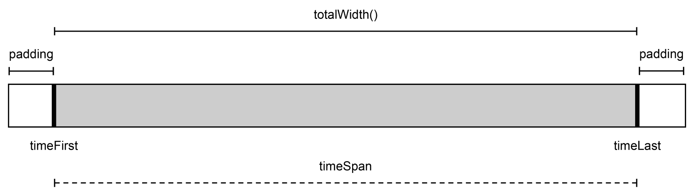

# 保持活动更新

在本章中，我们将使用 **可伸缩矢量图形**（**SVG**）和 Angular 构建图形组件来构建我们的任务管理系统中的活动日志。SVG 是处理复杂图形内容的完美选择，通过使用 Angular 组件，我们可以轻松构建封装和可重用的内容。

由于我们希望记录我们应用程序中的所有活动，例如添加评论或重命名任务，我们将创建一个活动中央存储库。然后我们可以使用 SVG 显示这些活动并将它们渲染为活动时间线。

为了添加所有活动的概述并提供用户输入以缩小显示活动的范围，我们将创建一个交互式滑块组件。此组件将使用投影在滑块的背景上渲染时间戳，以形式为刻度和活动。我们还将使用 SVG 在组件内渲染元素。

本章将涵盖以下主题：

+   SVG 的基本介绍

+   使 SVG 可与 Angular 组件组合

+   在组件模板中使用命名空间

+   创建一个简单的管道，使用 Moment.js 格式化日历时间

+   使用 `@HostListener` 装饰器处理用户输入事件，以创建交互式滑块元素

+   使用 `ViewEncapsulation.Native` 来利用 Shadow DOM，以创建原生样式封装

# 创建用于记录活动的服务

本章的目标是提供一个方法来跟踪任务管理应用程序中的所有用户活动。为此，我们需要一个系统，允许我们在组件内记录活动并访问先前记录的活动。

在本章中，我们只跟踪项目上的活动。然而，活动跟踪器可以用于我们应用程序中的任何功能。我们将使用 TypeScript 区分联合来描述我们的活动。让我们直接进入正题，首先创建我们新活动功能中使用的模型。

打开位于 `src/app/model.ts` 的模型文件，并添加以下更改：

```js
…
export type ActivityAlignment = 'left' | 'right';

export interface ActivitySliderSelection {
  start: number;
  end: number;
}

export interface ActivityBase {
  kind: string;
  id?: number;
  user: User;
  time: number;
  category: string;
  title: string;
  message: string;
}

export interface ProjectActivity extends ActivityBase {
  kind: 'project';
  projectId: number;
}

export type Activity = ProjectActivity;
```

作为实体，活动应该是相当通用的，并且应该具有以下字段及其相应用途：

+   `user`：负责此活动的用户对象。

+   `time`：活动的时间戳。我们将对此时间戳进行格式化以供可读的显示格式，但当我们绘制活动滑块时，我们还将使用它进行投影数学。

+   `category`：此字段提供了一种额外的标记活动的方式。对于项目，我们目前将使用两个类别；**评论**和**任务**。

+   `title`：这指的是活动的标题，它将提供关于活动内容的非常简短的摘要。这可能像 *新任务已添加* 或 *评论已添加* 这样的内容。

+   `message`：这是活动真正内容所在字段。它应该包含足够的信息，以便在活动期间提供良好的可追溯性。

此外，我们还在创建一个接口`ActivitySliderSelection`，我们将在与我们的自定义滑块 UI 组件通信选择变化时使用它。

自定义类型`ActivityAlignment`将被用来存储关于活动在时间线上的位置信息。

让我们也更新我们的内存数据库，以便在创建活动视图的 UI 组件时有东西可以工作。打开位于`src/app/database.ts`的文件，并应用以下更改：

```js
import {InMemoryDbService} from 'angular-in-memory-web-api';
import {Activity, Project, Task, User} from './model';

export class Database implements InMemoryDbService {
  createDb() {
    …

    const now = +new Date();

 const activities: Activity[] = [{
 id: 1,
 kind: 'project',
 user: users[0],
 time: now - 1000 * 60 * 60 * 8,
 projectId: 1,
 category: 'tasks',
 title: 'A task was updated',
 message: 'The task \'Task 1\' was updated on #project-1.'
 }, {
 id: 2,
 kind: 'project',
 user: users[0],
 time: now - 1000 * 60 * 60 * 5,
 projectId: 2,
 category: 'tasks',
 title: 'A task was updated',
 message: 'The task \'Task 1\' was updated on #project-2.'
 }, {
 id: 3,
 kind: 'project',
 user: users[0],
 time: now - 1000 * 60 * 60 * 2,
 projectId: 2,
 category: 'tasks',
 title: 'A task was updated',
 message: 'The task \'Task 2\' was updated on #project-2.'
 }];

    return {users, projects, tasks, activities};
  }
}

```

现在，我们可以继续创建一个服务来加载活动和记录新活动。让我们使用 Angular CLI 来创建我们服务的占位符：

```js
ng generate service --spec false activities/activities
```

这将在路径`src/app/activities/activities.service.ts`上生成一个新的服务类。让我们打开那个文件，并添加必要的代码来实现我们的服务：

```js
import {Injectable} from '@angular/core';
import {HttpClient} from '@angular/common/http';
import {BehaviorSubject} from 'rxjs';
import {Activity, ProjectActivity, User} from '../model';
import {UserService} from '../user/user.service';
import {map, mergeMap, take} from 'rxjs/operators';

@Injectable()
export class ActivitiesService {
  private activities = new BehaviorSubject<Activity[]>([]);

  constructor(private http: HttpClient, private userService: UserService) {
    this.loadActivities();
  }

  private loadActivities() {
    this.http.get<Activity[]>('/api/activities')
      .subscribe((activities) => this.activities.next(activities));
  }

  getActivities() {
    return this.activities
      .asObservable().pipe(
        map(activities => activities.sort((a, b) => b.time - a.time))
      );
  }

  logProjectActivity(projectId: number, category: string, title: string, message: string) {
    this.userService.getCurrentUser()
      .pipe(
        take(1),
        mergeMap((user: User) => this.http
          .post('/api/activities', <ProjectActivity>{
            kind: 'project',
            time: +new Date(),
            projectId,
            user,
            category,
            title,
            message
          })
        )
      ).subscribe(() => this.loadActivities());
  }
}
```

这里没有太多需要讨论的。我们的服务与我们已经创建的任务列表或项目服务非常相似。另外，当我们获取我们的活动行为主题的可观察对象时，我们正在对发出的活动列表进行排序。我们总是希望按活动时间发出排序后的活动列表。

由于活动不能被编辑或删除，我们只需要关注新添加的活动。

在`logProjectActivity`方法中，我们只是使用 Angular HTTP 客户端将一个新的活动发布到我们的内存中 Web 数据库。用户服务将为我们提供当前登录用户的信息。

数据方面就到这里。我们创建了一个简单的平台，将帮助我们跟踪应用程序中的活动。在本书的后面部分，我们可以使用活动服务来跟踪所有类型的活动。现在，我们只关心与项目相关的活动。

# 记录活动

我们已经创建了一个很好的系统来记录活动。现在，让我们继续在我们的组件中使用它，以保持对项目上下文中发生的所有活动的审计。

首先，让我们使用我们的活动服务来记录当项目任务被更新和创建时的活动。记录活动可以被视为应用程序的副作用，我们不希望在纯 UI 组件中引起副作用。相反，容器组件是执行这些操作的理想场所。

让我们打开位于`src/app/container/task-list-container/task-list-container.component.ts`的任务列表容器组件，并应用以下更改：

```js
…
import {ActivitiesService} from '../../activities/activities.service';
import {limitWithEllipsis} from '../../utilities/string-utilities';

@Component({
  selector: 'mac-task-list-container',
  templateUrl: './task-list-container.component.html',
  encapsulation: ViewEncapsulation.None,
  changeDetection: ChangeDetectionStrategy.OnPush
})
export class TaskListContainerComponent {
  …

  constructor(private taskService: TaskService,
              private projectService: ProjectService,
              private route: ActivatedRoute,
 private activitiesService: ActivitiesService) {
    …
  }

  activateFilterType(type: TaskListFilterType) {
    this.activeTaskFilterType.next(type);
  }

  addTask(title: string) {
    this.selectedProject
      .pipe(
        take(1)
      )
      .subscribe((project) => {
        const task: Task = {
          projectId: project.id, title, done: false
        };
        this.taskService.addTask(task);
 this.activitiesService.logProjectActivity(
 project.id,
 'tasks',
 'A task was added',
 `A new task "${limitWithEllipsis(title, 30)}" was added to #project-${project.id}.`
 );
      });
  }

  updateTask(task: Task) {
    this.taskService.updateTask(task);
 this.activitiesService.logProjectActivity(
 task.projectId,
 'tasks',
 'A task was updated',
 `The task "${limitWithEllipsis(task.title, 30)}" was updated on #project-${task.projectId}.`
 );
  }
}

```

使用我们活动服务的`logProjectActivity`方法，我们可以轻松地记录创建和更新任务的活动。

在我们的活动消息体中，我们使用了一个新的实用函数`limitWithEllipsis`，我们从这个名为`string-utilities`的新模块中导入它。这个函数截断输入字符串，并在第二个参数指定的位置截断。此外，它还在截断字符串的末尾添加一个省略号字符（`…`）。这是一个当我们需要创建可能很长的文本预览时的有用工具。

让我们快速构建这个小小的辅助函数，并在路径`src/app/utilities/string-utilities.ts`上创建一个新文件。打开文件，并添加以下代码：

```js
export function limitWithEllipsis(str: string, limit: number): string {
  if (str.length > limit) {
    return str.slice(0, limit - 1) + '…';
  } else {
    return str;
  }
}
```

到此为止。我们已经成功地在任务创建和更新时记录活动。我们还将使用项目评论容器组件中的活动服务来创建添加和编辑评论的日志。由于涉及的步骤与我们刚刚为任务列表容器组件所做的工作非常相似，我们将跳过这一部分。您始终可以查看本章的最终代码库，为项目评论容器组件添加活动日志。

# 利用 SVG 的力量

SVG 自 1999 年以来一直是开放网络平台标准的一部分，并于 2001 年首次推荐，当时是 SVG 1.0 标准。SVG 是两个基于 XML 的矢量图像格式的独立提案的整合。**精确图形标记语言**（**PGML**），主要由 Adobe 和 Netscape 开发，以及**矢量标记语言**（**VML**），主要由 Microsoft 和 Macromedia 代表，都是不同的 XML 格式，服务于相同的目的。W3C 联盟拒绝了这两个提案，转而支持新开发的 SVG 标准，将两者的优点统一到一个标准中：


展示 SVG 标准发展的时间线

所有这三个标准都有一个共同的目标，那就是为网络提供一个格式，以便在浏览器中显示矢量图形。SVG 是一种声明性语言，它使用 XML 元素和属性来指定图形对象。

让我们看看如何使用 SVG 创建一个黑色圆形的简单示例：

```js
<?xml version="1.0" encoding="utf-8"?>   
<svg version="1.1"   
     width="20px" height="20px"> 
  <circle cx="10" cy="10" r="10" fill="black" /> 
</svg> 
```

这个相当简单的例子代表了一个 SVG 图像，其中有一个黑色的圆形，其中心位于`cx="10"` px 和`cy="10"` px。圆的半径是`10` px，这使得这个圆的宽度和高度都是`20` px。

SVG 坐标系的原点位于左上角，其中*y*轴朝南方向，*x*轴向东：


SVG 内部的坐标系

不仅可以使用原始形状，如圆形、线条和矩形，还可以使用复杂的多边形，创建图形内容的可能性几乎是无限的。

SVG 不仅用于网络，而且已经成为不同应用程序之间交换矢量图形的重要中间格式。几乎任何支持矢量图形的应用程序都支持导入和导出 SVG 文件。

当我们不将 SVG 文件作为 HTML 图像元素包含在内，而是直接在我们的 DOM 中包含 SVG 内容时，SVG 的真正力量才显现出来。由于 HTML5 直接支持 HTML 文档中的 SVG 命名空间，并将渲染我们在 HTML 中定义的图形，因此出现了一系列新的可能性。现在，我们可以使用 CSS 来样式化 SVG，使用 JavaScript 来操作 DOM，并轻松地使 SVG 交互式。

将我们之前的圆形图像示例提升到下一个层次，我们可以通过改变圆的颜色（通过点击它）使其交互式。首先，让我们创建一个最小的 HTML 文档，并将我们的 SVG 元素直接包含在 DOM 中：

```js
<!doctype html> 
<title>Minimalistic Circle</title> 
<svg width="20px" height="20px"> 
  <circle id="circle" cx="10" cy="10" r="10" fill="black"> 
</svg> 
<script> 
  document 
    .getElementById('circle') 
    .addEventListener('click', function(event) { 
      event.target.setAttribute('fill', 'red'); 
    }); 
</script> 
```

正如你所见，当我们直接在我们的 HTML 文档的 DOM 中使用 SVG 时，我们可以去掉版本和 XML 命名空间声明。这里有趣的是，我们可以将 SVG 视为非常普通的 HTML。我们可以为 SVG 元素分配一个 ID，甚至类，并从 JavaScript 中访问它们。

在我们的 HTML 文档的`script`标签中，我们可以直接使用之前分配给它的 ID 访问我们的`circle`元素。我们可以像处理常规 HTML 元素一样为 SVG 元素添加事件监听器。在这个例子中，我们添加了一个`click`事件监听器，并将我们的圆的颜色改为红色。

为了简化，我们在本例中使用了内联`script`标签。当然，使用一个单独的 JavaScript 文件来进行脚本编写会更为整洁。

# SVG 样式

在网络中关注点的分离方面，我是一个纯粹主义者。我仍然坚信结构（HTML）、外观（CSS）和行为（JavaScript）的分离，以及遵循这一实践时产生最易于维护的应用程序。

首先，在 HTML 中包含 SVG 看起来有些奇怪，你可能会认为这打破了清晰的分离合同。为什么只有外观相关的数据组成的图形内容，会坐在我的 HTML 中，而 HTML 本应只包含原始信息？在处理了大量 DOM 中的 SVG 之后，我得出结论，我们可以通过将外观责任分为以下两个子组来使用 SVG 建立清晰的分离：

+   **图形结构**：这个子组处理定义你的图形内容基本结构的过程。这是关于形状和布局。

+   **视觉外观**：这个子组处理定义我们图形结构的外观和感觉的过程，例如颜色、线宽、线型和文本对齐。

如果我们将 SVG 的关注点分为这些组，我们实际上可以获得很好的可维护性。图形结构由 SVG 形状本身定义。它们直接写入我们的 HTML 中，但没有特定的外观和感觉。我们只在 HTML 中存储基本的结构信息。

幸运的是，我们不需要在 SVG 元素上使用属性，所有与视觉外观相关的属性，例如颜色，也可以使用相应的 CSS 属性来指定。这允许我们将结构与外观相关的所有方面都卸载到 CSS 中。

让我们回到我们画黑色圆圈的例子；我们将稍作调整，以满足我们对关注点分离的需求，以便我们可以区分图形结构和图形外观：

```js
<!doctype html> 
<title>Minimalistic Circle</title> 
<svg width="20px" height="20px"> 
  <circle class="circle" cx="10" cy="10" r="10"> 
</svg> 
```

现在我们可以通过使用 CSS 来样式化我们的图形结构，包括以下内容的样式表：

```js
.circle { 
  fill: black; 
} 
```

这真是太棒了，因为我们不仅可以重用一些图形结构，还可以使用 CSS 应用不同的视觉外观参数，类似于我们通过仅更改一些 CSS 就成功重用了一些语义 HTML 时的启发时刻。

让我们看看我们可以用来样式化 SVG 形状的最重要 CSS 属性：

+   `fill`: 当与实心 SVG 形状一起工作时，始终有形状填充和轮廓选项可用；`fill`属性指定了形状填充的颜色。

+   `stroke`: 这个属性指定了 SVG 形状轮廓的颜色。

+   `stroke-width`: 这个属性指定了 SVG 形状轮廓的宽度，对于实心形状而言。对于非实心形状，例如线条，这可以被视为线条宽度。

+   `stroke-dasharray`: 这指定了线条的虚线模式。虚线模式是由空格分隔的值，定义了一个模式。

+   `stroke-dashoffset`: 这指定了虚线模式的偏移量，该偏移量由`stroke-dasharray`属性指定。

+   `stroke-linecap`: 这个属性定义了线条端点应该如何渲染。它们可以渲染为方形、平头或圆角端点。

+   `stroke-linejoin`: 这个属性指定了路径内线条的连接方式。

+   `shape-rendering`: 使用这个属性，你可以覆盖用于渲染形状的形状渲染算法，正如其名所示。如果你需要在形状上获得清晰的边缘，这特别有用。

要获取有关可用外观相关 SVG 属性的完整参考，请访问 Mozilla 开发者网站[`developer.mozilla.org/en-US/docs/Web/SVG/Attribute`](https://developer.mozilla.org/en-US/docs/Web/SVG/Attribute)。

我希望这个简短的介绍让你对 SVG 及其带来的强大功能有了更好的感觉。在本章中，我们将使用其中的一些功能来创建漂亮的、交互式的图形组件。如果你想了解更多关于 SVG 的信息，我强烈建议你阅读 Sara Soueidan 的精彩文章。

# 构建 SVG 组件

当使用 SVG 模板构建 Angular 组件时，有一些事情你需要注意。首先也是最明显的一点是 XML 命名空间。现代浏览器在解析 HTML 时非常智能。除了可能是计算机科学历史上最容错的解析器之外，DOM 解析器在识别标记并决定如何处理它方面也非常聪明。它们会根据元素名称自动为我们决定正确的命名空间，因此我们编写 HTML 时不需要处理它们。

如果你稍微玩过 DOM API，你可能已经注意到有两种方法可以创建新元素。例如，在文档对象中，有一个 `createElement` 函数，但还有一个 `createElementNS`，它接受一个额外的命名空间 URI 参数。此外，每个创建的元素都有一个 `namespaceURI` 属性，它告诉你特定元素的命名空间。这很重要，因为 HTML5 是一个至少包含三个命名空间的标准：

+   **HTML**：这是标准的 HTML 命名空间，具有 [`www.w3.org/1999/xhtml`](http://www.w3.org/1999/xhtml) URI。

+   **SVG**：它包含所有 SVG 元素和属性，并使用 [`www.w3.org/2000/svg`](http://www.w3.org/2000/svg) URI。有时你可以在 `svg` 元素的 `xmlns` 属性中看到这个命名空间 URI。实际上，这并不是必需的，因为浏览器足够智能，可以自己决定正确的命名空间。

+   **MathML**：这是一个基于 XML 的格式，用于描述数学公式，并且大多数现代浏览器都支持它。它使用 [`www.w3.org/1998/Math/MathML`](http://www.w3.org/1998/Math/MathML) 命名空间 URI。

我们可以在单个文档中混合来自不同标准和命名空间的所有这些元素，并且当浏览器在 DOM 中创建元素时，它会自己确定正确的命名空间。

如果你想要更多关于命名空间的信息，我建议你阅读 Mozilla 开发者网络上的 *命名空间快速入门* 文章，网址为 [`developer.mozilla.org/en/docs/Web/SVG/Namespaces_Crash_Course`](https://developer.mozilla.org/en/docs/Web/SVG/Namespaces_Crash_Course)。

由于 Angular 会为我们编译模板，并使用 DOM API 将元素渲染到 DOM 中，因此它需要在这个过程中了解命名空间。类似于浏览器，Angular 在创建元素时提供了一些智能来决定正确的命名空间。然而，在某些情况下，你可能需要帮助 Angular 识别正确的命名空间。

为了说明一些这种行为，让我们将我们一直在工作的圆形示例转换成一个 Angular 组件：

```js
@Component({ 
  selector: 'awesome-circle', 
  template: ` 
    <svg [attr.width]="size" [attr.height]="size"> 
      <circle [attr.cx]="size/2" [attr.cy]="size/2" 
              [attr.r]="size/2" fill="black" /> 
    </svg> 
  ` 
}) 
export class AwesomeCircle { 
  @Input() size; 
} 
```

我们已经将圆形 SVG 图形封装成了一个简单的 Angular 组件。`size` 输入参数通过控制 SVG 的 `width` 和 `height` 属性以及圆形的 `cx`、`cy` 和 `r` 属性来确定圆形的实际宽度和高度。

要使用我们的圆形组件，只需在另一个组件中使用以下模板：

```js
<awesome-circle [size]="20"></awesome-circle>
```

需要注意的是，我们需要在 SVG 元素上使用属性绑定，而不能直接设置 DOM 元素的属性。这是由于 SVG 元素具有特殊的属性类型（例如，`SVGAnimatedLength`），可以使用**同步多媒体集成****语言**（**SMIL**）进行动画。我们不需要干扰这些相对复杂的元素属性，而可以简单地使用属性绑定来设置 DOM 元素的属性值。

让我们回到我们的命名空间讨论。Angular 将知道它需要使用 SVG 命名空间来创建这个模板内的元素。它将以这种方式工作，仅仅因为我们正在使用`svg`元素作为组件内的根元素，并且它可以在模板解析器中自动切换任何子元素的命名空间。

然而，在某些情况下，我们需要帮助 Angular 确定我们想要创建的元素的正确命名空间。当我们创建不包含根`svg`元素的嵌套 SVG 组件时，我们会遇到这种情况：

```js
@Component({ 
  selector: '[awesomeCircle]', 
  template: ` 
      <svg:circle [attr.cx]="size/2" [attr.cy]="size/2" 
                  [attr.r]="size/2" fill="black" /> 
  ' 
}) 
export class AwesomeCircle { 
  @Input('awesomeCircle') size; 
} 

@Component({ 
  selector: 'app' 
  template: ` 
   <svg width="20" height="20"> 
    <g [awesomeCircle]="20"></g> 
   </svg> 
  `, 
  directives: [AwesomeCircle] 
}) 
export class App {} 
```

在这个例子中，我们嵌套 SVG 组件，我们出色的圆形组件没有`svg`根元素来告诉 Angular 切换命名空间。这就是为什么我们在我们的应用程序组件中创建了`svg`元素，然后在一个 SVG 组中包含了出色的圆形组件。

我们需要明确告诉 Angular 在我们的圆形组件中切换到 SVG 命名空间，我们可以通过在前面代码摘录的高亮部分中看到的方式，将命名空间名称作为冒号分隔的前缀来做到这一点。

如果你需要在 SVG 命名空间中显式创建多个元素，你可以依赖 Angular 也会为子元素应用命名空间的事实，并将所有元素与一个 SVG 组元素组合在一起。因此，你只需要在组元素前加上`<svg:g> ... </svg:g>`前缀，而不是包含的任何 SVG 元素。

当处理 SVG 时，这就是了解 Angular 内部结构的足够信息。让我们继续前进，创建一些真正的组件！

# 构建一个交互式活动滑块组件

在前面的主题中，我们介绍了与 SVG 一起工作的基础知识以及处理 Angular 组件中的 SVG。现在，是时候将我们的知识应用到任务管理应用程序中，并使用 SVG 创建一些出色的组件了。

在这个背景下，我们将创建的第一个组件是一个交互式滑块，允许用户选择他或她感兴趣检查的活动时间范围。显示一个简单的 HTML5 范围输入可能是一个解决方案，但既然我们已经获得了一些 SVG 超级能力，我们可以做得更好！我们将使用 SVG 来渲染我们自己的滑块，它将在滑块上显示现有活动作为刻度。让我们看看我们将要创建的滑块组件的模拟图：


活动滑块组件的模拟图

我们的滑块组件实际上将有两个用途。它应该是一个用户控件，并提供一种选择时间范围以过滤活动的方法。然而，它还应该提供所有活动的概述，以便用户可以更直观地过滤范围。通过绘制代表活动的垂直条，我们已经在用户心中建立了他或她感兴趣的范围感。

让我们使用 Angular CLI 工具创建我们的新活动滑块组件：

```js
ng generate component --spec false -ve none -cd onpush activities/activity-slider
```

打开路径`src/app/activities/activity-slider/activity-slider.component.ts`上生成的组件类，并添加以下代码：

```js
import {
  ChangeDetectionStrategy, Component, ElementRef, EventEmitter, HostListener,
  Input, OnChanges, Output, SimpleChanges, ViewEncapsulation
} from '@angular/core';
import {Activity, ActivitySliderSelection} from '../../model';

@Component({
  selector: 'mac-activity-slider',
  templateUrl: './activity-slider.component.html',
  styleUrls: ['./activity-slider.component.css'],
  changeDetection: ChangeDetectionStrategy.OnPush,
  encapsulation: ViewEncapsulation.Native
})
export class ActivitySliderComponent {
  @Input() activities: Activity[];
  @Output() outSelectionChange = new EventEmitter<ActivitySliderSelection>();
  constructor(private elementRef: ElementRef) {}
}
```

我们应该首先提到的，与迄今为止我们所写的所有其他组件不同，我们为这个组件使用了`ViewEncapsulation.Native`。正如我们在第二章的“创建我们的应用程序组件”部分所学的，在*准备，设置，出发！*当我们为组件封装使用`ViewEncapsulation.Native`时，Angular 实际上使用阴影 DOM 来创建组件。我们也在第一章的“基于组件的用户界面”部分的“阴影 DOM”中简要介绍了这一点。

使用阴影 DOM（Shadow DOM）为我们组件带来的优势是：我们的组件将完全封装，从 CSS 方面来说。这不仅意味着全局 CSS 不会泄漏到我们的组件中；这也意味着我们需要创建局部样式，以便为我们的组件进行样式设计。

到目前为止，我们使用了来自全局样式表的样式，该样式表是为本书准备的。我们在该文件中使用了组件 CSS 命名约定，以避免与 CSS 类名冲突。然而，当使用阴影 DOM 时，我们可以省略前缀和其他命名约定来避免冲突，因为我们只在我们组件的局部应用样式。

Chrome 从版本 35 开始原生支持阴影 DOM。在 Firefox 中，可以通过访问`about:config`页面并打开`dom.webcomponents.enabled`标志来启用阴影 DOM。IE、Edge 和 Safari 完全不支持这个标准；然而，我们可以通过包含一个名为`webcomponents.js`的 polyfill 来设置它们以处理阴影 DOM。你可以在[`github.com/webcomponents/webcomponentsjs`](https://github.com/webcomponents/webcomponentsjs)上找到有关此 polyfill 的更多信息。

现在，让我们添加我们将在活动滑块组件中使用的局部 CSS 样式。打开文件`src/app/activities/activity-slider/activity-slider.component.css`，并添加以下代码：

```js
:host {
  display: block;
}

.slide {
  fill:#f9f9f9;
}

.activity {
  fill:#3699cb;
}

.time {
  fill:#bbb;
  font-size:14px;
}

.tick {
  stroke:#bbb;
  stroke-width:2px;
  stroke-dasharray:3px;
}

.selection-overlay {
  fill:#d9d9d9;
}

```

通常，这样的短类名可能会在我们的项目中导致名称冲突，但由于样式将局限于我们组件的阴影 DOM 中，我们不再需要担心名称冲突。

你可以看到我们在我们的样式中使用了特殊的伪选择器`:host`。这个选择器是 CSS 的 Shadow DOM 规范的一部分，它允许我们样式化 shadow root 的主机元素。这变得非常方便，因为我们可以在样式化时将主机元素视为组件内部的一部分。

让我们回到活动滑块组件内部的其余代码。作为一个输入参数，我们定义了将用于的活动的列表，这不仅用于确定滑块中的可用范围，还用于在滑块的背景上渲染活动。

一旦用户做出选择，我们的组件将使用`outSelectionChange`输出通知外界关于变化。

在构造函数中，我们正在注入主机元素以供以后使用。我们需要它来访问滑块的本地 DOM 元素，以便进行一些宽度计算。

# 时间投影

我们的滑块组件需要能够将时间戳投影到 SVG 的坐标系中。此外，当用户点击时间轴选择范围时，我们需要能够将坐标投影回时间戳。为此，我们需要在我们的组件内创建两个投影函数，这些函数将使用一些辅助函数和状态来计算值，从坐标到时间，反之亦然：



计算中重要变量和函数的可视化

虽然我们将使用百分比来定位滑块组件上的 SVG 元素，但两侧的内边距需要以像素为单位指定。`totalWidth`函数将返回该区域的像素总宽度；这是我们将在其中绘制活动指示器的地方。`timeFirst`、`timeLast`和`timeSpan`变量也将被计算使用，并以毫秒为单位指定。

让我们在滑块中添加一些代码来处理我们的活动在滑块上的投影：

```js
import {
  ChangeDetectionStrategy, Component, ElementRef, EventEmitter, Input, Output, ViewEncapsulation
} from '@angular/core';
import {Activity, ActivitySliderSelection} from '../../model';

@Component({
  selector: 'mac-activity-slider',
  templateUrl: './activity-slider.component.html',
  styleUrls: ['./activity-slider.component.css'],
  changeDetection: ChangeDetectionStrategy.OnPush,
  encapsulation: ViewEncapsulation.Native
})
export class ActivitySliderComponent {
  @Input() activities: Activity[];
  @Output() outSelectionChange = new EventEmitter<ActivitySliderSelection>();
  padding = 20;
 timeFirst: number;
 timeLast: number;
 timeSpan: number;

  constructor(private elementRef: ElementRef) {}

 totalWidth() {
 return this.elementRef.nativeElement.clientWidth - this.padding * 2;
 }

 projectTime(time: number) {
 const position = this.padding +
 (time - this.timeFirst) / this.timeSpan * this.totalWidth();
 return position / this.elementRef.nativeElement.clientWidth * 100;
 }

 projectLength(length: number) {
 return this.timeFirst + (length - this.padding) / this.totalWidth() * this.timeSpan;
 }
}
```

由于我们已经忽略了主机元素的引用，我们可以使用其`clientWidth`属性来获取组件的全宽并减去内边距。这将给我们想要的绘制活动指示器的区域的全宽，以像素为单位。

在`projectTime`函数中，我们首先将时间戳通过简单的三段式规则转换为位置。因为我们可以访问第一个活动的时间戳以及总时间跨度，这将是一个相当简单的任务。一旦我们这样做，我们可以通过将其除以总组件宽度然后乘以 100 来将我们的位置值（以像素为单位）转换为百分比。

要将像素值投影回时间戳，我们可以基本上执行`projectTime`的逆操作，只不过我们这里不处理百分比，而是假设`projectLength`函数的长度参数是以像素单位。

我们在我们的预测代码中使用了某些成员变量（`timeFirst`、`timeLast`和`timeSpan`），但如何设置这些成员变量呢？由于我们有一个`activities`组件输入，预期它将是一个相关活动的列表，我们可以观察输入的变化并根据输入设置值。为了观察该组件输入的变化，我们可以使用`OnChanges`生命周期钩子：

```js
import {
  ChangeDetectionStrategy, Component, ElementRef, EventEmitter, HostListener,
  Input, Output, OnChanges, SimpleChanges, ViewEncapsulation
} from '@angular/core';
import {Activity, ActivitySliderSelection} from '../../model';

@Component({
  selector: 'mac-activity-slider',
  templateUrl: './activity-slider.component.html',
  styleUrls: ['./activity-slider.component.css'],
  changeDetection: ChangeDetectionStrategy.OnPush,
  encapsulation: ViewEncapsulation.Native
})
export class ActivitySliderComponent implements OnChanges {
  @Input() activities: Activity[];
  @Output() outSelectionChange = new EventEmitter<ActivitySliderSelection>();
  padding = 20;
  timeFirst: number;
  timeLast: number;
  timeSpan: number;

  constructor(private elementRef: ElementRef) {}

  ngOnChanges(changes: SimpleChanges) {
 if (changes.activities && this.activities) {
 if (this.activities.length === 1) {
 this.timeFirst = this.timeLast = this.activities[0].time;
 } else if (this.activities.length > 1) {
 this.timeFirst = this.activities[this.activities.length - 1].time;
 this.timeLast = this.activities[0].time;
 } else {
 this.timeFirst = this.timeLast = new Date().getTime();
 }

 this.timeSpan = Math.max(1, this.timeLast - this.timeFirst);
 }
 }

  …
}
```

首先，我们需要检查更改是否包括对`activities`输入的更改，以及当前输入值是否有效。在检查输入值之后，我们可以确定我们的成员变量，即`timeFirst`、`timeLast`和`timeSpan`。我们将`timeSpan`变量限制至少为`1`，否则我们的预测计算将会出错。

上述代码将确保当`activities`输入更改时，我们将始终重新计算我们的成员变量，并且我们将使用最新的数据渲染活动。

# 渲染活动指示器

我们已经实现了组件的基本功能，并为将时间信息绘制到组件的坐标系中奠定了基础。现在是时候使用我们的投影函数，并使用 SVG 在滑块上绘制活动指示器了。

让我们在`src/app/activities/activity-slider/activity-slider.component.html`中打开活动滑块的模板，并添加以下代码：

```js
<svg width="100%" height="70px">
  <rect x="0" y="30" width="100%" height="40" class="slide"></rect>
  <rect *ngFor="let activity of activities"
        [attr.x]="projectTime(activity.time) + '%'"
        height="40" width="2px" y="30" class="activity"></rect>
</svg>
```

由于我们需要为活动列表中的每个活动创建一个指示器，我们可以简单地使用`ngFor`指令重复表示活动指示器的矩形。

正如我们在前一个主题中构建活动服务类时所知，*创建用于记录活动的服务*，活动总是包含一个带有活动时间戳的`time`字段。在我们的组件中，我们已创建了一个将时间转换为相对于组件宽度的百分比的投影函数。我们可以在`rect`元素的`x`属性绑定中简单地使用`projectTime`函数，以将活动指示器定位在正确的位置。

通过仅使用 SVG 模板和我们的背景函数来预测时间，我们已经创建了一个小巧的图表，该图表显示活动指示器在时间轴上的位置。

你可以想象，如果我们有很多活动，我们的滑块实际上看起来会很拥挤，很难感觉到这些活动可能发生的时间。我们需要有一种类型的网格，帮助我们把图表与时间轴关联起来。

如我们的滑块组件的模拟所示，现在，我们将在滑块背景上引入一些刻度，将滑块分成几个部分。我们还将为每个刻度标注日历时间。这将使用户在查看滑块上的活动指示器时对时间有一个大致的感觉。

让我们看看我们活动滑块类中的代码更改，这将启用我们的刻度渲染：

```js
import {
  ChangeDetectionStrategy, Component, ElementRef, EventEmitter,
  Input, OnChanges, Output, SimpleChanges, ViewEncapsulation
} from '@angular/core';
import {Activity, ActivitySliderSelection} from '../../model';

@Component({
  selector: 'mac-activity-slider',
  templateUrl: './activity-slider.component.html',
  styleUrls: ['./activity-slider.component.css'],
  changeDetection: ChangeDetectionStrategy.OnPush,
  encapsulation: ViewEncapsulation.Native
})
export class ActivitySliderComponent implements OnChanges {
  @Input() activities: Activity[];
  @Output() outSelectionChange = new EventEmitter<ActivitySliderSelection>();
  padding = 20;
  timeFirst: number;
  timeLast: number;
  timeSpan: number;
 ticks: number[];

  constructor(private elementRef: ElementRef) {}

  ngOnChanges(changes: SimpleChanges) {
    if (changes.activities && this.activities) {
      if (this.activities.length === 1) {
        this.timeFirst = this.timeLast = this.activities[0].time;
      } else if (this.activities.length > 1) {
        this.timeFirst = this.activities[this.activities.length - 1].time;
        this.timeLast = this.activities[0].time;
      } else {
        this.timeFirst = this.timeLast = new Date().getTime();
      }

      this.timeSpan = Math.max(1, this.timeLast - this.timeFirst);
      this.computeTicks();
    }
  }

  computeTicks() {
 const count = 5;
 const timeSpanTick = this.timeSpan / count;
 this.ticks = Array.from({length: count}).map((element, index) => {
 return this.timeFirst + timeSpanTick * index;
 });
 }

  …
}
```

首先，我们需要创建一个函数来计算一些刻度，我们可以将它们放置在时间轴上。为此，我们需要创建`computeTicks`方法，它将整个时间轴分成五个相等的部分，并生成表示各个刻度时间位置的戳记。我们将这些刻度存储在一个新的`ticks`成员变量中。有了这些时间戳的帮助，我们可以在视图中轻松渲染刻度。

我们使用`Array.from` ES6 函数来创建一个具有所需长度的新数组，并使用功能数组额外函数`map`从该数组生成刻度模型对象。使用`Array.from`是一个很好的技巧，可以创建一个给定长度的初始数组，这可以用来建立一种功能风格。

让我们看看我们的活动滑块组件的模板，以及我们如何使用我们的时间戳数组在滑块组件上渲染刻度：

```js
<svg width="100%" height="70px">
  <rect x="0" y="30" width="100%" height="40" class="slide"></rect>
 <g *ngFor="let tick of ticks">
 <text [attr.x]="projectTime(tick) + '%'" y="14" class="time">
 {{tick | calendarTime}}
 </text>
 <line [attr.x1]="projectTime(tick) + '%'" [attr.x2]="projectTime(tick) + '%'"
 y1="30" y2="70" class="tick"></line>
 </g>
  <rect *ngFor="let activity of activities"
        [attr.x]="projectTime(activity.time) + '%'"
        height="40" width="2px" y="30" class="activity"></rect>
</svg>
```

为了渲染我们的刻度，我们使用了一个 SVG 组元素来放置我们的`ngFor`指令，该指令重复我们在`ticks`成员变量中存储的刻度戳记。

对于每个刻度，我们需要放置一个标签，以及跨越滑块背景的线。我们可以使用 SVG 文本元素来渲染带有时间戳的标签，并将其放置在滑块上方。在我们的`text`元素的`x`属性绑定中，我们使用了我们的`projectTime`投影函数来接收从时间戳中得到的投影百分比值。我们的`text`元素的`y`坐标固定在一个位置，标签将正好位于滑块上方。

SVG 线由四个坐标组成：`x1`、`x2`、`y1`和`y2`。共同定义了两个坐标点，一条线将从一点画到另一点。

现在，我们越来越接近我们在本主题开头所指定的最终滑块。最后缺失的拼图碎片是使我们的滑块交互式，以便用户可以选择一系列活动。

# 使其生动起来

到目前为止，我们已经涵盖了滑块背景的渲染，以及活动指示器的渲染。我们还生成了刻度并使用网格线和标签显示它们，以显示每个刻度的日历时间。

嗯，这并不真正是一个滑块，对吧？当然，我们还需要处理用户输入，并使滑块交互式，以便用户可以选择他们想要显示活动的时间范围。

要做到这一点，请向组件类添加以下更改：

```js
import {
  ChangeDetectionStrategy, Component, ElementRef, EventEmitter, HostListener,
  Input, OnChanges, Output, SimpleChanges, ViewEncapsulation
} from '@angular/core';
import {Activity, ActivitySliderSelection} from '../../model';

@Component({
  selector: 'mac-activity-slider',
  templateUrl: './activity-slider.component.html',
  styleUrls: ['./activity-slider.component.css'],
  changeDetection: ChangeDetectionStrategy.OnPush,
  encapsulation: ViewEncapsulation.Native
})
export class ActivitySliderComponent implements OnChanges {
  @Input() activities: Activity[];
  @Output() outSelectionChange = new EventEmitter<ActivitySliderSelection>();
  padding = 20;
  timeFirst: number;
  timeLast: number;
  timeSpan: number;
  ticks: number[];
 selection: ActivitySliderSelection;

  constructor(private elementRef: ElementRef) {}

  ngOnChanges(changes: SimpleChanges) {
    if (changes.activities && this.activities) {
      if (this.activities.length === 1) {
        this.timeFirst = this.timeLast = this.activities[0].time;
      } else if (this.activities.length > 1) {
        this.timeFirst = this.activities[this.activities.length - 1].time;
        this.timeLast = this.activities[0].time;
      } else {
        this.timeFirst = this.timeLast = new Date().getTime();
      }

      this.timeSpan = Math.max(1, this.timeLast - this.timeFirst);
      this.computeTicks();

 this.selection = {
 start: this.timeFirst,
 end: this.timeLast
 };
 this.outSelectionChange.next(this.selection);
    }
  }

  …
}
```

当我们在`OnChanges`生命周期钩子中检测到`activities`输入属性的变化时，我们为我们的滑块组件中的用户选择初始化一个`ActivitySliderSelection`对象。它包含一个`start`和`end`属性，两者都包含表示我们在活动滑块上所选范围的戳记。

一旦我们设置了初始选区，我们需要使用`outSelectionChange`输出属性来发出事件。这样，我们可以让父组件知道滑动条内的选区已更改。

为了显示选定的范围，我们在模板中使用一个覆盖矩形，它将放置在滑动背景之上。如果你再次查看滑动条的模拟图像，你会注意到这个覆盖层被涂成灰色：

```js
<svg width="100%" height="70px">
  <rect x="0" y="30" width="100%" height="40" class="slide"></rect>
  <rect *ngIf="selection"
 [attr.x]="projectTime(selection.start) + '%'"
 [attr.width]="projectTime(selection.end) - projectTime(selection.start) + '%'"
 y="30" height="40" class="selection-overlay"></rect>
  <g *ngFor="let tick of ticks">
    <text [attr.x]="projectTime(tick) + '%'" y="14" class="time">
      {{tick | calendarTime}}
    </text>
    <line [attr.x1]="projectTime(tick) + '%'" [attr.x2]="projectTime(tick) + '%'"
          y1="30" y2="70" class="tick"></line>
  </g>
  <rect *ngFor="let activity of activities"
        [attr.x]="projectTime(activity.time) + '%'"
        height="40" width="2px" y="30" class="activity"></rect>
</svg>
```

这个矩形将放置在我们的滑动背景之上，并使用我们的投影函数来计算`x`和`width`属性。由于我们需要等待变化检测在`OnChanges`生命周期钩子中初始化我们的选区，我们将通过使用`ngIf`指令来检查有效的选区对象。

现在，我们需要开始处理我们的活动滑动组件的用户输入。存储状态和渲染选区的机制已经就位，因此我们可以实现所需的主监听器来处理用户输入。由于我们已经逐步应用了许多更改，让我们看看组件类的最终完整版本。需要添加用户交互的缺失更改以粗体显示：

```js
import {
  ChangeDetectionStrategy, Component, ElementRef, EventEmitter, HostListener,
  Input, OnChanges, Output, SimpleChanges, ViewEncapsulation
} from '@angular/core';
import {Activity, ActivitySliderSelection} from '../../model';

@Component({
  selector: 'mac-activity-slider',
  templateUrl: './activity-slider.component.html',
  styleUrls: ['./activity-slider.component.css'],
  changeDetection: ChangeDetectionStrategy.OnPush,
  encapsulation: ViewEncapsulation.Native
})
export class ActivitySliderComponent implements OnChanges {
  @Input() activities: Activity[];
  @Output() outSelectionChange = new EventEmitter<ActivitySliderSelection>();
  padding = 20;
  timeFirst: number;
  timeLast: number;
  timeSpan: number;
  ticks: number[];
  selection: ActivitySliderSelection;
  modifySelection: boolean;

  constructor(private elementRef: ElementRef) {}

  ngOnChanges(changes: SimpleChanges) {
    if (changes.activities && this.activities) {
      if (this.activities.length === 1) {
        this.timeFirst = this.timeLast = this.activities[0].time;
      } else if (this.activities.length > 1) {
        this.timeFirst = this.activities[this.activities.length - 1].time;
        this.timeLast = this.activities[0].time;
      } else {
        this.timeFirst = this.timeLast = new Date().getTime();
      }

      this.timeSpan = Math.max(1, this.timeLast - this.timeFirst);
      this.computeTicks();

      this.selection = {
        start: this.timeFirst,
        end: this.timeLast
      };
      this.outSelectionChange.next(this.selection);
    }
  }

  computeTicks() {
    const count = 5;
    const timeSpanTick = this.timeSpan / count;
    this.ticks = Array.from({length: count}).map((element, index) => {
      return this.timeFirst + timeSpanTick * index;
    });
  }

  totalWidth() {
    return this.elementRef.nativeElement.clientWidth - this.padding * 2;
  }

  projectTime(time: number) {
    const position = this.padding +
      (time - this.timeFirst) / this.timeSpan * this.totalWidth();
    return position / this.elementRef.nativeElement.clientWidth * 100;
  }

  projectLength(length: number) {
    return this.timeFirst + (length - this.padding) / this.totalWidth() * this.timeSpan;
  }

 @HostListener('mousedown', ['$event'])
 onMouseDown(event) {
 this.selection.start = this.selection.end = this.projectLength(event.offsetX);
 this.outSelectionChange.next(this.selection);
 this.modifySelection = true;
 event.stopPropagation();
 event.preventDefault();
 }

 @HostListener('mousemove', ['$event'])
 onMouseMove(event) {
 if (this.modifySelection) {
 this.selection.end = Math.max(this.selection.start, this.projectLength(event.offsetX));
 this.outSelectionChange.next(this.selection);
 event.stopPropagation();
 event.preventDefault();
 }
 }

 @HostListener('mouseup')
 onMouseUp() {
 this.modifySelection = false;
 }

 @HostListener('mouseleave')
 onMouseLeave() {
 this.modifySelection = false;
 }
}
```

在前面的代码片段中，我们在滑动组件的主元素上处理了总共四个事件：

+   `onMouseDown`: 我们将选择模型`start`和`end`属性设置为相同的值。由于我们使用时间戳来设置这些属性，我们首先将鼠标位置投影到时间空间中。鼠标位置以像素为单位，相对于滑动组件的起点。由于我们知道滑动条的宽度和显示的总时间长度，我们可以轻松地将它转换为时间戳。我们使用`projectLength`方法来完成这个目的。通过传递第二个参数到`@HostListener`装饰器，我们指定了我们将把 DOM 事件传递给我们的`onMouseDown`方法。我们还在我们的组件中设置了一个状态标志`modifySelection`，以指示正在进行的选区。

+   `onMouseMove`: 如果组件处于选区模式（`modifySelection`标志为`true`），你可以调整`selection`对象的结束属性。在这里，我们还确保通过使用`Math.max`和限制选区的结束不小于开始，排除了创建负选区的可能性。

+   `onMouseUp`: 当用户释放鼠标按钮时，组件退出选区模式。这可以通过将`modifySelection`标志设置为`false`来完成。

+   `onMouseLeave`: 这与`onMouseUp`事件相同；区别在于这里，组件将仅退出选区模式。

使用`@HostListener`装饰器，我们能够处理所有必要的用户输入，以完成我们组件中仍缺少的交互元素。

# 概述

在这个主题中，我们学习了如何使用 SVG 来创建具有 Angular 的图形和交互式组件。通过在我们的 SVG 元素上创建属性绑定，并使用 `ngFor` 和 `ngIf` 指令控制图形元素的实例化，我们构建了一个自定义滑动组件，为我们提供了活动的好概述。同时，我们还学习了如何使用 `@HostListener` 装饰器来处理用户输入，以便使我们的组件具有交互性：


完成后的活动滑动组件的截图

总结一下，我们学习了以下概念：

+   使用 `ViewEncapsulation.Native` 封装组件视图并导入本地样式

+   覆盖一些基本的时间戳到屏幕坐标的投影，用于与 SVG 元素一起使用

+   处理用户输入并使用 `@HostListener` 装饰器创建自定义选择机制

# 构建活动时间线

到目前为止，我们已经构建了一个用于记录活动的服务和一个滑动组件来选择时间范围，并使用活动指示器提供概述。由于我们需要在滑动组件内执行许多绘图任务，SVG 对于这个用例来说是一个完美的选择。为了完成我们的活动组件树，我们仍然需要渲染使用活动滑动组件选择的活动。

让我们继续完善我们的活动组件树。我们将创建一个新的组件，该组件负责在活动时间线中渲染单个活动。让我们使用 Angular CLI 来创建我们的活动组件：

```js
ng generate component --spec false -ve none -cd onpush activities/activity
```

现在，让我们从组件模板开始。打开文件 `src/app/activities/activity/activity.component.html`，并添加以下代码：

```js

<div class="info" [class.info-align-right]="isAlignedRight()">
  <h3 class="title">{{activity.title}}</h3>
  <p class="author">by {{activity.user.name}} {{activity.time | fromNow}}</p>
  <p>{{activity.message}}</p>
</div>
```

每个活动将包括一个用户图像，以及一个包含活动标题、消息和作者详情的信息框。

我们的活动将使用一个输入来确定其对齐方式。这允许我们从组件外部对齐活动。`isAlignedRight` 方法帮助我们设置一个额外的 CSS 类，`info-align-right`，在活动信息框上。

让我们在文件 `src/app/activities/activity/activity.component.ts` 中创建我们的组件类：

```js
import {Component, Input, HostBinding, ChangeDetectionStrategy} from '@angular/core';
import {Activity, ActivityAlignment} from '../../model';

@Component({
  selector: 'mac-activity',
  templateUrl: './activity.component.html',
  styleUrls: ['./activity.component.css'],
  changeDetection: ChangeDetectionStrategy.OnPush
})
export class ActivityComponent {
  @Input() activity: Activity;
  @Input() alignment: ActivityAlignment;
  @Input() @HostBinding('class.start-mark') startMark;
  @Input() @HostBinding('class.end-mark') endMark;

  isAlignedRight() {
    return this.alignment === 'right';
  }
}
```

我们的活动组件期望有四个输入：

+   `activity`：这个属性接受需要用组件渲染的活动数据模型。这是我们使用活动服务创建的活动。

+   `alignment`：这个输入属性应该设置为包含单词`left`或`right`的字符串。我们使用这个属性来确定是否需要在模板中添加一个额外的 CSS 类，以便将活动信息框对齐到右侧。

+   `startMark`：这个输入属性同时充当输入和宿主绑定。如果这个输入设置为`true`，活动将获得一个额外的 CSS 类，`start-mark`，这将在时间线上方产生一个小标记，以指示时间线的终止。

+   `endMark`：与 `startMark` 相同，这个输入使用主机绑定来设置一个额外的 CSS 类，`end-mark`，这将导致时间线底部出现一个小标记，以指示时间线的终止。

在模板中使用了 `isAlignedRight` 方法，用于确定我们是否需要为信息框添加一个额外的 CSS 类，以便将其对齐到右侧。

我们使用在 第四章 “在项目中思考” 中创建的 `FromNow` 管道格式化了活动的日期时间戳。

我们现在几乎有了显示活动所需的所有组件。然而，还缺少一些东西，那就是将活动滑块与我们的活动组件结合在一起的东西。为此，我们将创建一个新的组件，称为 `activities`：

```js
ng generate component --spec false -ve none -cd onpush activities/activities
```

在 Angular CLI 生成组件文件后，让我们打开位于 `src/app/activities/activities/activities.component.ts` 的组件类，并添加以下代码：

```js
import {Component, Input, ChangeDetectionStrategy, EventEmitter, Output} from '@angular/core';
import {Activity, ActivitySliderSelection} from '../model';

@Component({
  selector: 'mac-activities',
  templateUrl: './activities.component.html',
  styleUrls: ['./activities.component.css'],
  changeDetection: ChangeDetectionStrategy.OnPush
})
export class ActivitiesComponent {
  @Input() activities: Activity[];
  @Input() selectedActivities: Activity[];
  @Output() outSelectionChange = new EventEmitter<ActivitySliderSelection>();

  selectionChange(selection: ActivitySliderSelection) {
    this.outSelectionChange.emit(selection);
  }
}
```

由于这个组件将仅作为组合组件，用于排列滑块并渲染所有活动，所以我们里面没有太多逻辑。这是一个纯组件，它依赖于父容器组件来确定哪些活动应该显示/选择。我们还重新发出在活动滑块中产生的 `outSelectionChange` 事件。

让我们也看看位于 `src/app/activities/activities/activities.component.ts` 的模板：

```js
<mac-activity-slider [activities]="activities"
                     (outSelectionChange)="selectionChange($event)">
</mac-activity-slider>
<div class="l-container">
  <mac-activity *ngFor="let activity of selectedActivities, let odd = odd; let first = first; let last =  
                        last"
                [activity]="activity"
                [alignment]="odd ? 'left' : 'right'"
                [startMark]="first"
                [endMark]="last">
  </mac-activity>
</div>
```

再次强调，这只是一个简单的组合。我们正在渲染活动滑块，并使用 `ngFor` 指令来渲染我们的活动时间线。借助局部视图变量 `odd`、`first` 和 `last`，我们可以设置活动组件上所需的所有必要格式化输入。

好的！我们几乎完成了。我们已经准备好了所有的活动 UI 组件。然而，我们仍然需要为我们的活动创建一个容器组件，并添加必要的路由配置，以便用户可以导航到项目活动标签页。

让我们再次使用 Angular CLI 工具，为我们的活动容器组件创建文件：

```js
ng generate component --spec false -ve none -cd onpush container/project-activities-container
```

打开位于 `src/app/container/project-activities-container/project-activities-container.component.ts` 的组件类文件，并应用以下代码：

```js
import {Component, ViewEncapsulation, ChangeDetectionStrategy} from '@angular/core';
import {ProjectService} from '../../project/project.service';
import {Observable, combineLatest, BehaviorSubject} from 'rxjs';
import {Activity, ActivitySliderSelection} from '../../model';
import {map} from 'rxjs/operators';
import {ActivatedRoute} from '@angular/router';
import {ActivitiesService} from '../../activities/activities.service';

@Component({
  selector: 'mac-project-activities-container',
  templateUrl: './project-activities-container.component.html',
  styleUrls: ['./project-activities-container.component.css'],
  encapsulation: ViewEncapsulation.None,
  changeDetection: ChangeDetectionStrategy.OnPush
})
export class ProjectActivitiesContainerComponent {
  activities: Observable<Activity[]>;
  selection = new BehaviorSubject<ActivitySliderSelection | null>(null);
  selectedActivities: Observable<Activity[]>;

  constructor(private projectService: ProjectService,
              private activitiesService: ActivitiesService,
              private route: ActivatedRoute) {
    this.activities = combineLatest(
      this.activitiesService.getActivities(),
      route.parent.params
    ).pipe(
      map(([activities, routeParams]) =>
        activities
          .filter(activity => activity.kind === 'project' &&
            activity.projectId === +routeParams.projectId)
      )
    );

    this.selectedActivities = combineLatest(
      this.activities,
      this.selection
    ).pipe(
      map(([activities, selection]) => {
        if (selection) {
          return activities.filter(
            (activity) => activity.time >= selection.start && activity.time <= selection.end
          );
        } else {
          return activities;
        }
      })
    );
  }

  selectionChange(selection: ActivitySliderSelection) {
    this.selection.next(selection);
  }
}
```

虽然这看起来像很多代码，但实际上应该看起来非常熟悉。我们的其他容器组件几乎与这个相同。我们正在从活动服务访问活动可观察对象，并将可观察对象与父路由参数组合，以获取所选的项目 ID。

这个容器组件的特殊之处在于我们存储了一个行为主题，`selection`，它用于发出我们从活动滑块组件接收到的最新选择。在 `selectedActivities` 可观察对象中，我们使用这个选择与映射函数一起，以过滤出我们选择范围内的活动。

正如容器组件通常所做的那样，这个组件的模板非常简单。我们只是渲染我们的活动组件，并在我们的容器可观察对象上使用异步管道创建绑定。打开文件 `src/app/container/project-activities-container/project-activities-container.component.html`，并应用以下更改：

```js
<mac-activities [activities]="activities | async"
                [selectedActivities]="selectedActivities | async"
                (outSelectionChange)="selectionChange($event)">
</mac-activities>
```

好的；我们的容器部分就到这里。现在，我们只需要将新创建的活动容器组件添加到路由配置中。让我们打开我们的路由配置文件 `src/app/routes.ts`，并应用以下更改：

```js
import {Route} from '@angular/router';
import {ProjectContainerComponent} from './container/project-container/project-container.component';
import {TaskListContainerComponent} from './container/task-list-container/task-list-container.component';
import {ProjectCommentsContainerComponent} from './container/project-comments-container/project-comments-container.component';
import {ProjectContainerGuard} from './guards/project-container.guard';
import {ProjectActivitiesContainerComponent} from './container/project-activities-container/project-activities-container.component';

export const routes: Route[] = [{
  path: 'projects/:projectId',
  component: ProjectContainerComponent,
  canActivate: [ProjectContainerGuard],
  children: [{
    path: 'tasks',
    component: TaskListContainerComponent
  }, {
    path: 'comments',
    component: ProjectCommentsContainerComponent
  }, {
 path: 'activities',
 component: ProjectActivitiesContainerComponent
 }, {
    path: '**',
    redirectTo: 'tasks'
  }]
}, {
  path: '',
  pathMatch: 'full',
  redirectTo: '/projects/1'
}];
```

我们的“活动”页面就到这里！我们已经创建了三个组件，它们组合在一起并显示活动流，提供了一个滑块来筛选日期相关的活动。在浏览器中预览您的更改，现在您应该能够导航到项目中的“活动”标签页。此外，尝试通过添加新任务或更新它们来记录一些活动。点击并拖动活动滑块以更改您的选择：


完成后的活动视图截图

# 摘要

在本章中，我们使用 SVG 创建了一个交互式滑块组件。在这个过程中，我们学习了 SVG 的基础知识以及 SVG 在 DOM 中的强大功能。利用 Angular，我们能够使 SVG 具有可组合性，这是它本身所不具备的。我们学习了命名空间、Angular 如何处理它们，以及如何告诉 Angular 我们希望显式地使用命名空间。

除了为我们的滑块组件使用 SVG 之外，我们还学习了如何使用 Shadow DOM 来创建原生视图封装。因此，我们能够为我们的组件使用本地样式。当我们使用本地样式时，我们不需要担心 CSS 命名冲突、特异性和全局 CSS 的副作用。

在下一章中，我们将增强到目前为止所构建的内容。我们将创建一些组件来丰富我们应用程序中的用户体验。
