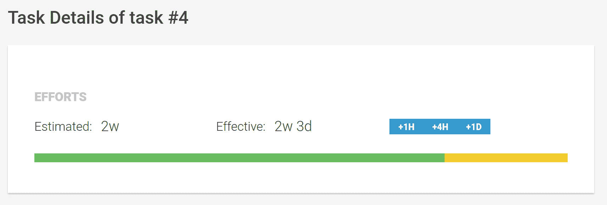

# 第八章：时间会证明一切

我们的任务管理系统正在成形。然而，到目前为止，我们还没有关注到管理项目的一个关键方面。时间在所有项目中都起着重要作用，这可能是最复杂的管理方面。

在本章中，我们将向我们的任务管理系统添加一些功能，帮助用户更有效地管理时间。通过重用我们之前创建的一些组件，我们将能够提供一致的用户体验来管理时间。

在更高层次上，我们将开发以下功能，以在我们的应用程序中实现时间管理：

+   **任务详情**：到目前为止，我们没有包括任务详情页面，因为所有关于任务的信息都可以在我们的项目页面上的任务列表中显示。由于我们的时间管理将大大增加任务的复杂性，我们将创建一个新的项目任务详情视图，该视图也将通过路由访问。

+   **努力管理**：我们将包括一些新的任务数据来管理任务上的努力。努力总是由估计的时间持续和实际花费的时间来表示。我们将使努力的这两个属性都是可选的，以便它们可以独立存在。我们将创建新的组件，使用户能够轻松地提供时间持续时间输入。

本章将涵盖以下主题：

+   创建一个项目任务详情组件来编辑任务详情并启用新的路由

+   修改我们的标签管理系统以包括任务标签

+   创建新的管道来处理格式化时间持续时间

+   创建任务信息组件，在现有的任务组件上显示任务概述信息

+   创建一个时间持续时间组件，使用户能够通过无 UI 用户交互方法轻松输入时间持续时间

+   在任务上实施时间努力跟踪

+   创建一个 SVG 组件来显示任务进度

# 任务详情

到目前为止，我们的任务列表足以直接在列表中显示所有任务的详细信息。然而，由于在本章中我们将向任务添加更多详细信息，现在是时候提供一个详细视图，让用户可以编辑任务。

我们已经在 第五章 中为项目导航打下了基础，*基于组件的路由*。添加一个新路由组件，我们将在项目上下文中使用它，将是一件轻而易举的事情。

在我们开始创建新的任务详情组件之前，让我们在我们的任务模型中引入一个新的状态。用户应该有额外的选项，除了任务标题外，还可以提供任务描述。这个描述将在任务详情视图中可编辑。

让我们打开位于 `src/app/model.ts` 的模型文件，并给我们的任务接口添加一个可选的描述字段：

```js
…

export interface Task {
  readonly id?: number;
  readonly projectId?: number;
  readonly title: string;
 readonly description?: string;
  readonly done: boolean;
  readonly order: number;
}

…
```

好的，所以现在我们可以为每个任务存储一个描述。然而，当在任务列表中创建新任务时，我们仍然只会存储任务的标题。用户需要访问新的详情视图来更新任务的描述。

好的，现在让我们使用 Angular CLI 创建一个用于任务详细视图的新组件：

```js
ng generate component --spec false -cd onpush tasks/task-details
```

让我们在`src/app/tasks/task-details/task-details.component.ts`中打开生成的组件类文件，并添加以下代码：

```js
import {
  ChangeDetectionStrategy, Component, EventEmitter, Input, Output,
  ViewEncapsulation
} from '@angular/core';
import {Tag, Task} from '../../model';

@Component({
  selector: 'mac-task-details',
  templateUrl: './task-details.component.html',
  styleUrls: ['./task-details.component.css'],
  encapsulation: ViewEncapsulation.None,
  changeDetection: ChangeDetectionStrategy.OnPush
})
export class TaskDetailsComponent {
  @Input() task: Task;
  @Input() tags: Tag[];
  @Output() outUpdateTask = new EventEmitter<Task>();

  updateTitle(title: string) {
    this.outUpdateTask.emit({
      ...this.task,
      title
    });
  }

  updateDescription(description: string) {
    this.outUpdateTask.emit({
      ...this.task,
      description
    });
  }
}
```

在任务详情中，我们允许用户编辑任务的标题和描述。我们正在开发一个简单的 UI 组件来表示任务详情视图。因此，我们期望将任务对象设置为组件输入。`outUpdateTask`输出用于将任务更新通知给我们的父组件。我们还添加了两个方法，用于在我们的视图中更新任务标题和描述。

我们还希望支持用户编辑任务描述时的标签选择。为此目的，我们添加了一个`tags`输入，它可以由父组件提供。

好的，现在让我们看看我们组件的模板，看看我们将如何处理任务数据以提供一个编辑详情的界面。打开位于`src/app/tasks/task-details/task-details.component.html`的模板文件，并添加以下内容：

```js
<h3 class="title">Task Details of task #{{task.id}}</h3>
<div class="content">
  <div class="label">Title</div>
  <mac-editor [content]="task.title"
              [showControls]="true"
              (outSaveEdit)="updateTitle($event)"></mac-editor>
  <div class="label">Description</div>
  <mac-editor [content]="task.description"
              [showControls]="true"
              [tags]="tags"
              (outSaveEdit)="updateDescription($event)"></mac-editor>
</div>
```

通过重用我们在第四章中创建的编辑器组件，*项目思维*，我们可以依赖简单的 UI 组合来使我们的任务标题和描述可编辑。

当我们将任务数据存储到我们组件的`task`成员变量中时，我们可以引用`title`和`description`字段来创建与我们的编辑器组件的`content`输入属性的绑定。

虽然标题应该只包含纯文本，但我们可以支持在任务的描述字段中我们创建的第七章中，*用户体验组件*的标签功能。为此，我们只需将可用标签的列表传递给编辑器组件。

我们使用编辑器组件的`outSaveEdit`输出属性来调用我们的更新函数，分别用于更新标题或描述。

到目前为止，一切顺利。我们创建了一个任务详情组件，使用我们的编辑器 UI 组件可以轻松地编辑任务的标题和描述。现在，我们需要创建一个任务详情视图的容器组件，并在我们的应用程序中将其启用为子路由。

让我们使用 Angular CLI 创建一个任务详情容器组件：

```js
ng generate component --spec false -cd onpush container/task-details-container
```

如往常一样，我们容器组件的视图非常简单。我们只是渲染一个 UI 组件并传递所需的数据。让我们通过编辑位于`src/app/container/task-details-container/task-details-container.component.html`的任务详情容器组件的模板来实现这一点：

```js
<mac-task-details [task]="task | async"
                  [tags]="tags | async"
                  (outUpdateTask)="updateTask($event)">
</mac-task-details>
```

任务详情 UI 组件需要传递一个任务对象作为输入，以及我们应用程序支持的标签列表。我们将使用从相应服务提供的可观察对象获取这些数据。当任务更新时，我们将收到`outUpdateTask`输出事件，并在我们的容器组件上调用`updateTask`方法。让我们打开位于`src/app/container/task-details-container/task-details-container.component.ts`的组件类，并添加以下代码：

```js
import {ChangeDetectionStrategy, Component, ViewEncapsulation} from '@angular/core';
import {ActivatedRoute} from '@angular/router';
import {TaskService} from '../../tasks/task.service';
import {Observable, combineLatest} from 'rxjs';
import {Tag, Task} from '../../model';
import {map} from 'rxjs/operators';
import {TagsService} from '../../tags/tags.service';

@Component({
  selector: 'mac-task-details-container',
  templateUrl: './task-details-container.component.html',
  styleUrls: ['./task-details-container.component.css'],
  encapsulation: ViewEncapsulation.None,
  changeDetection: ChangeDetectionStrategy.OnPush
})
export class TaskDetailsContainerComponent {
  task: Observable<Task>;
  tags: Observable<Tag[]>;

  constructor(private taskService: TaskService,
              private route: ActivatedRoute,
              private tagsService: TagsService) {
    this.task = combineLatest(
      this.taskService.getTasks(),
      route.params
    ).pipe(
      map(([tasks, routeParams]) =>
        tasks.find((task) => task.id === +routeParams.taskId)
      )
    );
    this.tags = this.tagsService.tags;
  }

  updateTask(task: Task) {
    this.taskService.updateTask(task);
  }
}
```

这里没有新内容。我们正在使用一个名为`taskId`的路由参数来从我们的任务服务中获取特定的任务。

要启用我们的新任务详情视图，我们只需在路由配置中创建一个子路由。让我们打开位于`src/app/routes.ts`的路由配置，进行必要的修改：

```js
…
import {TaskDetailsContainerComponent} from './container/task-details-container/task-details-container.component';

export const routes: Route[] = [{
  path: 'projects/:projectId',
  component: ProjectContainerComponent,
  canActivate: [ProjectContainerGuard],
  children: [{
    path: 'tasks',
    component: TaskListContainerComponent
  }, {
 path: 'tasks/:taskId',
 component: TaskDetailsContainerComponent
 }, {
    path: 'comments',
    component: ProjectCommentsContainerComponent
  }, {
    path: 'activities',
    component: ProjectActivitiesContainerComponent
  }, {
    path: '**',
    redirectTo: 'tasks'
  }]
}, {
  path: '',
  pathMatch: 'full',
  redirectTo: '/projects/1'
}];
```

我们在我们的项目视图中添加了一个新的子路由，现在可以通过 URL `/projects/:projectId/tasks/:taskId`访问。通过在路由配置中包含参数`:taskId`，我们可以将相关的任务 ID 传递给任务详情容器组件。

太棒了！我们已经创建了一个新的任务详情视图，并在我们的路由器中启用了它。您可以在浏览器中预览您的更改，并通过在浏览器中输入以下 URL 来访问任务的详情视图：`http://localhost:4200/projects/1/tasks/1`。现在您应该可以看到我们第一个项目中的第一个任务的详情视图。在我们继续集成任务详情视图之前，尝试编辑标题和描述。

# 导航到任务详情

为了使我们的任务详情路由可导航，我们需要修改任务列表中的任务组件。我们希望在任务组件中添加一个小的按钮，以便导航到详情视图。让我们从模板更改开始；打开我们的任务组件模板，位于`src/app/tasks/task/task.component.html`，并应用以下更改：

```js
<mac-checkbox [checked]="task.done"
              (outCheck)="updateTask($event)"></mac-checkbox>
<div class="content">
  <div class="title">
    <mac-editor [content]="task.title"
                [showControls]="true"
                (outSaveEdit)="updateTitle($event)"></mac-editor>
  </div>
  <button class="button button-small" (click)="showDetails()">Details</button>
  <button class="delete" (click)="deleteTask()"></button>
</div>
```

让我们直接进入组件类并实现新的`showDetails`方法。打开文件`src/app/tasks/task/task.component.html`并应用以下更改：

```js
…

@Component({
  selector: 'mac-task',
  templateUrl: './task.component.html',
  encapsulation: ViewEncapsulation.None,
  changeDetection: ChangeDetectionStrategy.OnPush
})
export class TaskComponent {
  …
  @Output() outShowDetails = new EventEmitter<Task>();

  …

 showDetails() {
 this.outShowDetails.emit(this.task);
 }
}
```

好的，现在我们需要确保将显示任务详情的事件一路传递到任务列表容器组件。我们的下一步是任务列表 UI 组件，我们需要委派我们的任务组件的`outShowDetails`输出。

让我们从`src/app/tasks/task-list/task-list.component.html`中的模板更改开始，并应用以下更改：

```js
…
<div class="tasks">
  <mac-task *ngFor="let task of tasks"
            [task]="task"
            (outUpdateTask)="updateTask($event)"
            (outDeleteTask)="deleteTask($event)"
 (outShowDetails)="showDetails($event)"
            macDraggable
            draggableType="task"
            [draggableData]="task"
            macDraggableDropZone
            dropAcceptType="task"
            (outDropDraggable)="dropTask(task, $event)"></mac-task>
</div>
```

这很简单！现在，让我们将更改添加到位于`src/app/tasks/task-list/task-list.component.ts`的任务列表组件类中：

```js
…

@Component({
  selector: 'mac-task-list',
  templateUrl: './task-list.component.html',
  encapsulation: ViewEncapsulation.None,
  changeDetection: ChangeDetectionStrategy.OnPush
})
export class TaskListComponent {
  …
  @Output() outShowDetails = new EventEmitter<Task>();

  …

  showDetails(task: Task) {
 this.outShowDetails.emit(task);
 }
}
```

太好了，我们组件树中的下一个停靠点是任务列表容器，我们将在这里实现导航到详情视图的逻辑。让我们打开位于`src/app/container/task-list-container/task-list-container.component.html`的任务列表容器模板，并创建必要的绑定：

```js
<mac-task-list
  [tasks]="filteredTasks | async"
  [taskFilterTypes]="taskFilterTypes"
  [activeTaskFilterType]="activeTaskFilterType | async"
  (outUpdateTask)="updateTask($event)"
  (outDeleteTask)="deleteTask($event)"
  (outShowDetails)="showDetails($event)"
  (outActivateFilterType)="activateFilterType($event)"
  (outAddTask)="addTask($event)">
</mac-task-list>
```

最后，我们需要在位于 `src/app/container/task-list-container/task-list-container.component.ts` 的容器组件类中实现 `showDetails` 方法：

```js
…

@Component({
  selector: 'mac-task-list-container',
  templateUrl: './task-list-container.component.html',
  encapsulation: ViewEncapsulation.None,
  changeDetection: ChangeDetectionStrategy.OnPush
})
export class TaskListContainerComponent {
  …

  showDetails(task: Task) {
 this.selectedProject
 .pipe(take(1))
 .subscribe(selectedProject => {
 this.router.navigate(['/projects', selectedProject.id, 'tasks', task.id]);
 });
 }
}
```

欢呼！我们终于通过在任务组件上添加一个新的导航按钮使任务详情视图可导航了！

现在，你可能想知道，为什么我们要实现这样一个疯狂的输出委托路径，只是为了触发导航？直接在任务 UI 组件中使用 `routerLink` 指令不是更容易吗？

当然，那会更容易。然而，在简单 UI 组件中使用路由链接存在一个小问题。这样做，我们依赖于系统中存在特定的路由配置。在 UI 组件中直接使用路由链接将它们限制在一个非常特定的上下文中。我们希望避免这种情况，以便在不同的上下文中重用我们的组件。解决这个问题的唯一有意义的方法是使用输出委托，并在容器组件中程序化地控制导航：


新创建的任务详情视图，具有可编辑的标题和描述

# 为任务启用标签

到目前为止，我们在第七章 [70aeeb16-2a1e-4d20-b523-00df06a8398a.xhtml]，*用户体验组件* 中创建的标签管理系统仅支持项目标签。既然我们已经为任务创建了一个详情视图，那么在标签系统中直接支持任务标签也会很棒。我们的标签系统非常灵活，我们可以以非常少的努力实现新的标签。

让我们修改位于 `src/app/tags/tags.service.ts` 的标签服务，以便为我们的任务启用标签：

```js
import {Injectable} from '@angular/core';
import {ProjectService} from '../project/project.service';
import {Project, Tag, Task} from '../model';
import {Observable, of, combineLatest} from 'rxjs/Observable';
import {map} from 'rxjs/operators';
import {limitWithEllipsis, replaceAll} from '../utilities/string-utilities';
import {TaskService} from '../tasks/task.service';

@Injectable()
export class TagsService {
  tags: Observable<Tag[]>;

  constructor(private projectService: ProjectService,
 private taskService: TaskService) {
    this.tags = combineLatest(
 this.projectService.getProjects().pipe(
 map((projects: Project[]) => projects.map(project => ({
 type: 'project',
 hashTag: `#project-${project.id}`,
 title: limitWithEllipsis(project.title, 20),
 link: `/projects/${project.id}/tasks`
 })))
 ),
 this.taskService.getTasks().pipe(
 map((tasks: Task[]) => tasks.map(task => ({
 type: 'task',
 hashTag: `#task-${task.id}`,
 title: `${limitWithEllipsis(task.title, 20)} (${task.done ? 'done' : 'open'})`,
 link: `/projects/${task.projectId}/tasks/${task.id}`
 })))
 )
 ).pipe(
 map(([projectTags, taskTags]) => [...projectTags, ...taskTags])
 );
  }

  …
}
```

除了项目服务外，我们还在标签服务的构造函数中注入了任务服务。这与我们为项目所做的工作非常相似，我们需要为应用中的每个任务创建一个标签对象。我们使用任务服务提供的可观察对象，并使用 `map` 操作符将所有任务转换为标签。

最后，我们使用 `combineLatest` 可观察对象辅助工具将项目标签和任务标签合并为单个可观察流。在最终的 `map` 操作符中，我们将这两个标签列表连接成一个数组。

这并不复杂，对吧？这个相对简单的更改为我们用户带来了巨大的改进。现在，他们可以在我们系统中任何启用了标签的地方引用单个任务。通过点击任务标签，我们正在导航到我们新创建的任务详情视图：


项目评论标签页的编辑组件显示新添加的任务标签

# 管理努力

在本节中，我们将创建一些组件，帮助我们跟踪工作努力。主要，我们将使用这些组件来管理任务上的努力，但这也可以应用于我们应用中需要跟踪时间的任何部分。

在我们的语境中，努力总是包括两个方面：

+   **Estimated duration**：这是任务最初估计的持续时间

+   **Effective duration**：这是在给定任务上花费的时间长度

对于时间持续时间，我们假设一些时间单位和规则，这将简化时间的处理并符合某些工作标准。这里的目的是不提供锐利的时管理，而是提供足够准确以带来价值的东西。为此，我们定义以下工作时间单位：

+   **Minute**：一分钟是常规的 60 秒

+   **Hour**：一小时总是代表 60 分钟

+   **Day**：一天代表八小时的常规工作日

+   **Week**：一周相当于五个工作日（5 * 8 小时）

当处理持续时间时，我们希望有一些类型安全，因此我们向我们的模型引入了一些新的接口。让我们打开位于`src/app/model.ts`的模型，并添加以下两个接口：

```js
…

export interface TimeUnit {
 short: string;
 milliseconds: number;
}

export interface TimeEfforts {
 estimated: number;
 effective: number;
} 
```

`TimeUnit`接口上的`short`属性将用于识别用户的时间输入。我们将使用字母 m、h、d 和 w 来表示不同的时间单位，并存储每个时间框架包含的毫秒数。

由于我们希望跟踪在任务上花费的时间和精力，让我们也修改一下我们的任务模型。在我们的模型文件中找到`Task`接口，并添加以下属性：

```js
export interface Task {
  readonly id?: number;
  readonly projectId?: number;
  readonly title: string;
  readonly description?: string;
  readonly done: boolean;
  readonly order: number;
 readonly efforts?: TimeEfforts;
}

…
```

我们在我们的任务接口中添加了一个新的可选的`efforts`属性，用于存储在任务上花费的精力。

好的，我们已经为即将到来的时间跟踪功能准备好了我们的模型。在下一节中，我们将实现我们的第一个 UI 组件来输入时间持续时间。

# 无 UI 时间持续时间输入

现在我们可以开始编写一个复杂的用户界面组件，用户可以在不同的输入元素中输入单独的时间单位。然而，我相信用无 UI 方法处理时间持续时间输入会更加方便。

简单来说，无 UI 意味着我们使用常规文本输入来提供用户交互。嗯，这没什么新奇的？文本输入是一切开始的地方。然而，最近有一个显著的趋势是提供无 UI 交互。通过结合我们对用户文本输入的处理智能，无 UI 交互实际上可以非常高效，并且远远超过复杂的用户界面。

而不是构建一个复杂的用户界面来输入时间持续时间，我们可以简单地约定一个文本简写形式来编写持续时间。我们可以让用户输入一些内容，例如`1.5d`或`5h 30m`，以提供输入。按照我们在本节开头建立的约定，*管理精力*，我们可以构建一个简单的解析器来处理这种输入。

这种方法有几个优点。除了这些，这也是输入时间长度最有效的方法之一，并且也易于我们实现。我们可以简单地重用我们的编辑器组件来从用户那里收集文本输入。然后，我们使用转换过程来解析输入的时间长度。

让我们启动一个新的实用模块，帮助我们处理这些转换。让我们首先在路径`src/app/utilities/time-utilities.ts`上创建一个新的空文件。

首先，我们需要一个常量来定义我们转换过程中需要的所有单位。将以下代码片段添加到我们新创建的文件中：

```js
import {TimeUnit} from '../model';

export const UNITS: TimeUnit[] = [{
  short: 'w',
  milliseconds: 5 * 8 * 60 * 60 * 1000
}, {
  short: 'd',
  milliseconds: 8 * 60 * 60 * 1000
}, {
  short: 'h',
  milliseconds: 60 * 60 * 1000
}, {
  short: 'm',
  milliseconds: 60 * 1000
}];
```

我们使用我们在模型中创建的`TimeUnit`接口。

这些是我们目前需要处理的全部单位。您可以看到运行时计算的毫秒数。我们也可以将毫秒数写成数字字面量，但就地计算它们可以让我们更清晰地了解我们如何得到这些值，并且我们可以添加一些注释。

让我们看看我们的解析函数，我们可以用它将文本输入解析成时间长度。将以下代码添加到我们的文件中：

```js
export function parseDuration(formattedDuration: string): number {
  const pattern = /[\d\.]+\s*[wdhm]/g;
  let timeSpan = 0;
  let result;
  while (result = pattern.exec(formattedDuration)) {
    const chunk = result[0].replace(/\s/g, '');
    const amount = Number(chunk.slice(0, -1));
    const unitShortName = chunk.slice(-1);
    timeSpan += amount * UNITS.find((unit) => unit.short === unitShortName).milliseconds;
  }
  return timeSpan || null;
}
```

让我们简要分析一下前面的代码，解释我们在这里做了什么：

1.  首先，我们定义一个正则表达式，帮助我们分解时间长度的文本表示。这个模式将提取文本输入中的重要部分，以计算文本表示背后的时间长度。这些块总是由一个数字，后跟`w`、`d`、`h`或`m`组成。因此，文本`10w 3d 2h 30m`将被分割成`10w`、`3d`、`2h`和`30m`这些块。

1.  我们使用`0`初始化`timeSpan`变量，这样我们可以将发现的块中的所有毫秒数加在一起，然后稍后返回这个总和。

1.  对于之前提取的每个块，我们现在将数字组件提取到一个名为`amount`的变量中，将单位（`w`、`d`、`h`或`m`）提取到一个名为`unitShortName`的变量中。

1.  现在，我们可以查找`UNITS`常量中我们将要处理的块的单位，将单位毫秒数乘以我们从块中提取的数量，然后将这个结果添加到我们的`timeSpan`变量中。

嗯，这是我们在这里构建的一个相当整洁的函数。它接受一个格式化的时间长度字符串，并将其转换为毫秒。这已经是我们需要处理时间长度文本表示的一半了。第二部分是刚刚构建内容的相反。我们需要一个函数将毫秒数的时间长度转换为格式化的时间长度字符串。让我们将另一段代码添加到我们的文件中：

```js
export function formatDuration(timeSpan: number): string {
  return UNITS.reduce((str, unit) => {
    const amount = timeSpan / unit.milliseconds;
    if (amount >= 1) {
      const fullUnits = Math.floor(amount);
      const formatted = `${str} ${fullUnits}${unit.short}`;
      timeSpan -= fullUnits * unit.milliseconds;
      return formatted;
    } else {
      return str;
    }
  }, '').trim();
} 
```

让我们也简要解释一下`formatDuration`函数做了什么：

+   我们使用`Array.prototype.reduce`函数来格式化一个包含所有时间单位和它们数量的字符串。我们遍历`UNITS`常量中所有可用的单位，从最大的单位“周”开始。

+   我们然后将 `timeSpan` 变量（以毫秒为单位）除以单位的毫秒数，得到给定单位的金额。

+   如果金额大于或等于 1，我们可以将给定金额和单位简称添加到我们的格式化字符串中。

+   由于金额的小数部分可能留下一些分数，这些分数我们需要编码成更小的单位，我们在返回到 `reduce` 函数之前，从 `timeSpan` 中减去金额的向下取整版本。

+   这个过程会为每个单元重复，其中每个单元只有在金额大于或等于 1 时才会提供格式化的输出。

这就是我们需要的，可以在格式化的时间长度和以毫秒表示的时间长度之间相互转换。

在我们创建实际组件以输入时间长度之前，我们还将做一件事。我们将创建一个简单的管道，它基本上只是包装我们的 `formatTime` 函数。为此，我们将使用 Angular CLI 创建一个新的管道：

```js
ng generate pipe --spec false pipes/format-duration
```

让我们打开生成的文件 `src/app/pipes/format-duration.pipe.ts` 并添加以下内容：

```js
import {Pipe, PipeTransform} from '@angular/core';
import {formatDuration} from '../utilities/time-utilities';

@Pipe({
  name: 'formatDuration'
})
export class FormatDurationPipe implements PipeTransform {
  transform(value) {
    if (value == null || typeof value !== 'number') {
      return value;
    }

    return formatDuration(value);
  }
}
```

使用我们新时间实用模块的 `formatTime` 函数，我们现在能够在组件模板中直接格式化时间长度（毫秒）。

# 管理努力的组件

好了，目前的时间数学就到这里。现在让我们使用我们创建的元素来构建一些组件，这些组件将帮助我们收集用户输入。

在本节中，我们将创建两个组件来管理努力：

+   **Duration 组件**：Duration 组件是一个简单的 UI 组件，它使用我们在前一个主题中处理过的格式化时间字符串，允许用户输入时间长度。它使用编辑器组件来启用用户输入，并使用时间格式化管道以及 `parseDuration` 实用函数。

+   **Efforts 组件**：Efforts 组件只是两个表示估计努力和实际在给定任务上花费的努力的持续时间组件的组合。遵循严格的组合规则，这个组件对我们来说很重要，这样我们就不需要重复自己，而是组合一个更大的组件。

让我们从时间组件开始，并使用 Angular CLI 来构建我们的初始组件结构：

```js
ng generate component --spec false -cd onpush ui/duration
```

好的，现在让我们打开位于 `src/app/ui/duration/duration.component.ts` 的组件类，并应用以下更改：

```js
import {ChangeDetectionStrategy, Component, EventEmitter, Input, Output, ViewEncapsulation} from '@angular/core';
import {parseDuration} from '../../utilities/time-utilities';

@Component({
  selector: 'mac-duration',
  templateUrl: './duration.component.html',
  styleUrls: ['./duration.component.css'],
  encapsulation: ViewEncapsulation.None,
  changeDetection: ChangeDetectionStrategy.OnPush
})
export class DurationComponent {
  @Input() duration: number;
  @Output() outDurationChange = new EventEmitter<number>();

  editSaved(formattedDuration: string) {
    this.outDurationChange.emit(parseDuration(formattedDuration));
  }
}

```

实际上这个组件并没有什么特别之处，因为我们已经创建了大部分逻辑，我们只是组合了一个高级组件。

对于 `duration` 输入，我们期望以毫秒为单位的时间长度，而 `outDurationChange` 输出属性将在用户输入一些内容时发出更新后的时间长度（毫秒）。

`editSaved` 方法用于绑定到底层的编辑组件。每当用户在编辑组件上保存他的编辑时，我们将这个输入，使用 `parseDuration` 函数将格式化的时间持续时间转换为毫秒，并使用 `outDurationChange` 输出属性重新发射转换后的值。

让我们看看我们的组件模板 `src/app/ui/duration/duration.component.ts`：

```js
<mac-editor [content]="duration | formatDuration"
            [showControls]="true"
            (outSaveEdit)="editSaved($event)"></mac-editor>
```

对我们模板的简单性感到惊讶吗？嗯，这正是我们通过建立良好的基础组件，使用高阶组件应该达到的效果。良好的组织结构极大地简化了我们的代码。我们在这里处理的就是我们那熟悉的编辑组件。

我们将我们的持续时间组件的 `duration` 输入属性绑定到编辑组件的 `content` 输入属性。由于我们希望传递格式化的时间持续时间而不是毫秒数，我们在绑定表达式中使用 `formatDuration` 管道进行转换。

如果编辑组件通知我们关于保存的编辑，我们在我们的持续时间组件上调用 `editSaved` 方法，这将解析输入的持续时间并将结果值重新发射为毫秒。

由于我们最初定义所有努力都由估计和有效持续时间组成，我们现在想创建另一个组件，该组件将这两个持续时间结合在一个组件中。

使用 Angular CLI 工具创建一个新的努力组件：

```js
ng generate component --spec false -cd onpush efforts/efforts
```

打开生成的组件的模板文件，位于 `src/app/efforts/efforts/efforts.component.html`，并添加以下内容：

```js
<div class="label">Estimated:</div>
<mac-duration [duration]="efforts?.estimated"
              (outDurationChange)="estimatedChange($event)"></mac-duration>
<div class="label">Effective:</div>
<mac-duration [duration]="efforts?.effective"
              (outDurationChange)="effectiveChange($event)"></mac-duration>
<button class="button small" (click)="addEffectiveHours(1)">+1h</button>
<button class="button small" (click)="addEffectiveHours(4)">+4h</button>
<button class="button small" (click)="addEffectiveHours(8)">+1d</button>
```

首先，我们添加两个持续时间组件，第一个用于收集估计时间的输入，后者用于有效时间。

此外，我们还提供了三个小按钮，通过简单的点击来增加有效持续时间。这样，用户可以快速添加一到四小时（半个工作日）或完整的工作日（我们定义为八小时）。

打开文件 `src/app/efforts/efforts/efforts.component.ts` 并实现组件类：

```js
import {Component, ViewEncapsulation, Input, Output, EventEmitter, ChangeDetectionStrategy} from '@angular/core';
import {UNITS} from '../../utilities/time-utilities';
import {TimeEffort} from '../../model';

@Component({
  selector: 'mac-efforts',
  templateUrl: './efforts.component.html',
  styleUrls: ['./efforts.component.css'],
  encapsulation: ViewEncapsulation.None,
  changeDetection: ChangeDetectionStrategy.OnPush
})
export class EffortsComponent {
  @Input() efforts: TimeEffort;
  @Output() outEffortsChange = new EventEmitter<TimeEffort>();

  estimatedChange(estimated: number) {
    this.outEffortsChange.emit({
      ...this.efforts,
      estimated
    });
  }

  effectiveChange(effective: number) {
    this.outEffortsChange.emit({
      ...this.efforts,
      effective
    });
  }

  addEffectiveHours(hours: number) {
    const hourMilliseconds = UNITS.find((unit) => unit.short === 'h').milliseconds;
    let effective = this.efforts && this.efforts.effective ? this.efforts.effective : 0;
    effective += hours * hourMilliseconds;

    this.outEffortsChange.emit({
      ...this.efforts,
      effective
    });
  }
}
```

组件提供了一个名为 `efforts` 的输入，以提供 `TimeEfforts` 对象。如果你再次查看组件模板，努力对象的 `estimated` 和 `effective` 属性直接绑定到持续时间组件的输入属性。

`estimatedChange` 和 `effectiveChange` 方法用于创建到相应持续时间组件的 `outDurationChange` 输出属性的绑定。我们在这里所做的一切就是发射一个包含有效和估计时间（以毫秒为单位）的聚合数据对象，使用 `outEffortsChange` 输出属性。

`addEffectiveHours` 方法用于模板中的快速按钮。我们通过将工作小时数的毫秒数乘以传递给函数的小时数来计算有效属性。我们使用来自时间实用模块的 `UNITS` 常量来获取每小时毫秒数。在计算了新的有效持续时间后，我们使用 `outEffortsChange` 输出来传播更新。

这就是我们提供用户输入以管理任务努力所需的所有内容。为了完成这个主题，我们将把新创建的努力组件添加到任务详情组件中，以便管理任务的努力。

让我们先看看位于 `src/app/tasks/task-details/task-details.component.html` 的任务详情组件模板中的代码更改：

```js
<h3 class="title">Task Details of task #{{task.id}}</h3>
<div class="content">
  <div class="label">Title</div>
  <mac-editor [content]="task.title"
              [showControls]="true"
              (outSaveEdit)="updateTitle($event)"></mac-editor>
  <div class="label">Description</div>
  <mac-editor [content]="task.description"
              [showControls]="true"
              [tags]="tags"
              (outSaveEdit)="updateDescription($event)"></mac-editor>
  <div class="label">Efforts</div>
 <mac-efforts [efforts]="task.efforts"
 (outEffortsChange)="updateEfforts($event)">
 </mac-efforts>
</div>
```

我们只是简单地将新的努力组件包含在任务详情模板中。由于我们已经在任务对象上有了努力对象，我们可以创建必要的绑定，而无需在组件类中进行任何额外更改。然而，当用户更改估计或实际持续时间时更新努力，我们需要实现一个新的方法 `updateEfforts`。

让我们打开位于 `src/app/tasks/task-details/task-details.component.html` 的组件类，并实现新的方法：

```js
import {
  ChangeDetectionStrategy, Component, EventEmitter, Input, Output,
  ViewEncapsulation
} from '@angular/core';
import {Tag, Task, TimeEfforts} from '../../model';

@Component({
  selector: 'mac-task-details',
  templateUrl: './task-details.component.html',
  styleUrls: ['./task-details.component.css'],
  encapsulation: ViewEncapsulation.None,
  changeDetection: ChangeDetectionStrategy.OnPush
})
export class TaskDetailsComponent {
  …

  updateEfforts(efforts: TimeEfforts) {
 this.outUpdateTask.emit({
 ...this.task,
 efforts
 });
 }
}
```

我们添加了一个新的 `updateEfforts` 方法，用于处理由努力组件提供的输出。因为努力属性是任务对象的一部分，我们可以简单地重用 `outUpdateTask` 输出来委派更新。我们的容器组件已经准备好处理任务更新。

真棒！我们已经成功实现了一个无 UI 组件，并最好地使用了组合的概念。你现在应该能够在浏览器中预览更改并管理任务详情视图中的努力：


由两个持续时间输入组件组成的新 Efforts 组件

# 努力时间线视觉表示

尽管我们迄今为止创建的用于管理努力的组件提供了编辑和显示努力和时间持续期的良好方式，但我们仍然可以通过一些视觉指示来改进这一点。

在本节中，我们将使用 SVG 创建一个视觉努力时间线。这个时间线应显示以下信息：

+   作为灰色背景条的总体估计持续时间

+   作为绿色条覆盖在总估计持续时间条上的总有效持续时间

+   一个黄色条表示任何加班（如果实际持续时间大于估计持续时间）

以下两个图示说明了我们的努力时间线组件的不同视觉状态：


当估计持续时间大于实际持续时间时的视觉状态

如果任务的实际时间将超过最初估计的时间，我们可以用不同的颜色显示加班时间：


当实际持续时间超过估计持续时间时的视觉状态（加班以黄色条形图显示）

让我们通过使用 Angular CLI 创建我们的组件占位符来具体化我们的视觉时间线组件：

```js
ng generate component --spec false -cd onpush efforts/efforts-timeline
```

好的，我们首先来看位于 `src/app/efforts/efforts-timeline/efforts-timeline.component.ts` 的组件类，并实现必要的逻辑来渲染我们的 SVG 时间线：

```js
import {Component, Input, ViewEncapsulation, ChangeDetectionStrategy, OnChanges, SimpleChanges} from '@angular/core';
import {TimeEfforts} from '../../model';

@Component({
  selector: 'mac-efforts-timeline',
  templateUrl: './efforts-timeline.component.html',
  styleUrls: ['./efforts-timeline.component.css'],
  encapsulation: ViewEncapsulation.None,
  changeDetection: ChangeDetectionStrategy.OnPush
})
export class EffortsTimelineComponent implements OnChanges {
  @Input() efforts: TimeEfforts;

  done: number;
  overtime: number;

  ngOnChanges(changes: SimpleChanges) {
    this.done = 0;
    this.overtime = 0;

    if (
      !this.efforts.estimated && this.efforts.effective ||
      (this.efforts.estimated && this.efforts.estimated === this.efforts.effective)
    ) {
      this.done = 100;
    } else if (this.efforts.estimated < this.efforts.effective) {
      this.done = this.efforts.estimated / this.efforts.effective * 100;
      this.overtime = 100 - this.done;
    } else {
      this.done = this.efforts.effective / this.efforts.estimated * 100;
    }
  }
}
```

我们的组件只有一个输入。`efforts` 输入是一个 `TimeEfforts` 对象，我们应在图形时间线上渲染它。我们需要的其他所有属性都来自这个努力对象。

在 `OnChanges` 生命周期钩子中，我们设置了两个基于估计和实际时间的组件成员字段：

+   **完成度**：这包含绿色条的宽度百分比，显示没有超过估计时间的有效持续时间

+   **加班**：这包含黄色条的宽度百分比，显示任何超过估计时间的加班时间

让我们看看努力时间线组件的模板，看看我们现在如何使用 `done` 和 `overtime` 成员字段来绘制我们的时间线。

打开位于 `src/app/efforts/efforts-timeline/efforts-timeline.component.ts` 的模板文件，并应用以下更改：

```js
<svg width="100%" height="10">
  <rect height="10"
        x="0" y="0" width="100%"
        class="remaining"></rect>
  <rect *ngIf="done" x="0" y="0" [attr.width]="done + '%'" height="10"
        class="done"></rect>
  <rect *ngIf="overtime" [attr.x]="done + '%'" y="0"
        [attr.width]="overtime + '%'" height="10"
        class="overtime"></rect>
</svg>
```

我们的模板是基于 SVG 的，它包含我们想要显示的每个条形图的三个矩形。我们努力时间线的背景条始终会显示。

在剩余条形图上方，我们根据计算出的宽度有条件地显示完成度和加班条形图。

这就是我们表示努力时间线所需的所有内容。现在，我们可以将努力时间线组件包含在我们的努力组件中。这样，当用户编辑估计或实际持续时间时，他们将获得视觉反馈，并有一个概览感。

让我们打开位于 `src/app/efforts/efforts/efforts.component.html` 的努力组件模板，并应用以下更改：

```js
<div class="label">Estimated:</div>
<mac-duration [duration]="efforts?.estimated"
              (outDurationChange)="estimatedChange($event)"></mac-duration>
<div class="label">Effective:</div>
<mac-duration [duration]="efforts?.effective"
              (outDurationChange)="effectiveChange($event)"></mac-duration>
<button class="button small" (click)="addEffectiveHours(1)">+1h</button>
<button class="button small" (click)="addEffectiveHours(4)">+4h</button>
<button class="button small" (click)="addEffectiveHours(8)">+1d</button>
<mac-efforts-timeline *ngIf="efforts"
 [efforts]="efforts">
</mac-efforts-timeline>
```

由于我们在组件中已经有了努力对象，我们可以简单地创建一个绑定到努力时间线组件的 `efforts` 输入属性。

恭喜！你刚刚用这个最后的更改给蛋糕加上了樱桃。现在，我们的用户不仅可以通过我们的努力组件输入估计和实际工作时间，还能看到时间的可用性、已花费时间和加班的视觉反馈。在浏览器中启动应用程序，并稍微尝试一下新的努力组件。我相信你会喜欢我们刚刚创建的基于文本的无 UI 输入元素。让我们看看我们的努力时间线在实际操作中的截图：



显示我们新创建的努力时间线组件的 Efforts 组件（六小时加班以黄色条形图可视化）

# 努力管理回顾

在本节中，我们创建了允许用户轻松管理努力并添加简单但强大的时间跟踪到我们的任务的组件。为了实现这一点，我们做了以下工作：

+   我们实现了一些实用函数来处理时间数学，以便将时间时长从毫秒转换为格式化时间时长，反之亦然

+   我们创建了一个管道，使用我们的实用函数格式化以毫秒为单位的时间时长

+   我们创建了一个时长 UI 组件，它封装了一个编辑器组件，并使用我们的时间工具来提供一个无 UI 的输入元素以输入时长

+   我们创建了一个努力组件，它作为两个时长组件的组合，用于估计和有效时间，并提供额外的按钮以快速添加有效花费时间

+   我们将努力组件集成到任务详情组件中，以便管理任务上的努力

+   我们使用 SVG 创建了一个可视化的努力时间线组件，它显示任务的整体进度

# 摘要

在本章中，我们实现了一些组件，帮助我们的用户跟踪时间。他们现在可以在任务上记录努力并管理项目上的里程碑。我们创建了一个新的任务详情视图，可以通过任务列表上的导航链接访问。

使用具有适当封装的组件实现新功能时，突然变得如此简单，这不是很好吗？面向组件的开发的好处在于，你为新的功能开发时间随着你已创建的可重用组件数量的增加而减少。

再次体验了使用组件和重用现有组件的力量，我们能够轻松实现提供更复杂功能的高级组件。

在下一章中，我们将探讨如何使用图表库 Chartist 并创建一些包装组件，使我们能够构建可重用的图表。此外，我们还将为我们的任务管理系统构建一个仪表板，在那里我们将看到我们的图表组件在行动。
