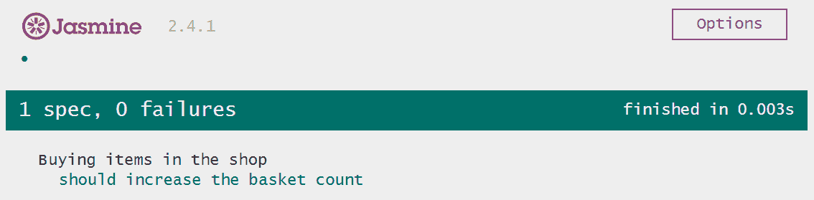
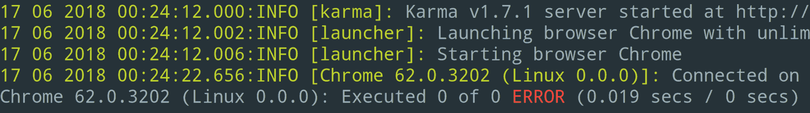
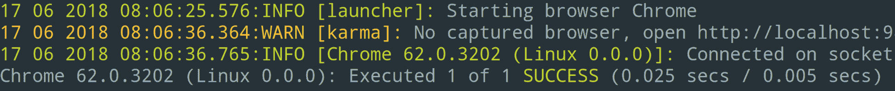

# 将事物置于测试之中

编写测试对于代码的可维护性至关重要。众所周知，拥有一个广泛的测试范围，覆盖了大部分功能，与功能本身一样重要。

当想到测试时，首先想到的可能就是代码质量保证。你测试你写的代码，所以这当然是在确保你的代码质量。然而，编写测试还有很多其他重要的方面：

+   **抵抗意外变化**：你的测试定义了你的代码应该做什么。它们测试你的代码是否符合你的规范。这有几个好处，其中最明显的好处可能是抵抗未来意外变化的能力。如果你将来修改代码，你不太可能破坏现有的代码，因为你的测试将验证现有功能是否仍然按指定的方式工作。

+   **文档**：你的测试定义了你的代码应该做什么。同时，它们显示了使用相关功能所需的 API 调用。这是任何开发者的完美文档。每当我想要了解一个库是如何真正工作的，我首先看的就是测试。

+   **避免不必要的代码**：编写测试迫使你将代码限制在满足你的规范要求内，不再需要更多。你应用中任何在自动化测试中未触及的代码都可以被认为是死代码。如果你坚持无情地重构方法，你将尽快移除这些未使用的代码。

到目前为止，我们在这本书中根本就没有考虑过测试，鉴于其重要性，你可能想知道为什么我会在书的最后一章现在才来探讨这个问题。在实际项目中，我们肯定会更早地创建测试，如果不是一开始就做的话。然而，我希望你能理解，在这本书中，我们之所以将这个相当重要的主题推迟到结尾，是有原因的。我真的很喜欢测试，但鉴于我们主要关注 Angular 的组件架构，将这一章节放在最后似乎更合理。

在本章中，我们将探讨如何对你的组件进行适当的单元测试。我们将专注于单元测试；自动化、端到端测试超出了本书的范围。我们将探讨如何测试用户与组件的交互，但不会达到端到端测试的水平。

在本章中，我们将深入探讨以下主题：

+   Jasmine 测试框架简介

+   为组件编写简单测试

+   创建 Jasmine 间谍并观察组件输出属性

+   了解 Angular 测试工具，例如 `inject`、`async`、`TestBed`、`ComponentFixture`、`DebugElement` 等

+   模拟组件

+   模拟现有服务

+   为我们的`Efforts` UI 组件创建测试

+   为我们的`TaskListContainer`组件创建测试

# Jasmine 和 Karma 简介

Jasmine 是一个非常简单的测试框架，它附带了一个 API；它允许你编写**行为驱动开发**（**BDD**）风格的测试。BDD 是一种敏捷软件开发过程，用于以书面格式定义规范。

在 BDD 中，我们定义敏捷用户故事由多个场景组成。这些场景与故事的可接受标准密切相关，甚至可以替代它们。它们在更高层次上定义了需求，并且主要是叙事性的。每个场景由三个部分组成：

+   **给定**：这部分用于描述场景的初始状态。测试代码是我们执行测试场景所需的所有设置的执行地方。

+   **当**：这部分反映了我们对正在测试的系统所做的更改。通常，这部分包括一些 API 调用和反映系统用户行为的操作。

+   **然后**：这部分指定了在给定状态和*当*部分应用的变化之后，系统应该看起来是什么样子。在我们的代码中，这部分通常是测试函数的末尾，我们在这里使用断言库来验证系统的状态。

Jasmine 附带了一个 API，使得根据 BDD 风格编写测试变得非常容易。让我们看看一个非常简单的例子，看看我们如何使用 Jasmine 为购物车系统编写测试：

```js
describe('Buying items in the shop', () => { 
  it('should increase the basket count', () => { 
    // Given 
    const shop = new Shop(); 
    // When 
    shop.buy('Toothpast'); 
    shop.buy('Shampoo'); 
    // Then 
    expect(shop.basket.length).toBe(2); 
    expect(shop.basket).toContain('Toothpaste'); 
    expect(shop.basket).toContain('Shampoo'); 
  }); 
}); 
```

Jasmine 为我们提供了一个`describe`函数，它允许我们将同一主题的某些场景分组。在这个例子中，我们使用`describe`函数为关于在商店购买物品的测试注册了一个新的测试套件。

使用`it`函数，我们可以注册我们希望进行测试的个别场景。在`describe`回调函数内部，我们可以注册任意数量的场景。我们还可以嵌套`describe`调用，以便进一步分组我们的场景。

在 Jasmine `it`函数的回调函数内部，我们可以开始编写我们的测试。我们可以在测试内部使用 BDD 风格注释来结构化代码。

你不一定要在浏览器中运行 Jasmine，但如果你这样做，你将得到所有测试及其状态的简洁总结报告：



Jasmine 提供了一个很好的视觉报告，显示了所有的测试规范，还允许你重新运行单个测试，并提供更多选项

Jasmine 附带与我们相关的三个部分：

+   **Jasmine 核心**：这包含测试定义 API、断言库以及测试框架的所有其他核心部分

+   **Jasmine HTML**：这是 HTML 报告器，它将所有测试结果写入浏览器文档，并提供重新运行单个测试的选项

+   **Jasmine 启动**：这是启动浏览器中的 Jasmine 框架并执行与 HTML 报告器相关的任何设置的文件

# Karma 和 Angular CLI 的集成

Jasmine 是与 Angular CLI 工具一起打包的默认测试框架。CLI 工具会安装 Jasmine，以及流行的测试运行器 Karma，这允许你在你选择的浏览器中运行你的测试。

通过使用 Karma，我们不需要在我们的项目中安装和配置 Jasmine。Karma 会处理这些，并且还提供很多额外功能。

使用 Angular CLI 生成的项目包含两个与使用 Karma 和 Jasmine 运行测试相关的文件：

+   `/karma.conf.js`：此文件包含 Karma 测试运行器的配置。它已经创建好了，用于在浏览器中运行 Angular 测试。默认情况下，它配置为在真实的 Chrome 浏览器中运行测试。但是，你可以将其更改为 Chrome 的无头版本、不同的浏览器，甚至 PhantomJS，这是一个非常快速且轻量级的无头浏览器。

+   `/src/test.ts`：此文件是运行你的测试的主要入口文件。当你使用 CLI 创建新项目时，它会自动为你生成。此文件包含运行 Angular 测试所需的全部准备工作，以便在你的浏览器中使用 Karma 运行。它还使用动态导入，以发现项目中的任何测试文件（文件名以 `.spec.ts` 结尾），并将它们传递给 Karma 以执行。

Angular CLI 带有一组预定义的命令，用于在项目中执行测试。它支持一次性运行所有测试，以验证你的当前状态。然而，有时在开发应用程序时保持测试运行是非常有用的。这支持你进行测试驱动开发方法，其中你将希望从测试中获得持续的反馈循环。

通过使用 Angular CLI 工具运行两个不同的命令来开始测试。确保你处于你的项目文件夹中，并执行以下命令：

```js
ng test --watch false
```

以下代码将在你的项目中启动单次测试运行。由于我们还没有添加任何测试，你应该看到类似于以下输出的结果：



使用 Angular CLI 进行单次执行（单次运行），没有测试存在

当你即将发布新版本或想要验证代码的某个状态的质量时，单次运行你的测试是很有用的。在本章中，我们将向现有的组件添加一些测试，并在我们进行更改时看到测试的评估结果将非常令人满意。为此，我们开始使用 Karma 的文件监视功能。通过运行以下 Angular CLI 命令，你可以以监视模式启动 Karma。这将使你的终端忙于测试，类似于 Angular CLI 中的 `serve` 命令。

通过运行以下命令来以测试监视模式启动 Angular CLI：

```js
ng test
```

如你所见，我们这次完全省略了 `watch` 命令行参数。默认情况下，当你执行 `test` 命令时，Angular CLI 将以监视模式运行 Karma。

如果您希望在运行测试时获得持续的反馈，您应该始终启动两个终端会话，一个执行 Angular CLI 服务器（`ng serve`），另一个以监视模式运行 Karma（`ng test`）。

# 编写我们的第一个测试

现在我们已经设置好了测试环境，我们可以开始编写我们的第一个测试。在本节中，我们将为我们在第八章中创建的努力组件创建第一个测试，*时间会证明一切*。

由于 Angular 组件只是类，我们可以通过实例化组件类并测试其方法来测试它们的大部分功能。可以通过这种方式进行的测试应该首先考虑。不涉及您组件渲染逻辑的测试可以在 Angular 编译和引导组件之前运行。

努力组件使用一个方法向任务上实际工作的小时数添加一定量的小时。在努力组件的模板中，我们提供了三个按钮，用于添加一些常见的小时数。让我们为我们的努力组件中的 `addEffectiveHours` 方法创建我们的第一个测试。为此测试，我们想从简单开始，手动创建组件类实例。这允许我们在不需要启动 Angular 模板编译器、变更检测和其他

当使用 Angular CLI 创建新组件时，将为您创建一个相应的 `spect.ts` 文件，其中包含一些基本测试。然而，我们始终使用标志 `--spec false` 创建新组件，这防止了这一步骤。让我们手动创建我们的第一个规范文件，通过在路径 `src/app/efforts/efforts/efforts.component.spec.ts` 上创建一个新文件。

打开创建的文件，并添加以下内容：

```js
import {EffortsComponent} from './efforts.component';
import {TimeEfforts} from '../../model';

describe('EffortsComponent', () => {
  it('should add eight hours correctly', () => {
    // Given
    const hour = 3600000;
    const component = new EffortsComponent();
    component.efforts = {
      estimated: 0,
      effective: 0
    };
    component.outEffortsChange.subscribe((efforts: TimeEfforts) => {
      // Then
      expect(efforts.effective).toBe(hour * 8);
    });

    // When
    component.addEffectiveHours(8);
  });
});
```

Karma 加载我们的规范文件，并在执行我们的测试之前已经加载了 Jasmine。因此，我们可以安全地依赖 Jasmine 暴露的全局 `describe`、`it` 和 `expect` 函数。

如您所见，我们实际上不需要引导 Angular 来测试一些组件的功能。只需测试组件类实例，我们就可以执行一些我们的规范。

为了说明我们如何以 BDD 方式构建测试，我们添加了一些注释，指出了“给定”、“当”和“然后”部分。

在给定部分，我们创建一个新的努力组件实例。然后，我们将组件的努力输入属性设置为一个新的努力对象，其中包含零的估计和实际持续时间。在当部分，我们调用 `addEffectiveHours` 方法，参数为 8 小时。

现在，我们想测试我们的方法调用是否按预期执行。我们的努力组件是一个纯 UI 组件，它不存储任何状态。相反，它使用输出属性委托任何状态变化。在我们的测试上下文中，`outEffortsChange` 输出在调用 `addEffectiveHours` 方法后触发。

由于事件发射器在组件输出属性上呈现的只是可观察的，我们可以简单地订阅输出以验证我们的测试。我们使用 Jasmine 辅助函数 `expect` 来断言更新后的有效努力属性是否是我们测试后期望的。

如果你编写这个第一个测试时 Angular CLI 测试命令仍在运行，你现在应该在终端输出中看到成功的测试执行。否则，只需再次启动测试运行器，使用终端上的 `ng test` 命令：



终端和 Angular CLI ng test 命令，显示我们的第一个测试成功运行

# 监视组件输出

在测试中，一个常见的做法是在测试执行期间监视函数调用，然后评估这些调用，检查是否所有函数都被正确调用。

Jasmine 为我们提供了一些有用的辅助函数，以便使用 `spy` 函数调用。我们可以使用 Jasmine 的 `spyOn` 函数用 `spy` 函数替换原始函数。`spy` 函数将记录任何调用，我们可以评估它们被调用的次数以及调用时的参数。

让我们看看如何使用 `spyOn` 函数的一个简单例子：

```js
class Calculator { 
  multiply(a, b) { 
    return a * b; 
  } 

  pythagorean(a, b) { 
    return Math.sqrt(this.multiply(a, a) + this.multiply(b, b)); 
  } 
} 
```

我们将测试一个简单的计算器类，它有两个方法。`multiply` 方法简单地乘以两个数字并返回结果。`pythagorean` 方法计算直角三角形的斜边，该三角形有两个边长 `a` 和 `b`。

你可能还记得从小学时代起就学过的勾股定理公式：


我们将使用这个公式通过计算 `a*a + b*b` 的平方根来从 `a` 和 `b` 产生 `c`。对于乘法，我们将使用我们的 `multiply` 方法，而不是直接使用算术运算符。

现在，我们想要测试我们的计算器 `pythagorean` 方法，因为它使用 `multiply` 方法来乘以 `a` 和 `b`，我们可以监视该方法以深入验证我们的测试结果：

```js
describe('Calculator pythagorean function', () => { 
  it('should call multiply function correctly', () => { 
    // Given 
    const calc = new Calculator(); 
    spyOn(calc, 'multiply').and.callThrough(); 
    // When 
    const result = calc.pythagorean(6, 8); 
    // Then 
    expect(result).toBe(10); 
    expect(calc.mul).toHaveBeenCalled(); 
    expect(calc.mul.calls.count()).toBe(2); 
    expect(calc.mul.calls.argsFor(0)).toEqual([6, 6]); 
    expect(calc.mul.calls.argsFor(1)).toEqual([8, 8]); 
  }); 
}); 
```

Jasmine 的 `spyOn` 函数接受一个对象作为第一个参数，以及我们想要监视的对象上的函数名作为第二个参数。

这将有效地用 Jasmine 的新 `spy` 函数替换我们类实例中的原始 `multiply` 函数。默认情况下，`spy` 函数只会记录函数调用，并且不会将调用委托给原始函数。我们可以使用 `.and.callThrough()` 函数来指定我们希望 Jasmine 调用原始函数。这样，我们的 spy 函数将充当代理，同时记录任何调用。

在测试的 `then` 部分，我们可以检查 `spy` 函数。使用 `toHaveBeenCalled` 匹配器，我们可以检查 spy 函数是否被调用过。

使用 `spy` 函数的 `calls` 属性，我们可以更详细地检查并验证调用次数，以及各个调用接收到的参数。

我们可以将我们对 Jasmine 间谍的知识应用到我们的组件测试中。因为我们知道所有组件的输出属性都包含一个事件发射器，我们实际上可以监视它们以检查我们的组件是否发送输出。

在组件内部，我们调用事件发射器的`emit`方法，以便向父组件绑定发送输出。由于这是一个异步操作，而且我们还想在不涉及父组件的情况下测试我们的组件，我们可以简单地监视输出属性的`emit`方法。

通常，如果可能的话，避免在单元测试中进行异步操作是一个好的实践。通过使用 Jasmine 间谍，我们可以模拟会导致异步操作的某些函数调用。

让我们将努力组件的第一个测试改为使用 Jasmine 间谍，而不是依赖于可观察的订阅。打开文件`src/app/efforts/efforts/efforts.component.spec.ts`，并进行以下更改：

```js
import {EffortsComponent} from './efforts.component';

describe('EffortsComponent', () => {
  it('should add eight hours correctly', () => {
    // Given
    const hour = 3600000;
    const component = new EffortsComponent();
    component.efforts = {
      estimated: 0,
      effective: 0
    };
 spyOn(component.outEffortsChange, 'emit');

    // When
    component.addEffectiveHours(8);

    // Then
 expect(component.outEffortsChange.emit).toHaveBeenCalledWith({
 estimated: 0,
 effective: hour * 8
 });
  });
});
```

我们创建了一个监视`outEffortsChange`输出属性的 Jasmine 间谍。更确切地说，我们正在监视对底层事件发射器的`emit`方法的任何调用。

由于我们不再依赖于在事件发射器输出上注册的`subscribe`方法的回调，我们现在有了更干净的测试代码。测试代码被完美地组织成我们的 BDD 风格测试的给定、当和然后部分，并且不需要使用带有回调函数的订阅。

使用 Jasmine 的`toHaveBeenCalledWith`断言辅助器，我们可以仔细评估`spy`函数，并检查记录的调用是否与我们的预期相符。

# 组件测试的实用工具

到目前为止，我们使用纯 JavaScript 测试了我们的组件。由于组件在常规类中，这使得这一点成为可能。然而，这只适用于非常简单的用例。一旦我们想要测试涉及模板编译、组件上的用户交互、变更检测或依赖注入的组件，我们就需要从 Angular 那里得到一点帮助来执行我们的测试。

Angular 自带一整套测试工具，可以帮助我们在这里解决问题。实际上，Angular 构建的平台无关性允许我们用调试视图适配器替换常规视图适配器。这使得我们能够以这种方式渲染组件，以便我们可以更详细地检查它们。

Angular CLI 已经为我们启用了这个功能，如果你检查`src/test.ts`文件的内容，你可以看到有一个特殊的准备步骤，它启用了我们的测试 Angular 平台。以下核心摘录显示了我们的默认测试入口点的相关内容，这是我们在创建项目时由 Angular CLI 工具生成的：

```js
…
import { getTestBed } from '@angular/core/testing';
import {
  BrowserDynamicTestingModule,
  platformBrowserDynamicTesting
} from '@angular/platform-browser-dynamic/testing';

…

getTestBed().initTestEnvironment(
  BrowserDynamicTestingModule,
  platformBrowserDynamicTesting()
);
…
```

使用`@angular/core/testing`模块中的`initTestEnvironment`函数，我们实际上可以初始化一个测试平台注入器，它将在我们的 Angular 测试上下文中使用。

从 `@angular/platform-browser-dynamic/testing` 模块，我们可以导入一个特殊的测试平台工厂函数，以及 Angular 浏览器测试模块。

这段代码帮助我们设置一个依赖于特殊平台进行浏览器内测试的测试环境。当我们使用这个平台时，运行时将包含额外的调试信息。

# 测试中的注入

通过两个辅助函数，将 Angular 依赖注入到测试中变得简单。`inject` 和 `async` 函数通过 `@angular/core/testing` 包提供，并帮助我们向测试中注入依赖。

让我们看看这个简单的例子，其中我们使用 `inject` 包装函数注入 `document` 元素。这个测试对我们应用程序来说并不重要，但它说明了我们如何在测试中使用注入：

```js
import {DOCUMENT} from '@angular/common';
import {inject} from '@angular/core/testing';

describe('Application initialized with test providers', () => {
  it('should inject document', inject([DOCUMENT], (document) => {
 expect(document).toBe(window.document);
 }));
});
```

我们可以使用 `inject` 函数来包装我们的测试函数。`inject` 函数接受一个数组作为第一个参数，该数组应包含一个可注入类型的列表。第二个参数是我们实际的测试函数，它现在将接收注入的文档。

另一方面，`async` 函数帮助我们处理不同的关注点。如果我们的测试实际上涉及异步操作怎么办？嗯，一个标准的异步 Jasmine 测试看起来如下：

```js
describe('Async test', () => { 
  it('should be completed by calling done', (done) => { 
    setTimeout(() => { 
      expect(true).toBe(true); 
      done(); 
    }, 2000); 
  }); 
}); 
```

Jasmine 提供了一种很好的方式来指定异步测试。我们可以简单地使用测试函数的第一个参数，它解析为一个名为 `done` 的回调函数，这是一个惯例。通过调用这个回调函数，我们可以告诉 Jasmine 我们的异步操作已完成，我们希望完成测试。

使用回调来指示我们的异步测试是否完成是一个有效的选项。然而，如果涉及许多异步操作，这可能会使我们的测试相当复杂。有时甚至无法监控底下的所有异步操作，这也使得我们无法确定测试的结束。

这就是 `async` 辅助函数发挥作用的地方。Angular 使用一个名为 Zone.js 的库来监控浏览器中的任何异步操作。简单来说，Zone.js 钩入任何异步操作，并监控它们何时启动以及何时完成。有了这些信息，Angular 可以确切地知道有多少挂起的异步操作。

如果我们使用 `async` 辅助函数，我们可以告诉 Angular 当测试中的所有异步操作都完成后自动完成我们的测试。这个辅助函数使用 Zone.js 创建一个新的区域，并确定该区域内执行的所有微任务是否已完成。

让我们看看我们如何在测试中将注入与异步操作结合起来：

```js
import {describe, expect, it, inject, async} from '@angular/core/testing'; 
import {DOCUMENT} from '@angular/platform-browser'; 

describe('Application initialized with test providers', () => {
  it('should inject document', async(inject([DOCUMENT], (document) => {
    setTimeout(() => {
      expect(document).toBe(window.document);
    }, 2000);
  })));
});
```

通过将`inject`与`async`（包装）结合使用，我们现在可以在测试中测试异步操作，而无需任何麻烦。`async`辅助函数将使我们的测试等待直到所有异步操作完成。我们不需要依赖回调，并且我们有保证，即使在测试完成之前，内部异步操作也会完成。

Zone.js 旨在与浏览器中的所有异步操作一起工作。它修补所有核心 DOM API，并确保每个操作都通过一个区域。Angular 还依赖于 Zone.js 来启动变更检测。它等待区域（浏览器内的任何异步操作）终止，以便执行变更检测。这非常聪明，因为应用程序状态可能发生变化的唯一可能时刻是在异步操作终止之后。

# 使用 TestBed 运行 Angular 测试

Angular 附带另一个非常重要的测试工具。到目前为止，我们只测试了组件的组件类。然而，一旦我们需要在我们的应用程序中测试组件及其行为，就会涉及更多的事情：

+   **测试组件视图**：有时需要测试组件的渲染视图。由于我们的视图中包含所有绑定，使用模板指令和内容投影进行动态实例化，编写确定性测试可能很困难。

+   **测试变更检测**：一旦我们在组件类中更新我们的模型，我们就会想要测试通过变更检测执行更新的操作。这涉及到我们组件的整个变更检测行为。

+   **用户交互**：我们的组件模板可能包含一组事件绑定，这些绑定在用户交互中触发某些行为。我们需要一种方法来测试用户交互后的状态。

+   **覆盖和模拟**：在测试场景中，有时需要模拟组件中的某些区域，以便为测试创建适当的隔离。在单元测试中，我们只应关注我们想要测试的具体行为。

通过`@angular/core/testing`包提供的`TestBed`类帮助我们解决了之前列出的问题。它是我们测试组件的主要工具。

让我们看看如何使用`TestBed`类来测试一个简单模拟组件的视图渲染的一个非常简单的例子：

```js
import {Component} from '@angular/core';
import {TestBed, async} from '@angular/core/testing';

@Component({
  selector: 'mac-dummy',
  template: 'dummy'
})
class DummyComponent {}

describe('DummyComponent', () => {
  beforeEach(async(() => {
    TestBed.configureTestingModule({
      declarations: [DummyComponent],
    }).compileComponents();
  }));

  it('should render its view correctly', async(() => {
    const fixture = TestBed.createComponent(DummyComponent);
    expect(fixture.nativeElement.textContent).toBe('dummy');
  }));
}); 
```

`beforeEach`函数是一个 Jasmine 辅助函数，它允许我们在给定测试套件中的每个测试之前执行某些操作。在`beforeEach`回调中，我们使用从`@angular/core/testing`导入的`TestBed`类来准备我们的测试环境。

`Testbed`类上的`configureTestingModule`方法允许我们配置一个动态 Angular 模块，该模块定义了我们的测试的整个上下文。传递给该方法的配置对象与我们传递给`@NgModule`装饰器工厂定义 Angular 模块时传递的对象完全相同。它支持`import`、`providers`、`declarations`以及 Angular 模块的所有其他属性。这允许我们创建一个非常具体和隔离的测试环境，在那里我们可以只测试我们真正需要测试的内容。

此外，请注意，我们正在使用 Angular 的`async`辅助函数来包装我们的`beforeEach`回调函数。这是必要的，因为`compileComponents`方法调用是一个异步操作，它编译我们动态测试模块中存在的所有组件。这将确保当我们进入测试方法时，`beforeEach`回调中执行的编译已完成，我们可以开始测试。

在测试组件时，你需要确保在由`configureTestingModule`调用创建的动态模块中包含所有必要的依赖项。这包括测试组件中存在的任何子组件、管道、服务以及组件的任何其他依赖项。

# 组件固定对象

在我们的测试中，我们使用`Testbed`类的`createComponent`方法来创建我们虚拟组件的新组件实例。由于该方法调用，我们将收到一个组件固定对象，这将帮助我们进一步对我们的组件进行测试。

组件固定对象是我们正在测试的组件的包装器，它允许我们进一步检查和操作我们的测试用例。现在我们可以使用固定对象的`nativeElement`属性来访问创建的组件的根 DOM 元素，并断言该元素的文字内容，以验证组件是否正确渲染。

让我们更详细地看看`ComponentFixture`类型，以及可用的属性和方法：

| 成员 | 描述 |
| --- | --- |
| `detectChanges()` | 此方法在固定上下文中创建的根组件上执行变更检测。使用`Testbed`类创建组件后，模板绑定不会自动评估。触发变更检测是我们的责任。即使我们更改了组件的状态，我们也需要再次触发变更检测。这种手动变更检测可能听起来很繁琐，但对我们测试期间执行的任何操作拥有完全控制权是很重要的。我们总是希望测试是完全确定性的。 |
| `destroy()` | 此方法销毁底层组件并执行所需的任何清理操作。这可以用来测试`OnDestroy`组件的生命周期。 |
| `componentInstance` | 此属性指向组件类实例，如果我们想与组件交互，它是我们的主要交互点。 |
| `nativeElement` | 这是对创建的组件根部的原生 DOM 元素的引用。这个属性可以用来直接检查我们组件的渲染 DOM。 |
| `elementRef` | 这是创建的组件根元素的`ElementRef`包装器。 |
| `debugElement` | 这个属性指向在测试浏览器平台创建组件视图渲染管道时创建的`DebugElement`实例。调试元素为我们提供了一些检查渲染元素树和测试用户交互的便利工具。我们将在另一个部分中更详细地探讨这一点。 |

# 模拟子组件

我们现在已经查看了一个非常简单的哑组件，以及如何使用 Angular 的`TestBed`以及`inject`和`async`辅助函数来测试它。

这很好，但它并没有真正反映我们在测试真实组件时面临的复杂性。真实组件比我们的哑组件有更多的依赖。我们依赖于子指令，以及可能注入的服务来获取数据。

当然，Angular 的`TestBed`也为我们提供了测试更复杂组件所需的工具，同时在单元测试中保持必要的隔离。

首先，让我们看一个例子，我们想要测试一个使用子组件来渲染数字列表的父组件。在这个测试中，我们只想测试父组件，并且对子组件如何渲染列表不感兴趣。我们想要通过在测试期间为子组件提供一个模拟组件来移除子组件的行为，这样我们就可以轻松地验证数据是否被子组件接收：

```js
@Component({
  selector: 'mac-child',
  template: '<ul><li *ngFor="let n of numbers">Item: {{ n }}</li></ul>'
})
class ChildComponent {
  @Input() numbers;
}

@Component({
  selector: 'mac-parent',
  template: '<mac-child [numbers]="numbers"></mac-child>'
})
class ParentComponent {
  numbers = [1, 2, 3];
}
```

这是我们的起点。我们有两个组件，我们只对测试父组件感兴趣。然而，父组件需要子组件，并且它意味着渲染由父组件传递的数字的一种非常具体的方式。我们只想测试我们的数字是否成功传递给了子组件。我们不想将子组件的渲染逻辑涉及到我们的测试中。这非常重要，因为只更改子组件可能会破坏我们的父组件测试，这正是我们想要避免的。

现在，我们想在测试的上下文中创建我们子组件的模拟：

```js
@Component({
  selector: 'mac-child',
  template: '{{ numbers.toString() }}'
})
class MockChildComponent {
  @Input() numbers;
}
```

在我们的模拟子组件中，使用与真实组件相同的选择器属性是很重要的。否则，模拟将不会工作。在模板中，我们使用一个非常简单的数字输入输出，这使得检查变得容易。数组上的`toString`方法将简单地渲染所有元素，用逗号分隔。

同样重要的是，我们需要提供与原始组件相同的输入属性。否则，我们无法正确地模仿真实组件。

现在，我们可以继续准备我们的测试。通过简单地将我们的模拟子组件添加到我们的动态测试模块的声明中，我们可以确保我们的父组件使用我们的模拟组件，而不是真实的子组件：

```js
describe('ParentComponent', () => {
  beforeEach(async(() => {
    TestBed.configureTestingModule({
      declarations: [
        ParentComponent,
        MockChildComponent
      ],
    }).compileComponents();
  }));

  it('should pass numbers to child correctly', async(() => {
    const fixture = TestBed.createComponent(ParentComponent);
    fixture.detectChanges();
    expect(fixture.nativeElement.textContent).toBe('1,2,3');
  }));
}); 
```

因此，在我们的测试上下文中，我们将父组件与子组件解耦。我们需要这种级别的分离，以便正确隔离我们的单元测试。由于我们的模拟子组件只是简单地渲染传递数组的字符串表示，我们可以轻松地测试我们的固定内容的文本。

单元测试的定义是对单个单元进行测试并隔离该单元与任何依赖项。如果我们想坚持这种范式，我们需要为每个依赖组件创建一个模拟。这很容易让我们陷入需要维护更多复杂性的情况，仅仅是为了我们的测试。关键在于找到正确的平衡。你应该模拟对主题有重大影响的依赖项，并忽略对您想测试的功能影响较低的依赖项。

# 模拟服务

让我们看看一个不同的用例，其中我们有一个注入服务以获取数据的组件。由于我们只想测试我们的组件，而不是它所依赖的服务，我们 somehow 需要偷偷地引入一个模拟服务而不是真实的服务。由于我们可以为我们的需求定义我们的动态测试模块，我们可以在我们的模块定义上简单地使用`providers`属性来引入模拟服务。

首先，我们应该声明我们的基本组件及其依赖的服务。在这个例子中，数字组件注入一个数字服务，其中它获取一个包含数字的数组：

```js
@Injectable()
class NumbersService {
  numbers = [1, 2, 3, 4, 5, 6];
}

@Component({
  selector: 'mac-numbers',
  template: '{{ numbers.toString() }}'
})
class NumbersComponent {
  numbers: number[];

  constructor(numbersService: NumbersService) {
    this.numbers = numbersService.numbers;
  }
}
```

现在，我们需要创建一个模拟服务，它提供测试所需的数据，并隔离我们的组件与原始服务：

```js
@Injectable()
class MockNumbersService {
  numbers = [1, 2, 3];
}
```

在这个简化的例子中，我们只是提供了一组不同的数字。然而，在真实的模拟案例中，我们可以排除很多不必要的步骤，这些步骤可能会产生副作用。使用模拟服务还确保了我们的测试，即专注于数字组件的测试，不会因为真实数字服务的更改而中断。

现在，让我们看看测试用例，看看我们如何可以使用`TestBed`提供我们的模拟服务，而不是真实的服务：

```js
describe('NumbersComponent', () => {
  beforeEach(async(() => {
    TestBed.configureTestingModule({
      declarations: [NumbersComponent],
      providers: [{
        provide: NumbersService,
        useClass: MockNumbersService
      }]
    }).compileComponents();
  }));

  it('should render numbers correctly', async(() => {
    const fixture = TestBed.createComponent(NumbersComponent);
    fixture.detectChanges();
    expect(fixture.nativeElement.textContent).toBe('1,2,3');
  }));
});
```

在动态测试模块定义中使用`providers`属性，我们可以为正在测试的组件提供依赖项。这允许我们替换组件中使用的依赖项。我们可以在依赖注入请求数字服务时，简单地创建一个提供者，提供我们的替代模拟数字服务。

有时候，我们无法完全控制我们的依赖项；例如，当我们通过导入的模块获取预定义的提供者集合时。`TestBed`通过提供额外的覆盖方法来帮助我们处理这种情况。让我们再次看看前面的例子；这次，我们使用覆盖机制悄悄地引入我们的模拟服务：

```js
describe('NumbersComponent', () => {
  beforeEach(async(() => {
 TestBed.configureTestingModule({
 declarations: [NumbersComponent],
 providers: [NumbersService]
 });
 TestBed.overrideProvider(NumbersService, {useValue: new MockNumbersService()});
 TestBed.compileComponents();
  }));

  it('should render numbers correctly', async(() => {
    const fixture = TestBed.createComponent(NumbersComponent);
    fixture.detectChanges();
    expect(fixture.nativeElement.textContent).toBe('1,2,3');
  }));
});
```

使用`overrideProvider`方法允许我们用我们的模拟服务覆盖之前指定的真实服务。当你测试依赖于导入的 Angular 模块的大型应用程序，而这些模块不完全受你控制时，这是一个重要的工具。

Angular 的`Testbed`类允许我们以非常简单、隔离和灵活的方式执行测试。它在编写组件的单元测试时扮演着重要角色。如果你想了解更多关于`Testbed`类中可用方法的信息，你可以访问官方文档网站[`angular.io/api/core/testing/TestBed`](https://angular.io/api/core/testing/TestBed)。

现在，是时候使用我们对`Testbed`实用类的新的知识，开始测试我们的应用程序组件的实际操作了！

# 测试组件的实际操作

在上一个主题中，我们学习了`Testbed`实用类，以及如何使用它在一个隔离的测试环境中测试组件。我们学习了`inject`和`async`辅助工具，以及如何模拟组件和服务。

现在，让我们用这个知识来处理我们关于努力组件的测试。如果你看一下我们努力组件的模板，你会记得我们依赖于两个子组件：

+   **持续时间**：模板中的两个持续时间组件用于输入估计和实际任务上花费的努力的持续时间值。当你想要对努力组件进行测试时，模拟该组件是个好主意。持续时间组件本身依赖于相对复杂的编辑组件。

+   **努力时间线**：由于这是一个纯图形组件，用于表示我们的任务努力，我们并不希望它参与我们努力组件的测试。然而，由于这个组件实际上并不干扰我们的努力行为，我们不一定需要模拟它。让我们在这个特定实例中使用真实组件。

好的；让我们继续编写我们努力组件的测试。到目前为止，我们只测试了努力组件的类方法。我们现在想继续通过模拟持续时间组件并使用 Angular 的`TestBed`来创建一个新的组件实例。

如果你还没有启动，现在是时候使用 Angular CLI 工具启动测试框架了。在项目文件夹内，使用命令行中的`ng test`。

打开位于路径`src/app/efforts/efforts/efforts.component.spec.ts`的测试文件，并执行以下更改：

```js
import {Component, EventEmitter, Input, Output} from '@angular/core';
import {TestBed, async, ComponentFixture} from '@angular/core/testing';
import {EffortsComponent} from './efforts.component';
import {EffortsTimelineComponent} from '../efforts-timeline/efforts-timeline.component';

@Component({
 selector: 'mac-duration',
 template: '{{ duration }}'
})
class MockDurationComponent {
 @Input() duration: number;
 @Output() outDurationChange = new EventEmitter<number>();
}

describe('EffortsComponent', () => {
  let fixture: ComponentFixture<EffortsComponent>;

 beforeEach(async(() => {
 TestBed.configureTestingModule({
 declarations: [
 EffortsComponent,
 MockDurationComponent,
 EffortsTimelineComponent
 ],
 }).compileComponents();
 fixture = TestBed.createComponent(EffortsComponent);
 }));

  …
});
```

我们新引入的模拟持续时间组件可能看起来有点脆弱，但实际上这正是我们当前对努力组件测试所需的所有内容。持续时间组件应该只接受一个 `duration` 输入并暴露一个 `ourDurationChange` 输出。这是我们努力组件模板中预期的接口。由于我们不希望依赖任何持续时间组件的内部实现，包括使用编辑器组件，我们的模拟持续时间组件的模板简单地渲染持续时间输入。这样，我们可以轻松地验证我们的模拟组件中是否渲染了正确的持续时间。

现在，让我们使用 `Testbed` 创建的组件实例和 fixture 创建我们的第一个测试，对努力测试文件应用以下更改：

```js
…

describe('EffortsComponent', () => {
  …

  it('should render initial efforts correctly', () => {
    // Given
    const component = fixture.componentInstance;
    component.efforts = {
      estimated: 1,
      effective: 2
    };

    // When
    fixture.detectChanges();

    // Then
    expect(fixture.nativeElement.textContent).toBe('Estimated:1Effective:2+1h+4h+1d');
  });

  …

});
```

在我们的测试中，我们希望测试努力组件是否使用正确的内容初始化持续时间子组件（分别，我们的模拟持续时间组件）。

使用由 `Testbed` 工具类提供的组件 fixture，我们可以开始与创建的组件进行交互。通过组件 fixture 的 `componentInstance` 成员，我们可以设置我们努力组件所需输入属性。

由于我们在测试中需要手动处理变更检测，我们使用在 fixture 上的 `detectChanges` 方法来更新组件视图。这将启动我们组件的变更检测生命周期并执行必要的视图更新。

在两个持续时间组件的视图更新之后，我们可以运行断言以通过获取我们 fixture 的 `nativeElement` 属性上的文本内容来验证更新的 DOM。

在某些情况下，使用我们整个组件 fixture 的文本内容属性可能很好。然而，有时这并不提供足够粒度来进行良好的断言。在某些场景中，当我们涉及更多的 DOM 元素时，直接断言根组件的 `textContent` 属性将不足以提供必要的细节。它可能包含大量的噪声，而这并不是我们断言所感兴趣的。我们应该始终尝试将我们的断言缩小到尽可能少的细节。

在我们新创建的测试中，我们需要使用字符串 `Estimated:1Effective:2+1h+4h+1d` 进行断言，以验证我们组件的正确渲染。然而，这也包括我们添加按钮的标签，而这并不是我们在这里想要测试的。记住，我们总是希望将我们的测试缩小到精确的一个单元，并避免对特定测试案例之外的事物的任何依赖。

让我们尝试增强我们的测试并断言我们组件视图的更具体部分。由于我们可以访问我们 fixture 上的原生 DOM 元素，我们可以简单地使用 DOM API 来选择子元素，以缩小我们的断言：

```js
expect(fixture.nativeElement.querySelector('mac-duration').textContent.trim()).toBe('1'); 
```

这将成功选择我们的第一个模拟持续时间组件的 DOM 元素，我们只能检查持续时间组件内的文本内容。

尽管这可能会是一个可行的方案，但 Angular 为我们提供了一个更好的方法来解决此问题。

由组件 fixture 提供，我们可以在测试浏览器平台的环境中访问由测试创建的调试元素树。调试元素允许我们对 Angular 在渲染我们的组件时创建的元素树进行高级检查。它还包含一个高级查询 API，允许我们在组件树中搜索特定元素。

让我们重写我们的测试，以使用调试元素提供的先进功能，并单独断言估计和有效持续时间组件视图：

```js
…
import {By} from '@angular/platform-browser';
…

describe('EffortsComponent', () => {
  …

  it('should render initial efforts correctly', () => {
    // Given
    const component = fixture.componentInstance;
    component.efforts = {
      estimated: 1,
      effective: 2
    };
    const [estimatedDurationElement, effectiveDurationElement] = fixture.debugElement
 .queryAll(By.directive(MockDurationComponent));

    // When
    fixture.detectChanges();

    // Then
 expect(estimatedDurationElement.nativeElement.textContent).toBe('1');
 expect(effectiveDurationElement.nativeElement.textContent).toBe('2');
  });

  …

});
```

每个调试元素对象上可用的`query`和`queryAll`方法使我们能够像查询 DOM 树一样查询 Angular 视图树，使用`querySelector`和`querySelectorAll`。这里的区别在于我们可以

使用谓词辅助器查询匹配元素。使用`By`辅助类，我们可以创建这些谓词，然后将被用于查询调试元素树。

目前有三种不同的谓词可用，使用`By`辅助器：

| 成员 | 描述 |
| --- | --- |
| `By.all()` | 这是一个谓词，将导致查询当前`DebugElement`对象的所有子`DebugElement`对象。 |
| `By.css(selector)` | 这是一个谓词，将导致使用指定的 CSS 选择器查询`DebugElement`。 |
| `By.directive(type)` | 这是一个谓词，将导致查询包含指定指令的`DebugElement`。 |

回到我们的测试中，我们现在可以使用 fixture 调试元素上的查询方法，以查询我们的持续时间组件。由于我们已经用模拟的持续时间组件替换了真实的持续时间组件，我们需要查询后者。我们使用谓词`By.directive(MockDurationComponent)`，这将成功查询代表我们两个模拟持续时间组件宿主元素的调试元素对象。

调试元素对象的`query`方法将始终返回一个新调试元素对象，该对象是第一个找到的元素，如果找到了匹配项。如果没有找到查询的元素，它将返回`null`。

调试元素的`queryAll`方法将返回一个包含许多调试元素的数组，这些元素将包含所有匹配谓词的元素。如果没有匹配的元素，此方法将返回一个空数组。

# 测试组件交互

尽管 UI 交互测试可能是端到端测试的一部分，但我们将探讨如何测试与您组件的基本用户交互。在本主题中，我们将测试当用户点击其中一个按钮以添加有效工时小时时，努力组件的行为。

让我们在现有的努力组件测试文件中添加一个新的测试，该文件位于路径`src/app/efforts/efforts/efforts.component.spec.ts`：

```js
  it('should add one day of effective efforts on button click', () => {
    // Given
    const day = 3600000 * 8;
    const component = fixture.componentInstance;
    component.efforts = {
      estimated: 0,
      effective: 0
    };
    const addDayButton = fixture.debugElement
      .queryAll(By.css('button'))[2];
    spyOn(component.outEffortsChange, 'emit');

    // When
    addDayButton.triggerEventHandler('click', null);

    // Then
    expect(component.outEffortsChange.emit).toHaveBeenCalledWith({
      estimated: 0,
      effective: day
    });
  });
```

我们希望在测试中为`outEffortsChange.emit`函数设置一个 Jasmine spy。这样，我们就可以稍后检查当我们在按钮上点击以添加一天的有效努力时，我们的努力组件是否成功发射了事件。

在给定的部分，我们正在为测试做准备。我们用一个新的对象初始化组件的`efforts`输入。我们还查询了努力组件视图中添加一天有效努力的按钮的调试元素。我们使用`queryAll`方法获取所有三个按钮的列表，并通过访问数组元素索引`2`来选择第三个。`css`谓词工厂允许我们传递一个 CSS 选择器来查询调试元素。

在测试的 when 部分，我们可以通过使用`triggerEventHandler`方法在`addDayButton`调试元素上模拟一个`click`事件。使用此方法，你可以触发你希望在底层元素上发射的事件。监听该事件的 Angular 事件监听器将被同步触发。

在我们 BDD 风格测试的当前部分，我们可以简单地评估我们为组件的`outEffortsChange`输出属性创建的 Jasmine spy。

通过使用调试元素，测试组件上的用户交互变得非常简单。我们还可以通过使用`triggerEventHandler`辅助方法将我们的测试与底层 DOM 事件架构解耦。

`triggerEventHandler`方法在 Angular 的虚拟元素树上操作，而不是实际的 DOM 树。因此，我们也可以使用此方法来触发附加到组件输出属性上的事件处理器。

# 摘要

在本书的最后一章，我们学习了如何为我们的组件编写简洁的单元测试。我们遵循了编写测试的 BDD 风格方法，并且我们还涵盖了 JavaScript 测试框架 Jasmine 的基础知识。

我们了解了 Angular 中可用的调试工具以及如何设置测试环境。使用 Angular 的`Testbed`实用类，我们能够以非常灵活但精确的方式进行测试。我们还了解了调试视图树和组件固定装置。这些使我们能够执行巧妙的检查并应用实际查询到渲染的视图中，以断言预期的结果。

我们使用了`inject`和`async`辅助函数来注入依赖项，并同时运行异步测试。我们构建了模拟组件，以便将我们的测试与应用程序的其他部分隔离开来。
