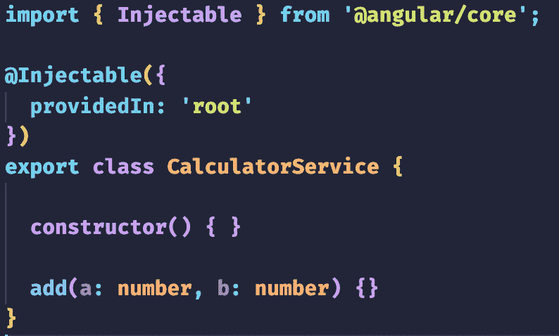

# <st c="0">3</st>

# <st c="2">为 Angular 组件、服务和指令编写有效的单元测试</st>

<st c="79">在本章中，我们将深入探讨如何为 Angular 组件、服务和指令编写有效的单元测试。</st> <st c="212">我们将继续上一章的内容，深入编写 Angular 组件的单元测试。</st> <st c="323">组件是 Angular 应用程序的基本构建块，彻底测试它们至关重要。</st> <st c="425">在本章中，我们将学习如何设置测试环境，创建组件实例，并测试组件属性、方法和事件处理。</st> <st c="575">我们还将探讨测试组件模型的技术，包括 DOM 操作和</st> <st c="666">事件模拟。</st>

<st c="683">我们还将关注 Angular 服务的单元测试。</st> <st c="741">服务在 Angular 应用程序中扮演着至关重要的角色，提供可重用的逻辑和数据操作。</st> <st c="846">我们将学习如何创建服务实例，模拟测试服务方法，并进行</st> <st c="936">数据操作。</st>

<st c="954">最后，我们将探讨如何对 Angular 指令进行单元测试。</st> <st c="1011">指令是操作 DOM 和改进我们应用程序行为的强大工具。</st> <st c="1114">我们将学习如何为指令设置测试环境，创建指令实例，并测试其行为以及与</st> <st c="1247">DOM 的交互。</st>

<st c="1255">在本章中，我将提供实际示例和真实场景，以说明有效的单元测试概念和技术。</st> <st c="1400">我们还将讨论常见的单元测试陷阱和挑战，并提供克服它们的策略。</st>

<st c="1506">总结来说，以下是一些主要话题，我们将</st> <st c="1554">进行探讨：</st>

+   <st c="1565">Angular 单元测试的高级技术：生命周期钩子和</st> <st c="1628">依赖关系</st>

+   <st c="1644">Angular 单元测试的高级技术：</st> <st c="1691">Angular 服务</st>

+   <st c="1707">使用严格的指令测试来确保适当的渲染</st> <st c="1768">和功能</st>

<st c="1785">在本章结束时，你将牢固地理解如何为 Angular 组件、服务和指令编写有效的单元测试。</st> <st c="1935">你将具备确保 Angular 代码质量和可靠性的知识和工具。</st> <st c="2052">因此，让我们深入探讨，掌握编写有效单元测试的技巧，以</st> <st c="2125">Angular 应用程序。</st>

# <st c="2146">技术要求</st>

<st c="2169">为了跟随本章中的示例和练习，你需要对 Angular 和 TypeScript 有基本的了解，以及</st> <st c="2317">以下内容：</st>

+   在您的计算机上安装了 Node.js 和 npm

+   全局安装 Angular CLI

+   在您的计算机上安装了代码编辑器，例如 Visual Studio Code

[该章节的代码文件可以在以下位置找到](https://github.com/PacktPublishing/Mastering-Angular-Test-Driven-Development/tree/main/Chapter%203)<st c="2621">。</st>

# 高级 Angular 单元测试技术 – 生命周期钩子

在本节中，我们将了解如何利用生命周期钩子来管理 Angular 组件的单元测试中的依赖关系。<st c="2820">您将获得编写健壮和高效单元测试所需的知识和技能，以确保您的 Angular 应用程序的质量和稳定性。</st> <st c="2986">让我们深入探讨 Angular 组件的高级单元测试技术。</st>

## 发现生命周期钩子

Angular 提供了几个生命周期钩子，允许我们在组件生命周期的特定阶段执行操作。<st c="3218">测试这些钩子确保我们的组件按预期行为。</st> <st c="3286">但在我们深入探讨测试生命周期的主题之前，让我们</st> <st c="3360">看看一些 Angular 的</st> <st c="3394">生命周期方法：</st>

+   `<st c="3412">ngOnInit()</st>`<st c="3423">: The</st> `<st c="3430">ngOnInit()</st>` <st c="3440">hook is called</st> <st c="3456">after the component has been initialized.</st> <st c="3498">In our</st> `<st c="3505">Calculator</st>` <st c="3515">component, we can use this hook to set the initial values and perform any necessary setup.</st> <st c="3607">To test</st> `<st c="3615">ngOnInit()</st>`<st c="3625">, we can verify whether the initial values are correctly set and whether any necessary setup</st> <st c="3718">is performed.</st>

+   `<st c="3731">ngOnChanges()</st>`<st c="3745">: The</st> `<st c="3752">ngOnChanges()</st>` <st c="3765">hook is called whenever there are changes to the component’s input</st> <st c="3833">properties.</st> <st c="3845">In our</st> `<st c="3852">Calculator</st>` <st c="3862">component, we can use this hook to update the component state based on the changes.</st> <st c="3947">To test</st> `<st c="3955">ngOnChanges()</st>`<st c="3968">, we can simulate changes to the input properties and verify whether the component state is</st> <st c="4060">updated accordingly.</st>

+   `<st c="4080">ngOnDestroy()</st>`<st c="4094">: The</st> `<st c="4101">ngOnDestroy()</st>` <st c="4114">hook is called</st> <st c="4130">just before the component is destroyed.</st> <st c="4170">In our</st> `<st c="4177">Calculator</st>` <st c="4187">component, we can use this hook to clean up any resources or subscriptions.</st> <st c="4264">To test</st> `<st c="4272">ngOnDestroy()</st>`<st c="4285">, we can simulate the component destruction and verify whether the necessary cleanup actions</st> <st c="4378">are performed.</st>

<st c="4392">在下一节中，我们将学习如何测试 Angular 组件中存在的依赖关系。</st>

## <st c="4489">实际应用</st>

<st c="4511">We will continue our project from the</st> <st c="4549">previous chapter, namely the Calculator application.</st> <st c="4603">We’ll start testing the expected behavior when we initialize our calculator.</st> <st c="4680">When our calculator is launched, the result displayed should be</st> `<st c="4744">0</st>`<st c="4745">, since no operation has been performed.</st> <st c="4786">To do this, we’ll test the</st> `<st c="4813">ngOnInit()</st>` <st c="4823">method of the Angular lifecycle, which allows us to initialize</st> <st c="4887">our component.</st>

<st c="4901">在</st> `<st c="4905">calculator.component.spec.ts</st>`<st c="4933">中，我们将添加以下</st> <st c="4961">单元测试</st><st c="4967">:</st>

```js
 it('should initialize result to 0', () => {
    calculator.ngOnInit();
    expect(calculator.result).toEqual(0);
  });
```

<st c="5081">编写此代码片段后，你会注意到代码中有错误，因为</st> `<st c="5171">result</st>` <st c="5177">不是</st> `<st c="5205">Calculator</st>` <st c="5215">类的属性：</st>


<st c="5331">图 3.1 – ngOnInit 方法测试用例出错</st>

<st c="5380">Don’t forget the principles of TDD.</st> <st c="5417">It’s normal for the test to fail in the first instance and then for you to write the minimum amount of code necessary for the test to succeed.</st> <st c="5560">In the meantime, we need to rectify the problem with our</st> `<st c="5617">result</st>` <st c="5623">class attribute by declaring it in</st> <st c="5659">our component.</st>

<st c="5673">我们的组件</st> <st c="5687">现在应该看起来像这样：</st>


<st c="6054">图 3.2 – 在 calculator.component.ts 中添加 add 方法</st>

<st c="6115">现在声明问题已经解决，让我们专注于我们的红色测试。</st> <st c="6195">我们得到一个错误，告诉我们结果应该初始化为</st> <st c="6261">到</st> `<st c="6264">0</st>`<st c="6265">:</st>


<st c="6953">图 3.3 – calculator.component.ts 测试失败</st>

<st c="7001">为了解决这个问题，我们</st> <st c="7018">只需要在我们的</st> `<st c="7046">result</st>` <st c="7052">值中初始化</st> `<st c="7062">0</st>` <st c="7063">在我们的</st> `<st c="7071">ngOnInit()</st>` <st c="7081">方法中：</st>

```js
 ngOnInit(): void {
    this.result = 0;
  }
```

<st c="7127">结果，我们的测试变成了绿色。</st> <st c="7163">做得好！</st>


<st c="7453">图 3.4 – calculator.component.ts 测试成功</st>

<st c="7504">我们现在已经测试了</st> `<st c="7526">ngOnDestroy()</st>` <st c="7539">方法，确保我们的组件以预期的值初始化，同时尊重 TDD 的原则。</st>

<st c="7685">这是其他生命周期方法应采用的相同哲学。</st> <st c="7757">为了能够测试我们的</st> `<st c="7780">ngOnDestroy()</st>` <st c="7793">方法，我们在业务逻辑中添加了一个小层。</st>

<st c="7845">让我们假设以下场景。</st>

<st c="7882">我们有一个处理计算器各种算术运算并返回结果给我们的服务。</st> <st c="7996">这个服务被注入到我们的</st> `<st c="8030">CalculatorComponent</st>` <st c="8049">中，以调用各种方法，这些方法会在算术运算后返回结果。</st>

<st c="8142">正如我们现在所习惯的，我们首先在我们的</st> `<st c="8198">CalculatorService</st>` <st c="8215">测试文件中初始化</st> `<st c="8236">我们的</st> `<st c="8240">CalculatorComponent</st>`<st c="8259">：</st>


<st c="8464">图 3.5 – 声明 CalculatorService 的一个实例</st>

<st c="8524">然后，由于它是一个服务，我们需要在</st><st c="8579">t</st> `<st c="8583">providers</st>` <st c="8592">数组</st>中声明它：</st>


<st c="8759">图 3.6 – 在提供者数组中添加 CalculatorService</st>

<st c="8819">最后，我们将注入它，以便在描述性</st> <st c="8887">测试套件</st>中使用：</st>


<st c="9216">图 3.7 – 在测试上下文中注入 CalculatorService</st>

<st c="9279">现在我们可以创建我们的服务，使其被测试文件识别。</st> <st c="9353">在我们的项目的</st> `<st c="9370">src</st>` <st c="9373">文件夹中，创建一个包含一个</st> `<st c="9391">core</st>` <st c="9395">文件夹的</st> `<st c="9416">services</st>` <st c="9424">文件夹。</st> <st c="9433">基本上，你将</st> <st c="9451">拥有</st> `<st c="9456">src/core/services</st>`<st c="9473">。</st>

<st c="9474">在终端中打开</st> `<st c="9484">services</st>` <st c="9492">文件夹，并运行以下命令：</st>

```js
 ng g s calculator
```

<st c="9564">一旦服务被创建，将其导入测试文件，错误将从你的</st> <st c="9669">代码编辑器中消失：</st>

```js
 import { CalculatorService } from 'src/core/services/calculator.service';
```

<st c="9755">根据我们的</st> <st c="9773">场景，服务现在负责执行算术运算。</st> <st c="9849">因此，我们将</st> <st c="9875">从</st> <st c="9880">我们</st> <st c="9883">的</st> `<st c="9883">add()</st>` <st c="9888">方法中移动逻辑到</st> <st c="9918">服务中。</st>

<st c="9930">这是在</st> <st c="9963">测试端的样子：</st>


<st c="10190">图 3.8 – Add 方法测试用例</st>

<st c="10223">我们已经重构了我们的</st> `<st c="10245">应该正确添加两个数字</st>` <st c="10277">测试套件。</st> <st c="10290">之前，计算是在组件中直接执行的。</st> <st c="10359">现在，它被转移到负责这项工作的服务中。</st> <st c="10417">计算后，服务将结果返回给</st> <st c="10470">组件。</st>

<st c="10484">服务的</st> <st c="10488">add()</st> <st c="10498">方法必须执行求和并返回</st> <st c="10544">结果。</st>

<st c="10555">组件的</st> `<st c="10571">add()</st>` <st c="10577">方法调用服务的</st> `<st c="10607">add()</st>` <st c="10613">方法以检索</st> <st c="10633">结果。</st>

<st c="10644">现在我们只需要</st> <st c="10664">声明</st> <st c="10675">的</st> `<st c="10678">add()</st>` <st c="10683">方法在我们的服务中，这样我们的编辑器代码就不再</st> <st c="10741">包含错误：</st>



<st c="10921">图 3.9 – 在 calculator.service.ts 中添加 add 方法声明](img/B21146_03_9.jpg)

<st c="10991">我们的测试现在编译并显示</st> <st c="11027">一个错误：</st>


<st c="12297">图 3.10 – add 方法测试用例失败</st>

<st c="12338">我们现在可以使用最少的代码将我们的服务变为绿色。</st> <st c="12357">为此，我们的</st> <st c="12433">服务的</st> `<st c="12443">add()</st>` <st c="12449">方法必须返回一个数字（我们将限制自己为整数）。</st> <st c="12517">然后它接受两个参数，即数字</st> `<st c="12565">a</st>` <st c="12566">和</st> `<st c="12570">b</st>`<st c="12571">：</st>

```js
 add(a: number, b: number): number {}
```

<st c="12609">最后，它必须返回</st> `<st c="12645">a</st>` <st c="12646">和</st> `<st c="12650">b</st>`<st c="12651">的和：</st>

```js
 add(a: number, b: number): number {
    return a + b;
  }
```

<st c="12704">现在工作已经在服务端完成，我们需要更新我们的组件代码。</st> <st c="12790">首先，我们将服务注入到我们的</st> <st c="12831">组件构造函数中：</st>

```js
 constructor(private calculatorService: CalculatorService) {}
```

<st c="12916">然后，我们的</st> <st c="12926">组件的</st> `<st c="12938">add()`</st> <st c="12944">方法</st> <st c="12952">变成这样：</st>

```js
 add(a: number, b: number): void {
    this.result = this.calculatorService.add(a, b);
  }
```

<st c="13049">如果您注意到，我们已经从返回一个</st> `<st c="13108">数字</st>` <st c="13114">值的函数转变为返回一个</st> `<st c="13126">void</st>`<st c="13130">。我们的服务直接返回</st> `<st c="13136">result</st>` <st c="13142">值。</st> <st c="13186">如果一切顺利，`<st c="13208">ng test</st>` <st c="13215">命令将在屏幕上返回以下内容：</st>


<st c="13585">图 3.11 – calculator.component.ts 测试用例成功</st>

<st c="13643">我们刚刚使用我们的服务执行了一个小的依赖测试。</st> <st c="13710">在下一节中，我们将进一步探讨与我们的服务相关的测试。</st>

# <st c="13805">Angular 单元测试的先进技术 – Angular 服务</st>

在本节中，我们将<st c="13869">探讨用于单元测试 Angular 服务的先进技术。</st> <st c="13895">我们将深入研究测试服务的各个方面，包括测试方法、HTTP 请求、可观察对象和错误处理。</st> <st c="13958">通过掌握这些技术，您将能够为您的 Angular 服务编写全面且健壮的单元测试，确保它们按预期执行并能优雅地处理各种</st> <st c="14270">场景。</st>

## <st c="14291">测试服务方法</st>

<st c="14315">服务通常包含</st> <st c="14343">执行特定操作或逻辑的方法。</st> <st c="14394">这些方法可以单独测试以确保它们产生预期的结果。</st> <st c="14480">通过模拟任何依赖并提供适当的输入，您可以测试服务方法的行为了解</st> <st c="14600">它们的输出。</st>

<st c="14613">我们在上一节中已经开始了对服务</st><st c="14648">的</st><st c="14659">`add()`</st> <st c="14668">方法进行测试。</st> <st c="14701">重复是教育的，我们将实现其他方法，即减法、乘法和除法。</st>

<st c="14817">让我们打开我们的</st> `<st c="14833">calculator.component.spec.ts</st>` <st c="14861">文件，并继续编写与我们的业务逻辑相关的测试，遵循</st> <st c="14938">TDD 原则。</st>

<st c="14953">我们将编写我们的红色测试，用于减去两个数字。</st> <st c="15017">由于我们已经有了对</st> <st c="15056">加法功能</st> <st c="15104">的经验，我们可以从中汲取灵感：</st>


<st c="15355">图 3.12 – 没有某些错误的减法方法测试代码</st>

明显，我们还没有实现减法方法，因为 `<st c="15451">subtract</st>` 方法还不存在。我们的测试甚至无法运行。让我们看看我们的 `<st c="15537">calculator.service.ts</st>` 服务并添加它。记住，我们需要尽可能少地编写代码：


图 3.13 – calculator.service.ts 中的减法方法声明

《st c="15766">另一方面，在我们的 `<st c="15794">calculator.component.spec.ts</st>` 中，注意红色变少了，但仍然有一些，如图所示：</st c="15892">


图 3.14 – 在 calculator.component.ts 中实现减法方法之前的减法方法测试

《st c="16236">我们的 `<st c="16241">calculator.component.ts</st>` 组件缺少 `<st c="16290">subtract()</st>` 方法。</st c="16301">就像我们处理 `<st c="16329">add()</st>` 一样，我们将从中汲取灵感：</st c="16369">


图 3.15 – 在 calculator.component.ts 中添加减法方法

《st c="16542">在我们的 `<st c="16561">calculator.component.spec.ts</st>` 测试文件中的结果与预期相符：</st c="16589">


图 3.16 – 没有错误的减法方法测试用例

当我们在终端中浏览时，我们得到以下预览：


我们将对乘法和除法进行相同的练习。在我们的 `<st c="17317">calculator.component.spec.ts</st>` 中，我们会得到以下结果：


《st c="17826">图 3.18 – 添加乘法和除法方法测试用例</st c="17826">

然后在我们的 `<st c="17898">calculator.service.ts</st>` 服务中，我们有以下内容：


《st c="18094">图 3.19 – 在 calculator.service.ts 中添加乘法和除法方法</st c="18094">

最后，在我们的 `<st c="18188">calculator.component.ts</st>` 中，我们有以下内容：


<st c="18421">图 3.20 – 在 calculator.component.ts 中添加乘法和除法方法</st>

<st c="18496">在我们的</st> <st c="18503">终端中，我们可以看到</st> <st c="18525">以下内容：</st>


<st c="19411">图 3.21 – 我们应用的测试覆盖率</st>

<st c="19449">在我们的浏览器中，我们可以看到</st> <st c="19481">以下内容：</st>


<st c="19952">图 3.22 – calculator.component.ts 测试用例成功</st>

<st c="20010">在下一节中，我们将使事情变得更有趣。</st> <st c="20077">我们将把我们的</st> `<st c="20101">result</st>` <st c="20107">变量转换为一个可观察对象。</st> <st c="20137">这样，我们就不必每次在组件的计算方法中调用它。</st> <st c="20226">这将使我们能够了解如何测试</st> <st c="20270">一个可观察对象。</st>

# <st c="20284">使用严格的指令测试以确保适当的渲染和功能</st>

<st c="20362">Angular 指令在构建和增强 Web 应用程序的功能方面发挥着至关重要的作用。</st> <st c="20468">它们允许开发者操作 DOM，创建可重用组件，并提供动态行为。</st> <st c="20571">指令测试是验证指令是否正确渲染并按预期工作的过程。</st> <st c="20676">通过彻底测试指令，开发者可以在它们影响应用程序的整体性能和</st> <st c="20810">用户体验之前识别并修复问题。</st>

<st c="20826">在我们的当前计算器应用程序开发项目中，我们将使用一个指令来将颜色应用到屏幕上显示的计算结果。</st>

## <st c="20984">实现颜色更改指令</st>

<st c="21021">为了处理我们的 Angular 计算器应用程序中的颜色</st> <st c="21038">更改，我们将创建一个自定义指令。</st> <st c="21127">指令允许我们扩展 HTML 元素的功能并封装</st> <st c="21208">特定的行为。</st>

<st c="21227">在这种情况下，我们将创建一个名为</st> `<st c="21274">colorChange</st>` <st c="21285">的指令，该指令将负责处理颜色过渡。</st> <st c="21343">该指令将接受一个输入参数，指定要更改的颜色。</st> <st c="21424">然后它将应用所需的 CSS 样式以实现</st> <st c="21482">期望的效果。</st>

<st c="21497">要创建</st> <st c="21512">指令，请按照</st> <st c="21530">以下步骤操作：</st>

1.  <st c="21542">在项目</st> `<st c="21577">core</st>` <st c="21581">文件夹中创建一个</st> `<st c="21552">directives</st>` <st c="21562">文件夹。</st> <st c="21605">因此，我们将基本上有</st> `<st c="21630">src/core/directives</st>`<st c="21649">，并且我们将在</st> `<st c="21722">directives</st>` <st c="21732">文件夹中执行以下命令：</st>

    ```js
    <st c="21796">calculator.module.ts</st> file, we’ll import our directive into the declarations table:
    ```


<st c="22200">图 3.23 – 在 CalculatorModule 的声明数组中添加 ColorChangeDirective</st>

1.  <st c="22287">然后，在我们的</st> `<st c="22301">color-change.directive.ts</st>` <st c="22326">文件中，在</st> `<st c="22340">selector</st>` <st c="22348">属性中，我们将用简单的</st> `<st c="22374">appColorChange</st>` <st c="22388">替换为</st> `<st c="22396">colorChange</st>`<st c="22403">:</st>


<st c="22517">图 3.24 – 修改 ColorChangeDirective 的选择器名称</st>

<st c="22581">现在我们已经创建了</st> <st c="22594">colorChange</st> <st c="22611">指令，让我们继续到下一部分，在那里我们将为这个新创建的指令编写测试。</st> <st c="22672">我们将编写测试来检查这个新创建的指令。</st> <st c="22708">的测试。</st>

## <st c="22726">为 colorChange 指令编写测试</st>

<st c="22770">由于我们遵循 TDD 方法，我们的测试应该检查我们指令的使用。</st> <st c="22781">由于我们遵循 TDD 方法，我们的测试应该检查我们指令的使用。</st>

<st c="22857">当我们通过指令将颜色应用到我们的 HTML 内容中时，该颜色应该改变。</st> <st c="22949">我们的测试将自然失败，因为我们还没有为我们的</st> `<st c="23038">colorChange</st>` <st c="23049">指令</st> <st c="23049">编写适当的代码。</st>

<st c="23060">随后，我们将编写测试通过所需的最小代码量，并在必要时进行重构。</st> <st c="23142">通过测试，并在必要时进行重构。</st> <st c="23163">重构。</st>

<st c="23176">在我们的</st> `<st c="23184">color-chnage.directive.spec.ts</st>` <st c="23214">文件中，我们有</st> <st c="23229">以下内容：</st>

```js
 import { ColorChangeDirective } from './color-change.directive';
describe('ColorChangeDirective', () => {
  it('should create an instance', () => {
    const directive = new ColorChangeDirective();
    expect(directive).toBeTruthy();
  });
});
```

<st c="23477">我们将修改前面的代码，并按照预期的逻辑完成测试套件。</st> <st c="23564">的预期逻辑。</st>

<st c="23579">在前面的代码中，当我们的指令被创建时，我们注意到编写的测试通过创建一个对象来检查实例是否存在。</st> <st c="23723">在我们的场景中，我们不会这样做。</st> <st c="23758">我们将在</st> `<st c="23802">configureTestingModule</st>` <st c="23824">方法中直接声明我们的指令，这保证了它的存在以及无需通过</st> <st c="23927">构造函数</st> <st c="23941">访问它的可能性。</st> <st c="23963">这将给我们以下结果：</st>

```js
 import { TestBed } from '@angular/core/testing';
import { ColorChangeDirective } from './color-change.directive';
describe('ColorChangeDirective', () => {
  beforeEach(async () => {
    await TestBed.configureTestingModule({
      declarations: [ColorChangeDirective],
    }).compileComponents();
  });
});
```

`<st c="24270">前面的代码将是我们的起点。</st>` `<st c="24318">现在快速提醒一下。</st>` `<st c="24344">当我们想在 HTML 标签上使用一个接受属性作为参数的指令时，它看起来是这样的：</st>` `<st c="24444">：</st>`

```js
 <p [colorChange]="color"> </p>
```

根据前面的代码，`<st c="24520">colorChange</st>` `<st c="24531">是我们的指令。</st>` `<st c="24550">它接受</st>` `<st c="24559">color</st>` `<st c="24564">作为参数。</st>` `<st c="24581">这意味着颜色是我们组件的一个属性。</st>` `<st c="24639">因此，我们将调用我们的</st>` `<st c="24667">CalculatorComponent</st>` `<st c="24686">以测试套件，与指令链接，以便我们可以与之交互。</st>` `<st c="24765">下面是它的样子：</st>` `<st c="24780">：</st>`

```js
 import { ComponentFixture, TestBed } from '@angular/core/testing';
import { ColorChangeDirective } from './color-change.directive';
import { CalculatorComponent } from 'src/app/calculator/calculator.component';
describe('ColorChangeDirective', () => {
  let fixture: ComponentFixture<CalculatorComponent>;
  let calculator: CalculatorComponent;
  beforeEach(async () => {
    await TestBed.configureTestingModule({
      declarations: [ColorChangeDirective, CalculatorComponent],
    }).compileComponents();
    fixture = TestBed.createComponent(CalculatorComponent);
    calculator = fixture.componentInstance;
    fixture.detectChanges();
  });
});
```

`<st c="25409">我们知道</st>` `<st c="25423">我们需要选择我们的段落</st>` `<st c="25456">p</st>` `<st c="25457">，在</st>` `<st c="25476">CalculatorComponent</st>` `<st c="25495">组件中，以改变段落的颜色</st>` `<st c="25534">p</st>` `<st c="25535">，如我们所愿。</st>` `<st c="25552">由于组件中只有一个段落，以下是我们的操作步骤：</st>` `<st c="25614">：</st>`

```js
 import { ComponentFixture, TestBed } from '@angular/core/testing';
import { By } from '@angular/platform-browser';
import { ColorChangeDirective } from './color-change.directive';
import { CalculatorComponent } from 'src/app/calculator/calculator.component';
describe('ColorChangeDirective', () => {
  let fixture: ComponentFixture<CalculatorComponent>;
  let calculator: CalculatorComponent;
  beforeEach(async () => {
    await TestBed.configureTestingModule({
      declarations: [ColorChangeDirective, CalculatorComponent],
    }).compileComponents();
    fixture = TestBed.createComponent(CalculatorComponent);
    calculator = fixture.componentInstance;
    fixture.detectChanges();
  });
  it('should apply the specified color', () => {
    const element: HTMLElement = fixture.debugElement.query(By.css('p')).nativeElement;
    const color: string = 'red';
    calculator.color = color;
    fixture.detectChanges();
    expect(element.style.color).toBe(color);
  });
});
```

`<st c="26547">在前面代码中，我们已经使用</st>` `<st c="26615">By</st>` `<st c="26617">. 因此，由于</st>` `<st c="26633">color</st>` `<st c="26638">属性将用于定义段落的颜色，我们将在测试套件中使用它。</st>` `<st c="26734">代码编辑器将</st>` `<st c="26761">color</st>` `<st c="26766">用红色突出显示，因为我们还没有在我们的组件中声明它。</st>` `<st c="26827">我们将</st>` `<st c="26833">对我们的</st>` `<st c="26867">组件进行必要的更改。</st>`

`<st c="26882">在</st>` `<st c="26890">CalculatorComponent</st>` `<st c="26909">类中，我们将声明</st>` `<st c="26935">color</st>` `<st c="26940">属性：</st>`


`<st c="26984">图 3.25 – 在 calculator.component.ts 中添加颜色属性</st>`

`<st c="27051">在 HTML 文件中，我们有</st>` `<st c="27078">以下内容：</st>`

```js
 <p [colorChange]="color"> {{ result }} </p>
```

在前面的代码中，请注意，`<st c="27172">[colorChange]</st><st c="27185">="color"</st>` `<st c="27194">在我们的</st>` `<st c="27225">HTML 模板中</st>`被视为一个错误：


`<st c="27548">图 3.26 – 添加带有错误的 colorChange 指令</st>`

`<st c="27606">这是正常的，因为我们的指令缺少一个声明。</st>` `<st c="27666">由于指令接受一个属性作为参数，我们需要</st>` `<st c="27732">声明它。</st>`

`<st c="27743">在我们的</st>` `<st c="27777">color-change.directive.ts</st>` `<st c="27802">指令中，我们需要做的是：</st>`

```js
 import { Directive, Input } from '@angular/core';
@Directive({
  selector: '[colorChange]',
})
export class ColorChangeDirective {
  @Input() colorChange!: string;
  constructor() {}
}
```

<st c="27992">在我们的 HTML</st> <st c="28004">模板</st> <st c="28022">计算器</st> <st c="28032">组件中，没有</st> <st c="28057">更多错误：</st>


<st c="28114">图 3.27 – 无错误地添加 colorChange 指令</st>

<st c="28173">尽管如此，我们仍然会有</st> `<st c="28206">calculator.component.spec.ts</st>` <st c="28234">测试用例失败，并且当我们在运行</st> <st c="28313">测试时会在屏幕上显示这些失败：</st>


<st c="32046">图 3.28 – 由于 colorChange 导致 calculator.component.ts 测试失败</st>

<st c="32114">为了解决这个问题，我们需要在我们的</st> <st c="32130">CalculatorComponent</st><st c="32204">的测试文件</st> <st c="32206">中声明我们的指令，即</st> `<st c="32213">calculator.component.spec.ts</st>`<st c="32241">：</st>


<st c="32408">图 3.29 – 更新 calculator.component.spec.ts 中的 beforeEach 方法</st>

<st c="32484">然后我们只会有一处错误：</st>


<st c="33066">图 3.30 – 由于 colorChange 导致 calculator.component.ts 测试失败</st>

<st c="33134">Thi</st><st c="33138">s 错误是由于我们还没有为我们的指令编写逻辑。</st> <st c="33223">我们需要编写最少的代码以使测试通过：</st>

```js
 import { Directive, ElementRef, Input, OnInit, Renderer2 } from '@angular/core';
@Directive({
  selector: '[colorChange]',
})
export class ColorChangeDirective implements OnInit {
  @Input() colorChange!: string;
  constructor(private elementRef: ElementRef, private renderer: Renderer2) {}
  ngOnInit() {
    this.renderer.setStyle(this.elementRef.nativeElement, 'color', this.colorChange);
  }
}
```

<st c="33672">在前面的</st> <st c="33690">代码中，我们实现了</st> `<st c="33715">ngOnInit()</st>` <st c="33725">生命周期</st>，以确保指令被加载到 DOM 中。</st> <st c="33789">然后我们在构造函数中注入了依赖项，即</st> `<st c="33848">ElementRef</st>` <st c="33858">和</st> `<st c="33863">Renderer2</st>`<st c="33872">，以操作 HTML 元素并应用样式。</st> <st c="33932">结果可以在以下屏幕截图中看到：</st>


<st c="34509">图 3.31 – ColorChangeDirective 测试成功</st>

<st c="34558">通过实现自定义指令并遵循 TDD 原则编写严格的测试，我们可以确保我们的应用程序按预期运行，为用户提供视觉上吸引人和</st> <st c="34752">交互式的体验。</st>

# <st c="34775">总结</st>

<st c="34783">本章涵盖了组件测试的各个方面，包括初始化组件、渲染模板、处理事件以及操作 DOM。</st> <st c="34942">它解释了如何使用 Angular 的测试工具，例如</st> `<st c="35003">TestBed</st>` <st c="35010">和</st> `<st c="35015">ComponentFixture</st>`<st c="35031">，在测试期间设置和交互组件。</st> <st c="35096">它提供了关于测试 Angular 服务的见解，包括测试服务方法和处理依赖关系。</st> <st c="35209">它探讨了 Angular 指令的测试，重点关注测试指令行为和与 DOM 的交互。</st> <st c="35326">它解释了如何有效地测试指令属性、输入和</st> <st c="35385">输出。</st>

<st c="35405">在下一章中，我们将探讨如何在 Angular 中模拟和存根依赖</st> <st c="35475">。
