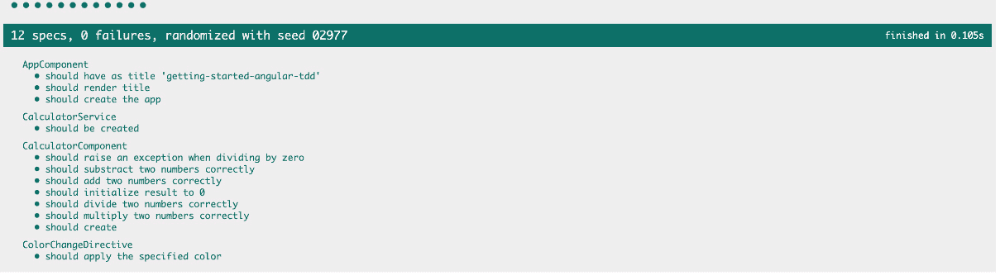
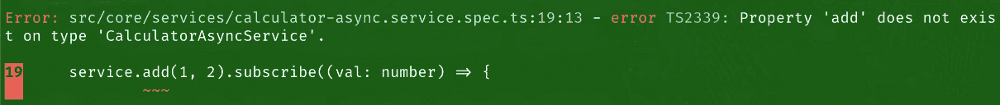

# 4<st c="0"></st>

# 在 Angular 测试中模拟和存根依赖<st c="2"></st>

为了为 Angular 应用编写有效和可靠的测试，理解如何处理依赖是至关重要的。<st c="52"></st>依赖通常会增加复杂性并使测试变得困难。<st c="174">然而，通过利用模拟和存根等技术，我们可以更好地控制我们的测试并确保应用程序的准确性和稳定性。<st c="246"></st> <st c="392"></st>

在本章中，我们将探讨间谍和方法替代的概念。<st c="408"></st> <st c="485">间谍允许我们在测试期间监控和验证依赖的行为。<st c="567">我们将学习如何使用 Jasmine 测试框架创建间谍，并使用它们来找出某些方法是否被调用，它们被调用了多少次，以及调用时使用了什么参数。<st c="761">此外，我们还将发现方法替代的力量，它允许我们用自己的自定义逻辑替换方法的实现。<st c="892"></st>

接下来，我们将看看 TestBed 提供者和它们如何允许我们将模拟依赖注入到测试中。<st c="905"></st> `<st c="933">TestBed</st>` <st c="940">提供者允许我们创建一个测试模块，并使用必要的依赖来配置它。<st c="1022">TestBed 是一个强大的 Angular 测试实用工具，它允许我们创建一个测试模块，并使用必要的依赖来配置它。<st c="1157">我们将学习如何创建和配置 TestBed 提供者，用模拟版本替换真实依赖。<st c="1206"></st> <st c="1278">这种技术允许我们将测试的组件或服务隔离出来，并控制其依赖的行为。</st>

最后，我们将探讨在设置依赖时如何处理异步操作和复杂场景。<st c="1395"></st> <st c="1509">我们将发现 Angular 测试框架提供的 `<st c="1528">async</st>` <st c="1533">和 `<st c="1538">fakeAsync</st>` <st c="1547">实用工具，并了解如何使用它们来管理测试中的异步代码。<st c="1666">此外，我们还将讨论处理复杂场景的策略，例如具有多个方法的依赖或需要特定初始化步骤的依赖。</st>

总结来说，本章将涵盖以下主要主题：<st c="1838"></st> <st c="1900"></st>

+   使用方法存根和存根来监控和控制依赖调用<st c="1913"></st> <st c="1977"></st>

+   使用 TestBed 提供者注入模拟依赖<st c="1986"></st> <st c="2023"></st>

+   处理异步操作和复杂场景<st c="2040"></st> <st c="2071"></st>

# 技术要求<st c="2088"></st>

为了跟随本章中的示例和练习，你需要对 Angular 和 TypeScript 有基本的了解。<st c="2111"></st>你还需要以下内容：<st c="2248"></st> <st c="2267"></st>

+   在您的计算机上安装了 Node.js 和 npm

+   全局安装了 Angular CLI

+   在您的计算机上安装了代码编辑器，例如 Visual Studio Code

本章的代码文件可以在[`github.com/PacktPublishing/Mastering-Angular-Test-Driven-Development/tree/main/Chapter%204`](https://github.com/PacktPublishing/Mastering-Angular-Test-Driven-Development/tree/main/Chapter%204)找到。

# 使用方法占位符和间谍监控和控制依赖调用

在 Angular 应用程序的测试中，一个关键方面是能够监控和控制依赖调用。依赖项是代码正确运行所依赖的外部资源或服务。监控和控制这些依赖调用允许开发者确保他们的代码与外部系统正确交互，并优雅地处理不同的场景。

间谍和方法占位符是 Angular 测试框架中的两种强大技术，使开发者能够实现这种程度的控制。间谍允许开发者监控函数调用，记录有关这些调用的信息，并断言对其使用的期望。另一方面，方法占位符提供了一种用简化版本替换真实依赖的方法，允许开发者在测试期间控制这些依赖的行为。

通过使用间谍，开发者可以验证是否以正确的参数调用了正确的函数，并且它们被调用的次数符合预期。这在测试与外部 API 或数据库交互的代码时特别有用。另一方面，方法占位符使开发者能够模拟不同的场景，并为方法调用提供预定义的响应。这允许对边缘情况进行彻底的测试，并确保代码的健壮性。

在本节中，我们将探讨 Angular 测试框架中间谍和方法的占位符概念。我们将深入探讨它们的应用，并展示它们在监控和控制依赖调用中的实用性。仍然基于我们与计算器应用相关的项目，我们将演示如何使用间谍和方法替代品来创建可靠和完整的测试，重点在于**测试驱动开发**（TDD）的原则。

## 方法占位符和间谍

`<st c="4432">方法存根，也</st>` `<st c="4451">被称为模拟或哑对象，在测试期间用来用简化版本替换真实依赖。</st>` `<st c="4563">通过提供对方法调用的预定义响应，方法替代表示开发者可以隔离和控制被测试代码的行为</st>` `<st c="4699">。</st>`

`<st c="4710">在计算器应用程序中，让我们考虑一个用户执行除法操作，除数等于零的场景。</st>` `<st c="4846">我们想要确保应用程序能够正确处理这个场景。</st>` `<st c="4921">通过为除法函数创建一个方法插件，我们可以模拟除以零的场景，并检查应用程序是否显示适当的</st>` `<st c="5071">错误消息。</st>`

`<st c="5085">目前，我们的计算器的除法操作没有处理除以零相关的异常。</st>`

在我们的`<st c="5192">calculator.component.spec.ts</st>` `<st c="5200">测试文件</st>` `<st c="5228">中，我们将添加一个测试，使我们能够引发这个异常。</st>` `<st c="5308">由于我们遵循 TDD 原则，测试应该</st>` `<st c="5362">自然失败。</st>`

`<st c="5377">运行我们的测试后，我们注意到测试确实失败了，如下面的截图所示：</st>` `<st c="5461">：</st>`


`<st c="5745">图 4.1 – 除以零测试用例</st>`


`<st c="6446">图 4.2 – 除以零测试用例失败</st>`

`<st c="6492">为了纠正这个问题，我们需要更新我们的</st>` `<st c="6532">CalculatorService</st>` `<st c="6549">。在我们的当前场景中，有一个巧妙的方法可以避免直接与我们的核心服务交互，并确保</st>` `<st c="6669">在采取任何此类行动之前一切正常运作。</st>` `<st c="6727">这种方法涉及使用一个方法</st>` `<st c="6778">存根概念。</st>`

`<st c="6791">基本上，我们将我们的</st>` `<st c="6819">CalculatorService</st>` `<st c="6836">服务</st>` `<st c="6840">指向一个模拟服务，这将使我们能够在修改服务本身之前检查我们想要实现的逻辑的正确性。</st>` `<st c="6980">实际上，这个模拟服务将仅仅是一个存根方法，用来替换我们基本</st>` `<st c="7084">CalculatorService</st>` `<st c="7101">服务的经典除法。</st>` `<st c="7111">首先，你需要注释掉所有与我们的</st>` `<st c="7144">calculator.component.spec.ts</st>` `<st c="7229">文件中其他运算符相关的测试，如果你已经有了的话。</st>` `<st c="7262">接下来，我们将声明这个</st>` `<st c="7287">存根方法：</st>`

```js
 const calculatorServiceStub = {
  divide: (a: number, b: number) => {
        if (b === 0) {
      throw new Error('Cannot divide by zero');
    }
    return a / b;
  },
};
```

<st c="7446">然后，在</st> `<st c="7460">描述</st>` <st c="7468">方法中，在</st> `<st c="7488">configureTestingModule</st>` <st c="7510">方法内，我们将替换我们的</st> `<st c="7539">CalculatorService</st>` <st c="7556">提供者，如下所示：</st>

```js
 providers: [
        { provide: CalculatorService, useValue: calculatorServiceStub },
      ],
```

<st c="7666">最后，这是</st> <st c="7684">我们伪造的</st> `<st c="7711">calculatorServiceStub</st>` <st c="7732">服务</st>的测试用例，其中包含我们的</st> `<st c="7766">divide</st>` <st c="7772">方法：</st>

```js
 it('should raise an exception when dividing by zero', () => {
    spyOn(calculatorService, 'divide').and.callThrough();
    expect(() => calculator.divide(10, 0)).toThrowError(
      'Cannot divide by zero'
    );
    expect(calculatorService.divide).toHaveBeenCalledWith(10, 0);
  });
```

<st c="8044">以下是实现我们的</st> <st c="8091">伪造服务</st>的完整代码：</st>

```js
 import { ComponentFixture, TestBed } from '@angular/core/testing';
import { CalculatorComponent } from './calculator.component';
import { CalculatorService } from 'src/core/services/calculator.service';
import { ColorChangeDirective } from 'src/core/directives/color-change.directive';
const calculatorServiceStub = {
  divide: (a: number, b: number) => {
    if (b === 0) {
      throw new Error('Cannot divide by zero');
    }
    return a / b;
  }, };
describe('CalculatorComponent', () => {
  let calculator: CalculatorComponent;
  let fixture: ComponentFixture<CalculatorComponent>;
  let calculatorService: CalculatorService;
  beforeEach(async () => {
    await TestBed.configureTestingModule({
      declarations: [CalculatorComponent, ColorChangeDirective],
      providers: [      { provide: CalculatorService, useValue: calculatorServiceStub },
      ],
    }).compileComponents();
    fixture = TestBed.createComponent(CalculatorComponent);
    calculator = fixture.componentInstance;
    calculatorService = TestBed.inject(CalculatorService);
    fixture.detectChanges();
  });
  it('should create', () => {
    expect(calculator).toBeTruthy();
  }); it('should initialize result to 0', () => {
    calculator.ngOnInit();
    expect(calculator.result).toEqual(0);
  });
  it('should divide two numbers correctly', () => {
    spyOn(calculatorService, 'divide').and.callThrough();
    calculator.divide(4, 2);
    expect(calculatorService.divide).toHaveBeenCalledWith(4, 2);
    expect(calculator.result).toBe(2);
  });
  it('should raise an exception when dividing by zero', () => {
    spyOn(calculatorService, 'divide').and.callThrough();
    expect(() => calculator.divide(10, 0)).toThrowError(
      'Cannot divide by zero'
    );
    expect(calculatorService.divide).toHaveBeenCalledWith(10, 0);
  });
});
```

<st c="9792">让我们看一下</st> `<st c="9810">代码。</st>`

<st c="9819">`<st c="9824">calculatorServiceStub</st>` <st c="9845">对象被创建来模拟</st> `<st c="9876">divide</st>` <st c="9882">方法</st>的</st> `<st c="9897">CalculatorService</st>` <st c="9914">服务。</st> `<st c="9924">divide</st>` <st c="9934">方法接受两个参数，</st> `<st c="9964">a</st>` <st c="9965">和</st> `<st c="9970">b</st>`<st c="9971">，并执行除法操作。</st> `<st c="10010">在这种情况下，存根检查</st> `<st c="10048">b</st>` <st c="10049">是否等于零。</st> `<st c="10068">如果是，则抛出一个</st> `<st c="10081">错误</st>` <st c="10081">来模拟除以零的场景。</st>

<st c="10139">最后的</st> `<st c="10149">expect</st>` <st c="10155">语句检查组件的</st> `<st c="10185">result</st>` <st c="10191">属性是否等于</st> `<st c="10230">'Division by zero'</st>`<st c="10248">。这验证了当发生除以零时，错误信息被正确显示。</st>

<st c="10339">请注意，我们的测试执行已失败。</st> `<st c="10383">这是一个打字错误，因为</st> `<st c="10412">result</st>` <st c="10418">是</st> `<st c="10434">number</st>` <st c="10440">类型，而不是</st> `<st c="10445">string</st>`<st c="10455">。</st>

<st c="10456">因此，我们将编写我们</st> `<st c="10524">CalculatorComponent</st>` <st c="10543">中需要的最小代码量来解决</st> <st c="10553">问题：</st>


<st c="10592">图 4.3 – 更新结果属性的声明</st>

<st c="10652">运行测试后，请注意，所有测试都已变为绿色，如图</st> <st c="10735">我们的截图所示：</st>


<st c="11130">图 4.4 – 除以零测试用例成功</st>

<st c="11179">现在我们将按照 TDD 原则的要求进行重构。</st> <st c="11247">我们将在项目的</st> `<st c="11301">core</st>` <st c="11305">文件夹中创建一个名为</st> `<st c="11326">stubs</st>` <st c="11376">的文件夹，并在其中创建一个</st> `<st c="11352">calculator.service.stub.ts</st>` <st c="11358">文件。</st>


<st c="11443">图 4.5 – calculator.service.stub.ts 文件结构</st>

<st c="11500">一旦文件创建完成，我们将把基于模拟的服务的源代码从</st> `<st c="11598">calculator.component.spec.ts</st>` <st c="11626">移动到我们的</st> `<st c="11636">calculator.service.stub.ts</st>` <st c="11662">文件中</st> <st c="11668">如下：</st>


<st c="11891">图 4.6 – calculator.service.stub.ts 代码源</st>

<st c="11942">由于它是一个服务，我们将使用依赖注入技术，正如我们将在下一节中更详细地看到的那样。</st> <st c="12065">在这个阶段，我们将分几个步骤来做：</st> <st c="12113">几个步骤：</st>

1.  <st c="12122">在</st> `<st c="12141">calculator.service.stub.ts</st>` <st c="12167">中创建一个名为</st> `<st c="12175">CalculatorServiceStub</st>`<st c="12196">的类。</st>

1.  <st c="12197">实现我们</st> <st c="12240">计算器应用程序</st>的所有运算符方法。

    <st c="12263">以下是源代码的</st> <st c="12276">样子：</st>

    ```js
     export class CalculatorServiceStub {
      add(a: number, b: number): number {
        return a + b;
      }
      substract(a: number, b: number): number {
        return a - b;
      } multiply(a: number, b: number): number {
        return a * b;
      } divide(a: number, b: number): number | Error {
        if (b === 0) {
          throw new Error('Cannot divide by zero');
        }
        return a / b;
      }
    }
    ```

1.  <st c="12631">在更新我们的模拟服务后，我们将进入我们的</st> `<st c="12683">calculator.component.spec.ts</st>` <st c="12711">测试文件，以替换提供者</st> <st c="12746">如下：</st>

    ```js
     import { CalculatorServiceStub } from 'src/core/stubs/calculator.service.stub';
    ... providers: [
            { provide: CalculatorService, useClass: CalculatorServiceStub },
          ],
    ...
    ```

1.  <st c="12925">现在我们可以取消注释我们</st> `<st c="12970">calculator.component.spec.ts</st>` <st c="12998">文件中的所有方法，除了</st> <st c="13011">测试用例</st> `<st c="13016">it('should display error message for division by zero')</st>` <st c="13071">。</st> <st c="13083">注意，所有</st> <st c="13099">我们的测试都是绿色的，如图所示：</st>



<st c="13646">图 4.7 – 使用 CalculatorServiceStub 测试用例成功测试 CalculatorComponent</st>

<st c="13727">间谍和方法存根是 Angular 测试框架中的强大工具，使开发者能够监控和控制其应用程序中依赖项的行为。</st> <st c="13899">通过将这些技术融入 TDD 过程，开发者可以编写更全面、更可靠的测试，确保其 Angular 应用程序的功能性和稳定性。</st> <st c="14087">计算器应用程序示例说明了间谍和方法存根如何应用于模拟不同场景并验证测试代码的行为。</st> <st c="14250">在下一节中，我们将更详细地探讨如何使用 TestBed 提供者注入模拟依赖项</st> <st c="14332">。</st> <st c="14339">TestBed 提供者。</st>

# <st c="14357">使用 TestBed 提供者注入模拟依赖项</st>

<st c="14411">模拟依赖项</st> <st c="14431">是简化版的外部服务或资源，它们模仿实际依赖项的行为。</st> <st c="14447">通过使用 TestBed 提供者注入这些模拟依赖项，开发者可以在测试期间控制它们的行为，确保可靠和彻底的测试，而不依赖于</st> <st c="14718">外部系统。</st>

<st c="14735">在本节中，我们将探讨 Angular 测试框架中 TestBed 提供者的概念。</st> <st c="14834">我们将深入研究其应用，并展示它们如何使开发者能够将模拟依赖项注入到其代码中。</st> <st c="14959">通过这样做，我们可以创建隔离且可控的测试环境，遵循 TDD 的原则。</st>

<st c="15066">通过使用 TestBed 提供者注入模拟依赖项，开发者可以专注于测试特定的代码单元，而无需担心实际依赖项的复杂性。</st> <st c="15248">这种方法使得调试更加容易，提高了测试覆盖率，并提高了整体</st> <st c="15334">代码质量。</st>

<st c="15347">在本节中，我们将强调 TDD 的原则，并通过使用我们的计算器应用程序的实际示例来展示 TestBed 提供者的使用。</st> <st c="15510">通过理解和有效利用 TestBed 提供者，开发者可以编写可靠、可维护且经过彻底测试的</st> <st c="15639">Angular 应用程序。</st>

<st c="15660">让我们考虑向我们的计算器应用程序添加计算数字平方根的功能，同时仍然依赖于我们的</st> `<st c="15794">CalculatorService</st>` <st c="15811">服务。</st> <st c="15821">在这种情况下，我们将专注于计算器应用程序的平方根功能。</st>

<st c="15910">首先，我们需要创建一个模拟服务来模拟实际平方根服务的行为。</st> <st c="16011">我们可以创建一个简单的类，为不同的输入返回预定义的平方根值。</st> <st c="16105">这个类，命名为</st> `<st c="16123">MockSquareRootService</st>`<st c="16144">，将被创建在</st> `<st c="16169">mocks</st>` <st c="16174">文件夹中，我们将在这个文件夹与</st> `<st c="16240">stubs</st>` <st c="16245">文件夹相同的层次结构级别创建它，如以下截图所示：</st>


<st c="16373">图 4.8 – mock-square-root.service.mock.ts 文件层次结构</st>

<st c="16436">这里是一个模拟平方根服务的示例</st> <st c="16472">根服务：</st>

```js
 export class MockSquareRootService {
  calculateSquareRoot(value: number): number {
    // Perform a predefined square root calculation based on the input value
    return Math.sqrt(value);
  }
}
```

<st c="16669">接下来，我们</st> <st c="16679">将</st> <st c="16683">使用 TestBed 提供者配置测试模块，用模拟版本替换</st> `<st c="16804">calculator.component.spec.ts</st>`<st c="16832">中的实际平方根服务。</st> <st c="16876">以下是如何配置测试模块的示例：</st>

```js
 import { MockSquareRootService } from './mock-square-root.service';
... beforeEach(async () => {
    await TestBed.configureTestingModule({
     ... providers: [{ provide: CalculatorService, useClass: MockSquareRootService }]
    }).compileComponents();
```

<st c="17130">在前面的代码中，我们提供了</st> `<st c="17169">CalculatorService</st>` <st c="17186">服务令牌，并使用</st> `<st c="17217">useClass</st>` <st c="17225">属性指定了</st> `<st c="17240">MockSquareRootService</st>` <st c="17261">服务。</st> <st c="17271">此配置告诉 TestBed，当测试代码请求实际平方根服务的实例时，使用模拟服务。</st>

<st c="17412">现在，当我们为计算器应用程序运行测试时，任何依赖于平方根服务的代码都将接收到模拟服务的实例。</st> <st c="17561">我们可以在测试期间控制服务的行为，确保计算器应用程序在不同场景下正确执行平方根计算。</st> <st c="17724">以下是一个</st> `<st c="17757">MockSquareRootService</st>` <st c="17778">服务的示例代码，该服务通过为不同的输入返回预定义的平方根值来模拟</st> `<st c="17819">CalculatorService</st>` <st c="17836">服务的行为</st> <st c="17845">，如下所示：</st>

```js
 export class MockSquareRootService {
  calculateSquareRoot(value: number): number {
    // Perform a predefined square root calculation based on the input value
    if (value === 4) {
      return 2;
    } else if (value === 9) {
      return 3;
    } else if (value === 16) {
      return 4;
    } else {
      throw new Error('Invalid input');
    }
  }
}
```

<st c="18215">让我们通过将此序列添加到我们的测试</st> <st c="18313">文件中，</st> `<st c="18319">calculator.component</st><st c="18339">.spec.ts</st>`<st c="18347">，来完成对数字平方根的测试编写：</st>

```js
 it('should calculate the square root correctly', () => {
   spyOn(calculatorService, 'squareRoot').and.callThrough();
   calculator.squareRoot(16);
   expect(calculatorService.squareRoot).toHaveBeenCalledWith(16);
   expect(calculator.result).toBe(4);
  });
```

<st c="18594">为了使其功能正常，您需要将</st> `<st c="18638">squareRoot()</st>` <st c="18650">方法添加到</st> `<st c="18661">calculator.component.ts</st>` <st c="18684">和</st> `<st c="18689">calculator.service.ts</st>`<st c="18710">中。我不会在当前项目中这样做，因为目的是简要展示如何设置模拟。</st>

<st c="18803">Angular 中的 TestBed 提供者允许您将模拟依赖项注入到测试中。</st> <st c="18890">这是一个</st> <st c="18900">强大的</st> <st c="18909">功能，它使您能够控制外部依赖项的行为并隔离待测试的代码。</st>

<st c="19015">当使用</st> `<st c="19058">TestBed.configureTestingModule</st>`<st c="19088">配置测试模块时，您可以提供一个提供者列表，指定您想要模拟的依赖项的令牌。</st> <st c="19189">然后，您可以使用</st> `<st c="19217">useClass</st>` <st c="19225">或</st> `<st c="19229">useValue</st>` <st c="19237">属性为每个依赖项提供一个模拟或存根实现。</st>

<st c="19308">通过提供模拟实现，您可以在测试期间定义依赖项的行为。</st> <st c="19407">这允许您模拟不同的场景并控制依赖项的返回值或错误条件。</st> <st c="19524">您还可以通过使用间谍或其他</st> <st c="19631">测试技术来验证待测试代码与依赖项之间的交互。</st>

<st c="19650">使用 TestBed 提供者注入模拟依赖项有助于提高测试的可靠性和稳定性。</st> <st c="19767">它允许您专注于测试代码的特定功能，而不依赖于外部依赖项的实际实现。</st> <st c="19912">这使得您的测试更加确定，并且不太可能因依赖项行为的变化而失败。</st>

<st c="20034">总的来说，TestBed 提供者提供了一种方便的方法将模拟依赖项注入到您的 Angular 测试中。</st> <st c="20142">它们允许您控制外部依赖项的行为并隔离待测试的代码，从而实现更可靠和专注的测试。</st> <st c="20285">在接下来的章节中，我们将采取动手实践的方法。</st> <st c="20346">本节的目标是理解异步任务的相关性以及为什么在实现关于它们的测试时需要小心。</st> <st c="20406">在下一节中，我们将管理异步操作和</st> <st c="20416">复杂场景。</st>

# <st c="20560">处理异步操作和复杂场景</st>

<st c="20608">测试异步操作和复杂场景是确保现代软件应用程序可靠性和功能性的关键部分。</st> <st c="20630">在当今的软件开发领域，应用程序通常依赖于异步操作（如承诺和可观察者）来处理数据获取、处理和用户交互。</st> <st c="20760">此外，涉及复杂工作流程、条件逻辑和多个依赖关系的复杂场景需要彻底测试，以确保应用程序在各种场景下都能按预期行为。</st> <st c="20949">此外，涉及复杂工作流程、条件逻辑和多个依赖关系的复杂场景需要彻底测试，以确保应用程序在各种场景下都能按预期行为。</st> <st c="21137">此外，涉及复杂工作流程、条件逻辑和多个依赖关系的复杂场景需要彻底测试，以确保应用程序在各种场景下都能按预期行为。</st>

<st c="21155">测试这些异步操作和复杂场景需要使用专门的技巧和工具来处理它们所提出的独特挑战。</st> <st c="21315">在 Angular（一个流行的 JavaScript 框架）的上下文中，开发者可以访问一个全面的测试框架，该框架提供了强大的实用工具来测试</st> <st c="21479">此类场景。</st>

在本节中，我们将探讨在 Angular 应用程序中测试异步操作（如承诺和可观察者）以及复杂场景的重要性。<st c="21660">我们将深入研究各种技术和最佳实践，以确保有效地测试这些场景，从而实现可靠和全面的测试覆盖率。</st>

## <st c="21808">理解异步操作</st>

<st c="21846">异步操作</st>是可以在主程序流程之外独立执行的任务。<st c="21860">它们通常用于处理耗时操作，如网络请求、文件 I/O 或数据库查询。</st> <st c="21942">而不是等待这些操作完成，程序可以继续执行其他任务，从而提高整体性能</st> <st c="22191">和响应性。</st>

<st c="22210">处理异步操作的一种常见方法是通过回调。</st> <st c="22289">回调是一个函数，它作为参数传递给另一个函数，并在异步操作完成后执行。</st> <st c="22422">这允许我们定义操作完成后应该发生什么。</st> <st c="22496">然而，管理回调可能导致回调地狱，使代码难以阅读和维护。</st> <st c="22594">为了解决这个问题，</st> `<st c="22617">承诺</st>` <st c="22625">应运而生。</st>

<st c="22636">承诺提供了一种更结构化的方式来处理异步操作。</st> <st c="22711">承诺表示异步操作最终完成或失败，并允许我们附加回调来处理这些结果。</st> <st c="22856">通过链式方法（如</st> <st c="22968">.then()</st> <st c="22975">和</st> <st c="22980">.catch()</st>）<st c="22988">，承诺提供了一种更易于阅读和维护的方式来处理异步代码。</st>

<st c="22989">然而，JavaScript 新版本中引入了一种新的实现 Promise 的方法。</st> `<st c="23085">async</st>`<st c="23090">/</st>`<st c="23092">await</st>` <st c="23097">是一种简洁的语法，用于处理异步操作。</st> <st c="23170">它允许我们编写看起来像同步代码的异步代码，使其更容易推理和维护。</st> <st c="23291">使用</st> `<st c="23301">async</st>` <st c="23306">关键字，我们可以定义使用</st> `<st c="23386">await</st>` <st c="23391">关键字定义的函数，该关键字等待 Promise 解决</st> <st c="23442">或拒绝。</st>

<st c="23454">此外，另一种实现异步操作的方法是传递可观察对象。</st> <st c="23476">可观察对象是管理响应式编程中数据流和异步操作的有力工具。</st> <st c="23645">它们代表随时间观察到的值序列。</st> <st c="23713">可观察对象可以异步输出多个值，并提供一系列用于转换、过滤和组合数据流的操作符。</st> <st c="23862">它们在 Angular 等框架中常用，用于处理事件、HTTP 请求和其他使用 RxJS 的异步操作</st> <st c="23982">。</st>

<st c="23992">异步操作和可观察对象也使我们的代码能够实现并发和并行。</st> <st c="24086">并发指的是同时执行多个任务的能力，而并行</st> <st c="24182">则是指在多个处理器或线程上同时执行任务。</st> <st c="24262">异步编程和可观察对象使我们能够并发处理多个操作，从而提高需要大量计算</st> <st c="24425">或 I/O 的应用程序的性能。</st>

## <st c="24432">处理异步操作</st>

<st c="24465">让我们考虑一下，我们的</st> <st c="24490">计算器应用程序，它执行加法、减法、乘法和除法操作，现在有一个执行这些操作并将结果作为</st> `<st c="24654">可观察对象返回的服务。</st>` 

<st c="24668">首先，假设我们还有一个名为</st> `<st c="24731">CalculatorAsyncService</st>`<st c="24753">的计算器服务，我们将在</st> `<st c="24781">services</st>` <st c="24789">文件夹中创建它。</st> <st c="24798">我们需要在</st> `<st c="24863">services</st>` <st c="24871">文件夹中运行以下命令行一次：</st>

```js
<st c="24969">services</st> folder:
			

			<st c="25066">Figure 4.9 – Creation of the CalculatorAsyncService</st>
			<st c="25117">As opposed to the previous service we had to create, here we’ll essentially be doing asynchronous operations, in keeping with the subject we’re exploring.</st> <st c="25273">Our service’s methods will be based on the same principle, that is, receiving the two operands related to our calculation as parameters, then performing them as observables (which emphasizes the asynchronous aspect) and returning the result at the end.</st> <st c="25526">Based on the principles of TDD, we’ll look at what to expect using the</st> `<st c="25597">add()</st>` <st c="25602">method as an example.</st> <st c="25625">In our</st> `<st c="25632">calculator-async.service.spec.ts</st>` <st c="25664">test file, we’ll add</st> <st c="25685">this</st> <st c="25691">test case:</st>

```

it('should add two numbers', fakeAsync(() => {

    let result = 0;

    service.add(1, 2).subscribe((val) => {

    result = val;

    });

    expect(result).toBe(3);

}));

```js

			<st c="25850">The preceding code snippet is a unit test for a service method that adds two numbers using Angular’s</st> `<st c="25952">fakeAsync</st>` <st c="25961">utility to handle asynchronous operations synchronously.</st> <st c="26019">Here is the</st> <st c="26031">code breakdown:</st>

				*   `<st c="26046">fakeAsync</st>`<st c="26056">: This is an Angular utility function that lets you write tests that rely on asynchronous operations synchronously.</st> <st c="26173">It is useful for testing code that uses observables, promises, or other</st> <st c="26245">asynchronous operations</st><st c="26268">.</st>
				*   `<st c="26269">service.add(1, 2).</st><st c="26288">subscribe((val) =></st> <st c="26307">{ result = val ; });</st>`<st c="26328">: This line calls a service’s</st> `<st c="26359">add</st>` <st c="26362">method, passing two numbers (</st>`<st c="26392">1</st>` <st c="26394">and</st> `<st c="26399">2</st>`<st c="26400">).</st> <st c="26403">The</st> `<st c="26407">add()</st>` <st c="26412">method is supposed to return an observable that outputs the result of the addition.</st> <st c="26497">The</st> `<st c="26501">subscribe</st>` <st c="26510">method is used to subscribe to this observable and manage the emitted value.</st> <st c="26588">In this case, the output value is assigned to the</st> <st c="26638">result variable.</st>

			<st c="26654">Now we can run</st> <st c="26669">our favorite</st> `<st c="26683">ng test</st>` <st c="26690">command from our</st> <st c="26708">project terminal:</st>
			

			<st c="27076">Figure 4.10 – Error in our test case related to the add method on the terminal</st>
			<st c="27154">As we can see, our test failed.</st> <st c="27187">This is normal, as this is the red phase.</st> <st c="27229">We have</st> <st c="27237">two errors:</st>

				*   <st c="27248">The no</st><st c="27255">n-existence of the</st> `<st c="27275">add()</st>` <st c="27280">method in</st> <st c="27291">our</st> `<st c="27295">CalculatorAsyncService</st>`
				*   <st c="27317">The absence of the type of our</st> `<st c="27349">val</st>` <st c="27352">variable</st>

			<st c="27361">To fix this, here’s what we’ll do.</st> <st c="27397">First, our</st> `<st c="27408">val</st>` <st c="27411">variable is the result of our calculation.</st> <st c="27455">It is therefore of the type number.</st> <st c="27491">So, we’ll d</st><st c="27502">o</st> <st c="27505">the following:</st>

```

it('should add two numbers', fakeAsync(() => {

    let result = 0;

    service.add(1, 2).subscribe((val: number) => {

    result = val;

    });

    expect(result).toBe(3);

}));

```js

			<st c="27676">Here’s how it looks on</st> <st c="27700">the terminal:</st>
			

			<st c="27910">Figure 4.11 – Error in our test case related to the add method on the terminal</st>
			<st c="27988">The error related to</st> <st c="28009">the</st> `<st c="28014">val</st>` <st c="28017">variable has now disappeared, but the error relate</st><st c="28068">d to our service’s</st> `<st c="28088">add()</st>` <st c="28093">method remains.</st> <st c="28110">This is normal because our</st> `<st c="28137">CalculatorAsyncService</st>` <st c="28159">d</st><st c="28161">oesn’t yet have an</st> `<st c="28180">add()</st>` <st c="28185">method.</st> <st c="28194">Now we’re going to write the minimum code required for our test to pass.</st> <st c="28267">As a reminder, our</st> `<st c="28286">add()</st>` <st c="28291">method must return an observable.</st> <st c="28326">Here’</st><st c="28331">s the code for the</st> `<st c="28351">add()</st>` <st c="28356">method to be added to</st> <st c="28379">our</st> `<st c="28383">Calcula</st><st c="28390">torAsyncService</st>`<st c="28406">:</st>

```

add(a: number, b: number): Observable<number> {

    return of(a + b);

}

```js

			<st c="28477">Here is a breakdown of t</st><st c="28502">he</st> <st c="28506">p</st><st c="28507">receding cod</st><st c="28519">e:</st>

				*   `<st c="28522">add(a :</st> <st c="28530">number, b : number) : Observable<number></st>`<st c="28571">: This is the method signature.</st> <st c="28604">Th</st><st c="28606">e method is called</st> `<st c="28626">add()</st>` <st c="28631">and takes two parameters,</st> `<st c="28658">a</st>` <st c="28659">and</st> `<st c="28664">b</st>`<st c="28665">, both of which are numbers.</st> <st c="28694">The method returns an observable, which</st> <st c="28733">outputs a number.</st> <st c="28752">This indicates that the method is asynchronous and will produce a value at some point in</st> <st c="28841">th</st><st c="28843">e future</st><st c="28852">.</st>
				*   `<st c="28853">return of(a + b);</st>`<st c="28871">: This line uses RxJS’s</st> `<st c="28896">of</st>` <st c="28898">function to create an observable that outputs a single value and terminates.</st> <st c="28976">The value emitted is the result</st> <st c="29008">of adding</st> `<st c="29018">a</st>` <st c="29019">and</st> `<st c="29024">b</st>`<st c="29025">. The</st> `<st c="29031">of</st>` <st c="29033">function is a utility function that converts the given arguments into an observable sequence.</st> <st c="29128">In this case, it is used to create an observable that outputs the sum of</st> `<st c="29201">a</st>` <st c="29202">and</st> `<st c="29207">b</st>`<st c="29208">. Don’t forget to</st> <st c="29226">import it.</st>

			<st c="29236">Afte</st><st c="29241">r implementing the</st> `<st c="29261">add()</st>` <st c="29266">method, here’s the result in</st> <st c="29296">our terminal:</st>
			

			<st c="29360">Figure 4.12 – add asynchronous method test case succeeded on the terminal</st>
			<st c="29433">And in our b</st><st c="29446">rowser running on Karma, we</st> <st c="29475">have this:</st>
			

			<st c="29555">Figure 4.13 – add asynchronous method test case succeede</st><st c="29611">d in the browser</st>
			<st c="29628">Well done!</st> <st c="29640">We’ve just</st> <st c="29651">implemented our calculator’s first asynchronous method using TDD principles.</st> <st c="29728">We’ll now do the same with subtraction, multiplication,</st> <st c="29784">and division.</st>
			<st c="29797">In our</st> `<st c="29805">calculator-async.service.spec.ts</st>` <st c="29837">test file, we’re going to write the expected tests related to our subtraction, multiplication, and division operators.</st> <st c="29957">Usually, we’d do these separately, but as we’ve alre</st><st c="30009">ady seen with the</st> `<st c="30028">add()</st>` <st c="30033">method, we’ll do them all at once.</st> <st c="30069">Here’</st><st c="30074">s what</st> <st c="30082">we’ll get:</st>

```

it('应该减去两个数字', fakeAsync(() => {

    let result = 0;

    service.subtract(5, 3).subscribe((val: number) => {

    result = val;

    }));

    expect(result).toBe(2);

}));

it('应该乘以两个数字', fakeAsync(() => {

    let result = 0;

    service.multiply(3, 4).subscribe((val: number) => {

    result = val;

    });

    expect(result).toBe(12);

}));

it('应该除以两个数字', fakeAsync(() => {

    let result = 0;

    service.divide(10, 2).subscribe((val: number) => {

    result = val;

    });

    expect(result).toBe(5);

}));

```js

			<st c="30596">As you may have</st> <st c="30613">noticed in your terminal, we have</st> <st c="30647">these errors:</st>
			

			<st c="31246">Figure 4.14 – Error in our test case related to the subtract, multiply, and divide methods on the terminal</st>
			<st c="31352">These errors are due to the absence of the</st> `<st c="31396">subtract</st>`<st c="31404">,</st> `<st c="31406">multiply</st>`<st c="31414">, and</st> `<st c="31420">divide</st>` <st c="31426">methods in our</st> `<st c="31442">CalculatorAsyncService</st>`<st c="31464">. As we had to do for the</st> `<st c="31490">add</st>` <st c="31493">method, we’ll add the minimum amount of code needed to make our tests go green.</st> <st c="31574">In our</st> `<st c="31581">CalculatorAsyncService</st>`<st c="31603">, we’ll add</st> <st c="31614">these methods:</st>

```

subtract(a: number, b: number): Observable<number> {

    return of(a - b);

}

multiply(a: number, b: number): Observable<number> {

    return of(a * b);

}

divide(a: number, b: number): Observable<number> {

    return of(a / b);

}

```js

			<st c="31851">On our terminal, we</st> <st c="31871">have</st> <st c="31877">the following:</st>
			

			<st c="32320">Figure 4.15 – subtract, multiply, and divide asynchronous methods test cases succeeded on the terminal</st>
			<st c="32422">And in our browser, we have</st> <st c="32451">the following:</st>
			

			<st c="32615">Figure 4.16 – subtract, multiply, and divide asynchronous methods test cases succeeded on the browser</st>
			<st c="32716">All our tests</st> <st c="32731">are green!</st>
			<st c="32741">However, there’s one case we haven’t yet tested at the divi</st><st c="32801">sion level.</st> <st c="32814">It’s</st> `<st c="32819">division by zero</st>`<st c="32835">. As with the</st> `<st c="32849">CalculatorService</st>` <st c="32866">service previously, we also need to handle division by 0 by raising an exception or returning an error message.</st> <st c="32979">So, at the</st> `<st c="32990">CalculatorAsyncService</st>` <st c="33012">level, we’re going to add a second test case related to division, which handles the case where we don’t try to divide</st> <st c="33131">a number</st> <st c="33140">by 0:</st>

```

it('当除以零时应该抛出错误', fakeAsync(() => { let error = { message: '' }; ;

    service.divide(10, 0).subscribe({

    error: (err) => (error = err),

    });

    expect(error).toBeTruthy();

    expect(error.message).toBe('Cannot divide by zero');

}));

```js

			<st c="33401">Here’s a</st> <st c="33411">breakdown of</st> <st c="33424">the code:</st>

				*   `<st c="33433">se</st><st c="33436">rvice.divid</st><st c="33448">e(10, 0).subscribe({ error : (err</st><st c="33482">) =</st><st c="33486">> (error = err), });</st>`<st c="33507">: This line calls a service’s</st> `<st c="33538">divide</st>` <st c="33544">method with arguments</st> `<st c="33567">10</st>` <st c="33569">and</st> `<st c="33574">0</st>`<st c="33575">. The</st> `<st c="33581">divide</st>` <st c="33587">method is expected to return an observable.</st> <st c="33632">The</st> `<st c="33636">subscribe</st>` <st c="33645">method is used to subscribe to the observable.</st> <st c="33693">The object passed to</st> `<st c="33714">subscribe</st>` <st c="33723">specifies how to handle the case of an error.</st> <st c="33770">If an error occurs during division (which will happen, since division by zero is not defined), the error-handling function</st> `<st c="33893">(err) => (error = err)</st>` <st c="33915">is executed, assigning the error message to the</st> `<st c="33964">error</st>` <st c="33969">variable.</st>
				*   `<st c="33979">expect(</st><st c="33987">error).toBeTruthy();</st>`<st c="34008">: This line asserts that the</st> `<st c="34038">error</st>` <st c="34043">variable is true, that is, that it has a value.</st> <st c="34092">This is a basic check to ensure that an error has</st> <st c="34142">been triggered.</st>
				*   `<st c="34157">expect(error.message).toBe('Cann</st><st c="34190">ot divide by zero');</st>`<st c="34211">: This line asserts that the</st> `<st c="34241">message</st>` <st c="34248">property of the</st> `<st c="34265">error</st>` <st c="34270">object is equal to the</st> `<st c="34294">'Cannot divide by zero'</st>` `<st c="34317">string</st>`<st c="34324">. This is the specific error message expected when attempting to divide</st> <st c="34396">by zero.</st>

			<st c="34404">After adding our test case, let’s see what happens on</st> <st c="34459">our terminal:</st>
			

			<st c="35418">Figure 4.17 – Asynchronous division-by-0 test case failed on the terminal</st>
			<st c="35491">And in our</st> <st c="35503">browser, we have</st> <st c="35520">the following:</st>
			

			<st c="36779">Figure 4.18 – Asynchronous division-by-0 test case failed in the browser</st>
			<st c="36851">This error is to be expected because we haven’t yet handled it in our</st> `<st c="36922">CalculatorAsyncService</st>` <st c="36944">service.</st> <st c="36954">We’re now going to write the minimal code needed to resolve this error.</st> <st c="37026">In our</st> `<st c="37033">CalculatorAsyncService</st>` <st c="37055">service, we’re going to modify ou</st><st c="37089">r</st> `<st c="37092">divide</st>` <st c="37098">method:</st>

```

divide(a: number, b: number): Observable<number> {

    if (b === 0) {

    return throwError(() => new Error('Cannot divide by zero'));

}  返回(a / b).pipe(

    catchError((error) => {

        return throwError(() => error);

    })

    );

}

```js

			<st c="37323">Here’s a breakdown of</st> <st c="37346">the code:</st>

				*   `<st c="37426">b</st>` <st c="37427">is equal to 0 using</st> `<st c="37448">if (b === 0)</st>`<st c="37460">. If</st> `<st c="37465">b</st>` <st c="37466">is equal to 0, it returns an observable that immediately throws an error with the message</st> `<st c="37557">Cannot divide by zero</st>`<st c="37578">. To do this, we use RxJS’s</st> `<st c="37606">throwError</st>` <st c="37616">function, which creates an observable that emits no elements and immediately issues an</st> <st c="37704">error notification.</st>
				*   `<st c="37746">b</st>` <st c="37747">is not 0, the method performs the</st> `<st c="37782">a / b</st>` <st c="37787">division operation and wraps</st> <st c="37817">the result in an observable using the RxJS</st> `<st c="37860">of</st>` <st c="37862">function.</st> <st c="37873">This function creates an observable that outputs the specified value,</st> <st c="37943">then terminates.</st>
				*   `<st c="37988">divide</st>` <st c="37994">operation is then routed through the</st> `<st c="38032">catchError</st>` <st c="38042">operator.</st> <st c="38053">This operator catches any errors that occur during the execution of the observable chain and allows you to handle them.</st> <st c="38173">In this case, the</st> `<st c="38191">catchError</st>` <st c="38201">operator is used to catch any errors that may occur during the</st> `<st c="38265">divide</st>` <st c="38271">operation and throw them back using the</st> `<st c="38312">throwError</st>` <st c="38322">function.</st> <st c="38333">This ensures that if an error occurs (other than division by zero, which is explicitly handled), the observable will issue an</st> <st c="38459">error notification.</st>
				*   `<st c="38557">of</st>` <st c="38559">function, which outputs the result of the division operation, or the observable created by the</st> `<st c="38655">throwError</st>` <st c="38665">function in the event of</st> <st c="38691">an error.</st>

			<st c="38700">After adding our test case, let’s see what happens on</st> <st c="38755">our terminal:</st>
			

			<st c="38924">Figure 4.19 – Asynchronous division-by-0 test case succeeded on the terminal</st>
			<st c="39000">And in our browser, we have</st> <st c="39029">the following:</st>
			

			<st c="39234">Figure 4.20 – Asynchronous division-by-0 test case succeeded on the browser</st>
			<st c="39309">Error handling is an essential part of working with asynchronous operations.</st> <st c="39387">In our calculator application, if an error occurs while retrieving data or performing calculations, we can display an</st> <st c="39504">error message to the user and provide options for retrying or handling the error in an elegant way.</st> <st c="39605">The RxJS module provides error-handling mechanisms, such as the use of the</st> `<st c="39680">catchError</st>` <st c="39690">operator.</st>
			<st c="39700">Emphasizing the importance of testing async operations</st>
			<st c="39755">In a calculator app, async</st> <st c="39783">operations can include fetching data from an API, performing calculations asynchronously, or handling user input events.</st> <st c="39904">Properly testing these async operations is essential to ensure that the app functions correctly, provides accurate results, and handles</st> <st c="40040">errors gracefully.</st>
			<st c="40058">Unit testing is a fundam</st><st c="40083">ental approach to testing individual components or functions in isolation.</st> <st c="40159">In the context of async operations in Angular, unit tests play a crucial role in verifying the behavior of code that handles async tasks.</st> <st c="40297">For example, you can write unit tests to verify that an API service correctly fetches exchange rates or that a calculation service accurately performs</st> <st c="40448">calculations asynchronously.</st>
			<st c="40476">To effectively test async operations, it is essential to mock dependencies, such as API services or calculation functions.</st> <st c="40600">By mocking these dependencies, you can control the behavior of external services or functions during testing, allowing you to focus on the specific code that handles async operations.</st> <st c="40784">Angular provides tools such as TestBed and Jasmine spies to mock</st> <st c="40849">dependencies effectively.</st>
			<st c="40874">Testing async operations often involves dealing with timing issues.</st> <st c="40943">For example, when testing a function that performs an async calculation, you need to ensure that the test waits for the calculation to be completed before making assertions.</st> <st c="41117">Angular provides utilities, such as</st> `<st c="41153">fakeAsync</st>`<st c="41162">, that allow you to control the timing of async operations in your tests, making it easier to write accurate and</st> <st c="41275">deterministic tests.</st>
			<st c="41295">While unit testing is essential, it is equally important to perform integration testing to validate the interaction between different components in your calculator app.</st> <st c="41465">Integration tests can verify that async operations, such as fetching data and performing calculations, are correctly integrated into the overall functionality of the app.</st> <st c="41636">For example, you can write integration tests to ensure that the UI is updated correctly when async operations</st> <st c="41746">are complete.</st>
			<st c="41759">Testing error handling is crucial in async operations.</st> <st c="41815">For example, when fetching data from an API, you need to test scenarios where the API returns an error response.</st> <st c="41928">By simulating error conditions in your tests, you can verify that the app handles errors gracefully, displays appropriate error messages, and provides fallback mechanisms.</st> <st c="42100">Angular’s</st> `<st c="42110">HttpClient</st>` <st c="42120">module provides mechanisms for mocking API responses and testing different</st> <st c="42196">error scenarios.</st>
			**<st c="42212">End-to-end</st>** <st c="42223">(</st>**<st c="42225">E2E</st>**<st c="42228">) testing is</st> <st c="42241">essential to validate the entire system’s behavior, including the async operations in your calculator app.</st> <st c="42349">E2E tests simulate real-world user interactions and validate the app’s functionality from a user’s perspective.</st> <st c="42461">By writing E2E tests that</st> <st c="42487">cover scenarios involving async operations, you can ensure that the app functions correctly and provides a seamless</st> <st c="42603">user experience.</st>
			<st c="42619">Summary</st>
			<st c="42627">In this chapter, we covered three important topics related to testing in Angular: method stubs and spies, TestBed providers, and handling async operations and</st> <st c="42787">complex scenarios.</st>
			<st c="42805">Firstly, we explored the concept of method stubs and spies, which allowed us to monitor and control the calls to dependencies in our tests.</st> <st c="42946">We learned how to create method stubs using Jasmine’s</st> `<st c="43000">spyOn</st>` <st c="43005">function, which enabled us to replace a method’s implementation with our own custom behavior.</st> <st c="43100">This allowed us to test our code in isolation and ensure that it behaved</st> <st c="43173">as expected.</st>
			<st c="43185">Next, we delved into TestBed providers, which are used to inject mocked dependencies into our tests.</st> <st c="43287">We learned how to use the</st> `<st c="43313">TestBed.configureTestingModule</st>` <st c="43343">method to configure our test module and provide mocked instances of dependencies.</st> <st c="43426">This technique allowed us to control the behavior of dependencies and focus on testing specific scenarios without relying on</st> <st c="43551">real implementations.</st>
			<st c="43572">Lastly, we tackled the challenges of handling async operations and complex scenarios in our tests.</st> <st c="43672">We explored techniques such as using the fakeAsync function to handle asynchronous code.</st> <st c="43761">These techniques enabled us to write reliable tests for scenarios involving asynchronous operations and</st> <st c="43865">complex dependencies.</st>
			<st c="43886">In the next chapter, we’ll learn how to test Angular’s pipes, forms, and</st> <st c="43960">reactive programming.</st>

```
