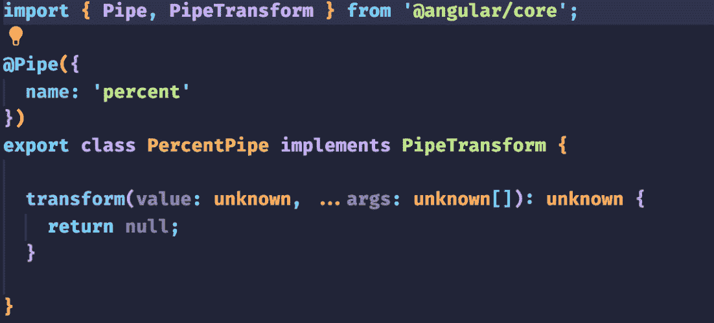
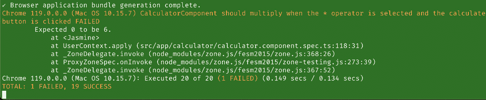

# <st c="0">5</st>

# 测试 Angular 管道、表单和响应式编程<st c="2">。</st>

Angular 框架的主要特点之一是它能够通过使用管道、表单和响应式编程轻松处理数据操作和表单输入<st c="56">。</st> <st c="209">。</st>

Angular 中的管道允许在向用户显示之前转换数据<st c="230">，</st> <st c="311">管道可用于格式化日期和货币，甚至可以应用自定义逻辑以按任何所需方式操作数据<st c="432">。</st> <st c="514">测试这些管道确保它们按预期工作并产生预期的输出</st>。</st>

在 Angular 中，表单是收集和验证用户输入的必要组件<st c="530">，测试 Angular 表单涉及验证表单字段是否正确绑定到模型，验证输入，并处理表单提交<st c="617">。</st> <st c="766">通过测试表单，开发人员可以确保表单按预期运行并提供无缝的<st c="864">用户体验</st>。</st>

响应式编程是一种处理异步数据流和事件的范例<st c="880">，在 Angular 中，响应式编程通常与 ReactiveForms 模块一起使用，该模块提供了一种以响应式方式管理表单状态和数据流的方法<st c="967">。</st> <st c="1109">。</st>

本章将探讨测试 Angular 管道、表单和响应式编程的不同方法和最佳实践<st c="1125">，我们将介绍编写有效测试可用的工具和技术，以及常见的故障排除技巧和提示<st c="1263">。</st> <st c="1398">在本章结束时，您将深入了解如何测试 Angular 应用程序的这些关键方面，并确保它们的可靠性和准确性<st c="1557">。</st>

概括来说，以下是本章将涵盖的主要主题<st c="1570">：</st> <st c="1632">：</st>

+   在我们的项目中使用的 Angular 管道的测试<st c="1645">，</st> <st c="1681">我们的项目</st>

+   将测试驱动开发应用于我们的响应式表单<st c="1692">，</st> <st c="1733">响应式表单</st>

# 技术要求<st c="1746">

为了跟随本章中的示例和练习，您需要对 Angular 和 TypeScript 有一个基本的了解，以及访问以下内容<st c="1769">：</st> <st c="1927">以下内容：</st>

+   在您的计算机上安装的 Node.js 和 npm<st c="1941">，</st> <st c="1971">您的计算机</st>

+   安装全局的 Angular CLI<st c="1984">，</st> <st c="1997">全局安装</st>

+   在您的计算机上安装的代码编辑器，例如 Visual Studio Code<st c="2015">，</st> <st c="2072">您的计算机</st>

本章的代码文件可以在以下位置找到<st c="2085">[<st c="2133">https://github.com/PacktPublishing/Mastering-Angular-Test-Driven-Development/tree/main/Chapter%205</st>](https://github.com/PacktPublishing/Mastering-Angular-Test-Driven-Development/tree/main/Chapter%205)<st c="2231">。</st>

# <st c="2232">测试我们在项目中使用的 Angular 管道</st>

<st c="2279">我们的计算器应用程序是一个</st> <st c="2312">简单的工具，执行基本的算术运算，包括加法、减法、乘法和除法。</st> <st c="2430">假设我们有一个功能，允许我们以百分比的形式表示一个数字。</st> <st c="2516">为此，我们将使用一个管道。</st> <st c="2553">我们将称我们的</st> <st c="2568">管道</st> `<st c="2573">percent</st>`<st c="2580">。</st>

<st c="2581">在我们的</st> `<st c="2589">core</st>` <st c="2593">文件夹中，我们将创建一个</st> `<st c="2617">pipes</st>` <st c="2622">文件夹。</st> <st c="2631">我们将通过我们的终端访问此文件夹，然后运行以下命令来创建我们的</st> `<st c="2722">percent</st>` <st c="2729">管道：</st>

```js
<st c="2735">$ ng g pipe percent –skip-import</st>
```

<st c="2768">管道生成后，你应该看到以下树结构：</st>


<st c="2886">图 5.1 – 管道文件夹</st>

<st c="2914">与</st> `<st c="2946">percent.pipe.spec.ts</st>`<st c="2966">的内容相关，这是我们所拥有的：</st>

```js
 import { PercentPipe } from './percent.pipe'; describe('PercentPipe', () => { it('create an instance', () => {
    const pipe = new PercentPipe();
    expect(pipe).toBeTruthy();
  });
});
```

<st c="3167">遵循</st> **<st c="3196">测试驱动开发</st>** <st c="3219">(</st>**<st c="3221">TDD</st>**<st c="3224">)，我们将创建一个包含以下</st> <st c="3274">测试</st> <st c="3284">的测试套件：</st>

+   <st c="3290">一个将正数格式化为</st> <st c="3328">百分比字符串</st> 的测试

+   <st c="3351">一个将负数格式化为</st> <st c="3395">百分比字符串</st> 的测试

+   <st c="3412">一个将小数格式化为</st> <st c="3455">百分比字符串</st> 的测试

+   <st c="3472">一个将非数字格式化为</st> <st c="3511">百分比字符串</st> 的测试

<st c="3528">让我们</st> <st c="3535">开始吧。</st>

## <st c="3547">正数转换为百分比字符串格式化测试</st>

<st c="3600">我们的目标非常简单。</st> <st c="3631">如果我们</st> <st c="3636">有一个正数，例如</st> `<st c="3669">123</st>`<st c="3672">，它的百分比格式必须是</st> `<st c="3704">12300%</st>`<st c="3710">。在我们的</st> `<st c="3719">percent.pipe.spec.ts</st>` <st c="3739">文件中，我们将添加以下</st> <st c="3772">测试套件</st><st c="3781">e：</st>

```js
 it('should format a positive number to a percentage string', () => {
  const input = 123;
  const output = new PercentPipe().transform(input);
  expect(output).toBe('12300%');
});
```

<st c="3959">在我们的终端中，运行</st> `<st c="3995">ng test</st>` <st c="4002">命令后，我们将</st> <st c="4020">得到以下结果：</st>


<st c="4477">图 5.2 – 正数转换为百分比字符串格式化测试在终端中失败</st>

<st c="4565">在我们的浏览器中，我们将得到以下结果：</st>


<st c="5202">图 5.3 – 正数转换为百分比字符串格式化测试在浏览器中失败</st>

<st c="5289">我们的测试失败是很正常的。</st> <st c="5330">记住，我们正在遵循 TDD 的原则。</st> <st c="5379">因此，我们已经考虑了当我们的数字被格式化为百分比时预期的结果，并编写了相应的测试序列。</st> <st c="5531">现在我们将编写测试通过所需的最少代码。</st>

<st c="5613">现在让我们打开我们的</st> `<st c="5633">percent.pipe.ts</st>` <st c="5648">文件，看看它包含什么。</st> <st c="5685">我们将看到以下内容：</st>



<st c="5909">图 5.4 – percent.pipe.ts 文件中的代码</st>

<st c="5954">因此，让我们添加我们的算法。</st> <st c="5984">这将使我们能够</st> <st c="6006">以最少的代码将之前的测试带到绿色阶段：</st>

```js
 transform (value: number): string {
    const formattedValue = value * 100;
    return formattedValue + '%';
  }
```

<st c="6192">我们在这里所做的一切只是将需要格式化为百分比的数字乘以 100，并将其与</st> `<st c="6317">%</st>` <st c="6318">符号连接起来，以获得所需的渲染。</st> <st c="6356">现在，当我们进入我们的测试终端时，我们的测试将</st> <st c="6408">变为绿色：</st>


<st c="7626">图 5.5 – 正数转换为百分比字符串格式化测试在终端中成功</st>

<st c="7717">在我们的浏览器中，我们将得到以下</st> <st c="7740">结果：</st>


<st c="7855">图 5.6 – 正数转换为百分比字符串格式化测试在浏览器中成功</st>

<st c="7945">在下一节中，我们将查看将负数格式化为</st> <st c="8026">百分比的测试。</st>

## <st c="8039">负数转换为百分比字符串格式化测试</st>

<st c="8092">正如我们所见，我们的目标也非常</st> <st c="8141">简单。</st> <st c="8150">如果我们有一个负数，例如</st> `<st c="8188">-123</st>`<st c="8192">，它的百分比格式必须是</st> `<st c="8224">-12300%</st>`<st c="8231">。因此，在我们的</st> `<st c="8244">percent.pipe.spec.ts</st>` <st c="8264">文件中，我们将</st> <st c="8277">添加以下</st> <st c="8295">测试套件</st><st c="8304">e：</st>

```js
 it('should format a negative number to a percentage string', () => {
  const input = -123;
  const output = new PercentPipe().transform(input);
  expect(output).toBe('-12300%');
});
```

<st c="8484">在我们的终端中，运行</st> `<st c="8520">ng test</st>` <st c="8527">命令后，我们得到以下</st> <st c="8545">结果：</st>


<st c="9186">图 5.7 – 负数转换为百分比字符串格式化测试在终端中成功</st>

<st c="9277">在我们的浏览器中，我们有以下</st> <st c="9296">结果：</st>


<st c="9982">图 5.8 – 负数转换为百分比字符串格式化测试在浏览器中成功</st>

<st c="10072">我们可以得出结论，我们</st> <st c="10136">percent.pipe.ts</st> <st c="10151">文件中编写的最小代码量，用于将正数格式化为百分比，也适用于负数，因为我们不需要添加任何代码来通过测试</st> <st c="10277">。</st>

<st c="10285">在下一节中，我们将查看将小数格式化为</st> <st c="10365">百分比的测试。</st>

## <st c="10378">小数转换为百分比字符串格式化测试</st>

<st c="10430">这次我们将用小数进行相同的练习。</st> <st c="10491">如果我们有一个小数，例如</st> `<st c="10527">123.45</st>`<st c="10533">，它的百分比</st> <st c="10550">格式必须是</st> `<st c="10565">12345%</st>`<st c="10571">。在我们的</st> `<st c="10580">percent.pipe.spec.ts</st>` <st c="10600">文件中，我们将添加以下</st> <st c="10620">以下</st> <st c="10631">测试序列：</st>

```js
 it('should format a decimal number to a percentage string', () => {
  const input = 123.45;
  const output = new PercentPipe().transform(input);
  expect(output).toBe('12345%');
});
```

<st c="10823">在我们的终端中，运行</st> `<st c="10859">ng test</st>` <st c="10866">命令后，我们</st> <st c="10879">得到以下结果：</st>


<st c="11665">图 5.9 – 十进制数字转换为百分比字符串格式化测试在终端中成功</st>

<st c="11757">在我们的浏览器中，我们有</st> <st c="11782">以下结果：</st>


<st c="12528">图 5.10 – 十进制数字转换为百分比字符串格式化测试在浏览器中成功</st>

<st c="12620">我们可以得出结论，</st> <st c="12641">我们</st> <st c="12684">percent.pipe.ts</st> <st c="12699">文件中编写的最小代码量，用于将正数和负数格式化为百分比，也适用于小数，因为我们不需要添加任何代码来通过测试</st> <st c="12840">。</st>

<st c="12848">在下一节中，我们将查看将非数字表达式，例如</st> **<st c="12941">不是一个数字</st>** <st c="12953">(**<st c="12955">NaN</st>**<st c="12958">**)，格式化为</st> <st c="12965">百分比的测试。</st>

## <st c="12978">非数字转换为百分比字符串格式化测试</st>

<st c="13026">在这种情况下，目标是处理一个异常。</st> <st c="13076">让我们</st> <st c="13081">假设要转换成百分比的数字实际上不是一个数字。</st> <st c="13152">通常情况下，我们会</st> <st c="13166">收到一个错误信息，例如</st> `<st c="13344">percent.pipe.spec.ts</st>` <st c="13364">文件，我们将添加以下</st> <st c="13397">测试</st> <st c="13401">套件：</st>

```js
 it('should return an Error when the value is not a number NaN', () => {
    const input = NaN;
    const output = new PercentPipe().transform(input);
    expect(output).toBe('Error');
  });
```

在我们的终端中，在运行了`<st c="13621">ng test</st>`命令之后，我们得到如下结果：


图 5.11 – 在终端中非数字转换为百分比字符串格式化测试失败

在我们的浏览器中，我们有如下结果：


图 5.12 – 在浏览器中非数字转换为百分比字符串格式化测试成功

如您可能已经注意到的，我们有一些错误，并且我们的测试失败了。这是正常的，因为我们还没有使用我们的`<st c="15075">PercentPipe</st>`来解决这个问题的。

为了修复我们的测试，我们将前往`<st c="15117">percent.pipe.ts</st>`并添加处理这个异常所需的最少代码：

```js
 if (isNaN(value)) {
      return 'Error';
    }
```

这段代码需要添加到`<st c="15271">transform()</st>`函数中。以下是对`<st c="15336">transform()</st>`函数的完整代码：

```js
 transform(value: number): string {
    if (isNaN(value)) {
      return 'Error';
    }
    const formattedValue = value * 100;
    return formattedValue + '%';
  }
```

在我们的终端中，在运行了`<st c="15533">ng test</st>`命令之后，我们将得到如下结果：


图 5.13 – 在终端中非数字转换为百分比字符串格式化测试成功

在我们的浏览器中，我们将得到如下结果：


图 5.14 – 在浏览器中 PercentPipe 的测试用例成功

最后一步是前往`<st c="16250">CalculatorComponent</st>`来测试我们在`<st c="16301">calculator.component.html</st>`模板中的`<st c="16282">PercentPipe</st>`。为了做到这一点，我们将在`<st c="16386">calculator.module.ts</st>`模块中声明我们的`<st c="16367">PercentPipe</st>`，这样我们就可以在模板中使用它了。这将是我们得到的结果：


图 5.15 – 我们组件中的 PercentPipe 实现

所有的东西都工作得非常完美！

<st c="17226">在下一节中，我们将设置</st> <st c="17260">计算器的用户界面。</st> <st c="17294">到目前为止，还没有用户交互。</st> <st c="17336">我们只是操作代码来玩转变量状态。</st> <st c="17404">为了设置用户界面，我们将使用</st> <st c="17443">响应式表单，并看看我们如何应用 TDD 的原则。</st>

# <st c="17506">在我们的计算器应用中实现响应式表单的 TDD</st><st c="17559">测试</st>

<st c="17568">响应式表单是一种使用响应式编程原则来根据用户输入更新表单状态的表单类型。</st> <st c="17697">响应式表单常用于 Web 应用程序中，因为它们可以用来创建动态</st> <st c="17786">和响应式</st> <st c="17801">的用户界面。</st>

<st c="17817">在本节中，我们将讨论如何为我们的计算器应用实现响应式表单用户界面。</st> <st c="17923">我们将使用 TDD 来确保我们的表单是有效的，并且计算器组件按预期工作。</st> <st c="18012">编写计算器表单的测试</st>

<st c="18024">使用响应式表单用户界面为计算器带来的好处如下：</st> <st c="18091">一个计算器：</st>

+   **<st c="18104">动态和响应式</st>**<st c="18127">：响应式表单可以用来创建动态和响应式的用户界面。</st> <st c="18207">例如，你可以使用响应式表单创建一个计算器，当用户在输入字段中输入值时，它会更新结果。</st>

+   **<st c="18345">有效性</st>**<st c="18351">：响应式表单提供验证功能，可以用来确保用户输入是有效的。</st> <st c="18454">例如，你可以使用响应式表单创建一个计算器，验证操作数是否为数字，以及运算符是否为有效的</st> <st c="18599">数学运算符。</st>

+   **<st c="18621">可测试性</st>**<st c="18630">：响应式表单易于使用 TDD 进行测试。</st> <st c="18676">这确保了你的表单是有效的，并且计算器组件按预期工作。</st>

<st c="18766">要实现一个用于使用计算器的 TDD 响应式表单用户界面，你需要遵循</st> <st c="18795">以下步骤。</st>

## <st c="18886">编写计算器表单的测试</st>

<st c="18925">第一步是为</st> <st c="18968">calc</st><st c="18972">ulator</st> <st c="18986">表单编写测试。</st> <st c="18986">这个测试将确保当所有字段都正确填写时，表单是有效的。</st> <st c="19079">在我们的</st> `<st c="19086">calculator.component.spec.ts</st>`<st c="19114">中，我们将添加以下</st> <st c="19141">测试套件：</st>

```js
 it('should be valid when all of the fields are filled in correctly', () => {
  const form = new FormGroup({
    operand1: new FormControl(123),
    operand2: new FormControl(456),
    operator: new FormControl('+'),
  });
  expect(form.valid).toBe(true);
});
```

<st c="19394">不要忘记导入</st> `<st c="19418">ReactiveFormModule</st>` <st c="19436">，如以下代码所示：</st>

```js
 await TestBed.configureTestingModule({
    imports: [ReactiveFormsModule],
  }).compileComponents();
```

<st c="19563">正如你所见，我们现在有一个测试套件与我们的响应式表单管理相关联，以防它是有效的。</st> <st c="19682">当我们</st> <st c="19687">运行</st> `<st c="19698">ng test</st>` <st c="19705">命令时，这将</st> <st c="19728">是结果：</st>


<st c="19877">图 5.16 – 计算器表单测试在终端中成功</st>

<st c="19937">在我们的浏览器中，我们将得到</st> <st c="19967">以下结果：</st>


<st c="20845">图 5.17 – 计算器表单测试在浏览器中成功</st>

<st c="20904">我们的测试套件启动了！</st> <st c="20927">这并不令人惊讶！</st> <st c="20946">实际上，我们在测试中直接创建了我们表单的实例。</st> <st c="21021">由于我们尚未与计算器组件的表单交互，我们现在将通过修改我们的</st> `<st c="21118">test suite</st>` <st c="21129">来完成这一点：</st>

```js
 it('should be valid when all of the fields are filled in correctly', () => {
    calculator.calculatorForm.get('operand1')?.setValue(123);    calculator.calculatorForm.get('operand2')?.setValue(456);
  calculator.calculatorForm.get('operator')?.setValue('+');
expect(calculator.calculatorForm.valid).toBe(true);
});
```

<st c="21449">在我们的终端中，运行</st> `<st c="21485">ng test</st>` <st c="21492">命令后，我们将</st> <st c="21510">得到以下结果：</st>


<st c="22227">图 5.18 – 计算器表单构建在终端中失败</st>

<st c="22285">我们得到的结果是正常的，因为</st> `<st c="22322">calculatorForm</st>` <st c="22336">不在我们的</st> `<st c="22358">CalculatorComponent</st>`<st c="22377">中。我们需要将其作为属性添加到我们的类中</st> <st c="22426">如下所示：</st>


<st c="22567">图 5.19 – 在我们的组件中将 calculatorForm 声明为 FormGroup 模块</st>

<st c="22647">现在我们已经添加了</st> `<st c="22671">calculatorForm</st>`<st c="22685">，我们还将通过以下方式初始化我们的</st> `<st c="22745">calculatorForm</st>` <st c="22759">来添加三个输入字段：</st>

```js
 this.calculatorForm = new FormGroup({
   operand1: new FormControl(null, [Validators.required]),
   operand2: new FormControl(null, [Validators.required]),
   operator: new FormControl(null, [Validators.required]),
});
```


<st c="23229">图 5.20 – 初始化我们的 FormGroup 模块 calculatorForm</st>

<st c="23296">在我们的终端中，运行</st> `<st c="23332">ng test</st>` <st c="23339">命令后，我们将</st> <st c="23357">得到以下结果：</st>


<st c="23678">图 5.21 – 计算器表单测试在终端中成功</st>

<st c="23738">在我们的浏览器中，我们将得到</st> <st c="23768">以下结果：</st>


<st c="24645">图</st><st c="24648">5.22 – 计算器表单测试在浏览器中成功</st>

<st c="24705">我们将进行另一个测试以确保</st> <st c="24740">相反的情况是正确的，即当表单</st> <st c="24786">无效时。</st>

<st c="24797">由于所有字段都是必填的，如果某个字段未填写，则表单必须无效。</st> <st c="24885">在我们的</st> `<st c="24892">calculator.component.spec.ts</st>` <st c="24920">文件中，我们将添加以下</st> <st c="24951">测试</st> <st c="24956">序列：</st>

```js
 it('should be invalid when one of the field is not filled in correctly', () => {
    calculator.calculatorForm.get('operand1')?.setValue(123);
    calculator.calculatorForm.get('operator')?.setValue('+');
    expect(calculator.calculatorForm.valid).toBe(false);
  });
```

<st c="25221">在我们的终端中，运行</st> `<st c="25257">ng test</st>` <st c="25264">命令后，我们将看到以下内容：</st>


<st c="25448">图 5.23 – 在终端中计算器表单测试成功</st>

<st c="25508">在我们的浏览器中，我们将看到以下结果：</st>


<st c="26478">图 5.24 – 在浏览器中计算器表单测试成功</st>

<st c="26537">在下一节中，我们将实现</st> <st c="26574">我们的计算器应用程序的用户</st> <st c="26602">界面。</st>

## <st c="26625">实现用户界面</st>

<st c="26657">让我们在我们的</st> <st c="26695">`calculator.component.html`</st> <st c="26713">文件中使用以下内容来</st> <st c="26738">实现我们的计算器用户</st> <st c="26750">界面：</st>

```js
 <form [formGroup]="calculatorForm">
  <input type="number" formControlName="operand1" />
  <input type="number" formControlName="operand2" />
  <select formControlName="operator">
    <option value="+">+</option>
    <option value="-">-</option>
    <option value="*">*</option>
    <option value="/">/</option>
  </select>
  <button (click)="calculate()" [disabled]="calculatorForm.invalid">
    Calculate
  </button>
  <p [colorChange]="color">{{ result | percent }}</p>
</form>
```

<st c="27213">别忘了将</st> `<st c="27234">ReactiveFormsModu</st><st c="27251">le</st>` <st c="27254">添加到</st> `<st c="27262">导入</st> <st c="27269">数组</st> <st c="27274">和</st> `<st c="27285">calculate()</st>` <st c="27296">方法</st> <st c="27306">的正确位置。</st> <st c="27324">如果您有任何错误，可以检查源代码。</st> <st c="27378">这可以在</st> <st c="27396">[<st c="27399">https://github.com/PacktPublishing/Mastering-Angular-Test-Driven-Development/tree/main/Chapter%205/getting-started-angular-tdd/src/app/calculator</st>](https://github.com/PacktPublishing/Mastering-Angular-Test-Driven-Development/tree/main/Chapter%205/getting-started-angular-tdd/src/app/calculator)<st c="27544">找到。</st>

<st c="27545">在我们的终端中，运行</st> `<st c="27581">ng serve -o</st>` <st c="27592">命令后，我们将在</st> <st c="27623">我们的浏览器中看到以下内容：</st>


<st c="27651">图 5.25 – 在浏览器中计算器用户界面</st>

<st c="27705">在下一节中，我们将实现我们</st> <st c="27757">`calculate()`</st> <st c="27761">按钮的</st> <st c="27772">业务</st> <st c="27783">逻辑。</st>

## <st c="27791">为计算器组件编写测试</st>

<st c="27834">基于 TDD 的原则，我们将实现我们</st> <st c="27870">`calculate()`</st> <st c="27896">按钮的</st> <st c="27901">业务</st> <st c="27913">逻辑。</st>

<st c="27932">我们将从添加与用户输入的两个数字相加的功能开始。</st> <st c="28029">在我们的</st> `<st c="28036">calculator.component.spec.ts</st>` <st c="28064">文件中，我们将添加以下</st> <st c="28097">测试套件：</st>

```js
 it('should be added when the + operator is selected and the calculate button is clicked', () => {
    calculator.calculatorForm.get('operand1')?.setValue(2);
    calculator.calculatorForm.get('operand1')?.setValue(3);
    calculator.calculatorForm.get('operator')?.setValue('+');
    calculator.calculate();
    expect(calculator.result).toBe(5);
  });
```

<st c="28440">在我们的终端中，运行</st> <st c="28463">命令后，我们将</st> <st c="28476">得到以下结果：</st>


<st c="29091">图 5.26 – 计算器运算符（+）选择测试在终端中失败</st>

<st c="29163">在我们的浏览器中，我们将得到</st> <st c="29193">以下结果：</st>


<st c="29816">图 5.27 – 计算器运算符（+）选择测试在浏览器中失败</st>

<st c="29887">正如我们所见，我们的测试失败了，这是完全正常的，因为我们的</st> `<st c="29965">calculate()</st>` <st c="29976">方法目前在我们的</st> `<st c="30010">CalculatorComponent</st>`<st c="30029">中是空的。我们现在需要添加使它功能化的最小代码。</st> <st c="30099">我们需要考虑之前在前面章节中必须添加到类中的函数。</st> <st c="30225">以下是当我们</st> <st c="30239">更新</st> `<st c="30264">calculate()</st>` <st c="30275">方法在</st> `<st c="30290">calculator.component.ts</st>` <st c="30313">文件中的样子：</st>


<st c="30537">图 5.28 – 计算器运算符（+）选择</st>

<st c="30581">在我们的终端中，运行</st> `<st c="30617">ng test</st>` <st c="30624">命令后，我们将</st> <st c="30642">得到以下结果：</st>


<st c="30808">图 5.29 – 计算器运算符（+）选择测试在终端中成功</st>

<st c="30883">在我们的浏览器中，我们将得到</st> <st c="30913">以下结果：</st>


<st c="31887">图 5.30 – 计算器运算符选择（+）测试在浏览器中成功</st>

<st c="31961">现在我们将对</st> <st c="31987">减法功能</st> <st c="32019">进行相同的操作。</st> <st c="32026">在我们的</st> `<st c="32026">calculator.component.spec.ts</st>` <st c="32054">文件中，我们将添加以下</st> <st c="32087">测试套件：</st>

```js
 it('should subtract when the - operator is selected and the calculate button is clicked', () => {
    calculator.calculatorForm.get('operand1')?.setValue(2);
    calculator.calculatorForm.get('operand2')?.setValue(3);
    calculator.calculatorForm.get('operator')?.setValue('-');
 calculator.calculate();
 expect(calculator.result).toBe(-1);
});
```

<st c="32431">在我们的终端中，运行</st> `<st c="32467">ng test</st>` <st c="32474">命令后，我们将</st> <st c="32492">得到以下结果：</st>


<st c="33066">图 5.31 – 计算器运算符选择（-）测试在终端中失败</st>

<st c="33138">在我们的浏览器中，我们将得到</st> <st c="33168">这个结果：</st>


<st c="33899">图 5.32 – 计算器运算符选择（-）测试在终端中失败</st>

<st c="33971">我们的测试失败了，这是完全正常的，因为我们的</st> `<st c="34029">calculate()</st>` <st c="34040">方法目前还没有处理我们</st> `<st c="34092">CalculatorComponent</st>`<st c="34111">中的减法。我们现在需要添加最少的代码</st> <st c="34148">来使其功能化。</st> <st c="34181">我们需要考虑之前在前面章节中添加到类中的函数。</st> <st c="34301">以下是我们在</st> `<st c="34340">calculate()</st>` <st c="34351">方法中更新</st> `<st c="34366">calculator.component.ts</st>` <st c="34389">文件时的样子：</st>


<st c="34604">图 5.33 – 计算器运算符选择（-）</st>

<st c="34648">在我们的终端中，在运行</st> `<st c="34684">ng test</st>` <st c="34691">命令后，我们将得到</st> <st c="34709">这个：</st>


<st c="34875">图 5.34 – 计算器运算符选择（-）测试在终端中成功</st>

<st c="34950">在我们的浏览器中，我们将</st> <st c="34975">得到</st> <st c="34980">这个结果：</st>


<st c="36015">图 5.35 – 计算器运算符选择（-）测试在浏览器中成功</st>

<st c="36089">接下来是乘法功能。</st> <st c="36132">在我们的</st> `<st c="36139">calculator.component.spec.ts</st>` <st c="36167">文件中，我们将添加这个</st> <st c="36189">测试套件：</st>

```js
 it('should multiply when the * operator is selected and the calculate button is clicked', () => {
    calculator.calculatorForm.get('operand1')?.setValue(2);
    calculator.calculatorForm.get('operand2')?.setValue(3);
    calculator.calculatorForm.get('operator')?.setValue('*');
calculator.calculate();
expect(calculator.result).toBe(6);
});
```

<st c="36531">在我们的终端中，在运行</st> <st c="36555">`<st c="36567">ng test</st>`</st> <st c="36574">命令后，我们将得到</st> <st c="36592">这个：</st>



<st c="37142">图 5.36 – 计算器运算符选择（*）测试在终端中失败</st>

<st c="37214">在我们的浏览器中，我们将得到</st> <st c="37244">这个结果：</st>


<st c="37866">图 5.37 – 计算器运算符选择（*）测试在浏览器中失败</st>

我们的测试失败了，这是完全正常的，因为我们的 `<st c="37995">calculate()</st>` 方法目前还没有处理 `<st c="38061">CalculatorComponent</st>` 中的乘法。我们现在需要添加最少的代码来使其功能正常。<st c="38150">我们需要考虑之前在前面章节中添加到类中的函数。</st> <st c="38270">以下是我们在 `<st c="38309">calculate()</st>` 方法中更新 `<st c="38335">calculator.component.ts</st>` 文件时的样子：</st>


在我们的终端中，运行 `<st c="38597">ng test</st>` 命令后，我们将得到以下结果：


在我们的浏览器中，我们将得到以下结果：


最后，我们将设置最后一个操作，即 `<st c="40123">divide</st>`<st c="40129">。在我们的 `<st c="40138">calculator.component.spec.ts</st>` 文件中，我们将添加这个 `<st c="40188">测试套件</st>`：

```js
 it('should divide when the / operator is selected and the calculation button is clicked.', () => {
    calculator.calculatorForm.get('operand1')?.setValue(3);
    calculator.calculatorForm.get('operand2')?.setValue(2);
    calculator.calculatorForm.get('operator')?.setValue('/');
    calculator.calculate();
    expect(calculator.result).toBe(1.5);
  });
```

在我们的终端中，运行 `<st c="40569">ng test</st>` 命令后，我们将得到以下结果：


在我们的浏览器中，我们将得到以下结果：


我们的测试失败了，这是完全正常的，因为我们的 `<st c="42079">calculate()</st>` 方法目前还没有处理 `<st c="42139">CalculatorComponent</st>` 中的除法。我们现在需要添加最少的代码来使其功能正常。<st c="42228">我们需要考虑之前在前面章节中添加到类中的函数。</st> <st c="42348">以下是我们在 `<st c="42387">calculate()</st>` 方法中更新 `<st c="42413">calculator.component.ts</st>` 文件时的样子：</st>


<st c="42582">图 5.43 – 计算器运算符选择 (/)</st>

<st c="42626">在我们的终端中，运行</st> `<st c="42662">ng test</st>` <st c="42669">命令后，我们将</st> <st c="42687">得到以下结果：</st>


<st c="42846">图 5.44 – 计算器运算符选择 (/) 测试在终端中成功</st>

<st c="42921">在我们的浏览器中，我们将</st> <st c="42945">得到</st> <st c="42951">以下结果：</st>


<st c="44198">图 5.45 – 计算器运算符选择 (/) 测试在浏览器中成功</st>

<st c="44272">现在我们可以运行</st> `<st c="44292">ng serve -o</st>` <st c="44303">命令来查看我们的</st> <st c="44327">应用程序的行为：</st>


<st c="44448">图 5.46 – 计算器用户界面测试</st>

# <st c="44492">摘要</st>

<st c="44500">在本章中，我们学习了如何测试 Angular 管道并将 TDD 应用于反应式编程的 Angular。</st> <st c="44591">r</st><st c="44592">eactive programming。</st>

<st c="44612">我们探讨了 Angular 管道的测试，这些管道是用于在视图中显示输入数据的必要组件。</st> <st c="44740">这个过程涉及创建覆盖不同场景和边缘情况的测试用例，以确保管道按预期行为。</st>

<st c="44868">我们深入研究了 TDD 在 Angular 反应式表单中的应用。</st> <st c="44937">TDD 是一种软件开发方法，涉及在编写代码之前编写测试，这些测试驱动代码的开发。</st> <st c="45072">这种方法确保代码是健壮的、可靠的，并且</st> <st c="45133">经过良好测试的。</st>

<st c="45145">在下一章中，我们将探讨使用 Protractor、Cypress</st> <st c="45228">和 Playwright 进行端到端测试。</st>

# <st c="0">第三部分：端到端测试</st>

<st c="27">在本部分，您将了解使用 Protractor、Cypress 和 Playwright 进行端到端测试的概述。</st> <st c="129">然后，您将深入了解如何使用 Cypress 编写</st> <st c="187">端到端测试。</st>

<st c="204">本部分包含以下章节：</st>

+   *<st c="242">第六章</st>*<st c="252">,</st> *<st c="254">使用 Protractor、Cypress 和 Playwright 探索端到端测试</st>*

+   *<st c="323">第七章</st>*<st c="333">,</st> *<st c="335">理解 Cypress 及其在 Web 应用程序端到端测试中的作用</st>*

+   *<st c="410">第八章</st>*<st c="420">,</st> *<st c="422">使用 Cypress 编写有效的端到端组件测试</st>*
