# 7

# 理解 Cypress 及其在 Web 应用端到端测试中的作用

在 Web 开发的世界中，Angular 已经成为构建动态和强大 Web 应用程序最受欢迎的框架之一。<st c="219">凭借其丰富的特性和强大的功能，Angular 使开发者能够创建无缝的用户体验。</st> <st c="338">然而，确保这些应用程序的可靠性和功能需要彻底的测试，这正是**<st c="457">Cypress</st>** <st c="464">发挥作用的地方。</st>

Cypress 是一个多功能的**<st c="505">端到端</st>** <st c="515">(</st>**<st c="517">E2E</st>**<st c="520">) 测试框架，它能够无缝地集成到 Angular 项目中，允许开发者编写和执行覆盖整个应用程序流程的组件测试。</st> <st c="688">在本章中，我们将探讨 Cypress 在 Angular 项目端到端测试中的作用，并指导您通过发现、设置和编写第一个组件测试的过程来使用 Cypress。</st> <st c="877">使用 Cypress。</st>

我们将首先了解 Cypress，并理解其独特的特性和优势。<st c="982">从其直观的 API 到实时重新加载和调试功能，Cypress 为开发者提供了一种无缝且高效的测试体验。</st> <st c="1138">通过掌握 Cypress 的核心概念及其与 Angular 的集成，开发者可以利用其力量确保其 Angular 应用程序的质量和可靠性。</st> <st c="1293">Angular 应用程序。</st>

接下来，我们将深入了解在 Angular 项目中设置 Cypress 的过程。<st c="1396">我们将探讨必要的配置和依赖项，指导您通过步骤将 Cypress 无缝集成到您的 Angular 开发工作流程中。</st> <st c="1561">在打下坚实的基础后，您将准备好在您的**<st c="1663">Angular 项目</st>**中充分利用 Cypress 的全部潜力。</st>

最后，我们将指导您在 Angular 项目中使用 Cypress 编写第一个端到端组件测试的过程。<st c="1805">我们将涵盖编写有效组件测试的必要方面，包括选择元素、与应用程序交互以及断言**<st c="1957">预期行为</st>**。</st>

概括来说，以下是本章将涵盖的主要主题：

+   发现 Cypress 及其在 Angular 项目中的作用

+   在 Angular 项目中设置 Cypress

+   在 Angular 项目中使用 Cypress 编写第一个端到端组件测试

# 技术要求

<st c="2242">为了跟随本章中的示例和练习，你需要对 Angular 和 TypeScript 有基本的了解，以及以下</st> <st c="2404">技术要求：</st>

+   <st c="2427">Node.js 和</st> **<st c="2440">Node 包管理器</st>** <st c="2460">(</st>**<st c="2462">npm</st>**<st c="2465">) 安装在你电脑上</st>

+   <st c="2494">Angular CLI</st> <st c="2507">全局安装</st>

+   <st c="2525">安装在你电脑上的代码编辑器，例如 Visual Studio Code。</st>

<st c="2596">本章的代码文件可以在</st> <st c="2641">以下位置找到</st> [<st c="2644">https://github.com/PacktPublishing/Mastering-Angular-Test-Driven-Development/tree/main/Chapter%207</st>](https://github.com/PacktPublishing/Mastering-Angular-Test-Driven-Development/tree/main/Chapter%207)<st c="2742">。</st>

# <st c="2743">探索 Cypress 及其在 Angular 项目中的作用</st>

<st c="2798">测试在确保应用程序的</st> <st c="2842">质量和可靠性方面发挥着至关重要的作用。</st> <st c="2883">当涉及到 Angular 项目时，开发者需要一个与框架组件无缝集成的强大测试框架，并提供高效全面的测试体验。</st> <st c="3084">这就是 E2E 测试框架 Cypress 发挥作用的地方。</st> <st c="3157">在本节中，我们将探讨 Cypress 及其在 Angular 项目中的作用，揭示其独特的特性和优势。</st>

## <st c="3278">了解 Cypress</st>

<st c="3300">Cypress 是一个基于 JavaScript 的强大</st> <st c="3340">测试框架，允许开发者编写和执行 Web 应用的端到端测试。</st> <st c="3434">Cypress 与其他测试框架的不同之处在于其能够在浏览器中直接运行测试，实现实时重新加载和调试。</st> <st c="3585">这一特性使得 Cypress 成为 Angular 项目的理想选择，开发者可以在真实环境中测试他们的应用程序，模拟真实的</st> <st c="3733">用户交互。</st>

## <st c="3751">与 Angular 无缝集成</st>

<st c="3785">Cypress 与 Angular 项目无缝集成，使其成为测试 Angular 应用程序的绝佳选择。</st> <st c="3903">它</st> <st c="3905">利用 Angular 的强大组件、指令和服务，允许开发者编写涵盖整个应用程序流程的测试。</st> <st c="4048">无论是测试单个组件、验证复杂的</st> <st c="4111">用户流程，还是确保跨浏览器兼容性，Cypress 都提供了完成这些</st> <st c="4238">任务所需的工具和能力。</st>

## <st c="4256">高效的测试工作流程</st>

<st c="4283">Cypress 的一个关键优势是它直观的 API，它简化了编写测试的过程。</st> <st c="4313">凭借其声明性语法，开发者可以轻松选择元素，与应用程序交互，并断言预期的行为。</st> <st c="4390">Cypress 还提供了一套全面的内置命令和断言，使得编写表达性和可读性强的测试更加容易。</st> <st c="4519">此外，Cypress 还提供了强大的调试功能，允许开发者检查元素，逐步执行代码，并在</st> <st c="4803">实时</st>中排查问题。

## <st c="4813">实时重新加载和调试</st>

<st c="4847">Cypress 的实时</st> <st c="4867">重新加载和调试功能在 Angular 项目中尤其有价值。</st> <st c="4952">随着开发者对代码的修改，Cypress 会自动重新加载应用程序，实时反映更新。</st> <st c="5078">此功能显著加快了测试过程，因为开发者可以立即看到他们更改的影响，无需手动刷新浏览器。</st> <st c="5246">此外，Cypress 强大的调试工具使开发者能够快速定位和解决问题，从而提高测试工作流程的整体效率。</st>

<st c="5410">在下一节中，我们将学习如何在我们的</st> <st c="5476">Angular 项目中</st>配置 Cypress。</st>

# <st c="5492">在我们的 Angular 项目中设置 Cypress</st>

<st c="5534">现在我们已经了解了 Cypress 是什么以及它在 Angular 项目中的作用，我们将探讨如何在</st> <st c="5654">我们的项目中</st>配置它。

## <st c="5666">安装 Cypress</st>

首先，您需要在您的机器上安装 Node.js 和 npm。<st c="5708">如果您还没有安装，请从官方</st> <st c="5832">Node.js 网站</st>下载并安装。

<st c="5848">一旦您安装了 Node.js 和 npm，打开您的终端并导航到您的 Angular 项目的根目录。</st> <st c="5964">运行以下命令将 Cypress 作为</st> <st c="6014">开发依赖项</st>安装：

```js
 $ npm install cypress --save-dev
```

<st c="6062">之前的命令将在您的项目中下载并安装 Cypress。</st> <st c="6135">这是在</st> <st c="6159">终端中的工作方式：</st>

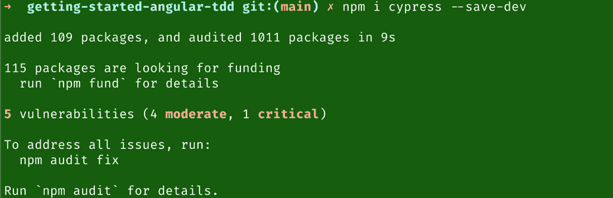

<st c="6470">图 7.1 – Cypress 安装</st>

<st c="6503">安装后，您可以在</st> <st c="6558">package.json 文件中看到依赖关系：</st>

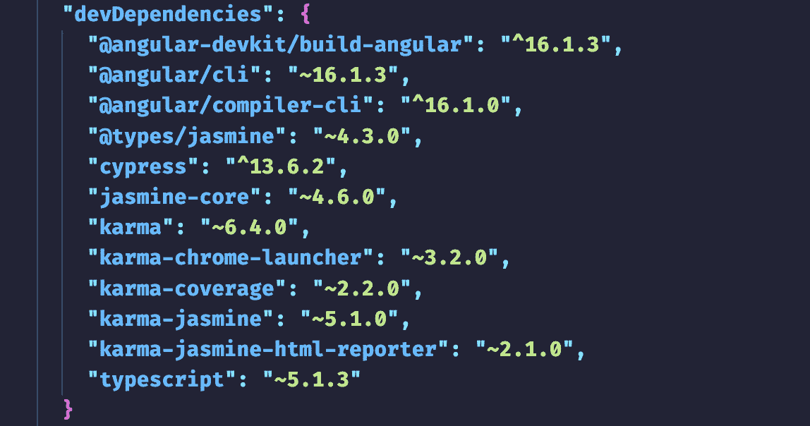

<st c="6960">图 7.2 – Cypress 在 package.json 中的依赖关系</st>

<st c="7007">在下一节中，我们将探讨如何</st> <st c="7039">配置 Cypress。</st>

## <st c="7068">配置 Cypress</st>

<st c="7088">如前所述，我们将逐步了解如何</st> <st c="7126">配置 Cypress：</st>

1.  <st c="7173">在安装 Cypress 后，从你的</st> <st c="7253">项目根目录</st> 运行以下命令：</st>

    ```js
    <st c="7266">$ npx cypress open</st>
    ```

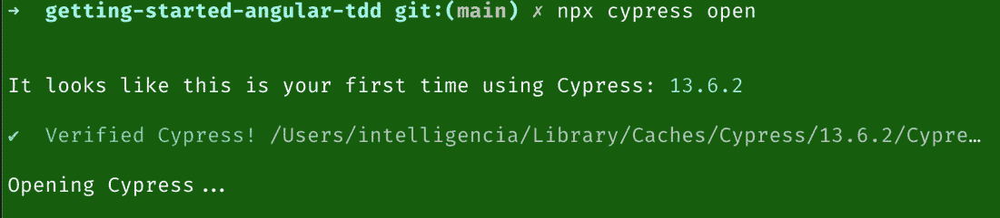

<st c="7505">图 7.3 – 在命令行中打开 Cypress</st>

<st c="7550">现在你将看到浏览器启动，并显示如图 *<st c="7631">图 7</st>**<st c="7639">.4</st>*<st c="7641">* 所示的界面：</st>

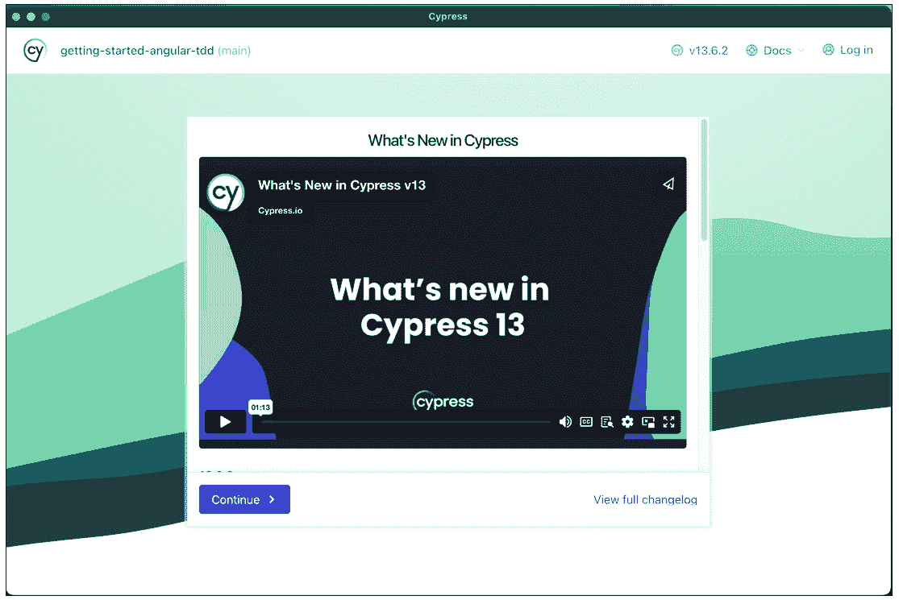

<st c="7734">图 7.4 – Cypress 启动界面</st><st c="7765">面</st>

1.  <st c="7772">点击</st> **<st c="7782">继续</st>**<st c="7790">，你将被重定向到以下界面：</st>

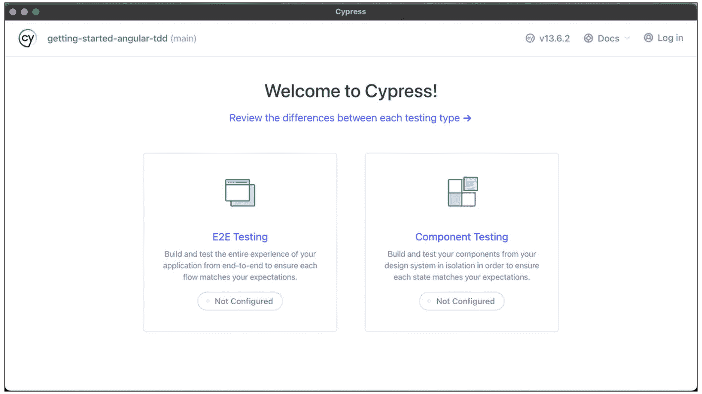

<st c="8227">图 7.5 – Cypress E2E 测试首选界面</st>

1.  <st c="8280">选择</st> **<st c="8288">E2E 测试</st>** <st c="8299">，你将被重定向到如图 *<st c="8355">图 7</st>**<st c="8363">.6</st>*<st c="8365">* 所示的界面：</st>

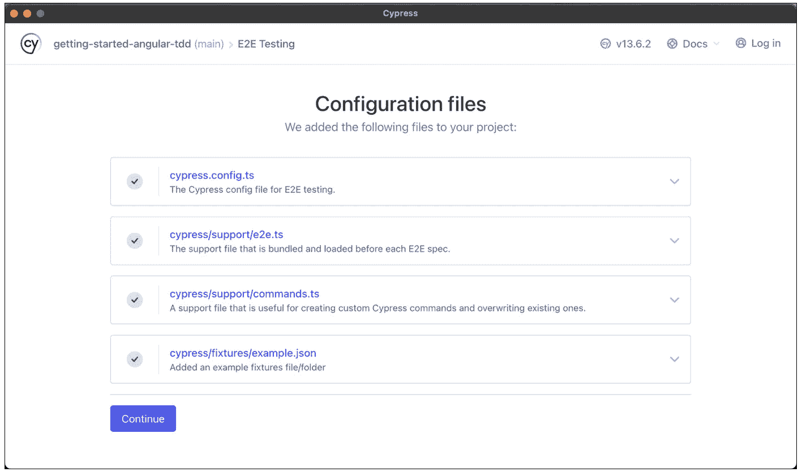

<st c="8858">图 7.6 – Cypress E2E 测试控制面板</st>

<st c="8904">这些文件是针对 Web 应用程序的 Cypress 测试设置的一部分。</st> <st c="8939">让我们分析一下每个</st> <st c="8976">文件的功能：</st>

+   `<st c="9013">cypress.config.ts</st>`<st c="9031">: `<st c="9038">cypress.config.ts</st>` 文件允许你根据项目需求自定义 Cypress，包括设置代理配置、配置网络请求以及指定自定义命令行标志。</st>

+   `<st c="9241">cypress/support/e2e.ts</st>`<st c="9264">: 此文件通常包含可在所有 E2E 测试中使用的全局命令和实用工具。</st> <st c="9372">这是一个可以定义执行常见操作（如登录、在页面间导航或以一致的方式与元素交互）的函数的地方。</st> <st c="9538">在这里定义这些命令，你可以确保它们在每一个测试文件中都是可用的，无需重新定义。</st> <st c="9638">它们。</st>

+   `<st c="9652">cypress/support/comman</st><st c="9675">ds.ts</st>`<st c="9681">：与</st> `<st c="9695">e2e.ts</st>`<st c="9701">类似，</st> `<st c="9707">commands.ts</st>` <st c="9718">文件用于使用自定义命令扩展 Cypress 的内置命令。</st> <st c="9788">此文件专门用于添加可在您的</st> <st c="9874">测试套件中使用的</st> <st c="9887">新命令。</st> <st c="9887">这些命令可以封装复杂的交互或一系列动作，这些动作您发现自己需要在多个</st> <st c="10011">测试中重复。</st> <st c="10019">定义自定义命令有助于保持您的测试</st> **<st c="10066">DRY</st>** <st c="10070">(</st>**<st c="10071">不要重复自己</st>**<st c="10092">)，使它们更容易维护和了解。</st>

+   `<st c="10142">cypress/fixtures/example.json</st>`<st c="10172">：固定文件夹用于存储包含测试中使用的数据的 JSON 文件。</st> <st c="10261">这些可能是模拟 API 响应、用于数据库播种的样本数据或任何其他测试运行所需的静态数据。</st> <st c="10388">此</st> `<st c="10392">example.json</st>` <st c="10404">文件将是一个这样的固定文件，包含测试可能需要与之交互的示例数据。</st>

1.  <st c="10510">点击</st> **<st c="10529">继续</st>**<st c="10537">后，您将看到此界面以选择您首选的 E2E 测试浏览器，如图</st> *<st c="10629">图 7</st>**<st c="10637">.7</st>*<st c="10639">：</st>

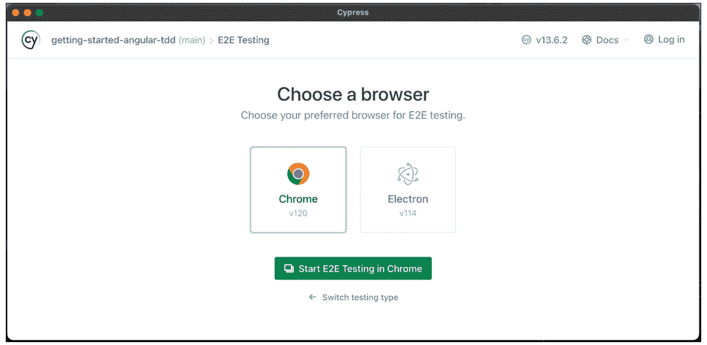

<st c="10827">图 7.7 – Cypress 中的浏览器选择界面</st>

1.  <st c="10882">一旦完成所有配置，你应该能够访问界面，如图</st> <st c="10976">所示</st> *<st c="10986">图 7</st>**<st c="10994">.8</st>*<st c="10996">：</st>


<st c="11037">图 7.8 – Cypress 端到端测试仪表板界面</st>

1.  <st c="11089">在 Angular 项目目录中，创建了一个</st> `<st c="11126">cypress</st>` <st c="11133">文件夹</st> <st c="11152">如下：</st>

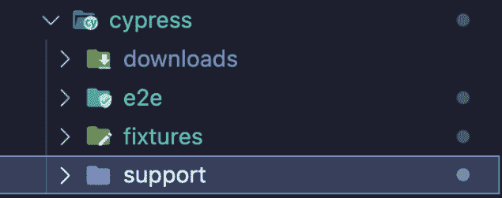

<st c="11227">图 7.9 – Cypress 支持文件夹</st>

1.  <st c="11266">最后，我们将把这个脚本添加到</st> `<st c="11310">package.json</st>` <st c="11322">中，以避免多次执行</st> `<st c="11339">npx cypress open</st>` <st c="11355">：</st>

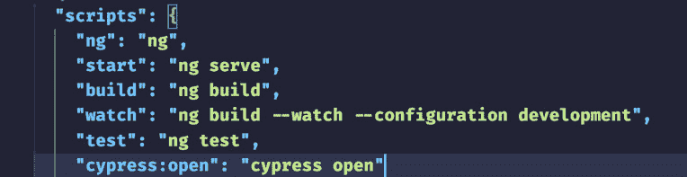

<st c="11546">图 7.10 – Cypress 命令在 package.json 脚本中</st>

<st c="11599">在下一节中，我们将探讨如何编写我们的第一个</st> <st c="11632">端到端测试。</st>

# <st c="11674">编写您的第一个端到端测试</st>

<st c="11702">一旦 Cypress 已正确配置用于端到端测试，我们就可以开始工作了。</st> <st c="11724">让我们看看如何编写我们的第一个</st> <st c="11791">端到端测试：</st>

1.  <st c="11844">现在 Cypress 已安装并配置好，你可以开始编写你的第一个测试。</st> <st c="11930">你可以点击</st> **<st c="11947">创建新规范</st>** <st c="11962">在此界面中，如图</st> *<st c="11993">图 7</st>**<st c="12001">.11</st>*<st c="12004">：</st>

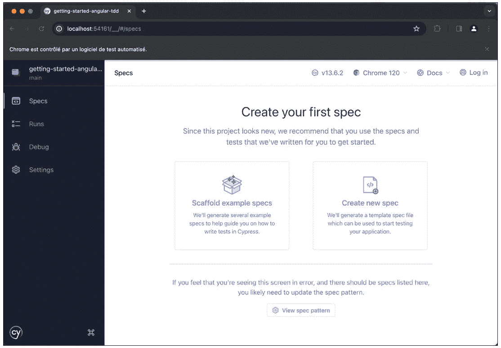

<st c="12048">图 7.11 – Cypress 中的规范创建界面</st>

1.  <st c="12096">完成这些后，你可以在</st> *<st c="12130">图 7</st>**<st c="12138">.12</st>* <st c="12141">中看到一个名为</st> `<st c="12159">spec.cy.ts</st>`<st c="12169">的新文件，它位于你的项目的</st> `<st c="12186">e2e</st>` <st c="12189">文件夹中的</st> `<st c="12215">cypress</st>` <st c="12222">文件夹：</st>

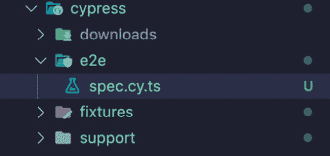

<st c="12310">图 7.12 – 规范文件</st>

<st c="12333">此文件包含以下内容：</st>

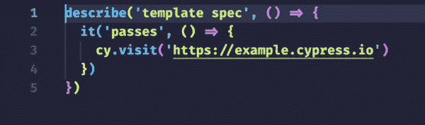

<st c="12470">图 7.13 – 我们的规范文件的源代码](img/B21146_07_13.jpg)

1.  <st c="12516">现在，当你返回到启动端到端测试的浏览器时，你可能会感到惊讶，如图</st> *<st c="12629">图 7</st>**<st c="12637">.14</st>*<st c="12640">：</st>

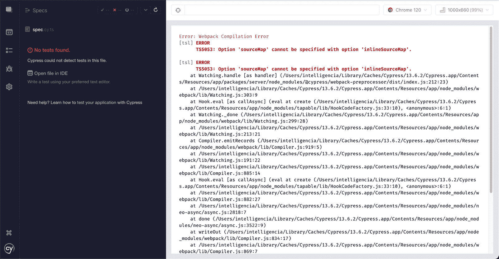

<st c="14793">图 7.14 – 端到端测试因编译错误而失败</st><st c="14849">错误</st>

1.  <st c="14854">要解决这个问题，你只需从你的</st> `<st c="14896">sourceMap: true</st>` <st c="14911">中删除</st> `<st c="14922">tsconfig.json</st>` <st c="14935">文件，</st> <st c="14945">然后你将得到这个：</st>

    ```js
     {
      "compileOnSave": false,
      "compilerOptions": {
        "baseUrl": "./",
        "outDir": "./dist/out-tsc",
        "forceConsistentCasingInFileNames": true,
        "strict": true,
        "noImplicitOverride": true,
        "noPropertyAccessFromIndexSignature": true,
        "noImplicitReturns": true,
        "noFallthroughCasesInSwitch": true,
        "declaration": false,
        "downlevelIteration": true,
        "experimentalDecorators": true,
        "moduleResolution": "node",
        "importHelpers": true,
        "target": "ES2022",
        "module": "ES2022",
        "useDefineForClassFields": false,
        "lib": [
          "ES2022",
          "dom"
        ]
      },
      "angularCompilerOptions": {
        "enableI18nLegacyMessageIdFormat": false,
        "strictInjectionParameters": true,
        "strictInputAccessModifiers": true,
        "strictTemplates": true
      }
    }
    ```

    <st c="15652">正如你所见</st> <st c="15668">现在</st>， <st c="15673">它工作正常：</st>

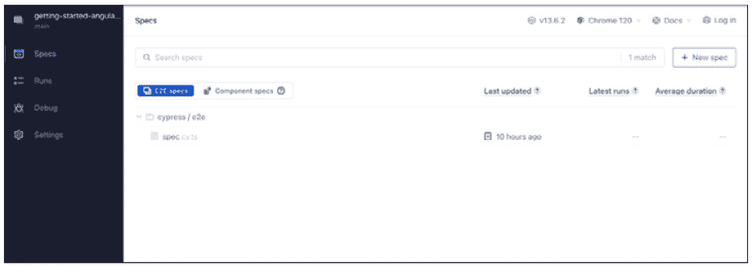

<st c="15684">图 7.15 – 显示所有规范文件的界面</st>

1.  <st c="15741">然后，你可以点击</st> `<st c="15769">spec.cy.ts</st>` <st c="15779">文件，如果一切顺利，你将得到这个：</st>

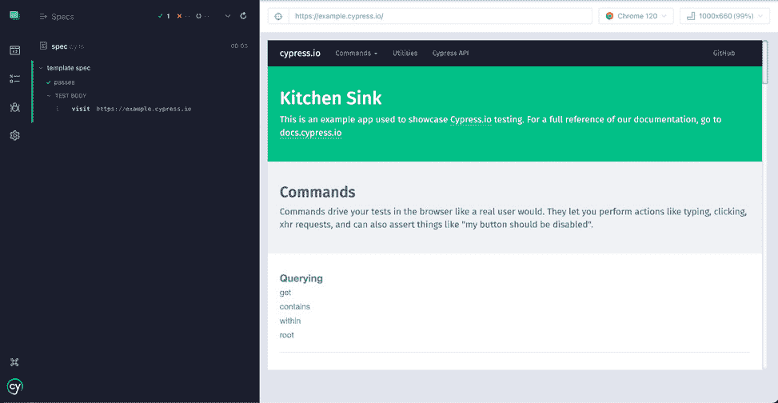

<st c="15946">图 7.16 – 我们端到端测试的成功完成</st>

<st c="16001">恭喜！</st> <st c="16012">你刚刚编写了你的第一个端到端测试！</st> <st c="16053">技术上，我们用 Cypress 的便捷性生成了它。</st> <st c="16099">的。</st>

<st c="16110">现在我们知道了如何编写端到端测试，本章的目标已经实现。</st> <st c="16197">我们将在下一节中总结我们所学到的所有内容。</st>

# <st c="16258">总结</st>

<st c="16266">本章涵盖了发现 Cypress、配置它以及将其应用于编写 E2E 测试的 Angular 项目中的过程。</st> <st c="16384">章节从 Cypress 工具的介绍开始，解释了为什么它是 Angular 社区中最广泛使用的工具，然后展示了如何在 Angular 项目中配置 Cypress，最后逐步教你如何使用 Cypress 在 Angular 中编写第一个 E2E 测试。</st>

<st c="16393">下一章，我们将深入探讨使用 Cypress 在测试驱动开发方法中编写 E2E 测试，同时我们将改进和重构与我们的组件相关的先前测试，并遵循 Cypress 的良好实践。</st> <st c="16675">逐步进行。</st>

<st c="16683">在下一章中，我们将更深入地探讨使用 Cypress 在测试驱动开发方法中编写 E2E 测试，同时我们将改进和重构与我们的组件相关的先前测试，并尊重 Cypress 的良好实践。</st> <st c="16928">。</st>
