# <st c="0">8</st>

# <st c="2">使用 Cypress 编写有效的端到端组件测试</st>

<st c="59">在不断发展的</st> <st c="80">Web 开发世界</st>，**<st c="107">端到端</st>** <st c="117">(</st>**<st c="119">E2E</st>**<st c="122">) 测试在确保 Web 应用程序的可靠性和健壮性方面发挥着至关重要的作用。</st> <st c="218">端到端测试模拟真实世界的用户场景，涵盖应用程序的所有方面，包括用户界面、API、数据库和</st> <st c="355">其他集成。</st>

<st c="374">开发者经常使用的端到端测试工具之一是</st> **<st c="437">Cypress</st>**<st c="444">。Cypress 是一个免费提供的</st> <st c="475">全面的 Web 应用程序测试解决方案，旨在简化并优化开发者的测试工作流程。</st> <st c="617">Cypress 与其他测试框架的区别在于其能够在浏览器中直接执行测试，为开发者提供对正在测试的应用程序的增强控制和洞察。</st> <st c="798">。

<st c="811">在本章中，我们将重点介绍如何使用 Cypress 为计算器应用程序编写有效的端到端测试。我们将探讨 Cypress 的基础知识、测试结构以及一些高级技术。</st> <st c="923">我们的目标是指导开发者编写全面的端到端测试，以有效地验证计算器应用程序的功能，确保它在</st> <st c="1016">不同条件下表现如预期。</st> <st c="1192">。

<st c="1213">总结来说，本章将涵盖以下主要主题：</st> <st c="1275">：</st>

+   <st c="1288">结构化</st> <st c="1301">端到端测试</st>

+   <st c="1310">编写端到端</st> <st c="1323">测试用例</st>

+   <st c="1333">使用 Cypress</st> <st c="1348">自定义命令</st>

# <st c="1363">技术要求</st>

<st c="1386">为了跟随本章中的示例和练习，你需要对 Angular 和 TypeScript 有基本的了解，以及以下</st> <st c="1548">技术要求：</st>

+   <st c="1571">Node.js 和 npm 已安装在你的</st> <st c="1601">计算机上</st>

+   <st c="1614">全局安装的 Angular CLI</st> <st c="1631">。

+   <st c="1649">安装在你的</st> <st c="1706">计算机上的代码编辑器，例如 Visual Studio Code</st>

<st c="1719">本章的代码文件可以在</st> <st c="1761">以下位置找到</st> [<st c="1764">https://github.com/PacktPublishing/Mastering-Angular-Test-Driven-Development/tree/main/Chapter%208</st>](https://github.com/PacktPublishing/Mastering-Angular-Test-Driven-Development/tree/main/Chapter%208)<st c="1862">。</st>

# <st c="1863">端到端测试的结构化</st>

<st c="1885">Cypress 测试使用</st> <st c="1914">t</st><st c="1922">he</st> `<st c="1926">describe(</st><st c="1935">)</st>`<st c="1937">,</st> `<st c="1939">context(</st><st c="1947">)</st>`<st c="1949">,</st> `<st c="1951">it()</st>`<st c="1955">, 和</st> `<st c="1958">specify()</st>` <st c="1971">函数来构建，这些函数是从 Mocha（Mocha 是一个功能丰富的 JavaScript 测试框架，在 Node.js 和浏览器上运行，旨在使异步测试变得简单和愉快。</st> <st c="2168">它因其在前端和后端测试应用中的多功能性而备受推崇，为开发者提供了广泛的好处）。</st> <st c="2321">T</st><st c="2322">he</st> `<st c="2325">describe()</st>` <st c="2335">函数用于组合相关的测试</st><st c="2374">s，</st> `<st c="2378">context()</st>` <st c="2387">类似于</st> `<st c="2399">describe()</st>`<st c="2402">，</st> `<st c="2419">it()</st>` <st c="2423">和</st> `<st c="2428">specify()</st>` <st c="2437">用于编写单个</st> <st c="2467">测试用例。</st>

<st c="2478">我们将围绕我们的计算器应用程序的功能来构建我们的测试。</st> <st c="2570">我们的计算器执行四个操作：</st> *<st c="2611">加法</st>*<st c="2619">,</st> *<st c="2621">减法</st>*<st c="2632">,</st> *<st c="2634">乘法</st>*<st c="2648">, 和</st> *<st c="2654">除法</st>*<st c="2662">。在我们的</st> `<st c="2671">e2e</st>` <st c="2674">文件夹中的</st> `<st c="2689">cypress</st>` <st c="2696">文件夹中，我们将创建一个名为</st> `<st c="2732">calculator.cy.ts</st>` <st c="2748">的文件：</st>

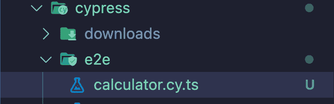

<st c="2805">图 8.1 – Cypress 文件夹中的 e2e 文件夹下的 calculator.cy.ts 文件</st>

<st c="2872">一旦文件创建完成，我们将添加</st> <st c="2916">以下这些代码行，我们将在</st> <st c="2952">稍后解释：</st>

```js
 describe('Calculator Functionality', () => {
context('Addition', () => {
it('adds two positive numbers correctly', () => {
// Test case for addition
});
it('adds two negative numbers correctly', () => {
// Test case for addition
});
});
it('add one positive number and one negative number correctly', () => {
// Test case for addition
});
});
context('Subtraction', () => {
it('subtracts two positive numbers correctly', () => {
// Test case for subtraction
});
it('subtracts two negative numbers correctly', () => {
// Test case for subtraction
});
it('subtracts one positive number and one negative number correctly', () => {
// Test case for subtraction
});
});
});
```

<st c="3637">前面的代码行以一个名为</st> `<st c="3715">Calculator Functionality</st>`<st c="3739">的测试套件的定义开始。</st> **<st c="3743">测试套件</st>** <st c="3753">是一组相关的</st> <st c="3774">测试。</st> <st c="3781">在这种情况下，描述块中包含的所有测试都与计算器的</st> <st c="3879">功能</st>相关联。

<st c="3892">`<st c="3897">上下文</st>`</st> <st c="3904">函数用于将相关的测试组合在一起。</st> <st c="3955">在这里，它将所有与计算器的</st> `<st c="4009">加法</st>` <st c="4017">和</st> `<st c="4022">减法</st>` <st c="4033">功能</st>相关的测试组合在一起。</st>

<st c="4044">“The</st>” <st c="4049">“it</st>” <st c="4051">“function defines</st>” <st c="4068">“an individual test scenario.</st>” <st c="4098">Here, it defines a test case for the addition of two positive numbers or two negative numbers and</st> <st c="4196">“their subtraction.”</st>

<st c="4214">“Now, we’ll add the other operations (namely,”</st> <st c="4260">“Multiplication</st>” <st c="4274">“and”</st> <st c="4279">“Division”</st><st c="4287">“), and we’ll finalize the implementation of our</st> <st c="4336">“test suite:</st>”

```js
 context('Multiplication', () => {
it('multiplies one positive number and zero correctly', () => {
// Test case for multiplication
});
it('multiplies two positive numbers correctly', () => {
// Test case for multiplication
});
it('multiplies two negative numbers correctly', () => {
// Test case for multiplication
});
it('multiplies one positive number and one negative number correctly', () => {
// Test case for multiplication
});
});
context('Division', () => {
it('divides a positive non-zero number by another positive non-zero number', () => {
// Test case for division
});
it('divides a negative non-zero number by another positive non-zero number', () => {
// Test case for division
});
it('divides a negative non-zero number by another negative non-zero number', () => {
// Test case for division
});
it('divides a positive non-zero number by another negative non-zero number', () => {
// Test case for division
});
it('divides a positive non-zero number by zero', () => {
// Test case for division
});
it('divides a negative non-zero number by zero', () => {
// Test case for division
});
it('divide zero by zero', () => {
// Test case for division
});
});
```

<st c="5514">“This code sets up a structure”</st> <st c="5544">“for testing the addition, subtraction, multiplication, and division functionalities of a calculator application.”</st> <st c="5658">“Each operation has its own group of tests, and each test case describes a”</st> <st c="5732">“specific scenario.”</st>

<st c="5750">“In our browser, we have the”</st> <st c="5779">“following result:”</st>

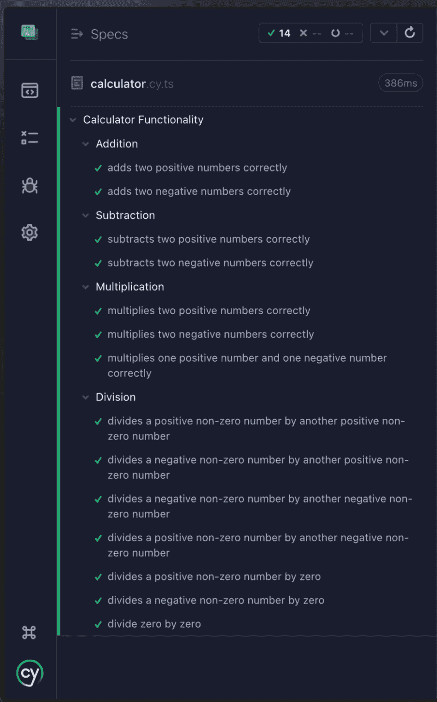

<st c="6656">“Figure 8.2 – Calculator E2E tests succeeded after setting up a structure for testing addition, subtraction, multiplication, and division”</st>

<st c="6792">“The result in the browser proves”</st> <st c="6825">“that our test cases written in the E2E context are without errors.”</st> <st c="6893">“However, we haven’t yet written the corresponding logic in our”</st> <st c="6956">“test cases.”</st>

<st c="6967">“In the next section, we’ll now write the corresponding tests for</st> <st c="7033">“each context.”</st>

# <st c="7046">“Writing test cases”</st>

<st c="7065">“When writing test cases, you should”</st> <st c="7101">“try to cover different scenarios, boundary cases, and potential errors.”</st> <st c="7174">“For a calculator application, you may want to test addition, subtraction, multiplication, and division operations under normal conditions and in borderline cases (such as”</st> *<st c="7345">“division”</st> *<st c="7354">“by zero”</st><st c="7361">“).”</st>

<st c="7364">“Let’s complete our different contexts with our”</st> <st c="7412">“different tests.”</st>

## <st c="7428">“Addition context”</st>

<st c="7445">“In this section, we’ll look at the various E2E test cases related”</st> <st c="7512">“to addition.”</st>

### <st c="7524">“Adds two positive numbers correctly”</st>

<st c="7560">“In this test case, we will”</st> <st c="7587">“see how to write the E2E test to sum two”</st> <st c="7629">“positive numbers:”</st>

```js
 it('adds two positive numbers correctly', () => {
cy.visit('http: //localhost:4200/');
cy.get('input').first().type('5');
cy.get('select').select('+').should('have.value', '+');
cy.get('input').last().type('3');
cy.get('button').click();
cy.get('p').should('have.text', '8');
});
```

<st c="7926">“In the preceding co”</st><st c="7946">“de,”</st> the <st c="7955">“it()”</st> <st c="7959">“function is used to define an individual test case.”</st> <st c="8012">“The first argument is a string describing what the test case is supposed to do.”</st> <st c="8092">“In this case, it is”</st> `<st c="8112">“'adds two positive”</st>` `<st c="8131">“numbers correctly'”</st>`<st c="8149">“.”</st>

<st c="8150">使用</st> `<st c="8155">cy.visit()</st>` <st c="8165">命令来访问一个 URL。</st> <st c="8198">在这里，这是通向我们的计算器用户界面的 URL。</st>

<st c="8263">以下行用于在计算器的第一个输入字段中输入</st> `<st c="8300">'5'</st>` <st c="8303">。</st> <st c="8343">使用</st> `<st c="8347">cy.get()</st>` <st c="8355">函数从 DOM 中获取元素。</st> <st c="8402">然后</st> `<st c="8407">first()</st>` <st c="8418">函数用来获取相应元素集合的第一个元素。</st> <st c="8498">接着</st> `<st c="8503">type()</st>` <st c="8513">命令用来在文本输入字段中输入。</st>

<st c="8562">然后，选择</st> `<st c="8681">'</st><st c="8682">+'</st>`<st c="8684">. 使用</st> `<st c="8690">select()</st>` <st c="8698">命令从下拉菜单中选择一个选项。</st> <st c="8754">然后</st> `<st c="8759">should()</st>` <st c="8771">函数用来对应用程序的状态做出声明。</st>

<st c="8843">以下行用于在计算器的第一个输入字段中输入</st> `<st c="8880">'3'</st>` <st c="8883">。</st> <st c="8923">使用</st> `<st c="8927">cy.get()</st>` <st c="8935">函数来获取 DOM 元素。</st> <st c="8973">然后</st> `<st c="8978">last()</st>` <st c="8988">函数用来获取相应元素集合的最后一个元素。</st> <st c="9072">接着</st> `<st c="9076">type()</st>` <st c="9082">命令用来在文本输入字段中输入。</st>

<st c="9131">然后，点击按钮进行计算。</st> <st c="9186">使用</st> `<st c="9190">click()</st>` <st c="9197">命令来模拟鼠标点击。</st>

<st c="9240">最后，代码的最后一行检查计算结果（</st>`<st c="9315">'8'</st>`<st c="9319">)是否正确显示。</st> <st c="9346">然后</st> `<st c="9350">should()</st>` <st c="9358">函数再次被用来进行这个断言。</st>

<st c="9405">在我们的浏览器中，我们得到</st> <st c="9429">以下结果：</st>

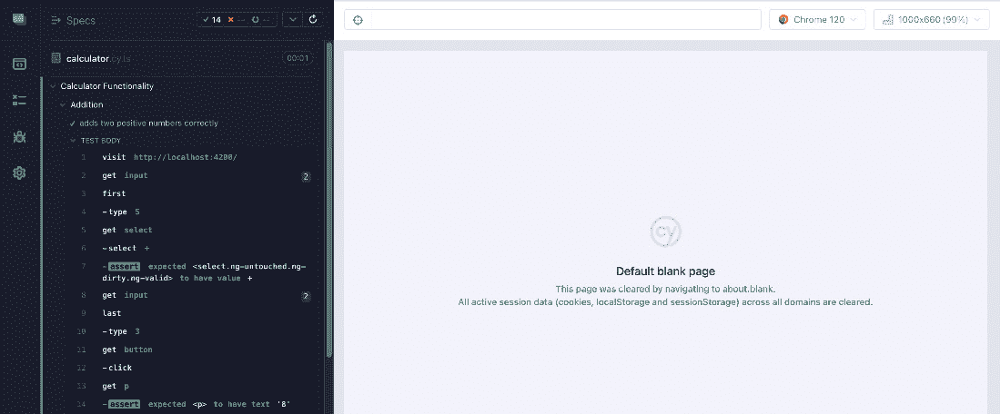

<st c="9660">图</st><st c="9663">8.3 – “正确添加两个正数”的端到端测试成功</st>

<st c="9734">在下一节中，我们将学习如何正确地添加两个</st> <st c="9793">负数。</st>

### <st c="9810">正确地添加两个负数</st>

<st c="9846">在这个测试用例中，我们将看到如何编写添加两个</st> <st c="9881">负数的端到端测试：</st> <st c="9915">负数：</st>

```js
 it('adds two negative numbers correctly', () => {
cy.visit('http: //localhost:4200/');
cy.get('input').first().type('-5');
cy.get('select').select('+').should('have.value', '+');
cy.get('input').last().type('-3');
cy.get('button').click();
cy.get('p').should('have.text', '-8');
});
```

<st c="10215">“</st> `<st c="10220">it()</st>` <st c="10224">”</st> <st c="10220">函数用于定义一个单独的测试用例。</st> <st c="10277">第一个参数是一个字符串，描述测试用例应该做什么。</st> <st c="10357">在这种情况下，它是</st> `<st c="10377">'正确添加两个正数'</st>` `<st c="10396">”</st> <st c="10414">。</st>

<st c="10415">“</st> `<st c="10420">cy.visit()</st>` <st c="10430">”</st> <st c="10420">命令用于访问一个 URL。</st> <st c="10463">在这里，它是通向我们的计算器用户界面的 URL。</st>

<st c="10528">以下行用于在计算器的第一个输入字段中输入</st> `<st c="10565">'-5'</st>` <st c="10569">。</st> <st c="10609">“</st> `<st c="10613">cy.get()</st>` <st c="10621">”</st> <st c="10609">函数用于从 DOM 中获取元素。</st> <st c="10672">“</st> `<st c="10676">first()</st>` <st c="10683">”</st> <st c="10672">函数用于获取相应元素集合的第一个元素。</st> <st c="10768">“</st> `<st c="10772">type()</st>` <st c="10778">”</st> <st c="10768">命令用于在文本输入字段中输入。</st>

<st c="10827">然后，从我们用户界面的下拉菜单中选择</st> `<st c="10845">'+'</st>` <st c="10848">运算符，并检查所选值确实是</st> `<st c="10948">'+'</st>`<st c="10951">。 “</st> `<st c="10957">select()</st>` <st c="10965">”</st> <st c="10957">命令用于从下拉菜单中选择一个选项。</st> <st c="11025">“</st> `<st c="11029">should()</st>` <st c="11037">”</st> <st c="11037">函数用于对应用程序的状态做出声明。</st>

<st c="11109">以下行用于在计算器的第一个输入字段中输入</st> `<st c="11146">'-3'</st>` <st c="11150">。</st> <st c="11190">“</st> `<st c="11194">cy.get()</st>` <st c="11202">”</st> <st c="11190">函数用于获取 DOM 元素。</st> <st c="11245">“</st> `<st c="11249">last()</st>` <st c="11255">”</st> <st c="11245">函数用于获取相应元素集合的最后一个元素。</st> <st c="11333">“</st> `<st c="11343">type()</st>` <st c="11349">”</st> <st c="11333">命令用于在文本输入字段中输入。</st>

<st c="11398">然后点击按钮进行计算。</st> <st c="11452">“</st> `<st c="11456">click()</st>` <st c="11463">”</st> <st c="11494">命令用于模拟鼠标点击。</st>

<st c="11506">最后，代码的最后一行检查计算结果（</st>`<st c="11581">'-8'</st>`<st c="11586">）是否正确显示。</st> <st c="11613">“</st> `<st c="11617">should()</st>` <st c="11625">”</st> <st c="11657">函数再次用于进行此断言。</st>

<st c="11672">在我们的浏览器中，我们有以下结果：</st> <st c="11700">“</st> <st c="11705">以下结果：</st>

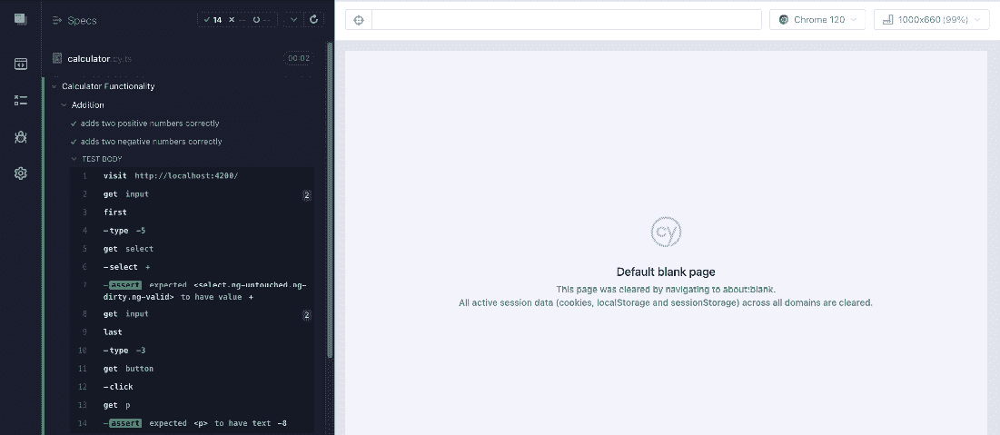

<st c="11963">图 8.4 – “正确地添加两个负数”的端到端测试成功</st>

<st c="12036">在下一节中，我们将学习如何正确地添加一个正数和一个</st> <st c="12119">负数。</st>

### <st c="12135">正确地添加一个正数和一个负数</st>

<st c="12194">在这个测试用例中，我们将看到如何</st> <st c="12229">编写端到端测试来添加一个正数和一个</st> <st c="12287">负数：</st>

```js
 it('adds one positive number and one negative number correctly', () => {
cy.visit('http: //localhost:4200/');
cy.get('input').first().type('5');
cy.get('select').select('+').should('have.value', '+');
cy.get('input').last().type('-3');
cy.get('button').click();
cy.get('p').should('have.text', '2');
});
```

<st c="12607">The</st> `<st c="12612">it()</st>` <st c="12616">函数用于定义一个单独的测试用例。</st> <st c="12669">第一个参数是一个字符串，描述了测试用例应该做什么。</st> <st c="12749">在这种情况下，它是</st> `<st c="12769">'正确地添加两个正数'</st>` `<st c="12788">数字'</st>`<st c="12806">。</st>

<st c="12807">The</st> `<st c="12812">cy.visit()</st>` <st c="12822">命令用于访问一个 URL。</st> <st c="12855">在这里，这是通向我们的计算器</st> <st c="12905">用户界面的 URL。</st>

<st c="12920">以下行用于在计算器的第一个输入字段中输入数字</st> `<st c="12968">'5'</st>` <st c="12971">。</st> <st c="13011">The</st> `<st c="13015">cy.get()</st>` <st c="13023">函数用于从 DOM 中获取元素。</st> <st c="13074">The</st> `<st c="13078">first()</st>` <st c="13085">函数用于获取相应元素集合中的第一个元素。</st> <st c="13169">The</st> `<st c="13173">type()</st>` <st c="13179">命令用于在文本</st> <st c="13216">输入字段中输入。</st>

<st c="13228">然后，从我们的用户界面上方的下拉菜单中选择</st> `<st c="13246">'+'</st>` <st c="13249">运算符，并检查所选值确实是</st> `<st c="13349">'+'</st>`<st c="13352">。 The</st> `<st c="13358">select()</st>` <st c="13366">命令用于从下拉菜单中选择一个选项。</st> <st c="13426">The</st> `<st c="13430">should()</st>` <st c="13438">函数用于对应用程序的状态做出声明。</st>

<st c="13510">以下行用于在计算器的第一个输入字段中输入数字</st> `<st c="13558">'-3'</st>` <st c="13562">。</st> <st c="13602">The</st> `<st c="13606">cy.get()</st>` <st c="13614">函数用于获取 DOM 元素。</st> <st c="13656">The</st> `<st c="13660">last()</st>` <st c="13666">函数用于获取相应元素集合中的最后一个元素。</st> <st c="13749">The</st> `<st c="13753">type()</st>` <st c="13759">命令用于在文本</st> <st c="13796">输入字段中输入。</st>

<st c="13808">然后，点击按钮执行计算。</st> <st c="13863">The</st> `<st c="13867">click()</st>` <st c="13874">命令用于模拟鼠标点击。</st>

<st c="13917">最后，代码的最后一行检查</st> <st c="13955">计算结果（</st>`<st c="13992">'2'</st>`<st c="13996">）是否正确显示。</st> <st c="14023">The</st> `<st c="14027">should()</st>` <st c="14035">函数再次用于做出</st> <st c="14067">这个断言。</st>

<st c="14082">在我们的浏览器中，我们得到以下结果：</st> <st c="14115">以下结果：</st>

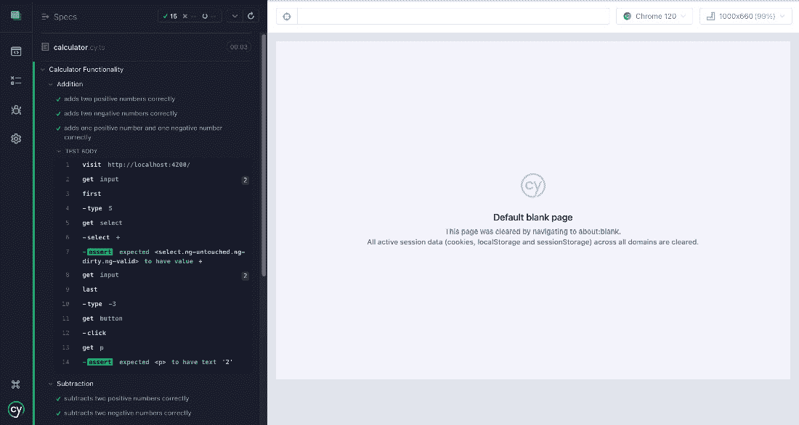

<st c="14342">图 8.5 – “正确地加一个正数和一个负数”的端到端测试成功</st>

<st c="14438">在下一节中，我们将探讨减法的上下文。</st> <st c="14486">subtraction.</st>

## <st c="14501">减法上下文</st>

<st c="14521">在本节中，我们将探讨与减法相关的各种端到端测试用例。</st> <st c="14588">related</st> <st c="14521">to subtraction.</st>

### <st c="14603">正确减去两个正数</st>

<st c="14644">在这个测试用例中，我们将看到如何</st> <st c="14679">编写减去两个正数的端到端测试：</st> <st c="14718">positive numbers:</st>

```js
 it('subtracts two positive numbers correctly', () => {
cy.visit('http: //localhost:4200/');
cy.get('input').first().type('5');
cy.get('select').select('-').should('have.value', '-');
cy.get('input').last().type('3');
cy.get('button').click();
cy.get('p').should('have.text', '2');
});
```

<st c="15020">The</st> `<st c="15025">it()</st>` <st c="15029">函数用于定义一个单独的测试用例。</st> <st c="15082">第一个参数是一个字符串，描述了测试用例应该做什么。</st> <st c="15162">在这种情况下，它是</st> `<st c="15182">'subtracts two positive</st>` `<st c="15206">numbers correctly'</st>`<st c="15224">。</st>

<st c="15225">The</st> `<st c="15230">cy.visit()</st>` <st c="15240">命令用于访问一个 URL。</st> <st c="15273">在这里，这是指向我们计算器用户界面的 URL。</st> <st c="15323">user interface.</st>

<st c="15338">以下行用于在计算器的第一个输入字段中输入数字</st> `<st c="15386">'5'</st>` <st c="15389">。 <st c="15429">The</st> `<st c="15433">cy.get()</st>` <st c="15441">函数用于从 DOM 中获取元素。</st> <st c="15492">The</st> `<st c="15496">first()</st>` <st c="15503">函数用于获取相应元素集合的第一个元素。</st> <st c="15587">The</st> `<st c="15591">type()</st>` <st c="15597">命令用于在文本输入字段中输入。</st> <st c="15634">input field.</st>

<st c="15646">然后，从我们用户界面的下拉菜单中选择</st> `<st c="15664">'-'</st>` <st c="15667">运算符，并检查所选值确实是</st> `<st c="15767">'-'</st>`<st c="15770">。 <st c="15776">select()</st>` <st c="15784">命令用于从下拉菜单中选择一个选项。</st> <st c="15844">The</st> `<st c="15848">should()</st>` <st c="15856">函数用于对应用程序的状态做出声明。</st>

<st c="15928">以下行用于在计算器的第一个输入字段中输入</st> <st c="15965">数字</st> `<st c="15976">'3'</st>` <st c="15979">。</st> <st c="16019">使用</st> `<st c="16023">cy.get()</st>` <st c="16031">函数获取 DOM 元素。</st> <st c="16073">使用</st> `<st c="16077">last()</st>` <st c="16083">函数获取相应元素集合的最后一个元素。</st> <st c="16166">使用</st> `<st c="16170">type()</st>` <st c="16176">命令在文本输入字段中输入。</st>

<st c="16225">然后，点击按钮执行计算。</st> <st c="16280">使用</st> `<st c="16284">click()</st>` <st c="16291">命令模拟鼠标点击。</st>

<st c="16334">最后，代码的最后一行检查计算结果（</st>`<st c="16409">'2'</st>`<st c="16413">）是否正确显示。</st> <st c="16440">再次使用</st> `<st c="16444">should()</st>` <st c="16452">函数来执行这个断言。</st>

<st c="16499">在我们的浏览器中，我们得到以下结果：</st>

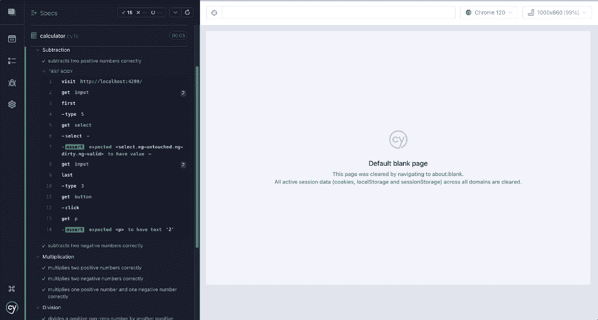

<st c="16759">图 8.6 – “正确减去两个正数”的端到端测试成功</st>

<st c="16837">在下一节中，我们将学习如何正确减去两个</st> <st c="16901">负数。</st>

### <st c="16918">正确减去两个负数</st>

<st c="16959">在这个测试用例中，我们将</st> <st c="16986">了解如何编写减去两个</st> <st c="17033">负数的端到端测试：</st>

```js
 it('subtracts two negative numbers correctly', () => {
cy.visit('http: //localhost:4200/');
cy.get('input').first().type('-5');
cy.get('select').select('-').should('have.value', '-');
cy.get('input').last().type('-3');
cy.get('button').click();
cy.get('p').should('have.text', '-2');
});
```

<st c="17338">在前面的代码中，使用</st> `<st c="17366">it()</st>` <st c="17370">函数定义一个单独的测试用例。</st> <st c="17423">第一个参数是一个字符串，描述测试用例应该做什么。</st> <st c="17503">在这种情况下，它是</st> `<st c="17523">'subtracts two negative</st>` `<st c="17547">numbers correctly'</st>`<st c="17565">。</st>

<st c="17566">使用</st> `<st c="17571">cy.visit()</st>` <st c="17581">命令来访问一个 URL。</st> <st c="17614">在这里，这是通向我们的计算器用户界面的 URL。</st>

<st c="17679">以下行用于在计算器的第一个输入字段中输入数字</st> `<st c="17727">'-5'</st>` <st c="17731">。</st> <st c="17771">使用</st> `<st c="17775">cy.get()</st>` <st c="17783">函数从 DOM 中获取元素。</st> <st c="17834">使用</st> `<st c="17838">first()</st>` <st c="17845">函数获取相应元素集合的第一个元素。</st> <st c="17929">使用</st> `<st c="17933">type()</st>` <st c="17939">命令在文本输入字段中输入。</st>

<st c="17988">然后，从我们用户界面的下拉菜单中选择“</st> `<st c="18006">'-'</st>` <st c="18009">”运算符，并检查所选值确实是</st> `<st c="18109">'-'</st>`<st c="18112">。 “</st> `<st c="18118">select()</st>` <st c="18126">”</st> <st c="18126">命令用于从下拉菜单中选择一个选项。</st> <st c="18186">“</st> `<st c="18190">should()</st>` <st c="18198">”</st> <st c="18198">函数用于对应用程序的状态做出声明。</st>

<st c="18270">以下行用于在计算器的第一个输入字段中输入数字</st> `<st c="18318">'-3'</st>` <st c="18322">。</st> <st c="18362">“</st> `<st c="18366">cy.get()</st>` <st c="18374">”</st> <st c="18374">函数用于获取 DOM 元素。</st> <st c="18416">“</st> `<st c="18420">last()</st>` <st c="18426">”</st> <st c="18426">函数用于获取相应元素集合中的最后一个元素。</st> <st c="18509">“</st> `<st c="18513">type()</st>` <st c="18519">”</st> <st c="18519">命令用于在文本输入字段中输入。</st>

<st c="18568">然后，点击按钮执行计算。</st> <st c="18623">“</st> `<st c="18627">click()</st>` <st c="18634">”</st> <st c="18665">命令用于模拟鼠标点击。</st>

<st c="18677">最后，代码的最后一行检查计算结果（</st>`<st c="18752">'-2'</st>`<st c="18757">）是否正确显示。</st> <st c="18784">“</st> `<st c="18788">should()</st>` <st c="18796">”</st> <st c="18796">函数再次用于进行这个断言。</st>

<st c="18843">在我们的浏览器中，我们得到以下结果：</st> <st c="18871">这是：</st>

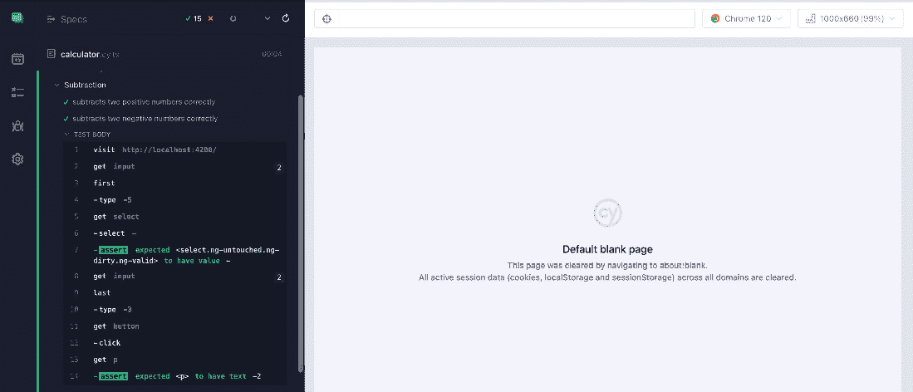

<st c="19071">图 8.7 – “正确减去两个负数”端到端测试成功</st>

<st c="19149">在下一节中，我们将学习如何正确减去一个正数和一个</st> <st c="19237">负数。</st>

### <st c="19253">正确减去一个正数和一个负数</st>

<st c="19317">在这个测试用例中，我们将看到如何</st> <st c="19352">编写减去一个正数和一个</st> <st c="19415">负数的端到端测试：</st>

```js
 it('subtracts one positive number and one negative number correctly', () => {
cy.visit('http: //localhost:4200/');
cy.get('input').first().type('5');
cy.get('select').select('-').should('have.value', '-');
cy.get('input').last().type('-3');
cy.get('button').click();
cy.get('p').should('have.text', '8');
});
```

<st c="19741">“</st> `<st c="19746">it()</st>` <st c="19750">”</st> <st c="19750">函数用于定义一个单独的测试用例。</st> <st c="19803">第一个参数是一个字符串，描述了测试用例应该做什么。</st> <st c="19883">在这种情况下，它是</st> `<st c="19903">'正确减去一个正数和一个负数'</st>` `<st c="19951">”</st> <st c="19968">。</st>

<st c="19969">“</st> `<st c="19974">cy.visit()</st>` <st c="19984">”</st> <st c="19984">命令用于访问一个 URL。</st> <st c="20017">在这里，这是通向我们的计算器用户界面的 URL。</st> <st c="20067">用户界面。</st>

<st c="20082">以下行用于在计算器的第一个输入字段中输入数字</st> `<st c="20130">'5'</st>` <st c="20133">。</st> <st c="20173">然后</st> `<st c="20177">cy.get()</st>` <st c="20185">函数用于从</st> <st c="20227">DOM 中获取元素。</st> <st c="20236">接着</st> `<st c="20240">first()</st>` <st c="20247">函数用于获取相应元素集合中的第一个元素。</st> <st c="20322">此外</st> `<st c="20336">type()</st>` <st c="20342">命令用于在文本输入字段中输入。</st>

<st c="20391">然后，从我们用户界面的下拉菜单中选择</st> `<st c="20409">'-'</st>` <st c="20412">运算符，并检查所选值确实是</st> `<st c="20508">indeed</st>` `<st c="20513">'-'</st>`<st c="20516">。这里</st> `<st c="20522">select()</st>` <st c="20530">命令用于从下拉菜单中选择一个选项。</st> <st c="20591">此外</st> `<st c="20595">should()</st>` <st c="20603">函数用于对应用程序的状态做出声明。</st>

<st c="20675">以下行用于在计算器的第一个输入字段中输入数字</st> `<st c="20723">'-3'</st>` <st c="20727">。</st> <st c="20767">然后</st> `<st c="20771">cy.get()</st>` <st c="20779">函数用于获取 DOM 元素。</st> <st c="20821">接着</st> `<st c="20825">last()</st>` <st c="20831">函数用于获取相应元素集合中的最后一个元素。</st> <st c="20905">此外</st> `<st c="20919">type()</st>` <st c="20925">命令用于在文本输入字段中输入。</st>

<st c="20974">然后，点击按钮执行计算。</st> <st c="21020">这里</st> `<st c="21034">click()</st>` <st c="21041">命令用于模拟鼠标点击。</st>

<st c="21084">最后，代码的最后一行检查计算结果（</st>`<st c="21159">'8'</st>`<st c="21163">）是否正确显示。</st> <st c="21191">这里</st> `<st c="21195">should()</st>` <st c="21203">函数再次用于进行这个断言。</st>

<st c="21250">在我们的浏览器中，我们得到以下结果：</st> <st c="21278">。</st>

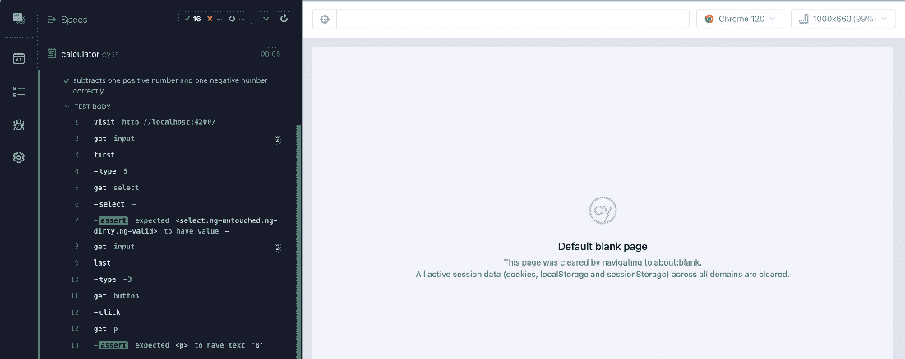

<st c="21522">图 8.8 – “正确减去两个负数”的端到端测试成功</st>

<st c="21600">在下一节中，我们将探讨乘法的</st> <st c="21648">上下文。</st>

## <st c="21666">乘法上下文</st>

<st c="21689">在本节中，我们将探讨与乘法相关的各种端到端测试用例。</st> <st c="21756">。</st>

### <st c="21774">正确地乘以非零数和零</st>

<st c="21820">在这个测试用例中，我们将看到如何编写端到端测试来乘以一个非零数和零：</st>

```js
 it('multiplies non-zero number and zero correctly', () => {
cy.visit('http: //localhost:4200/');
cy.get('input').first().type('5');
cy.get('select').select('*').should('have.value', '*');
cy.get('input').last().type('0');
cy.get('button').click();
cy.get('p').should('have.text', '0');
});
```

<st c="22208">The</st> `<st c="22213">it()</st>` <st c="22217">函数用于定义一个单独的测试用例。</st> <st c="22270">第一个参数是一个字符串，描述了测试用例应该做什么。</st> <st c="22350">在这种情况下，它是</st> `<st c="22370">'乘以非零数和</st>` `<st c="22402">正确地乘以零'</st>`<st c="22417">。</st>

<st c="22418">`The</st> `<st c="22423">cy.visit()</st>` <st c="22433">命令用于访问一个 URL。</st> <st c="22466">这里，它是通向我们的计算器用户界面的 URL。</st>

<st c="22531">以下行用于在计算器的第一个输入字段中输入数字</st> `<st c="22579">'5'</st>` <st c="22582">。</st> <st c="22622">`cy.get()`</st> <st c="22634">函数用于从 DOM 中获取元素。</st> <st c="22675">`first()`</st> <st c="22689">函数用于获取对应元素集合中的第一个元素。</st> <st c="22780">`type()`</st> <st c="22784">命令用于在文本输入字段中输入。</st>

<st c="22839">然后，从我们用户界面的下拉菜单中选择</st> `<st c="22857">'*'</st>` <st c="22860">运算符，并检查所选值是否确实为</st><st c="22955">“*”</st> `<st c="22961">。` <st c="22970">`select()`</st> <st c="22978">命令用于从下拉菜单中选择一个选项。</st> <st c="23039">`should()`</st> <st c="23043">函数用于对应用程序的状态做出声明。</st>

<st c="23123">以下行用于在计算器的第一个输入字段中输入数字</st> `<st c="23171">'0'</st>` <st c="23174">。</st> <st c="23214">`cy.get()`</st> <st c="23218">函数用于获取 DOM 元素。</st> <st c="23268">`last()`</st> <st c="23272">函数用于获取对应元素集合中的最后一个元素。</st> <st c="23361">`type()`</st> <st c="23365">命令用于在文本输入字段中输入。</st>

<st c="23420">然后，点击按钮进行计算。</st> <st c="23465">`click()`</st> <st c="23476">命令用于模拟鼠标点击。</st>

<st c="23530">最后，代码的最后一行检查计算结果（</st>`<st c="23605">'0'</st>`<st c="23609">）是否正确显示。</st> <st c="23637">`<st c="23641">should()</st>`</st> <st c="23649">函数再次用于做出这个断言。</st>

<st c="23696">在我们的浏览器中，我们</st> <st c="23719">有</st> <st c="23725">这个结果：</st>

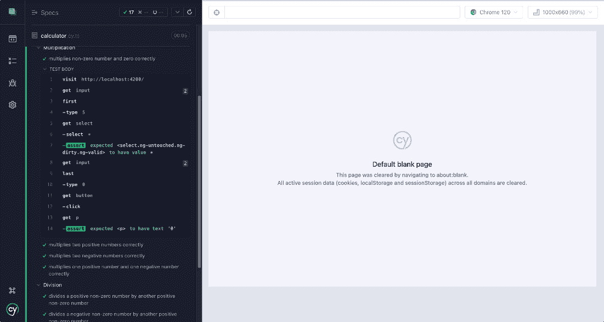

<st c="23986">图 8.9 – “正确乘以非零数和零”端到端测试成功</st>

<st c="24069">在下一节中，我们将学习如何正确地乘以两个</st> <st c="24133">正数。</st>

### <st c="24150">正确乘以两个正数</st>

<st c="24192">在这个测试用例中，我们将看到</st> <st c="24223">如何编写乘以两个</st> <st c="24266">正数的端到端测试：</st>

```js
 it('multiplies two positive numbers correctly', () => {
cy.visit('http: //localhost:4200/');
cy.get('input').first().type('5');
cy.get('select').select('*').should('have.value', '*');
cy.get('input').last().type('3');
cy.get('button').click();
cy.get('p').should('have.text', '15');
});
```

<st c="24570">`<st c="24575">it()</st>`</st> <st c="24579">函数用于定义一个单独的测试用例。</st> <st c="24632">第一个参数是一个字符串，描述了测试用例应该做什么。</st> <st c="24712">在这种情况下，它是`<st c="24732">'multiplies two positive</st>`</st> `<st c="24757">numbers correctly'</st>`<st c="24775">。</st>

<st c="24776">`<st c="24781">cy.visit()</st>`</st> <st c="24791">命令用于访问一个 URL。</st> <st c="24824">在这里，这是通向我们的计算器用户界面的 URL。</st>

<st c="24889">以下行用于在计算器的第一个输入字段中输入数字</st> `<st c="24937">'5'</st>` <st c="24940">。</st> <st c="24980">`<st c="24984">cy.get()</st>`</st> <st c="24992">函数用于从 DOM 中获取元素。</st> <st c="25044">`<st c="25048">first()</st>`</st> <st c="25055">函数用于获取相应元素集合中的第一个元素。</st> <st c="25128">`<st c="25143">type()</st>`</st> <st c="25149">命令用于在文本输入字段中输入。</st>

<st c="25198">然后，从我们的用户界面上面的下拉菜单中选择</st> `<st c="25216">'*'</st>` <st c="25219">运算符，并确认所选的值是</st><st c="25313">确实</st> `<st c="25320">'*'</st>`<st c="25323">。`<st c="25329">select()`</st>` <st c="25337">命令用于从下拉菜单中选择一个选项。</st> `<st c="25398">should()`</st>` <st c="25410">函数用于对应用程序的状态做出声明。</st>

<st c="25482">以下行用于在计算器的第一个输入字段中输入数字</st> `<st c="25515">'3'</st>` <st c="25534">。</st> <st c="25574">“</st> <st c="25578">cy.get()</st>” <st c="25586">函数用于获取 DOM 元素。</st> <st c="25628">“</st> <st c="25632">last()</st>” <st c="25638">函数用于获取相应元素集合中的最后一个元素。</st> <st c="25710">“</st> <st c="25725">type()</st>” <st c="25731">命令用于在文本输入字段中输入。</st>

<st c="25780">然后，点击按钮进行计算。</st><st c="25824">计算</st> <st c="25836">命令用于模拟鼠标点击。</st>

<st c="25890">最后，代码的最后一行检查计算结果（</st>`<st c="25965">'15'</st>`<st c="25970">）是否正确显示。</st> <st c="25986">再次使用</st> <st c="25997">“</st> <st c="26001">should()</st>” <st c="26009">函数来做出这个断言。</st>

<st c="26056">在我们的浏览器中，我们得到以下结果：</st>

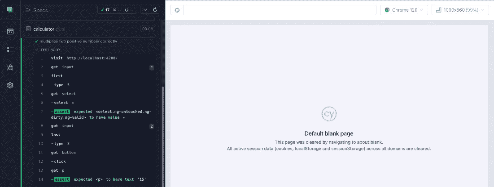

<st c="26303">图 8.10 – “正确乘以两个正数”的端到端测试成功</st>

<st c="26383">在下一节，我们将学习如何正确地乘以两个</st> <st c="26447">负数。</st>

### <st c="26464">正确乘以两个负数</st>

<st c="26506">在这个测试用例中，我们将看到</st> <st c="26537">如何编写乘以两个</st> <st c="26580">负数的端到端测试：</st>

```js
 it('multiplies two negative numbers correctly', () => {
cy.visit('http: //localhost:4200/');
cy.get('input').first().type('-5');
cy.get('select').select('*').should('have.value', '*');
cy.get('input').last().type('-3');
cy.get('button').click();
cy.get('p').should('have.text', '15');
});
```

<st c="26886">“</st><st c="26891">it()</st>” <st c="26895">函数用于定义一个单独的测试用例。</st> <st c="26948">第一个参数是一个字符串，描述了测试用例应该做什么。</st> <st c="27028">在这种情况下，它是</st> `<st c="27048">'正确乘以两个负</st>` `<st c="27073">数'</st>`<st c="27091">。</st>

<st c="27092">“</st> <st c="27097">cy.visit()</st>” <st c="27107">命令用于访问一个 URL。</st> <st c="27140">在这里，这是通向我们的计算器用户界面的 URL。</st>

<st c="27205">以下行用于在计算器的第一个输入字段中输入数字</st> `<st c="27253">'-5'</st>` <st c="27257">。</st> <st c="27297">“</st> <st c="27301">cy.get()</st>” <st c="27309">函数用于从 DOM 中获取元素。</st> <st c="27361">“</st> <st c="27365">first()</st>” <st c="27372">函数用于获取相应元素集合中的第一个元素。</st> <st c="27444">“</st> <st c="27457">type()</st>” <st c="27467">命令用于在文本输入字段中输入。</st>

<st c="27516">然后，从我们的用户界面的下拉菜单中选择</st> `<st c="27534">'*'</st>` <st c="27537">运算符，并检查所选值确实是</st> <st c="27630">`<st c="27637">'*'</st>`<st c="27640">`。</st> `<st c="27646">select()</st>` <st c="27654">命令用于从下拉菜单中选择一个选项。</st> `<st c="27702">` `<st c="27715">` `<st c="27719">should()</st>` <st c="27727">函数用于对应用程序的状态做出声明。</st>

<st c="27799">以下行用于在计算器的第一个输入字段中输入数字</st> `<st c="27847">'-3'</st>` <st c="27851">。</st> <st c="27891">`<st c="27895">cy.get()</st>` <st c="27903">函数用于获取 DOM 元素。</st> <st c="27945">`<st c="27949">last()</st>` <st c="27955">函数用于获取对应元素集合中的最后一个元素。</st> <st c="28026">`<st c="28039">type()</st>` <st c="28049">命令用于向文本输入字段中输入。</st>

<st c="28098">然后，点击按钮执行计算。</st> `<st c="28154">` `<st c="28158">click()</st>` <st c="28165">命令用于模拟鼠标点击。</st>

<st c="28208">最后，代码的最后一行检查计算结果（</st>`<st c="28283">'15'</st>`<st c="28288">）是否正确显示。</st> `<st c="28303">` `<st c="28315">` `<st c="28319">should()</st>` <st c="28327">函数再次用于做出</st> `<st c="28359">这个断言。</st>

<st c="28374">在我们的浏览器中，我们得到</st> <st c="28402">以下结果：</st>

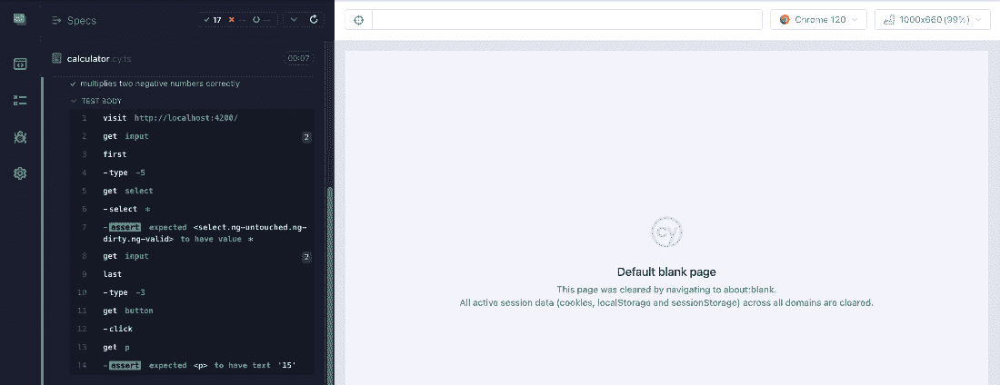

<st c="28601">图 8.11 – “正确乘以两个负数”的端到端测试成功</st>

<st c="28681">在下一节中，我们将学习如何正确地乘以一个正数和一个</st> <st c="28769">负数。</st>

### <st c="28785">正确乘以一个正数和一个负数</st>

<st c="28850">在这个测试用例中，我们将看到如何</st> <st c="28885">编写乘以一个正数和一个</st> <st c="28948">负数的端到端测试：</st>

```js
 it('multiplies one positive number and one negative number correctly', () => {
cy.visit('http: //localhost:4200/');
cy.get('input').first().type('5');
cy.get('select').select('*').should('have.value', '*');
cy.get('input').last().type('-3');
cy.get('button').click();
cy.get('p').should('have.text', '-15');
});
```

<st c="29276">`<st c="29281">it()</st>` <st c="29285">函数用于定义一个单独的测试用例。</st> `<st c="29338">第一个参数是一个字符串，描述了测试用例应该做什么。</st> `<st c="29418">在这种情况下，它是</st> `<st c="29438">'multiplies one positive number and one negative</st>` `<st c="29487">number correctly'</st>`<st c="29504">`。</st>

<st c="29505">`<st c="29510">cy.visit()</st>` <st c="29520">命令用于访问一个 URL。</st> `<st c="29553">` 这里是通向我们的计算器用户界面的 URL。</st>

<st c="29618">以下行用于输入数字</st> `<st c="29666">'5'</st>` <st c="29669">在计算器的第一个输入字段中。</st> <st c="29709">使用</st> `<st c="29713">cy.get()</st>` <st c="29721">函数从 DOM 中获取元素。</st> <st c="29773">使用</st> `<st c="29777">first()</st>` <st c="29784">函数来获取对应元素集合中的第一个元素。</st> <st c="29855">使用</st> `<st c="29873">type()</st>` <st c="29879">命令来在文本输入字段中输入。</st>

<st c="29928">然后，从我们的用户界面上方的下拉菜单中选择</st> `<st c="29946">'*'</st>` <st c="29949">运算符，并检查所选值确实是</st> `<st c="30041">indeed</st>` `<st c="30049">'*'</st>`<st c="30052">。使用</st> `<st c="30058">select()</st>` <st c="30066">命令从下拉菜单中选择一个选项。</st> <st c="30113">使用</st> `<st c="30131">should()</st>` <st c="30139">函数对应用程序的状态做出声明。</st>

<st c="30211">以下行用于输入数字</st> `<st c="30259">'-3'</st>` <st c="30263">在计算器的第一个输入字段中。</st> <st c="30303">使用</st> `<st c="30307">cy.get()</st>` <st c="30315">函数来获取 DOM 元素。</st> <st c="30357">使用</st> `<st c="30361">last()</st>` <st c="30367">函数来获取对应元素集合中的最后一个元素。</st> <st c="30437">使用</st> `<st c="30455">type()</st>` <st c="30461">命令来在文本输入字段中输入。</st>

<st c="30510">然后，点击按钮执行</st> <st c="30552">计算。</st> <st c="30565">使用</st> `<st c="30569">click()</st>` <st c="30576">命令来模拟鼠标点击。</st>

<st c="30619">最后，代码的最后一行检查计算结果（</st>`<st c="30694">'-15'</st>`<st c="30700">）是否正确显示。</st> <st c="30713">再次使用</st> `<st c="30732">should()</st>` <st c="30740">函数来制作</st> <st c="30772">这个断言。</st>

<st c="30787">在我们的浏览器中，我们有</st> <st c="30816">以下结果：</st>

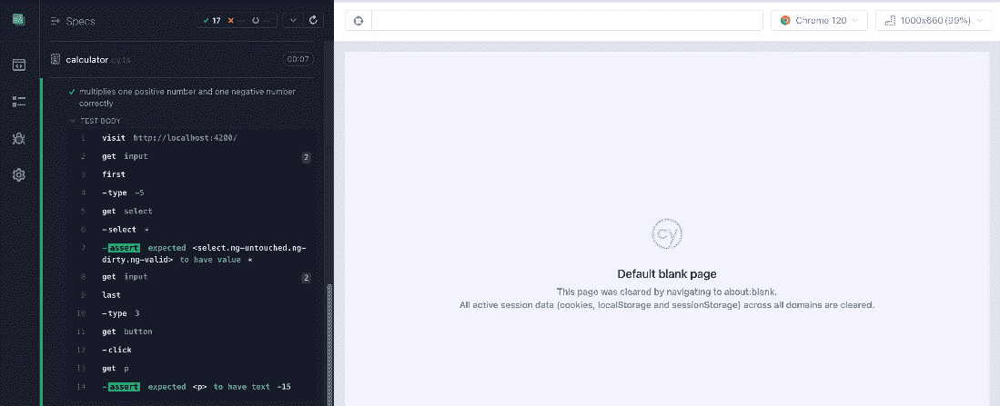

<st c="31044">图 8.12 – “正确地乘以一个正数和一个负数”的端到端测试成功</st>

<st c="31147">在下一节中，我们将查看除法的上下文。</st> <st c="31195">。

# <st c="31207">除法上下文</st>

<st c="31224">在本节中，我们将查看与除法相关的各种端到端测试用例。</st>

### <st c="31303">将一个正非零数除以另一个正非零数</st>

<st c="31374">在这个测试用例中，我们将看到如何编写</st> <st c="31418">端到端测试来除以另一个正非零数：</st> <st c="31489">非零数：</st>

```js
 it('divides a positive non-zero number by another positive non-zero number', () => {
      cy.visit('http: //localhost:4200/');
      cy.get('input').first().type('5');
      cy.get('select').select('/').should('have.value', '/');
      cy.get('input').last().type('2');
      cy.get('button').click();
      cy.get('p').should('have.text', '2.5');
    });
```

<st c="31822">The</st> `<st c="31827">it()</st>` <st c="31831">函数用于定义一个单独的测试用例。</st> <st c="31884">第一个参数是一个字符串，描述了测试用例应该做什么。</st> <st c="31964">在这种情况下，它是</st> `<st c="31984">'divides a positive non-zero number by another positive</st>` `<st c="32040">non-zero number'</st>`<st c="32056">。</st>

<st c="32057">The</st> `<st c="32062">cy.visit()</st>` <st c="32072">命令用于访问一个 URL。</st> <st c="32105">在这里，这是指向我们计算器用户界面的 URL。</st> <st c="32155">用户界面。</st>

<st c="32170">以下行用于在计算器的第一个输入字段中输入数字</st> `<st c="32218">'5'</st>` <st c="32221">。</st> <st c="32261">The</st> `<st c="32265">cy.get()</st>` <st c="32273">函数用于从 DOM 中获取元素。</st> <st c="32324">The</st> `<st c="32328">first()</st>` <st c="32335">函数用于获取对应元素集合中的第一个元素。</st> <st c="32419">The</st> `<st c="32423">type()</st>` <st c="32429">命令用于在文本输入字段中输入。</st>

<st c="32478">然后，从我们用户界面的下拉菜单中选择</st> `<st c="32496">'/'</st>` <st c="32499">运算符，并检查所选值确实是</st> `<st c="32599">'/'</st>`<st c="32602">。 The</st> `<st c="32608">select()</st>` <st c="32616">命令用于从下拉菜单中选择一个选项。</st> <st c="32676">The</st> `<st c="32680">should()</st>` <st c="32688">函数用于对应用程序的状态做出声明。</st>

<st c="32760">以下行用于在计算器的第一个输入字段中输入数字</st> `<st c="32808">'2'</st>` <st c="32811">。</st> <st c="32851">The</st> `<st c="32855">cy.get()</st>` <st c="32863">函数用于获取 DOM 元素。</st> <st c="32905">The</st> `<st c="32909">last()</st>` <st c="32915">函数用于获取对应元素集合中的最后一个元素。</st> <st c="32998">The</st> `<st c="33002">type()</st>` <st c="33008">命令用于在文本输入字段中输入。</st>

<st c="33057">然后，点击按钮进行计算。</st> <st c="33112">The</st> `<st c="33116">click()</st>` <st c="33123">命令用于模拟鼠标点击。</st>

<st c="33166">最后，代码的最后一行检查计算结果（</st>`<st c="33241">'2.5'</st>`<st c="33247">）是否正确显示。</st> <st c="33274">The</st> `<st c="33278">should()</st>` <st c="33286">函数再次用于创建</st> <st c="33318">这个断言。</st>

`<st c="33333">在我们的浏览器中，我们有</st>` `<st c="33362">以下结果：</st>`

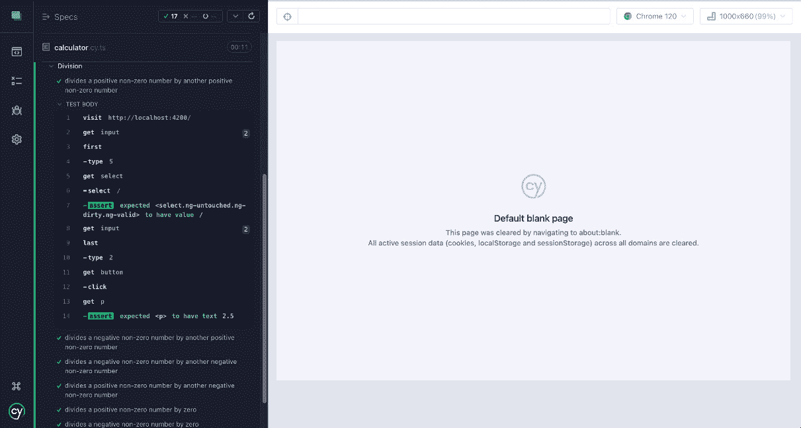

`<st c="33617">图 8.13 – “将一个正非零数除以另一个正非零数”的端到端测试成功</st>`

`<st c="33617">在下一节中，我们将查看将非零负数除以非零正数的测试用例。</st>`

### `<st c="33846">将一个负非零数除以一个正非零数</st>`

`<st c="33911">在这个测试用例中，我们将看到如何</st>` `<st c="33946">编写将一个负非零数除以另一个正非零数的端到端测试：</st>`

```js
 it('divides a negative non-zero number by another positive non-zero number', () => {
      cy.visit('http: //localhost:4200/');
      cy.get('input').first().type('-5');
      cy.get('select').select('/').should('have.value', '/');
      cy.get('input').last().type('2');    cy.get('button').click();
      cy.get('p').should('have.text', '-2.5');
    });
```

`<st c="33726">The</st>` `<st c="33731">it()</st>` `<st c="33735">函数用于定义一个单独的测试用例。</st>` `<st c="33806">第一个参数是一个字符串，描述了测试用例应该做什么。</st>` `<st c="33878">在这种情况下，它是</st>` `<st c="33898">'divides a negative non-zero number by another positive'</st>` `<st c="33964">non-zero number'</st>` `<st c="33980">。</st>`

`<st c="34596">The</st>` `<st c="34601">cy.visit()</st>` `<st c="34611">命令用于访问一个 URL。</st>` `<st c="34644">在这里，它是通向我们的计算器用户界面的 URL。</st>` `<st c="34694">用户界面。</st>`

`<st c="34709">以下行用于在计算器的第一个输入字段中输入数字</st>` `<st c="34757">'-5'</st>` `<st c="34761">。</st>` `<st c="34801">The</st>` `<st c="34805">cy.get()</st>` `<st c="34813">函数用于从 DOM 获取元素。</st>` `<st c="34864">The</st>` `<st c="34868">first()</st>` `<st c="34875">函数用于获取相应元素集合中的第一个元素。</st>` `<st c="34958">The</st>` `<st c="34962">type()</st>` `<st c="34968">命令用于在文本输入字段中输入。</st>`

`<st c="35018">然后，从我们的用户界面的下拉菜单中选择</st>` `<st c="35034">'/'</st>` `<st c="35037">运算符，并检查所选值确实是</st>` `<st c="35127">'/'</st>` `<st c="35130">。</st>` `<st c="35134">The</st>` `<st c="35140">select()</st>` `<st c="35148">命令用于从下拉菜单中选择一个选项。</st>` `<st c="35208">The</st>` `<st c="35212">should()</st>` `<st c="35220">函数用于对应用程序的状态做出声明。</st>`

`<st c="35286">以下行用于在计算器的第一个输入字段中输入数字</st>` `<st c="35334">'2'</st>` `<st c="35337">。</st>` `<st c="35377">The</st>` `<st c="35381">cy.get()</st>` `<st c="35389">函数用于获取 DOM 元素。</st>` `<st c="35431">The</st>` `<st c="35435">last()</st>` `<st c="35443">函数用于获取相应元素集合中的最后一个元素。</st>` `<st c="35524">The</st>` `<st c="35528">type()</st>` `<st c="35534">命令用于在文本输入字段中输入。</st>`

<st c="35597">然后，点击按钮执行计算。</st> `<st c="35652">` `<st c="35656">click()</st>` <st c="35663">命令用于模拟鼠标点击。</st>

最后，代码的最后一行检查计算结果（</st>`<st c="35781">'-2.5'</st>`<st c="35788">）是否正确显示</st> <st c="35804">。</st> <st c="35815">然后</st> `<st c="35819">should()</st>` <st c="35827">函数再次被用来进行这个断言。</st>

<st c="35874">在我们的浏览器中，我们得到以下结果：</st> <st c="35903">。</st>

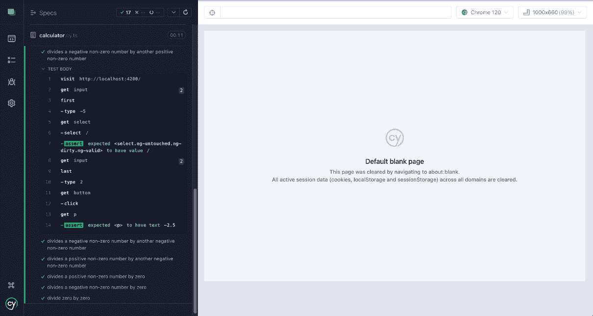

<st c="36118">图 8.14 – “将一个负的非零数除以另一个正的非零数”的端到端测试成功</st>

<st c="36227">在下一节中，我们将查看将非零负数除以另一个非零负数的测试用例。</st>

### <st c="36353">将一个负的非零数除以另一个负的非零数</st>

<st c="36424">在这个测试用例中，我们将看到如何编写一个端到端测试来将一个负的非零数除以另一个负的非零数：</st>

```js
 it('divides a negative non-zero number by another negative non-zero number', () => {
      cy.visit('http: //localhost:4200/');
      cy.get('input').first().type('-5');
      cy.get('select').select('/').should('have.value', '/');
      cy.get('input').last().type('-2');
      cy.get('button').click();
      cy.get('p').should('have.text', '2.5');
    });
```

<st c="36874">`<st c="36879">it()</st>` <st c="36883">函数用于定义一个单独的测试用例。</st> `<st c="36936">第一个参数是一个字符串，描述了测试用例应该做什么。</st> `<st c="37016">在这种情况下，它是`<st c="37036">'divides a negative non-zero number by another negative</st>` `<st c="37092">non-zero number'</st>`<st c="37108">。</st>

<st c="37109">`<st c="37114">cy.visit()</st>` <st c="37124">命令用于访问一个 URL。</st> <st c="37157">在这里，这是指向我们计算器用户界面的 URL。</st> <st c="37207">。</st>

<st c="37222">以下行用于在计算器的第一个输入字段中输入数字`<st c="37270">'-5'</st>` <st c="37274">。</st> <st c="37314">`<st c="37318">cy.get()</st>` <st c="37326">函数用于从 DOM 中获取元素。</st> <st c="37377">`<st c="37381">first()</st>` <st c="37388">函数用于获取相应元素集合的第一个元素。</st> <st c="37472">`<st c="37476">type()</st>` <st c="37482">命令用于在文本输入字段中输入。</st>

<st c="37531">然后，从用户界面的下拉菜单中选择`<st c="37549">'/'</st>` <st c="37552">运算符，并检查所选的值确实是`<st c="37652">'/'</st>`<st c="37655">。</st> `<st c="37661">select()</st>` <st c="37669">命令用于从下拉菜单中选择一个选项。</st> <st c="37729">`<st c="37733">should()</st>` <st c="37741">函数用于对应用程序的状态做出声明。</st>

<st c="37813">以下行用于在计算器的第一个输入字段中输入数字</st> `<st c="37861">'-2'</st>` <st c="37865">。</st> <st c="37905">`<st c="37909">cy.get()</st>` <st c="37917">函数用于获取 DOM 元素。</st> <st c="37959">`<st c="37963">last()</st>` <st c="37969">函数用于获取相应元素集合中的最后一个元素。</st> `<st c="38052">`<st c="38056">type()</st>` <st c="38062">命令用于在文本输入字段中输入。</st>

<st c="38111">然后，点击</st> <st c="38137">按钮进行计算。</st> <st c="38166">点击</st> `<st c="38170">click()</st>` <st c="38177">命令用于模拟鼠标点击。</st>

<st c="38220">最后，代码的最后一行检查计算结果（</st>`<st c="38295">'2.5'</st>`<st c="38301">）是否正确显示。</st> <st c="38328">`<st c="38332">should()</st>` <st c="38340">函数再次用于进行这个断言。</st>

<st c="38387">在我们的浏览器中，我们有</st> <st c="38416">这个结果：</st>

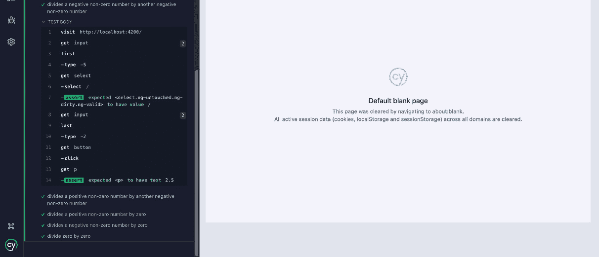

<st c="38740">图 8.15 – “将一个负非零数除以另一个负非零数”的端到端测试成功</st>

<st c="38849">在下一节中，我们将查看将非零正数除以非零负数的测试用例。</st>

### <st c="38969">将一个正非零数除以一个负非零数</st>

<st c="39034">在这个测试用例中，我们将看到如何编写将正非零数除以另一个负非零数的端到端测试：</st>

```js
 it('divides a positive non-zero number by another negative non-zero number', () => {
      cy.visit('http: //localhost:4200/');
      cy.get('input').first().type('5');
      cy.get('select').select('/').should('have.value', '/');
      cy.get('input').last().type('-2');
      cy.get('button').click();
      cy.get('p').should('have.text', '-2.5');
    });
```

<st c="39484">`<st c="39489">it()</st>` <st c="39493">函数用于定义一个单独的测试用例。</st> <st c="39546">第一个参数是一个字符串，描述了测试用例应该做什么。</st> <st c="39626">在这种情况下，它是</st> `<st c="39646">'将一个正非零数除以另一个负非零数'</st>` `<st c="39702">。</st>

<st c="39719">`<st c="39724">cy.visit()</st>` <st c="39734">命令用于访问 URL。</st> <st c="39767">在这里，这是通向我们的计算器用户界面的 URL。</st>

<st c="39832">以下行用于在计算器的第一个输入字段中输入数字</st> `<st c="39880">'5'</st>` <st c="39883">。</st> <st c="39923">然后</st> `<st c="39927">cy.get()</st>` <st c="39935">函数用于从 DOM 中获取元素。</st> <st c="39986">然后</st> `<st c="39990">first()</st>` <st c="39997">函数用于获取相应元素集合的第一个元素。</st> <st c="40081">然后</st> `<st c="40085">type()</st>` <st c="40091">命令用于在文本输入字段中输入。</st>

<st c="40140">然后，从用户界面的*<st c="40180">下拉菜单</st>* <st c="40194">中选择</st> `<st c="40158">'/'</st>` <st c="40161">运算符，并检查所选值确实是</st> `<st c="40261">'/'</st>`<st c="40264">。然后</st> `<st c="40270">select()</st>` <st c="40278">命令用于从下拉菜单中选择一个选项。</st> <st c="40338">然后</st> `<st c="40342">should()</st>` <st c="40350">函数用于对应用程序的状态做出声明。</st>

<st c="40422">以下行用于在计算器的第一个输入字段中输入数字</st> `<st c="40470">'-2'</st>` <st c="40474">。</st> <st c="40514">然后</st> `<st c="40518">cy.get()</st>` <st c="40526">函数用于获取 DOM 元素。</st> <st c="40568">然后</st> `<st c="40572">last()</st>` <st c="40578">函数用于获取相应元素集合的最后一个元素。</st> <st c="40661">然后</st> `<st c="40665">type()</st>` <st c="40671">命令用于在文本输入字段中输入。</st>

<st c="40720">然后，点击按钮进行计算。</st> <st c="40775">然后</st> `<st c="40779">click()</st>` <st c="40786">命令用于模拟鼠标点击。</st>

<st c="40829">最后，代码的最后一行检查计算结果（</st>`<st c="40904">'-2.5'</st>`<st c="40911">）是否正确显示。</st> <st c="40938">然后</st> `<st c="40942">should()</st>` <st c="40950">函数再次用于进行此断言。</st>

<st c="40997">在我们的浏览器中，我们得到以下结果：</st>

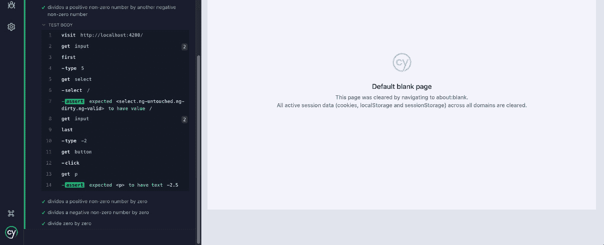

<st c="41334">图 8.16 – “将一个正非零数除以另一个负非零数”的端到端测试成功</st>

<st c="41443">在下一节中，我们将查看除以零的非零正数的测试用例。</st>

### <st c="41541">将一个正非零数除以零</st>

<st c="41584">在这个测试用例中，我们将看到如何编写端到端测试来除以一个正非零数</st> <st c="41619">并除以零：</st>

```js
 it('divides a positive non-zero number by zero', () => {
      cy.visit('http: //localhost:4200/');
      cy.get('input').first().type('5');
      cy.get('select').select('/').should('have.value', '/');
      cy.get('input').last().type('0');
      cy.get('button').click();
      cy.get('p').should('have.text', 'Infinity');
    });
```

<st c="41981">The</st> `<st c="41986">it()</st>` <st c="41990">函数用于定义一个单独的测试用例。</st> <st c="42043">第一个参数是一个字符串，描述了测试用例应该做什么。</st> <st c="42123">在这种情况下，它是</st> `<st c="42143">'将一个正非零数除以零'</st>` `<st c="42179">。</st>

<st c="42188">`<st c="42193">cy.visit()</st>` <st c="42203">命令用于访问一个 URL。</st> `<st c="42236">`这里，它是通向我们的计算器用户界面的 URL。</st>

<st c="42301">下一行用于在计算器的第一个输入字段中输入数字</st> `<st c="42349">'5'</st>` <st c="42352">。</st> `<st c="42392">`<st c="42396">cy.get()</st>` <st c="42404">函数用于从 DOM 中获取元素。</st> `<st c="42455">`<st c="42459">first()</st>` <st c="42466">函数用于获取相应元素集合中的第一个元素。</st> `<st c="42550">`<st c="42554">type()</st>` <st c="42560">命令用于在文本输入字段中输入。</st>

<st c="42609">然后，从我们的用户界面上面的下拉菜单中选择</st> `<st c="42627">'/'</st>` <st c="42630">运算符，并检查所选值确实是</st> `<st c="42730">'/'</st>`<st c="42733">。`<st c="42739">select()</st>` <st c="42747">命令用于从下拉菜单中选择一个选项。</st> `<st c="42807">`<st c="42811">should()</st>` <st c="42819">函数用于对应用程序的状态做出声明。</st>

<st c="42891">下一行用于在计算器的第一个输入字段中输入数字</st> `<st c="42939">'0'</st>` <st c="42942">。</st> <st c="42982">`<st c="42986">cy.get()</st>` <st c="42994">函数用于获取 DOM 元素。</st> `<st c="43036">`<st c="43040">last()</st>` <st c="43046">函数用于获取相应元素集合中的最后一个元素。</st> `<st c="43129">`<st c="43133">type()</st>` <st c="43139">命令用于在文本输入字段中输入。</st>

<st c="43188">然后，点击按钮执行计算。</st> `<st c="43243">`<st c="43247">click()</st>` <st c="43254">命令用于模拟鼠标点击。</st>

<st c="43297">最后，代码的最后一行检查计算结果（</st>`<st c="43372">'Infinity'</st>`<st c="43383">）是否正确显示。</st> `<st c="43410">`<st c="43414">should()</st>` <st c="43422">函数再次用于做出</st> `<st c="43454">这个断言。</st>`

<st c="43469">在我们的浏览器中，我们有</st> `<st c="43497">这个结果：</st>`

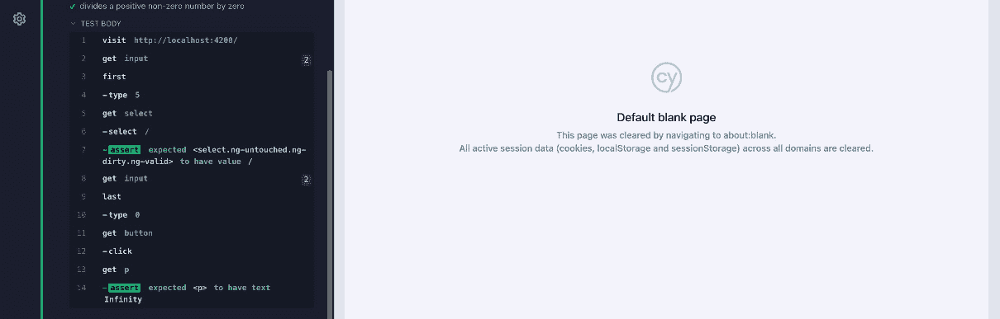

<st c="43720">图 8.17 – “将一个正非零数除以零”端到端测试成功</st>

<st c="43801">在下一节中，我们将查看除以非零负数除以零的测试用例。</st> <st c="43891">除以零。</st>

### <st c="43899">除以一个负的非零数除以零</st>

在这个测试用例中，我们将看到如何<st c="43942">编写端到端测试来除以一个负的非零数</st> <st c="43977">除以零：</st>

```js
 it('divides a negative non-zero number by zero', () => {
      cy.visit('http: //localhost:4200/');
      cy.get('input').first().type('-5');
      cy.get('select').select('/').should('have.value', '/');
      cy.get('input').last().type('0');
      cy.get('button').click();
      cy.get('p').should('have.text', '-Infinity');
    });
```

<st c="44341">The</st> `<st c="44346">it()</st>` <st c="44350">函数用于定义一个单独的测试用例。</st> <st c="44403">第一个参数是一个字符串，描述了测试用例应该做什么。</st> <st c="44483">在这种情况下，它是</st> `<st c="44503">'除以一个负的非零数</st>` `<st c="44539">除以零'</st>`<st c="44547">。</st>

<st c="44548">The</st> `<st c="44553">cy.visit()</st>` <st c="44563">命令用于访问一个 URL。</st> `<st c="44596">Here, it’s the URL that leads to our calculator’s</st>` `<st c="44646">用户界面。</st>`

<st c="44661">以下行用于在计算器的第一个输入字段中输入数字</st> `<st c="44709">'-5'</st>` <st c="44713">。</st> `<st c="44753">The</st>` `<st c="44757">cy.get()</st>` <st c="44765">函数用于从 DOM 中获取元素。</st> `<st c="44816">The</st>` `<st c="44820">first()</st>` <st c="44827">函数用于获取相应元素集合的第一个元素。</st> `<st c="44911">The</st>` `<st c="44915">type()</st>` <st c="44921">命令用于在文本</st> `<st c="44958">输入字段</st>` 中输入。

<st c="44970">然后，从我们的用户界面上面的下拉菜单中选择“/”</st> <st c="44988">'/'</st> <st c="44991">运算符，并检查所选的值确实是</st> `<st c="45091">'/'</st>`<st c="45094">。`<st c="45100">select()</st>` <st c="45108">命令用于从下拉菜单中选择一个选项。</st> `<st c="45168">The</st>` `<st c="45172">should()</st>` <st c="45180">函数用于对应用程序的状态做出声明。</st>

<st c="45252">以下行用于在计算器的第一个输入字段中输入数字</st> `<st c="45300">'0'</st>` <st c="45303">。</st> `<st c="45343">The</st>` `<st c="45347">cy.get()</st>` <st c="45355">函数用于获取 DOM 元素。</st> `<st c="45397">The</st>` `<st c="45401">last()</st>` <st c="45407">函数用于获取相应元素集合的最后一个元素。</st> `<st c="45490">The</st>` `<st c="45494">type()</st>` <st c="45500">命令用于在文本</st> `<st c="45537">输入字段</st>` 中输入。

<st c="45549">然后，点击按钮执行计算。</st> `<st c="45604">The</st>` `<st c="45608">click()</st>` <st c="45615">命令用于模拟鼠标点击。</st>

<st c="45658">最后，代码的最后一行检查计算结果（</st>`<st c="45733">'-Infinity'</st>`<st c="45745">）是否正确显示。</st> <st c="45772">这里</st> `<st c="45776">should()</st>` <st c="45784">函数再次被用来进行</st> <st c="45816">这个断言。</st>

<st c="45831">在我们的浏览器中，我们有</st> <st c="45859">这个结果：</st>

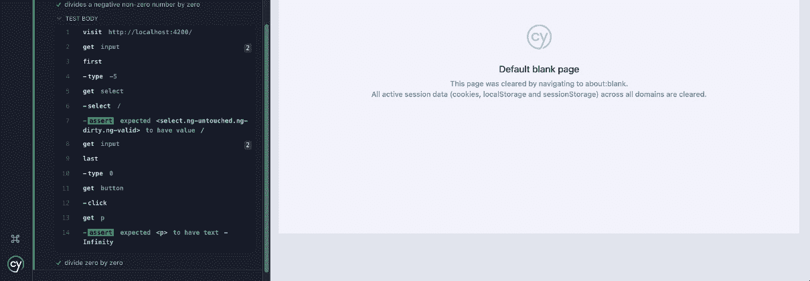

<st c="46193">图 8.18 - 负非零数除以零端到端测试成功</st>

<st c="46274">在下一节中，我们将查看除以零的非零负数的测试用例。</st> <st c="46364">。</st>

### <st c="46372">零除以零</st>

<st c="46393">在这个测试用例中，我们将看到如何编写除以零的端到端测试：</st> <st c="46425">。</st> <st c="46466">。</st>

```js
 it('divide zero by zero', () => {
      cy.visit('http: //localhost:4200/');
      cy.get('input').first().type('0');
      cy.get('select').select('/').should('have.value', '/');
      cy.get('input').last().type('0');
      cy.get('button').click();
      cy.get('p').should('have.text', 'NaN');
});
```

<st c="46740">这里使用</st> `<st c="46745">it()</st>` <st c="46749">函数来定义一个单独的测试用例。</st> <st c="46802">第一个参数是一个字符串，描述了测试用例应该做什么。</st> <st c="46882">在这种情况下，它是</st> `<st c="46902">'divide zero</st>` `<st c="46915">by zero'</st>`<st c="46923">。</st>

<st c="46924">这里使用</st> `<st c="46929">cy.visit()</st>` <st c="46939">命令来访问一个 URL。</st> <st c="46972">在这里，这是通向我们的计算器用户界面的 URL。</st>

<st c="47037">以下行用于在计算器的第一个输入字段中输入数字</st> `<st c="47085">'0'</st>` <st c="47088">。</st> <st c="47128">这里使用</st> `<st c="47132">cy.get()</st>` <st c="47140">函数从 DOM 中获取元素。</st> <st c="47191">这里使用</st> `<st c="47195">first()</st>` <st c="47202">函数来获取相应元素集合的第一个元素。</st> <st c="47286">这里使用</st> `<st c="47290">type()</st>` <st c="47296">命令在文本输入字段中输入。</st>

<st c="47345">然后，从我们的用户界面上方的下拉菜单中选择</st> `<st c="47363">'/'</st>` <st c="47366">运算符，并检查所选的值确实是</st> `<st c="47466">'/'</st>`<st c="47469">。这里使用</st> `<st c="47475">select()</st>` <st c="47483">命令从下拉菜单中选择一个选项。</st> <st c="47543">这里使用</st> `<st c="47547">should()</st>` <st c="47555">函数来对应用程序的状态做出声明。</st> <st c="47611">。</st>

`<st c="47627">以下行用于在计算器的第一个输入字段中输入数字` `<st c="47675">'0'</st>` `<st c="47678">。</st>` `<st c="47722">cy.get()</st>` `<st c="47730">函数用于获取 DOM 元素。</st>` `<st c="47776">last()</st>` `<st c="47782">函数用于获取相应元素集合中的最后一个元素。</st>` `<st c="47865">type()</st>` `<st c="47875">命令用于在文本输入字段中输入。</st>`

然后，点击按钮执行计算。`<st c="47983">click()</st>` `<st c="47990">命令用于模拟鼠标点击。</st>`

最后，代码的最后一行检查计算结果（`<st c="48108">'NaN'</st>`）是否正确显示。`<st c="48145">should()</st>` `<st c="48153">函数再次用于创建此断言。</st>`

在我们的浏览器中，我们得到以下结果：

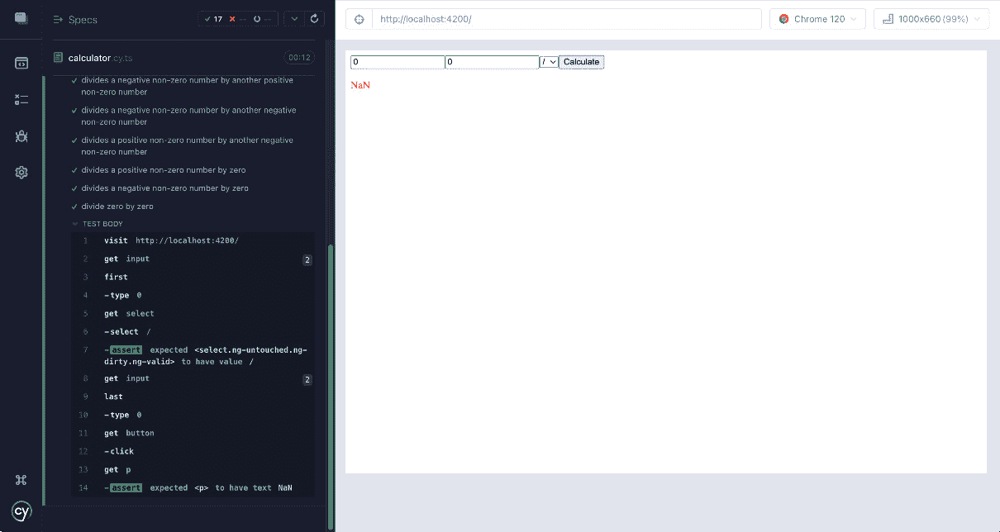

`<st c="48357">图 8.19 – “除以零”端到端测试成功</st>`

在下一节中，我们将探讨 Cypress 自定义命令是什么，以及如何使用它们使代码更容易维护和阅读。

# `<st c="48550">使用 Cypress 自定义命令</st>`

**<st c="48580">Cypress 自定义命令</st>** 是用户定义的动作和断言，它们扩展了 Cypress 测试框架的功能。它们使测试人员能够封装重复性操作，简化自动化工作流程，并针对特定需求优化测试脚本。自定义命令可以添加或替换，提供了一种灵活的方式与 Web 应用程序交互，并提高测试脚本的效率和可读性。

要在 Cypress 中创建自定义命令，您使用`<st c="49055">Cypress.Commands.add()</st>` `<st c="49077">方法。</st>` 此方法允许您定义一个可以在整个测试套件中使用的新的命令。

例如，我们可以创建一个自定义命令来测试 `<st c="49232">add()</st>` `<st c="49237">操作。</st>` 为了实现这一点，我们需要在 `<st c="49293">commands.ts</st>` `<st c="49304">文件中添加一些代码，该文件位于 `<st c="49317">support</st>` `<st c="49324">文件夹中，该文件夹位于 `<st c="49349">cypress</st>` `<st c="49356">文件夹内：</st>`

```js
 Cypress.Commands.add(
  'performCalculation',
  (firstNumber, operator, secondNumber) => {
    cy.visit('http: //localhost:4200/');
    cy.get('input').first().type(firstNumber);
    cy.get('select').select(operator).should('have.value', operator);
    cy.get('input').last().type(secondNumber);
    cy.get('button').click();
  }
);
declare namespace Cypress {
  interface Chainable<Subject = any> {
    performCalculation(
      firstNumber: string,
      operator: string,
      secondNumber: string
    ): Chainable<any>;
  }
}
```

`<st c="49839">以下是代码的分解：</st>` `<st c="49862">方法。</st>`

+   `<st c="49871">Cypress.Commands.add('performCalculation', (firstNumber, operator, secondNumber) => {…})</st>`<st c="49960">: 这定义了一个新的自定义命令</st> <st c="49996">名为</st> `<st c="50003">performCalculation</st>`<st c="50021">。此命令接受三个参数：</st> `<st c="50060">firstNumber</st>`<st c="50071">,</st> `<st c="50073">operator</st>`<st c="50081">,</st> <st c="50083">和</st> `<st c="50087">secondNumb</st>`<st c="50098">er</st>`<st c="50101">。</st>

+   `<st c="50102">cy.get('input').first().type(firstNumber)</st>`<st c="50144">: 这将选择页面上的第一个输入元素并输入</st> `<st c="50211">firstNumb</st>`<st c="50220">er</st>` <st c="50223">值。</st>

+   `<st c="50230">cy.get</st><st c="50237">('select').select(operator).should('have.value', operator)</st>`<st c="50296">: 这将选择一个下拉列表（或选择元素）并选择与操作符参数相对应的选项。</st> <st c="50415">然后断言所选值对应于</st> <st c="50470">操作符。</st>

+   `<st c="50485">cy.get('input').last().type(secondNumber)</st>`<st c="50527">: 这将选择页面上的最后一个输入元素并输入</st> `<st c="50595">secondNum</st>`<st c="50604">ber</st>` <st c="50608">值。</st>

+   `<st c="50615">cy.get('button').click()</st>`<st c="50640">: 这将点击一个按钮，可能用于执行</st> <st c="50690">计算。</st>

<st c="50706">现在，在</st> <st c="50725">我们的</st> `<st c="50732">calculator.cy.ts</st>` <st c="50748">文件级别，我们将执行以下操作来设置我们的</st><st c="50777">端到端测试：</st> <st c="50795">测试：</st>

```js
 it('adds two positive numbers correctly', () => {
  cy.performCalculation('5', '+', '3');
  cy.get('p').should('have.text', '8');
});
```

<st c="50935">以下是代码的</st> <st c="50958">分解：</st>

+   `<st c="50967">cy.performCalculation('5', '+', '3')</st>`<st c="51004">: 这是一个自定义命令，可能用于在测试的应用程序中执行计算操作。</st> <st c="51110">它接受三个参数：第一个数字、操作符和第二个数字。</st> <st c="51191">在这种情况下，它是将 5</st> <st c="51209">和 3</st> <st c="51219">相加。</st>

+   `<st c="51225">cy.get('p').should('have.text', '8')</st>`<st c="51262">: 一个断言，检查所选元素是否具有指定的文本。</st> <st c="51343">在这里，它正在检查段落元素是否包含文本</st> `<st c="51406">'8'</st>`<st c="51411">。</st>

<st c="51415">现在，在我们的浏览器中，我们有</st> <st c="51444">以下结果：</st>

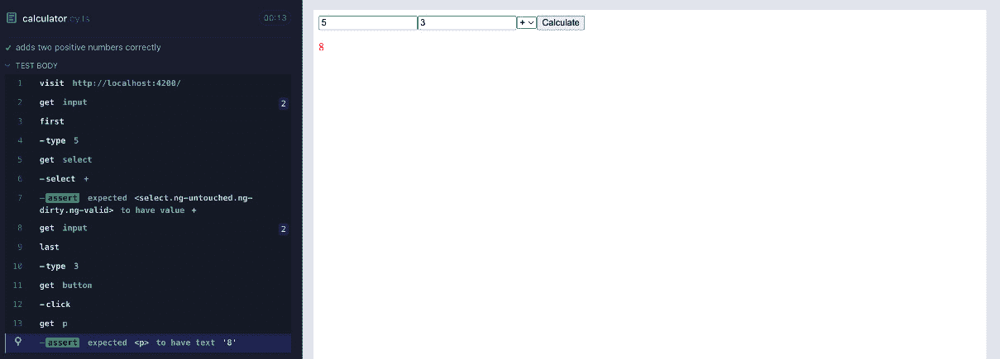

<st c="51589">图 8.20 – 使用 Cypress.Command 成功执行了“正确添加两个正数”的端到端测试</st>

<st c="51685">现在让我们总结一下</st> <st c="51706">本章内容。</st>

# <st c="51718">摘要</st>

<st c="51726">本章涵盖了使用 Cypress（一个流行的网络应用程序测试框架）构建、编写和改进端到端测试的基本方面。</st> <st c="51884">它从解释结构化端到端测试的重要性开始，以确保它们是完整的、可维护的和易于理解的。</st> <st c="52014">这包括使用</st> `<st c="52071">describe</st>` <st c="52079">和</st> `<st c="52084">it</st>` <st c="52086">块将测试组织成逻辑组，这些块有助于根据测试的功能或特性进行分类。</st>

<st c="52175">在本章中，编写端到端测试用例是一个关键方面。</st> <st c="52245">它侧重于使用 Cypress 命令和断言与网页元素交互并验证其行为。</st> <st c="52359">本章提供了如何使用以下命令的示例</st> `<st c="52420">cy.visit()</st>`<st c="52430">,</st> `<st c="52432">cy.get()</st>`<st c="52440">,</st> `<st c="52442">cy.contains()</st>`<st c="52455">,</st> `<st c="52457">cy.type()</st>`<st c="52466">, 和</st> `<st c="52472">cy.should()</st>` <st c="52483">来导航应用程序、与元素交互以及验证应用程序状态。</st> <st c="52573">它强调了以这种方式结构化测试的重要性，即从请求到命令或断言的转换，确保测试是确定性和可靠的。</st>

<st c="52735">本章还探讨了使用 Cypress 自定义命令来提高端到端测试的可读性和可维护性的方法。</st> <st c="52859">自定义命令允许开发者将重复的模式和操作封装在可重用的函数中，使测试更易于阅读和理解。</st> <st c="53016">这是通过使用</st> `<st c="53067">Cypress.Commands.add()</st>`<st c="53089">来定义自定义命令实现的，然后可以在测试中用它来代替标准 Cypress 命令。</st> <st c="53162">本章提供了如何为诸如通过标签选择表单元素等操作创建自定义命令的示例，这简化了测试代码，并使其与真实用户执行的操作更一致。</st>

<st c="53389">总之，本章提供了使用 Cypress 结构化、编写和改进端到端测试的全面指南，强调了清晰测试组织、有效使用 Cypress 命令和断言以及创建自定义命令以提高测试可读性和可维护性的重要性。</st>

<st c="53698">在下一章中，我们将学习关于</st> **<st c="53738">持续集成</st>** <st c="53760">(</st>**<st c="53762">CI</st>**<st c="53764">) 和</st> **<st c="53771">持续</st>** **<st c="53782">部署</st>** <st c="53792">(</st>**<st c="53794">CD</st>**<st c="53796">).</st>

# <st c="0">第四部分：Angular 应用程序的持续集成和持续部署</st>

<st c="82">在本节中，你将首先了解</st> **<st c="157">持续集成</st>** <st c="179">(</st>**<st c="181">CI</st>**<st c="183">) 和</st> **<st c="190">持续部署</st>** <st c="211">(</st>**<st c="213">CD</st>**<st c="215">) 的基本原理。</st> <st c="219">接下来，你将深入探索 TDD 的最佳实践和模式。</st> <st c="302">最后，你将学习关于重构和</st> <st c="346">代码改进</st> 的内容。

<st c="363">本部分包含以下章节：</st> <st c="382">：</st>

+   *<st c="401">第九章</st>*<st c="411">，*<st c="413">理解持续集成和持续部署（CI/CD）</st>*

+   *<st c="483">第十章</st>*<st c="494">，*<st c="496">Angular TDD 的最佳实践和模式</st>*

+   *<st c="539">第十一章</st>*<st c="550">，*<st c="552">通过 TDD 重构和改进 Angular 代码</st>*
