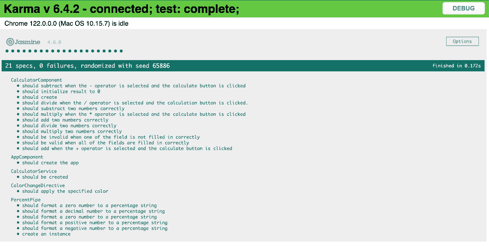
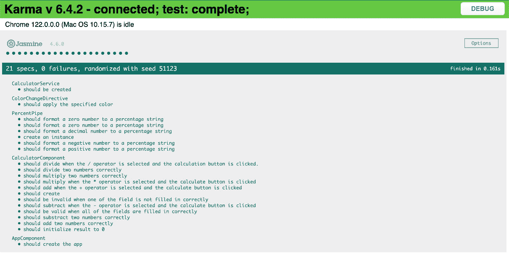

# 第十二章：<st c="0">11</st>

# <st c="3">通过 TDD 重构和改进 Angular 代码</st>

<st c="54">使用**<st c="91">测试驱动开发</st>** <st c="114">(**<st c="116">TDD</st>**<st c="119">)重构您的 Angular 代码是一种系统化和有效的提高代码质量的方法。</st> <st c="200">TDD 涉及在编写实际代码之前编写测试，从而确保代码满足所需的条件，并且是健壮的、可维护的和可靠的。</st> <st c="365">这种方法对于 Angular 应用程序尤其有益，因为它确保代码结构良好、效率高且易于维护。</st>

在本节中，我们深入探讨采用“先测试”策略的重要性，探讨重构过程中的 TDD 优势，选择要创建的最佳测试，理解**<st c="737">代码异味</st>**<st c="748">构成的内容，强调在 Angular 项目中解决代码异味的重要性，以及识别 Angular 应用程序中普遍存在的代码异味。

<st c="890">总结来说，以下是本章将涵盖的主要主题：</st>

+   <st c="965">通过 TDD 重构 Angular 代码</st>

+   <st c="1002">在 Angular 应用程序中识别代码异味和改进区域</st>

+   <st c="1076">迭代改进 – 用于持续代码增强的红色-绿色-重构周期</st>

# <st c="1157">技术要求</st>

要跟随本章的示例和练习，你需要对 Angular 和 TypeScript 有基本的了解，以及以下技术要求：

+   <st c="1365">在您的计算机上安装 Node.js 和 npm</st>

+   <st c="1408">全局安装 Angular CLI</st>

+   <st c="1439">在您的计算机上安装代码编辑器，例如 Visual Studio Code</st>

本章所需代码文件可以在[<st c="1567">https://github.com/PacktPublishing/Mastering-Angular-Test-Driven-Development/tree/main/Chapter%2011</st>](https://github.com/PacktPublishing/Mastering-Angular-Test-Driven-Development/tree/main/Chapter%2011)找到。

# <st c="1667">使用 TDD 重构 Angular 代码</st>

<st c="1701">在复杂的 Angular 应用程序中重构现有</st> <st c="1722">代码可能是一项令人紧张的任务。</st> <st c="1790">你希望在不妨碍现有功能的情况下改进代码的结构和组织。</st> <st c="1904">这就是测试驱动开发（TDD）发挥作用的地方，它提供了一种结构化的方法，以自信地导航重构。</st> <st c="2011">在本节中，我们将看到测试优先方法的力量，TDD 在重构中的好处，以及如何选择正确的测试</st> <st c="2146">来编写。</st>

## <st c="2155">测试优先方法的力量</st>

<st c="2192">TDD 翻转了</st> <st c="2202">传统的编码脚本。</st> <st c="2234">与传统先编写代码再测试不同，TDD 强调在修改代码之前先编写测试。</st> <st c="2359">这些测试本质上定义了你打算重构的代码的预期行为。</st> <st c="2448">以下是它是如何</st> <st c="2459">工作的：</st>

+   **<st c="2468">红色状态</st>**：你首先为想要重构的代码中的特定功能编写一个测试。这个初始测试很可能会失败，表明期望的行为尚未实现。这个</st> *<st c="2681">红色</st>* <st c="2684">状态作为一个</st> <st c="2701">起点。</st>

+   **<st c="2716">绿色状态</st>**：以失败的测试为指南，你只需编写足够的代码来使测试通过。<st c="2732">这种初始实现可能很基础，但重点是确保它准确反映了测试定义的预期行为。</st> <st c="2822">现在，测试处于</st> *<st c="2983">绿色</st>* <st c="2988">状态，表示</st> <st c="3007">成功实现。</st>

+   **<st c="3033">重构</st>**：这里是魔法发生的地方。有了通过测试的安全网，你现在可以重构代码，以提高其可读性、可维护性和效率。这可能包括以下内容：</st> <st c="3077">以下内容：</st>

    +   <st c="3240">将长方法分解为更小、</st> <st c="3282">定义良好的函数</st>

    +   <st c="3304">从大型组件中提取可重用组件或服务</st>

    +   <st c="3369">应用设计模式以实现更好的</st> <st c="3406">代码组织</st>

    +   <st c="3423">简化逻辑以</st> <st c="3445">增强清晰度</st>

<st c="3460">在整个</st> <st c="3471">重构阶段，通过测试确保这些更改不会引入任何意外的副作用。</st> <st c="3585">本质上，你是在不改变外部行为（由测试验证）的情况下改进代码的内部工作方式。</st> <st c="3708">作为一个例子，让我们从我们的</st> `<st c="3768">calculator.component.ts</st>` <st c="3791">组件</st> 在 `<st c="3809">第九章</st>` <st c="3818">文件夹（</st>[<st c="3827">https://github.com/PacktPublishing/Mastering-Angular-Test-Driven-Development/tree/main/Chapter%209/getting-started-angular-</st><st c="3951">tdd</st>](https://github.com/PacktPublishing/Mastering-Angular-Test-Driven-Development/tree/main/Chapter%209/getting-started-angular-tdd)<st c="3955">）中的这一段代码开始：</st>

```js
 calculate(): void {
    if (this.calculatorForm.get('operator')?.value === '+') {
      this.add(
        this.calculatorForm.get('operand1')?.value,
        this.calculatorForm.get('operand2')?.value
      );
    }
    if (this.calculatorForm.get('operator')?.value === '-') {
      this.substract(
        this.calculatorForm.get('operand1')?.value,
        this.calculatorForm.get('operand2')?.value
      );
    }
    if (this.calculatorForm.get('operator')?.value === '*') {
      this.multiply(
        this.calculatorForm.get('operand1')?.value,
        this.calculatorForm.get('operand2')?.value
      );
    }
    if (this.calculatorForm.get('operator')?.value === '/') {
      this.divide(
        this.calculatorForm.get('operand1')?.value,
        this.calculatorForm.get('operand2')?.value
      );
    }
  }
```

<st c="4634">以下是</st> <st c="4647">对应于我们</st> `<st c="4711">calculator.component.spec.ts</st>` <st c="4739">文件中此函数的测试源代码：</st>

```js
 it('should be valid when all of the fields are filled in correctly', () => {
    calculator.calculatorForm.get('operand1')?.setValue(123);
    calculator.calculatorForm.get('operand2')?.setValue(456);
    calculator.calculatorForm.get('operator')?.setValue('+');
    expect(calculator.calculatorForm.valid).toBe(true);
  });
  it('should be invalid when one of the field is not filled in correctly', () => {
    calculator.calculatorForm.get('operand1')?.setValue(123);
    calculator.calculatorForm.get('operator')?.setValue('+');
    expect(calculator.calculatorForm.valid).toBe(false);
  });
  it('should add when the + operator is selected and the calculate button is clicked', () => {
    calculator.calculatorForm.get('operand1')?.setValue(2);
    calculator.calculatorForm.get('operand2')?.setValue(3);
    calculator.calculatorForm.get('operator')?.setValue('+');
    calculator.calculate();
    expect(calculator.result).toBe(5);
  });
  it('should subtract when the - operator is selected and the calculate button is clicked', () => {
    calculator.calculatorForm.get('operand1')?.setValue(2);
    calculator.calculatorForm.get('operand2')?.setValue(3);
    calculator.calculatorForm.get('operator')?.setValue('-');
    calculator.calculate();
    expect(calculator.result).toBe(-1);
  });
  it('should multiply when the * operator is selected and the calculate button is clicked', () => {
    calculator.calculatorForm.get('operand1')?.setValue(2);
    calculator.calculatorForm.get('operand2')?.setValue(3);
    calculator.calculatorForm.get('operator')?.setValue('*');
    calculator.calculate();
    expect(calculator.result).toBe(6);
  });
  it('should divide when the / operator is selected and the calculation button is clicked.', () => {
    calculator.calculatorForm.get('operand1')?.setValue(3);
    calculator.calculatorForm.get('operand2')?.setValue(2);
    calculator.calculatorForm.get('operator')?.setValue('/');
    calculator.calculate();
    expect(calculator.result).toBe(1.5);
  });
```

<st c="6629">提醒一下，所有</st> <st c="6649">测试都是绿色的，如下面在浏览器上启动的 Karma 的截图所示：</st>



<st c="7953">图 11.1 – 计算器组件测试在终端中成功</st>

<st c="8018">我们现在</st> <st c="8031">将重构</st> <st c="8044">代码</st> <st c="8048">中的</st> `<st c="8056">calculate()</st>` <st c="8067">函数</st> 在 `<st c="8084">calculator.component.ts</st>` <st c="8107">组件</st> <st c="8118">中，如下所示：</st>

```js
 calculate(): void {
  const operator = this.calculatorForm.get('operator')?.value;
  const operand1 = this.calculatorForm.get('operand1')?.value;
  const operand2 = this.calculatorForm.get('operand2')?.value;
  if (!operator ||!operand1 ||!operand2) return;
  switch (operator) {
    case '+':
      this.add(operand1, operand2);
      break;
    case '-':
      this.subtract(operand1, operand2);
      break;
    case '*':
      this.multiply(operand1, operand2);
      break;
    case '/':
      this.divide(operand1, operand2);
      break;
    default:
      console.error(`Unsupported operator: ${operator}`);
      break;
  }
}
```

<st c="8672">现在，我们的测试情况如何呢？</st> <st c="8685">它们仍然都是绿色的，如下面的</st> <st c="8751">截图所示：</st>



<st c="10014">图 11.2 – 绿色测试</st>

<st c="10039">这意味着我们的重构是正确的，因为如果不是这样，我们的测试就会变成红色。</st> <st c="10129">我们现在理解了 TDD 的重要性，因为我们可以在没有担忧的情况下专注于重构我们的方法。</st> <st c="10244">在下一节中，我们将学习一些在重构中 TDD 的好处。</st> <st c="10298">在重构中，TDD 有以下好处：</st>

## <st c="10313">重构中 TDD 的好处</st>

<st c="10344">本节深入探讨了在 Angular 代码重构期间使用 TDD 的有益好处。</st> <st c="10443">以下是一些</st> <st c="10457">好处：</st>

+   **<st c="10465">增加信心</st>**<st c="10486">：通过测试，你可以作为一个安全网，让你在不用担心破坏现有功能的情况下尝试不同的重构技术。</st> <st c="10649">这增强了你在过程中的信心。</st>

+   **<st c="10696">改进设计</st>**<st c="10712">：首先考虑测试可以鼓励你编写具有良好定义功能的模块化代码。</st> <st c="10812">这导致代码在长期运行中更加干净和易于维护。</st>

+   **增强可维护性**<st c="10877">：一个全面的测试套件成为代码预期行为的活文档。</st> <st c="10902">这简化了未来的修改和错误修复，因为你可以依赖测试来</st> <st c="10996">捕获回归。</st>

+   **<st c="11098">更好的代码覆盖率</st>**<st c="11119">：TDD 自然会鼓励你专注于用测试覆盖各种代码路径。</st> <st c="11203">这导致更健壮的应用程序，隐藏的 bug 更少。</st>

## <st c="11267">行动中的示例</st>

<st c="11286">让我们看看如何</st> <st c="11300">将 TDD 应用于 Angular 中常见的重构场景</st> <st c="11352">：</st>

+   **<st c="11363">重构长服务方法</st>**<st c="11397">：想象一个负责获取和处理大量数据的服务方法。</st> <st c="11491">你可以编写一个专注于数据处理逻辑特定方面的测试。</st> <st c="11576">最初，这个测试会失败。</st> <st c="11608">然后，你会重构服务方法，将逻辑提取到单独的、经过良好测试的函数中。</st> <st c="11709">这提高了代码的可读性和可维护性，同时测试确保核心功能保持完整。</st>

+   **<st c="11821">转换神组件</st>**<st c="11850">：“神组件”指的是一个过于复杂的组件，通常通过在自身内部处理过多的责任或功能来违反单一职责原则。</st> <st c="12034">这个术语用来强调组件变得过大且难以管理、测试和理解的负面方面。</st> <st c="12181">这类组件往往注入许多服务，执行多项任务，并可能导致重大的维护挑战，随着时间的推移。</st> <st c="12307">这种执行大量任务的组件可以通过创建专门针对特定功能的服务来重新设计。</st> <st c="12318">因此，可以编写测试来验证重构组件和新</st> <st c="12464">创建的服务的行为。</st>

## <st c="12567">选择要编写的正确测试</st>

<st c="12601">在优先考虑</st> <st c="12619">使用 TDD 进行重构的测试时，考虑</st> <st c="12661">以下策略：</st>

+   **<st c="12678">关注痛点</st>**<st c="12699">：从导致代码库中出现问题（如易出错或难以理解的区域）的功能开始。</st> <st c="12816">这些区域通常会导致代码难以维护、测试和理解。</st>

+   **<st c="12830">从小处着手</st>**<st c="12842">：从较小、定义良好的测试开始，这些测试针对特定的功能。</st> <st c="12922">这允许更快地通过</st> <st c="12969">红-绿-重构周期。</st>

+   **<st c="12994">测试集成点</st>**<st c="13018">：当重构与服务或其他组件交互的组件时，编写测试以验证这些交互以及组件本身。</st>

<st c="13172">在下一节中，我们将解释如何识别 Angular 应用程序中的代码异味和改进区域。</st> <st c="13265">Angular 应用程序。</st>

# <st c="13286">在 Angular 应用程序中识别代码异味和改进区域</st>

<st c="13360">虽然你的</st> <st c="13372">Angular 应用程序可能表面上看起来功能正常，但可能存在潜在的等待爆发的問題。</st> <st c="13481">这些问题，被称为代码异味，不一定导致立即的问题，但表明你的代码库中</st> <st c="13596">可能从重构中受益的区域。</st> <st c="13633">就像杂乱无章的房间会让人感到压力和低效一样，有异味的代码会使维护、理解和扩展应用程序变得困难。</st> <st c="13783">本节深入探讨了</st> <st c="13807">Angular 应用程序中的代码异味世界。</st> <st c="13858">我们将探讨它们是什么，为什么它们很重要，以及如何主动识别它们。</st> <st c="13942">通过理解这些代码异味，你将能够使用 TDD 优先考虑重构工作，最终导致一个更干净、更可维护和更健壮的</st> <st c="14105">代码库。</st>

## <st c="14115">什么是代码异味？</st>

<st c="14137">想象一下</st> <st c="14146">走进一个厨房，脏盘子堆满了水池，香料散落在台面上，过期的食物留在冰箱里。</st> <st c="14300">这个令人不愉快的场景可能不会阻止你做一顿基本的饭菜，但肯定不会是一个愉快或高效的经历。</st> <st c="14438">代码异味在软件开发世界中类似于这个杂乱的厨房。</st>

<st c="14520">由马丁·福勒在其著作中提出，</st> *<st c="14558">重构：改进现有代码的设计</st>*<st c="14608">，代码异味是代码库中潜在问题的指标。</st> <st c="14682">它们不一定代表导致应用程序崩溃的功能性错误。</st> <st c="14768">相反，它们标志着</st> <st c="14790">可能需要改进以获得更好的可读性、可维护性和代码长期健康性的区域。</st>

<st c="14894">代码异味不是错误，但它们可能会在未来吸引错误。</st> <st c="14962">它们就像红旗，警告你潜在的麻烦区域，这些区域可能会随着你的</st> <st c="15064">应用程序的发展而变得有问题。</st>

## <st c="15084">为什么我们应该关注 Angular 中的代码异味呢？</st>

<st c="15133">忽视杂乱的厨房可能会导致烹饪时出现不愉快的气味、果蝇和挫败感。</st> <st c="15250">同样，忽视 Angular 应用程序中的代码异味可能会导致</st> <st c="15315">几个</st> <st c="15329">负面后果：</st>

+   **<st c="15351">降低可维护性</st>**<st c="15377">：随着时间的推移，有异味的代码变得难以理解和修改。</st> <st c="15446">随着您的应用程序的增长和功能的添加，错综复杂的代码的复杂性可能会使更改变得繁琐并</st> <st c="15559">容易出错。</st>

+   **<st c="15571">增加调试时间</st>**<st c="15596">：当出现有异味的代码中的错误时，确定根本原因可能具有挑战性。</st> <st c="15681">缺乏清晰的结构和组织使得寻找错误就像在 haystack 中寻找一根针一样，浪费了宝贵的</st> <st c="15795">开发者时间。</st>

+   **<st c="15810">降低团队生产力</st>**<st c="15836">：与有异味的代码一起工作可能会让开发者感到沮丧和缺乏动力。</st> <st c="15916">解读错综复杂的逻辑的认知负担会减慢开发速度并</st> <st c="15995">阻碍协作。</st>

+   **<st c="16017">技术债务</st>**<st c="16032">：随着时间的推移，未处理的代码异味会积累，最终形成需要解决的技术债务。</st> <st c="16145">这种债务可能成为一个重大的负担，需要专门的资源，并可能延迟新</st> <st c="16247">功能开发。</st>

<st c="16267">通过积极</st> <st c="16283">地识别和重构代码异味，您可以做到以下：</st>

+   **<st c="16349">提高代码可读性</st>**<st c="16374">：干净且结构良好的代码更容易被您和其他在项目上工作的开发者理解。</st> <st c="16490">这减少了新团队成员的入职时间，并促进了</st> <st c="16552">更好的协作。</st>

+   **<st c="16573">增强可维护性</st>**<st c="16597">：重构后的代码更容易修改和适应，因为您的</st> <st c="16654">应用程序需求发生变化。</st> <st c="16689">这使您能够更有效地引入新功能和错误修复</st> <st c="16745">。</st>

+   **<st c="16762">减少调试时间</st>**<st c="16784">：清晰关注点分离的干净代码在出现错误时更容易隔离和修复。</st> <st c="16885">当出现错误时。</st>

+   **<st c="16896">提高团队生产力</st>**<st c="16920">：与结构良好的代码一起工作可以改善开发者的体验和满意度。</st> <st c="17005">这导致更高的生产力和更积极</st> <st c="17059">的开发环境。</st>

+   **<st c="17083">最小化技术债务</st>**<st c="17107">：通过早期解决代码异味，您可以防止它们积累并成为未来的一大负担。</st> <st c="17218">。</st>

<st c="17229">本质上，优先考虑代码异味重构是对你</st> <st c="17347">Angular 应用程序</st> <st c="17347">长期健康和可维护性的投资。</st>

## <st c="17367">识别 Angular 应用程序中最常见的代码异味</st>

<st c="17431">现在我们</st> <st c="17443">理解了识别代码异味的重要性</st> <st c="17470">，让我们看看你可能在你的</st> <st c="17482">Angular 应用程序</st> <st c="17581">中遇到的常见违规行为：</st>

+   **<st c="17601">漫长而曲折的方法</st>**<st c="17629">：想象一下你的服务中的一个方法，它跨越了数十行，处理各种任务。</st> <st c="17728">这是一个长方法的典型例子，一个表明缺乏模块化的代码异味。</st> <st c="17816">这些方法可能难以理解、测试和修改。</st> <st c="17880">重构涉及将这些巨无霸分解成更小、更明确的函数，每个函数都专注于特定的任务。</st> <st c="18002">这提高了代码的可读性</st> <st c="18033">和可维护性。</st>

+   **<st c="18053">神组件</st>**<st c="18071">：你是否遇到过责任过重的组件？</st> <st c="18141">这是一个“神组件”，从数据获取到复杂的 UI 逻辑都由它处理。</st> <st c="18228">这样的组件成为维护噩梦，因为一个区域的变化可能会在整个组件中产生连锁反应，导致</st> <st c="18346">意外的后果。</st> <st c="18371">重构可能包括</st> <st c="18395">以下内容：</st>

    +   **<st c="18409">创建专用服务</st>**<st c="18437">：将与数据访问、业务逻辑或计算相关的功能提取到单独的服务中。</st> <st c="18544">这些服务可以被多个组件重用</st> <st c="18572">，促进</st> <st c="18607">更好的组织。</st>

    +   **<st c="18627">拆分组件</st>**<st c="18651">：将神组件拆分成更小、更专注的组件，每个组件处理 UI</st> <st c="18764">或功能的一个特定方面。</st>

+   `<st c="19648">10</st>` <st c="19650">用于分页，但其目的不明确。</st> <st c="19699">重构涉及用命名变量或常量替换这些魔法数字。</st> <st c="19785">例如，使用</st> `<st c="19802">ITEMS_PER_PAGE</st>` <st c="19816">而不是</st> `<st c="19828">10</st>`<st c="19830">，使代码更具自文档性，更容易</st> <st c="19881">理解。</st>

+   **<st c="19895">意大利面代码迷宫</st>**<st c="19919">：想象一下蜿蜒曲折、缺乏清晰结构和组织的代码。</st> <st c="20000">这就是意大利面代码，使其在导航、理解和修改时具有挑战性。<st c="20083"></st>测试驱动开发（TDD）可以成为对抗意大利面代码的有力工具。<st c="20136"></st>通过首先编写测试，然后重构代码以满足这些测试，你可以引入结构并改善代码库的整体组织。<st c="20138"></st>

在下一节中，我们将学习迭代改进：持续代码增强的红色-绿色-重构循环。<st c="20293"></st>

# 迭代改进 – 持续代码增强的红色-绿色-重构循环<st c="20419"></st>

在 Angular 应用程序中重构现有代码可能是一项艰巨的任务。<st c="20500"></st>你希望改进代码的结构和组织，但引入回归（错误）的恐惧常常笼罩心头。<st c="20513"></st>这就是 TDD 介入的地方，它提供了一种结构化和迭代的途径，以自信地导航重构。<st c="20575"></st>在 TDD 的核心是“红色-绿色-重构”循环，这是一种强大的技术，可以在确保功能完整的同时，对代码库进行增量改进。<st c="20700"></st>它通过在重构代码之前编写测试，然后将代码重构以满足这些测试，可以引入结构并改善代码库的整体组织。<st c="20775"></st>在 TDD 的核心是“红色-绿色-重构”循环，这是一种强大的技术，可以在确保功能完整的同时，对代码库进行增量改进。<st c="20814"></st>它通过在重构代码之前编写测试，然后将代码重构以满足这些测试，可以引入结构并改善代码库的整体组织。<st c="20873"></st>它通过在重构代码之前编写测试，然后将代码重构以满足这些测试，可以引入结构并改善代码库的整体组织。<st c="20979"></st>

想象你是一位正在处理一块大块大理石的雕塑家。<st c="20994"></st>红色-绿色-重构循环就像你的路线图，将这块原材料变成杰作。<st c="21057">以下是每个阶段及其在重构 Angular 代码的上下文中的重要性的分解：</st> <st c="21161"></st> <st c="21245">：</st>

## <st c="21258">红色 – 使用失败的测试设定舞台</st>

<st c="21301">循环从红色开始</st> <st c="21319">，表示失败的测试。</st> <st c="21356">这可能会显得有些不合常理——为什么编写注定要失败的测试呢？<st c="21403"></st>这个初始红色测试的目的是定义你打算重构的代码的预期行为。</st> <st c="21433"></st>把它想象成一份概述你想要实现的功能的蓝图。</st> <st c="21540"></st>以下是创建红色测试涉及的内容：<st c="21616"></st><st c="21618">他</st><st c="21644">的</st>：

+   **<st c="21657">确定重构目标</st>**<st c="21689">：首先确定 Angular 应用程序中一个特定的区域，该区域表现出代码异味或需要改进。</st> <st c="21808">这可能是服务中的长方法、处理许多任务的上帝组件，或者重复的代码片段。<st c="21903"></st>

+   **<st c="21917">定义预期结果</st>**<st c="21945">：清楚地概述重构后的代码应该做什么。</st> <st c="22000">它应该处理哪些数据？</st> <st c="22029">它应该如何与 UI 交互？</st> <st c="22065">编写一个反映这种预期行为的测试。</st> <st c="22116">记住，这个测试最初会失败，因为所需的功能尚未实现。</st>

<st c="22210">失败的红色测试</st> <st c="22229">发挥着至关重要的作用。</st> <st c="22257">它建立了一个基线——对当前缺失的功能有清晰的理解。</st> <st c="22354">这为重构过程提供了一个安全网。</st> <st c="22413">当你进行代码更改时，失败的测试确保你走在正确的轨道上，并且没有意外破坏</st> <st c="22522">现有功能。</st>

## <st c="22547">绿色——用最少的代码使测试通过</st>

<st c="22594">一旦你</st> <st c="22604">设置了红色测试，就到了进入绿色阶段的时候。</st> <st c="22671">在这里，目标是编写足够的代码来使失败的测试通过。</st> <st c="22751">在这个阶段，不要陷入编写完美优化或优雅的代码。</st> <st c="22833">专注于测试定义的核心功能。</st> <st c="22886">以下是绿色阶段的一些关键考虑因素：</st>

+   **<st c="22939">简单实现</st>**<st c="22962">：你最初编写的代码以使测试通过可能是基本的。</st> <st c="23030">它不必是最有效或结构良好的解决方案。</st> <st c="23104">优先级是让测试通过并建立重构的基线</st> <st c="23169">。</st>

+   **<st c="23185">关注功能</st>**<st c="23208">：确保你编写的代码满足测试中概述的特定行为。</st> <st c="23290">在这个阶段，不要引入不必要的功能或</st> <st c="23319">逻辑。</st>

<st c="23351">通过绿色测试标志着重要的里程碑。</st> <st c="23404">它验证了你正在重构的核心功能现在已实现，尽管可能只是基本形式。</st> <st c="23519">这个绿色测试在整个重构过程中充当安全网。</st> <st c="23592">当你进行进一步的代码更改时，你可以依赖这个测试来确保你没有偏离</st> <st c="23690">预期的结果。</st>

## <st c="23706">重构——自信地转换代码</st>

<st c="23755">通过一个</st> <st c="23763">通过绿色测试作为安全网，你已经到达了循环的核心——重构阶段。</st> <st c="23862">在这里，你可以发挥你的重构技能，提高代码的可读性、可维护性和效率。</st> <st c="23983">以下是一些你可能想要在重构过程中关注的潜在领域：</st> <st c="24040">重构：</st>

+   **<st c="24059">模块化长方法</st>**<st c="24083">：将那些长而单一的方法分解成更小、更明确的函数。</st> <st c="24166">这增强了代码的可读性，并使理解逻辑流程更容易。</st> <st c="24235">逻辑流程。</st>

+   **<st c="24246">提取可重用组件和服务</st>**<st c="24287">：如果你的组件已经变成了处理众多任务的上帝组件，考虑将功能提取到专门的服务或可重用组件中。</st> <st c="24444">这促进了更好的组织和关注点的分离</st> <st c="24493">。</st>

+   **<st c="24505">消除重复</st>**<st c="24527">：识别并重构重复的代码片段到可重用的组件、服务或实用函数中。</st> <st c="24635">这减少了代码冗余并</st> <st c="24668">简化了维护。</st>

+   **<st c="24691">应用设计模式</st>**<st c="24713">：考虑整合促进代码结构和组织更好的设计模式。</st> <st c="24808">这可以使你的代码更易于维护，并且更容易被其他开发者理解。</st> <st c="24879">其他开发者。</st>

+   **<st c="24896">简化逻辑</st>**<st c="24911">：寻找机会简化复杂的逻辑，并增强代码的清晰度。</st> <st c="24991">这可能包括使用更具描述性的变量名，分解复杂的条件语句，或利用</st> <st c="25106">辅助函数。</st>

在整个重构过程中，牢记绿色测试。</st> <st c="25189">迭代重复这个循环，一次解决代码的一个方面。</st> <st c="25263">每个完成的循环都会让你拥有更干净、更易于维护的代码，以及保证其持续功能的健壮测试。</st> <st c="25393">对小而渐进的变化的强调促进了更受控、更少错误的</st> <st c="25481">重构过程。</st>

# 摘要

总结来说，通过 TDD 重构和改进 Angular 代码是一种强大的方法，可以提升 Angular 应用程序的质量、可维护性和效率。<st c="25687">遵循 TDD 方法论，开发者可以确保他们的代码健壮、结构良好且易于理解。</st>这种方法不仅有助于识别和解决代码问题，而且为未来的增强和修改奠定了坚实的基础。<st c="25967">TDD 鼓励开发者先编写测试，然后再编写实际代码，确保代码满足定义的要求并按预期行为。</st>编写测试、使测试通过，然后对代码进行重构以改进，这是 TDD 的核心。<st c="26248">它培养了一种持续改进的文化，代码始终处于准备进一步开发的状态。</st>

此外，TDD（测试驱动开发）促进了独立、可测试的代码单元的开发，使得在开发早期阶段更容易识别和修复问题。<st c="26524">这在 Angular 应用程序中尤其有益，因为组件、服务和模块通常具有复杂的依赖关系和交互。</st>通过单独测试这些单元，开发者可以确保在将它们集成到更大的系统之前，应用程序的每个部分都能正确工作。<st c="26813"></st>

此外，TDD 通过鼓励开发者编写清晰、简洁且文档齐全的测试，促进了高质量、可维护的代码的开发。<st c="26983">这些测试作为文档，使得其他开发者（甚至未来的原始开发者）更容易理解代码的目的和功能。</st>

在 Angular 的背景下，TDD 在开发服务、组件和管道方面特别有效，如提供的示例所示。<st c="27312">通过明确定义代码应该做什么，开发者可以编写指导实现过程的测试，确保代码满足所需的规范。</st>这种方法不仅导致代码设计得更好，而且使开发过程更加高效和愉快。<st c="27606"></st>

总结来说，通过 TDD 重构和改进 Angular 代码是一种有价值的实践，可以显著提升 Angular 应用程序的质量。<st c="27780">通过采用 TDD，开发者可以确保他们的代码健壮、可维护，并准备好未来的增强。</st>这种方法不仅有利于当前的开发周期，而且为未来的开发工作奠定了坚实的基础，对于任何 Angular 开发者来说都是一项值得的投资。<st c="28064"></st>

<st c="28082">这是本书的结尾。</st> <st c="28112">本书为希望采用或改进他们在 Angular 项目中 TDD 实践的开发商提供了一本全面的指南。</st> <st c="28238">通过遵循本书中描述的原则和技术，开发商可以显著提高他们 Angular 应用程序的可靠性、性能和可维护性。</st> <st c="28423">本书强调了全面测试策略的价值、使用正确工具和实践的重要性，以及采用测试优先的开发方法的好处。</st> <st c="28607">无论你是 Angular 的新手还是一个希望磨练技能的有经验的开发者，本书都提供了掌握 Angular 中 TDD 的宝贵见解和实用建议。</st> <st c="28768">。</st>
