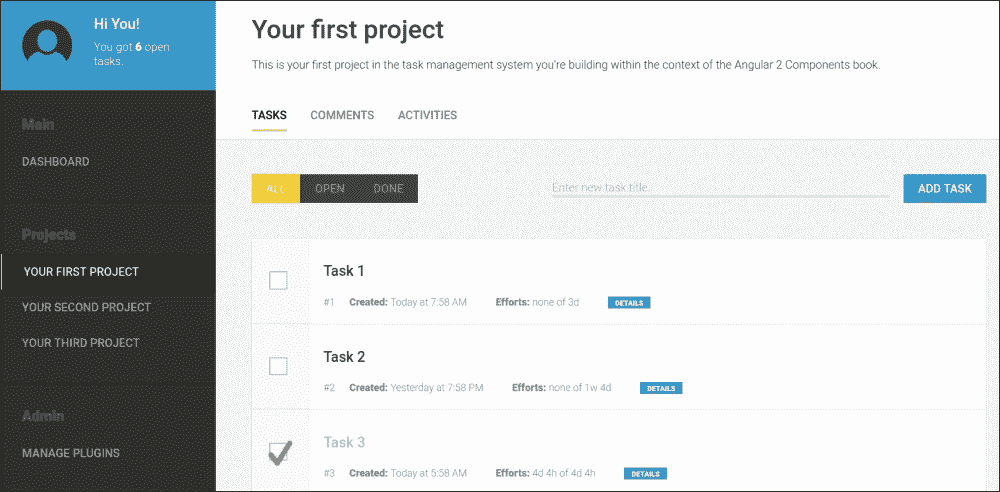
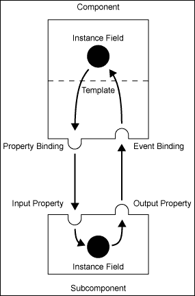
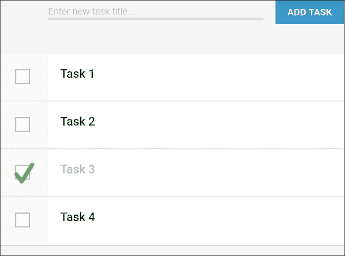
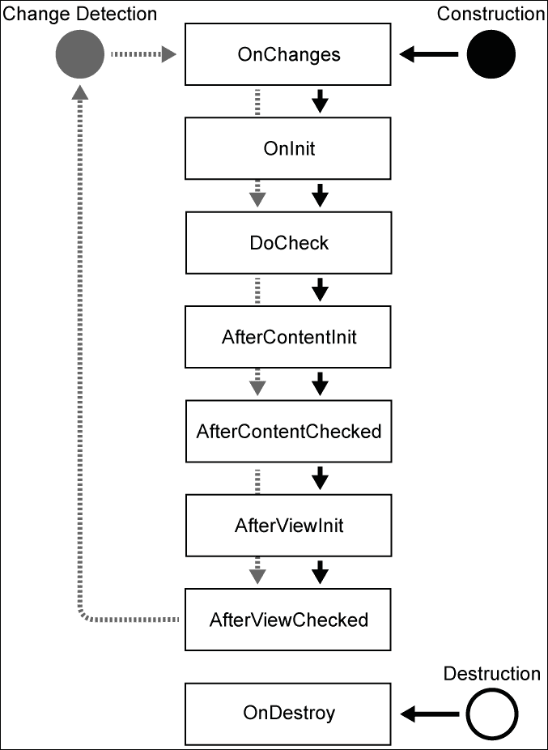
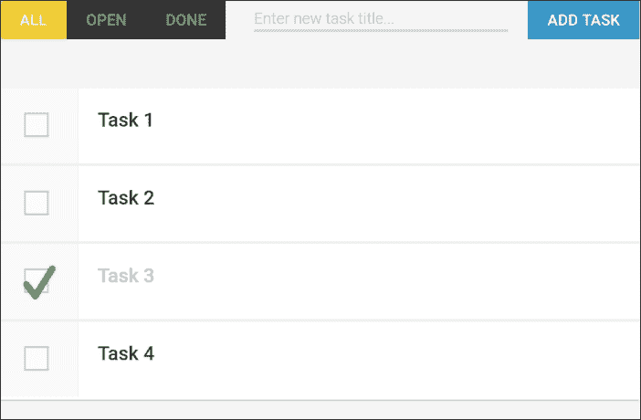

# 第二章：准备，设置，出发！

在本章中，我们将开始构建我们的任务管理应用。我们将直接进入应用的核心，并创建管理简单任务列表所需的初始组件。在阅读本章的过程中，你将学习以下主题：

+   使用主组件引导 Angular 应用

+   组件输入和输出

+   宿主属性绑定

+   样式和视图封装

+   使用 SystemJS 文本加载器导入 HTML 模板

+   使用 `EventEmitter` 发射自定义事件

+   双向数据绑定

+   组件生命周期

# 管理任务

在上一章学习了基础知识之后，我们现在将在接下来的章节中一起创建一个任务管理应用。你将在章节中学习一些概念，然后通过实际示例来使用它们。你还将学习如何使用组件来构建应用。这从文件夹结构开始，以设置组件之间的交互结束。

## 视觉

任务管理应用应使用户能够轻松管理任务，并帮助他们组织小型项目。可用性是任何应用的中心环节；因此，你需要设计一个现代且灵活的用户界面，以支持用户。



我们将要构建的任务管理应用的预览

我们的任务管理应用将包含组件，使我们能够设计一个提供出色用户体验的平台，用于管理任务。让我们定义我们应用的核心功能：

+   在多个项目中管理任务并提供项目概览

+   简单的调度以及时间和努力跟踪机制

+   使用图形图表概述仪表板

+   跟踪活动并提供可视化的审计日志

+   一个适用于不同组件的简单评论系统

任务管理应用是本书的主要示例。因此，书中的构建块应仅包含与本书主题相关的代码。当然，除了组件之外，应用还需要其他功能，如视觉设计、数据、会话管理以及其他重要部分，才能运行。虽然每章所需的代码都可以在线下载，但我们只会讨论与书中学习到的主题相关的代码。

# 从零开始

让我们从创建一个名为 `angular-2-components` 的新文件夹开始，以便创建我们的应用：

1.  在我们新创建的文件夹内打开控制台窗口，并运行以下命令以初始化一个新的 Node.js 项目：

    ```js
    npm init

    ```

1.  通过使用 *Enter* 键（默认设置）确认所有步骤来完成初始化向导。

1.  由于我们使用 JSPM 来管理我们的依赖项，因此我们需要将其作为项目 Node.js 包进行安装：

    ```js
    npm install jspm --save-dev

    ```

1.  让我们在项目文件夹内初始化一个新的 JSPM 项目。请确保为所有设置使用默认设置（只需按 *Enter* 键），除了被询问你想要使用哪种编译器时。在此阶段输入 TypeScript：

    ```js
    jspm init

    ```

1.  我们现在将使用 JSPM 将相关的 Angular 2 包安装到我们的项目中作为依赖项。我们还将安装一个 SystemJS 加载器插件来加载文本文件作为模块。我们将在稍后提供一些关于此的详细信息：

    ```js
    jspm install npm:@angular/core npm:@angular/common npm:@angular/compiler npm:@angular/platform-browser-dynamic npm:rxjs text

    ```

让我们通过使用 NPM 和 JSPM 命令行工具来检查到目前为止我们所创建的内容。

`package.json` 文件是我们使用的 Node.js 配置文件，我们将其作为与 JSPM（包管理器）和 SystemJS（具有编译器的模块加载器）一起工作的基础。如果你查看 `package.json` 文件，你将看到 JSPM 依赖项的附加部分：

```js
  "jspm": {
    "dependencies": {
      "@angular/common": "npm:@angular/common@2.0.0-rc.1",
      "@angular/compiler": "npm:@angular/compiler@2.0.0-rc.1",
      "@angular/core": "npm:@angular/core@2.0.0-rc.1",
      "@angular/platform-browser-dynamic": "npm:@angular/platform-browser-dynamic@2.0.0-rc.1",
      "text": "github:SystemJS/plugin-text@0.0.7"
    },
    "devDependencies": {
      "typescript": "npm:typescript@1.8.10",
    }
  }
```

让我们快速查看我们使用 JSPM 安装的依赖项及其用途：

| 包 | 描述 |
| --- | --- |
| `@angular/core` | 这是 Angular 2 的核心包，托管在 NPM 上。如果你还记得 第一章，*基于组件的用户界面*，JSPM 只是一个经纪人，并将任务委托给其他包仓库。核心包包含所有 Angular-core 模块，例如 `@Component` 装饰器、变更检测、依赖注入等。 |
| `@angular/common` | Angular 的 `common` 包为我们提供了基本指令，如 `NgIf` 和 `NgFor`。它还包含所有基本管道和控制表单的指令。 |
| `@angular/compiler` | 编译器包包含编译视图模板所需的所有工件。Angular 不仅提供了预编译模板以获得更快的启动时间的能力，而且在运行时使用编译器将文本模板转换为编译后的模板。如果我们需要在运行时编译模板，则需要此包。 |
| `@angular/platform-browser-dynamic` | 此包包括启动功能，将帮助我们启动应用程序。由 platform-browser-dynamic 包启动的引导是动态的，即在运行时编译模板。 |
| `typescript` | 这个开发依赖项是 SystemJS 的 TypeScript 编译器。它将我们的 ECMAScript 6 和 TypeScript 代码编译成 ECMAScript 5，从而可以在浏览器中运行。 |
| `text` | 这个 SystemJS 加载器支持以 JavaScript 字符串的形式加载文本文件。如果你喜欢加载 HTML 模板并避免异步请求，这特别有用。 |

我们在浏览器中显示应用程序的主要入口点是我们的索引站点。`index.html` 文件完成以下五个动作：

+   从 CDN 加载 ECMAScript 6 兼容库 es6-shim。此脚本是为了确保浏览器理解最新的 ECMAScript 6 API。

+   加载框架所需的 Angular 2 polyfills。这包括运行 Angular 2 应用程序所需的浏览器补丁。在加载我们应用程序中的任何其他代码之前，加载这些 polyfills 非常重要。

+   加载 SystemJS 和包含由 JSPM 生成的映射信息的`config.js`文件。

+   使用`System.import`函数加载和执行主入口点，即我们的`boostrap.js`文件。

让我们在项目的根文件夹内创建一个新的`index.html`文件：

```js
<!doctype html>
<html>
<head lang="en">
  <title>Angular 2 Components</title>
</head>
<body>

<script src="img/es6-shim.min.js"></script>
<script src="img/angular2-polyfills.js"></script>
<script src="img/system.js"></script>
<script src="img/config.js"></script>
<script>
 System.import('lib/bootstrap.js');
</script>
</body>
</html>
```

让我们继续到我们的应用程序组件。你可以将其视为应用程序的最外层组件。它是主要组件，因为它代表了整个应用程序。每个应用程序都需要一个，并且只有一个主要组件。这是组件树根的位置。

我们将命名我们的主要组件为`App`，因为它代表了我们的整个应用程序。让我们继续在我们的项目文件夹中的新`lib`文件夹内创建这个组件。创建一个名为`app.js`的文件，并包含以下内容：

```js
// We need the Component annotation as well as the 
// ViewEncapsulation enumeration
import {Component, ViewEncapsulation} from '@angular/core';

// Using the text loader we can import our template
import template from './app.html!text';

// This creates our main application component
@Component({
  // Tells Angular to look for an element <ngc-app> to create this 
  // component
  selector: 'ngc-app',
  // Let's use the imported HTML template string
  template,
  // Tell Angular to ignore view encapsulation
  encapsulation: ViewEncapsulation.None
})
export class App {}
```

这里与我们之前了解的结构化组件的知识没有不同，这是我们之前章节中学到的。然而，与之前创建组件的方式相比，这里有两个主要区别。如果你查看我们配置的`template`属性，你可以看出我们没有直接在 JavaScript 文件中的 ECMAScript 6 模板字符串内编写 HTML 模板。相反，我们将使用 SystemJS 中的文本加载插件将模板加载到 JavaScript 字符串中。我们可以通过在常规 ECMAScript 6 导入后附加`!text`来从文件系统中加载任何文本文件：

```js
import template from './app.html!text';
```

这将加载当前目录下的`app.html`文件，并以字符串的形式导出其内容。

第二个区别是我们使用`ViewEncapsulation`来指定 Angular 应该如何处理视图封装。Angular 有三种处理视图封装的方式，它们提供了不同级别的粒度，并且各有优缺点。具体如下：

| 封装类型 | 描述 |
| --- | --- |
| `ViewEncapsulation.Emulated` | 如果组件设置为模拟视图封装，它将通过将生成的属性附加到组件元素并修改 CSS 选择器以包含这些属性选择器来模拟样式封装。这将启用某些形式的封装，尽管如果存在其他全局样式，外部样式仍然可能泄漏到组件中。这种视图封装模式是默认模式，除非指定其他方式。 |
| `ViewEncapsulation.Native` | 原生视图封装应该是 Angular 中视图封装概念的最终目标。它使用上一章中描述的 Shadow DOM 来为整个组件创建一个隔离的 DOM。此模式依赖于浏览器原生支持 Shadow DOM，因此不一定总是可以使用。还重要的是要注意，全局样式将不再被尊重，并且局部样式需要放置在组件内的行内样式标签中（或使用组件注释上的`styles`属性）。 |
| `ViewEncapsulation.None` | 此模式告诉 Angular 不提供任何模板或样式封装。在我们的应用程序中，我们主要依赖于来自全局 CSS 的样式；因此，我们为大多数组件使用此模式。既不使用 Shadow DOM，也不使用属性来创建样式封装；我们可以简单地使用我们全局 CSS 文件中指定的类。 |

由于此组件现在依赖于从文件系统加载的模板，我们需要在`lib`文件夹中创建一个包含一些初始内容的`app.html`文件：

```js
<div>Hello World!</div>

```

目前为止，这就是我们放入模板中的所有内容。我们的目录应该看起来类似于此：

```js
angular-2-components
├── node_modules/
├── jspm_packages/
├── config.js
├── index.html
├── lib
│   ├── app.html
│   └── app.js
└── package.json

```

现在我们已经创建了我们的主要应用程序组件，我们可以将组件的主元素添加到我们的`index.html`文件中：

```js
<!DOCTYPE html>
<html>
<head lang="en">
  <title>Angular 2 Components</title>
</head>
<body>
<ngc-app></ngc-app>
...
```

## 引导

`index.html`文件将使用 SystemJS 在行内`script`标签中加载`bootstrap.js`模块。当与 SystemJS 一起工作时，为您的脚本提供一个主入口点是一个最佳实践。我们的`bootstrap.js`文件负责加载我们应用程序所需的所有必要 JavaScript 依赖项以及启动 Angular 框架。

我们可以继续引导我们的 Angular 应用程序，通过提供我们的主要应用程序组件`App`。我们需要从`angular2`模块中导入`bootstrap`函数。然后我们可以导入我们的`App`组件并调用`bootstrap`函数，将其作为参数传递：

```js
// Import Angular bootstrap function
import {bootstrap} from '@angular/platform-browser-dynamic'; 
// Import our main app component
import {App} from './app';
// We are bootstrapping Angular using our main application
// component
bootstrap(App);

```

## 运行应用程序

我们到目前为止生成的代码现在应该处于可以运行的状态。在我们使用 live-server 模块运行我们的代码之前，让我们确保我们已准备好所有文件。在这个阶段，我们的目录应该看起来像这样：

```js
angular-2-components
├── jspm_packages/
├── node_modules/
├── config.js
├── index.html
├── lib
│   ├── app.html
│   ├── app.js
│   └── bootstrap.js
└── package.json

```

现在我们开始启动实时服务器，以启动一个服务器和一个带有实时重载功能的浏览器。为此，我们只需在我们的项目文件夹内命令行中执行以下命令即可：

```js
live-server

```

如果一切顺利，你将打开一个显示**Hello World!**的网页浏览器。

## 回顾

让我们回顾一下我们到目前为止所做的工作：

1.  我们使用 NPM 和 JSPM 初始化了一个新项目，并使用 JSPM 安装了 Angular 依赖项。

1.  我们在`app.js`中创建了我们的主要应用程序组件。

1.  我们还创建了一个`bootstrap.js`脚本，用于包含我们应用程序的 Angular 框架引导。

1.  我们通过包含一个与我们的组件选择器属性匹配的元素，将我们的组件添加到`index.html`文件中。

1.  最后，我们使用了 live server 来启动一个基本的 Web 服务器并打开一个网页浏览器。

# 创建任务列表

现在我们已经设置了主要的应用组件，我们可以继续完善我们的任务应用。我们将要创建的第二个组件将负责列出任务。遵循组合的概念，我们将创建一个`task-list`组件，作为我们主要应用组件的子组件。

让我们在`lib`文件夹中创建一个名为`task-list`的文件夹和一个名为`task-list.js`的新 JavaScript 文件，我们将在这里编写我们的组件代码：

```js
import {Component, ViewEncapsulation} from '@angular/core';
import template from './task-list.html!text';

@Component({
  selector: 'ngc-task-list',
  // The host property allows us to set some properties on the 
  // HTML element where our component is initialized
  host: {
    class: 'task-list'
  },
  template,
  encapsulation: ViewEncapsulation.None
})
export class TaskList {
  constructor() {
    this.tasks = [
      {title: 'Task 1', done: false},
      {title: 'Task 2', done: true}
    ];
  }
}
```

我们创建了一个非常简单的`task-list`组件，该组件内部存储了一个任务列表。这个组件将被附加到匹配 CSS 元素选择器`ngc-task-list`的 HTML 元素上。

现在，让我们为这个组件创建一个视图来显示任务。正如您从组件 JavaScript 文件中的导入中可以看到，我们正在寻找一个名为`task-list.html`的文件：

```js
<div *ngFor="let task of tasks" class="task">
  <input type="checkbox" [checked]="task.done">
  <div class="task__title">{{task.title}}</div>
</div>
```

我们使用`NgFor`指令重复具有 class task 的`<div>`元素，以匹配我们组件任务列表中的任务数量。Angular 中的`NgFor`指令将从其底层内容创建一个模板元素，并根据表达式评估的结果实例化模板中的元素。我们目前在`task-list`组件中有两个任务，因此这将创建我们模板的两个实例。

您在`lib`文件夹内的文件夹结构现在应该类似于这个：

```js
angular-2-components
└── lib
 ├── app.html
 ├── app.js
 ├── bootstrap.js
 └── task-list
 ├── task-list.html
 └── task-list.js

```

为了使我们的任务列表工作，我们剩下的工作是在主要应用组件中包含`task-list`组件。我们可以继续修改我们的`app.js`文件，并在其顶部添加以下行：

```js
import {TaskList} from './task-list/task-list';
```

由于我们想要将`task-list`组件添加到我们的主要应用视图模板中，我们还需要确保 Angular 在编译视图时知道该组件。为此，我们需要在`app.js`文件中为主应用组件添加`directives`属性，并将我们导入的`TaskList`组件类包含在指令列表中：

```js
...
  // Tell Angular to ignore view encapsulation
  encapsulation: ViewEncapsulation.None,
 directives: [TaskList]
})
...
```

最后，我们需要在主要应用的模板中包含`task-list`组件的主机元素，该模板位于`app.html`文件中：

```js
<ngc-task-list></ngc-task-list>

```

这些是我们需要做的最后更改，以便使我们的`task-list`组件工作。要查看您的更改，您可以在`angular-2-components`目录中执行`live-server`命令来启动 live server。

## 回顾

让我们看看我们在上一个构建块中做了什么。通过遵循以下步骤，我们实现了在封装组件内对任务的简单列出：

1.  我们创建了包含我们组件逻辑的组件 JavaScript 文件。

1.  我们在单独的 HTML 文件中创建了组件的视图。

1.  我们在主要应用组件的配置中包含了组件类。

1.  我们在主要应用视图模板中包含了组件的 HTML 元素。

# 正确的封装级别

我们的任务列表显示正确，我们用来实现这一点的代码看起来相当不错。然而，如果我们想遵循更好的组合方法，我们应该重新思考我们的`task-list`组件的设计。如果我们划一条线来列出任务列表的职责，我们会得到诸如列出任务、向列表添加新任务以及排序和过滤任务列表等内容；然而，操作并不是在单个任务本身上执行的。此外，渲染任务本身超出了任务列表的职责范围。`task-list`组件应该仅作为任务的容器。

如果我们再次查看我们的代码，我们会发现我们违反了单一职责原则，在`task-list`组件内部渲染整个任务主体。让我们看看我们如何通过增加封装的粒度来解决这个问题。

目前的目标是进行代码重构练习，也称为提取。我们将任务的相关模板从任务列表模板中提取出来，并创建一个新的组件来封装任务。

为了做到这一点，我们需要在`task-list`文件夹内创建一个新的子文件夹，命名为`task`。在这个文件夹内，我们将创建一个名为`task.html`的模板文件：

```js
<input type="checkbox" [checked]="task.done">
<div class="task__title">{{task.title}}</div>
```

我们新的`task.html`文件的内容基本上与我们已经在`task-list.html`模板中拥有的内容相同。唯一的区别是，我们现在将引用一个新的模型，称为`task`。

现在，在`task`文件夹内，让我们创建一个 JavaScript 文件，名为`task.js`，它将包含我们组件的控制器类：

```js
import {Component, Input, ViewEncapsulation} from '@angular/core';
import template from './task.html!text';

@Component({
  selector: 'ngc-task',
  host: {
    class: 'task'
  },
  template,
  encapsulation: ViewEncapsulation.None
})
export class Task {
  // Our task model can be attached on the host within the view
  @Input() task;
}
```

在本书的前一章中，我们讨论了封装和为 UI 组件建立干净封装的先决条件。这些先决条件之一是能够在组件内外设计适当的接口。这些输入和输出方法是使组件在组合中工作所必需的。这就是组件如何接收和发布信息的方式。

如您从我们的任务组件实现中看到的那样，我们现在正在使用类实例字段上的`@Input`注解来构建这样一个接口。为了使用这个注解，我们首先需要从 angular 核心模块中导入它。

Angular 中的输入属性允许我们将模板中的表达式绑定到组件的类实例字段上。这样，我们可以通过组件的模板从组件外部传递数据到组件内部。这可以被视为从视图到组件的单向绑定示例。

如果我们在常规 DOM 属性上使用属性绑定，Angular 将直接将表达式绑定到元素的 DOM 属性上。我们正在使用这种类型的绑定来将任务完成标志绑定到复选框的`input`元素的`checked`属性上：

| 用法 | 描述 |
| --- | --- |
| `@Input() inputProp;` | 这允许我们将`inputProp`属性绑定到父组件内的组件元素。Angular 假设元素的属性名与`input`属性名相同。 |
| `@Input('inp') inputProp;` | 您也可以覆盖映射到此输入的属性的名称。在这里，组件的 HTML 元素的`inp`属性被映射到组件的输入属性`inputProp`。 |

使用我们新创建的任务组件的最后一步是修改现有的任务列表模板。

我们通过使用在任务组件中指定的选择器内的`<ngc-task>`元素，将任务组件包含在我们的任务列表模板中。同时，我们在任务元素上创建了一个属性绑定。在那里，我们将当前`NgFor`迭代的`task`对象传递给`task`组件的`task`输入。我们需要用以下代码行替换`task.html`文件中的所有现有内容：

```js
<ngc-task *ngFor="let task of tasks" 
 [task]="task"></ngc-task>

```

为了使我们的`task-list`组件能够识别任务组件元素，我们需要将其添加到`task-list.js`文件中的`task-list`组件的`directives`属性中：

```js
...
import {Task} from './task/task';

@Component({
  ...
 directives: [Task]
})
...
```

恭喜！您已经通过提取任务到其自己的组件中成功重构了您的任务列表，并建立了清晰的封装。此外，我们现在可以说我们的任务列表是由任务组成的。

如果你考虑可维护性和可重用性，这实际上是我们构建应用程序过程中的一个非常重要的步骤。你应该不断寻找这样的封装机会，如果你觉得某些东西可以组织成多个子组件，那么你很可能应该这样做。当然，你也可以做得太过分。实际上并没有一条金科玉律来确定封装粒度应该是多少。

### 小贴士

组件架构的封装粒度始终取决于上下文。我个人的建议是使用面向对象编程的已知原则，如单一职责，为你的组件树的良好设计打下基础。始终确保你的组件只做它们应该做的事情，正如它们的名称所暗示的那样。任务列表有列出任务和提供一些过滤器或其他控制列表的责任。操作单个任务数据并渲染必要视图的责任显然属于任务组件，而不是任务列表。

## 回顾

在这个构建块中，我们通过使用子组件清理了我们的组件树，并建立了清晰的封装。然后，我们通过输入绑定设置了 Angular 提供的接口。我们通过以下步骤执行了这些操作：

1.  我们创建了一个任务子组件。

1.  我们使用了任务子组件和`task-list`组件。

1.  我们使用输入绑定和 DOM 元素属性绑定在任务组件中建立单向数据绑定。

# 输入生成输出

我们的任务列表看起来已经很不错了，但如果用户无法向列表中添加新任务，那将毫无用处。让我们一起创建一个用于输入新任务的组件。由于这个组件属于 `task-list` 组件，我们将在 `task-list` 文件夹内创建一个新的文件夹名为 `enter-task`。这个组件的职责将包括处理所有必要的 UI 逻辑，以便输入一个新任务。

使用与我们的其他组件相同的命名约定，让我们创建一个名为 `enter-task.html` 的文件来存储我们组件的模板：

```js
<input type="text" class="enter-task__title-input"
       placeholder="Enter new task title..."
       #titleInput>
<button class="button" (click)="enterTask(titleInput)">
  Add Task
</button>
```

这个模板包括一个输入字段以及一个用于输入新任务的按钮。在这里，我们通过指定我们的输入字段应该具有引用名称 `#titleInput` 来使用所谓的局部视图变量。我们可以在当前组件视图中通过名称 `titleInput` 来引用这个变量。

在这种情况下，我们实际上使用这个变量将输入字段 DOM 元素传递给我们在点击 `添加任务` 按钮时调用的 `enterTask` 函数。

让我们通过在新建的 `enter-task.js` 文件中使用以下代码来查看我们用于输入新任务的 `Component` 类的实现：

```js
import {Component, Output, ViewEncapsulation, EventEmitter} from '@angular/core';
import template from './enter-task.html!text';

@Component({
  selector: 'ngc-enter-task',
  host: { class: 'enter-task' },
  template,
  encapsulation: ViewEncapsulation.None
})
export class EnterTask {
 // Event emitter that gets fired once a task is entered.
 @Output() taskEntered = new EventEmitter();
 // This function will fire the taskEntered event emitter 
 // and reset the task title input field.
 enterTask(titleInput) {
 this.taskEntered.next(titleInput.value);
 titleInput.value = ''; 
 titleInput.focus();
 }
}
```

对于这个组件，我们选择了一种设计方法，即我们使用一种松散的关系来处理任务列表，实际的任务将在其中创建。尽管这个组件与任务列表密切相关，但最好将组件保持得尽可能松散耦合。

控制反转的一种最简单形式是回调函数或事件监听器，这是一个建立松散耦合的绝佳原则。在这个组件中，我们使用 `@Output` 注解来创建一个事件发射器。输出属性需要是组件中的实例字段，它们持有事件发射器。在组件的 HTML 元素上，我们可以使用事件绑定来捕获任何发出的事件。这为我们提供了极大的灵活性，我们可以用它来创建一个干净的应用程序设计，通过视图中的绑定将组件粘合在一起：

| 使用 | 描述 |
| --- | --- |

| `@Output() outputProp = new EventEmitter();` | 当调用 `outputProp.next()` 时，组件上会发出一个名为 `outputProp` 的自定义事件。Angular 将在组件的 HTML 元素（组件被使用的地方）上查找事件绑定并执行它们：

```js
<my-comp (output-prop)= "doSomething()">
```

在事件绑定中的表达式内，你将始终可以访问一个名为 `$event` 的合成变量。这个变量是对 `EventEmitter` 发射的数据的引用。|

| `@Output('out') outputProp = new EventEmitter();` | 如果你希望你的事件名称与属性名称不同，可以使用这种方式声明你的输出属性。在这个例子中，当调用 `outputProp.next()` 时，将触发一个名为 `out` 的自定义事件：

```js
<my-comp (out)= "doSomething()">
```

|

好的，让我们使用这个新创建的组件在我们的 `task-list` 组件中添加新的任务。首先，让我们修改 `task-list` 组件的现有模板。在 `task-list` 组件文件夹中打开文件，`task-list.html`。我们需要将 `EnterTask` 组件添加到模板中，并处理我们将要发射的自定义事件，一旦在组件中输入了新的任务：

```js
<ngc-enter-task (taskEntered)="addTask($event)">
</ngc-enter-task>
<ngc-task *ngFor="let task of tasks" 
          [task]="task"></ngc-task>
```

由于 `enter-task` 组件中的输出属性名为 `taskEntered`，我们可以使用事件绑定属性 `(taskEntered)=""` 在宿主元素上将其绑定。

在事件绑定表达式中，我们调用 `task-list` 组件上的 `addTask` 函数。我们还使用了合成变量 `$event`，它包含从 `enter-task` 组件发射的任务标题。现在，每次我们在 `enter-task` 组件中按下按钮并从组件中发射事件时，我们都会在事件绑定中捕获该事件，并在 `task-list` 组件中处理它。

我们还需要对 `task-list` 组件的 JavaScript 文件做一些小的修改。让我们打开 `task-list.js` 并对其进行以下修改：

```js
...
// The component for entering new tasks
import {EnterTask} from './enter-task/enter-task';

@Component({
  ...
 directives: [Task, EnterTask]
})
export class TaskList {
  ...
 // Function to add a task from the view
 addTask(title) {
 this.tasks.push({
 title, done: false
 });
 }
}
```

在 `task-list` 组件模块中，我们唯一改变的是其能够在指令属性中声明 `EnterTask` 组件，以便编译器正确识别我们的 `enter-task` 组件。

我们还添加了一个名为 `addTask` 的函数，该函数将带有传递给函数的标题的新任务添加到我们的任务列表中。现在闭环完成，我们的 `enter-task` 组件的事件被路由到 `task-list` 组件的视图中这个函数。

您现在可以从项目目录中启动 live-server，以使用 `live-server` 命令测试新添加的功能。

## 回顾

我们为任务列表添加了一个新的子组件，该组件负责提供添加新任务的 UI 逻辑。换句话说，我们已经涵盖了以下主题：

1.  我们创建了一个使用输出属性和事件发射器松散耦合的子组件。

1.  我们学习了关于 `@Output` 注解及其如何用于创建输出属性的使用方法。

1.  我们使用事件绑定将行为链接在一起，从组件的视图来看。

# 自定义 UI 元素

浏览器中的标准 UI 元素非常出色，但有时，现代 Web 应用程序需要比浏览器内可用的更复杂和智能的输入元素。

现在，我们将创建两个特定的自定义 UI 元素，我们将使用这些元素在我们的应用程序中提供良好的用户体验：

+   **复选框**：浏览器中已经有一个原生的复选框输入，但有时很难将其融入应用程序的视觉设计中。原生复选框在样式方面有限制，因此很难使其看起来很棒。有时，正是这些细节让应用程序看起来很有吸引力。

+   **切换按钮**：这是一个切换按钮列表，其中列表中只能切换一个按钮。它们也可以用原生的单选按钮列表来表示。然而，就像原生的复选框一样，单选按钮有时并不是解决问题的最佳视觉解决方案。一个既代表单选用户输入元素又表示切换按钮列表的列表更加现代，并提供了我们所需的视觉方面。此外，谁不喜欢按按钮呢？

让我们首先创建我们的自定义复选框 UI 元素。由于我们可能会想出几个自定义 UI 元素，首先让我们在`lib`文件夹内创建一个名为`ui`的新子文件夹。

在`ui`文件夹内，我们现在为我们的复选框组件创建一个名为`checkbox`的文件夹。从我们新组件的模板开始，我们现在在`checkbox`文件夹内创建一个名为`checkbox.html`的文件：

```js
<input type="checkbox"
       [checked]="checked"
 (change)="onChecke
dChange($event.target.checked)">
 {{label}}

```

在`checkbox`输入上，我们有两个绑定。首先，我们对 DOM 元素上的`checked`属性进行属性绑定。我们将 DOM 属性绑定到我们即将创建的组件的`checked`成员字段上。

此外，我们在输入元素上有一个事件绑定，我们监听复选框变化的 DOM 事件，并在我们的组件类上调用`onCheckedChange`方法。我们使用合成变量`$event`传递复选框 DOM 元素上的`checked`属性，其中变化事件发生。

接下来，让我们看看我们的`component`类实现，我们需要在`checkbox`文件夹内创建一个名为`checkbox.js`的文件：

```js
import {Component, Input, Output, ViewEncapsulation, EventEmitter} from '@angular/core';
import template from './checkbox.html!text';

@Component({
  selector: 'ngc-checkbox',
  host: { class: 'checkbox' },
  template,
  encapsulation: ViewEncapsulation.None
})
export class Checkbox {
  // An optional label can be set for the checkbox
  @Input() label;
 // If the checkbox is checked or unchecked
 @Input() checked;
 // Event emitter when checked is changed using the convention 
 // for two way binding with [(checked)] syntax.
 @Output() checkedChange = new EventEmitter();

 // This function will trigger the checked event emitter
 onCheckedChange(checked) {
 this.checkedChange.next(checked);
 }
}
```

如果我们首先看这个`component`类，它并没有什么特别之处。它使用一个输入属性从外部设置选中状态，并且它还有一个带有事件发射器的输出属性，允许我们通过自定义事件通知外部组件关于选中状态的变化。然而，有一个命名约定使得这个组件有点特别。使用输入属性名同时作为输出属性名，并在其后添加单词*change*的约定实际上是在启用使用该组件的开发者利用双向数据绑定模板简写。

Angular 并不自带双向数据绑定。然而，创建双向绑定相当容易。实际上，双向数据绑定与组合属性绑定和事件绑定并无不同。

以下示例在输入字段上创建了一个非常简单的双向数据绑定过程：

```js
  <input type="text" (input)="value = $event.target.value" 
                     [value]="value">
```

Angular 的简洁性和扩展浏览器原生功能的一般方法使得实现这一机制变得轻而易举。

在组件及其子组件之间实现双向数据绑定并不太难。我们唯一需要关注的是子组件涉及输入和输出属性。

请查看以下截图：



组件成员变量与子组件之间的双向数据绑定

由于双向数据绑定在 Angular 中是一个高度请求的功能，因此有一个方便的简写来编写它。让我们看看一些如何在组件模板和其子组件之间实现数据绑定的示例：

| 子组件属性 | 组件模板中的绑定 |
| --- | --- |
| `@Input() text;``@Output() textOut = new EventEmitter();` |

```js
<sc [text]="myText"
    (textOut)="myText = $event">
```

我们将组件的`myText`属性绑定到子组件的文本输入。同时，我们捕获从子组件发出的`textOut`事件并更新我们的`myText`属性。|

| `@Input() text;``@Output() textChange = new EventEmitter();` |
| --- |

```js
<sc [(text)]="myText">
```

我们可以通过使用命名约定将“change”一词附加到事件发射器标识符上来简化这种双向数据绑定。这样，我们就可以在模板中使用`[(property)]`符号来使用双向数据绑定的简写。

如果我们再次查看我们的`checkbox`组件实现，我们会看到我们正在使用双向数据绑定的命名约定来为我们的组件的选中属性命名。这样，我们就可以在我们的自定义复选框 UI 组件的任何地方使用模板简写来启用双向数据绑定。

让我们将复选框集成到任务组件中，以替换我们目前在该处使用的原生复选框输入。为此，我们需要修改`task-list/task`文件夹中的`task.html`文件，将`task.html`文件中的原生输入复选框替换为以下代码行：

```js
<ngc-checkbox [(checked)]="task.done"></ngc-checkbox>

```

和往常一样，我们还需要告诉任务组件我们希望在模板中使用该组件。让我们相应地更改`task.js`文件中的代码：

```js
...
import {..., HostBinding} from '@angular/core';
// Each task has a checkbox component for marking tasks as done.
import {Checkbox} from '../../ui/checkbox/checkbox';

@Component({
  ...
  // We need to specify that this component relies on the Checkbox 
  // component within the view.
 directives: [Checkbox]
})
export class Task {
  // Our task model can be attached on the host within the view
  @Input() task;

  @HostBinding('class.task--done')
 get done() {
 return this.task && this.task.done;
 }
}
```

我们已经了解了组件上的宿主属性。它允许我们在组件宿主元素上设置属性和事件绑定。宿主元素是我们组件在父组件中初始化的 DOM 元素。

我们还可以通过另一种方式在组件宿主元素上设置属性，这在我们需要根据组件中的某些数据设置属性时非常有用。

使用`@HostBinding`注解，我们可以在组件宿主元素上创建基于我们组件内部成员的属性绑定。让我们使用这个注解来创建一个条件性地在组件的 HTML 元素上设置`task--done`类的绑定。这用于在我们的样式中对已完成任务进行一些视觉区分。

这只是将我们自定义的复选框 UI 组件集成到任务组件中的最后一步。现在你可以启动`live-server`来查看你的更改，并在任务列表中玩转这些新的大复选框。这难道不是比激活常规复选框更有趣吗？不要低估一个令人愉悦的用户界面的效果。这可能会对你的产品使用产生非常积极的影响。



在添加我们的自定义复选框组件后，我们的任务列表

现在我们已经创建了我们的`checkbox`组件，让我们继续创建另一个用于切换按钮的 UI 组件，我们将在下一个主题中使用它。我们需要在`ui`文件夹内创建一个名为`toggle`的文件夹，并在`toggle`文件夹内创建一个名为`toggle.html`的模板：

```js
<button class="button button--toggle"
        *ngFor="let button of buttonList"
        [class.button--active]="button === selectedButton"
        (click)="onButtonActivate(button)">{{button}}</button>
```

这里实际上没有什么特别的！我们通过使用名为`buttonList`的实例字段并使用`NgFor`指令迭代来重复一个按钮。这个按钮列表将包含我们的切换按钮的标签。条件性地，我们使用属性绑定并检查它是否与迭代中的当前按钮（名为`selectedButton`的实例字段）匹配来设置一个名为`button--active`的类。当按钮被点击时，我们在我们的组件类上调用一个名为`onButtonActivate`的方法，并传递迭代中的当前按钮标签。

让我们在`toggle`文件夹内创建`toggle.js`并实现`component`类：

```js
import {Component, Input, Output, ViewEncapsulation, EventEmitter} from '@angular/core';
import template from './toggle.html!text';

@Component({
  selector: 'ngc-toggle',
  host: {
    class: 'toggle'
  },
  template,
  encapsulation: ViewEncapsulation.None
})
export class Toggle {
  // A list of objects that will be used as button values.
  @Input() buttonList;
  // Input and state of which button is selected needs to refer to 
  // an object within buttonList
  @Input() selectedButton;
  // Event emitter when selectedButton is changed using the 
  // convention for two way binding with [(selected-button)] 
  // syntax.
  @Output() selectedButtonChange = new EventEmitter();

  // Callback within the component lifecycle that will be called 
  // after the constructor and inputs have been set.
  ngOnInit() {
    if (this.selectedButton === undefined) {
      this.selectedButton = this.buttonList[0];
    }
  }

  // Method to set selected button and trigger event emitter.
  onButtonActivate(button) {
    this.selectedButton = button;
    this.selectedButtonChange.next(button);
  }
}
```

在我们的`toggle`组件中，我们依赖于`buttonList`成员是一个对象数组，因为我们正在使用这个数组在我们的模板中通过`NgFor`指令。`buttonList`成员被注释为输入属性；这样，我们可以将数组传递到组件中。

对于`selectedButton`成员，它持有当前选中的`buttonList`数组中的对象，我们使用双向数据绑定方法。这样，我们不仅可以从组件外部设置切换按钮，还可以通过`toggle`组件在 UI 中切换按钮时收到通知。

在`onButtonActivate`函数中，我们设置`selectedButton`成员并触发事件发射器。

`ngOnInit`方法实际上是由 Angular 在指令和组件的生命周期内调用的。在`selectedButton`输入属性未指定的情况下，我们将添加一个检查并从可用的按钮列表中选择第一个按钮。由于`selectedButton`以及`buttonList`既是实例字段也是输入属性，我们需要等待它们初始化以执行此逻辑。重要的是不要在组件构造函数内执行此初始化。生命周期钩子`OnInit`将在指令输入和输出属性第一次检查后调用。它仅在指令构造时被调用一次。

### 提示

Angular 会自动调用您组件上实现的所有生命周期钩子。

下一个图示说明了 Angular 组件的生命周期。在组件构造时，所有生命周期钩子将按照图示的顺序被调用，除了`OnDestroy`钩子，它将在组件销毁时被调用。

变更检测也会启动生命周期钩子的一部分，其中将按照以下顺序至少有两个周期：

+   `doCheck`

+   `afterContentChecked`

+   `afterViewChecked`

+   `onChanges`（如果检测到任何更改）

有关生命周期钩子和它们目的的详细描述可在 Angular 文档网站上找到，网址为[`angular.io/docs/ts/latest/guide/lifecycle-hooks.html`](https://angular.io/docs/ts/latest/guide/lifecycle-hooks.html)。



Angular 组件生命周期的示意图

## 概述

在这个模块中，你学习了如何构建通用的、松散耦合的定制 UI 组件，以便它们可以作为子组件在其他组件中使用。我们还完成了以下任务：

1.  我们创建了一个使用输出属性和事件发射器的松散耦合子组件。

1.  我们学习了`@Output`注解是什么以及如何使用它来创建输出属性。

1.  我们使用`@HostBinding`注解在组件类内部声明性地创建属性绑定。

1.  我们使用事件绑定将组件视图的行为链接在一起。

1.  我们使用绑定简写构建了双向数据绑定。

1.  我们了解了 Angular 组件的生命周期以及如何使用`OnInit`生命周期钩子在输入和输出第一次处理完毕后初始化组件。

# 过滤任务

这是本章的最后一个构建块。我们已经学习了大量关于构建基本组件以及如何将它们组合在一起以形成更大组件的知识。在前一个构建块中，我们创建了可以在其他组件中使用的通用 UI 组件。在本主题中，我们将使用切换按钮组件不仅为我们的任务列表创建过滤器，而且通过使用数据服务来改进接收和存储任务的方式。

让我们继续进行另一个重构练习。到目前为止，我们已经在`task-list`组件中直接存储了任务列表数据，但在这里让我们改变这一点，并使用一个将为我们提供任务的服务。

我们的服务仍然不会使用数据库，但我们将从组件中获取任务数据。为了使用服务，我们第一次使用了 Angular 的依赖注入。

让我们在应用程序的`lib/task-list`文件夹中创建一个名为`task-list-service.js`的新文件：

```js
// Classes which we'd like to provide for dependency injection 
// need to be annotated using this decorator
import {Injectable} from '@angular/core';

@Injectable()
export class TaskListService {
  constructor() {
    this.tasks = [
      {title: 'Task 1', done: false},
      {title: 'Task 2', done: false},
      {title: 'Task 3', done: true},
      {title: 'Task 4', done: false}
    ];
  }
}
```

我们已经将所有任务数据移动到新创建的服务中。为了使我们的服务类可注入，我们需要用`@Injectable`注解来装饰它。

让我们对`task-list`组件进行一些修改，并修改`task-list`文件夹内的`task-list.js`文件。文件中的修改代码在以下代码摘录中突出显示：

```js
import {..., Inject} from '@angular/core';
// The dummy task service where we get our tasks from
import {TaskListService} from './task-list-service';
...

// We also need a Toggle UI component to provide a filter
import {Toggle} from '../ui/toggle/toggle';

@Component({
  ...
  // Set the TaskListService as host provider
 providers: [TaskListService],
  // Specify all directives / components that are used in the view
  directives: [Task, EnterTask, Toggle]
})
export class TaskList {
  // Inject the TaskListService and set our filter data
 constructor(@Inject(TaskListService) taskListService) {
 this.taskListService = taskListService;
 this.taskFilterList = ['all', 'open', 'done'];
 this.selectedTaskFilter = 'all';
 }
  // Method that returns a filtered list of tasks based on the 
  // selected task filter string.
 getFilteredTasks() {
 return this.taskListService.tasks ? this.taskListService.tasks.filter((task) => {
 if (this.selectedTaskFilter === 'all') {
 return true;
 } else if (this.selectedTaskFilter === 'open') {
 return !task.done;
 } else {
 return task.done;
 }
 }) : [];
 }
  // Method to add a task from the view
  addTask(title) {
 this.taskListService.tasks.push({
 title,
 done: false
 });
  }
}
```

在我们的模块的导入部分，我们将导入任务列表服务。我们将在组件构造函数中使用依赖注入来接收`TaskListService`类的实例。为此，我们将使用一个新的注解，它允许我们指定我们想要注入的类型。为了使用`@Inject`注解，`Inject`装饰器需要从 Angular 核心模块中导入。如果你查看我们的构造函数，你会发现我们正在那里使用`@Inject`注解来指定我们想要注入的实例类型。

除了构造函数上的`@Inject`注解外，我们还需要最后一件事来使注入工作。我们需要将`TaskListService`注册为`@Component`注解的`providers`属性中的一个提供者。

现在我们得到在指令构造时注入的`TaskListService`，我们可以在实例字段中存储对其的引用。

在组件的构造函数中，我们还想存储任务状态过滤器可以具有的状态列表。此列表也将作为切换按钮列表的输入。如果你还记得我们的切换按钮的输入属性，我们有一个接受按钮标签列表的`buttonList`输入。为了存储当前选定的过滤器类型，我们使用一个名为`selectedTaskFilter`的实例字段。

我们需要添加到`task-list`组件中的最后一部分是`getFilteredTasks`方法。我们不再需要在实例字段中直接存储任务列表，任务应该只通过此方法在组件中接收。方法内部的逻辑检查`selectedTaskFilter`属性，并返回满足此条件的过滤列表。

由于我们想要使用在前一个主题中创建的切换按钮组件来创建一个过滤器按钮列表，因此我们需要在导入部分导入切换组件，并将`Toggle`类添加到我们的`directives`属性中。现在我们可以在`task-list`组件的模板中使用切换组件。

好的，这就是我们将在组件实现中进行的所有更改。我们想要更改视图模板，以便使用来自数据服务的数据过滤任务列表，并显示一个切换按钮列表以激活不同的过滤器类型。让我们打开位于`task-list`文件夹中的模板文件`task-list.html`，并使用以下内容进行修改：

```js
<ngc-toggle [buttonList]="taskFilterList"
 [(selectedButton)]="selectedTaskFilter">
</ngc-toggle>
<ngc-enter-task (taskEntered)="addTask($event)">
</ngc-enter-task>
<ngc-task *ngFor="let task of getFilteredTasks()" 
 [task]="task"></ngc-task>

```

由于我们在 `task-list` 组件的 `directives` 属性中添加了切换组件，现在我们可以在视图模板中使用它。我们将输入属性 `buttonList` 绑定到存储在 `task-list` 组件中的 `taskFilterList`。此外，我们使用双向数据绑定将切换按钮列表的 `selectedButton` 输入属性绑定到任务列表的 `selectedTaskFilter` 实例字段。这样，我们不仅可以从 `task-list` 组件中以编程方式更新选定的任务过滤器，还可以允许用户通过切换按钮列表来更改值。

现在我们只需要对重复任务列表中的任务元素的 `NgFor` 指令进行微小修改。由于我们现在需要使用 `getFilteredTasks` 方法访问 `task-list` 组件的任务，我们还需要在我们的重复表达式中使用该方法。

就这样了，恭喜！你已经成功通过重用我们在前一个主题中创建的切换组件，为你的任务列表添加了过滤机制。你现在可以启动你的实时服务器（使用 `live-server` 命令），应该会看到一个功能齐全的任务列表，你可以输入新任务并过滤任务列表：



新增切换按钮组件的截图，用于过滤任务状态

# 摘要

在本章中，你学习了使用 Angular 构建基于 UI 组件的应用程序的大量新概念。我们还构建了我们任务管理应用程序的核心组件，即任务列表本身。你了解了输入和输出属性的概念以及如何使用它们来构建双向数据绑定。

我们还涵盖了 Angular 组件生命周期的基本知识以及如何使用生命周期钩子来执行初始化后的步骤。

作为最后一步，我们在任务列表中集成了切换按钮列表组件以过滤任务状态。我们将 `task-list` 组件重构以使用服务来获取任务数据。为此，我们使用了 Angular 的依赖注入。
