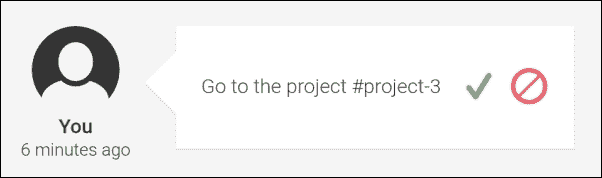
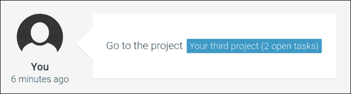
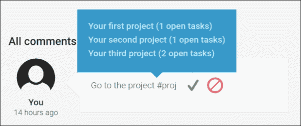
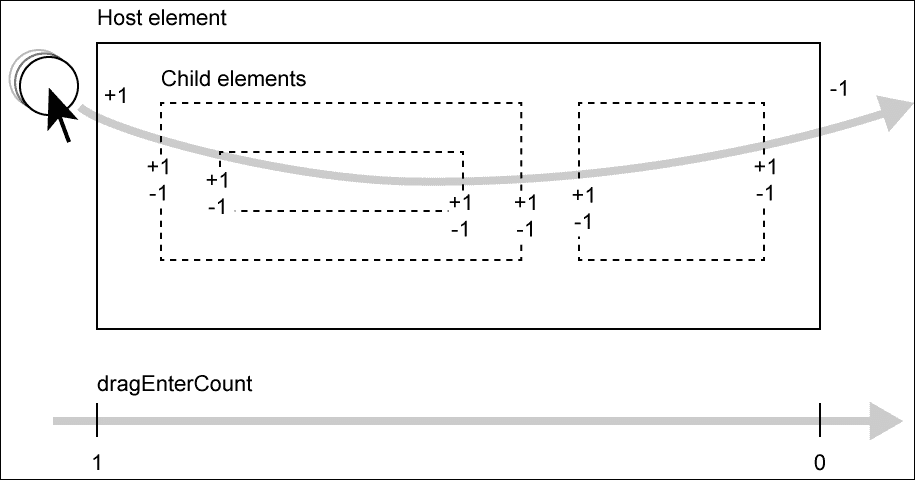

# 第七章。用户体验组件

用户体验是当今应用程序开发者的核心关注点。我们不再生活在一个用户对仅仅能工作的应用程序感到满意的世界。期望值要高得多。现在，一个应用程序需要高度可用，并且应该提供高效的工作流程；用户还期望它在执行任务时能带来愉悦。

在本章中，我们将探讨构建一些组件，这些组件将提高我们任务管理系统的整体可用性。这些功能将丰富当前的功能，并提供更高效的工作流程。

我们将开发以下三个技术特性，并将它们嵌入到我们当前的应用程序中，适用于任何地方：

+   **标签管理**：我们将启用在生成内容中使用标签，例如评论、活动和其他任何可以使用标签的地方。标签将帮助用户在内容和导航快捷方式之间建立链接。

+   **拖放**：我们将构建通用的组件，使拖放功能变得简单易用。通过启用拖放功能，我们将允许用户以更高的效率完成某些任务。

+   **无限滚动**：我们将构建一个组件，在滚动时揭示列表的内容。这个功能不会直接提高工作流程性能，但它将帮助我们提高整体应用程序性能。它还将通过仅显示相关信息来缩小用户的上下文。

本章我们将涵盖以下主题：

+   创建一个标签管理系统以输入和显示标签

+   创建一个有状态的管道，使用服务渲染标签

+   使用 `sanitize-html` 模块对可能不安全的内容进行清理

+   创建一个组件，在用户输入时自动完成标签

+   探索 HTML5 拖放 API 的基础知识

+   为可拖动元素和放置目标创建指令

+   使用 `dataTransfer` 对象和自定义属性来启用选择性的放置目标

+   使用星号模板语法创建一个自定义的 `ForOf` 重复器，以实现无限滚动

+   使用 `DoCheck` 生命周期钩子实现自定义更改检测，并使用 `IterableDiffer` 应用 DOM 变更

+   使用 `ViewContainer` 执行动态视图实例化

# 标签管理

经典的标签形式允许你将分类法与系统内的元素相关联，并帮助你组织项目。它允许你有一个可以快速管理的多对多关联，你可以在以后用它来过滤相关信息。

在我们的任务管理系统中，我们将使用一个略有不同的标签版本。我们的目标是提供一种在应用程序内实现语义快捷方式的方法。借助标签，用户应该能够在不同部分的数据之间交叉引用信息，提供所引用实体的摘要以及实体的导航快捷方式。

例如，我们可以在用户评论中包含一个`project`标签。用户可以通过简单地输入项目 ID 来输入标签。当显示评论时，我们看到项目的标题和项目中的打开任务数量。但是，当我们点击标签时，我们会直接到达任务所在的项目详情页面。

在本节中，我们将开发所需元素，以提供使用`project`标签的方法，这将使用户能够在评论中交叉引用其他项目。我们还将使用我们在上一章中创建的活动中的标签管理。

## 标签数据实体

让我们从表示我们如何在系统中表示标签的标签实体开始。我们将在`tags/tag.js`文件下创建一个新的`Tag`类：

```js
// Class that represents a tag
export class Tag {
  constructor(textTag, title, link, type) {
    // The textTag property is the text representation of the tag
 this.textTag = textTag;
 this.title = title;
 this.link = link;
 this.type = type;
  }
}
```

这个类代表标签；每次我们存储标签信息时，我们都会使用这个实体作为数据载体。让我们看看单个字段并详细说明它们的使用：

+   `textTag`：这是标签的文本表示。我们所有的标签都需要使用这种文本表示来唯一标识。我们可以如下定义标签的文本表示：

    +   文本标签始终以井号符号（`#`）开头

    +   文本标签只包含单词字符或减号符号（`-`）

    +   所有由其他属性（`title`、`link`和`type`）定义的标签内部结构都可以从`textTag`属性中推断出来。因此，它可以被视为一个 ID。

+   `title`：这是标签的一个相对较长的文本表示。它应尽可能包含有关主题的详细信息。在项目标签的情况下，这可能意味着项目标题、打开的标签数量、负责人和其他重要信息。由于这是在解析标签时将渲染的字段，因此保持内容相对紧凑将是有益的。

+   `link`：一个有效的 URL，当渲染标签时将使用它。这个 URL 将使链接可点击，并启用快捷导航。在我们将要创建的项目标签的情况下，这将是一个 URL 片段标识符，它将链接到指定的项目页面。

+   `type`：用于区分不同的标签，并为我们提供一种在更高粒度级别组织标签的方法。

到目前为止，一切顺利。我们现在有一个可以轻松构建的数据载体，用于传输有关标签的信息。

## 生成标签

我们下一步是创建一个工厂，为我们生成标签。我们希望传递给工厂的只是一个主题，这可以是基本上任何东西。然后，工厂将确定主题的类型并执行必要的逻辑来从它生成标签。这听起来可能一开始有点抽象，但让我们看看我们将在`tags/generate-tag.js`模块中创建的`generateTag`函数的代码：

```js
import {Tag} from './tag';
import {limitWithEllipsis} from '../utilities/string-utilities';
export const TAG_TYPE_PROJECT = 'project';

// The generateTag function is responsible for generating new tag 
// objects depending on the passed subject
export function generateTag(subject) {
  if (subject.type === TAG_TYPE_PROJECT) {
    // If we're dealing with a project here, we generate the 
    // according tag object
    const openTaskCount = subject.tasks.filter((task) => !task.done).length;
    return new Tag(
 `#${subject._id}`,
 `${limitWithEllipsis(subject.title, 20)} (${openTaskCount} open tasks)`,
 `#/projects/${subject._id}/tasks`,
 TAG_TYPE_PROJECT
 );
  }
}

```

让我们检查`generateTag`函数以及我们在这里试图实现的目标。

首先，我们通过检查`subject`对象的类型属性来确定主题类型。在项目数据对象的情况下，我们知道类型将被设置为`"project"`。以下三个要点简要说明了我们所做的工作：

1.  由于我们确信我们正在处理一个项目，所以我们生成了一个新的标签。在未来，我们还将处理其他主题类型，因此这个检查将是必需的。

1.  我们希望在标签标题中使用一个指标来表示所有未完成的任务。因此，我们在项目中快速筛选了未完成的任务，并将筛选数组的长度存储在`openTaskCount`常量中。

1.  现在，我们可以使用项目 ID 作为`textTag`实例化一个新的`Tag`对象。对于`title`字段，我们使用了一个辅助函数`limitWithElipsis`，该函数截断超过 20 个字符的项目标题。我们还把未完成的任务计数追加到标签标题中。对于`Tag`实例的`link`字段，我们指定一个将导航到项目详情视图的 URL。最后，我们使用`TAG_TYPE_PROJECT`常量来定义标签的`type`字段。

## 创建标签服务

好的，我们已经设置好了所有需要的辅助结构；现在我们可以继续创建标签服务。标签服务将承担以下职责：

+   **生成和缓存标签**：如果我们只想渲染标签，我们不会在我们的系统中随意创建标签。标签服务的机制更像是一个生成缓存。最初，标签服务收集生成系统内所有可能标签所需的所有信息。它还会对变化做出反应，并在需要时更新标签列表。这样，我们不仅可以节省一些处理需求，而且我们还将有一个现成的列表来搜索现有标签。如果我们想向用户展示可用的标签以便他们从中选择，这将特别有用。

+   **渲染标签**：标签服务还负责将标签转换为 HTML。它使用`Tag`实例的`title`和`link`字段来生成它们的 HTML 表示。

+   **解析文本内容**：标签服务的解析功能负责在字符串中找到标签的文本表示。然后它使用渲染函数将这些标签渲染成 HTML。

让我们在`tags/tags-service.js`下的新文件中为我们的标签服务创建一个模块。

首先，我们需要创建两个实用函数，这些函数将帮助我们处理标签以及包含标签文本表示的字符串。

`replaceAll`函数是一个简单的替代方案，用于在没有使用正则表达式的情况下替换字符串中的多个文本出现：

```js
// Utility function to replace all text occurrences in a string
function replaceAll(target, search, replacement) {
  return target.split(search).join(replacement);
}
```

`findTags` 函数将从文本字符串中提取任何可能的标签。它是通过应用一个正则表达式来完成的，该正则表达式将找到与话题开头讨论的格式匹配的标签。这个格式假设我们的标签总是以一个井号符号开始，后面跟着任何单词字符或破折号符号。这个函数返回所有可能的文本标签列表：

```js
// Function to find any tags within a string and return an array 
// of discovered tags
function findTags(str) {
  const result = [];
 const regex = /#[\w\/-]+/g;
  let match;
 while (match = regex.exec(str)) {
 result.push(match[0]);
 }
  return result;
}
```

对于我们的标签服务，我们现在将定义一个新的类，该类将使用 `@Injectable` 进行注解，这样我们就可以将其用作组件中的提供者：

```js
@Injectable()
export class TagsService {
...
}
```

让我们看看我们的 `TagsService` 类的构造函数：

```js
constructor(@Inject(ProjectService) projectService) {
  // If the available tags within the system changes, we will 
  // emit this event
 this.change = new ReplaySubject(1);
  // In order to generate project tags, we're making use of the 
  // ProjectService
  this.projectService = projectService;
 this.projectService.change.subscribe((projects) => {
    // On project changes we store the new project list and re-
    // initialize our tags
    this.projects = projects;
 this.initializeTags();
 });
}
```

为了生成和缓存项目标签，我们显然需要 `ProjectService`，它为我们提供所有项目的列表。我们不是一次性从 `ProjectService` 中获取列表数据，而是在观察列表的变化。这带来了优势，我们不仅会得到初始的项目列表，还会意识到项目列表中的任何更改。

我们使用 `change` 字段订阅了 `ProjectService`。这暴露了 `ReplaySubject`，它发出项目列表。在将当前项目列表存储为成员字段后，我们需要调用 `initializeTags` 方法：

```js
// This method is used internally to initialize all available tags
initializeTags() {
  // We're creating tags from all projects using the generateTag 
  // function
  this.tags = this.projects.map(generateTag);
  // Since we've updated the list of available tags we need to 
  // emit a change event
 this.change.next(this.tags);
}
```

由于我们目前只支持项目标签，因此在生成标签时，我们唯一需要考虑的是我们存储在服务中的项目。我们可以简单地使用我们的 `generateTag` 函数将存储在 `projects` 成员字段中的项目列表进行映射。`Array.prototype.map` 函数将返回一个新的数组，该数组已经是为项目生成的任务列表。

## 标签渲染

好的，我们现在有一个使用反应式方法从可用项目中生成标签的服务。这已经解决了我们服务的第一个问题。让我们看看它的其他职责，即解析文本内容以查找标签和渲染 HTML。

由于我们已经以一种干净的方式抽象了标签的数据模型，标签渲染并不是什么大问题。我们需要编写一个方法来渲染标签，如果参数不是一个有效的 `Tag` 实例，它将作为一个透传函数。这样，我们可以将未识别的标签文本表示作为字符串传递，它将只返回字符串。

由于标签有指向位置的 URL，我们将使用锚点 HTML 元素来表示我们的标签。这些元素也有类，可以帮助我们以不同于常规内容的方式对标签进行样式化。让我们在标签服务中创建另一个方法，该方法可以用来将标签对象渲染成 HTML：

```js
renderTag(tag) {
 if (tag instanceof Tag) {
 return `<a class="tags__tag tags__tag--${tag.type}" href="${tag.link}">${tag.title}</a>`;
 } else {
 return tag;
 }
}
```

以下方法可以用来通过其文本表示形式查找标签。这个函数将尝试在我们的生成缓存中找到标签，如果失败，将返回 `textTag` 参数。这也是一种透传机制，它简化了当我们解析整个文本以查找标签时的处理：

```js
// This method will lookup a tag via its text representation or 
// return the input argument if not found
parseTag(textTag) {
 return this.tags.find(
 (tag) => tag.textTag === textTag
 ) || textTag;
}
```

最后但同样重要的是，让我们实现服务的主方法。`parse` 函数会扫描整个文本以查找标签，并将它们替换为它们的 HTML 表示形式：

```js
// This method takes some text input and replaces any found and 
// valid text representations of tags with the generated HTML 
// representation of those tags
parse(value) {
  // First we find all possible tags within the text
 const tags = findTags(value);
  // For each found text tag, we're parsing and rendering them 
  // while replacing the text tag with the HTML representation 
  // if applicable
 tags.forEach(
 (tag) => value = replaceAll(value, tag, 
 this.renderTag(this.parseTag(tag))));
 );
  // After all tags have been rendered, we're using a sanitizer 
  // to ensure some basic security
 return value;
}
```

首先，我们需要使用`findTags`实用函数；这将返回一个列表，其中包含它会在传递给`parse`函数的字符串内容中找到的所有文本标签。使用这个文本标签列表，我们可以然后遍历列表，并使用`renderTag`方法连续替换内容中的所有文本标签，以生成相应的 HTML。

## 集成任务服务

我们的任务服务的所有问题现在都已得到解决，并且它已经为可用的项目存储了标签。我们现在可以继续将我们的服务集成到应用程序中。

由于我们的标签服务将文本中的简单哈希标签转换为带有链接的 HTML，因此管道将是一个完美的助手，以在我们的组件中集成该功能。

让我们在`pipes`文件夹中创建一个`tags.js`文件，并创建一个新的管道类，即`Tags`：

```js
import {Pipe, Inject} from '@angular/core';
import {TagsService} from '../tags/tags-service';

@Pipe({
  name: 'tags',
  // Since our pipe is depending on services, we're dealing with a 
  // stateful pipe and therefore set the pure flag to false
 pure: false
})
export class TagsPipe {
  constructor(@Inject(TagsService) tagsService) {
 this.tagsService = tagsService;
  }
  // The transform method will be called when the pipe is used within a template
  transform(value) {
    if (typeof value !== 'string') {
      return value;
    }
    // The pipe is using the TagsService to parse the entire text
 return this.tagsService.parse(value);
  }
}
```

我们已经创建了一些管道。然而，这个管道有点不同，因为它不是一个纯管道。如果管道的转换函数总是为给定的输入返回相同的输出，则认为管道是纯的。这意味着转换函数不应依赖于任何其他可能影响转换结果的外部来源，唯一的依赖是输入值。然而，我们的`Tags`管道并非如此。它依赖于`TagsService`来转换输入，并且可以在任何时间将新标签存储在标签服务中。连续的转换可以成功渲染刚刚不存在的标签。

通过告诉 Angular 我们的管道不是纯的，我们可以禁用它在纯管道上执行的优化。这也意味着 Angular 需要在每次变更检测时重新验证管道的输出。这可能会导致性能问题；因此，应谨慎使用纯标志。

好了，就渲染标签而言，我们已经准备好了。让我们将我们的标签功能集成到`Editor`组件中，这样我们就可以在评论系统中使用它们。

让我们从编辑位于`ui/editor/editor.js`下的`Editor`模块开始：

```js
...
import {TagsPipe} from '../../pipes/tags';

@Component({
  selector: 'ngc-editor',
  ...
 pipes: [TagsPipe]
})
export class Editor {
  ...
 @Input() enableTags;
  ...
}
```

首先，我们导入了`TagsPipe`类，并将其引用到`@Component`注解的`pipes`配置中。

我们还向`enableTags`组件添加了一个新的输入，这将允许我们控制是否应该处理编辑器内容中的标签或忽略它们。

就组件文件的变化而言，到此为止。让我们通过编辑`ui/editor/editor.html`文件来对组件的模板应用一些更改：

```js
...
<div *ngIf="enableTags" class="editor__output" 
 [innerHtml]="(content || '-') | tags"></div>
<div *ngIf="!enableTags" class="editor__output">
  {{content || '-'}}
</div>
...
```

我们在模板中做的唯一改变是显示编辑器内容的位置。我们通过使用`NgIf`星号模板语法使用了两个模板元素。后者，如果标签被禁用，将渲染之前的内容。如果标签被启用，我们将使用属性绑定到编辑器输出 HTML 元素的`innerHTML`属性。这允许我们渲染 HTML 内容。在绑定中，我们使用了我们的`Tags`管道，该管道将使用`TagService`解析内容以查找标签。

## 标签服务的完成

在这一点上，让我们暂时偏离一下。我们已经创建了一个标签系统，并且我们刚刚通过使用`Tags`管道将其集成到我们的`Editor`组件中。如果用户现在在任意评论中编写项目标签，它们将通过`TagsService`进行渲染。这太棒了！用户现在可以在评论中建立与其他项目的交叉链接，这些链接将自动渲染为显示项目标题和开放任务的链接。用户需要做的只是将项目标签的文本表示添加到评论中。在书籍的默认数据集中，这可能是`#project-1`字符串。

以下两张图片展示了评论系统的示例。第一张图片是编辑模式下编辑器的示例，在评论系统中输入了一个文本标签：



输入文本标签的示例

第二张图片是评论系统中通过我们的编辑器集成启用的渲染标签的示例：



通过编辑器集成渲染的标签示例

在标签输入方面，我们还没有完成。我们不能期望我们的用户知道系统中的所有可用标签，然后在评论中手动输入它们。让我们看看在下一节中我们如何改进这一点：

在本节中，我们探讨了以下概念：

1.  我们构建了一个生成、缓存和渲染标签的标签服务。

1.  我们使用`pure`标志构建了一个有状态的管道。

1.  我们使用了`[innerHTML]`属性绑定将 HTML 内容渲染到元素中。

# 支持标签输入

在这里，我们将构建一个组件及其支持结构，以便为用户提供一个顺畅的标签输入体验。到目前为止，他们可以编写项目标签，但需要他们知道项目 ID，这使得我们的标签管理变得毫无用处。我们希望做的是，当用户准备编写标签时，为他们提供一些选择。理想情况下，当他们开始通过输入哈希符号（*#*）编写标签时，我们立即显示可用的标签。

起初听起来很简单的事情实际上实现起来相当棘手。我们的标签输入需要处理以下挑战：

+   处理输入事件以监控标签创建。我们需要知道用户何时开始编写标签，以及当输入的标签名称被无效的标签字符更新或取消时，我们需要知道何时更新。

+   计算用户输入光标的位置。是的，我知道这听起来很简单，但实际上并不简单。计算用户输入光标的视口偏移位置需要使用浏览器的 Selection API，这是一个相当低级的 API，需要一些抽象。

为了应对这些挑战，我们将引入一个实用类，我们可以将用户输入委托给它。它将帮助我们了解我们感兴趣的细节，并处理低级 API。

## 创建标签输入管理器

在`tags/tag-input-manager.js`的新文件中创建一个模块。代码的第一部分是一个函数，它将帮助我们确定当用户开始输入标签时用户输入光标的位置：

```js
// This function can be used to find the screen coordinates of the 
// input cursor position
function getRangeBoundlingClientRect() {
  const selection = window.getSelection();
  if (!selection.rangeCount) return;

  const range = selection.getRangeAt(0);

  if (!range.collapsed) {
    return range.getBoundingClientRect();
  }

  const dummy = document.createElement('span');
  range.insertNode(dummy);
  const pos = dummy.getBoundingClientRect();
  dummy.parentNode.removeChild(dummy);
  return pos;
}
```

这里就不详细说明了。这段代码的基本功能是尝试找到描述光标位置相对于视口的`top`、`right`、`bottom`和`left`偏移量的`DOMRect`对象。问题是 Selection API 不允许我们直接获取光标的位置；它只允许我们获取当前选择的位置。如果光标放置不正确，我们需要在光标位置插入一个占位元素，并返回占位元素的`DOMRect`对象。当然，在返回`DOMRect`对象之前，我们需要再次移除占位元素。

现在，让我们在`lib/tags/tag-input-manager.js`下创建一个新的类`TagInputManager`，它将处理标签创建的用户输入处理：

```js
export class TagInputManager {
  constructor() {
    this.reset();
  }
  ...
```

在构造函数中，我们需要调用一个内部`reset`方法。这个`reset`方法将重置`TagInputManager`将公开的两个成员字段。`position`成员将存储最新光标的位置，即用户开始编写标签的地方。`textTag`成员将存储当前标签，该标签由`TagInputManager`识别：

```js
reset() {
  this.textTag = '';
  this.position = null;
}
```

现在让我们创建一个方法来确定用户是否正在输入标签的过程中。如果`textTag`成员以哈希符号开头，我们可以假设有一个标签正在输入中：

```js
hasTextTag() {
  return this.textTag[0] === '#';
}
```

我们还需要一个方法，允许我们更新当前输入的文本标签以及更新的光标位置：

```js
updateTextTag(textTag, position = this.position) {
  this.textTag = textTag;
  this.position = position;
}
```

在`onKeyDown`方法中，我们期望接收委托的`keydown`事件。我们关注的是退格键，它应该也会移除当前输入的标签的最后一个字符。

```js
onKeyDown(event) {
  // If we receive a backspace (key code is 8), we need to 
  // remove the last character from the text tag
  if (event.which === 8 && this.hasTextTag()) {
    this.updateTextTag(this.textTag.slice(0, -1));
  }
}
```

在`onKeyPress`方法中，我们期望接收委托的按键事件。这是这个辅助类的主要逻辑所在。在这里，我们处理两种不同的情况：

+   如果按下的键是哈希符号，我们将重新开始一个新的标签。

+   如果按下的键不是有效的单词字符或哈希符号，我们将将其重置为其初始状态，这将取消标签输入。否则，这意味着我们正在处理一个有效的标签字符，我们将将其添加到当前文本标签字符串中。

以下是相应的代码：

```js
onKeyPress(event) {
  const char = String.fromCharCode(event.which);
  if (char === '#') {
    // If the current character from user input is a hash symbol 
    // we can initiate a new text tag and set the current 
    // position
    this.updateTextTag('#', getRangeBoundlingClientRect());
  } else if ((/[\w-]/i).test(this.textTag[0])) {
    // If the current character is not a valid tag character we 
    // reset our state and assume the tag entry was canceled
    this.reset();
  } else if (this.hasTextTag()) {
    // If we have any other valid tag character input, we're 
    // updating our text tag
    this.updateTextTag(this.textTag + char);
  }
}
```

好的，现在我们有了处理标签输入所需的所有支持。然而，我们仍然需要一个方法来向用户显示`TagsService`中的可用标签。为此，我们将创建一个新的`TagsSelect`组件。

## 创建标签选择组件

为了帮助用户找到正确的标签，我们将提供一个包含可用标签的下拉菜单。为此，我们需要使用我们的`TagInputManager`类来识别用户输入中的标签以及使用用户输入过滤可用标签。让我们简要看看该组件的要求：

+   在工具提示/调用框中显示从`TagsService`收集的可用的标签

+   它应该支持显示标签的限制

+   它应该支持一个输入来过滤可用的标签

+   组件应该接受一个输入参数来定位调用框

+   用户在列表标签中点击标签时，组件应该发出一个事件

+   如果过滤器无效或没有元素匹配过滤器，组件应该隐藏自己：

    完成带有用户输入过滤的标签选择组件

让我们从组件类开始，看看我们如何满足这些要求。首先，在`tags/tags-select`下创建一个名为`tags-select.js`的新文件：

```js
...
@Component({
  selector: 'ngc-tags-select',
  ...
})
export class TagsSelect {
  ...
}
```

在我们的`@Component`注解中，我们没有特殊之处要处理。让我们从实现组件的内部开始。首先，我们将在组件中定义以下输入：

```js
@Input() filter;
```

使用`filter`输入，我们可以将过滤标签传递给`TagsSelect`组件。这意味着我们将使用`filter`输入通过`title`和`text`标签过滤可用的标签。

`limit`输入可以设置为任何数字。此输入用于限制在组件内显示的过滤标签数量：

```js
@Input() limit;
```

`position`输入应设置为包含`top`和`left`属性的合法`DOMRect`对象。它们将用于定位我们的组件：

```js
@Input() position;
```

`tagSelected`输出属性用于在用户在标签列表中点击标签时发出事件：

```js
@Output() tagSelected = new EventEmitter();
```

以下访问器属性绑定到宿主元素的显示样式属性。它将控制组件是显示还是隐藏。我们仅在过滤器有效且过滤后的标签至少包含一个标签时显示组件：

```js
@HostBinding('style.display')
get isVisible() {
  if (this.filter[0] === '#' && this.filteredTags.length > 0) {
    return 'block';
  } else {
    return 'none';
  }
}
```

以下两个访问器属性使用宿主绑定来设置宿主元素的`top`和`left`样式，这些样式基于组件的`position`输入：

```js
@HostBinding('style.top')
get topPosition() {
  return this.position ? `${this.position.top}px` : 0;
}

@HostBinding('style.left')
get leftPosition() {
  return this.position ? `${this.position.left}px` : 0;
}
```

让我们将`TagsService`注入到我们的组件中，这样我们就可以访问可用的标签列表：

```js
constructor(@Inject(TagsService) tagsService) {
  this.tagsService = tagsService;
  // This member is storing the filtered tag list
  this.filteredTags = [];
  this.filter = '';
}
```

我们需要使用`OnInit`生命周期钩子来设置对`TagService`更改观察器的订阅。这样，我们将能够访问初始标签列表以及列表中的任何更改。在收到新的标签列表后，我们需要重新应用过滤：

```js
ngOnInit() {
  // The TagsService is providing us with all available tags 
  // within the application
  this.tagsSubscription = this.tagsService.change.subscribe(
    (tags) => {
      // If the available tags change we store the new list and 
      // execute filtering again
      this.tags = tags;
 this.filterTags();
    }
  );
}
```

以下是在点击标签时从模板中调用的方法。我们将仅使用`tagSelected`输出重新发射该标签：

```js
onTagClick(tag) {
 this.tagSelected.next(tag);
}
```

`filterTags`方法负责根据过滤和限制输入属性以及从`TagsService`提供的可用标签来过滤和限制我们的标签列表。因此，它将在`filteredTags`成员字段中存储过滤和限制后的列表：

```js
filterTags() {
  this.filteredTags = this.tags
    .filter((tag) => {
      return tag.textTag.indexOf(this.filter.slice(1)) !== -1 ||
 tag.title.indexOf(this.filter.slice(1)) !== -1;
    })
    .slice(0, this.limit);
}
```

如果输入属性过滤或限制发生变化，我们需要重新应用我们的过滤方法。通过实现`ngOnChanges`生命周期钩子，我们可以轻松地管理这一需求：

```js
ngOnChanges(changes) {
  // If the filter or the limit input changes, we're filtering the 
  // available tags again
 if (this.tags && (changes.filter || changes.limit)) {
 this.filterTags();
 }
}
```

最后，如果`TagsSelect`组件被销毁，我们应该从`TagsService`的变化可观察对象中取消订阅：

```js
ngOnDestroy() {
  this.tagsSubscription.unsubscribe();
}
```

我们的组件模板相当简单。让我们看看存储在`tags/tags-select/tags-select.html`下的视图模板：

```js
<ul class="tags-select__list">
  <li *ngFor="let tag of filteredTags"
 (click)="onTagClick(tag)"
      class="tags-select__item">{{tag.title}}</li>
</ul>
```

我们使用了`NgFor`指令来遍历`filteredTags`成员中的所有标签。如果点击了一个标签，我们需要执行`onTagClicked`方法并传递当前迭代的标签。在列表中，我们只显示有助于用户识别他们想要使用的标签的标签标题：

现在我们已经构建了我们需要的所有部分，以实现用户平滑地输入标签。让我们再次修补我们的`Editor`组件以包含我们的更改：

## 在编辑器组件中集成标签输入

作为第一步，我们应该修改我们的`Editor`组件以利用`TagInputManager`类。我们需要将内容可编辑元素内的用户输入委派给标签输入管理器，以便它可以检测任何标签输入。然后，我们将使用`TagInputManager`的信息来控制`TagsSelector`组件：

首先，让我们看看需要在位于`ui/editor/editor.js`下的`Component`类内部进行的必要更改：

```js
...
import {TagsSelect} from '../../tags/tags-select/tags-select';
import {TagInputManager} from '../../tags/tag-input-manager';

@Component({
  selector: 'ngc-editor',
  ...
 directives: [TagsSelect]
})
export class Editor {
  ...
    // We're using a TagInputManager to help us dealing with tag 
    // creation
 this.tagInputManager = new TagInputManager();
  }
  ...
  // This method is called when the editable element receives a 
  // keydown event
  onKeyDown(event) {
    // We're delegating the keydown event to the TagInputManager
 this.tagInputManager.onKeyDown(event);
  }

  // This method is called when the editable element receives a 
  // keypress event
  onKeyPress(event) {
    // We're delegating the keypress event to the TagInputManager
 this.tagInputManager.onKeyPress(event);
  }

  // This method is called if the child TagSelect component is 
  // emitting an event for a selected tag
  onTagSelected(tag) {
    // We replace the partial text tag within the editor with the 
    // text representation of the tag that was selected in the 
    // TagSelect component.
 this.setEditableContent(
 this.getEditableContent().replace(
 this.tagInputManager.textTag, tag.textTag
 )
 );
 this.tagInputManager.reset();
  }
  ...
}
```

在我们的`@Component`注解中，我们将`TagsSelect`组件添加到指令属性中，这样我们就可以在模板中使用该组件：

为了帮助我们完成标签输入的所有底层处理，我们使用了`TagInputManager`并在组件构造函数中创建了一个新的实例：

我们现在创建了两个方法来处理来自我们可编辑内容元素的`keypress`和`keydown`事件。这些方法将事件委派给`TagInputManager`，它将处理所有提取文本标签和光标位置的加工：

最后，我们添加了一个方法，当在`TagsSelect`组件中点击标签时将被调用。在这里，我们简单地替换了当前输入的文本标签，用被点击的标签的文本表示形式替换。这提供了一种简单的自动完成实现。在我们将点击的标签的文本表示形式添加到内容可编辑元素后，我们将重置`TagInputManager`以清除其状态：

现在唯一剩下的是编辑`Editor`组件的模板，以便包含`TagsSelect`组件：

在`ui/editor/editor.html`文件中，我们需要进行以下更改：

```js
...
<ngc-tags-select *ngIf="enableTags"
 [filter]="tagInputManager.textTag"
 [position]="tagInputManager.position"
 [limit]="5"
 (tagSelected)="onTagSelected($event)">
</ngc-tags-select>
```

`NgIf`指令帮助我们避免在编辑器中未启用标签时创建组件：

我们从我们的`TagInputManager`实例中的数据设置了`TagsSelect`组件的`filter`和`position`输入。

在`TagsSelect`组件的`tagSelected`事件中，我们调用了我们刚才创建的`Editor`组件上的`onTagSelected`方法。

这就是我们对`Editor`组件模板需要做的所有事情。

## 完成我们的标签系统

恭喜！您已经成功实现了三个可用性组件中的第一个。

在`TagInputManager`类的帮助下，我们将用户输入的低级处理和用户光标位置的处理工作外包出去。然后，我们创建了一个组件来向用户显示可用的标签，并提供了他们通过点击来选择标签的方法。在我们的`Editor`组件中，我们使用了`TagInputManager`类和`TagsSelect`组件，以实现编辑评论和其他我们启用了标签功能的地方的标签的顺畅输入。

在本节中，我们涵盖了以下概念：

1.  我们在指定的管理类中处理了复杂的用户输入，以从我们的组件中卸载逻辑。

1.  我们使用了宿主绑定来设置位置样式属性。

1.  我们实现了完全响应式的组件，这些组件依赖于可观察的，并在变化检测期间不创建副作用。

# 拖放

我们已经学会了高效地使用我们的计算机鼠标和键盘。使用快捷键、不同的点击动作和上下文鼠标菜单在执行任务时为我们提供了很好的支持。然而，鉴于当前移动和触摸设备的炒作，最近有一个模式再次引起了更多关注。拖放动作是表达移动或复制项目等动作的一种非常直观和逻辑的方式。在用户界面中执行的一项任务特别受益于拖放，例如在列表中排列项目。如果我们需要通过动作菜单来排列项目，这会变得非常混乱。使用上下按钮逐步移动项目效果很好，但需要花费很多时间。如果您可以将项目拖动到您希望它们重新排列的位置，您就可以非常快速地对项目列表进行排序。

在这个主题中，我们将构建所需的元素以实现选择性的拖放。我们将使用拖放功能来使用户能够重新排列他们的任务列表。通过开发可重用的指令来提供此功能，我们可以在稍后应用程序的任何其他位置启用此功能。

为了实现我们的指令，我们将利用 HTML5 拖放 API，该 API 在撰写本书时得到了所有主流浏览器的支持。

由于我们希望在多个组件上重用我们的拖放行为，我们将使用指令来实现。在本节中，我们将创建两个指令：

+   **可拖动指令**：这个指令应该附加到组件上，这些组件应该被启用以进行拖动

+   **可拖动目标区域指令**：这个指令应该附加到将作为目标区域的组件

我们还将实现一个功能，允许我们选择哪些元素可以拖动到哪些位置。为此，我们将在我们的可拖动指令中使用类型属性，同时在我们的目标区域中使用接受类型属性。

## 实现可拖动指令

`draggable` 指令将被附加到可以拖动到其他元素上的元素。让我们在 `draggable/draggable.js` 下创建一个新的指令类：

```js
...
@Directive({
  selector: '[draggable]',
  host: {
    class: 'draggable',
    // Additionally to the class we also need to set the HTML 
    // attribute draggable to enable draggable browser behavior
 draggable: 'true'
  }
})
export class Draggable {
  ...
}
```

我们现在使用 `@Directive` 注解而不是 `@Component` 注解，让 Angular 知道以下类是一个指令类。通过将 HTML 属性 `draggable` 设置为 `true`，我们告诉浏览器我们正在考虑这个元素为可拖动元素。

### 小贴士

与组件相比，使用指令的一个重大区别是它们不包含视图，只包含行为。因此，也可以在同一个元素上使用多个指令，这是组件所不可能的。

让我们看看我们新创建的组件类的输入：

```js
@Input() draggableData;
```

`draggableData` 输入用于指定表示可拖动元素的的数据。一旦拖动操作完成，这些数据将被序列化为 JSON 并传输到我们的目标区域。

通过指定可拖动类型，当元素拖动到目标区域上时，我们可以更加选择性地操作。在目标区域内，我们可以有一个对应的部分来控制哪些类型是被接受的。

```js
@Input() draggableType;
```

除了我们的输入之外，我们还想使用主机绑定来设置一个特殊类，如果元素当前正在被拖动：

```js
@HostBinding('class.draggable--dragging') dragging;
```

这个绑定将设置一个 `draggable--dragging` 类，这将应用一些特殊样式，使得识别出被拖动的元素变得容易。

现在我们需要在我们的指令中处理两个事件来实现可拖动元素的行为。以下 DOM 事件由拖放 DOM API 触发：

+   `dragstart`：这个事件在元素被抓住并在屏幕上移动时发出

+   `dragend`：如果之前启动的元素拖动因为成功放置或释放到有效的目标区域外而结束，这个 DOM 事件将被触发。

让我们看看 `dragstart` 事件的 `HostListener` 的实现：

```js
// We're listening for the dragstart event and initialize the 
// dataTransfer object
@HostListener('dragstart', ['$event'])
onDragStart(event) {
  event.dataTransfer.effectAllowed = 'move';
  // Serialize our data to JSON and set it on our dataTransfer 
  // object
 event.dataTransfer.setData(
 'application/json', 
 JSON.stringify(this.draggableData));
  // By adding the draggableType as a data type key within our 
  // The dataTransfer object, we enable drop zones to observe the type 
  // before receiving the actual drop.
  event.dataTransfer.setData(

 `draggable-type:${this.draggableType}`, '');
 this.dragging = true;
}
```

现在我们来讨论在实现我们的主机监听器时将执行的不同操作：

1.  我们需要在我们的宿主监听器中访问 DOM 事件对象。如果我们要在模板中创建这个绑定，我们可能需要写一些类似这样的代码：`(dragstart)="onDragStart($event)"`。在事件绑定中，我们可以使用合成变量`$event`，它是触发事件绑定的事件的引用。如果我们使用`@HostListener`注解在我们的宿主元素上创建事件绑定，我们需要使用装饰器的第二个参数来构造绑定的参数列表。

1.  在我们的事件监听器的第一个动作是设置`dataTransfer`对象上的期望`effectAllowed`属性。目前，我们只支持`move`效果，因为我们的主要关注点是使用拖放重新排序任务列表中的任务。拖放 API 非常特定于系统，但通常，如果用户在开始拖动时按住修饰键（如*Ctrl*或*Shift*），会有不同的拖放效果。在我们的`draggable`指令中，我们可以强制所有拖动动作都使用`move`效果。

1.  在下一个代码片段中，我们将设置通过拖动应该传输的数据。理解拖放 API 的核心目的是很重要的。它不仅提供了一种在您的 DOM 中仅对元素实现拖放的方法，而且还支持将文件和其他对象拖放到浏览器中。正因为如此，API 经历了一些限制，其中之一是使得除了简单的字符串值之外的数据传输变得不可能。为了使我们能够传输复杂对象，我们将使用`JSON.stringify`序列化`draggableData`输入的数据。

1.  由于 API 中的一些安全限制造成的另一个限制是，数据只能在成功放置后读取。这意味着如果用户只是悬停在元素上，我们无法检查数据。然而，当悬停在放置区域时，我们需要了解一些关于数据的事实。当进入放置区域时，我们需要知道可拖动元素的类型，这样我们就可以让放置区域发出是否接受该类型的信号。我们为此问题使用了一个小的解决方案。拖放 API 在我们将数据拖动到放置目标上时隐藏数据。然而，它告诉我们数据的类型。了解这个事实后，我们可以使用`setData`函数来编码我们的可拖动类型。仅访问数据键被认为是安全的，因此可以在所有放置区域事件中完成。

1.  最后，我们将拖动标志设置为`true`，这将导致类绑定重新验证并向元素添加`draggable--dragging`类。

在处理完`dragstart`事件后，我们只需要处理`dragend`事件来完成我们的`Draggable`指令。在绑定到`dragend`事件的`onDragEnd`方法中，我们唯一做的事情是将拖动成员设置为`false`。这将导致从宿主元素中移除`draggable--dragging`类：

```js
@HostListener('dragend')
onDragEnd() {
 this.dragging = false;
}
```

这就是我们的`Draggable`指令的行为。现在我们需要创建它的对应指令来提供拖放区域的行为。

## 实现拖放目标指令

拖放区域将作为容器，其中可拖动元素可以被放置。为此，我们将在`draggable/draggable-drop-zone.js`下创建一个新的指令，称为`DraggableDropZone`：

```js
@Directive({
  selector: '[draggableDropZone]'
})
export class DraggableDropZone {
  ...
}
```

这个`@Directive`注解没有什么特别之处。我们使用了一个属性选择器，因此它可以通过在 HTML 元素上使用`draggableDropZone`属性来附加。使用以下输入，我们可以指定在这个拖放区域中接受哪些类型的可拖动元素。这将帮助用户确定他们是否能够在接近拖放区域时放下可拖动元素：

```js
@Input() dropAcceptType;
```

在成功将元素拖放到拖放区域后，我们需要发出一个事件，以便使用我们拖放功能的组件能够相应地做出反应。为此，让我们创建一个名为`dropDraggable`的输出属性：

```js
@Output() dropDraggable = new EventEmitter();
```

`over`成员字段将存储一个已接受元素正在拖动过拖放区域的状态：

```js
@HostBinding('class.draggable--over') over;
```

以下方法将用于检查我们的拖放区域是否应该接受任何给定的拖放事件，通过检查我们的`dropAcceptType`成员。如果您还记得我们在创建`Draggable`指令时需要解决的安全问题，您将理解为什么这个判断相当简单：

```js
typeIsAccepted(event) {
  const draggableType = 
 Array.from(event.dataTransfer.types).find(
 (key) => key.indexOf('draggable-type') === 0
 );
 return draggableType && 
 draggableType.split(':')[1] === this.dropAcceptType;
}
```

我们只能读取某些事件中`dataTransfer`对象的数据类型，而数据本身在成功发生`drop`事件之前是隐藏的。为了绕过这个安全限制，我们将可拖动类型信息编码到数据键本身中。由于我们可以安全地列出所有数据类型，因此提取编码的可拖动类型信息并不太难。我们将搜索一个以`"draggable-type"`开头的数据类型键，然后通过列字符进行分割。列字符之后的值就是我们的类型信息，然后我们将它与`dropAcceptType`指令输入属性进行比较。

我们将使用两个事件来确定一个可拖动元素是否被移动到我们的拖放区域：

+   `dragenter`：如果另一个元素被拖动到它上面，则由元素触发

+   `dragleave`：如果之前进入的元素再次离开，则由元素触发

前面的事件有一个问题，就是它们实际上会冒泡，如果拖动的元素被移动到我们的拖放区域内的子元素中，我们将会收到一个`dragleave`事件。由于冒泡，我们还会从子元素那里收到`dragenter`和`dragleave`事件。在我们的情况下，这并不是我们想要的，我们需要构建一些功能来改进这种行为。我们将利用一个计数成员字段`dragEnterCount`，它将计数到所有的`dragenter`事件，并递减到`dragleave`事件。这样，我们现在可以说，只有在`dragleave`事件中，当计数器变为零时，我们实际上才会离开我们的拖放区域。让我们看看以下说明问题的图示：



可视化我们计算中重要的变量和函数

让我们在`draggable/draggable-drop-zone.js`文件中实现这个逻辑，以构建我们拖放区域的适当进入和离开行为：

```js
constructor() {
  // We need this counter to know if a draggable is still over our 
  // drop zone
 this.dragEnterCount = 0;
}

// The dragenter event is captured when a draggable is dragged 
// into our drop zone
@HostListener('dragenter', ['$event'])
onDragEnter(event) {
  // Only handle event if the draggable is accepted by our drop 
  // zone
 if (this.typeIsAccepted(event)) {
 this.over = true;
    // We use this counter to determine if we loose focus because 
    // of child element or because of final leave
 this.dragEnterCount++;
 }
}

// The dragleave event is captured when the draggable leaves our 
// drop zone
@HostListener('dragleave', ['$event'])
onDragLeave(event) {
  // Using dragEnterCount, we determine if the dragleave event is 
  // because of child elements or because the draggable was moved 
  // outside the drop zone
 if (this.typeIsAccepted(event) && --this.dragEnterCount === 0) {
 this.over = false;
 }
}
```

在这两个事件中，我们首先检查事件是否携带一个我们接受的`dataTransfer`对象。在用我们的`typeIsAccepter`方法验证类型之后，我们处理计数器，并在必要时设置`over`成员字段。

我们还需要处理另一个对拖放功能很重要的事件，即`dragover`事件。在`dragover`事件中，我们可以设置当前拖动操作的接受`dropEffect`。这将告诉我们的浏览器，从我们的可拖动元素发起的拖动操作适合这个拖放区域。同样重要的是，我们需要防止默认的浏览器行为，以便我们的自定义拖放行为不受干扰。让我们添加另一个函数来处理这些关注点：

```js
@HostListener('dragover', ['$event'])
onDragOver(event) {
  // Only handle event if the draggable is accepted by our drop 
  // zone
  if (this.typeIsAccepted(event)) {
    // Prevent any default drag action of the browser and set the 
    // dropEffect of the dataTransfer object
 event.preventDefault();
 event.dataTransfer.dropEffect = 'move';
  }
}
```

最后，我们需要处理拖放区域中最重要的事件，即当用户将可拖动元素拖放到我们的拖放区域时触发的`drop`事件：

```js
// This event will be captured if a draggable element is dropped 
// onto our drop zone
@HostListener('drop', ['$event'])
onDrop(event) {
  // Only handle event if the draggable is accepted by our drop 
  // zone
  if (this.typeIsAccepted(event)) {
    // First obtain the data object that comes with the drop event
 const data = JSON.parse(
 event.dataTransfer.getData('application/json')
 );
    // After successful drop, we can reset our state and emit an 
    // event with the data
 this.over = false;
 this.dragEnterCount = 0;
 this.dropDraggable.next(data);
  }
}
```

在检查掉落元素是否为接受的类型之后，我们现在可以继续从事件中读取`dataTransfer`对象数据。这些数据之前由`Draggable`指令设置，需要使用`JSON.parse`进行反序列化。

由于拖放成功，我们可以重置我们的`dragEnterCount`成员，并将`over`标志设置为`false`。

最后，我们将使用我们的`dropDraggable`输出属性发出可拖动元素的反序列化数据。

这就是我们需要的所有内容，以拥有一个高度可重用的拖放行为，我们现在可以将其附加到我们应用程序中任何需要的地方。

## 在任务列表组件中集成拖放

我们现在可以在我们的`TaskList`组件中使用`Draggable`和`DraggableDropZone`指令，这样我们就可以通过拖放来启用任务的重新排序。

我们将这样做是通过将指令附加到`TaskList`组件模板中的任务元素上，我们将在这里渲染它们。是的，没错！我们希望使我们的`Task`组件既可以拖动也可以作为拖放区。这样，我们就可以将任务拖放到其他任务中，这为我们提供了重新排序的基础。我们将执行的操作是在拖放中重新排序列表，以便被拖放的任务将被挤压到它被放置的任务的正前方位置。

首先，让我们将指令应用到`TaskList`组件模板中的`<ngc-task>`元素上，即`task-list/task-list.html`：

```js
<div class="task-list__l-container">
  ...
  <ngc-task *ngFor="let task of filteredTasks"
            line:[task]="task
            (taskUpdated)="onTaskUpdated(task, $event)"
            (taskDeleted)="onTaskDeleted(task)"
 draggable
 draggableType="task"
 [draggableData]="task"
 draggableDropZone
 dropAcceptType="task"
 (dropDraggable)="onTaskDrop($event, task)">
  </ngc-task>
  ...
</div>
```

好的，使用前面的属性，我们已经使我们的任务不仅可拖动，还可以作为拖放区。通过将`draggableType`和`dropAcceptType`指定为字符串`"task"`，我们告诉我们的拖放行为这些任务元素可以被拖放到其他任务元素中。我们的`DraggableDropZone`指令被设置为在有效可拖动元素被放下时发出`dropDraggable`事件。为了处理被放置的任务，我们可以简单地使用此事件并在我们的`TaskList`组件中创建一个绑定到方法的事件。

让我们看看在`Component`类中，位于`task-list/task-list.js`下的哪些内容需要更改，以便使这个功能正常工作：

```js
...
import {Draggable} from '../draggable/draggable';
import {DraggableDropZone} from '../draggable/draggable-drop-zone';

@Component({
  selector: 'ngc-task-list',
  ...
 directives: [..., Draggable, DraggableDropZone]
})
export class TaskList {
  ...
  onTaskDrop(source, target) {
 if (source.position === target.position) {
 return;
 }

 let tasks = this.tasks.slice();
 const sourceIndex = tasks.findIndex(
 (task) => task.position === source.position
 );
 const targetIndex = tasks.findIndex(
 (task) => task.position === target.position
 );
 tasks.splice(targetIndex, 
 0, 
 tasks.splice(sourceIndex, 1)[0]);
 tasks = tasks.map((task, index) => {
 return Object.assign({}, task, {
 position: index
 });
 });
 this.tasksUpdated.next(tasks);
  }
  ...
}
```

让我们详细说明在模板中绑定到`DropZone`的`dropDraggable`事件上的`onTaskDrop`方法中的行为：

1.  如果你再次检查模板，你会看到我们使用以下表达式绑定到`onTaskDrop`方法：`(dropDraggable)="onTaskDrop($event, task)"`。由于拖放区发出的事件包含使用可拖动输入属性`draggableData`绑定的反序列化数据，我们可以安全地假设我们将收到一个被拖放到拖放区的任务的副本。作为绑定的第二个参数，我们添加了本地视图变量`task`，它实际上是作为拖放区的任务。因此，我们可以这样说，我们的`onTaskDrop`方法的第一参数代表源，而第二个参数代表目标任务。

1.  在我们的方法中的第一次检查，我们比较源位置和目标位置，如果它们匹配，我们可以假设任务是自己被放置的，我们不需要执行任何进一步的操作。

1.  现在，我们可以在任务数组中获取源任务和目标任务的索引，并执行嵌套的`splice`操作，以便我们可以从数组中的旧位置移除源任务，并将其添加到目标位置的正前方。

1.  现在剩下的工作就是重新计算任务的坐标字段，以便它们反映重新排序的数组。我们可以通过使用`Array.prototype.map`轻松完成此操作。

1.  作为最后一步，我们需要通知我们的父组件我们已经更新了任务列表。我们可以简单地使用`taskUpdated`事件来完成此操作。我们在添加或删除任务时使用了相同的事件。

这有多棒？我们已经成功地在任务列表上实现了拖放，提供了一个非常实用的功能来重新排列任务。

## 拖放回顾

通过使用低级拖放 API，使用事件和`dataTransfer`对象，我们已经实现了两个指令，现在可以在我们需要的任何地方执行平滑的拖放功能。

几乎不需要任何努力，我们就已经在任务列表上实现了拖放行为，为用户提供了一个重新排列列表中任务的不错功能。我们除了连接指令外，还需要实现一个方法，根据`DraggableDropZone`事件的信息来重新排列任务。

在本节中，我们处理了以下概念：

1.  我们学习了 HTML5 拖放 API 的基础知识。

1.  我们使用`dataTransfer`对象在拖放事件中安全地传输数据。

1.  使用指令构建可重用的行为模式。

1.  通过提供我们自己的自定义选择机制，使用自定义数据类型来编码可拖动类型信息，丰富了标准的拖放 API。

# 无限与更远！

显示一个平均大小的简单列表并不具有太多挑战性。一旦列表开始增长，挑战就开始出现。我们很容易用一个非常长的列表让用户感到不知所措。长列表也可能对我们的应用程序产生性能影响，尤其是在显示动态内容时。

解决显示长列表时面临的挑战的一种方法是通过提供分页。然而，分页并不总是翻译得很好。虽然在使用鼠标的桌面设备上进行分页看起来非常直观，但在具有触摸支持的移动设备上则变得繁琐。

在本章中，我们将探讨一种不同的方法，可以帮助我们减轻长列表的性能影响，同时在移动设备上提供流畅的体验。我们使用了一种有时被称为无限滚动的模式。目标是只显示足够多的项目以填满屏幕，并在用户向下滚动时按需加载更多项目。

为了实现这种行为，我们可以编写一个包装组件，该组件将提供一个无限滚动面板，并使用内容插入来包含我们的列表。然而，我们将使用不同的方法来实现我们的无限滚动行为，并构建一个自定义模板指令，例如`NgFor`。

## 星号语法和模板

到目前为止，我们已经大量使用了`NgFor`和`NgIf`指令，使用星号（`*`）符号来表示我们正在处理一个创建模板的指令。然而，我们还没有查看星号模板语法的结构。想象一下，它将为我们的模板创建某种语法糖。

查看以下使用星号模板语法的`NgFor`指令示例：

```js
<div *ngFor="let i of [1, 2, 3]">{{i}}</div>
```

Angular 的模板解析器将以特殊方式处理以星号开头的所有属性。前面的例子是以下更简单、更简洁的编写风格：

```js
<template ngFor #i [ngForOf]="[1, 2, 3]">
  <div>{{i}}</div>
</template>
```

前面的两个例子绝对相同。模板指令，如 `NgFor` 或 `NgIf`，利用 HTML 模板元素，我们已在 第一章 中简要讨论过，*组件化用户界面*。如果你考虑它们的本质，Angular 通用指令 `NgFor`、`NgIf` 和 `NgSwitch` 使用 HTML 模板元素的原因实际上是非常明显的。所有三个指令都需要动态地插入和删除我们的 DOM 中的大区域。例如，`NgIf` 会根据条件插入或删除它附加到的元素。通过利用模板元素，这可以通过浏览器的原生功能得到支持。

### 注意

如果你比较这里讨论的例子，很明显，第一种编写风格处理起来要简单得多。每次你想使用 `NgFor` 或 `NgIf` 时都要求你编写一个单独的模板元素，那将相当痛苦。这就是存在星号语法的原因，如果你喜欢的话，这就是它的存在理由。我们不需要直接编写模板元素，而可以在属性上使用星号，Angular 会将 HTML 部分转换为我们所需的模板元素。

`NgFor` 指令使用 `TemplateRef` 依赖项，这可以被注入到指令的构造函数中，以实例化模板或多个实例，根据需要。在去糖化过程中，`[ngForOf]` 属性绑定是通过在 `NgFor` 表达式中的 `NgFor` 指令名称后添加单词 `Of` 生成的。绑定是由 `NgFor` 指令创建的，它接受一个输入，`ngForOf`。

考虑以下例子：

```js
<div *test="let variable withSugar true">{{variable}}</div>
```

Angular 会将此简化为以下代码：

```js
<template test #variable [testWithSugar]="true">
  <div>{{variable}}</div>
</template>
```

这只是 Angular 去糖化星号模板语法的做法。这是一个将指令附加到模板元素以及一个输入绑定到模板元素的快捷方式。

仍然有一件事可能看起来有些令人困惑，那就是模板中的变量属性。让我们通过使用 `NgFor` 指令并别名指令公开的局部变量（如当前索引）来查看另一个例子：

```js
<div *ngFor="let n of [1, 2, 3]; let i = index">{{i}}: {{n}}</div>
```

这个例子将被简化为以下模板：

```js
<template ngFor #n #i="index" [ngForOf]="[1, 2, 3]">
  <div>{{i}}: {{n}}</div>
</template>
```

因此，我们现在可以从去糖化中得知，将创建额外的别名或映射作为模板元素中的变量映射。在 `NgFor` 指令类的代码中公开的索引作为局部视图变量映射到模板实例化内容中的局部视图变量。

那么，在我们的实例化模板中，局部视图变量 `n` 发生了什么？为什么我们能够访问 `n`，当只有一个没有任何值来告诉我们它映射到哪里的变量属性时？

我们已经了解到，当我们对常规元素使用哈希符号属性时，我们创建了一个局部视图引用。我们可以直接在视图中使用这个引用作为标识符，或者通过使用 `@ViewChild` 进行查询。然而，当 Angular 的视图编译器发现模板上看起来像局部视图引用的内容时，其行为略有不同。

我们目前看不到的是，Angular 实际上为模板元素上的变量属性隐含了一个默认值。它将为名为 `$implicit` 的局部视图变量创建一个映射。你可以将 `$implicit` 视为一个默认值，可以在指令中作为局部视图变量暴露，并在处理模板元素时提供一些便利。

同样，前面的示例也可以写成如下形式：

```js
<template ngFor #n="$implicit" #i="index" [ngForOf]="[1, 2, 3]">
  <div>{{i}}: {{n}}</div>
</template>
```

在这里，`NgFor` 指令正在暴露一个局部视图变量 `$implicit`，它是对在 `ngForOf` 输入中接收到的数组迭代期间与实例关联的当前值的引用。使用不带值的普通变量属性，Angular 将默认将其映射到 `$implicit`。因为我们不想每次都自己编写这个映射，所以我们可以只指定一个空的变量属性，Angular 会为我们处理。

## 创建无限滚动指令

由于我们现在对模板元素和 Angular 如何处理星号语法有了一些了解，我们实际上可以创建自己的 `NgFor` 复制，它还处理无限滚动的行为。

让我们在 `infinite-scroll/infinite-scroll.js` 下为我们的指令创建一个新文件：

```js
...
@Directive({
  selector: '[ngcInfiniteScroll]'
})
export class InfiniteScroll {
  ...
  // This input will be set by the for of template syntax
 @Input('ngcInfiniteScrollOf')
  set infiniteScrollOfSetter(value) {
    this.infiniteScrollOf = value;
    ...
  }
  ...

  applyChanges(changes) {
    ...
    this.bulkInsert(insertTuples).forEach((tuple) =>
      tuple.view.context.$implicit = tuple.record.item);
  }
  ...
}
```

我们首先声明一个对属性选择器 `ngcInfiniteScroll` 敏感的常规指令。前面的代码摘录仅显示了我们在前一个主题中讨论的模板元素处理的相关代码。有一些代码部分我们将在本主题的后面部分进行介绍。你可以看到我们使用了一个输入属性 `ngcInfiniteScrollOf`，它用于传递无限滚动中使用的项目列表。对于插入的模板实例，我们将局部视图变量 `$implicit` 设置为我们正在迭代的列表中的实际项目。

我们将在稍后讨论如何获取所有相关代码，但首先让我们看看我们如何在模板中使用这个指令：

```js
<div *ngcInfiniteScroll="#item of items">{{item}}</div>
```

根据前一个主题中描述的机制，前面的代码将简化为以下模板元素：

```js
<template ngcInfiniteScroll #item [ngcInfiniteScrollOf]="items">
  <div>{{item}}</div>
</template>
```

因此，我们现在可以告诉的是，项目数组将被放置为属性绑定到我们的模板元素上。相同的元素还包含 `InfiniteScroll` 指令。

在讨论了指令的用法以及如何将所需输入传递到指令之后，让我们看看实现无限滚动行为的详细实现。

我们的需求列表需要处理很多问题。让我们来看看一个高级需求列表：

+   它需要根据模板元素动态创建新的子视图，并删除不再需要的子视图。

+   它需要检测输入属性 `ngcInfiniteScrollOf` 的变化，该属性绑定到模板内的数组。仅使用简单的身份检查是不够的，因为我们希望创建前一个数组与新数组的比较，并且仅基于差异执行视图更改。为此，我们需要实现 `DoCheck` 生命周期回调。

+   它需要存储应最初显示的项目数，并通过检测滚动事件，显示的项目数应增加，以便更多项目可见。同时，滚动应触发变更检测，以便我们可以在视图中创建模板的新实例。

让我们从指令的构造函数开始：

```js
constructor(@Inject(ViewContainerRef) viewContainerRef,
 @Inject(TemplateRef) templateRef,
 @Inject(IterableDiffers) iterableDiffers,
 @Inject(ChangeDetectorRef) cdr) {
  // Using Object.assign we can easily add all constructor 
  // arguments to our instance
 Object.assign(this, 
 {viewContainerRef, templateRef, iterableDiffers, cdr});
  // How many items will be shown initially
 this.shownItemCount = 3;
  // How many items should be displayed additionally, when we 
  // scroll to the bottom
 this.increment = 3;
}
```

为了执行所有满足指令概述要求所需的操作，我们需要使用相当多的注入依赖项：

+   `ViewContainerRef` 依赖项帮助我们根据模板元素创建新的嵌入式视图，以及分离或完全删除现有视图。

+   `TemplateRef` 依赖项是对模板元素的引用，我们可以将其与 `ViewContainerRef` 依赖项结合使用，以创建新实例。

+   `IterableDiffers` 依赖项用于创建我们输入属性的差异，这是我们无限滚动重复器中关心的项目数组。它支持我们找到创建、删除和删除的项目。

+   `ChangeDetectorRef` 依赖项用于在我们实际需要时手动触发变更检测。

作为第一步，我们使用 `Object.assign` 将所有函数参数存储在指令的实例中。然后，我们设置两个成员变量，将存储与应显示的项目数量以及滚动时应增加的显示项目数量相关的信息。

构造函数的内容到此为止。我们还需要在指令中的视图初始化后执行一些操作。我们将使用 `ngOnInit` 生命周期钩子来完成此目的：

```js
  ngOnInit() {
    this.scrollableElement = findScrollableParent(
      this.viewContainerRef.element.nativeElement.parentElement);
    this.scrollableElement.addEventListener('scroll', this._onScrollListener);
  }
```

让我们更详细地看看这两行代码：

+   我们的无限滚动工作方式是检测可滚动父元素是否已经滚动到底部。如果是这种情况，我们需要从列表中渲染更多项目。为了检查我们的父元素是否已经滚动到底部，我们需要对其有一个引用。由于滚动事件不会冒泡，我们需要非常精确地监控它们的位置。这就是为什么我们使用一个实用函数来扫描 DOM 树以找到下一个可滚动的父元素。`findScrollableParent` 函数寻找第一个具有滚动条或窗口对象的父元素。如果您想查看该函数的内部结构，可以检查本章的源代码。

+   现在我们已经为找到的可滚动父元素添加了一个事件处理器，并将我们的内部`onScroll`方法注册为回调。

## 在我们的模板指令中检测变更

现在我们来看一下`ngcInfiniteScrollOf`属性设置器的完整代码，我们之前已经简要地看过：

```js
@Input('ngcInfiniteScrollOf')
set infiniteScrollOfSetter(value) {
  this.infiniteScrollOf = value;
  // Create a new iterable differ for the iterable `value`, if the 
  // differ is not already present
  if (value && !this.differ) {
 this.differ = this.iterableDiffers.find(value).create(this.cdr);
    }
}
```

当 Angular 每次`ngcInfiniteScrollOf`输入属性变化时，我们的属性设置器将被调用。由于这个属性通过模板语法的解糖绑定到我们在模板中引用的列表，我们可以假设这个值始终是一个数组或类似的可迭代结构。

除了将输入属性的新值存储到我们的指令实例上，我们还懒加载一个名为`differ`的成员字段。通过在`IterableDiffers`对象上调用`find`方法，我们可以获得一个与您正在处理的可迭代类型匹配的工厂（在我们的情况下，这将是一个普通的数组）。在获得的工厂上，我们可以调用`create`方法来创建一个新的差异。`create`方法期望传递一个`ChangeDetectorRef`对象。幸运的是，我们通过构造函数中的注入已经准备好了。

差异将帮助我们稍后检测数组现有值和更新值之间的变更。然后我们可以以非常高效的方式执行添加、移除和移动操作。

如果我们在`IterableDiffer`上调用`diff`方法，它将返回一个新的`IterableDiffer`对象，该对象包含相对于先前`IterableDiffer`对象的所有变更。在一个差异中，我们可以调用以下方法之一来遍历相关的`CollectionChangeRecord`：

+   `forEachItem`: 这通过提供一个回调函数来遍历差异中的每个`CollectionChangeRecord`。回调函数的第一个参数将是一个变更记录。

+   `forEachPreviousItem`: 这只遍历在先前的差异中已经存在于差异中的每个`CollectionChangeRecord`。

+   `forEachAddedItem`: 这只遍历从先前的差异到当前差异中添加的每个变更记录。

+   `forEachMovedItem`: 这只遍历被移动的每个变更记录。

+   `forEachRemovedItem`: 这只遍历被移除的变更记录

`CollectionChangeRecord`对象包含以下三个主要属性：

+   `item`: 对列表中我们正在使用`differ`观察变更的项目的一个引用

+   `previousIndex`: 在`differ`可迭代之前列表中项目的索引

+   `currentIndex`: 在`differ`可迭代之后列表中项目的索引

我们也可以仅从`previousIndex`和`currentIndex`的星座中判断出项目发生了什么。以下方法存在于一个`IterableDiffer`对象上：

+   **新增的项目**：如果`previousIndex`为 null 且`currentIndex`设置为有效数字，则可以识别出来

+   **已移动的项目**：如果`previousIndex`和`currentIndex`都设置为有效的数字，则可以识别出来

+   **已删除的项目**：如果`previousIndex`设置为有效的数字但`currentIndex`设置为`null`，则可以识别出来

现在，让我们看看`onScroll`方法，它将由可滚动容器元素的滚动事件回调调用。在这个方法中，我们需要处理当用户向下滚动时应执行的行为逻辑：

```js
onScroll() {
  // If the scrollable parent is scrolled to the bottom, we will 
  // increase the count of displayed items
  if (this.scrollableElement && isScrolledBottom(this.  scrollableElement)) {
 this.shownItemCount = Math.min(this.infiniteScrollOf.length, this.shownItemCount + this.increment);
    // After incrementing the number of items displayed, we need 
    // to tell the change detection to revalidate
 this.cdr.markForCheck();
  }
}
```

在`onScroll`方法中，我们首先检查可滚动父元素的滚动条是否已经滚动到底部。如果是这样，我们可以假设我们应该从我们的列表中显示更多项目。

我们将`showItemCount`成员增加了默认的`increment`值，我们将其设置为`3`，在修改了显示项目的数量后，我们使用了变更检测器来标记我们的子树结构以进行检查。

由于我们希望在输入设置器中懒初始化的检测器中检测更改并手动执行任何操作，我们需要在我们的指令上实现`DoCheck`生命周期回调。通过实现这一点，我们将禁用 Angular 的默认变更检测并实现我们自己的处理更改的方式：

```js
ngDoCheck() {
  if (this.differ) {
    // We are creating a new slice based on the displayed item 
    // count and then create a changes object containing the 
    // differences using the IterableDiffer
 const updatedList = this.infiniteScrollOf
 .slice(0, this.shownItemCount);
 const changes = this.differ.diff(updatedList);
    if (changes) {
      // If we have any changes, we call our `applyChanges` method
 this.applyChanges(changes);
    }
  }
}
```

首先，我们使用检测器从当前的`infiniteScrollOf`数组到前一个数组获取一个更改记录集。实际上，检测器总是会存储前一个值，所以我们只需要传递当前值给它。更改记录将帮助我们为添加、删除和移动的项目执行不同的操作。同样重要的是要注意，我们在这里没有使用整个列表来创建差异，而是使用列表的一部分，其中我们的`showItemCount`成员发挥作用。这将只使我们在无限滚动行为中关心的列表可用。

## 添加和删除嵌入式视图

如果检测到任何变化，我们可以调用`applyChanges`方法，该方法处理如何使用更改的项目执行视图更新的细节：

```js
applyChanges(changes) {
  // First we create a record list that contains all moved and 
  // removed change records
 const recordViewTuples = [];
 changes.forEachRemovedItem((removedRecord) => 
 recordViewTuples.push({record: removedRecord}));
 changes.forEachMovedItem((movedRecord) => 
 recordViewTuples.push({record: movedRecord}));

  // We can now bulk remove all moved and removed views and as a 
  // result we get all moved records only
 const insertTuples = this.bulkRemove(recordViewTuples);
  // In addition to all moved records we also add a record for all 
  // newly added records
 changes.forEachAddedItem((addedRecord) => 
 insertTuples.push({record: addedRecord}));

  // Now we have stored all moved and added records within `
  // insertTuples` which we use to do a bulk insert. As a result 
  // we get the list of the newly created views. On those views 
  // we're then creating a view local variable `$implicit` that 
  // will bind the list items to the variable name used within the 
  // for of template syntax.
 this.bulkInsert(insertTuples).forEach((tuple) =>
 tuple.view.context.$implicit = tuple.record.item);
}
```

让我们看看`applyChanges`方法的内部结构。它需要从观察到的输入数组`infiniteScrollOf`中的记录更改调用。在常量`recordViewTuples`中，我们存储了所有已移动或完全删除的更改记录。现在你可以通过传递`recordViewTuples`数组来调用`bulkRemove`方法。`bulkRemove`方法将根据是否有移动来断开视图，或者完全删除视图。返回的值是一个列表，它将只包含移动的元组。我们将这些存储在一个名为`insertTuples`的常量中。因为它们已经从视图容器中分离出来，所以我们需要在视图容器中的不同位置重新附加它们。

现在，我们可以继续将根据最新差异添加的所有记录添加到`insertTuples`数组中。`insertTuples`数组现在包含所有移动的以及添加的记录。

使用此列表，我们调用`bulkInsert`方法，该方法将重新插入移动的视图并为添加的记录创建新的嵌入视图。结果，我们得到一个包含所有插入记录（移动的和添加的）的列表，其中每个记录还包含一个指向插入视图的视图属性。

在我们的`applyChanges`方法的最后一步应该现在响起警钟。我们遍历了新插入的视图列表，并在视图上下文中设置了局部视图变量`$implicit`。这样，我们可以设置所需的变量，该变量用于在模板元素上创建默认变量映射，如前一个主题中讨论的那样。

为了理解我们如何从模板元素实例化新视图，移动视图，以及删除现有视图，我们需要了解视图容器。`ViewContainerRef`依赖项通过构造函数中的注入提供给我们的指令或组件。它存储了一个视图列表，并提供了一些添加新视图和删除现有视图的方法。Angular 中的每个组件都包含一个视图容器。然后我们可以访问视图容器上的方法来以编程方式修改视图。

在`ViewContainerRef`中有四种主要方法是我们感兴趣的：

| 方法 | 描述 |
| --- | --- |

| `createEmbeddedView` | 此方法将使用模板引用创建一个新的嵌入视图，并在视图容器中给定索引处插入新创建的视图。嵌入视图是从模板元素实例化的视图。以下是其参数：

+   `templateRef`：第一个参数应该是模板引用，它应该被实例化为嵌入视图。

+   `context`：这是一个可选的上下文对象，它将为实例化的模板视图可用。上下文中的所有属性都可以在视图模板中作为局部视图变量使用。

+   `index`：可选的索引参数可以用来在视图容器中指定位置放置实例化的视图。

此方法返回创建的嵌入视图。 |

| `detach` | `detach`方法将从视图容器中移除给定索引的嵌入视图，而不销毁视图，以便稍后可以使用`insert`方法重新附加。以下是其参数：

+   `index`：这是嵌入视图的索引，应该被分离

此方法返回分离的嵌入视图。 |

| `remove` | `remove`方法将完全从视图容器中删除嵌入视图并销毁视图。已销毁的视图不能简单地使用`insert`方法重新附加。以下是其参数：

+   `index`：这是嵌入视图的索引，应该被移除

此方法返回被删除的嵌入视图。 |

| `insert` | 此方法将现有视图插入到视图容器中。以下是其参数：

+   `viewRef`：应插入到视图容器中的嵌入式视图。

+   `index`：可选的索引参数，可用于在视图容器中指定位置放置嵌入式视图。

此方法返回插入的嵌入式视图。|

让我们快速查看 `bulkRemove` 和 `bulkInsert` 方法，看看我们如何使用视图容器在更改时修改包含的视图：

```js
bulkRemove(tuples) {
  ...
  // Reducing the change records so we can return only moved 
  // records
  return tuples.reduceRight((movedTuples, tuple) => {
    // If an index is present on the change record, it means that 
    // its of type "moved"
 if (tuple.record.currentIndex != null) {
      // For moved records we only detach the view from the view 
      // container and push it into the reduced record list
 tuple.view = this.viewContainerRef.detach(tuple.record.previousIndex);
 movedTuples.push(tuple);
    } else {
      // If we're dealing with a record of type "removed", we 
      // completely remove the view
 this.viewContainerRef.remove(tuple.record.previousIndex);
    }
    return movedTuples;
  }, []);
}
```

我们使用 `ViewContainerRef` 来断开视图，以防记录包含有效的 `currentIndex` 字段。如果是这种情况，我们知道我们正在处理一个将要移动的视图。我们使用 `detach` 方法将视图从视图容器中的位置排除，但这不会销毁视图。在此需要注意的是，我们在将视图添加到 `movedTuples` 列表之前，将 `detach` 方法返回的视图存储到元组中。这样，我们就能在以后将其识别为移动项，并可以使用视图容器上的 `insert` 方法重新附加它。

在没有有效 `currentIndex` 的情况下，我们正在处理从列表中删除的元素。在这种情况下，我们需要使用 `remove` 方法完全销毁视图并将其从视图容器中删除。

现在，我们将使用任何移动或插入的视图调用 `bulkInsert` 方法。让我们也简要看看这个方法的代码，看看我们如何在其中处理视图更新：

```js
bulkInsert(tuples) {
  ...
  tuples.forEach((tuple) => {
    if (tuple.view) {
      // We're inserting back the detached view at the new positionwithin the view container
 this.viewContainerRef.insert(tuple.view, 
 tuple.record.currentIndex);
    } else {
      // We're dealing with a newly created view so we create a new embedded view on the view container and store it in the change record
 tuple.view = 
 this.viewContainerRef.createEmbeddedView(
 this.templateRef, 
 {},
 tuple.record.currentIndex);
    }
  });
  return tuples;
}
```

如果元组包含 `view` 属性，我们知道我们之前已经从不同的位置将其断开。我们正在使用视图容器的插入方法，使用 `CollectionChangeRecord` 中的信息在新的位置重新附加它。

如果没有 `view` 属性，我们正在处理一个新添加的记录。在这种情况下，我们只需使用 `createEmbeddedView` 方法创建一个新的模板实例。对于上下文参数，我们需要传递一个新的空对象。然而，我们已经在 `applyChanges` 方法中更新了上下文对象。在那里，我们为每个创建的视图添加了 `$implicit` 本地视图变量。

这就是我们 `InfiniteScroll` 指令所需的所有内容，我们现在可以将其添加到我们计划使用此功能的模板中。让我们在 `task-list/task-list.js` 文件中的 `TaskList` 组件的指令列表中添加这个指令：

```js
...
import {InfiniteScroll} from '../infinite-scroll/infinite-scroll';

@Component({
  selector: 'ngc-task-list',
  ...
 directives: [..., InfiniteScroll]
})
export class TaskList {
  ...
}
```

现在，我们可以在 `task-list/task-list.html` 中简单地编辑任务列表模板，并用我们的 `InfiniteScroll` 指令替换 `NgFor` 指令：

```js
<ngc-task *ngcInfiniteScroll="let task of filteredTasks"
          [[task]="task"
          (taskUpdated)="onTaskUpdated(task, $event)"
          (taskDeleted)="onTaskDeleted(task)"
          draggable
          draggableType="task"
          [draggableData]="task"
          draggableDropZone
          dropAcceptType="task"
          (dropDraggable)="onTaskDrop($event, task)"></ngc-task>
```

这就是我们使用无限滚动功能所需的所有内容。这是高度可重用的，我们可以将其放置在我们希望使用它的任何位置，而不是常规的 `NgFor` 重复器。

## 完成我们的无限滚动指令

在这个主题中，我们通过实现一个类似于 `NgFor` 的模板指令来创建无限滚动行为。我们将任务列表中的 `NgFor` 指令替换为 `InfiniteScroll` 指令。现在我们不会一开始就显示所有任务，而是在用户开始滚动时，新任务就会出现。在依赖于从服务器部分加载的列表的场景中，我们的指令甚至可以扩展，以便在需要时从服务器请求更多项目。

在这里我们涵盖了以下子主题：

+   星号语法和将模板元素去糖化

+   本地视图变量，`$implicit`

+   实现用于提供自定义更改检测的 `OnChange` 生命周期钩子

+   使用 `IterableDiffer` 分析数组输入属性中的更改差异，并处理 `CollectionChangeRecord` 对象以对更改做出反应

+   使用 `ViewContainerRef` 以编程方式更新组件的视图

+   在模板指令中使用 `TemplateRef` 作为模板元素内的引用

# 摘要

在本章中，我们构建了三个组件来增强我们应用程序的可用性。现在用户可以使用标签轻松地对注释进行标记，并使用可导航的项目提供主题摘要。他们可以使用拖放来重新排序任务，并从任务列表的无限滚动行为中受益。

可用性是当今应用程序的关键资产，通过提供高度封装和可重用的组件来解决可用性问题，我们可以在构建这些应用程序时使生活变得更加容易。在处理可用性时以组件为思考方式是非常好的，这不仅简化了开发，还建立了一致性。一致性本身在使应用程序可用方面发挥着重要作用。

在下一章中，我们将创建一些巧妙的功能组件来管理任务管理系统中的时间。这还将包括一些新的用户输入组件，以启用简单的工时输入字段。
