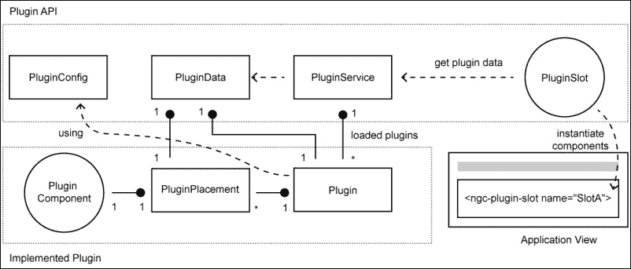
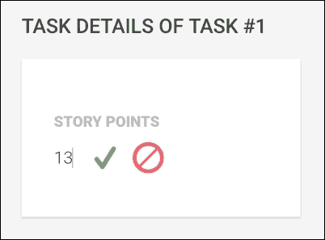
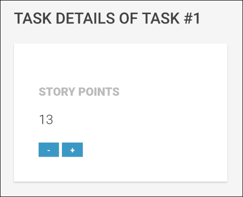
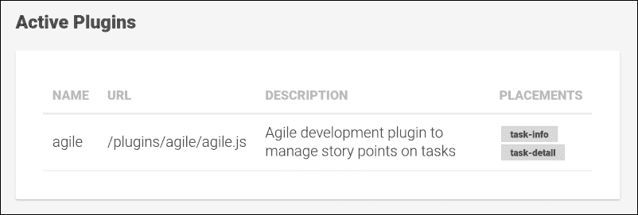
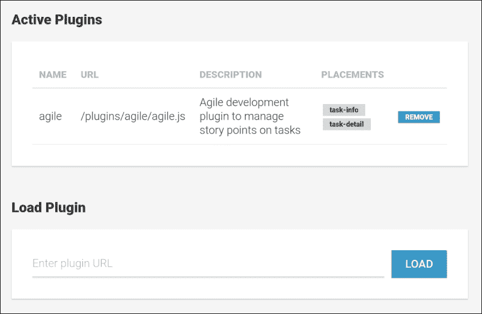

# 第十章. 使事物可插件化

我非常喜爱插件架构。除了它们对应用程序和范围管理产生的巨大积极影响外，它们在开发过程中也非常有趣。我建议任何向我询问的人都将插件架构集成到他们的库或应用程序中。一个好的插件架构允许你编写简洁的应用程序核心，并通过插件提供额外的功能。

以一种允许你构建插件架构的方式设计整个应用程序，这对系统的可扩展性有很大影响。这是因为你使应用程序易于扩展，但关闭了修改。

在编写我的开源项目时，我也发现插件架构有助于你管理项目的范围。有时，请求的功能非常好且非常有用，但它仍然会使库核心膨胀。与其用这样的功能使整个应用程序或库膨胀，你不如简单地编写一个插件来完成这项工作。

在本章中，我们将创建自己的插件架构，这将帮助我们扩展应用程序的功能，而不会使其核心膨胀。我们首先将在应用程序的核心中构建插件 API，然后使用该 API 实现一个小巧的敏捷插件，帮助我们使用故事点来估算任务。

在本章中，我们将涵盖以下主题：

+   基于 Angular 生态系统的插件架构设计

+   实现基于装饰器的插件 API

+   使用`ComponentResolver`和`ViewContainerRef`将插件组件实例化到我们应用程序中预定义的槽位

+   使用 SystemJS 实现插件加载机制

+   在我们的插件架构中使用响应式方法以实现即插即用风格的插件

+   使用新的插件 API 实现一个敏捷插件来记录故事点

# 插件架构

在更高层次上，插件架构应至少满足以下要求：

+   **可扩展性**：插件背后的主要思想是允许使用隔离的代码包扩展核心功能。一个出色的插件架构允许你无缝地扩展核心，而不会引起明显的性能损失。

+   **可移植性**：插件应足够隔离，以便在运行时将其插入到系统中。不应有必要重建系统以启用插件。理想情况下，插件甚至可以在运行时任何时候加载。它们可以被停用和激活，并且不应导致系统运行到不一致的状态。

+   **可组合性**：插件系统应允许并行使用多个插件，并允许通过组合多个插件来扩展系统。理想情况下，系统还应包括依赖管理、插件版本管理和插件间通信。

实现插件架构的方法有很多。尽管这些方法可能差异很大，但几乎总是有一个机制在位，提供统一的扩展点。没有这个机制，统一扩展系统将会很困难。

我过去曾与一些插件架构合作过，除了使用现有的插件机制外，我还享受自己设计一些插件。以下列表应该能提供一个关于在设计插件系统时可以采用的一些方法的思路：

+   **领域特定语言（DSL）**：使用领域特定语言是实现可插拔架构的一种方式。在你实现了应用程序的核心之后，你可以开发一个 API，甚至是一种脚本语言，允许你使用这种 DSL 进一步开发功能。许多视频游戏引擎和 CG 应用程序都依赖于这种方法。尽管这种方法非常灵活，但它也可能迅速导致性能问题，并容易引入复杂性。通常，实现这种架构的先决条件是将非常低级别的核心操作（如添加 UI 元素、配置流程等）暴露到 DSL 中，这并不提供清晰的边界和扩展点，但非常灵活。基于 DSL 的插件系统的一些例子包括 Adobe 的大部分 CG 应用程序、3D Studio Max 和 Maya，以及游戏引擎，如 Epic Games 的 Unreal Engine 或 Bohemia Interactive Studio 的 Real Virtuality Engine。

+   **核心是插件系统**：另一种方法是构建一个复杂的插件架构，使其满足前面列表中概述的所有要求（可扩展性、可移植性和可组合性），甚至还有一些更复杂的要求。应用程序的核心是一个庞大的插件系统。然后，你开始将一切作为插件来实现。甚至应用程序的核心关注点也将作为插件实现。这种方法的一个完美例子是 Eclipse IDE 及其 Equinox 核心。这种方法的缺点是，随着应用程序的增长，你可能会遇到性能问题。由于一切都是插件，优化相当困难，插件兼容性可能会使应用程序变得不稳定。

+   **基于事件的扩展点**：另外，提供系统扩展性的一个很好的方法是通过向系统开放外部输入的管道。想象一下，对于你应用程序中的每一个重要步骤，你都会通知外部世界这个步骤，并在应用程序继续处理之前允许拦截。以这种方式，插件将仅仅是一个适配器，它监听应用程序的这些管道事件，并根据需要修改行为。插件本身也可以发出事件，然后可以被其他插件再次处理。这种架构非常灵活，因为它允许你在不引入太多复杂性的情况下更改核心功能的行为。即使在完成核心功能后没有考虑插件系统，这种方法也相当容易实现。我在我的开源项目 Chartist 中一直遵循这种方法，到目前为止，我取得了非常好的效果。

+   **插件接口**：一个应用程序可以公开一组接口，这些接口定义了某些扩展点。这种方法在 Java 框架中得到了广泛的应用，被称为**服务提供者接口**（**SPI**）。提供者实现一定的合同，允许核心系统依赖于接口而不是实现。然后，这些提供者可以循环回到系统中，在那里它们被提供给框架和其他提供者。尽管这可能是在统一性方面提供扩展性的最安全方式，但它也是最僵化的。插件永远不会被允许执行合同中未指定的任何其他操作。

你可以看到，所有四种方法差异很大。从最顶层的，它以复杂性和稳定性为代价提供了极端的灵活性，到最底层的，它非常健壮但也非常僵化。

实现插件系统时选择的方法在很大程度上取决于你应用程序的需求。如果你不打算构建一个包含各种风味的应用程序，其中应该存在针对完全不同关注点的多个版本，那么前面列表中的方法可能更可能是你应该遵循的方法。

# 可插入的 UI 组件

在本章中我们将要构建的系统借鉴了 Angular 框架中已经存在的许多机制。为了使用插件实现扩展性，我们依赖于以下核心概念：

+   我们使用指令来指示 UI 中的扩展点，我们称之为插件槽。这些插件槽指令将负责动态实例化插件组件，并将它们插入到应用程序 UI 的指定位置。

+   插件通过我们称之为插件放置的概念来公开组件。插件放置声明了插件中的哪些组件应该放置到应用程序中的哪个插件槽位中。我们还使用插件放置来决定来自不同插件的组件应按何种顺序插入到插件槽位中。为此，我们将使用一个名为**优先级**的属性。

+   我们使用 Angular 的依赖注入来提供已实例化的插件信息到插件组件中。由于插件组件将被放置在一个已经存在注入器的地方，因此它们将能够注入周围的组件和依赖项，以便连接到应用程序。

在我们开始实现它之前，让我们看一下以下插图，以了解我们插件系统的架构：



我们将在本章中使用一些基本的 UML 和基数注释来实现插件架构

让我们快速查看这个图中的不同实体，并简要解释它们的作用：

+   `PluginConfig`：这是一个 ES7 装饰器，在实现插件时是关键元素。通过使用此装饰器注释插件类，我们可以存储有关插件元信息，这些信息将在以后由我们的插件系统使用。元数据包括插件名称、描述和位置信息。

+   `PluginData`：这是一个聚合类，由插件系统用于将关于已实例化插件的详细信息与位置信息（插件组件应实例化的位置）耦合。一旦创建插件组件，该实体就会在依赖注入中公开。任何插件组件都可以使用这个实体来收集有关实例化的信息或获取对插件实例的访问权限。

+   `PluginService`：这是用于将我们的插件系统粘合在一起的服务。它主要用于加载插件、删除插件，或由`PluginSlot`指令用于收集与插件槽位创建相关的插件组件。

+   `PluginSlot`：这个指令用于标记我们应用程序中的 UI 扩展点。无论我们希望在哪个位置使插件能够钩入我们的应用程序用户界面，我们都会放置这个指令。插件槽位需要命名，插件使用位置信息通过名称引用槽位。这样，一个插件可以为我们的应用程序中的不同槽位提供不同的组件。

+   `PluginComponent`：这些是随插件实现捆绑的常规 Angular 组件。一个插件可以通过使用`PluginPlacement`对象在插件上配置多个组件。

+   `PluginPlacement`：在插件配置中使用，当一个插件可以有多个放置配置时。每个放置实体包括对一个组件的引用、组件应实例化的槽位名称以及一个优先级数字，这有助于插件系统在多个组件在同一个槽位中实例化时正确地排序插件组件。

+   `Plugin`：这是实现插件时的实际插件类。该类包含使用`PluginConfig`装饰器注解的插件配置。插件类在应用程序中仅实例化一次，并且通过 Angular 的依赖注入与插件组件共享。因此，这个类也是插件组件之间共享数据的好地方。

现在，我们对将要构建的内容有一个更高层次的概述。我们的插件系统非常基础，但它将支持诸如热加载插件（即插即用风格）和其他优秀功能。在下一个主题中，我们将开始实现插件 API 的核心组件。

# 实现插件 API

让我们从我们插件 API 中较简单的实体开始。我们在`lib/plugin/plugin.js`文件中创建一个新的文件来创建`PluginConfig`装饰器和`PluginPlacement`类，这些类存储了插件组件应放置的信息。我们还在这个文件中创建了`PluginData`类，该类用于将插件运行时信息注入到插件组件中：

```js
export function PluginConfig(config) {
  return (type) => {
    type._pluginConfig = config;
  };
}
```

`PluginConfig`装饰器包含接受配置参数的非常简单的逻辑，然后该参数将被存储在注解的类（构造函数）上的`_pluginConfig`属性中。如果你需要复习装饰器的工作原理，现在可能是阅读第一章中关于装饰器的主题，即*组件化用户界面*的好时机：

```js
export class PluginPlacement {
  constructor(options) {
    this.slot = options.slot;
    this.priority = options.priority;
    this.component = options.component;
  }
}
```

`PluginPlacement`类代表配置对象，用于将插件组件暴露到应用程序 UI 中的不同插件槽位：

```js
export class PluginData {
  constructor(plugin, placement) {
    this.plugin = plugin;
    this.placement = placement;
  }
}
```

`PluginData`类代表在插件实例化期间创建的插件运行时信息以及一个`PluginPlacement`对象。这个类将由`PluginService`使用，以将有关插件组件的信息传达给应用程序中的插件槽位。

这三个类是实现插件时的主要交互点。

让我们看看一个简单的插件示例，以了解我们如何使用`PluginConfig`装饰器和`PluginPlacement`类来配置一个插件：

```js
@PluginConfig({
  name: 'my-example-plugin',
  description: 'A simple example plugin',
  placements: [
    new PluginPlacement({
      slot: 'plugin-slot-1',
      priority: 1, 
      component: PluginComponent1
    }),
    new PluginPlacement({
      slot: 'plugin-slot-2', 
      priority: 1, 
      component: PluginComponent2
    })
  ]
})
export default class ExamplePlugin {}
```

使用`PluginConfig`装饰器，实现一个新的插件变得非常简单。我们在设计时决定名称、描述以及我们希望在应用程序中放置插件组件的位置。

我们的插件系统使用命名的 `PluginSlot` 指令来指示我们应用程序组件树中的扩展点。在 `PluginPlacement` 对象中，我们引用插件中内置的 Angular 组件，并通过引用插件槽名称来指示它们应在哪个槽中放置。放置的优先级将告诉插件槽在创建时如何对插件组件进行排序。当不同插件的组件在同一个插件槽中创建时，这一点变得很重要。

好的，让我们直接深入到我们的插件架构的核心，通过实现插件服务。我们将创建一个新的 `lib/plugin/plugin-service.js` 文件并创建一个新的 `PluginService` 类：

```js
import {Injectable} from '@angular/core';
import {ReplaySubject} from 'rxjs/Rx';

@Injectable()
export class PluginService {
  ...
}
```

由于我们将创建一个可注入的服务，我们将使用 `@Injectable` 注解来注释我们的 `PluginService` 类。我们使用 RxJS 的 `ReplaySubject` 类型来在激活插件的任何更改上发出事件。

让我们看看我们服务的构造函数：

```js
constructor() {
  this.plugins = [];
  // Change observable if the list of active plugin changes
 this.change = new ReplaySubject(1);
 this.loadPlugins();
}
```

首先，我们初始化一个新的空 `plugins` 数组。这将是我们活动插件的列表，它包含运行时插件数据，例如插件加载的 URL、插件类型（类的构造函数）、指向存储在插件上的配置的快捷方式（由 `PluginConfig` 装饰器创建）以及最后，插件类的实例本身。

我们还添加了一个 `change` 成员，我们使用新的 RxJS `ReplaySubject` 进行初始化。我们将使用此主题在它改变时发出活动插件的列表。这允许我们以响应式的方式构建插件系统，并启用即插即用风格的插件。

作为构造函数中的最后一个操作，我们调用服务的 `loadPlugins` 方法。这将执行带有已注册插件的初始加载：

```js
loadPlugins() {
 System.import('/plugins.js').then((pluginsModule) => {
 pluginsModule.default.forEach(
      (pluginUrl) => this.loadPlugin(pluginUrl)
 );
 });
}
```

`loadPlugins` 方法异步地从我们应用程序的根路径使用 SystemJS 加载名为 `plugins.js` 的文件。期望 `plugins.js` 文件默认导出一个数组，该数组包含预配置的插件路径，这些插件应在应用程序启动时加载。这允许我们配置我们已知并希望默认存在的插件。使用单独的异步加载文件进行此配置使我们能够更好地从主应用程序中分离出来。我们可以运行相同的应用程序代码，但使用不同的 `plugins.js` 文件，并通过控制默认应存在的插件来控制。

然后，`loadPlugins` 方法通过调用 `loadPlugin` 方法使用 `plugins.js` 文件中存在的 URL 加载每个插件：

```js
loadPlugin(url) {
 return System.import(url).then((pluginModule) => {
    const Plugin = pluginModule.default;
    const pluginData = {
      url,
      type: Plugin,
      // Reading the meta data previously stored by the @Plugin 
      // decorator
 config: Plugin._pluginConfig,
      // Creates the plugin instance
 instance: new Plugin()
    };

 this.plugins = this.plugins.concat([pluginData]);
 this.change.next(this.plugins);
 });
}
```

`loadPlugin` 方法负责加载和实例化单个插件模块。它将插件模块的 URL 作为参数，并使用 `System.import` 动态加载插件模块。使用 `System.import` 来完成这项工作的好处是，我们可以加载已存在于捆绑应用程序中的模块，以及通过 HTTP 请求加载远程 URL。这使得我们的插件系统非常便携，我们甚至可以在运行时从不同的服务器、NPM 或甚至 GitHub 加载模块。当然，SystemJS 也支持不同的模块格式，如 ES6 模块或 CommonJS 模块，如果模块尚未转换，还支持不同的转换器。

在插件模块成功加载后，我们将有关加载的插件的所有信息捆绑到一个 `pluginData` 对象中。然后我们可以将此信息添加到我们的 `plugins` 数组中，并在我们的 `ReplaySubject` 上发出一个新事件，以通知感兴趣的各方关于更改的消息。

最后，我们需要一个方法来收集所有插件中的 `PluginPlacement` 数据，并按槽位名称进行过滤。当我们的插件槽位需要知道它们应该实例化哪些组件时，这一点很重要。插件可以将任意数量的组件暴露到任意数量的应用程序插件槽位中。当插件槽位需要知道哪些暴露的 Angular 组件与它们相关时，将使用此函数：

```js
getPluginData(slot) {
  return this.plugins.reduce((components, pluginData) => {
    return components.concat(
     pluginData.config.placements
 .filter((placement) => placement.slot === slot)
 .map((placement) => new PluginData(pluginData, placement))
    );
  }, []);
```

到目前为止，`PluginService` 类已经完成了，我们创建了插件系统的核心。在下一章中，我们将处理插件槽位，并看看我们如何可以动态实例化插件组件。

## 实例化插件组件

现在，是时候看看我们插件架构的第二大主要部分了，那就是负责在正确位置实例化插件组件的 `PluginSlot` 指令。

在我们实现指令之前，让我们看看如何在 Angular 中动态实例化组件。我们已经在 第七章 *用户体验组件* 中介绍了可以包含组件的实例化视图。在无限滚动指令中，我们使用了 `ViewContainerRef` 来实例化模板元素。然而，这里有一个不同的用例。我们希望将单个组件实例化到现有的视图中。

`ViewContainerRef` 对象也为我们提供了这个问题的解决方案。让我们看看如何使用 `ViewContainerRef` 对象来实例化组件的一个非常基础的例子。在下面的例子中，我们使用了四个新的概念：

+   使用 `@ViewChild` 并将 `read` 选项设置为 `{read: ViewContainerRef}` 来查询视图容器而不是元素

+   使用 `ComponentResolver` 实例来获取我们想要动态实例化的组件的工厂

+   使用 `ReflectiveInjector` 创建一个新的子注入器，用于我们的实例化组件

+   使用 `ViewContainerRef.createComponent` 实例化一个组件并将其附加到视图容器的底层视图。

以下代码示例展示了我们如何使用 `ViewContainerRef` 实例动态创建一个组件。

```js
import {Component, Inject, ViewChild, ViewContainerRef, ComponentResolver} from '@angular/core';

@Component({
  selector: 'hello-world',
  template: 'Hello World'
})
export class HelloWorld {}

@Component({
  selector: 'app'
  template: '<h1 #headingRef>App</h1>'
})
export class App {
 @ViewChild('headingRef', {read: ViewContainerRef}) viewContainer;

  constructor(@Inject(ComponentResolver) resolver) {
 this.resolver = resolver;
  }

  ngAfterViewInit() {
 this.resolver
 .resolveComponent(HelloWorld)
 .then((componentFactory) => {
 this.viewContainer.createComponent(componentFactory);
 });
  }
}
```

注入到 `App` 组件的构造函数中，我们稍后可以使用 `ComponentResolver` 解决 `HelloWorld` 组件。我们使用 `@ViewChild` 装饰器在 `App` 组件中查询标题元素。通常，这将给我们一个与视图元素关联的 `ElementRef` 对象。然而，由于我们需要与元素关联的视图容器，我们可以使用 `{read: ViewContainerRef}` 选项来获取 `ViewContainerRef` 对象。

在 `AfterViewInit` 生命周期钩子中，我们首先在 `ComponentResolver` 实例上调用 `resolveComponent` 方法。此调用返回一个承诺，该承诺解决为 `ComponentFactory` 类型的对象。Angular 在内部使用组件工厂来创建组件。

在承诺解决后，我们现在可以使用我们标题元素的视图容器上的 `createComponent` 方法来创建我们的 `HelloWorld` 组件。

让我们更详细地看看 `ViewContainerRef` 对象的 `createComponent` 方法：

| 方法 | 描述 |
| --- | --- |

| `ViewContainerRef.createComponent` | 此方法将创建一个基于在 `componentFactory` 参数中提供的组件工厂的组件。编译后的组件将随后附加到由 `index` 参数提供的特定位置上的视图容器。以下参数：

+   `componentFactory`：这是组件工厂，将用于创建新的组件。

+   `Index`：这是一个可选参数，用于指定创建的组件应在视图容器中插入的位置。如果没有指定此参数，组件将插入到视图容器的最后一个位置。

+   `Injector`：这是一个可选参数，允许您为创建的组件指定自定义注入器。这允许您为创建的组件提供额外的依赖项。

+   `projectableNodes`：这是一个可选参数，用于指定内容投影的节点。

此方法返回一个在实例化组件编译完成后解决的承诺。`Promise` 解决为一个 `ComponentRef` 对象，该对象也可以用于稍后再次销毁组件。|

### 提示

默认情况下，使用 `ViewContainerRef.createComponent` 方法创建的组件将从父组件继承注入器，这使得此过程具有上下文感知性。然而，`createComponent` 方法的 `injector` 参数在您想要向组件提供不在任何父注入器上存在的额外依赖项时特别有用。

让我们回到我们的`PluginSlot`指令，它负责相关插件组件的实例化。

首先，在我们深入代码之前，让我们思考一下我们的`PluginSlot`指令的高级需求：

+   插件槽应该包含一个名称输入属性，这样这个名称就可以被想要为插槽提供组件的插件所引用。

+   指令需要响应`PluginService`的变化，并重新评估需要放置哪些插件组件。

+   在插件槽的初始化过程中，我们需要获取与这个特定插槽相关的`PluginData`对象列表。我们应该咨询`PluginService`的`getPluginData`方法来获取这个列表。

+   使用获取的相关`PluginData`对象列表，我们将能够使用我们的指令的`ViewContainerRef`对象实例化与放置信息关联的组件。

让我们在`lib/plugin/plugin-slot.js`路径上创建我们的`PluginSlot`指令：

```js
import {Directive, Input, Inject, provide, ViewContainerRef, ComponentResolver, ReflectiveInjector} from '@angular/core';
import {PluginData} from './plugin';
import {PluginService} from './plugin-service';
@Directive({
  selector: 'ngc-plugin-slot'
})
export class PluginSlot {
 @Input() name;
  ...
}
```

在我们的指令中，`name`输入对于我们的插件机制非常重要。通过向指令提供名称，我们可以在我们的 UI 中定义命名的扩展点，并在稍后使用这个名称在插件配置的`PluginPlacement`数据中：

```js
  constructor(@Inject(ViewContainerRef) viewContainerRef, 
 @Inject(ComponentResolver) componentResolver, 
 @Inject(PluginService) pluginService) {
    this.viewContainerRef = viewContainerRef;
    this.componentResolver = componentResolver;
    this.pluginService = pluginService;
    this.componentRefs = [];
    // Subscribing to changes on the plugin service and re-
    // initialize slot if needed
    this.pluginChangeSubscription = 
 this.pluginService
 .change.subscribe(() => this.initialize());
  }
```

在构造函数中，我们首先注入`ViewContainerRef`对象，这是一个指向指令视图容器的引用。由于我们想直接使用指令的视图容器，这里不需要使用`@ViewChild`。如果我们想获取当前指令的视图容器，我们可以简单地使用注入。当我们使用`ViewContainerRef.createComponent`方法实例化组件时，我们将使用这个引用。

为了解析组件及其工厂，我们注入`ComponentResolver`实例。

`PluginService`被注入有两个原因。首先，我们希望订阅活动插件列表上的任何变化，其次，我们使用它来获取这个插槽的相关`PluginData`对象。

我们使用`componentRefs`成员来跟踪已经实例化的插件组件。这将帮助我们稍后当插件被停用时销毁它们。

最后，我们为`PluginService`创建一个新的订阅，并将订阅存储到`pluginChangeSubscription`成员字段中。在激活的插件列表发生任何变化时，我们在我们的组件上执行`initialize`方法：

```js
initialize() {
 if (this.componentRefs.length > 0) {
 this.componentRefs.forEach(
 (componentRef) => componentRef.destroy());
 this.componentRefs = [];
 }

 const pluginData = 
 this.pluginService.getPluginData(this.name);

 pluginData.sort(
 (a, b) => a.placement.priority < b.placement.priority ?
 1 : a.placement.priority > b.placement.priority ? -1 : 0);

 return Promise.all(
 pluginData.map((pluginData) => 
 this.instantiatePluginComponent(pluginData))
 );
}
```

让我们详细看看`initialize`方法的四个部分：

+   首先，我们检查这个插件槽是否已经在`componentRefs`成员中包含实例化的插件组件。如果是这种情况，我们使用`ComponentRef`对象的 detach 方法移除所有现有实例。之后，我们将`componentRefs`成员初始化为一个空数组。

+   我们使用`PluginService`的`getPluginData`方法来获取与这个特定槽位相关的`PluginData`对象列表。我们将此槽位的名称传递给该方法，这样`PluginService`就会提前为我们提供一个感兴趣的插件组件列表，这些组件希望放置在我们的槽位中。

+   由于可能有多个插件排队等待在我们的槽位中放置，我们正在使用`PluginPlacement`对象的优先级属性来对`PluginData`对象列表进行排序。这将确保具有更高优先级的插件组件将排在具有较低优先级的组件之前。这是一个很好的额外功能，当我们要处理许多争夺空间的插件时，这个功能将非常有用。

+   在我们的`initialize`方法的最后一段代码中，我们为列表中的每个`PluginData`对象调用`instantiatePluginComponent`方法。

现在，让我们创建`instantiatePluginComponent`方法，该方法在`initialize`方法的最后一步被调用：

```js
instantiatePluginComponent(pluginData) {
 return this.componentResolver
 .resolveComponent(pluginData.placement.component)
 .then((componentFactory) => {
 // Get the injector of the plugin slot parent component
 const contextInjector = this.viewContainerRef.parentInjector;
 // Preparing additional PluginData provider for the created 
 // plugin component
 const providers = [
 provide(PluginData, {
 useValue: pluginData
 })
 ];
 // We're creating a new child injector and provide the 
 // PluginData provider
 const childInjector = ReflectiveInjector
 .resolveAndCreate(providers, contextInjector);
 // Now we can create a new component using the plugin slot view 
 // container and the resolved component factory
 const componentRef = this.viewContainerRef
 .createComponent(componentFactory, 
 this.viewContainerRef.length, 
 childInjector);
 this.componentRefs.push(componentRef);
 });
}
```

此方法负责创建单个插件组件。现在，我们可以使用我们在本主题中关于`ViewContainerRef.createComponent`方法和`ComponentResolver`对象所获得的知识来动态创建组件。

除了从放置此插件槽位的组件继承的提供者之外，我们还想将`PluginData`提供给已实例化的插件组件的注入器。使用 Angular 的`provide`函数，我们可以指定`pluginData`以解决对`PluginData`类型的任何注入。

`ReflectiveInjector`类为我们提供了一些静态方法，用于创建注入器。我们可以使用我们的视图容器上的`parentInjector`成员来获取插件槽位上下文中的注入器。然后，我们使用`ReflectiveInjector`类上的静态`resolveAndCreate`方法来创建一个新的子注入器。

在`resolveAndCreate`方法的第一个参数中，我们可以提供一个提供者列表。这些提供者将被解决并可供我们的新子注入器使用。`resolveAndCreate`方法的第二个参数接受新创建的子注入器的父注入器。

最后，我们使用`ViewContainerRef`对象的`createComponent`方法来实例化插件组件。作为`createComponent`方法调用的第二个参数，我们需要传递视图容器中的位置。在这里，我们利用我们的视图容器的`length`属性将其放置在最后。在第三个参数中，我们用我们的自定义子注入器覆盖组件的默认注入器。成功后，我们将创建的`ComponentRef`对象添加到我们的已实例化组件列表中。

## 完成我们的插件架构

恭喜你，你已经使用 Angular 构建了自己的插件架构！我们创建了一个插件 API，可以使用`PluginConfig`装饰器来创建新的插件。`PluginService`管理整个插件加载，并使用自定义注入器将`PluginData`对象提供给应用中的插槽。`PluginSlot`指令可以在任务管理应用中使用，以在用户界面中标记扩展点。利用 Angular 中依赖注入的继承特性，插件组件将能够访问它们环境中所需的一切。

在下一节中，我们将使用我们刚刚创建的插件架构来创建我们的第一个插件。

# 构建敏捷插件

在上一节中，我们创建了一个简单但有效的插件架构，现在我们将使用这个插件 API 在任务管理应用中构建我们的第一个插件。

在我们深入插件细节之前，我们首先应该就我们的应用的可扩展性达成一致。我们的插件系统基于`PluginSlot`指令，这些指令应该放置在我们的组件树中的某个位置，以便插件可以暴露组件到这些插槽。目前，我们决定在我们的应用中设置两个可扩展的位置：

+   `TaskInfo`：在项目中显示的任务列表中，我们目前渲染`Task`组件。除了任务的标题外，`Task`组件还显示其他信息，如任务编号、创建日期、里程碑以及适用的情况下的努力信息。这些附加信息是通过`TaskInfos`子组件在`Task`组件上渲染的。这是一个为插件提供可扩展性的好位置，以便它们可以添加额外的任务信息，这些信息将在任务列表概览中显示。

+   `TaskDetail`：另一个提供可扩展性的绝佳位置是`ProjectTaskDetails`组件。这是我们编辑任务详情的地方，这使得它成为插件扩展的绝佳组件。

除了将`PluginSlot`指令添加到`TaskInfos`组件的指令列表中，我们还修改了位于`lib/task-list/task/task-infos/task-infos.html`的模板：

```js
...
<ngc-task-info title="Efforts" 
               [info]="task.efforts | formatEfforts">
</ngc-task-info>
<ngc-plugin-slot name="task-info"></ngc-plugin-slot>

```

在包含`PluginSlot`指令并将名称输入属性设置为`task-info`之后，我们为插件提供了一个扩展点，它们可以在其中提供额外的组件。

让我们将相同的更改应用到`lib/project/project-task-details/project-task-details.html`中的`ProjectTaskDetails`组件模板：

```js
...
<div class="task-details__content">
  ...
 <ngc-plugin-slot name="task-detail"></ngc-plugin-slot>
</div>
```

在任务详情内容元素的末尾之前，我们包含另一个名为`task-detail`的插件插槽。通过为这个插槽提供组件，插件可以钩入任务的编辑视图。

好的，所以我们的扩展点已经设置好了，插件可以在任务级别提供额外的组件。你可以看到，使用`PluginSlot`指令准备这些位置真的是小菜一碟。

现在，我们可以查看我们的敏捷插件的实现，它将利用我们刚刚暴露的扩展点。

我们将要创建的敏捷插件将提供在任务上记录故事点的功能。故事点在敏捷项目管理中常用。它们应该提供对复杂性的感知，并且相对于所谓的参考故事而言。如果你想了解更多关于敏捷项目管理以及如何使用故事点进行估算的信息，我强烈推荐迈克·科恩的书籍，《敏捷估算与规划》。

让我们从我们的插件类和必要的配置开始。我们创建插件在常规 `lib` 文件夹之外，只是为了表明插件的便携性。

我们在 `plugins/agile/agile.js` 路径上创建一个新的 `AgilePlugin` 类：

```js
import {PluginConfig, PluginPlacement} from '../../lib/plugin/plugin';

@PluginConfig({
 name: 'agile',
 description: 'Agile development plugin to manage story points on tasks',
 placements: []
})
export default class AgilePlugin {
  constructor() {
 this.storyPoints = [0.5, 1, 2, 3, 5, 8, 13, 21];
  }
}
```

插件类构成了我们插件的核心入口点。我们使用 `PluginConfig` 装饰器，这是我们作为插件 API 的一部分创建的。除了名称和描述之外，我们还需要配置任何放置，其中我们将插件组件映射到应用程序插件槽位。然而，由于我们还没有任何插件组件要暴露，我们的列表目前仍然是空的。

还需要注意的是，插件模块始终需要默认导出插件类。这正是我们在 `PluginService` 类中实现插件加载机制的方式。

回顾 `PluginService` 的 `loadPlugin` 方法中的这两行，可以看出我们依赖于插件模块的默认导出：

```js
return System.import(url).then((pluginModule) => {
    const Plugin = pluginModule.default;
...
```

当插件模块成功加载时，我们通过引用模块上的 `default` 属性来获取默认导出。

到目前为止，我们已经创建了我们的插件入口模块。这充当了一个插件配置容器，并且与 Angular 没有任何关系。使用放置配置，一旦我们创建了插件，我们就可以暴露我们的插件 Angular 组件。

## 敏捷任务信息组件

让我们继续到我们想要暴露的第一个敏捷插件组件。首先，我们创建一个组件，它将被暴露到名为 `task-info` 的槽位中。在任务列表下的任务标题下方，我们的敏捷信息组件应该显示存储的故事点。

我们在 `plugins/agile/agile-task-info/agile-task-info.js` 路径上创建一个新的 `Component` 类：

```js
...
import {Task} from '../../../lib/task-list/task/task';

@Component({
  selector: 'ngc-agile-task-info',
  encapsulation: ViewEncapsulation.None,
  template,
  host: {
 class: 'task-infos__info'
  }
})
export class AgileTaskInfo {
  constructor(@Inject(Task) taskComponent) {
 this.task = taskComponent.task;
  }
}
```

你可以看到，我们在这里实现了一个常规组件。这个组件没有任何特别之处。

我们导入 `Task` 组件以获取类型信息，并将其注入到我们的构造函数中。由于插件槽位于 `TaskInfos` 组件内部，而实际上 `TaskInfos` 组件始终是 `Task` 组件的子组件，这是一个安全的注入。

在构造函数中，我们首先获取注入的 `Task` 组件，并将任务数据提取到本地的 `task` 成员变量中。

我们还借用 `TaskInfos` 组件的 `task-infos__info` 类，以便获得与其他已存在于任务上的任务信息相同的样式。

让我们看看位于同一路径的`agile-task-info.html`文件中的`AgileTaskInfo`组件的模板：

```js
<div *ngIf="task.storyPoints || task.storyPoints === 0">
  <strong>Story Points: </strong>{{task.storyPoints}}
</div>
```

按照我们在`TaskInfo`组件中使用的相同标记，如果存在，我们显示`storyPoints`任务。

好的，现在我们可以使用`PluginPlacement`对象在插件配置中公开插件组件。让我们对我们的`agile.js`模块文件进行必要的修改：

```js
...
import {AgileTaskInfo} from './agile-task-info/agile-task-info';

@PluginConfig({
  name: 'agile',
  description: 'Agile development plugin to manage story points on tasks',
 placements: [
 new PluginPlacement({slot: 'task-info', priority: 1, 
 component: AgileTaskInfo})
 ]
})
export default class AgilePlugin {
  ...
}
```

现在，我们在插件配置中包含一个新的`PluginPlacement`对象，它将我们的`AgileTaskInfo`组件映射到名为`task-info`的应用程序插件插槽中：


显示由我们的敏捷插件提供的额外信息的任务信息

这对于插件工作来说已经足够了。然而，由于我们的任务上没有填充任何`storyPoints`数据，这个插件目前实际上不会显示任何内容。

## 灵活任务详情组件

让我们创建另一个插件组件，它可以用来输入故事点。为此，我们将在`plugins/agile/agile-task-detail/agile-task-detail.js`路径上创建一个新的`AgileTaskDetail`组件：

```js
...
import {Project} from '../../../lib/project/project';
import {ProjectTaskDetails} from '../../../lib/project/project-task-details/project-task-details';
import {Editor} from '../../../lib/ui/editor/editor';

@Component({
  selector: 'ngc-agile-task-detail',
  encapsulation: ViewEncapsulation.None,
  template,
  host: {class: 'agile-task-detail'},
  directives: [Editor]
})
export class AgileTaskDetail {
  constructor(@Inject(Project) project, 
 @Inject(ProjectTaskDetails) projectTaskDetails) {
    this.project = project;
    this.projectTaskDetails = projectTaskDetails;
 this.plugin = placementData.plugin.instance;
  }

  onStoryPointsSaved(storyPoints) {
 this.projectTaskDetails.task.storyPoints = +storyPoints || 0;
 this.project.document.persist();
  }
}
```

这个组件也没有什么特别之处。我们的目标插槽是`task-detail`插件插槽，它位于`ProjectTaskDetails`组件内部。因此，将`ProjectTaskDetails`和`Project`组件注入到我们的插件组件中是安全的。`ProjectTaskDetails`组件用于获取上下文中的任务数据。我们使用存储在`Project`组件上的`LiveDocument`来持久化我们对项目任务数据的任何更改。

我们重用`Editor`组件来获取用户输入，并在`onStoryPointsSaved`回调中存储输入数据。这是我们从前面的区域所了解的相同机制，在那里我们使用了`Editor`组件。当故事点被编辑时，我们首先更新存储在`ProjectTaskDetails`组件中的任务数据模型。之后，我们可以使用`LiveDocument`的`persist`方法来保存更改。

让我们看看位于`plugins/agile/agile-task-detail/agile-task-detail.html`文件中的我们的`AgileTaskDetail`组件的模板：

```js
<div class="task-details__label">Story Points</div>
<ngc-editor [content]="projectTaskDetails.task?.storyPoints"
            [showControls]="true"
            (editSaved)="onStoryPointsSaved($event)"></ngc-editor>
```

我们从编辑器的`content`输入属性直接绑定到任务数据的`storyPoints`属性。

当编辑被保存时，我们使用更新后的值调用`onStoryPointsSaved`回调：



显示由我们的敏捷插件公开的新敏捷故事点的任务详情

在我们使用新的`PluginPlacement`对象在插件配置中公开我们新创建的插件组件之前，我们将进一步增强组件。如果我们在组件上提供两个按钮，允许用户将故事点增加到或减少到下一个常见故事点值，这将很好。因为我们已经在`Agile`插件类上存储了常见故事点的列表，让我们看看我们如何利用这一点：

```js
...
import {PluginData} from '../../../lib/plugin/plugin';

@Component({
  selector: 'ngc-agile-task-detail',
  ...
})
export class AgileTaskDetail {
  constructor(..., @Inject(PluginData) pluginData) {
    ...
 this.plugin = pluginData.plugin.instance;
  }
  ...
  increaseStoryPoints() {
 const current = this.projectTaskDetails.task.storyPoints || 0;
    const storyPoints = this.plugin.storyPoints.slice().sort((a, b) => a > b ? 1 : a < b ? -1 : 0);
    this.projectTaskDetails.task.storyPoints =
 storyPoints.find((storyPoints) => storyPoints > current) || current;
 this.project.document.persist();
  }

  decreaseStoryPoints() {
 const current = this.projectTaskDetails.task.storyPoints || 0;
    const storyPoints = this.plugin.storyPoints.slice().sort((a, b) => a < b ? 1 : a > b ? -1 : 0);
    this.projectTaskDetails.task.storyPoints =
 storyPoints.find((storyPoints) => storyPoints < current) || current;
 this.project.document.persist();
  }
}
```

当我们之前注入了由组件级别注入器提供的`Project`和`ProjectTaskDetails`组件时，我们现在利用了在`PluginSlot`指令实例化期间添加的提供者。在这里，我们提供了`PluginData`，我们现在可以使用它来获取对插件组件的引用。

下一个更高或更低的用户故事点值是通过`increaseStoryPoints`和`decreaseStoryPoints`找到的。这是通过搜索存储在我们`AgilePlugin`类上的常见故事点列表来完成的。使用注入的`PluginData`上的插件类实例，我们可以轻松访问此列表。在存储修改后的故事点后，我们然后使用项目组件的`LiveDocument`实例来持久化调整后的故事点。

在我们的`AgileTaskDetail`组件模板中，我们简单地添加了两个按钮，允许用户增加或减少基于我们新创建方法的用户故事点：

```js
...
<button (click)="decreaseStoryPoints()"
        class="button button--small">-</button>
<button (click)="increaseStoryPoints()"
        class="button button--small">+</button>
```

好的，现在让我们使用一个新的`PluginPlacement`对象将`AgileTaskDetail`组件添加到插件配置中，该对象引用`task-detail`插件槽位：

```js
...
import {AgileTaskDetail} from './agile-task-detail/agile-task-detail';

@PluginConfig({
  ...
  placements: [
    new PluginPlacement({slot: 'task-info', priority: 1, 
                         component: AgileTaskInfo}),
 new PluginPlacement({slot: 'task-detail', priority: 1, 
 component: AgileTaskDetail})
  ]
})
export default class AgilePlugin {
  ...
}
```

这不是很好吗？您创建了一个完全可移植的插件，该插件可以管理任务上的敏捷故事点。



带有故事点和额外增加/减少按钮的任务详情视图

剩下的唯一事情是将插件添加到`PluginService`指令最初应加载的插件列表中。为此，我们将在应用程序的根目录下创建一个`plugins.js`文件，并添加以下内容：

```js
export default [
  '/plugins/agile/agile.js'
];
```

现在，如果我们启动我们的应用程序，插件将由`PluginService`加载，并且`PluginSlot`指令将在适当的位置实例化敏捷插件组件。

## 回顾我们的第一个插件

干得好！您成功实现了您的第一个插件！在本节中，我们使用插件架构的 API 创建了一个用于管理敏捷故事点的插件。我们使用了`PluginPlacement`类将我们的插件组件映射到应用程序 UI 的不同槽位中。我们还利用了提供给插件槽位中每个实例化组件的`PluginData`对象，以便访问插件实例。

在插件内部实现此类功能的优势应该是显而易见的。我们没有建立额外的依赖关系就为我们的应用程序添加了一个新功能。我们的 Agile 功能是完全可移植的。第三方开发者可以编写独立的插件，并且它们可以被我们的系统加载。这是一个很大的优势，它帮助我们保持核心精简的同时提供出色的可扩展性。

# 管理插件

我们已经构建了插件架构的核心以及在这个系统中运行的第一个插件。我们可以使用应用根目录下的 `plugins.js` 文件来注册插件。系统实际上已经完全可用。然而，提供一个在运行时管理我们插件的方法会更好。

在本节中，我们将构建一个新的可路由组件，该组件将列出系统中的所有活动插件。完成此操作后，我们还将添加一些元素，允许用户在运行时卸载活动插件以及加载新插件。由于我们的插件系统的响应式特性，浏览器无需刷新即可使新加载的插件变为活动状态。插件加载的瞬间，它将立即对相关的插件槽位可用。

让我们从 `lib/manage-plugins/manage-plugins.js` 路径上的一个新的 `ManagePlugins` 组件类开始：

```js
...
import {PluginService} from '../plugin/plugin-service';

@Component({
  selector: 'ngc-manage-plugins',
  ...
})
export class ManagePlugins {
  constructor(@Inject(PluginService) pluginService) {
 this.plugins = pluginService.change;
  }
}
```

我们的 `ManagePlugins` 组件相当简单。我们在组件构造函数中注入 `PluginService`，并将成员字段 plugins 指向 `PluginService` 的变化可观察对象。由于我们总会得到这个可观察对象发出的最新插件列表，我们可以在视图中简单地使用 `async` 管道来订阅这个可观察对象。

让我们看看我们新组件的模板 `lib/manage-plugins/manage-plugins.html`：

```js
<div class="manage-plugins__l-header">
  <h2 class="manage-plugins__title">Manage Plugins</h2>
</div>
<div class="manage-plugins__l-main">
  <h3 class="manage-plugins__sub-title">Active Plugins</h3>
  <div class="manage-plugins__section">
    <table class="manage-plugins__table">
      <thead>
      <tr>
        <th>Name</th>
        <th>Url</th>
        <th>Description</th>
        <th>Placements</th>
      </tr>
      </thead>
      <tbody>
      <tr *ngFor="let plugin of plugins | async">
        <td>{{plugin.config.name}}</td>
        <td>{{plugin.url}}</td>
        <td>{{plugin.config.description}}</td>
        <td>
          <div *ngFor="let placement of plugin.config.placements"
               class="manage-plugins__placement">
            {{placement.slot}}
          </div>
        </td>
      </tr>
      </tbody>
    </table>
  </div>
</div>
```

我们使用 HTML 表格来显示活动插件的列表。在表格体行中，我们使用 `NgFor` 指令遍历活动插件的列表，我们使用 `async` 管道来订阅这些插件。

在插件对象中，我们已经有了所有值得显示的内容。通过遍历存储在插件数据 `config` 属性上的 `PluginPlacement` 对象，我们甚至可以显示我们的插件提供组件的槽位名称。

现在，要启用我们的新组件，我们唯一要做的就是使其可路由，并将其添加到我们应用程序的导航中。让我们在 `lib/app.js` 模块中进行必要的修改：

```js
...
import {ManagePlugins} from './manage-plugins/manage-plugins';

@Component({
  selector: 'ngc-app',
  ...
})
@Routes([
  ...
 new Route({path: 'plugins', component: ManagePlugins})
])
export class App {
  ...
}
```

我们添加了一个新的路由，所以让我们将它添加到 `lib/app.html` 中的导航中：

```js
<div class="app">
  <div class="app__l-side">
    <ngc-navigation [openTasksCount]="openTaskCount">
      ...
 <ngc-navigation-section title="Admin">
 <ngc-navigation-item title="Manage Plugins" 
 [link]="['/plugins']">
 </ngc-navigation-item>
 </ngc-navigation-section>
    </ngc-navigation>
  </div>
  <div class="app__l-main">
    <router-outlet></router-outlet>
  </div>
</div>
```

在新的 `Admin` 导航部分，我们添加了一个新的 `navigation-item`，该链接指向新创建的 "plugins" 路由：



我们的新 `ManagePlugins` 组件显示活动插件及其暴露的位置的表格

## 在运行时加载新插件

我们已经准备好提供一个页面来查看所有活动插件。然而，我们说能够管理这个列表会很好。用户应该能够移除活动插件以及手动加载额外的插件。

让我们在`ManagePlugins`组件中添加这些功能。在我们能够这样做之前，我们将在`PluginService`类上需要一个额外的方法，这是负责加载插件的部分。到目前为止，我们没有考虑移除活动插件的功能。让我们在`lib/plugin/plugin-service.js`中打开`PluginService`以添加此功能：

```js
...
@Injectable()
export class PluginService {
  ...
 removePlugin(name) {
 const plugin = this.plugins.find(
 (plugin) => plugin.name === name);
 if (plugin) {
 const plugins = this.plugins.slice();
 plugins.splice(plugins.indexOf(plugin), 1);
 this.plugins = plugins;
 this.change.next(this.plugins);
 }
 }
}
```

好吧，这很简单！我们提供了一个新的`removePlugin`方法，它接受一个插件名称作为参数。然后我们在`plugins`数组中查找插件，如果找到了具有此名称的插件，我们就从列表中删除它。此外，在我们删除插件后，我们发出一个带有更新列表的`change`事件。由于应用程序中所有插件槽都订阅了这个更改可观察对象，它们将自动更新和重新初始化相关的插件组件。

现在我们需要对`ManagePlugins`组件类应用必要的更改，以便不仅能够移除插件，还能加载额外的插件：

```js
...
@Component({
  selector: 'ngc-manage-plugins',
  ...
})
export class ManagePlugins {
  constructor(@Inject(PluginService) pluginService) {
    ...
 this.pluginService = pluginService;
 }

 removePlugin(name) {
 this.pluginService.removePlugin(name);
 }

 loadPlugin(loadUrlInput) {
 this.pluginService.loadPlugin(loadUrlInput.value);
 loadUrlInput.value = '';
 }
}
```

现在，我们也存储了`PluginService`在我们的组件上。在`removePlugin`和`loadPlugin`函数中，我们将委托给`PluginService`以采取必要的行动。

`loadPlugin`方法将接收一个指向输入字段的`ElementRef`对象，用户在此输入字段中输入从其中加载新插件的 URL。我们可以将输入字段的值传递给`PluginService`的`loadPlugin`方法，它负责处理其余部分。一旦我们提交了这个调用，我们也将输入字段的值设置为空字符串。

让我们打开`lib/manage-plugins/manage-plugins.html`中的模板，以在我们的组件视图中应用所需的更改：

```js
...
<div class="manage-plugins__l-main">
  <h3 class="manage-plugins__sub-title">Active Plugins</h3>
  <div class="manage-plugins__section">
    ...
        <td>
          <button (click)="removePlugin(plugin.name)"
                  class="button button--small">remove</button>
        </td>
    ...
  </div>
  <h3 class="manage-plugins__sub-title">Load Plugin</h3>
  <div class="manage-plugins__section">
    <div class="manage-plugins__load-elements">
      <input #loadUrlRef type="text"
             placeholder="Enter plugin URL"
             class="manage-plugins__load-url">
      <button (click)="loadPlugin(loadUrlRef)"
              class="button">Load</button>
    </div>
  </div>
</div>
```

我们在表格中为每个列出的插件添加了一个额外的按钮，该按钮包含一个绑定表达式，它调用带有当前迭代的插件名称的`removePlugin`方法。

我们还在插件列表之后添加了一个新部分来加载新插件。在这个部分中，我们使用一个输入字段来输入插件 URL，以及一个按钮来执行加载。使用一个`loadUrlRef`本地视图引用，我们可以将输入 DOM 元素的引用传递给组件上的`loadPlugin`方法：



一个完成的`ManagePlugins`组件，具有在运行时移除和加载插件模块的能力

现在，我们已经准备好管理我们的插件了。最初从根`plugins.js`文件中的 URL 加载的插件现在可以通过插件列表中的删除按钮来卸载。可以通过输入插件 URL 来加载和激活新插件，这个 URL 可以是本地 URL、捆绑并映射的模块，甚至是不同服务器上的远程 URL。

# 摘要

在本章中，我们探讨了如何实现插件架构的不同方法。然后，我们为插件架构设计了自己的方案，该方案利用了一些 Angular 机制，并基于我们称之为槽位的 UI 扩展点概念。

我们实现了一个插件 API，通过利用 ES7 装饰器使新插件的配置变得轻而易举，从而提供了极佳的开发者体验。我们使用服务来加载和卸载基于 SystemJS 模块加载器的插件，实现了插件系统的核心。这使得我们能够利用 SystemJS 提供的先进加载可能性。插件可以实时转换，可以位于本地 URL、远程 URL，甚至可以捆绑到主应用程序中。

我们实现了我们的第一个插件，该插件提供了一些组件来管理任务上的敏捷故事点。该插件是在我们的常规项目`lib`文件夹之外创建的，这应该强调了我们的插件系统的可移植性。

最后，我们创建了一个新的可路由组件来管理运行时的插件。由于我们的插件系统具有反应性，插件可以在应用程序运行时加载和卸载，而不会产生任何不希望出现的副作用。

当您在玩本章的源代码时，我强烈建议您尝试我们的插件架构的加载机制。我们几乎不费吹灰之力就实现了灵活性，这真是太棒了。您可以通过提供插件主模块的 URL 来卸载敏捷插件并重新加载它。您甚至可以尝试将整个插件文件夹放置在远程服务器上，并从那里加载插件。只需确保您考虑了必要的**跨源资源共享**（**CORS**）头信息。

本章的全部代码可以在书籍资源的 ZIP 文件中找到，您可以从 Packt Publishing 下载。您可以在书的**前言**中的**下载示例代码**部分进行参考。

在本书的下一章和最后一章中，我们将探讨如何测试我们迄今为止创建的组件。所以，请关注这个迟到的主题！
