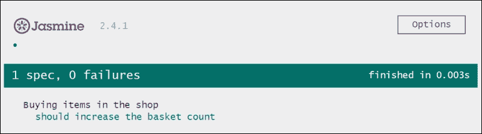

# 第十一章。对事物进行测试

编写测试对于代码的可维护性至关重要。众所周知，拥有一个覆盖大多数功能的好测试范围与功能本身同样重要。

当想到测试时，首先想到的可能就是代码质量保证。你测试你写的代码，这无疑是正确的。然而，编写测试还有很多其他重要的方面：

+   **抵抗意外变化**：你的测试定义了你的代码应该做什么。它们测试你的代码是否符合你的规范。这有几个好处，其中最明显的好处可能是对未来意外变化的抵抗。如果你将来修改代码，你不太可能破坏现有的代码，因为你的测试将验证现有功能是否仍然按指定的方式工作。 

+   **文档**：你的测试定义了你的代码应该做什么。同时，它们显示了使用相关功能所需的 API 调用。这是任何开发者的完美文档。每当我想要了解一个库是如何真正工作的，我首先看的就是测试。

+   **避免不必要的代码**：编写测试迫使你将代码限制在满足你的规范要求，而不再需要更多。你应用程序中任何在自动化测试中未触及的代码都可以被认为是死代码。如果你坚持无情地重构方法，那么你将尽快移除这些未使用的代码。

到目前为止，我们完全没有在我们的书中考虑测试，鉴于其重要性，你可能想知道为什么我在最后一章才提出这个观点。在实际项目中，如果我们不是一开始就创建测试，我们肯定会更早地创建测试。然而，我希望你理解，在这本书中，我们将这个相当重要的主题推迟到了最后。我真的很喜欢测试，但因为我们主要关注 Angular 的组件架构，所以将这一章放在最后似乎更合理。

在本章中，我们将探讨如何对你的组件进行适当的单元测试。我们将专注于单元测试；自动化端到端测试超出了本书的范围。尽管如此，我们还将探讨如何测试组件上的用户交互，尽管不是在端到端测试的水平上。

在本章中，我们将深入探讨以下主题：

+   Jasmine 测试框架的介绍

+   为组件编写简单的 JavaScript 测试

+   创建一个`tests.html`文件，它作为浏览器中的测试运行器

+   创建 Jasmine 间谍和观察组件输出属性

+   了解 Angular 测试工具，例如`inject`、`async`、`TestComponentBuilder`、`DebugElement`等

+   模拟组件

+   模拟现有服务

+   为我们的`AutoComplete` UI 组件创建测试

+   为我们的插件系统创建测试

# Jasmine 的介绍

Jasmine 是一个非常简单的测试框架，它提供了一个 API，允许你编写 **行为驱动开发**（**BDD**）风格的测试。BDD 是一种敏捷软件开发过程，它以书面格式定义规范。

在 BDD 中，我们定义敏捷用户故事由多个场景组成。这些场景与故事的可接受标准密切相关，甚至可以替代它们。它们在更高层次上定义需求，并且主要是叙事性的。每个场景然后由三个部分组成：

+   **Given**: 这部分用于描述场景的初始状态。测试代码是我们执行测试场景所需的所有设置的执行部分。

+   **When**: 这部分反映了我们对测试系统所做的更改。通常，这部分包括一些 API 调用和反映系统用户行为的操作。

+   **Then**: 这部分指定在给定状态和 `when` 部分应用更改后系统应该看起来像什么。在我们的代码中，这部分通常是测试函数的末尾，我们使用断言库来验证系统的状态。

+   Jasmine 提供了一个 API，使得编写按照 BDD 风格结构的测试变得非常简单。让我们看看如何使用 Jasmine 为购物车系统编写一个测试的非常简单的例子：

    ```js
    describe('Buying items in the shop', () => {
      it('should increase the basket count', () => {
        // Given
        const shop = new Shop();
        // When
        shop.buy('Toothpaste');
        shop.buy('Shampoo');
        // Then
        expect(shop.basket.length).toBe(2);
        expect(shop.basket).toContain('Toothpaste');
        expect(shop.basket).toContain('Shampoo');
      });
    });
    ```

Jasmine 提供了一个 `describe` 函数，允许我们将某些场景分组在同一个主题上。在这个例子中，我们使用了 `describe` 函数来为关于商店购买物品的测试注册一个新的测试套件。

使用 `it` 函数，我们可以注册我们想要测试的个别场景。在 `describe` 回调函数中，我们可以使用 `it` 函数注册尽可能多的场景。

在 Jasmine `it` 函数的回调函数内部，我们可以开始编写我们的测试。我们在测试内部使用 `BDD` 风格来组织代码。

你不一定需要在浏览器中运行 Jasmine，但如果你这样做，你将获得所有测试及其状态的简洁总结报告：



Jasmine 提供了所有测试规范的漂亮视觉报告，还允许你重跑单个测试，并提供更多选项

Jasmine 有三个与我们相关的部分：

+   **Jasmine 核心**: 这部分包含测试定义 API、断言库以及测试框架的所有其他核心部分

+   **Jasmine HTML**: 这是指定将所有测试结果写入浏览器文档的 HTML 报告器，并提供重跑单个测试的选项

+   **Jasmine 引擎**: 这是一个用于浏览器中启动 Jasmine 框架并执行与 HTML 报告器相关的任何设置的文件

在我们的项目中，我们将直接从 CDN 使用 Jasmine 和前面的部分，因此我们不需要安装任何东西就可以开始。我们创建一个新的 `tests.html` 文件，它将作为我们的测试运行器。结合 `live-server`，我们总可以在浏览器中打开这个页面。这样我们就可以在开发过程中立即获得测试的反馈。

### 小贴士

Jasmine 还与测试运行器（如 Karma）很好地配合使用，以运行您的测试。Karma 是一个流行的测试运行器，它允许您使用 Karma CLI 并行运行测试，或者将其集成到您的构建管道中。这也允许您在不同的浏览器中运行测试。在本章中，我们将使用 Jasmine HTML 和 Jasmine 启动直接在浏览器中运行我们的测试。这样，我们可以跳过如果使用 Karma 作为测试运行器时需要进行的相当复杂的设置。

让我们看看我们在应用程序根目录中创建的 `tests.html` 文件的代码，它紧挨着已经存在的 `index.html` 文件：

```js
...
<script src="img/es6-shim.min.js"></script>
<script src="img/angular2-polyfills.js"></script>
<script src="img/system.js"></script>
<script src="img/config.js"></script>
<script src="img/strong>"></script>
<script src="img/strong>"></script>
<script src="img/strong>"></script>
```

除了加载我们 Angular 应用程序的常规组件（ES6 shim、Angular polyfills 和 SystemJS）之外，我们现在还加载了 Jasmine 的三个主要组件。

默认情况下，Jasmine 在窗口的 `load` 事件上执行所有注册的测试。然而，由于我们将使用 SystemJS 加载我们的测试，我们需要将 Jasmine 的启动推迟到 SystemJS 完全加载我们的测试：

```js
<script>
 window._jasmineOnLoad = window.onload;
 window.onload = null;
 return System.import('./all.spec')
 .then(window._jasmineOnLoad)
 .catch(console.error.bind(console));
  ...
</script>
```

我们首先将 Jasmine 启动在 `window.onload` 上注册的函数放在一边。我们将该函数存储在一个临时 `_jasmineOnLoad` 全局变量中。

现在，我们使用 SystemJS 导入我们的测试入口模块，它将被存储在 `all.spec.js` 文件中。SystemJS 返回一个 `Promise`，如果测试模块已成功加载和执行，则该 `Promise` 将被解决。我们可以使用返回的 `Promise` 的 `then` 函数来执行存储在 `window._jasmineOnLoad` 中的 Jasmine 启动函数。这样，我们确保在所有测试注册后启动 Jasmine。

# 编写我们的第一个测试

现在我们已经完成了 Jasmine 的设置，我们可以开始编写我们的第一个测试了。在本节中，我们将为本书第八章 Time Will Tell 中创建的 `AutoComplete` 组件编写一个测试。这个组件是在 第八章 中创建的。

由于 Angular 组件只是类，我们可以通过实例化 `Component` 类并测试其方法来测试很多功能。应该首先考虑可以以这种方式执行的测试。这些测试可以在不启动 Angular 组件的情况下运行。

`AutoComplete` 组件根据可用的项和筛选标准筛选显示的结果。在下面的测试中，我们将验证组件上的 `filter` 方法是否按预期工作。

### 小贴士

在这本书中，我们遵循将测试文件存储为需要测试的文件名后追加`.spec.js`文件的做法。我们还将这些测试文件存储在主题的同一文件夹中。这使得保持上下文变得更加容易。

我们将在`AutoComplete`组件的文件夹`lib/ui/auto-complete`中创建一个新的`auto-complete.spec.js`文件：

```js
import {describe, expect, it,} from '@angular/core/testing';
import {AutoComplete} from './auto-complete';

describe('AutoComplete', () => {
 it('should filter items correctly', () => {
 // Given
    const autoComplete = new AutoComplete();
    autoComplete.items = ['One', 'two', 'three'];
 // When
    autoComplete.filterItems('o');
 // Then
    expect(autoComplete.filteredItems).toEqual(['One', 'two']);
 });
});

```

由于我们在执行测试之前加载了 Jasmine，我们可以依赖 Jasmine 暴露的全球`describe`、`it`和`expect`函数。然而，Angular 为我们提供了一些很好的 Jasmine 函数包装器，我们可以从位于`@angular/core/testing`模块中导入这些包装器。

如您所见，我们实际上不需要激活`AutoComplete`组件来测试其一些功能。通过简单地测试组件类，我们就可以执行一些可执行规范。

我们遵循 BDD 方法来构建我们的测试，在`Given`部分，我们实例化一个新的`AutoComplete`组件类，然后使用一些测试项目初始化项目列表。即使项目字段实际上是一个组件输入，我们也可以简单地忽略这个事实来测试过滤功能。

在我们的测试的`When`部分，我们实际上调用组件类的`filterItems`方法，并测试它是否根据规范过滤项目。

在`Then`部分，我们使用 Jasmine 的`expect`函数来断言`When`部分之后的预期状态。由于组件应该过滤所有与过滤标准部分匹配和大小写不敏感的项目，`filteredItems`中的预期值应该是一个包含`One`和`two`项目的数组。

我们使用`toEqual`断言函数来执行深度相等检查。如果我们使用`toBe`匹配器，我们将比较两个数组的引用，这将导致负匹配。

这就是我们的第一次测试。接下来要做的事情就是创建我们的主要测试模块，该模块将在`tests.html`文件中加载。

我们在应用程序根目录下的`all.spec.js`文件中创建了所有测试的主要入口点。该文件将包括我们在应用程序中创建的所有规范文件：

```js
import './lib/ui/auto-complete/auto-complete.spec';
```

目前，我们只需要做这些来使我们的测试运行。我们只需导入我们刚刚创建的测试文件。现在，`tests.html`将使用 SystemJS 加载我们的`all.spec.js`文件，然后在这里，我们加载`auto-complete-spec.js`文件。

现在，我们可以在应用程序的根目录下启动`live-server`，并在浏览器中导航到`http://127.0.1:8080/tests.html`。由于`live-server`会在变化时重新加载我们的浏览器，因此我们可以在浏览器中不断获取测试状态更新的同时开始添加新的测试。

# 间谍组件输出

测试中的一个常见做法是在测试执行期间使用间谍函数调用，然后评估这些调用，检查是否所有函数都正确地被调用。

Jasmine 为我们提供了一些很好的辅助工具来使用间谍函数调用。我们可以使用 Jasmine 的`spyOn`函数来用间谍函数替换原始函数。间谍函数将记录任何调用，我们可以在之后评估它被调用了多少次以及使用了什么参数。

让我们看看如何使用`spyOn`函数的一个简单例子：

```js
class Calculator {
  multiply(a, b) {
    return a * b;
  }

  pythagorean(a, b) {
    return Math.sqrt(this.multiply(a, a) + this.multiply(b, b));
  }
}
```

我们将测试一个简单的`Calculator`类，它有两个方法。`multiply`方法简单地乘以两个数字并返回结果。`pythagorean`方法计算直角三角形的斜边，该三角形有两个边长`a`和`b`。

你可能还记得从你早期的学校生活中学到的毕达哥拉斯定理的公式：

```js
a² + b² = c²
```

我们将使用这个公式通过获取`a*a + b*b`的结果的平方根来从`a`和`b`生成`c`。对于乘法，我们将使用我们的`multiply`方法而不是直接使用算术运算符。

现在，我们想要测试我们的计算器`pythagorean`方法，因为它使用`multiply`方法来乘以`a`和`b`，我们可以监视这个方法以深入验证我们的测试结果：

```js
describe('Calculator pythagorean function', () => {
  it('should call multiply function correctly', () => {
    // Given
    const calc = new Calculator();
 spyOn(calc, 'multiply').and.callThrough();
    // When
    const result = calc.pythagorean(6, 8);
    // Then
    expect(result).toBe(10);
 expect(calc.mul).toHaveBeenCalled();
 expect(calc.mul.calls.count()).toBe(2);
 expect(calc.mul.calls.argsFor(0)).toEqual([6, 6]);
 expect(calc.mul.calls.argsFor(1)).toEqual([8, 8]);
  });
});
```

Jasmine 的`spyOn`函数接受一个对象作为第一个参数，以及我们想要监视的对象上的函数名。

这将有效地用 Jasmine 的间谍函数替换我们类实例上的原始`multiply`函数。默认情况下，间谍函数只会记录函数调用，并且不会将调用进一步委托给原始函数。我们可以使用`.and.callThrough()`函数来指定我们希望 Jasmine 调用原始函数。这样，我们的间谍函数将充当代理并记录任何调用。

在我们测试的`Then`部分，我们可以检查间谍函数。使用`toHaveBeenCalled`匹配器，我们可以检查间谍函数是否被调用过。

使用间谍函数的`calls`属性，我们可以更详细地检查并验证调用次数以及各个调用接收到的参数。

利用我们关于 Jasmine 间谍的知识，我们现在可以将这些应用到我们的组件测试中。正如我们所知，所有组件的输出属性都包含一个`EventEmitter`，我们实际上可以监视它们以检查我们的组件是否发送输出。

在组件内部，我们调用`EventEmitter`上的`next`方法以将输出发送到父组件绑定。由于这是一个异步操作，我们还想在不涉及父组件的情况下测试我们的组件，因此我们可以简单地监视输出属性的`next`方法。

在我们`AutoComplete`组件的下一个两个测试中，我们想验证在`Editor`子组件中保存编辑时的功能。让我们快速回顾一下这个行为：

+   在保存编辑后，我们在`AutoComplete`组件上获得`onEditSaved`方法，该方法被调用。

+   如果保存的值是一个空字符串，`AutoComplete`组件应该发出一个带有`null`值的`selectedItemChange`事件。

+   如果保存的值不是空字符串，并且该值不在`AutoComplete`组件的项中，则应该发出一个`itemCreated`事件

让我们为之前预期的行为创建测试，并将其添加到已存在的`lib/ui/auto-complete/auto-complete.spec.js`测试文件中：

```js
  ...
  it('should emit selectedItemChange event with null on empty content being saved', () => {
    // Given
    const autoComplete = new AutoComplete();
    autoComplete.items = ['one', 'two', 'three'];
    autoComplete.selectedItem = 'three';
 spyOn(autoComplete.selectedItemChange, 'next');
 spyOn(autoComplete.itemCreated, 'next');

    // When
 autoComplete.onEditSaved('');

    // Then
 expect(autoComplete.selectedItemChange.next).toHaveBeenCalledWith(null);
 expect(autoComplete.itemCreated.next).not.toHaveBeenCalled();
  });
```

我们在这里创建了两个 Jasmine 间谍。第一个间谍监视`selectedItemChange`输出属性，而第二个间谍监视`itemCreated`输出属性。

模拟后，编辑器以空字符串保存。我们可以在测试的`Then`部分开始验证我们的间谍。

`selectedItemChange`事件的`next`函数，即`EventEmitter`，应该被一个`null`值调用，而`itemCreated`的`next`函数则根本不应该被调用。我们可以使用返回的期望对象上的`not`属性来反转匹配器。

让我们添加第二个测试，以测试当编辑器保存的值在`AutoComplete`组件中尚不存在时的行为：

```js
  it('should emit an itemCreated event on content being saved which does not match an existing item', () => {
    // Given
    const autoComplete = new AutoComplete();
    autoComplete.items = ['one', 'two', 'three'];
    autoComplete.selectedItem = 'three';
 spyOn(autoComplete.selectedItemChange, 'next');
 spyOn(autoComplete.itemCreated, 'next');

    // When
 autoComplete.onEditSaved('four');

    // Then
 expect(autoComplete.selectedItemChange.next).not.toHaveBeenCalled();
 expect(autoComplete.itemCreated.next).toHaveBeenCalledWith('four');
  });
```

这次，我们模拟了一个带有值的已保存编辑，这个值不是空字符串，并且不在自动完成项中存在。

在我们的代码的`Then`部分，我们评估间谍并期望`itemCreated.next`函数被一个`four`字符串调用。

使用 Jasmine 间谍，我们成功测试了我们的组件输出，而不需要引导 Angular。我们仅在组件类上执行了这些测试，并在所有输出属性上创建了`EventEmitter`的间谍。

# 组件测试的实用工具

到目前为止，我们使用纯 JavaScript 测试了我们的组件。组件只是常规类的事实使得这一点成为可能。然而，这只能用于非常简单的用例。一旦我们想要测试涉及模板编译、组件上的用户交互、变更检测或依赖注入的组件，我们就需要从 Angular 那里得到一点帮助来执行我们的测试。

Angular 附带了一系列测试工具，帮助我们完成这项工作。事实上，Angular 构建的平台无关性允许我们用调试视图适配器替换常规视图适配器。这使得我们能够以允许我们详细检查组件的方式渲染组件。

要在渲染组件时启用 Angular 的调试功能，我们首先需要修改我们的测试主入口点。

让我们打开`all.spec.js`以进行必要的修改：

```js
import {setBaseTestProviders} from '@angular/core/testing';
import {TEST_BROWSER_DYNAMIC_PLATFORM_PROVIDERS, TEST_BROWSER_DYNAMIC_APPLICATION_PROVIDERS} from '@angular/platform-browser-dynamic/testing';

setBaseTestProviders(TEST_BROWSER_PLATFORM_PROVIDERS, TEST_BROWSER_APPLICATION_PROVIDERS);

import './lib/ui/auto-complete/auto-complete.spec';
import './lib/plugin/plugin.spec';
```

使用`@angular/core/testing`模块的`setBaseTestProviders`函数，我们可以实际初始化一个测试平台注入器，该注入器将在 Angular 测试的上下文中使用。这个函数接受两个参数，第一个是一个平台提供者数组，第二个是一个应用提供者数组。

从 `@angular/platform-browser-dynamic/testing` 模块，我们可以导入两个常量，它们包含平台和应用级依赖项的已准备列表。以下是这些常量中的一些提供者：

+   **平台级提供者**：这些主要是由平台初始化提供者组成，用于调试

+   **应用级提供者**：这些包括以下内容：

    +   `DebugDomRootRenderer`: 这覆盖了浏览器中的默认 `DomRenderer` 并使使用 `DebugElement` 和探测进行元素调试成为可能

    +   `MockDirectiveResolver`: 这覆盖了默认的 `DirectiveResolver` 并允许在测试目的下覆盖指令元数据

    +   `MockViewResolver`: 这覆盖了默认的 `ViewResolver` 并允许覆盖组件视图特定的元数据

使用 `setBaseTestProviders` 函数和导入的调试提供者常量，我们现在可以初始化我们的测试环境。在调用此函数并传递我们的提供者之后，Angular 已设置好以进行测试。

## 测试中的注入

通过两个辅助函数简化了在测试中注入 Angular 依赖项。`inject` 和 `async` 函数通过 `@angular/core/testing` 包提供，并帮助我们在我们的测试中注入依赖项。

让我们看看这个简单的例子，其中我们使用 `inject` 包装器函数注入文档元素。这个测试对我们应用程序来说并不相关，但它说明了我们现在如何在测试中利用注入：

```js
import {describe, expect, it, inject} from '@angular/core/testing';
import {DOCUMENT} from '@angular/platform-browser';

describe('Application initialized with test providers', () => {
  it('should inject document', inject([DOCUMENT], (document) => {
 expect(document).toBe(window.document);
 }));
});
```

我们可以简单地使用 `inject` 来包装我们的测试函数。`inject` 函数接受一个数组作为第一个参数，该数组应包含一个可注入项列表。第二个参数是我们实际的测试函数，现在它将接收注入的文档。

另一方面，`async` 函数也帮助我们解决另一个问题。如果我们的测试实际上涉及异步操作怎么办？嗯，一个标准的异步 Jasmine 测试看起来如下所示：

```js
describe('Async test', () => {
  it('should be completed by calling done', (done) => {
    setTimeout(() => {
      expect(true).toBe(true);
 done();
    }, 2000);
  });
});
```

Jasmine 提供了一种很好的方式来指定异步测试。我们可以简单地使用测试函数的第一个参数，它解析为一个回调函数。通过调用这个回调函数，在我们的例子中我们称之为 `done`，我们告诉 Jasmine 我们的异步操作已完成，我们希望完成测试。

使用回调来指示我们的异步测试是否完成是一个有效选项。然而，如果涉及许多异步操作，这可能会使我们的测试相当复杂。有时甚至无法监控底层的所有异步操作，这也使得我们无法确定测试的结束。

这就是`async`辅助函数发挥作用的地方。Angular 使用一个名为 Zone.js 的库来监控浏览器中的任何异步操作。简单来说，Zone.js 挂钩到任何异步操作并监控它们的启动位置以及何时完成。有了这些信息，Angular 可以确切地知道有多少挂起的异步操作。

如果我们使用`async`辅助函数，我们告诉 Angular 在测试中的所有异步操作完成后自动完成我们的测试。辅助函数使用 Zone.js 创建一个新的区域并确定该区域内执行的所有微任务是否已完成。

让我们看看我们如何在测试中将注入与异步操作结合：

```js
import {describe, expect, it, inject, async} from '@angular/core/testing';
import {DOCUMENT} from '@angular/platform-browser';

describe('Application initialized with test providers', () => {
  it('should inject document', async(inject([DOCUMENT], (document) => {

      setTimeout(() => {
        expect(document).toBe(window.document);
      }, 2000);
 }))
  );
});
```

通过将`inject`与`async`（包装）结合，我们现在在我们的测试中有一个异步操作。`async`辅助函数将使我们的测试等待直到所有异步操作都完成。我们不需要依赖于回调，并且我们有保证，即使内部异步操作也会在我们的测试完成之前完成。

### 小贴士

Zone.js 旨在与浏览器中的所有异步操作一起工作。它修补了所有核心 DOM API 并确保每个操作都通过一个区域。Angular 也依赖于 Zone.js 来启动变更检测。

## 测试组件构建器

Angular 附带另一个非常重要的测试实用工具，用于测试组件和指令。到目前为止，我们只测试了组件的组件类。然而，一旦我们需要测试应用中的组件及其行为，这就涉及到更多的事情：

+   **测试组件视图**：有时需要测试组件的渲染视图。在我们的视图中，所有绑定、使用模板指令的动态实例化和内容插入，我们需要有一种方法来测试所有这些行为。

+   **测试变更检测**：一旦我们在组件类中更新了我们的模型，我们希望测试通过变更检测执行的所有更新。这涉及到我们组件的整个变更检测行为。

+   **用户交互**：我们的组件模板可能包含一组事件绑定，这些绑定在用户交互时触发某些行为。我们还需要一种方法来测试某些用户交互后的状态。

+   **覆盖和模拟**：在测试场景中，有时需要模拟组件中的某些区域，以便为测试创建适当的隔离。在单元测试中，我们应该只关注我们想要测试的特定行为。

`TestComponentBuilder`，通过`@angular/compiler/testing`包提供，帮助我们解决上述问题。它是我们测试组件的主要工具。

`TestComponentBuilder`提供给测试应用程序注入器，我们在`all.spec.js`模块中使用`setBaseTestProviders`函数初始化了它。这样做的原因是，构建器本身也依赖于大量的平台和应用依赖来创建组件。由于我们所有的依赖都来自测试注入器，并且大多数都已被覆盖以启用检查，这完全合理。

让我们看看一个非常简单的例子，说明我们如何使用`TestComponentBuilder`来测试一个虚拟组件的视图渲染：

```js
@Component({
  selector: 'dummy-component',
 template: 'dummy'
})
class DummyComponent {}

describe('Creating a component with TestComponentBuilder', () => {
  it('should render its view correctly', async(inject([TestComponentBuilder], (tbc) => {
      tbc.createAsync(DummyComponent).then((fixture) => {
        // When
 fixture.detectChanges();
        // Then
 expect(fixture.nativeElement.textContent).toBe('dummy');
 });
 }))
  );
});
```

由于`TestComponentBuilder`在测试注入器中公开，我们需要使用依赖注入来获取其实例。我们为此使用`inject`辅助函数。由于创建组件是一个异步操作，我们还需要使用`async`辅助函数使我们的测试等待完成。

在我们的测试函数中，我们调用`TestComponentBuilder`的`createAsync`方法，并传递我们想要创建的`DummyComponent`的引用。此方法返回一个`Promise`，一旦组件成功编译，它就会解析。

在返回的`Promise`的`then`回调中，我们将收到一个特殊的`ComponentFixture`类型的固定对象。然后我们可以调用此固定对象的`detectChanges`方法，这将执行创建的组件的变更检测。在此初始变更检测之后，我们虚拟组件的视图已更新。现在我们可以使用固定对象的`nativeElement`属性来访问创建的组件的根 DOM 元素。

让我们更详细地看看`ComponentFixture`类型及其可用的字段：

| 成员 | 描述 |
| --- | --- |
| `detectChanges()` | 此方法在固定上下文中创建的根组件上执行变更检测。使用`TestComponentBuilder`创建组件后，模板绑定不会自动评估。这是我们的责任来触发变更检测。即使我们更改了组件的状态，我们也需要再次触发变更检测。 |
| `destroy()` | 此方法销毁底层组件并执行所需的任何清理。这可以用来测试`OnDestroy`组件的生命周期。 |
| `componentInstance` | 此属性指向组件类实例，如果我们想与组件交互，这是我们的主要交互点。 |
| `nativeElement` | 这是创建的组件根部的原生 DOM 元素的引用。此属性可用于直接检查我们组件的渲染 DOM。 |
| `elementRef` | 这是创建的组件根元素的`ElementRef`包装器。 |
| `debugElement` | 这个属性指向由`DebugDomRootRenderer`在组件视图渲染管道中创建的`DebugElement`实例。调试元素为我们提供了一些检查渲染元素树和测试用户交互的便利工具。我们将在另一部分中更详细地探讨这一点。 |

我们现在已经查看了一个非常简单的虚拟组件以及如何使用`TestComponentBuilder`结合`inject`和`async`辅助函数来测试它。

这很好，但它并没有真正反映我们在需要测试真实组件时所面临的复杂性。真实组件比我们的虚拟组件有更多的依赖。我们依赖于子指令，可能还需要注入服务来获取数据。

当然，`TestComponentBuilder`也为我们提供了测试更复杂组件并保持单元测试中必要隔离所需的工具。

让我们先来看一个例子，我们想要测试一个`ParentComponent`组件，它使用`ChildComponent`组件来渲染一个数字列表。因为我们只想测试`ParentComponent`，所以我们不关心`ChildComponent`如何渲染这个列表。我们希望在测试期间为`ChildComponent`提供一个模拟组件，以此来移除子组件的行为，这样我们就可以轻松地验证数据是否被子组件接收：

```js
@Component({
  selector: 'child',
 template:'<ul><li *ngFor="let n of numbers">Item: {{n}}</li></ul>'
})
class ChildComponent {
 @Input() numbers;
}

@Component({
  selector: 'parent',
 template: '<child [numbers]="numbers"></child>',
 directives: [ChildComponent]
})
class ParentComponent {
 numbers = [1, 2, 3];
}
```

这是我们的起点。我们有两个组件，我们只对测试父组件感兴趣。然而，父组件需要子组件，并且它意味着一种非常特定的渲染方式来渲染父组件传递的数字。我们只想测试我们的数字是否成功传递给了子组件。我们不希望在测试中涉及子组件的渲染逻辑。这非常重要，因为仅仅更改子组件可能会破坏我们的父组件测试，这是我们想要避免的。

我们现在想要实现的是在测试的上下文中创建子组件的模拟：

```js
@Component({
 selector: 'child',
 template: '{{numbers.toString()}}'
})
class MockChildComponent {
 @Input() numbers;
}
```

在我们的`MockChildComponent`类中，使用与真实组件相同的选择器属性是很重要的。否则，模拟将不会工作。在模板中，我们使用一个非常简单的数字输入输出，这使得检查变得容易。

同样重要的是，我们需要提供与原始组件相同的输入属性。否则，我们无法正确地模仿真实组件。

现在，我们可以继续进行我们的测试。使用`TestComponentBuilder`的另一个方法，我们能够用我们的模拟组件覆盖真实的`ChildComponent`：

```js
describe('ParentComponent', () => {
  it('should pass data to child correctly', async(inject([TestComponentBuilder], (tbc) => {
      tbc
 .overrideDirective(ParentComponent, ChildComponent, MockChildComponent)
       .createAsync(ParentComponent).then((fixture) => {
         fixture.detectChanges();
 expect(fixture.nativeElement.textContent).toBe('1,2,3');
       });
    }))
  );
});
```

在`TestBuilderComponent`上使用`overrideDirective`方法，我们可以在创建它之前修改父组件的`directives`元数据。这样，我们能够用我们的`MockChildComponent`类替换真实的子组件。

因此，我们在测试的上下文中将`ParentComponent`与`ChildComponent`解耦。我们需要这种级别的分离，以便正确地隔离我们的单元测试。由于我们的模拟子组件只是渲染传递数组的字符串表示，我们可以轻松地测试我们的固定内容的文本。

### 小贴士

单元测试的定义是测试单个单元，并隔离该单元与任何依赖项。如果我们想坚持这种范式，我们需要为每个依赖组件创建一个模拟。这很容易让我们陷入一种需要仅为了测试而维护更多复杂性的情况。关键在于找到正确的平衡。你应该模拟对我们主题有重大影响的依赖项，而忽略对我们想要测试的功能影响较小的依赖项。

让我们看看一个不同的用例，其中我们有一个注入服务以获取数据的组件。由于我们只想测试我们的组件，而不是它所依赖的服务，我们 somehow 需要偷偷将模拟服务而不是真实服务注入到我们的组件中。`TestComponentBuilder`还提供了一个方法来修改指令的`providers`元数据，这对于这种情况非常有用。

首先，我们声明我们的基础组件及其依赖的服务。在这个例子中，`NumbersComponent`类注入了`NumbersService`类，并从中获取一个包含数字的数组：

```js
@Injectable()
class NumbersService {
 numbers = [1, 2, 3, 4, 5, 6];
}

@Component({
  selector: 'numbers-component',
 template: '{{numbers.toString()}}',
 providers: [NumbersService]
})
class NumbersComponent {
 constructor(@Inject(NumbersService) numbersService) {
 this.numbers = numbersService.numbers;
 }
}
```

现在，我们需要创建一个提供测试所需数据并使我们的组件从原始服务中隔离的模拟服务：

```js
@Injectable()
class MockNumbersService extends NumbersService {
 numbers = [1, 2, 3];
}
```

在这个简化的例子中，我们只是提供了一组不同的数字。然而，在实际的模拟案例中，我们可以排除很多不必要的步骤，这些步骤可能会产生副作用。使用模拟服务还可以确保我们的测试，该测试专注于`NumbersComponent`类，不会因为`NumbersService`类的变化而中断。

通过扩展真实服务，我们可以利用原始服务的一些行为，同时在模拟中覆盖某些功能。不过，你需要小心这种做法，因为我们通过这样做依赖于原始服务。如果你想要创建一个完全隔离的测试，你可能需要覆盖所有方法和属性。或者，你可以创建一个完全独立的模拟服务，它提供与测试中使用的相同的方法和属性。

### 小贴士

当使用 TypeScript 时，你应该为此目的使用接口，其中你的实际服务和模拟服务都实现了相同的接口。

现在，让我们看看测试用例以及我们如何使用`TestComponentBuilder`来提供我们的模拟服务而不是真实服务：

```js
describe('NumbersComponent', () => {
  it('should render numbers correctly', async(inject([TestComponentBuilder], (tbc) => {
      tbc
 .overrideProviders(NumbersComponent, [
 provide(NumbersService, {
 useClass: MockNumbersService
 })
 ])
       .createAsync(NumbersComponent).then((fixture) => {
         fixture.detectChanges();
 expect(fixture.nativeElement.textContent).toBe('1,2,3');
       });
    }))
  );
});
```

使用`TestComponentBuilder`上的`overrideProviders`方法，我们可以向正在测试的组件提供额外的提供者。这允许我们覆盖组件上已经存在的现有提供者。使用`@angular/core`模块的`provide`函数，我们可以创建一个提供者，它在请求`NumberService`时提供，但也解析为`MockNumberService`。

`TestComponentBuilder`允许我们以非常简单、隔离和灵活的方式执行测试。它在编写组件的单元测试时扮演着重要角色。如果您想了解更多关于`TestComponentBuilder`上可用的方法，您可以访问官方文档网站[`angular.io/docs/ts/latest/api/core/testing/TestComponentBuilder-class.html`](https://angular.io/docs/ts/latest/api/core/testing/TestComponentBuilder-class.html)。

现在，是时候使用我们关于`TestComponentBuilder`服务的知识来开始测试我们的应用程序组件的实际操作了！

# 测试组件的实际操作

在上一个主题中，我们学习了`TestComponentBuilder`服务以及如何使用它来在我们的测试环境中创建组件。我们还学习了`inject`和`async`辅助函数以及如何模拟组件和服务。

现在，让我们利用这些知识来处理`AutoComplete`组件的测试。让我们向`lib/ui/auto-complete`路径上的`auto-complete.spec.js`文件添加另一个测试。

由于`AutoComplete`组件依赖于相对复杂的`Editor`组件，在我们开始编写测试之前模拟我们的`Editor`组件可能是个好主意：

```js
@Component({
 selector: 'ngc-editor',
 template: '{{content}}'
})
export class MockEditor {
 @Input() content;
}
```

这可能看起来有点牵强，但实际上这正是我们当前对`AutoComplete`组件测试所需的所有内容。`Editor`组件应该只接受一个内容输入，这是两个组件之间的主要交互。在我们的`MockEditor`组件的模板中，我们只渲染内容输入属性。这样，我们可以轻松验证使用`AutoComplete`组件的结果。

让我们使用这个模拟编辑器来编写我们的下一个测试：

```js
it('should initialize editor with selected item', async(inject([TestComponentBuilder], (tcb) => {
    tcb
 .overrideDirective(AutoComplete, Editor, MockEditor)
 .createAsync(AutoComplete).then((fixture) => {
        // Given
        fixture.componentInstance.items = ['one', 'two', 'three'];
        fixture.componentInstance.selectedItem = 'two';
        // When
        fixture.detectChanges();
        // Then
 expect(fixture.nativeElement.textContent.trim())
 .toBe('two');
 });
  })));

```

在我们的测试中，我们想测试`AutoComplete`组件是否以正确的内容初始化`Editor`（分别，我们的`MockEditor`组件）。我们测试`AutoComplete`组件的`selectedItem`是否成功反映到编辑器中。

我们使用`TestComponentBuilder`，它异步创建组件。使用`async`辅助函数，我们告诉 Jasmine 等待所有异步操作完成以进行此测试。

使用`TestComponentBuilder`提供的`ComponentFixture`，我们可以开始与创建的组件进行交互。使用组件固件的`componentInstance`成员，我们可以设置`AutoComplete`组件所需的所有输入属性。

由于我们在测试中负责手动触发变更检测，我们使用 fixture 上的 `detectChanges` 方法根据新状态更新组件视图。这将启动组件的变更检测生命周期并执行必要的视图更新。

在视图更新后，我们的 `AutoComplete` 组件和底层的 `MockEditor` 组件都更新了，我们可以运行断言来验证更新的 DOM，通过获取我们 fixture 上的 `nativeElement` 属性的文本内容。

对于这个特定的测试，我们对此方法感到满意。然而，在其他涉及更多 DOM 元素的场景中，直接断言根组件的 `textContent` 属性可能就不够了。这可能会包括很多我们对于断言不感兴趣的信息。我们应该始终尝试将断言缩小到尽可能少的细节。

由于我们可以在我们的 fixture 上访问原生的 DOM 元素，我们可以简单地使用 DOM API 来选择子元素，以缩小我们的断言：

```js
expect(fixture.nativeElement.querySelector('ngc-editor').textContent.trim()).toBe('two');
```

这将成功选择我们的模拟编辑器的 DOM 元素，我们只能检查编辑器内的文本内容。

虽然这可能是一个可行的方案，但 Angular 为我们提供了一个更好的方法来实现这个目标。

由 `ComponentFixture` 提供，我们可以访问由 `DebugDomRootRenderer` 在测试上下文中创建的 `DebugElement` 树。`DebugElement` 允许我们对 Angular 渲染我们的组件时创建的元素树进行高级检查。它还包含一个高级查询 API，允许我们在树中搜索特定元素。

让我们重写我们的测试，以使用 `DebugElement` 提供的高级功能：

```js
...
import {By} from '@angular/platform-browser';
...
  it('should initialize editor with selected item', async(inject([TestComponentBuilder], (tcb) => {
    tcb
      .overrideDirective(AutoComplete, Editor, MockEditor)
      .createAsync(AutoComplete).then((fixture) => {
        ...
        expect(fixture.debugElement.query(By.directive(MockEditor)).nativeElement.textContent.trim()).toBe('two');
      });
  })));
```

每个 `DebugElement` 对象上可用的 `query` 和 `queryAll` 方法允许我们像使用 `querySelector` 和 `querySelectorAll` 查询 DOM 树一样查询 Angular 视图树。这里的区别在于，我们可以使用谓词辅助器来查询匹配的元素。使用 `By` 辅助类，我们可以创建这些谓词，然后按顺序用于查询 `DebugElement` 树。

目前，使用 `By` 辅助器有三种不同的谓词可用：

| 成员 | 描述 |
| --- | --- |
| `By.all()` | 这是对应的谓词，它将导致查询当前 `DebugElement` 对象的所有子 `DebugElement` 对象 |
| `By.css(selector)` | 这是对应的谓词，它将导致使用指定的 CSS 选择器查询 `DebugElement` |
| `By.directive(type)` | 这是对应的谓词，它将导致查询包含指定指令的 `DebugElement` |

回到我们的测试中，我们现在可以使用固定调试元素上的查询方法来查询我们的编辑器。由于我们已经用`MockEditor`组件替换了真实的`Editor`组件，我们需要查询后者。我们使用`By.directive(MockEditor)`谓词，这将成功查询代表我们的`MockEditor`组件宿主元素的`DebugElement`对象。

`DebugElement`对象的`query`方法将始终返回一个新创建的`DebugElement`对象，该对象是第一个找到的元素。如果没有找到查询的元素，它将返回`null`。

`DebugElement`的`queryAll`方法将返回一个包含所有匹配谓词的`DebugElement`对象的数组。如果没有匹配的元素，此方法将返回一个空数组。

# 测试组件交互

虽然 UI 交互测试可能是端到端测试的一部分，但我们将在这个主题中探讨如何测试组件的基本用户交互。

在这个主题中，我们将测试当用户点击调用窗口中显示所有可用项的项时，自动完成组件的行为。

让我们将这个测试添加到已经存在的`auto-complete.spec.js`模块中：

```js
it('should emit selectedItemChange on click in callout', async(inject([TestComponentBuilder], (tcb) => {
    tcb
      .overrideDirective(AutoComplete, Editor, MockEditor)
      .createAsync(AutoComplete).then((fixture) => {
 spyOn(fixture.componentInstance.selectedItemChange, 'next');
        fixture.componentInstance.items = ['one', 'two', 'three'];
        fixture.componentInstance.selectedItem = 'one';
 fixture.componentInstance.onEditModeChange(true);
 fixture.componentInstance.onEditableInput('');
 fixture.detectChanges();
 fixture.debugElement
 .queryAll(By.css('.auto-complete__item'))
 .find((item) => item.nativeElement.textContent.trim() === 'two')
 .triggerEventHandler('click');
        expect(fixture.componentInstance.selectedItemChange.next).toHaveBeenCalledWith('two');
    });
  })));
```

首先，我们想在测试中为`selectedItemChange` `EventEmitter` `next`函数设置一个 Jasmine 间谍。这样，我们可以在之后检查我们的`AutoComplete`组件在用户从调用中选择一个项时是否成功发出了事件。

在测试代码的`Given`部分，我们还调用`AutoComplete`组件实例上的`onEditModeChanged`和`onEditableInput`方法。通过这些调用，我们模拟了使用的编辑器，目前编辑器中没有内容。这将导致所需的过滤，将所有可用项在调用中呈现以供选择。

在我们的代码的`When`部分，我们首先需要在固定件上触发变更检测。这将导致包含所有可用自动完成项的调用在`AutoComplete`组件中被渲染。

现在，我们可以模拟点击我们的自动完成项之一来触发这个测试中的动作。

首先，我们将选择所有匹配我们自动完成项调用中 CSS 类的`DebugElement`对象。这将为我们提供一个包含所有元素的数组，我们可以使用`Array.prototype.find`方法根据包含的文本选择一个特定的项。

在查询得到的`DebugElement`上，我们现在调用`triggerEventHandler`方法来模拟一个点击事件。这实际上不会触发一个真实的点击事件，而是会直接执行视图绑定中附加的处理程序。

在模拟点击具有文本内容为`two`的自动完成项之后，我们现在可以检查我们的`selectedItemChange.next`函数上的间谍。根据我们组件中的行为，这应该已经用所选项的值调用了。

使用`DebugElement`测试组件的用户交互变得非常简单。我们还通过使用`triggerEventHandler`方法提供的快捷方式，将我们的测试与底层 DOM 事件解耦。

### 小贴士

`triggerEventHandler`方法作用于 Angular 的虚拟元素树，而不是实际的 DOM 树。因此，我们也可以使用此方法来触发附加到组件输出属性的事件处理器。

# 测试我们的插件系统

在前面的章节中，我们为`AutoComplete`组件创建了测试，这是一个相对简单的 UI 组件。然而，我们学习了进行更复杂组件或组件系统测试所需的所有技术。

现在，我们将探讨测试在第十章中创建的插件系统，即*使事物可插拔*。

在着手这个主题之前，回顾一下插件系统架构概述可能是个好主意。与测试一样，理解正在测试的系统中的确切发生情况至关重要。

让我们在`lib/plugin`路径下创建一个新的`plugin.spec.js`文件。

在我们为这个主题实现第一个测试函数之前，我们需要创建一些虚拟组件和插件来测试我们的系统。让我们在测试模块的顶部创建这些组件：

```js
@Component({
  selector: 'dummy-plugin-component-1',
  template: 'dummy1'
})
export class DummyPluginComponent1 {}

@Component({
  selector: 'dummy-plugin-component-2',
  template: 'dummy2'
})
export class DummyPluginComponent2 {}

@Component({
  selector: 'dummy-application',
  template: 'dummy-slot:<ngc-plugin-slot name="dummy-slot"></ngc-plugin-slot>',
  directives: [PluginSlot]
})
export class DummyApplication {}
```

这里没有什么特别的。我们声明了两个具有静态模板的虚拟组件，这些模板将帮助我们进行插件测试。此外，我们还创建了一个虚拟应用程序组件，它将成为我们的主要测试组件。在接下来的测试中，我们将使用虚拟组件来测试我们的`PluginSlot`指令，而不是直接测试组件。

接下来，我们需要模拟我们的`PluginService`注入服务，该服务旨在从 URL 异步加载插件。在我们的模拟中，我们想要覆盖这个功能。我们不想从 URL 加载插件，而是想加载一些预定义的测试插件：

```js
@Injectable()
export class MockPluginService extends PluginService {
 constructor() {
 super();
 this.change = {
 subscribe() {}
 };
 }

 loadPlugins() {}
}
```

我们覆盖了`loadPlugins`方法，以避免在服务构建过程中加载任何插件。我们还覆盖了`change`属性上存在的 RxJS 主题，以防止我们的插件系统有任何反应行为，因为这只会干扰我们的测试。

让我们直接进入我们的第一个测试，我们想要测试一个非常基本的插件，该插件通过`PluginSlot`指令正确实例化。首先，我们使用`describe`和`it`函数设置我们的测试结构：

```js
describe('PluginSlot', () => {
 beforeEachProviders(() => [
 provide(PluginService, {
 useClass: MockPluginService
 })
 ]);

  it('should create dummy component into designated slot',async(inject([TestComponentBuilder, PluginService], (tcb, pluginService) => {
      tcb.createAsync(DummyApplication).then((fixture) => {
 ...
        });
}));
```

与我们已知的内容唯一的区别是，我们使用了来自`@angular/core/testing`模块的新`beforeEachProviders`函数。此函数允许我们设置一些默认提供者，这些提供者在我们的测试中使用。由于我们所有的插件系统测试都将依赖于`PluginService`的存在，我们使用此函数来设置模拟提供者，解析为我们的`MockPluginService`类。

除了使用`beforeEachProviders`，我们还可以在`TestComponentBuilder`中使用`overrideProviders`方法来提供额外的可注入项。然而，这将限制使用范围仅限于我们的组件内部。如果我们想从我们的测试函数中与该服务交互，我们需要使用`beforeEachProviders`辅助函数。

使用`inject`辅助函数，我们注入`TestComponentBuilder`和`PluginService`，我们使用`beforeEachProviders`辅助函数提供这些。

现在我们来实现`createAsync`执行后的`Promise`回调中缺失的测试主体。

作为第一步，我们定义一个新的虚拟插件，它使用上一章中的`PluginConfig`装饰器。我们在插件元数据中创建一个`PluginPlacement`，它将`DummyPluginComponent1`映射到名为`dummy-slot`的槽位。如果你再次查看我们在这个测试中使用的`DummyApplication`组件，你可以看到它包含一个名为`dummy-slot`的`PluginSlot`指令：

```js
@PluginConfig({
  name: 'dummy-plugin',
  description: 'Dummy Plugin',
 placements: [
 new PluginPlacement({slot: 'dummy-slot', priority: 1, component: DummyPluginComponent1})
 ]
})
class DummyPlugin {}
```

此插件现在应该会导致`DummyPluginComponent1`组件在我们的`DummyApplication`类的插件槽中渲染。

作为下一步，我们将`DummyPlugin`类添加到我们的`MockPluginService`模拟服务的插件列表中：

```js
pluginService.plugins = [{
  type: DummyPlugin,
  config: DummyPlugin._pluginConfig,
  instance: new DummyPlugin()
}];
```

我们添加到`MockPluginService`插件数组中的对象仅仅模拟了通常在`PluginService`中加载的插件。

接下来，我们保留一个指向放置在我们`DummyApplication`组件中的`PluginSlot`指令的引用。为此，我们可以使用我们的固定`DebugElement`根上的`query`方法。我们使用一个谓词，它允许我们通过我们的`PluginSlot`组件的指令类型进行查询：

```js
const pluginSlot = fixture.debugElement
 .query(By.directive(PluginSlot))
  .injector
  .get(PluginSlot);
```

我们需要插件槽指令实例的引用，以便在测试断言之前初始化槽位。这是一个重要的步骤，因为我们不能依赖于`MockPluginService`类中的可观察主题来初始化我们的`PluginSlot`指令。我们明确禁用了插件系统的响应式功能，以便进行适当的测试。因此，在执行任何断言之前，我们需要手动初始化我们的插件槽。

在使用指令谓词（搜索包含`PluginSlot`指令的元素）执行查询后，我们将收到我们的插件槽元素上的`DebugElement`。为了获取指令实例，我们使用每个`DebugElement`对象上存在的元素注入器。

`PluginSlot`组件实例上的`initialize`方法将创建所有相关的插件组件。幸运的是，这也会返回一个`Promise`给我们，一旦所有组件在我们的`ApplicationDummy`组件视图中创建完成，这个`Promise`就会被解析：

```js
pluginSlot.initialize().then(() => {
  fixture.detectChanges();
  expect(fixture.nativeElement.textContent).toBe('dummy-slot:dummy1');
});
```

在`PluginSlot`实例的`initialize`方法返回的`Promise`回调中，我们最终可以对`DummyApplication`组件根元素的文本内容进行断言。

由于 `DummyPluginComponent1` 类有一个简单的静态模板，其中包含文本 `dummy1`，我们应该在我们的应用程序视图中看到完整的文本内容为 `dummy-slot:dummy1`。

这就是我们的第一个插件测试的全部内容。现在，我们将看看第二个测试，我们将使用它来验证我们的插件系统的另一个功能。我们的插件系统也应该能够将同一插件的两个组件渲染到两个不同的插件槽位中。然而，在我们的 `DummyApplication` 组件的模板中，我们目前只有一个名为 `dummy-slot` 的插件槽位。

为了仅针对特定测试修改 `DummyApplication` 组件的模板，我们可以使用 `TestBuilderComponent` 上的 `overrideTemplate` 方法：

```js
  it('should create two dummy components of same plugin into different slots',async(inject([TestComponentBuilder, PluginService], (tcb, pluginService) => {
 const template = 'dummy-slot1:<ngc-plugin-slot name="dummy-slot1"></ngc-plugin-slot>dummy-slot2:<ngc-plugin-slot name="dummy-slot2"></ngc-plugin-slot>';

      tcb.overrideTemplate(DummyApplication, template)
        .createAsync(DummyApplication).then((fixture) => {
 ...
        });
    }))
  );
```

在我们的测试函数中，我们为 `DummyApplication` 组件创建一个新的模板。我们在模板中添加了两个插件槽位，其名称属性设置为 `dummy-slot1` 和 `dummy-slot2`。

现在，我们可以使用 `TestComponentBuilder` 上的 `overrideTemplate` 方法在创建之前覆盖 `DummyApplication` 组件的模板。这为我们提供了必要的灵活性，以便为不同的测试重用模拟和虚拟组件。

让我们看看 `createAsync` 承诺回调中包含的代码：

```js
@PluginConfig({
  name: 'dummy-plugin',
  description: 'Dummy Plugin',
  placements: [
 new PluginPlacement({slot: 'dummy-slot', priority: 1, component: DummyPluginComponent1}),
 new PluginPlacement({slot: 'dummy-slot', priority: 2, component: DummyPluginComponent2})
  ]
})
class DummyPlugin {}
```

首先，我们创建一个新的 `DummyPlugin` 插件类，并使用 `PluginConfig` 装饰器对其进行配置。在放置元数据中，我们配置映射，以便将两个组件映射到不同的插件槽位。第一个组件被映射到名为 `DummySlot1` 的插件槽位，而第二个组件将被映射到名为 `DummySlot2` 的槽位。我们已经覆盖了我们的 `DummyApplication` 模板，以包含这两个插件槽位。

我们现在将我们的 `DummyPlugin` 类添加到 `MockPluginService` 类中，并模拟插件被加载：

```js
pluginService.plugins = [{
  type: DummyPlugin,
  config: DummyPlugin._pluginConfig,
  instance: new DummyPlugin()
}];
```

以下代码使用 `queryAll` 方法在固定装置中查询 `DebugElements`。我们使用一个谓词来查询包含 `PluginSlot` 指令的所有元素。通过 `Array.prototype.map` 的附加调用，我们转换数组，以便直接获取发现的 `PluginSlot` 组件的组件实例：

```js
const pluginSlots = fixture.debugElement
 .queryAll(By.directive(PluginSlot))
 .map((debugElement) => debugElement.injector.get(PluginSlot));

```

现在，是我们完成测试的时候了。使用 `Promise.all` 函数，我们可以将一系列承诺流线化为单个承诺，该承诺将在所有底层承诺解决后解决。然后，我们可以通过在每个 `PluginSlot` 组件上执行初始化方法来映射我们的 `pluginSlots` 数组。这将返回一个承诺数组给我们，这些承诺将在插件槽位中的所有组件创建后解决：

```js
Promise.all(
 pluginSlots.map((pluginSlot) => pluginSlot.initialize())
).then(() => {
  fixture.detectChanges();
 expect(fixture.nativeElement.textContent).toBe('dummy-slot1:dummy1dummy-slot2:dumm
y2');
});
```

在使用 `Promise.all` 函数的合并承诺的 `then` 回调中，我们最终可以执行我们的断言。使用覆盖后的 `DummyApplication` 组件模板和两个分离的插件槽位中的两个插件组件的输出，我们应该得到文本内容为 `dummy-slot1:dummy1dummy-slot2:dummy2`。

这是本章我们要查看的最后一个测试。然而，这本书附带代码中还有更多的测试。只需查看代码仓库，自己动手尝试那些测试即可。

# 摘要

在本章中，我们学习了如何为我们的组件编写简洁的单元测试。我们遵循了 BDD 风格的测试编写方法，同时也涵盖了 JavaScript 测试框架 Jasmine 的基础知识。

我们了解了 Angular 中可用的调试工具以及如何设置测试的注入器环境。使用`TestComponentBuilder`，我们能够以非常灵活但精确的方式执行测试。我们还了解了在调试环境中运行的`TestComponentBuilder`所创建的多个`DebugElement`的视图树。这使我们能够进行巧妙的检查，并对渲染的视图应用实际查询，以断言预期的结果。

我们使用了`inject`和`async`辅助函数来注入依赖，并同时运行异步测试。我们构建了模拟和虚拟组件，以便将我们的测试与应用程序的其他部分隔离开来。
