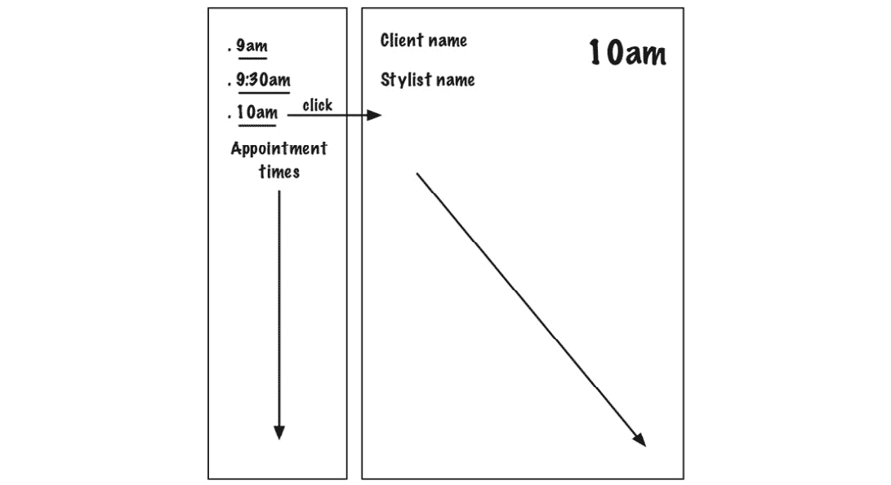
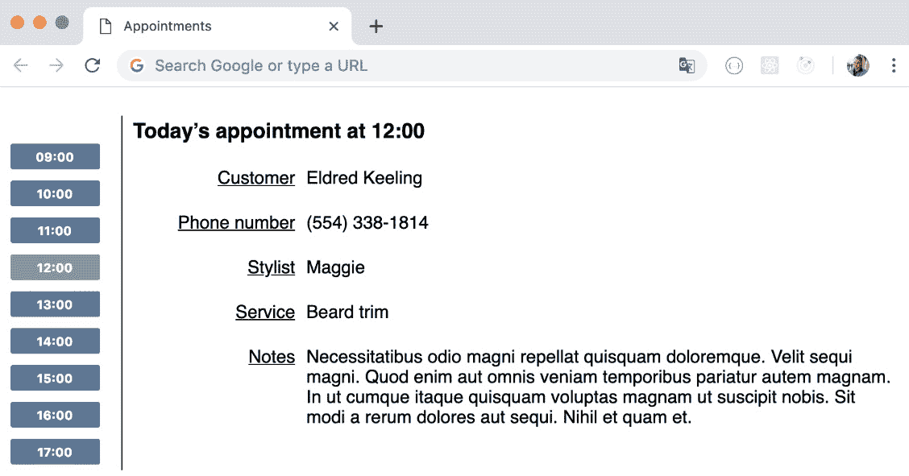

# 2

# 渲染列表和详情视图

上一章介绍了核心 TDD 周期：红、绿、重构。你有机会尝试两个简单的测试。现在，是时候将其应用到更大的 React 组件上了。

目前，你的应用程序只显示一条数据项：客户的姓名。在本章中，你将扩展它，以便查看当天所有的预约。你将能够选择一个时间段，并查看该时间段的预约详情。我们将通过绘制草图来开始本章，以帮助我们规划如何构建组件。然后，我们将开始实现列表视图并显示预约详情。

一旦我们使组件处于良好的状态，我们将使用 webpack 构建入口点，然后运行应用程序以进行一些手动测试。

本章将涵盖以下主题：

+   绘制草图

+   创建新组件

+   指定列表项内容

+   选择要查看的数据

+   手动测试我们的更改

到本章结束时，你将使用你已学到的 TDD 过程编写一个相当大的 React 组件。你还将看到应用程序的首次运行。

# 技术要求

本章的代码文件可以在[`github.com/PacktPublishing/Mastering-React-Test-Driven-Development-Second-Edition/tree/main/Chapter02`](https://github.com/PacktPublishing/Mastering-React-Test-Driven-Development-Second-Edition/tree/main/Chapter02)找到。

# 绘制草图

让我们从更多的预先设计开始。我们有一个`Appointment`组件，它接受一个预约并显示它。我们将围绕它构建一个`AppointmentsDayView`组件，该组件接受一个`appointment`对象的数组，并将它们显示为列表。它还将显示一个单独的`Appointment`：当前选定的预约。要选择一个预约，用户只需点击他们感兴趣的一天中的时间。



图 2.1 – 我们预约系统 UI 的草图

预先设计

当你使用 TDD 来构建新功能时，进行一点预先设计非常重要，这样你才能对实现的方向有一个大致的了解。

那就是我们现在需要的所有设计；让我们直接开始构建新的`AppointmentsDayView`组件。

# 创建新组件

在本节中，我们将创建`AppointmentsDayView`的基本形式：一天中的预约时间列表。我们目前不会为它构建任何交互行为。

我们将把我们的新组件添加到我们一直在使用的同一个文件中，因为到目前为止那里没有多少代码。执行以下步骤：

放置组件

我们并不总是需要为每个组件创建一个新的文件，尤其是当组件是短的功能组件时，比如我们的`Appointment`组件（一个单行函数）。将相关的组件或组件的小子树组合在一个地方可能会有所帮助。

1.  在`test/Appointment.test.js`中，在第一个`describe`块下面创建一个新的`describe`块，包含一个单独的测试。这个测试检查我们是否渲染了一个具有特定 ID 的`div`。在这个情况下，这是很重要的，因为我们加载了一个 CSS 文件，它会查找这个元素。这个测试中的期望使用了 DOM 方法`querySelector`。这个方法在 DOM 树中搜索一个带有提供标签的单个元素：

    ```js
    describe("AppointmentsDayView", () => {
      let container;
      beforeEach(() => {
        container = document.createElement("div");
        document.body.replaceChildren(container);
      });
      const render = (component) =>
        act(() =>      
          ReactDOM.createRoot(container).render(component)
        );
      it("renders a div with the right id", () => {
        render(<AppointmentsDayView appointments={[]} />);
        expect(
          document.querySelector(
            "div#appointmentsDayView"
          )
        ).not.toBeNull();
      });
    });
    ```

注意

通常情况下，没有必要将你的组件包裹在一个带有 ID 或类的`div`中。我们倾向于这样做，因为我们想将 CSS 附加到由组件渲染的整个 HTML 元素组上，正如你稍后将会看到的，对于`AppointmentsDayView`来说就是这样。

这个测试使用了第一个`describe`块中的相同的`render`函数，以及相同的`let container`声明和`beforeEach`块。换句话说，我们已经引入了重复的代码。通过从我们的第一个测试套件中复制代码，我们在清理代码后直接制造了一团糟！嗯，在我们处于 TDD 周期的第一阶段时，我们可以这样做。一旦测试通过，我们就可以考虑代码的正确结构了。

1.  运行`npm test`并查看输出：

    ```js
    FAIL test/Appointment.test.js
      Appointment
    ✓ renders the customer first name (18ms)
    ✓ renders another customer first name (2ms)
      AppointmentsDayView
    ✕ renders a div with the right id (7ms)
    ● AppointmentsDayView › renders a div with the right id
        ReferenceError: AppointmentsDayView is not defined
    ```

让我们通过以下步骤来使这个测试通过：

1.  为了解决这个问题，请将测试文件中的最后一个`import`语句更改为以下内容：

    ```js
    import {
      Appointment,
      AppointmentsDayView,
    } from "../src/Appointment";
    ```

1.  在`src/Appointment.js`中，在`Appointment`下面添加以下功能组件，如图所示：

    ```js
    export const AppointmentsDayView = () => {};
    ```

1.  再次运行你的测试。你将看到如下输出：

    ```js
    ● AppointmentsDayView › renders a div with the right id
    expect(received).not.toBeNull()
    ```

1.  最后，一个测试失败了！让我们按照以下方式放置那个`div`：

    ```js
    export const AppointmentsDayView = () => (
      <div id="appointmentsDayView"></div>
    );
    ```

1.  你的测试现在应该通过了。让我们继续下一个测试。在`test/Appointment.test.js`中，在最后一个测试下面添加以下文本，仍然在`AppointmentsDayView`的`describe`块内：

    ```js
    it("renders an ol element to display appointments", () => {
      render(<AppointmentsDayView appointments={[]} />);
      const listElement = document.querySelector("ol");
      expect(listElement).not.toBeNull();
    });
    ```

1.  再次运行你的测试，你将看到以下文本所示的输出：

    ```js
    ● AppointmentsDayView › renders an ol element to display appointments
    expect(received).not.toBeNull()
    Received: null
    ```

1.  为了使测试通过，添加以下`ol`元素：

    ```js
    export const AppointmentsDayView = () => (
      <div id="appointmentsDayView"> 
        <ol />
      </div>
    );
    ```

1.  好的，现在让我们用每个预约的项目填充那个`ol`列表。为此，我们需要（至少）两个作为`appointments`属性值的预约。添加下一个测试，如图所示：

    ```js
    it("renders an li for each appointment", () => {
      const today = new Date();
      const twoAppointments = [
        { startsAt: today.setHours(12, 0) },
        { startsAt: today.setHours(13, 0) },
      ];
      render(
        <AppointmentsDayView 
          appointments={twoAppointments}
        />
      );
      const listChildren =
        document.querySelectorAll("ol > li");
      expect(listChildren).toHaveLength(2);
    });
    ```

测试日期和时间

在测试中，`today`常量被定义为`new Date()`。两个记录中的每一个都使用这个作为基准日期。当我们处理日期时，非常重要的一点是我们应该基于同一时间点来安排所有事件，而不是多次从系统中获取当前时间。这样做是一个潜在的微妙错误。

1.  再次运行`npm test`，你将看到以下输出：

    ```js
    ● AppointmentsDayView › renders an li for each appointment
    expect(received).toHaveLength(expected)
    Expected length: 2
    Received length: 0
    Received object: []
    ```

1.  为了解决这个问题，我们遍历提供的`appointments`属性，并渲染一个空的`li`元素：

    ```js
    export const AppointmentsDayView = (
      { appointments }
    ) => (
      <div id="appointmentsDayView"> 
        <ol>
          {appointments.map(() => (
            <li />
          ))}
        </ol>
      </div>
    );
    ```

忽略未使用的函数参数

`map` 函数将为传递给它的函数提供一个 `appointment` 参数。由于我们目前还没有使用这个参数，我们不需要在函数签名中提及它——我们只需假装我们的函数没有参数即可，因此括号是空的。别担心，我们将在后续测试中需要这个参数，那时我们会添加它。

1.  太好了，让我们看看 Jest 怎么想。再次运行 `npm test`：

    ```js
      console.error
        Warning: Each child in a list should have a unique "key" prop.
        Check the render method of AppointmentsDayView.
        ...
    PASS test/Appointment.test.js
      Appointment
    ✓ renders the customer first name (19ms)
    ✓ renders another customer first name (2ms)
      AppointmentsDayView
    ✓ renders a div with the right id (7ms)
    ✓ renders an ol element to display appointments (16ms)
    ✓ renders an li for each appointment (16ms)
    ```

1.  我们的测试通过了，但我们收到了 React 的警告。它告诉我们要在每个子元素上设置一个键值。我们可以使用 `startsAt` 作为键，如下所示：

    ```js
    <ol>
      {appointments.map(appointment => (
        <li key={appointment.startsAt} />
      ))}
    </ol>
    ```

测试键值

在 React 中测试键值没有简单的方法。为了做到这一点，我们需要依赖于内部 React 属性，这可能会引入风险，即如果 React 团队更改这些属性，测试可能会中断。

我们能做的就是设置一个键来消除这个警告信息。在一个理想的世界里，我们会有一个使用每个 `li` 键的 `startsAt` 时间戳的测试。让我们假设我们已经有了那个测试。

本节介绍了如何渲染列表的基本结构和其列表项。接下来，是时候填充这些项了。

# 指定列表项内容

在本节中，你将添加一个使用示例预约数组的测试，以指定列表项应显示每个预约的时间，然后你将使用该测试来支持实现。

让我们从测试开始：

1.  在新的 `describe` 块中创建第四个测试，如下所示：

    ```js
    it("renders the time of each appointment", () => {
      const today = new Date();
      const twoAppointments = [
        { startsAt: today.setHours(12, 0) },
        { startsAt: today.setHours(13, 0) },
      ];
      render(
        <AppointmentsDayView 
          appointments={twoAppointments}
        />
      );
      const listChildren = 
        document.querySelectorAll("li");
      expect(listChildren[0].textContent).toEqual(
        "12:00"
      );
      expect(listChildren[1].textContent).toEqual(
        "13:00"
      );
    });
    ```

Jest 将显示以下错误：

```js
● AppointmentsDayView › renders the time of each appointment
expect(received).toEqual(expected) // deep equality
Expected: "12:00"
Received: ""
```

`toEqual` 匹配器

这个匹配器是 `toContain` 的更严格版本。期望只有在文本内容是精确匹配的情况下才会通过。在这种情况下，我们认为使用 `toEqual` 是有意义的。然而，通常最好尽可能宽松地设定期望。严格的期望往往会在你对代码库进行最轻微的更改时崩溃。

1.  将以下函数添加到 `src/Appointment.js` 中，该函数将 Unix 时间戳（我们从 `setHours` 的返回值中获取）转换为一天中的时间。你可以在文件的任何位置放置它；我们通常喜欢在使用之前定义常量，所以这应该放在文件顶部：

    ```js
    const appointmentTimeOfDay = (startsAt) => {
      const [h, m] = new Date(startsAt)
        .toTimeString()
        .split(":");
      return `${h}:${m}`;
    }
    ```

理解语法

这个函数使用了 *解构赋值* 和 *模板字符串*，这些是你可以用来使你的函数更简洁的语言特性。

良好的单元测试可以帮助我们学习高级语言语法。如果我们对函数的功能不确定，我们可以查找帮助我们弄清楚这些的测试。

1.  使用前面的函数按如下方式更新 `AppointmentsDayView`：

    ```js
    <ol>
      {appointments.map(appointment => (
        <li key={appointment.startsAt}>
          {appointmentTimeOfDay(appointment.startsAt)}
        </li>
      ))}
    </ol>
    ```

1.  运行测试应该显示一切正常：

    ```js
    PASS test/Appointment.test.js
      Appointment
    ✓ renders the customer first name (19ms)
    ✓ renders another customer first name (2ms)
      AppointmentsDayView
    ✓ renders a div with the right id (7ms)
    ✓ renders an ol element to display appointments (16ms)
    ✓ renders an li for each appointment (6ms)
    ✓ renders the time of each appointment (3ms)
    ```

这是一个很好的重构机会。最后两个 `AppointmentsDayView` 测试使用了相同的 `twoAppointments` 属性值。这个定义和 `today` 常量可以被提升到 `describe` 范围内，就像我们在 `Appointment` 测试中对 `customer` 做的那样。然而，这次它们可以保持为 `const` 声明，因为它们永远不会改变。

1.  为了做到这一点，将`today`和`twoAppointments`的定义从其中一个测试移动到`describe`块的顶部，在`beforeEach`之上。然后，从两个测试中删除这些定义。

这个测试就到这里。接下来，是时候专注于添加点击行为。

# 选择要查看的数据

让我们在页面上添加一些动态行为。我们将使每个列表项都成为一个用户可以点击以查看该预约的链接。

在思考我们的设计时，我们需要以下几个部分：

+   我们`li`中的`button`元素

+   附着到那个`button`元素的`onClick`处理程序

+   组件状态用于记录当前正在查看的预约

当我们测试 React 动作时，我们通过观察这些动作的后果来进行。在这种情况下，我们可以点击一个按钮，然后检查相应的预约现在是否已渲染在屏幕上。

我们将把这个部分分成两部分：首先，我们将指定组件应该如何初始显示，其次，我们将处理一个用于更改内容的点击事件。

## 初始数据选择

让我们首先断言每个`li`元素都有一个`button`元素：

1.  如果今天没有预约，我们希望向用户显示一条消息。在`AppointmentsDayView`的`describe`块中添加以下测试：

    ```js
    it("initially shows a message saying there are no appointments today", () => {
      render(<AppointmentsDayView appointments={[]} />);
      expect(document.body.textContent).toContain(
        "There are no appointments scheduled for today."
      );
    });
    ```

1.  通过在渲染输出的底部添加一条消息来使测试通过。我们目前不需要检查空的`appointments`数组；我们需要另一个测试来验证这一点。消息如下：

    ```js
    return (
      <div id="appointmentsDayView">
        ...
        <p>There are no appointments scheduled for today.</p>
      </div>
    );
    ```

1.  当组件首次加载时，我们应该显示当天的第一个预约。一个检查这一点的简单方法是在页面上查找客户的第一个名字。添加下一个测试，如下所示：

    ```js
    it("selects the first appointment by default", () => {
      render(
        <AppointmentsDayView 
          appointments={twoAppointments}
        />
      );
      expect(document.body.textContent).toContain(
        "Ashley"
      );
    });
    ```

1.  由于我们正在寻找客户的姓名，我们需要确保它在`twoAppointments`数组中可用。现在更新它，包括客户的第一个名字如下：

    ```js
    const twoAppointments = [
      {
        startsAt: today.setHours(12, 0),
        customer: { firstName: "Ashley" },
      },
      {
        startsAt: today.setHours(13, 0),
        customer: { firstName: "Jordan" },
      },
    ];
    ```

1.  通过修改`Appointment`组件来使测试通过。将`div`组件的最后一行修改如下：

    ```js
    <div id="appointmentsDayView">
      ...
      {appointments.length === 0 ? (
        <p>There are no appointments scheduled for today.</p>
      ) : (
        <Appointment {...appointments[0]} />
      )}
    </div>
    ```

现在我们已经准备好让用户进行选择了。

## 向功能组件添加事件

我们即将为我们的组件添加**状态**。该组件将为每个预约显示一个按钮。当按钮被点击时，组件将存储它所引用的预约的数组索引。为此，我们将使用`useState`钩子。

什么是钩子？

`useState`钩子存储了函数多次渲染之间的数据。对`useState`的调用返回存储中的当前值和一个设置函数，允许它被设置。

如果你刚开始接触钩子，请查看本章末尾的**进一步阅读**部分。或者，你也可以只是跟随并看看你通过阅读测试能学到多少！

我们将首先断言每个`li`元素都有一个`button`元素：

1.  在你添加的最后一个测试下面添加以下测试。第二个期望是独特的，因为它正在检查按钮元素的`type`属性是否为`button`。如果你之前没有见过，当使用`button`元素时，通过设置`type`属性来定义其角色是惯用的，就像这个测试中所示：

    ```js
    it("has a button element in each li", () => {
      render(
        <AppointmentsDayView 
          appointments={twoAppointments}
        />
      );
      const buttons =
       document.querySelectorAll("li > button");
      expect(buttons).toHaveLength(2);
      expect(buttons[0].type).toEqual("button");
    });
    ```

测试元素定位

我们不需要过于关注检查`button`元素在其父元素中的内容或位置。例如，如果我们把一个空的`button`子元素放在`li`的末尾，这个测试就会通过。但幸运的是，做正确的事情和做错误的事情一样简单，所以我们可以选择做正确的事情。要使这个测试通过，我们只需要将现有内容包裹在新的标签中。

1.  通过在`AppointmentsDayView`组件中将约会时间包裹在`button`元素中来使测试通过，如下所示：

    ```js
    ...
    <li key={appointment.startsAt}>
      <button type="button">
        {appointmentTimeOfDay(appointment.startsAt)}
      </button>
    </li>
    ...
    ```

1.  我们现在可以测试当按钮被点击时会发生什么。回到`test/Appointment.test.js`，添加以下内容作为下一个测试。这个测试使用 DOM 元素的`click`函数来引发一个 DOM 点击事件：

    ```js
    it("renders another appointment when selected", () => {
      render(
        <AppointmentsDayView 
          appointments={twoAppointments}
        />
      );
      const button = 
        document.querySelectorAll("button")[1];
      act(() => button.click());
      expect(document.body.textContent).toContain(
        "Jordan"
      );
    });
    ```

合成事件和 Simulate

使用`click`函数的替代方法是使用 React 测试工具的`Simulate`命名空间来引发`Simulate`。与使用 DOM API 引发事件相比，`Simulate`要简单一些，但它对于测试也是不必要的。当 DOM API 足够用时，没有必要使用额外的 API。也许更重要的是，我们还想让我们的测试尽可能反映真实的浏览器环境。

1.  继续运行测试。输出将如下所示：

    ```js
    ● AppointmentsDayView › renders appointment when selected
        expect(received).toContain(expected)

        Expected substring: "Jordan"
        Received string:    "12:0013:00Ashley"
    ```

注意接收到的字符串中的全文。我们之所以获取列表的文本内容，是因为我们在期望中使用了`document.body.textContent`而不是更具体的内容。

期望的特定性

不要太在意客户名字在屏幕上的位置。测试`document.body.textContent`就像说“我想这个文本出现在某个地方，但我不在乎它在哪里。”通常，这足以进行测试。稍后，我们将看到在特定位置期望文本的技术。

为了使测试通过，我们现在需要做很多事情。我们需要引入状态，并添加处理程序。执行以下步骤：

1.  将文件顶部的导入更新为拉入`useState`函数，如下所示：

    ```js
    import React, { useState } from "react";
    ```

1.  将常量定义包裹在花括号中，然后按照以下方式返回现有值：

    ```js
    export const AppointmentsDayView = (
      { appointments }
    ) => {
      return (
        <div id="appointmentsDayView">
          ...
        </div>
      );
    };
    ```

1.  在`return`语句上方添加以下代码行：

    ```js
    const [selectedAppointment, setSelectedAppointment] =
      useState(0);
    ```

1.  我们现在可以使用`selectedAppointment`而不是硬编码一个索引来选择正确的约会。在选择约会时，将返回值更改为使用这个新的状态值，如下所示：

    ```js
    <div id="appointmentsDayView">
      ...
      <Appointment
        {...appointments[selectedAppointment]}
      />
    </div>
    ```

1.  将`map`调用修改为包括其参数中的索引。让我们将其命名为`i`，如下所示：

    ```js
    {appointments.map((appointment, i) => (
      <li key={appointment.startsAt}>
        <button type="button">
          {appointmentTimeOfDay(appointment.startsAt)}
        </button>
      </li>
    ))}
    ```

1.  现在从`button`元素的`onClick`处理程序中调用`setSelectedAppointment`，如下所示：

    ```js
    <button
      type="button"
      onClick={() => setSelectedAppointment(i)}
    >
    ```

1.  运行你的测试，你应该会发现它们都是绿色的：

    ```js
    PASS test/Appointment.test.js
      Appointment
        ✓ renders the customer first name (18ms)
        ✓ renders another customer first name (2ms)
      AppointmentsDayView
        ✓ renders a div with the right id (7ms)
        ✓ renders multiple appointments in an ol element (16ms)
        ✓ renders each appointment in an li (4ms)
        ✓ initially shows a message saying there are no appointments today (6ms)
        ✓ selects the first element by default (2ms)
        ✓ has a button element in each li (2ms)
        ✓ renders another appointment when selected (3ms)
    ```

我们在本节中涵盖了大量的细节，从指定视图的初始状态开始，到添加 `button` 元素并处理其 `onClick` 事件。

我们现在有足够的功能，可以尝试一下，看看我们目前处于什么位置。

# 手动测试我们的更改

“手动测试”这个词应该让每个 TDDer 都感到恐惧，因为它会占用 *如此* 多的时间。尽可能避免它。当然，我们无法完全避免它 - 当我们完成一个完整的功能后，我们需要检查我们是否做了正确的事情。

目前为止，我们尚不能运行我们的应用程序。为了做到这一点，我们需要添加一个入口点，然后使用 webpack 打包我们的代码。

## 添加入口点

React 应用程序由在根处渲染的组件层次结构组成。我们的应用程序入口点应该渲染此根组件。

我们通常 *不* 对入口点进行测试驱动，因为任何加载我们整个应用程序的测试，随着我们添加越来越多的依赖项，都可能变得非常脆弱。在 *第四部分，使用 Cucumber 进行行为驱动开发* 中，我们将探讨使用 Cucumber 测试编写一些将 *确实* 覆盖入口点的测试。

由于我们没有进行测试驱动，我们遵循以下几条一般规则：

+   尽量简短

+   仅将其用于实例化根组件的依赖项并调用 `render`

在我们运行应用程序之前，我们需要一些示例数据。创建一个名为 `src/sampleData.js` 的文件，并填充以下代码：

```js
const today = new Date();
const at = (hours) => today.setHours(hours, 0);
export const sampleAppointments = [
  { startsAt: at(9), customer: { firstName: "Charlie" } },
  { startsAt: at(10), customer: { firstName: "Frankie" } },
  { startsAt: at(11), customer: { firstName: "Casey" } },
  { startsAt: at(12), customer: { firstName: "Ashley" } },
  { startsAt: at(13), customer: { firstName: "Jordan" } },
  { startsAt: at(14), customer: { firstName: "Jay" } },
  { startsAt: at(15), customer: { firstName: "Alex" } },
  { startsAt: at(16), customer: { firstName: "Jules" } },
  { startsAt: at(17), customer: { firstName: "Stevie" } },
];
```

重要提示

GitHub 仓库中的 `Chapter02/Complete` 目录包含一个更完整的示例数据集。

此列表也不需要测试驱动，以下是一些原因：

1.  这是一个没有行为的静态数据列表。测试都是关于指定行为的，这里没有。

1.  一旦我们开始使用我们的后端 API 拉取数据，此模块将被移除。

提示

TDD 经常是一种实用主义的选择。有时，不进行测试驱动是正确的事情。

创建一个新文件，`src/index.js`，并输入以下代码：

```js
import React from "react";
import ReactDOM from "react-dom/client";
import { AppointmentsDayView } from "./Appointment";
import { sampleAppointments } from "./sampleData";
ReactDOM.createRoot(
  document.getElementById("root")
).render(
  <AppointmentsDayView appointments={sampleAppointments} />
);
```

这就是您所需要的。

## 使用 webpack 整合所有内容

当 Jest 在测试环境中运行时，它会使用 Babel 将所有我们的代码进行转译。但当我们通过我们的网站提供代码时怎么办？Jest 将无法帮助我们。

正是 webpack 的用武之地，我们现在可以介绍它，帮助我们快速手动测试，如下所示：

1.  使用以下命令安装 webpack：

    ```js
    npm install --save-dev webpack webpack-cli babel-loader
    ```

1.  将以下代码添加到您的 `package.json` 文件的 `scripts` 部分：

    ```js
    "build": "webpack",
    ```

1.  您还需要为 webpack 设置一些配置。在项目根目录中创建 `webpack.config.js` 文件，并包含以下内容：

    ```js
    const path = require("path");
    const webpack = require("webpack");
    module.exports = {
      mode: "development",
      module: {
        rules: [
          {
            test: /\.(js|jsx)$/,
            exclude: /node_modules/,
            loader: "babel-loader",
          },
        ],
      },
    };
    ```

此配置适用于开发模式下的 webpack。有关设置生产构建的信息，请参阅 webpack 文档。

1.  在您的源目录中，运行以下命令：

    ```js
    mkdir dist
    touch dist/index.xhtml
    ```

1.  将以下内容添加到您刚刚创建的文件中：

    ```js
    <!DOCTYPE html>
    <html>
      <head>
        <title>Appointments</title>
      </head>
      <body>
        <div id="root"></div>
        <script src="img/main.js"></script>
      </body>
    </html>
    ```

1.  您现在可以使用以下命令运行构建：

    ```js
    npm run build
    ```

你应该看到如下输出：

```js
modules by path ./src/*.js 2.56 KiB
  ./src/index.js 321 bytes [built] [code generated]
  ./src/Appointment.js 1.54 KiB [built] [code generated]
  ./src/sampleData.js 724 bytes [built] [code generated]
webpack 5.65.0 compiled successfully in 1045 ms
```

1.  在你的浏览器中打开 `dist/index.xhtml`，欣赏你的作品！

以下截图显示了完成 *练习* 后的应用程序，其中添加了 CSS 和扩展的示例数据。要包含 CSS，你需要从 `Chapter02/Complete` 目录中提取 `dist/index.xhtml` 和 `dist/styles.css`。



图 2.2 – 到目前为止的应用程序

在你将代码提交到 Git 之前...

确保按照以下方式将 `dist/main.js` 添加到你的 `.gitignore` 文件中：

**echo "dist/main.js" >> .gitignore**

`main.js` 文件是由 webpack 生成的，就像大多数生成的文件一样，你不应该将其提交到版本控制中。

在这个阶段，你可能还想添加 `README.md` 文件来提醒自己如何运行测试以及如何构建应用程序。

现在，你已经看到了如何在创建入口点时暂时放下 TDD：因为入口点很小且不太可能频繁更改，所以我们选择不对其进行测试驱动。

# 摘要

在本章中，你已经能够多次练习 TDD 循环，并感受到如何使用测试作为指南来构建一个功能。

我们首先设计了一个快速的原型，这帮助我们决定了我们的行动方案。我们构建了一个容器组件（`AppointmentsDayView`），它显示了一系列的预约时间，并且能够根据点击的预约时间显示单个 `Appointment` 组件。

我们随后着手建立一个基本的列表结构，然后扩展它以显示初始的 `Appointment` 组件，最后添加了 `onClick` 行为。

这种测试策略，即从基本结构开始，然后是初始视图，最后是事件行为，是测试组件的典型策略。

我们距离完全构建我们的应用程序还有一段距离。任何应用程序的前几个测试总是最难的，并且需要最长时间来编写。我们现在已经越过了这个障碍，所以从这里开始我们将更快地前进。

# 练习

1.  将 `Appointment.js` 和 `Appointment.test.js` 重命名为 `AppointmentsDayView.js` 和 `AppointmentsDayView.test.js`。如果多个组件构成一个层次结构，将它们包含在一个文件中是可以的，但你应该始终以该层次结构的根组件命名文件。

1.  通过在页面上显示以下字段来完成 `Appointment` 组件。你应该使用 `table` HTML 元素来给数据一些视觉结构。这不应该影响你编写测试的方式。应该显示的字段如下：

    +   客户的姓氏，使用 `lastName` 字段

    +   客户电话号码，使用 `phoneNumber` 字段

    +   美容师姓名，使用 `stylist` 字段

    +   美容院服务，使用 `service` 字段

    +   预约备注，使用 `notes` 字段

1.  在 `Appointment` 组件中添加一个标题，以清楚地显示正在查看的预约时间。

1.  存在一些重复的样本数据。我们在测试中使用了样本数据，同时我们也在`src/sampleData.js`中创建了`sampleAppointments`，我们用它来手动测试我们的应用程序。你认为这样做值得吗？如果是，为什么？如果不是，为什么？

# 进一步阅读

Hooks 是 React 中相对较新的功能。传统上，React 使用类来构建具有状态的组件。要了解 Hooks 的工作原理，请查看以下链接中的 React 官方全面文档：

[`reactjs.org/docs/hooks-overview.xhtml`](https://reactjs.org/docs/hooks-overview.xhtml).
