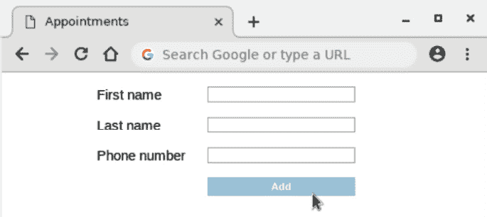

# 4

# 测试驱动数据输入

在本章中，你将探索 React 表单和受控组件。

表单是构建 Web 应用程序的重要组成部分，是用户输入数据的主要方式。如果我们想确保我们的应用程序正常工作，那么不可避免地，这意味着我们需要为我们的表单编写自动化测试。更重要的是，在 React 中使表单工作需要大量的配置，这使得它们得到良好的测试变得尤为重要。

表单的自动化测试全部关于用户的行为：输入文本、点击按钮，以及表单完成时提交。

我们将构建一个新的组件，`CustomerForm`，当添加或修改客户时我们将使用它。它将包含三个文本字段：名字、姓氏和电话号码。

在构建这个表单的过程中，你将更深入地了解测试复杂的 DOM 元素树。你将学习如何使用参数化测试重复一组测试而不重复代码。

本章将涵盖以下主题：

+   添加表单元素

+   接受文本输入

+   提交表单

+   为多个表单字段复制测试

到本章结束时，你将能够理解使用 React 进行 HTML 表单的测试驱动开发。

# 技术要求

本章的代码文件可以在以下位置找到：[`github.com/PacktPublishing/Mastering-React-Test-Driven-Development-Second-Edition/tree/main/Chapter04`](https://github.com/PacktPublishing/Mastering-React-Test-Driven-Development-Second-Edition/tree/main/Chapter04)。

# 添加表单元素

HTML 表单是一系列字段，被包裹在 `form` 元素中。尽管我们主要对字段感兴趣，但我们仍需要从 `form` 元素本身开始。这就是本节我们将要构建的内容。

让我们按照以下步骤创建我们的第一个表单：

1.  创建一个名为 `test/CustomerForm.test.js` 的新文件，并添加以下脚手架。它包含你在前几章中看到的所有常用导入和组件测试初始化：

    ```js
    import React from "react";
    import {
      initializeReactContainer,
      render,
      element,
    } from "./reactTestExtensions";
    import { CustomerForm } from "../src/CustomerForm";
    describe("CustomerForm", () => {
      beforeEach(() => {
        initializeReactContainer();
      });
    });
    ```

1.  现在你已经准备好创建你的第一个测试了。将以下测试添加到 `describe` 块中：

    ```js
    it("renders a form", () => {
      render(<CustomerForm />);
      expect(element("form")).not.toBeNull();
    });
    ```

1.  我们有一个完整的测试，所以让我们运行它看看会发生什么：

    ```js
    FAIL test/CustomerForm.test.js
      ● Test suite failed to run
        Cannot find module '../src/CustomerForm' from 'CustomerForm.test.js'
    ```

失败告诉我们它找不到该模块。那是因为我们还没有创建它。

1.  因此，创建一个名为 `src/CustomerForm.js` 的空白文件。再次运行你的测试应该会给出以下输出：

    ```js
    FAIL test/CustomerForm.test.js
     ● CustomerForm › renders a form
       Element type is invalid: expected a string (for built-in components) or a class/function (for composite components) but got: undefined. You likely forgot to export your component from the file it's defined in, or you might have mixed up default and named imports.
           8 |
           9 | export const render = (component) =>
        > 10 |   act(() => 
          11 |     ReactDOM.createRoot(...).render(...)
             |     ^
          12 |   );
          11 |
          12 | export const click = (element) =>
          13 |   act(() => element.click());
    ```

测试辅助代码的堆栈跟踪

Jest 的堆栈跟踪指向我们扩展代码中的失败，而不是测试本身。如果我们的代码在一个 npm 模块中，Jest 会跳过测试输出中的那些测试行。幸运的是，错误信息足够有帮助。

1.  为了修复这个问题，我们需要添加一个与我们在测试文件顶部编写的导入匹配的导出。将以下行添加到 `src/CustomerForm.js`：

    ```js
    export const CustomerForm = () => null;
    ```

1.  运行一些测试给出了实际的期望失败：

    ```js
    ● CustomerForm › renders a form
      expect(received).not.toBeNull()
      Received: null
    ```

这可以通过让组件返回一些内容来修复：

```js
import React from "react";
export const CustomerForm = () => <form />;
```

在继续之前，让我们提取一个用于查找 `form` 元素的辅助函数。正如前一章所述，这可能是过早的，因为我们现在只有一个测试使用这段代码。然而，当我们编写表单提交测试时，我们会感激有这个辅助函数。

1.  打开 `test/reactTestExtensions.js` 并添加以下函数：

    ```js
    export const form = (id) => element("form");
    ```

1.  通过添加以下 `import` 修改你的测试文件。你可以保留 `element` 的导入，因为我们将在下一节中使用它：

    ```js
    import {
      initializeReactContainer,
      render,
      element,
      form,
    } from "./reactTestExtensions";
    ```

1.  最后，更新你的测试以使用辅助函数，如下所示。之后，你的测试应该仍然通过：

    ```js
    it("renders a form", () => {
      render(<CustomerForm />);
      expect(form()).not.toBeNull();
    });
    ```

这就是创建基本 `form` 元素的全部内容。有了这个包装器，我们现在可以添加我们的第一个字段元素：一个文本框。

# 接受文本输入

在本节中，我们将添加一个文本框，以便添加或编辑客户的第一个名字。

添加一个文本字段比添加 `form` 元素更复杂。首先，有元素本身，它有一个需要测试的 `type` 属性。然后，我们需要用初始值初始化元素。最后，我们需要添加一个标签，以便清楚地表示字段的意义。

让我们从在页面上渲染一个 HTML 文本输入字段开始：

1.  将以下测试添加到 `test/CustomerForm.test.js` 中。它包含三个期望（本章末尾有一个练习，你可以按照它来提取这些期望作为一个单独的匹配器）：

    ```js
    it("renders the first name field as a text box", () => {
      render(<CustomerForm />);
      const field = form().elements.firstName;
      expect(field).not.toBeNull();
      expect(field.tagName).toEqual("INPUT");
      expect(field.type).toEqual("text");
    });
    ```

依赖于 DOM 的表单 API

这个测试使用了表单 API：任何表单元素都允许你使用 `elements` 索引器访问其所有输入元素。你给出元素的 `name` 属性（在这个例子中，是 `firstName`），然后返回该元素。

这意味着我们必须检查返回的元素的标签。我们想确保它是一个 `<input>` 元素。如果我们没有使用表单 API，一个替代方案将是使用 `elements("input")[0]`，它返回页面上第一个输入元素。这将使对元素 `tagName` 属性的期望变得不必要。

1.  让我们加快速度。我们将一次使所有期望通过。更新 `CustomerForm` 以包括一个单独的输入字段，如下所示：

    ```js
    export const CustomerForm = () => (
      <form
        <input type="text" name="firstName" />
      </form>
    );
    ```

1.  由于这个表单将在修改现有客户以及添加新客户时使用，我们需要设计一种方法将现有客户数据放入组件中。我们将通过设置包含表单数据的 `original` 属性来实现这一点。添加以下测试：

    ```js
    it("includes the existing value for the first name", () => {
      const customer = { firstName: "Ashley" };
      render(<CustomerForm original={customer} />);
      const field = form().elements.firstName;
      expect(field.value).toEqual("Ashley");
    });
    ```

1.  要使这个测试通过，将组件定义更改为以下内容。我们将使用一个属性来传递之前的 `firstName` 值：

    ```js
    export const CustomerForm = ({ original }) => (
      <form
        <input
          type="text"
          name="firstName"
    value={original.firstName} />
      </form>
    );
    ```

1.  再次运行测试后，你会发现尽管这个测试现在通过了，但前两个测试失败了，因为它们没有指定 `original` 属性。更重要的是，我们有一个警告：

    ```js
    Warning: You provided a `value` prop to a form field without an `onChange` handler. This will render a read-only field. If the field should be mutable use `defaultValue`. Otherwise, set either `onChange` or `readOnly`.
    ```

1.  为了修复初始测试，创建一个新的常量 `blankCustomer`，它将作为我们的“基础”客户。对于不关心特定字段值的测试来说，这完全足够，比如我们的前两个测试。将此定义添加到 `beforeEach` 块之上：

    ```js
    const blankCustomer = {
      firstName: "",
    };
    ```

对于指定一个空对象作为原始属性，有什么看法吗？

在这个对象定义中，我们将 `firstName` 的值设置为空字符串。你可能认为 `undefined` 或 `null` 是更好的候选值。这样，我们可以避免定义这样的对象，只需传递一个空对象 `{}`。不幸的是，当你尝试将受控组件的初始值设置为 `undefined` 时，React 会警告你，这是我们想要避免的。这不是什么大问题，而且除了这个之外，空字符串对于文本框来说是一个更现实的默认值。

1.  更新前两个测试，使它们以设置 `original` 属性的方式渲染，如下所示。在这个更改到位后，你应该有三个通过测试，但警告仍然存在：

    ```js
    it("renders a form", () => {
      render(<CustomerForm original={blankCustomer} />);
      expect(form()).not.toBeNull();
    });
    it("renders the first name field as a text box", () => {
      render(<CustomerForm original={blankCustomer} />);
      const field = form().elements.firstName;
      expect(field).not.toBeNull();
      expect(field.tagName).toEqual("INPUT");
      expect(field.type).toEqual("text");
    });
    ```

1.  为了消除警告，将单词 `readOnly` 添加到输入标签中。你可能认为我们当然不希望有一个只读字段？你说得对，但我们需要一个进一步的测试，用于修改输入值，然后我们才能避免使用 `readOnly` 关键字。我们将在稍后添加那个测试：

    ```js
    <input
      type="text"
      name="firstName"
      value={original.firstName}
      readOnly
    />
    ```

小贴士

总是认为 React 警告是测试失败。在没有先修复任何警告的情况下不要继续进行。

1.  最后两个测试包括以下行，它进入表单以提取 `firstName` 字段：

    ```js
    const field = form().elements.firstName;
    ```

让我们将这个功能提升到 `test/reactTestExtensions.js` 文件中。打开该文件，在 `form` 定义之后添加以下定义：

```js
export const field = (fieldName) =>
  form().elements[fieldName];
```

1.  然后，将其导入到 `test/CustomerForm.js`：

    ```js
    import {
      initializeReactContainer,
      render,
      element,
      form,
      field,
    } from "./reactTestExtensions";
    ```

1.  更改你写的最后一个测试，使其使用新的辅助函数：

    ```js
    it("includes the existing value for the first name", () => {
      const customer = { firstName: "Ashley" };
      render(<CustomerForm original={customer} />);
      expect(field("firstName").value).toEqual("Ashley");
    });
    ```

1.  以相同的方式更新第一个测试：

    ```js
    it("renders the first name field as a text box", () => {
      render(<CustomerForm original={blankCustomer} />);
      expect(field("firstName")).not.toBeNull();
      expect(field("firstName")).toEqual("INPUT");
      expect(field("firstName")).toEqual("text");
    });
    ```

1.  接下来，我们将为该字段添加一个标签。添加以下测试，它使用 `element` 辅助函数：

    ```js
    it("renders a label for the first name field", () => {
      render(<CustomerForm original={blankCustomer} />);
      const label = element("label[for=firstName]");
      expect(label).not.toBeNull();
    });
    ```

1.  通过将新元素插入到 `CustomerForm` 的 JSX 中来使这个测试通过：

    ```js
    <form
      <label htmlFor="firstName" />
      ...
    </form>
    ```

htmlFor 属性

JSX 的 `htmlFor` 属性设置了 HTML 的 `for` 属性。`for` 在 JSX 中不能使用，因为它是一个保留的 JavaScript 关键字。该属性用于表示标签与具有给定 ID 的表单元素相匹配——在这种情况下，`firstName`。

1.  让我们在那个标签中添加一些文本内容：

    ```js
    it("renders 'First name' as the first name label content", () => {
      render(<CustomerForm original={blankCustomer} />);
      const label = element("label[for=firstName]");
      expect(label).toContainText("First name");
    });
    ```

1.  更新 `label` 元素以使测试通过：

    ```js
    <form
      <label htmlFor="firstName">First name</label>
      ...
    </form>
    ```

1.  最后，我们需要确保我们的输入有一个与标签的 `htmlFor` 值匹配的 ID，以便它们可以匹配。添加以下测试：

    ```js
    it("assigns an id that matches the label id to the first name field", () => {
      render(<CustomerForm original={blankCustomer} />);
      expect(field("firstName").id).toEqual("firstName");
    });
    ```

1.  使其通过就像添加新的属性一样简单：

    ```js
    <form>
      <label htmlFor="firstName">First name</label>
      <input
        type="text"
        name="firstName"
        id="firstName"
        value={firstName}
        readOnly
      />
    </form>
    ```

我们现在几乎已经为这个字段创建了所有需要的东西：输入字段本身、它的初始值和它的标签。但我们没有处理值更改的行为——这就是为什么我们有 `readOnly` 标志的原因。

仅在提交表单并更新数据的情况下更改行为才有意义：如果你无法提交表单，更改字段值就没有意义。这就是我们将在下一节中讨论的内容。

# 提交表单

对于本章，我们将定义“提交表单”为“调用当前`customer`对象的`onSubmit`回调函数”。`onSubmit`回调函数是我们将要传递的属性。

本节将介绍一种测试表单提交的方法。在*第六章* *探索测试替身* 中，我们将更新这个调用为`global.fetch`，将我们的客户数据发送到应用程序的后端 API。

我们需要几个不同的测试来指定这种行为，每个测试都是逐步构建我们需要的功能。首先，我们将有一个测试来确保表单有一个提交按钮。然后，我们将编写一个测试来点击该按钮而不对表单进行任何更改。我们还需要另一个测试来检查提交表单不会导致页面导航发生。最后，在文本框的值更新后，我们将结束一个测试提交。

## 无更改提交

让我们从在表单中创建一个按钮开始。点击它将导致表单提交：

1.  首先，添加一个测试来检查页面上是否存在提交按钮：

    ```js
    it("renders a submit button", () => {
      render(<CustomerForm original={blankCustomer} />);
      const button = element("input[type=submit]");
      expect(button).not.toBeNull();
    });
    ```

1.  为了使它通过，在表单的 JSX 底部添加以下单行：

    ```js
    <form>
      ...
      <input type="submit" value="Add" />
    </form>
    ```

1.  以下测试引入了一个新概念，所以我们将将其分解为其组成部分。首先，创建一个新的测试，`starting`，如下所示：

    ```js
    it("saves existing first name when submitted", () => {
      expect.hasAssertions();
    });
    ```

`hasAssertions`期望告诉 Jest 它应该期望至少发生一个断言。它告诉 Jest 至少有一个断言必须在测试的作用域内运行；否则，测试就失败了。你将在下一步中看到为什么这很重要。

1.  将以下测试部分添加到大纲中，在`hasAssertions`调用下方：

    ```js
    const customer = { firstName: "Ashley" };
    render(
      <CustomerForm
        original={customer}
        onSubmit={({ firstName }) =>
          expect(firstName).toEqual("Ashley")
        }
      />
    );
    ```

这个函数调用是`render`调用本身和`onSubmit`处理程序的混合。这是我们希望 React 在表单提交时调用的处理程序。

1.  通过在`render`调用下方添加以下行来完成测试。这是我们的测试的**执行**阶段，在这个测试中是测试的最后一个阶段：

    ```js
    const button = element("input[type=submit]");
    click(button);
    ```

使用`hasAssertions`避免假阳性

你现在可以明白为什么我们需要`hasAssertions`。测试是按照顺序编写的，断言定义在`onSubmit`处理程序中。如果我们没有使用`hasAssertions`，这个测试现在就会通过，因为我们从未调用`onSubmit`。

我不建议编写这样的测试。在*第六章* *探索测试替身* 中，我们将发现`hasAssertions`。我们在这里使用的方法是有效的 TDD 实践；它只是有点混乱，所以你最终会想要重构它。

1.  现在，你需要导入`click`：

    ```js
    import {
      initializeReactContainer,
      render,
      element,
      form,
      field,
      click,
    } from "./reactTestExtensions";
    ```

1.  尽管测试设置很复杂，但使这个测试通过是直接的。更改组件定义，使其如下所示：

    ```js
    export const CustomerForm = ({
      original,
      onSubmit
    }) => (
      <form onSubmit={() => onSubmit(original)}>
        ...
      </form>
    );
    ```

1.  现在，使用`npm test`运行测试。你会发现测试通过了，但我们有一个新的警告，如下所示：

    ```js
    console.error
    Error: Not implemented: HTMLFormElement.prototype.submit
        at module.exports (.../node_modules/jsdom/lib/jsdom/browser/not-implemented.js:9:17)
    ```

有些地方不太对劲。这个警告强调了我们需要注意的非常重要的事情。让我们停下来，仔细看看。

## 阻止默认提交操作

这个`未实现`控制台错误来自 JSDOM 包。HTML 表单在提交时有一个默认行为：它们会导航到另一个页面，这个页面由`form`元素的`action`属性指定。JSDOM 没有实现页面导航，这就是为什么我们会得到一个`未实现`错误。

在我们正在构建的典型 React 应用程序中，我们不想让浏览器导航。我们希望停留在同一页面上，并允许 React 使用提交操作的结果更新页面。

要做到这一点，我们需要从`onSubmit`属性中获取`event`参数，并在其上调用`preventDefault`：

```js
event.preventDefault();
```

由于这是生产代码，我们需要一个测试来验证这种行为。我们可以通过检查事件的`defaultPrevented`属性来完成：

```js
expect(event.defaultPrevented).toBe(true);
```

现在，问题变成了，我们如何在测试中获取这个`Event`？

我们需要自己创建`event`对象，并直接使用表单元素的`dispatchEvent` DOM 函数将其派发。这个事件需要标记为`cancelable`，这将允许我们在其上调用`preventDefault`。

为什么点击提交按钮不起作用

在最后几项测试中，我们故意构建了一个可以点击以提交表单的提交按钮。虽然这对我们其他所有测试都有效，但对于这个特定的测试，它**并不**有效。这是因为 JSDOM 会将一个`click`事件内部转换为`submit`事件。如果我们无法访问 JSDOM 创建的`submit`事件对象，我们就无法获取它。因此，我们需要直接触发`submit`事件。

这不是一个问题。记住，在我们的测试套件中，我们努力模拟真实浏览器的行为——通过点击提交按钮来提交表单——但有一个测试工作方式不同并不是世界末日。

让我们把所有这些放在一起并修复警告：

1.  打开`test/reactTestExtensions.js`，在`click`定义下方添加以下内容。我们将在下一个测试中使用它：

    ```js
    export const submit = (formElement) => {
      const event = new Event("submit", {
        bubbles: true,
        cancelable: true,
      });
      act(() => formElement.dispatchEvent(event));
      return event;
    };
    ```

为什么我们需要 bubbles 属性？

如果这一切还不够复杂，我们还需要确保事件**冒泡**；否则，它不会到达我们的事件处理器。

当 JSDOM（或浏览器）派发一个事件时，它会遍历元素层次结构，寻找处理该事件的处理器，从事件派发的元素开始，通过父链接向上到根节点。这被称为冒泡。

为什么我们需要确保这个事件冒泡？因为 React 有自己的事件处理系统，它由事件到达 React 根元素触发。在 React 处理之前，`submit`事件必须冒泡到我们的`container`元素。

1.  将新的辅助函数导入到`test/CustomerForm.test.js`：

    ```js
    import {
      ...,
      submit,
    } from "./reactTestExtensions";
    ```

1.  将以下测试添加到`CustomerForm`测试套件的底部。它指定在表单提交时应调用`preventDefault`：

    ```js
    it("prevents the default action when submitting the form", () => {
      render(
        <CustomerForm
          original={blankCustomer}
          onSubmit={() => {}}
        />
      );
      const event = submit(form());
      expect(event.defaultPrevented).toBe(true);
    });
    ```

1.  为了让这个通过，首先，更新`CustomerForm`使其具有显式的返回值：

    ```js
    export const CustomerForm = ({
      original,
      onSubmit
    }) => {
      return (
        <form onSubmit={() => onSubmit(original)}>
          ...
        </form>
      );
    };
    ```

1.  在返回之上添加一个新函数`handleSubmit`，并更新表单使其调用该函数：

    ```js
    export const CustomerForm = ({
      original,
      onSubmit
    }) => {
      const handleSubmit = (event) => {
        event.preventDefault();
        onSubmit(original);
      };
      return (
        <form onSubmit={handleSubmit}>
        </form>
      );
    };
    ```

1.  运行你的测试并确保它们都通过。

## 提交更改的值

现在是时候在我们的组件中引入一些状态了。我们将指定当使用文本字段更新客户的姓氏时应发生什么。

我们即将要做的事情中最复杂的部分是派发 DOM `change`事件。在浏览器中，这个事件在每次按键后都会派发，通知 JavaScript 应用程序文本字段的内容已更改。接收此事件的处理器可以查询`target`元素的`value`属性以找出当前值。

关键的是，我们在派发`change`事件之前负责设置`value`属性。我们通过调用`value`属性的 setter 来实现这一点。

对于我们这些测试人员来说，不幸的是，React 有一个为浏览器环境设计的更改跟踪行为，而不是 Node 测试环境。在我们的测试中，这种更改跟踪逻辑抑制了像我们测试将要派发的那样的事件。我们需要绕过这种逻辑，我们可以使用一个名为`originalValueProperty`的助手函数来实现，如下所示：

```js
const originalValueProperty = (reactElement) => {
  const prototype =
    Object.getPrototypeOf(reactElement);
  return Object.getOwnPropertyDescriptor(
    prototype,
    "value"
  );
};
```

正如你将在下一节中看到的，我们将使用这个函数来绕过 React 的更改跟踪，并让它像浏览器一样处理我们的事件。

仅模拟最终更改

我们不会为每次按键创建一个`change`事件，而是只制造最终的实例。由于事件处理器始终可以访问元素的完整值，它可以忽略所有中间事件，只处理接收到的最后一个事件。

让我们从一点重构开始：

1.  我们将使用提交按钮来提交表单。我们已经在之前的测试中找到了访问该按钮的方法：

    ```js
    const button = element("input[type=submit]");
    ```

让我们将这个定义移动到`test/reactTestExtensions.js`，这样我们就可以在未来的测试中使用它。现在打开那个文件，并将此定义添加到末尾：

```js
export const submitButton = () =>
  element("input[type=submit]");
```

1.  返回到`test/CustomerForm.test.js`，并将新助手添加到导入中：

    ```js
    import {
      ...,
      submitButton,
    } from "./reactTestExtensions";
    ```

1.  更新`渲染提交按钮`测试，使其使用那个新助手，如下所示：

    ```js
    it("renders a submit button", () => {
      render(<CustomerForm original={blankCustomer} />);
      expect(submitButton()).not.toBeNull();
    });
    ```

助手提取舞蹈

为什么我们只写一个变量（例如`const button = ...`）在测试中（如我们刚才对`submitButton`所做的），然后稍后将其提取为函数呢？

按照这种方法是一种系统地构建助手函数库的方法，这意味着你不必太过于考虑“正确”的设计。首先，从一个变量开始。如果你发现你会在第二次或第三次使用那个变量，那么将其提取为一个函数。没什么大不了的。

1.  是时候编写下一个测试了。这与上一个测试非常相似，但现在，我们需要使用一个新的`change`辅助函数。我们将在下一步定义它：

    ```js
    it("saves new first name when submitted", () => {
      expect.hasAssertions();
      render(
        <CustomerForm
          original={blankCustomer}
          onSubmit={({ firstName }) =>
            expect(firstName).toEqual("Jamie")
          }
        />
      );
      change(field("firstName"), "Jamie");
      click(submitButton());
    });
    ```

1.  此函数使用本节开头讨论的新`change`辅助函数。将以下定义添加到`test/reactTestExtensions.js`中：

    ```js
    const originalValueProperty = (reactElement) => {
      const prototype = 
        Object.getPrototypeOf(reactElement);
      return Object.getOwnPropertyDescriptor(
        prototype,
        "value"
      );
    };
    export const change = (target, value) => {
      originalValueProperty(target).set.call(
        target,
        value
      );
      const event = new Event("change", {
        target,
        bubbles: true,
      });
      act(() => target.dispatchEvent(event));
    };
    ```

确定 React 和 JSDOM 之间的交互

这里展示的`change`函数的实现并不明显。正如我们之前在`bubbles`属性中看到的，React 在 DOM 的常规事件系统之上做了一些相当巧妙的事情。

对 React 的工作原理有一个高级的认识是有帮助的。我还发现使用 Node 调试器逐步通过 JSDOM 和 React 源代码来找出流程中断的地方很有帮助。

1.  要使这个通过，转到`src/CustomerForm.js`并将`useState`导入模块，通过修改现有的 React 导入：

    ```js
    import React, { useState } from "react";
    ```

1.  将客户常量定义改为通过调用`useState`来分配。默认状态是`customer`的原始值：

    ```js
    const [ customer, setCustomer ] = useState(original);
    ```

1.  创建一个新的箭头函数，它将充当我们的事件处理程序。你可以在上一步添加的`useState`行之后放置这个函数：

    ```js
    const handleChangeFirstName = ({ target }) =>
      setCustomer((customer) => ({
        ...customer,
        firstName: target.value
      }));
    ```

1.  在返回的 JSX 中，修改`input`元素，如下所示。我们将`readOnly`属性替换为`onChange`属性，并将其连接到我们刚刚创建的处理程序。现在，`value`属性也需要更新，以便它可以使用 React 组件状态而不是组件属性：

    ```js
    <input
      type="text"
      name="firstName"
      id="firstName"
      value={customer.firstName}
      onChange={handleChangeFirstName}
    />
    ```

1.  好吧，运行测试；现在它应该通过了。

通过这样，你已经学会了如何测试驱动`change`DOM 事件，以及如何将其与 React 组件状态连接起来以保存用户的输入。接下来，是时候重复这个过程来处理另外两个文本框了。

# 为多个表单字段复制测试

到目前为止，我们已经编写了一套测试，完全定义了`firstName`文本字段。现在，我们想要添加两个更多字段，这些字段本质上与`firstName`字段相同，但具有不同的`id`值和标签。

在你伸手去复制粘贴之前，停下来想想你即将添加到你的测试和生产代码中的重复内容。我们有六个测试定义了名字。这意味着我们将最终得到 18 个测试来定义三个字段。那将是很多没有任何分组或抽象的测试。

因此，让我们同时做这两件事——也就是说，将我们的测试分组并抽象出一个为我们生成测试的函数。

## 嵌套`describe`块

我们可以嵌套`describe`块，将类似的测试拆分为逻辑上下文。我们可以制定一个命名这些`describe`块的约定。顶级块以表单本身命名，而第二级`describe`块则以表单字段命名。

这是我们希望它们最终的样子：

```js
describe("CustomerForm", () => {
  describe("first name field", () => {
    // ... tests ...
  };
  describe("last name field", () => {
    // ... tests ...
  };
  describe("phone number field", () => {
    // ... tests ...
  };
});
```

在此结构已建立的情况下，您可以通过删除字段的名称来简化`it`描述性文本。例如，`"renders the first name field as a text box"`变为`"renders as a text box"`，因为它已经被`"first name field"` `describe`块所限定。由于 Jest 在测试输出中在测试名称之前显示`describe`块名称的方式，这些内容仍然读起来像一句普通的英语句子，但没有冗余的词汇。在刚才给出的例子中，Jest 将显示`CustomerForm first name field renders as a text box`。

现在让我们为第一个字段（姓名字段）做这个操作。将六个现有的测试包裹在一个`describe`块中，然后重命名测试，如下所示：

```js
describe("first name field", () => {
  it("renders as a text box" ... );
  it("includes the existing value" ... );
  it("renders a label" ... );
  it("assigns an id that matches the label id" ... );
  it("saves existing value when submitted" ... );
  it("saves new value when submitted" ... );
});
```

注意不要将`preventsDefault`测试包含在内，因为它不是字段特定的。您可能需要调整测试文件中测试的位置。

这就涵盖了测试分组。现在，让我们看看如何使用测试生成函数来减少重复。

## 生成参数化测试

一些编程语言，如 Java 和 C#，需要特殊的框架支持来构建参数化测试。但在 JavaScript 中，我们可以非常容易地自己实现参数化，因为我们的测试定义只是函数调用。我们可以利用这一点，将现有的六个测试作为接受参数值的函数提取出来。

这种类型的更改需要一些勤奋的重构。我们将前两个测试一起做，然后您可以重复这些步骤来完成剩下的五个测试，或者跳到 GitHub 仓库中的下一个标签：

1.  从`renders as a text box`开始，将整个`it`调用包裹在一个箭头函数中，然后直接调用该函数，如下所示：

    ```js
    const itRendersAsATextBox = () =>
      it("renders as a text box", () => {
        render(<CustomerForm original={blankCustomer} />);
        expect(field("firstName")).not.toBeNull();
        expect(field("firstName").tagName).toEqual(
          "INPUT"
        );
        expect(field("firstName").type).toEqual("text");
      });
    itRendersAsATextBox();
    ```

1.  验证所有测试是否通过。

1.  通过将`firstName`字符串提升为函数参数来参数化此函数。然后，您需要将`firstName`字符串传递给函数调用本身，如下所示：

    ```js
    const itRendersAsATextBox = (fieldName) =>
      it("renders as a text box", () => {
        render(<CustomerForm original={blankCustomer} />);
        expect(field(fieldName)).not.toBeNull();
        expect(field(fieldName).tagName).toEqual("INPUT");
        expect(field(fieldName).type).toEqual("text");
      });
    itRendersAsATextBox("firstName");
    ```

1.  再次，验证您的测试是否通过。

1.  将`itRendersAsATextBox`函数提升一级，进入父`describe`作用域。这将允许您在后续的`describe`块中使用它。

1.  对于下一个测试，`includes the existing value`，使用相同的程序：

    ```js
    const itIncludesTheExistingValue = (
      fieldName,
      existing
    ) =>
      it("includes the existing value", () => {
        const customer = { [fieldName]: existing };
        render(<CustomerForm original={customer} />);
        expect(field(fieldName).value).toEqual(existing);
      });
    itIncludesTheExistingValue("firstName", "Ashley");
    ```

1.  验证测试通过，然后将`itIncludesTheExistingValue`提升一级，进入父`describe`作用域。

1.  对于标签测试，也可以在一个函数中包含，第二个测试可以在其测试定义中使用一个参数，如下所示：

    ```js
    const itRendersALabel = (fieldName, text) => {
      it("renders a label for the text box", () => {
        render(<CustomerForm original={blankCustomer} />);
        const label = element(`label[for=${fieldName}]`);
        expect(label).not.toBeNull();
      });
      it(`renders '${text}' as the label content`, () => {
        render(<CustomerForm original={blankCustomer} />);
        const label = element(`label[for=${fieldName}]`);
        expect(label).toContainText(text);
      });
    };
    ```

1.  对剩下的三个测试重复相同的步骤：

    ```js
    const itAssignsAnIdThatMatchesTheLabelId = (
      fieldName
    ) => 
       ...
    const itSubmitsExistingValue = (fieldName, value) =>
       ...
    const itSubmitsNewValue = (fieldName, value) =>
       ...
    ```

重要提示

检查完整的解决方案，这可以在`Chapter04/Complete`目录中找到。

1.  所做的一切完成后，您的`describe`块将简洁地描述姓名字段的功能：

    ```js
    describe("first name field", () => {
      itRendersAsATextBox("firstName");
      itIncludesTheExistingValue("firstName", "Ashley");
      itRendersALabel("firstName", "First name");
      itAssignsAnIdThatMatchesTheLabelId("firstName");
      itSubmitsExistingValue("firstName", "Ashley");
      itSubmitsNewValue("firstName", "Jamie");
    });
    ```

退后一步，看看`describe`块的新形式。现在，理解这个字段应该如何工作的规范变得非常快。

## 解决一批测试

现在，我们想要复制最后名字字段的那六个测试。但我们如何着手呢？我们一个一个地测试，就像我们处理第一个名字字段时一样。然而，这次我们应该更快，因为我们的测试是一行代码，而生产代码是复制粘贴的工作。

因此，例如，第一个测试将是这样的：

```js
describe("last name field", () => {
  itRendersAsATextBox("lastName");
});
```

你需要更新`blankCustomer`，使其包含新字段：

```js
const blankCustomer = {
  firstName: "",
  lastName: "",
};
```

通过在`firstName`输入字段下方添加以下行，可以使该测试通过：

```js
<input type="text" name="lastName" />
```

这只是输入字段的开始；你需要在添加接下来的几个测试时完成它。

继续添加剩余的五个测试，以及它们的实现。然后，为电话号码字段重复这个过程。在添加电话号码的提交测试时，确保提供一个由数字组成的字符串值，例如`"012345"`。在本书的后面部分，我们将添加验证，如果现在不使用正确的值，这些验证将失败。

跳过

你可能会想一次性解决所有 12 个新测试。如果你很有信心，那就试试吧！

如果你想要查看文件中所有测试的列表，你必须使用单个文件调用 Jest。运行`npm test test/CustomerForm.test.js`命令以查看其外观。或者，你可以运行`npx jest --verbose`来运行所有测试，并带有完整的测试列表：

```js
PASS test/CustomerForm.test.js
  CustomerForm
    ✓ renders a form (28ms)
    first name field
      ✓ renders as a text box (4ms)
      ✓ includes the existing value (3ms)
      ✓ renders a label (2ms)
      ✓ saves existing value when submitted (4ms)
      ✓ saves new value when submitted (5ms)
    last name field
      ✓ renders as a text box (3ms)
      ✓ includes the existing value (2ms)
      ✓ renders a label (6ms)
      ✓ saves existing value when submitted (2ms)
      ✓ saves new value when submitted (3ms)
    phone number field
      ✓ renders as a text box (2ms)
      ✓ includes the existing value (2ms)
      ✓ renders a label (2ms)
      ✓ saves existing value when submitted (3ms)
      ✓ saves new value when submitted (2ms)
```

## 修改`handleChange`使其与多个字段一起工作

是时候进行小重构了。添加所有三个字段后，你将拥有三个非常相似的`onChange`事件处理程序：

```js
const handleChangeFirstName = ({ target }) =>
  setCustomer((customer) => ({
    ...customer,
    firstName: target.value
  }));
const handleChangeLastName = ({ target }) =>
  setCustomer((customer) => ({
    ...customer,
    lastName: target.value
  }));
const handleChangePhoneNumber = ({ target }) =>
  setCustomer((customer) => ({
    ...customer,
    phoneNumber: target.value
  }));
```

你可以通过使用`target`上的`name`属性来简化这些函数，该属性与字段 ID 相匹配：

```js
const handleChange = ({ target }) =>
  setCustomer(customer => ({
    ...customer,
   [target.name]: target.value
  }));
```

## 测试它

到这一阶段，你的`AppointmentsDayView`实例已经完成。现在是一个真正尝试它的好时机。

更新`src/index.js`中的入口点，使其渲染一个新的`CustomerForm`实例，而不是`AppointmentsDayView`。通过这样做，你应该准备好手动测试：



图 4.1 – 完成的 CustomerForm

有了这个，你已经学会了一种快速在多个表单字段间复制规范的方法：因为`describe`和`it`是普通的函数，你可以像对待任何其他函数一样对待它们，并在它们周围构建自己的结构。

# 摘要

在本章中，你学习了如何创建带有文本框的 HTML 表单。你为`form`元素和`input`元素（类型为`text`和`submit`）编写了测试。

尽管文本框可能是最基础的输入元素，但我们利用这个机会深入研究了测试驱动的 React。我们发现通过 JSDOM 引发`submit`和`change`事件的复杂性，例如确保在事件上调用`event.preventDefault()`以避免浏览器页面转换。

我们在 Jest 上也做得更深入。我们将常见的测试逻辑提取到模块中，使用了嵌套的 `describe` 块，并使用 DOM 的表单 API 构建断言。

在下一章中，我们将测试一个更复杂的表单示例：一个包含下拉框和单选按钮的表单。

# 练习

以下是一些供你尝试的练习：

1.  将 `labelFor` 辅助函数提取到 `test/reactTestExtensions.js` 中。它应该这样使用：

    ```js
    expect(labelFor(fieldName)).not.toBeNull();
    ```

1.  添加一个 `toBeInputFieldOfType` 匹配器，以替换 `itRendersAsATextBox` 函数中的三个期望。它应该这样使用：

    ```js
    expect(field(fieldName)).toBeInputFieldOfType("text");
    ```
