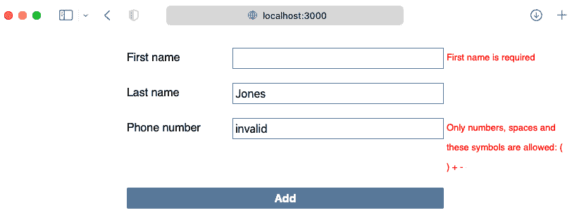

# 9

# 表单验证

对于许多程序员来说，TDD 在涉及他们在培训环境中学习的*玩具*程序时是有意义的。但当面对*现实世界*程序的复杂性时，他们发现很难将这些点连接起来。本书的这一部分的目的就是让你将学到的技术应用到现实世界的应用中。

本章将带我们进行一次关于表单验证的自我放纵之旅。通常，使用 React，你会寻找一个现成的表单库来处理验证。但在这个章节中，我们将亲手制作自己的验证逻辑，作为一个例子，说明如何用 TDD 克服现实世界的复杂性。

当处理像 React 这样的框架时，你将发现一个重要的架构原则：抓住每一个机会将逻辑从框架控制的组件中移出，放入普通的 JavaScript 对象中。

在本章中，我们将涵盖以下主题：

+   执行客户端验证

+   处理服务器错误

+   指示表单提交状态

到本章结束时，你将看到如何使用测试将验证引入你的 React 表单中。

# 技术要求

本章的代码文件可以在这里找到：

[`github.com/PacktPublishing/Mastering-React-Test-Driven-Development-Second-Edition/tree/main/Chapter09`](https://github.com/PacktPublishing/Mastering-React-Test-Driven-Development-Second-Edition/tree/main/Chapter09)

# 执行客户端验证

在本节中，我们将更新`CustomerForm`和`AppointmentForm`组件，以便它们向用户提醒他们输入文本中可能存在的问题。例如，如果他们在电话号码字段中输入非数字字符，应用程序将显示错误。

我们将监听每个字段的 DOM 的`blur`事件，以获取当前字段值并对其运行验证规则。

任何验证错误都将存储为字符串，例如`First name is required`，在`validationErrors`状态变量中。每个字段在这个对象中都有一个键。未定义的值（或值的缺失）表示没有验证错误，而字符串值表示一个错误。以下是一个示例：

```js
{
  firstName: "First name is required",
  lastName: undefined,
  phoneNumber: "Phone number must contain only numbers, spaces, and any of the following: + - ( ) ."
}
```

这个错误在浏览器中显示如下：



图 9.1 – 显示给用户的验证错误

为了支持操作键盘焦点的测试，我们需要一个新函数来模拟当用户完成字段值时引发的`focus`和`blur`事件。我们将把这个函数命名为`withFocus`。它将测试提供的操作（例如更改字段值）与`focus`/`blur`事件包装起来。

本节将首先检查`CustomerForm`的姓名字段是否提供。然后，我们将使这个验证通用化，使其适用于表单中的所有三个字段。之后，我们将确保在按下提交按钮时也运行验证。最后，我们将把构建的所有逻辑提取到一个单独的模块中。

## 验证必填字段

我们页面上的三个字段——`firstName`、`lastName` 和 `phoneNumber`——都是必填字段。如果任何字段没有提供值，用户应该看到一个消息告诉他们这一点。为此，每个字段都将有一个警告消息区域，实现为一个具有 ARIA 角色 `alert` 的 `span`：

让我们先添加 `firstName` 字段的警告，然后通过在用户移除焦点时验证字段来使其生效：

1.  将以下新测试添加到 `CustomerForm` 测试套件的底部。它应该在一个名为 `validation` 的新嵌套 `describe` 块中。此测试检查是否已渲染一个警告空间。注意 CSS 选择器：这有点像是一个技巧。我们主要感兴趣的是找到一个匹配 `[role=alert]` 的元素。然而，我们还在 `firstNameError` ID 上进行了限定，因为我们最终会有多个警告空间——每个字段一个：

    ```js
    describe("validation", () => {
      it("renders an alert space for first name validation errors", () => {
        render(<CustomerForm original={blankCustomer} />);
        expect(
          element("#firstNameError[role=alert]")
        ).not.toBeNull();
      });
    });
    ```

1.  要使那个通过，请转到 `src/CustomerForm.js` 并在 `firstName` 输入字段下方添加以下 `span` 定义：

    ```js
    <input
      type="text"
      name="firstName"
      id="firstName"
      value={customer.firstName}
      onChange={handleChange}
    />
    <span id="firstNameError" role="alert" />
    ```

1.  接下来，我们想要检查该字段是否有一个指向错误警告的 `aria-describedby` 字段。这有助于屏幕阅读器理解页面内容。在测试套件的底部添加以下新测试：

    ```js
    it("sets alert as the accessible description for the first name field", async () => {
      render(<CustomerForm original={blankCustomer} />);
      expect(
        field(
          "firstName"
        ).getAttribute("aria-describedby")
      ).toEqual("firstNameError");
    });
    ```

1.  要使这个通过，请将 `aria-describedby` 属性添加到 `firstName` 字段定义中：

    ```js
    <input
      type="text"
      name="firstName"
      id="firstName"
      value={customer.firstName}
      onChange={handleChange}
      aria-describedby="firstNameError"
    />
    ```

1.  我们将要编写的下一个测试将使用失焦 DOM 事件来触发验证。为此测试，我们将首先构建一个新的测试扩展，`withFocus`，它调用 `focus` 事件以确保目标元素有焦点，然后运行一个动作——例如在聚焦的字段中输入文本——最后调用 `blur` 事件。在 `test/reactTestExtensions.js` 中，为 `withFocus` 函数添加以下定义：

    ```js
    export const withFocus = (target, fn) =>
      act(() => {
        target.focus();
        fn();
        target.blur();
      });
    ```

聚焦和失焦序列

初始调用 `focus` 是必要的，因为如果元素没有聚焦，JSDOM 会认为 `blur` 没有关系。

1.  在 `test/CustomerForm.test.js` 中，导入新的 `withFocus` 函数：

    ```js
    import {
      ...,
      withFocus,
    } from "./reactTestExtensions";
    ```

1.  在测试套件的底部（仍然在 `validation` 嵌套 `describe` 块中）添加以下新测试。它检查如果用户输入一个空白名称值，他们会看到一个消息告诉他们需要一个值：

    ```js
    it("displays error after blur when first name field is blank", () => {
      render(<CustomerForm original={blankCustomer} />);
      withFocus(field("firstName"), () =>
        change(field("firstName"), " ");
      )
      expect(
        element("#firstNameError[role=alert]")
      ).toContainText("First name is required");
    });
    ```

1.  要使这个通过，我们需要硬编码消息：

    ```js
    <span id="firstNameError" role="alert">
      First name is required
    </span>
    ```

1.  让我们通过替换硬编码来定位。以下测试断言警告消息最初是空的。注意使用 `toEqual` 而不是 `not.toContainText`：这是前瞻性规划。当我们来到下一节中泛化此函数时，警告文本可以是任何内容：

    ```js
    it("initially has no text in the first name field alert space", async () => {
      render(<CustomerForm original={blankCustomer} />);
      expect(
        element("#firstNameError[role=alert]").textContent
      ).toEqual("");
    });
    ```

空文本内容的匹配器

虽然这本书没有涵盖，但这将是构建一个新的匹配器，如 `toHaveNoText` 或 `not.toContainAnyText` 的好机会。

1.  为了使这个测试通过，我们将在 `CustomerForm` 中添加运行验证规则的支持。首先，在 `src/CustomerForm.js` 的顶部添加以下内联函数定义，位于导入语句下方但 `CustomerForm` 组件定义上方。这是我们第一个验证规则，`required`，如果提供的值是空的，则返回一个错误字符串，否则返回 `undefined`：

    ```js
    const required = value =>
      !value || value.trim() === ""
        ? "First name is required"
        : undefined;
    ```

1.  在 `CustomerForm` 组件中，定义一个 `validationErrors` 状态变量，初始设置为空对象：

    ```js
    const [
      validationErrors, setValidationErrors
    ] = useState({});
    ```

1.  在 `CustomerForm` 中创建一个处理函数，当用户从名字字段切换焦点时可以使用。它运行我们在第一步中定义的 `required` 验证，然后将响应保存到 `validationErrors` 状态对象中：

    ```js
    const handleBlur = ({ target }) => {
      const result = required(target.value);
      setValidationErrors({
        ...validationErrors,
        firstName: result
      });
    };
    ```

1.  接下来，定义一个函数，JSX 将使用它来选择要显示的消息，命名为 `hasFirstNameError`：

    ```js
    const hasFirstNameError = () =>
      validationErrors.firstName !== undefined;
    ```

1.  剩下的只是修改我们的 JSX，使其调用验证逻辑，然后显示验证错误。使用以下代码设置现有输入字段 `firstName` 的 `onBlur` 处理程序，并在其后渲染错误文本。在此更改后，你的测试应该通过：

    ```js
    <input
      type="text"
      name="firstName"
      ...
      onBlur={handleBlur}
    />
    <span id="firstNameError" role="alert">
      {hasFirstNameError()
        ? validationErrors["firstName"]
        : ""}
    </span>
    ```

现在你已经完成了一个用于验证名字字段的完整、可工作的系统。

## 为多个字段泛化验证

接下来，我们将添加对姓氏和电话号码字段的必要验证。

由于我们现在处于绿色状态，我们可以在编写下一个测试之前重构现有的代码。我们将更新 JSX 以及 `hasFirstNameError` 和 `handleBlur` 函数，以便它们适用于表单上的所有字段。

这将是一个系统重构的练习：将重构分解成小步骤。在每个步骤之后，我们都在努力使测试保持绿色：

1.  首先，我们将提取一个包含 JSX 片段的函数，用于渲染错误。在 `CustomerForm` 中的 JSX 返回值上方添加一个名为 `renderFirstNameError` 的新函数，内容如下：

    ```js
    const renderFirstNameError = () => (
      <span id="firstNameError" role="alert">
        {hasFirstNameError()
          ? validationErrors["firstName"]
          : ""}
      <span>
    );
    ```

1.  现在，你可以在 JSX 中使用它来替换 `span` 警报。你的测试在每个步骤中都应该通过：

    ```js
    <input
      type="text"
      name="firstName"
      ...
    />
    {renderFirstNameError()}
    ```

1.  接下来，我们将向此函数引入一个参数，该参数将引用我们显示错误字段的 ID。调整你刚刚添加的行以引入新参数：

    ```js
    <input
      type="text"
      name="firstName"
      ...
    />
    {renderFirstNameError("firstName")}
    ```

总是保持绿色测试 – JavaScript 与 TypeScript

这一节是以一种方式编写的，你的测试应该在每一步都通过。在上一个步骤中，我们向 `renderFirstNameError` 函数传递了一个函数无法接受的参数。在 JavaScript 中，这是完全正常的。在 TypeScript 中，当你尝试构建源代码时，你会得到一个类型错误。 

1.  将该参数引入 `renderFirstNameError` 函数中，如下所示，用 `fieldName` 变量替换 `firstName` 字符串。在此更改后，你的测试应该仍然通过：

    ```js
    const renderFirstNameError = (fieldName) => (
      <span id={`${fieldName}Error`} role="alert">
        {hasFirstNameError()
          ? validationErrors[fieldName]
          : ""}
      <span>
    );
    ```

1.  通过添加参数值重复相同的步骤为 `hasFirstNameError` 函数：

    ```js
    const renderFirstNameError = (fieldName) => (
      <span id={`${fieldName}Error`} role="alert">
        {hasFirstNameError(fieldName)
          ? validationErrors[fieldName]
          : ""}
      <span>
    );
    ```

1.  将`fieldName`参数添加到`hasFirstNameError`中，并修改函数体，使其使用参数代替`firstName`错误属性：

    ```js
    const hasFirstNameError = fieldName =>
      validationErrors[fieldName] !== undefined;
    ```

1.  现在，将`renderFirstNameError`重命名为`renderError`，

将`hasFirstNameError`重命名为`hasError`。

在你的 IDE 中的重构支持

你的 IDE 可能内置了重命名支持。如果有的话，你应该使用它。自动重构工具可以减少人为错误的风险。

1.  让我们处理`handleBlur`。我们已经在传递`target`参数，我们可以使用`target.name`来键入一个映射，然后告诉我们为每个字段运行哪个验证器：

    ```js
    const handleBlur = ({ target }) => {
      const validators = {
        firstName: required
      };
      const result = 
        validatorstarget.name;
      setValidationErrors({
        ...validationErrors,
        [target.name]: result
      });
    };
    ```

如你所见，函数的前半部分（`validators`的定义）现在是静态数据，它定义了`firstName`的验证应该如何发生。这个对象将在以后扩展，包括`lastName`和`phoneNumber`字段。后半部分是通用的，将适用于任何传入的输入字段，只要存在该字段的验证器。

1.  `required`验证器硬编码了第一个名字的描述。让我们将整个消息作为一个变量提取出来。我们可以创建一个高阶函数，它返回一个使用此消息的验证函数。修改`required`，使其看起来如下：

    ```js
    const required = description => value =>
      !value || value.trim() === ""
        ? description
        : undefined;
    ```

1.  最后，更新验证器，使其调用这个新的必需函数：

    ```js
    const validators = {
      firstName: required("First name is required")
    };
    ```

到目前为止，你的测试应该通过，你应该有一个完全通用的解决方案。现在，让我们通过将我们的四个验证测试转换为测试生成器函数来通用化测试：

1.  在`validations`嵌套的`describe`块顶部定义一个新的`errorFor`辅助函数。这将在测试生成器中使用：

    ```js
    const errorFor = (fieldName) =>
      element(`#${fieldName}Error[role=alert]`);
    ```

1.  在本节中找到你编写的第一个测试（`渲染一个警告空间...`）。按照这里所示，通过将其包裹在一个函数定义中来修改它，该函数定义接受一个`fieldName`参数。在测试描述和期望中使用该参数，替换`firstName`的使用，并利用新的`errorFor`辅助函数来查找适当的字段：

    ```js
    const itRendersAlertForFieldValidation = (fieldName) => {
      it(`renders an alert space for ${fieldName} validation errors`, async () => {
        render(<CustomerForm original={blankCustomer} />);
        expect(errorFor(fieldName)).not.toBeNull();
      });
    };
    ```

1.  由于你现在丢失了第一个名字的测试，使用新的测试生成器将其添加回来，就在它下面：

    ```js
    itRendersAlertForFieldValidation("firstName");
    ```

1.  对第二个测试重复相同的步骤：将其包裹在一个函数定义中，引入一个`fieldName`参数，并在测试描述和期望中将`firstName`替换为`fieldName`：

    ```js
    const itSetsAlertAsAccessibleDescriptionForField = (
      fieldName
    ) => {
      it(`sets alert as the accessible description for the ${fieldName} field`, async () => {
        render(<CustomerForm original={blankCustomer} />);
        expect(
          field(fieldName).getAttribute(
            "aria-describedby"
          )
        ).toEqual(`${fieldName}Error`);
      });
    };
    ```

1.  然后，重新引入`firstName`字段的测试用例：

    ```js
    itSetsAlertAsAccessibleDescriptionForField(
      "firstName"
    );
    ```

1.  接下来，是时候处理最复杂的测试——`在失去焦点后显示错误...`测试。前两个测试生成器只使用了一个参数，`fieldName`。这个需要一个额外的两个参数，`value`和`description`，分别在**行为**阶段和**断言**阶段使用：

    ```js
    const itInvalidatesFieldWithValue = (
      fieldName,
      value,
      description
    ) => {
      it(`displays error after blur when ${fieldName} field is '${value}'`, () => {
        render(<CustomerForm original={blankCustomer} />);
        withFocus(field(fieldName), () =>
          change(field(fieldName), value)
        );
        expect(
          errorFor(fieldName)
        ).toContainText(description);
      });
    };
    ```

1.  在那个测试生成器定义下方，重新引入`first name`字段的测试用例：

    ```js
    itInvalidatesFieldWithValue(
      "firstName",
      " ",
      "First name is required"
    );
    ```

1.  最后，对第四个测试重复相同的步骤：

    ```js
    const itInitiallyHasNoTextInTheAlertSpace = (fieldName) => {
      it(`initially has no text in the ${fieldName} field alert space`, async () => {
        render(<CustomerForm original={blankCustomer} />);
        expect(
          errorFor(fieldName).textContent
        ).toEqual("");
      });
    };
    ```

1.  然后，重新引入`firstName`测试用例：

    ```js
    itInitiallyHasNoTextInTheAlertSpace("firstName");
    ```

1.  在所有这些努力之后，现在是时候使用新的测试生成器来构建`lastName`字段的验证了。在你的测试套件底部添加以下单行：

    ```js
    itRendersAlertForFieldValidation("lastName");
    ```

1.  为了使其通过，只需将代码添加到`CustomerForm` JSX 中，在`lastName`字段下方渲染另一个警告：

    ```js
    <label htmlFor="lastName">Last name</label>
    <input
      type="text"
      name="lastName"
      id="lastName"
      value={customer.lastName}
      onChange={handleChange}
    />
    {renderError("lastName")}
    ```

1.  接下来，我们必须创建`aria-describedby`属性的测试。

    ```js
    itSetsAlertAsAccessibleDescriptionForField(
      "lastName"
    );
    ```

1.  为了使其通过，将此属性添加到`lastName`输入元素中：

    ```js
    <input
      type="text"
      name="lastName"
      ...
      aria-describedby="lastNameError"
    />
    ```

1.  接下来，添加对必需验证规则的测试。

    ```js
    itInvalidatesFieldWithValue(
      "lastName",
      " ",
      "Last name is required"
    );
    ```

1.  在我们已经做了这么多艰苦工作的基础上，使这个测试通过现在变得非常简单。将`lastName`条目添加到`validators`对象中，如下所示：

    ```js
    const validators = {
      firstName: required("First name is required"),
      lastName: required("Last name is required"),
    };
    ```

1.  为了完整性，我们需要为`lastName`字段添加第四个和最后一个测试。由于我们依赖于我们刚刚泛化的机制，这个测试已经通过了。然而，鉴于它是一行代码，即使不是必需的，也值得指定：

    ```js
    itInitiallyHasNoTextInTheAlertSpace("lastName");
    ```

1.  重复*步骤 10*到*16*以对`phone number`字段进行测试。

谁需要测试生成器函数？

测试生成器函数可能看起来很复杂。你可能更喜欢在测试中保留重复，或者找到从测试中提取公共功能的其他方法。

测试生成器方法有一个缺点：你将无法在单个测试上使用`it.only`或`it.skip`。

这样，我们就涵盖了所需的字段验证。现在，让我们为`phoneNumber`字段添加不同类型的验证。我们希望确保电话号码只包含数字和一些特殊字符：括号、破折号、空格和加号。

为了做到这一点，我们将引入一个可以进行所需电话号码匹配的`match`验证器和一个组合验证的`list`验证器。

让我们添加第二个验证。

1.  添加以下新测试：

    ```js
    itInvalidatesFieldWithValue(
      "phoneNumber",
      "invalid",
      "Only numbers, spaces and these symbols are allowed: ( ) + -"
    );
    ```

1.  在`src/CustomerForm.js`的顶部添加以下定义。这期望一个正则表达式`re`，然后可以将其与以下内容匹配：

    ```js
    const match = (re, description) => value =>
      !value.match(re) ? description : undefined;
    ```

学习正则表达式

正则表达式是匹配字符串格式的灵活机制。如果你对它们感兴趣，并想了解更多关于它们以及如何测试驱动它们的信息，请查看[`reacttdd.com/testing-regular-expressions`](https://reacttdd.com/testing-regular-expressions)。

1.  现在，让我们来处理`list`验证函数。这是一段相当密集的代码，它返回一个短路验证器。它会运行它所提供的每个验证器，直到找到一个返回字符串的验证器，然后返回那个字符串。将此代码添加到`match`定义的下方：

    ```js
    const list = (...validators) => value =>
      validators.reduce(
        (result, validator) => result || validator(value),
        undefined
      );
    ```

1.  用以下验证替换`handleBlur`函数中现有的`phoneNumber`验证，该验证使用了所有三个验证器函数：

    ```js
    const validators = {
      ...
      phoneNumber: list(
        required("Phone number is required"),
        match(
          /^[0-9+()\- ]*$/,
          "Only numbers, spaces and these symbols are allowed: ( ) + -"
        )
      )
    };
    ```

1.  你的测试现在应该通过了。然而，如果你回顾我们刚才编写的测试，它并没有提到允许的字符集：它只是说`invalid`不是一个有效的电话号码。为了证明使用*真实*正则表达式，我们需要一个反向测试来检查任何字符组合都有效。你可以添加这个测试；它应该已经通过了：

    ```js
    it("accepts standard phone number characters when validating", () => {
      render(<CustomerForm original={blankCustomer} />);
      withFocus(field("phoneNumber"), () =>
        change(field("phoneNumber"), "0123456789+()- ")
      );
      expect(errorFor("phoneNumber")).not.toContainText(
        "Only numbers" 
      );
    });
    ```

这是一个有效的测试吗？

这个测试通过而不需要任何修改。这违反了我们只编写失败的测试的规则。

我们陷入这种局面是因为我们在之前的测试中做得太多：我们只需要证明`invalid`字符串不是一个有效的电话号码。但相反，我们提前实现了完整的正则表达式。

如果我们“正确”地进行了三角测量，从一个虚拟的正则表达式开始，我们最终会到达现在的地方，但我们做了一大堆额外的中间工作，这些工作最终都被删除了。

在某些场景中，例如处理正则表达式时，我发现短路过程是可以接受的，因为它可以节省我一些工作。

通过这样，你已经学会了如何使用 TDD 来泛化验证。

## 提交表单

当我们提交表单时会发生什么？对于我们的应用程序，如果用户在表单完成之前点击提交按钮，提交过程应该被取消，并且所有字段应该一次性显示它们的验证错误。

我们可以通过两个测试来完成这个任务：一个测试用来检查在存在错误时表单不会被提交，另一个测试用来检查所有字段都显示错误。

在我们这样做之前，我们需要更新我们现有的提交表单的测试，因为它们都假设表单已经被正确填写。首先，我们需要确保我们传递有效的客户数据，这些数据可以在每个测试中被覆盖。

让我们开始编写`CustomerForm`测试套件：

1.  我们需要一个新构建器来帮助表示`validCustomer`记录。我们将更新我们现有的许多测试以使用这个新值。在`test/builders/customer.js`中，定义以下对象：

    ```js
    export const validCustomer = {
      firstName: "first",
      lastName: "last",
      phoneNumber: "123456789"
    };
    ```

1.  在`test/CustomerForm.test.js`中，更新包含`blankCustomer`的导入，同时引入新的`validCustomer`：

    ```js
    import {
      blankCustomer,
      validCustomer,
    } from "./builders/customer";
    ```

1.  从顶部开始，修改每个模拟提交事件的测试。每个都应该使用这个新的`validCustomer`对象进行挂载。在继续之前，在做出这些更改后运行你的测试，并确保它们仍然通过：

    ```js
    render(<CustomerForm original={validCustomer} />);
    ```

1.  添加一个新的表单提交测试。这个测试可以和其它提交测试放在一起，而不是在验证块中：

    ```js
    it("does not submit the form when there are validation errors", async () => {
      render(<CustomerForm original={blankCustomer} />);
      await clickAndWait(submitButton());
      expect(global.fetch).not.toBeCalled();
    });
    ```

1.  为了使这个测试通过，首先，在`CustomerForm`组件内部定义以下`validateMany`函数。它的任务是同时验证多个字段。它接受一个参数，`fields`，这是我们关心的字段值的对象：

    ```js
    const validateMany = fields =>
      Object.entries(fields).reduce(
        (result, [name, value]) => ({
          ...result,
          [name]: validatorsname
        }),
        {}
      );
    ```

1.  `validateMany`函数引用了`validators`常量，但这个常量目前是在`handleBlur`函数中定义的。将这个定义拉上来，使其存在于组件作用域的顶部，现在`handleBlur`和`validateMany`都可以访问它。

1.  我们需要一个新函数来检查所有字段的错误。这就是`anyErrors`；现在添加它，如下所示。如果存在任何错误，它返回`true`，否则返回`false`：

    ```js
    const anyErrors = errors =>
      Object.values(errors).some(error => (
        error !== undefined
      )
    );
    ```

1.  现在，我们可以在 `handleSubmit` 函数中使用 `validateMany` 和 `anyErrors`，如下所示。我们将用条件包装大多数现有函数。添加此代码后，你的测试应该通过：

    ```js
    const handleSubmit = async e {
      e.preventDefault();
      const validationResult = validateMany(customer);
      if (!anyErrors(validationResult)) {
        ... existing code ...
      }
    }
    ```

1.  让我们继续下一个测试。我们需要几个新的导入，`textOf` 和 `elements`，这样我们就可以在所有三个警报空间中编写一个期望。现在添加这些：

    ```js
    import {
      ...,
      textOf,
      elements,
    } from "./reactTestExtensions";
    ```

1.  接下来，在测试套件的底部添加以下测试。我们想要检查屏幕上是否出现任何错误：

    ```js
    it("renders validation errors after submission fails", async () => {
      render(<CustomerForm original={blankCustomer} />);
      await clickAndWait(submitButton());
      expect(
        textOf(elements("[role=alert]"))
      ).not.toEqual("");
    });
    ```

在多个元素上使用警报角色

本章使用多个警报空间，每个表单字段一个。然而，当多个警报角色同时显示警报时，屏幕阅读器表现不佳——例如，如果点击提交按钮导致我们的三个字段都出现验证错误。

另一种方法是对 UI 进行重构，使其在检测到任何错误时具有一个额外的元素来承担警报角色；之后，它应该从各个字段错误描述中移除警报角色。

1.  这个很容易通过；我们只需要在 `anyErrors` 返回 `false` 时，用 `validationResult` 调用 `setValidationErrors` 即可：

    ```js
    if (!anyErrors(validationResult)) {
      ...
    } else {
      setValidationErrors(validationResult);
    }
    ```

你现在已经看到了如何在表单提交时运行所有字段验证。

## 将非 React 功能提取到新模块中

一个有用的设计指南是尽快走出“框架领域”。你希望处理的是纯 JavaScript 对象。这对于 React 组件来说尤其如此：尽可能多地提取逻辑到独立的模块中。

这有几个不同的原因。首先，测试组件比测试纯对象更难。其次，React 框架的变化比 JavaScript 语言本身更频繁。如果我们的代码库首先是一个 React 代码库，那么保持我们的代码库与最新的 React 趋势保持一致是一项大规模的任务。如果我们能保持 React 在一边，从长远来看，我们的生活将会更简单。因此，当有选择时，我们总是更喜欢编写纯 JavaScript。

我们的验证代码是这方面的绝佳例子。我们有一些完全不考虑 React 的函数：

+   验证器：`required`、`match` 和 `list`

+   `hasError` 和 `anyErrors`

+   `validateMany`

+   `handleBlur` 中的部分代码，它类似于 `validateMany` 的单入口等效

让我们将所有这些内容提取到一个名为 `formValidation` 的单独命名空间中：

1.  创建一个名为 `src/formValidation.js` 的新文件。

1.  将 `required`、`match` 和 `list` 的函数定义从 `CustomerForm` 的顶部移动过来。确保你删除了旧的定义！

1.  在新模块的每个定义前添加单词 `export`。

1.  在 `CustomerForm` 的顶部添加以下导入，然后检查你的测试是否仍然通过：

    ```js
    import {
      required,
      match,
      list,
    } from "./formValidation";
    ```

1.  在 `src/CustomerForm.js` 中，修改 `renderError` 以使其将 `state` 中的错误传递到 `hasError`：

    ```js
    const renderError = fieldName => {
      if (hasError(validationErrors, fieldName)) {
        ...
     }
    }
    ```

1.  更新`hasError`，使其包含新的`validationErrors`参数，并使用该参数而不是`state`：

    ```js
    const hasError = (validationErrors, fieldName) =>
      validationErrors[fieldName] !== undefined;
    ```

1.  更新`validateMany`，使其将验证器列表作为其第一个参数传递，而不是使用`state`：

    ```js
    const validateMany = (validators, fields) =>
      Object.entries(fields).reduce(
       (result, [name, value]) => ({
        ...result,
        [name]: validatorsname
      }),
      {}
    );
    ```

1.  更新`handleBlur`，使其使用`validateMany`：

    ```js
    const handleBlur = ({ target }) => {
      const result = validateMany(validators, {
        [target.name] : target.value
      });
      setValidationErrors({
        ...validationErrors,
        ...result
      });
    }
    ```

1.  更新`handleSubmit`，使其将`validators`传递给`validateMany`：

    ```js
    const validationResult = validateMany(
      validators,
      customer
    );
    ```

1.  将`hasError`、`validateMany`和`anyErrors`移动到`src/formValidation.js`中，确保您从`CustomerForm`组件中删除这些函数。

1.  在每个定义前添加单词`export`。

1.  更新导入，以便引入这些函数：

    ```js
    import {
      required,
      match,
      list,
      hasError,
      validateMany,
      anyErrors,
    } from "./formValidation";
    ```

虽然这足以将代码从 React 领域提取出来，但我们才刚刚开始。这个 API 还有很多改进的空间。这里有几个不同的方法可以采取。本章的练习包含了一些关于如何做到这一点的建议。

使用测试替身进行验证函数

你可能会想，这些函数现在需要它们自己的单元测试吗？我应该更新`CustomerForm`中的测试，以便使用测试替身代替这些函数吗？

在这种情况下，我可能会为`formValidation`编写几个测试，以便清楚地说明每个函数应该如何使用。这并不是测试驱动开发，因为你已经有了代码，但你仍然可以通过像平时一样编写测试来模拟这种体验。

当从像这样的组件中提取功能时，通常有更新原始组件以简化并可能移动测试的必要。在这种情况下，我不会费心去做。测试足够高级，无论代码内部如何组织，都是有意义的。

本节介绍了如何编写表单的验证逻辑。你现在应该对如何使用 TDD 来实现诸如字段验证等复杂要求有很好的了解。接下来，我们将把服务器端错误集成到相同的流程中。

# 处理服务器错误

如果客户数据验证失败，`/customers`端点可能会返回`422 Unprocessable Entity`错误。例如，如果电话号码已经在系统中存在，这可能会发生。如果发生这种情况，我们不想调用`onSave`回调，而是向用户显示错误，并给他们机会进行更正。

响应体将包含与为验证框架构建的数据非常相似的错误数据。以下是一个将接收到的 JSON 示例：

```js
{
  "errors": {
    "phoneNumber": "Phone number already exists in the system"
  }
}
```

我们将更新我们的代码，以显示这些错误，就像我们的客户端错误出现时一样。由于我们已处理`CustomerForm`的错误，因此我们还需要调整我们的测试，以及现有的`CustomerForm`代码。

到目前为止，我们的代码使用了从`global.fetch`返回的`ok`属性。该属性在 HTTP 状态码为`200`时返回`true`，否则返回`false`。现在，我们需要更具体一些。对于状态码为`422`的情况，我们想要显示新的错误，而对于其他任何情况（如`500`错误），我们想要回退到现有的行为。

让我们添加对这些附加状态码的支持：

1.  如下更新`test/builders/fetch.js`中的`fetchResponseError`方法：

    ```js
    const fetchResponseError = (
      status = 500,
      body = {}
    ) => ({
      ok: false,
      status,
      json: () => Promise.resolve(body),
    });
    ```

1.  在`test/CustomerForm.test.js`中为`422`错误编写一个测试。我已经将这个测试放在文件顶部，靠近其他操作 HTTP 响应的测试：

    ```js
    it("renders field validation errors from server", async () => {
      const errors = {
        phoneNumber: "Phone number already exists in the system"
      };
      global.fetch.mockResolvedValue(
        fetchResponseError(422, { errors })
      );
      render(<CustomerForm original={validCustomer} />);
      await clickAndWait(submitButton());
      expect(errorFor("phoneNumber")).toContainText(
        errors.phoneNumber
      );
    });
    ```

1.  要实现这个跳转，请向`handleSubmit`中的嵌套条件语句添加一个新的分支，该分支处理 fetch 请求的响应：

    ```js
    if (result.ok) {
      setError(false);
      const customerWithId = await result.json();
      onSave(customerWithId);
    } else if (result.status === 422) {
      const response = await result.json();
      setValidationErrors(response.errors);
    } else {
      setError(true);
    }
    ```

你的测试现在应该通过了。

本节向您展示了如何将服务器端错误集成到您已经拥有的相同的客户端验证逻辑中。为了完成，我们将添加一些装饰。

# 指示表单提交状态

如果我们能向用户指示他们的表单数据正在发送到我们的应用程序服务器，那就太好了。这本书的 GitHub 仓库包含了一个旋转器图形和一些我们可以使用的 CSS。我们的 React 组件需要做的只是显示一个具有`submittingIndicator`类名的`span`元素。

在我们编写测试之前，让我们看看生产代码将如何工作。我们将引入一个新的布尔状态变量`submitting`，用于在状态之间切换。在我们执行 fetch 请求之前，它将被切换为`true`，一旦请求完成，它将被切换为`false`。以下是我们将如何修改`handleSubmit`：

```js
...
if (!anyErrors(validationResult)) {
  setSubmitting(true);
  const result = await global.fetch(...);
  setSubmitting(false);
  ...
}
...
```

如果提交被设置为`true`，那么我们将渲染旋转器图形。否则，我们将不渲染任何内容。

## 在 promise 完成前测试状态

测试 React 组件最棘手的一个方面是测试任务期间发生的事情。这正是我们现在需要做的：我们想要检查在表单提交期间显示提交指示器。然而，指示器一旦 promise 完成就会消失，这意味着我们不能使用我们迄今为止使用的标准`clickAndWait`函数，因为它会在指示器消失之后的点返回！

记住`clickAndWait`使用的是`act`测试辅助函数的异步形式。这是问题的关键。为了解决这个问题，我们需要一个同步形式的我们的函数`click`，以便在任务队列完成之前返回——换句话说，在`global.fetch`调用返回任何结果之前。

然而，为了停止 React 的警告警报响起，我们仍然需要在我们的测试中包含异步的`act`形式。React 知道提交处理程序返回一个 promise，并且它期望我们通过调用`act`等待其执行。我们需要在检查提交的切换值之后做这件事，而不是之前。

现在我们来构建这个测试：

1.  将 `act` 作为导入添加到 `test/CustomerForm.test.js`：

    ```js
    import { act } from "react-dom/test-utils";
    ```

1.  重新添加 `click` 函数导入：

    ```js
    import {
      ...,
      click,
      clickAndWait,
    } from "./reactTestExtensions";
    ```

1.  在 `CustomerForm` 测试套件的底部创建一个新的嵌套 `describe` 块，位于现有的表单提交测试下方。这个测试在同步的 `click` 中提交调用本身，如前所述。然后，我们必须将期望包裹在一个抑制 React 任何警告或错误的异步 `act` 调用中：

    ```js
    describe("submitting indicator", () => {
      it("displays when form is submitting", async () => {
        render(
          <CustomerForm
            original={validCustomer}
            onSave={() => {}}
          />
        );
        click(submitButton());
        await act(async () => {
          expect(
            element("span.submittingIndicator")
          ).not.toBeNull();
        });
      });
    });
    ```

1.  为了使这个通过，我们只需要在 JSX 中显示那个 `span`。将其放置在提交按钮之后，如下所示：

    ```js
    return (
      <form id="customer" onSubmit={handleSubmit}>
        ...
        <input type="submit" value="Add" />
        <span className="submittingIndicator" />
      </form>
    );
    ```

1.  现在，我们需要进行三角测量，以确保指示器仅在表单提交后才显示，而不是在提交之前：

    ```js
    it("initially does not display the submitting indicator", () => {
      render(<CustomerForm original={validCustomer} />);
      expect(element(".submittingIndicator")).toBeNull();
    });
    ```

1.  我们可以通过使用一个名为 `submitting` 的标志来使这个通过。当指示器禁用时，它应该设置为 `false`，当它启用时，设置为 `true`。将以下状态变量添加到 `CustomerForm` 组件的顶部：

    ```js
    const [submitting, setSubmitting] = useState(false);
    ```

1.  将提交的 `span` 指示器更改为以下内容：

    ```js
    {submitting ? (
      <span className="submittingIndicator" />
    ) : null}
    ```

1.  新的测试现在将通过，但原始测试将失败。我们不得不在调用 `fetch` 之前将 `submittingIndicator` 切换到 `true`。在 `handleSubmit` 中，在调用 `fetch` 之前添加此行。添加此代码后，你的测试应该通过：

    ```js
    if (!anyErrors(validationResult)) {
      setSubmitting(true);
      const result = await global.fetch(/* ... */);
      ...
    }
    ```

1.  添加这个最后的测试，该测试检查指示器在收到响应后消失。这个测试与我们的第一个提交指示器测试非常相似：

    ```js
    it("hides after submission", async () => {
      render(
        <CustomerForm
          original={validCustomer}
          onSave={() => {}}
        />
      );
      await clickAndWait(submitButton());
      expect(element(".submittingIndicator")).toBeNull();
    });
    ```

1.  这次，我们需要在 fetch 之后添加一个 `setSubmitting` 调用：

    ```js
    if (!anyErrors(validationResult)) {
      setSubmitting(true);
      const result = await global.fetch(/* ... */);
      setSubmitting(false);
      ...
    }
    ```

那就是全部了；你的所有测试都应该通过。

## 重构长方法

在此之后，我们的 `handleSubmit` 函数变得很长——在我的实现中我数了 23 行。这对我来说太长了！

将 `handleSubmit` 重构为更小的方法是一个留给你的练习；请参阅 *练习* 部分以获取更多详细信息。但这里有一些关于如何系统地进行的提示：

+   将代码块提取到方法中；在这种情况下，这意味着 `if` 语句的内容。例如，如果没有验证错误，你可以调用 `doSave` 方法进行提交。

+   在 fetch 调用之前寻找 `true`，然后是调用之后的 `false`。这可以有不同的实现方式。

现在，让我们总结这一章。

# 概述

本章向你展示了如何将 TDD 应用于不仅仅是玩具示例之外。虽然你可能永远不会想自己实现表单验证，但你可以看到如何使用你在本书第一部分学到的相同方法来驱动复杂的代码。

首先，你学习了如何在适当的时候验证字段值：当字段失去焦点和表单提交时。你还看到了如何将服务器端错误集成到其中，以及如何显示指示器来告知用户数据正在保存过程中。

本章还介绍了如何将逻辑从你的 React 组件移动到它们自己的模块中。

在下一章中，我们将向我们的系统添加一个新功能：一个时尚的搜索界面。

# 练习

以下是一些供您完成的练习：

1.  添加一个功能，当用户更正错误时清除任何验证错误。使用 `onChange` 处理器来完成此操作，而不是 `onBlur`，因为我们希望让用户在更正错误后立即知道。

1.  添加一个功能，一旦表单提交，就禁用提交按钮。

1.  为 `formValidation` 模块中的每个函数编写测试。

1.  `handleSubmit` 函数很长。提取一个 `doSave` 函数，用于提取 `if` 语句的主体部分。

# 进一步阅读

要了解更多关于本章所涉及的主题，请查看以下资源：

+   通过示例解释的正则表达式指南

[`reacttdd.com/testing-regular-expressions`](https://reacttdd.com/testing-regular-expressions)

+   关于 `aria-describedby` 等 ARIA 注解的更多信息

[`developer.mozilla.org/en-US/docs/Web/Accessibility/ARIA/Annotations`](https://developer.mozilla.org/en-US/docs/Web/Accessibility/ARIA/Annotations)
