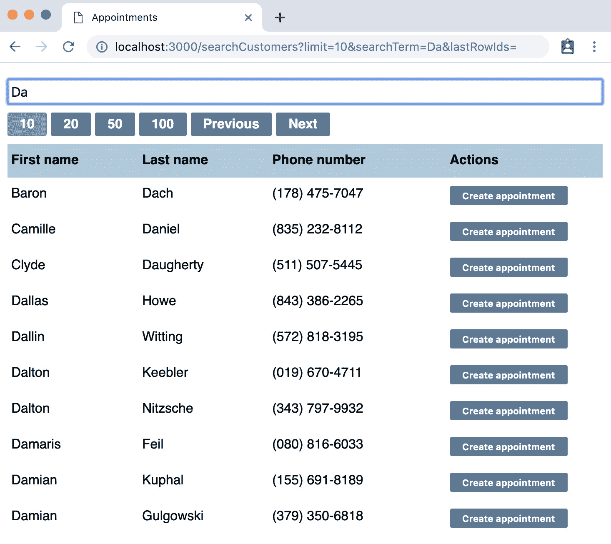

# 10

# 过滤和搜索数据

在本章中，我们将继续将我们已学到的技术应用到另一个更复杂的使用案例中。

在我们学习本章内容的过程中，我们将学习如何通过测试调整组件的设计，以显示设计中的不足。测试驱动开发在测试变得复杂时，真正有助于突出设计问题。幸运的是，我们已编写的测试给了我们信心改变方向并完全重新设计。每次更改时，我们只需运行`npm test`，并在几秒钟内验证我们的新实现。

在当前的流程中，用户首先添加一个新客户，然后立即为该客户预订一个预约。现在，我们将在此基础上扩展，允许他们在添加预约之前选择一个现有客户。

我们希望用户能够快速搜索客户。这个沙龙可能有数百甚至数千名注册客户。因此，我们将构建一个`CustomerSearch`搜索组件，允许我们的用户通过姓名搜索客户并浏览返回的结果。

在本章中，你将了解以下主题：

+   显示从端点获取的表格数据

+   在大型数据集中分页

+   数据过滤

+   使用渲染属性执行操作

以下截图显示了新组件的外观：



图 10.1 – 新的 CustomerSearch 组件

到本章结束时，你将使用到目前为止所学到的所有技术构建一个相对复杂的组件。

# 技术要求

本章的代码文件可以在以下位置找到：

[`github.com/PacktPublishing/Mastering-React-Test-Driven-Development-Second-Edition/tree/main/Chapter10`](https://github.com/PacktPublishing/Mastering-React-Test-Driven-Development-Second-Edition/tree/main/Chapter10)

# 显示从端点获取的表格数据

在本节中，我们将设置表格的基本形式，并在组件挂载时从服务器检索初始数据集。

服务器对`/customers`的`GET`请求。有一个`searchTerm`参数，它接受用户正在搜索的字符串。还有一个`after`参数，用于检索下一页的结果。响应是一个客户数组，如下所示：

```js
[{ id: 123, firstName: "Ashley"}, ... ]
```

发送不带参数的请求到`/customers`将返回我们客户的头 10 个，按姓氏字母顺序排列。

这为我们提供了一个良好的起点。当组件挂载时，我们将执行这个基本搜索并在表格中显示结果。

跳过起点

如果你正在使用 GitHub 仓库进行跟随，请注意，本章从已经实现且已连接到`App`组件的裸骨`CustomerSearch`组件开始。该组件通过点击顶部菜单中的**搜索预约**按钮显示。

让我们从对新的`CustomerSearch`组件的第一个测试开始。按照以下步骤操作：

1.  打开`test/CustomerSearch.test.js`并添加第一个测试。它检查是否渲染了我们想要看到的四个标题的表格。代码如下所示：

    ```js
    it("renders a table with four headings", async () => {
      await renderAndWait(<CustomerSearch />);
      const headings = elements("table th");
      expect(textOf(headings)).toEqual([
        "First name",
        "Last name",
        "Phone number",
        "Actions",
      ]);
    });
    ```

1.  该测试应该很容易通过，以下是在`src/CustomerSearch.js`中对`CustomerSearch`的以下定义：

    ```js
    export const CustomerSearch = () => (
      <table>
        <thead>
          <tr>
            <th>First name</th>
            <th>Last name</th>
            <th>Phone number</th>
            <th>Actions</th>
          </tr>
        </thead>
      </table>
     );
    ```

1.  为了显示数据，组件需要执行一个`GET`请求。编写出这个下一个测试，它指定了该行为：

    ```js
    it("fetches all customer data when component mounts", async () => {
      await renderAndWait(<CustomerSearch />);
      expect(global.fetch).toBeCalledWith("/customers", {
        method: "GET",
        credentials: "same-origin",
        headers: { "Content-Type": "application/json" },
      });
    });
    ```

1.  为了使这一步通过，向组件添加一个执行搜索的`useEffect`钩子。我们需要使用之前看到的相同的`useEffect`仪式，使用内联函数以确保我们不返回值，并将空数组传递给依赖项列表，这确保了效果仅在组件首次挂载时运行。代码如下所示：

    ```js
    export const CustomerSearch = () => {
      useEffect(() => {
        const fetchData = async () =>
          await global.fetch("/customers", {
            method: "GET",
            credentials: "same-origin",
            headers: {
              "Content-Type": "application/json"
            },
          });
        fetchData();
      }, []);
      return (
        ...
      )
    };
    ```

1.  现在，是时候编写根据返回的数据发生的事情的代码了。我们将从确定单行数据的显示开始。在文件顶部，在`describe`块上方添加`oneCustomer`的定义，如下所示：

    ```js
    const oneCustomer = [
      {
        id: 1,
        firstName: "A",
        lastName: "B",
        phoneNumber: "1"
      },
    ];
    ```

1.  在下一个测试中，使用该定义，如下所示，该测试验证组件显示单个客户行的所有客户数据：

    ```js
    it("renders all customer data in a table row", async () => {
      global.fetch.mockResolvedValue(
        fetchResponseOk(oneCustomer)
      );
      await renderAndWait(<CustomerSearch />);
      const columns = elements("table > tbody > tr > td");
      expect(columns[0]).toContainText("A");
      expect(columns[1]).toContainText("B");
      expect(columns[2]).toContainText("1");
    });
    ```

1.  为了使这一步通过，我们需要使用组件状态将数据从`useEffect`钩子传递到下一个渲染周期。创建一个新的状态变量`customers`，其初始值为空数组（`[]`），如下所示：

    ```js
    const [customers, setCustomers] = useState([]);
    ```

1.  将搜索结果保存到`customers`中，通过修改`useEffect`的定义，如下所示：

    ```js
    const fetchData = async () => {
    const result = await global.fetch(...);
      setCustomers(await result.json());
    };
    ```

1.  我们准备好显示数据了。我们将使用一个新的`CustomerRow`组件来显示单个客户信息的一行。在`CustomerSearch`定义上方添加其实现。注意这里最后一列是空的；它将包含执行特定客户记录上各种操作的按钮。我们将在稍后的单独测试中填充该功能：

    ```js
    const CustomerRow = ({ customer }) => (
      <tr>
        <td>{customer.firstName}</td>
        <td>{customer.lastName}</td>
        <td>{customer.phoneNumber}</td>
        <td />
      </tr>
    );
    ```

1.  剩下的就是在这个`CustomerSearch`中利用这个新组件。添加以下`tbody`元素，如果存在，则渲染第一个客户的`CustomerRow`。添加此代码后，你的测试现在应该通过了：

    ```js
    return (
      <table>
        <thead>
          ...
        </thead>
        <tbody>
          {customers[0] ? (
            <CustomerRow customer={customers[0]} />
          ) : null}
        </tbody>
      </table>
    );
    ```

1.  对于本节最后的测试，让我们添加一个测试来显示这适用于多个客户。为此，我们需要一个新的结果集：`twoCustomers`。这可以放在文件顶部，在`oneCustomer`之后，如下所示：

    ```js
    const twoCustomers = [
      {
        id: 1,
        firstName: "A",
        lastName: "B",
        phoneNumber: "1"
      },
      {
        id: 2,
        firstName: "C",
        lastName: "D",
        phoneNumber: "2"
      }
    ];
    ```

1.  然后，添加一个测试，利用这个功能并检查是否渲染了两行，如下所示：

    ```js
    it("renders multiple customer rows", async () => {
      global.fetch.mockResolvedValue(
        fetchResponseOk(twoCustomers)
      );
      await renderAndWait(<CustomerSearch />);
      const rows = elements("table tbody tr");
      expect(rows[1].childNodes[0]).toContainText("C");
    });
    ```

1.  使这一步通过只需要一行代码；将 JSX 更改为映射每个客户，而不是仅提取第一个客户：

    ```js
    <tbody>
      {customers.map(customer => (
         <CustomerRow
           customer={customer}
           key={customer.id}
         />
        )
      )}
    </tbody>
    ```

这为我们构建本章剩余功能提供了一个很好的基础。

在下一节中，我们将介绍在多个搜索结果页面之间切换的能力。

# 在大型数据集中分页

默认情况下，我们的端点返回 10 条记录。为了获取下一组 10 条记录，我们可以通过使用表示已看到最后一个客户标识符的`after`参数来分页结果集。服务器将跳过结果，直到找到该 ID，然后从下一个客户开始返回结果。

我们将在下一个搜索请求中添加`after`参数。

为了支持每次用户点击**Previous**时可以弹出的`after` ID。

## 添加一个按钮以跳转到下一页

让我们从`buttonWithLabel`辅助函数开始，该函数将匹配具有该标签的按钮。按照以下步骤操作：

1.  在`test/reactTestExtensions.js`文件底部添加以下新的辅助函数：

    ```js
    export const buttonWithLabel = (label) =>
      elements("button").find(
        ({ textContent }) => textContent === label
     );
    ```

1.  在`test/CustomerSearch.test.js`中，更新导入语句以包括此新辅助函数，如下所示：

    ```js
    import {
      ...,
      buttonWithLabel,
    } from "./reactTestExtensions";
    ```

1.  编写以下测试，这将使我们能够在页面上获得一个**Next**按钮：

    ```js
    it("has a next button", async () => {
      await renderAndWait(<CustomerSearch />);
      expect(buttonWithLabel("Next")).not.toBeNull();
    });
    ```

1.  创建一个`SearchButtons`组件，渲染`menu`元素，就像我们在`App`中做的那样。我们将在后续测试中扩展此菜单栏，添加更多按钮。代码如下所示：

    ```js
    const SearchButtons = () => (
      <menu>
        <li>
          <button>Next</button>
        </li>
      </menu>
    );
    ```

1.  现在，在`CustomerSearch`中表格上方渲染它，如下所示：

    ```js
    return (
      <>
        <SearchButtons />
        <table>
          ...
        </table>
      </>
    );
    ```

1.  当按钮被点击时，我们希望获取已显示的最后客户 ID 并将其发送回服务器。为了使我们的测试中这个选择明显，我们将使用一个新的返回值`tenCustomers`，该值模仿从服务器 API 返回的默认记录数。将此`tenCustomers`定义放置在文件顶部，靠近你的其他客户定义，如下所示：

    ```js
    const tenCustomers =
      Array.from("0123456789", id => ({ id })
    );
    ```

充分利用 Array.from

此定义使用了一个“巧妙”版本的`Array.from`函数，它将字符串的每个字符作为输入创建一个对象。我们最终得到 10 个对象，每个对象都有一个从`0`到`9`的范围的`id`属性。

1.  下一个测试检查当带有最后看到客户 ID 的`GET`请求。根据我们之前的`tenCustomers`定义，这是 ID 为`9`的客户。注意以下代码片段中`toHaveBeenLastCalledWith`的必要性，因为这将是对`global.fetch`的第二次调用：

    ```js
    it("requests next page of data when next button is clicked", async () => {
      global.fetch.mockResolvedValue(
        fetchResponseOk(tenCustomers)
      );
      await renderAndWait(<CustomerSearch />);
      await clickAndWait(buttonWithLabel("Next"));
      expect(global.fetch).toHaveBeenLastCalledWith(
        "/customers?after=9",
        expect.anything()
      );
    });
    ```

避免不必要的字段以突出重要含义

`tenCustomers`值只是每个客户的部分定义：只包含`id`属性。这不是懒加载：这是故意的。因为获取最后一个 ID 的逻辑不明显，所以突出`id`属性作为此流程的关键特性很重要。我们不会担心其他字段，因为我们的先前测试检查了它们的正确使用。

1.  为了使这个通过，定义一个处理`fetch`请求的处理程序。它通过以下代码片段中所示的方式计算`after`请求参数，即从`customers`状态变量中获取最后一个客户：

    ```js
    const handleNext = useCallback(() => {
      const after = customers[customers.length - 1].id;
      const url = `/customers?after=${after}`;
      global.fetch(url, {
        method: "GET",
        credentials: "same-origin",
        headers: { "Content-Type": "application/json" }
      });
    }, [customers]);
    ```

1.  给`SearchButtons`一个`handleNext`属性，并将其设置为按钮上的`onClick`处理程序，如下所示：

    ```js
    const SearchButtons = ({ handleNext }) => (
      <menu>
        <li>
          <button onClick={handleNext}>Next</button>
        </li>
      </menu>
    );
    ```

1.  将处理程序连接到`SearchButtons`，如下所示。此更改后，你的测试应该可以通过：

    ```js
    <SearchButtons handleNext={handleNext} />
    ```

1.  继续添加以下测试。它使用一系列`mockResolvedValueOnce`后跟`mockResolvedValue`来设置两个`fetch`响应。第二个响应只包含一条记录。测试断言在按下**下一步**按钮后显示此记录：

    ```js
    it("displays next page of data when next button is clicked", async () => {
      const nextCustomer = [{ id: "next", firstName: "Next" }];
      global.fetch
        .mockResolvedValueOnce(
          fetchResponseOk(tenCustomers)
        )
        .mockResolvedValue(fetchResponseOk(nextCustomer));
      await renderAndWait(<CustomerSearch />);
      await clickAndWait(buttonWithLabel("Next"));
      expect(elements("tbody tr")).toHaveLength(1);
      expect(elements("td")[0]).toContainText("Next");
    });
    ```

1.  为了使这个通过，修改`handleNext`以将其响应保存到`customers`状态变量中，如下所示：

    ```js
    const handleNext = useCallback(async () => {
      ...
    const result = await global.fetch(...);
      setCustomers(await result.json());
    }, [customers]);
    ```

对于我们的**下一步**按钮来说，这就结束了。在我们继续到**上一页**按钮之前，我们需要纠正一个设计问题。

## 调整设计

看这里`handleNext`和`fetchData`函数之间的相似之处。它们几乎相同；它们唯一的不同之处在于`fetch`调用的第一个参数。`handleNext`函数有一个`after`参数；`fetchData`没有参数：

```js
const handleNext = useCallback(async () => {
  const after = customers[customers.length - 1].id;
  const url = `/customers?after=${after}`;
const result = await global.fetch(url, ...);
  setCustomers(await result.json());
}, [customers]);
const fetchData = async () => {
const result = await global.fetch(`/customers`, ...);
  setCustomers(await result.json());
};
```

我们将添加`useEffect`钩子的能力，使其在状态变化时重新运行。

我们将引入一个新的状态变量`queryString`，`handleNext`将更新它，`useEffect`将监听它。

现在就来做这件事。按照以下步骤进行：

1.  现在将这个新变量添加到`CustomerSearch`组件的顶部，如下代码片段所示。它的初始值是空字符串，这很重要：

    ```js
    const [queryString, setQueryString] = useState("");
    ```

1.  将`handleNext`替换为以下函数：

    ```js
    const handleNext = useCallback(() => {
      const after = customers[customers.length - 1].id;
      const newQueryString = `?after=${after}`;
      setQueryString(newQueryString);
    }, [customers]);
    ```

1.  使用以下定义更新`useEffect`，将`queryString`附加到**统一资源定位符**（**URL**）。此时，你的测试应该仍然通过：

    ```js
    useEffect(() => {
      const fetchData = async () => {
        const result = await global.fetch(
          `/customers${queryString}`,
          ...
        );
        setCustomers(await result.json());
      };
      fetchData();
    }, [queryString]);
    ```

对于**下一步**按钮来说，你已经看到了如何为复杂的 API 编排逻辑编写优雅的测试，而且我们也已经重构了我们的生产代码以使其变得优雅。

## 添加一个按钮以跳转到上一页

让我们继续到**上一页**按钮：

1.  编写以下测试：

    ```js
    it("has a previous button", async () => {
      await renderAndWait(<CustomerSearch />);
      expect(buttonWithLabel("Previous")).not.toBeNull();
    });
    ```

1.  通过修改`SearchButtons`以包括以下按钮，在**下一步**按钮之前，使其通过：

    ```js
    <menu>
      <li>
        <button>Previous</button>
      </li>
      ...
    </menu>
    ```

1.  下一个测试挂载组件，点击**下一步**，然后点击**上一页**。它期望对端点的另一个调用已被执行，但这次与初始页面相同——换句话说，没有查询字符串。代码如下所示：

    ```js
    it("moves back to first page when previous button is clicked", async () => {
      global.fetch.mockResolvedValue(
        fetchResponseOk(tenCustomers)
      );
      await renderAndWait(<CustomerSearch />);
      await clickAndWait(buttonWithLabel("Next"));
      await clickAndWait(buttonWithLabel("Previous"));
      expect(global.fetch).toHaveBeenLastCalledWith(
        "/customers",
        expect.anything()
      );
    });
    ```

1.  为了使这个通过，首先定义一个`handlePrevious`函数，如下所示：

    ```js
    const handlePrevious = useCallback(
      () => setQueryString(""),
      []
    );
    ```

1.  修改`SearchButtons`以接受一个新的`handlePrevious`属性，并将该属性设置为新按钮的`onClick`处理程序，如下所示：

    ```js
    const SearchButtons = (
      { handleNext, handlePrevious }
    ) => (
      <menu>
        <li>
          <button
            onClick={handlePrevious}
          >
            Previous
          </button>
        </li>
        ...
      </menu>
    );
    ```

1.  将处理程序连接到`SearchButtons`，如下所示。在此之后，你的测试应该通过：

    ```js
    <SearchButtons
      handleNext={handleNext}
      handlePrevious={handlePrevious}
    />
    ```

1.  下一个测试需要我们进行一些思考。它模拟在`tenCustomers`定义之后立即点击`anotherTenCustomers`，如下所示：

    ```js
    const anotherTenCustomers =
      Array.from("ABCDEFGHIJ", id => ({ id }));
    ```

1.  现在，添加下一个测试，该测试检查在导航到另外两个页面后，**上一页**按钮仍然有效：

    ```js
    it("moves back one page when clicking previous after multiple clicks of the next button", async () => {
      global.fetch
        .mockResolvedValueOnce(
          fetchResponseOk(tenCustomers)
        )
        .mockResolvedValue(
          fetchResponseOk(anotherTenCustomers)
        );
      await renderAndWait(<CustomerSearch />);
      await clickAndWait(buttonWithLabel("Next"));
      await clickAndWait(buttonWithLabel("Next"));
      await clickAndWait(buttonWithLabel("Previous"));
      expect(global.fetch).toHaveBeenLastCalledWith(
        "/customers?after=9",
        expect.anything()
      );
    });
    ```

1.  我们将通过维护传递给端点的查询字符串的记录来使这个通过。对于这个特定的测试，我们只需要知道*上一个*查询字符串是什么。添加一个新的状态变量来记录它，如下所示：

    ```js
    const [
      previousQueryString, setPreviousQueryString
    ] = useState("");
    ```

强制设计问题

你可能认为这是一个过于复杂的设计。现在我们先这样进行：我们将在另一个测试中再次简化它。

1.  将 `handleNext` 修改为保存之前的查询字符串，确保在调用 `setQueryString` 之前完成。将 `queryString` 包含在传递给 `useCallback` 第二个参数的数组中，以便每次 `queryString` 的值改变时，这个回调都会被重新生成。代码如下所示：

    ```js
    const handleNext = useCallback(queryString => {
      ...
      setPreviousQueryString(queryString);
      setQueryString(newQueryString);
    }, [customers, queryString]);
    ```

1.  现在，`handlePrevious` 可以使用这个值作为传递给 `fetchData` 的查询字符串，如下所示。此时，你的测试应该已经通过：

    ```js
    const handlePrevious = useCallback(async () =>
      setQueryString(previousQueryString)
    , [previousQueryString]);
    ```

这就是基本的 **上一页** 按钮实现。然而，当我们想要后退两页或更多页时会发生什么？我们当前的设计只有两个额外的页面深度。如果我们想支持任意数量的页面怎么办？

## 使用测试强制设计更改

我们可以使用测试来强制设计问题。TDD 的过程帮助我们确保我们总是花时间思考最简单的解决方案，以解决所有测试。因此，如果我们添加一个强调当前设计局限性的测试，那么这个测试就成为了我们停止、思考和重新实现的触发器。

在这种情况下，我们可以使用之前查询字符串的堆栈来记住页面的历史。我们将用单个状态变量 `queryStrings` 替换我们的两个状态变量 `queryString` 和 `previousQueryString`，`queryStrings` 是所有之前查询字符串的堆栈。

让我们开始测试。按照以下步骤进行：

1.  添加以下测试，它断言 **上一页** 按钮可以多次点击：

    ```js
    it("moves back multiple pages", async () => {
      global.fetch
        .mockResolvedValue(fetchResponseOk(tenCustomers));
      await renderAndWait(<CustomerSearch />);
      await clickAndWait(buttonWithLabel("Next"));
      await clickAndWait(buttonWithLabel("Next"));
      await clickAndWait(buttonWithLabel("Previous"));
      await clickAndWait(buttonWithLabel("Previous"));
      expect(global.fetch).toHaveBeenLastCalledWith(
        "/customers",
        expect.anything()
      );
    });
    ```

1.  为了通过这个测试，首先添加一个新的 `queryStrings` 状态变量，删除 `queryString` 和 `previousQueryStrings`，如下所示：

    ```js
    const [queryStrings, setQueryStrings] = useState([]);
    ```

1.  按照以下方式修改 `fetchData`。如果 `queryStrings` 数组中有条目，它将 `queryString` 设置为最后一个条目，然后该值传递给 `fetch` 调用。如果没有条目在数组中，那么 `queryString` 将是一个空字符串：

    ```js
    useEffect(() => {
      const fetchData = async () => {
        const queryString =
          queryStrings[queryStrings.length - 1] || "";
        const result = await global.fetch(
          `/customers${queryString}`,
          ...
        );
        setCustomers(await result.json());
      };
      fetchData();
    }, [queryStrings]);
    ```

1.  按照以下方式修改 `handleNext`。现在它将当前的查询字符串 **附加** 到之前的查询字符串堆栈上：

    ```js
    const handleNext = useCallback(() => {
      const after = customers[customers.length - 1].id;
      const newQueryString = `?after=${after}`;
      setQueryStrings([...queryStrings, newQueryString]);
    }, [customers, queryStrings]);
    ```

1.  按照以下方式修改 `handlePrevious`。最后一个值是从查询字符串堆栈中 **弹出** 的：

    ```js
    const handlePrevious = useCallback(() => {
      setQueryStrings(queryStrings.slice(0, -1));
    } [queryStrings]);
    ```

现在，你已经有了相对完整的 **下一页** 和 **上一页** 按钮的实现。你也看到了测试如何帮助你遇到问题时改变你的设计。

接下来，我们将继续构建与 `/customers` HTTP 端点的 `searchTerm` 参数的集成。

# 数据过滤

在本节中，我们将添加一个文本框，用户可以使用它来过滤名称。用户在搜索字段中输入的每个字符都会导致向服务器发出一个新的 `fetch` 请求。该请求将包含由搜索框提供的新的搜索术语。

`/customers` 端点支持一个名为 `searchTerm` 的参数，它使用这些术语过滤搜索结果，如下面的代码片段所示：

```js
GET /customers?searchTerm=Dan
[
  {
    firstName: "Daniel",
    ...
  }
  ...
]
```

让我们先添加一个文本字段，用户可以在其中输入搜索词，如下所示：

1.  将以下测试添加到`CustomerSearch`测试套件中，在最后一个测试下方。它只是检查一个新的字段：

    ```js
    it("renders a text field for a search term", async () => {
      await renderAndWait(<CustomerSearch />);
      expect(element("input")).not.toBeNull();
    });
    ```

1.  在`CustomerSearch`中更新您的 JSX，将输入元素添加到组件的顶部，如下所示：

    ```js
    return (
      <>
        <input />
        ...
      </>
    );
    ```

1.  接下来，我们想检查该字段的`placeholder`属性是否已设置。我们可以通过运行以下代码来完成此操作：

    ```js
    it("sets the placeholder text on the search term field", async () => {
      await renderAndWait(<CustomerSearch />);
      expect(
        element("input").getAttribute("placeholder")
      ).toEqual("Enter filter text");
    });
    ```

1.  为了使其通过，将占位符添加到您的 JSX 中的输入元素，如下所示：

    ```js
    <input placeholder="Enter filter text" />
    ```

1.  我们想将其连接到 DOM 更改事件：每次值更改时，我们将进行一个`async`的 fetch 请求。为此，我们需要一个新的辅助函数。在`test/reactTestExtensions.js`中，在`change`定义下方添加以下`changeAndWait`定义。这允许我们在 DOM 更改事件发生时运行效果：

    ```js
    export const changeAndWait = async (target, value) =>
      act(async () => change(target, value));
    ```

1.  在`test/CustomerSearch.test.js`的顶部导入新的辅助函数，如下所示：

    ```js
    import {
      ...,
      changeAndWait,
    } from "./reactTestExtensions";
    ```

1.  每当在搜索框中输入新字符时，我们应该使用文本框中输入的任何文本执行新的搜索。添加以下测试：

    ```js
    it("performs search when search term is changed", async () => {
      await renderAndWait(<CustomerSearch />);
      await changeAndWait(element("input"), "name");
      expect(global.fetch).toHaveBeenLastCalledWith(
        "/customers?searchTerm=name",
        expect.anything()
      );
    });
    ```

1.  定义一个新的`searchTerm`变量，如下所示：

    ```js
    const [searchTerm, setSearchTerm] = useState("");
    ```

1.  添加一个新的处理程序，`handleSearchTextChanged`，如下所示。它将搜索词存储在状态中，因为我们将在在不同页面之间移动时需要将其拉回：

    ```js
    const handleSearchTextChanged = (
      { target: { value } }
    ) => setSearchTerm(value);
    ```

1.  将其连接到输入元素，如下所示：

    ```js
    <input
      value={searchTerm}
      onChange={handleSearchTextChanged}
      placeholder="Enter filter text"
    />
    ```

1.  现在，我们可以在`fetchData`中使用`searchTerm`变量从服务器获取更新后的客户集，如下所示：

    ```js
    const fetchData = async () => {
      let queryString = "";
      if (searchTerm !== "") {
        queryString = `?searchTerm=${searchTerm}`;
      } else if (queryStrings.length > 0) {
        queryString =
         queryStrings[queryStrings.length - 1];
      }
      ...
    };
    ```

1.  最后，我们需要通过将`searchTerm`添加到依赖列表中来修改`useEffect`，如下所示。之后，测试应该通过：

    ```js
    useEffect(() => {
     ...
    }, [queryStrings, searchTerm]);
    ```

1.  我们需要确保点击**下一个**按钮将保持我们的搜索词。目前，它不会。我们可以使用以下测试来修复这个问题：

    ```js
    it("includes search term when moving to next page", async () => {
      global.fetch.mockResolvedValue(
        fetchResponseOk(tenCustomers)
      );
      await renderAndWait(<CustomerSearch />);
      await changeAndWait(element("input"), "name");
      await clickAndWait(buttonWithLabel("Next"));
      expect(global.fetch).toHaveBeenLastCalledWith(
        "/customers?after=9&searchTerm=name",
        expect.anything()
      );
    });
    ```

1.  为了使其通过，让我们通过向`if`语句添加一个附加项将行为强制进入`fetchData`，如下所示：

    ```js
    const fetchData = async () => {
      let queryString;
      if (queryStrings.length > 0 && searchTerm !== "") {
        queryString =
          queryStrings[queryStrings.length - 1]
          + `&searchTerm=${searchTerm}`;
      } else if (searchTerm !== '') {
        queryString = `?searchTerm=${searchTerm}`;
      } else if (queryStrings.length > 0) {
        queryString =
          queryStrings[queryStrings.length - 1];
      }
      ...
    };
    ```

我们已经通过了这个测试...但这太乱了！任何包含这么多可变部分的`if`语句（变量、运算符、条件等）都是一个信号，表明设计并不像它本可以做到的那样好。让我们来修复它。

## 简化组件设计的重构

问题在于`queryString`数据结构和它的历史对应物，`queryStrings`状态变量。构建是复杂的。

我们是否只存储*原始数据*呢——最后表格行中的客户 ID？然后，我们可以在实际中立即构建`queryString`数据结构，因为实际上`queryString`只是`fetch`请求的输入。保留原始数据似乎会更简单。

让我们规划一下我们的重构。在以下每个阶段，我们的测试都应该通过，这让我们有信心我们仍然走在正确的道路上：

1.  首先，将查询字符串构建逻辑从`handleNext`移动到`fetchData`中，在这个过程中将存储在`queryStrings`中的值从查询字符串更改为客户 ID。

1.  然后，使用您的编辑器的搜索和替换功能更改那些变量的名称。

1.  最后，简化`fetchData`中的逻辑。

这听起来不难，对吧？让我们开始，如下所示：

1.  在组件顶部，将`queryStrings`变量替换为这个新变量：

    ```js
    const [lastRowIds, setLastRowIds] = useState([]);
    ```

1.  使用你编辑器的搜索和替换功能将所有`queryStrings`的出现更改为`lastRowIds`。

1.  同样，将调用`setQueryStrings`改为调用`setLastRowIds`。在这个阶段，你的测试应该仍然通过。

1.  从`handleNext`中删除以下行：

    ```js
    const newQueryString = `?after=${after}`;
    ```

1.  在下一行中，将调用`fetchData`改为传入`after`而不是现在已删除的`newQueryString`，如下所示：

    ```js
    const handleNext = useCallback(() => {
      const after = customers[customers.length - 1].id;
      setLastRowIds([...lastRowIds, after]);
    }, [customers, lastRowIds]);
    ```

1.  在同一个函数中，将`after`重命名为`currentLastRowId`。在这个阶段，你的测试应该仍然通过。

1.  现在是时候简化`fetchData`内部的逻辑了。创建一个`searchParams`函数，它将根据`after`和`searchTerm`的值为我们生成搜索参数。这可以在组件外部定义。代码如下所示：

    ```js
    const searchParams = (after, searchTerm) => {
      let pairs = [];
      if (after) {
        pairs.push(`after=${after}`);
      }
      if (searchTerm) {
        pairs.push(`searchTerm=${searchTerm}`);
      }
      if (pairs.length > 0) {
        return `?${pairs.join("&")}`;
      }
      return "";
    };
    ```

1.  最后，更新`fetchData`以使用这个新函数替换现有的查询字符串逻辑，如下所示。在这个阶段，你的测试应该通过，实现大大简化且易于理解：  

    ```js
    const fetchData = async () => {
      const after = lastRowIds[lastRowIds.length - 1];
      const queryString = searchParams(after, searchTerm);
      const response = await global.fetch(...);
    };
    ```

你现在已经构建了一个功能性的搜索组件。你引入了一个新的辅助函数`changeAndWait`，并提取了一个`searchParams`函数，该函数可以在其他地方重用。

接下来，我们将向`CustomerSearch`组件添加一个最终机制。

# 使用渲染属性执行操作

表的每一行将包含一个`AppointmentForm`组件，为该客户创建一个预约。

我们将通过使用`CustomerSearch`来显示这些操作。父组件——在我们的例子中是`App`——使用这个来将其自己的渲染逻辑插入到子组件中。`App`将传递一个函数，该函数在`App`本身中显示一个按钮，导致视图转换。

如果子组件应该不知道它正在操作的环境，例如`App`提供的流程，那么渲染属性是有用的。

不必要的复杂代码警告！

你即将看到的实现可能比必要的更复杂。还有其他解决这个问题的方法：你可以简单地让`CustomerSearch`直接渲染`AppointmentFormLoader`，或者你可以允许`CustomerSearch`渲染按钮，然后调用一个回调，例如`onSelect(customer)`。

渲染属性可能对库作者更有用，而不是对任何应用程序作者，因为库组件无法考虑到它们运行的上下文。

我们需要的渲染属性测试技术比我们迄今为止看到的任何技术都要复杂，你可以把这当作“更好的”解决方案的另一个迹象。

首先，我们将向`CustomerSearch`添加`renderCustomerActions`属性，并在新的表格单元格中渲染它。按照以下步骤操作：

1.  在`test/CustomerSearch.test.js`中编写以下测试：

    ```js
    it("displays provided action buttons for each customer", async () => {
      const actionSpy = jest.fn(() => "actions");
      global.fetch.mockResolvedValue(
       fetchResponseOk(oneCustomer)
      );
      await renderAndWait(
        <CustomerSearch
          renderCustomerActions={actionSpy}
        />
      );
      const rows = elements("table tbody td");
      expect(rows[rows.length - 1])
        .toContainText("actions");
    });
    ```

1.  设置一个默认的`renderCustomerActions`prop，这样我们的现有测试在开始使用新 prop 时不会开始失败，如下所示。这应该在`src/CustomerSearch.js`的底部进行：

    ```js
    CustomerSearch.defaultProps = {
      renderCustomerActions: () => {}
    };
    ```

1.  在`CustomerSearch`组件的顶部行解构那个 prop，如下所示：

    ```js
    export const CustomerSearch = (
      { renderCustomerActions }
    ) => {
      ...
    };
    ```

1.  将它传递给`CustomerRow`，如下所示：

    ```js
    <CustomerRow
      customer={customer}
      key={customer.id}
      renderCustomerActions={renderCustomerActions}
    />
    ```

1.  在`CustomerRow`中，更新第四个`td`单元格以调用这个新 prop，如下所示：

    ```js
    const CustomerRow = (
      { customer, renderCustomerActions }
    ) => (
      <tr>
        <td>{customer.firstName}</td>
        <td>{customer.lastName}</td>
        <td>{customer.phoneNumber}</td>
        <td>{renderCustomerActions()}</td>
      </tr>
    );
    ```

1.  对于下一个测试，我们想要检查这个渲染 prop 是否接收了适用于该行的特定客户记录。我们可以这样做到：

    ```js
    it("passes customer to the renderCustomerActions prop", async () => {
      const actionSpy = jest.fn(() => "actions");
      global.fetch.mockResolvedValue(
        fetchResponseOk(oneCustomer)
      );
      await renderAndWait(
        <CustomerSearch
          renderCustomerActions={actionSpy}
        />
      );
      expect(actionSpy).toBeCalledWith(oneCustomer[0]);
    });
    ```

1.  要使这个通过，你所要做的就是更新你刚才写的 JSX 调用，包括客户作为参数，如下所示：

    ```js
    <td>{renderCustomerActions(customer)}</td>
    ```

这就是调用`CustomerSearch`组件内的渲染 prop 的全部内容。难点在于测试驱动`App`组件中渲染 prop 的实现本身。

## 在额外的渲染上下文中测试渲染 prop

回想一下，`App`组件有一个`view`状态变量，它决定了用户当前在屏幕上查看哪个组件。如果他们在搜索客户，那么`view`将被设置为`searchCustomers`。

按压`CustomerSearch`组件应该将`view`设置为`addAppointment`，导致用户的屏幕隐藏`CustomerSearch`组件并显示`AppointmentForm`组件。

我们还需要将`App`组件的`customer`状态变量设置为用户在`CustomerSearch`组件中刚刚选择的客户。

所有这些都将由`App`传递给`customer`的渲染 prop 来完成。

最大的问题是：我们如何测试驱动这个渲染 prop 的实现？

我们可以采取几种不同的方法来做这件事：

+   你可以在`App`组件内部渲染实际的`CustomerSearch`组件，导航到客户，并点击`App`。如果你有一个模块级别的`CustomerSearch`模拟，你需要为这些测试创建一个新的测试套件，这增加了维护开销。

+   你可以修改`CustomerSearch`模拟以具有触发渲染 prop 的机制。这涉及到使模拟定义比标准形式更复杂。这对我来说是一个直接的红旗，原因如*第七章*中所述，*测试 useEffect 和模拟组件*。这个解决方案被放在了后面。

+   你可以从`CustomerSearch`组件中提取渲染 prop，渲染它，然后找到**创建预约**按钮并点击它。这是我们将继续采用的方法。

如果我们使用我们的`render`和`renderAndWait`函数来渲染这个额外的 prop，它将替换已渲染的`App`组件。然后我们点击按钮，我们会观察到没有任何事情发生，因为`App`已经消失了。

我们需要的是一个第二级 React 根，可以用来仅渲染那**额外**的 DOM 片段。我们的测试可以简单地假装**它**是`CustomerSearch`组件。

要做到这一点，我们需要一个新的渲染组件，我们将称之为`renderAdditional`。现在让我们添加它，然后编写以下测试：

1.  在`test/reactTestExtensions.js`中，在`renderAndWait`定义下方添加以下函数定义：

    ```js
    export const renderAdditional = (component) => {
      const container = document.createElement("div");
      act(() =>
        ReactDOM.createRoot(container).render(component)
      );
      return container;
    };
    ```

1.  在`test/App.test.js`中，更新`import`语句以引入这个新扩展，如下所示：

    ```js
    import {
      ...,
      renderAdditional,
    } from "./reactTestExtensions";
    ```

1.  定位到`search customers`嵌套的`describe`块，并添加一个`searchFor`辅助函数，该函数调用提供的客户的渲染属性，如下所示：

    ```js
    const searchFor = (customer) =>
      propsOf(CustomerSearch)
        .renderCustomerActions(customer);
    ```

1.  现在，添加测试。这会渲染属性并检查是否已渲染了一个按钮，如下面的代码片段所示：

    ```js
    it("passes a button to the CustomerSearch named Create appointment", async () => {
      render(<App />);
      navigateToSearchCustomers();
      const buttonContainer = 
        renderAdditional(searchFor());
      expect(
        buttonContainer.firstChild
      ).toBeElementWithTag("button");
      expect(
        buttonContainer.firstChild
      ).toContainText("Create appointment");
    });
    ```

1.  在`src/App.js`中，在返回的 JSX 上方添加以下函数：

    ```js
    const searchActions = () => (
      <button>Create appointment</button>
    );
    ```

1.  在`CustomerSearch`上设置属性，如下所示。在此更改后，你的测试应该通过：

    ```js
    case "searchCustomers":
      return (
        <CustomerSearch 
          renderCustomerActions={searchActions}
        />
      );
    ```

1.  在`test/CustomerSearch.test.js`中，添加以下测试。这使用相同的辅助函数，但这次点击按钮并验证是否显示了带有正确客户 ID 的`AppointmentFormLoader`：

    ```js
    it("clicking appointment button shows the appointment form for that customer", async () => {
      const customer = { id: 123 };
      render(<App />);
      navigateToSearchCustomers();
      const buttonContainer = renderAdditional(
        searchFor(customer)
      );
      click(buttonContainer.firstChild);
      expect(
       element("#AppointmentFormLoader")
      ).not.toBeNull();
      expect(
        propsOf(AppointmentFormLoader).original
      ).toMatchObject({ customer: 123 });
    });
    ```

1.  为了使它通过，更新`src/App.js`中的`searchActions`以使用`CustomerSearch`传递给它的客户参数，如下所示：

    ```js
    const searchActions = (customer) => (
      <button
        onClick={
          () => transitionToAddAppointment(customer)
        }>
        Create appointment
    </button>
    );
    ```

就这么多了：你现在已经使用了`renderAdditional`来触发你的渲染属性并检查它是否按预期工作。

当与期望你传递渲染属性的三方库一起工作时，这个技术非常有用。

这样就完成了这个功能；如果你想要看到它全部的效果，请手动测试。

# 摘要

本章探讨了构建一个组件，其中用户界面和 API 之间存在一些复杂的用户交互。你已经创建了一个新的表格组件，并将其集成到现有的应用程序工作流程中。

你看到了如何通过使用测试作为安全机制来对组件的实现进行重大更改。

你还看到了如何使用额外的渲染根来测试渲染属性——我希望你不需要经常使用这个技术！

在下一章中，我们将使用测试将 React Router 集成到我们的应用程序中。我们将继续使用`CustomerSearch`组件，通过添加使用浏览器地址栏指定搜索条件的能力。这将为我们引入 Redux 和 GraphQL 打下良好的基础。

# 练习

1.  如果用户在第一页上，禁用**上一页**按钮；如果当前列表显示的记录少于 10 条，禁用**下一页**按钮。

1.  将`searchParams`函数提取到一个单独的模块中，该模块可以处理任意数量的参数，并使用`encodeURIComponent` JavaScript 函数来确保值被正确编码。

1.  `/customers`端点支持一个`limit`参数，允许你指定返回的最大记录数。为用户提供一个机制，以便在每个页面上更改限制。
